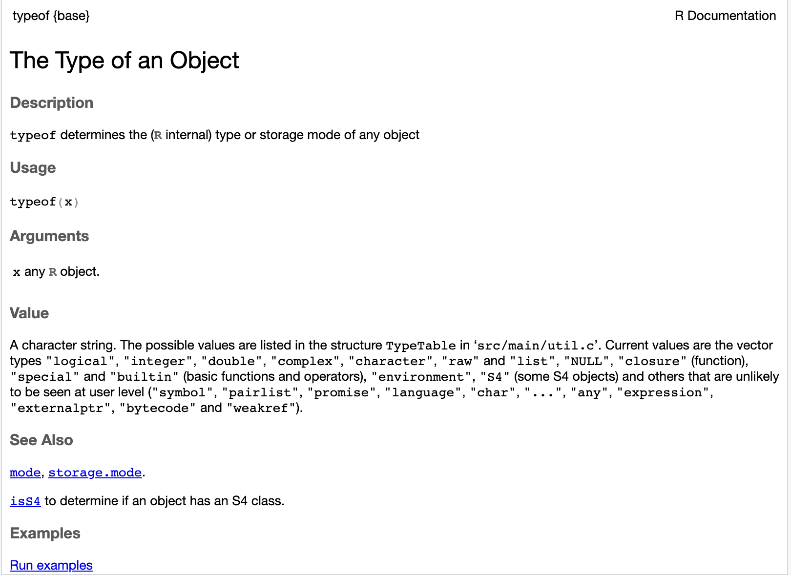

# R Basics IV: Funktionen und Pakete

Wir haben im Laufe der vergangenen Stunden bereits einige Funktionen kennengelernt, zum Beispiel die Ausgabe-Funktion `print()`, die Funktion `c()` zum Erstellen von Vektoren oder die Funktion `paste()` zum Verketten von character-Objekten. 


## Grundlegende Begriffe

```{r, echo=FALSE, message=FALSE, results='asis'}

library(knitr)

begriffe <- c("Aufrufen", "Zurückgeben")
englisch <- c("Call", "Return")
definitionen <- c(
  "Wenn die Anweisungen, die in einer Funktion definiert sind, ausgeführt werden, sagt man, dass die Funktion aufgerufen wird. Beim Aufruf können der Funktion Argumente übergeben werden, also Werte, die für die Parameter aus der Funktionsdefinition eingesetzt werden.",
  "Funktionen haben einen Rückgabewert, das heißt, sie liefern beim Ausführen einen Wert, der das Ergebnis der Funktion darstellt und der weiterverwendet werden kann. Beim Aufruf einiger Funktionen wird nur etwas auf dem Bildschirm ausgegeben. Diese Funktionen haben meist den Rückgabewert `NULL`."
  )  
df <- data.frame(begriffe, englisch, definitionen)
names(df)[1] <- "Begriff"
names(df)[2] <- "Englische Entsprechung"
names(df)[3] <- "Definition (im R-Kontext)"

kable(df)


```


## Was sind Funktionen? 

Funktionen sind wiederverwendbare Abfolgen von Anweisungen. Sie sind also Codeabschnitte, die mithilfe eines Namens wiederholt ausgeführt werden können. Das Prinzip ist also ein bisschen ähnlich wie Variablen, mit dem Unterschied, dass man mithilfe von Funktionsnamen auf Anweisungen zugreifen kann, während man mithilfe von Variablennamen auf Objekte zugreifen kann. Im Grunde sind Funktionsnamen aber auch zugleich Variablennamen, weil in R Funktionen auch Objekte sind (-> Grundbegriffe: alles in R ist ein Objekt). 

Jede Funktion besteht aus vier Komponenten: 

- Name ("name")
- Parameter ("formals": formale Parameter)
- Körper ("body")
- Umgebung ("environemnt")

Funktionen **werden aufgerufen**. Beim Funktionsaufruf werden ihnen **Argumente übergeben**. Welche Argumente eine Funktion annehmen kann, wird in der Funktionsdefinition mithilfe von **formalen Parametern** festgelegt. Für Argumente sagt man deswegen auch manchmal **tatsächliche Parameter**. Funktionen **geben immer einen Wert zurück**, der heißt dann **Rückgabewert**. Der Rückgabewert kann in einer Funktionsdefinition mithilfe des **Schlüsselworts `return`** festgelegt werden.


## Funktionen definieren

**Funktionsdefinitionen** haben in R die allgemeine Form: 

```{r, eval = FALSE}
mache_irgendwas <- function(Parameter_1, Parameter_2, ...) {
  Anweisungsblock
  return(Rückgabewert) 
}

```

Achtung: zwischen dem Schlüsselwort `function` und der runden Klammer steht KEIN Leerzeichen, anders als bei Kontrollstrukturen.

- mache_irgendwas ist der **Funktionsname**. 
- Die Funktions**parameter** heißen Parameter_1 und Parameter_2. Dabei handelt es sich um Variablennamen, die nur innerhalb der Funktionsdefinition verwendet werden und als Platzhalter für die Argumente dienen, die der Funktion beim Funktionsaufruf übergeben werden. Die formalen Parameter sind also ein bisschen ähnlich wie die  Laufvariablen in for-Schleifen, die auch nur Platzhalter für die Elemente aus einem iterierbaren Objekt waren. 
- Genau wie bei Kontrollstrukturen ist auch bei Funktionen der Funktions**körper** alles, was zwischen den geschweiften Klammern steht, also ein Anweisungsblock und eine `return`-Anweisung. Im Anweisungsblock stehen irgendwelche Anweisungen, die irgendetwas mit den Parametern der Funktion machen, also im Grunde Verarbeitungsschritte für die Funktionsparameter. Im Laufe der Verarbeitung wird irgendeine Variable definiert, die das "Endergebnis" der Verarbeitung zwischenspeichert. Diese Variable wird dann mithilfe der return-Anweisung zurückgegeben, wenn die Funktion aufgerufen wird. Die `return`-Anweisung definiert also, welche Variable die Funktion als Rückgabewert beim Funktionsaufruf zurückgeben soll.
- Die Funktions**umgebung** ist in der Funktionsdefinition nicht direkt sichtbar. Funktionsumgebungen lernen wir erst etwas später kennen und ignorieren sie erst einmal.

:::tip
Style Tip

Für Funktionsnamen gelten fast die selben Konventionen wie für Variablennamen: Wickham empfiehlt, Funktionsnamen in Kleinbuchstaben zu schreiben und einen Unterstrich zu verwenden, um mehrere Wörter voneinander abzutrennen. Allerdings sollten Variablennamen immer irgendeine Operation beschreiben, während Variablennamen in der Regel Substantive sind. Dabei kann es sich auch um eine logische Operation handeln: `ist_ungerade()` wäre zum Beispiel ein passender Funktionsname für eine Funktion, die überprüft, ob ihr Argument eine ungerade Zahl ist. 
:::


Ein Beispiel: 

```{r}

increment_value <- function(x) {
  x <- x + 1
  return(x)
}

```

:::task
Verständnisfragen: 

- Was macht die Funktion `increment_value()`?
- Was ist der Körper der Funktion `increment_value()`?
- Was sind die formalen Parameter? 
- Was ist der Rückgabewert?

:::

Anders als in anderen Programmiersprachen kann in R bei einer Funktionsdefinition die `return()`-Anweisung auch weggelassen werden. Dann wird automatisch der Ausdruck als Rückgabewert zurückgegeben, der im Funktionskörper zuletzt evaluiert wurde: 

```{r}
# x + 1 wird "implizit" als Rückgabewert zurückgegeben, wenn die return-Anweisung fehlt
increment_value <- function(x) {
  x + 1
}
```

Am Anfang empfiehlt es sich aber, den Rückgabewert immer  explizit mit `return()` anzugeben. 

Manchmal ist es sinnvoll, bei der Funktionsdefinition einen Default-Wert für einen oder mehrere Parameter anzugeben:  

```{r}
# Funktion mit Default-Wert für einen Parameter
add_values <- function(x, y=10) {
  return(x + y)
}

```

Dieser Default-Wert wird dann beim Funktionsaufruf eingesetzt, falls kein Wert für den Parameter festgelegt wird. 

## Funktionen aufrufen

**Funktionsaufurfe** haben in R die allgemeine Form: 

```{r, eval = FALSE}
mache_irgendwas(Argument_1, Argument_2, ...)
```

Wenn eine Funktion aufgerufen wird, dann werden die formalen Parameter aus der Funktionsdefinition durch die Argumente (also die tatsächlichen Parameter) ersetzt. Die Verarbeitungsschritte, die im Funktionskörper für die formalen Parameter definiert sind, werden dann mit den Argumenten ausgeführt. 

Bisher haben wir bereits oft Funktionen aufgerufen und ihnen Argumente übergeben. Zum Beispiel: 

```{r}

print("Hallo")
tiere <- c("Hund", "Katze")
paste0(tiere[1], "e")
length(tiere)

```

Wenn wir die Funktion `increment_value()`, die wir vorhin definiert haben, aufrufen wollen, gehen wir genauso vor: 

```{r}

increment_value(3)

```

Wenn eine Funktion aufgerufen wird, für deren Parameter in der Funktionsdefinition ein Standardwert festgelegt wurde, dann ist die Angabe eines Werts für diesen Parameter beim Funktionsaufruf optional:  

```{r}

# addiert 2 mit dem Standardwert 10
add_values(2)

# addiert 2 mit 5
add_values(2, 5)

```

:::task
Verständnisfrage: 

- Welche Argumente werden den Funktionen `print()`, `c()`, `paste0()`, `length()`, `increment_value()` und `add_values` jeweils beim Funktionsaufruf übergeben? 

:::


In R sind Funktionen auch Objekte. Das heißt, dass eine Funtion als Argument einer anderen Funktion übergeben werden kann. 


## Funktionen verstehen

Alle Funktionen sind in R gut dokumentiert. Wir haben die offizielle Dokumentation zu einzelnen Funktionen bereits mithilfe des `?`-Operators aufgerufen. Funktionen sind in der R-Dokumentation immer nach demselben Schema dokumentiert: **Description** ist eine kurze Beschreibung davon, was die Funktion macht. Unter **Usage** steht, wir die Funktion aufgerufen werden kann. **Arguments** erläutert, welche Argumente der Funktion beim Funktionsaufruf übergeben werden können, und **Value** beschreibt den Rückgabewert, also welchen Datentyp der Wert hat, der von der Funktion nach der Ausführung aller Anweisungen im Funktionskörper zurückgegeben wird. 



## Wozu werden Funktionen verwendet? 

Allgemein werden Funktionen verwendet... 

- ...um bestimmte Verarbeitungsschritte zu wiederholen, ohne Code ständig kopieren zu müssen.
- ...um den Code weniger fehleranfällig zu machen: Wenn man den Code kopiert, kopiert man auch mögliche Fehler
- ...um den Code effizienter zu machen: Wenn Funktionen verwendet werden, um Schleifen zu ersetzen, macht das den Code effizienter, das heißt, der Computer braucht weniger lange, um dieselben Berechnungen auszuführen


Beispiel: Wir wollen herausfinden, wie oft jedes Wort in den Songtexten eine:r Künstler:in vorkommt. Dazu haben wir uns die folgende for-Schleife ausgedacht: 

```{r}
lyrics <- "My mind won't let me rest Voice in my head I hear what it said I can't trust a thing If I picked up and left How fast did you forget? Resting while I'm inside your presence I don't want to think nothing bad This time I won't This time I won't"

lyrics_vec <- strsplit(lyrics, " ")[[1]]

lyrics_freq <- c()

for (word in lyrics_vec) {
  if (!(word %in% names(lyrics_freq))) { 
    lyrics_freq[word] <- 1
  } else {
    lyrics_freq[word] <- lyrics_freq[word] + 1
  }
}

print(lyrics_freq)

```


:::task
Verständnisfragen: 

- Was macht die Funktion `strsplit()`? Welche Datenstruktur gibt die Funktion als Rückgabewert zurück? Gebt `?strsplit` ein und schaut nach. 
- Was passiert in jedem Schleifendurchlauf?
- Der named vector `lyrics_vec` enthält dasselbe Wort zweimal, wenn es einmal groß- und einmal kleingeschrieben wird, zum Beispiel "My" und "my". In der letzten Stunde haben wir eine Funktion kennengelernt, die alle Großbuchstaben in einem Wort in Kleinbuchstaben umwandelt. Wie hieß die Funktion? Und wie könnten wir die Funktion verwenden, um unsere for-Schleife zu verbessern? 

:::

Um die Arbeitsschritte mit mehreren Liedern auszuführen, sähe unser Code so aus:

```{r eval=FALSE}
lyrics_gc <- "My mind won't let me rest Voice in my head I hear what it said I can't trust a thing If I picked up and left How fast did you forget? Resting while I'm inside your presence I don't want to think nothing bad This time I won't This time I won't"

lyrics_gc_vec<- strsplit(lyrics_gc, " ")[[1]]

lyrics_gc_freq <- c()

for (word in lyrics_gc_vec) {
  if (!(word %in% names(lyrics_gc_freq))) { 
    lyrics_gc_freq[word] <- 1
  } else {
    lyrics_gc_freq[word] <- lyrics_gc_freq[word] + 1
  }
}

print(lyrics_gc_freq)

lyrics_dd <- "I'm dreamin', ay Truth be told I got the hardest ahead, yeah But I said I never let it get to my head I be in space, in a daze, while you tellin me things I see your face but I never really heard you say it Red light, green light, either I'ma go New place, corner store Ain't that close anymore Yeah let me get the greens, I'll be home by four If you wanna pour up, then I need me a four"

lyrics_dd_vec <- strsplit(lyrics_dd, " ")[[1]]

lyrics_dd_freq <- c()

for (word in lyrics_dd_vec) {
  if (!(word %in% names(lyrics_dd_freq))) { 
    lyrics_dd_freq[word] <- 1
  } else {
    lyrics_dd_freq[word] <- lyrics_dd_freq[word] + 1
  }
}

print(lyrics_dd_freq)

```


In der Lösung oben haben wir die for-Schleife einfach kopiert und manuell die Variable `lyrics_gc` durch die Variable `lyrics_dd` ersetzt. Das geht bei zwei verschiedenen Liedtexten zwar noch, aber was, wenn wir drei, fünf oder zehn verschiedene Liedtexte haben? Dann produzieren wir extrem viel unnötigen und unübersichtlichen Code, der vielleicht auch noch drei, fünf oder zehnmal denselben Fehler enthält. Eine bessere Lösung ist deswegen hier die Verwendung einer Funktion: die for-Schleife kann damit für alle Liedtexte, die in R als character repräsentiert werden, verallgemeinert werden:

```{r}

lyrics_to_frequencies <- function(lyrics) {
  lyrics_vec <- strsplit(lyrics, " ")[[1]]

  lyrics_freq <- c()

  for (word in lyrics_vec) {
    if (!(word %in% names(lyrics_freq))) { 
      lyrics_freq[word] <- 1
    } else {
      lyrics_freq[word] <- lyrics_freq[word] + 1
    }
  }
  return(lyrics_freq)
}

```

Die Funktion kann dann mit wechselndem Input aufgerufen werden: 

```{r}
lyrics_gc <- "My mind won't let me rest Voice in my head I hear what it said I can't trust a thing If I picked up and left How fast did you forget? Resting while I'm inside your presence I don't want to think nothing bad This time I won't This time I won't"
lyrics_dd <- "I'm dreamin', ay Truth be told I got the hardest ahead, yeah But I said I never let it get to my head I be in space, in a daze, while you tellin me things I see your face but I never really heard you say it Red light, green light, either I'ma go New place, corner store Ain't that close anymore Yeah let me get the greens, I'll be home by four If you wanna pour up, then I need me a four"

lyrics_gc_freq <- lyrics_to_frequencies(lyrics_gc)
lyrics_dd_freq <- lyrics_to_frequencies(lyrics_dd)
print(lyrics_gc_freq)
print(lyrics_dd_freq)
```


:::task
Verständnisfrage: 

- Angenommen, wir wollen die Funktion `lyrics_to_frequencies()` auf 20 verschiedene Liedtexte anwenden. Dann würden wir den Funktionsaufruf zwanzig Mal kopieren. Dieses Vorgehen ist nicht schön, denn so können sich wieder Fehler einschleichen. Wie könnte man das Problem lösen? Welches Vorgehen wäre eleganter?  
:::


## Schleifen ersetzen mithilfe von Funktionen 

Am Ende der letzten Einheit habe ich bereits darauf hingewiesen, dass Schleifen in R viel weniger verwendet werden als in anderen Programmiersprachen. Das liegt daran, dass Schleifen in R oft durch Funktionen ersetzt werden, die im Allgemeinen effizienter sind als Schleifen. Das Prinzip, das das ermöglicht, haben wir bereits kennengelernt: Es heißt "Vektorisierung" und beschreibt einen Mechanismus, bei dem Operationen direkt auf alle Elemente eines Vektors angewandt weren.

:::tip
Vektorisierte Funktionen

Man sagt, dass eine Funktion "vektorisiert" ist, wenn eine Funktion in der Lage ist, direkt einen Vektor oder ein Objekt mit einer anderen Datenstruktur zu bearbeiten. Anders formuliert: Vektorisierte Funktionen können elementweise Operationen auf Vektoren durchführen. Solche Funktionen nehmen einen Vektor oder eben eine andere Datenstruktur als Argumente an und geben als Rückgabewert oft ein Objekt mit derselben Datenstruktur zurück.

:::

Tatsächlich haben wir bereits eine Funktion kennengelernt, welche auf Vektorisierung zurückgreift, um genau das zu machen, was wir in unserem Beispiel mit den Liedtexten mühsam mithilfe einer for-Schleife und später mithilfe unserer selbst definierten Funktion `lyrics_to_frequencies()` erreicht haben: die `table()`-Funktion. 

```{r}
lyrics <- "My mind won't let me rest Voice in my head I hear what it said I can't trust a thing If I picked up and left How fast did you forget? Resting while I'm inside your presence I don't want to think nothing bad This time I won't This time I won't"

lyrics_vec <- strsplit(lyrics, " ")[[1]]

lyrics_freq <- table(lyrics_vec)
print(lyrics_freq)

```

Zur Erinnerung: Die `table()`-Funktion wandelt ihr Argument zunächst automatisch in einen Faktor um und erstellt daraus eine Häufigkeitstabelle.

Auch andere for-Schleifen aus der letzten Stunde können durch eine Funktion ersetzt werden. Am Ende der letzten Stunde haben wir uns beispielsweise die folgende for-Schleife angesehen, welche eine Änderung an den Elementen eines Vektors `tiere` vornimmt und die geänderten Werte einem neuen Vektor `tiere_neu` zuweist: 

```{r}
tiere <- c("Hund", "Elefant", "Igel", "Katze")
tiere_neu <- c() # leeren Vektor erstellen

for (i in seq_along(tiere)) {
  tier <- tiere[i]
  if (tier == "Hund") {
    tier <- tolower(tier)
  } else {
    tier <- toupper(tier)
  }
  # Wert der Variable tier als neues Element dem Vektor tiere_neu hinzufügen
  tiere_neu <- c(tiere_neu, tier)
}

print(tiere_neu)

```

Dasselbe kann mithilfe der Funktion `ifelse()` in einer einzigen Zeile erreicht werden: 

```{r}
tiere <- c("Hund", "Elefant", "Igel", "Katze")
tiere_neu <- ifelse(tiere == "Hund", tolower(tiere), toupper(tiere))
```

Die Funktion `ifelse()` greift genau wie die `table()`-Funktion unter der Motorhaube auf Vektorisierung zurück: Wenn der Ausdruck `tiere == "Hund"` ausgewertet wird, wird ein Vektor erstellt, dessen Elemente den Wert `TRUE` für jedes Element im Vektor `tiere`, das dem Wert `"Hund"` entspricht, hat, und `FALSE` sonst. Der zweite Parameter der Funktion `ifelse`, in unserem Fall `tolower(tiere)`, legt fest, was mit den Elementen, für die Vergleichsoperation zu `TRUE` evaluiert wurde, passieren soll. Der dritte Parameter (`toupper(tiere)`) legt fest, was mit den Elementen, die zu `FALSE` ausgewertet wurden, passieren soll. 

Auch unsere for-Schleife zur Erstellung eines Vektors mit langen Wörtern können wir ersetzen, indem wir die Funktion `nchar()` vektorisiert wird, also indem ihr ein Vektor als Argument übergeben wird. Anstelle mithilfe einer if-Anweisung zu überprüfen, ob die Zeichenanzahl eines Wortes im Vektor `woerter` größer als 20 ist, wird die Funktion `which()` verwendet. Diese Funktion kann ebenfalls vektorisiert werden, also mit einem Vektor als Argument aufgerufen werden. Ihr Rückgabewert ist ein Vektor mit den Indizes der Elemente, für die der Ausdruck `wortlaengen > 20` zu `TRUE` evaluiert wurde.   

```{r}
woerter <- c("Netzwerkdurchsetzungsgesetz", "Abfallverzeichnisverordnung", "Haftpflichtversicherung", "Antivirenprogramm")
wortlaengen <- nchar(woerter)
indizes <- which(wortlaengen > 20)
lange_woerter <- wortlaengen[indizes]
names(lange_woerter) <- woerter[indizes]
lange_woerter

```


:::tip
Pro Tipp

Viele Funktionen nehmen nicht nur Vektoren als Argumente an, sondern auch Listen oder andere Datenstrukturen. Welchen Datentyp oder welche Datenstruktur ein Objekt haben muss, damit eine Funktion auf das Objekt angewendet werden kann, erfahrt ihr in der Funktionsdokumentation unter "Arguments" in den R Hilfeseiten. 
:::


Die Möglichkeit, in vielen Fällen for-Schleifen durch Funktionen, die Vektoren oder andere Datenstrukturen als Argumente annehmen, zu ersetzen, macht R Code häufig kürzer und in vielen Fällen auch effizienter als zum Beispiel Python Code. Am Anfang kann dieser Vorteil aber vor allem verwirren. Deswegen ist es besonders am Anfang komplett in Ordnung und sogar empfehlenswert, erst einmal Schleifen zu verwenden, und diese erst später durch eine geeignete Funktion auszutauschen. Durch das Erstellen der Schleife könnt ihr euch besser in die Aufgabe und die notwendigen Verarbeitungsschritte zur Lösung der Aufgabe eindenken. 


### Die Apply-Funktionen  

Nicht jede Funktion kann allerdings vektorisiert werden, also nicht jede Funktion nimmt einen Vektor oder eine andere Datenstruktur als Argument an. In diesem Fall können spezielle Funktionen verwendet werden, die eine andere Funktion und einen Vektor oder eine Liste als Argument annehmen und diese Funktion auf jedes Element des Vektors (oder der Liste) anwenden. 

Diese Funktionen heißen `lapply()`, `sapply()`, `vapply()` und `mapply()`. 

:::task
Verständnisfrage: 

- Was ist der Unterschied zwischen den verschiedenen Apply-Funktionen? Sucht nach den Funktionen in den R-Hilfeseiten und vergleicht Argumente und Rückgabewerte der Funktionen.

:::

Ein Beispiel: Angenommen, wir hätten die folgende (fragwürdige) Funktion definiert, die erkennen soll, ob eine Stadt in Deutschland eine Großstadt ist und eine entsprechende Nachricht zurückgibt.  

```{r}

ist_grossstadt <- function(stadt) {
  grossstaedte <- c("Berlin", "Hamburg", "Frankfurt", "München")
  if (stadt %in% grossstaedte) {
    return(paste(stadt, "ist eine Großstadt"))
  } else {
    return(paste(stadt, "ist keine Großstadt"))
  }
}

```

Die Funktion ist so definiert, dass sie nur auf einzelne Zeichenketten angewandt werden kann, nicht auf character-Vektoren. Beim Versuch, die Funktion mit einem Vektor als Argument auszuführen, wird eine Fehlermeldung ausgegeben. 

```{r error=TRUE}
ist_grossstadt(c("Berlin", "Bremen")) # produziert Fehlermeldung

```
```{r}
ist_grossstadt("Berlin")
```

Um die Funktion trotzdem auf einen Vektor anzuwenden, kann die Funktion `lapply()` eingesetzt werden: 

```{r}
lapply(c("Berlin", "Bremen"), ist_grossstadt)

```

Im Fall unserer Beispielfunktion `ist_grosstadt()` wäre es natürlich auch möglich (und eleganter), die Funktion direkt so zu definieren, dass sie auch auf Vektoren angewandt werden kann. Aber das ist nicht immer so einfach möglich. 

```{r}
ist_grossstadt <- function(stadt) {
  grossstaedte <- c("Berlin", "Hamburg", "Frankfurt", "München")
  rueckgabewert <- stadt %in% grossstaedte
  return(rueckgabewert)
}

ist_grossstadt(c("Berlin", "Bremen"))

```

:::task
Verständnisfrage: 

- Warum kann die Funktion `ist_grossstadt()` auch auf Vektoren angewandt werden, wenn der Ausdruck `stadt %in% grossstaedte` außerhalb einer if-Anweisung evaluiert wird? Was ist anders, wenn der Ausdruck Teil einer if-Anweisung ist?

:::

## Gültigkeit der Funktionsargumente überprüfen 

In den Beispielfunktionen, die wir uns bisher angesehen haben, haben wir immer angenommen, dass ein gültiger Wert als Argument übergeben wird. Beim Versuch, die `ist_grossstadt()`-Funktion auf einen Vektor anzuwenden haben wir aber gesehen, dass beim Ausführen einer Funktion mit ungültigen Argumenten Fehler entstehen können.

Deswegen ist es oft sinnvoll, im Funktionskörper zu überprüfen, ob die gewählten Argumente gültig sind. Wenn dies nicht der Fall ist, kann eine spezielle Funktion mit dem Namen `stop()` verwendet werden, um die Ausführung der Funktion abzubrechen und eine Fehlermeldung auszugeben: 

```{r error=TRUE}

ist_grossstadt <- function(stadt) {
  grossstaedte <- c("Berlin", "Hamburg", "Frankfurt", "München")
  if (is.character(stadt)) {
    rueckgabewert <- stadt %in% grossstaedte
  } else {
    stop("Ungültiges Argument: Keine Zeichenkette")
  }
  return(rueckgabewert)
}

ist_grossstadt(c(1, 2))

```


## Funktionsumgebung und Sichtbarkeitsbereich von Variablen

Wenn wir Variablen erstellt haben, sind wir immer davon ausgegangen, dass diese im gesammten Programm mithilfe des Namens abrufbar sind. Wenn wir selbst eine Funktion definieren, und dabei eine Variable erstellen, dann ist die Variable im restlichen Programm jedoch im Normalfall nicht abrufbar, sie "existiert" sozusagen nur in der Funktion und ist im restlichen Programm nicht sichtbar.

Ein Beispiel: 

```{r}
x <- 1
y <- 2
beispiel <- function() {
  x <- 4
  y <- 5
  return(c(x, y))
}
```

Beim Funktionsaufruf werden die Variablen `x` und `y` aus dem Funktionskörper zurückgegeben:

```{r}
beispiel()
```

Aber die Variablen `x` und `y` aus dem Funktionskörper können nicht unabhängig von der Funktion abgerufen werden. Sie existieren nur in der Funktion selbst: 

```{r}
print(c(x, y))
```

Für Variablen, die innerhalb einer Funktion definiert sind, sagt man deswegen auch "lokale Variablen" und für Variablen, die außerhalb von Funktionen definiert sind, "globale Variablen".  

Aber Achtung: Wenn im Funktionskörper eine Variable verwendet wird, für die im Funktionskörper oder beim Funktionsaufruf kein Wert festgelegt wird, dann wird beim Funktionsaufruf außerhalb der Funktion nach dieser Variable gesucht: 

```{r}
x <- 2
beispiel <- function() {
  y <- 1
  return(c(x, y))
}
beispiel()
```

Der Bereich "außerhalb der Funktion" ist im Grunde genau das, was wir eingangs "Funktionsumgebung" genannt haben. In diesem Beispiel wird in der Funktionsdefinition nur eine lokale Variable `y` definiert. Wenn die Funktion `beispiel()` später aufgerufen wird, sucht R nach einer Definition für `x`. Da in der Funktion keine lokale Variable `x` definiert wurde, sucht R in der Funktionsumgebung (die in diesem Fall die globale Umgebung ist, wo die Funktion definiert wurde) und findet die globale Variable `x`.

Wenn der Wert der Variable `x` sich im Programmverlauf ändert, dann wird beim Funktionsaufruf der Wert eingesetzt, den die Variable zum Zeitpunkt des Funktionsaufrufs angenommen hat: 

```{r}
x <- 4
beispiel()
x <- 6 
beispiel()
```

## Was sind Pakete?


> "An R package is a collection of functions, data, and documentation that extends the capabilities of base R." (Wickham 2017)

Mit "base R" sind alle in R vordefinierten Funktionen, Datentypen und  -strukturen, Operatoren, etc. gemeint. 

Pakete (engl. Packages) werden also verwendet, um auf bestimmte Funktionalitäten zuzugreifen, die in R nicht vordefiniert sind und die andere R-Nutzer:innen definiert und veröffentlicht haben. Um darauf zuzugreifen, müssen R Pakete zuerst installiert und danach geladen werden. 

Die Funktionen, die wir bisher kennengelernt haben, waren alle in R vordefiniert. Wir mussten deswegen kein Paket installieren und laden, um sie zu nutzen. In den R Dokumentationsseiten kann man in R vordefinierte Funktionen daran erkennen, dass neben dem Funktionsnamen in der linken oberen Ecke der Dokumentationsseite das Wort "base" steht. Das steht für "base R", es handelt sich also um eine R-Basisfunktion. Bei Funktionen aus Paketen steht dort entsprechend der Paketname. 


## Pakete installieren

R Pakete können mithilfe der Funktion `install.packages()` installiert werden. Die Funktion nimmt entweder einen einzelnen Paketnamen als Argument oder einen character-Vektor, der mehrere Paketnamen enthält.

```{r eval=FALSE}
# Paket installieren
install.packages("quanteda")
# mehrere Pakete gleichzeitig installieren
install.packages(c("quanteda", "readtext"))
```

```{r echo=FALSE, results=FALSE, message=FALSE, warning=FALSE}
install.packages("quanteda", repos = "http://cran.us.r-project.org")
install.packages("readtext", repos = "http://cran.us.r-project.org")

```

Achtung: Manchmal wird auf der Konsole (RStudio Fenster R Console) bei der Installation von Paketen eine Meldung der Art "Do you want to install from sources the package which needs compilation? (Yes/no/cancel)" ausgegeben. In diesem Fall müsst ihr einfach no eingeben und auf Enter drücken. 

## Pakete laden

Installierte Pakete müssen immer am Anfang eines R Skripts geladen werden, bevor sie verwendet werden können: 

```{r warning=FALSE, message=FALSE}
library(quanteda)
library(readtext)
```


## Wozu werden Pakete verwendet? 

R Pakete werden wir im Rahmen dieses Seminars vor allem dazu verwenden, um auf **zusätzliche Funktionen** zuzugreifen, die in R nicht vordefiniert sind, die also nicht zu den R-Basisfunktionen gehören. 

Das Paket quanteda, das wir vorhin installiert haben, bietet zum Beispiel eine Funktion, die character, die aus mehreren Wörtern bestehen, automatisch in sogenannte Tokens umwandelt (was das ist, lernen wir in der Sitzung zur Textanalyse): 

```{r echo=FALSE, results=FALSE, message=FALSE, warning=FALSE}
quanteda_options(print_tokens_max_ntoken=100)
```

```{r}
lyrics <- "My mind won't let me rest Voice in my head I hear what it said I can't trust a thing If I picked up and left How fast did you forget? Resting while I'm inside your presence I don't want to think nothing bad This time I won't This time I won't"

# Funktionsaufruf der Funktion tokens() aus dem Paket quanteda. Die beiden Doppelpunkte kennzeichnen, dass die Funktion tokens() aus dem Paket quanteda gemeint ist, und nicht irgendeine andere Funktion aus einem anderen Paket, die vielleicht zufällig denselben Namen hat.
lyrics_toks <- quanteda::tokens(lyrics)
print(lyrics_toks)
```

:::task
Verständnisfrage: 

- Im Kapitel 4.5 haben wir die Funktion `strsplit()` verwendet, um den Songtext `lyrics` in seine Bestandteile aufzuteilen. Dabei haben wir das Leerzeichen als Trennzeichen zwischen den Wörtern festgelegt. Dadurch wurden Satzzeichen allerdings nicht als einzelne Zeichen erkannt, zum Beispiel bei "forget?". Wie teilt die Funktion `tokens()` den Songtext auf? Welche Bestandteile werden dabei erkannt?

:::

Pakete können aber zum Beispiel auch **zusätzliche Datenstrukturen** enthalten. Die quanteda-`tokens()`-Funktion, die wir gerade ausgetestet haben, erstellt beispielsweise ein sogenanntes "tokens"-Objekt (schauen wir uns noch an):

```{r}
typeof(lyrics_toks)
class(lyrics_toks)

```

Ein Paket, das keine zusätzliche Datenstruktur, sondern einen **zusätzlichen Operator** zur Verfügung stellt, ist daneben das Paket magrittr.

Dieses Paket ermöglicht es, den sogenannten **Pipe-Operator** zu verwenden. Der Pipe-Operator kann verwendet werden, um mehrere Funktionsaufrufe miteinander zu verketten. Wenn dasselbe Objekt nacheinander durch verschiedene Funktionen bearbeitet wird, wäre ohne den Pipe-Operator entweder eine Folge von Anweisungen der folgenden Art notwendig: 

```{r}
satz <- "Hallo, wie geht es dir"
satz <- paste0(satz, "?")
woerter <- strsplit(satz, " ")

```

Oder verschachtelte Funktionsaufrufe der Art: 

```{r}

satz <- "Hallo, wie geht es dir"
woerter <- strsplit(paste0(satz, "?"), " ")

```

Mit dem Pipe-Operator können solche aufeinanderfolgenden oder verschachtelten Funktionsaufrufe vereinfacht werden. Um den Operator zu verwenden, muss zunächst das Paket magrittr installiert und geladen werden: 

```{r eval=FALSE}
install.packages("magrittr")
```

```{r echo=FALSE, results=FALSE, message=FALSE, warning=FALSE}
install.packages("magrittr", repos = "http://cran.us.r-project.org")
```

```{r message=FALSE, warning=FALSE}
library(magrittr)
```

Jetzt kann der Pipe-Operator verwendet werden: 

```{r}
satz <- "Hallo, wie geht es dir"

woerter <- satz %>%
  paste0("?") %>%
  strsplit(" ")

```


Der Ausdruck `x %>% f` ist also äquivalent zu `f(x)`. Der Pipe-Operator ist in R sehr weit verbreitet und wir werden immer wieder darauf zurückgreifen. Ihr solltet euch erst einmal nur merken, dass der Pipe-Operator ein zusätzlicher Operator ist, der ermöglicht, Funktionsaufrufe zu verketten. 

:::tip
Das Tidyverse

Verschiedene R Pakete folgen verschiedenen Philosophien oder Designprinzipien, wie guter Code aussehen sollte, und welche Datenstrukturen für welche Aufgaben verwendet werden sollten. Deswegen sind Pakete, die denselben Prinzipien folgen und dieselben Datenstrukturen verwenden untereinander kompatibler und Code, der mithilfe von Funktionen aus verschiedenen Paketen geschrieben ist, unterscheidet sich mitunter stark von Code, der nur R-Basisfunktionen nutzt.  

Das sogenannte [Tidyverse](https://www.tidyverse.org/) ist eine Sammlung von R Paketen, die alle denselben Designprinzipien folgen und dieselben Datenstrukturen verwenden. Auch das Paket `magrittr` ist Teil des Tidyverse. Innerhalb des Tidyverse wird stets der Pipe-Operator verwendet, um Funktionsaufrufe zu verketten, und es gibt für viele R Base Funktionen eigene Tidyverse-Funktionen, die dasselbe machen, aber auf eine Weise, die mit den Prinzipien des Tidyverse übereinstimmt. Beispielsweise gibt es im Tidyverse anstelle der apply-Funktionen eine Reihe von Tidyverse-Funktionen, die genau wie die apply-Funktionen nicht vektorisierte Funktionen vektorisieren (die map-Funktionen). Wir werden in diesem Seminar nicht das gesamte Tidyverse behandeln, aber später werden wir die beiden Tidyverse-Pakete `ggplot2` und `stringr` kennenlernen. 
:::

Zuletzt solltet ihr wissen, dass manche Pakete sogar komplette **Datensätze oder Korpora** (lernen wir noch) enthalten, die zusammen mit dem Rest des Pakets heruntergeladen werden. 

Quanteda stellt beispielsweise zu Testzwecken ein komplettes Korpus aus Reden von US-Präsidenten zur Verfügung: 

```{r}
# Einen Datensatz kann man laden, indem man einfach den Namen des Datensatzes eingibt. Die Funktion head() gibt die ersten fünf Zeilen eines Dataframes aus. Die Funktion summary() gibt einen Dataframe mit Metadaten zu einem bestimmten Objekt zurück. Wenn Funktionsaufrufe verschachtelt werden, wird immer zuerst die innere Funktion ausgeführt, und dann die äußere.
head(summary(quanteda::data_corpus_inaugural))

```

:::tip
Style Tip

Wickham empfiehlt, im Code zwischen R base-Funktionen und Funktionen aus Paketen zu unterscheiden, indem beim Aufruf von Funktionen aus Paketen der Name des Pakets mitgenannt wird, also: 

`quanteda::tokens("Dieser Satz soll in Tokens zerlegt werden")`

statt nur:

`tokens("Dieser Satz soll in Tokens zerlegt werden")` 

:::


## Welche Pakete gibt es denn alles? 

Wenn ihr nach einer bestimmten Funktionalität sucht, dann empfiehlt es sich, zunächst auf der Seite [https://rdrr.io/](https://rdrr.io/) nach einem Stichwort zu suchen. Diese Seite durchsucht verschiedene Online-Plattformen, auf denen R Nutzer:innen ihre Pakete veröffentlicht haben. Die offizielle Veröffentlichungsplattform für R Pakete heißt CRAN. Die Funktion `install.packages()` installiert deswegen per Default nur Pakete, die über CRAN veröffentlicht wurden.  

Wir haben ja vorhin eine Funktion increment_value() definiert, die zu einer beliebigen Zahl 1 addiert. Diese Operation nennt man auch "Inkrementieren".
Das Inkrementieren ist eine Operation, die sehr viele Menschen sehr oft verwenden. Wir können uns deswegen sicher sein, dass schon ein:e ander:e R Nutzer:in diese Funktion definiert hat und im Rahmen von einem R Paket veröffentlicht hat. Und tatsächlich: Wenn wir auf [https://rdrr.io/](https://rdrr.io/) nach "increment" suchen, werden direkt mehrere Pakete vorgeschlagen, die eine "increment"-Funktion enthalten. Es haben also schon einige R Nutzer:innen Inkrementierungsfunktionen definiert und im Rahmen von Paketen anderen Nutzer:innen bereitgestellt. Die increment_value()-Funktion von vorhin würden wir also in der Praxis eigentlich nicht selbst defnieren, sondern stattdessen aus einem Paket installieren. 

Zu den meisten Paketen gibt es eigene Dokumentationsseiten, die von den R Nutzer:innen gepflegt werden, die die Pakete entwickelt haben. Um zu verstehen, welche Funktionalitäten ein bestimmtes Paket zur Verfügung stellt, solltet ihr euch die Dokumentationsseiten zu dem Paket durchlesen.

- Dokumentationsseiten zum Paket quanteda: [https://quanteda.io/](https://quanteda.io/)
- Dokumentationsseiten zum Paket magrittr:  [https://magrittr.tidyverse.org/](https://magrittr.tidyverse.org/)

Unter dem Menüpunkt "Reference" auf den quanteda-Seiten findet ihr zum Beispiel eine Liste aller Datensätze und Funktionen, welche das Paket zur Verfügung stellt. 

:::tip
Dependencies

Fast alle R Pakete nutzen selbst Funktionen aus anderen Paketen. Zum Beispiel gibt es auch außerhalb des Tidyverse Pakete, welche in ihren Funktionsdefinitionen den  Pipe-Operator verwenden und dazu auf das `magrittr`-Paket zurückgreifen. Wenn ein Paket A auf Funktionalitäten aus einem anderen Paket B zurückgreift, dann nennt man das Paket B eine "Dependency" von Paket A. Wenn ihr ein Paket installiert, wird deswegen oft automatisch eine Reihe weiterer Pakete installiert. Das sind die Dependencies des Pakets, das ihr installieren wollt.  
:::

## Quellen {-}

* Venables, W.N. and Smith, D.M. and the R Core Team. An Introduction to R, [https://cran.r-project.org/doc/manuals/r-release/R-intro.pdf](https://cran.r-project.org/doc/manuals/r-release/R-intro.pdf)
* Wickham, Hadley. The Tidyverse Style Guide, [https://style.tidyverse.org/](https://style.tidyverse.org/)
* Riepl, Wolf. R-Code beschleunigen: Schleifen vs. Vektorisierung vs. Lookup-Tables, [https://statistik-dresden.de/archives/15332](https://statistik-dresden.de/archives/15332)
* Wickham, Hadley and Grolemund, Garrett (2017). R for Data Science: Functions, [https://r4ds.had.co.nz/functions.html](https://r4ds.had.co.nz/functions.html)
* Wickham, Hadley. Advanced R. Chapter 6: Functions. Function Components, [https://adv-r.hadley.nz/functions.html#fun-components](https://adv-r.hadley.nz/functions.html#fun-components)
* Wickham, Hadley. Advanced R. Chapter 6: Functions. Lexical Scoping, [https://adv-r.hadley.nz/functions.html#lexical-scoping](https://adv-r.hadley.nz/functions.html#lexical-scoping)
* Wickham, Hadley and Grolemund, Garrett (2017). R for Data Science: Iteration. The Map Functions, [https://r4ds.had.co.nz/iteration.html#the-map-functions](https://r4ds.had.co.nz/iteration.html#the-map-functions)
* Wickham, Hadley (2019). Advanced R. Ch. 7.4.2: The Function Environment,  https://adv-r.hadley.nz/environments.html#function-environments
* Benoit, Kenneth and Watanabe, Kohei. Quanteda 4.0.0: Reference, [https://quanteda.io/reference/index.html](https://quanteda.io/reference/index.html)
* Benoit, Kenneth and Watanabe, Kohei. Quanteda: Quantitative Analysis of Textual Data, [https://quanteda.io](https://quanteda.io)
* Wickham, Hadley and Grolemund, Garrett (2017). R for Data Science: Pipes, [https://r4ds.had.co.nz/pipes.html](https://r4ds.had.co.nz/pipes.html)
* Bache, Stefan Milton and Wickham, Hadley. Magrittr 2.0.3 Dokumentation, [https://magrittr.tidyverse.org/](https://magrittr.tidyverse.org/)