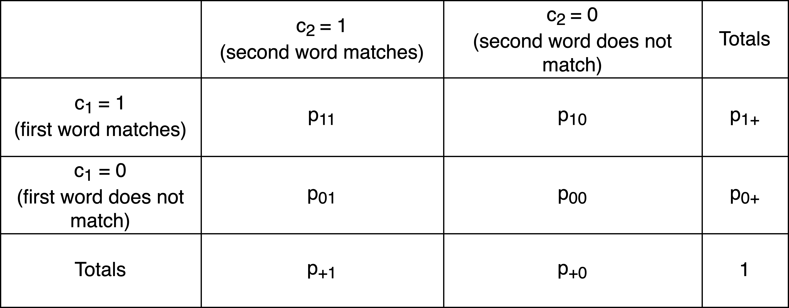
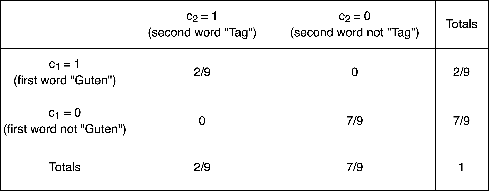

```{r setup, include=FALSE}
options(width = 9999)
```

# Textanalyse III: Wortfrequenzanalysen

Die Konstruktion von Geschlecht und Geschlechterrollen in europäischen Märchen wird seit den 1970er Jahren in zahlreichen Forschungsarbeiten untersucht (zum Beispiel von [Marcia Lieberman 1972](https://www.jstor.org/stable/375142), [Alessandra Levorato 2003](https://doi.org/10.1057/9780230503878), [Simone Loleit und Liliane Schüller 2022](https://doi.org/10.1515/9783110726404-005)). In den letzten beiden Jahrzehnten sind Märchen auch zum Gegenstand von Arbeiten aus den Digital Humanities geworden (so z.B. in den Arbeiten von [Saif Mohammad 2011](https://aclanthology.org/W11-1514.pdf), [Mark Finlayson 2012](http://hdl.handle.net/1721.1/71284), [Berenike Herrmann und Jana Lüdtke 2023](https://doi.org/10.17175/2023_005)). Eine Reihe von Digital Humanities Arbeiten haben sich explizit Geschlecht und Geschlechterrollen in Märchen gewidmet, so zum Beispiel: 

* Toro Isaza, Paulina et al. (2023). [*Are Fairy Tales Fair? Analyzing Gender Bias in Temporal Narrative Event Chains of Children's Fairy Tales*](
https://doi.org/10.48550/arXiv.2305.16641), in: Proceedings of the 61st Annual Meeting of the Association for Computational Linguistics 1: Long Papers, pp. 6509-6531.
* Jorgensen, Jeana (2019). [*The Most Beautiful of All: A Quantitative Approach to Fairy-Tale Femininity*](https://works.bepress.com/jeana_jorgensen/29/), in: Journal of American Folklore 132 (523), pp. 36-60.
* Weingart, Scott and Jorgensen, Jeana (2013). [*Computational Analysis of the Body in European Fairy Tales*](http://dx.doi.org/10.1093/llc/fqs015), in: Literary and Linguistic Computing 28 (1), pp. 404-416.

In den nächsten beiden Wochen werden wir ein Korpus von Kinder- und Hausmärchen der Gebrüder Grimm aus dem Jahr 1857 im Hinblick auf die Darstellung verschiedener Märchencharaktere untersuchen. Dabei werden wir verschiedene Analysemethoden kennenlernen und kritisch beleuchten, inwieweit diese Methoden uns helfen können, bestimmte Muster in der Beschreibung von Märchencharakteren zu identifizieren. In diesem Kapitel werden wir zunächst Worthäufigkeiten und das gemeinsame Vorkommen verschiedener Wörter unabhängig von der Beziehung der Wörter zueinander betrachten. Wir werden dabei kritisch beleuchten, was die vorgestellten  Analysemethoden leisten können und was nicht. Im Kapitel 9 werden wir dann konkreten Fragen nachgehen: Welche Charaktere kommen in den Märchen vor? Mit welchen Adjektiven werden diese beschrieben? Welche Verben werden mit ihnen assoziiert? 

:::task
Verständnisfragen:

- Welche theoretischen Annahmen liegen unserer Forschungsfrage zugrunde? 
- Wie wird die Fragestellung im Folgenden operationalisiert?

:::

## Märchenkorpus einlesen und Pakete installieren

Um unser Korpus in R einzulesen, müssen wir zuerst wieder das **Arbeitsverzeichnis setzen**: 

```{r eval=FALSE}
# Arbeitsverzeichnis setzen: Setzt hier euren eigenen Pfad ein
setwd("/Users/gast/R-Seminar") 
# Backslashes für Windows:
# setwd("C:\Users\gast\R-Seminar")

```

Wie bereits vergangene Woche erläutert kann das Arbeitsverzeichnis auch über den Tab "Files" im Fenster unten rechts gesetzt werden. Navigiert euch dazu erst in den gewünschten Ordner, klickt dann auf "More" und "Set As Working Directory" (siehe Kapitel "Orientierung im RStudio"). Wählt dabei den Ordner als Arbeitsverzeichnis, in dem ihr den Ordner maerchen_alle gespeichert habt. Achtung: Zip-Ordner müsst ihr vorher entpacken!

Wenn ihr das Arbeitsverzeichnis gesetzt habt, könnt ihr die **Dateien einlesen**. Wir werden ganz am Ende unserer Analyse die Grimm-Märchen in der siebten Edition von 1857 mit den Märchen aus der ersten Edition von 1812/15 vergleichen, um einen möglichen Wandel über die Zeit zu identifizieren. 

```{r eval=FALSE}
library(readtext)

# Märchen von 1857 und 1812/15 einlesen und Informationen aus dem Dateinamen extrahieren
maerchen_alle <- readtext("maerchen_alle/*.txt", docvarsfrom = "filenames", dvsep = "_", docvarnames = c("Titel", "Jahr"), encoding = "UTF-8")
```

```{r echo=FALSE, results=FALSE, message=FALSE, warning=FALSE}
library(readtext)
maerchen_alle <- readtext("data/maerchen_alle/*.txt", docvarsfrom = "filenames", dvsep = "_", docvarnames = c("Titel", "Jahr"), encoding = "UTF-8")
```

Bevor wir mit der Analyse starten können, müssen wir noch einige Pakete installieren, die wir brauchen werden: 

```{r eval=FALSE}

install.packages(c("quanteda.textplots", "quanteda.textstats", "ggplot2", "plotly", "udpipe", "dplyr"))

```

```{r echo=FALSE, results=FALSE, message=FALSE, warning=FALSE, eval=FALSE}
# remove eval=FALSE and run this when rebuilding the site
install.packages(c("quanteda.textplots", "quanteda.textstats", "ggplot2", "plotly", "udpipe", "dplyr"), repos = "http://cran.us.r-project.org")
```

Die Pakete müssen wie bisher immer nur einmal am Anfang des Skripts geladen werden. Allerdings werden wir in den folgenden Abschnitten Funktionen aus vielen verschiedenen Paketen verwenden. **Deswegen werden wir in diesem Kapitel ausnahmsweise Pakete erst dann laden, wenn sie gebraucht werden, sodass ihr in jeder Codezelle direkt erkennt, ob der Code Funktionen aus zusätzlichen Paketen enthält.** 


## Corpus-Objekt erstellen und erste Preprocessingschritte

Wir werden in der Analyse verschiedene Methoden einmal auf das Korpus mit und einmal ohne Stoppwörter anwenden, denn je nach Fragestellung und Methode sind Stoppwörter mehr oder weniger interessant. Deswegen erstellen wir in diesem Abschnitt zwei verschiedene tokens-Objekte. Wir werden aber auch sehen, dass Textanalyse und Preprocessing eigentlich iterative Prozesse sind: Es kommt oft vor, dass bei der Analyse weitere Preprocessingschritte notwendig werden.

```{r warning=FALSE, message=FALSE}
library(quanteda)

# Quanteda-corpus-Objekt erstellen
maerchen_corpus_alle <- corpus(maerchen_alle) 

# Teilkorpus extrahieren
maerchen_corpus <- corpus_subset(maerchen_corpus_alle, Jahr == 1857)

# Quanteda tokens-Objekt erstellen ohne weiteres Preprocessing
maerchen_toks_raw <- tokens(maerchen_corpus)

# Quanteda-tokens-Objekt erstellen MIT Stoppwörtern
maerchen_toks <- tokens(maerchen_corpus, remove_punct = TRUE) %>%
  tokens_tolower()

# Quanteda-tokens-Objekt erstellen OHNE Stoppwörter
maerchen_toks_rm <- tokens_remove(maerchen_toks, pattern = stopwords("de"))

```

Wir haben jetzt also ein corpus-Objekt sowie zwei verschiedene tokens-Objekte (eins mit und eins ohne Stoppwörter), die wir in unserer Analyse verwenden können. 

## Worthäufigkeiten verstehen: absolute und relative Häufigkeiten {#frequencies}

In diesem Abschnitt betrachten wir Worthäufigkeiten über das gesamte Korpus hinweg und vergleichen Worthäufigkeiten in verschiedenen Dokumenten miteinander. Dazu lernen wir drei verschiedene Maße kennen: absolute Häufigkeiten, relative Häufigkeiten und TF-IDF, die sogenannte Term Frequency-Inverse Document Frequency. 

### Absolute Häufigkeiten und das Zipf'sche Gesetz 

Zunächst ist es sinnvoll, sich einen Überblick über das Korpus zu verschaffen. Aus der letzten Woche kennt ihr bereits die `summary()`-Funktion. Wenn dieser Funktion als Argument ein Quanteda Corpus-Objekt übergeben wird, liefert sie einen Dataframe mit der Anzahl von Types und Tokens zu jedem Text. Der Text wird dabei automatisch mit den Defaultargumenten tokenisiert. 

```{r attr.output='style="max-height: 150px;"'}

token_info <- summary(maerchen_corpus, 200)
token_info
```

Um schnell den längsten und kürzesten Text zu finden, können wir einfach wieder die Funktionen `max()` und `min()` anwenden (s. [Kapitel 5.5](https://lipogg.github.io/textanalyse-mit-r/textanalyse-i-korpus-tokens-daten-und-dateien.html#quanteda-corpus-objekte)), oder den Dataframe absteigend nach der Spalte Types bzw. Tokens sortieren: 

```{r attr.output='style="max-height: 150px;"'}

token_info[order(token_info$Tokens, decreasing = TRUE),]
```


Um uns einen visuellen Überblick zu verschaffen, können wir die Tokenanzahl auch visualisieren. Dazu verwenden wir das Paket `ggplot2`, welches spezialisierte Funktionen zur Datenvisualisierung bietet. 

:::tip
Grafiken erstellen mit ggplot2

Die Syntax zur Erstellung von Grafiken mit ggplot2 folgt einem eigenen Design-Prinzip, das nach dem Titel des zugrundeliegenden Werks ["Grammar of Graphics"](https://doi.org/10.1007/0-387-28695-0) genannt wird. Diese "Grammatik" legt fest, wie die einzelnen Bestandteile einer Grafik beschrieben und konstruiert werden können. Konkret bedeutet das, dass ggplot2-Grafiken immer als mehrere, übereinanderliegende Ebenen erstellt werden, die mit einem `+`-Operator verknüpft werden: Die erste Ebene ist dabei immer ein Datenobjekt, das mit der Funktion `ggplot()` erzeugt wird. Welche Ebenen es genau gibt könnt ihr in den [ggplot2-Dokumentationsseiten](https://ggplot2.tidyverse.org/reference/index.html) nachlesen. Einen leicht verständlichen Einstieg in die Grammar of Graphics und ggplot2 bietet dieser [Artikel von Dipanjan Sarkar](https://towardsdatascience.com/a-comprehensive-guide-to-the-grammar-of-graphics-for-effective-visualization-of-multi-dimensional-1f92b4ed4149). Einen tieferen Einblick bietet dieser [Artikel von Hadley Wickham](https://www.tandfonline.com/doi/abs/10.1198/jcgs.2009.07098). 

:::


Bei der Erstellung von Visualisierungen für quanteda-Objekte ist wichtig zu beachten, dass die Funktion `ggplot()` als Input einen Dataframe erwartet. Das Objekt `token_info` ist bereits ein Dataframe und kann direkt als Argument der `ggplot()`-Funktion übergeben werden. Als zusätzliches Argument geben wir mithilfe der Funktion `aes()` ein Mapping ("Ästhetik") für das Datenobjekt an, welches die Dimensionen der Daten bestimmt. Es legt fest, welche Spalte des Dataframes auf welcher Achse des Koordinatensystems abgebildet werden soll. Alle weiteren Ebenen werden dem Datenobjekt mithilfe des `+`-Operators angefügt: Zunächst ein geometrisches Objekt ("geom"), das bestimmt, dass die Datenpunkte als Punkte dargestellt werden sollen, nicht etwa als Säulen oder Linien (also als `geom_point()` statt `geom_col()` oder `geom_line()`). Die restlichen drei Ebenen dienen dazu, das Aussehen des Plots anzupassen: Es wird mit `theme_bw()` eine Designvorlage gewählt und anschließend mit `theme()` angepasst. `ggtitle()` bestimmt den Titel des Plots, und `labs()` legt die Beschriftung der Achsen fest.

```{r warning=FALSE, fig.width=10, fig.height=6}
library(ggplot2)

options(scipen=999) 
summary_plot <- ggplot(data=token_info, mapping=aes(x=Titel, y=Tokens)) +
  geom_point(alpha=0.6) + 
  theme_bw() + 
  theme(axis.text.x = element_text(angle = 90, vjust = 0.5, hjust=1, size=4)) + 
  ggtitle("Anzahl Tokens / Text") + 
  labs(x="Text", y="Anzahl Tokens")

```

Die Grafiken, die mit ggplot2 erstellt werden, sind praktischerweise kompatibel mit dem Paket plotly, das darauf spezialisiert ist, ggplot-Grafiken in interaktive Grafiken umzuwandeln: 

```{r warning=FALSE, message=FALSE, fig.width=8, fig.height=6}
library(plotly)

ggplotly(summary_plot) %>%
  layout(xaxis = list(title = list(standoff = 10)))

```

Die Funktion `layout()` passt die Position der x-Achsen-Beschriftung auf der interaktiven Grafik an. 

:::task
Verständnisfragen:

- Bewertet das Diagramm: Welche Informationen könnt ihr daraus entnehmen? 
- Eignet sich das Diagramm, um einen Überblick über die Verteilung der Tokens in unserem Korpus zu verschaffen? 

:::

Wenn man im Plot-Fenster den Cursor über die Visualisierung bewegt, werden die x- und y-Werte zu den einzelnen Datenpunkten automatisch angezeigt. Der Grafik können wir entnehmen, dass das Märchen "Die zwei Brüder" mit einer Tokenanzahl von 9265 das mit Abstand längste Märchen ist, und dass die meisten Märchen weniger als 2500 Tokens zu haben scheinen. Das ist eine nützliche Information, aber die Visualisierung ist sehr unübersichtlich, da die Titel auf der x-Achse erst durch Markieren der einzelnen Datenpunkte sichtbar werden. Die manuelle Durchsicht der Häufigkeiten mithilfe dieses Diagramms ist deswegen unpraktisch. Am besten wäre es, wenn wir auf einen Blick sehen könnten, wie stark die Tokenanzahl der Texte in unserem Korpus variiert, ob es besonders lange Texte gibt, und wie viele Tokens die meisten Texte haben. So einen zusammenfassenden Blick auf unser Korpus bietet ein **Boxplot**: 

```{r}
ggplot(token_info, aes(x = "", y = Tokens)) +
  geom_boxplot() + 
  labs(y = "Anzahl Tokens",
       x = "")
```


:::task
Verständnisfragen:

- Beschreibt die Verteilung der Tokens in unserem Korpus anhand des Boxplots. Falls ihr nicht wisst, was ein Boxplot ist, ist an dieser Stelle Eigenrecherche gefordert, in diesem Fall hilft sogar [Wikipedia](https://de.wikipedia.org/wiki/Box-Plot) weiter. 

:::

Als nächstes schauen wir uns an, welche Tokens denn in unserem Korpus am häufigsten vorkommen. Dazu erstellen wir zunächst eine Document-Feature-Matrix (DFM), und zwar zunächst aus dem tokens-Objekt mit Stoppwörtern, und lassen uns anschließend mit der quanteda-Funktion `topfeatures()` einen **Überblick über die häufigsten Tokens**  ausgeben: 

```{r attr.output='style="max-height: 150px;"'}

maerchen_dfm <- dfm(maerchen_toks)

# schneller Überblick über die 100 häufigsten Tokens
topfeatures(maerchen_dfm, n=100)

```

Diese Übersicht zeigt, dass die häufigsten Wörter in unserem Korpus anscheinend Funktionswörter wie "und", "der" oder "es" sind. Warum ist das so? Handelt es sich dabei um eine besondere Eigenschaft von Märchentexten, von unserem konkreten Korpus oder gar nur von einigen wenigen Texten in unserem Korpus, in denen zufällig besonders viele Funktionswörter vorkommen? 
Die Funktion `textstat_frequency()` liefert detaillierte Informationen zu den 100 häufigsten Tokens als Dataframe. Neben dem Vorkommen der einzelnen Tokens gibt der Dataframe auch an, in wie vielen Texten jedes Token vorkommt: 

```{r warning=FALSE, message=FALSE, attr.output='style="max-height: 150px;"'}
library("quanteda.textstats")

# Detaillierte Informationen zu den 100 häufigsten Tokens
tstat_freq <- textstat_frequency(maerchen_dfm, n = 100)
tstat_freq
```

Dem Dataframe können wir entnehmen, dass die Funktionswörter in allen oder fast allen der 193 Märchen in unserem Märchenkorpus vorkommen. Das ist kein Zufall: Tatsächlich kommen in natürlichsprachigen Texten in der Regel einige wenige Wörter sehr häufig vor und viele Wörter sehr selten. Wenn wir die häufigsten Wörter des `tstat_freq`-Dataframes nach ihrer Häufigkeit ordnen und visualisieren, wird dieser Umstand direkt deutlich: 

```{r}
# Top Features visualisieren
ggplot(tstat_freq, aes(x = reorder(feature, -frequency), y = frequency)) +
  geom_point() +
  theme(axis.text.x = element_text(angle = 90, vjust = 0.5, hjust=1, size=5)) + 
  labs(x = "Feature", y = "Frequency")

```

Die Funktion `reorder(feature, -frequency)` bewirkt, dass die Tokens nach Häufigkeit geordnet werden, sodass die Tokens, die am häufigsten vorkommen, auf der linken Seite der x-Achse angezeigt werden.

:::task
Verständnisfragen: 

- Welche Informationen liefert die Funktion `textstat_frequency()`?
- Was wäre ein passender Titel für die Visualisierung? 
- Wozu wird die Funktion `labs()` verwendet? Was beschreibt diese Ebene? 
- Was passiert, wenn das - vor frequency in `reorder(feature, -frequency)` entfernt wird? 
:::

Die hier am Beispiel unseres Märchenkorpus aufgezeigte Eigenschaft natürlichsprachlicher Texte lässt sich formal mit dem **Zipf'schen Gesetz** beschreiben, nach dem in einem Korpus von natürlichsprachlichen Äußerungen die Häufigkeit irgendeines Wortes umgekehrt proportional zu seinem Rang in der Häufigkeitstabelle ist. Oder, formell ausgedrückt: 

>Zipfsche Verteilungen sind dadurch charakterisiert, dass einige wenige Einheiten sehr häufig auftreten und extrem viele Einheiten äußerst selten. In einer Zipfschen Verteilung ist das zweithäufigste Element halb so häufig wie das häufigste, das dritthäufigste ein Drittel so häufig wie das häufigste usw. (Zipf 1949, S. 22ff.). Weist man Wörtern gemäß ihrer Häufigkeit einen Häufigkeitsrang r zu, so ergibt sich die Häufigkeit eines Wortes an Rang r wie folgt, wobei $\alpha$ eine (im gegebenen Fall empirisch zu ermittelnde) Konstante ist, die ungefähr 1 beträgt:
>
>Zipf’s Gesetz: $f(r) = 1 / r^\alpha$
>
Das heißt, die Auftretenswahrscheinlichkeit eines Wortes ist umgekehrt proportional zu seinem Häufigkeitsrang. ([Engelberg 2015](https://doi.org/10.1515/9783110401592.205), S.210)


Dieser Umstand begründet auch die Motivation, Funktionswörter und andere erwartungsgemäß besonders häufig vorkommende Tokens während des Preprocessing zu entfernen. Die folgende Grafik vergleicht die Verteilung der Wörter in unserem Märchenkorpus ("observed") mit einer idealtypischen oder theoretischen Verteilung nach dem Zipf'schen Gesetz (Zipf-Verteilung, "theoretical"): 

```{r}
# Diesen Code könnt ihr ignorieren
tstat_freq_alle <- textstat_frequency(maerchen_dfm, n = ncol(maerchen_dfm)) 
# Aber falls ihr den Code doch genauer verstehen wollt: Die Spalte rank wird hier zunächst transformiert, sodass Ränge konsekutiv sind und beim Vorkommen mehrerer gleicher Ränge trotzdem kontinuierlich weitergezählt wird. Das lässt sich leider seit Quanteda Version 3 nicht mehr mit der textstat_frequency()-Funktion einstellen, hier ist die Funktionsdokumentation veraltet
neuer_rang <- c(TRUE, diff(tstat_freq_alle$rank) != 0)
tstat_freq_alle$rank <- cumsum(neuer_rang)

zipfs_freq = ifelse(tstat_freq_alle$rank == 1, tstat_freq_alle$frequency, dplyr::first(tstat_freq_alle$frequency) / tstat_freq_alle$rank ^ 1)

ggplot(tstat_freq_alle, aes(x = rank, y = frequency, group="all")) +
  geom_line(aes(color = "observed")) +
  geom_line(aes(y = zipfs_freq, color = "theoretical")) +
  geom_point(aes(color = "observed")) +
  geom_point(aes(y = zipfs_freq, color = "theoretical")) +
  labs(x = "Rank", y = "Frequency")

```

**Wenn wir einen Eindruck davon gewinnen möchten, welche inhaltlich möglicherweise aufschlussreichen Wörter in unserem Korpus vorkommen, dann ist es also sinnvoll, beim Preprocessing die besonders häufig vorkommenden Wörter mithilfe einer Stoppwortliste zu entfernen.** Im Abschnitt 8.2 haben wir bereits für diesen Zweck ein Objekt `maerchen_toks_rm` erstellt. Dieses Objekt enthält unsere Märchentexte als Tokens ohne Stoppwörter und Satzzeichen; zusätzlich wurden alle Wörter in Kleinbuchstaben umgewandelt. Durch das Umwandeln der Wörter in Kleinbuchstaben können wir später einfacher nach bestimmten Tokens suchen, die sowohl in Groß- als auch in Kleinschreibung vorkommen. Dazu in Kürze mehr. 

Zunächst verschaffen wir uns noch einmal einen Überblick über die besonders häufigen Tokens in unserem Korpus, aber diesmal ohne die Stoppwörter und Satzzeichen: 

```{r attr.output='style="max-height: 150px;"'}

maerchen_dfm_rm <- dfm(maerchen_toks_rm)
topfeatures(maerchen_dfm_rm, n=100)
tstat_freq_rm <- textstat_frequency(maerchen_dfm_rm, n = 100)
tstat_freq_rm
```

Die häufigsten Tokens können auch in einer **Wortwolke** visualisiert werden, und zwar mit der Quanteda-Funktion `textplot_wordcloud()`: 

```{r warning=FALSE, message=FALSE}
library(quanteda.textplots)

set.seed(100)
textplot_wordcloud(maerchen_dfm_rm,  # wir verwenden die dfm ohne Stoppwörter und Satzzeichen
                   min_count = 6, 
                   random_order = FALSE, 
                   rotation = .25,
                   )


```

:::task
Verständnisfragen:

- Was visualisiert die Wortwolke?
- Vergleicht eure Wortwolke mit der Wortwolke eurer Nachbar:in. Unterscheiden sich eure Ergebnisse? 
- Führt den Code zur Erstellung der Wortwolke jetzt noch einmal aus, allerdings ohne die Zeile set.seed(100). Unterscheiden sich eure Wortwolken jetzt? Warum ist das so? Ruft die Dokumentationsseite zur Funktion set.seed() mit `?set.seed` auf. 

:::

Eines der häufigsten Wörter ist "dass". Aber Stoppwörter haben wir doch eigentlich entfernt! Inspiziert die [Stoppwortliste](http://snowball.tartarus.org/algorithms/german/stop.txt), welche die Funktion `tokens_remove()` verwendet: Warum wurde das Wort "dass" nicht entfernt? Lest euch nochmal den Abschnitt "Stoppwörter entfernen" im Kapitel "Textanalyse II" an. Wie können wir das Problem lösen? 

Die wohl einfachste Lösung wäre, das Token, das in der Stoppwortliste nicht enthalten ist, zusätzlich manuell zu entfernen: 

```{r}
maerchen_toks_rm <- tokens_remove(maerchen_toks_rm, pattern = "dass")
maerchen_dfm_rm <- dfm(maerchen_toks_rm)

set.seed(100)
textplot_wordcloud(maerchen_dfm_rm, 
                   min_count = 6, 
                   random_order = FALSE, 
                   rotation = .25,
                   )
```

So ist die Wortwolke deutlich informativer. Diese Wortwolke können wir bereits zur explorativen Annäherung an unsere Fragestellung nutzen. Wir interessieren uns dafür, wie verschiedene Märchencharaktere beschrieben werden. **Zunächst müssen wir also überhaupt erstmal Charaktere, die in unseren Märchen vorkommen, identifizieren.** Unter den 100 häufigsten Tokens finden sich nach der Wortwolke zu urteilen scheinbar auch einige Charaktere: Unter den Wörtern, die im Zentrum der Wortwolke am größten dargestellt sind, befinden sich die Tokens "könig", "frau", "vater", "mann", "mädchen", und etwas kleiner "hans", "kind", "königstochter", "herr". Erste Vermutungen, die wir anhand der Wortwolke gemacht haben, können wir anschließend mithilfe des bereits erstellten Dataframes `tstat_freq_rm` überprüfen: Haben wir vielleicht einfach nur das Token "prinzessin" übersehen? 

```{r}
"prinzessin" %in% tstat_freq_rm$feature
```

Und in wie vielen Texten kommt das Token "könig" vor? 

```{r}
tstat_freq$docfreq[tstat_freq_rm$feature == "könig"]
```


Eine genauere Inspektion des Dataframes `tstat_freq_rm` zeigt außerdem, dass die Tokens "königstochter", aber auch "tochter" und "mädchen" zwar in der Wortwolke recht unscheinbar erscheinen, aber dass sie dennoch in je ca. 50 der Märchen vorkommen. Die Tokens "königssohn" und "sohn" tauchen dagegen unter den 100 häufigsten Tokens überhaupt nicht auf, ebenso die Wörter Prinz und Prinzessin. Das verwundert vielleicht im ersten Moment, wir werden aber später noch einmal darauf zurückkommen.  

Nun haben wir aber ja anfangs bemerkt, dass die Märchen sehr verschiedene Längen haben. Der Dataframe `tstat_freq_rm`, den wir mithilfe der Funktion `textstat_frequency()` erstellt haben, verrät zwar, dass die Tokens in je etwa fünfzig Märchen vorkommen, allerdings wissen wir nicht, wie sie über diese Märchen verteilt sind. Es könnte ja sein, dass ein Märchen, beispielsweise das längste, besonders häufig ein bestimmtes Token enthält. **Im Folgenden werden wir also die Häufigkeit der Tokens je Text vergleichen, und überprüfen, ob ein Token vielleicht ganz besonders häufig in dem längsten Text vorkommt, aber kaum in den anderen.** Als Beispiel nehmen wir alle Tokens, welche die Zeichenkette "tochter" enthalten. Um das Vorkommen der Tokens in verschiedenen Texten zu vergleichen, müssen wir der Funktion `textstat_frequency()` ein zusätzliches Argument übergeben: `groups = Titel` legt fest, dass die berechneten Häufigkeiten für jeden Text einzeln bestimmt werden sollen. `Titel` ist dabei der Vektor mit den Titeln der Texte, den wir ganz am Anfang mit der `readtext()`-Funktion aus dem Dateinamen eingelesen haben (siehe dazu auch das Kapitel "Textanalyse I": da haben wir das Konzept der Metadaten auf Dokumentenebene, oder "docvars", etwas ausführlicher besprochen). Mit dem Ausdruck `grepl("tochter", tstat_freq_text$feature)` werden anschließend nur die Zeilen aus dem Dataframe `tstat_freq_grouped` ausgewählt, die die Zeichenkette "tochter" oder "töchter" in der Spalte `feature` enthalten. 

```{r  warning=FALSE, message=FALSE, attr.output='style="max-height: 150px;"'}

library(quanteda.textstats)

tstat_freq_grouped <- textstat_frequency(maerchen_dfm_rm, groups = Titel)
tstat_subset <- tstat_freq_grouped[grepl("t(o|ö)chter", tstat_freq_grouped$feature), ]
tstat_subset
```

Die Häufigkeit der Tochter-Tokens können wir anschließend visualisieren: 

```{r  warning=FALSE, message=FALSE}

library(ggplot2)
library(plotly)

tochter_plot <- ggplot(tstat_subset, aes(x = group, y = feature, size = frequency)) +
  geom_point(alpha=0.6) +
  theme(axis.text.y = element_text(size=5), 
        axis.text.x = element_text(angle = 90, vjust = 0.5, hjust=1, 
                                   size=5)) + 
  labs(x = "Text", y = "Token", size = "Frequency")

ggplotly(tochter_plot) %>%
  layout(xaxis = list(title = list(standoff = 5))) 


```

Die Visualisierung zeigt anhand der Größe der Datenpunkte an, wie häufig ein Token in dem entsprechenden Text vorkommt. Die Tochter-Tokens sind demnach über das gesamte Korpus verteilt und kommen nicht in einem bestimmten Märchen ganz besonders häufig vor. 

Aber: bisher haben wir nur absolute, "rohe" Worthäufigkeiten betrachtet. Wie sieht es aus, wenn wir relative Häufigkeiten betrachten? Was ändert sich, wenn wir die Lemmata verwenden? Zunächst untersuchen wir, wie sich die absoluten Worthäufigkeiten verändern, wenn wir das Korpus lemmatisieren. Etwas später kommen wir auf die Frage nach den relativen Häufigkeiten zurück. 

### Absolute Häufigkeiten und Lemmata

Die Suche nach allen Tochter-Tokens mithilfe des regulären Ausdrucks "t(o|ö)chter" hat verschiedene Zeichenketten mit "tochter" oder "töchter" geliefert, darunter auch Flexionsformen der jeweiligen Wörter (z.B. "töchtern"). Wenn wir Worthäufigkeiten vergleichen wollen, ist das unpraktisch: In jedem Schritt müssen wir verschiedene Flexionsformen berücksichtigen und zusammenzählen. **Wir lemmatisieren deswegen im Folgenden das Märchenkorpus und betrachten die Worthäufigkeiten danach erneut.** Dazu verwenden wir den **Code aus Abschnitt 7.7 im Kapitel "Textanalyse II"**.

```{r eval=FALSE}
# Code aus Abschnitt 7.7
library(udpipe)

# Deutsches Sprachmodell ins Arbeitsverzeichnis herunterladen und laden
ud_model <- udpipe_download_model("german")
ud_model <- udpipe_load_model(ud_model)

# Tokens-Objekt ohne Stoppwörter lemmatisieren und bereinigen
maerchen_txt <- sapply(maerchen_toks_raw, FUN=function(x) paste(x, collapse = "\n"))
maerchen_annotated <- udpipe_annotate(ud_model, maerchen_txt, tagger="default", parser="none", doc_id = maerchen_toks_raw$Titel, tokenizer = "vertical", trace=TRUE)
```
```{r echo=FALSE, message=FALSE, warning=FALSE}
library(udpipe)
maerchen_annotated <- readRDS("data/maerchen_annotated.rds")

```

```{r message=FALSE, warning=FALSE}
# Code aus Abschnitt 7.7
library(dplyr)

maerchen_df <- as.data.frame(maerchen_annotated)
maerchen_cleaned_df <- maerchen_df[!is.na(maerchen_df$lemma), ]
# "Quick and dirty" Methode: bei mehreren möglichen Varianten immer die letzte Variante wählen 
maerchen_cleaned_df$lemma <- gsub("\\w+\\|(\\|\\w+)?", "", maerchen_cleaned_df$lemma)
# Dataframe umformen, sodass jede Zeile einem Dokument entspricht, das nur aus den Lemmata besteht 
maerchen_split <- split(maerchen_cleaned_df$lemma, maerchen_cleaned_df$doc_id)
# Dataframe in Quanteda Tokens-Objekt umwandeln
maerchen_lemmata <- tokens(maerchen_split, remove_punct = TRUE) 

```

Jetzt wiederholen wir das Preprocessing aus Abschnitt 8.2 für das lemmatisierte Korpus:

```{r message=FALSE, warning=FALSE}
# Code aus Abschnitt 8.2
library(quanteda)

# Token "dass" entfernen
maerchen_lemmata_rm <- maerchen_lemmata %>%
  tokens_tolower() %>%
  tokens_remove(pattern = stopwords("de")) %>%
  tokens_remove(pattern = "dass")

# DFM erstellen
maerchen_dfm_lemmata <- dfm(maerchen_lemmata_rm)

```

Mit dem Objekt `maerchen_lemmata_rm` können wir jetzt unsere beiden Visualisierungen erstellen und kopieren dazu den Code aus Abschnitt 8.3: 

```{r}
# Code aus Abschnitt 8.3
library(quanteda.textplots)

set.seed(100)
textplot_wordcloud(maerchen_dfm_lemmata, 
                   min_count = 6, 
                   random_order = FALSE, 
                   rotation = .25,
                   )
```


:::task
Verständnisfragen:

- Vergleicht diese Wortwolke mit der Wortwolke aus Abschnitt 8.3. Wie kommt es, dass in der Wortwolke der Lemmata einige Verben größer abgebildet sind als in der Wortwolke der einfachen Tokens? 
- Wie wirkt sich die Lemmatisierung auf die Rangliste der häufigsten Tokens in unserem Korpus aus? 
:::

Um einen genaueren Eindruck davon zu gewinnen, wie sich die Lemmatisierung auf die Rangliste der häufigsten Tokens in unserem Korpus auswirkt, können wir uns einfach wieder mithilfe der Funktion `topfeatures()` die häufigsten 100 Tokens anzeigen lassen:   

```{r}
# Häufigste Tokens nach der Lemmatisierung
topfeatures(maerchen_dfm_lemmata, n=100)
# Häufigste Tokens vor der Lemmatisierung
topfeatures(maerchen_dfm_rm, n=100)
```

Zuletzt vergleichen wir, wie sich die Lemmatisierung auf die Anzahl der Tochter-Tokens ausgewirkt hat. Dazu kopieren wir den Code aus Abschnitt 8.3: 

```{r warning=FALSE, message=FALSE}
# Code aus Abschnitt 8.3
library(quanteda.textstats)
library(ggplot2)
library(plotly)

# Diese Zeile kommt neu hinzu: Nach dem Lemmatisieren müssen wir die Metadaten auf Dokumentenebene ("docvars") neu festlegen
docvars(maerchen_dfm_lemmata, "Titel") <- docnames(maerchen_dfm_lemmata)
# Weiter wie in Abschnitt 8.3
tstat_freq_lemmata <- textstat_frequency(maerchen_dfm_lemmata, groups = Titel)
tstat_subset_lemmata <- tstat_freq_lemmata[grepl("t(o|ö)chter", tstat_freq_lemmata$feature), ]

tochter_plot <- ggplot(tstat_subset_lemmata, aes(x = group, y = feature, size = frequency)) +
  geom_point(alpha=0.6) + 
  theme(axis.text.y = element_text(size=5), 
        axis.text.x = element_text(angle = 90, vjust = 0.5, hjust=1, size=5)) + 
  labs(x = "Text", y = "Token")

ggplotly(tochter_plot) %>%
  layout(xaxis = list(title = list(text = "Text", standoff = 5)))

```

Der Abgleich dieses Diagramms mit dem Diagramm aus Abschnitt 8.3 ist jedoch nicht so einfach wie der Vergleich der Wortwolken. Es wäre vorteilhaft, wenn wir die Anzahl der jeweiligen Tokens vor und nach der Lemmatisierung in einer einzigen Visualisierung nebeneinanderstellen könnten. Dazu können wir mithilfe der `textstat_frequency()`-Funktion zunächst die Anzahl der Tochter-Tokens vor und nach der Lemmatisierung bestimmen, und dann für das lemmatisierte und das nicht-lemmatisierte Korpus jeweils ein **Balkendiagramm** erstellen. Die Balkendiagramme werden mithilfe der ggplot2-Funktion `facet_grid()` nebeneinander angeordnet. Die Funktion `facet_grid()` erwartet, dass die Daten für beide Balkendiagramme in einem einzigen Dataframe enthalten sind, und dass es eine Spalte gibt, welche die Daten den beiden Balkendiagrammen zuordnet. Wir kombinieren deswegen zunächst die beiden Dataframes, die wir mithilfe der Funktion `textstat_frequency()` erstellt haben und fügen eine gemeinsame Spalte `origin` hinzu, welche zur Unterscheidung der lemmatisierten von den nichtlemmatisierten Daten dient.

```{r}
library(quanteda.textstats)

# Informationen zu häufigsten Tokens vor und nach der Lemmatisierung abrufen 
tstat_freq <- textstat_frequency(maerchen_dfm_rm)
tstat_tokens <- tstat_freq[grepl("t(o|ö)chter", tstat_freq$feature), ]
tstat_freq <- textstat_frequency(maerchen_dfm_lemmata)
tstat_lemmata <- tstat_freq[grepl("t(o|ö)chter", tstat_freq$feature), ]

# Spalte origin hinzufügen
tstat_tokens$origin <- "Raw tokens"
tstat_lemmata$origin <- "Lemmata"

# Dataframes kombinieren: die rbind()-Funktion kennt ihr bereits aus "R Basics II"
tstat_combined <- rbind(tstat_tokens, tstat_lemmata) 
```

```{r warning=FALSE, message=FALSE}
library(ggplot2)

# Facettiertes Balkendiagramm erstellen
ggplot(tstat_combined, aes(x = feature, y = frequency)) +
  geom_col(position = "dodge2") +
  labs(x = NULL, y = "Frequency", fill = "Feature") +
  guides(fill = FALSE) +
  coord_flip() +
  facet_grid(~ origin)
```

:::task
Verständnisfragen:

- Was macht die Ebene `facet_grid(~ origin)`? Recherchiert in den ggplot2-Dokumentationsseiten und zieht [dieses Lehrbuch](https://ggplot2-book.org/facet) zurate. 
- Wie wirkt sich das Lemmatisieren auf die Tochter-Tokens aus?
:::

### Relative Häufigkeiten und TF-IDF

Wir haben bisher gesehen, dass sich die Worthäufigkeiten unterscheiden, je nachdem, welche Preprocessingentscheidungen getroffen wurden: das Entfernen der Stoppwörter und Satzzeichen hat die Aufmerksamkeit auf die am häufigsten vorkommenden Wörter gelenkt, die keine Funktionswörter sind. Die Lemmatisierung hat die Gesamtanzahl der Tokens weiter reduziert, indem verschiedene Flexionsformen zu einem Wortstamm zusammengefasst wurden. **Mit unserem `tochter_plot` haben wir danach versucht einzuschätzen, was diese Häufigkeiten bedeuten**: Wenn "königstochter" fast 200 Mal in unserem Märchenkorpus vorkommt, bedeutet das etwa, dass in fast jedem Märchen eine Königstochter vorkommt? Oder gibt es vielleicht nur wenige Märchen, in denen immer wieder eine Königstochter erwähnt wird? 
Unsem `tochter_plot` konnten wir entnehmen, dass "königstochter" in fast 50 verschiedenen Märchen vorkommt: in manchen Märchen nur ein oder zweimal, und in anderen Märchen zehn oder sogar 18 Mal. **Aus unserem Plot können wir aber nicht ablesen, was diese Unterschiede bedeuten**: "königstochter" kommt im Märchen "Der Forschkönig" 13 Mal vor, und in "Die zwei Brüder" 18 Mal. Im Vergleich mit anderen Märchen erscheint das viel, aber bedeuten diese Zahlen wirklich dasselbe, wenn ein Märchen nur etwa 1500 Token lang ist, und das andere 9000? **Um Worthäufigkeiten vergleich zu können, brauchen wir also anstelle der absoluten Häufigkeiten ein Maß, das die verschiedenen Textlängen berücksichtigt.**

Eine simple Lösung wäre es, einfach alle Worthäufigkeiten durch die Länge der Märchen zu teilen, also die **relativen Häufigkeiten** zu betrachten. Das geht ganz einfach mit der Funktion `dfm_weight(scheme="prop")`:

```{r}
library(quanteda)
library(quanteda.textstats)
library(ggplot2)
library(plotly)

maerchen_dfm_weighted <- maerchen_dfm_lemmata %>%
  dfm_weight(scheme="prop")


tstat_freq_grouped <- textstat_frequency(maerchen_dfm_weighted, groups = Titel)
tstat_subset <- tstat_freq_grouped[grepl("t(o|ö)chter", tstat_freq_grouped$feature), ]

tochter_plot <- ggplot(tstat_subset, aes(x = group, y = feature, size = frequency)) +
  geom_point(alpha=0.6) +
  theme(axis.text.y = element_text(size=5), 
        axis.text.x = element_text(angle = 90, vjust = 0.5, hjust=1, 
                                   size=5)) + 
  labs(x = "Text", y = "Token", size = "Frequency")

ggplotly(tochter_plot) %>%
  layout(xaxis = list(title = list(standoff = 5))) 


```

:::task
Verständnisfragen:

- Was hat sich verändert? Vergleicht die Märchen Froschkönig und die zwei Brüder!
- Welche anderen Möglichkeiten gibt es, die Länge der Märchen zu berücksichtigen? Ruft die Dokumentationsseiten zur Funktion `dfm_weight()` mit `?dfm_weight` auf. 

:::

Im Vergleich mit dem Plot für die absoluten Häufigkeiten sticht das Märchen "Die zwei Brüder" nicht hervor, wenn die relativen Häufigkeiten verwendet werden. Der Punkt bei "königstochter" für "Die zwei Brüder" ist jetzt sogar etwas kleiner als der Punkt für "Der Froschkönig". Kleine Punkte in unserem Plot sind also durch das Einbeziehen der Textlängen scheinbar etwas größer geworden, und große Punkte kleiner. Warum ist das so? Unserer Beobachtung können wir nachgehen, indem wir direkt die Häufigkeiten für das Token "königstochter" für die beiden Märchen "Der Froschkönig" und "Die zwei Brüder" vergleichen:  

```{r}
docvars(maerchen_lemmata_rm, "Titel") <- docnames(maerchen_lemmata_rm)

subset_dfm_lemmata <- maerchen_lemmata_rm %>%
  tokens_subset(Titel %in% c("Der-Froschkoenig-oder-der-eiserne-Heinrich", "Die-zwei-Brueder")) %>% 
  dfm()

subset_dfm_lemmata[, "königstochter"]
subset_dfm_weighted <- dfm_weight(subset_dfm_lemmata, scheme="prop")
subset_dfm_weighted[, "königstochter"]

```

**Ihr seht: die absoluten Häufigkeiten können ganz schön täuschen. Als wir anfangs von den absoluten Häufigkeiten ausgegangen sind, um Märchencharaktere zu identifizieren, sind wir von den insgesamt am häufigsten vorkommenden Tokens ausgegangen. Wie wir gesehen haben,  bevorzugt diese Methode aber Charaktere, die in den längsten Märchen immer wieder vorkommen, weil die Anzahl an Erwähnungen mit der Gesamtanzahl der Wörter in einem Text zunimmt. Die relativen Häufigkeiten betonen dagegen Charaktere, die im Verhältnis zur Länge des Märchens häufig vorkommen und erlauben es, Märchen mit unterschiedlicher Länge zu vergleichen.** 


:::tip
Achtung:

Relative Häufigkeiten sind aber nicht immer hilfreich. Wenn die Texte zu kurz sind und wie beispielsweise Tweets oder andere Social Media-Beiträge nur einige wenige Wörter enthalten, reicht es nicht aus, nur die Textlänge zu berücksichtigen. Einen Überblick über verschiedene Strategien, die in diesem Fall angewandt werden können, bietet [Aatu Liimatta, Text length and short texts](https://doi.org/10.1075/scl.118.07lii) (Volltext verfügbar über [Google Books](https://books.google.de/books?id=gbUfEQAAQBAJ)).
 
:::
 

Neben den absoluten und den relativen Häufigkeiten gibt es noch ein drittes Maß, das häufig  verwendet wird, um Worthäufigkeiten in einem Korpus zu vergleichen: die sogenannte **Term Frequency-Inverse Document Frequency** (kurz **TF-IDF**). **Dieses Maß eignet sich besonders, um Tokens zu identifizieren, die häufig in einem bestimmten Dokument, aber selten im gesamten Korpus vorkommen**. Der Name TF-IDF verrät bereits, wie das Maß berechnet wird: die absolute Häufigkeit jedes Tokens in einem Dokument (TF) wird ins Verhältnis zur Textlänge und zusätzlich zur Anzahl der Dokumente, in denen das Token auftritt (IDF), gesetzt. TF-IDF-Werte können mithilfe der Funktion `dfm_tfidf()` berechnet werden. Wir berechnen im Folgenden die TF-IDF-Werte für die beiden Märchen "Der Froschkönig" und "Die zwei Brüder" und vergleichen die Tokens mit den höchsten TF-IDF Werten. Anders als bei den absoluten und relativen Häufigkeiten müssen zur Berechnung der TF-IDF Werte Satzzeichen und Stoppwörter nicht unbedingt entfernt werden, weil das Maß Tokens, die in allen oder fast allen Texten vorkommen, gegenüber Tokens, die nur in wenigen Texten vorkommen, benachteiligt. Da wir aber bereits das Objekt `subset_dfm_lemmata` ohne Stoppwörter und Satzzeichen verwenden, die TF-IDF-Werte sind dieselben.

**Da die TF-IDF Werte von der Anzahl der Dokumente, in denen das Token auftritt, abhängen, macht es einen Unterschied, ob die Werte für das gesamte Korpus oder für ein Teilkorpus berechnet werden:** 

```{r}
# TF-IDF-Werte für ein Teilkorpus 
tfidf_subset <- maerchen_corpus %>%
  corpus_subset(Titel %in% c("Der-Froschkoenig-oder-der-eiserne-Heinrich", "Die-zwei-Brueder")) %>% 
  tokens() %>%
  tokens_tolower() %>%
  dfm() %>%
  dfm_tfidf()
tfidf_subset[, "königstochter"]

# TF-IDF-Werte für das gesamte Korpus
tfidf_corpus <- maerchen_corpus %>%
  tokens() %>%
  tokens_tolower() %>%
  dfm() %>%
  dfm_tfidf()
tfidf_corpus[c("Der-Froschkoenig-oder-der-eiserne-Heinrich_1857.txt", "Die-zwei-Brueder_1857.txt"), "königstochter"]

```

Die TF-IDF Werte für das Teilkorpus geben Auskunft darüber, welche Tokens für jedes Dokument im Vergleich mit dem Teilkorpus besonders häufig vorkommen, also in diesem Fall verraten sie uns, dass im Märchen Forschkönig das Token "königstochter" im Vergleich mit dem Märchen Die zwei Brüder nicht besonders häufig vorkommt, denn das Token findet sich in beiden Texten. Die TF-IDF-Werte für das gesamte Korpus geben dagegen Auskunft darüber, welche Tokens in den beiden Märchen im Vergleich mit allen anderen Märchen besonders häufig vorkommen. Warum unterscheiden sich diese Werte? Schaut im optionalen Abschnitt "Mathemtatischer Hintergrund: TF-IDF" nach.   


```{r}
# TF-IDF-Werte für das gesamte Korpus berechnen
maerchen_dfm_tfidf <- maerchen_lemmata_rm %>%
  dfm() %>%
  dfm_tfidf()
tstat_freq_tfidf <- textstat_frequency(maerchen_dfm_tfidf, n = 10, groups = Titel, force = TRUE)
# Märchen Froschkönig und Die zwei Brüder auswählen
tstat_freq_tfidf_subset <- tstat_freq_tfidf[tstat_freq_tfidf$group %in% c("Die-zwei-Brueder", "Der-Froschkoenig-oder-der-eiserne-Heinrich"), ]
# Tokens mit den höchsten TF-IDF-Werten visualisieren
ggplot(data = tstat_freq_tfidf_subset,
                      aes(x = factor(nrow(tstat_freq_tfidf_subset):1),
                          y = frequency)) +
  geom_point() +
  facet_wrap(~ group, scales = "free_y") +
  coord_flip() +
  scale_x_discrete(breaks = factor(nrow(tstat_freq_tfidf_subset):1),
                   labels = tstat_freq_tfidf_subset$feature) +
  labs(x = NULL, y = "TF-IDF")

```

Können wir ausgehend von den TF-IDF-Werten Vermutungen über den Inhalt oder die Charaktere in den beiden Märchen anstellen? Zum Vergleich betrachten wir noch einmal die Tokens mit den höchsten absoluten und relativen Häufigkeiten in den beiden Märchen: 

```{r}

tstat_freq_lemmata <- textstat_frequency(subset_dfm_lemmata, n = 10, groups = Titel, force = TRUE)
# plot frequencies
ggplot(data = tstat_freq_lemmata,
                      aes(x = factor(nrow(tstat_freq_lemmata):1),
                          y = frequency)) +
  geom_point() +
  facet_wrap(~ group, scales = "free_y") +
  coord_flip() +
  scale_x_discrete(breaks = factor(nrow(tstat_freq_lemmata):1),
                   labels = tstat_freq_lemmata$feature) +
  labs(x = NULL, y = "Raw Frequencies")


```
```{r}

tstat_freq_weighted <- textstat_frequency(subset_dfm_weighted, n = 10, groups = Titel, force = TRUE)
# plot frequencies
ggplot(data = tstat_freq_weighted,
                      aes(x = factor(nrow(tstat_freq_weighted):1),
                          y = frequency)) +
  geom_point() +
  facet_wrap(~ group, scales = "free_y") +
  coord_flip() +
  scale_x_discrete(breaks = factor(nrow(tstat_freq_weighted):1),
                   labels = tstat_freq_weighted$feature) +
  labs(x = NULL, y = "Relative Frequencies")


```

:::task

Dustin Stoltz und Marshall Taylor schreiben in ihrem Lehrbuch "Mapping Texts": "We can think of *tf-idf* scores as giving us the **keywords** for a document — the set of words best summarizing the purpose or content of that text" (S. 88). Was haltet ihr nach unserem kleinen Beispiel von dieser Aussage? 
 

:::


<details>
<summary><b>Anwendungsbeispiele: TF-IDF</b></summary>

- Kimmo Elo (2022). A Text Network Analysis of Discursive Changes in German, Austrian and Swiss New Year’s Speeches 2000-2021, https://www.digitalhumanities.org/dhq/vol/16/1/000598/000598.html
- Kritik einer Arbeit, die TF-IDF auf problematische Weise anwendet: David L. Hoover (2016). Argument, Evidence, and the Limits of Digital Literary Studies, https://dhdebates.gc.cuny.edu/read/untitled/section/70f5261e-e268-4f56-928f-0c4ea30d254d.
- Die Arbeit, die kritisiert wird: https://companions.digitalhumanities.org/DLS/?chapter=content/9781405148641_chapter_26.html

</details>

<details>
<summary><b>Theoretischer Hintergrund: TF-IDF </b></summary>
- Alessandro Lenci und Magnus Sahlgren (2023). Distributional Semantics. Ch.2.3.1: Co-occurrence Weighting Functions, https://doi.org/10.1017/9780511783692.003 
</details>

<details>
<summary><b>Mathematischer Hintergrund: TF-IDF </b></summary>

Für einen allgemeinen Einstieg in den mathematischen Hintergrund hinter TF-IDF empfehle ich:

- Dan Jurafsky (2022). Vectors 5 TF IDF, https://www.youtube.com/watch?v=TBUpxFw8oIA
- Dan Jurafsky und James Martin (2024). Speech and Language Processing. Ch. 6.5: TF-IDF. Weighing Terms in the Vector, https://web.stanford.edu/~jurafsky/slp3/.

Um zu verstehen, wie TF-IDF-Werte in Quanteda berechnet werden, müssen wir jedoch auch die [Funktionsdokumentation](https://quanteda.io/reference/dfm_tfidf.html) zu Rate ziehen, den die Formeln zur Berechnung der TF-IDF Werte unterscheiden sich mitunter etwas. Unter "References" ist die Arbeit angegeben, welcher die Formel zur Berechnung der TF-IDF-Werte entnommen ist, ["Introduction to Information Retrieval" von Christopher Manning, Prabhakar Raghavan, und Hinrich Schütze](https://nlp.stanford.edu/IR-book/pdf/irbookonlinereading.pdf). Auf den Seiten 117-120 können wir nachlesen, wie die TF-IDF Werte berechnet werden: 

"The tf-idf weighting scheme assigns to term t a weight in document d given TF-IDF by

$tfidf_{t,d} = tf_{t,d} × idf_t$. 

In other words, $tf-idf_{t,d}$ assigns to term $t$ a weight in document $d$ that is

1. highest when $t$ occurs many times within a small number of documents
(thus lending high discriminating power to those documents);
2. lower when the term occurs fewer times in a document, or occurs in many
documents (thus offering a less pronounced relevance signal);
3. lowest when the term occurs in virtually all documents."

Die term frequency $tf_{t,d}$ ist einfach die absolute Häufigkeit für das Wort $t$ im Dokument $d$. Die inverse document frequency $idf_t$ berechnet sich wie folgt: 

$idf_t = log (\frac{N}{df_t})$

$N$: total number of documents in a collection \
$df_t$: document frequency df of a term $t$: in how many documents term t occurs

Dem Text können wir entnehmen, dass mit log() in diesem Fall der Logarithmus zur Basis 10 gemeint ist. 

Diese Formeln verwenden wir nun, um manuell die TF-IDF-Werte für das Token "königstochter" in den beiden Märchen "Der Froschkönig" und "Die zwei Brüder" nachzurechnen. 

Für das Teilkorpus nur aus den beiden Märchen hatte die Funktion `dfm_tfidf()` die folgenden TF-IDF Werte berechnet: 

```{r }
# TF-IDF-Werte für ein Teilkorpus 
tfidf_subset[, "königstochter"]

```

In diesem Fall ist also: 

$t$ = "königstochter" \
$N$ = 2 

Für das Märchen "Der Froschkönig": 

$tf_t$ = 8 \
$df_t$ = 2

Also: 

```{r}
# Froschkönig
tf_fr <- 8
idf_fr<- log10(2/2) # 0
tfidf_fr <- tf_fr * idf_fr
tfidf_fr
```

Für das Märchen "Die zwei Brüder": 

$tf_t$ = 18 \
$df_t$ = 2

Also: 

```{r}
# Zwei Brüder
tf_br <- 18
idf_br<- log10(2/2) # 0
tfidf_br <- tf_br * idf_br
tfidf_br
```

Für das gesamte Korpus mit allen Märchen hatte die Funktion `dfm_tfidf()` dagegen die folgenden TF-IDF Werte berechnet: 

```{r}
# TF-IDF-Werte für das gesamte Korpus
tfidf_corpus[c("Der-Froschkoenig-oder-der-eiserne-Heinrich_1857.txt", "Die-zwei-Brueder_1857.txt"), "königstochter"]
```

Auch diese Werte können wir manuell nachrechnen: 

$t$ = "königstochter" \
$N$ =  194


```{r}

df_t <- length(tstat_freq_grouped$feature[grepl("königstochter", tstat_freq_grouped$feature)]
)
df_t

# Froschkönig
tf_fr <- 8
idf_fr<- log10(194/df_t) 
tfidf_fr <- tf_fr * idf_fr
tfidf_fr

# Zwei Brüder
tf_br <- 18
idf_br<- log10(194/df_t) 
tfidf_br <- tf_br * idf_br
tfidf_br
```


</details>


## Wörter im Kontext: gemeinsames Vorkommen von Wörtern {#cooccurrences}

Bisher haben wir absolute und relative Häufigkeiten sowie TF-IDF-Werte für die Wörter in unserem Märchenkorpus betrachtet. Dabei haben wir versucht, über die am häufigsten vorkommenden Wörter Märchencharaktere zu identifizieren, die für unsere Fragestellung interessant sind, und wir haben uns beispielhaft die Tokens "tochter" und "königstochter" etwas näher angesehen. In diesem Abschnitt operationalisieren wir die ursprüngliche Fragestellung, wie Geschlechterstereotype oder Geschlechterrollen in unserem Märchenkorpus konstruiert werden, auf eine naive Art: Wir betrachten zunächst explorativ ausgewählte Märchencharaktere (zum Beispiel die Königstochter-Tokens) in ihrem Kontext. Danach betrachten wir diesen Kontext etwas genauer und untersuchen, welche Wörter mit den Tochter-Tokens gemeinsam vorkommen und wie oft, und wir werden versuchen, mit Mitteln der Statistik zu bewerten, was dieses gemeinsame Vorkommen bedeutet. 

### Keywords in Context (KWIC)

Zunächst interessiert uns: In welchem Satz- bzw. Sinnzusammenhang stehen Wörter wie Königstochter und Tochter in den Märchen? 
Mithilfe der Quanteda-Funktion `kwic()` können Tokens in ihrem Kontext übersichtlich dargestellt werden. Solche Listen von Tokens in ihrem  Zusammenhang nennt man auch **Konkordanzen** (oder "concordances"). Die Funktion `kwic()` unterstützt keine regulären Ausdrücke, aber eine **unscharfe Suche mithilfe des Platzhalters `*` und dem Argument `case_insensitive=TRUE`** ist möglich. Da es uns darum geht, die Schlüsselwörter in ihrem Kontext zu sehen, verwenden wir in diesem Fall das tokens-Objekt ohne weitere Preprocessing-Schritte: 

```{r attr.output='style="max-height: 200px;"'}

maerchen_kwic <- kwic(maerchen_toks_raw, pattern = c("*tochter*", "*töchter*"), case_insensitive = TRUE)
maerchen_kwic # RStudio: View(maerchen_kwic)
```

Bei der Durchsicht der Kontexte im Hinblick auf unsere Fragestellung fällt vielleicht auf, dass die Tochter-Tokens häufig im Kontext von Beschreibungen vorkommen, in denen die Tochter als schön beschrieben wird, entweder durch das Adjektiv schön oder in einer Aussage der Art "...die Müllerstochter war ein schönes und frommes...". Allein 25 Textstellen enthalten Wortpaare der Art "schöne Tochter": 


```{r attr.output='style="max-height: 200px;"'}

kwic_multiword <- kwic(maerchen_toks_raw, phrase(c("*schön* *tochter*", "*schön* *töchter*")), case_insensitive = TRUE)
kwic_multiword # RStudio: View(maerchen_kwic)

```


Diese Wortpaare werden wir im Folgenden etwas genauer untersuchen. 

<details>
<summary><b>Anwendungsbeispiele: KWIC</b></summary>

- Maëlle Le Roux (2021), Digital History of Representations: Analysing Identity and Nationalism in the Capuchin Annual Periodical (1930-1977),  https://journalofdigitalhistory.org/en/article/L2gBr3BzwH8Z
- Mark Dang-Anh und Stefan Scholl (2022), *Chapter 5. Digital Discourse Analysis of Language Use under National Socialism: Methodological Reflections and Applications*, in: Julia Timpe und Frederike Buda (Hrsg.), Writing the Digital History of Nazi Germany, pp. 99-129, https://doi.org/10.1515/9783110714692 

</details>

### N-Gramme

Bei der Durchsicht der Keywords in Context sind uns Textstellen aufgefallen, in denen Töchter als schön beschrieben werden. Zwar nehmen wir natürlich aus unserem Vorwissen an, dass dies natürlich kein Zufall sondern ein verbreitetes Motiv in Märchen sein wird. Aber bisher haben wir erst einmal nur eine  Beobachtung gemacht. Der Eindruck könnte schließlich auch täuschen, und andere Wörter könnten ebenso häufig mit dem Schlüsselwort "Tochter" zusammen vorkommen. Wir untersuchen also zunächst, welche Wörter häufig zusammen mit Tokens wie Königstochter und Tochter zusammen vorkommen. Wir betrachten dabei ganz allgemein das gemeinsame Vorkommen, unabhängig vom Bezug der Wörter zueinander. 

**Sequenzen von N aufeinanderfolgenden Tokens werden auch N-Gramme (engl. n-grams) genannt. N-Gramme aus zwei Tokens werden Bigramme genannt.** N-Gramme können mithilfe der Quanteda-Funktion `tokens_ngrams()` entweder für jeden Text im Gesamten bestimmt werden, oder für jeden Satz einzeln. Um N-Gramme über die Satzgrenzen hinweg zu bestimmen, kann der `tokens_ngrams()`-Funktion einfach unser tokens-Objekt übergeben werden:

```{r attr.output='style="max-height: 200px;"'}

toks_ngrams <- tokens_ngrams(maerchen_toks, n=3)
toks_ngrams # erste fünf Zeilen anzeigen
```

Allerdings sind diese N-Gramme für unsere Fragestellung nicht besonders aufschlussreich, denn das Bigramm "schöne tochter" könnte auch dadurch zustande kommen, dass ein vorhergehender Satz mit "schöne" endet, und der darauffolgende mit "tochter" beginnt. Durch das Entfernen der Satzzeichen und Vereinheitlichen der Groß- und Kleinschreibung würde uns dieser Umstand jedoch nicht auffallen. Es wäre deswegen für unsere explorative Analyse besser, wenn beim Bilden der N-Gramme die Satzgrenzen berücksichtigt würden.  

**Um N-Gramme auf Satzebene zu erhalten, muss zuerst das corpus-Objekt so umgeformt werden, dass es einzelne Sätze enthält, und nicht einzelne Texte:**

```{r}
maerchen_sentences <- corpus_reshape(maerchen_corpus, to="sentences")

```
 
Anschließend muss das corpus-Objekt wieder mit denselben Preprocessing-Schritten wie zuvor tokenisiert werden: 

```{r}
maerchen_sentences_toks <- tokens(maerchen_sentences, remove_punct=TRUE) %>%
  tokens_tolower()

```
 
Zuletzt kann das neue tokens-Objekt mit der `tokens_ngrams()` Funktion verwendet werden. Da wir uns aber speziell für Bigramme mit dem Wort "tochter" oder "schön" interessieren, müssen wir das Vorgehen etwas anpassen: 

```{r attr.output='style="max-height: 200px;"'}

toks_bigram_tochter <- maerchen_sentences_toks %>%
  tokens_compound(pattern = phrase("* *tochter*")) %>%
  tokens_select(pattern = phrase("*_*tochter*"))
print(toks_bigram_tochter, max_ndoc=100) 

```

Die Ausgabe ist jedoch immer noch nicht sonderlich übersichtlich: Sie enthält keine Angabe zur Häufigkeit der jeweiligen Bigramme. Einen Dataframe mit den Häufigkeiten zu allen Bigrammen erhalten wir, indem wir zunächst aus dem tokens_Objekt eine DFM machen und anschließend Informationen zu den häufigsten Bigrammen mithilfe der bereits bekannten Funktion `textstat_frequency()` abrufen. 

:::tip
Achtung

Zwar haben wir am Anfang besprochen, dass eine DFM für bag-of-words-Analysen verwendet wird. Die Bestimmung der N-Gramme ist allerdings trotzdem eine string-of-words-Methode. Wir erstellen die DFM in diesem Fall erst, nachdem wir bereits aufeinanderfolgende Tokens bestimmt haben. Die Reihenfolge der so bestimmten Bigramme in den Texten ist dann egal, sodass die zusammengesetzen Tokens als DFM repräsentiert werden können.
:::

Die Verarbeitungsschritte verketten wir mit Pipes: 

```{r attr.output='style="max-height: 200px;"'}
library(quanteda.textstats)

toks_bigram_tochter %>%
  dfm() %>%
  textstat_frequency()


```

22 der 69 so bestimmten Bigramme enthalten eine Kombination aus den Wörtern "tochter" und "schön". Wenn wir die Suche auf "töchter" ausweiten würden, würden vermutlich noch einige Bigramme hinzukommen. Daneben finden sich aber auch andere Adjektive in den Bigrammen, zum Beispiel "einzige", "älteste" oder "fremde". Wie eingangs erwähnt wurde, bedeutet dies natürlich noch nicht unbedingt, dass die Töchter auch tatsächlich mit diesen Adjektiven beschrieben werden; bei der Interpretation ist also Vorsicht geboten.  

Für jede Kombination von zwei Tokens müssen jedoch alle Flexionsformen beider Wörter betrachtet werden, weil "fremde_töchter", "fremden_töchtern", "fremder_töchtern", usw. jeweils als unterschiedliche Bigramme gezählt werden. Um solche Bigramme zusammenzufassen können wieder Lemmata verwendet werden. Beim Lemmatisieren wollen wir aber diesmal ein corpus-Objekt erstellen, dessen Dokumente Sätze der einzelnen Märchen sind, das also dieselbe Form hat wie das mit `corpus_reshape()` erzeugte corpus-Objekt. Dazu nehmen wir einige Änderungen am Code aus Abschnitt 7.7 vor, damit die Satzgrenzen aus dem mit `corpus_reshape()` erzeugten corpus-Objekt in den UDPipe-Dataframe übernommen werden:  

```{r message=FALSE, warning=FALSE}
# Mit corpus_reshape() erzeugtes Corpus-Objekt in Tokens-Objekt umwandeln
maerchen_sentences_toks_raw <- tokens(maerchen_sentences)
# Tokens-Objekt lemmatisieren und Satzgrenzen aus dem mit corpus_reshape() erzeugten Objekt übernehmen
maerchen_sentences_toks_raw$Titel = paste0(maerchen_sentences_toks_raw$Titel, "_", seq_along(maerchen_sentences_toks_raw$Titel))
head(maerchen_sentences_toks_raw$Titel)

```
```{r eval=FALSE}
ud_model <- udpipe_download_model("german")
ud_model <- udpipe_load_model(ud_model)
maerchen_sentences_txt <- sapply(maerchen_sentences_toks_raw, FUN=function(x) paste(x, collapse = "\n"))
maerchen_sentences_annotated <- udpipe_annotate(ud_model, maerchen_sentences_txt, tagger="default", parser="none", doc_id = maerchen_sentences_toks_raw$Titel, tokenizer = "vertical", trace=TRUE)

```
```{r echo=FALSE}
maerchen_sentences_annotated <- readRDS("data/maerchen_sentences_annotated.rds")

```
```{r attr.output='style="max-height: 200px;"'}
maerchen_sentences_df <- as.data.frame(maerchen_sentences_annotated)
# Satzgrenzen aus der Spalte doc_id in die Spalte sentence_ids kopieren
# entweder mit for-Schleife...
doc_ids <- strsplit(maerchen_sentences_df$doc_id, split="_") 
sentence_ids <- c()
for (i in seq_along(doc_ids)) {
  sentence_ids <- c(sentence_ids, doc_ids[[i]][2]) 
}
maerchen_sentences_df$sentence_id <- sentence_ids
# ...oder kurz mit sapply()
maerchen_sentences_df$sentence_id <- sapply(strsplit(maerchen_sentences_df$doc_id, split = "_"), `[`, 2)
maerchen_sentences_df
# Dataframe bereinigen und zurück in Quanteda-Tokens-Objekt umwandeln wie sonst auch
maerchen_sentences_cleaned_df <- maerchen_sentences_df[!is.na(maerchen_sentences_df$lemma), ]
maerchen_sentences_cleaned_df$lemma <- gsub("\\w+\\|(\\|\\w+)?", "", maerchen_sentences_cleaned_df$lemma)
maerchen_sentences_split <- split(maerchen_sentences_cleaned_df$lemma, maerchen_sentences_cleaned_df$doc_id)
maerchen_sl_toks <- tokens(maerchen_sentences_split, remove_punct=TRUE) %>%
  tokens_tolower()
```

Jetzt wiederholen wir das Preprocessing und lassen uns die häufigsten Bigramme ausgeben, diesmal mit den Lemmata:

```{r message=FALSE, warning=FALSE, attr.output='style="max-height: 200px;"'}
# Code aus diesem Abschnitt wird hier für das lemmatiserte Korpus wiederholt
toks_bigram_tochter <- maerchen_sl_toks %>%
  tokens_compound(pattern = phrase("* *tochter*")) %>%
  tokens_select(pattern = phrase("*_*tochter*"))
print(toks_bigram_tochter, max_ndoc=100) 

library(quanteda.textstats)

toks_bigram_tochter %>%
  dfm() %>%
  textstat_frequency()

```

Die Bigramme mit "tochter" und "schön" können wir auch visualisieren: 

```{r warning=FALSE, message=FALSE}
library(quanteda.textstats)
library(ggplot2)

bigram_freq <- tokens_compound(maerchen_sl_toks, pattern = phrase("*schön* *tochter*")) %>%
  tokens_select(pattern = phrase("*schön*_*tochter*")) %>%
  dfm() %>%
  textstat_frequency()

bigram_filtered <- bigram_freq[bigram_freq$frequency >= 1,]

ggplot(bigram_filtered, aes(x = reorder(feature, frequency), y = frequency)) +
  geom_col() +
  coord_flip() +
  scale_y_continuous(breaks = seq(0, max(bigram_filtered$frequency), by = 2)) + 
  labs(x = "Feature", y = "Frequency")

```

Zuletzt könnten wir noch untersuchen, welche anderen Tokens zusammen mit dem Wort "schön" auftreten. Dabei verketten wir alle Schritte mit Pipes:  

```{r attr.output='style="max-height: 200px;"'}
library(quanteda.textstats)

tokens_compound(maerchen_sl_toks, pattern = phrase("*schön* *")) %>%
  tokens_select(pattern = phrase("*schön*_*")) %>%
  dfm() %>%
  textstat_frequency()

```


<details>
<summary><b>Anwendungsbeispiele: N-Gramme</b></summary>

- Turo Hiltunen, Jenni Räikkönen und Jukka Tyrkkö (2020), Investigating colloquialization in the British parliamentary record in the late 19th and early 20th century,  https://doi.org/10.1016/j.langsci.2020.101270
- Colin Sippl et al. (2016), Korpusbasierte Analyse österreichischer Parlamentsreden, https://epub.uni-regensburg.de/35705/

</details>


### Kookkurrenzen 

Bisher haben wir nur direkt aufeinanderfolgende Tokens betrachtet. Aber in den Keywords in Context haben wir gesehen, dass "Tochter" und "schön" auch häufig gemeinsam auftreten, ohne, dass sie direkt aufeinanderfolgen, beispielsweise in Sätzen wie "...die Tochter war so schön, dass...". 
Diese Fälle wollen wir im Folgenden untersuchen, indem wir Kookkurrenzen bestimmen. **Der Begriff Kookkurrenz  beschreibt das gemeinsame Auftreten von zwei oder mehr Tokens innerhalb eines bestimmten Kontexts**. **Im Grunde sind N-Gramme auch spezielle Kookkurrenzen, mit der Besonderheit, dass die Tokens genau aufeinanderfolgen.** 

Zur Bestimmung und Repräsentation von Kookkurrenzen gibt es in Quanteda ein weiteres Objekt, das wir bisher noch nicht behandelt haben: eine **Feature Co-Occurrence Matrix (FCM)**. Wenn das tokens-Objekt maerchen_toks zum Erstellen der FCM verwendet wird und kein zusätzliches Argument beim Funktionsaufruf übergeben wird, dann gibt die Matrix standardmäßig die Kookkurrenzen aller Wörter in einem Text aus, unabhängig von den Satzgrenzen. Solche Kookkurrenzen auf Dokumentenebene sind zum Beispiel dann interessant, wenn wir herausfinden wollen, welche Charaktere in Märchen gemeinsam auftreten. 

In diesem Abschnitt betrachten wir wieder die Lemmata anstelle der absoluten Häufigkeiten wie im Abschnitt mit den N-Grammen. Prinzipiell können aber sowohl N-Gramme als auch Kookkurrenzen für ein lemmatisiertes oder nichtlemmatisiertes Korpus bestimmt werden.


```{r attr.output='style="max-height: 200px;"'}
# FCM mit Kookkurrenzen auf Dokumentenebene
fcm(maerchen_lemmata_rm)

```

Alternativ kann der Kontext aber auch auf einzelne Sätze eingeschränkt werden, indem wir stattdessen das Objekt `maerchen_sl_toks` aus dem Abschnitt "N-Gramme" zum Erstellen der FCM verwenden. 

```{r attr.output='style="max-height: 200px;"'}
# FCM mit Kookkurrenzen auf Satzebene
# Code für das Preprocessing aus dem Abschnitt "N-Gramme"
maerchen_fcm <- fcm(maerchen_sl_toks)
maerchen_fcm

```

Mithilfe des Arguments `context="window"` gibt es die zusätzliche Möglichkeit, manuell eine feste Anzahl von Tokens als Kontext festzulegen:

```{r attr.output='style="max-height: 200px;"'}
#  FCM mit Kookkurrenzen in einem manuell festgelegten Kontext
fcm(maerchen_lemmata_rm, context="window", window=6)

```


Wir verwenden aber den Satz als Kontext, da für unsere Fragestellung die Satzübergänge wichtig sind. Da wir uns speziell für die Kookkurrenzen der Tokens mit "tochter" und "schön" interessieren, filtern wir unsere FCM: 

```{r attr.output='style="max-height: 200px;"'}

fcm_select(maerchen_fcm, 
                  pattern = c("*tochter*", 
                              "*schön*"),
                  selection = "keep")

```

Diese Matrix ist für einige Weiterverarbeitungsschritte zwar praktisch, aber für uns nicht sonderlich übersichtlich, da jedes Token einmal als Spalte und noch einmal als Zeile vorkommt. Da für uns die Reihenfolge der Kookkurrenzen erst einmal nicht interessant ist, kombinieren wir diese Kookkurrenzen und bringen die Daten in ein übersichtlicheres Format:  

```{r attr.output='style="max-height: 200px;"'}
# Separat erst Spalten, dann Zeilen mit den gesuchten Werten extrahieren
fcm_tochter_cols <- maerchen_fcm[, grepl("tochter", colnames(maerchen_fcm))] # hier ohne *, da grepl() einen regulären Ausdruck erwartet
matrix_cols <- fcm_tochter_cols[grepl("schön", rownames(maerchen_fcm)),]
matrix_cols
fcm_tochter_rows <- maerchen_fcm[grepl("tochter", rownames(maerchen_fcm)), ] # hier ohne *, da grepl() einen regulären Ausdruck erwartet
matrix_rows <- fcm_tochter_rows[, grepl("schön", colnames(maerchen_fcm))]
matrix_rows
# matrix_cols transponieren, damit Tochter-Tokens ebenfalls in den Zeilen stehen
matrix_rows_2 <- t(matrix_cols) 
matrix_rows_2
# überprüfen, ob Spaltennamen der Matrizen übereinstimmen
colnames(matrix_rows) == colnames(matrix_rows_2)
# überprüfen, ob Zeilennamen der Matrizen übereinstimmen
rownames(matrix_rows) == rownames(matrix_rows_2)
# Dimension der Matrix matrix_rows
dim(matrix_rows)
# Dimension der Matrix matrix_rows_2 nach dem Transponieren
dim(matrix_rows_2)
# Matrizen addieren: Geht nur, wenn beide Matrizen dieselbe Dimension haben 
matrix_tochter <- matrix_rows + matrix_rows_2
# Komplett anzeigen (in "nicht spärliche" Matrix  umwandeln)
matrix_tochter <- as.matrix(matrix_tochter)
# Spalten mit nur Nullen löschen 
matrix_tochter <- matrix_tochter[, colSums(matrix_tochter) != 0]
matrix_tochter
# So lassen sich Zeilen mit nur Nullen löschen: lassen wir aber erstmal drin  
# matrix_tochter <- matrix_tochter[rowSums(matrix_tochter) != 0,]
# In Dataframe umwandeln: Beachtet den Zusatz Table, dieser bestimmt, wie der Dataframe organisiert ist
df_tochter <- as.data.frame.table(matrix_tochter)
df_tochter$cooccurrence <- paste(df_tochter$features, df_tochter$features.1, sep="_")
df_tochter$Freq[df_tochter$Freq == 0] <- NA
df_tochter

```

Die Daten können wir in dieser Form auch visualisieren, zum Beispiel als **Heat Map**: 

```{r}
ggplot(df_tochter, aes(x = features, y = features.1, fill = Freq)) +
  geom_tile() + 
  scale_fill_gradient(low = "lightblue", high = "darkblue", na.value="white") + 
  scale_x_discrete(guide = guide_axis(n.dodge=3)) + 
  labs(x = "Tokens mit tochter", y = "Tokens mit schön") + 
  geom_text(data = subset(df_tochter, !is.na(Freq)), aes(label = Freq), size = 2) + 
  theme_bw()
```

Vergleicht man die Heat Map mit den Kookkurrenzen mit dem Säulendiagramm der Bigramme, so fällt auf, dass es mehr Kookkurrenzen als Bigramme gibt: Während das Bigramm "schön königstochter" 8 Mal vorkommt, finden sich in unserer FCM 28 Kookkurrenzen von "schön" und "königstochter". Die zusätzlichen Kookkurrenzen könnten beispielsweise durch ein Konstrukt wie "eine schöne und kluge königstochter" zustandekommen, oder aber auch durch einen Satz wie "ein schöner Königssohn und eine Königstochter". 

Uns fehlt außerdem der Vergleich: Wie häufig kommt "königstochter" in den Märchen mit anderen Wörtern in einem Kontext vor? Um diese Frage zu klären, weiten wir die Perspektive und lassen uns zunächst alle Wörter ausgeben, mit denen "königstochter" in einem Satz gemeinsam vorkommt. Da uns das gemeinsame Vorkommen von Funktionswörtern nicht interessiert, entfernen wir die Stoppwörter, bevor wir die Feature Co-occurrence Matrix (FCM) erstellen: 

```{r}
maerchen_fcm <- maerchen_sl_toks %>%
  tokens_remove(pattern = stopwords("de")) %>%
  tokens_remove(pattern = "dass") %>%
  fcm()
```

Anschließend erstellen wir einen Dataframe, der alle Tokens enthält, die mit "königstocher" gemeinsam vorkommen. Zuerst wählen wir aus der Matrix `maerchen_fcm` nur die Spalte "königstochter" aus, und danach nur die Zeile "königstochter". Das gibt uns zwei Matrizen `cols` ("königstochter" als Spalte) und `rows` ("königstochter" als Zeile). Die Matrix `rows` wird transponiert (s.o. und Kapitel "R Basics II"), um die Matrizen in die gleiche Form zu bringen. Danach werden die Matrizen zusammengefügt und zu einem Dataframe konvertiert. Zuletzt ordnen wir den Dataframe absteigend nach der Spalte "königstochter".

```{r attr.output='style="max-height: 150px;"'}
cols <- maerchen_fcm[, "königstochter"]
rows <- maerchen_fcm["königstochter", ]
rows <- t(rows) 
cols_df <- convert(cols, to="data.frame")
rows_df <- convert(rows, to="data.frame")

coocs_df <- rbind(cols_df, rows_df)
# Zeilen mit Null entfernen
coocs_df <- coocs_df[coocs_df$königstochter != 0, ]
coocs_df <- coocs_df[order(coocs_df$königstochter, decreasing=TRUE), ]
coocs_df
```

Tatsächlich zeigt der Dataframe, dass "schön" das Adjektiv ist, das am häufigsten in einem Satz zusammen mit "königstochter" vorkommt, dicht gefolgt von "golden". Zwar wissen wir an diesem Punkt noch nicht, ob sich "schön" wirklich auf "königstochter" bezieht, aber ein Vergleich der häufigsten Kookkurrenzen mit anderen Tokens wie "königssohn" oder "könig" könnte bereits interessante Beobachtungen erlauben. 

Den Code aus der letzten Codezelle können wir (mit ein paar kleinen Änderungen) auch verwenden, um zu vergleichen, welche Wörter in bestimmten Märchen am häufigsten zusammen mit unserem Schlüsselwort "königstochter" vorkommen. Als Beispiel vergleichen wir wieder die Märchen "Froschkönig" und "Die zwei Brüder": 

```{r attr.output='style="max-height: 150px;"'}
# Preprocessing: diesmal entfernen wir zusätzlich Stoppwörter
docvars(maerchen_sl_toks, "Titel") <- docnames(maerchen_sl_toks)
froschkoenig_fcm <- tokens_subset(maerchen_sl_toks, grepl("Froschkoenig", Titel)) %>%
  tokens_remove(pattern = stopwords("de")) %>%
  tokens_remove(pattern = "dass") %>%
  fcm()
# Jetzt erstellen wir einen Dataframe mit den zehn häufigsten Kookkurrenzen mit dem Schlüsselwort "königstochter"
fr_cooc <- froschkoenig_fcm[,"königstochter"]
fr_df <- convert(fr_cooc, to="data.frame")
colnames(fr_df)[1] <- "feature"
fr_df$doc_id <- "Der-Froschkoenig"
fr_df <- fr_df[order(fr_df$königstochter, decreasing=TRUE), ]
fr_df <- head(fr_df, 10)

# Und nochmal dasselbe für das Märchen "Die Zwei Brüder": 
brueder_fcm <- tokens_subset(maerchen_sl_toks, grepl("Die-zwei-Brueder", Titel)) %>%
  tokens_remove(pattern = stopwords("de")) %>%
  tokens_remove(pattern = "dass") %>%
  fcm()
# Dataframe mit zehn häufigsten Kookkurrenzen mit dem Schlüsselwort "königstochter"
br_cooc <- brueder_fcm[,"königstochter"]
br_df <- convert(br_cooc, to="data.frame")
colnames(br_df)[1] <- "feature"
br_df$doc_id <- "Die-zwei-Brueder"
br_df <- br_df[order(br_df$königstochter, decreasing=TRUE), ]
br_df <- head(br_df, 10)

cooc_df <- rbind(fr_df, br_df)
colnames(cooc_df)[2] <- "count"
```

```{r}
library(ggplot2)
# Kookkurrenzen mit "königstochter" für die beiden Märchen plotten
# Code aus dem Abschnitt "Relative Häufigkeiten und TF-IDF" 
ggplot(data = cooc_df, aes(x = factor(nrow(cooc_df):1), y = count)) +
  geom_point() +
  facet_wrap(~ doc_id, scales = "free_y") +
  coord_flip() +
  scale_x_discrete(breaks = factor(nrow(cooc_df):1), labels = cooc_df$feature) +
  labs(x = NULL, y = "Count") +
  ggtitle("Häufigste Kookkurrenzen mit Token 'königstochter' (Quanteda, lemmatisiert)")

```

Die Beobachtung, die wir gerade eben in Bezug auf das gesamte Korpus gemacht haben, spiegelt sich offenbar im Märchen "Der Froschkönig": Hier kommt neben "jung" "golden" und "schön" scheinbar am häufigsten gemeinsam mit "königstochter" vor. **Aber Achtung! Bei so kleinen Zahlen kann ein ganz anderes Bild entstehen, wenn andere Preprocessingentscheidungen getroffen werden.** Vergleicht beispielsweise das folgende Diagramm. Es zeigt ebenfalls die häufigsten Kookkurrenzen mit "königstochter" in den beiden Märchen, aber anstelle der Tokenisierung und Segmentierung mit den Quanteda-Funktionen tokens() und corpus_reshape() werden Satzgrenzen und Tokens direkt beim Lemmatisieren des Korpus mit udpipe_annotate() erkannt. Hierzu wird anstelle des Quanteda Tokens-Objekts ein Quanteda-Corpus-Objekt zum Lemmatisieren verwendet, denn dann erfolgt das Tokenisieren und die Satzgrenzenerkennung durch UDPipe. UDPipe verwendet dazu einen anderen Tokenizer als Quanteda, aber genau wie bei der Quanteda tokens()-Funktion kann das Verhalten bei der Tokenisierung mithilfe von zusätzlichen Argumenten gesteuert werden. Mehr dazu könnt ihr [hier](https://ufal.mff.cuni.cz/udpipe/1/users-manual#run_udpipe_tokenizer) nachlesen. 

```{r eval=FALSE}
# Diesen Code müsst ihr euch nicht merken
# Lemmatisierung erfolgt wie bisher, aber mit Objekt maerchen_corpus statt maerchen_toks_raw bzw maerchen_sentences_toks
maerchen_sentences_annotated <- udpipe_annotate(ud_model, maerchen_corpus, tagger="default", parser="none", doc_id = maerchen_corpus$Titel)
```
```{r echo=FALSE}
maerchen_sentences_annotated <- readRDS("data/maerchen_sentences_annotated_udpipe.rds")
```
```{r}
maerchen_sentences_df <- maerchen_sentences_df <- as.data.frame(maerchen_sentences_annotated)
maerchen_sentences_cleaned_df <- maerchen_sentences_df[!is.na(maerchen_sentences_df$lemma), ]
maerchen_sentences_cleaned_df$lemma <- gsub("\\w+\\|(\\|\\w+)?", "", maerchen_sentences_cleaned_df$lemma)
maerchen_sentences_cleaned_df$doc_id = paste0(maerchen_sentences_cleaned_df$doc_id, "_", maerchen_sentences_cleaned_df$sentence_id)
maerchen_sentences_split <- split(maerchen_sentences_cleaned_df$lemma, maerchen_sentences_cleaned_df$doc_id)
maerchen_sl_toks_ub <- tokens(maerchen_sentences_split, remove_punct=TRUE) %>%
  tokens_tolower()
```

```{r attr.output='style="max-height: 150px;"'}
# Preprocessing: wir entfernen wieder zusätzlich Stoppwörter
docvars(maerchen_sl_toks_ub, "Titel") <- docnames(maerchen_sl_toks_ub)
froschkoenig_fcm_ud <- tokens_subset(maerchen_sl_toks_ub, grepl("Froschkoenig", Titel)) %>%
  tokens_remove(pattern = stopwords("de")) %>%
  tokens_remove(pattern = "dass") %>%
  fcm()
# Jetzt erstellen wir einen Dataframe mit den zehn häufigsten Kookkurrenzen mit dem Schlüsselwort "königstochter"
fr_cooc <- froschkoenig_fcm_ud[,"königstochter"]
fr_df <- convert(fr_cooc, to="data.frame")
colnames(fr_df)[1] <- "feature"
fr_df$doc_id <- "Der-Froschkoenig"
fr_df <- fr_df[order(fr_df$königstochter, decreasing=TRUE), ]
fr_df <- head(fr_df, 10)

# Und nochmal dasselbe für das Märchen "Die Zwei Brüder": 
brueder_fcm_ud <- tokens_subset(maerchen_sl_toks_ub, grepl("Die-zwei-Brueder", Titel)) %>%
  tokens_remove(pattern = stopwords("de")) %>%
  tokens_remove(pattern = "dass") %>%
  fcm()
# Dataframe mit zehn häufigsten Kookkurrenzen mit dem Schlüsselwort "königstochter"
br_cooc <- brueder_fcm_ud[,"königstochter"]
br_df <- convert(br_cooc, to="data.frame")
colnames(br_df)[1] <- "feature"
br_df$doc_id <- "Die-zwei-Brueder"
br_df <- br_df[order(br_df$königstochter, decreasing=TRUE), ]
br_df <- head(br_df, 10)

cooc_df <- rbind(fr_df, br_df)
colnames(cooc_df)[2] <- "count"
```

```{r}
library(ggplot2)
# Kookkurrenzen mit "königstochter" für die beiden Märchen plotten
# Code aus dem Abschnitt "Relative Häufigkeiten und TF-IDF" 
ggplot(data = cooc_df, aes(x = factor(nrow(cooc_df):1), y = count)) +
  geom_point() +
  facet_wrap(~ doc_id, scales = "free_y") +
  coord_flip() +
  scale_x_discrete(breaks = factor(nrow(cooc_df):1), labels = cooc_df$feature) +
  labs(x = NULL, y = "Count") +
  ggtitle("Häufigste Kookkurrenzen mit Token 'königstochter' (UDPipe, lemmatisiert)")

```

:::task

Verständnisfragen: 

- Worin unterscheiden sich die beiden Diagramme? Verändern die verschiedenen Preprocessingentscheidungen die Kookkurrenzen beider Märchen gleichermaßen? 
- Vergleicht stichprobenartig die beiden Objekte `maerchen_sl_toks` und `maerchen_sl_toks_ub`. Wo haben Quanteda und UDPipe verschiedene Satzgrenzen erkannt?  

:::


Zuletzt können wir uns auch noch die Kookkurrenzen ansehen, die in den beiden Märchen "Froschkönig" und "Die zwei Brüder" insgesamt am häufigsten auftreten, unabhängig von den "königstochter"-Tokens. Zur Visualisierung dieser Kookkurrenzen kann die Quanteda-Funktion `textplot_network()` verwendet werden. Die Funktion bildet Tokens als Knoten ab und das gemeinsame Vorkommen als Verbindung (Kante) zwischen zwei Knoten. Die Breite der Kante deutet an, wie häufig zwei Tokens im angegebenen Kontext gemeinsam auftreten. 

```{r}

library(quanteda.textplots)

# Netzwerk der häufigsten Kookkurrenzen im Märchen "Froschkönig"
textplot_network(froschkoenig_fcm, min_freq=4)

# Zusätzliches Preprocessing ist notwendig, wenn texplot_network() auf längere Texte angewandt werden soll, siehe https://search.r-project.org/CRAN/refmans/quanteda.textplots/html/textplot_network.html
feat <- colSums(brueder_fcm) %>%
  sort(decreasing = TRUE) %>%
  head(30) %>%
  names()
# Netzwerk der häufigsten Kookkurrenzen im Märchen "Die zwei Brüder"
fcm_select(brueder_fcm, pattern = feat) %>%
  textplot_network(min_freq = 10)

```


Ihr habt gesehen: Die Bestimmung der Kookkurrenzen auf Satzebene gibt uns weitere möglicherweise relevante Wortkombinationen und erlaubt es, auch nicht genau aufeinanderfolgende Wortkombinationen zu betrachten. Aber genau wie bei den N-Grammen können wir auch aus den Kookkurrenzen noch nicht ableiten, dass die Töchter in den Märchen tatsächlich als "schön" beschrieben werden, denn Kookkurrenzen können auch dadurch zustande kommen, dass ein nachfolgender Satz auf den vorhergehenden Bezug nimmt, und, dass sich das Wort schön im selben Satz auf ein anderes Wort bezieht. Trotzdem kann das häufige gemeinsame Auftreten von zwei Tokens statistisch beschrieben werden und es kann untersucht werden, ob das gemeinsame Auftreten statistisch signifikant ist. Damit beschäftigen wir uns in der nächsten Woche.  

<details>
<summary><b>Anwendungsbeispiele: Kookkurrenzen</b></summary>

- Andrew Piper, Enumerations, Chapter 5. Characterization (Constraint), https://fu-berlin.primo.exlibrisgroup.com/permalink/49KOBV_FUB/1v1tp5h/alma9958928373502883 (Netzwerkvisualisierungen finden sich auf S. 137 und S. 146. Piper verwendet den Begriff "semantic field"). 

- Axel Pichler et al., Algorithmische Mikrolektüren philosophischer Texte
Ein auf der digitalen Netzwerkanalyse basierender Vergleich der ‚Begriffsnetzwerke‘ bei Adorno und Carnap, https://doi.org/10.1515/9783110693973-014 (die Autor:innen verwenden den Begriff "Begriffsnetzwerk")

</details>
<details>
<summary><b>Theoretischer Hintergrund: Kookkurrenzen</b></summary>
- Magnus Sahlgren (2008). The Distributional Hypothesis, https://www.italian-journal-linguistics.com/app/uploads/2021/05/Sahlgren-1.pdf. Dieser Text stellt die sogenannte "distributional hypothesis" vor und argumentiert, dass diese eine strukturalistische Sicht auf das gemeinsame Vorkommen von Wörtern in einem bestimmten Kontext begründet. Erinnert euch an den Artikel von Evelyn Gius und Janina Jacke, "Are Computational Literary Studies Structuralist?". Wie bewertet Sahlgren den Strukturalismus als theoretische Strömung? Wie verhält sich unsere Beispielanalyse zu den Annahmen der "distributional hypothesis", und zu der Kritik von Gius und Jacke? 
- Alessandro Lenci und Magnus Sahlgren (2023). Distributional Semantics. Ch. 1: From Usage to Meaning: The Foundations of Distributional Semantics, https://doi.org/10.1017/9780511783692.002 
- Alessandro Lenci und Magnus Sahlgren (2023). Distributional Semantics. Ch.2.2: Extracting Co-Occurrences, und 2.3: The Co-occurrence Matrix,
https://doi.org/10.1017/9780511783692.003 
</details>


### Was bedeutet das gemeinsame Vorkommen zweier Wörter? {#interpretation}

Bisher haben wir N-Gramme und Kookkurrenzen nur als absolute Häufigkeiten betrachtet. Aber wie auch bei einzelnen Wörtern sind auch die absoluten Häufigkeiten des gemeinsamen Vorkommens zweier Wörter schwierig zu interpretieren. Durch die Bestimmung der N-Gramme und der Kookkurrenzen wissen wir noch nicht: Ist das gemeinsame Vorkommen von Wörtern mit "schön" und "tochter" häufig oder selten im Verhältnis zur Länge der Märchen und Größe des Korpus? Und, wenn es "häufig" ist, was bedeutet das? Die Bedeutung von Kookkurrenzen kann mathematisch aus verschiedenen Perspektiven betrachtet werden: aus einer statistischen bzw. frequentistischen Perspektive (Abschnitt "Kollokationen"), aus einer informationstheoretischen und wahrscheinlichkeitstheoretischen Perspektive (Abschnitt "Pointwise Mutual Information"), oder aus einer algebraischen Perspektive (kommt noch; Kapitel "Word Embeddings und NER"). 


#### Kollokationen

Der Begriff Kollokation hat verschiedene Bedeutungen und ist deswegen durchaus umstritten. Stephanie Evert nennt Kollokationen sogar "eines der kontroversesten Konzepte in der Linguistik" (s. [Evert 2009, S. 1212f.](https://doi.org/10.1515/9783110213881.2.1212)). Eine der Schwierigkeiten mit dem Begriff Kollokation liegt darin, dass damit manchmal ein empirisches Phänomen gemeint ist, manchmal ein theoretisches Konzept aus der Phraseologie und manchmal eine Mischung aus beidem ([Evert 2008, S. 2f.](https://stephanie-evert.de/PUB/Evert2007HSK_extended_manuscript.pdf)). Die folgende Definition von Noah Bubenhofer sollte deswegen nur als eine von vielen verschiedenen Interpretationen betrachtet werden: 

>"Unter Kollokationen werden also häufig auftretende Wortverbindungen verstanden, die für eine Sprache oder einen Teilbereich einer Sprache charakteristisch sind. Diese Teilbereiche können z. B. eine bestimmte Textsorte, ein bestimmtes Thema oder Sprachäußerungen einer bestimmten sozialen Gruppe etc. umfassen. Wie nun 'charakteristisch' und 'häufig  auftretend' operationalisiert werden kann, ist unklarer, als es scheinen mag." ([Bubenhofer 2009](https://www.zora.uzh.ch/id/eprint/111287/1/BubenhoferSprachgebrauchsmusterPub.pdf)) 

Solche charakteristischen Wortverbindungen nennt Bubenhöfer auch "**Sprachgebrauchsmuster**". Dass es in der Praxis tatsächlich nicht immer eindeutig ist, was "charakteristisch" und "häufig auftretend" bedeutet, werden wir in diesem Abschnitt sehen. **In diesem Abschnitt sind mit "Kollokationen" in einem empirischen Sinn Wortkombinationen gemeint, die wiederholt in einem Korpus vorkommen und für dieses Korpus charakteristisch sind. Es kann sich dabei um Bigramme handeln, aber auch mehr als zwei aufeinanderfolgende Wörter können als Kollokation betrachtet werden. Wörter, die nicht aufeinander folgen, werden in diesem Abschnitt allerdings nicht als Kollokation betrachtet.** Für eine ausführliche Diskussion verschiedener Arten von Kollokationen empfehle ich [Evert (2008, S.11-16)](https://stephanie-evert.de/PUB/Evert2007HSK_extended_manuscript.pdf). Nicht alle Wortkombinationen, die häufig in einem Korpus auftreten, sind jedoch in diesem Sinne "charakteristisch" für eine Sprache oder einen Teilbereich einer Sprache: Zum Beispiel kommt die Wortkombination "und er" in vielen deutschsprachigen Texten vor, ist aber nicht charakteristisch für die Texte, in denen sie vorkommt. Beispiele für "echte" Kollokationen, also Wortkombinationen, die für bestimmte Sprachen, Texte oder Korpora charakteristisch sind, sind etwa "Frohe Weihnachten", "Grüß Gott", oder im Englischen "to make up" und "the rich and powerful". Nach unserer Definition können aber grundsätzlich alle Arten von Wortkombinationen Kollokationen sein; sie sind nicht auf bestimmte Phrasen oder Wortarten beschränkt. 

Es existieren viele verschiedene Methoden, wie in Textkorpora Wortkombinationen identifiziert werden können, die möglicherweise Kollokationen sein könnten. Viele dieser Methoden bauen auf Statistik auf und verwenden statistische Tests, um Wortkombinationen nach ihrer statistischen Signifikanz zu hierarchisieren. **Eine engere Definition von Kollokationen wäre deswegen vielleicht "statistisch signifikante N-Gramme".** Um die Signifikanz verschiedener Kollokationen zu bestimmen, können statistische Parameter bestimmt werden. **Assoziationsmaße** beschreiben dabei die Stärke der Bindung zwischen zwei Wörtern. 

:::tip
Statistische Signifikanz 

In diesem Abschnitt wird der Begriff "statistisch signifikant" verwendet. Aber Vorsicht: der Begriff wird vielfach kritisiert, weil er eine inhaltliche Relevanz suggeriert und weil die "statistische Signifikanz" von berechneten Daten häufig anhand einfacher Schwellenwerte, wie einem "p-Wert" von < 0.05 in statistischen Hypothesentests, festgemacht wird. Als der Begriff im 19. Jahrhundert aufkam, sollte er aber ursprünglich nur bedeuten, dass das Ergebnis einer statistischen Analyse weiterer Aufmerksamkeit bedarf. Eine konkrete Bewertung des Ergebnisses war damit noch nicht verbunden ([Wasserstein, Schirm und Lazar 2019](https://www.tandfonline.com/doi/full/10.1080/00031305.2019.1583913)). Ohne ein umfassendes Verständnis der in diesem Abschnitt vorgestellten Maße und ihrer mathematischen Grundlage können die berechneten Werte nur als heuristisches Mittel dienen, um Wortpaare zu identifizieren, die vielleicht für eine genauere Betrachtung mit anderen Methoden in Frage kommen. Für einen tieferen Einstieg in die hier vorgestellten Maße und Methoden verweise ich auf den optionalen Abschnitt zum mathematischen Hintergrund.  

:::

In diesem Abschnitt betrachten wir, wie Kollokationen im Rahmen einer Textanalyse mit Quanteda bestimmt werden können. Unser Ziel ist dabei, die Kookkurrenzen mit unserem Schlüsselwort "Königstochter" statistisch zu bewerten und zu überprüfen, ob wir nicht vielleicht bei der explorativen Analyse interessante Kookkurenzen übersehen haben: Vielleicht gibt es Kombinationen mit "königstochter" oder mit "schön", die wir bisher übersehen haben, die aber für das Korpus charakteristisch sind, oder vielleicht können wir mithilfe der berechneten statistischen Werte noch weitere charakteristische Wortkombinationen identifizieren, die es lohnt, genauer zu untersuchen. 

In Quanteda können Kollokationen mithilfe der Funktion `textstat_collocations()` bestimmt werden:

```{r eval=FALSE}
?textstat_collocations
```


Zunächst machen wir uns mit der Funktion vertraut. Ein Blick in die [Dokumentationsseite zur Funktion `textstat_collocations()`](https://quanteda.io/reference/textstat_collocations.html) verrät uns einige wichtige Dinge: Als Argument erwartet die `textstat_collocations()`-Funktion ein character, corpus oder tokens Objekt, allerdings muss bei Verwenden eines tokens-Objekts ein bestimmtes Preprocessing erfolgen: 

> The tokens object should include punctuation, and if any words have been removed, these should have been removed with padding = TRUE. While identifying collocations for tokens objects is supported, you will get better results with character or corpus objects due to relatively imperfect detection of sentence boundaries from texts already tokenized.

Wir folgen dieser Empfehlung und verwenden deswegen lieber kein tokens-Objekt, sondern unser corpus-Objekt `maerchen_corpus`: 

```{r warning=FALSE, message=FALSE}
library(quanteda.textstats)

collocs_10 <- textstat_collocations(maerchen_corpus, min_count = 10, size = 2, tolower = TRUE) 
```

Kollokationen können theoretisch auch für das bereits lemmatisierte Korpus bestimmt werden, allerdings muss hierfür das Objekt `maerchen_sentences_toks` verwendet und es muss bedacht werden, dass diese Preprocessingentscheidung die berechneten Werte und deren Bedeutung beeinflusst. 

Der Dokumentationsseite können wir auch entnehmen, dass die Funktion `textstat_collocations()` per Default Satzübergänge berücksichtigt ("Documents are grouped for the purposes of scoring, but collocations will not span sentences"). Es werden aber nur direkt aufeinanderfolgende Wörter als Kollokationen gezählt (sog. "multi-word expressions"). Die Anzahl der aufeinanderfolgenden Wörter wird dabei mit dem Parameter `size` beim Funktionsaufruf angegeben. Wir betrachten zunächst Bigramme und wählen `size = 2`. Die so identifizierten Wortkombinationen und die berechneten statistischen Maße lassen wir uns anschließend ausgeben:  

```{r attr.output='style="max-height: 200px;"'}
collocs_10
```

Der Dataframe enthält die folgenden Spalten, deren Bedeutung wir wieder der Dokumentationsseite entnehmen können (wenn auch mit etwas Mühe): 

* `count` ist die absolute Häufigkeit des Wortpaars im Korpus. 
* `lambda` ($\lambda$) ist ein Assoziationsmaß, das die **Stärke der Assoziation** oder Bindung der Wörter in einem Wortpaar angibt. Ein hoher Wert von λ deutet auf eine starke Assoziation zwischen den Wörtern hin: Ein positiver Wert legt nahe, dass die Wörter häufiger gemeinsam auftreten als aufgrund ihrer individuellen Häufigkeiten im Korpus zu erwarten wäre. Ein negativer Wert deutet darauf hin, dass die Wörter seltener gemeinsam auftreten als erwartet und ein Wert um Null legt nahe, dass das gemeinsame Auftreten der Wörter zufällig ist: Denn Wörter, die insgesamt häufiger in einem Korpus vorkommen, kommen auch häufiger gemeinsam vor.
* `z` ist eine Teststatistik, die verwendet wird, um die **Signifikanz der Assoziation** zwischen den Wörtern in einem Wortpaar zu bewerten. Insbesondere wenn die Wörter in einer Wortkombination selten vorkommen oder das Korpus sehr klein ist, können die λ-Werte stark variieren. Die z-Werte korrigieren deswegen die λ-Werte, indem sie diese ins Verhältnis zu den individuellen Häufigkeiten der Wörter und zur Korpusgröße setzen. Die statistische Signifikanz wird bewertet, indem die Hypothese getestet wird, dass λ = 0 ist und keine Assoziation vorliegt ("Nullhypothese"). Der z-Wert gibt an, wie stark das berechnete Assoziationsmaß λ von dem "unter der Nullhypothese" erwarteten Wert von 0 abweicht. Ein hoher z-Wert deutet darauf hin, dass die Nullhypothese (keine Assoziation) mit hoher Wahrscheinlichkeit abgelehnt wird, was darauf hindeutet, dass die Assoziation (statistisch gesehen) signifikant sein könnte. Als Schwellenwert wird häufig der Wert 1.96 angegeben: Wenn z > 1.96 ist, dann wir die Nullhypothese abgelehnt. Die Höhe der z-Werte hängen aber selbst von einigen Faktoren ab, sodass ein Schwellenwert für verschiedene Korpora etwas anderes bedeuten kann. Solche Schwellenwerten erleichtern Anfänger:innen zwar scheinbar den Umgang mit den berechneten Werten, sie führen aber gerade dann, wenn sie ohne tiefere statistische Kenntnisse eingesetzt werden zu Missinterpretationen. 

Die Interpretation dieser Werte ist also nicht trivial und hängt von einigen Faktoren ab, die wir uns im Folgenden genauer ansehen. Für eine tiefergehende Beschäftigung mit dem Thema verweise ich auf den optionalen Abschnitt "Mathematischer Hintergrund: Kollokationen". 

Unter den Wortpaaren mit den höchsten Werten in den Spalten `lambda` und `z` finden sich Wortkombinationen, die erst einmal wenig interessant erscheinen wie "in den", "der könig" oder "als er". Aber daneben finden sich auch Wortpaare, die irgendwie "märchenspezifisch" erscheinen, z.B. "sieben jahre", "drei tage" oder "bruder lustig" und andere, die inhaltlich weniger spezifisch sind wie "guten tag" oder "von herzen", "nach haus". Eine Suche nach "tochter" und "schön" zeigt, dass einzig die Wortkombination "schöne jungfrau" in der Spalte `collocation` auftaucht, aber keine Kombination von "schön" und "tochter". Das liegt daran, dass wir den `min_count`, also die minimale Anzahl der Vorkommen des Wortpaars, beim Aufruf der Funktion `textstat_collocations()` auf 10 eingestellt haben. Aus der Liste der N-Gramme wissen wir bereits, dass Wortpaare mit "schön" und "tochter" in vielen verschiedenen Flexionsformen vorkommen und dass sowohl "schöne königstochter" als auch "schöne tochter" einzeln nur achtmal vorkommen. Wenn wir zur Bestimmung der Kollokationen Lemmata verwendet hätten, dann hätten die Wortpaare "schön tochter" und "schön königstochter" vermutlich einen insgesamt höheren Count. Um die Wortpaare mit "schön" und "tochter" zu betrachten, müssen wir also den Schwellenwert herabsetzen. Da wir uns ja besonders für die Kollokationen mit "Tochter" interessieren, filtern wir unseren Dataframe außerdem nach Kollokationen mit "tochter". Um alle Wortpaare zu erhalten, setzen wir den min_count zunächst auf 1. In einer richtigen Analyse ist es natürlich nicht sinnvoll, Wortpaare als "charakteristisch" zu betrachten, die nur einmal vorkommen. Aber um zu verstehen, wie die $\lambda$- und z-Werte für unsere Wortpaare aussehen, betrachten wir hier ausnahmsweise auch Wortpaare, die nur einmal vorkommen. 

```{r attr.output='style="max-height: 200px;"'}
# size = 2 ist der Defaultwert und kann auch weggelassen werden
collocs_1 <- textstat_collocations(maerchen_corpus, min_count = 1)
subset_collocs <- collocs_1[grepl("tochter", collocs_1$collocation), ]
subset_collocs
```

Wenn wir die Werte aus dem Dataframe `collocs_1` mit den Werten aus dem Dataframe `collocs_10` vergleichen, sehen wir, dass der niedrigere Schwellenwert die Werte nicht beeinflusst: der Funktionsparameter `min_count` bestimmt nur, welche Wortpaare ausgegeben werden.

Fast alle Wortpaare mit `schön` und `tochter` haben z-Werte von > 8 und Lambda-Werte von > 4, darunter allerdings auch vier Wortpaare, die jeweils nur einmal vorkommen. Aber was bedeuten diese Werte? Unter den Wortpaaren mit einem Count von 1 lassen sich sowohl vergleichsweise hohe Lambda-Werte finden als auch vergleichsweise geringe. Z.B. hat das Wortpaar "stieftochter spinnefeind" einen Lamda-Wert von über 8; andere Wortpaare, die nur einmal vorkommen, wie beispielsweise "unsere tochter" haben einen deutlich niedrigeren Lambda-Wert. Wortpaare, die vergleichsweise häufig vorkommen, haben dagegen allgemein eher mittlere Lambda-Werte. Mit den z-Werten verhält es sich ähnlich: Wortpaare, die nur einmal vorkommen, können ebenfalls sowohl vergleichsweise geringe als auch hohe z-Werte aufweisen. Die höchsten z-Werte finden sich jedoch, anders als bei den Lambda-Werten, bei Wortpaaren, die im Vergleich häufiger vorkommen. 

Wir können uns diesen Umstand erklären? Und wie können wir die Werte in Bezug auf unser Korpus und unsere Fragestellung deuten?

Um ein besseres Verständnis für die berechneten Werte zu erhalten, visualisieren wir das Verhältnis zwischen der absoluten Häufigkeit (Spalte count) der Wortpaare und den berechneten Lambda-Werten. Ein Streudiagramm der absoluten Häufigkeit der Kollokationen im Korpus (x-Achse) und ihren zugehörigen Lambda-Werte (y-Achse) zeigt, dass die Lambda-Werte tatsächlich am stärksten auseinandergehen für selten vorkommende Wortpaare: 

```{r warning=FALSE, message=FALSE}
library(ggplot2)

ggplot(collocs_1, aes(x = count, y = lambda)) +
  geom_point() +
    labs(x = "Collocation Count", y = "Lambda Score")

```

Für ein tiefergehendes Verständnis der Lambda- und z-Werte solltet ihr den optionalen Abschnitt "Mathematischer Hintergrund: Kollokationen" zurate ziehen. An dieser Stelle solltet ihr euch vor allem einprägen: Bei der Interpretation der Lambda- und z-Werte muss sowohl die Häufigkeit eines Wortpaars im Korpus als auch die Gesamthäufigkeit der beiden Wörter berücksichtigt werden. Das Wortpaar "er so", das 53 mal vorkommt, hat beispielsweise sowohl einen negativen Lambda-Wert (-0.02236963) als auch einen negativen z-Wert (-0.1609824). Die beiden Tokens "er" und "so" kommen beide so häufig im Gesamtkorpus vor, dass das häufige gemeinsame Auftreten der beiden Wörter nicht statistisch siginfikant ist: Ein häufiges gemeinsames Auftreten von häufig auftreteneden Wörtern wird erwartet und deutet nicht auf eine besondere Assoziation der Wörter hin. Anders formuliert: Das Wortpaar "er so" kommt zwar häufig vor, aber nicht häufiger, als es aufgrund der Einzelfrequenzen der Wörter "er" und "so" statistisch zu erwarten wäre. Tatsächlich zeigt der negative λ-Wert an, dass die Wörter vielleicht sogar seltener zusammen auftreten, als man erwarten würde. **Denn grundsätzlich würde man erwarten, dass häufige Wörter tendenziell auch häufig zusammen auftreten, ohne dass dies auf eine besondere linguistische oder konzeptuelle Verbindung zwischen ihnen hinweist.**

Wir können an diesem Punkt also erst einmal festhalten: **Die Interpretation von Assoziationsmaßen bei der Kollokationsanalyse ist nicht trivial und hängt sowohl vom jeweiligen Korpus als auch vom eigenen Ermessen ab. In der Praxis ist es wichtig, statistische Parameter wie λ und z im Kontext der Gesamthäufigkeit der betrachteten Wörter zu interpretieren. Sonst kann es schnell passieren, dass Kollokationen fälschlicherweise als signifikant bewertet werden, die es nicht sind, oder dass signifikante Kollokationen übersehen werden. In der Praxis wird zudem häufig ein Schwellenwert festgelegt, um seltene Wortpaare auszuschließen.** 

Was bedeuten diese Beobachtungen nun für unsere Kollokationen mit "schön" und "tochter"? Wir können annehmen, dass die hohen Werte für nur einmal vorkommende Wortpaare darauf zurückgeführt werden können, dass die einzelnen Wörter insgesamt im Korpus seltener vorkommen, zum Beispiel "stieftochter" und "spinnefeind". Dies wird zu einem geringeren Maße auch bei "schön" und "tochter" der Fall sein, die im Vergleich zu Funktionswörtern wie "auch" und "sie" natürlich seltener vorkommen, jedoch haben wir anfangs gesehen, dass die Tokens "Tochter" und "Königstochter" zu den häufigsten Tokens zählten, wenn Stoppwörter entfernt wurden (s. Token-Häufigkeitsanalyse). Trotzdem können Wortpaare, die nur einmal vorkommen, offensichtlich nicht als signifikant betrachtet werden, und nach unserer Definition streng genommen auch nicht als Kollokationen. 
Anders verhält es sich mit den Wortpaaren "schöne königstochter", "schöne tochter" und "schönen königstochter" mit 8, 7 und 4 Vorkommen, Lambda-Werten > 4 und z-Werte > 8. Diese Wörter kommen im Gesamtkorpus so häufig vor, dass eine fälschliche Erhöhung der Werte nicht wahrscheinlich erscheint. Wenn man die Wortpaare mit "tochter" und "schön" jedoch mit anderen Wortpaaren mit "schön" vergleicht, erscheint die Assoziation von Tokens mit "tochter" und "schön" zwar auffällig, aber nicht außergewöhnlich:  Unter den Wortpaaren mit dem Wort "schön" finden sich außerdem weitere Wortpaare mit anderen Tokens, zum Beispiel mit "jungfrau" (16) und "mädchen" (7), aber auch mit "knaben" (3), "jüngling" (3) und "mann" (4):

```{r attr.output='style="max-height: 200px;"'}
collocs_1 <- textstat_collocations(maerchen_corpus, min_count = 1)
subset_collocs <- collocs_1[grepl("schön", collocs_1$collocation), ]
subset_collocs

```


Während die Werte für Wortpaare mit "knaben" und "jüngling" durch die geringe Häufigkeit der Wortpaare sowie durch die relative Seltenheit der Wörter "knaben" und "jüngling" im Gesamtkorpus beeinflusst sein wird, erscheinen die Werte insbesondere für "schöne jungfrau", aber auch für "schöner mann" auf einen signifikante Assoziation hinzuweisen. Wir könnten in einem nächsten Schritt zum Beispiel einen Count von 8 oder 10 und einen Lambda-Wert von 4 als **Schwellenwerte** festlegen und nur solche N-Gramme mit unserem Schlüsselwort "schön" oder "tochter" als signifikant bewerten: 


```{r attr.output='style="max-height: 200px;"'}
collocs_1 <- textstat_collocations(maerchen_corpus, min_count = 1)
subset_collocs <- collocs_1[grepl("tochter", collocs_1$collocation), ]
subset_collocs[subset_collocs$lambda >= 4 & subset_collocs$count >= 8, ]
```


In unserem kleinen Beispiel konnten wir zumindest unsere ursprüngliche Beobachtung bestärken, dass "schön" häufiger als zufällig gemeinsam mit Tokens, die Tochter-Charaktere beschreiben, vorkommt. Wir können jedoch noch nicht sagen, ob "schön" tatsächlich zur Beschreibung dieser Charaktere verwendet wird, da wir bisher nur Wortpaare betrachtet haben, die im selben Satz vorkommen und/oder direkt aufeinander folgen. Wir haben uns außerdem bisher auf ein einzelnes Adjektiv beschränkt, aber wir wissen noch nicht, welche anderen Adjektive vielleicht gemeinsam mit diesen Tokens vorkommen. Bei unserer Analyse sind wir auch auf weitere Wortpaare gestoßen, die für unsere Fragestellung interessant sein könnten, beispielsweise Wortkombinationen mit "schön" und "jungfrau".   

**Wenn das gemeinsame Vorkommen zweier Wörter im Rahmen einer Kollokationsanalyse als statistisch signifikant bewertet wird, bedeutet das nicht automatisch, dass die Wörter auch tatsächlich in einem konzeptuellen oder linguistischen Zusammenhang stehen. Aber die in einer Kollokationsanalyse ermittelten Werte deuten daraufhin, dass es zumindest *irgendeinen* Grund dafür geben muss, dass diese Wörter gehäuft zusammen auftreten. Eine Kollokationsanalyse kann also vor allem dabei helfen, sprachliche Muster in einem Korpus zu identifizieren und abzuschätzen, ob ein beobachtetes gemeinsames Vorkommen von zwei aufeinanderfolgenden Wörtern weiterer Aufmerksamkeit bedarf. Im Rahmen unserer Analyse haben wir Kollokationen bestimmt, um das Vorkommen verschiedener Wortkombinationen besser vergleichen zu können und die absoluten Häufigkeiten ins Verhältnis der individuellen Häufigkeiten der beteiligten Wörter zu setzen.** 


:::task
Verständnisfrage 

Die in diesem Abschnitt vorgestellte Methode zur Bestimmung von Kollokationen mithilfe der Funktion `textstat_collocations()` folgt dem "konfirmatorischen" Ansatz der Textanalyse, den Evelyn Gius und Janina Jacke in ihrem Beitrag "Are computational literary studies structuralist?" aus der ersten Woche erwähnt haben.

- Wie bewertet ihr nach diesem kleinen Beispiel die Bedenken von Gius und Jacke?   
 

:::

<details>
<summary><b>Anwendungsbeispiele: Kollokationen</b></summary>

- Melanie Schröter et al. (2019). *Chapter 1. A comparative analysis of the keyword multicultural(ism) in French, British, German and Italian migration discourse*, in: Lorella Viola und Andreas Musolff (Hg.), Migration and Media. Discourses about identities in crisis, https://www.jbe-platform.com/content/books/9789027262707-dapsac.81.02sch
- Paul Baker und Robbie Love (2021). *Corpus Linguistics and Sexuality*, in: Kira Hall und Rusty Barrett (Hrsg.), The Oxford Handbook of Language and Sexuality, Paul Baker und Robbie Love, Corpus Linguistics and Sexuality, https://academic.oup.com/edited-volume/42645/chapter/358158005
- Noah Bubenhofer (2014). *GeoCollocations – Diskurse zu Orten: Visuelle Korpusanalyse*, in: Mitteilungen des Deutschen Germanistenverbandes 1, https://www.bubenhofer.com/publikationen/PreprintBubenhofer2014.pdf

</details>
<details>
<summary><b>Theoretischer Hintergrund: Kollokationen </b></summary>
- Noah Bubenhofer (2009). Sprachgebrauchsmuster. Korpuslinguistik als Methode der Diskurs- und Kulturanalyse. Kap. 6.1 Kollokationen, Kookkurrenzen, n-Gramme,  https://www.zora.uzh.ch/id/eprint/111287/1/BubenhoferSprachgebrauchsmusterPub.pdf
- Evert, Stephanie (2008). Corpora and Collocations, in: Lüdeling A, Kytö M (Eds.), Corpus Linguistics. An International Handbook. (pp. 1212-1248). Berlin, New York: Mouton de Gruyter, https://stephanie-evert.de/PUB/Evert2007HSK_extended_manuscript.pdf.
- Alessandro Lenci und Magnus Sahlgren (2023). Distributional Semantics. Ch.2.2: Extracting Co-Occurrences,
https://doi.org/10.1017/9780511783692.003 
</details>

<details>
<summary><b>Mathematischer Hintergrund: Kollokationen </b></summary>

Dieser Abschnitt bezieht sich auf die Berechnung der Kollokationen mit der Quanteda-Funktion `textstat_collocations()`. 

Die beste Strategie, um zu verstehen, wie eine Funktion funktioniert, ist die Formel aus den Dokumentationsseiten manuell (das heißt mit Taschenrechner, aber ohne R) nachzurechnen. Im Folgenden berechnen wir manuell die Werte für Lambda ($\lambda$) und $z$ nach den Formeln aus der [Dokumentationsseite zur Funktion `textstat_collocations()`](https://quanteda.io/reference/textstat_collocations.html) für das folgende Beispiel: 

* Beispielsatz (unser Korpus): "Guten Tag Max Mustermann wie geht es Ihnen Guten Tag"
* $K$-word target expression $x$ = "Guten Tag"
* $K$ = 2 (weil "Guten Tag" aus zwei Wörtern besteht)
* $z_r$ = "Guten Tag", "Tag Max", "Max Mustermann", "Mustermann wie", "wie geht", "geht es", "es Ihnen", "Ihnen Guten", "Guten Tag" 

Der Dokumentationsseite können wir die folgende Formel entnehmen: 

$\lambda = \sum_{i=1}^M (-1)^{K-b_i} * \log n_i$

$z = \frac{\lambda}{[\sum_{i=1}^M n_i^{-1}]^{(1/2)}}$

$\log(n_i)$ bedeutet hier Logarithmus zur Basis $e$, also $\log_e(n_i)$. Dafür wird kurz auch $\ln(n_i)$ geschrieben.

Wir müssen zunächst klären, was $M$, $n_i$ und $b_i$ sind. 

$M$ = $2^K$, also 4. Das sind die möglichen Werte ("possible values") für $c_i$. 

$c_i$ sind die möglichen Fälle, die beim Vergleich der Wortkombination "Guten Tag" mit allen Wortkombinationen $z_r$ auftreten können: 
 
- $c_1$ = (0,0) (sowohl das erste als auch das zweite Wort in x ist ungleich dem ersten und zweiten Wort in z: Beispiel "Max Mustermann")
- $c_2$ = (1,0) (das erste Wort in $x$ ist gleich dem ersten Wort in $z$, aber das zweite Wort ist nicht gleich dem zweiten Wort: Beispiel "\underline{Guten} Abend")
- $c_3$ = (0,1) (das zweite Wort in $x$ ist gleich dem zweiten Wort in z, aber das erste Wort ist nicht gleich dem ersten Wort: Beispiel "schönen \underline{Tag}") 
- $c_4$ = (1,1) (beide Wörter in $x$ und $z$ sind gleich: In unserem Fall "\underline{Guten} \underline{Tag}") 

$b_i$ sind die Anzahl an Einsen in den verschiedenen Fällen $c_i$. In unserem Beispiel: 
 
- $b_1$ = 0 (weil $c_1$ keine 1 enthält) 
- $b_2$ = 1 (weil $c_2$ eine 1 enthält) 
- $b_3$ = 1 (weil $c_3$ eine 1 enthält) 
- $b_4$ = 2 (weil $c_4$ zweimal 1 enthält)
 
$n_i$ sind die Anzahl der Wortkombinationen aus $z_r$, für die der jeweilige Fall $c_i$ zutrifft, also: 
 
- $n_1$ = 7 (es gibt 7 Wortkombinationen, die weder "Guten" noch "Tag" an der richtigen Stelle enthalten, z.B. "Tag Max", "Max Mustermann", "Mustermann wie", .....) 
- $n_2$ = 0 (es gibt keine Wortkombination mit "Guten" an der ersten Stelle) 
- $n_3$ = 0 (es gibt keine Wortkombination mit "Tag" an der zweiten Stelle) 
- $n_4$ = 2 ("Guten Tag" kommt zweimal vor)

Jedes $n_i$ wird noch mit dem "smoothing parameter" addiert (dieser soll verhindern, dass Operationen der Art $\ln(0)$ oder $0^{-1}$ notwendig werden). Der smoothing Parameter ist per Default 0.5.
Daraus ergibt sich: $n_1$ = 7.5, $n_2$ = 0.5, $n_3$ = 0.5, $n_4$ = 2.5 

Wenn wir diese Werte in die Formel einsetzen, erhalten wir: 

$\lambda = ((-1)^2*\ln(7.5)) + ((-1)^1*\ln(0.5)) + ((-1)^1*\ln(0.5)) + ((-1)^0*\ln(2.5)) = 4.317488114$

Und entsprechend für $z$: 

$z = \frac{\lambda}{(n_1^{-1} + n_2^{-1} + n_3^{-1} + n_4^{-1})^{(\frac{1}{2})}}$
$= \frac{\lambda}{(7.5^{-1} + 0.5^{-1} + 0.5^{-1} + 2.5^{-1})^{(\frac{1}{2})}} = \frac{4.317488114}{2.12916259} = 2.02778695$

Vergleicht die berechneten Werte mit den Werten, welche die Quanteda `textstat_collocations()`-Funktion berechnet, indem ihr den folgenden Code ausführt. Stimmen die Werte überein? 

```{r warning=FALSE, message=FALSE}
library(quanteda)
library(quanteda.textstats)
test <- "Guten Tag Max Mustermann wie geht es Ihnen Guten Tag"
test_cor <- corpus(test)
test_toks <- tokens(test)
textstat_collocations(test_toks, min_count=1)
```

Wir haben im Abschnitt "Kollokationen" bereits beobachtet, dass die Gesamthäufigkeit der Tokens in einer Wortkombination die $\lambda$-und $z$-Werte beeinträchtigt. Das können wir anhand der beiden Formeln für $\lambda$ und $z$ etwas genauer untersuchen und die Interpretation schärfen. 

Zunächst betrachten wir die Formel für $\lambda$. Wir haben gesehen, dass durch den Zusatz $(-1)^{K-b_i}$ die Vorzeichen der Summanden entweder positiv oder negativ werden. In unserem Beispiel mit $K = 2$ sind zwei Summanden negativ ($\ln(0.5)$ und $\ln(0.5)$) und zwei positiv ($\ln(2.5)$ und $\ln(7.5)$). 
Wofür stehen die Summanden? $n_1$ ist die Anzahl der Wortkombinationen im Korpus, in denen keins der Wörter aus der Wortkombination $x$ vorkommt (Fall $c_1$). $n_2$ und $n_3$ sind die Anzahl der Wortkombinationen, in denen nur eins der Wörter vorkommt (Fälle $c_2$ und $c_3$), und $n_4$ ist die Anzahl der Wortkombinationen $x$ (Fall $c_4$).

- $\lambda = 0$. Angenommen, es kommen alle Fälle $c_i$ gleich oft vor, das heißt die Wortkombination $x$ kommt in $z_r$ genauso oft vor wie Wortkombinationen ohne die Wörter aus $x$. Dann haben alle Summanden $n_i$ in der Formel für $\lambda$ den gleichen Wert. Da $M = 2^K$ immer eine gerade Zahl sein muss, und die Formel für $\lambda$ $M$ Summanden enthält, gibt es immer eine gerade Anzahl von Summanden, sodass immer genau die Hälfte der Summanden addiert wird und die Hälfte subtrahiert wird. Wenn alle Summanden den gleichen Wert haben, ist das Ergebnis einer solchen Summe natürlich 0. 

Wenn dagegen einer der Fälle $c_i$ besonders häufig vorkommt, dann ist $\lambda$ weiter von 0 entfernt. $\lambda$ wird positiv, wenn der entsprechende Summand ein positives Vorzeichen hat, und negativ, wenn der entsprechende Summand ein negatives Vorzeichen hat.

- $\lambda > 0$. Der Summand mit dem Wert $n_4$, der beschreibt, wie oft die Wortkombination $x$ vorkommt, hat immer ein positives Vorzeichen. Wenn die Wortkombination sehr häufig vorkommt, treibt dieser Summand den Wert für $\lambda$ in die Höhe. Aber Achtung: Der $\lambda$-Wert kann auch dann sehr hoch sein, wenn beide Wörter in der Wortkombination sehr selten sind. Wenn es insgesamt sehr viele Wortkombinationen gibt, in denen keins der beiden Worte vorkommt (weil die Wörter selten sind), hat der Summand mit $n_1$ einen hohen positiven Wert und treibt den Wert für $\lambda$ in die Höhe. Wie stark der Einfluss von dem Wert $n_1$ sein kann, hängt aber auch davon ab, wieviele Wörter es insgesamt im Korpus gibt.
- $\lambda < 0$. Wenn die beiden Summanden mit $n_2$ und $n_3$ stärker ins Gewicht fallen als die anderen beiden Summanden, wird der Wert für $\lambda$ negativ. Dies ist zum Beispiel dann der Fall, wenn die Wortkombination $x$ zwar häufig vorkommt, aber die Wörter aus $x$ aber noch häufiger gemeinsam mit anderen Wörtern vorkommen. 

Ein Beispiel: Wir nehmen an, eine Wortkombination $x$ kommt nur einmal vor ($n_4$ = 1.5) und es kommen sonst 10 Wortkombinationen vor ohne irgendeines der beiden Wörter aus $x$ ($n_1$ = 10.5). Wenn eines der beiden Wörter aus der Wortkombination $x$ im Gesamtkorpus häufig vorkommt, dann wird es höhere Werte für $n_2$ oder $n_3$ geben, weil dieses Wort dann nicht nur alleine häufig vorkommt sondern auch mit anderen Wörtern zusammen auftritt. Das könnt ihr selbst nachrechnen:  

* Wie groß ist Lambda für $n_2$ = 8.5 und $n_3$ = 0.5?
* Wie groß ist Lambda für $n_2$ = 0.5 und $n_3$ = 0.5? 

Ein hoher $\lambda$-Wert bedeutet also nicht automatisch, dass die gesamte Wortkombination häufig auftritt. 

Genau aus diesem Grund können hohe $\lambda$-Werte nicht ohne einen Blick auf die $z$-Werte interpretiert werden. Die $z$-Werte helfen nämlich genau dabei, den Fall, dass $\lambda$ hoch ist, weil ein einzelnes Wort in der Wortkombination häufig vorkommt, von dem Fall zu unterscheiden, dass die Wortkombination im Gesamten häufig vorkommt. Wie funktioniert das? Wie wir gesehen haben, werden die $z$-Werte als Bruch mit $\lambda$ im Zähler definiert. Um zu verstehen, wie die Formel funktioniert, können wir zunächst einige grundsätzliche Fragen betrachten:

* Wie wirkt sich ein hohes Lambda im Zähler auf den z-Wert aus? 
* Wie wirkt sich ein niedriger Wert für Lambda auf den z-Wert aus? 
* Wie beeinflussen die Werte im Nenner das Ergebnis? 

Der Ausdruck $n_i^{-1}$ im Nenner der Formel für den $z$-Wert wird groß, wenn $n_i$ klein ist, und klein, wenn $n_i$ groß ist (weil z.B. $0.05^{-1} = 20$, aber $5^{-1} = 0.2$). Wenn also viele $n_i$-Werte klein sind, wird der Nenner groß, und wenn der Nenner groß ist, wird der $z$-Wert klein. In welchen Szenarien sind viele $n_i$-Werte klein? Zum Beispiel, wenn die Wörter in der Wortkombination einzeln selten vorkommen und nur als Teil der Wortkombination auftreten.     

Ohne tief in die Statistik einzusteigen, können wir also schon durch einfaches Nachrechnen nachvollziehen, warum die Gesamthäufigkeit der Tokens in einer Wortkombination einen Einfluss auf die Lambda- und z-Werte haben muss. 

Wer aber doch etwas tiefer einsteigen möchte, kann an dieser Stelle noch weiterlesen. Zusätzlich könnt ihr die folgende Literatur zurate ziehen: Zur Berechnung der Lambda-Werte könnt ihr euch den Artikel von Blaheta und Johnson aus der Funktionsdokumentation zur `textstat_collocations()`-Funktion vornehmen. Das von uns beobachtete Problem, dass hohe Lambda-Werte aufgrund verschiedener Häufigkeiten nicht immer dasselbe bedeuten, formulieren die Autor:innen darin so: "In cases where the counts are small the estimates of λ [...] may be noisy, and so high values from small count data should be discounted in some way when being compared with values from large count data." ([Blaheta/Johnson 2001, S. 4](https://web.science.mq.edu.au/~mjohnson/papers/2001/dpb-colloc01.pdf)). Wer den Wald-Test verstehen möchte und bereits ein paar Vorkenntnisse in Statistik mitbringt, dem empfehle ich den [Mitschnitt zur Vorlesung "Lecture 9: Parametric Hypothesis Testing (cont.)" von Philippe Rigollet](https://www.youtube.com/watch?v=QXkOaifVfW4&t=1420s) (ab ca. Minute 23:41). Eine Kontextualisierung der verwendeten statistischen Verfahren zur Berechnung von $\lambda$ bieten Alfred Hamerle und Gerhard Tutz im [Kapitel 10 ihres Lehrbuchs "Multivariate statistische Verfahren"](https://www.degruyter.com/document/doi/10.1515/9783110816020-012). Eine aktuelle (März 2024) [Übersicht über die Bestimmung verschiedener Assoziationsmaße in R](https://ladal.edu.au/coll.html) mit vielen Codebeispielen bietet Martin Schweinberger. Für einen Überblick über verschiedene Assoziationsmaße und eine Diskussion der verschiedenen mathematischen Hintergründe dieser Maße empfehle ich das Kapitel 3 "Association Measures", insbesondere das Unterkapitel 3.1 "An inventory of association measures" aus [Stephanie Everts Dissertation "The Statistics of Word Cooccurrences"](https://elib.uni-stuttgart.de/bitstream/11682/2573/1/Evert2005phd.pdf). Für einen etwas weniger detaillierten Einstieg in den mathematischen Hintergrund verschiedener Assoziationsmaße empfehle ich [Stephanie Everts Beitrag "Corpora and Collocations" ](https://stephanie-evert.de/PUB/Evert2007HSK_extended_manuscript.pdf).

Zuletzt ein anschauliches Beispiel, das noch einmal verdeutlichen soll, dass die mithilfe der `textstat_collocations()`-Funktion berechneten Assoziationsmaße die Beziehung zwischen zwei Wörtern rein statistisch beschreiben: die Wortpaare "schöne Königstochter" und "Königstochter schöne" kommen in den folgenden Beispielen gleich oft vor und haben fast dieselben Lambda- und z-Werte. Aber auch wenn wir auf der Grundlage dieser Werte entscheiden, dass beide Wortpaare statistisch signikant (oder insignifikant) sind, ist nur "schöne Königstochter" im Hinblick auf unsere Fragestellung relevant.

```{r warning=FALSE, message=FALSE}
library(quanteda)
library(quanteda.textstats)
test <- "Es war einmal eine schöne Königstochter. Die schöne Königstochter hatte einen Bruder, den Königssohn."
test_cor <- corpus(test)
test_toks <- tokens(test)
textstat_collocations(test_toks, min_count=1)
```

```{r warning=FALSE, message=FALSE}
library(quanteda)
library(quanteda.textstats)
test <- "Der Königssohn gab der Königstochter schöne Kleider. Der Königstochter schöne Kleider gefielen der Königin."
test_cor <- corpus(test)
test_toks <- tokens(test)
textstat_collocations(test_toks, min_count=1)
```


Manchen von euch hat dieses Praxisbeispiel vielleicht nicht gereicht, ihr habt die Erläuterungen aus der  Funktionsdokumentation gelesen und ihr fragt euch: Woher kommt diese Formel? Und was sind Interaktionen? Was ist ein log-lineares Modell? Was ist ein statistischer Test? Im Folgenden betrachten wir die Begriffe aus der Dokumentationsseite etwas genauer:  

>The lambda computed for a size = 𝐾-word target multi-word expression the coefficient for the **𝐾-way interaction parameter** in the **saturated log-linear model** fitted to the counts of the terms forming the set of eligible multi-word expressions. This is the same as the "lambda" computed in Blaheta and Johnson's (2001), where all multi-word expressions are considered (rather than just verbs, as in that paper). The z is the **Wald 𝑧-statistic** computed as the quotient of lambda and the Wald statistic for lambda as described below. ([Quanteda 2.1.2 Documentation](https://quanteda.io/reference/textstat_collocations.html))


Zunächst zum Begriff **Log-Linear Model**. Log-Lineare Modelle kommen in verschiedenen Analysemethoden und Anwendungen vor und können deswegen unterschiedliche Bedeutungen haben. Das log-lineare Modell, das die Quanteda Entwickler:innen meinen, ist ein statistisches Modell, das für Zusammenhanganalysen in mehrdimensionalen Kontingenztabellen verwendet wird (mehr dazu Tutz 1996, Kap. 10). Was hat es damit auf sich? 

Blaheta und Johnson, deren Beitrag die Quanteda-Entwickler:innen die Formel für $\lambda$ entnommen haben, schreiben: "Log-linear models provide a general framework for constructing models under various assumptions about which combinations of variables interact" (Blaheta und Johnson 2001, S.3). Etwas konkreter erklärt es Kenneth Benoit, einer der Entwickler:innen von Quanteda: 

>Suppose we examine a corpus of text which has been turned into a dataset of observed K-word sequences $z_1, ... , z_{N∗}$. Our target expression is $x = (x_1, x_2)$, and the comparisons between $x$ and the sequences $z_j$ observed in the corpus are summarised in a 2 × 2 contingency table. Denote the dimensions of the table so that the probabilities $p_i$ are written as $p_{c_1c_2}$ for $c_1, c_2 = 0, 1$. These are the probabilities that neither word of a $z_j$ matches the corresponding word of $x = (x_1, x_2)$ (probability $p_{00}$), the first word matches but the second does not ($p_{10}$), the second word matches but the first does not ($p_{01}$), and that an observed expression matches the target exactly ($p_{11}$). ([Benoit 2019](https://statmath.wu.ac.at/research/talks/resources/2019_11_Benoit_1.pdf))

Eine solche Kontingenztabelle sieht in etwa so aus: 

```{r, echo = FALSE, out.width = NULL}

```

In der Analysemethode, die die Quanteda-Entwickler:innen anwenden, werden die Wahrscheinlichkeiten in der Kontingenztabelle als Funktion von Parametern ausgedrückt, die Zusammenhänge zwischen den Variablen in den Spalten und Zeilen der Tabelle beschreiben. In unserem Fall sind diese Variablen die Fälle $c_1$ und $c_2$, die das Vorkommen der Wörter $x_1$ und $x_2$ aus der Wortkombination x ("target expression") im Korpus beschreiben. Eine solche Funktion wird log-lineares Modell genannt und wird laut Benoit (2019) so definiert: 

$\log p_{c_1c_2} = λ_0 + λ_1I (c_1 = 1) + λ_2I (c_2 = 1) + λ I (c_1c_2 = 1)$  

Dieses Modell basiert auf der Annahme, dass die logarithmierte Wahrscheinlichkeit $p_{c_1c_2}$ für einen bestimmten Fall in der Kontingenztabelle als lineare Kombination (einfach gesagt: eine Summe) von Parametern modelliert werden kann. Dabei wird angenommen, dass die Wahrscheinlichkeit sich aus einer Grundwahrscheinlichkeit (Parameter λ_0), den Effekten der einzelnen Wörter (Parameter λ_1 und λ_2, "Haupteffekte") und ihrer Interaktion (Parameter λ, "Interaktionseffekt") zusammensetzt (vgl. Tutz et al. 1996: 546):

- $\lambda_0$ beschreibt die Grundwahrscheinlichkeit, die unabhängig von den Variablen $c_1$ und $c_2$ existiert
- $\lambda_1$ beschreibt, wie die Wahrscheinlichkeit durch das Vorhandensein von $x_1$ beeinflusst wird, ohne dass Wechselwirkungen mit $x_2$ berücksichtigt werden (erster Haupteffekt).
- $\lambda_2$ beschreibt, wie die Wahrscheinlichkeit durch das Vorhandensein von $x_2$ beeinflusst wird, ohne dass Wechselwirkungen mit $x_1$ berücksichtigt werden (zweiter Haupteffekt).
- $\lambda$ beschreibt die Wahrscheinlichkeit der Wortkombinationen $x$, also das Auftreten von $x_1$ und $x_2$ miteinander.

Das Modell beschreibt also eine Art gewichtete Wahrscheinlichkeit, die von den Parametern und der Struktur der Daten abhängt. Die Parameter werden mithilfe der sogenannten "Indikatorfunktion" $I$ in Zusammenhang mit den Fällen $c_i$ gebracht. $I$ ist genau dann 1, wenn der Fall in der Klammer erfüllt ist (also z.B. $c_1=1$), und 0 sonst. Für die Wahrscheinlichkeiten $p_{ij}$ aus der Tabelle bekommen wir durch Auswerten der Indikatorfunktionen für die jeweiligen Fälle: 

- Für $c_1 = 0, c_2 = 0 \ (p_{00})$: 
$\log p_{00} = \lambda_0$
- Für $c_1 = 1, c_2 = 0 \ (p_{10})$:
$\log p_{10} = \lambda_0 + \lambda_1$
- Für $c_1 = 0, c_2 = 1 \ (p_{01})$:
$\log p_{01} = \lambda_0 + \lambda_2$
- Für $c_1 = 1, c_2 = 1 \ (p_{11})$:
$\log p_{11} = \lambda_0 + \lambda_1 + \lambda_2 + \lambda$

Zur Erinnerung: Die Tabelle deckt die Fälle ab, dass zwei Wörter gemeinsam ($c_1 = 1, c_2 = 1$), separat ($c_1 = 0, c_2 = 1$ und $c_1 = 1, c_2 = 0$) oder gar nicht ($c_1 = 0, c_2 = 0$) auftreten. In der Funktionsdokumentation wird erwähnt, dass das Modell "gesättigt" ist (saturated). Das bedeutet, dass das Modell eben genau all diese Fälle und deren mögliche Effekte berücksichtigt. 

Der Parameter, der uns im Rahmen einer Kollokationsanalyse hauptsächlich interessiert, ist $\lambda$, denn dieser Parameter repräsentiert den Effekt, den das gemeinsame Vorkommen der beiden Wörter auf die Wahrscheinlichkeit, dass eine bestimmte Wortkombination im Korpus beobachtet wird, hat (den "Interaktionseffekt"). Er wird deswegen auch **Interaktionsparameter** (engl. "interaction parameter") genannt. Aus der log-linearen Formel können wir das $\lambda$ extrahieren, indem nach $\lambda$ umgestellt wird:

$\lambda = \log\left(\frac{p_{00}p_{11}}{p_{01}p_{10}}\right)$ 

Diese Formel für $\lambda$ nennt man dann **Log Odds Ratio**. Sie beschreibt laut Benoit "the association between the two dimensions of the table" (Benoit 2019). Was bedeutet das? Stephanie Evert erklärt es etwas ausführlicher (hier mit den Zellenbeschriftungen aus unserem Beispiel): 

>The odds ratio quantifies association strength by comparing the column ratios $p_{11}/p_{01}$ and $p_{10}/p_{00}$ in the contingency table (or, equivalently, the row ratios). [...]. In the case of a positive association, [...], we will find that the first column ratio $p_{11}/p_{01}$ is larger than the second ratio $p_{10}/p_{00}$, while it is smaller for a negative association. This motivates the fraction $\frac{p_{11}/p_{01}}{p_{10}/p_{00}} = \frac{p_{11} p_{00}}{p_{10} p_{01}}$ as an association coefficient. It is known as "odds ratio" because the column ratios are sometimes called "odds", as in gambling. The logarithm of the odds ratio satisfies both conventions for association scores, with a value of 0 in the case of independence." (Evert 2009, S. 29).

Die Odds Ratio-Formel quantifiziert also den Interaktionseffekt $\lambda$, indem sie die Wahrscheinlichkeit des gemeinsamen Auftretens der Wörter $x_1$ und $x_2$ ($p_{11}$) relativ zu den anderen Wahrscheinlichkeiten ($p_{01}, p_{10}, p_{00}$) bewertet. Die Wahrscheinlichkeiten $p_{ij}$ in der Odds Ratio-Formel müssen dabei auf der Grundlage der Häufigkeiten in einem konkreten Korpus geschätzt werden. 

Laut Benoit (2019) gilt für die so berechneten $\lambda$-Werte:

- λ = 0 if the words $x_1$ and $x_2$ occur independently in the corpus as first and second words of two-word sequences
- λ > 0 if the words $x_1$ and $x_2$ occur together (and in this order) more often than would be expected

Wenn $\lambda$ > 0 deutet dies auf eine starke positive Assoziation hin ([Evert 2009 S. 29](https://stephanie-evert.de/PUB/Evert2007HSK_extended_manuscript.pdf)).

Zum besseren Verständnis berechnen wir Lambda im Folgenden für unser Beispiel mit der Wortkombination "Guten Tag" mithilfe der Odds Ratio-Formel. Als Wahrscheinlichkeit für die verschiedenen Fälle nehmen wir einfach die relativen Häufigkeiten für jeden Fall: 


```{r, echo = FALSE, out.width = NULL}

```

Die Werte können wir in die Log Odds Ratio-Funktion einsetzen. Dazu muss allerdings zu jeder der Häufigkeiten in der Tabelle wieder 0.5 addiert werden, unser Smoothing-Parameter, und wir müssen entsprechend durch 11 statt durch 9 dividieren (da 7.5 + 2.5 + 0.5 + 0.5 = 11): 

$\lambda = \log\left(\frac{\frac{7.5}{11}*\frac{2.5}{11}}{(0.5*0.5}\right) = 4.317$ 

Der berechnete Wert entspricht genau dem Wert, den wir am Anfang dieses Abschnitts mithilfe der Formel aus den Dokumentationsseiten zur `textstat_collocations()`-Funktion berechnet haben, also der Formel: 

$\lambda = \sum_{i=1}^M (-1)^{K-b_i} * \log n_i$ 
$\lambda = ((-1)^2*\log(7.5)) + ((-1)^1*\log(0.5)) + ((-1)^1*\log(0.5)) + ((-1)^0*\log(2.5)) = 4.317$

Dass die Werte übereinstimmen ist kein Zufall! Denn diese Formel für $\lambda$ stellt eine Generalisierung der Odds Ratio-Formel für Wortkombinationen aus K Wörtern dar, also formal gesagt für Interaktionen zwischen K Variablen (Blaheta und Johnson 2001, S.4). In unserem Beispiel war K=2, und in diesem Fall sind beide Formeln gleichbedeutend. Das ist aber nicht der Fall für K>2, da die Odds Ratio-Formel nur für Wortkombinationen aus zwei Wörtern (2-Wortkombinationen) verwendet werden kann. 

Jetzt sollte euch etwas klarer geworden sein, warum in der Formel $\lambda = \sum_{i=1}^M (-1)^{K-b_i} * \log n_i$ die Summanden mit $n_2$ und $n_3$ subtrahiert werden. Diese Summanden beschreiben die Fälle, in denen nur ein Teil der Wortkombination $x = (x_1, x_2)$ mit anderen Wortkombinationen im Korpus übereinstimmt. Indem diese Häufigkeiten subtrahiert werden, reduziert die Formel den Einfluss solcher teilweisen Übereinstimmungen, um die tatsächliche Interaktion zwischen den beiden Wörtern $x_1$ und $x_2$ besser herauszustellen. Die Summanden mit $n_1$ (keine Übereinstimmung) und $n_4$ (komplette Übereinstimmung) tragen dagegen positiv zu $\lambda$ bei. Dieser Umstand begründet auch unsere anfängliche Beobachtung, dass ein hoher $\lambda$-Wert nicht automatisch bedeutet, dass die Wörter $x_1$ und $x_2$ stark assoziiert sind. Ein hoher $\lambda$-Wert kann beispielsweise auch entstehen, wenn die Wörter $x_1$ und $x_2$ insgesamt selten sind, weil dann Wortkombinationen ohne Übereinstimmung überwiegen und $n_1$ stark zum Wert von $\lambda$ beiträgt. Wenn ein Korpus klein ist, dann ist $n_1$ im Verhältnis zu $n_4$ kleiner und der $n_4$-Wert hat  relativ mehr Gewicht, selbst wenn die tatsächliche Assoziation nicht besonders stark ist.

Weil die $\lambda$-Werte für die individuellen Häufigkeiten der Wörter $x_1$ und $x_2$ und für die Gesamtanzahl der Wortkombinationen im Korpus (also die Größe des Korpus) empfindlich sind, kann der $\lambda$-Wert allein nicht zur Bewertung der Assoziation zwischen den Wörtern verwendet werden. Eine Orientierungshilfe, welche $\lambda$-Werte vielleicht nicht ganz so aussagekräftig sind, bietet der z-Wert der **Wald z-Statistik**, der beim Aufruf der `textstat_collocations()`-Funktion berechnet wird. Dieser Wert kommt durch Division von $\lambda$ durch den sogenannten Standardfehler zustande. Der Standadfehler ist hoch, wenn entweder $n_1$ klein ist (also es insgesamt wenige Wortkombinationnen gibt, weil das Korpus klein ist), oder wenn die Wörter der Wortkombination x selten vorkommen (also wenn $n_1$ im Vergleich zu $n_2$, $n_3$ und $n_4$ groß ist), oder wenn $n_2, n_3$ und $n_4$ allgemein klein sind, weil die Wörter $x_1$ und $x_2$ selten vorkommen. 

Die Wald-Test-Statistik berechnet also, wie groß der Parameter $\lambda$ im Verhältnis zu seinem Standardfehler (SE) ist:

$z = \frac{\text{geschätzter Wert}}{\text{Standardfehler}} = \frac{\lambda}{SE(\lambda)}$.

Die Formel

$z = \frac{\lambda}{\left[\sum_{i=1}^M n_i^{-1}\right]^{1/2}}$

aus den Dokumentationsseiten der `textstat_collocations()`-Funktion beruht auf der Idee, dass der Standardfehler $\text{SE}(\lambda)$ durch die inversen beobachteten Häufigkeiten ($n_i^{-1}$) abgeschätzt werden kann.

Nachdem wir in diesem Abschnitt etwas tiefer in den Hintergrund der berechneten Maße eingestiegen sind, seht ihr, dass die Unterscheidung zwischen "frequentistischen" und "wahrscheinlichkeitstheoretischen" Ansätzen bei der Analyse von Kookkurrenzen nicht immer eindeutig ist: auch dem hier vorgestellten frequentistischen Ansatz liegen in diesem Fall wahrscheinlichkeitstheoretische Annahmen zugrunde.  


</details>

#### Pointwise Mutual Information (PMI)

Im letzten Abschnitt haben wir uns angesehen, wie untersucht werden kann, ob zwei direkt aufeinanderfolgende Wörter (N-Gramm) so häufig gemeinsam vorkommen, dass das gemeinsame Vorkommen als statistisch signifikant angesehen werden kann. In diesem Abschnitt werden wir ein weiteres Assoziationsmaß kennenlernen, das untersucht, ob zwei Wörter in einem bestimmten Kontext (Kookkurrenzen) häufiger gemeinsam vorkommen, als es durch Zufall zu erwarten wäre. Dazu gewichten wir die Document-Feature-Matrix (FCM). Es gibt aktuell keine `fcm_weight()` Funktion, die ein einfaches Gewichten der Kookkurrrenzen erlaubt, so wie es für einzelne Begriffe mit der `dfm_weight()` oder der `dfm_tfidf()` Funktion möglich ist (siehe Abschnitt "Worthäufigkeiten verstehen"). Eine `fcm_weight()` Funktion [wurde zwar vor einigen Jahren Mal als mögliche Erweiterung für das Quanteda-Paket angekündigt](https://github.com/quanteda/quanteda/issues/2149), aber nie umgesetzt. So etwas kommt häufig vor: R Pakete werden von Privatpersonen und von Angestellten an anderen Institutionen entwickelt, und manchmal liegen deren Prioritäten oder Anwendungsfälle woanders, sodass die Entwicklung einschläft oder nicht in die Richtung läuft, wie wir es uns wünschen würden. 

Aber wenn ein Paket nicht genau die Funktionalität bietet, die wir brauchen, können wir einfach unsere eigene Funktion schreiben. In der [oben erwähnten Diskussion über eine mögliche Quanteda-Erweiterung](https://github.com/quanteda/quanteda/issues/2149) hat Kohei Watanabe, einer der Entwickler:innen des Pakets Quanteda, eine Definition für eine Funktion `fcm_pmi()` geteilt, welche eine Feature-Co-occurrence-Matrix (FCM) als Argument annimmt, für jeden Wert in der Matrix ein Assoziationsmaß berechnet, das Pointwise Mutual Information genannt wird, und als Rückgabewert die auf diese Weise gewichtete FCM zurückgibt. Diese Funktion wurde, wie gesagt, nie in Quanteda integriert, aber wir können die Funktion natürlich trotzdem verwenden und für unsere Zwecke adaptieren.

Bevor wir loslegen, erstmal eine Definition für das hier betrachtete Assoziationsmaß **Pointwise Mutual Information (PMI)** bzw. dessen Sonderform **Positive Pointwise Mutual Information (PPMI)**: 

>An alternative weighting function to tf-idf, PPMI (positive pointwise mutual information), is used for term-term-matrices, when the vector dimensions correspond to words rather than documents. PPMI draws on the intuition that the best way to weigh the association between two words is to ask how much more the two words co-occur in our corpus than we would have a priori expected them to appear by chance. (Jurafsky/Martin 2023, S. 118)

Dieses Maß hat einen informationstheoretischen und wahrscheinlichkeitstheoretischen Hintergrund: Die PMI-Werte drücken das Verhältnis zwischen der Wahrscheinlichkeit, dass zwei Worte in einem Kontext gemeinsam auftreten, und der Wahrscheinlichkeit, dass sie "per Zufall" gemeinsam auftreten, aus. "Zufall" ist hier nicht intuitiv zu verstehen, sondern damit ist in einem wahrscheinlichkeitstheoretischen Sinne gemeint, dass die Worte unabhängig voneinander im Korpus auftreten, dass also das Auftreten des einen Worts keine Information darüber liefert, ob das andere Wort auftritt oder nicht. Für eine ausführlichere Diskussion zur Berechnung der PPMI-Werte schaut in den optionalen Abschnitt "Mathematischer Hintergrund: PMI".

Zur Berechnung der PPMI-Werte verwenden wir wie angekündigt die folgende Funktion von Kohei Watanabe: 

```{r}
# Funktionsdefinition von Kohei Watanabe
fcm_pmi <- function(x) {
  m <- x@meta$object$margin
  x <- as(x, "TsparseMatrix") # Im Original steht hier "dgTMatrix" (das verursacht eine Warnmeldung)
  x@x <- log(x@x / (m[x@i + 1] * m[x@j + 1]) * sum(m))
  x@x[x@x < 0] <- 0
  as.fcm(x)
}

```

Quelle: https://github.com/quanteda/quanteda/issues/2149. 

Watanabe verwendet in der Funktionsdefinition fortgeschrittene Programmierkonzepte, die wir in diesem Einführungsseminar nicht besprechen können. Wer neugierig ist, der kann [hier](https://adv-r.hadley.nz/s4.html) nachlesen. Damit die Funktionsdefinition für euch keine Black Box ist, habe ich sie mit den euch bereits bekannten Konzepten umgeschrieben. Die Variablennamen habe ich dabei versucht beizubehalten:  

```{r}
# Funktion mit bekannten Konzepten umschreiben 
fcm_pmi2 <- function(toks) {
  # Zusammenzählen, wie oft jedes Token vorkommt: Spaltensummen der DFM berechnen
  m <- colSums(dfm(toks))
  # FCM erstellen und in Basis-R-Matrix konvertieren
  x <- as.matrix(fcm(toks)) 
  # x@x - nicht-Null Einträge in der Matrix x
  xx <- x[x != 0]
  # x@i - Zeilenindizes der nicht-Null Einträge in der Matrix x
  xi <- which(x != 0, arr.ind = TRUE)[, 1]
  # x@j - Spaltenindizes der nicht-Null Einträge in der Matrix x
  xj <- which(x != 0, arr.ind = TRUE)[, 2]
  # PMI Werte berechnen: Alle nicht-Null Einträge in der FCM-Matrix x teilen durch Produkt aus der absoluten Häufigkeit der jeweiligen Tokens sowie die Gesamtanzahl an Tokens im Korpus
  xx <- log(xx / (m[xi] * m[xj]) * sum(m))
  # In PPMI-Werte umwandeln: Negative Werte durch 0 ersetzen 
  xx[xx < 0] <- 0
  # Matrix in der Form der Matrix x erstellen
  xx_mat <- matrix(0, nrow = nrow(x), ncol = ncol(x), dimnames = list(features=rownames(x), features=colnames(x)))
  # berechnete Werte in die entsprechende Position in der neuen Matrix xx_mat setzen
  xx_mat[cbind(xi, xj)] <- xx
  # Matrix zurück in ein fcm-Objekt konvertieren
  xx_mat <- as.fcm(xx_mat)
  return(xx_mat)
}

```

Bevor wir die Funktion auf unser Korpus anwenden, betrachten wir ein Beispiel. Um die Funktion von Watanabe anzuwenden, müsste der Code so aussehen: 

```{r }
toks <- tokens(c("a b c", "a b d e"))
fcmt <- fcm(toks)
fcm_pmi(fcmt)

```

Die umgeschriebene Funktion erwartet allerdings ein Quanteda tokens-Objekt als Argument. Um diese Funktion anzuwenden, muss der Code so aussehen: 

```{r }
toks <- tokens(c("a b c", "a b d e"))
fcm_pmi2(toks)

```

Da die Funktion von Watanabe aber etwas effizienter ist, verwenden wir im Folgenden die ursprüngliche Funktion, um die PPMI-Werte für unser Märchenkorpus zu berechnen. 
Die Funktion wenden wir anschließend auf das Märchen-Korpus an:

```{r attr.output='style="max-height: 150px;"'}
fcm_pmi(maerchen_fcm)
```

Die gewichtete FCM verwenden wir zuletzt, um den unseren Vergleich der Märchen "Froschkönig" und "Zwei Brüder" aus dem Abschnitt "Kookkurrenzen" zu wiederholen. In dem Abschnitt hatten wir verglichen, welche Wörter in den beiden Märchen am häufigsten zusammen mit unserem Schlüsselwort "königstochter" vorkommen. Dazu verwenden wir den Code aus dem Abschnitt "Kookkurrenzen". Das Einzige, was wir ändern müssen, ist, die fcm mit unserer Funktion zu gewichten, also z.B. `froschkoenig_pmi <- fcm_pmi(froschkoenig_fcm)`.


```{r attr.output='style="max-height: 150px;"'}
# Code aus dem Abschnitt "Kookkurrenzen"
# Preprocessing: allerdings entfernen wir diesmal zusätzlich Stoppwörter und wir verwenden das nicht-lemmatisierte Korpus
docvars(maerchen_sentences_toks, "Titel") <- docnames(maerchen_sentences_toks)
froschkoenig_fcm <- tokens_subset(maerchen_sentences_toks, grepl("Froschkoenig", Titel)) %>%
  tokens_remove(pattern = stopwords("de")) %>%
  tokens_remove(pattern = "dass") %>%
  fcm()
froschkoenig_pmi <- fcm_pmi(froschkoenig_fcm)
# Jetzt erstellen wir einen Dataframe mit den zehn häufigsten Kookkurrenzen mit dem Schlüsselwort "königstochter"
fr_cooc <- froschkoenig_pmi[,"königstochter"]
fr_df <- convert(fr_cooc, to="data.frame")
colnames(fr_df)[1] <- "feature"
fr_df$doc_id <- "Der-Froschkoenig"
fr_df <- fr_df[order(fr_df$königstochter, decreasing=TRUE), ]
fr_df <- head(fr_df, 10)

# Und nochmal dasselbe für das Märchen "Die Zwei Brüder": 
brueder_fcm <- tokens_subset(maerchen_sentences_toks, grepl("Die-zwei-Brueder", Titel)) %>%
  tokens_remove(pattern = stopwords("de")) %>%
  tokens_remove(pattern = "dass") %>%
  fcm()
brueder_pmi <- fcm_pmi(brueder_fcm)

# Dataframe mit zehn häufigsten Kookkurrenzen mit dem Schlüsselwort "königstochter"
br_cooc <- brueder_pmi[,"königstochter"]
br_df <- convert(br_cooc, to="data.frame")
colnames(br_df)[1] <- "feature"
br_df$doc_id <- "Die-zwei-Brueder"
br_df <- br_df[order(br_df$königstochter, decreasing=TRUE), ]
br_df <- head(br_df, 10)

cooc_df <- rbind(fr_df, br_df)
colnames(cooc_df)[2] <- "pmi"
```

```{r}
# Code aus dem Abschnitt "Kookkurrenzen"
library(ggplot2)
# Kookkurrenzen mit "königstochter" für die beiden Märchen plotten
# Code aus dem Abschnitt "Relative Häufigkeiten und TF-IDF" 
ggplot(data = cooc_df, aes(x = factor(nrow(cooc_df):1), y = pmi)) +
  geom_point() +
  facet_wrap(~ doc_id, scales = "free_y") +
  coord_flip() +
  scale_x_discrete(breaks = factor(nrow(cooc_df):1), labels = cooc_df$feature) +
  labs(x = NULL, y = "PMI") +
  ggtitle("Kookkurrenzen mit 'königstochter' mit den höchsten PMI-Werten")

```


:::task

Verständnisfragen: 

- Vergleicht die hier dargestellten Wörter mit den höchsten PMI-Werten mit den häufigsten Wörtern aus dem Abschnitt "Kookkurrenzen". Was fällt euch auf?
- Welche Preprocessingentscheidungen wurden getroffen? 

:::


<details>
<summary><b>Anwendungsbeispiele: PMI</b></summary>

(folgt noch)

</details>
<details>
<summary><b>Theoretischer Hintergrund: PMI</b></summary>

- Dan Jurafsky und James Martin (2024). Speech and Language Processing. Ch. 6.6: Pointwise Mutual Information (PMI), https://web.stanford.edu/~jurafsky/slp3/.
- Alessandro Lenci und Magnus Sahlgren (2023). Distributional Semantics. Ch.2.3.1: Co-occurrence Weighting Functions, https://doi.org/10.1017/9780511783692.003


</details>
<details>
<summary><b>Mathematischer Hintergrund: PMI</b></summary>

Mathematisch lässt sich PMI wie folgt beschreiben (nach Jurafky/Martin 2023, S. 119): 

>Pointwise mutual information (Fano, 1961) is one of the most important concepts in NLP [Natural Language Processing]. It is a measure of how often two events x and y occur, compared with what we would expect if they were independent. [...] The pointwise mutual information between a target word w and a context word c (Church and Hanks 1989, Church and Hanks 1990) is then defined as:

$PMI(w,c) = log_2 ( \frac{P(w,c)}{P(w)*P(c)} )$

>PMI values range from negative to positive infinity. But negative PMI values (which imply things are co-occurring less often than we would expect by chance) tend to be unreliable unless our corpora are enormous. Positive PMI (called PPMI) [...] replaces all negative PMI values with zero.

Einfach gesagt: "If two terms have a high PMI, this means whenever we see one term, we'll probably see the other term nearby" (Stoltz/Taylor S. 94).

Aber steigen wir ein bisschen tiefer ein. Wie kommt diese Formel zustande? 

- $w$ = target word
- $c$ = context word
- $P(w,c)$ = Wahrscheinlichkeit, dass $w$ und $c$ gemeinsam auftreten 
- $P(w)$ = Wahrscheinlichkeit, dass $w$ einzeln auftritt
- $P(c)$ = Wahrscheinlichkeit, dass $c$ einzeln auftritt
- $P(w) * P(c)$ = erwartete gemeinsame Wahrscheinlichkeit, wenn $w$ und $c$ unabhängig voneinander auftreten.   

Zur Berechnung der Wahrscheinlichkeiten können absolute Häufigkeiten verwendet werden:

- $P(c) = \frac{\text{Anzahl Wort c}}{\text{Anzahl Wörter im Korpus}}$
- $P(w) = \frac{\text{Anzahl Wort w}}{\text{Anzahl Wörter im Korpus}}$
- $P(w,c) = \frac{\text{Anzahl gemeinsames Vorkommen von Wort w und c}}{\text{Anzahl Wörter im Korpus}}$

Während $P(w,c)$ die aus den Daten beobachtete Wahrscheinlichkeit ausdrückt, dass $w$ und $c$ gemeinsam vorkommen, drückt $P(w)*P(c)$ eine theoretische Wahrscheinlichkeit aus: So häufig würden $w$ und $c$ gemeinsam auftreten, wenn sie unabhängig voneinander auftreten würden, also wenn  das Auftreten von $w$ keine Information darüber liefert, ob $c$ auftritt oder nicht (und umgekehrt).

Von den berechneten Werte wird anschließend der Logarithmus zur Basis 2 genommen, also $\log_2$. Dies hat den Grund, dass in der Informationstheorie, aus der dieses Maß entstanden ist, Informationen in Bits gemessen werden. Der PMI-Wert beschreibt also die Anzahl der Bits an "gemeinsamer Information" zwischen zwei Wörtern ([Evert 2008, S.19](https://stephanie-evert.de/PUB/Evert2007HSK_extended_manuscript.pdf)).  Konkret gibt der Wert an, wie viel zusätzliche Information das Auftreten eines Wortes über das Auftreten des anderen liefert, verglichen mit einer Situation, in der beide unabhängig voneinander auftreten. Ein PMI-Wert von 0 Bit bedeutet zum Beispiel, dass das Auftreten des einen Worts keine Information über das Auftreten des anderen Worts liefert. Die gemeinsame Wahrscheinlichkeit entspricht genau dem Produkt der Einzelwahrscheinlichkeiten($P(w,c) = P(w) * P(c)$). Ein PMI-Wert von 1 Bit bedeutet, dass die beiden Wörter doppelt so häufig gemeinsam auftreten, wie es bei Unabhängigkeit zu erwarten wäre ($P(w,c) = 2 * P(w) * P(c)$). Das Auftreten eines Worts liefert also 1 Bit an zusätzlicher Information über das Auftreten des anderen Worts. Ein PMI-Wert von 2 Bits bedeutet, dass die beiden Wörter viermal so häufig gemeinsam auftreten, wie es bei Unabhängigkeit zu erwarten wäre ($P(w,c) = 4 * P(w) * P(c)$), und das Auftreten des einen Worts liefert 2 Bit zusätzliche Information über das Auftreten des anderen Worts, und so weiter.

Ein Beispiel: Angenommen, wir haben ein Korpus aus drei Sätzen, "I like flowers", "I like apple trees", "I like animals. 

```{r}
toks <- tokens(c("I like flowers", "I like apple trees", "I love animals")) 
fcm(toks)
sum(ntoken(toks))
```

Das Korpus hat insgesamt 10 Tokens, das ist die "Anzahl Wörter im Korpus". Die Kookkurrenzen ("I", "like") kommt zweimal vor; alle anderen Kookkurrenzen nur einmal. Wir berechnen beispielhaft die PMI-Werte für die beiden Kookkurrenzen ("I", "like"), ("I", "love") und ("love", "animals"):

$PMI(I, love) = \log_2(\frac{P(I, love)}{P(I) * P(love)}) = \log_2(\frac{\frac{1}{10}}{\frac{3}{10}*\frac{1}{10}}) = 1,737$

$PMI(I, like) = \log_2(\frac{P(I, like)}{P(I) * P(like)}) = \log_2(\frac{\frac{2}{10}}{\frac{3}{10}*\frac{2}{10}}) = 1,737$

$PMI(love, animals) = \log_2(\frac{P(love, animals)}{P(love) * P(animals)}) = \log_2(\frac{\frac{1}{10}}{\frac{1}{10}*\frac{1}{10}}) = 3,321$


Stimmt das mit den Werten überein, welche die `fcm_pmi()`-Funktion berechnet? Probieren wir es aus! 

```{r}
fcm_pmi(fcm(toks))
```

Die Werte ähneln sich, stimmen aber nicht ganz überein! Woran liegt das? Per Default bestimmt die `log()`-Funktion in R den Logarithmus zur Basis e, also den natürlichen Logarithmus. Die Funktion sieht jedoch den Logarithmus zur Basis 2 vor. Das führt zwar zu verschiedenen Werten, aber das Verhältnis zwischen den berechneten Werten ist (abgesehen von Rundungsfehlern) dasselbe: 

```{r}
2.303 / 1.204
3.321 / 1.737
```


Das Beispiel zeigt dieselbe Tendenz, die wir schon bei der Berechnung der PMI-Werte für das Märchenkorpus bemerkt haben: Durch Gewichten der Häufigkeiten für die Kookkurrenzen mit PPMI-Werten werden seltene Kookkurrenzen betont. Bei sehr seltenen Wörtern kann dieser Effekt ggf. zu stark sein. Ein weg, die Bevorteilung von seltenen Wörtern etwas zu mitigieren, ist, die Zahlen im Nenner zu vergrößern, damit der Ausdruck im Gesamten kleiner wird. Eine erprobte Methode ist, die Wahrscheinlichkeit, dass das Kontextwort auftritt anzupassen, und $P(c) = \frac{\text{Anzahl Wort c}^{0.75}}{\text{Anzahl Wörter im Korpus}^{0.75}}$ statt $P(c) = \frac{\text{Anzahl Wort c}}{\text{Anzahl Wörter im Korpus}}$ zu rechnen. Das lässt sich bei Jurafsky und Martin (2024, S. 119 f.) nachlesen. Die Erfinder:innen des PMI-Assoziationsmaßes, Kenneth Church und Patrick Hanks, empfehlen außerdem, PPMI-Werte nur für Kookkurrenzen zu bestimmen, die häufiger als fünf Mal vorkommen. Das lässt sich bei Church und Hanks (1990, S. 24) nachlesen.  

Ein weiteres Beispiel findet sich in Jurafsky und Martin (2024, S. 119).

Wer noch tiefer in das Thema PMI und Assoziationsmaße einsteigen möchte, dem empfehle ich folgende weiterführende Lektüre: Eine aktuelle (März 2024) [Übersicht über die Bestimmung verschiedener Assoziationsmaße in R](https://ladal.edu.au/coll.html) mit vielen Codebeispielen bietet Martin Schweinberger. Für einen Überblick über verschiedene Assoziationsmaße und eine Diskussion der verschiedenen mathematischen Hintergründe dieser Maße empfehle ich das Kapitel 3 "Association Measures", insbesondere das Unterkapitel 3.1 "An inventory of association measures" aus [Stephanie Everts Dissertation "The Statistics of Word Cooccurrences"](https://elib.uni-stuttgart.de/bitstream/11682/2573/1/Evert2005phd.pdf). Zum informationstheoretischen Hintergrund von "Mutual Information" allgemein, siehe [Justin Grimmer, Margaret Roberts und Brandon Stewart, Text as Data](https://press.princeton.edu/books/hardcover/9780691207544/text-as-data), S. 112f. 


</details>

### Zwischenfazit

Ihr habt gesehen: Der Gewichtung von N-Grammen und Kookkurrenzen können unterschiedliche mathematische Konzepte und Ansätze zugrunde liegen. Die Funktion textstat_collocations() ermöglicht es, die statistische Signifikanz von N-Grammen mithilfe statistischer Tests zu bestimmen. Unsere Funktion `fcm_pmi()` zur Gewichtung der Kookkurrenzmatrizen verwendet dagegen Konzepte aus der Informationstheorie und der Wahrscheinlichkeitstheorie, um die Assoziation von zwei Wörtern in einem Kontext zu quantifizieren. Diese verschiedenen mathematischen Hintergründe müssen neben den Folgen verschiedener Preprocessingentscheidungen und dem theoretischen Rahmen der Fragestellung bei der Interpretation der Werte berücksichtigt werden. Dabei ist eine mathematische Interpretation ("Die Kollokation x y ist statistisch signifikant") natürlich nicht gleichbedeutend mit einer geisteswissenschaftilchen Interpretation. 

Eine Fragestellung theoretisch und mathematisch fundiert für eine Textanalyse mit R zu operationalisieren und zu interpretieren ist also ziemlich voraussetzungsreich. Aber hoffentlich ist etwas deutlich geworden, dass Wortfrequenzanalysen nicht "regulären"  geisteswissenschaftlichen Methoden entgegengesetzt sind. Erinnert euch an dieser Stelle an das Vorwort aus "Mapping Texts" von Dustin Stoltz und Marshall Taylor, das ihr in der ersten Woche gelesen habt: 

>*Mapping*, by contrast, is not about extraction. It is about *reduction* to aid interpretation. When mapping texts, we simplify their information, but always for particular uses. Many useful cartographies are based on the same territory: road maps, contour maps, political maps, to name a few. Wrangling, pruning, stopping, and transforming text all involve a decision informed by a particular goal. To put it plainly: *there is not a sole kernel of truth to be extracted, but rather a range of empirical patterns.*" (Stoltz/Taylor 2024, S. XIII)

So, wie auch verschiedene Karten verschiedene Sichten oder Perspektiven auf eine Landschaft darstellen, Dinge auslassen, betonen oder verzerren können, heben absolute Häufigkeiten, relative Häufigkeiten und die TF-IDF-Werte jeweils verschiedene Wörter in einem Korpus hervor; Kollokationen und die PPMI-Werte bieten verschiedene quantitative Perspektiven auf Wörter, die in einem bestimmten Kontext gemeinsam vorkommen. All diese Methoden rücken also verschiedene "Textoberflächenphänomene" (Pichler/Reiter) bzw. "Sprachgebrauchsmuster" (Bubenhofer) in einem Korpus in den Vordergrund. Die Auswertung muss dabei nicht unbedingt quantitativ erfolgen: Erinnert euch an den Beitrag von Evelyn Gius und Janina Jacke, in dem zwischen "konfirmatorischen" und "explorativen" Ansätzen bei der Textanalyse unterschieden wurde. Betrachtet die hier vorgestellten Methoden also als zusätzliche Perspektiven, die ihr mit "klassischen" Methoden der Textanalyse kombinieren könnt, und die, wenn sie reflektiert und kritisch angewandt werden, zu interessanten Erkenntnissen verhelfen können (ein Blick in die Anwendungsbeispiele lohnt sich auf jeden Fall!). 

Ganz fertig sind wir mit unserer Märchenanalyse aber noch nicht: Schließlich wissen wir immer noch nicht, ob sich Wörter, die gemeinsam vorkommen, auch aufeinander beziehen. Bisher haben wir unsere Analyse außerdem auf Tochter-Tokens begrenzt. Als nächstes werden wir zwei Methoden kennenlernen, mit denen untersucht werden kann, ob sich zwei Wörter aufeinander beziehen, und wir werden die Analyse auf andere Märchencharaktere ausweiten. 


## Quellen {-}

- Quanteda-Website: https://quanteda.io/
- Quanteda Tutorials: https://tutorials.quanteda.io/
- Quanteda Quick Start Guide: https://quanteda.io/articles/quickstart.html
- Beispiel “Textual Data Visualization”: https://quanteda.io/articles/pkgdown/examples/plotting.html
- Universität Stuttgart (2015), DH-Lexikon. Kollokation, https://www.ilw.uni-stuttgart.de/abteilungen/digital-humanities/dda/dhlexikon/index.html#K. 
- Heiberger, Raphael and Munoz-Najar Galvez, Sebastian (2021). *Text Mining and Topic Modeling*, in: Engel et al. (eds.), Handbook of Computational Social Science. Vol. 2: Data Science, Statistical Modelling, and Machine Learning Methods, https://www.routledgehandbooks.com/doi/10.4324/9781003025245-24.
- Szudarski, Paweł (2023). *Collocations, Corpora and Language Learning*, Cambridge: Cambridge Univ. Press, https://doi.org/10.1017/9781108992602. 
- Gabrielatos, Costas (2018). *Keyness Analysis. Nature, Metrics and Techniques*, in: Taylor, C. and Marchi, A. (eds.), Corpus Approaches to Discourse. A Critical Review, Oxford: Routledge, https://core.ac.uk/download/pdf/227092349.pdf.
- Evert, Stephanie (2009). *Corpora and Collocations*, in: Anke Lüdeling and Merja Kytö (eds.), Corpus Linguistics. An International Handbook. Vol. 2, pp. 1212-1248, https://doi.org/10.1515/9783110213881.2.1212.
- Schmid, Hans-Jörg (2003). *Collocation: Hard to Pin Down, But Bloody Useful*, in: Zeitschrift für Anglistik und Amerikanistik 513 (3), pp. 235-258, https://www.anglistik.uni-muenchen.de/personen/professoren/schmid/schmid_publ/collocation.pdf. 
- Desagulier, Guillaume (2017). *Corpus Linguistics and Statistics with R. Ch. 9.3. Association Measures*, pp. 203-213, https://doi.org/10.1007/978-3-319-64572-8.
- Xiao, Richard et al. (2006). *Corpus-Based Language Studies. Ch. 6: Making Statistical Claims*, https://www.lancaster.ac.uk/fass/projects/corpus/ZJU/xCBLS/chapters/A06.pdf. 
- Van Atteweldt, Wouter et al. (2022). *Computational Analysis of Communication. Ch. 10.3: Advanced Representation of Text*, https://cssbook.net/content/chapter10.html#sec-ngram.
- Levshina, Natalia (2015). *How to Do Linguistics with R. Ch. 3.3: Zipf's Law and Word Frequency*, pp. 62-68, https://doi.org/10.1075/z.195.
- Maj, Michal (2019). *Investigating Word Distribution with R - Zipf's Law*, https://www.r-bloggers.com/2019/02/investigating-words-distribution-with-r-zipfs-law/.
- Engelberg, Stefan (2015). *Quantitative Verteilungen im Wortschatz. Zu lexikologischen und lexikografischen Aspekten eines dynamischen Lexikons*, in: Ludwig M. Eichinger (Hrsg.), Sprachwissenschaft im Fokus, https://doi.org/10.1515/9783110401592.205. 
- Stoltz, Dustin und Taylor, Marshall (2024). *Mapping Texts. Computational Text Analysis for the Social Sciences, Ch. 6: From Text to Numbers*, Oxford: Oxford Univ. Press. 
- Grimmer, Justin, Roberts, Margaret und Stewart, Brandon (2022). *Text as Data. A New Framework for Machine Learning and the Social Sciences*, Princeton: Princeton Univ. Press, Ch. 5, 6, 7.
- Jurafsky, Daniel und Martin, James (2024). *Speech and Language Processing. Ch. 6.5: TF-IDF. Weighing Terms in the Vector*, https://web.stanford.edu/~jurafsky/slp3/.
- Manning, Christopher, Raghavan, Prabhakar, und Schütze, Hinrich (2008). *Introduction to Information Retrieval. Ch. 6.2 Term Frequency and Weighting*, pp. 117-120,  https://nlp.stanford.edu/IR-book/pdf/irbookonlinereading.pdf
- Bubenhofer, Noah (2009). *Sprachgebrauchsmuster. Korpuslinguistik als Methode der Diskurs- und Kulturanalyse. Kap. 6.1 Kollokationen, Kookkurrenzen, n-Gramme*,  https://www.zora.uzh.ch/id/eprint/111287/1/BubenhoferSprachgebrauchsmusterPub.pdf
- Evert, Stephanie (2005) *The Statistics of Word Cooccurrences. Word Pairs and Collocations*, Dissertation Universität Stuttgart, http://dx.doi.org/10.18419/opus-2556, insb. Kap. 3.1., 2.2. 
- Church, Kenneth und Hanks, Patrick (1990). *Word Association Norms, Mutual Information, and Lexicography*, https://aclanthology.org/J90-1003/.
- Manning, Christopher und Schütze, Hinrich (1999). *Foundations of Statistical Natural Language Processing. Ch.5: Collocations*, https://nlp.stanford.edu/fsnlp/promo/colloc.pdf.
- Evert, Stephanie (2008). *Corpora and collocations*, in: Lüdeling A, Kytö M (Eds.), Corpus Linguistics. An International Handbook. (pp. 1212-1248). Berlin, New York: Mouton de Gruyter, https://stephanie-evert.de/PUB/Evert2007HSK_extended_manuscript.pdf.
- Wasserstein, Ronald, Schirm, Allen und Lazar, Nicole (2019). *Moving to a World Beyond "p < 0.05"*, in: The American Statistician Vol. 73, https://www.tandfonline.com/doi/full/10.1080/00031305.2019.1583913.
- Benoit, Kenneth (2019). *More than Unigrams Can Say. Detecting Meaningful Multi-word Expressions in Political Text* (Folien), https://statmath.wu.ac.at/research/talks/resources/2019_11_Benoit_1.pdf.
- Hamerle, Alfred und Tutz, Gerhard (1996). *Multivariate statistische Verfahren. Kap. 10: Zusammenhanganalysen in mehrdimensionalen Kontingenztabellen - das loglineare Modell.*, https://www.degruyter.com/document/doi/10.1515/9783110816020-012, S. 537-550.