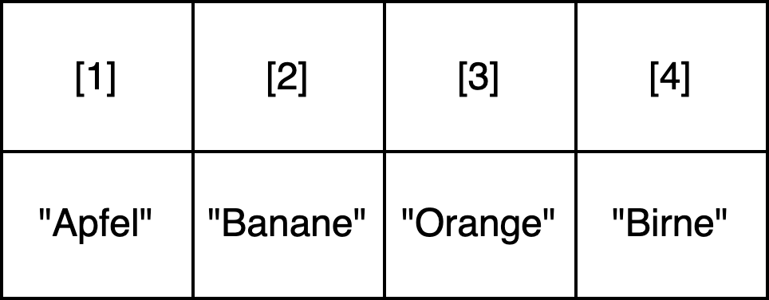
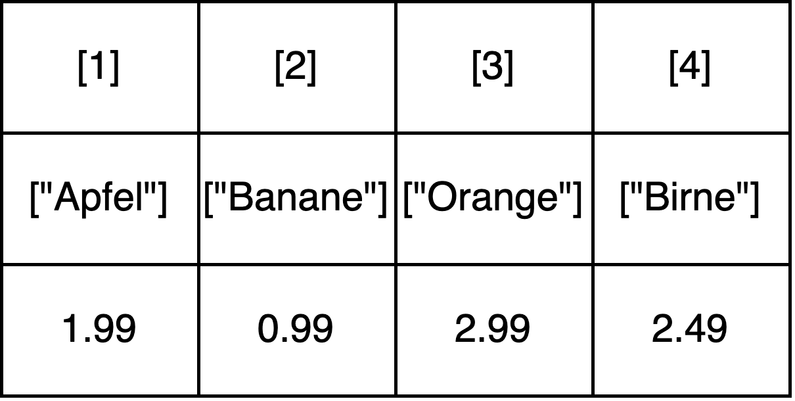
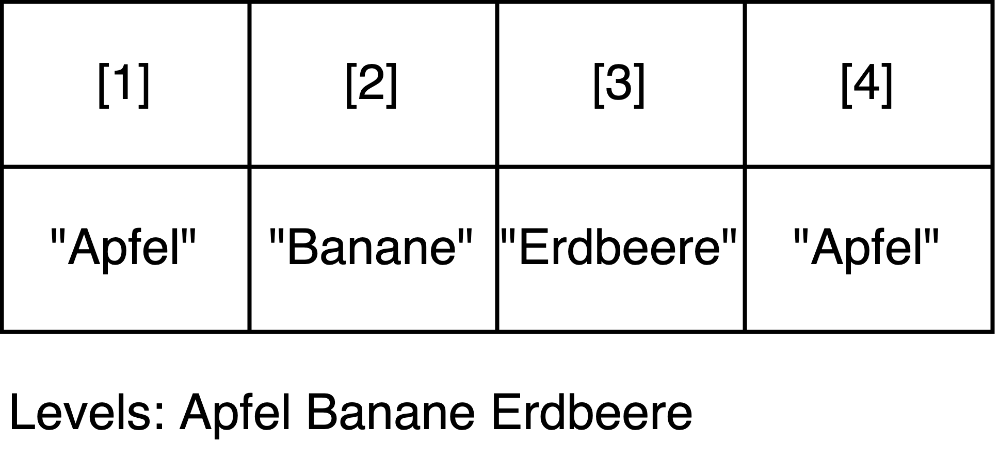
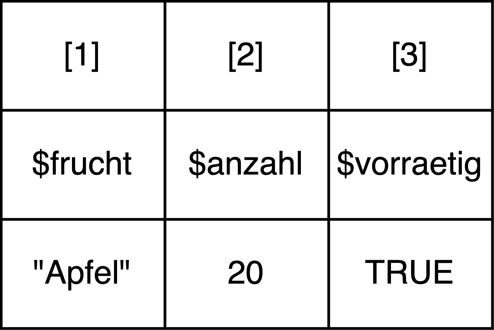
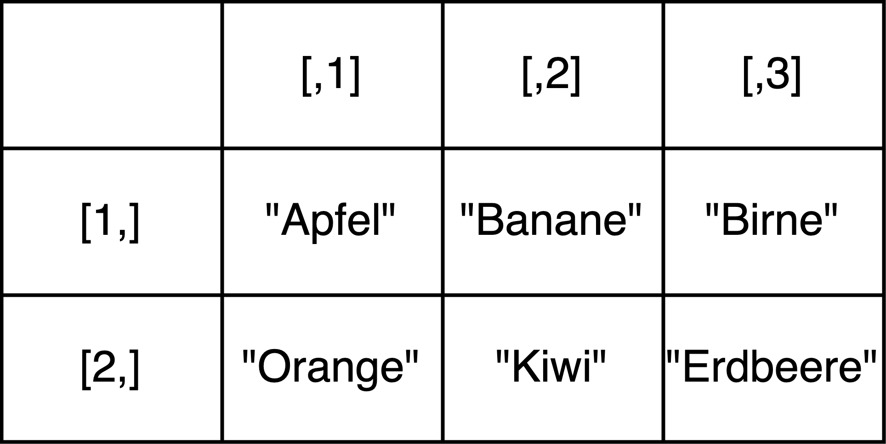
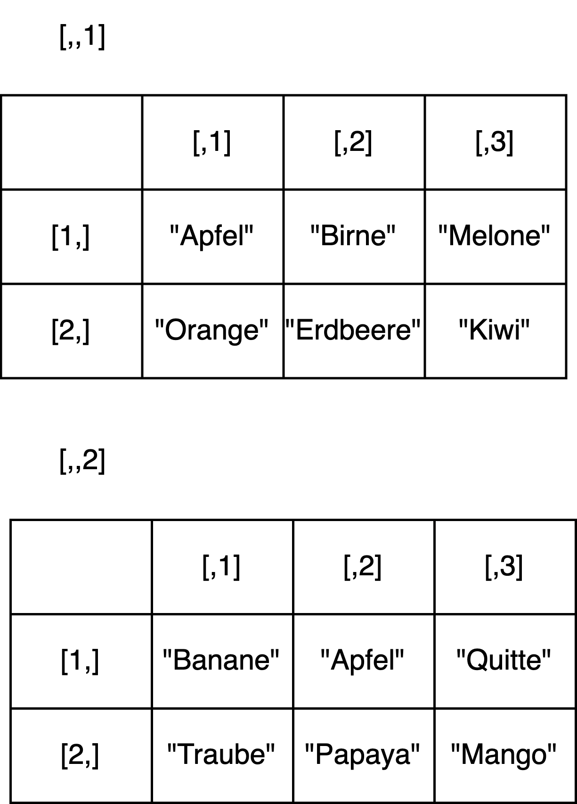

# R Basics II: Datenstrukturen


Bisher haben wir Variablen als Platzhalter für Werte vom Typ character, integer, numeric oder logical genutzt. Variablen können aber auch Platzhalter für strukturierte Sammlungen von Werten sein. **Die verschiedenen Weisen, wie Daten in R organisiert und im Speicher repräsentiert werden können, werden Datenstrukturen genannt**. Solche **Datenstrukturen können entweder nur Elemente vom selben Typ aufnehmen (wie z.B. Vektoren und Matrizen), oder Elemente unterschiedlichen Typs (wie z.B. Listen und Dataframes)**. Wir werden in diesem Kapitel alle wichtigsten Datenstrukturen besprechen. In der Praxis werden wir aber vor allem mit Vektoren und Dataframes arbeiten. 

## Grundlegende Begriffe


|Begriff        |Englische Entsprechung |Definition (im R-Kontext)                                                                                                                                                                                                                                                                                                               |
|:--------------|:----------------------|:---------------------------------------------------------------------------------------------------------------------------------------------------------------------------------------------------------------------------------------------------------------------------------------------------------------------------------------|
|Element        |Element                |Wert oder anderes Objekt innnerhalb einer Datenstruktur. Datenstrukturen können selbst Elemente einer anderen Datenstruktur sein. Elemente haben einen Index und manchmal zusätzlich einen Namen (oder 'Schlüssel'), über den auf das Element zugegriffen werden kann.                                                                  |
|Index          |Index                  |Position eines Elements innerhalb einer Datenstruktur. Ein Index ist in R immer eine Zahl >= 1.                                                                                                                                                                                                                                         |
|Indexierung    |Indexing               |Überbegriff für verschiedene Operationen, mit denen auf Elemente in einer Datenstruktur zugegriffen werden kann.                                                                                                                                                                                                                        |
|Zugreifen      |Access                 |Operation, bei der durch den Einsatz spezifischer Operatoren Elemente einer Datenstruktur ausgewählt, diese extrahiert oder modifiziert werden können.                                                                                                                                                                                  |
|Vektorisierung |Vectorization          |Mechanismus, bei dem Funktionen oder Operationen automatisch auf alle Elemente eines Vektors angewandt werden, statt auf einzelne Elemente.                                                                                                                                                                                             |
|Dimension      |Dimension              |In Bezug auf Matrizen die Anzahl von Zeilen und Spalten (angegeben als Zeilen x Spalten). In Bezug auf Arrays allgemein die Anzahl der verschiedenen 'Richtungen', in denen Daten organisiert sind. Bei einem Array können das nicht nur Zeilen und Spalten sein, sondern auch 'Schichten' von Matrizen und andere Organisationsweisen. |

## Vektoren

Eigentlich haben wir in der letzten Stunde schon Vektoren kennengelernt. Denn in R ist jeder einzelne Wert zugleich ein Vektor der Länge 1. **Vektoren sind nämlich im Grunde Sequenzen verschiedener Werte desselben Datentyps.** Die Werte innerhalb eines Vektors werden **Elemente** genannt. Jedes Element in einem Vektor hat eine Position (auch "**Index**" genannt). Über diesen Index kann auf jedes Element einzeln zugegriffen werden. Der Zugriff auf Elemente des Vektors erfolgt mithilfe von eckigen Klammern (s.u.). 



Vektoren können mithilfe von bestimmten Funktionen (lernen wir noch) erstellt werden. Wenn bei der Erstellung bekannt ist,welchen Datentyp die Elemente haben sollen, können die Funktionen `character()` oder `numeric()` zur Erstellung verwendet werden: 


```r
# leeren character-Vektor erstellen: character(0) bedeutet, dass der Vektor keine Elemente hat
character() 
```

```
#> character(0)
```

```r
# numeric-Vektor mit drei Elementen vom Typ numeric erstellen
numeric(3) 
```

```
#> [1] 0 0 0
```

Im Regelfall ist aber die Anzahl der Elemente und/oder deren Datentyp bei der Erstellung noch nicht bekannt. In diesem Fall wird zur Erstellung die Funktion `c()` verwendet:  


```r
# leeren Vektor erstellen, ohne einen bestimmten Datentyp festzulegen
c() 
```

```
#> NULL
```

Wenn ein leerer Vektor erstellt wird, wird dieser mithilfe des Werts `NULL` repräsentiert. Darauf kommen wir am Ende der Sitzung noch einmal zurück. 

Mithilfe der Funktion `c()` können auch Vektoren aus bereits bekannten Elementen erstellt werden: 


```r
# Vektor aus einer Zahlsequenz erstellen
zahlen <- 1:3
print(zahlen)
```

```
#> [1] 1 2 3
```

```r
# Vektoren mit selbst gewählten Elementen erstellen 
leckere_fruechte <- c("Apfel", "Banane", "Erdbeere")
coole_zahlen <- c(45, 7, 420)
```

Vektoren können auch in einen neuen Vektor zusammengefügt werden. Wenn die Funktion `c()` auf zwei Vektoren oder einen Vektor und ein Element angewandt wird, dann werden die beiden Vektoren in der angegebenen Reihenfolge in einen neuen Vektor kombiniert: 


```r
# Vektoren kombinieren mithilfe der Funktion c()
fruechte_und_zahlen <- c(leckere_fruechte, coole_zahlen) 
# Vektor auf dem Bildschirm ausgeben
print(fruechte_und_zahlen)
```

```
#> [1] "Apfel"    "Banane"   "Erdbeere" "45"       "7"        "420"
```

Bei der Erstellung von Vektoren muss beachtet werden, dass der Typ der Elemente automatisch vereinhetilicht wird, wenn Elemente mit unterschiedlichen Datentypen in einen Vektor kombiniert werden:  


```r
vec <- c("hallo", "1")
vec <- c(vec, 3)
# double wird zu character
typeof(vec)
```

```
#> [1] "character"
```

```r
# bool wird zu double
vec <- c(3, TRUE)
typeof(vec)
```

```
#> [1] "double"
```
Nur, wenn ein Element des Vektors eine Liste ist, gilt dieses Prinzip nicht. Darauf kommen wir im Abschnitt "Listen" noch einmal zurück. 


### Sets (Mengen)

In anderen Programmiersprachen (bspw. Python) gibt es eine Datenstruktur, die oft Set (Menge) genannt wird. Sets (Mengen) sind dadurch ausgezeichnet, dass alle Werte einzigartig sind. **In R gibt es keine eigenständige Datenstruktur für Mengen. Dennoch ist es möglich und oft nützlich, in R mit Sammlungen von einzigartigen Werten zu arbeiten und Mengenoperationen durchzuführen.** In R können Mengen aus Vektoren erstellt werden, indem die einzigartigen Werte eines Vektors oder mehrerer Vektoren extrahiert werden: 


```r
# Einzigartige Werte eines Vektors ausgeben lassen
unique(c("Apfel", "Banane", "Erdbeere", "Apfel")) 
```

```
#> [1] "Apfel"    "Banane"   "Erdbeere"
```

```r
# Vereinigung von zwei Vektoren: 
union(c("Apfel", "Banane", "Erdbeere", "Apfel"), c("Kiwi", "Grapefruit"))
```

```
#> [1] "Apfel"      "Banane"     "Erdbeere"   "Kiwi"       "Grapefruit"
```

```r
# Schnittmenge von zwei Vektoren: 
intersect(c("Apfel", "Banane"), c("Erdbeere", "Apfel"))
```

```
#> [1] "Apfel"
```

```r
# Differenz zwischen zwei Vektoren: Elemente erhalten, die im ersten Vektor, aber nicht im zweiten Vektor vorkommen. 
setdiff(c("Apfel", "Banane"), c("Erdbeere", "Apfel"))
```

```
#> [1] "Banane"
```

Die Funktion `unique()` kann mit der Funktion `length()` kombiniert werden, um herauszufinden, wie viele einzigartige Werte es in einem Vektor gibt: 


```r
length(unique(c("Apfel", "Banane", "Erdbeere", "Apfel")))
```

```
#> [1] 3
```


### Named Vectors

Neben den "einfachen" Vektoren gibt es noch sogenannte **benannte Vektoren** oder **named vectors**. **Das sind Vektoren, bei dem jedem Element nicht nur eine Indexposition, sondern auch ein Name zugeordnet ist.** 



Um einen named vector zu erstellen, wird ebenfalls die Funktion `c()` verwendet. Den Elementen wird bei der Erstellung des Vektors aber ein Name (oder "Schlüssel") zugeordnet. Dieser muss ein character sein. Beachtet, dass bei der Zuweisung von Namen innerhalb von Funktionen anstelle des Zuweisungsoperators `<-` der Operator `=` verwendet wird: 


```r
# Erstellung eines named vectors: Schlüssel sind immer Zeichenketten 
einkauf <- c("Apfel"=4, "Banane"=3, "Erdbeere"=20)
# ...selbst dann, wenn ihr Wörter ohne Anführungszeichen eingebt, weiß R, dass eine Zeichenkette gemeint ist: 
einkauf <- c(Apfel=4, Banane=3, Erdbeere=20)
# Das geht allerdings nicht, wenn ihr Zahlen als Schlüssel eingebt! 
# einkauf <- c(1=4, 2=3, 3=20)
```

### Faktoren 

Da R ursprünglich für die Statistik entwickelt wurde, haben sich die Entwickler:innen der Programmiersprache überlegt, dass es praktisch wäre, wenn es eine Datenstruktur speziell für kategorische (auch "kategoriale") Daten gäbe. Kategorische Daten sind Daten, die in bestimmte Kategorien oder Gruppen fallen, also beispielsweise Farben, Regionen, Beschäftigungsstatus. Speziell zur Organisation solcher Daten gibt es in R Faktoren. **Ein Faktor ist eine spezielle Art von Vektor, der kategorische Daten repräsentiert.** 



Faktoren werden mithilfe der Funktion `factor()` erstellt. Faktoren werden stets aus bereits existierenden Vektoren erstellt, beispielsweise aus dem Vektor `fruechte`, den wir hier noch einmal neu erstellen: 


```r
fruechte <- c("Apfel", "Banane", "Erdbeere", "Apfel")

factor(fruechte)
```

```
#> [1] Apfel    Banane   Erdbeere Apfel   
#> Levels: Apfel Banane Erdbeere
```

Wann würde man also Faktoren verwenden? Wenn man nur die einzigartigen Werte braucht, dann kann einfach die Funktion `unique()` auf einen "einfachen" Vektor angewandt werden und braucht keine Faktoren (s. "Sets"). Aber wenn man herausfinden möchte, wie oft jeder Wert jeweils vorkommt, dann ist das mithilfe der `unique()` Funktion kompliziert: 


```r
# Diesen Code müsst ihr nicht verstehen, er dient nur, um die Komplexität zu illustrieren
haeufigkeiten <- sapply(unique(fruechte), function(x) sum(fruechte == x))
haeufigkeiten
```

```
#>    Apfel   Banane Erdbeere 
#>        2        1        1
```

Mithilfe von Faktoren können wir viel einfacher herausfinden, wie oft jeder Wert vorkommt, und zwar mithilfe der Funktion `table()`. Sie erlaubt, die Anzahl der einzigartigen Werte ausgeben zu lassen: 


```r
table(factor(fruechte)) 
```

```
#> 
#>    Apfel   Banane Erdbeere 
#>        2        1        1
```

Tatsächlich wandelt die Funktion `table()` automatisch den Vektor in einen Faktor um. Wenn wir herausfinden wollen, wie oft jeder Wert in einem Vektor vorkommt, dann brauchen wir also nicht unbedingt erst den Vektor in einen Faktor umwandeln. Wir können die `table()`-Funktion direkt auf den Vektor anwenden:


```r
table(fruechte) 
```

```
#> fruechte
#>    Apfel   Banane Erdbeere 
#>        2        1        1
```

Wie wir gesehen haben, greifen Funktionen wie `table()` unter der Motorhaube auf Faktoren zurück und wandeln einen Vektor automatisch in einen Faktor um. Auch in anderen Kontexten werden Faktoren oft automatisch erstellt. Trotzdem solltet ihr zumindest von Faktoren gehört haben. Denn selbst, wenn wir in der Praxis nicht unbedingt viel mit Faktoren arbeiten werden und selten Faktoren selbst erstellen, spielen Faktoren in R beim Umgang mit kategorialen Daten eine große Rolle und sind zum Verständnis von manchen Funktionen wichtig. 


### Zugriffsoperationen auf Vektoren 

Den Zugriff auf ein Element oder mehrere Elemente in einer Datenstruktur nennt man auch **Indexierung**. Dabei wird mithilfe von einem **Zugriffsoperator** über den Index oder den Namen (Schlüssel) eines Elements zugegriffen. Als Beispiel für den Zugriff über den Index sehen wir uns einige Zugriffsoperationen auf den Vektor `fruechte` an, den wir hier erneut erstellen: 


```r
fruechte <- c("Apfel", "Banane", "Erdbeere", "Apfel")

# Zugriff auf das erste Element des Vektors leckere_fruechte über den Index
fruechte[1] 
```

```
#> [1] "Apfel"
```

```r
# Zugriff auf Elemente 1-3
fruechte[1:3] 
```

```
#> [1] "Apfel"    "Banane"   "Erdbeere"
```

```r
# Zugriff auf Elemente 1 und 3
fruechte[c(1,3)] 
```

```
#> [1] "Apfel"    "Erdbeere"
```

```r
# Zugriff auf alle Elemente mit dem Wert "Banane"
fruechte[fruechte == "Banane"]
```

```
#> [1] "Banane"
```

```r
# Element an Indexposition 1 austauschen
fruechte[1] <- "Orange"

# Neues Element an Indexposition 5 hinzufügen
fruechte[5] <- "Birne"

# Neues Element am Ende des Vektors hinzufügen
fruechte <- c(fruechte, "Melone")

# Neues Element am Anfang des Vektors hinzufügen
fruechte <- c("Traube", fruechte)

# Element an Indexposition 1 entfernen
fruechte[-1]
```

```
#> [1] "Orange"   "Banane"   "Erdbeere" "Apfel"    "Birne"    "Melone"
```

Die Zugriffsoperation `fruechte[fruechte == "Banane"]` bedarf vielleicht einer kurzen Erläuterung. Wie funktioniert diese Operation? Warum werden nur die Elemente ausgegeben, deren Wert "Banane" ist? 

Zunächst wird der Ausdruck in den eckigen Klammern evaluiert, `fruechte == "Banane"`. Dabei wird der Mechanismus der Vektorisierung aktiviert, sodass der Ausdruck zu einem Vektor aus Wahrheitswerten ausgewertet wird: Wenn im Vektor `fruechte` der Wert  "Banane" steht, steht in diesem Vektor `TRUE` und sonst  `FALSE`. Danach wird die eigentliche Zugriffsoperation ausgeführt, allerdings mit dem logischen Vektor anstelle der Indices: `fruechte[c(FALSE, TRUE, FALSE, FALSE)]`. Bei einer solchen Zugriffsoperation werden alle Elemente ausgegeben, für die in dem logischen Vektor `TRUE` steht. Eine Zugriffsoperation der Art `fruechte == "Banane"`, wird deswegen auch **bedingter Zugriff** genannt. Anstelle des logischen Operators == kann hier auch ein anderer logischer Operator oder ein Vergleichsoperator stehen.  

Elemente können auch direkt einer neuen Variable zugewiesen werden: 


```r
erste_frucht <- fruechte[1] 
print(erste_frucht)
```

```
#> [1] "Traube"
```

Um auf die Elemente eines named vectors zuzugreifen, kann entweder der Index oder der Name des Elements verwendet werden: 


```r
einkauf <- c("Apfel"=4, "Banane"=3, "Erdbeere"=20, "Apfel"=5)

# Zugriff auf das Element mit dem Namen "Erdbeere": Hier müssen die Anführungszeichen wieder explizit angegeben werden (zur Erinnerung: Schlüssel sind immer character!)
einkauf["Erdbeere"]
```

```
#> Erdbeere 
#>       20
```

```r
# Zugriff auf den Wert ohne den Namen
einkauf[["Erdbeere"]]
```

```
#> [1] 20
```

```r
# Zugriff auf alle Elemente mit dem Namen "Apfel": 
einkauf["Apfel"]
```

```
#> Apfel 
#>     4
```

```r
# Zugriff auf mehrere Elemente
einkauf[c("Apfel", "Erdbeere")]
```

```
#>    Apfel Erdbeere 
#>        4       20
```

```r
# Wert (!) des Elements mit dem Namen "Banane" austauschen
einkauf["Banane"] <- 5

# Neues Element mit dem Namen "Birne" hinzufügen
einkauf["Birne"] <- 3

# Neues Element am Ende des Vektors hinzufügen
einkauf <- c(einkauf, Melone=1)

# Neues Element am Anfang des Vektors hinzufügen
einkauf <- c(Traube=12, einkauf)

# Element mit dem Namen "Birne" entfernen: 
einkauf <- einkauf[!(names(einkauf) == "Birne")]
einkauf
```

```
#>   Traube    Apfel   Banane Erdbeere    Apfel   Melone 
#>       12        4        5       20        5        1
```


:::task
Verständnisfragen:

- Wie viele Elemente hat der Vektor `fruechte`?
- Wie kann das Element `"Orange"` aus dem Vektor `fruechte` entfernt werden? An welcher Indexposition steht es jetzt?
- Sind einzelne Zahlen oder Zeichenketten in R auch Datenstrukturen? Wenn ja, welche? 
- Zu welchem Wahrheitswert wird der Ausdruck `c(2) == 2` evaluiert? Warum?
- Wie kann auf alle Elemente mit dem Wert `3` im Vektor `einkauf` zugegriffen werden?
:::

### Vektorisierung 

Auf Vektoren können auch die bereits bekannten Operatoren angewendet werden. Wenn Operatoren auf Vektoren angewandt werden, wird die Operation automatisch elementweise auf jedes Element des Vektors angewandt. Dieser Mechanismus nennt sich **Vektorisierung**. Wir werden in der Sitzung zu Funktionen noch einmal darauf zurückkommen. Wichtig ist dabei zu beachten, dass beide Vektoren die gleiche Länge haben müssen. 

Auf Vektoren vom Typ numeric oder integer (also Vektoren, deren Elemente alle numerics oder integers sind) können die arithmetischen Operatoren angewandt werden, zum Beispiel: 


```r
vec_1 <- c(1, 2, 3)
vec_2 <- c(3, 5, 6)
vec_1 + vec_2
```

```
#> [1] 4 7 9
```

```r
vec_1 / vec_2
```

```
#> [1] 0.3333333 0.4000000 0.5000000
```

Wird ein Vektor nicht mit einem anderen Vektor, sondern mit einem einzelnen Wert addiert (oder subtrahiert, dividiert, ... ), dann wird jedes Element des Vektors mit diesem Wert verrechnet: 


```r
vec_1 + 5
```

```
#> [1] 6 7 8
```

Daneben können auch Vergleichsoperatoren und logische Operatoren auf Vektoren angewandt werden, und es können sogar zwei Vektoren elementweise verglichen werden:


```r
vec_1 == vec_2
```

```
#> [1] FALSE FALSE FALSE
```

```r
vec_1 < vec_2
```

```
#> [1] TRUE TRUE TRUE
```

```r
vec_1 < 3
```

```
#> [1]  TRUE  TRUE FALSE
```

In der letzten Sitzung haben wir bereits den Unterschied zwischen dem "elementweisen" Operatoren & und | und den Operatoren && und || angeschnitten. Das Verhalten war bei der Auswertung einfacher Ausdrücke mit einzelnen Werten nicht bemerkbar, aber es wird relevant, wenn die Operatoren auf Vektoren anstelle von einzelnen Werten angewandt werden: 


```r
zahlen <- 1:5
zahlen > 2 & zahlen < 4
```

```
#> [1] FALSE FALSE  TRUE FALSE FALSE
```

```r
zahlen > 2 && zahlen < 4
```

```
#> Error in zahlen > 2 && zahlen < 4: 'length = 5' in coercion to 'logical(1)'
```

:::task
Verständnisfragen:

- Warum wird der Ausdruck `zahlen > 2 & zahlen < 4` zu `FALSE FALSE TRUE FALSE FALSE` evaluiert? 
- Welche Datenstruktur wird ausgegeben, wenn der Ausdruck evaluiert wird?
- Was bedeutet die Fehlermeldung bei der Auswertung des Ausdrucks `zahlen > 2 && zahlen < 4`? 
:::


## Listen

**Listen enthalten wie Vektoren eine Sequenz verschiedener Werte.** Im Abschnitt zu Vektoren haben wir bereits gelernt, dass diese Werte auch Elemente genannt werden. **Anders als bei Vektoren können die Elemente einer Liste aber verschiedene Datentypen haben. Ähnlich wie bei benannten Vektoren kann man den Elementen einer Liste einen Namen (wird manchmal auch Schlüssel genannt) zuordnen, über den auf den Wert zugegriffen werden kann.** 



Listen werden mithilfe der Funktion `list()` erstellt. Genau wie bei benannten Vektoren (also named vectors) müssen die Schlüssel der Werte Zeichenketten sein. Wenn keine Anführungszeichen angegeben werden, erkennt R auch hier automatisch, dass eine Zeichenkette gemeint ist. 


```r
# Liste erstellen 
einkauf_liste <- list(frucht="Apfel", anzahl=20, vorraetig=TRUE)

# Liste ausgeben 
print(einkauf_liste)
```

```
#> $frucht
#> [1] "Apfel"
#> 
#> $anzahl
#> [1] 20
#> 
#> $vorraetig
#> [1] TRUE
```

Die einzelnen Elemente müssen dabei nicht unbedingt benannt werden, das heißt, der Code oben könnte genausogut so aussehen:  

```r
list("Apfel", 20, TRUE)
```

```
#> [[1]]
#> [1] "Apfel"
#> 
#> [[2]]
#> [1] 20
#> 
#> [[3]]
#> [1] TRUE
```

Die Elemente einer Liste können auch Vektoren oder selbst Listen sein. Im letzteren Fall wird die Liste dann "Liste von Listen" oder "verschachtelte Liste" genannt. 


```r
# Liste von Vektoren erstellen: 
liste_von_vektoren <- list(frucht = c("Apfel", "Erdbeere", "Banane"),
                           anzahl = c(20, 32, 0),
                           vorraetig = c(TRUE, TRUE, FALSE)
              )
print(liste_von_vektoren)
```

```{style="max-height: 150px;"}
#> $frucht
#> [1] "Apfel"    "Erdbeere" "Banane"  
#> 
#> $anzahl
#> [1] 20 32  0
#> 
#> $vorraetig
#> [1]  TRUE  TRUE FALSE
```

```r
# Liste von Listen erstellen: 
liste_von_listen <- list(Apfel = list(20, FALSE),
                         Erdbeere = list(32, FALSE),
                         Banane = list(0, TRUE)
)
print(liste_von_listen)
```

```{style="max-height: 150px;"}
#> $Apfel
#> $Apfel[[1]]
#> [1] 20
#> 
#> $Apfel[[2]]
#> [1] FALSE
#> 
#> 
#> $Erdbeere
#> $Erdbeere[[1]]
#> [1] 32
#> 
#> $Erdbeere[[2]]
#> [1] FALSE
#> 
#> 
#> $Banane
#> $Banane[[1]]
#> [1] 0
#> 
#> $Banane[[2]]
#> [1] TRUE
```

Schematisch sieht eine Liste von Vektoren in etwa so aus: 


Das Bild illustriert auch, wie auf die Elemente in einer Liste von Vektoren zugegriffen werden kann. Der Zugriff auf Elemente in einer Liste ist nämlich etwas komplizierter als bei einem Vektor. Darum geht es im folgenden Abschnitt. 

### Zugriffsoperationen auf Listen


```r
# Auf Elemente und ihre Namen über den Index zugreifen
einkauf_liste[1]
```

```{style="max-height: 150px;"}
#> $frucht
#> [1] "Apfel"
```

```r
# Auf Elemente ohne Namen über den Index zugreifen
einkauf_liste[[1]]
```

```{style="max-height: 150px;"}
#> [1] "Apfel"
```

```r
# Auf Elemente über den Namen (Schlüssel) zugreifen - Option 1 
einkauf_liste$frucht
```

```{style="max-height: 150px;"}
#> [1] "Apfel"
```

```r
# Auf Elemente über den Namen (Schlüssel) zugreifen - Option 2
einkauf_liste[["frucht"]]
```

```{style="max-height: 150px;"}
#> [1] "Apfel"
```

```r
# Auf das erste Element des ersten Vektors in einer Liste von Vektoren über den Index zugreifen 
liste_von_vektoren[[1]][1]
```

```{style="max-height: 150px;"}
#> [1] "Apfel"
```

```r
# Auf das erste Element des ersten Vektors in einer Liste von Vektoren über den Schlüssel zugreifen - Option 1
liste_von_vektoren[["frucht"]][1]
```

```{style="max-height: 150px;"}
#> [1] "Apfel"
```

```r
# Auf das erste Element des ersten Vektors in einer Liste von Vektoren über den Schlüssel zugreifen - Option 2
liste_von_vektoren$frucht[1]
```

```{style="max-height: 150px;"}
#> [1] "Apfel"
```

```r
# Listen kombinieren mit der Funktion c()
einkauf_bananen <- list(frucht="Banane", anzahl=0, vorraetig=FALSE)
einkauf_gesamt <- c(einkauf_liste, einkauf_bananen) 
```

:::task
Verständnisfragen:

- Um welche Datenstruktur handelt es sich bei dem Objekt `einkauf_gesamt`? 
- Was ist der Datentyp der Elemente des Objekts `einkauf_gesamt`? 
- Was ist der Unterschied zwischen Listen und Named Vectors? 
:::


Im letzten Beispiel haben wir die bereits bekannte Funktion `c()` verwendet, um zwei Listen in eine neue Liste  `einkauf_gesamt` zu kombinieren. Das heißt: Wenn wir die Funktion `c()` verwenden, um zwei Listen zu kombinieren, dann kommt auch eine Liste dabei raus. Man kann mit der Funktion `c()` aber keine Listen aus einzelnen Werten erstellen:


```r
# Mit der Funktion c() kann man KEINE Liste erstellen
einkauf_bananen <- c(frucht="Banane", anzahl=0, vorraetig=FALSE)
typeof(einkauf_bananen)
```

```
#> [1] "character"
```


## Auf einen Blick: Vektoren vs benannte Vektoren vs Faktoren vs Listen

In diesem Abschnitt werden die Unterschiede zwischen einfachen Vektoren, benannten Vektoren, Faktoren und Listen anhand eines Beispiels illustriert. Das Beispiel illustriert, wie Daten zu Wetterbedingungen für jeden Monat eines Jahres mithilfe der verschiedenen Datenstrukturen organisiert werden können. 


```r
# Vektor: Ein einfacher Vektor, der die Wetterbedingungen für jeden Monat eines Jahres speichert.
weather_conditions <- c("sonnig", "bewölkt", "sonnig", "regnerisch", "bewölkt", "sonnig",
                        "regnerisch", "bewölkt", "bewölkt", "sonnig", "bewölkt", "regnerisch")
avg_rainfall <- c(50, 40, 45, 60, 55, 70, 80, 75, 70, 65, 55, 50)
print(weather_conditions)
```

```{style="max-height: 150px;"}
#>  [1] "sonnig"     "bewölkt"    "sonnig"     "regnerisch" "bewölkt"   
#>  [6] "sonnig"     "regnerisch" "bewölkt"    "bewölkt"    "sonnig"    
#> [11] "bewölkt"    "regnerisch"
```

```r
print(avg_rainfall)
```

```{style="max-height: 150px;"}
#>  [1] 50 40 45 60 55 70 80 75 70 65 55 50
```

```r
# Named Vector: Ein benannter Vektor, der die Wetterbedingungen für jeden Monat eines Jahres speichert und Monatsnamen als Namen für jedes Element verwendet. 
weather_conditions_named <- c(Jan="sonnig", Feb="bewölkt", Mar="sonnig", Apr="regnerisch",
                              Mai="bewölkt", Jun="sonnig", Jul="regnerisch", Aug="bewölkt",
                              Sep="bewölkt", Okt="sonnig", Nov="bewölkt", Dez="regnerisch")
print(weather_conditions_named)
```

```{style="max-height: 150px;"}
#>          Jan          Feb          Mar          Apr          Mai          Jun 
#>     "sonnig"    "bewölkt"     "sonnig" "regnerisch"    "bewölkt"     "sonnig" 
#>          Jul          Aug          Sep          Okt          Nov          Dez 
#> "regnerisch"    "bewölkt"    "bewölkt"     "sonnig"    "bewölkt" "regnerisch"
```

```r
# Faktor: Häufigkeitsverteilung der Wetterbedingungen
# Konvertieren des Vektors in einen Faktor mit benannten Ebenen
weather_factor <- factor(weather_conditions, levels=c("sonnig", "bewölkt", "regnerisch"), ordered=TRUE)
# Häufigkeitsverteilung der Wetterbedingungen
weather_table <- table(weather_factor)
# Ergebnis anzeigen
print(weather_table)
```

```{style="max-height: 150px;"}
#> weather_factor
#>     sonnig    bewölkt regnerisch 
#>          4          5          3
```

```r
# Liste: Eine Liste, die Informationen über das Wetter für jeden Monat des Jahres enthält. 
# Jedes Element der Liste ist ein eigenes Objekt, in diesem Fall ein Vektor. 
weather_list <- list(Condition=weather_conditions, 
                     Rainfall=avg_rainfall,
                     Month=c("Januar", "Februar", "Maerz", "April", "Mai", "Juni", "Juli", "August", "September", "Oktober", "November", "Dezember"))
print(weather_list)
```

```{style="max-height: 150px;"}
#> $Condition
#>  [1] "sonnig"     "bewölkt"    "sonnig"     "regnerisch" "bewölkt"   
#>  [6] "sonnig"     "regnerisch" "bewölkt"    "bewölkt"    "sonnig"    
#> [11] "bewölkt"    "regnerisch"
#> 
#> $Rainfall
#>  [1] 50 40 45 60 55 70 80 75 70 65 55 50
#> 
#> $Month
#>  [1] "Januar"    "Februar"   "Maerz"     "April"     "Mai"       "Juni"     
#>  [7] "Juli"      "August"    "September" "Oktober"   "November"  "Dezember"
```

```r
# Andere Darstellungsform als Liste von Listen
weather_list <- list(Januar=list(50, "sonnig"),
                     Februar=list(40, "bewölkt"), 
                     Maerz=list(45, "sonnig"), 
                     April=list(60, "regnerisch"),
                     Mai=list(55, "bewölkt"),
                     Juni=list(70, "sonnig"),
                     Juli=list(80, "regnerisch"),
                     August=list(75, "bewölkt"),
                     September=list(70, "bewölkt"),
                     Oktober=list(65, "sonnig"),
                     November=list(55, "bewölkt"),
                     Dezember=list(50, "regnerisch")
)
print(weather_list)
```

```{style="max-height: 150px;"}
#> $Januar
#> $Januar[[1]]
#> [1] 50
#> 
#> $Januar[[2]]
#> [1] "sonnig"
#> 
#> 
#> $Februar
#> $Februar[[1]]
#> [1] 40
#> 
#> $Februar[[2]]
#> [1] "bewölkt"
#> 
#> 
#> $Maerz
#> $Maerz[[1]]
#> [1] 45
#> 
#> $Maerz[[2]]
#> [1] "sonnig"
#> 
#> 
#> $April
#> $April[[1]]
#> [1] 60
#> 
#> $April[[2]]
#> [1] "regnerisch"
#> 
#> 
#> $Mai
#> $Mai[[1]]
#> [1] 55
#> 
#> $Mai[[2]]
#> [1] "bewölkt"
#> 
#> 
#> $Juni
#> $Juni[[1]]
#> [1] 70
#> 
#> $Juni[[2]]
#> [1] "sonnig"
#> 
#> 
#> $Juli
#> $Juli[[1]]
#> [1] 80
#> 
#> $Juli[[2]]
#> [1] "regnerisch"
#> 
#> 
#> $August
#> $August[[1]]
#> [1] 75
#> 
#> $August[[2]]
#> [1] "bewölkt"
#> 
#> 
#> $September
#> $September[[1]]
#> [1] 70
#> 
#> $September[[2]]
#> [1] "bewölkt"
#> 
#> 
#> $Oktober
#> $Oktober[[1]]
#> [1] 65
#> 
#> $Oktober[[2]]
#> [1] "sonnig"
#> 
#> 
#> $November
#> $November[[1]]
#> [1] 55
#> 
#> $November[[2]]
#> [1] "bewölkt"
#> 
#> 
#> $Dezember
#> $Dezember[[1]]
#> [1] 50
#> 
#> $Dezember[[2]]
#> [1] "regnerisch"
```


## Matrizen

**Eine Matrix ist in R im Grunde eine Kombination mehrerer Vektoren in Spalten und Zeilen. Formell ausgedrückt: In einer Matrix kann jede Spalte und jede Zeile als Vektor aufgefasst werden. Das heißt, dass jedes Element in einer Matrix denselben Datentyp hat, eben genau wie bei Vektoren.** Wenn beispielsweise alle Elemente den Typ character haben, spricht man auch von einer character-Matrix. Zusätzlich haben Matrizen eine **Dimension**, die mithilfe der Funktion `dim()` abgefragt werden kann. Die Dimension einer Matrix ist die Anzahl ihrer Zeilen und Spalten. Die Matrix unten hat beispielsweise die Dimension 2x3: Sie hat zwei Zeilen und drei Spalten.



Da Matrizen aus Vektoren bestehen, können Matrizen erstellt werden, indem mehrere Vektoren kombiniert werden, oder, indem ein einzelner Vektor in verschiedene Spalten aufgeteilt wird. Dabei wird bei der Erstellung der Matrix mithilfe dem Zusatz  `ncol` festgelegt, in wie viele Spalten die Elemente des Vektors organisiert werden sollen. 

Wir betrachten zunächst ein ganz simples Beispiel:  


```r
# Matrix aus einem einzigen Vektor erstellen mit der Funktion matrix() 
fruechte <- matrix(c("Apfel", "Orange", "Banane", "Kiwi", "Birne", "Erdbeere"), ncol = 3)
print(fruechte)
```

```
#>      [,1]     [,2]     [,3]      
#> [1,] "Apfel"  "Banane" "Birne"   
#> [2,] "Orange" "Kiwi"   "Erdbeere"
```

```r
# Dimension einer Matrix ausgeben lassen
dim(fruechte) # Dimension ist 2 x 3
```

```
#> [1] 2 3
```

Die Matrix `fruechte` ist jedoch nicht sehr informativ. Häufig haben die Spalten und Zeilen einer Matrix eine Bedeutung, sodass es sinnvoll ist, die Zeilen und/oder Spalten zu benennen. Wenn die Matrix wie im Beispiel oben aus einem einzelnen Vektor erstellt wird, können direkt beim Erstellen der Matrix die Zeilen- und Spaltennamen angegeben werden. In unserem Beispiel macht es nicht so viel Sinn, auch den Zeilen eine Bedeutung zu geben. Deswegen verwenden wir in der Funktion `list()` innerhalb der Funktion `matrix()` hier den Wert `NULL` (siehe dazu den Abschnitt "Fehlende und ungültige Werte in Datenstrukturen"). Wenn Zeilennamen festgelegt werden sollen, kann `NULL` einfach durch einen Vektor mit den Zeilennamen ausgetauscht werden.
Beachtet, dass es einen Unterschied macht, ob die Elemente der Liste einen Namen haben oder nicht: 


```r
# Matrix erstellen und direkt Namen für die Spalten festlegen 
# Achtung: die Dimension ist jetzt 3 x 2 !

matrix(c("Apfel", "Orange", "Banane", "Kiwi", "Birne", "Erdbeere"), 
       ncol = 2, 
       dimnames = list(NULL,
                      c("nicht_vorraetig", "vorraetig")))
```

```
#>      nicht_vorraetig vorraetig 
#> [1,] "Apfel"         "Kiwi"    
#> [2,] "Orange"        "Birne"   
#> [3,] "Banane"        "Erdbeere"
```

```r
# Matrix erstellen, Namen für einzelne Spalten festlegen, und Spalten insgesamt benennen
matrix(c("Apfel", "Orange", "Banane", "Kiwi", "Birne", "Erdbeere"), 
       ncol = 2, 
       dimnames = list(NULL,
                      "Vorratsstatus" = c("nicht_vorraetig", "vorraetig")))
```

```
#>       Vorratsstatus
#>        nicht_vorraetig vorraetig 
#>   [1,] "Apfel"         "Kiwi"    
#>   [2,] "Orange"        "Birne"   
#>   [3,] "Banane"        "Erdbeere"
```

Wenn Matrizen aus mehreren Vektoren erstellt werden, sind die Spalten- bzw. Zeilennamen automatisch die Namen der Vektoren, aus denen die Matrix erstellt wurde. Um Matrizen aus bereits existierenden Vektoren zu erstellen, kann entweder die Funktion `rbind()` oder die Funktion `cbind()` verwendet werden. `rbind()` fügt die Vektoren als Zeilen, also übereinander, zusammen. `cbind()` fügt die Vektoren als Spalten, also nebeneinander, zusammen.  


```r
# Matrix zeilenweise erstellen mit der Funktion rbind()
nicht_vorraetig <- c("Banane", "Orange", "Birne")
vorraetig <- c("Apfel", "Erbeere", "Kiwi") 
fruechte_einkauf <- rbind(nicht_vorraetig, vorraetig)
fruechte_einkauf
```

```
#>                 [,1]     [,2]      [,3]   
#> nicht_vorraetig "Banane" "Orange"  "Birne"
#> vorraetig       "Apfel"  "Erbeere" "Kiwi"
```

```r
# Matrix spaltenweise erstellen mit der Funktion cbind()
nicht_vorraetig <- c("Banane", "Orange", "Birne")
vorraetig <- c("Apfel", "Erbeere", "Kiwi") 
fruechte_einkauf <- cbind(nicht_vorraetig, vorraetig)
fruechte_einkauf 
```

```
#>      nicht_vorraetig vorraetig
#> [1,] "Banane"        "Apfel"  
#> [2,] "Orange"        "Erbeere"
#> [3,] "Birne"         "Kiwi"
```

Matrizen können auch in Dataframes umgewandelt werden und umgekehrt. Das behandeln wir im Abschnitt "Dataframes". 

### Zugriffsoperationen auf Matrizen 


```r
# Zugriff auf Zeile 1
fruechte[1,]
```

```
#> [1] "Apfel"  "Banane" "Birne"
```

```r
# Zugriff auf Spalte 1
fruechte[,1]
```

```
#> [1] "Apfel"  "Orange"
```

```r
# Zugriff auf das Element in Zeile 1 und Spalte 2
fruechte[1,2]
```

```
#> [1] "Banane"
```

```r
# Zugriff auf Spalte mit dem Namen "vorraetig"
fruechte_einkauf[, "vorraetig"]
```

```
#> [1] "Apfel"   "Erbeere" "Kiwi"
```

```r
# Zeilen nachträglich (um)benennen
rownames(fruechte_einkauf) <- c("kuehlschrank", "vorratskammer", "regal")
fruechte_einkauf
```

```
#>               nicht_vorraetig vorraetig
#> kuehlschrank  "Banane"        "Apfel"  
#> vorratskammer "Orange"        "Erbeere"
#> regal         "Birne"         "Kiwi"
```

```r
# Zugriff auf Zeile mit dem Namen "kuehlschrank"
fruechte_einkauf["kuehlschrank", ]
```

```
#> nicht_vorraetig       vorraetig 
#>        "Banane"         "Apfel"
```

```r
# Zugriff auf alle Elemente mit dem Wert "Banane"
fruechte[fruechte == "Banane"]
```

```
#> [1] "Banane"
```

```r
# Spalten nachträglich (um)benennen
colnames(fruechte_einkauf) <- c("vorhanden", "nicht_vorhanden")
```

Da Matrizen aus Vektoren bestehen, können wie auf Vektoren  auch auf Matrizen die bereits bekannten Operatoren angewendet werden. Dabei wird wieder der Mechanismus der Vektorisierung aktiviert: Wenn Operatoren auf Matrizen angewandt werden, wird die Operation automatisch elementweise auf jedes Element der Matrix angewandt: 


```r
mat_1 <- matrix(c(1, 1, 2, 2), ncol=2)
mat_1 + 2
```

```
#>      [,1] [,2]
#> [1,]    3    4
#> [2,]    3    4
```

```r
# Das geht auch mit zwei Matrizen 
mat_2 <- matrix(c(4, 4, 4, 4), ncol=2)
mat_1 + mat_2
```

```
#>      [,1] [,2]
#> [1,]    5    6
#> [2,]    5    6
```

Matrizen können auch kombiniert werden. Wir haben ja bereits beim Erstellen von Matrizen aus bereits existierenden Vektoren die Funktionen `rbind()` und `cbind()` verwendet. 


```r
# Matrizen zeilenweise kombinieren
mat_3 <- rbind(mat_1, mat_2)
mat_3
```

```
#>      [,1] [,2]
#> [1,]    1    2
#> [2,]    1    2
#> [3,]    4    4
#> [4,]    4    4
```

```r
# Matrizen spaltenweise kombinieren
mat_4 <- cbind(mat_1, mat_2)
mat_4
```

```
#>      [,1] [,2] [,3] [,4]
#> [1,]    1    2    4    4
#> [2,]    1    2    4    4
```

Eine Voraussetzung dafür, dass Matrizen kombiniert werden können, ist, dass sie dieselbe Anzahl von Zeilen und Spalten (also dieselbe Dimension) haben. Die beiden Matrizen `mat_3` und `mat_4` haben beispielsweise umgekehrte Dimensionen: `mat_3` ist eine 4x2-Matrix, und `mat_4` ist eine 2x4-Matrix. Wenn die beiden Matrizen kombiniert werden sollen, müssen sie erst in dieselbe Form gebracht werden. Das geht ganz einfach mithilfe der Funktion `t()`. Das `t` steht dabei für "Transponieren". 


```r
# Matrix mat_3 transponieren
mat_3t <- t(mat_3)
# Matrix mat_4 und transponierte Matrix kombinieren: 
cbind(mat_3t, mat_4)
```

```
#>      [,1] [,2] [,3] [,4] [,5] [,6] [,7] [,8]
#> [1,]    1    1    4    4    1    2    4    4
#> [2,]    2    2    4    4    1    2    4    4
```

:::task
Verständnisfragen:

- Welche Dimension hat die Matrix `fruechte_einkauf`? 
- Welchen Datentyp haben die Elemente der Matrix `fruechte_einkauf`? 
- Wie kann man eine Matrix mit fünf Spalten erstellen? 
:::


## Arrays

**Ein Array ermöglicht, einfach gesagt, mehrere Matrizen von gleicher Größe in einer einzigen Datenstruktur zu "stapeln", wobei jede Matrix eine eigene "Schicht" oder "Ebene" im Array bildet.**
Auch Arrays haben eine Dimension, allerdings ist damit in Bezug auf Arrays etwas anderes gemeint als in Bezug auf Matrizen. Während die Dimension einer Matrix die Anzahl ihrer Zeilen und Spalten beschreibt, hat der Dimensionsbegriff bei Arrays eine erweiterte Bedeutung. Bei einem Array bezieht sich die Dimension auf die Anzahl der "Richtungen" oder "Achsen", in denen die Daten organisiert sind. Dies kann die Anzahl der Zeilen, Spalten, "Schichten" und weiterer Organisationsweisen in höherdimensionalen Arrays umfassen. Jede dieser "Richtungen" hat eine bestimmte Größe, das heißt eine festgelegte Anzahl von Elementen.



Arrays werden mithilfe der Funktion `array()` erstellt:


```r
# Daten für das Array
fruechte_daten <- c(
    "Apfel", "Orange", "Birne", 
    "Erbeere", "Melone", "Kiwi", 
    "Banane", "Traube", "Apfel", 
    "Papaya", "Quitte", "Mango"
)

# Erstellen eines 3D-Arrays mit 2 Zeilen, 3 Spalten und 2 "Ebenen" (jede Ebene ist eine separate Matrix)
fruechte_array <- array(fruechte_daten, dim = c(2, 3, 2))

# Ausgabe des Arrays
print(fruechte_array)
```

```
#> , , 1
#> 
#>      [,1]     [,2]      [,3]    
#> [1,] "Apfel"  "Birne"   "Melone"
#> [2,] "Orange" "Erbeere" "Kiwi"  
#> 
#> , , 2
#> 
#>      [,1]     [,2]     [,3]    
#> [1,] "Banane" "Apfel"  "Quitte"
#> [2,] "Traube" "Papaya" "Mango"
```

Die Dimension des Arrays `fruechte_array` lässt sich an der Länge des Vektors `dim=c(2, 3, 2)` ablesen: Da der Vektor drei Elemente hat, handelt es sich um ein dreidimensionales Array. Das erste Element des Vektors `dim` legt fest, dass jede Matrix zwei Zeilen hat, das zweite Element legt fest, dass jede Matrix drei Spalten hat, und das dritte Element legt fest, dass es zwei Matrizen gibt.

### Zugriffsoperationen auf Arrays 


```r
# Zugriff auf die erste Matrix 
fruechte_array[,,1]
```

```
#>      [,1]     [,2]      [,3]    
#> [1,] "Apfel"  "Birne"   "Melone"
#> [2,] "Orange" "Erbeere" "Kiwi"
```

```r
# Zugriff auf die zweite Spalte der ersten Matrix 
fruechte_array[,2,1]
```

```
#> [1] "Birne"   "Erbeere"
```

```r
# Zugriff auf das Element in der ersten Zeile und zweiten Spalte der ersten Matrix 
fruechte_array[1,2,1]
```

```
#> [1] "Birne"
```

```r
# Dimensionen benennen 
dimnames(fruechte_array) <- list(
  Vorratsstatus = c("vorraetig", "nicht_vorraetig"),
  Vorratsort = c("kuehlschrank", "vorratskammer", "regal"),
  Haus = c("Wohnhaus", "Ferienhaus")
)
fruechte_array
```

```
#> , , Haus = Wohnhaus
#> 
#>                  Vorratsort
#> Vorratsstatus     kuehlschrank vorratskammer regal   
#>   vorraetig       "Apfel"      "Birne"       "Melone"
#>   nicht_vorraetig "Orange"     "Erbeere"     "Kiwi"  
#> 
#> , , Haus = Ferienhaus
#> 
#>                  Vorratsort
#> Vorratsstatus     kuehlschrank vorratskammer regal   
#>   vorraetig       "Banane"     "Apfel"       "Quitte"
#>   nicht_vorraetig "Traube"     "Papaya"      "Mango"
```

## Dataframes

**Dataframes werden zur Darstellung tabellarischer Daten verwendet.** Sie ähneln auf den ersten Blick Matrizen, jedoch können sie Elemente unterschiedlichen Typs beinhalten: **Jede Spalte eines Dataframes ist ein Vektor, aber anders als bei Matrizen können die Zeilen nicht als Vektoren aufgefasst werden, da die Elemente in den verschiedenen Spalten unterschiedliche Datentypen haben können.** **Genauer gesagt ist ein Dataframe also eigentlich eine Art von Liste, bei der jedes Element dieselbe Länge haben muss**: Eine Liste mit fünf Elementen vom Typ numeric könnte bespielsweise genausogut als Dataframe mit einer Zeile und fünf Spalten dargestellt werden. Eine Liste mit vier Elementen, wobei die Elemente Vektoren mit jeweils zwei Elementen sind, könnte als Dataframe mit zwei Zeilen und vier Spalten dargestellt werden. 


Weil die Spalten eines Dataframes Vektoren sind, kann man Dataframes "spaltenweise" erstellen. Dazu erstellt man zunächst entweder einen Vektor für jede Spalte und kombiniert diese dann mithilfe der Funktion `data.frame()` in ein Dataframe-Objekt: 


```r
# Dataframe aus Vektoren erstellen: Variante 1 
fruechte <- c("Apfel", "Erdbeere", "Banane")
anzahl <- c(20, 32, 0)
vorraetig <- c(TRUE, TRUE, FALSE)
df <- data.frame(fruechte, anzahl, vorraetig)
print(df)
```

```
#>   fruechte anzahl vorraetig
#> 1    Apfel     20      TRUE
#> 2 Erdbeere     32      TRUE
#> 3   Banane      0     FALSE
```

```r
# Dataframe aus Vektoren erstellen: Variante 2
fruechte_df <- data.frame(frucht = c("Apfel", "Erdbeere", "Banane"),
                          anzahl = c(20, 32, 0),
                          vorraetig = c(TRUE, TRUE, FALSE)
                 )
print(fruechte_df)
```

```
#>     frucht anzahl vorraetig
#> 1    Apfel     20      TRUE
#> 2 Erdbeere     32      TRUE
#> 3   Banane      0     FALSE
```

Oder man erstellt eine Liste, bei der jedes Element ein Vektor ist und stellt die Liste anschließend mit der Funktion `as.data.frame()` als Dataframe dar: 


```r
# Dataframe aus einer Liste erstellen
liste_von_vektoren <- list(frucht = c("Apfel", "Erdbeere", "Banane"),
                           anzahl = c(20, 32, 0),
                           vorraetig = c(TRUE, TRUE, FALSE)
              )
fruechte_df <- as.data.frame(liste_von_vektoren)
print(fruechte_df) 
```

```
#>     frucht anzahl vorraetig
#> 1    Apfel     20      TRUE
#> 2 Erdbeere     32      TRUE
#> 3   Banane      0     FALSE
```

Dataframes können auch aus Matrizen erstellt werden, zum Beispiel aus unserer Matrix `fruechte_einkauf`: 


```r
# Dataframe aus Matrix erstellen 
fruechte_einkauf <- matrix(c("Birne", "Orange", "Banane", "Kiwi", "Apfel", "Erdbeere"), 
                           ncol = 2, 
                           dimnames = list(NULL,
                      c("nicht_vorraetig", "vorraetig")))

fruechte_df <- as.data.frame(fruechte_einkauf)
fruechte_df
```

```
#>   nicht_vorraetig vorraetig
#> 1           Birne      Kiwi
#> 2          Orange     Apfel
#> 3          Banane  Erdbeere
```

Allerdings sind in diesem Fall noch einige Operationen notwendig, um zusätzliche Informationen hinzuzufügen und den Dataframe in die gewünschte Form zu bringen. In einem Dataframe wäre es üblich, die Früchte in einer Spalte aufzulisten und für den Vorratsstatus wie in den Beispielen zuvor eine eigene Spalte anzulegen:


```r
# Dataframe mithilfe der Funktion stack() umformen 
fruechte_df <- stack(fruechte_df)
fruechte_df
```

```
#>     values             ind
#> 1    Birne nicht_vorraetig
#> 2   Orange nicht_vorraetig
#> 3   Banane nicht_vorraetig
#> 4     Kiwi       vorraetig
#> 5    Apfel       vorraetig
#> 6 Erdbeere       vorraetig
```

```r
# Elemente in Spalte ind in Booleans umwandeln 
fruechte_df$ind <- fruechte_df$ind == "vorraetig"
# Auf dieselbe Weise kann auch eine neue Spalte hinzugefügt werden 
# fruechte_df$vorraetig <- fruechte_df$ind == "vorraetig"
# Alternativ mit ifelse-Anweisung (--> nächste Woche!)
# fruechte_df$ind <- ifelse(fruechte_df$ind == "vorraetig", TRUE, FALSE)
fruechte_df
```

```
#>     values   ind
#> 1    Birne FALSE
#> 2   Orange FALSE
#> 3   Banane FALSE
#> 4     Kiwi  TRUE
#> 5    Apfel  TRUE
#> 6 Erdbeere  TRUE
```

Der Dataframe ist immer noch nicht ideal. Zum Beispiel sind die Spaltennamen nicht besonders intuitiv und sollten lieber umbenannt werden, und es fehlt noch die Spalte `anzahl` mit der Anzahl der vorrätigen Früchte.  

### Zugriffsoperationen auf Dataframes 


```r
# Spalten umbenennen - Option 1
colnames(fruechte_df) <- c("frucht", "vorraetig")
# Spalten umbenennen - Option 2
# fruechte_df$values <- fruechte_df$frucht
# fruechte_df$ind <- fruechte_df$vorraetig

# Spalte hinzufügen
fruechte_df$anzahl <- c(0, 0, 0, 5, 20, 32)
fruechte_df
```

```
#>     frucht vorraetig anzahl
#> 1    Birne     FALSE      0
#> 2   Orange     FALSE      0
#> 3   Banane     FALSE      0
#> 4     Kiwi      TRUE      5
#> 5    Apfel      TRUE     20
#> 6 Erdbeere      TRUE     32
```

```r
# Anordnung der Spalten ändern
fruechte_df <- fruechte_df[c("frucht", "anzahl", "vorraetig")]
fruechte_df
```

```
#>     frucht anzahl vorraetig
#> 1    Birne      0     FALSE
#> 2   Orange      0     FALSE
#> 3   Banane      0     FALSE
#> 4     Kiwi      5      TRUE
#> 5    Apfel     20      TRUE
#> 6 Erdbeere     32      TRUE
```

```r
# Zugriff auf eine Spalte über den Namen der Spalte - Option 1
fruechte_df$frucht
```

```
#> [1] "Birne"    "Orange"   "Banane"   "Kiwi"     "Apfel"    "Erdbeere"
```

```r
# Zugriff auf eine Spalte über den Namen der Spalte - Option 2
fruechte_df[["frucht"]]
```

```
#> [1] "Birne"    "Orange"   "Banane"   "Kiwi"     "Apfel"    "Erdbeere"
```

```r
# Zugriff auf einzelne Elemente über den Spaltennamen und den Index der Zeile
fruechte_df$frucht[3]
```

```
#> [1] "Banane"
```

```r
fruechte_df$frucht[c(1,4)]
```

```
#> [1] "Birne" "Kiwi"
```

```r
fruechte_df$frucht[c(1:4)]
```

```
#> [1] "Birne"  "Orange" "Banane" "Kiwi"
```

```r
# Zugriff auf eine Spalte über die Indexposition
fruechte_df[,1]
```

```
#> [1] "Birne"    "Orange"   "Banane"   "Kiwi"     "Apfel"    "Erdbeere"
```

```r
# Zugriff auf eine Zeile
fruechte_df[1,]
```

```
#>   frucht anzahl vorraetig
#> 1  Birne      0     FALSE
```

```r
# Zugriff auf das Element in Zeile 1 und Spalte 2
fruechte_df[1,2]
```

```
#> [1] 0
```

```r
# Zugriff auf alle Zeilen, in denen in der Spalte anzahl der Wert 20 steht
fruechte_df[fruechte_df$anzahl == 20, ]
```

```
#>   frucht anzahl vorraetig
#> 5  Apfel     20      TRUE
```

```r
# Zugriff auf alle Elemente in der Spalte frucht, für die in der Spalte anzahl der Wert 20 steht
fruechte_df$frucht[fruechte_df$anzahl == 20]
```

```
#> [1] "Apfel"
```

```r
# Zugriff auf alle Elemente in der Spalte frucht, für die in der Spalte anzahl ein Wert kleiner als 20 steht
fruechte_df$frucht[fruechte_df$anzahl < 20]
```

```
#> [1] "Birne"  "Orange" "Banane" "Kiwi"
```

```r
# Spalte entfernen: hier auskommentiert, da wir die Spalte für unser Beispiel behalten wollen
# fruechte_df$anzahl <- NULL 
```

Zugriffsoperationen der Art `fruechte_df$frucht[fruechte_df$anzahl == 20]` und `fruechte_df$frucht[fruechte_df$anzahl < 20]` sehen auf den ersten Blick unübersichtlich aus, aber hier passiert im Grunde genau dasselbe, was wir bereits vom bedingten Zugriff auf Vektoren kennen: Zunächst wird der Ausdruck in den eckigen Klammern ausgewertet. Da jede Spalte in einem Dataframe ein Vektor ist, wird dabei der Mechanismus der Vektorisierung aktiviert und der Ausdruck wird zu einem logischen Vektor aus Wahrheitswerten evaluiert. In diesem Vektor steht `TRUE`, wenn ein Element in der Spalte `fruechte_df$anzahl` genau 20 bzw. kleiner als 20 ist, und `FALSE` sonst. Mit der Zugriffsoperation `fruechte_df$frucht[]` wird dann auf alle Elemente in der Spalte `frucht` zugegriffen, für die in der Spalte `anzahl` in derselben Zeile ein Wert genau 20 bzw. kleiner 20 steht. 


Da die Spalten eines Dataframes Vektoren sind, können auf die Spalten alle Operationen angewandt werden, die auch auf Vektoren angewandt werden können, zum Beispiel: 


```r
fruechte_df$anzahl * 3
```

```
#> [1]  0  0  0 15 60 96
```

Dataframes können auch kombiniert werden. Wir haben ja bereits beim Erstellen von Matrizen aus bereits existierenden Vektoren die Funktionen `rbind()` und `cbind()` verwendet. 


```r
neue_fruechte <- data.frame(frucht = c("Apfel", "Zitrone", "Mango"),
                            anzahl = c(20, 15, 0),
                            vorraetig = c(TRUE, TRUE, FALSE)
                 )

# Dataframes zeilenweise kombinieren
rbind(fruechte_df, neue_fruechte)
```

```
#>     frucht anzahl vorraetig
#> 1    Birne      0     FALSE
#> 2   Orange      0     FALSE
#> 3   Banane      0     FALSE
#> 4     Kiwi      5      TRUE
#> 5    Apfel     20      TRUE
#> 6 Erdbeere     32      TRUE
#> 7    Apfel     20      TRUE
#> 8  Zitrone     15      TRUE
#> 9    Mango      0     FALSE
```

```r
# Dataframes spaltenweise kombinieren
cbind(fruechte_df, neue_fruechte)
```

```
#>     frucht anzahl vorraetig  frucht anzahl vorraetig
#> 1    Birne      0     FALSE   Apfel     20      TRUE
#> 2   Orange      0     FALSE Zitrone     15      TRUE
#> 3   Banane      0     FALSE   Mango      0     FALSE
#> 4     Kiwi      5      TRUE   Apfel     20      TRUE
#> 5    Apfel     20      TRUE Zitrone     15      TRUE
#> 6 Erdbeere     32      TRUE   Mango      0     FALSE
```

Beachtet, dass beim Zusammenfügen der beiden Dataframes Duplikate entstehen: In dem neuen Dataframe, der mit `rbind()` erstellt wurde, gibt es zweimal "Apfel", obwohl sich alle Werte in der Zeile wiederholen. In dem neuen Dataframe, der mit `cbind()` erstellt wurde, wiederholen sich sogar die Spalten und alle Elemente im Dataframe `df_2` werden noch einmal dupliziert. Das hat den Grund, dass `cbind()` nur Dataframes mit derselben Anzahl an Zeilen zusammenfügen kann. 

Um zwei Dataframes so zusammenzufügen, dass gleiche Zeilen nicht dupliziert werden und nur die neuen Zeilen und Spalten hinzugefügt werden, kann die Funktion `merge()` verwendet werden. 


```r
# Dataframes kombinieren und dabei gleiche Spalten zusammenfügen
neue_fruechte <- data.frame(frucht = c("Apfel", "Zitrone", "Mango"),
                            anzahl = c(20, 15, 0),
                            vorraetig = c(TRUE, TRUE, FALSE), 
                            preis = c(2.49, 1.49, .99)
                 )
merge(fruechte_df, neue_fruechte, by=c("frucht","anzahl", "vorraetig"), all = TRUE)
```

```
#>     frucht anzahl vorraetig preis
#> 1    Apfel     20      TRUE  2.49
#> 2   Banane      0     FALSE    NA
#> 3    Birne      0     FALSE    NA
#> 4 Erdbeere     32      TRUE    NA
#> 5     Kiwi      5      TRUE    NA
#> 6    Mango      0     FALSE  0.99
#> 7   Orange      0     FALSE    NA
#> 8  Zitrone     15      TRUE  1.49
```
Im Laufe des Semesters werden wir einige weitere Möglichkeiten kennenlernen, wie Dataframes transformiert und kombiniert werden können. 

:::task
Verständnisfragen:

- Was gilt für alle Spalten eines Dataframes? 
- Welchen Datentyp haben die Werte in der neuen Spalte `vorraetig`?
- Was passiert, wenn Werte beim Erstellen eines Dataframes fehlen? Löscht einen Wert und probiert es aus. 
- Verwendet die Funktion `View()` um euch einen der Dataframes genauer anzusehen. Was passiert?
:::


## Auf einen Blick: Matrizen vs Arrays vs Dataframes

In diesem Abschnitt werden die Unterschiede zwischen Matrizen, Arrays und Dataframes anhand eines Beispiels illustriert. Das Beispiel illustriert, wie Daten zu Temperaturmessungen in drei verschiedenen Städten an drei Tageszeiten mithilfe der verschiedenen Datenstrukturen organisiert werden können. 


```r
# Array: Ein dreidimensionales Modell zur Speicherung von Temperaturdaten über eine Woche, gemessen zu verschiedenen Tageszeiten in verschiedenen Städten.
# Ein 3x7x3 Array erstellen für 3 Städte, 7 Tage und 3 Tageszeiten
temperature_array <- array(sample(10:30, 63, replace = TRUE), dim = c(3,7,3))
dimnames(temperature_array) <- list(
  Stadt = c("Berlin", "Hamburg", "München"),
  Tag = c("Mo", "Di", "Mi", "Do", "Fr", "Sa", "So"),
  Zeit = c("Morgen", "Mittag", "Abend")
)
print(temperature_array[,"Mo", "Morgen"]) 
```

```
#>  Berlin Hamburg München 
#>      18      26      28
```

```r
print(temperature_array)
```

```
#> , , Zeit = Morgen
#> 
#>          Tag
#> Stadt     Mo Di Mi Do Fr Sa So
#>   Berlin  18 20 21 30 28 26 10
#>   Hamburg 26 24 18 19 27 18 29
#>   München 28 30 22 19 18 19 19
#> 
#> , , Zeit = Mittag
#> 
#>          Tag
#> Stadt     Mo Di Mi Do Fr Sa So
#>   Berlin  12 21 15 29 13 26 16
#>   Hamburg 10 16 19 29 13 11 19
#>   München 28 28 20 12 19 11 21
#> 
#> , , Zeit = Abend
#> 
#>          Tag
#> Stadt     Mo Di Mi Do Fr Sa So
#>   Berlin  30 18 20 24 19 20 28
#>   Hamburg 10 26 24 19 28 18 18
#>   München 17 30 24 26 15 20 28
```

```r
# Matrix: Die Temperaturmessungen für alle Städte über eine Woche zu einer bestimmten Tageszeit.
morning_temp_matrix <- matrix(temperature_array[ , , "Morgen"], nrow = 7)
rownames(morning_temp_matrix) <- c("Mo", "Di", "Mi", "Do", "Fr", "Sa", "So")
colnames(morning_temp_matrix) <- c("Berlin", "Hamburg", "München")
print(morning_temp_matrix)
```

```
#>    Berlin Hamburg München
#> Mo     18      18      18
#> Di     26      22      26
#> Mi     28      30      18
#> Do     20      19      19
#> Fr     24      19      10
#> Sa     30      28      29
#> So     21      27      19
```

```r
# Dataframe: Die Temperaturmessungen für alle Städte über eine Woche zu einer bestimmten Tageszeit.
morning_temp_dataframe <- data.frame(
  Berlin = temperature_array["Berlin", , "Morgen"],
  Hamburg = temperature_array["Hamburg", , "Morgen"],
  München = temperature_array["München", , "Morgen"]
)
print(morning_temp_dataframe) 
```

```
#>    Berlin Hamburg München
#> Mo     18      26      28
#> Di     20      24      30
#> Mi     21      18      22
#> Do     30      19      19
#> Fr     28      27      18
#> Sa     26      18      19
#> So     10      29      19
```

```r
# Der Dataframe sieht auf den ersten Blick genauso aus wie die Matrix. 
# Ein Dataframe kann aber zusätzliche Metadaten und Werte eines anderen Datentyps enthalten:
morning_temp_dataframe$Zeit <- "Morgen"
morning_temp_dataframe$Skala <- "Celsius"
print(morning_temp_dataframe)
```

```
#>    Berlin Hamburg München   Zeit   Skala
#> Mo     18      26      28 Morgen Celsius
#> Di     20      24      30 Morgen Celsius
#> Mi     21      18      22 Morgen Celsius
#> Do     30      19      19 Morgen Celsius
#> Fr     28      27      18 Morgen Celsius
#> Sa     26      18      19 Morgen Celsius
#> So     10      29      19 Morgen Celsius
```

```r
# Wenn wir dasselbe mit der Matrix versuchen, bekommen wir dagegen eine Warnmeldung, und einen wenig sinnvollen Output: 
morning_temp_matrix$Zeit <- "Morgen"
```

```
#> Warning in morning_temp_matrix$Zeit <- "Morgen": Coercing LHS to a list
```

```r
# Auf die Werte in einem Dataframe können auch komplexere Operationen angewandt werden, und die Ergebnisse der Opterationen kann direkt im Dataframe gespeichert werden.
# Wir können zum Beispiel das Maximum für jeden Tag berechenen und eine neue Spalte "Maximum" für diesen Wert übertragen 
morning_temp_dataframe$Maximum <- pmax(morning_temp_dataframe$Berlin, morning_temp_dataframe$Hamburg, morning_temp_dataframe$München)
morning_temp_dataframe
```

```
#>    Berlin Hamburg München   Zeit   Skala Maximum
#> Mo     18      26      28 Morgen Celsius      28
#> Di     20      24      30 Morgen Celsius      30
#> Mi     21      18      22 Morgen Celsius      22
#> Do     30      19      19 Morgen Celsius      30
#> Fr     28      27      18 Morgen Celsius      28
#> Sa     26      18      19 Morgen Celsius      26
#> So     10      29      19 Morgen Celsius      29
```

```r
# Wir könnten auch die Werte in Fahrenheit umwandeln 
morning_temp_dataframe$Maximum <- morning_temp_dataframe$Maximum * 9/5 + 32
morning_temp_dataframe
```

```
#>    Berlin Hamburg München   Zeit   Skala Maximum
#> Mo     18      26      28 Morgen Celsius    82.4
#> Di     20      24      30 Morgen Celsius    86.0
#> Mi     21      18      22 Morgen Celsius    71.6
#> Do     30      19      19 Morgen Celsius    86.0
#> Fr     28      27      18 Morgen Celsius    82.4
#> Sa     26      18      19 Morgen Celsius    78.8
#> So     10      29      19 Morgen Celsius    84.2
```

```r
#... und anschließend die Spalte umbenennen 
morning_temp_dataframe$Maximum_Fahrenheit <- morning_temp_dataframe$Maximum
morning_temp_dataframe$Maximum <- NULL  # entfernt die ursprüngliche "Maximum" Spalte
morning_temp_dataframe
```

```
#>    Berlin Hamburg München   Zeit   Skala Maximum_Fahrenheit
#> Mo     18      26      28 Morgen Celsius               82.4
#> Di     20      24      30 Morgen Celsius               86.0
#> Mi     21      18      22 Morgen Celsius               71.6
#> Do     30      19      19 Morgen Celsius               86.0
#> Fr     28      27      18 Morgen Celsius               82.4
#> Sa     26      18      19 Morgen Celsius               78.8
#> So     10      29      19 Morgen Celsius               84.2
```

```r
# Zur Datenmanipulation werden wir deswegen meist mit Dataframes zu tun haben. 
```

## Datenstrukturen untersuchen 

Jetzt haben wir schon ganz schön viele verschiedene Datenstrukturen kennengelernt, da kommt man durcheinander. Letzte Woche haben wir bereits die `typeof()`-Funktion kennengelernt, um den Datentyp eines Werts herauszufinden. Wenn die Funktion `typeof()` auf Datenstrukturen angewandt wird, gibt die Funktion Auskunft darüber, wie die Datenstruktur im Speicher abgebildet wird. Ein Dataframe wird im Speicher zum Beispiel immer als Liste repräsentiert:


```r
typeof(morning_temp_dataframe)
```

```
#> [1] "list"
```

Aber wir haben bereits gesehen, dass sich ein Dataframe von einer einfachen Liste unterscheidet. Die Spalten in einem Dataframe müssen immer dieselbe Länge haben und auf Dataframes können andere Funktionen angewandt werden als auf Listen. Um Informationen über die Datenstruktur eines Objekts auf höherer Ebene zu erhalten, kann die Funktion `class()` verwendet werden:  


```r
class(morning_temp_dataframe)
```

```
#> [1] "data.frame"
```

Neben `typeof()` und `class()` gibt es noch eine dritte Funktion, mit der die Datenstruktur eines Objekts untersucht werden kann. Die Funktion `str()` gibt Auskunft über die interne Struktur des Objekts: 


```r
str(morning_temp_dataframe)
```

```
#> 'data.frame':	7 obs. of  6 variables:
#>  $ Berlin            : int  18 20 21 30 28 26 10
#>  $ Hamburg           : int  26 24 18 19 27 18 29
#>  $ München           : int  28 30 22 19 18 19 19
#>  $ Zeit              : chr  "Morgen" "Morgen" "Morgen" "Morgen" ...
#>  $ Skala             : chr  "Celsius" "Celsius" "Celsius" "Celsius" ...
#>  $ Maximum_Fahrenheit: num  82.4 86 71.6 86 82.4 78.8 84.2
```
Die Funktion `typeof()` kann natürlich auch auf einzelne Elemente in einer Datenstruktur angewandt werden: 


```r
# Jedes Element hat in einer Matrix hat den Datentyp character
typeof(fruechte_einkauf[1,1]) # character
```

```
#> [1] "character"
```

```r
# Jede Spalte in einem Dataframe ist ein Vektor
typeof(morning_temp_dataframe[3,])
```

```
#> [1] "list"
```

```r
# Jede Zeile in einem Dataframe ist eine Liste
typeof(morning_temp_dataframe[,3])
```

```
#> [1] "integer"
```

Zuletzt gibt es eine Reihe hilfreicher Funktionen, mit denen Datenstrukturen auf bestimmte Aspekte hin untersucht werden können. `length()` liefert die Anzahl der Elemente in einer Datenstruktur; `nchar()` gibt die Anzahl der Zeichen in einer Zeichenkette aus. `ncol()` und `nrow()` geben Auskunft über die Anzahl an Spalten und Zeilen in einer Datenstruktur und die bereits bekannte Funktion `dim()` liefert die Dimension. Für Datenstrukturen mit numerischen Werten kann zusätzlich auch das Minimum, das Maximum oder statistische Maße wie der Median oder das arithmetische Mittel bestimmt werden, und zwar mit den Funktionen `min()`, `max()`, `median()`, `mean()`. 

:::task
Verständnisfragen:

Untersucht die Datenstrukturen aus diesem Kapitel mithilfe der Funktionen `typeof()`, `class()`,  `length()`, `nchar()`, `ncol()`, `nrow()` und `dim()`. 

- Was für ein Wert wird ausgegeben, wenn `length()` auf einen Dataframe angewendet wird?
- Wie hängen `ncol()`, `nrow()` und `dim()` zusammen?
- Haben Dataframes auch eine Dimension? Ruft mit `?dim` die Dokumentation zur Funktion `dim()` auf und lest es nach.
:::


## Fehlende und ungültige Werte in Datenstrukturen

Bei der Arbeit mit Daten in R kommt es immer mal vor, dass Werte fehlen oder ungültig sind. In R gibt es spezielle Objekte, die in diesem Fall eingesetzt werden.

Der Wert `NULL` wird eingesetzt, um die Nicht-Existenz von Daten zu signalisieren. Das haben wir gesehen, als wir mithilfe der Funktion `c()` einen leeren Vektor erstellt haben. `NULL` wird außerdem dazu verwendet, um Werte aus Listen oder Dataframes zu entfernen. Wir haben dieses Objekt beispielsweise verwendet, um die Spalte `Maximum` aus dem Dataframe `morning_temp_dataframe` zu entfernen. 

Daneben gibt es `NA`, was für Not Available oder "nicht verfügbar" steht und verwendet wird, um das Fehlen von erwarteten Werten in Datenstrukturen zu markieren. Dieser Wert kommt typischerweise in Dataframes zur Anwendung, wenn zu einigen Beobachtungen bestimmte Werte fehlen, zum Beispiel das Alter einer Person in einem Dataframe, der Daten zu verschiedenen Personen enthält. 

Zuletzt gibt es den Wert `NaN`, welcher für Not a Number oder "keine Zahl" steht und signalisiert, dass das Ergebnis einer Berechnung eine undefinierte Zahl ist oder eine Zahl, die nicht repräsentiert werden kann. Ein Beispiel ist das Ergebnis der Operation `0/0`.  

## Der Mitgliedschaftsoperator %in% 

Am Anfang haben wir Datenstrukturen als strukturierte Sammlungen von Werten (oder anderen Objekten) definiert. Um schnell herauszufinden, ob sich ein Wert in einer Datenstruktur befindet, kann ein spezieller Operator verwendet werden: der sogenannte Migliedschaftsoperator `%in%`. Dieser Operator wird auf Vektoren angewendet: Entweder auf einzelne Vektoren oder auf Vektoren innerhalb einer anderen Datenstruktur, also zum Beispiel auf die Spalten eines Dataframes oder Listenelemente, die Vektoren sind.

Ein paar Beispiele: 


```r
buchstaben <- c("a", "b", "c", "f", "s", "g")
"a" %in% buchstaben
```

```
#> [1] TRUE
```

```r
# Es kann auch direkt nach der Mitgliedschaft mehrerer Elemente gefragt werden:
c("a", "f", "b")  %in% buchstaben
```

```
#> [1] TRUE TRUE TRUE
```

```r
# Mitgliedschaftsoperator auf Elemente einer Liste anwenden
obstpreise <- list(obst=c("Apfel", "Banane", "Orange"),
                   preise=c(2.45, 2.99, 1.99))
"Orange" %in% obstpreise$obst
```

```
#> [1] TRUE
```


## Unveränderbarkeit von Objekten in R

Wir haben in der vergangenen Woche besprochen, dass bei der Zuweisung einer Variable ein Wert zugeordnet wird, indem ein Name festgelegt wird, der fortan für diesen Wert und für den Speicherplatz, in dem er gespeichert ist, steht. Der Name ist also sowas wie eine Referenz zu diesem Wert. Aber was passiert eigentlich, wenn der Wert im Programmverlauf verändert wird? 

Dieser Frage gehen wir an einem Beispiel nach. Wir weisen zunächst einer Variable x einen Vektor c(1, 2, 3) als Wert zu: 


```r
x <- c(1,2,3)
```

Die folgende Grafik aus dem Buch "Advanced R" von Hadley Wickham illustriert, was bei der Zuweisungsoperation passiert:  


Der Name `x` referenziert also nach der Zuweisung einen Vektor mit den Elementen 1, 2 und 3. Die graue Zahl `0x74b` steht für die Adresse des Speicherplatzes, der im Computer für das Objekt (den Vektor) "reserviert" ist. 

Wenn die Variable `x` einer neuen Variable `y` zugewiesen wird, dann referenziert auch der Name `y` denselben Wert, es entsteht zunächst also keine Kopie des Werts `c(1, 2, 3)`: 


```r
y <- x
```


Aber was passiert mit der Variable `x`, wenn die Variable `y` verändert wird? Oder, korrekter formuliert: Welchen Wert referenziert `x`, wenn mithilfe von `y` auf den der Wert `c(1, 2, 3)` zugegriffen und ein Element verändert wird? 


```r
x <- c(1, 2, 3)
y <- x
y[3] <- 4 
x
```

```
#> [1] 1 2 3
```

`y` wird zwar verändert, aber `x` nicht! Der Wert, der mit `y` verknüpft ist, wurde verändert, aber das ursprüngliche Objekt nicht. Stattdessen wurde ein neues Objekt erstellt, das eine Kopie des ursprünglichen Objekts mit dem veränderten Wert ist. 


Dieses Verhalten liegt daran, dass R Objekte **unveränderbar**, oder auf Englisch **immutable** sind. Das bedeutet: Wenn wir in R den Wert einer Variable ändern wollen, z.B. x <- x + 1, dann wird tatsächlich ein neues Objekt erstellt und x wird nun auf den neuen Speicherplatz, der den neuen Wert enthält, verwiesen. Der alte Speicherplatz wird freigegeben, wenn keine andere Variable darauf verweist.
Bei der Manipulation von Objekten sollte man also dieses Prinzip der Unveränderbarkeit (Immutability) im Hinterkopf behalten, denn hier unterscheidet sich R von anderen Programmiersprachen wie beispielsweise Python.

Diese Beispiele und alle Erklärungen auf Englisch könnt ihr auch nochmal im Kapitel  "Binding basics" in Wickhams Lehrbuch "Advanced R" nachlesen. An diesem Punkt sollt ihr aber hauptsächlich das Prinzip der Unveränderbarkeit mal gehört haben; es ist nicht schlimm, wenn ihr den Vorgang nicht im Detail versteht.


## Quellen {-}


* Venables, W.N. and Smith, D.M. and the R Core Team (2023). An Introduction to R, https://cran.r-project.org/doc/manuals/r-release/R-intro.pdf
* Wickham, Hadley. The Tidyverse Style Guide, https://style.tidyverse.org/
* Wickham, Hadley (2019). Advanced R. Chapter 4: Subsetting, https://adv-r.hadley.nz/subsetting.html
* Wickham, Hadley (2019). Advanced R. Chapter 2: Names and Values, https://adv-r.hadley.nz/names-values.html
* Phillips, Nathaniel D. (2018). Matrices and Dataframes, https://bookdown.org/ndphillips/YaRrr/matricesdataframes.html
* Phillips, Nathaniel D. (2018). Advanced Dataframe Manipulation, https://bookdown.org/ndphillips/YaRrr/advanceddataframe.html
