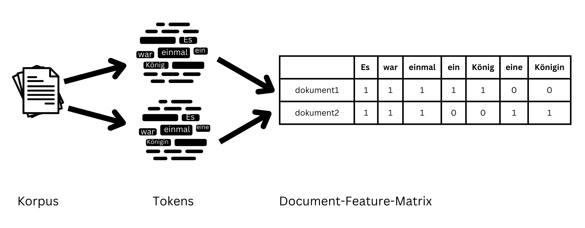
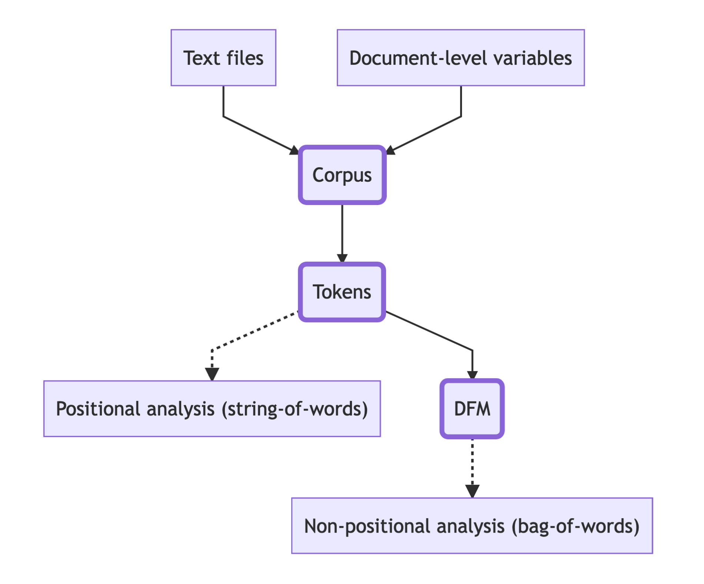

# Textanalyse I: Korpus, Tokens, Daten und Dateien

## Was sind eigentlich Daten?   

> Most of my colleagues in literary and cultural studies would not necessarily speak of their objects of study as “data.” If you ask them what it is they are studying, they would rather speak of books, paintings and movies; of drama and crime fiction, of still lives and action painting; of German expressionist movies and romantic comedy. [...] However, in the humanities just as in other areas of research, we are increasingly dealing with “data.”

Quelle: Christoph Schöch (2013). [Clean? Smart? Messy? Data in the Humanities, in: Journal of Digital Humanities 2, no. 3](http://journalofdigitalhumanities.org/2-3/big-smart-clean-messy-data-in-the-humanities/)

In den Geisteswissenschaften wird der Begriff "Daten" kaum verwendet, aber in den Digital Humanities allgemein und besonders in der Textanalyse sind "Daten" allgegenwärtig. Auch in diesem Seminar haben wir bereits  "Datentypen" und "Datenstrukturen" kennengelernt. Aber was sind denn eigentlich *geisteswissenschaftliche* Daten? Und was sind *Text*daten, oder anders formuliert: Wie wird eine Textdatei zu Daten, die in R repräsentiert, bearbeitet und ausgewertet werden können? Um uns dem Begriff anzunähern, betrachten wir zwei Passagen aus Christoph Schöchs Aufsatz ["Big? Smart? Clean? Messy? Data in the Humanities"]((http://journalofdigitalhumanities.org/2-3/big-smart-clean-messy-data-in-the-humanities/)) (2013). 

Schöch fasst zunächst Diskussionen zur Begriffsbestimmung in den Digital Humanities zusammen: 

> Some practitioners of digital humanities, notably Joanna Drucker, have argued that the term “data” is actually inadequate. And indeed, the term’s etymology seems problematic in the context of the humanities: it comes from the Latin datum, which means “that which is given.” This means it carries with it the meaning of an observer-independent fact which cannot be challenged in itself. Johanna Drucker prefers to speak of “capta” instead of data, literally “that which has been captured or gathered”, underlining the idea that even the very act of capturing data in the first place is oriented by certain goals, done with specific instruments, and driven by a specific attention to a small part of what could have been captured given different goals and instruments. In other words, capturing data is not passively accepting what is given, but actively constructing what one is interested in. (Schöch 2013)

Und schlägt dann eine eigene Definition für den Begriff "Daten" vor:

> Data in the humanities could be considered a digital, selectively constructed, machine-actionable abstraction representing some aspects of a given object of humanistic inquiry. (Schöch 2013)

**Geisteswissenschaftliche Daten** sind also erst einmal ganz allgemein **"digitale Abstraktionen", die Aspekte eines (Forschungs-)Objekts repräsentieren**. Sie sind dabei nicht einfach "gegeben", sondern sie werden aktiv von Forscher:innen im Hinblick auf eine bestimmte Fragestellung konstruiert und mithilfe von ganz konkreten Methoden nach bestimmten Regeln gesammelt. Vielleicht erinnert euch das aus die Lektüre aus der ersten Woche: Eine ganz ähnliche Idee haben auch die Autor:innen von "Mapping Texts" mit ihrem Gegenbegriff "Mapping" zum gängigen "Mining" formuliert ([Stolz/Taylor 2024](https://global.oup.com/academic/product/mapping-texts-9780197756881)). 

Je nachdem, wie die so gesammelten Daten organisiert sind, kann zwischen **strukturierten** und **unstrukturierten Daten** unterschieden werden: 

> Structured data is typically held in a database in which all key/value pairs have identifiers and clear relations and which follow an explicit data model. Plain text is a typical example of unstructured data, in which the boundaries of individual items, the relations between items, and the meaning of items, are mostly implicit. Data held in XML files is an example of semi-structured data, which can be more or less strictly constrained by the absence or presence of a more or less precise schema. (Schöch 2013)

Zusätzlich kann zwischen **Daten** und **Metadaten** unterschieden werden: 

> [...] “data” refers to the part of a file or dataset which contains the actual representation of an object of inquiry, while the term “metadata” refers to data about that data: metadata explicitly describes selected aspects of a dataset, such as the time of its creation, or the way it was collected, or what entity external to the dataset it is supposed to represent. (Schöch 2013)

Aber was sind denn ganz konkret die Daten, mit denen wir bei der Textanalyse zu tun haben? Sind diese Daten strukturiert, unstrukturiert oder semi-strukturiert? Und was sind "Metadaten" von Textdaten? 

## Korpus, Tokens und Types 

In der computergestützten bzw. algorithmischen Textanalyse gibt es eine Reihe von Begriffen, um zwischen verschiedenen Organisationsebenen von Textdaten zu unterscheiden. In den folgenden Sitzungen zur Textanalyse werden die folgenden Begriffe immer wieder vorkommen:

- **Korpus**: Texte oder andere Objekte, die auf eine bestimmte Weise mit einem Forschungsziel oder im Hinblick auf einen bestimmten Aspekt gesammelt wurden. Bei Textkorpora kann das beispielsweise die Textsorte, Epoche oder Autor:in sein (s.  [forText](https://fortext.net/ueber-fortext/glossar/korpus)).  "Eine nach bestimmten Regeln geordnete und nach Auswahlkriterien zusammengestellte Sammlung von Texten" ([Riebling 2019, S. 152](https://d-nb.info/1188242121/34)). Dabei ist wichtig zu beachten, dass es von der Forschungsfrage, die auf der Grundlage eines Korpus beantwortet werden soll, abhängt, ob die Zusammenstellung des Korpus sinnvoll ist oder nicht. Jedes Korpus hat blinde Flecken und Auslassungen und spiegelt immer eine bestimmte Perspektive wieder. Ein "neutrales" Korpus gibt es in diesem Sinne nicht ([Grimmer et al. 2022, S. 35-37](https://fu-berlin.primo.exlibrisgroup.com/permalink/49KOBV_FUB/1v1tp5h/alma9960725495502883)).
- **Tokens**: Vorkomnisse von Wörtern oder Äußerungen in Texten (s.  [forText](https://fortext.net/ueber-fortext/glossar/type-token))
- **Types**: Typen von Wörtern oder Äußerungen in Texten (s.  [forText](https://fortext.net/ueber-fortext/glossar/type-token))
- **Document-Term-Matrix** (kurz DTM, oder **Document-Feature-Matrix**, DFM): Eine numerische Repräsentation eines Textkorpus als Matrix, bei der jede Zeile einem Satz, Text oder einer anderen Analyseeinheit ("document") entspricht, und jede Spalte einem Token oder Type ("term" bzw. "feature"). In den Zellen wird angezeigt, ob bzw. wie häufig jedes Token oder Type in einem Dokument vorkommt (s. [Jünger/Gärtner 2023](https://doi.org/10.1007/978-3-658-37747-2_9); [Van Atteveldt 2022](https://cssbook.net/content/chapter10.html#sec-dtm)).

:::tip
Achtung

Es heißt "**das** Korpus" und nicht "der Korpus". 

:::

Wie verhalten sich also die Begriffe "Korpus", "Tokens" und "Types" zum Begriff der Daten?

Textkorpora liegen zunächst als **Dateien** vor, z.B. als PDF-Dateien, XML-Dateien oder Plaintext-Dateien. Diese Dateien selbst sind (nach unserer Definition) noch keine Daten. Damit der Text in R analysiert werden kann, muss der Computer den Text aus den Dateien einlesen können, und das geht nur, wenn der Text in maschinenlesbarer Form vorliegt. Plaintext-Dateien (also Dateien mit der Dateiendung .txt) und XML-Dateien (lernen wir noch) sind zum Beispiel immer maschinenlesbar, während ein Foto eines Textes oder ein Text, der eingescant und als PDF-Datei gespeichert wurde, nicht maschinenlesbar sind. Um solche Texte maschinenlesbar zu machen, müssen komplexe Verfahren der optischen Zeichenerkennung (OCR) angewandt werden. In diesem Seminar werden wir ausschließlich mit bereits maschinenlesbaren Texten arbeiten, und zwar mit Plaintext- und XML-Dateien. 

Ein Korpus kann direkt aus Plaintext- oder XML-Dateien in R eingelesen werden. Beim **Einlesen** von Plaintext-Dateien können **Metadaten** zu jedem Text aus dem Dateinamen extrahiert werden, zum Beispiel der Name der Autor:in, das Publikationsjahr und der Titel eines Textes. Der Text selbst repräsentiert die eigentlichen Daten, die noch unstrukturiert vorliegen: In einem Korpus von Texten verschiedener Autor:innen können wir zum Beispiel davon ausgehen, dass sich das verwendete Vokabular unterscheidet oder dass vielleicht ein:e Autor:in im Schnitt kürzere Sätze schreibt als ein:e andere:r, aber diese Merkmale sind implizit und liegen nicht in strukturierter Form vor. Welche Merkmale oder Aspekte uns interessieren, hängt wiederum von der Auswahl der Texte und unserer Forschungsfrage ab; wir finden also diese Merkmale nicht einfach als "Daten" vor.
Wenn Texte dagegen aus XML-Dateien eingelesen werden, ist der Text bereits vor dem Einlesen teilweise strukturiert (oder "semi-strukturiert") und mit Metainformationen versehen. Darauf kommen wir in der Sitzung zu XML-TEI noch einmal zurück. 

Text wird im Computer als Abfolge von Zeichen abgebildet. In R ist eine Abfolge von Zeichen ein Objekt vom Typ character. Wie wir bereits gesehen haben, kann aber auf Zeichen in R nicht einzeln zugegriffen werden. Verschiedene Wörter bilden dieselbe Zeichenkette und können nicht unterschieden werden. Deswegen wird Text tokenisiert: Das **Tokenisieren**, also das Zerlegen des Textes in sinnvolle Einheiten (Tokens), ermöglicht zum einen den Zugriff auf einzelne Wörter oder Äußerungen im Text, und zum anderen deren quantitative Auswertung. 

Was genau eine Einheit (also ein Wort oder eine Äußerung) in einem Text bildet, ist jedoch **kontextabhängig**: In einem Korpus von Social Media Posts zum Beispiel hat das Rautezeichen eine besondere Bedeutung und Raute-Wortkombinationen wie #digitalhumanities bilden ein Token. Aber das Rautezeichen kann in einem anderen Kontext etwas ganz anderes bedeuten; zum Beispiel kommt es auch in URLs vor, um Ankerelemente zu kennzeichnen. Ein Punkt kann das Ende eines Satzes kennzeichnen, oder er ist Teil eines Titels wie Prof. oder Mr. Nach welchen Regeln ein Text tokenisiert werden soll und was dabei als Token gezählt wird, hängt nicht zuletzt auch von der Forschungsfrage ab. In seinem Werk ["Enumerations: Data and Literary Study"](https://press.uchicago.edu/ucp/books/book/chicago/E/bo28465405.html) hat Andrew Piper beispielsweise ein ganzes Kapitel einer quantitativen Analyse der  Bedeutung von Satzzeichen in der Lyrik gewidment: Ein Satzzeichen ist für eine solche Analyse offensichtlich ein sehr wichtiges Token. In anderen Analysen spielen Satzzeichen dagegen gar keine Rolle. **Schon beim Tokenisieren treffen Forscher:innen also aktive Entscheidungen, wie Textdaten strukturiert und repräsentiert werden: sie konstruieren die Daten und finden sie nicht einfach vor.** 

In R kann ein tokenisierter Text als spezieller Vektor dargestellt werden, bei dem jedes Token ein Element bildet. Im quanteda-Kontext wird dazu ein **tokens-Objekt** verwendet: Ein tokens-Objekt bildet ein tokenisiertes Korpus im Grunde als eine Liste von Vektoren ab, wobei jedes Element der Liste einem Dokument aus dem Korpus entspricht. Die Reihenfolge der Tokens ist für alle Texte in einem tokens-Objekt beibehalten. Es handelt sich dabei lediglich um eine **Repräsentation von Texten als Abfolge von Tokens** (also als **"string of words"**).

Ein weiterer Abstraktionsschritt ist die numerische **Repräsentation von Texten als Ansammlung von Tokens ohne festgelegte Reihenfolge** (also als **"bag of words"**). Wie wir bereits gesehen haben, kann eine **Document-Term-Matrix** bzw. eine **Document-Feature-Matrix** (DFM) verwendet werden, um ein Korpus auf diese Weise darzustellen. Die Textdaten liegen als DFM strukturiert vor: Die Beziehung zwischen Dokumenten und Tokens (oder Types) ist durch die Spalten und Zeilen klar definiert und wird durch die Angabe, ob bzw. wie oft jedes Token vorkommt, zusätzlich quantifiziert. 

Bildlich kann man sich den Zusammenhang zwischen Korpus, Tokens und DFM so vorstellen: 



Dabei muss jedoch beachtet werden, dass die Zeilen in einer DFM wie eingangs erwähnt nicht unbedingt die tatsächlichen Dokumente aus dem Korpus repräsentieren müssen. Manchmal werden auch kleinere Einheiten für die Analyse verwendet, zum Beispiel Sätze oder andere Segmente. 

:::task
Verständnisfragen: 

- Welche Zeichen bilden jeweils inhaltlich zusammenhängende Einheiten in [diesen beiden Tweets](https://x.com/GretaThunberg/status/1608056944501178368) von Greta Thunberg (der viertmeistgelikte Tweet aller Zeiten laut [Wikipedia](https://en.wikipedia.org/wiki/List_of_most-liked_tweets)) und Andrew Tate? 
- Angenommen, die beiden Tweets werden so tokenisiert, dass die in der vorigen Frage identifizierten Einheiten Tokens bilden. Wie viele Tokens hat der Tweet von Greta Thunberg? Wie viele Types? 
- Wie würde eine Document-Feature-Matrix für die beiden Tweets aussehen, wenn die Zeilen jeweils den ersten Satz aus den beiden Tweets repräsentieren? 

:::


## Vom Korpus zur Analyse 

**Wir haben bereits gesehen, dass sowohl die Auswahl und Zusammenstellung des Korpus als auch die Wahl eines Verfahrens zum Tokenisieren der Texte Entscheidungen voraussetzen, bevor wir überhaupt mit der eigentlichen Analyse begonnen haben. Also wo beginnt man bei einem Textanalyseprojekt? Wie trifft man diese Entscheidungen?** Es gibt verschiedene Zugänge, die bereits in den Lektüren zur ersten Sitzung angedeutet wurden. Zur Erinnerung: 

Evelyn Gius und Janina Jacke haben zwischen **"explorativen"** und **"konfirmatorischen"** Methoden unterschieden ([Gius/Jacke, S. 10f.](https://doi.org/10.22148/001c.46662)). Beim explorativen Zugriff wird ein Korpus demnach mit programmatischen Methoden untersucht, um über die geänderte oder auch entfremdete Perspektive eine Fragestellung zu entwickeln, der im Anschluss mithilfe quantitativer oder aber auch "klassischer" qualitativer Analysemethoden nachgegangen werden kann. Beim konfirmatorischen Zugriff steht dagegen die Fragestellung vorab fest und es werden ganz gezielt Methoden der quantitativen Textanalyse angewandt, um eine Hypothese zu testen. Bei diesem Zugriff ist eine vorsichtige und kritische **Operationalisierung** der Fragestellung notwendig. Dem Begriff Operationalisierung seid ihr im Text von Axel Pichler und Nils Reiter begegnet: Operationalisierung ist der "Arbeitsprozess, einem theoretischen Begriff messbare Textoberflächenphänomene zuzuordnen" ([Pichler/Reiter 2021, S. 12](https://doi.org/10.1515/jlt-2021-2008)), also das Werkzeug, mit dem Fragestellungen von den "klassischen" in die digitalen Geisteswissenschaften überführt werden können. Der Operationalisierungsprozess ist oft das schwierigste an der gesamten Textanalyse, denn dabei müssen laut Pichler und Reiter sowohl die "**mitbestimmenden literaturtheoretischen Hintergrundannahmen**" (oder andere fachspezifische theoretische Hintergründe) als auch die "**Hintergrundannahmen der algorithmischen Textanalyse**" verstanden und berücksichtigt werden (S. 24). Was bedeutet das? 

Die Betrachtung von Kookkurrenzen, also von Wörtern, die mit bestimmten Begriffen in einem bestimmten Kontext gemeinsam vorkommen, ist eine gängige Operationalisierung für Fragestellungen, bei denen es um kontextuelle Bedeutungen von Begriffen oder auch den Bedeutungswandel über die Zeit geht. Diese Art der Operationalisierung wurde auch in dem Text von Sayan Bhattacharyya aus der ersten Woche diskutiert ([Bhattacharyya 2021, S. 81](https://muse.jhu.edu/book/84470)). Bhattacharyya kritisiert Textanalysemethoden, welche die Häufigkeit einzelner Wörter in einem Korpus über die Zeit hinweg vergleichen, um daran einen Bedeutungswandel festzumachen. Diesem Vorgehen liege ein Verständnis von Wörtern als "neutrale, unproblematische Objekte" zugrunde, die als "Stellvertreter für Konzepte innerhalb einer stabilen Architektur von Konzepten fungieren" (S. 81). Diese theoretische Annahme sei aber für das Verständnis der "polysemischen und mehrsprachigen Textwelt" des Black Atlantic gänzlich ungeeignet, da sich die Bedeutungen europäischer Wörter darin fortlaufend verändern und oft zusätzliche Bedeutungsebenen annähmen (S.82). Bhattacharyya hebt dagegen Analysemethoden, die Kookkurrenzen und Word Embeddings betrachten, positiv hervor: 

>By taking the relationships between words (expressed as cooccurrences of words), rather than the words themselves, as the basic unit of representation, this way of computationally representing text ends up treating the meaning of words as following from the relationships and dependencies between words or sets of words, rather than as properties of the individual words. (S. 81)

**Bhattacharyyas Artikel ist ein gutes Beispiel dafür, wie kritisch bewertet werden kann, ob die  epistemologischen und theoretischen Grundannahmen verschiedener Operationalisierungen einer Fragestellung mit den eigenen Grundannahmen und mit dem spezifischen Korpus, das untersucht werden soll, vereinbar sind.**

Kookkurrenzen und Word Embeddings werden wir erst in den nächsten Wochen kennenlernen, aber wir können bereits an dieser Stelle einen weiteren, grundlegenden Aspekt hervorheben: **Genauso wie geisteswissenschaftliche Fragestellungen unterschiedliche theoretische Hintergründe haben, haben auch verschiedene Analysemethoden selbst verschiedene theoretische (und das bedeutet hier meist mathematische) Hintergründe.** Das gemeinsame Vorkommen von zwei Wörtern in einem Text kann nämlich sehr verschieden bestimmt und bewertet werden, je nachdem, welche Grundannahmen vorausgesetzt werden. Zum Beispiel können zwei aufeinanderfolgende Wörter wahrscheinlichkeitstheoretisch betrachtet werden: es wird ein Wort ausgewählt und die bedingte Wahrscheinlichkeit bestimmt, dass darauf ein bestimmtes anderes Wort folgt (siehe dazu z.B. [Jurafsky/Martin, N-Gram Language Models, S. 31-37](https://web.stanford.edu/~jurafsky/slp3/)). Dieser Vorgang kann für alle Wörter in einem Korpus wiederholt werden, bis das Wort gefunden wurde, das mit der größten Wahrscheinlichkeit auf das ausgewählte Wort folgt. Alternativ können auch alle Paare von aufeinanderfolgenden Wörtern in einem Korpus gezählt werden und die Wortkombinationen, die im Verhältnis zu anderen besonders häufig vorkommen, werden ausgewählt (siehe dazu den Abschnitt "Kollokationen" in der übernächsten Woche, hier stark vereinfacht).

Zwei Wörter können aber auch nach ganz anderen Kriterien ausgewählt werden: zum Beispiel kann die "Nähe" von zwei Wörtern zueinander nicht nur daran bemessen werden, wie wahrscheinlich es ist, dass sie direkt aufeinanderfolgen. Eine andere Möglichkeit, das Verhältnis von zwei Wörtern zueinander zu beschreiben, ist, den Kontext zu vergleichen, in dem sie vorkommen. Dieser Kontext besteht aus allen Wörtern, die mit einem bestimmten Wort gemeinsam vorkommen. Für all diese Wörter wird gezählt, wie oft sie mit dem Wort vorkommen, und die so berechneten Werte können als Vektor im Sinne der linearen Algebra aufgefasst werden (siehe dazu z.B. [Jurafsky/Martin, Vector Semantics and Embeddings, S. 31-37](https://web.stanford.edu/~jurafsky/slp3/), wiederum hier sehr vereinfacht). Die Ähnlichkeit zweier Wort-Vektoren zueinander kann dann als Abstand zweier Vektoren voneinander mit Methoden der linearen Algebra bestimmt werden. 

Auch die Document-Feature-Matrix selbst kann auf unterschiedliche Weisen interpretiert werden: Justin Grimmer, Margarete Roberts und Brandon Stewart unterscheiden in "Text as Data" zwischen zwei grundlegenden "Hintergrundannahmen der algorithmischen Textanalyse" (wie es Pichler und Reiter ausdrücken): Sie unterscheiden zwischen **probabilistischen Ansätzen**, denen wahrscheinlichkeitstheoretische Annahmen zugrunde liegen, und **algorithmischen Ansätzen**, denen  Konzepte aus der linearen Algebra zugrunde liegen ([Grimmer et al. 2022, S. 60-77](https://fu-berlin.primo.exlibrisgroup.com/permalink/49KOBV_FUB/1v1tp5h/alma9960725495502883)). Nach dem wahrscheinlichkeitstheoretischen Modell wird jede Zeile in einer Document Feature Matrix aufgefasst als "random draw from a multinomial distribution", während das Vektorraummodell jede Zeile interpertiert als "vector in a high-dimensional space" (S. 70).  

Ihr seht: **Der theoretische Hintergrund der  Textanalyse mit R ist durchaus komplex und um wirklich tief einzusteigen, kommt man irgendwann nicht mehr darum herum, sich mit den mathematischen Grundlagen der verschiedenen Textanalysemethoden** zu beschäftigen. Für dieses Seminar sind keine mathematischen Vorkenntnisse vorausgesetzt, deswegen werde ich zu den Textanalysemethoden immer optionale Kapitel über die mathematischen Hintergründe zur Verfügung stellen, die ihr in solchen ausklappbaren Abschnitten findet: 


<details>
<summary><b>Hier verbirgt sich ein optionaler Abschnitt</b></summary>

Das Verhältnis zwischen "wie interessant ist die Analyse" und "verstehe ich überhaupt was hier passiert" lässt sich anfangs vielleicht ungefähr so darstellen: 


```{=html}
<div class="plotly html-widget html-fill-item" id="htmlwidget-99e8037cf324f52888e6" style="width:672px;height:480px;"></div>
<script type="application/json" data-for="htmlwidget-99e8037cf324f52888e6">{"x":{"visdat":{"bf355701e2dc":["function () ","plotlyVisDat"]},"cur_data":"bf355701e2dc","attrs":{"bf355701e2dc":{"x":{},"y":{},"mode":"lines","alpha_stroke":1,"sizes":[10,100],"spans":[1,20],"type":"scatter"}},"layout":{"margin":{"b":40,"l":60,"t":25,"r":10},"title":"Interessantheit vs. Verständlichkeit","xaxis":{"domain":[0,1],"automargin":true,"title":"Interessantheit der Analyse","zeroline":false},"yaxis":{"domain":[0,1],"automargin":true,"title":"Verständlichkeit der Methode","zeroline":false},"hovermode":"closest","showlegend":false},"source":"A","config":{"modeBarButtonsToAdd":["hoverclosest","hovercompare"],"showSendToCloud":false},"data":[{"x":[10,9,8,7,6,5,4,3,2,1,0],"y":[0,1,2,3,4,5,6,7,8,9,10],"mode":"lines","type":"scatter","marker":{"color":"rgba(31,119,180,1)","line":{"color":"rgba(31,119,180,1)"}},"error_y":{"color":"rgba(31,119,180,1)"},"error_x":{"color":"rgba(31,119,180,1)"},"line":{"color":"rgba(31,119,180,1)"},"xaxis":"x","yaxis":"y","frame":null}],"highlight":{"on":"plotly_click","persistent":false,"dynamic":false,"selectize":false,"opacityDim":0.20000000000000001,"selected":{"opacity":1},"debounce":0},"shinyEvents":["plotly_hover","plotly_click","plotly_selected","plotly_relayout","plotly_brushed","plotly_brushing","plotly_clickannotation","plotly_doubleclick","plotly_deselect","plotly_afterplot","plotly_sunburstclick"],"base_url":"https://plot.ly"},"evals":[],"jsHooks":[]}</script>
```


</details>

## Überblick: Textanalyse mit Quanteda

Zum Einstieg in die Textanalyse werden wir uns nächste Woche mit ganz einfachen Worthäufigkeiten beschäftigen. Im Kapitel IV: Funktionen und Pakete haben wir bereits das Paket `quanteda` kennengelernt. Das Paket quanteda bietet eine Vielzahl Funktionen zur quantitativen Analyse von Text sowie spezialisierte Datenstrukturen und sogar Datensätze. Zur Analyse von Worthäufigkeiten werden wir vor allem mit quanteda arbeiten. 

Bevor wir ganz praktisch in die Textanalyse mit quanteda einsteigen, verschaffen wir uns einen theoretischen Überblick über das Vorgehen: 

Zur Textanalyse mit quanteda wird gewöhnlich zunächst ein Korpus aus Plaintext-Dateien im RStudio eingelesen. Die Texte werden dann mithilfe verschiedener Funktionen in quanteda-Datenobjekte umgewandelt: In ein quanteda corpus-Objekt, tokens-Objekt und/oder in eine Document Feature Matrix (DFM). Für verschiedene Arten von Analysen verwendet man verschiedene Arten von Objekten. Grundsätzlich wird dabei in Quanteda zwischen Bag-of-Words und String-of-Words Methoden unterschieden, also zwischen Methoden, bei denen die Reihenfolge der Tokens beibehalten wird (String-of-Words) und jenen, bei denen die Reihenfolge keine Rolle spielt (Bag-of-Words). Bei String-of-Words Methoden werden Texte also als Abfolge von Wörtern behandelt, und bei Bag-of-Words-Methoden als Ansammlung von Wörtern. Da ein tokens-Objekt in quanteda Texte als Abfolge von Wörtern repräsentiert, werden für Analysen, bei denen die Reihenfolge der Tokens eine Rolle spielt, quanteda tokens-Objekte verwendet. Wenn die Reihenfolge keine Rolle spielt, wird eine DFM verwendet, da eine DFM Texte als Ansammlung von Wörtern repräsentiert.

Die folgende Überblicksdarstellung illustriert, welche quanteda-Objekte für welche Analysemethoden verwendet werden können: 



Um auf die quanteda-Funktionen zugreifen zu können, müssen neben dem Paket quanteda weitere Pakete installiert werden. Weil die Pakete alle zusammengehören, werden diese "Unterpakete" auch Module genannt: 

- quanteda: contains all of the core natural language processing and textual data management functions
- quanteda.textmodels: contains all of the text models and supporting functions, namely the textmodel_*() functions
- quanteda.textstats: statistics for textual data, namely the textstat_*() functions
- quanteda.textplots: plots for textual data, namely the textplot_*() functions

In der heutigen Stunde werden wir die grundlegenden quanteda-Funktionen und quanteda-Datenstrukturen kennenlernen. Als Beispiel dient uns ein Korpus deutschsprachiger belletristischer Texte aus dem späten 19. und frühen 20. Jahrhundert. Zunächst werden wir das Korpus einlesen, danach werden wir quanteda corpus- und tokens-Objekte und zuletzt eine DFM erstellen. 

## Textdateien einlesen

Um Dateien in R einzulesen, muss zuerst das Arbeitsverzeichnis gesetzt werden. Das heißt, dass wir dem Computer mitteilen müssen, in welchem Ordner auf unserem Computer sich die Dateien befinden, die wir einlesen wollen. Um das Arbeitsverzeichnis zu setzen, gibt es mehrere Möglichkeiten: 


``` r
# Arbeitsverzeichnis setzen

setwd("/Users/gast/R-Seminar") # Setzt hier euren eigenen Pfad ein
# Backslashes für Windows:
# setwd("C:\Users\gast\R-Seminar")
```

Alternativ kann das Arbeitsverzeichnis auch über den Tab "Files" im Fenster unten rechts gesetzt werden. Navigiert euch dazu erst in den gewünschten Ordner, klickt dann auf "More" und "Set As Working Directory".

Wenn wir das Arbeitsverzeichnis gesetzt haben, können wir die Dateien einlesen. Auch hier gibt es mehrere Möglichkeiten: Zum Einlesen von Dateien können entweder R-Basisfunktionen verwendet werden oder Funktionen aus einem R Paket. Die Entwickler:innen von quanteda empfehlen, zum Einlesen eines Textkorpus die Funktion `readtext()` aus dem Paket readtext zu verwenden. Beim Einlesen der Texte mithilfe der `readtext()`-Funktion können direkt Metadaten aus den Dateinamen extrahiert werden, im Beispiel unten Autor:innennamen, Titel und Publikationsjahre der Texte. Diese Metadaten auf Dokumentenebene heißen im readtext- und quanteda-Kontext dann "docvars". Wir vergleichen im Folgenden die verschiedenen Einlesefunktionen:  


``` r
# 1. R base Funktionen - Beispiele 

# multi-purpose Funktion "scan"
kafka_1 <- scan("kafka_verwandlung_1915.txt", what="character", encoding = "UTF-8", sep="\n")
# Alternative nur für Textdateien: readLines
kafka_2 <- readLines("kafka_verwandlung_1915.txt")

# 2. Paket readtext 

install.packages("readtext")
library(readtext)

# einen Text einlesen und einer Variable zuweisen
kafka_3 <- readtext("kafka_verwandlung_1915.txt", encoding = "UTF-8")
# zwei Texte einlesen 
kafka_3 <- readtext(c("kafka_verwandlung_1915.txt", "kafka_prozess_1925.txt"), encoding = "UTF-8")
kafka_3
# alle Texte in einem Ordner einlesen 
ein_korpus <- readtext("korpus/*.txt", encoding = "UTF-8")
ein_korpus
# Texte in einem Unterordner einlesen 
noch_ein_korpus <- readtext("Unterordner/*.txt", encoding = "UTF-8") # oder /Unterordner/*.txt
noch_ein_korpus
# Texte in einem Ordner einlesen und Metadaten aus den Dateinamen extrahieren
ger_texte <- readtext("korpus/*.txt", docvarsfrom = "filenames", dvsep = "_", docvarnames = c("Autor_in", "Titel", "Jahr"), encoding = "UTF-8")
ger_texte

# Vergleich
typeof(kafka_1) #scan
typeof(kafka_2) #readLines
typeof(kafka_3) #readtext
class(kafka_3)
```


Beachtet, dass die Funktion `typeof()` angibt, wie ein Objekt intern in R gespeichert ist. Das muss immer eine der grundlegenden R Datenstrukturen sein, die wir in Kapitel II kennengelernt haben. Die Funktion `class()` dagegen gibt an, wie ein Objekt in R behandelt wird: Das heißt, auch wenn manche Pakete ihre eigenen Datenstrukturen definieren und festlegen, welche Eigenschaften diese haben und Funktionen darauf angewendet werden können, müssen diese Datenstrukturen irgendwie wieder als R Datenstrukturen interpretiert werden, damit sie gespeichert werden können. Während das Objekt `kafka_3` also intern als Liste gespeichert ist, handelt es sich dabei eigentlich um einen Dataframe, und ganz genau gesagt um ein readtext-Objekt. Das Objekt teilt also Eigenschaften mit R Dataframes, aber es hat auch weitere spezielle Eigenschaften von readtext-Objekten, und es gibt Funktionen, die nur auf genau diese Art von Objekt angewendet werden können. 

:::task
Verständnisfragen:

- Was ist der Unterschied zwischen den Objekten, die wir mit `readLines()`, `scan()` und `readtext()` erstellt haben?
- Welche anderen Unterschiede könnt ihr den R-Dokumentationsseiten zu den  Funktionen entnehmen?

:::

Bereits nach dem Einlesen können wir uns einen Überblick über das Korpus verschaffen. Dabei können auch die beim Einlesen aus den Dateinamen extrahierten Metadaten zu den einzelnen Texten abgefragt werden.  


``` r
# Alle Texte mit Publikationsjahr 1912 auswählen 
ger_texte$doc_id[ger_texte$Jahr == 1912]
```

```{style="max-height: 200px;"}
## character(0)
```

``` r
# Wie viele Texte gibt es aus dem Jahr 1912? 
length(ger_texte$doc_id[ger_texte$Jahr == 1912])
```

```{style="max-height: 200px;"}
## [1] 0
```

``` r
# Häufigkeitstabelle der Publikationsjahre
table(ger_texte$Jahr)
```

```{style="max-height: 200px;"}
## 
## 1883 1888 1894 1896 1899 1901 1903 1905 1913 1915 1918 1919 1920 1924 1925 1926 
##    1    1    1    1    1    1    2    1    2    1    1    1    1    2    2    1
```


## Character Encodings

Text wird im Computer eigentlich als Abfolge von Zeichen abgebildet, und jedes Zeichen wird im Computer durch eine Zahlenfolge repräsentiert. Wie genau diese Folge aussieht, hängt davon ab, welche Kodierung (Encoding) dazu verwendet wird. Das folgende Beispiel aus Kevin Usheys Beitrag ["String Encoding and R"](https://kevinushey.github.io/blog/2018/02/21/string-encoding-and-r/) illustriert diesen Umstand: 


``` r
utf8 <- "\u00fb"  # 'û'
latin1 <- iconv(utf8, to = "latin1")
paste(latin1, "(latin1):", pryr::bits(latin1))
```

```
## [1] "û (latin1): 11111011"
```

``` r
paste(utf8,   "(UTF-8) :", pryr::bits(utf8))
```

```
## [1] "û (UTF-8) : 11000011 10111011"
```

Eine der ersten Kodierungen war ASCII, mit der allerdings nur Zeichen aus dem lateinischen Alphabet, Zahlen und einige Sonderzeichen repräsentiert werden können. Heutzutage gibt es mit Unicode einen international anerkannten Standard-Zeichensatz. Dieser Zeichensatz ordnet nicht nur allen Zeichen im lateinischen Alphabet, sondern allen Zeichen in allen Schriftsprachen und sogar Symbolen wie Emojis einen einzigartigen Zahlenwert zu. Solche Unicode-Zahlenwerte heißen "Codepunkte". Zeichenketten, die als Unicode-Codepunkte repräsentiert werden, können mithilfe von Kodierungen wie UTF-8 in Zahlenfolgen, die nur aus Nullen und Einsen bestehen (Bytes) umgewandelt werden. R unterstützt mehrere Kodierungen, aber es empfiehlts sich, beim Einlesen und Schreiben von Textdateien die Kodierung UTF-8 zu verwenden. Beim Einlesen der Textdateien in den Beispielen oben haben wir deswegen die readtext-Funktion mit dem zusätzlichen Argument `encoding = "UTF-8"` aufgerufen. 

Mit der Funktion `Encoding()` kann nach dem  Einlesen überprüft werden, ob das Encoding korrekt erkannt wird: 


``` r
Encoding(ger_texte[1, 2])
```

```
## [1] "UTF-8"
```


Beim Einlesen und Speichern von Dateien muss in R auf die Wahl des richtigen Encodings geachtet werden, insbesondere beim Umgang mit nicht-lateinischen Schriften. Das werden wir später in der Praxis genauer betrachten.


## Quanteda corpus-Objekte 

Ein Quanteda corpus-Objekt enthält die eingelesenen Texte selbst, sowie Metadaten auf Dokument- und Korpusebene. 


``` r
install.packages("quanteda")
```


``` r
library(quanteda)

# quanteda-Korpusobkjekt erstellen
ger_korpus <- corpus(ger_texte)
ger_korpus
```

```{style="max-height: 200px;"}
## Corpus consisting of 20 documents and 3 docvars.
## fontane_briest_1896.txt :
## "In Front des schon seit Kurfürst Georg Wilhelm von der Famil..."
## 
## fontane_irrungen_1888.txt :
## "An dem Schnittpunkte von Kurfürstendamm und Kurfürstenstraße..."
## 
## fontane_reise_1894.txt :
## "Zu den Eigentümlichkeiten unserer Zeit gehört das Massenreis..."
## 
## fontane_stechlin_1899.txt :
## "Im Norden der Grafschaft Ruppin, hart an der mecklenburgisch..."
## 
## fontane_wuthenow_1883.txt :
## "In dem Salon der in der Behrenstraße wohnenden Frau v. Caray..."
## 
## kafka_amerika_1925.txt :
## "Als der sechzehnjährige Karl Roßmann, der von seinen armen E..."
## 
## [ reached max_ndoc ... 14 more documents ]
```

Die Funktion `str()` kann verwendet werden, um einen Überblick über die Struktur des Objekts zu erhalten. Da ein Quanteda corpus-Objekt neben den Texten selbst auch Metadaten enthält, gibt die `str()`-Funktion einen Überblick über alle Metadaten. Die Metadaten der einzelnen Dokumente (z.B. Dateinamen, ggf. mithilfe der readtext-Funktion extrahierte docvars)  können unter `attr(*, "docvars")` eingesehen werden. `attr(*, "meta")` beschreibt dagegen alle Metadaten auf Korpusebene (z.B. Informationen zu Ort und Zeit der Erstellung des corpus-Objekts). 


``` r
str(ger_korpus)
```

```{style="max-height: 200px;"}
##  'corpus' Named chr [1:20] "In Front des schon seit Kurfürst Georg Wilhelm von der Familie von Briest bewohnten Herrenhauses zu Hohen-Cremm"| __truncated__ ...
##  - attr(*, "names")= chr [1:20] "fontane_briest_1896.txt" "fontane_irrungen_1888.txt" "fontane_reise_1894.txt" "fontane_stechlin_1899.txt" ...
##  - attr(*, "docvars")='data.frame':	20 obs. of  6 variables:
##   ..$ docname_: chr [1:20] "fontane_briest_1896.txt" "fontane_irrungen_1888.txt" "fontane_reise_1894.txt" "fontane_stechlin_1899.txt" ...
##   ..$ docid_  : Factor w/ 20 levels "fontane_briest_1896.txt",..: 1 2 3 4 5 6 7 8 9 10 ...
##   ..$ segid_  : int [1:20] 1 1 1 1 1 1 1 1 1 1 ...
##   ..$ Autor_in: chr [1:20] "fontane" "fontane" "fontane" "fontane" ...
##   ..$ Titel   : chr [1:20] "briest" "irrungen" "reise" "stechlin" ...
##   ..$ Jahr    : int [1:20] 1896 1888 1894 1899 1883 1925 1920 1925 1919 1913 ...
##  - attr(*, "meta")=List of 3
##   ..$ system:List of 6
##   .. ..$ package-version:Classes 'package_version', 'numeric_version'  hidden list of 1
##   .. .. ..$ : int [1:3] 4 3 0
##   .. ..$ r-version      :Classes 'R_system_version', 'package_version', 'numeric_version'  hidden list of 1
##   .. .. ..$ : int [1:3] 4 3 3
##   .. ..$ system         : Named chr [1:3] "Darwin" "arm64" "lipogg"
##   .. .. ..- attr(*, "names")= chr [1:3] "sysname" "machine" "user"
##   .. ..$ directory      : chr "/Users/lipogg/Desktop/LV_Textanalyse/textanalyse-mit-r"
##   .. ..$ created        : Date[1:1], format: "2025-06-10"
##   .. ..$ source         : chr "data.frame"
##   ..$ object:List of 2
##   .. ..$ unit   : chr "documents"
##   .. ..$ summary:List of 2
##   .. .. ..$ hash: chr(0) 
##   .. .. ..$ data: NULL
##   ..$ user  : list()
```

Mit der Funktion `summary()` können Informationen zu den Texten selbst abgerufen werden. Die Funktion berechnet für jeden Text in einem Korpus die Anzahl der Tokens, der Types und der Sätze und bietet so einen ersten Überblick über das Korpus. 


``` r
# Weitere Informationen abrufen mit der summary()-Funktion
ger_info <- summary(ger_korpus) 
ger_info
```

```{style="max-height: 200px;"}
## Corpus consisting of 20 documents, showing 20 documents:
## 
##                              Text Types Tokens Sentences   Autor_in
##           fontane_briest_1896.txt 11846 118213      5875    fontane
##         fontane_irrungen_1888.txt  8823  63642      3546    fontane
##            fontane_reise_1894.txt  8086  43945      2167    fontane
##         fontane_stechlin_1899.txt 16162 156206      8998    fontane
##         fontane_wuthenow_1883.txt  8700  50846      2671    fontane
##            kafka_amerika_1925.txt 10407 100252      4023      kafka
##           kafka_landarzt_1920.txt  3813  15675       663      kafka
##            kafka_schloss_1925.txt 11392 133468      4631      kafka
##       kafka_strafkolonie_1919.txt  2505  12252       522      kafka
##             kafka_urteil_1913.txt  1345   4793       237      kafka
##        kafka_verwandlung_1915.txt  3968  22294       720      kafka
##              mann_budden_1901.txt 26631 285968     12806       mann
##               mann_tonio_1903.txt  5435  26161      1151       mann
##             mann_tristan_1903.txt  4085  17475       852       mann
##             mann_venedig_1913.txt  7588  29609      1011       mann
##          mann_zauberberg_1924.txt 36068 321896     12198       mann
##      schnitzler_casanova_1918.txt  7077  43424      1381 schnitzler
##          schnitzler_else_1924.txt  2827  19276      1803 schnitzler
##      schnitzler_tanzerin_1905.txt  5740  41441      2240 schnitzler
##  schnitzler_traumnovelle_1926.txt  5092  27465      1414 schnitzler
##         Titel Jahr
##        briest 1896
##      irrungen 1888
##         reise 1894
##      stechlin 1899
##      wuthenow 1883
##       amerika 1925
##      landarzt 1920
##       schloss 1925
##  strafkolonie 1919
##        urteil 1913
##   verwandlung 1915
##        budden 1901
##         tonio 1903
##       tristan 1903
##       venedig 1913
##    zauberberg 1924
##      casanova 1918
##          else 1924
##      tanzerin 1905
##  traumnovelle 1926
```


Die `summary()`-Funktion gibt einen Dataframe zurück. Es können deswegen alle Zugriffsoperationen und Funktionen auf das Objekt `ger_info` angewendet werden, die auf Dataframes angewendet werden können:  


``` r
# Minimum und Maximum der Spalten Jahr und Tokens
range(ger_info$Jahr) 
```

```
## [1] 1883 1926
```

``` r
range(ger_info$Tokens) 
```

```
## [1]   4793 321896
```

``` r
# Anzahl der verschiedenen Autor:innen 
length(unique(ger_info$Autor_in)) 
```

```
## [1] 4
```

``` r
# Gesamtzahl der Tokens im ger_korpus Korpus
sum(ger_info$Tokens) 
```

```
## [1] 1534301
```

``` r
# Titel des Textes mit den meisten Tokens
ger_info$Titel[ger_info$Tokens == max(ger_info$Tokens)]
```

```
## [1] "zauberberg"
```

``` r
# Autor:in des Textes mit den meisten Tokens
ger_info$Autor_in[ger_info$Tokens == max(ger_info$Tokens)]
```

```
## [1] "mann"
```

``` r
# Titel des Textes mit einer Tokenanzahl zwischen 250000 und 300000
ger_info$Titel[ger_info$Tokens >= 250000 & ger_info$Tokens <= 300000]
```

```
## [1] "budden"
```

Oft ist bei der Textanalyse der Vergleich zwischen verschiedenen Teilkorpora oder Unterkorpora von Interesse, beispielsweise, wenn die Texte verschiedener Autor:innen verglichen werden sollen. Ein **Teilkorpus** kann unkompliziert nach dem Einlesen der Texte erstellt werden: 


``` r
# Teilkorpus aus Kafka-Texten erstellen mit R Base-Funktionen
length(which(ger_korpus$Autor_in == "kafka"))
```

```{style="max-height: 200px;"}
## [1] 6
```

``` r
which(ger_korpus$Autor_in == "kafka") # gibt aus 6 7 8 9 10 11
```

```{style="max-height: 200px;"}
## [1]  6  7  8  9 10 11
```

``` r
ger_korpus[6:11] 
```

```{style="max-height: 200px;"}
## Corpus consisting of 6 documents and 3 docvars.
## kafka_amerika_1925.txt :
## "Als der sechzehnjährige Karl Roßmann, der von seinen armen E..."
## 
## kafka_landarzt_1920.txt :
## "Der neue Advokat. Wir haben einen neuen Advokaten, den Dr. B..."
## 
## kafka_schloss_1925.txt :
## "Es war spätabends, als K. ankam. Das Dorf lag in tiefem Schn..."
## 
## kafka_strafkolonie_1919.txt :
## "»Es ist ein eigentümlicher Apparat«, sagte der Offizier zu d..."
## 
## kafka_urteil_1913.txt :
## "Es war an einem Sonntagvormittag im schönsten Frühjahr. Geor..."
## 
## kafka_verwandlung_1915.txt :
## "Als Gregor Samsa eines Morgens aus unruhigen Träumen erwacht..."
```

``` r
# Teilkorpus aus Kafka-Texten erstellen: the quanteda way 
kafka_korpus <- corpus_subset(ger_korpus, Autor_in == "kafka")
kafka_korpus
```

```{style="max-height: 200px;"}
## Corpus consisting of 6 documents and 3 docvars.
## kafka_amerika_1925.txt :
## "Als der sechzehnjährige Karl Roßmann, der von seinen armen E..."
## 
## kafka_landarzt_1920.txt :
## "Der neue Advokat. Wir haben einen neuen Advokaten, den Dr. B..."
## 
## kafka_schloss_1925.txt :
## "Es war spätabends, als K. ankam. Das Dorf lag in tiefem Schn..."
## 
## kafka_strafkolonie_1919.txt :
## "»Es ist ein eigentümlicher Apparat«, sagte der Offizier zu d..."
## 
## kafka_urteil_1913.txt :
## "Es war an einem Sonntagvormittag im schönsten Frühjahr. Geor..."
## 
## kafka_verwandlung_1915.txt :
## "Als Gregor Samsa eines Morgens aus unruhigen Träumen erwacht..."
```


``` r
# Teilkorpus erstellen und Korpusinformationen zusammenfassen in einer Zeile
kafka_summary <- summary(corpus_subset(ger_korpus, Autor_in == "kafka"))
# Wir können auch stattdessen den Dataframe ger_info nach Kafka-Texten filtern: 
kafka_summary <- ger_info[ger_info$Autor_in == "kafka",]

# Wie viele Texte umfasst das Kafka-Korpus? View() öffnet im RStudio ein neues Fenster
View(kafka_summary) 
```


## Quanteda tokens-Objekte 

Ein Quanteda tokens-Objekt bildet ein tokenisiertes Korpus als eine Liste von Vektoren ab, wobei jedes Element der Liste einem Dokument aus dem Korpus entspricht. Die Reihenfolge der Tokens ist für alle Texte in einem tokens-Objekt beibehalten.


``` r
library(quanteda)

# quanteda-Tokensobjekt erstellen 
kafka_toks <- tokens(kafka_korpus)

# Print-Funktion muss für quanteda-Objekte angepasst werden: http://quanteda.io/reference/print-quanteda.html
print(kafka_toks[1]) # wird nicht komplett angezeigt
```

```{style="max-height: 200px;"}
## Tokens consisting of 1 document and 3 docvars.
## kafka_amerika_1925.txt :
##  [1] "Als"             "der"             "sechzehnjährige" "Karl"           
##  [5] "Roßmann"         ","               "der"             "von"            
##  [9] "seinen"          "armen"           "Eltern"          "nach"           
## [ ... and 100,240 more ]
```

``` r
print(kafka_toks[1], max_ntoken = 200) # 200 Tokens anzeigen
```

```{style="max-height: 200px;"}
## Tokens consisting of 1 document and 3 docvars.
## kafka_amerika_1925.txt :
##   [1] "Als"             "der"             "sechzehnjährige" "Karl"           
##   [5] "Roßmann"         ","               "der"             "von"            
##   [9] "seinen"          "armen"           "Eltern"          "nach"           
##  [13] "Amerika"         "geschickt"       "worden"          "war"            
##  [17] ","               "weil"            "ihn"             "ein"            
##  [21] "Dienstmädchen"   "verführt"        "und"             "ein"            
##  [25] "Kind"            "von"             "ihm"             "bekommen"       
##  [29] "hatte"           ","               "in"              "dem"            
##  [33] "schon"           "langsam"         "gewordenen"      "Schiff"         
##  [37] "in"              "den"             "Hafen"           "von"            
##  [41] "New"             "York"            "einfuhr"         ","              
##  [45] "erblickte"       "er"              "die"             "schon"          
##  [49] "längst"          "beobachtete"     "Statue"          "der"            
##  [53] "Freiheitsgöttin" "wie"             "in"              "einem"          
##  [57] "plötzlich"       "stärker"         "gewordenen"      "Sonnenlicht"    
##  [61] "."               "Ihr"             "Arm"             "mit"            
##  [65] "dem"             "Schwert"         "ragte"           "wie"            
##  [69] "neuerdings"      "empor"           ","               "und"            
##  [73] "um"              "ihre"            "Gestalt"         "wehten"         
##  [77] "die"             "freien"          "Lüfte"           "."              
##  [81] "›"               "So"              "hoch"            "!"              
##  [85] "‹"               "sagte"           "er"              "sich"           
##  [89] "und"             "wurde"           ","               "wie"            
##  [93] "er"              "so"              "gar"             "nicht"          
##  [97] "an"              "das"             "Weggehen"        "dachte"         
## [101] ","               "von"             "der"             "immer"          
## [105] "mehr"            "anschwellenden"  "Menge"           "der"            
## [109] "Gepäckträger"    ","               "die"             "an"             
## [113] "ihm"             "vorüberzogen"    ","               "allmählich"     
## [117] "bis"             "an"              "das"             "Bordgeländer"   
## [121] "geschoben"       "."               "Ein"             "junger"         
## [125] "Mann"            ","               "mit"             "dem"            
## [129] "er"              "während"         "der"             "Fahrt"          
## [133] "flüchtig"        "bekannt"         "geworden"        "war"            
## [137] ","               "sagte"           "im"              "Vorübergehen"   
## [141] ":"               "»"               "Ja"              ","              
## [145] "haben"           "Sie"             "denn"            "noch"           
## [149] "keine"           "Lust"            "auszusteigen"    "?"              
## [153] "«"               "»"               "Ich"             "bin"            
## [157] "doch"            "fertig"          "«"               ","              
## [161] "sagte"           "Karl"            ","               "ihn"            
## [165] "anlachend"       ","               "und"             "hob"            
## [169] "aus"             "Übermut"         ","               "und"            
## [173] "weil"            "er"              "ein"             "starker"        
## [177] "Junge"           "war"             ","               "seinen"         
## [181] "Koffer"          "auf"             "die"             "Achsel"         
## [185] "."               "Aber"            "wie"             "er"             
## [189] "über"            "seinen"          "Bekannten"       "hinsah"         
## [193] ","               "der"             "ein"             "wenig"          
## [197] "seinen"          "Stock"           "schwenkend"      "sich"           
## [ ... and 100,052 more ]
```

Auch ein tokens-Objekt kann mithilfe der Funktion `str()` untersucht werden. Quanteda tokens-Objekte enthalten neben den Tokens selbst dieselben Metadaten wie quanteda corpus-Objekte. 


``` r
str(kafka_toks)
```

```{style="max-height: 200px;"}
## List of 6
##  $ kafka_amerika_1925.txt     : chr [1:100252] "Als" "der" "sechzehnjährige" "Karl" ...
##  $ kafka_landarzt_1920.txt    : chr [1:15675] "Der" "neue" "Advokat" "." ...
##  $ kafka_schloss_1925.txt     : chr [1:133468] "Es" "war" "spätabends" "," ...
##  $ kafka_strafkolonie_1919.txt: chr [1:12252] "»" "Es" "ist" "ein" ...
##  $ kafka_urteil_1913.txt      : chr [1:4793] "Es" "war" "an" "einem" ...
##  $ kafka_verwandlung_1915.txt : chr [1:22294] "Als" "Gregor" "Samsa" "eines" ...
##  - attr(*, "class")= chr "tokens"
##  - attr(*, "types")= chr [1:19780] "Als" "der" "sechzehnjährige" "Karl" ...
##  - attr(*, "padding")= logi TRUE
##  - attr(*, "docvars")='data.frame':	6 obs. of  6 variables:
##   ..$ docname_: chr [1:6] "kafka_amerika_1925.txt" "kafka_landarzt_1920.txt" "kafka_schloss_1925.txt" "kafka_strafkolonie_1919.txt" ...
##   ..$ docid_  : Factor w/ 6 levels "kafka_amerika_1925.txt",..: 1 2 3 4 5 6
##   ..$ segid_  : int [1:6] 1 1 1 1 1 1
##   ..$ Autor_in: chr [1:6] "kafka" "kafka" "kafka" "kafka" ...
##   ..$ Titel   : chr [1:6] "amerika" "landarzt" "schloss" "strafkolonie" ...
##   ..$ Jahr    : int [1:6] 1925 1920 1925 1919 1913 1915
##  - attr(*, "meta")=List of 3
##   ..$ system:List of 5
##   .. ..$ package-version:Classes 'package_version', 'numeric_version'  hidden list of 1
##   .. .. ..$ : int [1:3] 4 3 0
##   .. ..$ r-version      :Classes 'R_system_version', 'package_version', 'numeric_version'  hidden list of 1
##   .. .. ..$ : int [1:3] 4 3 3
##   .. ..$ system         : Named chr [1:3] "Darwin" "arm64" "lipogg"
##   .. .. ..- attr(*, "names")= chr [1:3] "sysname" "machine" "user"
##   .. ..$ directory      : chr "/Users/lipogg/Desktop/LV_Textanalyse/textanalyse-mit-r"
##   .. ..$ created        : Date[1:1], format: "2025-06-10"
##   ..$ object:List of 7
##   .. ..$ unit        : chr "documents"
##   .. ..$ what        : chr "word"
##   .. ..$ tokenizer   : chr "tokenize_word4"
##   .. ..$ ngram       : int 1
##   .. ..$ skip        : int 0
##   .. ..$ concatenator: chr "_"
##   .. ..$ summary     :List of 2
##   .. .. ..$ hash: chr(0) 
##   .. .. ..$ data: NULL
##   ..$ user  : list()
```

Auch aus Quanteda tokens-Objekten kann ein Teilkorpus gebildet werden:


``` r
# Tokens-Objekt nach Kafka-Texten filtern
kafka_tokens <- tokens_subset(ger_toks, Autor_in == "kafka")
```

## Quanteda DFM-Objekte

Für die meisten Analysemethoden wird eine sogenannte Document-Feature-Matrix (DFM) verwendet. Wie wir bereits gesehen haben, ist eine DFM eine Matrix, deren Spalten "Features" und deren Zeilen Dokumente repräsentieren. In unserem Fall sind die Features Tokens und die Dokumente sind die Texte des Korpus. 


``` r
library(quanteda)

# DFM erstellen
kafka_dfm <- dfm(kafka_toks)
kafka_dfm
```

```{style="max-height: 200px;"}
## Document-feature matrix of: 6 documents, 18,490 features (71.75% sparse) and 3 docvars.
##                              features
## docs                          als  der sechzehnjährige karl roßmann     , von
##   kafka_amerika_1925.txt      444 1965               1 1107      54  8844 482
##   kafka_landarzt_1920.txt      65  311               0    0       0  1241  64
##   kafka_schloss_1925.txt      629 1964               0    0       0 13256 672
##   kafka_strafkolonie_1919.txt  54  447               0    0       0   966  46
##   kafka_urteil_1913.txt        15   90               0    0       0   391  22
##   kafka_verwandlung_1915.txt  133  426               1    0       0  1862  93
##                              features
## docs                          seinen armen eltern
##   kafka_amerika_1925.txt         146    11     22
##   kafka_landarzt_1920.txt          5     4      2
##   kafka_schloss_1925.txt          79    17     15
##   kafka_strafkolonie_1919.txt     16     2      0
##   kafka_urteil_1913.txt           12     1      2
##   kafka_verwandlung_1915.txt      27     3     27
## [ reached max_nfeat ... 18,480 more features ]
```

## Daten schreiben

Alle Objekte, die wir bisher erstellt haben, existieren nur in unserer RStudio Umgebung. Es gibt verschiedene Möglichkeiten, diese Objekte zu speichern.
Wenn Objekte in einem eigenen Ordner (="Verzeichnis") gespeichert werden sollen, kann dieser direkt aus R heraus erstellt werden: 


``` r
# Neuen Ordner erstellen: falls bereits ein Ordner "output" existiert, wird dieser gelöscht
unlink("output", recursive = TRUE) 
dir.create("output") 
setwd(paste0(getwd(), "/output"))
getwd()
```

Tabellarische Daten (Dataframes) können zum Beispiel in csv-Dateien gespeichert werden:  


``` r
# Dataframe in csv-Datei schreiben
write.csv2(ger_info, "ger_info.csv", fileEncoding="UTF-8")
# Können wir verhindern, dass die Zeilenindizes als eigene Spalte gespeichert werden? 
?write.csv2
# Ja, mit dem Parameter row.names:
write.csv2(ger_info, "ger_info.csv", row.names=FALSE, fileEncoding="UTF-8")
```

Objekte, die für die Weiterverarbeitung in R gedacht sind, wie zum Beispiel quanteda tokens-Objekte oder auch der ger_info Dataframe, können außerdem in R-internen Datenformaten gespeichert werden: 


``` r
# R-interne Datenformate: R Objekte speichern und laden

# rds: Ein Objekt in einer Datei speichern
saveRDS(ger_info, file="ger_info.rds")
saveRDS(kafka_toks, file="kafka_toks.rds")

# RData und rda : Mehrere Objekte in einer Datei speichern 
save(kafka_1, kafka_2, kafka_3, file="uebung.rda")
save(kafka_1, kafka_2, kafka_3, file="uebung.RData")
```

RDS-, RDA- und RData-Dateien können später eingelesen werden mit: 


``` r
ger_info <- readRDS(file="ger_info.rds")
kafka_toks <- readRDS(file="kafka_toks.rds")
load(file="uebung.rda")
load(file="uebung.RData")
```

Und csv-Dateien könne eingelesen werden mit: 


``` r
ger_info <- read.csv2(file="ger_info.csv", fileEncoding="UTF-8")
```

Um Änderungen zu speichern, die wir ggf. an den eingelesenen Texten vorgenommen haben, können wir diese  einfach in eine neue Textdatei schreiben: 


``` r
# Textdateien Zeile für Zeile schreiben:
writeLines(kafka_1, "kafka_bearbeitet.txt")
# Alternativ mit write.table: Funktioniert auch für Textdateien!
write.table(kafka_1, 
            file = "kafka_bearbeitet.txt", 
            quote=FALSE,
            col.names=FALSE,
            row.names=FALSE, 
            fileEncoding="UTF-8")
```

## Quellen {-}

- Schöch, Christoph (2013). *Clean? Smart? Messy? Data in the Humanities*, in: Journal of Digital Humanities 2, no. 3, http://journalofdigitalhumanities.org/2-3/big-smart-clean-messy-data-in-the-humanities/.
- ForText (2016), Glossar: Type/Token,  https://fortext.net/ueber-fortext/glossar/type-token.
- ForText (2016), Glossar: Korpus,  https://fortext.net/ueber-fortext/glossar/korpus.
- Jünger, J. and Gärtner, C. (2023). *Computational Methods für die Sozial- und Geisteswissenschaften. Kapitel 9: Textanalyse,* S. 356-359, https://doi.org/10.1007/978-3-658-37747-2_9.
- Riebling, Jan Rasmus (2019). *Methode und Methodologie quantitativer Textanalyse. Kapitel 5: Text und Token,* S. 125-160, https://d-nb.info/1188242121/34.
- Stoltz, Dustin S. und Taylor, Marshall A. (2024). *Mapping Texts. Computational Text Analysis for the Social Sciences. Introduction*, https://global.oup.com/academic/product/mapping-texts-9780197756881
- Lukes, David (2016). How Computers Handle Text: A Gentle but Thorough Introduction to Unicode, https://dlukes.github.io/unicode.html.
- Van Atteveldt, Wouter, Trilling, Damian und Arcila Calderón, Carlos (2022). *Computational Analysis of Communication. Chapter 9: Processing Text*, 
https://cssbook.net/content/chapter09.html. 
- Van Atteveldt, Wouter, Trilling, Damian und Arcila Calderón, Carlos (2022). *Computational Analysis of Communication. Chapter 5.2.2: Encodings and Dialects*,
https://cssbook.net/content/chapter05.html#sec-encodings.
- Gius, Evelyn und Jacke, Janina (2022). *Are Computational Literary Studies Structuralist?*, in: Journal of Cultural Analytics 7, no. 4, https://doi.org/10.22148/001c.46662.
- Pichler, Axel und Reiter, Nils (2021), *Zur Operationalisierung literaturwissenschaftlicher Begriffe in der algorithmischen Textanalyse*, in: Journal of Literary Theory 15, no. 1-2,  https://doi.org/10.1515/jlt-2021-2008. 
- Bhattacharyya, Sayan (2021). *Text Analysis for Thought in the Black Atlantic*, in: Kelly Baker Josephs und Roopika Risam, The Digital Black Atlantic, pp. 77-83, https://muse.jhu.edu/book/84470. 
- Grimmer, Justin, Roberts, Margaret und Stewart, Brandon (2022), *Text as Data. A New Framework for Machine Learning and the Social Sciences*,  https://fu-berlin.primo.exlibrisgroup.com/permalink/49KOBV_FUB/1v1tp5h/alma9960725495502883.
- Jurafsky, Daniel und Martin, James H. (2023). *Speech and Language Processing, Ch. 3 und 6*,  https://web.stanford.edu/~jurafsky/slp3/.
- Quanteda-Website: https://quanteda.io/
- Quanteda Tutorials: https://tutorials.quanteda.io/
- Quanteda Quick Start Guide: https://quanteda.io/articles/quickstart.html
- Sanchez, Gaston (2014), *Handling and Processing Strings in R*, https://gotellilab.github.io/Bio381/Scripts/Feb07/HandlingAndProcessingStringsInR.pdf
- Ushey, Kevin (2018), *String Encoding and R*, https://kevinushey.github.io/blog/2018/02/21/string-encoding-and-r/
