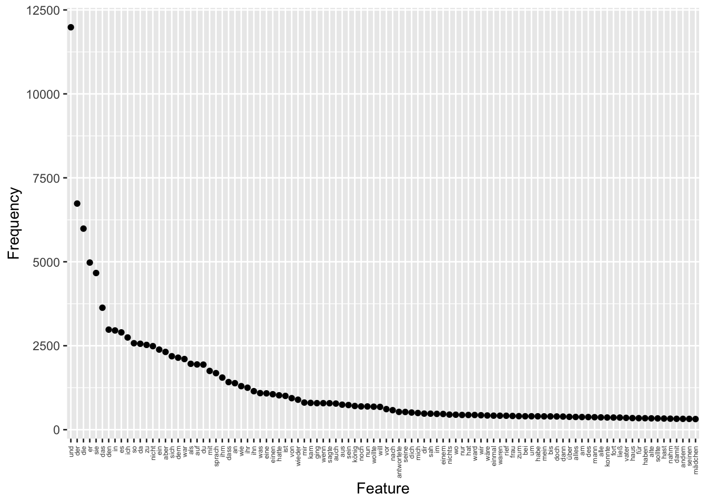

# Textanalyse III: Wortfrequenzanalysen

Die Konstruktion von Geschlecht und Geschlechterrollen in europäischen Märchen wird seit den 1970er Jahren in zahlreichen Forschungsarbeiten untersucht (zum Beispiel von [Marcia Lieberman 1972](https://www.jstor.org/stable/375142), [Alessandra Levorato 2003](https://doi.org/10.1057/9780230503878), [Simone Loleit und Liliane Schüller 2022](https://doi.org/10.1515/9783110726404-005)). In den letzten beiden Jahrzehnten sind Märchen auch zum Gegenstand von Arbeiten aus den Digital Humanities geworden (so z.B. in den Arbeiten von [Saif Mohammad 2011](https://aclanthology.org/W11-1514.pdf), [Mark Finlayson 2012](http://hdl.handle.net/1721.1/71284), [Berenike Herrmann und Jana Lüdtke 2023](https://doi.org/10.17175/2023_005)). Eine Reihe von Digital Humanities Arbeiten haben sich explizit Geschlecht und Geschlechterrollen in Märchen gewidmet, so zum Beispiel: 

* Toro Isaza, Paulina et al. (2023). [*Are Fairy Tales Fair? Analyzing Gender Bias in Temporal Narrative Event Chains of Children's Fairy Tales*](
https://doi.org/10.48550/arXiv.2305.16641), in: Proceedings of the 61st Annual Meeting of the Association for Computational Linguistics 1: Long Papers, pp. 6509-6531.
* Jorgensen, Jeana (2019). [*The Most Beautiful of All: A Quantitative Approach to Fairy-Tale Femininity*](https://works.bepress.com/jeana_jorgensen/29/), in: Journal of American Folklore 132 (523), pp. 36-60.
* Weingart, Scott and Jorgensen, Jeana (2013). [*Computational Analysis of the Body in European Fairy Tales*](http://dx.doi.org/10.1093/llc/fqs015), in: Literary and Linguistic Computing 28 (1), pp. 404-416.

In den nächsten beiden Wochen werden wir ein Korpus von Kinder- und Hausmärchen der Gebrüder Grimm aus dem Jahr 1857 im Hinblick auf die Darstellung verschiedener Märchencharaktere untersuchen. Dabei werden wir verschiedene Analysemethoden kennenlernen und kritisch beleuchten, inwieweit diese Methoden uns helfen können, bestimmte Muster in der Beschreibung von Märchencharakteren zu identifizieren. In diesem Kapitel werden wir zunächst Worthäufigkeiten und das gemeinsame Vorkommen verschiedener Wörter unabhängig von der Beziehung der Wörter zueinander betrachten. Wir werden dabei kritisch beleuchten, was die vorgestellten  Analysemethoden leisten können und was nicht. Im Kapitel 9 werden wir dann konkreten Fragen nachgehen: Welche Charaktere kommen in den Märchen vor? Mit welchen Adjektiven werden diese beschrieben? Welche Verben werden mit ihnen assoziiert? 

:::task
Verständnisfragen:

- Welche theoretischen Annahmen liegen unserer Forschungsfrage zugrunde? 
- Wie wird die Fragestellung im Folgenden operationalisiert?

:::

## Märchenkorpus einlesen und Pakete installieren

Um unser Korpus in R einzulesen, müssen wir zuerst wieder das **Arbeitsverzeichnis setzen**: 


```r
# Arbeitsverzeichnis setzen: Setzt hier euren eigenen Pfad ein
setwd("/Users/gast/R-Seminar") 
# Backslashes für Windows:
# setwd("C:\Users\gast\R-Seminar")
```

Wie bereits vergangene Woche erläutert kann das Arbeitsverzeichnis auch über den Tab "Files" im Fenster unten rechts gesetzt werden. Navigiert euch dazu erst in den gewünschten Ordner, klickt dann auf "More" und "Set As Working Directory" (siehe Kapitel "Orientierung im RStudio"). Wählt dabei den Ordner als Arbeitsverzeichnis, in dem ihr den Ordner maerchen_alle gespeichert habt. Achtung: Zip-Ordner müsst ihr vorher entpacken!

Wenn ihr das Arbeitsverzeichnis gesetzt habt, könnt ihr die **Dateien einlesen**. Wir werden ganz am Ende unserer Analyse die Grimm-Märchen in der siebten Edition von 1857 mit den Märchen aus der ersten Edition von 1812/15 vergleichen, um einen möglichen Wandel über die Zeit zu identifizieren. 


```r
library(readtext)

# Märchen von 1857 und 1812/15 einlesen und Informationen aus dem Dateinamen extrahieren
maerchen_alle <- readtext("maerchen_alle/*.txt", docvarsfrom = "filenames", dvsep = "_", docvarnames = c("Titel", "Jahr"), encoding = "UTF-8")
```


Bevor wir mit der Analyse starten können, müssen wir noch einige Pakete installieren, die wir brauchen werden: 


```r
install.packages(c("quanteda.textplots", "quanteda.textstats", "ggplot2", "plotly", "udpipe", "dplyr"))
```


Die Pakete müssen wie bisher immer nur einmal am Anfang des Skripts geladen werden. Allerdings werden wir in den folgenden Abschnitten Funktionen aus vielen verschiedenen Paketen verwenden. **Deswegen werden wir in diesem Kapitel ausnahmsweise Pakete erst dann laden, wenn sie gebraucht werden, sodass ihr in jeder Codezelle direkt erkennt, ob der Code Funktionen aus zusätzlichen Paketen enthält.** 


## Corpus-Objekt erstellen und erste Preprocessingschritte

Wir werden in der Analyse verschiedene Methoden einmal auf das Korpus mit und einmal ohne Stoppwörter anwenden, denn je nach Fragestellung und Methode sind Stoppwörter mehr oder weniger interessant. Deswegen erstellen wir in diesem Abschnitt zwei verschiedene tokens-Objekte. Wir werden aber auch sehen, dass Textanalyse und Preprocessing eigentlich iterative Prozesse sind: Es kommt oft vor, dass bei der Analyse weitere Preprocessingschritte notwendig werden.


```r
library(quanteda)

# Quanteda-corpus-Objekt erstellen
maerchen_corpus_alle <- corpus(maerchen_alle) 

# Teilkorpus extrahieren
maerchen_corpus <- corpus_subset(maerchen_corpus_alle, Jahr == 1857)

# Quanteda tokens-Objekt erstellen ohne weiteres Preprocessing
maerchen_toks_raw <- tokens(maerchen_corpus)

# Quanteda-tokens-Objekt erstellen MIT Stoppwörtern
maerchen_toks <- tokens(maerchen_corpus, remove_punct = TRUE) %>%
  tokens_tolower()

# Quanteda-tokens-Objekt erstellen OHNE Stoppwörter
maerchen_toks_rm <- tokens_remove(maerchen_toks, pattern = stopwords("de"))
```

Wir haben jetzt also ein corpus-Objekt sowie zwei verschiedene tokens-Objekte (eins mit und eins ohne Stoppwörter), die wir in unserer Analyse verwenden können. 

## Worthäufigkeiten verstehen: absolute und relative Häufigkeiten

In diesem Abschnitt betrachten wir Worthäufigkeiten über das gesamte Korpus hinweg und vergleichen Worthäufigkeiten in verschiedenen Dokumenten miteinander. Dazu lernen wir drei verschiedene Maße kennen: absolute Häufigkeiten, relative Häufigkeiten und TF-IDF, die sogenannte Term Frequency-Inverse Document Frequency. 

Lernziele für diesen Abschnitt: Einfluss verschiedener Preprocessingschritte auf die Worthäufigkeiten verstehen und 

### Absolute Häufigkeiten und das Zipf'sche Gesetz

Zunächst ist es sinnvoll, sich einen Überblick über das Korpus zu verschaffen. Aus der letzten Woche kennt ihr bereits die `summary()`-Funktion, die ein Quanteda Corpus-Objekt als Argument annimmt und einen Dataframe mit der Anzahl von Types und Tokens zu jedem Text liefert. Der Text wird dabei automatisch mit den Defaultargumenten tokenisiert. 


```r
token_info <- summary(maerchen_corpus, 200)
token_info
```

```{style="max-height: 150px;"}
## Corpus consisting of 194 documents, showing 194 documents:
## 
##                                                               Text Types Tokens Sentences                                                    Titel Jahr
##                                              Allerleirauh_1857.txt   617   2361        86                                             Allerleirauh 1857
##                      Armuth-und-Demuth-fuehren-zum-Himmel_1857.txt   252    517        22                     Armuth-und-Demuth-fuehren-zum-Himmel 1857
##                                              Aschenputtel_1857.txt   703   2851       105                                             Aschenputtel 1857
##                                             Bruder-Lustig_1857.txt   950   4792       232                                            Bruder-Lustig 1857
##                             Bruederchen-und-Schwesterchen_1857.txt   691   2670       100                            Bruederchen-und-Schwesterchen 1857
##                                      Das-alte-Muetterchen_1857.txt   188    355        12                                     Das-alte-Muetterchen 1857
##                                           Das-blaue-Licht_1857.txt   605   1929        78                                          Das-blaue-Licht 1857
##                          Das-Dietmarsische-Luegenmaerchen_1857.txt   132    211         9                         Das-Dietmarsische-Luegenmaerchen 1857
##                                     Das-eigensinnige-Kind_1857.txt    83    136         4                                    Das-eigensinnige-Kind 1857
##                                               Das-Eselein_1857.txt   508   1420        58                                              Das-Eselein 1857
##                                        Das-Hirtenbueblein_1857.txt   179    367        13                                       Das-Hirtenbueblein 1857
##                               Das-junggegluehte-Maennlein_1857.txt   288    561        19                              Das-junggegluehte-Maennlein 1857
##                                         Das-kluge-Grethel_1857.txt   368   1083        43                                        Das-kluge-Grethel 1857
##                               Das-Laemmchen-und-Fischchen_1857.txt   262    637        21                              Das-Laemmchen-und-Fischchen 1857
##                                        Das-Lumpengesindel_1857.txt   369    859        28                                       Das-Lumpengesindel 1857
##                                  Das-Maedchen-ohne-Haende_1857.txt   686   2548        99                                 Das-Maedchen-ohne-Haende 1857
##                         Das-Maerchen-vom-Schlauraffenland_1857.txt   192    349        13                        Das-Maerchen-vom-Schlauraffenland 1857
##                                          Das-Meerhaeschen_1857.txt   447   1307        57                                         Das-Meerhaeschen 1857
##                                              Das-Raethsel_1857.txt   466   1236        48                                             Das-Raethsel 1857
##                   Das-singende-springende-Loeweneckerchen_1857.txt   694   2560        73                  Das-singende-springende-Loeweneckerchen 1857
##                                 Das-tapfere-Schneiderlein_1857.txt   998   3607       146                                Das-tapfere-Schneiderlein 1857
##                                        Das-Todtenhemdchen_1857.txt   145    285         7                                       Das-Todtenhemdchen 1857
##                                              Das-Waldhaus_1857.txt   606   2014        72                                             Das-Waldhaus 1857
##                                     Das-Wasser-des-Lebens_1857.txt   663   2440        84                                    Das-Wasser-des-Lebens 1857
##                                  Daumerlings-Wanderschaft_1857.txt   610   1767        74                                 Daumerlings-Wanderschaft 1857
##                                                Daumesdick_1857.txt   743   2575       107                                               Daumesdick 1857
##                         Der-alte-Grossvater-und-der-Enkel_1857.txt   152    262        11                        Der-alte-Grossvater-und-der-Enkel 1857
##                                       Der-alte-Hildebrand_1857.txt   385   1620        43                                      Der-alte-Hildebrand 1857
##                                           Der-alte-Sultan_1857.txt   400    938        34                                          Der-alte-Sultan 1857
##                                    Der-arme-Junge-im-Grab_1857.txt   500   1347        58                                   Der-arme-Junge-im-Grab 1857
##                  Der-arme-Muellerbursch-und-das-Kaetzchen_1857.txt   506   1501        52                 Der-arme-Muellerbursch-und-das-Kaetzchen 1857
##                                   Der-Arme-und-der-Reiche_1857.txt   607   1802        62                                  Der-Arme-und-der-Reiche 1857
##                                         Der-Baerenhaeuter_1857.txt   698   2179        81                                        Der-Baerenhaeuter 1857
##                                  Der-Bauer-und-der-Teufel_1857.txt   192    405        19                                 Der-Bauer-und-der-Teufel 1857
##                               Der-Dreschflegel-vom-Himmel_1857.txt   199    394        11                              Der-Dreschflegel-vom-Himmel 1857
##                                             Der-Eisenhans_1857.txt   885   3502       149                                            Der-Eisenhans 1857
##                                             Der-Eisenofen_1857.txt   595   2307        86                                            Der-Eisenofen 1857
##                                           Der-faule-Heinz_1857.txt   462   1077        39                                          Der-faule-Heinz 1857
##                        Der-Frieder-und-das-Catherlieschen_1857.txt   749   2898       130                       Der-Frieder-und-das-Catherlieschen 1857
##                Der-Froschkoenig-oder-der-eiserne-Heinrich_1857.txt   497   1560        52               Der-Froschkoenig-oder-der-eiserne-Heinrich 1857
##                                   Der-Fuchs-und-das-Pferd_1857.txt   236    537        17                                  Der-Fuchs-und-das-Pferd 1857
##                         Der-Fuchs-und-die-Frau-Gevatterin_1857.txt   207    399        13                        Der-Fuchs-und-die-Frau-Gevatterin 1857
##                                  Der-Fuchs-und-die-Gaense_1857.txt   141    258        11                                 Der-Fuchs-und-die-Gaense 1857
##                                   Der-Fuchs-und-die-Katze_1857.txt   173    331        21                                  Der-Fuchs-und-die-Katze 1857
##                                         Der-Geist-im-Glas_1857.txt   605   2054        75                                        Der-Geist-im-Glas 1857
##                                       Der-gelernte-Jaeger_1857.txt   670   2443        80                                      Der-gelernte-Jaeger 1857
##                                       Der-gescheidte-Hans_1857.txt   163   1318       166                                      Der-gescheidte-Hans 1857
##                                     Der-gestohlene-Heller_1857.txt   179    359        13                                    Der-gestohlene-Heller 1857
##                                          Der-Gevatter-Tod_1857.txt   477   1336        52                                         Der-Gevatter-Tod 1857
##                                        Der-glaeserne-Sarg_1857.txt   957   2443        89                                       Der-glaeserne-Sarg 1857
##                                    Der-goldene-Schluessel_1857.txt   120    192         9                                   Der-goldene-Schluessel 1857
##                                         Der-goldene-Vogel_1857.txt   862   3285       126                                        Der-goldene-Vogel 1857
##                                            Der-Grabhuegel_1857.txt   597   1608        71                                           Der-Grabhuegel 1857
##                                           Der-gute-Handel_1857.txt   565   1926        70                                          Der-gute-Handel 1857
##                                          Der-Hahnenbalken_1857.txt   155    288        13                                         Der-Hahnenbalken 1857
##                                     Der-Hase-und-der-Igel_1857.txt   518   1523        68                                    Der-Hase-und-der-Igel 1857
##                               Der-heilige-Joseph-im-Walde_1857.txt   408   1282        58                              Der-heilige-Joseph-im-Walde 1857
##                                         Der-Herr-Gevatter_1857.txt   250    685        34                                        Der-Herr-Gevatter 1857
##                                 Der-Hund-und-der-Sperling_1857.txt   384   1379        62                                Der-Hund-und-der-Sperling 1857
##                                          Der-Jude-im-Dorn_1857.txt   647   1995        76                                         Der-Jude-im-Dorn 1857
##                                           Der-junge-Riese_1857.txt   790   3381       123                                          Der-junge-Riese 1857
##                                          Der-kluge-Knecht_1857.txt   146    295        15                                         Der-kluge-Knecht 1857
##                              Der-Koenig-vom-goldenen-Berg_1857.txt   739   2635        94                             Der-Koenig-vom-goldenen-Berg 1857
##             Der-Koenigssohn-der-sich-vor-nichts-fuerchtet_1857.txt   685   2279        86            Der-Koenigssohn-der-sich-vor-nichts-fuerchtet 1857
##                                             Der-Krautesel_1857.txt   833   2893       104                                            Der-Krautesel 1857
##                                        Der-Liebste-Roland_1857.txt   530   1614        57                                       Der-Liebste-Roland 1857
##                                           Der-Meisterdieb_1857.txt   975   3430       129                                          Der-Meisterdieb 1857
##                                                  Der-Mond_1857.txt   364    790        35                                                 Der-Mond 1857
##                                                 Der-Nagel_1857.txt   146    291        15                                                Der-Nagel 1857
##                                     Der-Raeuberbraeutigam_1857.txt   488   1488        63                                    Der-Raeuberbraeutigam 1857
##                Der-Ranzen,-das-Huetlein-und-das-Hoernlein_1857.txt   773   2506        85               Der-Ranzen,-das-Huetlein-und-das-Hoernlein 1857
##                               Der-Riese-und-der-Schneider_1857.txt   324    838        45                              Der-Riese-und-der-Schneider 1857
##                                   Der-Schneider-im-Himmel_1857.txt   353    843        32                                  Der-Schneider-im-Himmel 1857
##                                      Der-singende-Knochen_1857.txt   355    799        28                                     Der-singende-Knochen 1857
##                        Der-Sperling-und-seine-vier-Kinder_1857.txt   440   1018        39                       Der-Sperling-und-seine-vier-Kinder 1857
##                                           Der-starke-Hans_1857.txt   803   2879        99                                          Der-starke-Hans 1857
##                              Der-Stiefel-von-Bueffelleder_1857.txt   546   1598        67                             Der-Stiefel-von-Bueffelleder 1857
##                                           Der-suesse-Brei_1857.txt   132    266         6                                          Der-suesse-Brei 1857
##                   Der-Teufel-mit-den-drei-goldenen-Haaren_1857.txt   730   2958       129                  Der-Teufel-mit-den-drei-goldenen-Haaren 1857
##                          Der-Teufel-und-seine-Grossmutter_1857.txt   477   1376        56                         Der-Teufel-und-seine-Grossmutter 1857
##                                        Der-treue-Johannes_1857.txt   861   3383       114                                       Der-treue-Johannes 1857
##                                              Der-Trommler_1857.txt  1029   4223       180                                             Der-Trommler 1857
##                                       Der-undankbare-Sohn_1857.txt   104    166         5                                      Der-undankbare-Sohn 1857
##                                    Der-Wolf-und-der-Fuchs_1857.txt   291    812        31                                   Der-Wolf-und-der-Fuchs 1857
##                                   Der-Wolf-und-der-Mensch_1857.txt   206    483        19                                  Der-Wolf-und-der-Mensch 1857
##                   Der-Wolf-und-die-sieben-jungen-Geislein_1857.txt   403   1191        50                  Der-Wolf-und-die-sieben-jungen-Geislein 1857
##                                 Der-wunderliche-Spielmann_1857.txt   374   1218        49                                Der-wunderliche-Spielmann 1857
##                                            Der-Zaunkoenig_1857.txt   478   1280        70                                           Der-Zaunkoenig 1857
##                               Der-Zaunkoenig-und-der-Baer_1857.txt   384   1026        36                              Der-Zaunkoenig-und-der-Baer 1857
##                         Des-Herrn-und-des-Teufels-Gethier_1857.txt   206    369        15                        Des-Herrn-und-des-Teufels-Gethier 1857
##                               Des-Teufels-russiger-Bruder_1857.txt   448   1392        47                              Des-Teufels-russiger-Bruder 1857
##                                       Die-alte-Bettelfrau_1857.txt   102    167         8                                      Die-alte-Bettelfrau 1857
##                                          Die-Alte-im-Wald_1857.txt   361   1001        32                                         Die-Alte-im-Wald 1857
##                                       Die-beiden-Wanderer_1857.txt  1198   4487       176                                      Die-beiden-Wanderer 1857
##                                        Die-Bienenkoenigin_1857.txt   318    845        27                                       Die-Bienenkoenigin 1857
##                                       Die-Boten-des-Todes_1857.txt   309    702        35                                      Die-Boten-des-Todes 1857
##                                            Die-Brautschau_1857.txt    98    165         5                                           Die-Brautschau 1857
##                                Die-Bremer-Stadtmusikanten_1857.txt   528   1424        50                               Die-Bremer-Stadtmusikanten 1857
##                                Die-Brosamen-auf-dem-Tisch_1857.txt   111    194         9                               Die-Brosamen-auf-dem-Tisch 1857
##                                          Die-drei-Brueder_1857.txt   309    728        21                                         Die-drei-Brueder 1857
##                                           Die-drei-Faulen_1857.txt   124    254         6                                          Die-drei-Faulen 1857
##                                           Die-drei-Federn_1857.txt   396   1104        44                                          Die-drei-Federn 1857
##                                      Die-drei-Feldscherer_1857.txt   394   1114        47                                     Die-drei-Feldscherer 1857
##                                    Die-drei-Glueckskinder_1857.txt   449   1064        36                                   Die-drei-Glueckskinder 1857
##                                   Die-drei-gruenen-Zweige_1857.txt   409   1018        37                                  Die-drei-gruenen-Zweige 1857
##                                Die-drei-Handwerksburschen_1857.txt   438   1311        58                               Die-drei-Handwerksburschen 1857
##                               Die-drei-Maennlein-im-Walde_1857.txt   642   2200        85                              Die-drei-Maennlein-im-Walde 1857
##                                Die-drei-Schlangenblaetter_1857.txt   561   1560        53                               Die-drei-Schlangenblaetter 1857
##                                     Die-drei-Spinnerinnen_1857.txt   379    977        35                                    Die-drei-Spinnerinnen 1857
##                                         Die-drei-Sprachen_1857.txt   405   1014        39                                        Die-drei-Sprachen 1857
##                                                  Die-Eule_1857.txt   438    895        30                                                 Die-Eule 1857
##                                       Die-faule-Spinnerin_1857.txt   305    827        29                                      Die-faule-Spinnerin 1857
##                               Die-Gaensehirtin-am-Brunnen_1857.txt  1142   4376       194                              Die-Gaensehirtin-am-Brunnen 1857
##                                            Die-Gaensemagd_1857.txt   678   2295        72                                           Die-Gaensemagd 1857
##                          Die-Geschenke-des-kleinen-Volkes_1857.txt   428    975        30                         Die-Geschenke-des-kleinen-Volkes 1857
##                                          Die-goldene-Gans_1857.txt   543   1706        54                                         Die-goldene-Gans 1857
##                                            Die-Goldkinder_1857.txt   611   2183        81                                           Die-Goldkinder 1857
##                                          Die-hagere-Liese_1857.txt   237    515        17                                         Die-hagere-Liese 1857
##                                            Die-Haselruthe_1857.txt   135    217         7                                           Die-Haselruthe 1857
##                                   Die-himmlische-Hochzeit_1857.txt   235    566        20                                  Die-himmlische-Hochzeit 1857
##                            Die-Hochzeit-der-Frau-Fuechsin_1857.txt   303    910        47                           Die-Hochzeit-der-Frau-Fuechsin 1857
##                        Die-klare-Sonne-bringts-an-den-Tag_1857.txt   265    585        21                       Die-klare-Sonne-bringts-an-den-Tag 1857
##                                   Die-kluge-Bauerntochter_1857.txt   457   1519        50                                  Die-kluge-Bauerntochter 1857
##                                            Die-kluge-Else_1857.txt   408   1564        62                                           Die-kluge-Else 1857
##                                          Die-klugen-Leute_1857.txt   545   1752        75                                         Die-klugen-Leute 1857
##                                             Die-Kornaehre_1857.txt   146    246         9                                            Die-Kornaehre 1857
##                                         Die-Krystallkugel_1857.txt   458   1144        40                                        Die-Krystallkugel 1857
##                                            Die-Lebenszeit_1857.txt   272    674        38                                           Die-Lebenszeit 1857
##                                                 Die-Nelke_1857.txt   558   1963        64                                                Die-Nelke 1857
##                                         Die-Nixe-im-Teich_1857.txt   744   2335        99                                        Die-Nixe-im-Teich 1857
##                                                  Die-Rabe_1857.txt   603   2427        91                                                 Die-Rabe 1857
##                                                  Die-Rose_1857.txt   104    183         7                                                 Die-Rose 1857
##                                                 Die-Ruebe_1857.txt   471   1181        39                                                Die-Ruebe 1857
##                                        Die-Schlickerlinge_1857.txt   121    191         8                                       Die-Schlickerlinge 1857
##                Die-schoene-Katrinelje-und-Pif-Paf-Poltrie_1857.txt   116    500        45               Die-schoene-Katrinelje-und-Pif-Paf-Poltrie 1857
##                                               Die-Scholle_1857.txt   145    265        14                                              Die-Scholle 1857
##                                          Die-sechs-Diener_1857.txt   821   2911       103                                         Die-sechs-Diener 1857
##                                        Die-sechs-Schwaene_1857.txt   652   2143        82                                       Die-sechs-Schwaene 1857
##                                          Die-sieben-Raben_1857.txt   388    961        37                                         Die-sieben-Raben 1857
##                                       Die-sieben-Schwaben_1857.txt   475   1126        41                                      Die-sieben-Schwaben 1857
##                                           Die-Sternthaler_1857.txt   166    341        11                                          Die-Sternthaler 1857
##                                Die-ungleichen-Kinder-Evas_1857.txt   322    786        29                               Die-ungleichen-Kinder-Evas 1857
##                             Die-vier-kunstreichen-Brueder_1857.txt   581   1739        63                            Die-vier-kunstreichen-Brueder 1857
##                                           Die-wahre-Braut_1857.txt   853   2838       116                                          Die-wahre-Braut 1857
##                                            Die-Wassernixe_1857.txt   151    305        10                                           Die-Wassernixe 1857
##                                       Die-weisse-Schlange_1857.txt   638   1705        60                                      Die-weisse-Schlange 1857
##                         Die-weisse-und-die-schwarze-Braut_1857.txt   518   1609        61                        Die-weisse-und-die-schwarze-Braut 1857
##                                        Die-Wichtelmaenner_1857.txt   459   1201        42                                       Die-Wichtelmaenner 1857
##                                     Die-zertanzten-Schuhe_1857.txt   551   1549        57                                    Die-zertanzten-Schuhe 1857
##                                          Die-zwei-Brueder_1857.txt  1533   9166       318                                         Die-zwei-Brueder 1857
##                                        Die-zwoelf-Apostel_1857.txt   219    423        18                                       Die-zwoelf-Apostel 1857
##                                        Die-zwoelf-Brueder_1857.txt   660   2178        77                                       Die-zwoelf-Brueder 1857
##                                 Die-zwoelf-faulen-Knechte_1857.txt   466   1144        54                                Die-zwoelf-faulen-Knechte 1857
##                                         Die-zwoelf-Jaeger_1857.txt   394   1197        46                                        Die-zwoelf-Jaeger 1857
##                                         Doctor-Allwissend_1857.txt   307    836        35                                        Doctor-Allwissend 1857
##                                              Dornroeschen_1857.txt   511   1423        44                                             Dornroeschen 1857
##                Einaeuglein,-Zweiaeuglein-und-Dreiaeuglein_1857.txt   694   2724        96               Einaeuglein,-Zweiaeuglein-und-Dreiaeuglein 1857
##                                            Fitchers-Vogel_1857.txt   503   1434        57                                           Fitchers-Vogel 1857
##                                                Frau-Holle_1857.txt   412   1269        42                                               Frau-Holle 1857
##                                                Frau-Trude_1857.txt   166    349        17                                               Frau-Trude 1857
##                                                Fundevogel_1857.txt   306   1059        42                                               Fundevogel 1857
##                                             Gottes-Speise_1857.txt   148    256         8                                            Gottes-Speise 1857
##                                       Haensel-und-Grethel_1857.txt   835   3231       127                                      Haensel-und-Grethel 1857
##                                            Haesichenbraut_1857.txt   160    488        32                                           Haesichenbraut 1857
##                                            Hans-heirathet_1857.txt   241    502        18                                           Hans-heirathet 1857
##                                            Hans-im-Glueck_1857.txt   715   2309        93                                           Hans-im-Glueck 1857
##                                            Hans-mein-Igel_1857.txt   552   2218        67                                           Hans-mein-Igel 1857
##                                               Herr-Korbes_1857.txt   175    412        19                                              Herr-Korbes 1857
##                                      Jorinde-und-Joringel_1857.txt   391   1017        44                                     Jorinde-und-Joringel 1857
##                                           Jungfrau-Maleen_1857.txt   637   2204       100                                          Jungfrau-Maleen 1857
##                            Katze-und-Maus-in-Gesellschaft_1857.txt   414   1112        49                           Katze-und-Maus-in-Gesellschaft 1857
##                                        Koenig-Drosselbart_1857.txt   625   1883        81                                       Koenig-Drosselbart 1857
##                                   Laeuschen-und-Floehchen_1857.txt   113    465        31                                  Laeuschen-und-Floehchen 1857
##                                     Lieb-und-Leid-theilen_1857.txt   202    427        16                                    Lieb-und-Leid-theilen 1857
##   Maehrchen-von-einem,-der-auszog-das-Fuerchten-zu-lernen_1857.txt   966   4284       189  Maehrchen-von-einem,-der-auszog-das-Fuerchten-zu-lernen 1857
##                                     Maerchen-von-der-Unke_1857.txt   236    528        21                                    Maerchen-von-der-Unke 1857
##                                                Marienkind_1857.txt   616   2049        67                                               Marienkind 1857
##                                            Meister-Pfriem_1857.txt   592   1562        77                                           Meister-Pfriem 1857
##                                     Muttergottesglaeschen_1857.txt   100    164         6                                    Muttergottesglaeschen 1857
##                                          Raethselmaerchen_1857.txt    87    139         4                                         Raethselmaerchen 1857
##                                                  Rapunzel_1857.txt   518   1577        52                                                 Rapunzel 1857
##                                  Rohrdommel-und-Wiedehopf_1857.txt   139    273        17                                 Rohrdommel-und-Wiedehopf 1857
##                                             Rothkaeppchen_1857.txt   499   1537        61                                            Rothkaeppchen 1857
##                                           Rumpelstilzchen_1857.txt   404   1211        39                                          Rumpelstilzchen 1857
##                             Schneeweisschen-und-Rosenroth_1857.txt   877   2683        95                            Schneeweisschen-und-Rosenroth 1857
##                        Sechse-kommen-durch-die-ganze-Welt_1857.txt   671   2274        78                       Sechse-kommen-durch-die-ganze-Welt 1857
##                                                Simeliberg_1857.txt   338    889        31                                               Simeliberg 1857
##                                              Sneewittchen_1857.txt   814   3436       142                                             Sneewittchen 1857
##                        Spindel,-Weberschiffchen-und-Nadel_1857.txt   430   1149        43                       Spindel,-Weberschiffchen-und-Nadel 1857
##                                Strohhalm,-Kohle-und-Bohne_1857.txt   269    566        22                               Strohhalm,-Kohle-und-Bohne 1857
##  Tischchen-deck-dich,-Goldesel,-und-Knueppel-aus-dem-Sack_1857.txt   945   4290       183 Tischchen-deck-dich,-Goldesel,-und-Knueppel-aus-dem-Sack 1857
##                                  Vom-klugen-Schneiderlein_1857.txt   470   1301        50                                 Vom-klugen-Schneiderlein 1857
##           Von-dem-Maeuschen,-Voegelchen-und-der-Bratwurst_1857.txt   297    648        22          Von-dem-Maeuschen,-Voegelchen-und-der-Bratwurst 1857
##                               Von-dem-Tode-des-Huehnchens_1857.txt   243    713        26                              Von-dem-Tode-des-Huehnchens 1857
```

Um schnell den längsten und kürzesten Text zu finden, können wir einfach wieder die Funktionen `max()` und `min()` anwenden (s. [Kapitel 5.5](https://lipogg.github.io/textanalyse-mit-r/textanalyse-i-korpus-tokens-daten-und-dateien.html#quanteda-corpus-objekte)), oder den Dataframe absteigend nach der Spalte Types bzw. Tokens sortieren: 


```r
token_info[order(token_info$Tokens, decreasing = TRUE),]
```

```{style="max-height: 150px;"}
##                                                                  Text Types Tokens Sentences                                                    Titel Jahr
## 150                                         Die-zwei-Brueder_1857.txt  1533   9166       318                                         Die-zwei-Brueder 1857
## 4                                              Bruder-Lustig_1857.txt   950   4792       232                                            Bruder-Lustig 1857
## 94                                       Die-beiden-Wanderer_1857.txt  1198   4487       176                                      Die-beiden-Wanderer 1857
## 113                              Die-Gaensehirtin-am-Brunnen_1857.txt  1142   4376       194                              Die-Gaensehirtin-am-Brunnen 1857
## 191 Tischchen-deck-dich,-Goldesel,-und-Knueppel-aus-dem-Sack_1857.txt   945   4290       183 Tischchen-deck-dich,-Goldesel,-und-Knueppel-aus-dem-Sack 1857
## 175  Maehrchen-von-einem,-der-auszog-das-Fuerchten-zu-lernen_1857.txt   966   4284       189  Maehrchen-von-einem,-der-auszog-das-Fuerchten-zu-lernen 1857
## 82                                              Der-Trommler_1857.txt  1029   4223       180                                             Der-Trommler 1857
## 21                                 Das-tapfere-Schneiderlein_1857.txt   998   3607       146                                Das-tapfere-Schneiderlein 1857
## 36                                             Der-Eisenhans_1857.txt   885   3502       149                                            Der-Eisenhans 1857
## 188                                             Sneewittchen_1857.txt   814   3436       142                                             Sneewittchen 1857
## 67                                           Der-Meisterdieb_1857.txt   975   3430       129                                          Der-Meisterdieb 1857
## 81                                        Der-treue-Johannes_1857.txt   861   3383       114                                       Der-treue-Johannes 1857
## 61                                           Der-junge-Riese_1857.txt   790   3381       123                                          Der-junge-Riese 1857
## 52                                         Der-goldene-Vogel_1857.txt   862   3285       126                                        Der-goldene-Vogel 1857
## 163                                      Haensel-und-Grethel_1857.txt   835   3231       127                                      Haensel-und-Grethel 1857
## 79                   Der-Teufel-mit-den-drei-goldenen-Haaren_1857.txt   730   2958       129                  Der-Teufel-mit-den-drei-goldenen-Haaren 1857
## 137                                         Die-sechs-Diener_1857.txt   821   2911       103                                         Die-sechs-Diener 1857
## 39                        Der-Frieder-und-das-Catherlieschen_1857.txt   749   2898       130                       Der-Frieder-und-das-Catherlieschen 1857
## 65                                             Der-Krautesel_1857.txt   833   2893       104                                            Der-Krautesel 1857
## 76                                           Der-starke-Hans_1857.txt   803   2879        99                                          Der-starke-Hans 1857
## 3                                               Aschenputtel_1857.txt   703   2851       105                                             Aschenputtel 1857
## 144                                          Die-wahre-Braut_1857.txt   853   2838       116                                          Die-wahre-Braut 1857
## 157               Einaeuglein,-Zweiaeuglein-und-Dreiaeuglein_1857.txt   694   2724        96               Einaeuglein,-Zweiaeuglein-und-Dreiaeuglein 1857
## 185                            Schneeweisschen-und-Rosenroth_1857.txt   877   2683        95                            Schneeweisschen-und-Rosenroth 1857
## 5                              Bruederchen-und-Schwesterchen_1857.txt   691   2670       100                            Bruederchen-und-Schwesterchen 1857
## 63                              Der-Koenig-vom-goldenen-Berg_1857.txt   739   2635        94                             Der-Koenig-vom-goldenen-Berg 1857
## 26                                                Daumesdick_1857.txt   743   2575       107                                               Daumesdick 1857
## 20                   Das-singende-springende-Loeweneckerchen_1857.txt   694   2560        73                  Das-singende-springende-Loeweneckerchen 1857
## 16                                  Das-Maedchen-ohne-Haende_1857.txt   686   2548        99                                 Das-Maedchen-ohne-Haende 1857
## 71                Der-Ranzen,-das-Huetlein-und-das-Hoernlein_1857.txt   773   2506        85               Der-Ranzen,-das-Huetlein-und-das-Hoernlein 1857
## 46                                       Der-gelernte-Jaeger_1857.txt   670   2443        80                                      Der-gelernte-Jaeger 1857
## 50                                        Der-glaeserne-Sarg_1857.txt   957   2443        89                                       Der-glaeserne-Sarg 1857
## 24                                     Das-Wasser-des-Lebens_1857.txt   663   2440        84                                    Das-Wasser-des-Lebens 1857
## 131                                                 Die-Rabe_1857.txt   603   2427        91                                                 Die-Rabe 1857
## 1                                               Allerleirauh_1857.txt   617   2361        86                                             Allerleirauh 1857
## 130                                        Die-Nixe-im-Teich_1857.txt   744   2335        99                                        Die-Nixe-im-Teich 1857
## 166                                           Hans-im-Glueck_1857.txt   715   2309        93                                           Hans-im-Glueck 1857
## 37                                             Der-Eisenofen_1857.txt   595   2307        86                                            Der-Eisenofen 1857
## 114                                           Die-Gaensemagd_1857.txt   678   2295        72                                           Die-Gaensemagd 1857
## 64             Der-Koenigssohn-der-sich-vor-nichts-fuerchtet_1857.txt   685   2279        86            Der-Koenigssohn-der-sich-vor-nichts-fuerchtet 1857
## 186                       Sechse-kommen-durch-die-ganze-Welt_1857.txt   671   2274        78                       Sechse-kommen-durch-die-ganze-Welt 1857
## 167                                           Hans-mein-Igel_1857.txt   552   2218        67                                           Hans-mein-Igel 1857
## 170                                          Jungfrau-Maleen_1857.txt   637   2204       100                                          Jungfrau-Maleen 1857
## 107                              Die-drei-Maennlein-im-Walde_1857.txt   642   2200        85                              Die-drei-Maennlein-im-Walde 1857
## 117                                           Die-Goldkinder_1857.txt   611   2183        81                                           Die-Goldkinder 1857
## 33                                         Der-Baerenhaeuter_1857.txt   698   2179        81                                        Der-Baerenhaeuter 1857
## 152                                       Die-zwoelf-Brueder_1857.txt   660   2178        77                                       Die-zwoelf-Brueder 1857
## 138                                       Die-sechs-Schwaene_1857.txt   652   2143        82                                       Die-sechs-Schwaene 1857
## 45                                         Der-Geist-im-Glas_1857.txt   605   2054        75                                        Der-Geist-im-Glas 1857
## 177                                               Marienkind_1857.txt   616   2049        67                                               Marienkind 1857
## 23                                              Das-Waldhaus_1857.txt   606   2014        72                                             Das-Waldhaus 1857
## 60                                          Der-Jude-im-Dorn_1857.txt   647   1995        76                                         Der-Jude-im-Dorn 1857
## 129                                                Die-Nelke_1857.txt   558   1963        64                                                Die-Nelke 1857
## 7                                            Das-blaue-Licht_1857.txt   605   1929        78                                          Das-blaue-Licht 1857
## 54                                           Der-gute-Handel_1857.txt   565   1926        70                                          Der-gute-Handel 1857
## 172                                       Koenig-Drosselbart_1857.txt   625   1883        81                                       Koenig-Drosselbart 1857
## 32                                   Der-Arme-und-der-Reiche_1857.txt   607   1802        62                                  Der-Arme-und-der-Reiche 1857
## 25                                  Daumerlings-Wanderschaft_1857.txt   610   1767        74                                 Daumerlings-Wanderschaft 1857
## 125                                         Die-klugen-Leute_1857.txt   545   1752        75                                         Die-klugen-Leute 1857
## 143                            Die-vier-kunstreichen-Brueder_1857.txt   581   1739        63                            Die-vier-kunstreichen-Brueder 1857
## 116                                         Die-goldene-Gans_1857.txt   543   1706        54                                         Die-goldene-Gans 1857
## 146                                      Die-weisse-Schlange_1857.txt   638   1705        60                                      Die-weisse-Schlange 1857
## 28                                       Der-alte-Hildebrand_1857.txt   385   1620        43                                      Der-alte-Hildebrand 1857
## 66                                        Der-Liebste-Roland_1857.txt   530   1614        57                                       Der-Liebste-Roland 1857
## 147                        Die-weisse-und-die-schwarze-Braut_1857.txt   518   1609        61                        Die-weisse-und-die-schwarze-Braut 1857
## 53                                            Der-Grabhuegel_1857.txt   597   1608        71                                           Der-Grabhuegel 1857
## 77                              Der-Stiefel-von-Bueffelleder_1857.txt   546   1598        67                             Der-Stiefel-von-Bueffelleder 1857
## 181                                                 Rapunzel_1857.txt   518   1577        52                                                 Rapunzel 1857
## 124                                           Die-kluge-Else_1857.txt   408   1564        62                                           Die-kluge-Else 1857
## 178                                           Meister-Pfriem_1857.txt   592   1562        77                                           Meister-Pfriem 1857
## 40                Der-Froschkoenig-oder-der-eiserne-Heinrich_1857.txt   497   1560        52               Der-Froschkoenig-oder-der-eiserne-Heinrich 1857
## 108                               Die-drei-Schlangenblaetter_1857.txt   561   1560        53                               Die-drei-Schlangenblaetter 1857
## 149                                    Die-zertanzten-Schuhe_1857.txt   551   1549        57                                    Die-zertanzten-Schuhe 1857
## 183                                            Rothkaeppchen_1857.txt   499   1537        61                                            Rothkaeppchen 1857
## 56                                     Der-Hase-und-der-Igel_1857.txt   518   1523        68                                    Der-Hase-und-der-Igel 1857
## 123                                  Die-kluge-Bauerntochter_1857.txt   457   1519        50                                  Die-kluge-Bauerntochter 1857
## 31                  Der-arme-Muellerbursch-und-das-Kaetzchen_1857.txt   506   1501        52                 Der-arme-Muellerbursch-und-das-Kaetzchen 1857
## 70                                     Der-Raeuberbraeutigam_1857.txt   488   1488        63                                    Der-Raeuberbraeutigam 1857
## 158                                           Fitchers-Vogel_1857.txt   503   1434        57                                           Fitchers-Vogel 1857
## 98                                Die-Bremer-Stadtmusikanten_1857.txt   528   1424        50                               Die-Bremer-Stadtmusikanten 1857
## 156                                             Dornroeschen_1857.txt   511   1423        44                                             Dornroeschen 1857
## 10                                               Das-Eselein_1857.txt   508   1420        58                                              Das-Eselein 1857
## 91                               Des-Teufels-russiger-Bruder_1857.txt   448   1392        47                              Des-Teufels-russiger-Bruder 1857
## 59                                 Der-Hund-und-der-Sperling_1857.txt   384   1379        62                                Der-Hund-und-der-Sperling 1857
## 80                          Der-Teufel-und-seine-Grossmutter_1857.txt   477   1376        56                         Der-Teufel-und-seine-Grossmutter 1857
## 30                                    Der-arme-Junge-im-Grab_1857.txt   500   1347        58                                   Der-arme-Junge-im-Grab 1857
## 49                                          Der-Gevatter-Tod_1857.txt   477   1336        52                                         Der-Gevatter-Tod 1857
## 47                                       Der-gescheidte-Hans_1857.txt   163   1318       166                                      Der-gescheidte-Hans 1857
## 106                               Die-drei-Handwerksburschen_1857.txt   438   1311        58                               Die-drei-Handwerksburschen 1857
## 18                                          Das-Meerhaeschen_1857.txt   447   1307        57                                         Das-Meerhaeschen 1857
## 192                                 Vom-klugen-Schneiderlein_1857.txt   470   1301        50                                 Vom-klugen-Schneiderlein 1857
## 57                               Der-heilige-Joseph-im-Walde_1857.txt   408   1282        58                              Der-heilige-Joseph-im-Walde 1857
## 88                                            Der-Zaunkoenig_1857.txt   478   1280        70                                           Der-Zaunkoenig 1857
## 159                                               Frau-Holle_1857.txt   412   1269        42                                               Frau-Holle 1857
## 19                                              Das-Raethsel_1857.txt   466   1236        48                                             Das-Raethsel 1857
## 87                                 Der-wunderliche-Spielmann_1857.txt   374   1218        49                                Der-wunderliche-Spielmann 1857
## 184                                          Rumpelstilzchen_1857.txt   404   1211        39                                          Rumpelstilzchen 1857
## 148                                       Die-Wichtelmaenner_1857.txt   459   1201        42                                       Die-Wichtelmaenner 1857
## 154                                        Die-zwoelf-Jaeger_1857.txt   394   1197        46                                        Die-zwoelf-Jaeger 1857
## 86                   Der-Wolf-und-die-sieben-jungen-Geislein_1857.txt   403   1191        50                  Der-Wolf-und-die-sieben-jungen-Geislein 1857
## 133                                                Die-Ruebe_1857.txt   471   1181        39                                                Die-Ruebe 1857
## 189                       Spindel,-Weberschiffchen-und-Nadel_1857.txt   430   1149        43                       Spindel,-Weberschiffchen-und-Nadel 1857
## 127                                        Die-Krystallkugel_1857.txt   458   1144        40                                        Die-Krystallkugel 1857
## 153                                Die-zwoelf-faulen-Knechte_1857.txt   466   1144        54                                Die-zwoelf-faulen-Knechte 1857
## 140                                      Die-sieben-Schwaben_1857.txt   475   1126        41                                      Die-sieben-Schwaben 1857
## 103                                     Die-drei-Feldscherer_1857.txt   394   1114        47                                     Die-drei-Feldscherer 1857
## 171                           Katze-und-Maus-in-Gesellschaft_1857.txt   414   1112        49                           Katze-und-Maus-in-Gesellschaft 1857
## 102                                          Die-drei-Federn_1857.txt   396   1104        44                                          Die-drei-Federn 1857
## 13                                         Das-kluge-Grethel_1857.txt   368   1083        43                                        Das-kluge-Grethel 1857
## 38                                           Der-faule-Heinz_1857.txt   462   1077        39                                          Der-faule-Heinz 1857
## 104                                   Die-drei-Glueckskinder_1857.txt   449   1064        36                                   Die-drei-Glueckskinder 1857
## 161                                               Fundevogel_1857.txt   306   1059        42                                               Fundevogel 1857
## 89                               Der-Zaunkoenig-und-der-Baer_1857.txt   384   1026        36                              Der-Zaunkoenig-und-der-Baer 1857
## 75                        Der-Sperling-und-seine-vier-Kinder_1857.txt   440   1018        39                       Der-Sperling-und-seine-vier-Kinder 1857
## 105                                  Die-drei-gruenen-Zweige_1857.txt   409   1018        37                                  Die-drei-gruenen-Zweige 1857
## 169                                     Jorinde-und-Joringel_1857.txt   391   1017        44                                     Jorinde-und-Joringel 1857
## 110                                        Die-drei-Sprachen_1857.txt   405   1014        39                                        Die-drei-Sprachen 1857
## 93                                          Die-Alte-im-Wald_1857.txt   361   1001        32                                         Die-Alte-im-Wald 1857
## 109                                    Die-drei-Spinnerinnen_1857.txt   379    977        35                                    Die-drei-Spinnerinnen 1857
## 115                         Die-Geschenke-des-kleinen-Volkes_1857.txt   428    975        30                         Die-Geschenke-des-kleinen-Volkes 1857
## 139                                         Die-sieben-Raben_1857.txt   388    961        37                                         Die-sieben-Raben 1857
## 29                                           Der-alte-Sultan_1857.txt   400    938        34                                          Der-alte-Sultan 1857
## 121                           Die-Hochzeit-der-Frau-Fuechsin_1857.txt   303    910        47                           Die-Hochzeit-der-Frau-Fuechsin 1857
## 111                                                 Die-Eule_1857.txt   438    895        30                                                 Die-Eule 1857
## 187                                               Simeliberg_1857.txt   338    889        31                                               Simeliberg 1857
## 15                                        Das-Lumpengesindel_1857.txt   369    859        28                                       Das-Lumpengesindel 1857
## 95                                        Die-Bienenkoenigin_1857.txt   318    845        27                                       Die-Bienenkoenigin 1857
## 73                                   Der-Schneider-im-Himmel_1857.txt   353    843        32                                  Der-Schneider-im-Himmel 1857
## 72                               Der-Riese-und-der-Schneider_1857.txt   324    838        45                              Der-Riese-und-der-Schneider 1857
## 155                                        Doctor-Allwissend_1857.txt   307    836        35                                        Doctor-Allwissend 1857
## 112                                      Die-faule-Spinnerin_1857.txt   305    827        29                                      Die-faule-Spinnerin 1857
## 84                                    Der-Wolf-und-der-Fuchs_1857.txt   291    812        31                                   Der-Wolf-und-der-Fuchs 1857
## 74                                      Der-singende-Knochen_1857.txt   355    799        28                                     Der-singende-Knochen 1857
## 68                                                  Der-Mond_1857.txt   364    790        35                                                 Der-Mond 1857
## 142                               Die-ungleichen-Kinder-Evas_1857.txt   322    786        29                               Die-ungleichen-Kinder-Evas 1857
## 100                                         Die-drei-Brueder_1857.txt   309    728        21                                         Die-drei-Brueder 1857
## 194                              Von-dem-Tode-des-Huehnchens_1857.txt   243    713        26                              Von-dem-Tode-des-Huehnchens 1857
## 96                                       Die-Boten-des-Todes_1857.txt   309    702        35                                      Die-Boten-des-Todes 1857
## 58                                         Der-Herr-Gevatter_1857.txt   250    685        34                                        Der-Herr-Gevatter 1857
## 128                                           Die-Lebenszeit_1857.txt   272    674        38                                           Die-Lebenszeit 1857
## 193          Von-dem-Maeuschen,-Voegelchen-und-der-Bratwurst_1857.txt   297    648        22          Von-dem-Maeuschen,-Voegelchen-und-der-Bratwurst 1857
## 14                               Das-Laemmchen-und-Fischchen_1857.txt   262    637        21                              Das-Laemmchen-und-Fischchen 1857
## 122                       Die-klare-Sonne-bringts-an-den-Tag_1857.txt   265    585        21                       Die-klare-Sonne-bringts-an-den-Tag 1857
## 120                                  Die-himmlische-Hochzeit_1857.txt   235    566        20                                  Die-himmlische-Hochzeit 1857
## 190                               Strohhalm,-Kohle-und-Bohne_1857.txt   269    566        22                               Strohhalm,-Kohle-und-Bohne 1857
## 12                               Das-junggegluehte-Maennlein_1857.txt   288    561        19                              Das-junggegluehte-Maennlein 1857
## 41                                   Der-Fuchs-und-das-Pferd_1857.txt   236    537        17                                  Der-Fuchs-und-das-Pferd 1857
## 176                                    Maerchen-von-der-Unke_1857.txt   236    528        21                                    Maerchen-von-der-Unke 1857
## 2                       Armuth-und-Demuth-fuehren-zum-Himmel_1857.txt   252    517        22                     Armuth-und-Demuth-fuehren-zum-Himmel 1857
## 118                                         Die-hagere-Liese_1857.txt   237    515        17                                         Die-hagere-Liese 1857
## 165                                           Hans-heirathet_1857.txt   241    502        18                                           Hans-heirathet 1857
## 135               Die-schoene-Katrinelje-und-Pif-Paf-Poltrie_1857.txt   116    500        45               Die-schoene-Katrinelje-und-Pif-Paf-Poltrie 1857
## 164                                           Haesichenbraut_1857.txt   160    488        32                                           Haesichenbraut 1857
## 85                                   Der-Wolf-und-der-Mensch_1857.txt   206    483        19                                  Der-Wolf-und-der-Mensch 1857
## 173                                  Laeuschen-und-Floehchen_1857.txt   113    465        31                                  Laeuschen-und-Floehchen 1857
## 174                                    Lieb-und-Leid-theilen_1857.txt   202    427        16                                    Lieb-und-Leid-theilen 1857
## 151                                       Die-zwoelf-Apostel_1857.txt   219    423        18                                       Die-zwoelf-Apostel 1857
## 168                                              Herr-Korbes_1857.txt   175    412        19                                              Herr-Korbes 1857
## 34                                  Der-Bauer-und-der-Teufel_1857.txt   192    405        19                                 Der-Bauer-und-der-Teufel 1857
## 42                         Der-Fuchs-und-die-Frau-Gevatterin_1857.txt   207    399        13                        Der-Fuchs-und-die-Frau-Gevatterin 1857
## 35                               Der-Dreschflegel-vom-Himmel_1857.txt   199    394        11                              Der-Dreschflegel-vom-Himmel 1857
## 90                         Des-Herrn-und-des-Teufels-Gethier_1857.txt   206    369        15                        Des-Herrn-und-des-Teufels-Gethier 1857
## 11                                        Das-Hirtenbueblein_1857.txt   179    367        13                                       Das-Hirtenbueblein 1857
## 48                                     Der-gestohlene-Heller_1857.txt   179    359        13                                    Der-gestohlene-Heller 1857
## 6                                       Das-alte-Muetterchen_1857.txt   188    355        12                                     Das-alte-Muetterchen 1857
## 17                         Das-Maerchen-vom-Schlauraffenland_1857.txt   192    349        13                        Das-Maerchen-vom-Schlauraffenland 1857
## 160                                               Frau-Trude_1857.txt   166    349        17                                               Frau-Trude 1857
## 141                                          Die-Sternthaler_1857.txt   166    341        11                                          Die-Sternthaler 1857
## 44                                   Der-Fuchs-und-die-Katze_1857.txt   173    331        21                                  Der-Fuchs-und-die-Katze 1857
## 145                                           Die-Wassernixe_1857.txt   151    305        10                                           Die-Wassernixe 1857
## 62                                          Der-kluge-Knecht_1857.txt   146    295        15                                         Der-kluge-Knecht 1857
## 69                                                 Der-Nagel_1857.txt   146    291        15                                                Der-Nagel 1857
## 55                                          Der-Hahnenbalken_1857.txt   155    288        13                                         Der-Hahnenbalken 1857
## 22                                        Das-Todtenhemdchen_1857.txt   145    285         7                                       Das-Todtenhemdchen 1857
## 182                                 Rohrdommel-und-Wiedehopf_1857.txt   139    273        17                                 Rohrdommel-und-Wiedehopf 1857
## 78                                           Der-suesse-Brei_1857.txt   132    266         6                                          Der-suesse-Brei 1857
## 136                                              Die-Scholle_1857.txt   145    265        14                                              Die-Scholle 1857
## 27                         Der-alte-Grossvater-und-der-Enkel_1857.txt   152    262        11                        Der-alte-Grossvater-und-der-Enkel 1857
## 43                                  Der-Fuchs-und-die-Gaense_1857.txt   141    258        11                                 Der-Fuchs-und-die-Gaense 1857
## 162                                            Gottes-Speise_1857.txt   148    256         8                                            Gottes-Speise 1857
## 101                                          Die-drei-Faulen_1857.txt   124    254         6                                          Die-drei-Faulen 1857
## 126                                            Die-Kornaehre_1857.txt   146    246         9                                            Die-Kornaehre 1857
## 119                                           Die-Haselruthe_1857.txt   135    217         7                                           Die-Haselruthe 1857
## 8                           Das-Dietmarsische-Luegenmaerchen_1857.txt   132    211         9                         Das-Dietmarsische-Luegenmaerchen 1857
## 99                                Die-Brosamen-auf-dem-Tisch_1857.txt   111    194         9                               Die-Brosamen-auf-dem-Tisch 1857
## 51                                    Der-goldene-Schluessel_1857.txt   120    192         9                                   Der-goldene-Schluessel 1857
## 134                                       Die-Schlickerlinge_1857.txt   121    191         8                                       Die-Schlickerlinge 1857
## 132                                                 Die-Rose_1857.txt   104    183         7                                                 Die-Rose 1857
## 92                                       Die-alte-Bettelfrau_1857.txt   102    167         8                                      Die-alte-Bettelfrau 1857
## 83                                       Der-undankbare-Sohn_1857.txt   104    166         5                                      Der-undankbare-Sohn 1857
## 97                                            Die-Brautschau_1857.txt    98    165         5                                           Die-Brautschau 1857
## 179                                    Muttergottesglaeschen_1857.txt   100    164         6                                    Muttergottesglaeschen 1857
## 180                                         Raethselmaerchen_1857.txt    87    139         4                                         Raethselmaerchen 1857
## 9                                      Das-eigensinnige-Kind_1857.txt    83    136         4                                    Das-eigensinnige-Kind 1857
```


Um uns einen visuellen Überblick zu verschaffen, können wir die Tokenanzahl auch visualisieren. Dazu verwenden wir das Paket `ggplot2`, welches spezialisierte Funktionen zur Datenvisualisierung bietet. 

:::tip
Grafiken erstellen mit ggplot2

Die Syntax zur Erstellung von Grafiken mit ggplot2 folgt einem eigenen Design-Prinzip, das nach dem Titel des zugrundeliegenden Werks ["Grammar of Graphics"](https://doi.org/10.1007/0-387-28695-0) genannt wird. Diese "Grammatik" legt fest, wie die einzelnen Bestandteile einer Grafik beschrieben und konstruiert werden können. Konkret bedeutet das, dass ggplot2-Grafiken immer als mehrere, übereinanderliegende Ebenen erstellt werden, die mit einem `+`-Operator verknüpft werden: Die erste Ebene ist dabei immer ein Datenobjekt, das mit der Funktion `ggplot()` erzeugt wird. Welche Ebenen es genau gibt könnt ihr in den [ggplot2-Dokumentationsseiten](https://ggplot2.tidyverse.org/reference/index.html) nachlesen. Einen leicht verständlichen Einstieg in die Grammar of Graphics und ggplot2 bietet dieser [Artikel von Dipanjan Sarkar](https://towardsdatascience.com/a-comprehensive-guide-to-the-grammar-of-graphics-for-effective-visualization-of-multi-dimensional-1f92b4ed4149). Einen tieferen Einblick bietet dieser [Artikel von Hadley Wickham](https://www.tandfonline.com/doi/abs/10.1198/jcgs.2009.07098). 

:::


Bei der Erstellung von Visualisierungen für quanteda-Objekte ist wichtig zu beachten, dass die Funktion `ggplot()` als Input einen Dataframe erwartet. Das Objekt `token_info` ist bereits ein Dataframe und kann direkt als Argument der `ggplot()`-Funktion übergeben werden. Als zusätzliches Argument geben wir mithilfe der Funktion `aes()` ein Mapping ("Ästhetik") für das Datenobjekt an, welches die Dimensionen der Daten bestimmt. Es legt fest, welche Spalte des Dataframes auf welcher Achse des Koordinatensystems abgebildet werden soll. Alle weiteren Ebenen werden dem Datenobjekt mithilfe des `+`-Operators angefügt: Zunächst ein geometrisches Objekt ("geom"), das bestimmt, dass die Datenpunkte als Punkte dargestellt werden sollen, nicht etwa als Säulen oder Linien (also als `geom_point()` statt `geom_col()` oder `geom_line()`). Die restlichen drei Ebenen dienen dazu, das Aussehen des Plots anzupassen: Es wird mit `theme_bw()` eine Designvorlage gewählt und anschließend mit `theme()` angepasst. `ggtitle()` bestimmt den Titel des Plots, und `labs()` legt die Beschriftung der Achsen fest.


```r
library(ggplot2)

options(scipen=999) 
summary_plot <- ggplot(data=token_info, mapping=aes(x=Titel, y=Tokens)) +
  geom_point(alpha=0.6) + 
  theme_bw() + 
  theme(axis.text.x = element_text(angle = 90, vjust = 0.5, hjust=1, size=4)) + 
  ggtitle("Anzahl Tokens / Text") + 
  labs(x="Text", y="Anzahl Tokens")
```

Die Grafiken, die mit ggplot2 erstellt werden, sind praktischerweise kompatibel mit dem Paket plotly, das darauf spezialisiert ist, ggplot-Grafiken in interaktive Grafiken umzuwandeln: 


```r
library(plotly)

ggplotly(summary_plot) %>%
  layout(xaxis = list(title = list(standoff = 10)))
```

```{=html}
<div class="plotly html-widget html-fill-item-overflow-hidden html-fill-item" id="htmlwidget-6f0e6be24ce825913696" style="width:768px;height:576px;"></div>
<script type="application/json" data-for="htmlwidget-6f0e6be24ce825913696">{"x":{"data":[{"x":[1,2,3,4,5,6,7,8,9,10,11,12,13,14,15,16,17,18,19,20,21,22,23,24,25,26,27,28,29,30,31,32,33,34,35,36,37,38,39,40,41,42,43,44,45,46,47,48,49,50,51,52,53,54,55,56,57,58,59,60,61,62,63,64,65,66,67,68,69,70,71,72,73,74,75,76,77,78,79,80,81,82,83,84,85,86,87,88,89,90,91,92,93,94,95,96,97,98,99,100,101,102,103,104,105,106,107,108,109,110,111,112,113,114,115,116,117,118,119,120,121,122,123,124,125,126,127,128,129,130,131,132,133,134,135,136,137,138,139,140,141,142,143,144,145,146,147,148,149,150,151,152,153,154,155,156,157,158,159,160,161,162,163,164,165,166,167,168,169,170,171,172,173,174,175,176,177,178,179,180,181,182,183,184,185,186,187,188,189,190,191,192,193,194],"y":[2361,517,2851,4792,2670,355,1929,211,136,1420,367,561,1083,637,859,2548,349,1307,1236,2560,3607,285,2014,2440,1767,2575,262,1620,938,1347,1501,1802,2179,405,394,3502,2307,1077,2898,1560,537,399,258,331,2054,2443,1318,359,1336,2443,192,3285,1608,1926,288,1523,1282,685,1379,1995,3381,295,2635,2279,2893,1614,3430,790,291,1488,2506,838,843,799,1018,2879,1598,266,2958,1376,3383,4223,166,812,483,1191,1218,1280,1026,369,1392,167,1001,4487,845,702,165,1424,194,728,254,1104,1114,1064,1018,1311,2200,1560,977,1014,895,827,4376,2295,975,1706,2183,515,217,566,910,585,1519,1564,1752,246,1144,674,1963,2335,2427,183,1181,191,500,265,2911,2143,961,1126,341,786,1739,2838,305,1705,1609,1201,1549,9166,423,2178,1144,1197,836,1423,2724,1434,1269,349,1059,256,3231,488,502,2309,2218,412,1017,2204,1112,1883,465,427,4284,528,2049,1562,164,139,1577,273,1537,1211,2683,2274,889,3436,1149,566,4290,1301,648,713],"text":["Titel: Allerleirauh<br />Tokens: 2361","Titel: Armuth-und-Demuth-fuehren-zum-Himmel<br />Tokens:  517","Titel: Aschenputtel<br />Tokens: 2851","Titel: Bruder-Lustig<br />Tokens: 4792","Titel: Bruederchen-und-Schwesterchen<br />Tokens: 2670","Titel: Das-alte-Muetterchen<br />Tokens:  355","Titel: Das-blaue-Licht<br />Tokens: 1929","Titel: Das-Dietmarsische-Luegenmaerchen<br />Tokens:  211","Titel: Das-eigensinnige-Kind<br />Tokens:  136","Titel: Das-Eselein<br />Tokens: 1420","Titel: Das-Hirtenbueblein<br />Tokens:  367","Titel: Das-junggegluehte-Maennlein<br />Tokens:  561","Titel: Das-kluge-Grethel<br />Tokens: 1083","Titel: Das-Laemmchen-und-Fischchen<br />Tokens:  637","Titel: Das-Lumpengesindel<br />Tokens:  859","Titel: Das-Maedchen-ohne-Haende<br />Tokens: 2548","Titel: Das-Maerchen-vom-Schlauraffenland<br />Tokens:  349","Titel: Das-Meerhaeschen<br />Tokens: 1307","Titel: Das-Raethsel<br />Tokens: 1236","Titel: Das-singende-springende-Loeweneckerchen<br />Tokens: 2560","Titel: Das-tapfere-Schneiderlein<br />Tokens: 3607","Titel: Das-Todtenhemdchen<br />Tokens:  285","Titel: Das-Waldhaus<br />Tokens: 2014","Titel: Das-Wasser-des-Lebens<br />Tokens: 2440","Titel: Daumerlings-Wanderschaft<br />Tokens: 1767","Titel: Daumesdick<br />Tokens: 2575","Titel: Der-alte-Grossvater-und-der-Enkel<br />Tokens:  262","Titel: Der-alte-Hildebrand<br />Tokens: 1620","Titel: Der-alte-Sultan<br />Tokens:  938","Titel: Der-arme-Junge-im-Grab<br />Tokens: 1347","Titel: Der-arme-Muellerbursch-und-das-Kaetzchen<br />Tokens: 1501","Titel: Der-Arme-und-der-Reiche<br />Tokens: 1802","Titel: Der-Baerenhaeuter<br />Tokens: 2179","Titel: Der-Bauer-und-der-Teufel<br />Tokens:  405","Titel: Der-Dreschflegel-vom-Himmel<br />Tokens:  394","Titel: Der-Eisenhans<br />Tokens: 3502","Titel: Der-Eisenofen<br />Tokens: 2307","Titel: Der-faule-Heinz<br />Tokens: 1077","Titel: Der-Frieder-und-das-Catherlieschen<br />Tokens: 2898","Titel: Der-Froschkoenig-oder-der-eiserne-Heinrich<br />Tokens: 1560","Titel: Der-Fuchs-und-das-Pferd<br />Tokens:  537","Titel: Der-Fuchs-und-die-Frau-Gevatterin<br />Tokens:  399","Titel: Der-Fuchs-und-die-Gaense<br />Tokens:  258","Titel: Der-Fuchs-und-die-Katze<br />Tokens:  331","Titel: Der-Geist-im-Glas<br />Tokens: 2054","Titel: Der-gelernte-Jaeger<br />Tokens: 2443","Titel: Der-gescheidte-Hans<br />Tokens: 1318","Titel: Der-gestohlene-Heller<br />Tokens:  359","Titel: Der-Gevatter-Tod<br />Tokens: 1336","Titel: Der-glaeserne-Sarg<br />Tokens: 2443","Titel: Der-goldene-Schluessel<br />Tokens:  192","Titel: Der-goldene-Vogel<br />Tokens: 3285","Titel: Der-Grabhuegel<br />Tokens: 1608","Titel: Der-gute-Handel<br />Tokens: 1926","Titel: Der-Hahnenbalken<br />Tokens:  288","Titel: Der-Hase-und-der-Igel<br />Tokens: 1523","Titel: Der-heilige-Joseph-im-Walde<br />Tokens: 1282","Titel: Der-Herr-Gevatter<br />Tokens:  685","Titel: Der-Hund-und-der-Sperling<br />Tokens: 1379","Titel: Der-Jude-im-Dorn<br />Tokens: 1995","Titel: Der-junge-Riese<br />Tokens: 3381","Titel: Der-kluge-Knecht<br />Tokens:  295","Titel: Der-Koenig-vom-goldenen-Berg<br />Tokens: 2635","Titel: Der-Koenigssohn-der-sich-vor-nichts-fuerchtet<br />Tokens: 2279","Titel: Der-Krautesel<br />Tokens: 2893","Titel: Der-Liebste-Roland<br />Tokens: 1614","Titel: Der-Meisterdieb<br />Tokens: 3430","Titel: Der-Mond<br />Tokens:  790","Titel: Der-Nagel<br />Tokens:  291","Titel: Der-Raeuberbraeutigam<br />Tokens: 1488","Titel: Der-Ranzen,-das-Huetlein-und-das-Hoernlein<br />Tokens: 2506","Titel: Der-Riese-und-der-Schneider<br />Tokens:  838","Titel: Der-Schneider-im-Himmel<br />Tokens:  843","Titel: Der-singende-Knochen<br />Tokens:  799","Titel: Der-Sperling-und-seine-vier-Kinder<br />Tokens: 1018","Titel: Der-starke-Hans<br />Tokens: 2879","Titel: Der-Stiefel-von-Bueffelleder<br />Tokens: 1598","Titel: Der-suesse-Brei<br />Tokens:  266","Titel: Der-Teufel-mit-den-drei-goldenen-Haaren<br />Tokens: 2958","Titel: Der-Teufel-und-seine-Grossmutter<br />Tokens: 1376","Titel: Der-treue-Johannes<br />Tokens: 3383","Titel: Der-Trommler<br />Tokens: 4223","Titel: Der-undankbare-Sohn<br />Tokens:  166","Titel: Der-Wolf-und-der-Fuchs<br />Tokens:  812","Titel: Der-Wolf-und-der-Mensch<br />Tokens:  483","Titel: Der-Wolf-und-die-sieben-jungen-Geislein<br />Tokens: 1191","Titel: Der-wunderliche-Spielmann<br />Tokens: 1218","Titel: Der-Zaunkoenig<br />Tokens: 1280","Titel: Der-Zaunkoenig-und-der-Baer<br />Tokens: 1026","Titel: Des-Herrn-und-des-Teufels-Gethier<br />Tokens:  369","Titel: Des-Teufels-russiger-Bruder<br />Tokens: 1392","Titel: Die-alte-Bettelfrau<br />Tokens:  167","Titel: Die-Alte-im-Wald<br />Tokens: 1001","Titel: Die-beiden-Wanderer<br />Tokens: 4487","Titel: Die-Bienenkoenigin<br />Tokens:  845","Titel: Die-Boten-des-Todes<br />Tokens:  702","Titel: Die-Brautschau<br />Tokens:  165","Titel: Die-Bremer-Stadtmusikanten<br />Tokens: 1424","Titel: Die-Brosamen-auf-dem-Tisch<br />Tokens:  194","Titel: Die-drei-Brueder<br />Tokens:  728","Titel: Die-drei-Faulen<br />Tokens:  254","Titel: Die-drei-Federn<br />Tokens: 1104","Titel: Die-drei-Feldscherer<br />Tokens: 1114","Titel: Die-drei-Glueckskinder<br />Tokens: 1064","Titel: Die-drei-gruenen-Zweige<br />Tokens: 1018","Titel: Die-drei-Handwerksburschen<br />Tokens: 1311","Titel: Die-drei-Maennlein-im-Walde<br />Tokens: 2200","Titel: Die-drei-Schlangenblaetter<br />Tokens: 1560","Titel: Die-drei-Spinnerinnen<br />Tokens:  977","Titel: Die-drei-Sprachen<br />Tokens: 1014","Titel: Die-Eule<br />Tokens:  895","Titel: Die-faule-Spinnerin<br />Tokens:  827","Titel: Die-Gaensehirtin-am-Brunnen<br />Tokens: 4376","Titel: Die-Gaensemagd<br />Tokens: 2295","Titel: Die-Geschenke-des-kleinen-Volkes<br />Tokens:  975","Titel: Die-goldene-Gans<br />Tokens: 1706","Titel: Die-Goldkinder<br />Tokens: 2183","Titel: Die-hagere-Liese<br />Tokens:  515","Titel: Die-Haselruthe<br />Tokens:  217","Titel: Die-himmlische-Hochzeit<br />Tokens:  566","Titel: Die-Hochzeit-der-Frau-Fuechsin<br />Tokens:  910","Titel: Die-klare-Sonne-bringts-an-den-Tag<br />Tokens:  585","Titel: Die-kluge-Bauerntochter<br />Tokens: 1519","Titel: Die-kluge-Else<br />Tokens: 1564","Titel: Die-klugen-Leute<br />Tokens: 1752","Titel: Die-Kornaehre<br />Tokens:  246","Titel: Die-Krystallkugel<br />Tokens: 1144","Titel: Die-Lebenszeit<br />Tokens:  674","Titel: Die-Nelke<br />Tokens: 1963","Titel: Die-Nixe-im-Teich<br />Tokens: 2335","Titel: Die-Rabe<br />Tokens: 2427","Titel: Die-Rose<br />Tokens:  183","Titel: Die-Ruebe<br />Tokens: 1181","Titel: Die-Schlickerlinge<br />Tokens:  191","Titel: Die-schoene-Katrinelje-und-Pif-Paf-Poltrie<br />Tokens:  500","Titel: Die-Scholle<br />Tokens:  265","Titel: Die-sechs-Diener<br />Tokens: 2911","Titel: Die-sechs-Schwaene<br />Tokens: 2143","Titel: Die-sieben-Raben<br />Tokens:  961","Titel: Die-sieben-Schwaben<br />Tokens: 1126","Titel: Die-Sternthaler<br />Tokens:  341","Titel: Die-ungleichen-Kinder-Evas<br />Tokens:  786","Titel: Die-vier-kunstreichen-Brueder<br />Tokens: 1739","Titel: Die-wahre-Braut<br />Tokens: 2838","Titel: Die-Wassernixe<br />Tokens:  305","Titel: Die-weisse-Schlange<br />Tokens: 1705","Titel: Die-weisse-und-die-schwarze-Braut<br />Tokens: 1609","Titel: Die-Wichtelmaenner<br />Tokens: 1201","Titel: Die-zertanzten-Schuhe<br />Tokens: 1549","Titel: Die-zwei-Brueder<br />Tokens: 9166","Titel: Die-zwoelf-Apostel<br />Tokens:  423","Titel: Die-zwoelf-Brueder<br />Tokens: 2178","Titel: Die-zwoelf-faulen-Knechte<br />Tokens: 1144","Titel: Die-zwoelf-Jaeger<br />Tokens: 1197","Titel: Doctor-Allwissend<br />Tokens:  836","Titel: Dornroeschen<br />Tokens: 1423","Titel: Einaeuglein,-Zweiaeuglein-und-Dreiaeuglein<br />Tokens: 2724","Titel: Fitchers-Vogel<br />Tokens: 1434","Titel: Frau-Holle<br />Tokens: 1269","Titel: Frau-Trude<br />Tokens:  349","Titel: Fundevogel<br />Tokens: 1059","Titel: Gottes-Speise<br />Tokens:  256","Titel: Haensel-und-Grethel<br />Tokens: 3231","Titel: Haesichenbraut<br />Tokens:  488","Titel: Hans-heirathet<br />Tokens:  502","Titel: Hans-im-Glueck<br />Tokens: 2309","Titel: Hans-mein-Igel<br />Tokens: 2218","Titel: Herr-Korbes<br />Tokens:  412","Titel: Jorinde-und-Joringel<br />Tokens: 1017","Titel: Jungfrau-Maleen<br />Tokens: 2204","Titel: Katze-und-Maus-in-Gesellschaft<br />Tokens: 1112","Titel: Koenig-Drosselbart<br />Tokens: 1883","Titel: Laeuschen-und-Floehchen<br />Tokens:  465","Titel: Lieb-und-Leid-theilen<br />Tokens:  427","Titel: Maehrchen-von-einem,-der-auszog-das-Fuerchten-zu-lernen<br />Tokens: 4284","Titel: Maerchen-von-der-Unke<br />Tokens:  528","Titel: Marienkind<br />Tokens: 2049","Titel: Meister-Pfriem<br />Tokens: 1562","Titel: Muttergottesglaeschen<br />Tokens:  164","Titel: Raethselmaerchen<br />Tokens:  139","Titel: Rapunzel<br />Tokens: 1577","Titel: Rohrdommel-und-Wiedehopf<br />Tokens:  273","Titel: Rothkaeppchen<br />Tokens: 1537","Titel: Rumpelstilzchen<br />Tokens: 1211","Titel: Schneeweisschen-und-Rosenroth<br />Tokens: 2683","Titel: Sechse-kommen-durch-die-ganze-Welt<br />Tokens: 2274","Titel: Simeliberg<br />Tokens:  889","Titel: Sneewittchen<br />Tokens: 3436","Titel: Spindel,-Weberschiffchen-und-Nadel<br />Tokens: 1149","Titel: Strohhalm,-Kohle-und-Bohne<br />Tokens:  566","Titel: Tischchen-deck-dich,-Goldesel,-und-Knueppel-aus-dem-Sack<br />Tokens: 4290","Titel: Vom-klugen-Schneiderlein<br />Tokens: 1301","Titel: Von-dem-Maeuschen,-Voegelchen-und-der-Bratwurst<br />Tokens:  648","Titel: Von-dem-Tode-des-Huehnchens<br />Tokens:  713"],"type":"scatter","mode":"markers","marker":{"autocolorscale":false,"color":"rgba(0,0,0,1)","opacity":0.59999999999999998,"size":5.6692913385826778,"symbol":"circle","line":{"width":1.8897637795275593,"color":"rgba(0,0,0,1)"}},"hoveron":"points","showlegend":false,"xaxis":"x","yaxis":"y","hoverinfo":"text","frame":null}],"layout":{"margin":{"t":43.275494672754945,"r":7.3059360730593621,"b":176.78151376781511,"l":48.949771689497723},"plot_bgcolor":"rgba(255,255,255,1)","paper_bgcolor":"rgba(255,255,255,1)","font":{"color":"rgba(0,0,0,1)","family":"","size":14.611872146118724},"title":{"text":"Anzahl Tokens / Text","font":{"color":"rgba(0,0,0,1)","family":"","size":17.534246575342465},"x":0,"xref":"paper"},"xaxis":{"domain":[0,1],"automargin":true,"type":"linear","autorange":false,"range":[0.40000000000000002,194.59999999999999],"tickmode":"array","ticktext":["Allerleirauh","Armuth-und-Demuth-fuehren-zum-Himmel","Aschenputtel","Bruder-Lustig","Bruederchen-und-Schwesterchen","Das-alte-Muetterchen","Das-blaue-Licht","Das-Dietmarsische-Luegenmaerchen","Das-eigensinnige-Kind","Das-Eselein","Das-Hirtenbueblein","Das-junggegluehte-Maennlein","Das-kluge-Grethel","Das-Laemmchen-und-Fischchen","Das-Lumpengesindel","Das-Maedchen-ohne-Haende","Das-Maerchen-vom-Schlauraffenland","Das-Meerhaeschen","Das-Raethsel","Das-singende-springende-Loeweneckerchen","Das-tapfere-Schneiderlein","Das-Todtenhemdchen","Das-Waldhaus","Das-Wasser-des-Lebens","Daumerlings-Wanderschaft","Daumesdick","Der-alte-Grossvater-und-der-Enkel","Der-alte-Hildebrand","Der-alte-Sultan","Der-arme-Junge-im-Grab","Der-arme-Muellerbursch-und-das-Kaetzchen","Der-Arme-und-der-Reiche","Der-Baerenhaeuter","Der-Bauer-und-der-Teufel","Der-Dreschflegel-vom-Himmel","Der-Eisenhans","Der-Eisenofen","Der-faule-Heinz","Der-Frieder-und-das-Catherlieschen","Der-Froschkoenig-oder-der-eiserne-Heinrich","Der-Fuchs-und-das-Pferd","Der-Fuchs-und-die-Frau-Gevatterin","Der-Fuchs-und-die-Gaense","Der-Fuchs-und-die-Katze","Der-Geist-im-Glas","Der-gelernte-Jaeger","Der-gescheidte-Hans","Der-gestohlene-Heller","Der-Gevatter-Tod","Der-glaeserne-Sarg","Der-goldene-Schluessel","Der-goldene-Vogel","Der-Grabhuegel","Der-gute-Handel","Der-Hahnenbalken","Der-Hase-und-der-Igel","Der-heilige-Joseph-im-Walde","Der-Herr-Gevatter","Der-Hund-und-der-Sperling","Der-Jude-im-Dorn","Der-junge-Riese","Der-kluge-Knecht","Der-Koenig-vom-goldenen-Berg","Der-Koenigssohn-der-sich-vor-nichts-fuerchtet","Der-Krautesel","Der-Liebste-Roland","Der-Meisterdieb","Der-Mond","Der-Nagel","Der-Raeuberbraeutigam","Der-Ranzen,-das-Huetlein-und-das-Hoernlein","Der-Riese-und-der-Schneider","Der-Schneider-im-Himmel","Der-singende-Knochen","Der-Sperling-und-seine-vier-Kinder","Der-starke-Hans","Der-Stiefel-von-Bueffelleder","Der-suesse-Brei","Der-Teufel-mit-den-drei-goldenen-Haaren","Der-Teufel-und-seine-Grossmutter","Der-treue-Johannes","Der-Trommler","Der-undankbare-Sohn","Der-Wolf-und-der-Fuchs","Der-Wolf-und-der-Mensch","Der-Wolf-und-die-sieben-jungen-Geislein","Der-wunderliche-Spielmann","Der-Zaunkoenig","Der-Zaunkoenig-und-der-Baer","Des-Herrn-und-des-Teufels-Gethier","Des-Teufels-russiger-Bruder","Die-alte-Bettelfrau","Die-Alte-im-Wald","Die-beiden-Wanderer","Die-Bienenkoenigin","Die-Boten-des-Todes","Die-Brautschau","Die-Bremer-Stadtmusikanten","Die-Brosamen-auf-dem-Tisch","Die-drei-Brueder","Die-drei-Faulen","Die-drei-Federn","Die-drei-Feldscherer","Die-drei-Glueckskinder","Die-drei-gruenen-Zweige","Die-drei-Handwerksburschen","Die-drei-Maennlein-im-Walde","Die-drei-Schlangenblaetter","Die-drei-Spinnerinnen","Die-drei-Sprachen","Die-Eule","Die-faule-Spinnerin","Die-Gaensehirtin-am-Brunnen","Die-Gaensemagd","Die-Geschenke-des-kleinen-Volkes","Die-goldene-Gans","Die-Goldkinder","Die-hagere-Liese","Die-Haselruthe","Die-himmlische-Hochzeit","Die-Hochzeit-der-Frau-Fuechsin","Die-klare-Sonne-bringts-an-den-Tag","Die-kluge-Bauerntochter","Die-kluge-Else","Die-klugen-Leute","Die-Kornaehre","Die-Krystallkugel","Die-Lebenszeit","Die-Nelke","Die-Nixe-im-Teich","Die-Rabe","Die-Rose","Die-Ruebe","Die-Schlickerlinge","Die-schoene-Katrinelje-und-Pif-Paf-Poltrie","Die-Scholle","Die-sechs-Diener","Die-sechs-Schwaene","Die-sieben-Raben","Die-sieben-Schwaben","Die-Sternthaler","Die-ungleichen-Kinder-Evas","Die-vier-kunstreichen-Brueder","Die-wahre-Braut","Die-Wassernixe","Die-weisse-Schlange","Die-weisse-und-die-schwarze-Braut","Die-Wichtelmaenner","Die-zertanzten-Schuhe","Die-zwei-Brueder","Die-zwoelf-Apostel","Die-zwoelf-Brueder","Die-zwoelf-faulen-Knechte","Die-zwoelf-Jaeger","Doctor-Allwissend","Dornroeschen","Einaeuglein,-Zweiaeuglein-und-Dreiaeuglein","Fitchers-Vogel","Frau-Holle","Frau-Trude","Fundevogel","Gottes-Speise","Haensel-und-Grethel","Haesichenbraut","Hans-heirathet","Hans-im-Glueck","Hans-mein-Igel","Herr-Korbes","Jorinde-und-Joringel","Jungfrau-Maleen","Katze-und-Maus-in-Gesellschaft","Koenig-Drosselbart","Laeuschen-und-Floehchen","Lieb-und-Leid-theilen","Maehrchen-von-einem,-der-auszog-das-Fuerchten-zu-lernen","Maerchen-von-der-Unke","Marienkind","Meister-Pfriem","Muttergottesglaeschen","Raethselmaerchen","Rapunzel","Rohrdommel-und-Wiedehopf","Rothkaeppchen","Rumpelstilzchen","Schneeweisschen-und-Rosenroth","Sechse-kommen-durch-die-ganze-Welt","Simeliberg","Sneewittchen","Spindel,-Weberschiffchen-und-Nadel","Strohhalm,-Kohle-und-Bohne","Tischchen-deck-dich,-Goldesel,-und-Knueppel-aus-dem-Sack","Vom-klugen-Schneiderlein","Von-dem-Maeuschen,-Voegelchen-und-der-Bratwurst","Von-dem-Tode-des-Huehnchens"],"tickvals":[1,2,3,3.9999999999999996,5,6,6.9999999999999991,7.9999999999999991,9,10,11,12,13,14,15,16,17,18,19,20,21,22,23,24,25,26,27,28,29,30,31,32,33,34,35,36,37,38,39,40,41,42,43,44,45,46,47,48,49,49.999999999999993,51,51.999999999999993,53,53.999999999999993,55,55.999999999999993,57,57.999999999999993,59,59.999999999999993,61,61.999999999999993,63,63.999999999999993,65,66,67,68,69,70,71,72,73,74,75,76,77,78,79,80,81,82,83,84,85,86,87,88,89,90,91,92,93,94,95,96,97,97.999999999999986,99,100,101.00000000000001,101.99999999999999,103,104,105.00000000000001,105.99999999999999,107,108,109.00000000000001,109.99999999999999,111,112,113.00000000000001,113.99999999999999,115,116,117.00000000000001,117.99999999999999,119,120,121.00000000000001,121.99999999999999,123,124,125.00000000000001,125.99999999999999,127,128,129,130,131,132,133,134,135,136,137,138,139,140,141,142,143,144,145,146,147,148,149,150,151,152,153,154,155,156,157,158,159,160,161,162,163,164,165,166,167,168,169,170,171,172,173,174,175,176,177,178,179,180,181,182,183,184,185,186,187,188,189,190,191,192,193,194],"categoryorder":"array","categoryarray":["Allerleirauh","Armuth-und-Demuth-fuehren-zum-Himmel","Aschenputtel","Bruder-Lustig","Bruederchen-und-Schwesterchen","Das-alte-Muetterchen","Das-blaue-Licht","Das-Dietmarsische-Luegenmaerchen","Das-eigensinnige-Kind","Das-Eselein","Das-Hirtenbueblein","Das-junggegluehte-Maennlein","Das-kluge-Grethel","Das-Laemmchen-und-Fischchen","Das-Lumpengesindel","Das-Maedchen-ohne-Haende","Das-Maerchen-vom-Schlauraffenland","Das-Meerhaeschen","Das-Raethsel","Das-singende-springende-Loeweneckerchen","Das-tapfere-Schneiderlein","Das-Todtenhemdchen","Das-Waldhaus","Das-Wasser-des-Lebens","Daumerlings-Wanderschaft","Daumesdick","Der-alte-Grossvater-und-der-Enkel","Der-alte-Hildebrand","Der-alte-Sultan","Der-arme-Junge-im-Grab","Der-arme-Muellerbursch-und-das-Kaetzchen","Der-Arme-und-der-Reiche","Der-Baerenhaeuter","Der-Bauer-und-der-Teufel","Der-Dreschflegel-vom-Himmel","Der-Eisenhans","Der-Eisenofen","Der-faule-Heinz","Der-Frieder-und-das-Catherlieschen","Der-Froschkoenig-oder-der-eiserne-Heinrich","Der-Fuchs-und-das-Pferd","Der-Fuchs-und-die-Frau-Gevatterin","Der-Fuchs-und-die-Gaense","Der-Fuchs-und-die-Katze","Der-Geist-im-Glas","Der-gelernte-Jaeger","Der-gescheidte-Hans","Der-gestohlene-Heller","Der-Gevatter-Tod","Der-glaeserne-Sarg","Der-goldene-Schluessel","Der-goldene-Vogel","Der-Grabhuegel","Der-gute-Handel","Der-Hahnenbalken","Der-Hase-und-der-Igel","Der-heilige-Joseph-im-Walde","Der-Herr-Gevatter","Der-Hund-und-der-Sperling","Der-Jude-im-Dorn","Der-junge-Riese","Der-kluge-Knecht","Der-Koenig-vom-goldenen-Berg","Der-Koenigssohn-der-sich-vor-nichts-fuerchtet","Der-Krautesel","Der-Liebste-Roland","Der-Meisterdieb","Der-Mond","Der-Nagel","Der-Raeuberbraeutigam","Der-Ranzen,-das-Huetlein-und-das-Hoernlein","Der-Riese-und-der-Schneider","Der-Schneider-im-Himmel","Der-singende-Knochen","Der-Sperling-und-seine-vier-Kinder","Der-starke-Hans","Der-Stiefel-von-Bueffelleder","Der-suesse-Brei","Der-Teufel-mit-den-drei-goldenen-Haaren","Der-Teufel-und-seine-Grossmutter","Der-treue-Johannes","Der-Trommler","Der-undankbare-Sohn","Der-Wolf-und-der-Fuchs","Der-Wolf-und-der-Mensch","Der-Wolf-und-die-sieben-jungen-Geislein","Der-wunderliche-Spielmann","Der-Zaunkoenig","Der-Zaunkoenig-und-der-Baer","Des-Herrn-und-des-Teufels-Gethier","Des-Teufels-russiger-Bruder","Die-alte-Bettelfrau","Die-Alte-im-Wald","Die-beiden-Wanderer","Die-Bienenkoenigin","Die-Boten-des-Todes","Die-Brautschau","Die-Bremer-Stadtmusikanten","Die-Brosamen-auf-dem-Tisch","Die-drei-Brueder","Die-drei-Faulen","Die-drei-Federn","Die-drei-Feldscherer","Die-drei-Glueckskinder","Die-drei-gruenen-Zweige","Die-drei-Handwerksburschen","Die-drei-Maennlein-im-Walde","Die-drei-Schlangenblaetter","Die-drei-Spinnerinnen","Die-drei-Sprachen","Die-Eule","Die-faule-Spinnerin","Die-Gaensehirtin-am-Brunnen","Die-Gaensemagd","Die-Geschenke-des-kleinen-Volkes","Die-goldene-Gans","Die-Goldkinder","Die-hagere-Liese","Die-Haselruthe","Die-himmlische-Hochzeit","Die-Hochzeit-der-Frau-Fuechsin","Die-klare-Sonne-bringts-an-den-Tag","Die-kluge-Bauerntochter","Die-kluge-Else","Die-klugen-Leute","Die-Kornaehre","Die-Krystallkugel","Die-Lebenszeit","Die-Nelke","Die-Nixe-im-Teich","Die-Rabe","Die-Rose","Die-Ruebe","Die-Schlickerlinge","Die-schoene-Katrinelje-und-Pif-Paf-Poltrie","Die-Scholle","Die-sechs-Diener","Die-sechs-Schwaene","Die-sieben-Raben","Die-sieben-Schwaben","Die-Sternthaler","Die-ungleichen-Kinder-Evas","Die-vier-kunstreichen-Brueder","Die-wahre-Braut","Die-Wassernixe","Die-weisse-Schlange","Die-weisse-und-die-schwarze-Braut","Die-Wichtelmaenner","Die-zertanzten-Schuhe","Die-zwei-Brueder","Die-zwoelf-Apostel","Die-zwoelf-Brueder","Die-zwoelf-faulen-Knechte","Die-zwoelf-Jaeger","Doctor-Allwissend","Dornroeschen","Einaeuglein,-Zweiaeuglein-und-Dreiaeuglein","Fitchers-Vogel","Frau-Holle","Frau-Trude","Fundevogel","Gottes-Speise","Haensel-und-Grethel","Haesichenbraut","Hans-heirathet","Hans-im-Glueck","Hans-mein-Igel","Herr-Korbes","Jorinde-und-Joringel","Jungfrau-Maleen","Katze-und-Maus-in-Gesellschaft","Koenig-Drosselbart","Laeuschen-und-Floehchen","Lieb-und-Leid-theilen","Maehrchen-von-einem,-der-auszog-das-Fuerchten-zu-lernen","Maerchen-von-der-Unke","Marienkind","Meister-Pfriem","Muttergottesglaeschen","Raethselmaerchen","Rapunzel","Rohrdommel-und-Wiedehopf","Rothkaeppchen","Rumpelstilzchen","Schneeweisschen-und-Rosenroth","Sechse-kommen-durch-die-ganze-Welt","Simeliberg","Sneewittchen","Spindel,-Weberschiffchen-und-Nadel","Strohhalm,-Kohle-und-Bohne","Tischchen-deck-dich,-Goldesel,-und-Knueppel-aus-dem-Sack","Vom-klugen-Schneiderlein","Von-dem-Maeuschen,-Voegelchen-und-der-Bratwurst","Von-dem-Tode-des-Huehnchens"],"nticks":null,"ticks":"outside","tickcolor":"rgba(51,51,51,1)","ticklen":3.6529680365296811,"tickwidth":0.66417600664176002,"showticklabels":true,"tickfont":{"color":"rgba(77,77,77,1)","family":"","size":5.3134080531340802},"tickangle":-90,"showline":false,"linecolor":null,"linewidth":0,"showgrid":true,"gridcolor":"rgba(235,235,235,1)","gridwidth":0.66417600664176002,"zeroline":false,"anchor":"y","title":{"text":"Text","font":{"color":"rgba(0,0,0,1)","family":"","size":14.611872146118724},"standoff":10},"hoverformat":".2f"},"yaxis":{"domain":[0,1],"automargin":true,"type":"linear","autorange":false,"range":[-315.5,9617.5],"tickmode":"array","ticktext":["0","2500","5000","7500"],"tickvals":[0,2499.9999999999995,5000,7500],"categoryorder":"array","categoryarray":["0","2500","5000","7500"],"nticks":null,"ticks":"outside","tickcolor":"rgba(51,51,51,1)","ticklen":3.6529680365296811,"tickwidth":0.66417600664176002,"showticklabels":true,"tickfont":{"color":"rgba(77,77,77,1)","family":"","size":11.68949771689498},"tickangle":-0,"showline":false,"linecolor":null,"linewidth":0,"showgrid":true,"gridcolor":"rgba(235,235,235,1)","gridwidth":0.66417600664176002,"zeroline":false,"anchor":"x","title":{"text":"Anzahl Tokens","font":{"color":"rgba(0,0,0,1)","family":"","size":14.611872146118724}},"hoverformat":".2f"},"shapes":[{"type":"rect","fillcolor":"transparent","line":{"color":"rgba(51,51,51,1)","width":0.66417600664176002,"linetype":"solid"},"yref":"paper","xref":"paper","x0":0,"x1":1,"y0":0,"y1":1}],"showlegend":false,"legend":{"bgcolor":"rgba(255,255,255,1)","bordercolor":"transparent","borderwidth":1.8897637795275593,"font":{"color":"rgba(0,0,0,1)","family":"","size":11.68949771689498}},"hovermode":"closest","barmode":"relative"},"config":{"doubleClick":"reset","modeBarButtonsToAdd":["hoverclosest","hovercompare"],"showSendToCloud":false},"source":"A","attrs":{"25282b0afa00":{"x":{},"y":{},"type":"scatter"}},"cur_data":"25282b0afa00","visdat":{"25282b0afa00":["function (y) ","x"]},"highlight":{"on":"plotly_click","persistent":false,"dynamic":false,"selectize":false,"opacityDim":0.20000000000000001,"selected":{"opacity":1},"debounce":0},"shinyEvents":["plotly_hover","plotly_click","plotly_selected","plotly_relayout","plotly_brushed","plotly_brushing","plotly_clickannotation","plotly_doubleclick","plotly_deselect","plotly_afterplot","plotly_sunburstclick"],"base_url":"https://plot.ly"},"evals":[],"jsHooks":[]}</script>
```

Die Funktion `layout()` passt die Position der x-Achsen-Beschriftung auf der interaktiven Grafik an. 

:::task
Verständnisfragen:

- Bewertet das Diagramm: Welche Informationen könnt ihr daraus entnehmen? 
- Eignet sich das Diagramm, um einen Überblick über die Verteilung der Tokens in unserem Korpus zu verschaffen? 

:::

Wenn man im Plot-Fenster den Cursor über die Visualisierung bewegt, werden die x- und y-Werte zu den einzelnen Datenpunkten automatisch angezeigt. Der Grafik können wir entnehmen, dass das Märchen "Die zwei Brüder" mit einer Tokenanzahl von 9265 das mit Abstand längste Märchen ist, und dass die meisten Märchen weniger als 2500 Tokens zu haben scheinen. Das ist eine nützliche Information, aber die Visualisierung ist sehr unübersichtlich, da die Titel auf der x-Achse erst durch Markieren der einzelnen Datenpunkte sichtbar werden. Die manuelle Durchsicht der Häufigkeiten mithilfe dieses Diagramms ist deswegen unpraktisch. Am besten wäre es, wenn wir auf einen Blick sehen könnten, wie stark die Tokenanzahl der Texte in unserem Korpus variiert, ob es besonders lange Texte gibt, und wie viele Tokens die meisten Texte haben. So einen zusammenfassenden Blick auf unser Korpus bietet ein **Boxplot**: 


```r
ggplot(token_info, aes(x = "", y = Tokens)) +
  geom_boxplot() + 
  labs(y = "Anzahl Tokens",
       x = "")
```


:::task
Verständnisfragen:

- Beschreibt die Verteilung der Tokens in unserem Korpus anhand des Boxplots. Falls ihr nicht wisst, was ein Boxplot ist, ist an dieser Stelle Eigenrecherche gefordert, in diesem Fall hilft sogar [Wikipedia](https://de.wikipedia.org/wiki/Box-Plot) weiter. 

:::

Als nächstes schauen wir uns an, welche Tokens denn in unserem Korpus am häufigsten vorkommen. Dazu erstellen wir zunächst eine Document-Feature-Matrix (DFM), und zwar zunächst aus dem tokens-Objekt mit Stoppwörtern, und lassen uns anschließend mit der quanteda-Funktion `topfeatures()` einen **Überblick über die häufigsten Tokens**  ausgeben: 


```r
maerchen_dfm <- dfm(maerchen_toks)

# schneller Überblick über die 100 häufigsten Tokens
topfeatures(maerchen_dfm, n=100)
```

```{style="max-height: 150px;"}
##        und        der        die         er        sie        das        den         in         es        ich         so         da         zu      nicht        ein       aber       sich        dem        war        als        auf         du        mit     sprach        ihm       dass         an        wie        ihr        ihn        was       eine      einen      hatte        ist        von     wieder        mir        kam       wenn       ging      sagte       auch        aus       sein      könig       noch        nun     wollte       will        vor       nach antwortete      seine       dich       mich        dir        sah         im      einem     nichts         wo        nur        hat       ward        wir       wäre     einmal      waren       rief       frau        zum         um        bei       habe       mein        bis       doch       dann       über      alles         am        des       mann       alle     konnte       fort       ließ      vater       haus        für      haben       alte     sollte       hast       nahm      damit     andern     seinen    mädchen 
##      11984       6734       5988       4977       4666       3632       2980       2955       2898       2746       2575       2559       2525       2488       2386       2316       2188       2144       2104       1962       1943       1938       1750       1684       1552       1418       1385       1297       1250       1147       1089       1082       1056       1024       1006        939        893        808        798        790        790        788        778        745        734        706        693        692        685        679        613        581        530        528        511        497        479        477        471        468        449        446        439        438        438        431        423        418        416        415        409        403        400        400        399        397        396        394        391        383        379        377        376        372        367        363        362        361        352        346        343        342        338        337        332        328        324        323        322        317
```

Diese Übersicht zeigt, dass die häufigsten Wörter in unserem Korpus anscheinend Funktionswörter wie "und", "der" oder "es" sind. Warum ist das so? Handelt es sich dabei um eine besondere Eigenschaft von Märchentexten, von unserem konkreten Korpus oder gar nur von einigen wenigen Texten in unserem Korpus, in denen zufällig besonders viele Funktionswörter vorkommen? 
Die Funktion `textstat_frequency()` liefert detaillierte Informationen zu den 100 häufigsten Tokens als Dataframe. Neben dem Vorkommen der einzelnen Tokens gibt der Dataframe auch an, in wie vielen Texten jedes Token vorkommt: 


```r
library("quanteda.textstats")

# Detaillierte Informationen zu den 100 häufigsten Tokens
tstat_freq <- textstat_frequency(maerchen_dfm, n = 100)
tstat_freq
```

```{style="max-height: 150px;"}
##        feature frequency rank docfreq group
## 1          und     11984    1     193   all
## 2          der      6734    2     193   all
## 3          die      5988    3     190   all
## 4           er      4977    4     182   all
## 5          sie      4666    5     184   all
## 6          das      3632    6     191   all
## 7          den      2980    7     185   all
## 8           in      2955    8     193   all
## 9           es      2898    9     186   all
## 10         ich      2746   10     176   all
## 11          so      2575   11     191   all
## 12          da      2559   12     185   all
## 13          zu      2525   13     184   all
## 14       nicht      2488   14     181   all
## 15         ein      2386   15     188   all
## 16        aber      2316   16     183   all
## 17        sich      2188   17     182   all
## 18         dem      2144   18     181   all
## 19         war      2104   19     182   all
## 20         als      1962   20     177   all
## 21         auf      1943   21     183   all
## 22          du      1938   22     166   all
## 23         mit      1750   23     181   all
## 24      sprach      1684   24     176   all
## 25         ihm      1552   25     174   all
## 26        dass      1418   26     176   all
## 27          an      1385   27     177   all
## 28         wie      1297   28     184   all
## 29         ihr      1250   29     153   all
## 30         ihn      1147   30     150   all
## 31         was      1089   31     168   all
## 32        eine      1082   32     176   all
## 33       einen      1056   33     168   all
## 34       hatte      1024   34     164   all
## 35         ist      1006   35     166   all
## 36         von       939   36     164   all
## 37      wieder       893   37     153   all
## 38         mir       808   38     143   all
## 39         kam       798   39     169   all
## 40        wenn       790   40     161   all
## 41        ging       790   40     156   all
## 42       sagte       788   42     153   all
## 43        auch       778   43     167   all
## 44         aus       745   44     150   all
## 45        sein       734   45     155   all
## 46       könig       706   46      66   all
## 47        noch       693   47     153   all
## 48         nun       692   48     150   all
## 49      wollte       685   49     162   all
## 50        will       679   50     149   all
## 51         vor       613   51     145   all
## 52        nach       581   52     156   all
## 53  antwortete       530   53     135   all
## 54       seine       528   54     143   all
## 55        dich       511   55     125   all
## 56        mich       497   56     119   all
## 57         dir       479   57     126   all
## 58         sah       477   58     144   all
## 59          im       471   59     149   all
## 60       einem       468   60     139   all
## 61      nichts       449   61     135   all
## 62          wo       446   62     140   all
## 63         nur       439   63     132   all
## 64         hat       438   64     125   all
## 65        ward       438   64     131   all
## 66         wir       431   66     108   all
## 67        wäre       423   67     128   all
## 68      einmal       418   68     159   all
## 69       waren       416   69     139   all
## 70        rief       415   70     121   all
## 71        frau       409   71     100   all
## 72         zum       403   72     132   all
## 73          um       400   73     138   all
## 74         bei       400   73     132   all
## 75        habe       399   75     119   all
## 76        mein       397   76     116   all
## 77         bis       396   77     144   all
## 78        doch       394   78     139   all
## 79        dann       391   79     135   all
## 80        über       383   80     134   all
## 81       alles       379   81     128   all
## 82          am       377   82     132   all
## 83         des       376   83     126   all
## 84        mann       372   84      98   all
## 85        alle       367   85     136   all
## 86      konnte       363   86     134   all
## 87        fort       362   87     133   all
## 88        ließ       361   88     132   all
## 89       vater       352   89      67   all
## 90        haus       346   90     112   all
## 91         für       343   91     114   all
## 92       haben       342   92     113   all
## 93        alte       338   93      84   all
## 94      sollte       337   94     117   all
## 95        hast       332   95     113   all
## 96        nahm       328   96     111   all
## 97       damit       324   97     132   all
## 98      andern       323   98     122   all
## 99      seinen       322   99     115   all
## 100    mädchen       317  100      58   all
```

Dem Dataframe können wir entnehmen, dass die Funktionswörter in allen oder fast allen der 193 Märchen in unserem Märchenkorpus vorkommen. Das ist kein Zufall: Tatsächlich kommen in natürlichsprachigen Texten in der Regel einige wenige Wörter sehr häufig vor und viele Wörter sehr selten. Wenn wir die häufigsten Wörter des `tstat_freq`-Dataframes nach ihrer Häufigkeit ordnen und visualisieren, wird dieser Umstand direkt deutlich: 


```r
# Top Features visualisieren
ggplot(tstat_freq, aes(x = reorder(feature, -frequency), y = frequency)) +
  geom_point() +
  theme(axis.text.x = element_text(angle = 90, vjust = 0.5, hjust=1, size=5)) + 
  labs(x = "Feature", y = "Frequency")
```



Die Funktion `reorder(feature, -frequency)` bewirkt, dass die Tokens nach Häufigkeit geordnet werden, sodass die Tokens mit der höchsten Frequenz auf der linken Seite der x-Achse angezeigt werden.

:::task
Verständnisfragen: 

- Welche Informationen liefert die Funktion `textstat_frequency()`?
- Was wäre ein passender Titel für die Visualisierung? 
- Wozu wird die Funktion `labs()` verwendet? Was beschreibt diese Ebene? 
- Was passiert, wenn das - vor frequency in `reorder(feature, -frequency)` entfernt wird? 
:::

Die hier am Beispiel unseres Märchenkorpus aufgezeigte Eigenschaft natürlichsprachlicher Texte lässt sich formal mit dem **Zipf'schen Gesetz** beschreiben, nach dem in einem Korpus von natürlichsprachlichen Äußerungen die Häufigkeit irgendeines Wortes umgekehrt proportional zu seinem Rang in der Häufigkeitstabelle ist. Dieser Umstand begründet auch die Motivation, Funktionswörter und andere erwartungsgemäß besonders häufig vorkommende Tokens während des Preprocessing zu entfernen. Die folgende Grafik vergleicht die Verteilung der Wörter in unserem Märchenkorpus ("observed") mit einer idealtypischen oder theoretischen Verteilung nach dem Zipf'schen Gesetz (Zipf-Verteilung, "theoretical"): 


```r
# Diesen Code könnt ihr ignorieren
tstat_freq_alle <- textstat_frequency(maerchen_dfm, n = ncol(maerchen_dfm)) 
# Aber falls ihr den Code doch genauer verstehen wollt: Die Spalte rank wird hier zunächst transformiert, sodass Ränge konsekutiv sind und beim Vorkommen mehrerer gleicher Ränge trotzdem kontinuierlich weitergezählt wird. Das lässt sich leider seit Quanteda Version 3 nicht mehr mit der textstat_frequency()-Funktion einstellen, hier ist die Funktionsdokumentation veraltet
neuer_rang <- c(TRUE, diff(tstat_freq_alle$rank) != 0)
tstat_freq_alle$rank <- cumsum(neuer_rang)

zipfs_freq = ifelse(tstat_freq_alle$rank == 1, tstat_freq_alle$frequency, dplyr::first(tstat_freq_alle$frequency) / tstat_freq_alle$rank ^ 1)

ggplot(tstat_freq_alle, aes(x = rank, y = frequency, group="all")) +
  geom_line(aes(color = "observed")) +
  geom_line(aes(y = zipfs_freq, color = "theoretical")) +
  geom_point(aes(color = "observed")) +
  geom_point(aes(y = zipfs_freq, color = "theoretical")) +
  labs(x = "Rank", y = "Frequency")
```


**Wenn wir einen Eindruck davon gewinnen möchten, welche inhaltlich möglicherweise aufschlussreichen Wörter in unserem Korpus vorkommen, dann ist es also sinnvoll, beim Preprocessing die besonders häufig vorkommenden Wörter mithilfe einer Stoppwortliste zu entfernen.** Im Abschnitt 8.2 haben wir bereits für diesen Zweck ein Objekt `maerchen_toks_rm` erstellt. Dieses Objekt enthält unsere Märchentexte als Tokens ohne Stoppwörter und Satzzeichen; zusätzlich wurden alle Wörter in Kleinbuchstaben umgewandelt. Durch das Umwandeln der Wörter in Kleinbuchstaben können wir später einfacher nach bestimmten Tokens suchen, die sowohl in Groß- als auch in Kleinschreibung vorkommen. Dazu in Kürze mehr. 

Zunächst verschaffen wir uns noch einmal einen Überblick über die besonders häufigen Tokens in unserem Korpus, aber diesmal ohne die Stoppwörter und Satzzeichen: 


```r
maerchen_dfm_rm <- dfm(maerchen_toks_rm)
topfeatures(maerchen_dfm_rm, n=100)
```

```{style="max-height: 150px;"}
##        sprach          dass           kam          ging         sagte         könig    antwortete           sah          ward          wäre          rief          frau          mann        konnte          fort          ließ         vater          haus          alte          hast          nahm       mädchen          mehr         schon          wohl         stand          ganz          zwei       endlich          drei          wald        dachte         hätte        fragte         lange            ja        hinaus        darauf           tag        hinein           gab         mußte          hans        wasser          herr         augen        mutter           gut        morgen         immer         kamen        setzte          kind        heraus         gehen           wer          zeit        kommen           ach         nacht        machte       schloss          hand         sehen            ab         essen königstochter      zusammen         jäger         leben         darin         legte          welt          kopf        bruder       tochter          fing           saß           zog        sprang         junge         geben          voll          baum         hörte          gott        großen         herum           tat         davon       königin        sollst         weiss        gleich          türe         große          bald          geld          gold          herz 
##          1684          1418           798           790           788           706           530           477           438           423           415           409           372           363           362           361           352           346           338           332           328           317           315           313           310           306           296           296           293           291           289           287           287           286           269           260           260           259           257           255           247           244           237           235           235           234           234           234           228           228           226           224           223           223           222           220           214           208           207           205           205           203           203           202           199           197           194           194           190           188           182           181           178           177           177           176           175           173           171           171           171           170           170           169           168           166           166           164           162           162           161           160           158           157           156           155           154           153           152           150
```

```r
tstat_freq_rm <- textstat_frequency(maerchen_dfm_rm, n = 100)
tstat_freq_rm
```

```{style="max-height: 150px;"}
##           feature frequency rank docfreq group
## 1          sprach      1684    1     176   all
## 2            dass      1418    2     176   all
## 3             kam       798    3     169   all
## 4            ging       790    4     156   all
## 5           sagte       788    5     153   all
## 6           könig       706    6      66   all
## 7      antwortete       530    7     135   all
## 8             sah       477    8     144   all
## 9            ward       438    9     131   all
## 10           wäre       423   10     128   all
## 11           rief       415   11     121   all
## 12           frau       409   12     100   all
## 13           mann       372   13      98   all
## 14         konnte       363   14     134   all
## 15           fort       362   15     133   all
## 16           ließ       361   16     132   all
## 17          vater       352   17      67   all
## 18           haus       346   18     112   all
## 19           alte       338   19      84   all
## 20           hast       332   20     113   all
## 21           nahm       328   21     111   all
## 22        mädchen       317   22      58   all
## 23           mehr       315   23     128   all
## 24          schon       313   24     121   all
## 25           wohl       310   25     125   all
## 26          stand       306   26     119   all
## 27           ganz       296   27     119   all
## 28           zwei       296   27      99   all
## 29        endlich       293   29     129   all
## 30           drei       291   30      96   all
## 31           wald       289   31      86   all
## 32         dachte       287   32     112   all
## 33          hätte       287   32     106   all
## 34         fragte       286   34     110   all
## 35          lange       269   35     117   all
## 36             ja       260   36      91   all
## 37         hinaus       260   36     113   all
## 38         darauf       259   38     112   all
## 39            tag       257   39     102   all
## 40         hinein       255   40     113   all
## 41            gab       247   41      99   all
## 42          mußte       244   42     118   all
## 43           hans       237   43      14   all
## 44         wasser       235   44      77   all
## 45           herr       235   44      70   all
## 46          augen       234   46      93   all
## 47         mutter       234   46      69   all
## 48            gut       234   46     104   all
## 49         morgen       228   49      94   all
## 50          immer       228   49      97   all
## 51          kamen       226   51     100   all
## 52         setzte       224   52      97   all
## 53           kind       223   53      77   all
## 54         heraus       223   53      92   all
## 55          gehen       222   55     102   all
## 56            wer       220   56     104   all
## 57           zeit       214   57     113   all
## 58         kommen       208   58     103   all
## 59            ach       207   59      93   all
## 60          nacht       205   60      90   all
## 61         machte       205   60      99   all
## 62        schloss       203   62      61   all
## 63           hand       203   62      89   all
## 64          sehen       202   64      92   all
## 65             ab       199   65      90   all
## 66          essen       197   66      79   all
## 67  königstochter       194   67      43   all
## 68       zusammen       194   67      97   all
## 69          jäger       190   69      21   all
## 70          leben       188   70      84   all
## 71          darin       182   71      82   all
## 72          legte       181   72      87   all
## 73           welt       178   73      85   all
## 74           kopf       177   74      83   all
## 75         bruder       177   74      34   all
## 76        tochter       176   76      57   all
## 77           fing       175   77      89   all
## 78            saß       173   78      88   all
## 79            zog       171   79      85   all
## 80         sprang       171   79      85   all
## 81          junge       171   79      53   all
## 82          geben       170   82      88   all
## 83           voll       170   82      97   all
## 84           baum       169   84      55   all
## 85          hörte       168   85      92   all
## 86           gott       166   86      79   all
## 87         großen       166   86      92   all
## 88          herum       164   88      89   all
## 89            tat       162   89      90   all
## 90          davon       162   89      90   all
## 91        königin       161   91      30   all
## 92         sollst       160   92      79   all
## 93          weiss       158   93      82   all
## 94         gleich       157   94      93   all
## 95           türe       156   95      65   all
## 96          große       155   96      75   all
## 97           bald       154   97      81   all
## 98           geld       153   98      57   all
## 99           gold       152   99      57   all
## 100          herz       150  100      66   all
```

Die häufigsten Tokens können auch in einer **Wortwolke** visualisiert werden, und zwar mit der Quanteda-Funktion `textplot_wordcloud()`: 


```r
library(quanteda.textplots)

set.seed(100)
textplot_wordcloud(maerchen_dfm_rm,  # wir verwenden die dfm ohne Stoppwörter und Satzzeichen
                   min_count = 6, 
                   random_order = FALSE, 
                   rotation = .25,
                   )
```


:::task
Verständnisfragen:

- Was visualisiert die Wortwolke?
- Vergleicht eure Wortwolke mit der Wortwolke eurer Nachbar:in. Unterscheiden sich eure Ergebnisse? 
- Führt den Code zur Erstellung der Wortwolke jetzt noch einmal aus, allerdings ohne die Zeile set.seed(100). Unterscheiden sich eure Wortwolken jetzt? Warum ist das so? 

:::

Eines der häufigsten Wörter ist "dass". Aber Stoppwörter haben wir doch eigentlich entfernt! Inspiziert die [Stoppwortliste](http://snowball.tartarus.org/algorithms/german/stop.txt), welche die Funktion `tokens_remove()` verwendet: Warum wurde das Wort "dass" nicht entfernt? Lest euch nochmal den Abschnitt "Stoppwörter entfernen" im Kapitel "Textanalyse II" an. Wie können wir das Problem lösen? 

Die wohl einfachste Lösung wäre, das Token, das in der Stoppwortliste nicht enthalten ist, zusätzlich manuell zu entfernen: 


```r
maerchen_toks_rm <- tokens_remove(maerchen_toks_rm, pattern = "dass")
maerchen_dfm_rm <- dfm(maerchen_toks_rm)

set.seed(100)
textplot_wordcloud(maerchen_dfm_rm, 
                   min_count = 6, 
                   random_order = FALSE, 
                   rotation = .25,
                   )
```


So ist die Wortwolke deutlich informativer. Diese Wortwolke können wir bereits zur explorativen Annäherung an unsere Fragestellung nutzen. Wir interessieren uns dafür, wie verschiedene Märchencharaktere beschrieben werden. **Zunächst müssen wir also überhaupt erstmal Charaktere, die in unseren Märchen vorkommen, identifizieren.** Unter den 100 häufigsten Tokens finden sich nach der Wortwolke zu urteilen scheinbar auch einige Charaktere: Unter den Wörtern, die im Zentrum der Wortwolke am größten dargestellt sind, befinden sich die Tokens "könig", "frau", "vater", "mann", "mädchen", und etwas kleiner "hans", "kind", "königstochter", "herr". Erste Vermutungen, die wir anhand der Wortwolke gemacht haben, können wir anschließend mithilfe des bereits erstellten Dataframes `tstat_freq_rm` überprüfen: Haben wir vielleicht einfach nur das Token "prinzessin" übersehen? 


```r
"prinzessin" %in% tstat_freq_rm$feature
```

```
## [1] FALSE
```

Und in wie vielen Texten kommt das Token "könig" vor? 


```r
tstat_freq$docfreq[tstat_freq_rm$feature == "könig"]
```

```
## [1] 191
```


Eine genauere Inspektion des Dataframes `tstat_freq_rm` zeigt außerdem, dass die Tokens "königstochter", aber auch "tochter" und "mädchen" zwar in der Wortwolke recht unscheinbar erscheinen, aber dass sie dennoch in je ca. 50 der Märchen vorkommen. Die Tokens "königssohn" und "sohn" tauchen dagegen unter den 100 häufigsten Tokens überhaupt nicht auf, ebenso die Wörter Prinz und Prinzessin. Das verwundert vielleicht im ersten Moment, wir werden aber später noch einmal darauf zurückkommen.  

Nun haben wir aber ja anfangs bemerkt, dass die Märchen sehr verschiedene Längen haben. Der Dataframe `tstat_freq_rm`, den wir mithilfe der Funktion `textstat_frequency()` erstellt haben, verrät zwar, dass die Tokens in je etwa fünfzig Märchen vorkommen, allerdings wissen wir nicht, wie sie über diese Märchen verteilt sind. Es könnte ja sein, dass ein Märchen, beispielsweise das längste, besonders häufig ein bestimmtes Token enthält. **Im Folgenden werden wir also die Häufigkeit der Tokens je Text vergleichen, und überprüfen, ob ein Token vielleicht ganz besonders häufig in dem längsten Text vorkommt, aber kaum in den anderen.** Als Beispiel nehmen wir alle Tokens, welche die Zeichenkette "tochter" enthalten. Um das Vorkommen der Tokens in verschiedenen Texten zu vergleichen, müssen wir der Funktion `textstat_frequency()` ein zusätzliches Argument übergeben: `groups = Titel` legt fest, dass die berechneten Häufigkeiten für jeden Text einzeln bestimmt werden können. `Titel` ist dabei der Vektor mit den Titeln der Texte, den wir ganz am Anfang mit der `readtext()`-Funktion aus dem Dateinamen eingelesen haben (siehe dazu auch das Kapitel "Textanalyse I": da haben wir das Konzept der Metadaten auf Dokumentenebene, oder "docvars", etwas ausführlicher besprochen). Mit dem Ausdruck `grepl("tochter", tstat_freq_text$feature)` werden anschließend nur die Zeilen aus dem Dataframe `tstat_freq_grouped` ausgewählt, die die Zeichenkette "tochter" oder "töchter" in der Spalte `feature` enthalten. 


```r
library(quanteda.textstats)

tstat_freq_grouped <- textstat_frequency(maerchen_dfm_rm, groups = Titel)
tstat_subset <- tstat_freq_grouped[grepl("t(o|ö)chter", tstat_freq_grouped$feature), ]
tstat_subset
```

```{style="max-height: 150px;"}
##                     feature frequency rank docfreq                                                   group
## 35                  tochter         4   29       1                                            Allerleirauh
## 39            königstochter         4   29       1                                            Allerleirauh
## 850                 tochter         1  214       1                                            Aschenputtel
## 867           königstochter         1  214       1                                            Aschenputtel
## 931             töchterlein         1  214       1                                            Aschenputtel
## 944                 töchter         1  214       1                                            Aschenputtel
## 987            stieftöchter         1  214       1                                            Aschenputtel
## 1001          stieftöchtern         1  214       1                                            Aschenputtel
## 1045               töchtern         1  214       1                                            Aschenputtel
## 1228          königstochter         5   57       1                                           Bruder-Lustig
## 1322                tochter         2  147       1                                           Bruder-Lustig
## 1946                tochter         5   28       1                           Bruederchen-und-Schwesterchen
## 2572          königstochter         7    6       1                                         Das-blaue-Licht
## 2636                tochter         2   59       1                                         Das-blaue-Licht
## 3156                tochter         4    9       1                                             Das-Eselein
## 4660                tochter         1  165       1                                Das-Maedchen-ohne-Haende
## 4868         müllerstochter         1  165       1                                Das-Maedchen-ohne-Haende
## 5140          königstochter        10    1       1                                        Das-Meerhaeschen
## 5464          königstochter         5    7       1                                            Das-Raethsel
## 5492                tochter         2   32       1                                            Das-Raethsel
## 5818                tochter         5   27       1                 Das-singende-springende-Loeweneckerchen
## 5828          königstochter         4   35       1                 Das-singende-springende-Loeweneckerchen
## 6049                töchter         1  188       1                 Das-singende-springende-Loeweneckerchen
## 6387                tochter         3   64       1                               Das-tapfere-Schneiderlein
## 6587          königstochter         1  243       1                               Das-tapfere-Schneiderlein
## 7347                tochter         1  141       1                                            Das-Waldhaus
## 7417               töchtern         1  141       1                                            Das-Waldhaus
## 7686          königstochter         4   31       1                                   Das-Wasser-des-Lebens
## 10211         königstochter         4   14       1                Der-arme-Muellerbursch-und-das-Kaetzchen
## 11033               töchter         4   19       1                                       Der-Baerenhaeuter
## 11781         königstochter         8   17       1                                           Der-Eisenhans
## 11821               tochter         4   56       1                                           Der-Eisenhans
## 12467         königstochter         7   10       1                                           Der-Eisenofen
## 12512               tochter         3   55       1                                           Der-Eisenofen
## 12538        müllerstochter         3   55       1                                           Der-Eisenofen
## 12629 schweinehirtentochter         2   94       1                                           Der-Eisenofen
## 12966               tochter         1   59       1                                         Der-faule-Heinz
## 13804         königstochter         8    2       1              Der-Froschkoenig-oder-der-eiserne-Heinrich
## 13979               töchter         1  110       1              Der-Froschkoenig-oder-der-eiserne-Heinrich
## 15055         königstochter         7   11       1                                     Der-gelernte-Jaeger
## 15071               tochter         4   26       1                                     Der-gelernte-Jaeger
## 15804         königstochter         2   27       1                                        Der-Gevatter-Tod
## 15868               tochter         1   78       1                                        Der-Gevatter-Tod
## 16268               tochter         1  145       1                                      Der-glaeserne-Sarg
## 17012         königstochter         3   64       1                                       Der-goldene-Vogel
## 17054               tochter         2  100       1                                       Der-goldene-Vogel
## 17714         königstochter         1   87       1                                          Der-Grabhuegel
## 18114               tochter         2   61       1                                         Der-gute-Handel
## 18118         königstochter         2   61       1                                         Der-gute-Handel
## 19045               tochter         2   46       1                             Der-heilige-Joseph-im-Walde
## 19146               töchter         1   83       1                             Der-heilige-Joseph-im-Walde
## 20977         königstochter         2   88       1                            Der-Koenig-vom-goldenen-Berg
## 21618         königstochter         1  147       1           Der-Koenigssohn-der-sich-vor-nichts-fuerchtet
## 22528    herzenstöchterchen         1  186       1                                           Der-Krautesel
## 22658          stieftochter         3   24       1                                      Der-Liebste-Roland
## 22664               tochter         2   48       1                                      Der-Liebste-Roland
## 22786               töchter         1   99       1                                      Der-Liebste-Roland
## 23223               tochter         1  211       1                                         Der-Meisterdieb
## 24175               tochter         2   47       1                                   Der-Raeuberbraeutigam
## 24501         königstochter         3   39       1              Der-Ranzen,-das-Huetlein-und-das-Hoernlein
## 24531               tochter         2   71       1              Der-Ranzen,-das-Huetlein-und-das-Hoernlein
## 25530               tochter         2   20       1                                    Der-singende-Knochen
## 25607           töchterlein         1   49       1                                    Der-singende-Knochen
## 26282         königstochter         1  189       1                                         Der-starke-Hans
## 27201               tochter         7   17       1                 Der-Teufel-mit-den-drei-goldenen-Haaren
## 27294         königstochter         2  101       1                 Der-Teufel-mit-den-drei-goldenen-Haaren
## 28092         königstochter         9    9       1                                      Der-treue-Johannes
## 28775         königstochter        10   10       1                                            Der-Trommler
## 29025               tochter         1  246       1                                            Der-Trommler
## 31314               tochter         1   94       1                             Des-Teufels-russiger-Bruder
## 31328         königstochter         1   94       1                             Des-Teufels-russiger-Bruder
## 31672         königstochter         1   71       1                                        Die-Alte-im-Wald
## 32155               tochter         1  305       1                                     Die-beiden-Wanderer
## 32234               töchter         1  305       1                                     Die-beiden-Wanderer
## 32671        meistertochter         1  305       1                                     Die-beiden-Wanderer
## 32845         königstochter         2   28       1                                      Die-Bienenkoenigin
## 32927              töchtern         1   60       1                                      Die-Bienenkoenigin
## 35476               tochter        16    2       1                             Die-drei-Maennlein-im-Walde
## 35616          stieftochter         2   71       1                             Die-drei-Maennlein-im-Walde
## 35928           töchterchen         1  150       1                             Die-drei-Maennlein-im-Walde
## 35999               tochter         2   45       1                              Die-drei-Schlangenblaetter
## 36370               tochter         3   13       1                                   Die-drei-Spinnerinnen
## 37418               tochter         7   19       1                             Die-Gaensehirtin-am-Brunnen
## 37449           töchterchen         5   31       1                             Die-Gaensehirtin-am-Brunnen
## 37497         königstochter         3   93       1                             Die-Gaensehirtin-am-Brunnen
## 37604               töchter         2  153       1                             Die-Gaensehirtin-am-Brunnen
## 38325         königstochter         9    6       1                                          Die-Gaensemagd
## 38410               tochter         2   84       1                                          Die-Gaensemagd
## 39165               tochter         4   21       1                                        Die-goldene-Gans
## 39294         königstochter         1  132       1                                        Die-goldene-Gans
## 39346               töchter         1  132       1                                        Die-goldene-Gans
## 39584               tochter         3   41       1                                          Die-Goldkinder
## 40595               tochter         1   34       1                      Die-klare-Sonne-bringts-an-den-Tag
## 40719               tochter         9    3       1                                 Die-kluge-Bauerntochter
## 41143               tochter         1  102       1                                          Die-kluge-Else
## 41791         königstochter         6    1       1                                       Die-Krystallkugel
## 42446               tochter         1  146       1                                               Die-Nelke
## 43313         königstochter         4   36       1                                                Die-Rabe
## 43689           töchterchen         1  160       1                                                Die-Rabe
## 44232               tochter         2   27       1              Die-schoene-Katrinelje-und-Pif-Paf-Poltrie
## 44372               tochter        10    6       1                                        Die-sechs-Diener
## 45071               tochter         2   61       1                                      Die-sechs-Schwaene
## 45536           töchterchen         2   23       1                                        Die-sieben-Raben
## 46430         königstochter         6    7       1                           Die-vier-kunstreichen-Brueder
## 46539               tochter         1  111       1                           Die-vier-kunstreichen-Brueder
## 47039               tochter         1  187       1                                         Die-wahre-Braut
## 47625         königstochter         5    8       1                                     Die-weisse-Schlange
## 48108               tochter         7    7       1                       Die-weisse-und-die-schwarze-Braut
## 48120          stieftochter         5   16       1                       Die-weisse-und-die-schwarze-Braut
## 48835               töchter         3   23       1                                   Die-zertanzten-Schuhe
## 48888         königstöchter         2   43       1                                   Die-zertanzten-Schuhe
## 49221         königstochter        18   17       1                                        Die-zwei-Brueder
## 49244               tochter        11   40       1                                        Die-zwei-Brueder
## 50686         königstochter         3   36       1                                      Die-zwoelf-Brueder
## 50881           töchterlein         1  144       1                                      Die-zwoelf-Brueder
## 51094           töchterchen         1  144       1                                      Die-zwoelf-Brueder
## 51488         königstochter         5   10       1                                       Die-zwoelf-Jaeger
## 51569               tochter         1   75       1                                       Die-zwoelf-Jaeger
## 51944         königstochter         5    5       1                                            Dornroeschen
## 52056               tochter         1  109       1                                            Dornroeschen
## 52578               töchter         1  191       1              Einaeuglein,-Zweiaeuglein-und-Dreiaeuglein
## 53016               töchter         1  107       1                                          Fitchers-Vogel
## 53253               tochter         2   38       1                                              Frau-Holle
## 53356               töchter         1   84       1                                              Frau-Holle
## 54758         bauerntochter         1   24       1                                          Hans-heirathet
## 55348               tochter         4   30       1                                          Hans-mein-Igel
## 55396         königstochter         2   71       1                                          Hans-mein-Igel
## 56282               tochter         1  164       1                                         Jungfrau-Maleen
## 56890         königstochter         5   12       1                                      Koenig-Drosselbart
## 56892               tochter         4   14       1                                      Koenig-Drosselbart
## 57623               tochter         3   85       1 Maehrchen-von-einem,-der-auszog-das-Fuerchten-zu-lernen
## 58555           töchterlein         2   63       1                                              Marienkind
## 60263        müllerstochter         6    9       1                                         Rumpelstilzchen
## 60278               tochter         3   24       1                                         Rumpelstilzchen
## 61245         königstochter         6   13       1                      Sechse-kommen-durch-die-ganze-Welt
## 61262               tochter         4   29       1                      Sechse-kommen-durch-die-ganze-Welt
## 62236         königstochter         1  233       1                                            Sneewittchen
## 62293           töchterlein         1  233       1                                            Sneewittchen
## 62693               tochter         1   71       1                      Spindel,-Weberschiffchen-und-Nadel
```

Die Häufigkeit der Tochter-Tokens können wir anschließend visualisieren: 


```r
library(ggplot2)
library(plotly)

tochter_plot <- ggplot(tstat_subset, aes(x = group, y = feature, size = frequency)) +
  geom_point(alpha=0.6) +
  theme(axis.text.y = element_text(size=5), 
        axis.text.x = element_text(angle = 90, vjust = 0.5, hjust=1, 
                                   size=5)) + 
  labs(x = "Text", y = "Token", size = "Frequency")

ggplotly(tochter_plot) %>%
  layout(xaxis = list(title = list(standoff = 5))) 
```

```{=html}
<div class="plotly html-widget html-fill-item-overflow-hidden html-fill-item" id="htmlwidget-41e504ca4447e5f91a03" style="width:672px;height:480px;"></div>
<script type="application/json" data-for="htmlwidget-41e504ca4447e5f91a03">{"x":{"data":[{"x":[1,1,2,2,2,2,2,2,2,3,3,4,5,5,6,7,7,8,9,9,10,10,10,11,11,12,12,13,14,15,16,16,17,17,17,17,18,19,19,20,20,21,21,22,23,23,24,25,25,26,26,27,28,29,30,30,30,31,32,33,33,34,34,35,36,36,37,38,38,39,39,40,41,41,41,42,42,43,43,43,44,45,46,46,46,46,47,47,48,48,48,49,50,51,52,53,54,55,55,56,57,58,59,60,60,61,62,63,63,64,64,65,65,66,66,66,67,67,68,68,69,70,71,71,72,73,73,74,75,75,76,77,78,78,79,79,80,80,81],"y":[11,3,11,3,14,12,9,10,15,3,11,11,3,11,11,11,6,3,3,11,11,3,12,11,3,11,15,3,3,12,3,11,3,11,6,7,11,3,12,3,11,3,11,11,3,11,3,11,3,11,12,3,3,2,8,11,12,11,11,3,11,11,14,3,11,3,3,3,11,11,3,3,11,12,5,3,15,11,8,13,11,11,11,13,3,12,3,11,11,3,12,11,11,11,11,3,11,3,13,11,11,11,13,3,11,11,3,11,8,12,4,3,11,3,14,13,3,11,3,11,12,12,11,12,1,11,3,11,3,11,11,14,6,11,3,11,3,14,11],"text":["feature: tochter<br />frequency:  4","feature: königstochter<br />frequency:  4","feature: tochter<br />frequency:  1","feature: königstochter<br />frequency:  1","feature: töchterlein<br />frequency:  1","feature: töchter<br />frequency:  1","feature: stieftöchter<br />frequency:  1","feature: stieftöchtern<br />frequency:  1","feature: töchtern<br />frequency:  1","feature: königstochter<br />frequency:  5","feature: tochter<br />frequency:  2","feature: tochter<br />frequency:  5","feature: königstochter<br />frequency:  7","feature: tochter<br />frequency:  2","feature: tochter<br />frequency:  4","feature: tochter<br />frequency:  1","feature: müllerstochter<br />frequency:  1","feature: königstochter<br />frequency: 10","feature: königstochter<br />frequency:  5","feature: tochter<br />frequency:  2","feature: tochter<br />frequency:  5","feature: königstochter<br />frequency:  4","feature: töchter<br />frequency:  1","feature: tochter<br />frequency:  3","feature: königstochter<br />frequency:  1","feature: tochter<br />frequency:  1","feature: töchtern<br />frequency:  1","feature: königstochter<br />frequency:  4","feature: königstochter<br />frequency:  4","feature: töchter<br />frequency:  4","feature: königstochter<br />frequency:  8","feature: tochter<br />frequency:  4","feature: königstochter<br />frequency:  7","feature: tochter<br />frequency:  3","feature: müllerstochter<br />frequency:  3","feature: schweinehirtentochter<br />frequency:  2","feature: tochter<br />frequency:  1","feature: königstochter<br />frequency:  8","feature: töchter<br />frequency:  1","feature: königstochter<br />frequency:  7","feature: tochter<br />frequency:  4","feature: königstochter<br />frequency:  2","feature: tochter<br />frequency:  1","feature: tochter<br />frequency:  1","feature: königstochter<br />frequency:  3","feature: tochter<br />frequency:  2","feature: königstochter<br />frequency:  1","feature: tochter<br />frequency:  2","feature: königstochter<br />frequency:  2","feature: tochter<br />frequency:  2","feature: töchter<br />frequency:  1","feature: königstochter<br />frequency:  2","feature: königstochter<br />frequency:  1","feature: herzenstöchterchen<br />frequency:  1","feature: stieftochter<br />frequency:  3","feature: tochter<br />frequency:  2","feature: töchter<br />frequency:  1","feature: tochter<br />frequency:  1","feature: tochter<br />frequency:  2","feature: königstochter<br />frequency:  3","feature: tochter<br />frequency:  2","feature: tochter<br />frequency:  2","feature: töchterlein<br />frequency:  1","feature: königstochter<br />frequency:  1","feature: tochter<br />frequency:  7","feature: königstochter<br />frequency:  2","feature: königstochter<br />frequency:  9","feature: königstochter<br />frequency: 10","feature: tochter<br />frequency:  1","feature: tochter<br />frequency:  1","feature: königstochter<br />frequency:  1","feature: königstochter<br />frequency:  1","feature: tochter<br />frequency:  1","feature: töchter<br />frequency:  1","feature: meistertochter<br />frequency:  1","feature: königstochter<br />frequency:  2","feature: töchtern<br />frequency:  1","feature: tochter<br />frequency: 16","feature: stieftochter<br />frequency:  2","feature: töchterchen<br />frequency:  1","feature: tochter<br />frequency:  2","feature: tochter<br />frequency:  3","feature: tochter<br />frequency:  7","feature: töchterchen<br />frequency:  5","feature: königstochter<br />frequency:  3","feature: töchter<br />frequency:  2","feature: königstochter<br />frequency:  9","feature: tochter<br />frequency:  2","feature: tochter<br />frequency:  4","feature: königstochter<br />frequency:  1","feature: töchter<br />frequency:  1","feature: tochter<br />frequency:  3","feature: tochter<br />frequency:  1","feature: tochter<br />frequency:  9","feature: tochter<br />frequency:  1","feature: königstochter<br />frequency:  6","feature: tochter<br />frequency:  1","feature: königstochter<br />frequency:  4","feature: töchterchen<br />frequency:  1","feature: tochter<br />frequency:  2","feature: tochter<br />frequency: 10","feature: tochter<br />frequency:  2","feature: töchterchen<br />frequency:  2","feature: königstochter<br />frequency:  6","feature: tochter<br />frequency:  1","feature: tochter<br />frequency:  1","feature: königstochter<br />frequency:  5","feature: tochter<br />frequency:  7","feature: stieftochter<br />frequency:  5","feature: töchter<br />frequency:  3","feature: königstöchter<br />frequency:  2","feature: königstochter<br />frequency: 18","feature: tochter<br />frequency: 11","feature: königstochter<br />frequency:  3","feature: töchterlein<br />frequency:  1","feature: töchterchen<br />frequency:  1","feature: königstochter<br />frequency:  5","feature: tochter<br />frequency:  1","feature: königstochter<br />frequency:  5","feature: tochter<br />frequency:  1","feature: töchter<br />frequency:  1","feature: töchter<br />frequency:  1","feature: tochter<br />frequency:  2","feature: töchter<br />frequency:  1","feature: bauerntochter<br />frequency:  1","feature: tochter<br />frequency:  4","feature: königstochter<br />frequency:  2","feature: tochter<br />frequency:  1","feature: königstochter<br />frequency:  5","feature: tochter<br />frequency:  4","feature: tochter<br />frequency:  3","feature: töchterlein<br />frequency:  2","feature: müllerstochter<br />frequency:  6","feature: tochter<br />frequency:  3","feature: königstochter<br />frequency:  6","feature: tochter<br />frequency:  4","feature: königstochter<br />frequency:  1","feature: töchterlein<br />frequency:  1","feature: tochter<br />frequency:  1"],"type":"scatter","mode":"markers","marker":{"autocolorscale":false,"color":"rgba(0,0,0,1)","opacity":0.59999999999999998,"size":[11.718123311024939,11.718123311024939,3.7795275590551185,3.7795275590551185,3.7795275590551185,3.7795275590551185,3.7795275590551185,3.7795275590551185,3.7795275590551185,12.94622834782991,8.3628779534425135,12.94622834782991,15.006397337688277,8.3628779534425135,11.718123311024939,3.7795275590551185,3.7795275590551185,17.529578742217303,12.94622834782991,8.3628779534425135,12.94622834782991,11.718123311024939,3.7795275590551185,10.261363847905846,3.7795275590551185,3.7795275590551185,3.7795275590551185,11.718123311024939,11.718123311024939,11.718123311024939,15.905932874073978,11.718123311024939,15.006397337688277,10.261363847905846,10.261363847905846,8.3628779534425135,3.7795275590551185,15.905932874073978,3.7795275590551185,15.006397337688277,11.718123311024939,8.3628779534425135,3.7795275590551185,3.7795275590551185,10.261363847905846,8.3628779534425135,3.7795275590551185,8.3628779534425135,8.3628779534425135,8.3628779534425135,3.7795275590551185,8.3628779534425135,3.7795275590551185,3.7795275590551185,10.261363847905846,8.3628779534425135,3.7795275590551185,3.7795275590551185,8.3628779534425135,10.261363847905846,8.3628779534425135,8.3628779534425135,3.7795275590551185,3.7795275590551185,15.006397337688277,8.3628779534425135,16.743200136756574,17.529578742217303,3.7795275590551185,3.7795275590551185,3.7795275590551185,3.7795275590551185,3.7795275590551185,3.7795275590551185,3.7795275590551185,8.3628779534425135,3.7795275590551185,21.5307673063507,8.3628779534425135,3.7795275590551185,8.3628779534425135,10.261363847905846,15.006397337688277,12.94622834782991,10.261363847905846,8.3628779534425135,16.743200136756574,8.3628779534425135,11.718123311024939,3.7795275590551185,3.7795275590551185,10.261363847905846,3.7795275590551185,16.743200136756574,3.7795275590551185,14.028210605605803,3.7795275590551185,11.718123311024939,3.7795275590551185,8.3628779534425135,17.529578742217303,8.3628779534425135,8.3628779534425135,14.028210605605803,3.7795275590551185,3.7795275590551185,12.94622834782991,15.006397337688277,12.94622834782991,10.261363847905846,8.3628779534425135,22.677165354330711,18.273354119950305,10.261363847905846,3.7795275590551185,3.7795275590551185,12.94622834782991,3.7795275590551185,12.94622834782991,3.7795275590551185,3.7795275590551185,3.7795275590551185,8.3628779534425135,3.7795275590551185,3.7795275590551185,11.718123311024939,8.3628779534425135,3.7795275590551185,12.94622834782991,11.718123311024939,10.261363847905846,8.3628779534425135,14.028210605605803,10.261363847905846,14.028210605605803,11.718123311024939,3.7795275590551185,3.7795275590551185,3.7795275590551185],"symbol":"circle","line":{"width":1.8897637795275593,"color":"rgba(0,0,0,1)"}},"hoveron":"points","showlegend":false,"xaxis":"x","yaxis":"y","hoverinfo":"text","frame":null}],"layout":{"margin":{"t":26.228310502283108,"r":7.3059360730593621,"b":211.14155251141557,"l":95.3092569530926},"plot_bgcolor":"rgba(235,235,235,1)","paper_bgcolor":"rgba(255,255,255,1)","font":{"color":"rgba(0,0,0,1)","family":"","size":14.611872146118724},"xaxis":{"domain":[0,1],"automargin":true,"type":"linear","autorange":false,"range":[0.40000000000000002,81.599999999999994],"tickmode":"array","ticktext":["Allerleirauh","Aschenputtel","Bruder-Lustig","Bruederchen-und-Schwesterchen","Das-blaue-Licht","Das-Eselein","Das-Maedchen-ohne-Haende","Das-Meerhaeschen","Das-Raethsel","Das-singende-springende-Loeweneckerchen","Das-tapfere-Schneiderlein","Das-Waldhaus","Das-Wasser-des-Lebens","Der-arme-Muellerbursch-und-das-Kaetzchen","Der-Baerenhaeuter","Der-Eisenhans","Der-Eisenofen","Der-faule-Heinz","Der-Froschkoenig-oder-der-eiserne-Heinrich","Der-gelernte-Jaeger","Der-Gevatter-Tod","Der-glaeserne-Sarg","Der-goldene-Vogel","Der-Grabhuegel","Der-gute-Handel","Der-heilige-Joseph-im-Walde","Der-Koenig-vom-goldenen-Berg","Der-Koenigssohn-der-sich-vor-nichts-fuerchtet","Der-Krautesel","Der-Liebste-Roland","Der-Meisterdieb","Der-Raeuberbraeutigam","Der-Ranzen,-das-Huetlein-und-das-Hoernlein","Der-singende-Knochen","Der-starke-Hans","Der-Teufel-mit-den-drei-goldenen-Haaren","Der-treue-Johannes","Der-Trommler","Des-Teufels-russiger-Bruder","Die-Alte-im-Wald","Die-beiden-Wanderer","Die-Bienenkoenigin","Die-drei-Maennlein-im-Walde","Die-drei-Schlangenblaetter","Die-drei-Spinnerinnen","Die-Gaensehirtin-am-Brunnen","Die-Gaensemagd","Die-goldene-Gans","Die-Goldkinder","Die-klare-Sonne-bringts-an-den-Tag","Die-kluge-Bauerntochter","Die-kluge-Else","Die-Krystallkugel","Die-Nelke","Die-Rabe","Die-schoene-Katrinelje-und-Pif-Paf-Poltrie","Die-sechs-Diener","Die-sechs-Schwaene","Die-sieben-Raben","Die-vier-kunstreichen-Brueder","Die-wahre-Braut","Die-weisse-Schlange","Die-weisse-und-die-schwarze-Braut","Die-zertanzten-Schuhe","Die-zwei-Brueder","Die-zwoelf-Brueder","Die-zwoelf-Jaeger","Dornroeschen","Einaeuglein,-Zweiaeuglein-und-Dreiaeuglein","Fitchers-Vogel","Frau-Holle","Hans-heirathet","Hans-mein-Igel","Jungfrau-Maleen","Koenig-Drosselbart","Maehrchen-von-einem,-der-auszog-das-Fuerchten-zu-lernen","Marienkind","Rumpelstilzchen","Sechse-kommen-durch-die-ganze-Welt","Sneewittchen","Spindel,-Weberschiffchen-und-Nadel"],"tickvals":[1,2,2.9999999999999996,4,5,5.9999999999999991,7,8,9,10,11,12,12.999999999999998,14,15,16,17,18,19,20,21.000000000000004,22,23,23.999999999999996,25,26,27,28,29,30,31.000000000000004,32,33,34,35,36,37,38,39,40,41,41.999999999999993,43,44,45,46,47,48,49,50,51,52,53.000000000000007,54,55,56.000000000000007,57,58,59.000000000000007,60,61,61.999999999999993,63,64,65,66,67,68,69,70,71,72,73,74,75,76,77,78,79,80,81],"categoryorder":"array","categoryarray":["Allerleirauh","Aschenputtel","Bruder-Lustig","Bruederchen-und-Schwesterchen","Das-blaue-Licht","Das-Eselein","Das-Maedchen-ohne-Haende","Das-Meerhaeschen","Das-Raethsel","Das-singende-springende-Loeweneckerchen","Das-tapfere-Schneiderlein","Das-Waldhaus","Das-Wasser-des-Lebens","Der-arme-Muellerbursch-und-das-Kaetzchen","Der-Baerenhaeuter","Der-Eisenhans","Der-Eisenofen","Der-faule-Heinz","Der-Froschkoenig-oder-der-eiserne-Heinrich","Der-gelernte-Jaeger","Der-Gevatter-Tod","Der-glaeserne-Sarg","Der-goldene-Vogel","Der-Grabhuegel","Der-gute-Handel","Der-heilige-Joseph-im-Walde","Der-Koenig-vom-goldenen-Berg","Der-Koenigssohn-der-sich-vor-nichts-fuerchtet","Der-Krautesel","Der-Liebste-Roland","Der-Meisterdieb","Der-Raeuberbraeutigam","Der-Ranzen,-das-Huetlein-und-das-Hoernlein","Der-singende-Knochen","Der-starke-Hans","Der-Teufel-mit-den-drei-goldenen-Haaren","Der-treue-Johannes","Der-Trommler","Des-Teufels-russiger-Bruder","Die-Alte-im-Wald","Die-beiden-Wanderer","Die-Bienenkoenigin","Die-drei-Maennlein-im-Walde","Die-drei-Schlangenblaetter","Die-drei-Spinnerinnen","Die-Gaensehirtin-am-Brunnen","Die-Gaensemagd","Die-goldene-Gans","Die-Goldkinder","Die-klare-Sonne-bringts-an-den-Tag","Die-kluge-Bauerntochter","Die-kluge-Else","Die-Krystallkugel","Die-Nelke","Die-Rabe","Die-schoene-Katrinelje-und-Pif-Paf-Poltrie","Die-sechs-Diener","Die-sechs-Schwaene","Die-sieben-Raben","Die-vier-kunstreichen-Brueder","Die-wahre-Braut","Die-weisse-Schlange","Die-weisse-und-die-schwarze-Braut","Die-zertanzten-Schuhe","Die-zwei-Brueder","Die-zwoelf-Brueder","Die-zwoelf-Jaeger","Dornroeschen","Einaeuglein,-Zweiaeuglein-und-Dreiaeuglein","Fitchers-Vogel","Frau-Holle","Hans-heirathet","Hans-mein-Igel","Jungfrau-Maleen","Koenig-Drosselbart","Maehrchen-von-einem,-der-auszog-das-Fuerchten-zu-lernen","Marienkind","Rumpelstilzchen","Sechse-kommen-durch-die-ganze-Welt","Sneewittchen","Spindel,-Weberschiffchen-und-Nadel"],"nticks":null,"ticks":"outside","tickcolor":"rgba(51,51,51,1)","ticklen":3.6529680365296811,"tickwidth":0.66417600664176002,"showticklabels":true,"tickfont":{"color":"rgba(77,77,77,1)","family":"","size":6.6417600664176026},"tickangle":-90,"showline":false,"linecolor":null,"linewidth":0,"showgrid":true,"gridcolor":"rgba(255,255,255,1)","gridwidth":0.66417600664176002,"zeroline":false,"anchor":"y","title":{"text":"Text","font":{"color":"rgba(0,0,0,1)","family":"","size":14.611872146118724},"standoff":5},"hoverformat":".2f"},"yaxis":{"domain":[0,1],"automargin":true,"type":"linear","autorange":false,"range":[0.40000000000000002,15.6],"tickmode":"array","ticktext":["bauerntochter","herzenstöchterchen","königstochter","königstöchter","meistertochter","müllerstochter","schweinehirtentochter","stieftochter","stieftöchter","stieftöchtern","tochter","töchter","töchterchen","töchterlein","töchtern"],"tickvals":[1,2,3,4,5,6,7,8,9,10,11,12,13,14,15],"categoryorder":"array","categoryarray":["bauerntochter","herzenstöchterchen","königstochter","königstöchter","meistertochter","müllerstochter","schweinehirtentochter","stieftochter","stieftöchter","stieftöchtern","tochter","töchter","töchterchen","töchterlein","töchtern"],"nticks":null,"ticks":"outside","tickcolor":"rgba(51,51,51,1)","ticklen":3.6529680365296811,"tickwidth":0.66417600664176002,"showticklabels":true,"tickfont":{"color":"rgba(77,77,77,1)","family":"","size":6.6417600664176026},"tickangle":-0,"showline":false,"linecolor":null,"linewidth":0,"showgrid":true,"gridcolor":"rgba(255,255,255,1)","gridwidth":0.66417600664176002,"zeroline":false,"anchor":"x","title":{"text":"Token","font":{"color":"rgba(0,0,0,1)","family":"","size":14.611872146118724}},"hoverformat":".2f"},"shapes":[{"type":"rect","fillcolor":null,"line":{"color":null,"width":0,"linetype":[]},"yref":"paper","xref":"paper","x0":0,"x1":1,"y0":0,"y1":1}],"showlegend":false,"legend":{"bgcolor":"rgba(255,255,255,1)","bordercolor":"transparent","borderwidth":1.8897637795275593,"font":{"color":"rgba(0,0,0,1)","family":"","size":11.68949771689498},"title":{"text":"Frequency","font":{"color":"rgba(0,0,0,1)","family":"","size":14.611872146118724}}},"hovermode":"closest","barmode":"relative"},"config":{"doubleClick":"reset","modeBarButtonsToAdd":["hoverclosest","hovercompare"],"showSendToCloud":false},"source":"A","attrs":{"25282801e5ae":{"x":{},"y":{},"size":{},"type":"scatter"}},"cur_data":"25282801e5ae","visdat":{"25282801e5ae":["function (y) ","x"]},"highlight":{"on":"plotly_click","persistent":false,"dynamic":false,"selectize":false,"opacityDim":0.20000000000000001,"selected":{"opacity":1},"debounce":0},"shinyEvents":["plotly_hover","plotly_click","plotly_selected","plotly_relayout","plotly_brushed","plotly_brushing","plotly_clickannotation","plotly_doubleclick","plotly_deselect","plotly_afterplot","plotly_sunburstclick"],"base_url":"https://plot.ly"},"evals":[],"jsHooks":[]}</script>
```

Die Visualisierung zeigt anhand der Größe der Datenpunkte an, wie häufig ein Token in dem entsprechenden Text vorkommt. Die Tochter-Tokens sind demnach über das gesamte Korpus verteilt und kommen nicht in einem bestimmten Märchen ganz besonders häufig vor. 

Aber: bisher haben wir nur absolute, "rohe" Worthäufigkeiten betrachtet. Wie sieht es aus, wenn wir relative Häufigkeiten betrachten? Was ändert sich, wenn wir die Lemmata verwenden? Zunächst untersuchen wir, wie sich die absoluten Worthäufigkeiten verändern, wenn wir das Korpus lemmatisieren. Etwas später kommen wir auf die Frage nach den relativen Häufigkeiten zurück. 

### Absolute Häufigkeiten und Lemmata

Die Suche nach allen Tochter-Tokens mithilfe des regulären Ausdrucks "t(o|ö)chter" hat verschiedene Zeichenketten mit "tochter" oder "töchter" geliefert, darunter auch Flexionsformen der jeweiligen Wörter (z.B. "töchtern"). Wenn wir Worthäufigkeiten vergleichen wollen, ist das unpraktisch: In jedem Schritt müssen wir verschiedene Flexionsformen berücksichtigen und zusammenzählen. **Wir lemmatisieren deswegen im Folgenden das Märchenkorpus und betrachten die Worthäufigkeiten danach erneut.** Dazu verwenden wir den **Code aus Abschnitt 7.7 im Kapitel "Textanalyse II"**.


```r
# Code aus Abschnitt 7.7
library(udpipe)

# Deutsches Sprachmodell ins Arbeitsverzeichnis herunterladen und laden
ud_model <- udpipe_download_model("german")
ud_model <- udpipe_load_model(ud_model)

# Corpus-Objekt lemmatisieren und bereinigen
maerchen_annotated <- udpipe_annotate(ud_model, maerchen_corpus, tagger="default", parser="none", doc_id = maerchen_corpus$Titel)
```


```r
# Code aus Abschnitt 7.7
library(dplyr)

maerchen_df <- as.data.frame(maerchen_annotated)
maerchen_cleaned_df <- maerchen_df[!is.na(maerchen_df$lemma), ]
# "Quick and dirty" Methode: bei mehreren möglichen Varianten immer die letzte Variante wählen 
maerchen_cleaned_df$lemma <- gsub("\\w+\\|(\\|\\w+)?", "", maerchen_cleaned_df$lemma)
# Dataframe umformen, sodass jede Zeile einem Dokument entspricht und die Lemmata zu einem zusammenhängenden Text zusammengefügt werden 
maerchen_grouped <- maerchen_cleaned_df %>% 
  group_by(doc_id) %>% 
  summarise(text = paste(lemma, collapse = " ")) 
# Dataframe in Quanteda corpus-Objekt umwandeln
maerchen_lemmata <- corpus(maerchen_grouped) 
```

Jetzt wiederholen wir das Preprocessing aus Abschnitt 8.2 für das lemmatisierte Korpus:


```r
# Code aus Abschnitt 8.2
library(quanteda)

# Quanteda-tokens-Objekt erstellen und Stoppwörter entfernen: Verarbeitungsschritte werden mit Pipe-Operator kombiniert
maerchen_toks_lemmata <- maerchen_lemmata %>%
  tokens(remove_punct = TRUE) %>%
  tokens_tolower() %>%
  tokens_remove(pattern = stopwords("de")) %>%
  tokens_remove(pattern = "dass")

# DFM erstellen
maerchen_dfm_lemmata <- dfm(maerchen_toks_lemmata)
```

Mit dem Objekt `maerchen_toks_lemmata` können wir jetzt unsere beiden Visualisierungen erstellen und kopieren dazu den Code aus Abschnitt 8.3: 


```r
# Code aus Abschnitt 8.3
library(quanteda.textplots)

set.seed(100)
textplot_wordcloud(maerchen_dfm_lemmata, 
                   min_count = 6, 
                   random_order = FALSE, 
                   rotation = .25,
                   )
```


:::task
Verständnisfragen:

- Vergleicht diese Wortwolke mit der Wortwolke aus Abschnitt 8.3. Wie kommt es, dass in der Wortwolke der Lemmata einige Verben größer abgebildet sind als in der Wortwolke der einfachen Tokens? 
- Wie wirkt sich die Lemmatisierung auf die Rangliste der häufigsten Tokens in unserem Korpus aus? 
:::

Um einen genaueren Eindruck davon zu gewinnen, wie sich die Lemmatisierung auf die Rangliste der häufigsten Tokens in unserem Korpus auswirkt, können wir uns einfach wieder mithilfe der Funktion `topfeatures()` die häufigsten 100 Tokens anzeigen lassen:   


```r
# Häufigste Tokens nach der Lemmatisierung
topfeatures(maerchen_dfm_lemmata, n=100)
```

```
##      sprechen        kommen         gehen         sagen        sollen         sehen         könig        lassen           gut           alt          groß        müssen         geben     antworten          ganz        stehen        nehmen         rufen         schön          ward          mann           tag          frau          kind          haus         vater        setzen           tun       bringen        wissen          fort        sitzen        liegen          herr       mädchen          mehr        finden         schon        denken         leben          wohl        fragen       bleiben          wald          zwei       endlich          drei         legen          lieb         essen        ziehen        bruder         klein            ja        hinaus          auge        darauf          hand         hören        laufen        hinein          erst        tragen         recht        wasser         holen        halten          hans        mutter         lange          jung          herz         nacht          baum        schloß        morgen         immer          zeit          lang        heraus        fangen         abend         beide           tür      schlafen           ach           wer          voll            ab          jahr        golden         jäger       tochter          kopf          gott königstochter      zusammen        fallen        führen         darin 
##          1683          1553          1431          1092           979           923           782           673           660           620           619           591           591           564           523           523           502           497           453           438           430           428           417           399           392           385           368           360           358           355           345           341           338           325           323           316           316           316           315           315           310           309           309           306           298           293           291           290           281           278           274           268           265           260           260           259           259           258           258           256           255           253           252           246           242           240           237           237           234           234           234           233           232           230           230           228           228           226           224           223           220           216           209           208           207           207           207           203           200           200           199           199           197           197           194           194           194           191           185           182
```

```r
# Häufigste Tokens vor der Lemmatisierung
topfeatures(maerchen_dfm_rm, n=100)
```

```
##        sprach           kam          ging         sagte         könig    antwortete           sah          ward          wäre          rief          frau          mann        konnte          fort          ließ         vater          haus          alte          hast          nahm       mädchen          mehr         schon          wohl         stand          ganz          zwei       endlich          drei          wald        dachte         hätte        fragte         lange            ja        hinaus        darauf           tag        hinein           gab         mußte          hans        wasser          herr         augen        mutter           gut        morgen         immer         kamen        setzte          kind        heraus         gehen           wer          zeit        kommen           ach         nacht        machte       schloss          hand         sehen            ab         essen königstochter      zusammen         jäger         leben         darin         legte          welt          kopf        bruder       tochter          fing           saß           zog        sprang         junge         geben          voll          baum         hörte          gott        großen         herum           tat         davon       königin        sollst         weiss        gleich          türe         große          bald          geld          gold          herz     schneider 
##          1684           798           790           788           706           530           477           438           423           415           409           372           363           362           361           352           346           338           332           328           317           315           313           310           306           296           296           293           291           289           287           287           286           269           260           260           259           257           255           247           244           237           235           235           234           234           234           228           228           226           224           223           223           222           220           214           208           207           205           205           203           203           202           199           197           194           194           190           188           182           181           178           177           177           176           175           173           171           171           171           170           170           169           168           166           166           164           162           162           161           160           158           157           156           155           154           153           152           150           150
```

Zuletzt vergleichen wir, wie sich die Lemmatisierung auf die Anzahl der Tochter-Tokens ausgewirkt hat. Dazu kopieren wir den Code aus Abschnitt 8.3: 


```r
# Code aus Abschnitt 8.3
library(quanteda.textstats)
library(ggplot2)
library(plotly)

# Diese Zeile kommt neu hinzu: Nach dem Lemmatisieren müssen wir die Metadaten auf Dokumentenebene ("docvars") neu festlegen
docvars(maerchen_dfm_lemmata, "Titel") <- docnames(maerchen_dfm_lemmata)
# Weiter wie in Abschnitt 8.3
tstat_freq_lemmata <- textstat_frequency(maerchen_dfm_lemmata, groups = Titel)
tstat_subset_lemmata <- tstat_freq_lemmata[grepl("t(o|ö)chter", tstat_freq_lemmata$feature), ]

tochter_plot <- ggplot(tstat_subset_lemmata, aes(x = group, y = feature, size = frequency)) +
  geom_point(alpha=0.6) + 
  theme(axis.text.y = element_text(size=5), 
        axis.text.x = element_text(angle = 90, vjust = 0.5, hjust=1, size=5)) + 
  labs(x = "Text", y = "Token")

ggplotly(tochter_plot) %>%
  layout(xaxis = list(title = list(text = "Text", standoff = 5)))
```

```{=html}
<div class="plotly html-widget html-fill-item-overflow-hidden html-fill-item" id="htmlwidget-b12ed0cd8612b4889999" style="width:672px;height:480px;"></div>
<script type="application/json" data-for="htmlwidget-b12ed0cd8612b4889999">{"x":{"data":[{"x":[1,1,2,2,2,2,3,3,4,5,5,6,7,7,8,9,9,10,10,11,11,12,13,14,15,16,16,17,17,17,17,18,19,19,20,20,21,21,22,23,23,24,25,25,26,27,28,29,30,30,31,32,33,33,34,34,35,36,36,37,38,38,39,39,40,41,41,42,42,43,43,43,44,45,46,46,46,46,47,47,48,48,49,50,51,52,53,54,55,55,56,57,58,59,60,60,61,62,63,63,64,64,65,65,66,66,66,67,67,68,68,69,70,71,72,73,73,74,75,75,76,77,78,78,79,79,80,80,81],"y":[10,3,10,9,3,13,3,10,10,3,10,10,10,6,3,3,10,10,3,10,3,10,3,3,10,3,10,3,10,6,7,10,3,10,3,10,3,10,10,3,10,3,10,3,10,3,3,2,10,8,10,10,3,10,10,13,3,10,3,3,3,10,10,3,3,10,5,3,10,10,8,12,10,10,10,12,3,11,3,10,10,3,10,10,10,10,3,10,3,12,10,10,10,12,3,10,10,3,10,8,10,4,3,10,3,13,12,3,10,3,10,10,10,10,1,10,3,10,3,10,10,13,6,10,3,10,3,13,10],"text":["feature: tochter<br />frequency:  4","feature: königstochter<br />frequency:  4","feature: tochter<br />frequency:  3","feature: stieftöchter<br />frequency:  2","feature: königstochter<br />frequency:  1","feature: töchterlein<br />frequency:  1","feature: königstochter<br />frequency:  5","feature: tochter<br />frequency:  2","feature: tochter<br />frequency:  5","feature: königstochter<br />frequency:  7","feature: tochter<br />frequency:  2","feature: tochter<br />frequency:  4","feature: tochter<br />frequency:  1","feature: müllerstochter<br />frequency:  1","feature: königstochter<br />frequency: 10","feature: königstochter<br />frequency:  5","feature: tochter<br />frequency:  2","feature: tochter<br />frequency:  6","feature: königstochter<br />frequency:  4","feature: tochter<br />frequency:  3","feature: königstochter<br />frequency:  1","feature: tochter<br />frequency:  2","feature: königstochter<br />frequency:  4","feature: königstochter<br />frequency:  4","feature: tochter<br />frequency:  4","feature: königstochter<br />frequency:  8","feature: tochter<br />frequency:  4","feature: königstochter<br />frequency:  7","feature: tochter<br />frequency:  3","feature: müllerstochter<br />frequency:  3","feature: schweinehirtentochter<br />frequency:  2","feature: tochter<br />frequency:  1","feature: königstochter<br />frequency:  8","feature: tochter<br />frequency:  1","feature: königstochter<br />frequency:  7","feature: tochter<br />frequency:  4","feature: königstochter<br />frequency:  2","feature: tochter<br />frequency:  1","feature: tochter<br />frequency:  1","feature: königstochter<br />frequency:  3","feature: tochter<br />frequency:  2","feature: königstochter<br />frequency:  1","feature: tochter<br />frequency:  2","feature: königstochter<br />frequency:  2","feature: tochter<br />frequency:  3","feature: königstochter<br />frequency:  2","feature: königstochter<br />frequency:  1","feature: herzenstöchterchen<br />frequency:  1","feature: tochter<br />frequency:  3","feature: stieftochter<br />frequency:  3","feature: tochter<br />frequency:  1","feature: tochter<br />frequency:  2","feature: königstochter<br />frequency:  3","feature: tochter<br />frequency:  2","feature: tochter<br />frequency:  2","feature: töchterlein<br />frequency:  1","feature: königstochter<br />frequency:  1","feature: tochter<br />frequency:  7","feature: königstochter<br />frequency:  2","feature: königstochter<br />frequency:  9","feature: königstochter<br />frequency: 10","feature: tochter<br />frequency:  1","feature: tochter<br />frequency:  1","feature: königstochter<br />frequency:  1","feature: königstochter<br />frequency:  1","feature: tochter<br />frequency:  2","feature: meistertochter<br />frequency:  1","feature: königstochter<br />frequency:  2","feature: tochter<br />frequency:  1","feature: tochter<br />frequency: 16","feature: stieftochter<br />frequency:  2","feature: töchterchen<br />frequency:  1","feature: tochter<br />frequency:  2","feature: tochter<br />frequency:  3","feature: tochter<br />frequency:  8","feature: töchterchen<br />frequency:  5","feature: königstochter<br />frequency:  3","feature: töchter<br />frequency:  1","feature: königstochter<br />frequency:  9","feature: tochter<br />frequency:  2","feature: tochter<br />frequency:  5","feature: königstochter<br />frequency:  1","feature: tochter<br />frequency:  3","feature: tochter<br />frequency:  1","feature: tochter<br />frequency:  9","feature: tochter<br />frequency:  1","feature: königstochter<br />frequency:  6","feature: tochter<br />frequency:  1","feature: königstochter<br />frequency:  4","feature: töchterchen<br />frequency:  1","feature: tochter<br />frequency:  2","feature: tochter<br />frequency: 10","feature: tochter<br />frequency:  2","feature: töchterchen<br />frequency:  2","feature: königstochter<br />frequency:  6","feature: tochter<br />frequency:  1","feature: tochter<br />frequency:  1","feature: königstochter<br />frequency:  5","feature: tochter<br />frequency:  7","feature: stieftochter<br />frequency:  5","feature: tochter<br />frequency:  3","feature: königstöchter<br />frequency:  2","feature: königstochter<br />frequency: 18","feature: tochter<br />frequency: 11","feature: königstochter<br />frequency:  3","feature: töchterlein<br />frequency:  1","feature: töchterchen<br />frequency:  1","feature: königstochter<br />frequency:  5","feature: tochter<br />frequency:  1","feature: königstochter<br />frequency:  5","feature: tochter<br />frequency:  1","feature: tochter<br />frequency:  1","feature: tochter<br />frequency:  1","feature: tochter<br />frequency:  3","feature: bauerntochter<br />frequency:  1","feature: tochter<br />frequency:  4","feature: königstochter<br />frequency:  2","feature: tochter<br />frequency:  1","feature: königstochter<br />frequency:  5","feature: tochter<br />frequency:  4","feature: tochter<br />frequency:  3","feature: töchterlein<br />frequency:  2","feature: müllerstochter<br />frequency:  6","feature: tochter<br />frequency:  3","feature: königstochter<br />frequency:  6","feature: tochter<br />frequency:  4","feature: königstochter<br />frequency:  1","feature: töchterlein<br />frequency:  1","feature: tochter<br />frequency:  1"],"type":"scatter","mode":"markers","marker":{"autocolorscale":false,"color":"rgba(0,0,0,1)","opacity":0.59999999999999998,"size":[11.718123311024939,11.718123311024939,10.261363847905846,8.3628779534425135,3.7795275590551185,3.7795275590551185,12.94622834782991,8.3628779534425135,12.94622834782991,15.006397337688277,8.3628779534425135,11.718123311024939,3.7795275590551185,3.7795275590551185,17.529578742217303,12.94622834782991,8.3628779534425135,14.028210605605803,11.718123311024939,10.261363847905846,3.7795275590551185,8.3628779534425135,11.718123311024939,11.718123311024939,11.718123311024939,15.905932874073978,11.718123311024939,15.006397337688277,10.261363847905846,10.261363847905846,8.3628779534425135,3.7795275590551185,15.905932874073978,3.7795275590551185,15.006397337688277,11.718123311024939,8.3628779534425135,3.7795275590551185,3.7795275590551185,10.261363847905846,8.3628779534425135,3.7795275590551185,8.3628779534425135,8.3628779534425135,10.261363847905846,8.3628779534425135,3.7795275590551185,3.7795275590551185,10.261363847905846,10.261363847905846,3.7795275590551185,8.3628779534425135,10.261363847905846,8.3628779534425135,8.3628779534425135,3.7795275590551185,3.7795275590551185,15.006397337688277,8.3628779534425135,16.743200136756574,17.529578742217303,3.7795275590551185,3.7795275590551185,3.7795275590551185,3.7795275590551185,8.3628779534425135,3.7795275590551185,8.3628779534425135,3.7795275590551185,21.5307673063507,8.3628779534425135,3.7795275590551185,8.3628779534425135,10.261363847905846,15.905932874073978,12.94622834782991,10.261363847905846,3.7795275590551185,16.743200136756574,8.3628779534425135,12.94622834782991,3.7795275590551185,10.261363847905846,3.7795275590551185,16.743200136756574,3.7795275590551185,14.028210605605803,3.7795275590551185,11.718123311024939,3.7795275590551185,8.3628779534425135,17.529578742217303,8.3628779534425135,8.3628779534425135,14.028210605605803,3.7795275590551185,3.7795275590551185,12.94622834782991,15.006397337688277,12.94622834782991,10.261363847905846,8.3628779534425135,22.677165354330711,18.273354119950305,10.261363847905846,3.7795275590551185,3.7795275590551185,12.94622834782991,3.7795275590551185,12.94622834782991,3.7795275590551185,3.7795275590551185,3.7795275590551185,10.261363847905846,3.7795275590551185,11.718123311024939,8.3628779534425135,3.7795275590551185,12.94622834782991,11.718123311024939,10.261363847905846,8.3628779534425135,14.028210605605803,10.261363847905846,14.028210605605803,11.718123311024939,3.7795275590551185,3.7795275590551185,3.7795275590551185],"symbol":"circle","line":{"width":1.8897637795275593,"color":"rgba(0,0,0,1)"}},"hoveron":"points","showlegend":false,"xaxis":"x","yaxis":"y","hoverinfo":"text","frame":null}],"layout":{"margin":{"t":26.228310502283108,"r":7.3059360730593621,"b":211.14155251141557,"l":95.3092569530926},"plot_bgcolor":"rgba(235,235,235,1)","paper_bgcolor":"rgba(255,255,255,1)","font":{"color":"rgba(0,0,0,1)","family":"","size":14.611872146118724},"xaxis":{"domain":[0,1],"automargin":true,"type":"linear","autorange":false,"range":[0.40000000000000002,81.599999999999994],"tickmode":"array","ticktext":["Allerleirauh","Aschenputtel","Bruder-Lustig","Bruederchen-und-Schwesterchen","Das-blaue-Licht","Das-Eselein","Das-Maedchen-ohne-Haende","Das-Meerhaeschen","Das-Raethsel","Das-singende-springende-Loeweneckerchen","Das-tapfere-Schneiderlein","Das-Waldhaus","Das-Wasser-des-Lebens","Der-arme-Muellerbursch-und-das-Kaetzchen","Der-Baerenhaeuter","Der-Eisenhans","Der-Eisenofen","Der-faule-Heinz","Der-Froschkoenig-oder-der-eiserne-Heinrich","Der-gelernte-Jaeger","Der-Gevatter-Tod","Der-glaeserne-Sarg","Der-goldene-Vogel","Der-Grabhuegel","Der-gute-Handel","Der-heilige-Joseph-im-Walde","Der-Koenig-vom-goldenen-Berg","Der-Koenigssohn-der-sich-vor-nichts-fuerchtet","Der-Krautesel","Der-Liebste-Roland","Der-Meisterdieb","Der-Raeuberbraeutigam","Der-Ranzen,-das-Huetlein-und-das-Hoernlein","Der-singende-Knochen","Der-starke-Hans","Der-Teufel-mit-den-drei-goldenen-Haaren","Der-treue-Johannes","Der-Trommler","Des-Teufels-russiger-Bruder","Die-Alte-im-Wald","Die-beiden-Wanderer","Die-Bienenkoenigin","Die-drei-Maennlein-im-Walde","Die-drei-Schlangenblaetter","Die-drei-Spinnerinnen","Die-Gaensehirtin-am-Brunnen","Die-Gaensemagd","Die-goldene-Gans","Die-Goldkinder","Die-klare-Sonne-bringts-an-den-Tag","Die-kluge-Bauerntochter","Die-kluge-Else","Die-Krystallkugel","Die-Nelke","Die-Rabe","Die-schoene-Katrinelje-und-Pif-Paf-Poltrie","Die-sechs-Diener","Die-sechs-Schwaene","Die-sieben-Raben","Die-vier-kunstreichen-Brueder","Die-wahre-Braut","Die-weisse-Schlange","Die-weisse-und-die-schwarze-Braut","Die-zertanzten-Schuhe","Die-zwei-Brueder","Die-zwoelf-Brueder","Die-zwoelf-Jaeger","Dornroeschen","Einaeuglein,-Zweiaeuglein-und-Dreiaeuglein","Fitchers-Vogel","Frau-Holle","Hans-heirathet","Hans-mein-Igel","Jungfrau-Maleen","Koenig-Drosselbart","Maehrchen-von-einem,-der-auszog-das-Fuerchten-zu-lernen","Marienkind","Rumpelstilzchen","Sechse-kommen-durch-die-ganze-Welt","Sneewittchen","Spindel,-Weberschiffchen-und-Nadel"],"tickvals":[1,2,2.9999999999999996,4,5,5.9999999999999991,7,8,9,10,11,12,12.999999999999998,14,15,16,17,18,19,20,21.000000000000004,22,23,23.999999999999996,25,26,27,28,29,30,31.000000000000004,32,33,34,35,36,37,38,39,40,41,41.999999999999993,43,44,45,46,47,48,49,50,51,52,53.000000000000007,54,55,56.000000000000007,57,58,59.000000000000007,60,61,61.999999999999993,63,64,65,66,67,68,69,70,71,72,73,74,75,76,77,78,79,80,81],"categoryorder":"array","categoryarray":["Allerleirauh","Aschenputtel","Bruder-Lustig","Bruederchen-und-Schwesterchen","Das-blaue-Licht","Das-Eselein","Das-Maedchen-ohne-Haende","Das-Meerhaeschen","Das-Raethsel","Das-singende-springende-Loeweneckerchen","Das-tapfere-Schneiderlein","Das-Waldhaus","Das-Wasser-des-Lebens","Der-arme-Muellerbursch-und-das-Kaetzchen","Der-Baerenhaeuter","Der-Eisenhans","Der-Eisenofen","Der-faule-Heinz","Der-Froschkoenig-oder-der-eiserne-Heinrich","Der-gelernte-Jaeger","Der-Gevatter-Tod","Der-glaeserne-Sarg","Der-goldene-Vogel","Der-Grabhuegel","Der-gute-Handel","Der-heilige-Joseph-im-Walde","Der-Koenig-vom-goldenen-Berg","Der-Koenigssohn-der-sich-vor-nichts-fuerchtet","Der-Krautesel","Der-Liebste-Roland","Der-Meisterdieb","Der-Raeuberbraeutigam","Der-Ranzen,-das-Huetlein-und-das-Hoernlein","Der-singende-Knochen","Der-starke-Hans","Der-Teufel-mit-den-drei-goldenen-Haaren","Der-treue-Johannes","Der-Trommler","Des-Teufels-russiger-Bruder","Die-Alte-im-Wald","Die-beiden-Wanderer","Die-Bienenkoenigin","Die-drei-Maennlein-im-Walde","Die-drei-Schlangenblaetter","Die-drei-Spinnerinnen","Die-Gaensehirtin-am-Brunnen","Die-Gaensemagd","Die-goldene-Gans","Die-Goldkinder","Die-klare-Sonne-bringts-an-den-Tag","Die-kluge-Bauerntochter","Die-kluge-Else","Die-Krystallkugel","Die-Nelke","Die-Rabe","Die-schoene-Katrinelje-und-Pif-Paf-Poltrie","Die-sechs-Diener","Die-sechs-Schwaene","Die-sieben-Raben","Die-vier-kunstreichen-Brueder","Die-wahre-Braut","Die-weisse-Schlange","Die-weisse-und-die-schwarze-Braut","Die-zertanzten-Schuhe","Die-zwei-Brueder","Die-zwoelf-Brueder","Die-zwoelf-Jaeger","Dornroeschen","Einaeuglein,-Zweiaeuglein-und-Dreiaeuglein","Fitchers-Vogel","Frau-Holle","Hans-heirathet","Hans-mein-Igel","Jungfrau-Maleen","Koenig-Drosselbart","Maehrchen-von-einem,-der-auszog-das-Fuerchten-zu-lernen","Marienkind","Rumpelstilzchen","Sechse-kommen-durch-die-ganze-Welt","Sneewittchen","Spindel,-Weberschiffchen-und-Nadel"],"nticks":null,"ticks":"outside","tickcolor":"rgba(51,51,51,1)","ticklen":3.6529680365296811,"tickwidth":0.66417600664176002,"showticklabels":true,"tickfont":{"color":"rgba(77,77,77,1)","family":"","size":6.6417600664176026},"tickangle":-90,"showline":false,"linecolor":null,"linewidth":0,"showgrid":true,"gridcolor":"rgba(255,255,255,1)","gridwidth":0.66417600664176002,"zeroline":false,"anchor":"y","title":{"text":"Text","font":{"color":"rgba(0,0,0,1)","family":"","size":14.611872146118724},"standoff":5},"hoverformat":".2f"},"yaxis":{"domain":[0,1],"automargin":true,"type":"linear","autorange":false,"range":[0.40000000000000002,13.6],"tickmode":"array","ticktext":["bauerntochter","herzenstöchterchen","königstochter","königstöchter","meistertochter","müllerstochter","schweinehirtentochter","stieftochter","stieftöchter","tochter","töchter","töchterchen","töchterlein"],"tickvals":[1,2,3,4,5,6,7,8,9,10,11,12,13],"categoryorder":"array","categoryarray":["bauerntochter","herzenstöchterchen","königstochter","königstöchter","meistertochter","müllerstochter","schweinehirtentochter","stieftochter","stieftöchter","tochter","töchter","töchterchen","töchterlein"],"nticks":null,"ticks":"outside","tickcolor":"rgba(51,51,51,1)","ticklen":3.6529680365296811,"tickwidth":0.66417600664176002,"showticklabels":true,"tickfont":{"color":"rgba(77,77,77,1)","family":"","size":6.6417600664176026},"tickangle":-0,"showline":false,"linecolor":null,"linewidth":0,"showgrid":true,"gridcolor":"rgba(255,255,255,1)","gridwidth":0.66417600664176002,"zeroline":false,"anchor":"x","title":{"text":"Token","font":{"color":"rgba(0,0,0,1)","family":"","size":14.611872146118724}},"hoverformat":".2f"},"shapes":[{"type":"rect","fillcolor":null,"line":{"color":null,"width":0,"linetype":[]},"yref":"paper","xref":"paper","x0":0,"x1":1,"y0":0,"y1":1}],"showlegend":false,"legend":{"bgcolor":"rgba(255,255,255,1)","bordercolor":"transparent","borderwidth":1.8897637795275593,"font":{"color":"rgba(0,0,0,1)","family":"","size":11.68949771689498},"title":{"text":"frequency","font":{"color":"rgba(0,0,0,1)","family":"","size":14.611872146118724}}},"hovermode":"closest","barmode":"relative"},"config":{"doubleClick":"reset","modeBarButtonsToAdd":["hoverclosest","hovercompare"],"showSendToCloud":false},"source":"A","attrs":{"25283b05d4a4":{"x":{},"y":{},"size":{},"type":"scatter"}},"cur_data":"25283b05d4a4","visdat":{"25283b05d4a4":["function (y) ","x"]},"highlight":{"on":"plotly_click","persistent":false,"dynamic":false,"selectize":false,"opacityDim":0.20000000000000001,"selected":{"opacity":1},"debounce":0},"shinyEvents":["plotly_hover","plotly_click","plotly_selected","plotly_relayout","plotly_brushed","plotly_brushing","plotly_clickannotation","plotly_doubleclick","plotly_deselect","plotly_afterplot","plotly_sunburstclick"],"base_url":"https://plot.ly"},"evals":[],"jsHooks":[]}</script>
```

Der Abgleich dieses Diagramms mit dem Diagramm aus Abschnitt 8.3 ist jedoch nicht so einfach wie der Vergleich der Wortwolken. Es wäre vorteilhaft, wenn wir die Anzahl der jeweiligen Tokens vor und nach der Lemmatisierung in einer einzigen Visualisierung nebeneinanderstellen könnten. Dazu können wir mithilfe der `textstat_frequency()`-Funktion zunächst die Anzahl der Tochter-Tokens vor und nach der Lemmatisierung bestimmen, und dann für das lemmatisierte und das nicht-lemmatisierte Korpus jeweils ein **Balkendiagramm** erstellen. Die Balkendiagramme werden mithilfe der ggplot2-Funktion `facet_grid()` nebeneinander angeordnet. Die Funktion `facet_grid()` erwartet, dass die Daten für beide Balkendiagramme in einem einzigen Dataframe enthalten sind, und dass es eine Spalte gibt, welche die Daten den beiden Balkendiagrammen zuordnet. Wir kombinieren deswegen zunächst die beiden Dataframes, die wir mithilfe der Funktion `textstat_frequency()` erstellt haben und fügen eine gemeinsame Spalte `origin` hinzu, welche zur Unterscheidung der lemmatisierten von den nichtlemmatisierten Daten dient.


```r
library(quanteda.textstats)

# Informationen zu häufigsten Tokens vor und nach der Lemmatisierung abrufen 
tstat_freq <- textstat_frequency(maerchen_dfm_rm)
tstat_tokens <- tstat_freq[grepl("t(o|ö)chter", tstat_freq$feature), ]
tstat_freq <- textstat_frequency(maerchen_dfm_lemmata)
tstat_lemmata <- tstat_freq[grepl("t(o|ö)chter", tstat_freq$feature), ]

# Spalte origin hinzufügen
tstat_tokens$origin <- "Raw tokens"
tstat_lemmata$origin <- "Lemmata"

# Dataframes kombinieren: die rbind()-Funktion kennt ihr bereits aus "R Basics II"
tstat_combined <- rbind(tstat_tokens, tstat_lemmata) 
```


```r
library(ggplot2)

# Facettiertes Balkendiagramm erstellen
ggplot(tstat_combined, aes(x = feature, y = frequency)) +
  geom_col(position = "dodge2") +
  labs(x = NULL, y = "Frequency", fill = "Feature") +
  guides(fill = FALSE) +
  coord_flip() +
  facet_grid(~ origin)
```


:::task
Verständnisfragen:

- Was macht die Ebene `facet_grid(~ origin)`? Recherchiert in den ggplot2-Dokumentationsseiten und zieht [dieses Lehrbuch](https://ggplot2-book.org/facet) zurate. 
- Wie wirkt sich das Lemmatisieren auf die Tochter-Tokens aus?
:::

### Relative Häufigkeiten und TF-IDF

Wir haben bisher gesehen, dass sich die Worthäufigkeiten unterscheiden, je nachdem, welche Preprocessingentscheidungen getroffen wurden: das Entfernen der Stoppwörter und Satzzeichen hat die Aufmerksamkeit auf die am häufigsten vorkommenden Wörter gelenkt, die keine Funktionswörter sind. Die Lemmatisierung hat die Gesamtanzahl der Tokens weiter reduziert, indem verschiedene Flexionsformen zu einem Wortstamm zusammengefasst wurden. **Mit unserem `tochter_plot` haben wir danach versucht einzuschätzen, was diese Häufigkeiten bedeuten**: Wenn "königstochter" fast 200 Mal in unserem Märchenkorpus vorkommt, bedeutet das etwa, dass in fast jedem Märchen eine Königstochter vorkommt? Oder gibt es vielleicht nur wenige Märchen, in denen immer wieder eine Königstochter erwähnt wird? 
Unsem `tochter_plot` konnten wir entnehmen, dass "königstochter" in fast 50 verschiedenen Märchen vorkommt: in manchen Märchen nur ein oder zweimal, und in anderen Märchen zehn oder sogar 18 Mal. **Aus unserem Plot können wir aber nicht ablesen, was diese Unterschiede bedeuten**: "königstochter" kommt im Märchen "Der Forschkönig" 13 Mal vor, und in "Die zwei Brüder" 18 Mal. Im Vergleich mit anderen Märchen erscheint das viel, aber bedeuten diese Zahlen wirklich dasselbe, wenn ein Märchen nur etwa 1500 Token lang ist, und das andere 9000? **Um Worthäufigkeiten vergleich zu können, brauchen wir also anstelle der absoluten Häufigkeiten ein Maß, das die verschiedenen Textlängen berücksichtigt.**

Eine simple Lösung wäre es, einfach alle Worthäufigkeiten durch die Länge der Märchen zu teilen, also die **relativen Häufigkeiten** zu betrachten. Das geht ganz einfach mit der Funktion `dfm_weight(scheme="prop")`:


```r
library(quanteda)
library(quanteda.textstats)
library(ggplot2)
library(plotly)

maerchen_dfm_weighted <- maerchen_dfm_lemmata %>%
  dfm_weight(scheme="prop")


tstat_freq_grouped <- textstat_frequency(maerchen_dfm_weighted, groups = Titel)
tstat_subset <- tstat_freq_grouped[grepl("t(o|ö)chter", tstat_freq_grouped$feature), ]

tochter_plot <- ggplot(tstat_subset, aes(x = group, y = feature, size = frequency)) +
  geom_point(alpha=0.6) +
  theme(axis.text.y = element_text(size=5), 
        axis.text.x = element_text(angle = 90, vjust = 0.5, hjust=1, 
                                   size=5)) + 
  labs(x = "Text", y = "Token", size = "Frequency")

ggplotly(tochter_plot) %>%
  layout(xaxis = list(title = list(standoff = 5))) 
```

```{=html}
<div class="plotly html-widget html-fill-item-overflow-hidden html-fill-item" id="htmlwidget-0a062a1d9a9a2686fa12" style="width:672px;height:480px;"></div>
<script type="application/json" data-for="htmlwidget-0a062a1d9a9a2686fa12">{"x":{"data":[{"x":[1,1,2,2,2,2,3,3,4,5,5,6,7,7,8,9,9,10,10,11,11,12,13,14,15,16,16,17,17,17,17,18,19,19,20,20,21,21,22,23,23,24,25,25,26,27,28,29,30,30,31,32,33,33,34,34,35,36,36,37,38,38,39,39,40,41,41,42,42,43,43,43,44,45,46,46,46,46,47,47,48,48,49,50,51,52,53,54,55,55,56,57,58,59,60,60,61,62,63,63,64,64,65,65,66,66,66,67,67,68,68,69,70,71,72,73,73,74,75,75,76,77,78,78,79,79,80,80,81],"y":[10,3,10,9,3,13,3,10,10,3,10,10,10,6,3,3,10,10,3,10,3,10,3,3,10,3,10,3,10,6,7,10,3,10,3,10,3,10,10,3,10,3,10,3,10,3,3,2,10,8,10,10,3,10,10,13,3,10,3,3,3,10,10,3,3,10,5,3,10,10,8,12,10,10,10,12,3,11,3,10,10,3,10,10,10,10,3,10,3,12,10,10,10,12,3,10,10,3,10,8,10,4,3,10,3,13,12,3,10,3,10,10,10,10,1,10,3,10,3,10,10,13,6,10,3,10,3,13,10],"text":["feature: tochter<br />frequency: 0.0046565774","feature: königstochter<br />frequency: 0.0046565774","feature: tochter<br />frequency: 0.0026761820","feature: stieftöchter<br />frequency: 0.0017841213","feature: königstochter<br />frequency: 0.0008920607","feature: töchterlein<br />frequency: 0.0008920607","feature: königstochter<br />frequency: 0.0028719127","feature: tochter<br />frequency: 0.0011487651","feature: tochter<br />frequency: 0.0050813008","feature: königstochter<br />frequency: 0.0097222222","feature: tochter<br />frequency: 0.0027777778","feature: tochter<br />frequency: 0.0076481836","feature: tochter<br />frequency: 0.0010548523","feature: müllerstochter<br />frequency: 0.0010548523","feature: königstochter<br />frequency: 0.0205761317","feature: königstochter<br />frequency: 0.0106609808","feature: tochter<br />frequency: 0.0042643923","feature: tochter<br />frequency: 0.0064585576","feature: königstochter<br />frequency: 0.0043057051","feature: tochter<br />frequency: 0.0021961933","feature: königstochter<br />frequency: 0.0007320644","feature: tochter<br />frequency: 0.0025575448","feature: königstochter<br />frequency: 0.0044101433","feature: königstochter<br />frequency: 0.0074906367","feature: tochter<br />frequency: 0.0050062578","feature: königstochter<br />frequency: 0.0061396777","feature: tochter<br />frequency: 0.0030698388","feature: königstochter<br />frequency: 0.0081206497","feature: tochter<br />frequency: 0.0034802784","feature: müllerstochter<br />frequency: 0.0034802784","feature: schweinehirtentochter<br />frequency: 0.0023201856","feature: tochter<br />frequency: 0.0023696682","feature: königstochter<br />frequency: 0.0142857143","feature: tochter<br />frequency: 0.0017857143","feature: königstochter<br />frequency: 0.0078299776","feature: tochter<br />frequency: 0.0044742729","feature: königstochter<br />frequency: 0.0041322314","feature: tochter<br />frequency: 0.0020661157","feature: tochter<br />frequency: 0.0009940358","feature: königstochter<br />frequency: 0.0024752475","feature: tochter<br />frequency: 0.0016501650","feature: königstochter<br />frequency: 0.0017035775","feature: tochter<br />frequency: 0.0028530670","feature: königstochter<br />frequency: 0.0028530670","feature: tochter<br />frequency: 0.0065934066","feature: königstochter<br />frequency: 0.0021645022","feature: königstochter<br />frequency: 0.0012019231","feature: herzenstöchterchen<br />frequency: 0.0009505703","feature: tochter<br />frequency: 0.0049833887","feature: stieftochter<br />frequency: 0.0049833887","feature: tochter<br />frequency: 0.0008176615","feature: tochter<br />frequency: 0.0036832413","feature: königstochter<br />frequency: 0.0032608696","feature: tochter<br />frequency: 0.0021739130","feature: tochter<br />frequency: 0.0060790274","feature: töchterlein<br />frequency: 0.0030395137","feature: königstochter<br />frequency: 0.0009017133","feature: tochter<br />frequency: 0.0067502411","feature: königstochter<br />frequency: 0.0019286403","feature: königstochter<br />frequency: 0.0071485306","feature: königstochter<br />frequency: 0.0067750678","feature: tochter<br />frequency: 0.0006775068","feature: tochter<br />frequency: 0.0019417476","feature: königstochter<br />frequency: 0.0019417476","feature: königstochter<br />frequency: 0.0027247956","feature: tochter<br />frequency: 0.0011580776","feature: meistertochter<br />frequency: 0.0005790388","feature: königstochter<br />frequency: 0.0060606061","feature: tochter<br />frequency: 0.0030303030","feature: tochter<br />frequency: 0.0188679245","feature: stieftochter<br />frequency: 0.0023584906","feature: töchterchen<br />frequency: 0.0011792453","feature: tochter<br />frequency: 0.0034129693","feature: tochter<br />frequency: 0.0080428954","feature: tochter<br />frequency: 0.0049689441","feature: töchterchen<br />frequency: 0.0031055901","feature: königstochter<br />frequency: 0.0018633540","feature: töchter<br />frequency: 0.0006211180","feature: königstochter<br />frequency: 0.0100558659","feature: tochter<br />frequency: 0.0022346369","feature: tochter<br />frequency: 0.0075075075","feature: königstochter<br />frequency: 0.0015015015","feature: tochter<br />frequency: 0.0038860104","feature: tochter<br />frequency: 0.0046296296","feature: tochter<br />frequency: 0.0168224299","feature: tochter<br />frequency: 0.0017543860","feature: königstochter<br />frequency: 0.0145631068","feature: tochter<br />frequency: 0.0013513514","feature: königstochter<br />frequency: 0.0048019208","feature: töchterchen<br />frequency: 0.0012004802","feature: tochter<br />frequency: 0.0105263158","feature: tochter<br />frequency: 0.0095877277","feature: tochter<br />frequency: 0.0026631158","feature: töchterchen<br />frequency: 0.0053333333","feature: königstochter<br />frequency: 0.0094936709","feature: tochter<br />frequency: 0.0015822785","feature: tochter<br />frequency: 0.0009310987","feature: königstochter<br />frequency: 0.0074183976","feature: tochter<br />frequency: 0.0115702479","feature: stieftochter<br />frequency: 0.0082644628","feature: tochter<br />frequency: 0.0051635112","feature: königstöchter<br />frequency: 0.0034423408","feature: königstochter<br />frequency: 0.0052462839","feature: tochter<br />frequency: 0.0032060624","feature: königstochter<br />frequency: 0.0036809816","feature: töchterlein<br />frequency: 0.0012269939","feature: töchterchen<br />frequency: 0.0012269939","feature: königstochter<br />frequency: 0.0114416476","feature: tochter<br />frequency: 0.0022883295","feature: königstochter<br />frequency: 0.0090090090","feature: tochter<br />frequency: 0.0018018018","feature: tochter<br />frequency: 0.0009389671","feature: tochter<br />frequency: 0.0018248175","feature: tochter<br />frequency: 0.0063829787","feature: bauerntochter<br />frequency: 0.0053763441","feature: tochter<br />frequency: 0.0050377834","feature: königstochter<br />frequency: 0.0025188917","feature: tochter<br />frequency: 0.0011709602","feature: königstochter<br />frequency: 0.0070521862","feature: tochter<br />frequency: 0.0056417489","feature: tochter<br />frequency: 0.0019893899","feature: töchterlein<br />frequency: 0.0026212320","feature: müllerstochter<br />frequency: 0.0131578947","feature: tochter<br />frequency: 0.0065789474","feature: königstochter<br />frequency: 0.0069767442","feature: tochter<br />frequency: 0.0046511628","feature: königstochter<br />frequency: 0.0007662835","feature: töchterlein<br />frequency: 0.0007662835","feature: tochter<br />frequency: 0.0022371365"],"type":"scatter","mode":"markers","marker":{"autocolorscale":false,"color":"rgba(0,0,0,1)","opacity":0.59999999999999998,"size":[12.312947734460849,12.312947734460849,9.8993402577743694,8.4186141941849897,6.1438757036979039,6.1438757036979039,10.178557967217865,6.9692817439074846,12.746368617066882,16.557819467992047,10.045823863999997,15.015418789129825,6.6945538772953279,6.6945538772953279,22.677165354330711,17.19778705341459,11.892194866244154,14.026486126522371,11.937539556608854,9.1535545264473441,5.432654376743427,9.7237187577246242,12.051062141292112,14.889508681699731,12.671325658256627,13.744737082507779,10.44903130132195,15.384821594960691,10.977594630341093,10.977594630341093,9.3557717734397396,9.4344538737652748,19.425053037705794,8.42167932214522,15.158975923979717,12.120004239759998,11.745402129718803,8.9328913714332661,6.5018938712452501,9.5987794917827216,8.1531814701847587,8.260902641110544,10.152206171871468,10.152206171871468,14.143328916323828,9.1006370447335616,7.1147728101951326,6.3553856692966439,12.648330312821381,12.648330312821381,5.8438615311220561,11.225117392289841,10.700064216234097,9.116406008005935,13.690242431492955,10.408306812155628,6.1800533947541325,14.277585850269348,8.688910022708896,14.611061767882921,14.298681434227637,5.105613290022605,8.7126922610635109,8.7126922610635109,9.9698652646509736,6.9952452876639324,3.7795275590551185,13.673631366989225,10.395887950240255,21.852005860609953,9.4167763160901856,7.053495567344477,10.893606589308796,15.324841148474754,12.633775206797107,10.496725500788855,8.5686937400331331,4.646405422202613,16.788876659343209,9.2170560463951556,14.90305982211601,7.8383354620483221,11.464446999049279,12.284703001631389,20.811401711664118,8.3610220808171043,19.582575307642742,7.4933457267972035,12.463702434992346,7.1109075938752326,17.107871599784847,16.463488144891979,9.8802458921249983,12.993929030746285,16.397099829702508,8.0123148096849111,6.2869780684129974,14.831296171684055,17.789807870658091,15.49495140376435,12.827864607933352,10.93037753627498,12.909183106063873,10.628983461642003,11.222406946711542,7.1812316692045597,7.1812316692045597,17.707604539715398,9.3045246873592173,16.049316966817813,8.4525216756893276,6.3148436384096707,8.4962958609991919,13.960412823726507,13.035515224718919,12.702928069701603,9.6653680327392681,7.0308205400658581,14.531343877090132,13.288106591034257,8.798186853108243,9.8186314362144884,18.767561243050896,14.13086354052396,14.468506154006674,12.307280023735284,5.6081703979882107,5.6081703979882107,9.2211592422588282],"symbol":"circle","line":{"width":1.8897637795275593,"color":"rgba(0,0,0,1)"}},"hoveron":"points","showlegend":false,"xaxis":"x","yaxis":"y","hoverinfo":"text","frame":null}],"layout":{"margin":{"t":26.228310502283108,"r":7.3059360730593621,"b":211.14155251141557,"l":95.3092569530926},"plot_bgcolor":"rgba(235,235,235,1)","paper_bgcolor":"rgba(255,255,255,1)","font":{"color":"rgba(0,0,0,1)","family":"","size":14.611872146118724},"xaxis":{"domain":[0,1],"automargin":true,"type":"linear","autorange":false,"range":[0.40000000000000002,81.599999999999994],"tickmode":"array","ticktext":["Allerleirauh","Aschenputtel","Bruder-Lustig","Bruederchen-und-Schwesterchen","Das-blaue-Licht","Das-Eselein","Das-Maedchen-ohne-Haende","Das-Meerhaeschen","Das-Raethsel","Das-singende-springende-Loeweneckerchen","Das-tapfere-Schneiderlein","Das-Waldhaus","Das-Wasser-des-Lebens","Der-arme-Muellerbursch-und-das-Kaetzchen","Der-Baerenhaeuter","Der-Eisenhans","Der-Eisenofen","Der-faule-Heinz","Der-Froschkoenig-oder-der-eiserne-Heinrich","Der-gelernte-Jaeger","Der-Gevatter-Tod","Der-glaeserne-Sarg","Der-goldene-Vogel","Der-Grabhuegel","Der-gute-Handel","Der-heilige-Joseph-im-Walde","Der-Koenig-vom-goldenen-Berg","Der-Koenigssohn-der-sich-vor-nichts-fuerchtet","Der-Krautesel","Der-Liebste-Roland","Der-Meisterdieb","Der-Raeuberbraeutigam","Der-Ranzen,-das-Huetlein-und-das-Hoernlein","Der-singende-Knochen","Der-starke-Hans","Der-Teufel-mit-den-drei-goldenen-Haaren","Der-treue-Johannes","Der-Trommler","Des-Teufels-russiger-Bruder","Die-Alte-im-Wald","Die-beiden-Wanderer","Die-Bienenkoenigin","Die-drei-Maennlein-im-Walde","Die-drei-Schlangenblaetter","Die-drei-Spinnerinnen","Die-Gaensehirtin-am-Brunnen","Die-Gaensemagd","Die-goldene-Gans","Die-Goldkinder","Die-klare-Sonne-bringts-an-den-Tag","Die-kluge-Bauerntochter","Die-kluge-Else","Die-Krystallkugel","Die-Nelke","Die-Rabe","Die-schoene-Katrinelje-und-Pif-Paf-Poltrie","Die-sechs-Diener","Die-sechs-Schwaene","Die-sieben-Raben","Die-vier-kunstreichen-Brueder","Die-wahre-Braut","Die-weisse-Schlange","Die-weisse-und-die-schwarze-Braut","Die-zertanzten-Schuhe","Die-zwei-Brueder","Die-zwoelf-Brueder","Die-zwoelf-Jaeger","Dornroeschen","Einaeuglein,-Zweiaeuglein-und-Dreiaeuglein","Fitchers-Vogel","Frau-Holle","Hans-heirathet","Hans-mein-Igel","Jungfrau-Maleen","Koenig-Drosselbart","Maehrchen-von-einem,-der-auszog-das-Fuerchten-zu-lernen","Marienkind","Rumpelstilzchen","Sechse-kommen-durch-die-ganze-Welt","Sneewittchen","Spindel,-Weberschiffchen-und-Nadel"],"tickvals":[1,2,2.9999999999999996,4,5,5.9999999999999991,7,8,9,10,11,12,12.999999999999998,14,15,16,17,18,19,20,21.000000000000004,22,23,23.999999999999996,25,26,27,28,29,30,31.000000000000004,32,33,34,35,36,37,38,39,40,41,41.999999999999993,43,44,45,46,47,48,49,50,51,52,53.000000000000007,54,55,56.000000000000007,57,58,59.000000000000007,60,61,61.999999999999993,63,64,65,66,67,68,69,70,71,72,73,74,75,76,77,78,79,80,81],"categoryorder":"array","categoryarray":["Allerleirauh","Aschenputtel","Bruder-Lustig","Bruederchen-und-Schwesterchen","Das-blaue-Licht","Das-Eselein","Das-Maedchen-ohne-Haende","Das-Meerhaeschen","Das-Raethsel","Das-singende-springende-Loeweneckerchen","Das-tapfere-Schneiderlein","Das-Waldhaus","Das-Wasser-des-Lebens","Der-arme-Muellerbursch-und-das-Kaetzchen","Der-Baerenhaeuter","Der-Eisenhans","Der-Eisenofen","Der-faule-Heinz","Der-Froschkoenig-oder-der-eiserne-Heinrich","Der-gelernte-Jaeger","Der-Gevatter-Tod","Der-glaeserne-Sarg","Der-goldene-Vogel","Der-Grabhuegel","Der-gute-Handel","Der-heilige-Joseph-im-Walde","Der-Koenig-vom-goldenen-Berg","Der-Koenigssohn-der-sich-vor-nichts-fuerchtet","Der-Krautesel","Der-Liebste-Roland","Der-Meisterdieb","Der-Raeuberbraeutigam","Der-Ranzen,-das-Huetlein-und-das-Hoernlein","Der-singende-Knochen","Der-starke-Hans","Der-Teufel-mit-den-drei-goldenen-Haaren","Der-treue-Johannes","Der-Trommler","Des-Teufels-russiger-Bruder","Die-Alte-im-Wald","Die-beiden-Wanderer","Die-Bienenkoenigin","Die-drei-Maennlein-im-Walde","Die-drei-Schlangenblaetter","Die-drei-Spinnerinnen","Die-Gaensehirtin-am-Brunnen","Die-Gaensemagd","Die-goldene-Gans","Die-Goldkinder","Die-klare-Sonne-bringts-an-den-Tag","Die-kluge-Bauerntochter","Die-kluge-Else","Die-Krystallkugel","Die-Nelke","Die-Rabe","Die-schoene-Katrinelje-und-Pif-Paf-Poltrie","Die-sechs-Diener","Die-sechs-Schwaene","Die-sieben-Raben","Die-vier-kunstreichen-Brueder","Die-wahre-Braut","Die-weisse-Schlange","Die-weisse-und-die-schwarze-Braut","Die-zertanzten-Schuhe","Die-zwei-Brueder","Die-zwoelf-Brueder","Die-zwoelf-Jaeger","Dornroeschen","Einaeuglein,-Zweiaeuglein-und-Dreiaeuglein","Fitchers-Vogel","Frau-Holle","Hans-heirathet","Hans-mein-Igel","Jungfrau-Maleen","Koenig-Drosselbart","Maehrchen-von-einem,-der-auszog-das-Fuerchten-zu-lernen","Marienkind","Rumpelstilzchen","Sechse-kommen-durch-die-ganze-Welt","Sneewittchen","Spindel,-Weberschiffchen-und-Nadel"],"nticks":null,"ticks":"outside","tickcolor":"rgba(51,51,51,1)","ticklen":3.6529680365296811,"tickwidth":0.66417600664176002,"showticklabels":true,"tickfont":{"color":"rgba(77,77,77,1)","family":"","size":6.6417600664176026},"tickangle":-90,"showline":false,"linecolor":null,"linewidth":0,"showgrid":true,"gridcolor":"rgba(255,255,255,1)","gridwidth":0.66417600664176002,"zeroline":false,"anchor":"y","title":{"text":"Text","font":{"color":"rgba(0,0,0,1)","family":"","size":14.611872146118724},"standoff":5},"hoverformat":".2f"},"yaxis":{"domain":[0,1],"automargin":true,"type":"linear","autorange":false,"range":[0.40000000000000002,13.6],"tickmode":"array","ticktext":["bauerntochter","herzenstöchterchen","königstochter","königstöchter","meistertochter","müllerstochter","schweinehirtentochter","stieftochter","stieftöchter","tochter","töchter","töchterchen","töchterlein"],"tickvals":[1,2,3,4,5,6,7,8,9,10,11,12,13],"categoryorder":"array","categoryarray":["bauerntochter","herzenstöchterchen","königstochter","königstöchter","meistertochter","müllerstochter","schweinehirtentochter","stieftochter","stieftöchter","tochter","töchter","töchterchen","töchterlein"],"nticks":null,"ticks":"outside","tickcolor":"rgba(51,51,51,1)","ticklen":3.6529680365296811,"tickwidth":0.66417600664176002,"showticklabels":true,"tickfont":{"color":"rgba(77,77,77,1)","family":"","size":6.6417600664176026},"tickangle":-0,"showline":false,"linecolor":null,"linewidth":0,"showgrid":true,"gridcolor":"rgba(255,255,255,1)","gridwidth":0.66417600664176002,"zeroline":false,"anchor":"x","title":{"text":"Token","font":{"color":"rgba(0,0,0,1)","family":"","size":14.611872146118724}},"hoverformat":".2f"},"shapes":[{"type":"rect","fillcolor":null,"line":{"color":null,"width":0,"linetype":[]},"yref":"paper","xref":"paper","x0":0,"x1":1,"y0":0,"y1":1}],"showlegend":false,"legend":{"bgcolor":"rgba(255,255,255,1)","bordercolor":"transparent","borderwidth":1.8897637795275593,"font":{"color":"rgba(0,0,0,1)","family":"","size":11.68949771689498},"title":{"text":"Frequency","font":{"color":"rgba(0,0,0,1)","family":"","size":14.611872146118724}}},"hovermode":"closest","barmode":"relative"},"config":{"doubleClick":"reset","modeBarButtonsToAdd":["hoverclosest","hovercompare"],"showSendToCloud":false},"source":"A","attrs":{"2528ad93870":{"x":{},"y":{},"size":{},"type":"scatter"}},"cur_data":"2528ad93870","visdat":{"2528ad93870":["function (y) ","x"]},"highlight":{"on":"plotly_click","persistent":false,"dynamic":false,"selectize":false,"opacityDim":0.20000000000000001,"selected":{"opacity":1},"debounce":0},"shinyEvents":["plotly_hover","plotly_click","plotly_selected","plotly_relayout","plotly_brushed","plotly_brushing","plotly_clickannotation","plotly_doubleclick","plotly_deselect","plotly_afterplot","plotly_sunburstclick"],"base_url":"https://plot.ly"},"evals":[],"jsHooks":[]}</script>
```

:::task
Verständnisfragen:

- Was hat sich verändert? Vergleicht die Märchen Froschkönig und die zwei Brüder!
- Welche anderen Möglichkeiten gibt es, die Länge der Märchen zu berücksichtigen? Ruft die Dokumentationsseiten zur Funktion `dfm_weight()` mit `?dfm_weight` auf. 

:::

Im Vergleich mit dem Plot für die absoluten Häufigkeiten sticht das Märchen "Die zwei Brüder" nicht hervor, wenn die relativen Häufigkeiten verwendet werden. Der Punkt bei "königstochter" für "Die zwei Brüder" ist jetzt sogar etwas kleiner als der Punkt für "Der Froschkönig". Kleine Punkte in unserem Plot sind also durch das Einbeziehen der Textlängen scheinbar etwas größer geworden, und große Punkte kleiner. Warum ist das so? Unserer Beobachtung können wir nachgehen, indem wir direkt die Häufigkeiten für das Token "königstochter" für die beiden Märchen "Der Froschkönig" und "Die zwei Brüder" vergleichen:  


```r
docvars(maerchen_toks_lemmata, "Titel") <- docnames(maerchen_toks_lemmata)

subset_dfm_lemmata <- maerchen_toks_lemmata %>%
  tokens_subset(Titel %in% c("Der-Froschkoenig-oder-der-eiserne-Heinrich", "Die-zwei-Brueder")) %>% 
  dfm()

subset_dfm_lemmata[, "königstochter"]
```

```
## Document-feature matrix of: 2 documents, 1 feature (0.00% sparse) and 1 docvar.
##                                             features
## docs                                         königstochter
##   Der-Froschkoenig-oder-der-eiserne-Heinrich             8
##   Die-zwei-Brueder                                      18
```

```r
subset_dfm_weighted <- dfm_weight(subset_dfm_lemmata, scheme="prop")
subset_dfm_weighted[, "königstochter"]
```

```
## Document-feature matrix of: 2 documents, 1 feature (0.00% sparse) and 1 docvar.
##                                             features
## docs                                         königstochter
##   Der-Froschkoenig-oder-der-eiserne-Heinrich   0.014285714
##   Die-zwei-Brueder                             0.005246284
```

**Ihr seht: die absoluten Häufigkeiten können ganz schön täuschen. Als wir anfangs von den absoluten Häufigkeiten ausgegangen sind, um Märchencharaktere zu identifizieren, sind wir von den insgesamt am häufigsten vorkommenden Tokens ausgegangen. Wie wir gesehen haben,  bevorzugt diese Methode aber Charaktere, die in den längsten Märchen immer wieder vorkommen, weil die Anzahl an Erwähnungen mit der Gesamtanzahl der Wörter in einem Text zunimmt. Die relativen Häufigkeiten betonen dagegen Charaktere, die im Verhältnis zur Länge des Märchens häufig vorkommen und erlauben es, Märchen mit unterschiedlicher Länge zu vergleichen.** 

Neben den absoluten und den relativen Häufigkeiten gibt es noch ein drittes Maß, das häufig  verwendet wird, um Worthäufigkeiten in einem Korpus zu vergleichen: die sogenannte **Term Frequency-Inverse Document Frequency** (kurz **TF-IDF**). **Dieses Maß eignet sich besonders, um Tokens zu identifizieren, die häufig in einem bestimmten Dokument, aber selten im gesamten Korpus vorkommen**. Der Name TF-IDF verrät bereits, wie das Maß berechnet wird: die absolute Häufigkeit jedes Tokens in einem Dokument (TF) wird ins Verhältnis zur Textlänge und zusätzlich zur Anzahl der Dokumente, in denen das Token auftritt (IDF), gesetzt. TF-IDF-Werte können mithilfe der Funktion `dfm_tfidf()` berechnet werden. Wir berechnen im Folgenden die TF-IDF-Werte für die beiden Märchen "Der Froschkönig" und "Die zwei Brüder" und vergleichen die Tokens mit den höchsten TF-IDF Werten. Anders als bei den absoluten und relativen Häufigkeiten müssen zur Berechnung der TF-IDF Werte Satzzeichen und Stoppwörter nicht unbedingt entfernt werden, weil das Maß Tokens, die in allen oder fast allen Texten vorkommen, gegenüber Tokens, die nur in wenigen Texten vorkommen, benachteiligt. Da wir aber bereits das Objekt `subset_dfm_lemmata` ohne Stoppwörter und Satzzeichen verwenden, die TF-IDF-Werte sind dieselben.

**Da die TF-IDF Werte von der Anzahl der Dokumente, in denen das Token auftritt, abhängen, macht es einen Unterschied, ob die Werte für das gesamte Korpus oder für ein Teilkorpus berechnet werden:** 


```r
# TF-IDF-Werte für ein Teilkorpus 
tfidf_subset <- maerchen_corpus %>%
  corpus_subset(Titel %in% c("Der-Froschkoenig-oder-der-eiserne-Heinrich", "Die-zwei-Brueder")) %>% 
  tokens() %>%
  tokens_tolower() %>%
  dfm() %>%
  dfm_tfidf()
tfidf_subset[, "königstochter"]
```

```
## Document-feature matrix of: 2 documents, 1 feature (0.00% sparse) and 2 docvars.
##                                                      features
## docs                                                  königstochter
##   Der-Froschkoenig-oder-der-eiserne-Heinrich_1857.txt             0
##   Die-zwei-Brueder_1857.txt                                       0
```

```r
# TF-IDF-Werte für das gesamte Korpus
tfidf_corpus <- maerchen_corpus %>%
  tokens() %>%
  tokens_tolower() %>%
  dfm() %>%
  dfm_tfidf()
tfidf_corpus[c("Der-Froschkoenig-oder-der-eiserne-Heinrich_1857.txt", "Die-zwei-Brueder_1857.txt"), "königstochter"]
```

```
## Document-feature matrix of: 2 documents, 1 feature (0.00% sparse) and 2 docvars.
##                                                      features
## docs                                                  königstochter
##   Der-Froschkoenig-oder-der-eiserne-Heinrich_1857.txt      5.234666
##   Die-zwei-Brueder_1857.txt                               11.777999
```

Die TF-IDF Werte für das Teilkorpus geben Auskunft darüber, welche Tokens für jedes Dokument im Vergleich mit dem Teilkorpus besonders häufig vorkommen, also in diesem Fall verraten sie uns, dass im Märchen Forschkönig das Token "königstochter" im Vergleich mit dem Märchen Die zwei Brüder nicht besonders häufig vorkommt, denn das Token findet sich in beiden Texten. Die TF-IDF-Werte für das gesamte Korpus geben dagegen Auskunft darüber, welche Tokens in den beiden Märchen im Vergleich mit allen anderen Märchen besonders häufig vorkommen. Warum unterscheiden sich diese Werte? Schaut im optionalen Abschnitt "Mathemtatischer Hintergrund: TF-IDF" nach.   


```r
# TF-IDF-Werte für das gesamte Korpus berechnen
maerchen_dfm_tfidf <- maerchen_toks_lemmata %>%
  dfm() %>%
  dfm_tfidf()
tstat_freq_tfidf <- textstat_frequency(maerchen_dfm_tfidf, n = 10, groups = Titel, force = TRUE)
# Märchen Froschkönig und Die zwei Brüder auswählen
tstat_freq_tfidf_subset <- tstat_freq_tfidf[tstat_freq_tfidf$group %in% c("Die-zwei-Brueder", "Der-Froschkoenig-oder-der-eiserne-Heinrich"), ]
# Tokens mit den höchsten TF-IDF-Werten visualisieren
ggplot(data = tstat_freq_tfidf_subset,
                      aes(x = factor(nrow(tstat_freq_tfidf_subset):1),
                          y = frequency)) +
  geom_point() +
  facet_wrap(~ group, scales = "free_y") +
  coord_flip() +
  scale_x_discrete(breaks = factor(nrow(tstat_freq_tfidf_subset):1),
                   labels = tstat_freq_tfidf_subset$feature) +
  labs(x = NULL, y = "TF-IDF")
```


Können wir ausgehend von den TF-IDF-Werten Vermutungen über den Inhalt oder die Charaktere in den beiden Märchen anstellen? Zum Vergleich betrachten wir noch einmal die Tokens mit den höchsten absoluten und relativen Häufigkeiten in den beiden Märchen: 


```r
tstat_freq_lemmata <- textstat_frequency(subset_dfm_lemmata, n = 10, groups = Titel, force = TRUE)
# plot frequencies
ggplot(data = tstat_freq_lemmata,
                      aes(x = factor(nrow(tstat_freq_lemmata):1),
                          y = frequency)) +
  geom_point() +
  facet_wrap(~ group, scales = "free_y") +
  coord_flip() +
  scale_x_discrete(breaks = factor(nrow(tstat_freq_lemmata):1),
                   labels = tstat_freq_lemmata$feature) +
  labs(x = NULL, y = "Raw Frequencies")
```


```r
tstat_freq_weighted <- textstat_frequency(subset_dfm_weighted, n = 10, groups = Titel, force = TRUE)
# plot frequencies
ggplot(data = tstat_freq_weighted,
                      aes(x = factor(nrow(tstat_freq_weighted):1),
                          y = frequency)) +
  geom_point() +
  facet_wrap(~ group, scales = "free_y") +
  coord_flip() +
  scale_x_discrete(breaks = factor(nrow(tstat_freq_weighted):1),
                   labels = tstat_freq_weighted$feature) +
  labs(x = NULL, y = "Relative Frequencies")
```


:::task

Dustin Stoltz und Marshall Taylor schreiben in ihrem Lehrbuch "Mapping Texts": "We can think of *tf-idf* scores as giving us the **keywords** for a document — the set of words best summarizing the purpose or content of that text" (S. 88). Was haltet ihr nach unserem kleinen Beispiel von dieser Aussage? 
 

:::


<details>
<summary><b>Anwendungsbeispiele: TF-IDF</b></summary>

- Kimmo Elo (2022). A Text Network Analysis of Discursive Changes in German, Austrian and Swiss New Year’s Speeches 2000-2021, https://www.digitalhumanities.org/dhq/vol/16/1/000598/000598.html
- Kritik einer Arbeit, die TF-IDF auf problematische Weise anwendet: David L. Hoover (2016). Argument, Evidence, and the Limits of Digital Literary Studies, https://dhdebates.gc.cuny.edu/read/untitled/section/70f5261e-e268-4f56-928f-0c4ea30d254d.
- Die Arbeit, die kritisiert wird: https://companions.digitalhumanities.org/DLS/?chapter=content/9781405148641_chapter_26.html

</details>

<details>
<summary><b>Theoretischer Hintergrund: TF-IDF </b></summary>
- Alessandro Lenci und Magnus Sahlgren (2023). Distributional Semantics. Ch.2.3.1: Co-occurrence Weighting Functions, https://doi.org/10.1017/9780511783692.003 
</details>

<details>
<summary><b>Mathematischer Hintergrund: TF-IDF </b></summary>

Für einen allgemeinen Einstieg in den mathematischen Hintergrund hinter TF-IDF empfehle ich:

- Dan Jurafsky (2022). Vectors 5 TF IDF, https://www.youtube.com/watch?v=TBUpxFw8oIA
- Dan Jurafsky und James Martin (2024). Speech and Language Processing. Ch. 6.5: TF-IDF. Weighing Terms in the Vector, https://web.stanford.edu/~jurafsky/slp3/.

Um zu verstehen, wie TF-IDF-Werte in Quanteda berechnet werden, müssen wir jedoch auch die [Funktionsdokumentation](https://quanteda.io/reference/dfm_tfidf.html) zu Rate ziehen, den die Formeln zur Berechnung der TF-IDF Werte unterscheiden sich mitunter etwas. Unter "References" ist die Arbeit angegeben, welcher die Formel zur Berechnung der TF-IDF-Werte entnommen ist, ["Introduction to Information Retrieval" von Christopher Manning, Prabhakar Raghavan, und Hinrich Schütze](https://nlp.stanford.edu/IR-book/pdf/irbookonlinereading.pdf). Auf den Seiten 117-120 können wir nachlesen, wie die TF-IDF Werte berechnet werden: 

"The tf-idf weighting scheme assigns to term t a weight in document d given TF-IDF by

$tfidf_{t,d} = tf_{t,d} × idf_t$. 

In other words, $tf-idf_{t,d}$ assigns to term $t$ a weight in document $d$ that is

1. highest when $t$ occurs many times within a small number of documents
(thus lending high discriminating power to those documents);
2. lower when the term occurs fewer times in a document, or occurs in many
documents (thus offering a less pronounced relevance signal);
3. lowest when the term occurs in virtually all documents."

Die term frequency $tf_t,d$ ist einfach die absolute Häufigkeit für das Wort $t$ im Dokument $d$. Die inverse document frequency $idf_t$ berechnet sich wie folgt: 

$idf_t = log (\frac{N}{df_t})$

$N$: total number of documents in a collection \
$df_t$: document frequency df of a term $t$: in how many documents term t occurs

Dem Text können wir entnehmen, dass mit log() in diesem Fall der Logarithmus zur Basis 10 gemeint ist. 

Diese Formeln verwenden wir nun, um manuell die TF-IDF-Werte für das Token "königstochter" in den beiden Märchen "Der Froschkönig" und "Die zwei Brüder" nachzurechnen. 

Für das Teilkorpus nur aus den beiden Märchen hatte die Funktion `dfm_tfidf()` die folgenden TF-IDF Werte berechnet: 


```r
# TF-IDF-Werte für ein Teilkorpus 
tfidf_subset[, "königstochter"]
```

```
## Document-feature matrix of: 2 documents, 1 feature (0.00% sparse) and 2 docvars.
##                                                      features
## docs                                                  königstochter
##   Der-Froschkoenig-oder-der-eiserne-Heinrich_1857.txt             0
##   Die-zwei-Brueder_1857.txt                                       0
```

In diesem Fall ist also: 

$t$ = "königstochter" \
$N$ = 2 

Für das Märchen "Der Froschkönig": 

$tf_t$ = 8 \
$df_t$ = 2

Also: 


```r
# Froschkönig
tf_fr <- 8
idf_fr<- log10(2/2) # 0
tfidf_fr <- tf_fr * idf_fr
tfidf_fr
```

```
## [1] 0
```

Für das Märchen "Die zwei Brüder": 

$tf_t$ = 18 \
$df_t$ = 2

Also: 


```r
# Zwei Brüder
tf_br <- 18
idf_br<- log10(2/2) # 0
tfidf_br <- tf_br * idf_br
tfidf_br
```

```
## [1] 0
```

Für das gesamte Korpus mit allen Märchen hatte die Funktion `dfm_tfidf()` dagegen die folgenden TF-IDF Werte berechnet: 


```r
# TF-IDF-Werte für das gesamte Korpus
tfidf_corpus[c("Der-Froschkoenig-oder-der-eiserne-Heinrich_1857.txt", "Die-zwei-Brueder_1857.txt"), "königstochter"]
```

```
## Document-feature matrix of: 2 documents, 1 feature (0.00% sparse) and 2 docvars.
##                                                      features
## docs                                                  königstochter
##   Der-Froschkoenig-oder-der-eiserne-Heinrich_1857.txt      5.234666
##   Die-zwei-Brueder_1857.txt                               11.777999
```

Auch diese Werte können wir manuell nachrechnen: 

$t$ = "königstochter" \
$N$ =  194


```r
df_t <- length(tstat_freq_grouped$feature[grepl("königstochter", tstat_freq_grouped$feature)]
)
df_t
```

```
## [1] 43
```

```r
# Froschkönig
tf_fr <- 8
idf_fr<- log10(194/df_t) 
tfidf_fr <- tf_fr * idf_fr
tfidf_fr
```

```
## [1] 5.234666
```

```r
# Zwei Brüder
tf_br <- 18
idf_br<- log10(194/df_t) 
tfidf_br <- tf_br * idf_br
tfidf_br
```

```
## [1] 11.778
```


</details>


## Wörter im Kontext: gemeinsames Vorkommen von Wörtern 

Bisher haben wir absolute und relative Häufigkeiten sowie TF-IDF-Werte für die Wörter in unserem Märchenkorpus betrachtet. Dabei haben wir versucht, über die am häufigsten vorkommenden Wörter Märchencharaktere zu identifizieren, die für unsere Fragestellung interessant sind, und wir haben uns beispielhaft die Tokens "tochter" und "königstochter" etwas näher angesehen. In diesem Abschnitt operationalisieren wir die ursprüngliche Fragestellung, wie Geschlechterstereotype oder Geschlechterrollen in unserem Märchenkorpus konstruiert werden, auf eine naive Art: Wir betrachten zunächst explorativ ausgewählte Märchencharaktere (zum Beispiel die Königstochter-Tokens) in ihrem Kontext. Danach betrachten wir diesen Kontext etwas genauer und untersuchen, welche Wörter mit den Tochter-Tokens gemeinsam vorkommen und wie oft, und wir werden versuchen, mit Mitteln der Statistik zu bewerten, was dieses gemeinsame Vorkommen bedeutet. 

### Keywords in Context (KWIC)

Zunächst interessiert uns: In welchem Satz- bzw. Sinnzusammenhang stehen Wörter wie Königstochter und Tochter in den Märchen? 
Mithilfe der Quanteda-Funktion `kwic()` können Tokens in ihrem Kontext übersichtlich dargestellt werden. Solche Listen von Tokens in ihrem  Zusammenhang nennt man auch **Konkordanzen** (oder "concordances"). Die Funktion `kwic()` unterstützt keine regulären Ausdrücke, aber eine **unscharfe Suche mithilfe des Platzhalters `*` und dem Argument `case_insensitive=TRUE`** ist möglich. Da es uns darum geht, die Schlüsselwörter in ihrem Kontext zu sehen, verwenden wir in diesem Fall das tokens-Objekt ohne weitere Preprocessing-Schritte: 


```r
maerchen_kwic <- kwic(maerchen_toks_raw, pattern = c("*tochter*", "*töchter*"), case_insensitive = TRUE)
maerchen_kwic # RStudio: View(maerchen_kwic)
```

```{style="max-height: 200px;"}
## Keyword-in-context with 437 matches.                                                                                                                                                                                     
##                                              [Allerleirauh_1857.txt, 228]              Nun hatte der König eine |        Tochter        | , die war gerade so                        
##                                              [Allerleirauh_1857.txt, 288]                Räten „ ich will meine |        Tochter        | heiraten, denn sie ist                     
##                                              [Allerleirauh_1857.txt, 332]         verboten dass der Vater seine |        Tochter        | heirate, aus der Sünde                     
##                                              [Allerleirauh_1857.txt, 353]              Verderben gezogen. “ Die |        Tochter        | erschrak noch mehr als sie                 
##                                              [Allerleirauh_1857.txt, 570]                       . “ Als nun die |     Königstochter     | sah dass keine Hoffnung mehr               
##                                              [Allerleirauh_1857.txt, 989]                      . Ach, du schöne |     Königstochter     | , wie solls mit dir                        
##                                             [Allerleirauh_1857.txt, 1152]               anders als dass es eine |     Königstochter     | wäre. Der König aber                       
##                                             [Allerleirauh_1857.txt, 1757]               hinauf, und glich einer |     Königstochter     | : und der König trat                       
##                                               [Aschenputtel_1857.txt, 24]               , rief sie ihr einziges |      Töchterlein      | zu sich ans Bett und                       
##                                              [Aschenputtel_1857.txt, 132]                 . Die Frau hatte zwei |        Töchter        | mit ins Haus gebracht,                     
##                                              [Aschenputtel_1857.txt, 362]               da fragte er die beiden |     Stieftöchter      | was er ihnen mitbringen sollte             
##                                              [Aschenputtel_1857.txt, 484]                       kam, gab er den |     Stieftöchtern     | was sie sich gewünscht hatten              
##                                             [Aschenputtel_1857.txt, 1203]          eilte mit ihren zwei stolzen |       Töchtern        | fort. Als nun niemand                      
##                                             [Aschenputtel_1857.txt, 1289]          meinten es müßte eine fremde |     Königstochter     | sein, so schön sah                         
##                                             [Aschenputtel_1857.txt, 2481]               „ habt ihr keine andere |        Tochter        | ? “ „ Nein,                                
##                                            [Bruder-Lustig_1857.txt, 1560]                da hörten sie dass die |     Königstochter     | totkrank läge. „ Holla                     
##                                            [Bruder-Lustig_1857.txt, 1663]            bis sie endlich hörten die |     Königstochter     | wäre gestorben. „ Da                       
##                                            [Bruder-Lustig_1857.txt, 1779]               dem König er wollte die |        Tochter        | wieder lebendig machen. Da                 
##                                            [Bruder-Lustig_1857.txt, 1915]        beim drittenmal erhob sich die |     Königstochter     | lebendig, gesund und schön                 
##                                            [Bruder-Lustig_1857.txt, 2372]                  wo er hörte dass die |     Königstochter     | gestorben wäre. „ Holla                    
##                                            [Bruder-Lustig_1857.txt, 2475]                    es wagen, da seine |        Tochter        | doch tot wäre. Nun                         
##                                            [Bruder-Lustig_1857.txt, 2775]                        auf, “ und die |     Königstochter     | stand auf, war gesund                      
##                            [Bruederchen-und-Schwesterchen_1857.txt, 1827]           bringen könnte. Ihre rechte |        Tochter        | , die häßlich war wie                      
##                            [Bruederchen-und-Schwesterchen_1857.txt, 1967]                     kalt wird. “ Ihre |        Tochter        | war auch bei der Hand                      
##                            [Bruederchen-und-Schwesterchen_1857.txt, 2028]                  , nahm die Alte ihre |        Tochter        | , setzte ihr eine Haube                    
##                            [Bruederchen-und-Schwesterchen_1857.txt, 2592]                die böse Hexe und ihre |        Tochter        | an ihr verübt hatten.                      
##                            [Bruederchen-und-Schwesterchen_1857.txt, 2615]            das Urteil gesprochen. Die |        Tochter        | ward in Wald geführt,                      
##                                           [Das-blaue-Licht_1857.txt, 933]                „ Spät Abends wenn die |     Königstochter     | im Bett liegt, so                          
##                                           [Das-blaue-Licht_1857.txt, 998]             und das Männchen trug die |     Königstochter     | herein. „ Aha,                             
##                                          [Das-blaue-Licht_1857.txt, 1120]                andern Morgen, als die |     Königstochter     | aufgestanden war, ging sie                 
##                                          [Das-blaue-Licht_1857.txt, 1277]               , als es die schlafende |     Königstochter     | wieder durch die Straßen trug              
##                                          [Das-blaue-Licht_1857.txt, 1312]         Straßen Erbsen verstreut. Die |     Königstochter     | aber mußte wieder bis zum                  
##                                          [Das-blaue-Licht_1857.txt, 1426]        Abends verlangte er sollte die |     Königstochter     | wieder herbei tragen, riet                 
##                                          [Das-blaue-Licht_1857.txt, 1474]                   der Soldat, und die |     Königstochter     | mußte auch in der dritten                  
##                                          [Das-blaue-Licht_1857.txt, 1514]         ganzen Stadt den Schuh seiner |        Tochter        | suchen: er ward bei                        
##                                          [Das-blaue-Licht_1857.txt, 1926]            Soldat das Reich und seine |        Tochter        | zur Frau.                                  
##                                               [Das-Eselein_1857.txt, 360]    nur eine einzige aber wunderschöne |        Tochter        | hatte. Das Eselein sagte                   
##                                               [Das-Eselein_1857.txt, 584]               , wie gefällt dir meine |        Tochter        | ? “ Das Eselein drehte                     
##                                               [Das-Eselein_1857.txt, 804]              : willst du meine schöne |        Tochter        | zur Frau? “ „                              
##                                              [Das-Eselein_1857.txt, 1037]                  “ sagte er zu seiner |        Tochter        | , „ dass du keinen                         
##                                  [Das-Maedchen-ohne-Haende_1857.txt, 252]         nicht gemeint, sondern unsere |        Tochter        | , die stand hinter der                     
##                                  [Das-Maedchen-ohne-Haende_1857.txt, 266]                        den Hof. “ Die |    Müllerstochter     | war ein schönes und frommes                
##                                            [Das-Meerhaeschen_1857.txt, 5]                    Es war einmal eine |     Königstochter     | , die hatte in ihrem                       
##                                          [Das-Meerhaeschen_1857.txt, 184]             meldete sich niemand. Die |     Königstochter     | war vergnügt und dachte „                  
##                                          [Das-Meerhaeschen_1857.txt, 610]                  soll, damit mich die |     Königstochter     | nicht sieht. “ Der                         
##                                          [Das-Meerhaeschen_1857.txt, 666]                  sich darauf. Als die |     Königstochter     | an das erste Fenster trat                  
##                                          [Das-Meerhaeschen_1857.txt, 775]             verbergen, damit mich die |     Königstochter     | nicht sieht. “ Der                         
##                                          [Das-Meerhaeschen_1857.txt, 815]                   Grund des Sees. Die |     Königstochter     | blickte durch ihre Fenster,                
##                                          [Das-Meerhaeschen_1857.txt, 934]                  soll, damit mich die |     Königstochter     | nicht findet. “ „                          
##                                         [Das-Meerhaeschen_1857.txt, 1027]                . Zuletzt kam auch die |     Königstochter     | , und weil sie großen                      
##                                         [Das-Meerhaeschen_1857.txt, 1061]                     zu ihm „ wenn die |     Königstochter     | ans Fenster geht, so                       
##                                         [Das-Meerhaeschen_1857.txt, 1232]                   in das Schloss. Die |     Königstochter     | wartete schon auf ihn und                  
##                                              [Das-Raethsel_1857.txt, 269]                Topf etwas kochte. Die |        Tochter        | warnte die beiden vorsichtig zu            
##                                              [Das-Raethsel_1857.txt, 622]                im Hause übrig als die |        Tochter        | des Wirths, die es                         
##                                              [Das-Raethsel_1857.txt, 691]     worin eine schöne aber übermütige |     Königstochter     | war, die hatte bekannt                     
##                                              [Das-Raethsel_1857.txt, 935]        der zweiten Nacht schickte die |     Königstochter     | ihre Kammerjungfer, die sollte             
##                                              [Das-Raethsel_1857.txt, 988]                      Bett, da kam die |     Königstochter     | selbst, hatte einen nebelgrauen            
##                                             [Das-Raethsel_1857.txt, 1129]      Am andern Morgen verkündigte die |     Königstochter     | sie habe das Rätsel erraten                
##                                             [Das-Raethsel_1857.txt, 1212]       nebelgrauen erblickten, den die |     Königstochter     | zu tragen pflegte, so                      
##                    [Das-singende-springende-Loeweneckerchen_1857.txt, 21]         Abschied fragte er seine drei |        Töchter        | was er ihnen mitbringen sollte             
##                   [Das-singende-springende-Loeweneckerchen_1857.txt, 332]               und den Vogel für deine |        Tochter        | obendrein. “ Der Mann                      
##                   [Das-singende-springende-Loeweneckerchen_1857.txt, 348]            „ das könnte meine jüngste |        Tochter        | sein, die hat mich                         
##                   [Das-singende-springende-Loeweneckerchen_1857.txt, 383]             muß euch denn gerade eure |        Tochter        | begegnen, es könnte ja                     
##                   [Das-singende-springende-Loeweneckerchen_1857.txt, 447]      anders als seine jüngste liebste |        Tochter        | : die kam gelaufen,                        
##                   [Das-singende-springende-Loeweneckerchen_1857.txt, 825]                  Wald. Wie die zweite |        Tochter        | heiratete und sie wieder zur               
##                  [Das-singende-springende-Loeweneckerchen_1857.txt, 1505]    Lindwurm ist aber eine verzauberte |     Königstochter     | . “ Da sagte der                           
##                  [Das-singende-springende-Loeweneckerchen_1857.txt, 1731]                  wieder. Aber wie die |     Königstochter     | , die vorher ein Lindwurm                  
##                  [Das-singende-springende-Loeweneckerchen_1857.txt, 2434]                Traum, denn die fremde |     Königstochter     | hatte mich bezaubert, dass                 
##                  [Das-singende-springende-Loeweneckerchen_1857.txt, 2479]                sich vor dem Vater der |     Königstochter     | , der ein Zauberer war                     
##                                [Das-tapfere-Schneiderlein_1857.txt, 2087]           wollte er ihm seine einzige |        Tochter        | zur Gemahlin geben und das                 
##                                [Das-tapfere-Schneiderlein_1857.txt, 2130]          Schneiderlein, „ eine schöne |     Königstochter     | und ein halbes Königreich wird             
##                                [Das-tapfere-Schneiderlein_1857.txt, 2752]                      . „ Ehe du meine |        Tochter        | und das halbe Reich erhältst               
##                                [Das-tapfere-Schneiderlein_1857.txt, 3232]            halten mußte und ihm seine |        Tochter        | und das halbe Königreich übergab           
##                                               [Das-Waldhaus_1857.txt, 10]              mit seiner Frau und drei |       Töchtern        | in einer kleinen Hütte an                  
##                                              [Das-Waldhaus_1857.txt, 704]         Wald und verlangte die zweite |        Tochter        | sollte ihm diesmal das Essen               
##                                    [Das-Wasser-des-Lebens_1857.txt, 1631]              einer von uns die schöne |     Königstochter     | . Aber hüte dich dass                      
##                                    [Das-Wasser-des-Lebens_1857.txt, 2046]        Gnaden aufgenommen werden. Die |     Königstochter     | aber ließ eine Straße vor                  
##                                    [Das-Wasser-des-Lebens_1857.txt, 2122]                wollte sich eilen, zur |     Königstochter     | gehen und sich für ihren                   
##                                    [Das-Wasser-des-Lebens_1857.txt, 2349]                  es aufgetan, und die |     Königstochter     | empfing ihn mit Freuden und                
##                 [Der-arme-Muellerbursch-und-das-Kaetzchen_1857.txt, 1204]     Kutsche aber stieg eine prächtige |     Königstochter     | und ging in die Mühle                      
##                 [Der-arme-Muellerbursch-und-das-Kaetzchen_1857.txt, 1214]                 Mühle hinein, und die |     Königstochter     | war das kleine bunte Kätzchen              
##                 [Der-arme-Muellerbursch-und-das-Kaetzchen_1857.txt, 1269]                      . “ Da sagte die |     Königstochter     | sie sollten ihn gleich holen               
##                 [Der-arme-Muellerbursch-und-das-Kaetzchen_1857.txt, 1400]                 sagte der Müller, die |     Königstochter     | aber sprach da wäre das                    
##                                        [Der-Baerenhaeuter_1857.txt, 1039]             geschwunden, er und seine |        Töchter        | mußten darben, und er                      
##                                        [Der-Baerenhaeuter_1857.txt, 1139]                       zu ihm, „ meine |        Töchter        | sind Wunder von Schönheit,                 
##                                        [Der-Baerenhaeuter_1857.txt, 1843]                  das Zimmer, wo seine |        Töchter        | saßen. Er mußte sich                       
##                                        [Der-Baerenhaeuter_1857.txt, 1911]                 ob er ihm eine seiner |        Töchter        | zur Frau geben wollte,                     
##                                            [Der-Eisenhans_1857.txt, 1813]      Strahlen in das Schlafzimmer der |     Königstochter     | fielen und sie aufsprang um                
##                                            [Der-Eisenhans_1857.txt, 1880]                   „ wie kannst du der |     Königstochter     | einen Strauß von schlechten Blumen         
##                                            [Der-Eisenhans_1857.txt, 1931]                Zimmer kam, sprach die |     Königstochter     | „ nimm dein Hütchen ab                     
##                                            [Der-Eisenhans_1857.txt, 2049]               andern Tag rief ihm die |     Königstochter     | abermals zu er sollte ihr                  
##                                            [Der-Eisenhans_1857.txt, 2567]                   kam, ging ihm seine |        Tochter        | entgegen und wünschte ihm Glück            
##                                            [Der-Eisenhans_1857.txt, 2609]                      Hilfe kam. “ Die |        Tochter        | wollte wissen wer der fremde               
##                                            [Der-Eisenhans_1857.txt, 2731]            Der König sprach zu seiner |        Tochter        | „ ich will ein großes                      
##                                            [Der-Eisenhans_1857.txt, 2796]            ich den goldenen Apfel der |     Königstochter     | fange. “ „ Es                              
##                                            [Der-Eisenhans_1857.txt, 2853]              von niemand erkannt. Die |     Königstochter     | trat hervor und warf den                   
##                                            [Der-Eisenhans_1857.txt, 3071]              Am andern Tag fragte die |     Königstochter     | den Gärtner nach seinem Jungen             
##                                            [Der-Eisenhans_1857.txt, 3138]                    dem Kopf. Aber die |     Königstochter     | ging auf ihn zu und                        
##                                            [Der-Eisenhans_1857.txt, 3360]                   wohl, gebt mir eure |        Tochter        | zur Frau. “ Da                             
##                                              [Der-Eisenofen_1857.txt, 47]              erlösen. Einmal kam eine |     Königstochter     | in den Wald, die                           
##                                             [Der-Eisenofen_1857.txt, 158]       größerer Königssohn als du eine |     Königstochter     | , und will dich heiraten                   
##                                             [Der-Eisenofen_1857.txt, 260]                   im Schloss, als die |     Königstochter     | wieder kam, und der                        
##                                             [Der-Eisenofen_1857.txt, 362]              er hatte nur die einzige |        Tochter        | . Beratschlagten sich also,                
##                                             [Der-Eisenofen_1857.txt, 371]                 also, sie wollten die |    Müllerstochter     | , die schön wäre,                          
##                                             [Der-Eisenofen_1857.txt, 458]                     „ So bist du eine |    Müllerstochter     | , dann geh gleich hinaus                   
##                                             [Der-Eisenofen_1857.txt, 467]             gleich hinaus und laß die |     Königstochter     | herkommen. “ Da ging                       
##                                             [Der-Eisenofen_1857.txt, 489]                nicht, er wollte seine |        Tochter        | . Da erschrak der alte                     
##                                             [Der-Eisenofen_1857.txt, 498]                der alte König und die |        Tochter        | weinte. Sie hatten aber                    
##                                             [Der-Eisenofen_1857.txt, 506]             Sie hatten aber noch eine | Schweinehirtentochter | , die war noch schöner                     
##                                             [Der-Eisenofen_1857.txt, 514]              war noch schöner als die |    Müllerstochter     | , der wollten sie ein                      
##                                             [Der-Eisenofen_1857.txt, 528]                   , damit sie für die |     Königstochter     | zum eisernen Ofen ginge.                   
##                                             [Der-Eisenofen_1857.txt, 596]                     „ So bist du eine | Schweinehirtentochter | , geh gleich fort und                      
##                                             [Der-Eisenofen_1857.txt, 604]               gleich fort und laß die |     Königstochter     | kommen: und sag ihr                        
##                                             [Der-Eisenofen_1857.txt, 645]                    bleiben. “ Als die |     Königstochter     | das hörte, fing sie                        
##                                           [Der-faule-Heinz_1857.txt, 248]   um ihre arbeitsame und tugendreiche |        Tochter        | an. Die Eltern besannen                    
##                 [Der-Froschkoenig-oder-der-eiserne-Heinrich_1857.txt, 18]               lebte ein König, dessen |        Töchter        | waren alle schön, aber                     
##                [Der-Froschkoenig-oder-der-eiserne-Heinrich_1857.txt, 144]            dass die goldene Kugel der |     Königstochter     | nicht in ihr Händchen fiel                 
##                [Der-Froschkoenig-oder-der-eiserne-Heinrich_1857.txt, 173]             Wasser hinein rollte. Die |     Königstochter     | folgte ihr mit den Augen                   
##                [Der-Froschkoenig-oder-der-eiserne-Heinrich_1857.txt, 233]                      was hast du vor, |     Königstochter     | , du schreist ja dass                      
##                [Der-Froschkoenig-oder-der-eiserne-Heinrich_1857.txt, 547]                     sie ins Gras. Die |     Königstochter     | war voll Freude, als                       
##                [Der-Froschkoenig-oder-der-eiserne-Heinrich_1857.txt, 688]                    der Tür und rief „ |     Königstochter     | , jüngste, mach mir                        
##                [Der-Froschkoenig-oder-der-eiserne-Heinrich_1857.txt, 887]             zum zweitenmal und rief „ |     Königstochter     | , jüngste, mach mir                        
##                [Der-Froschkoenig-oder-der-eiserne-Heinrich_1857.txt, 909]         bei dem kühlen Brunnenwasser? |     Königstochter     | , jüngste, mach mir                        
##               [Der-Froschkoenig-oder-der-eiserne-Heinrich_1857.txt, 1094]                 schlafen legen. “ Die |     Königstochter     | fing an zu weinen und                      
##                                       [Der-gelernte-Jaeger_1857.txt, 671]              dem Turm säß eine schöne |     Königstochter     | , die wollten sie gern                     
##                                       [Der-gelernte-Jaeger_1857.txt, 825]            und meinten sie hätten die |     Königstochter     | schon gewiss, aber der                     
##                                       [Der-gelernte-Jaeger_1857.txt, 961]                    das Zimmer, wo die |     Königstochter     | lag und schlief: und                       
##                                      [Der-gelernte-Jaeger_1857.txt, 1192]              und dachten er würde die |     Königstochter     | bringen. Er rief ihnen                     
##                                      [Der-gelernte-Jaeger_1857.txt, 1394]         er in die Schlafkammer seiner |        Tochter        | , weckte sie auf und                       
##                                      [Der-gelernte-Jaeger_1857.txt, 1497]                , und fragte wer seine |        Tochter        | befreit und die Riesen ums                 
##                                      [Der-gelernte-Jaeger_1857.txt, 1542]                hätte, sollte er seine |        Tochter        | auch heiraten. Die Jungfrau                
##                                      [Der-gelernte-Jaeger_1857.txt, 1691]                    ginge. Wie nun die |     Königstochter     | ihren Kram auf die Straße                  
##                                      [Der-gelernte-Jaeger_1857.txt, 2047]                  er ob sie des Königs |        Tochter        | wäre. „ Ja,                                
##                                      [Der-gelernte-Jaeger_1857.txt, 2238]               auf die linke Seite der |     Königstochter     | zu sitzen, der Jäger                       
##                                      [Der-gelernte-Jaeger_1857.txt, 2407]            vier Stücke zerrissen, die |     Königstochter     | aber mit dem Jäger vermählt                
##                                          [Der-Gevatter-Tod_1857.txt, 831]            “ Bald hernach verfiel die |        Tochter        | des Königs in eine schwere                 
##                                          [Der-Gevatter-Tod_1857.txt, 911]          aber die große Schönheit der |     Königstochter     | und das Glück ihr Gemahl                   
##                                         [Der-Gevatter-Tod_1857.txt, 1232]          werde und Gemahl der schönen |     Königstochter     | . “ „ Ich kann                             
##                                       [Der-glaeserne-Sarg_1857.txt, 1407]                       . „ Ich bin die |        Tochter        | eines reichen Grafen. Meine                
##                                        [Der-goldene-Vogel_1857.txt, 1551]                  , wenn er die schöne |     Königstochter     | vom goldenen Schlosse herbeischaffen könnte
##                                        [Der-goldene-Vogel_1857.txt, 1638]                , dann geht die schöne |     Königstochter     | ins Badehaus, um da                        
##                                        [Der-goldene-Vogel_1857.txt, 1920]                  , so sollst du meine |        Tochter        | zur Belohnung haben. “                     
##                                        [Der-goldene-Vogel_1857.txt, 2060]             Wort halten und ihm seine |        Tochter        | geben. Nun zogen die                       
##                                        [Der-goldene-Vogel_1857.txt, 3257]            als der Bruder der schönen |     Königstochter     | , der endlich von dem                      
##                                            [Der-Grabhuegel_1857.txt, 816]                  , der aber bekam die |     Königstochter     | zur Frau und mit ihr                       
##                                           [Der-gute-Handel_1857.txt, 809]                 der da saß mit seiner |        Tochter        | und fragte was ihm für                     
##                                           [Der-gute-Handel_1857.txt, 862]                 war. Darüber fing die |     Königstochter     | laut an zu lachen,                         
##                                           [Der-gute-Handel_1857.txt, 888]            aber dafür sollst du meine |        Tochter        | zur Frau haben: ihr                        
##                                          [Der-gute-Handel_1857.txt, 1069]             Schildwache „ du hast die |     Königstochter     | zum Lachen gebracht, da                    
##                                [Der-heilige-Joseph-im-Walde_1857.txt, 10]                Mutter, die hatte drei |        Töchter        | , davon war die älteste                    
##                                [Der-heilige-Joseph-im-Walde_1857.txt, 54]           dass sie gerade die älteste |        Tochter        | am liebsten hatte und die                  
##                               [Der-heilige-Joseph-im-Walde_1857.txt, 822]                 . Nun war die älteste |        Tochter        | neugierig geworden und wollte den          
##                             [Der-Koenig-vom-goldenen-Berg_1857.txt, 1156]         die Schlange zu einer schönen |     Königstochter     | , die kam mit dem                          
##                             [Der-Koenig-vom-goldenen-Berg_1857.txt, 1572]           vom goldenen Berge und eine |     Königstochter     | wäre seine Gemahlin, und                   
##            [Der-Koenigssohn-der-sich-vor-nichts-fuerchtet_1857.txt, 2239]          die Jungfrau war eine reiche |     Königstochter     | . Die Diener kamen und                     
##                                             [Der-Krautesel_1857.txt, 652]              wir darum berücken, mein |  Herzenstöchterchen   | : uns steht das besser                     
##                                         [Der-Liebste-Roland_1857.txt, 16]                  Hexe, und hatte zwei |        Töchter        | , eine häßlich und böse                    
##                                         [Der-Liebste-Roland_1857.txt, 32]                , weil sie ihre rechte |        Tochter        | war, und eine schön                        
##                                         [Der-Liebste-Roland_1857.txt, 48]                    sie, weil sie ihre |     Stieftochter      | war. Zu einer Zeit                         
##                                         [Der-Liebste-Roland_1857.txt, 56]               Zu einer Zeit hatte die |     Stieftochter      | eine schöne Schürze, die                   
##                                        [Der-Liebste-Roland_1857.txt, 438]                   war, rief sie ihrer |        Tochter        | , und wollte ihr die                       
##                                        [Der-Liebste-Roland_1857.txt, 610]            konnte, erblickte sie ihre |     Stieftochter      | , die mit ihrem Liebsten                   
##                                          [Der-Meisterdieb_1857.txt, 1122]               mußt du mit des Seilers |        Tochter        | Hochzeit halten, und das                   
##                                      [Der-Raeuberbraeutigam_1857.txt, 11]               , der hatte eine schöne |        Tochter        | , und als sie herangewachsen               
##                                      [Der-Raeuberbraeutigam_1857.txt, 79]             so versprach er ihm seine |        Tochter        | . Das Mädchen aber hatte                   
##               [Der-Ranzen,-das-Huetlein-und-das-Hoernlein_1857.txt, 1968]               bis mir der König seine |        Tochter        | zur Frau gibt, und                         
##               [Der-Ranzen,-das-Huetlein-und-das-Hoernlein_1857.txt, 1996]           und dieser sprach zu seiner |        Tochter        | „ Muß ist eine harte                       
##               [Der-Ranzen,-das-Huetlein-und-das-Hoernlein_1857.txt, 2045]               also gefeiert, aber die |     Königstochter     | war verdrießlich dass ihr Gemahl           
##               [Der-Ranzen,-das-Huetlein-und-das-Hoernlein_1857.txt, 2303]                 alles nieder, und die |     Königstochter     | mußte selbst kommen und um                 
##               [Der-Ranzen,-das-Huetlein-und-das-Hoernlein_1857.txt, 2456]            schlugen den König und die |     Königstochter     | tot. Und wenn er                           
##                                       [Der-singende-Knochen_1857.txt, 90]         oder töte solle seine einzige |        Tochter        | zur Gemahlin haben. Nun                    
##                                      [Der-singende-Knochen_1857.txt, 541]                getötet; worauf er die |        Tochter        | des Königs zur Gemahlin erhielt            
##                                      [Der-singende-Knochen_1857.txt, 692]               Schwein, für des Königs |      Töchterlein      | . “ „ Was für                              
##                                          [Der-starke-Hans_1857.txt, 2342]            erzählte ihm sie wäre eine |     Königstochter     | , die ein wilder Graf                      
##                    [Der-Teufel-mit-den-drei-goldenen-Haaren_1857.txt, 37]         werde im vierzehnten Jahr die |        Tochter        | des Königs zur Frau haben                  
##                   [Der-Teufel-mit-den-drei-goldenen-Haaren_1857.txt, 120]        vierzehnten Jahre solle er die |        Tochter        | des Königs zur Frau haben                  
##                   [Der-Teufel-mit-den-drei-goldenen-Haaren_1857.txt, 248]    unerwarteten Freier habe ich meine |        Tochter        | geholfen. “ Die Schachtel                  
##                   [Der-Teufel-mit-den-drei-goldenen-Haaren_1857.txt, 862]            sollte er sogleich mit der |     Königstochter     | vermählt werden. Sie ließen                
##                   [Der-Teufel-mit-den-drei-goldenen-Haaren_1857.txt, 924]      Hochzeitsfest anstellen, und die |     Königstochter     | ward mit dem Glückskind vermählt           
##                   [Der-Teufel-mit-den-drei-goldenen-Haaren_1857.txt, 970]         und das Glückskind mit seiner |        Tochter        | vermählt war. „ Wie                        
##                  [Der-Teufel-mit-den-drei-goldenen-Haaren_1857.txt, 1096]               nicht werden, wer meine |        Tochter        | haben will, der muss                       
##                  [Der-Teufel-mit-den-drei-goldenen-Haaren_1857.txt, 1127]                  , so sollst du meine |        Tochter        | behalten. “ Damit hoffte                   
##                  [Der-Teufel-mit-den-drei-goldenen-Haaren_1857.txt, 2757]           erfüllt und du kannst meine |        Tochter        | behalten. Aber, lieber                     
##                                        [Der-treue-Johannes_1857.txt, 238]                  , worin das Bild der |     Königstochter     | vom goldenen Dache verborgen steht         
##                                        [Der-treue-Johannes_1857.txt, 821]                       “ „ Das ist die |     Königstochter     | vom goldenen Dache, “                      
##                                        [Der-treue-Johannes_1857.txt, 905]             nur vor das Angesicht der |     Königstochter     | zu kommen. Endlich hatte                   
##                                       [Der-treue-Johannes_1857.txt, 1066]                Stadt kamen, worin die |     Königstochter     | vom goldenen Dache wohnte.                 
##                                       [Der-treue-Johannes_1857.txt, 1098]                     , „ bring ich die |     Königstochter     | mit, darum sorgt dass                      
##                                       [Der-treue-Johannes_1857.txt, 1244]                Mädchen „ das muss die |     Königstochter     | sehen, die hat so                          
##                                       [Der-treue-Johannes_1857.txt, 1282]            die Kammerjungfer. Als die |     Königstochter     | die Waare sah, war                         
##                                       [Der-treue-Johannes_1857.txt, 1718]                   gefallen. “ Als die |     Königstochter     | vom goldenen Dache das hörte               
##                                       [Der-treue-Johannes_1857.txt, 1819]                     , da führt er die |     Königstochter     | vom goldenen Dache heim.                   
##                                              [Der-Trommler_1857.txt, 193]                       , „ ich bin die |        Tochter        | eines mächtigen Königs, aber               
##                                             [Der-Trommler_1857.txt, 1815]            ? Ich bin ausgegangen eine |     Königstochter     | zu suchen, die hier                        
##                                             [Der-Trommler_1857.txt, 2723]                   er wohl dass es die |     Königstochter     | war. Aber die Alte                         
##                                             [Der-Trommler_1857.txt, 2801]           Hexe verzehren sollten. Die |     Königstochter     | blickte darauf den Trommler an             
##                                             [Der-Trommler_1857.txt, 3045]                      Ach, “ sagte die |     Königstochter     | , „ ich bitte dich                         
##                                             [Der-Trommler_1857.txt, 3212]              ihm jeder Gedanke an die |     Königstochter     | . Er leerte seine Taschen                  
##                                             [Der-Trommler_1857.txt, 3307]              Eltern wollten. Die arme |     Königstochter     | hatte lange vor der Stadt                  
##                                             [Der-Trommler_1857.txt, 3597]                 , so kauerte sich die |     Königstochter     | vor die Türe der Schlafkammer              
##                                             [Der-Trommler_1857.txt, 3686]             Morgen anbrach, mußte die |     Königstochter     | unverrichteter Dinge wieder fortgehen.     
##                                             [Der-Trommler_1857.txt, 3894]           Am dritten Abend drehte die |     Königstochter     | den Wunschring und sprach „                
##                                             [Der-Trommler_1857.txt, 4123]                  sprang auf, nahm die |     Königstochter     | bei der Hand und führte                    
##                              [Des-Teufels-russiger-Bruder_1857.txt, 1317]             er dem Hans seine älteste |        Tochter        | zur Ehe versprach. Als                     
##                              [Des-Teufels-russiger-Bruder_1857.txt, 1380]        des Teufels rußiger Bruder die |     Königstochter     | und als der alte König                     
##                                          [Die-Alte-im-Wald_1857.txt, 410]               herrlich, wie sie keine |     Königstochter     | hat. Also lebte es                         
##                                       [Die-beiden-Wanderer_1857.txt, 367]                      , so gab ihm die |    Meistertochter     | unter der Haustüre auch noch               
##                                      [Die-beiden-Wanderer_1857.txt, 3820]                 lang. Der König hatte |        Töchter        | genug, eine immer schöner                  
##                                      [Die-beiden-Wanderer_1857.txt, 3912]            so sollst du meine älteste |        Tochter        | zur Frau haben. “                          
##                                        [Die-Bienenkoenigin_1857.txt, 440]             Moos lagen die Perlen der |     Königstochter     | , tausend an der Zahl                      
##                                        [Die-Bienenkoenigin_1857.txt, 639]     Schlüssel zu der Schlafkammer der |     Königstochter     | aus der See zu holen                       
##                                        [Die-Bienenkoenigin_1857.txt, 688]            , aus den drei schlafenden |       Töchtern        | des Königs sollte die jüngste              
##                                [Die-drei-Maennlein-im-Walde_1857.txt, 25]               und der Mann hatte eine |        Tochter        | , und die Frau hatte                       
##                                [Die-drei-Maennlein-im-Walde_1857.txt, 33]              die Frau hatte auch eine |        Tochter        | . Die Mädchen waren mit                    
##                                [Die-drei-Maennlein-im-Walde_1857.txt, 60]              sprach sie zu des Mannes |        Tochter        | „ hör, sage deinem                         
##                                [Die-drei-Maennlein-im-Walde_1857.txt, 87]               und Wein trinken, meine |        Tochter        | aber soll sich in Wasser                   
##                               [Die-drei-Maennlein-im-Walde_1857.txt, 284]               da stand vor des Mannes |        Tochter        | Milch zum Waschen und Wein                 
##                               [Die-drei-Maennlein-im-Walde_1857.txt, 296]                 Trinken, vor der Frau |        Tochter        | aber stand Wasser zum Waschen              
##                               [Die-drei-Maennlein-im-Walde_1857.txt, 323]                 so gut vor des Mannes |        Tochter        | als vor der Frau Tochter                   
##                               [Die-drei-Maennlein-im-Walde_1857.txt, 328]              Tochter als vor der Frau |        Tochter        | . Und am dritten Morgen                    
##                               [Die-drei-Maennlein-im-Walde_1857.txt, 345]            zum Trinken vor des Mannes |        Tochter        | , und Milch zum Waschen                    
##                               [Die-drei-Maennlein-im-Walde_1857.txt, 358]              zum Trinken vor der Frau |        Tochter        | , und dabei bliebs.                        
##                               [Die-drei-Maennlein-im-Walde_1857.txt, 368]                 . Die Frau ward ihrer |     Stieftochter      | spinnefeind und wusste nicht wie           
##                               [Die-drei-Maennlein-im-Walde_1857.txt, 393]               sie neidisch, weil ihre |     Stieftochter      | schön und lieblich war,                    
##                               [Die-drei-Maennlein-im-Walde_1857.txt, 401]             lieblich war, ihre rechte |        Tochter        | aber häßlich und widerlich.                
##                              [Die-drei-Maennlein-im-Walde_1857.txt, 1067]                   „ nein, mein liebes |      Töchterchen      | , es ist zu kalt                           
##                              [Die-drei-Maennlein-im-Walde_1857.txt, 1429]                nur darauf wie sie der |        Tochter        | des Mannes alles Herzeleid antun           
##                              [Die-drei-Maennlein-im-Walde_1857.txt, 1686]                  so kam sie mit ihrer |        Tochter        | in das Schloss und tat                     
##                              [Die-drei-Maennlein-im-Walde_1857.txt, 1722]                     am Kopf, und ihre |        Tochter        | packte sie an den Füßen                    
##                              [Die-drei-Maennlein-im-Walde_1857.txt, 1751]       Darauf legte sich ihre häßliche |        Tochter        | ins Bett, und die                          
##                              [Die-drei-Maennlein-im-Walde_1857.txt, 2180]                und die Alte mit ihrer |        Tochter        | hineinstecken, dann ward der               
##                                [Die-drei-Schlangenblaetter_1857.txt, 216]                . Der König hatte eine |        Tochter        | , die war sehr schön                       
##                               [Die-drei-Schlangenblaetter_1857.txt, 1306]             Als er die Bosheit seiner |        Tochter        | vernahm, sprach er „                       
##                                      [Die-drei-Spinnerinnen_1857.txt, 79]                Mutter, warum sie ihre |        Tochter        | schlüge, dass man draußen                  
##                                     [Die-drei-Spinnerinnen_1857.txt, 102]           dass sie die Faulheit ihrer |        Tochter        | offenbaren sollte und sprach „             
##                                     [Die-drei-Spinnerinnen_1857.txt, 160]              schnurren: gebt mir eure |        Tochter        | mit ins Schloss, ich                       
##                              [Die-Gaensehirtin-am-Brunnen_1857.txt, 1146]                     “ „ Bewahre, mein |      Töchterchen      | , “ erwiderte sie,                         
##                              [Die-Gaensehirtin-am-Brunnen_1857.txt, 1281]                 ins Haus hinein, mein |      Töchterchen      | , es schickt sich nicht                    
##                              [Die-Gaensehirtin-am-Brunnen_1857.txt, 1364]               und ging dann mit ihrer |        Tochter        | in das Haus. Der                           
##                              [Die-Gaensehirtin-am-Brunnen_1857.txt, 1633]             Weg ohne nach dem schönen |      Töchterchen      | auch nur einmal umzublicken.               
##                              [Die-Gaensehirtin-am-Brunnen_1857.txt, 1848]                 Kummer. Ich habe drei |        Töchter        | gehabt, davon war die                      
##                              [Die-Gaensehirtin-am-Brunnen_1857.txt, 1953]              Der König sprach „ meine |        Töchter        | , ich weiss nicht wann                     
##                              [Die-Gaensehirtin-am-Brunnen_1857.txt, 2367]                   Art, wie sie meiner |        Tochter        | aus den Augen geflossen sind               
##                              [Die-Gaensehirtin-am-Brunnen_1857.txt, 2469]          sie auch Nachricht von ihrer |        Tochter        | finden. Die Alte saß                       
##                              [Die-Gaensehirtin-am-Brunnen_1857.txt, 2531]            Bald hernach trat auch die |        Tochter        | herein. Aber die Alte                      
##                              [Die-Gaensehirtin-am-Brunnen_1857.txt, 2550]                     mit dem Kopf. Die |        Tochter        | setzte sich zu ihr nieder                  
##                              [Die-Gaensehirtin-am-Brunnen_1857.txt, 2625]                    „ jetzt ists Zeit, |      Töchterchen      | , dass du hinaus gehst                     
##                              [Die-Gaensehirtin-am-Brunnen_1857.txt, 3720]         nicht dass das ihre verlorene |        Tochter        | gewesen wäre. Voll Freude                  
##                              [Die-Gaensehirtin-am-Brunnen_1857.txt, 3809]                den Füßen tragen. Ihre |        Tochter        | aber sahen sie nicht.                      
##                              [Die-Gaensehirtin-am-Brunnen_1857.txt, 3958]                   „ komm heraus, mein |      Töchterchen      | . “ Da ging die                            
##                              [Die-Gaensehirtin-am-Brunnen_1857.txt, 3969]                     Türe auf, und die |     Königstochter     | trat heraus in ihrem seidenen              
##                              [Die-Gaensehirtin-am-Brunnen_1857.txt, 4219]           Ich glaube immer die schöne |     Königstochter     | ist mit dem Grafen vermählt                
##                              [Die-Gaensehirtin-am-Brunnen_1857.txt, 4346]                 auch gewesen, die der |     Königstochter     | schon bei der Geburt die                   
##                                             [Die-Gaensemagd_1857.txt, 22]             und sie hatte eine schöne |        Tochter        | . Wie die erwuchs,                         
##                                            [Die-Gaensemagd_1857.txt, 132]                  , aber das Pferd der |     Königstochter     | hieß Falada und konnte sprechen            
##                                            [Die-Gaensemagd_1857.txt, 186]             hineinfallen, gab sie der |        Tochter        | und sprach „ liebes Kind                   
##                                            [Die-Gaensemagd_1857.txt, 217]            : das Läppchen steckte die |     Königstochter     | in ihren Busen vor sich                    
##                                            [Die-Gaensemagd_1857.txt, 317]                      . “ Da stieg die |     Königstochter     | vor großem Durst herunter,                 
##                                            [Die-Gaensemagd_1857.txt, 473]                      . “ Da stieg die |     Königstochter     | hernieder vor großem Durst,                
##                                            [Die-Gaensemagd_1857.txt, 760]       Treppe hinaufgeführt, die wahre |     Königstochter     | aber mußte unten stehen bleiben            
##                                            [Die-Gaensemagd_1857.txt, 976]                möchte wie sie mit der |     Königstochter     | umgegangen war. Nun war                    
##                                           [Die-Gaensemagd_1857.txt, 1003]               kam es auch der rechten |     Königstochter     | zu Ohr, und sie                            
##                                           [Die-Gaensemagd_1857.txt, 1940]                   , und bin doch eine |     Königstochter     | , und eine falsche Kammerjungfer           
##                                           [Die-Gaensemagd_1857.txt, 2114]                saß der Bräutigam, die |     Königstochter     | zur einen Seite und die                    
##                                          [Die-goldene-Gans_1857.txt, 609]             Der Wirth hatte aber drei |        Töchter        | , die sahen die Gans                       
##                                         [Die-goldene-Gans_1857.txt, 1050]                 König, der hatte eine |        Tochter        | , die war so ernstaft                      
##                                         [Die-goldene-Gans_1857.txt, 1101]              und ihrem Anhang vor die |     Königstochter     | , und als diese die                        
##                                         [Die-goldene-Gans_1857.txt, 1357]          einen Dummling nannte, seine |        Tochter        | davon tragen sollte, und                   
##                                         [Die-goldene-Gans_1857.txt, 1590]             so sollst du gleich meine |        Tochter        | zur Gemahlin haben. “                      
##                                         [Die-goldene-Gans_1857.txt, 1678]                 , konnte er ihm seine |        Tochter        | nicht länger vorentalten. Die              
##                                           [Die-Goldkinder_1857.txt, 1456]                 als er sah dass seine |        Tochter        | Hochzeit machte, verwunderte er            
##                                           [Die-Goldkinder_1857.txt, 1497] nimmermehr soll ein Bärenhäuter meine |        Tochter        | haben, “ und wollte                        
##                                           [Die-Goldkinder_1857.txt, 1560]       Morgen früh aufstand und seiner |        Tochter        | Mann sehen wollte, ob                      
##                        [Die-klare-Sonne-bringts-an-den-Tag_1857.txt, 235]               , der hatte eine schöne |        Tochter        | , in die verliebte er                      
##                                    [Die-kluge-Bauerntochter_1857.txt, 20]   kleines Häuschen und eine alleinige |        Tochter        | , da sprach die Tochter                    
##                                    [Die-kluge-Bauerntochter_1857.txt, 25]                Tochter, da sprach die |        Tochter        | „ wir sollten den Herrn                    
##                                   [Die-kluge-Bauerntochter_1857.txt, 132]                    dafür geben. “ Die |        Tochter        | aber wollt es nicht bewilligen             
##                                   [Die-kluge-Bauerntochter_1857.txt, 316]                  ach, hätt ich meiner |        Tochter        | gehört! ach, ach                           
##                                   [Die-kluge-Bauerntochter_1857.txt, 326]                  ach, hätt ich meiner |        Tochter        | gehört! “ Da gingen                        
##                                   [Die-kluge-Bauerntochter_1857.txt, 353]                , hätt ich doch meiner |        Tochter        | gehört! “ und wollte                       
##                                   [Die-kluge-Bauerntochter_1857.txt, 396]                  ach, hätt ich meiner |        Tochter        | gehört! “ „ Was                            
##                                   [Die-kluge-Bauerntochter_1857.txt, 404]                      “ „ Was hat eure |        Tochter        | denn gesagt? “ „                           
##                                   [Die-kluge-Bauerntochter_1857.txt, 436]                Habt ihr so eine kluge |        Tochter        | , so laßt sie einmal                       
##                                              [Die-kluge-Else_1857.txt, 9]                  Mann, der hatte eine |        Tochter        | , die hieß die kluge                       
##                                         [Die-Krystallkugel_1857.txt, 145]   der goldenen Sonne eine verwünschte |     Königstochter     | säße, die auf Erlösung                     
##                                         [Die-Krystallkugel_1857.txt, 414]                  , dachte aber an die |     Königstochter     | , vergaß die Riesen und                    
##                                         [Die-Krystallkugel_1857.txt, 483]                 er in dem letzten die |     Königstochter     | fand. Aber wie erschrak                    
##                                         [Die-Krystallkugel_1857.txt, 514]                      . „ Seid ihr die |     Königstochter     | , deren Schönheit alle Welt                
##                                         [Die-Krystallkugel_1857.txt, 737]                  wissen, “ sprach die |     Königstochter     | , „ wenn du den                            
##                                        [Die-Krystallkugel_1857.txt, 1115]             eilte der Jüngling zu der |     Königstochter     | , und als er in                            
##                                                  [Die-Nelke_1857.txt, 40]              ihr einen Sohn oder eine |        Tochter        | bescheren. Da kam ein                      
##                                                   [Die-Rabe_1857.txt, 10]                Königin, die hatte ein |      Töchterchen      | , das war noch klein                       
##                                                  [Die-Rabe_1857.txt, 165]                   Rabe „ ich bin eine |     Königstochter     | von Geburt und bin verwünscht              
##                                                  [Die-Rabe_1857.txt, 847]          Lohhucke und wartete auf die |     Königstochter     | : da ward er noch                          
##                                                 [Die-Rabe_1857.txt, 1898]               ganzes Jahr und sah die |     Königstochter     | alle Tage oben fahren,                     
##                                                 [Die-Rabe_1857.txt, 2401]                    er ab und nahm die |     Königstochter     | in den Arm: sie                            
##                 [Die-schoene-Katrinelje-und-Pif-Paf-Poltrie_1857.txt, 23]                 „ Könnt ich wohl eure |        Tochter        | kriegen? “ „ O                             
##                 [Die-schoene-Katrinelje-und-Pif-Paf-Poltrie_1857.txt, 99]                 „ Könnt ich wohl eure |        Tochter        | kriegen? “ „ O                             
##                                           [Die-sechs-Diener_1857.txt, 15]               eine Zauberin, und ihre |        Tochter        | war das schönste Mädchen unter             
##                                           [Die-sechs-Diener_1857.txt, 51]                so sprach sie wer ihre |        Tochter        | haben wollte, müßte zuvor                  
##                                          [Die-sechs-Diener_1857.txt, 503]            Königin, welche die schöne |        Tochter        | hat? “ Da antwortete                       
##                                         [Die-sechs-Diener_1857.txt, 1036]             wollt ihr mir eure schöne |        Tochter        | geben, so will ich                         
##                                         [Die-sechs-Diener_1857.txt, 1088]            der Herr und Gemahl meiner |        Tochter        | werden. “ „ Was                            
##                                         [Die-sechs-Diener_1857.txt, 1582]                   , „ bring ich meine |        Tochter        | zu dir in deine Kammer                     
##                                         [Die-sechs-Diener_1857.txt, 1709]                kam die Alte mit ihrer |        Tochter        | und führte sie in die                      
##                                         [Die-sechs-Diener_1857.txt, 2091]                  , “ und glaubte ihre |        Tochter        | säße dreihundert Stunden weit im           
##                                         [Die-sechs-Diener_1857.txt, 2103]                   . Als sie aber ihre |        Tochter        | in den Armen des Königssohns               
##                                         [Die-sechs-Diener_1857.txt, 2410]                  vorkäme, und ihr die |        Tochter        | zurück bringen. Der Horcher                
##                                        [Die-sechs-Schwaene_1857.txt, 165]                     . „ Ich habe eine |        Tochter        | , “ sagte die Alte                         
##                                        [Die-sechs-Schwaene_1857.txt, 234]               ihrem Häuschen, wo ihre |        Tochter        | beim Feuer saß. Sie                        
##                                           [Die-sieben-Raben_1857.txt, 10]             Söhne und immer noch kein |      Töchterchen      | , so sehr er sichs                         
##                                          [Die-sieben-Raben_1857.txt, 234]    doch einigermaßen durch ihr liebes |      Töchterchen      | , das bald zu Kräften                      
##                            [Die-vier-kunstreichen-Brueder_1857.txt, 1112]                    Lärm ins Land, die |     Königstochter     | wäre von einem Drachen entführt            
##                            [Die-vier-kunstreichen-Brueder_1857.txt, 1168]    wollten zusammen ausziehen und die |     Königstochter     | befreien. „ Wo sie                         
##                            [Die-vier-kunstreichen-Brueder_1857.txt, 1250]                 Felsen hin kamen. Die |     Königstochter     | saß da, aber der                           
##                            [Die-vier-kunstreichen-Brueder_1857.txt, 1344]           der bei seinem Erwachen die |     Königstochter     | nicht mehr gefunden hatte,                 
##                            [Die-vier-kunstreichen-Brueder_1857.txt, 1493]                 . Als der König seine |        Tochter        | wieder erblickte, war große                
##                            [Die-vier-kunstreichen-Brueder_1857.txt, 1549]                  „ hätt ich nicht die |     Königstochter     | gesehen, so wären alle                     
##                            [Die-vier-kunstreichen-Brueder_1857.txt, 1601]                ihr wärt doch samt der |     Königstochter     | von dem Untier zerrissen worden            
##                                          [Die-wahre-Braut_1857.txt, 2104]                 das Gerücht, dass die |        Tochter        | des Königs ihre Hochzeit feiern            
##                                      [Die-weisse-Schlange_1857.txt, 1012]                 machte bekannt, „ die |     Königstochter     | suche einen Gemahl, wer                    
##                                      [Die-weisse-Schlange_1857.txt, 1067]                  Jüngling, als er die |     Königstochter     | sah, ward er von                           
##                                      [Die-weisse-Schlange_1857.txt, 1262]            gewähren würde. Die stolze |     Königstochter     | aber, als sie vernahm                      
##                                      [Die-weisse-Schlange_1857.txt, 1434]              die Säcke gesammelt. Die |     Königstochter     | kam selbst in den Garten                   
##                                      [Die-weisse-Schlange_1857.txt, 1662]       Heimweg und brachte der schönen |     Königstochter     | den goldenen Apfel, der                    
##                           [Die-weisse-und-die-schwarze-Braut_1857.txt, 6]              Eine Frau ging mit ihrer |        Tochter        | und Stieftochter über Feld,                
##                           [Die-weisse-und-die-schwarze-Braut_1857.txt, 8]            ging mit ihrer Tochter und |     Stieftochter      | über Feld, Futter zu                       
##                          [Die-weisse-und-die-schwarze-Braut_1857.txt, 60]                     selber, “ und die |        Tochter        | setzte hinzu „ habt ihr                    
##                          [Die-weisse-und-die-schwarze-Braut_1857.txt, 82]                  Wegweiser mit. “ Die |     Stieftochter      | aber sprach „ armer Mann                   
##                         [Die-weisse-und-die-schwarze-Braut_1857.txt, 108]              Gott über die Mutter und |        Tochter        | , wendete ihnen den Rücken                 
##                         [Die-weisse-und-die-schwarze-Braut_1857.txt, 135]                  die Sünde. Der armen |     Stieftochter      | aber war Gott gnädig und                   
##                         [Die-weisse-und-die-schwarze-Braut_1857.txt, 270]         Als die Stiefmutter mit ihrer |        Tochter        | nach Hause kam und sah                     
##                         [Die-weisse-und-die-schwarze-Braut_1857.txt, 285]                und häßlich waren, die |     Stieftochter      | aber weiss und schön,                      
##                         [Die-weisse-und-die-schwarze-Braut_1857.txt, 318]                Leid antun könnte. Die |     Stieftochter      | aber hatte einen Bruder Namens             
##                         [Die-weisse-und-die-schwarze-Braut_1857.txt, 712]        dann die Stiefmutter mit ihrer |        Tochter        | , und Reginer saß auf                      
##                        [Die-weisse-und-die-schwarze-Braut_1857.txt, 1161]                  dass er sie und ihre |        Tochter        | behielt, ja dass sie                       
##                        [Die-weisse-und-die-schwarze-Braut_1857.txt, 1582]            an ihr und ihrer schwarzen |        Tochter        | . Der König aber heiratete                 
##                                      [Die-zertanzten-Schuhe_1857.txt, 10]                König, der hatte zwölf |        Töchter        | , eine immer schöner als                   
##                                     [Die-zertanzten-Schuhe_1857.txt, 356]            ausfindig zu machen wo die |     Königstöchter     | ihre Schuhe vertanzen, und                 
##                                     [Die-zertanzten-Schuhe_1857.txt, 556]                . Das hörten die zwölf |     Königstöchter     | , lachten, und die                         
##                                    [Die-zertanzten-Schuhe_1857.txt, 1412]                „ wo haben meine zwölf |        Töchter        | ihre Schuhe in der Nacht                   
##                                    [Die-zertanzten-Schuhe_1857.txt, 1451]               Da ließ der König seine |        Töchter        | kommen und fragte sie ob                   
##                                         [Die-zwei-Brueder_1857.txt, 2189]    weil morgen unseres Königs einzige |        Tochter        | sterben wird. “ Fragte                     
##                                         [Die-zwei-Brueder_1857.txt, 2282]                   mehr übrig, als die |     Königstochter     | , dennoch ist keine Gnade                  
##                                         [Die-zwei-Brueder_1857.txt, 2346]            den Drachen besiegt, seine |        Tochter        | zur Frau versprochen, und                  
##                                         [Die-zwei-Brueder_1857.txt, 2584]                  mit ansehen. Als die |     Königstochter     | oben auf den Berg kam                      
##                                         [Die-zwei-Brueder_1857.txt, 2869]                     auf, und fand die |     Königstochter     | auf der Erde liegen,                       
##                                         [Die-zwei-Brueder_1857.txt, 3304]                  . Da schlief nun die |     Königstochter     | , der Jäger, der                           
##                                         [Die-zwei-Brueder_1857.txt, 3384]              und nicht weit davon die |     Königstochter     | und ein Jäger mit seinen                   
##                                         [Die-zwei-Brueder_1857.txt, 4051]      seinen traurigen Gedanken an die |     Königstochter     | : erst zu Mittag,                          
##                                         [Die-zwei-Brueder_1857.txt, 4207]                        kam, wo er die |     Königstochter     | vom Drachen erlöst hatte und               
##                                         [Die-zwei-Brueder_1857.txt, 4261]        vorm Jahr sollte unsers Königs |        Tochter        | dem Drachen ausgeliefert werden,           
##                                         [Die-zwei-Brueder_1857.txt, 4564]         Schloss hinein und gerade zur |     Königstochter     | , setzte sich unter ihren                  
##                                         [Die-zwei-Brueder_1857.txt, 4902]               , setzte sich unter der |     Königstochter     | Stuhl, und kratzte an                      
##                                         [Die-zwei-Brueder_1857.txt, 5112]                     und als er in der |     Königstochter     | Zimmer kam, da zupfte                      
##                                         [Die-zwei-Brueder_1857.txt, 5363]               er gerades Weges zu der |     Königstochter     | , stellte sich hinter sie                  
##                                         [Die-zwei-Brueder_1857.txt, 5613]                      Türe. Da kam die |     Königstochter     | heraus, und wäre fast                      
##                                         [Die-zwei-Brueder_1857.txt, 6095]                   er sah dass ihn die |     Königstochter     | noch lieb hatte. Und                       
##                                         [Die-zwei-Brueder_1857.txt, 6137]              Königs Hof gehen und die |     Königstochter     | heiraten. “ Fragte der                     
##                                         [Die-zwei-Brueder_1857.txt, 6176]                   heraus, das ihm die |     Königstochter     | auf dem Drachenberg gegeben hatte          
##                                         [Die-zwei-Brueder_1857.txt, 6276]       der königlichen Tafel zu seiner |        Tochter        | „ was haben die wilden                     
##                                         [Die-zwei-Brueder_1857.txt, 6430]                 , sprach er zu seiner |        Tochter        | „ was soll ich tun                         
##                                         [Die-zwei-Brueder_1857.txt, 6531]                 , sprach er zu seiner |        Tochter        | „ wie soll ich ihn                         
##                                         [Die-zwei-Brueder_1857.txt, 6583]              an neben sich und seiner |        Tochter        | , der Marschall saß auf                    
##                                         [Die-zwei-Brueder_1857.txt, 6636]               geb ich ihm heute meine |        Tochter        | zur Gemahlin. “ Da                         
##                                         [Die-zwei-Brueder_1857.txt, 6754]               in welches der Name der |     Königstochter     | gestickt war, und zeigte                   
##                                         [Die-zwei-Brueder_1857.txt, 6874]                     . Dann hat er die |     Königstochter     | fortgetragen und vorgegeben er sei         
##                                         [Die-zwei-Brueder_1857.txt, 6958]             Da fragte der König seine |        Tochter        | , „ ist es wahr                            
##                                         [Die-zwei-Brueder_1857.txt, 7071]          der König aber übergab seine |        Tochter        | dem Jäger und ernannte ihn                 
##                                         [Die-zwei-Brueder_1857.txt, 7131]                     , Herr Wirth, die |     Königstochter     | habe ich geheiratet, und                   
##                                         [Die-zwei-Brueder_1857.txt, 9006]            sprach der König zu seiner |        Tochter        | „ sag an welcher ist                       
##                                        [Die-zwoelf-Brueder_1857.txt, 342]           wiederkommen; gebär ich ein |      Töchterlein      | , so will ich eine                         
##                                        [Die-zwoelf-Brueder_1857.txt, 646]                 ihnen nicht lang. Das |      Töchterchen      | , das ihre Mutter,                         
##                                        [Die-zwoelf-Brueder_1857.txt, 931]                    sie „ ich bin eine |     Königstochter     | und suche meine zwölf Brüder               
##                                       [Die-zwoelf-Brueder_1857.txt, 1247]                    Bütte auf, und die |     Königstochter     | kam hervor in ihren königlichen            
##                                       [Die-zwoelf-Brueder_1857.txt, 1763]             herbei und sah die schöne |     Königstochter     | mit dem goldenen Stern auf                 
##                                         [Die-zwoelf-Jaeger_1857.txt, 143]           und nannte ihm eine gewisse |     Königstochter     | , die sollte seine Gemahlin                
##                                         [Die-zwoelf-Jaeger_1857.txt, 220]                     , und ließ um die |     Königstochter     | werben, und sie ward                       
##                                         [Die-zwoelf-Jaeger_1857.txt, 337]     Jungfrauen gefunden waren, seiner |        Tochter        | von Angesicht Gestalt und Wuchs            
##                                         [Die-zwoelf-Jaeger_1857.txt, 350]                      . Als sie zu der |     Königstochter     | kamen, ließ diese zwölf                    
##                                         [Die-zwoelf-Jaeger_1857.txt, 680]                   “ Da dankte ihm die |     Königstochter     | und sprach hernach zu ihren                
##                                         [Die-zwoelf-Jaeger_1857.txt, 861]               Anschlag. Da sprach die |     Königstochter     | , als sie allein waren                     
##                                               [Dornroeschen_1857.txt, 72]                vergeht, wirst du eine |        Tochter        | zur Welt bringen. “                        
##                                              [Dornroeschen_1857.txt, 268]               mit lauter Stimme „ die |     Königstochter     | soll sich in ihrem funfzehnten             
##                                              [Dornroeschen_1857.txt, 351]                Schlaf, in welchen die |     Königstochter     | fällt. “ Der König                         
##                                              [Dornroeschen_1857.txt, 544]              Mütterchen, “ sprach die |     Königstochter     | , „ was machst du                          
##                                              [Dornroeschen_1857.txt, 844]                    , denn so ward die |     Königstochter     | genannt, also dass von                     
##                                              [Dornroeschen_1857.txt, 939]        , in welchem eine wunderschöne |     Königstochter     | , Dornröschen genannt, schon               
##                  [Einaeuglein,-Zweiaeuglein-und-Dreiaeuglein_1857.txt, 9]                  Frau, die hatte drei |        Töchter        | , davon hieß die älteste                   
##                                             [Fitchers-Vogel_1857.txt, 58]               Mannes, der drei schöne |        Töchter        | hatte, sah aus wie                         
##                                                  [Frau-Holle_1857.txt, 5]                 Eine Witwe hatte zwei |        Töchter        | , davon war die eine                       
##                                                 [Frau-Holle_1857.txt, 33]                , weil sie ihre rechte |        Tochter        | war, viel lieber,                          
##                                                [Frau-Holle_1857.txt, 853]       der andern häßlichen und faulen |        Tochter        | gerne dasselbe Glück verschaffen.          
##                                            [Hans-heirathet_1857.txt, 128]          andere Dorf zu einer reichen |     Bauerntochter     | und sprach „ wollt ihr                     
##                                            [Hans-mein-Igel_1857.txt, 752]            glücklich nach Haus. Seine |        Tochter        | aber, wie sie ihn                          
##                                           [Hans-mein-Igel_1857.txt, 1124]             Nun hatte er eine einzige |        Tochter        | , die war sehr schön                       
##                                           [Hans-mein-Igel_1857.txt, 1574]               wollt er ihm und seiner |        Tochter        | das Leben nehmen. Da                       
##                                           [Hans-mein-Igel_1857.txt, 1584]               Da gab der König seiner |        Tochter        | gute Worte, sie möchte                     
##                                           [Hans-mein-Igel_1857.txt, 1807]                     . Wie ihn nun die |     Königstochter     | sah, war sie erschrocken                   
##                                           [Hans-mein-Igel_1857.txt, 2092]                     Herr. Wie das die |     Königstochter     | sah, war sie froh                          
##                                            [Jungfrau-Maleen_1857.txt, 16]                     , der warb um die |        Tochter        | eines mächtigen Königs, die                
##                                          [Koenig-Drosselbart_1857.txt, 5]                  Ein König hatte eine |        Tochter        | , die war über alle                        
##                                        [Koenig-Drosselbart_1857.txt, 102]               Edelleute. Nun ward die |     Königstochter     | durch die Reihen geführt,                  
##                                        [Koenig-Drosselbart_1857.txt, 274]                 als er sah dass seine |        Tochter        | nichts tat als über die                    
##                                        [Koenig-Drosselbart_1857.txt, 370]              vor dem König und seiner |        Tochter        | , und bat, als                             
##                                        [Koenig-Drosselbart_1857.txt, 401]                  , dass ich dir meine |        Tochter        | da zur Frau geben will                     
##                                        [Koenig-Drosselbart_1857.txt, 410]                     geben will. “ Die |     Königstochter     | erschrak, aber der König                   
##                                        [Koenig-Drosselbart_1857.txt, 780]                  Diener? “ sprach die |     Königstochter     | . „ Was Diener!                            
##                                        [Koenig-Drosselbart_1857.txt, 826]                      ganz müde. “ Die |     Königstochter     | verstand aber nichts vom Feueranmachen     
##                                       [Koenig-Drosselbart_1857.txt, 1348]                      . “ Nun ward die |     Königstochter     | eine Küchenmagd, mußte dem                 
##  [Maehrchen-von-einem,-der-auszog-das-Fuerchten-zu-lernen_1857.txt, 1264]            wo siebene mit des Seilers |        Tochter        | Hochzeit gehalten haben und jetzt          
##  [Maehrchen-von-einem,-der-auszog-das-Fuerchten-zu-lernen_1857.txt, 2001]              ders wagen wollte, seine |        Tochter        | zur Frau versprochen, und                  
##  [Maehrchen-von-einem,-der-auszog-das-Fuerchten-zu-lernen_1857.txt, 4105]       Schloss erlöst und sollst meine |        Tochter        | heiraten. “ „ Das                          
##                                               [Marienkind_1857.txt, 1700]         gebar die Königin ein schönes |      Töchterlein      | , da erschien ihr zum                      
##                                               [Marienkind_1857.txt, 2005]       ihren Seiten und das neugeborne |      Töchterlein      | auf dem Arm. Sie                           
##                                            [Rumpelstilzchen_1857.txt, 16]             aber er hatte eine schöne |        Tochter        | . Nun traf es sich                         
##                                            [Rumpelstilzchen_1857.txt, 48]                   ihm „ ich habe eine |        Tochter        | , die kann Stroh zu                        
##                                            [Rumpelstilzchen_1857.txt, 76]              wohl gefällt, wenn deine |        Tochter        | so geschickt ist, wie                      
##                                           [Rumpelstilzchen_1857.txt, 182]                   Da saß nun die arme |    Müllerstochter     | und wusste um ihr Leben                    
##                                           [Rumpelstilzchen_1857.txt, 395]             goldgieriger. Er ließ die |    Müllerstochter     | in eine andere Kammer voll                 
##                                           [Rumpelstilzchen_1857.txt, 527]                satt, sondern ließ die |    Müllerstochter     | in eine noch größere Kammer                
##                                           [Rumpelstilzchen_1857.txt, 564]                   “ „ Wenns auch eine |    Müllerstochter     | ist, “ dachte er                           
##                                           [Rumpelstilzchen_1857.txt, 654]                noch geht “ dachte die |    Müllerstochter     | und wusste sich auch in                    
##                                           [Rumpelstilzchen_1857.txt, 713]                   ihr, und die schöne |    Müllerstochter     | ward eine Königin. Über                    
##                        [Sechse-kommen-durch-die-ganze-Welt_1857.txt, 711]          machen lassen wer mit seiner |        Tochter        | in die Wette laufen wollte                 
##                        [Sechse-kommen-durch-die-ganze-Welt_1857.txt, 850]                   einen Krug, und die |     Königstochter     | auch einen, und sie                        
##                        [Sechse-kommen-durch-die-ganze-Welt_1857.txt, 871]             einem Augenblick, als die |     Königstochter     | erst eine kleine Strecke fort              
##                        [Sechse-kommen-durch-die-ganze-Welt_1857.txt, 976]            erwachte. Indessen war die |     Königstochter     | , die auch gut laufen                      
##                       [Sechse-kommen-durch-die-ganze-Welt_1857.txt, 1073]                    Da sprach er „ die |     Königstochter     | soll doch gegen uns nicht                  
##                       [Sechse-kommen-durch-die-ganze-Welt_1857.txt, 1123]                sein Krug leer und die |     Königstochter     | schon weit voraus war.                     
##                       [Sechse-kommen-durch-die-ganze-Welt_1857.txt, 1157]             zehn Minuten eher als die |     Königstochter     | daheim. „ Seht ihr                         
##                       [Sechse-kommen-durch-die-ganze-Welt_1857.txt, 1194]                 kränkte es, und seine |        Tochter        | noch mehr, dass sie                        
##                       [Sechse-kommen-durch-die-ganze-Welt_1857.txt, 1672]              und dein Recht auf meine |        Tochter        | aufgeben, so sollst du                     
##                       [Sechse-kommen-durch-die-ganze-Welt_1857.txt, 1711]                , so verlange ich eure |        Tochter        | nicht. “ Das war                           
##                                              [Sneewittchen_1857.txt, 114]             Bald darauf bekam sie ein |      Töchterlein      | , das war so weiss                         
##                                             [Sneewittchen_1857.txt, 2883]                    , und dass es eine |     Königstochter     | wäre. Dann setzten sie                     
##                         [Spindel,-Weberschiffchen-und-Nadel_1857.txt, 85]                Bett und sagte „ liebe |        Tochter        | , ich fühle dass mein
```

Bei der Durchsicht der Kontexte im Hinblick auf unsere Fragestellung fällt vielleicht auf, dass die Tochter-Tokens häufig im Kontext von Beschreibungen vorkommen, in denen die Tochter als schön beschrieben wird, entweder durch das Adjektiv schön oder in einer Aussage der Art "...die Müllerstochter war ein schönes und frommes...". Allein 25 Textstellen enthalten Wortpaare der Art "schöne Tochter": 


```r
kwic_multiword <- kwic(maerchen_toks_raw, phrase(c("*schön* *tochter*", "*schön* *töchter*")), case_insensitive = TRUE)
kwic_multiword # RStudio: View(maerchen_kwic)
```

```{style="max-height: 200px;"}
## Keyword-in-context with 25 matches.                                                                                                                                                              
##                        [Allerleirauh_1857.txt, 988:989]           armselig. Ach, du |    schöne Königstochter    | , wie solls mit dir                        
##                         [Das-Eselein_1857.txt, 359:360]   der nur eine einzige aber |    wunderschöne Tochter    | hatte. Das Eselein sagte                   
##                         [Das-Eselein_1857.txt, 803:804]     könnte: willst du meine |       schöne Tochter       | zur Frau? “ „                              
##         [Das-tapfere-Schneiderlein_1857.txt, 2129:2130]   das Schneiderlein, „ eine |    schöne Königstochter    | und ein halbes Königreich wird             
##             [Das-Wasser-des-Lebens_1857.txt, 1630:1631]      sich einer von uns die |    schöne Königstochter    | . Aber hüte dich dass                      
##                 [Der-gelernte-Jaeger_1857.txt, 670:671]        in dem Turm säß eine |    schöne Königstochter    | , die wollten sie gern                     
##                  [Der-Gevatter-Tod_1857.txt, 1231:1232]  König werde und Gemahl der |   schönen Königstochter    | . “ „ Ich kann                             
##                 [Der-goldene-Vogel_1857.txt, 1550:1551]          Pferd, wenn er die |    schöne Königstochter    | vom goldenen Schlosse herbeischaffen könnte
##                 [Der-goldene-Vogel_1857.txt, 1637:1638]          ist, dann geht die |    schöne Königstochter    | ins Badehaus, um da                        
##                 [Der-goldene-Vogel_1857.txt, 3256:3257]   anders als der Bruder der |   schönen Königstochter    | , der endlich von dem                      
##      [Der-Koenig-vom-goldenen-Berg_1857.txt, 1155:1156]  ward die Schlange zu einer |   schönen Königstochter    | , die kam mit dem                          
##                 [Der-Raeuberbraeutigam_1857.txt, 10:11]      Müller, der hatte eine |       schöne Tochter       | , und als sie herangewachsen               
##       [Die-Gaensehirtin-am-Brunnen_1857.txt, 1632:1633]       den Weg ohne nach dem |    schönen Töchterchen     | auch nur einmal umzublicken.               
##       [Die-Gaensehirtin-am-Brunnen_1857.txt, 4218:4219]      . Ich glaube immer die |    schöne Königstochter    | ist mit dem Grafen vermählt                
##                        [Die-Gaensemagd_1857.txt, 21:22]        , und sie hatte eine |       schöne Tochter       | . Wie die erwuchs,                         
##  [Die-klare-Sonne-bringts-an-den-Tag_1857.txt, 234:235]      Arbeit, der hatte eine |       schöne Tochter       | , in die verliebte er                      
##                    [Die-sechs-Diener_1857.txt, 502:503]   alten Königin, welche die |       schöne Tochter       | hat? “ Da antwortete                       
##                  [Die-sechs-Diener_1857.txt, 1035:1036]        „ wollt ihr mir eure |       schöne Tochter       | geben, so will ich                         
##               [Die-weisse-Schlange_1857.txt, 1661:1662] den Heimweg und brachte der |   schönen Königstochter    | den goldenen Apfel, der                    
##                [Die-zwoelf-Brueder_1857.txt, 1762:1763]    König herbei und sah die |    schöne Königstochter    | mit dem goldenen Stern auf                 
##                        [Dornroeschen_1857.txt, 938:939]     stehen, in welchem eine | wunderschöne Königstochter | , Dornröschen genannt, schon               
##                        [Fitchers-Vogel_1857.txt, 57:58]      eines Mannes, der drei |       schöne Töchter       | hatte, sah aus wie                         
##                        [Marienkind_1857.txt, 1699:1700] Jahre gebar die Königin ein |    schönes Töchterlein     | , da erschien ihr zum                      
##                       [Rumpelstilzchen_1857.txt, 15:16]        , aber er hatte eine |       schöne Tochter       | . Nun traf es sich                         
##                     [Rumpelstilzchen_1857.txt, 712:713]            mit ihr, und die |   schöne Müllerstochter    | ward eine Königin. Über
```


Diese Wortpaare werden wir im Folgenden etwas genauer untersuchen. 

<details>
<summary><b>Anwendungsbeispiele: KWIC</b></summary>

- Maëlle Le Roux (2021), Digital History of Representations: Analysing Identity and Nationalism in the Capuchin Annual Periodical (1930-1977),  https://journalofdigitalhistory.org/en/article/L2gBr3BzwH8Z
- Mark Dang-Anh und Stefan Scholl (2022), *Chapter 5. Digital Discourse Analysis of Language Use under National Socialism: Methodological Reflections and Applications*, in: Julia Timpe und Frederike Buda (Hrsg.), Writing the Digital History of Nazi Germany, pp. 99-129, https://doi.org/10.1515/9783110714692 

</details>

### N-Gramme

Bei der Durchsicht der Keywords in Context sind uns Textstellen aufgefallen, in denen Töchter als schön beschrieben werden. Zwar nehmen wir natürlich aus unserem Vorwissen an, dass dies natürlich kein Zufall sondern ein verbreitetes Motiv in Märchen sein wird. Aber bisher haben wir erst einmal nur eine  Beobachtung gemacht. Der Eindruck könnte schließlich auch täuschen, und andere Wörter könnten ebenso häufig mit dem Schlüsselwort "Tochter" zusammen vorkommen. Wir untersuchen also zunächst, welche Wörter häufig zusammen mit Tokens wie Königstochter und Tochter zusammen vorkommen. Wir betrachten dabei ganz allgemein das gemeinsame Vorkommen, unabhängig vom Bezug der Wörter zueinander. 

**Sequenzen von N aufeinanderfolgenden Tokens werden auch N-Gramme (engl. n-grams) genannt. N-Gramme aus zwei Tokens werden Bigramme genannt.** N-Gramme können mithilfe der Quanteda-Funktion `tokens_ngrams()` entweder für jeden Text im Gesamten bestimmt werden, oder für jeden Satz einzeln. Um N-Gramme über die Satzgrenzen hinweg zu bestimmen, kann der `tokens_ngrams()`-Funktion einfach unser tokens-Objekt übergeben werden:


```r
toks_ngrams <- tokens_ngrams(maerchen_toks, n=3)
toks_ngrams # erste fünf Zeilen anzeigen
```

```{style="max-height: 200px;"}
## Tokens consisting of 194 documents and 2 docvars.
## Allerleirauh_1857.txt :
##  [1] "es_war_einmal"       "war_einmal_ein"      "einmal_ein_könig"    "ein_könig_der"       "könig_der_hatte"     "der_hatte_eine"      "hatte_eine_frau"     "eine_frau_mit"       "frau_mit_goldenen"   "mit_goldenen_haaren" "goldenen_haaren_und" "haaren_und_sie"     
## [ ... and 2,006 more ]
## 
## Armuth-und-Demuth-fuehren-zum-Himmel_1857.txt :
##  [1] "es_war_einmal"         "war_einmal_ein"        "einmal_ein_königssohn" "ein_königssohn_der"    "königssohn_der_ging"   "der_ging_hinaus"       "ging_hinaus_in"        "hinaus_in_das"         "in_das_feld"           "das_feld_und"          "feld_und_war"          "und_war_nachdenklich" 
## [ ... and 433 more ]
## 
## Aschenputtel_1857.txt :
##  [1] "einem_reichen_manne" "reichen_manne_dem"   "manne_dem_wurde"     "dem_wurde_seine"     "wurde_seine_frau"    "seine_frau_krank"    "frau_krank_und"      "krank_und_als"       "und_als_sie"         "als_sie_fühlte"      "sie_fühlte_dass"     "fühlte_dass_ihr"    
## [ ... and 2,406 more ]
## 
## Bruder-Lustig_1857.txt :
##  [1] "es_war_einmal"     "war_einmal_ein"    "einmal_ein_großer" "ein_großer_krieg"  "großer_krieg_und"  "krieg_und_als"     "und_als_der"       "als_der_krieg"     "der_krieg_zu"      "krieg_zu_ende"     "zu_ende_war"       "ende_war_bekamen" 
## [ ... and 3,821 more ]
## 
## Bruederchen-und-Schwesterchen_1857.txt :
##  [1] "brüderchen_nahm_sein"    "nahm_sein_schwesterchen" "sein_schwesterchen_an"   "schwesterchen_an_der"    "an_der_hand"             "der_hand_und"            "hand_und_sprach"         "und_sprach_seit"         "sprach_seit_die"         "seit_die_mutter"         "die_mutter_tot"          "mutter_tot_ist"         
## [ ... and 2,238 more ]
## 
## Das-alte-Muetterchen_1857.txt :
##  [1] "es_war_in"            "war_in_einer"         "in_einer_großen"      "einer_großen_stadt"   "großen_stadt_ein"     "stadt_ein_altes"      "ein_altes_mütterchen" "altes_mütterchen_das" "mütterchen_das_saß"   "das_saß_abends"       "saß_abends_allein"    "abends_allein_in"    
## [ ... and 297 more ]
## 
## [ reached max_ndoc ... 188 more documents ]
```

Allerdings sind diese N-Gramme für unsere Fragestellung nicht besonders aufschlussreich, denn das Bigramm "schöne tochter" könnte auch dadurch zustande kommen, dass ein vorhergehender Satz mit "schöne" endet, und der darauffolgende mit "tochter" beginnt. Durch das Entfernen der Satzzeichen und Vereinheitlichen der Groß- und Kleinschreibung würde uns dieser Umstand jedoch nicht auffallen. Es wäre deswegen besser, wenn beim Bilden der N-Gramme die Satzgrenzen berücksichtigt würden.  

**Um N-Gramme auf Satzebene zu erhalten, muss zuerst das corpus-Objekt so umgeformt werden, dass es einzelne Sätze enthält, und nicht einzelne Texte:**


```r
maerchen_sentences <- corpus_reshape(maerchen_corpus, to="sentences")
```
 
Anschließend muss das corpus-Objekt wieder mit denselben Preprocessing-Schritten wie zuvor tokenisiert werden: 


```r
maerchen_sentences_toks <- tokens(maerchen_sentences, remove_punct=TRUE) %>%
  tokens_tolower()
```
 
Zuletzt kann das neue tokens-Objekt mit der `tokens_ngrams()` Funktion verwendet werden. Da wir uns aber speziell für Bigramme mit dem Wort "tochter" oder "schön" interessieren, müssen wir das Vorgehen etwas anpassen: 


```r
toks_bigram_tochter <- maerchen_sentences_toks %>%
  tokens_compound(pattern = phrase("* *tochter*")) %>%
  tokens_select(pattern = phrase("*_*tochter*"))
print(toks_bigram_tochter, max_ndoc=100) 
```

```{style="max-height: 200px;"}
## Tokens consisting of 10,998 documents and 2 docvars.
## Allerleirauh_1857.txt.1 :
## character(0)
## 
## Allerleirauh_1857.txt.2 :
## character(0)
## 
## Allerleirauh_1857.txt.3 :
## character(0)
## 
## Allerleirauh_1857.txt.4 :
## character(0)
## 
## Allerleirauh_1857.txt.5 :
## character(0)
## 
## Allerleirauh_1857.txt.6 :
## character(0)
## 
## Allerleirauh_1857.txt.7 :
## character(0)
## 
## Allerleirauh_1857.txt.8 :
## character(0)
## 
## Allerleirauh_1857.txt.9 :
## [1] "eine_tochter"
## 
## Allerleirauh_1857.txt.10 :
## character(0)
## 
## Allerleirauh_1857.txt.11 :
## [1] "meine_tochter"
## 
## Allerleirauh_1857.txt.12 :
## [1] "seine_tochter"
## 
## Allerleirauh_1857.txt.13 :
## [1] "die_tochter"
## 
## Allerleirauh_1857.txt.14 :
## character(0)
## 
## Allerleirauh_1857.txt.15 :
## character(0)
## 
## Allerleirauh_1857.txt.16 :
## character(0)
## 
## Allerleirauh_1857.txt.17 :
## character(0)
## 
## Allerleirauh_1857.txt.18 :
## [1] "die_königstochter"
## 
## Allerleirauh_1857.txt.19 :
## character(0)
## 
## Allerleirauh_1857.txt.20 :
## character(0)
## 
## Allerleirauh_1857.txt.21 :
## character(0)
## 
## Allerleirauh_1857.txt.22 :
## character(0)
## 
## Allerleirauh_1857.txt.23 :
## character(0)
## 
## Allerleirauh_1857.txt.24 :
## character(0)
## 
## Allerleirauh_1857.txt.25 :
## character(0)
## 
## Allerleirauh_1857.txt.26 :
## character(0)
## 
## Allerleirauh_1857.txt.27 :
## character(0)
## 
## Allerleirauh_1857.txt.28 :
## character(0)
## 
## Allerleirauh_1857.txt.29 :
## character(0)
## 
## Allerleirauh_1857.txt.30 :
## character(0)
## 
## Allerleirauh_1857.txt.31 :
## character(0)
## 
## Allerleirauh_1857.txt.32 :
## character(0)
## 
## Allerleirauh_1857.txt.33 :
## character(0)
## 
## Allerleirauh_1857.txt.34 :
## [1] "schöne_königstochter"
## 
## Allerleirauh_1857.txt.35 :
## character(0)
## 
## Allerleirauh_1857.txt.36 :
## character(0)
## 
## Allerleirauh_1857.txt.37 :
## character(0)
## 
## Allerleirauh_1857.txt.38 :
## character(0)
## 
## Allerleirauh_1857.txt.39 :
## character(0)
## 
## Allerleirauh_1857.txt.40 :
## [1] "eine_königstochter"
## 
## Allerleirauh_1857.txt.41 :
## character(0)
## 
## Allerleirauh_1857.txt.42 :
## character(0)
## 
## Allerleirauh_1857.txt.43 :
## character(0)
## 
## Allerleirauh_1857.txt.44 :
## character(0)
## 
## Allerleirauh_1857.txt.45 :
## character(0)
## 
## Allerleirauh_1857.txt.46 :
## character(0)
## 
## Allerleirauh_1857.txt.47 :
## character(0)
## 
## Allerleirauh_1857.txt.48 :
## character(0)
## 
## Allerleirauh_1857.txt.49 :
## character(0)
## 
## Allerleirauh_1857.txt.50 :
## character(0)
## 
## Allerleirauh_1857.txt.51 :
## character(0)
## 
## Allerleirauh_1857.txt.52 :
## character(0)
## 
## Allerleirauh_1857.txt.53 :
## character(0)
## 
## Allerleirauh_1857.txt.54 :
## character(0)
## 
## Allerleirauh_1857.txt.55 :
## character(0)
## 
## Allerleirauh_1857.txt.56 :
## character(0)
## 
## Allerleirauh_1857.txt.57 :
## character(0)
## 
## Allerleirauh_1857.txt.58 :
## character(0)
## 
## Allerleirauh_1857.txt.59 :
## character(0)
## 
## Allerleirauh_1857.txt.60 :
## character(0)
## 
## Allerleirauh_1857.txt.61 :
## character(0)
## 
## Allerleirauh_1857.txt.62 :
## character(0)
## 
## Allerleirauh_1857.txt.63 :
## character(0)
## 
## Allerleirauh_1857.txt.64 :
## character(0)
## 
## Allerleirauh_1857.txt.65 :
## character(0)
## 
## Allerleirauh_1857.txt.66 :
## [1] "einer_königstochter"
## 
## Allerleirauh_1857.txt.67 :
## character(0)
## 
## Allerleirauh_1857.txt.68 :
## character(0)
## 
## Allerleirauh_1857.txt.69 :
## character(0)
## 
## Allerleirauh_1857.txt.70 :
## character(0)
## 
## Allerleirauh_1857.txt.71 :
## character(0)
## 
## Allerleirauh_1857.txt.72 :
## character(0)
## 
## Allerleirauh_1857.txt.73 :
## character(0)
## 
## Allerleirauh_1857.txt.74 :
## character(0)
## 
## Allerleirauh_1857.txt.75 :
## character(0)
## 
## Allerleirauh_1857.txt.76 :
## character(0)
## 
## Allerleirauh_1857.txt.77 :
## character(0)
## 
## Allerleirauh_1857.txt.78 :
## character(0)
## 
## Allerleirauh_1857.txt.79 :
## character(0)
## 
## Allerleirauh_1857.txt.80 :
## character(0)
## 
## Allerleirauh_1857.txt.81 :
## character(0)
## 
## Allerleirauh_1857.txt.82 :
## character(0)
## 
## Allerleirauh_1857.txt.83 :
## character(0)
## 
## Allerleirauh_1857.txt.84 :
## character(0)
## 
## Allerleirauh_1857.txt.85 :
## character(0)
## 
## Allerleirauh_1857.txt.86 :
## character(0)
## 
## Armuth-und-Demuth-fuehren-zum-Himmel_1857.txt.1 :
## character(0)
## 
## Armuth-und-Demuth-fuehren-zum-Himmel_1857.txt.2 :
## character(0)
## 
## Armuth-und-Demuth-fuehren-zum-Himmel_1857.txt.3 :
## character(0)
## 
## Armuth-und-Demuth-fuehren-zum-Himmel_1857.txt.4 :
## character(0)
## 
## Armuth-und-Demuth-fuehren-zum-Himmel_1857.txt.5 :
## character(0)
## 
## Armuth-und-Demuth-fuehren-zum-Himmel_1857.txt.6 :
## character(0)
## 
## Armuth-und-Demuth-fuehren-zum-Himmel_1857.txt.7 :
## character(0)
## 
## Armuth-und-Demuth-fuehren-zum-Himmel_1857.txt.8 :
## character(0)
## 
## Armuth-und-Demuth-fuehren-zum-Himmel_1857.txt.9 :
## character(0)
## 
## Armuth-und-Demuth-fuehren-zum-Himmel_1857.txt.10 :
## character(0)
## 
## Armuth-und-Demuth-fuehren-zum-Himmel_1857.txt.11 :
## character(0)
## 
## Armuth-und-Demuth-fuehren-zum-Himmel_1857.txt.12 :
## character(0)
## 
## Armuth-und-Demuth-fuehren-zum-Himmel_1857.txt.13 :
## character(0)
## 
## Armuth-und-Demuth-fuehren-zum-Himmel_1857.txt.14 :
## character(0)
## 
## [ reached max_ndoc ... 10,898 more documents ]
```

Die Ausgabe ist jedoch immer noch nicht sonderlich übersichtlich: Sie enthält keine Angabe zur Häufigkeit der jeweiligen Bigramme. Einen Dataframe mit den Häufigkeiten zu allen Bigrammen erhalten wir, indem wir zunächst aus dem tokens_Objekt eine DFM machen und anschließend Informationen zu den häufigsten Bigrammen mithilfe der bereits bekannten Funktion `textstat_frequency()` abrufen. 

:::tip
Achtung

Zwar haben wir am Anfang besprochen, dass eine DFM für bag-of-words-Analysen verwendet wird. Die Bestimmung der N-Gramme ist allerdings trotzdem eine string-of-words-Methode. Wir erstellen die DFM in diesem Fall erst, nachdem wir bereits aufeinanderfolgende Tokens bestimmt haben. Die Reihenfolge der so bestimmten Bigramme in den Texten ist dann egal, sodass die zusammengesetzen Tokens als DFM repräsentiert werden können.
:::

Die Verarbeitungsschritte verketten wir mit Pipes: 


```r
library(quanteda.textstats)

toks_bigram_tochter %>%
  dfm() %>%
  textstat_frequency()
```

```{style="max-height: 200px;"}
##                       feature frequency rank docfreq group
## 1           die_königstochter       127    1     126   all
## 2               seine_tochter        22    2      22   all
## 3           der_königstochter        22    2      22   all
## 4                 die_tochter        21    4      21   all
## 5              seiner_tochter        19    5      19   all
## 6               meine_tochter        17    6      16   all
## 7                ihre_tochter        12    7      12   all
## 8                eine_tochter        11    8      10   all
## 9          eine_königstochter        11    8      11   all
## 10              ihrer_tochter        10   10      10   all
## 11       schöne_königstochter         8   11       8   all
## 12             schöne_tochter         7   12       7   all
## 13               eure_tochter         7   12       7   all
## 14         die_müllerstochter         6   14       6   all
## 15             meiner_tochter         6   14       6   all
## 16            einzige_tochter         5   16       5   all
## 17             rechte_tochter         4   17       4   all
## 18      schönen_königstochter         4   17       4   all
## 19            älteste_tochter         4   17       4   all
## 20           die_stieftochter         4   17       4   all
## 21             mannes_tochter         4   17       4   all
## 22          ihre_stieftochter         3   22       3   all
## 23               frau_tochter         3   22       3   all
## 24       fremde_königstochter         2   24       2   all
## 25              deine_tochter         2   24       2   all
## 26             zweite_tochter         2   24       2   all
## 27          zur_königstochter         2   24       2   all
## 28        eine_müllerstochter         2   24       2   all
## 29 eine_schweinehirtentochter         2   24       2   all
## 30         rief_königstochter         2   24       2   all
## 31             königs_tochter         2   24       2   all
## 32            seilers_tochter         2   24       2   all
## 33                der_tochter         2   24       2   all
## 34        einer_königstochter         1   34       1   all
## 35             andere_tochter         1   34       1   all
## 36   schlafende_königstochter         1   34       1   all
## 37       wunderschöne_tochter         1   34       1   all
## 38             unsere_tochter         1   34       1   all
## 39   übermütige_königstochter         1   34       1   all
## 40            jüngste_tochter         1   34       1   all
## 41            liebste_tochter         1   34       1   all
## 42  verzauberte_königstochter         1   34       1   all
## 43    prächtige_königstochter         1   34       1   all
## 44       tugendreiche_tochter         1   34       1   all
## 45          vor_königstochter         1   34       1   all
## 46       reiche_königstochter         1   34       1   all
## 47         arme_königstochter         1   34       1   all
## 48        keine_königstochter         1   34       1   all
## 49         die_meistertochter         1   34       1   all
## 50         ihrer_stieftochter         1   34       1   all
## 51           häßliche_tochter         1   34       1   all
## 52          verlorene_tochter         1   34       1   all
## 53        wahre_königstochter         1   34       1   all
## 54      rechten_königstochter         1   34       1   all
## 55          alleinige_tochter         1   34       1   all
## 56              kluge_tochter         1   34       1   all
## 57  verwünschte_königstochter         1   34       1   all
## 58       stolze_königstochter         1   34       1   all
## 59           und_stieftochter         1   34       1   all
## 60                und_tochter         1   34       1   all
## 61         armen_stieftochter         1   34       1   all
## 62          schwarzen_tochter         1   34       1   all
## 63      gewisse_königstochter         1   34       1   all
## 64 wunderschöne_königstochter         1   34       1   all
## 65             faulen_tochter         1   34       1   all
## 66      reichen_bauerntochter         1   34       1   all
## 67        arme_müllerstochter         1   34       1   all
## 68      schöne_müllerstochter         1   34       1   all
## 69              liebe_tochter         1   34       1   all
```

22 der 69 so bestimmten Bigramme enthalten eine Kombination aus den Wörtern "tochter" und "schön". Wenn wir die Suche auf "töchter" ausweiten würden, würden vermutlich noch einige Bigramme hinzukommen. Daneben finden sich aber auch andere Adjektive in den Bigrammen, zum Beispiel "einzige", "älteste" oder "fremde". Wie eingangs erwähnt wurde, bedeutet dies natürlich noch nicht unbedingt, dass die Töchter auch tatsächlich mit diesen Adjektiven beschrieben werden; bei der Interpretation ist also Vorsicht geboten.  

Für jede Kombination von zwei Tokens müssen jedoch alle Flexionsformen beider Wörter betrachtet werden, weil "fremde_töchter", "fremden_töchtern", "fremder_töchtern", usw. jeweils als unterschiedliche Bigramme gezählt werden. Um solche Bigramme zusammenzufassen können wieder Lemmata verwendet werden. Beim Lemmatisieren wollen wir aber diesmal ein corpus-Objekt erstellen, dessen Dokumente Sätze der einzelnen Märchen sind, das also dieselbe Form hat wie das mit `corpus_reshape()` erzeugte corpus-Objekt. Dazu nehmen wir eine kleine Änderung am Code aus Abschnitt 7.7 vor. Den Code aus Abschnitt 7.7 haben wir bereits im Abschnitt 8.3.2 "Absolute Häufigkeiten und Lemmata" verwendet, um das Märchenkorpus zu lemmatisieren. Bis zur Erzeugung des Objekts `maerchen_cleaned_df` gehen wir ganz genauso vor, den Code wiederholen wir an dieser Stelle deswegen nicht und machen direkt mit dem Objekt `maerchen_cleaned_df` weiter: 


```r
# Dataframe umformen, sodass jede Zeile einem Satz (!) entspricht und die Lemmata zu einem zusammenhängenden Text zusammengefügt werden
# Mit mutate() wird eine Laufnummer an die Märchennamen in der Spalte `doc_id` angefügt, damit jeder Satz eine einzigartige doc_id hat
maerchen_grouped <- maerchen_cleaned_df %>% 
  group_by(doc_id, sentence) %>%
  summarise(text = paste(lemma, collapse = " ")) %>%
  mutate(doc_id = paste0(doc_id, "_", row_number()))
maerchen_grouped$sentence <- NULL
# Dataframe in Quanteda corpus-Objekt umwandeln
maerchen_sentences <- corpus(maerchen_grouped) 
```

Jetzt wiederholen wir das Preprocessing und lassen uns die häufigsten Bigramme ausgeben, diemal mit den Lemmata:


```r
# Code aus diesem Abschnitt wird hier für das lemmatiserte Korpus wiederholt

maerchen_sentences_toks <- tokens(maerchen_sentences, remove_punct=TRUE) %>%
  tokens_tolower()

toks_bigram_tochter <- maerchen_sentences_toks %>%
  tokens_compound(pattern = phrase("* *tochter*")) %>%
  tokens_select(pattern = phrase("*_*tochter*"))
print(toks_bigram_tochter, max_ndoc=100) 
```

```{style="max-height: 200px;"}
## Tokens consisting of 11,109 documents.
## Allerleirauh_1 :
## [1] "schön_königstochter"
## 
## Allerleirauh_2 :
## character(0)
## 
## Allerleirauh_3 :
## character(0)
## 
## Allerleirauh_4 :
## character(0)
## 
## Allerleirauh_5 :
## character(0)
## 
## Allerleirauh_6 :
## character(0)
## 
## Allerleirauh_7 :
## character(0)
## 
## Allerleirauh_8 :
## character(0)
## 
## Allerleirauh_9 :
## character(0)
## 
## Allerleirauh_10 :
## character(0)
## 
## Allerleirauh_11 :
## [1] "sein_tochter"
## 
## Allerleirauh_12 :
## character(0)
## 
## Allerleirauh_13 :
## [1] "der_königstochter"
## 
## Allerleirauh_14 :
## character(0)
## 
## Allerleirauh_15 :
## character(0)
## 
## Allerleirauh_16 :
## character(0)
## 
## Allerleirauh_17 :
## character(0)
## 
## Allerleirauh_18 :
## character(0)
## 
## Allerleirauh_19 :
## character(0)
## 
## Allerleirauh_20 :
## character(0)
## 
## Allerleirauh_21 :
## character(0)
## 
## Allerleirauh_22 :
## character(0)
## 
## Allerleirauh_23 :
## character(0)
## 
## Allerleirauh_24 :
## character(0)
## 
## Allerleirauh_25 :
## character(0)
## 
## Allerleirauh_26 :
## character(0)
## 
## Allerleirauh_27 :
## character(0)
## 
## Allerleirauh_28 :
## character(0)
## 
## Allerleirauh_29 :
## [1] "ein_königstochter"
## 
## Allerleirauh_30 :
## character(0)
## 
## Allerleirauh_31 :
## character(0)
## 
## Allerleirauh_32 :
## character(0)
## 
## Allerleirauh_33 :
## character(0)
## 
## Allerleirauh_34 :
## character(0)
## 
## Allerleirauh_35 :
## [1] "mein_tochter"
## 
## Allerleirauh_36 :
## character(0)
## 
## Allerleirauh_37 :
## character(0)
## 
## Allerleirauh_38 :
## character(0)
## 
## Allerleirauh_39 :
## character(0)
## 
## Allerleirauh_40 :
## character(0)
## 
## Allerleirauh_41 :
## character(0)
## 
## Allerleirauh_42 :
## character(0)
## 
## Allerleirauh_43 :
## character(0)
## 
## Allerleirauh_44 :
## character(0)
## 
## Allerleirauh_45 :
## character(0)
## 
## Allerleirauh_46 :
## character(0)
## 
## Allerleirauh_47 :
## character(0)
## 
## Allerleirauh_48 :
## character(0)
## 
## Allerleirauh_49 :
## character(0)
## 
## Allerleirauh_50 :
## character(0)
## 
## Allerleirauh_51 :
## character(0)
## 
## Allerleirauh_52 :
## character(0)
## 
## Allerleirauh_53 :
## character(0)
## 
## Allerleirauh_54 :
## character(0)
## 
## Allerleirauh_55 :
## [1] "der_tochter"
## 
## Allerleirauh_56 :
## character(0)
## 
## Allerleirauh_57 :
## character(0)
## 
## Allerleirauh_58 :
## character(0)
## 
## Allerleirauh_59 :
## character(0)
## 
## Allerleirauh_60 :
## character(0)
## 
## Allerleirauh_61 :
## character(0)
## 
## Allerleirauh_62 :
## character(0)
## 
## Allerleirauh_63 :
## character(0)
## 
## Allerleirauh_64 :
## character(0)
## 
## Allerleirauh_65 :
## character(0)
## 
## Allerleirauh_66 :
## character(0)
## 
## Allerleirauh_67 :
## character(0)
## 
## Allerleirauh_68 :
## [1] "ein_tochter"
## 
## Allerleirauh_69 :
## character(0)
## 
## Allerleirauh_70 :
## character(0)
## 
## Allerleirauh_71 :
## character(0)
## 
## Allerleirauh_72 :
## character(0)
## 
## Allerleirauh_73 :
## character(0)
## 
## Allerleirauh_74 :
## character(0)
## 
## Allerleirauh_75 :
## character(0)
## 
## Allerleirauh_76 :
## character(0)
## 
## Allerleirauh_77 :
## character(0)
## 
## Allerleirauh_78 :
## character(0)
## 
## Allerleirauh_79 :
## [1] "ein_königstochter"
## 
## Allerleirauh_80 :
## character(0)
## 
## Allerleirauh_81 :
## character(0)
## 
## Allerleirauh_82 :
## character(0)
## 
## Allerleirauh_83 :
## character(0)
## 
## Allerleirauh_84 :
## character(0)
## 
## Allerleirauh_85 :
## character(0)
## 
## Allerleirauh_86 :
## character(0)
## 
## Allerleirauh_87 :
## character(0)
## 
## Allerleirauh_88 :
## character(0)
## 
## Allerleirauh_89 :
## character(0)
## 
## Allerleirauh_90 :
## character(0)
## 
## Allerleirauh_91 :
## character(0)
## 
## Armuth-und-Demuth-fuehren-zum-Himmel_1 :
## character(0)
## 
## Armuth-und-Demuth-fuehren-zum-Himmel_2 :
## character(0)
## 
## Armuth-und-Demuth-fuehren-zum-Himmel_3 :
## character(0)
## 
## Armuth-und-Demuth-fuehren-zum-Himmel_4 :
## character(0)
## 
## Armuth-und-Demuth-fuehren-zum-Himmel_5 :
## character(0)
## 
## Armuth-und-Demuth-fuehren-zum-Himmel_6 :
## character(0)
## 
## Armuth-und-Demuth-fuehren-zum-Himmel_7 :
## character(0)
## 
## Armuth-und-Demuth-fuehren-zum-Himmel_8 :
## character(0)
## 
## Armuth-und-Demuth-fuehren-zum-Himmel_9 :
## character(0)
## 
## [ reached max_ndoc ... 11,009 more documents ]
```

```r
library(quanteda.textstats)

toks_bigram_tochter %>%
  dfm() %>%
  textstat_frequency()
```

```{style="max-height: 200px;"}
##                      feature frequency rank docfreq group
## 1          der_königstochter       151    1     150   all
## 2               sein_tochter        45    2      45   all
## 3               mein_tochter        25    3      25   all
## 4                der_tochter        24    4      24   all
## 5                ihr_tochter        22    5      22   all
## 6        schön_königstochter        12    6      12   all
## 7          ein_königstochter        12    6      12   all
## 8                ein_tochter        11    8      10   all
## 9              schön_tochter         8    9       8   all
## 10              euer_tochter         7   10       6   all
## 11        der_müllerstochter         6   11       6   all
## 12              drei_tochter         5   12       5   all
## 13            einzig_tochter         5   12       5   all
## 14             recht_tochter         4   14       4   all
## 15          ihr_stieftochter         4   14       4   all
## 16          der_stieftochter         4   14       4   all
## 17               alt_tochter         4   14       4   all
## 18              mann_tochter         4   14       4   all
## 19              zwei_tochter         3   19       3   all
## 20              frau_tochter         3   19       3   all
## 21       fremd_königstochter         2   21       2   all
## 22             zweit_tochter         2   21       2   all
## 23              dein_tochter         2   21       2   all
## 24              lieb_tochter         2   21       2   all
## 25 ein_schweinehirtentochter         2   21       2   all
## 26        ein_müllerstochter         2   21       2   all
## 27            seiler_tochter         2   21       2   all
## 28             könig_tochter         2   21       2   all
## 29             zwölf_tochter         2   21       2   all
## 30           stolzen_tochter         1   30       1   all
## 31             ander_tochter         1   30       1   all
## 32       wunderschön_tochter         1   30       1   all
## 33             unser_tochter         1   30       1   all
## 34   übermütig_königstochter         1   30       1   all
## 35   schlafend_königstochter         1   30       1   all
## 36              jung_tochter         1   30       1   all
## 37  verzaubert_königstochter         1   30       1   all
## 38       rufen_königstochter         1   30       1   all
## 39         vor_königstochter         1   30       1   all
## 40       reich_königstochter         1   30       1   all
## 41        arme_königstochter         1   30       1   all
## 42    prächtig_königstochter         1   30       1   all
## 43       tugendreich_tochter         1   30       1   all
## 44        kein_königstochter         1   30       1   all
## 45         schlafend_tochter         1   30       1   all
## 46          verloren_tochter         1   30       1   all
## 47        wahr_königstochter         1   30       1   all
## 48       recht_königstochter         1   30       1   all
## 49  verwünscht_königstochter         1   30       1   all
## 50             haben_tochter         1   30       1   all
## 51        der_meistertochter         1   30       1   all
## 52           häßlich_tochter         1   30       1   all
## 53          alleinig_tochter         1   30       1   all
## 54              klug_tochter         1   30       1   all
## 55       stolz_königstochter         1   30       1   all
## 56               und_tochter         1   30       1   all
## 57           schwarz_tochter         1   30       1   all
## 58          arm_stieftochter         1   30       1   all
## 59          und_stieftochter         1   30       1   all
## 60       gewiß_königstochter         1   30       1   all
## 61 wunderschön_königstochter         1   30       1   all
## 62            faulen_tochter         1   30       1   all
## 63       reich_bauerntochter         1   30       1   all
## 64        arm_müllerstochter         1   30       1   all
## 65      schön_müllerstochter         1   30       1   all
```

Die Bigramme mit "tochter" und "schön" können wir auch visualisieren: 


```r
library(quanteda.textstats)
library(ggplot2)

bigram_freq <- tokens_compound(maerchen_sentences_toks, pattern = phrase("*schön* *tochter*")) %>%
  tokens_select(pattern = phrase("*schön*_*tochter*")) %>%
  dfm() %>%
  textstat_frequency()

bigram_filtered <- bigram_freq[bigram_freq$frequency >= 1,]

ggplot(bigram_filtered, aes(x = reorder(feature, frequency), y = frequency)) +
  geom_col() +
  coord_flip() +
  scale_y_continuous(breaks = seq(0, max(bigram_filtered$frequency), by = 2)) + 
  labs(x = "Feature", y = "Frequency")
```


Zuletzt könnten wir noch untersuchen, welche anderen Tokens zusammen mit dem Wort "schön" auftreten. Dabei verketten wir alle Schritte mit Pipes:  


```r
library(quanteda.textstats)

tokens_compound(maerchen_sentences_toks, pattern = phrase("*schön* *")) %>%
  tokens_select(pattern = phrase("*schön*_*")) %>%
  dfm() %>%
  textstat_frequency()
```

```{style="max-height: 200px;"}
##                       feature frequency rank docfreq group
## 1                  schön_sein        26    1      26   all
## 2                   schön_und        24    2      24   all
## 3              schön_jungfrau        18    3      18   all
## 4                   schön_als        17    4      16   all
## 5                   schön_wie        13    5      13   all
## 6               schön_mädchen        13    5      13   all
## 7               schön_kleider        13    5      13   all
## 8         schön_königstochter        12    8      12   all
## 9                  schön_dass        12    8      12   all
## 10                 schön_aber         9   10       9   all
## 11                   schön_in         9   10       2   all
## 12                schön_kleid         8   12       8   all
## 13              schön_tochter         8   12       8   all
## 14                schön_blume         7   14       7   all
## 15                 schön_frau         7   14       7   all
## 16           schön_katrinelje         7   14       7   all
## 17                 schön_mann         6   17       6   all
## 18               schön_schloß         6   17       6   all
## 19                 schön_kind         6   17       6   all
## 20              schönheit_der         5   20       5   all
## 21                 schön_weiß         5   20       5   all
## 22             schön_hühnchen         5   20       3   all
## 23             schön_hähnchen         5   20       3   all
## 24                 schön_bunt         5   20       3   all
## 25             schön_jüngling         5   20       5   all
## 26                schön_essen         5   20       5   all
## 27              schönheit_und         5   20       5   all
## 28                 schön_hier         5   20       4   all
## 29                 schön_groß         4   29       4   all
## 30                schön_knabe         4   29       4   all
## 31                 schön_ding         4   29       4   all
## 32                 schön_tier         3   32       3   all
## 33                  schön_auf         3   32       3   all
## 34                schön_stück         3   32       3   all
## 35                  schön_der         3   32       3   all
## 36                 schön_bild         3   32       3   all
## 37                schön_braut         3   32       3   all
## 38                 schön_ring         3   32       3   all
## 39                   schön_zu         3   32       2   all
## 40                 schön_wild         3   32       3   all
## 41                schön_musik         3   32       3   all
## 42                 schön_rein         2   42       2   all
## 43                 schön_baum         2   42       2   all
## 44                schön_platz         2   42       2   all
## 45                 schön_jung         2   42       2   all
## 46              schön_gemacht         2   42       2   all
## 47                 schön_sohn         2   42       2   all
## 48               schön_werden         2   42       2   all
## 49                  schön_neu         2   42       2   all
## 50               schön_decken         2   42       2   all
## 51                 schön_leib         2   42       2   all
## 52              schön_gericht         2   42       2   all
## 53             schön_aussehen         2   42       2   all
## 54                schön_honig         2   42       2   all
## 55               schön_hirsch         2   42       2   all
## 56                schön_vogel         2   42       2   all
## 57                schön_sache         2   42       2   all
## 58              schön_speisen         2   42       2   all
## 59               schönheit_so         2   42       2   all
## 60             schönheit_dass         2   42       2   all
## 61             schön_haushalt         2   42       2   all
## 62                schön_wiese         2   42       2   all
## 63                  schön_rot         2   42       2   all
## 64                 schön_waar         2   42       2   all
## 65           schönheit_wieder         1   65       1   all
## 66                schön_haben         1   65       1   all
## 67                  schön_fuß         1   65       1   all
## 68           schön_jungfrauen         1   65       1   all
## 69                schön_sehen         1   65       1   all
## 70             schöne_kleider         1   65       1   all
## 71             schön_knäblein         1   65       1   all
## 72        wunderschön_tochter         1   65       1   all
## 73            schön_königlich         1   65       1   all
## 74            allerschön_sein         1   65       1   all
## 75               schön_frucht         1   65       1   all
## 76                schön_birne         1   65       1   all
## 77          schönheit_blenden         1   65       1   all
## 78           schön_prinzessin         1   65       1   all
## 79               schön_golden         1   65       1   all
## 80        schön_frischgedeckt         1   65       1   all
## 81                 schön_saal         1   65       1   all
## 82                schön_mädel         1   65       1   all
## 83                 schön_gast         1   65       1   all
## 84                 schön_huhn         1   65       1   all
## 85              schönern_mann         1   65       1   all
## 86           schönheit_wählen         1   65       1   all
## 87           schön_geschichte         1   65       1   all
## 88          schön_waitzenmehl         1   65       1   all
## 89          schön_spielwerken         1   65       1   all
## 90               schön_fetter         1   65       1   all
## 91                schön_könig         1   65       1   all
## 92              schön_gestalt         1   65       1   all
## 93                schön_haupt         1   65       1   all
## 94       wunderschön_jungfrau         1   65       1   all
## 95               schön_schürz         1   65       1   all
## 96                 schön_euer         1   65       1   all
## 97                 schön_haus         1   65       1   all
## 98                  schön_tag         1   65       1   all
## 99           wunderschön_sein         1   65       1   all
## 100            schön_anführen         1   65       1   all
## 101           schön_maimorgen         1   65       1   all
## 102              schön_morgen         1   65       1   all
## 103           schön_schön_ach         1   65       1   all
## 104                schön_lang         1   65       1   all
## 105              schön_gesang         1   65       1   all
## 106              schön_singen         1   65       1   all
## 107               schön_singa         1   65       1   all
## 108             schön_gebäude         1   65       1   all
## 109       schönheit_erblicken         1   65       1   all
## 110            schön_lustgart         1   65       1   all
## 111         schön_dankbarkeit         1   65       1   all
## 112              schön_liegen         1   65       1   all
## 113            schön_ankommen         1   65       1   all
## 114                schön_rock         1   65       1   all
## 115            schön_halsband         1   65       1   all
## 116        schön_klafterstück         1   65       1   all
## 117                schön_grab         1   65       1   all
## 118        bildschön_jungfrau         1   65       1   all
## 119            schön_arbeiten         1   65       1   all
## 120            schönheit_noch         1   65       1   all
## 121            schön_goldzeug         1   65       1   all
## 122               schön_weich         1   65       1   all
## 123         schön_töchterchen         1   65       1   all
## 124                schön_wort         1   65       1   all
## 125              schön_wetter         1   65       1   all
## 126               schön_gehen         1   65       1   all
## 127           schön_erdbeeren         1   65       1   all
## 128       schön_zeiselschwanz         1   65       1   all
## 129                schön_ähre         1   65       1   all
## 130            schönheit_alle         1   65       1   all
## 131               schön_nelke         1   65       1   all
## 132               schön_malen         1   65       1   all
## 133                schön_lied         1   65       1   all
## 134                schön_weib         1   65       1   all
## 135              schön_kleide         1   65       1   all
## 136      wunderschön_fräulein         1   65       1   all
## 137            schön_fräulein         1   65       1   all
## 138             schön_teppich         1   65       1   all
## 139            schönheit_doch         1   65       1   all
## 140              schön_flachs         1   65       1   all
## 141                schön_fein         1   65       1   all
## 142              schön_weizen         1   65       1   all
## 143            schön_handwerk         1   65       1   all
## 144           schönheit_sehen         1   65       1   all
## 145             schönheit_wie         1   65       1   all
## 146                schön_ward         1   65       1   all
## 147               schön_ander         1   65       1   all
## 148                  schön_so         1   65       1   all
## 149      schön_hellerleuchtet         1   65       1   all
## 150               schön_prinz         1   65       1   all
## 151                schön_kost         1   65       1   all
## 152               schön_zaren         1   65       1   all
## 153                 schön_von         1   65       1   all
## 154               schön_leute         1   65       1   all
## 155             schön_sittsam         1   65       1   all
## 156         schön_dornröschen         1   65       1   all
## 157           schön_schlafend         1   65       1   all
## 158 wunderschön_königstochter         1   65       1   all
## 159                schön_herr         1   65       1   all
## 160         schön_rittersmann         1   65       1   all
## 161          schön_schneeweiß         1   65       1   all
## 162            schön_bettlein         1   65       1   all
## 163             schön_pfennig         1   65       1   all
## 164                 schön_gan         1   65       1   all
## 165               schön_wagen         1   65       1   all
## 166               schön_abend         1   65       1   all
## 167               schön_perle         1   65       1   all
## 168                schön_wald         1   65       1   all
## 169               schön_grüne         1   65       1   all
## 170              schön_mensch         1   65       1   all
## 171                schön_auge         1   65       1   all
## 172     wunderschönes_mädchen         1   65       1   all
## 173         schön_töchterlein         1   65       1   all
## 174           schön_rapunzeln         1   65       1   all
## 175                schön_haar         1   65       1   all
## 176            schön_flechten         1   65       1   all
## 177      schön_müllerstochter         1   65       1   all
## 178           schön_edelstein         1   65       1   all
## 179                schön_rose         1   65       1   all
## 180         allerschön_treten         1   65       1   all
## 181        schön_sneewittchen         1   65       1   all
## 182             schönheit_von         1   65       1   all
## 183               schöner_und         1   65       1   all
## 184               schön_apfel         1   65       1   all
## 185                 schön_aus         1   65       1   all
## 186        schönheit_sprechen         1   65       1   all
## 187                schön_laub         1   65       1   all
## 188             schön_kräuter         1   65       1   all
## 189          schön_wünschding         1   65       1   all
## 190            schön_schüssel         1   65       1   all
```


<details>
<summary><b>Anwendungsbeispiele: N-Gramme</b></summary>

- Turo Hiltunen, Jenni Räikkönen und Jukka Tyrkkö (2020), Investigating colloquialization in the British parliamentary record in the late 19th and early 20th century,  https://doi.org/10.1016/j.langsci.2020.101270
- Colin Sippl et al. (2016), Korpusbasierte Analyse österreichischer Parlamentsreden, https://epub.uni-regensburg.de/35705/

</details>


### Kookkurrenzen 

Bisher haben wir nur direkt aufeinanderfolgende Tokens betrachtet. Aber in den Keywords in Context haben wir gesehen, dass "Tochter" und "schön" auch häufig gemeinsam auftreten, ohne, dass sie direkt aufeinanderfolgen, beispielsweise in Sätzen wie "...die Tochter war so schön, dass...". 
Diese Fälle wollen wir im Folgenden untersuchen, indem wir Kookkurrenzen bestimmen. **Der Begriff Kookkurrenz  beschreibt das gemeinsame Auftreten von zwei oder mehr Tokens innerhalb eines bestimmten Kontexts**. **Im Grunde sind N-Gramme auch spezielle Kookkurrenzen, mit der Besonderheit, dass die Tokens genau aufeinanderfolgen.** 

Zur Bestimmung und Repräsentation von Kookkurrenzen gibt es in Quanteda ein weiteres Objekt, das wir bisher noch nicht behandelt haben: eine **Feature Co-Occurrence Matrix (FCM)**. Wenn das tokens-Objekt maerchen_toks zum Erstellen der FCM verwendet wird und kein zusätzliches Argument beim Funktionsaufruf übergeben wird, dann gibt die Matrix standardmäßig die Kookkurrenzen aller Wörter in einem Text aus, unabhängig von den Satzgrenzen. Solche Kookkurrenzen auf Dokumentenebene sind zum Beispiel dann interessant, wenn wir herausfinden wollen, welche Charaktere in Märchen gemeinsam auftreten. 

In diesem Abschnitt betrachten wir wieder die Lemmata anstelle der absoluten Häufigkeiten wie im Abschnitt mit den N-Grammen. Prinzipiell können aber sowohl N-Gramme als auch Kookkurrenzen für ein lemmatisiertes oder nichtlemmatisiertes Korpus bestimmt werden.


```r
# FCM mit Kookkurrenzen auf Dokumentenebene
fcm(maerchen_toks_lemmata)
```

```{style="max-height: 200px;"}
## Feature co-occurrence matrix of: 10,574 by 10,574 features.
##            features
## features    könig frau golden haar schön gleichen mehr erde finden geschehen
##   könig      7889 2442   2957 1077  3494       86 2231 1160   2481      1113
##   frau          0 1320    697  439  1719        6  798  480   1005       400
##   golden        0    0   1081  605  1333       39  631  229    720       341
##   haar          0    0      0  224   488       14  347   87    292       137
##   schön         0    0      0    0  1631       23  996  640   1136       567
##   gleichen      0    0      0    0     0        1   11    6     14         6
##   mehr          0    0      0    0     0        0  398  359    746       252
##   erde          0    0      0    0     0        0    0  120    389       152
##   finden        0    0      0    0     0        0    0    0    545       279
##   geschehen     0    0      0    0     0        0    0    0      0        67
## [ reached max_feat ... 10,564 more features, reached max_nfeat ... 10,564 more features ]
```

Alternativ kann der Kontext aber auch auf einzelne Sätze eingeschränkt werden, indem wir stattdessen das Objekt `maerchen_sentences_toks` aus dem Abschnitt "N-Gramme" zum Erstellen der FCM verwenden. 


```r
# FCM mit Kookkurrenzen auf Satzebene
# Code für das Preprocessing aus dem Abschnitt "N-Gramme"
maerchen_fcm <- fcm(maerchen_sentences_toks)
maerchen_fcm
```

```{style="max-height: 200px;"}
## Feature co-occurrence matrix of: 10,696 by 10,696 features.
##                features
## features        ach   du schön königstochter wie solls mit noch werden allerleirauh
##   ach             6   53    13             4  31     1  23    8     23            0
##   du              0 1919   155            48 303     3 583  254    492            5
##   schön           0    0    90            28  90     1  95   48     53            0
##   königstochter   0    0     0             2  32     1  46   14     28            0
##   wie             0    0     0             0 102     3 192   91    156            5
##   solls           0    0     0             0   0     0   2    2      1            0
##   mit             0    0     0             0   0     0 184  117    199            1
##   noch            0    0     0             0   0     0   0   61     96            0
##   werden          0    0     0             0   0     0   0    0    103            1
##   allerleirauh    0    0     0             0   0     0   0    0      0            0
## [ reached max_feat ... 10,686 more features, reached max_nfeat ... 10,686 more features ]
```

Mithilfe des Arguments `context="window"` gibt es die zusätzliche Möglichkeit, manuell eine feste Anzahl von Tokens als Kontext festzulegen:


```r
#  FCM mit Kookkurrenzen in einem manuell festgelegten Kontext
fcm(maerchen_toks_lemmata, context="window", window=6)
```

```{style="max-height: 200px;"}
## Feature co-occurrence matrix of: 10,574 by 10,574 features.
##            features
## features    könig frau golden haar schön gleichen mehr erde finden geschehen
##   könig       130   37     34    9    68        2   29    9     22        13
##   frau          0   48      9    4    46        2   18    5     23         8
##   golden        0    0     24   27    27        1    5    7     12         1
##   haar          0    0      0    6     8        1    2    1      5         2
##   schön         0    0      0    0    84        1   11    7     19        11
##   gleichen      0    0      0    0     0        0    1    1      2         1
##   mehr          0    0      0    0     0        0   42    5     17         1
##   erde          0    0      0    0     0        0    0    2      8         6
##   finden        0    0      0    0     0        0    0    0     26         5
##   geschehen     0    0      0    0     0        0    0    0      0         0
## [ reached max_feat ... 10,564 more features, reached max_nfeat ... 10,564 more features ]
```


Wir verwenden aber den Satz als Kontext, da für unsere Fragestellung die Satzübergänge wichtig sind. Da wir uns speziell für die Kookkurrenzen der Tokens mit "tochter" und "schön" interessieren, filtern wir unsere FCM: 


```r
fcm_select(maerchen_fcm, 
                  pattern = c("*tochter*", 
                              "*schön*"),
                  selection = "keep")
```

```{style="max-height: 200px;"}
## Feature co-occurrence matrix of: 16 by 16 features.
##                        features
## features                schön königstochter tochter schönheit schöne wunderschön allerschön müllerstochter schönern schweinehirtentochter
##   schön                    90            28      26         2      0           0          0              4        0                     1
##   königstochter             0             2       1         5      0           1          0              2        0                     2
##   tochter                   0             0       8         2      0           2          0              0        0                     0
##   schönheit                 0             0       0         0      0           0          0              0        0                     0
##   schöne                    0             0       0         0      0           0          0              0        0                     0
##   wunderschön               0             0       0         0      0           0          0              0        0                     0
##   allerschön                0             0       0         0      0           0          0              0        0                     0
##   müllerstochter            0             0       0         0      0           0          0              0        0                     1
##   schönern                  0             0       0         0      0           0          0              0        0                     0
##   schweinehirtentochter     0             0       0         0      0           0          0              0        0                     0
## [ reached max_feat ... 6 more features, reached max_nfeat ... 6 more features ]
```

Diese Matrix ist für einige Weiterverarbeitungsschritte zwar praktisch, aber für uns nicht sonderlich übersichtlich, da jedes Token einmal als Spalte und noch einmal als Zeile vorkommt. Da für uns die Reihenfolge der Kookkurrenzen erst einmal nicht interessant ist, kombinieren wir diese Kookkurrenzen und bringen die Daten in ein übersichtlicheres Format:  


```r
# Separat erst Spalten, dann Zeilen mit den gesuchten Werten extrahieren
fcm_tochter_cols <- maerchen_fcm[, grepl("tochter", colnames(maerchen_fcm))] # hier ohne *, da grepl() einen regulären Ausdruck erwartet
matrix_cols <- fcm_tochter_cols[grepl("schön", rownames(maerchen_fcm)),]
matrix_cols
```

```{style="max-height: 200px;"}
## Feature co-occurrence matrix of: 9 by 7 features.
##                features
## features        königstochter tochter müllerstochter schweinehirtentochter stieftochter meistertochter bauerntochter
##   schön                    28      26              4                     1            4              0             0
##   schönheit                 0       0              0                     0            0              0             0
##   schöne                    0       0              0                     0            0              0             0
##   wunderschön               0       0              0                     0            0              0             0
##   allerschön                0       0              0                     0            0              0             0
##   schönern                  0       0              0                     0            0              0             0
##   bildschön                 0       0              0                     0            0              0             0
##   wunderschönes             0       0              0                     0            0              0             0
##   schöner                   0       0              0                     0            0              0             0
```

```r
fcm_tochter_rows <- maerchen_fcm[grepl("tochter", rownames(maerchen_fcm)), ] # hier ohne *, da grepl() einen regulären Ausdruck erwartet
matrix_rows <- fcm_tochter_rows[, grepl("schön", colnames(maerchen_fcm))]
matrix_rows
```

```{style="max-height: 200px;"}
## Feature co-occurrence matrix of: 7 by 9 features.
##                        features
## features                schön schönheit schöne wunderschön allerschön schönern bildschön wunderschönes schöner
##   königstochter             0         5      0           1          0        0         0             0       0
##   tochter                   0         2      0           2          0        0         0             0       0
##   müllerstochter            0         0      0           0          0        0         0             0       0
##   schweinehirtentochter     0         0      0           0          0        0         0             0       0
##   stieftochter              0         0      0           0          0        0         0             0       0
##   meistertochter            0         0      0           0          0        0         0             0       0
##   bauerntochter             0         0      0           0          0        0         0             0       0
```

```r
# matrix_cols transponieren, damit Tochter-Tokens ebenfalls in den Zeilen stehen
matrix_rows_2 <- t(matrix_cols) 
matrix_rows_2
```

```{style="max-height: 200px;"}
## Feature co-occurrence matrix of: 7 by 9 features.
##                        features
## features                schön schönheit schöne wunderschön allerschön schönern bildschön wunderschönes schöner
##   königstochter            28         0      0           0          0        0         0             0       0
##   tochter                  26         0      0           0          0        0         0             0       0
##   müllerstochter            4         0      0           0          0        0         0             0       0
##   schweinehirtentochter     1         0      0           0          0        0         0             0       0
##   stieftochter              4         0      0           0          0        0         0             0       0
##   meistertochter            0         0      0           0          0        0         0             0       0
##   bauerntochter             0         0      0           0          0        0         0             0       0
```

```r
# überprüfen, ob Spaltennamen der Matrizen übereinstimmen
colnames(matrix_rows) == colnames(matrix_rows_2)
```

```{style="max-height: 200px;"}
## [1] TRUE TRUE TRUE TRUE TRUE TRUE TRUE TRUE TRUE
```

```r
# überprüfen, ob Zeilennamen der Matrizen übereinstimmen
rownames(matrix_rows) == rownames(matrix_rows_2)
```

```{style="max-height: 200px;"}
## [1] TRUE TRUE TRUE TRUE TRUE TRUE TRUE
```

```r
# Dimension der Matrix matrix_rows
dim(matrix_rows)
```

```{style="max-height: 200px;"}
## [1] 7 9
```

```r
# Dimension der Matrix matrix_rows_2 nach dem Transponieren
dim(matrix_rows_2)
```

```{style="max-height: 200px;"}
## [1] 7 9
```

```r
# Matrizen addieren: Geht nur, wenn beide Matrizen dieselbe Dimension haben 
matrix_tochter <- matrix_rows + matrix_rows_2
# Komplett anzeigen (in "nicht spärliche" Matrix  umwandeln)
matrix_tochter <- as.matrix(matrix_tochter)
# Spalten mit nur Nullen löschen 
matrix_tochter <- matrix_tochter[, colSums(matrix_tochter) != 0]
matrix_tochter
```

```{style="max-height: 200px;"}
##                        features
## features                schön schönheit wunderschön
##   königstochter            28         5           1
##   tochter                  26         2           2
##   müllerstochter            4         0           0
##   schweinehirtentochter     1         0           0
##   stieftochter              4         0           0
##   meistertochter            0         0           0
##   bauerntochter             0         0           0
```

```r
# So lassen sich Zeilen mit nur Nullen löschen: lassen wir aber erstmal drin  
# matrix_tochter <- matrix_tochter[rowSums(matrix_tochter) != 0,]
# In Dataframe umwandeln: Beachtet den Zusatz Table, dieser bestimmt, wie der Dataframe organisiert ist
df_tochter <- as.data.frame.table(matrix_tochter)
df_tochter$cooccurrence <- paste(df_tochter$features, df_tochter$features.1, sep="_")
df_tochter$Freq[df_tochter$Freq == 0] <- NA
df_tochter
```

```{style="max-height: 200px;"}
##                 features  features.1 Freq                      cooccurrence
## 1          königstochter       schön   28               königstochter_schön
## 2                tochter       schön   26                     tochter_schön
## 3         müllerstochter       schön    4              müllerstochter_schön
## 4  schweinehirtentochter       schön    1       schweinehirtentochter_schön
## 5           stieftochter       schön    4                stieftochter_schön
## 6         meistertochter       schön   NA              meistertochter_schön
## 7          bauerntochter       schön   NA               bauerntochter_schön
## 8          königstochter   schönheit    5           königstochter_schönheit
## 9                tochter   schönheit    2                 tochter_schönheit
## 10        müllerstochter   schönheit   NA          müllerstochter_schönheit
## 11 schweinehirtentochter   schönheit   NA   schweinehirtentochter_schönheit
## 12          stieftochter   schönheit   NA            stieftochter_schönheit
## 13        meistertochter   schönheit   NA          meistertochter_schönheit
## 14         bauerntochter   schönheit   NA           bauerntochter_schönheit
## 15         königstochter wunderschön    1         königstochter_wunderschön
## 16               tochter wunderschön    2               tochter_wunderschön
## 17        müllerstochter wunderschön   NA        müllerstochter_wunderschön
## 18 schweinehirtentochter wunderschön   NA schweinehirtentochter_wunderschön
## 19          stieftochter wunderschön   NA          stieftochter_wunderschön
## 20        meistertochter wunderschön   NA        meistertochter_wunderschön
## 21         bauerntochter wunderschön   NA         bauerntochter_wunderschön
```

Die Daten können wir in dieser Form auch visualisieren, zum Beispiel als **Heat Map**: 


```r
ggplot(df_tochter, aes(x = features, y = features.1, fill = Freq)) +
  geom_tile() + 
  scale_fill_gradient(low = "lightblue", high = "darkblue", na.value="white") + 
  scale_x_discrete(guide = guide_axis(n.dodge=3)) + 
  labs(x = "Tokens mit tochter", y = "Tokens mit schön") + 
  geom_text(data = subset(df_tochter, !is.na(Freq)), aes(label = Freq), size = 2) + 
  theme_bw()
```


Vergleicht man die Heat Map mit den Kookkurrenzen mit dem Säulendiagramm der Bigramme, so fällt auf, dass es mehr Kookkurrenzen als Bigramme gibt: Während das Bigramm "schön königstochter" 8 Mal vorkommt, finden sich in unserer FCM 28 Kookkurrenzen von "schön" und "königstochter". Die zusätzlichen Kookkurrenzen könnten beispielsweise durch ein Konstrukt wie "eine schöne und kluge königstochter" zustandekommen, oder aber auch durch einen Satz wie "ein schöner Königssohn und eine Königstochter". 

Uns fehlt außerdem der Vergleich: Wie häufig kommt "königstochter" in den Märchen mit anderen Wörtern in einem Kontext vor? Um diese Frage zu klären, weiten wir die Perspektive und lassen uns zunächst alle Wörter ausgeben, mit denen "königstochter" in einem Satz gemeinsam vorkommt. Da uns das gemeinsame Vorkommen von Funktionswörtern nicht interessiert, entfernen wir die Stoppwörter, bevor wir die Feature Co-occurrence Matrix (FCM) erstellen: 


```r
maerchen_fcm <- maerchen_sentences_toks %>%
  tokens_remove(pattern = stopwords("de")) %>%
  tokens_remove(pattern = "dass") %>%
  fcm()
```

Anschließend erstellen wir einen Dataframe, der alle Tokens enthält, die mit "königstocher" gemeinsam vorkommen. Zuerst wählen wir aus der Matrix `maerchen_fcm` nur die Spalte "königstochter" aus, und danach nur die Zeile "königstochter". Das gibt uns zwei Matrizen `cols` ("königstochter" als Spalte) und `rows` ("königstochter" als Zeile). Die Matrix `rows` wird transponiert (s.o. und Kapitel "R Basics II"), um die Matrizen in die gleiche Form zu bringen. Danach werden die Matrizen zusammengefügt und zu einem Dataframe konvertiert. Zuletzt ordnen wir den Dataframe absteigend nach der Spalte "königstochter".


```r
cols <- maerchen_fcm[, "königstochter"]
rows <- maerchen_fcm["königstochter", ]
rows <- t(rows) 
cols_df <- convert(cols, to="data.frame")
rows_df <- convert(rows, to="data.frame")

coocs_df <- rbind(cols_df, rows_df)
# Zeilen mit Null entfernen
coocs_df <- coocs_df[coocs_df$königstochter != 0, ]
coocs_df <- coocs_df[order(coocs_df$königstochter, decreasing=TRUE), ]
coocs_df
```

```{style="max-height: 150px;"}
##                      doc_id königstochter
## 10580                kommen            45
## 10652              sprechen            41
## 10610                 gehen            38
## 10663                 sehen            35
## 10719                sollen            35
## 2                     schön            28
## 10586                golden            22
## 10701                müssen            20
## 10581                 könig            19
## 10765                 sagen            19
## 10733                  ward            18
## 10623                lassen            16
## 10707                schloß            16
## 10713                stehen            16
## 10793                  groß            15
## 10703                setzen            13
## 10614                   tun            12
## 10791                  ganz            12
## 10949                 geben            12
## 10648                nehmen            11
## 10747                 leben            11
## 10750                 recht            11
## 10780                finden            11
## 10635                 jäger            10
## 10722                halten            10
## 10736                treten            10
## 10967                  jahr            10
## 10624               bringen             9
## 10641                 rufen             9
## 10764                   tag             9
## 10769                  erst             9
## 10855                liegen             9
## 10860                 schon             9
## 10921                fangen             9
## 11532                freude             9
## 10665                  mehr             8
## 10689                morgen             8
## 10721                  hand             8
## 10783                tragen             8
## 10792                 nacht             8
## 10813                 hören             8
## 10859              schlafen             8
## 10908               bleiben             8
## 11051              bekommen             8
## 11160                 pferd             8
## 11994              jüngling             8
## 10598                hinein             7
## 10627                   gut             7
## 10659                 reich             7
## 10679              gemahlin             7
## 10730                  fort             7
## 10797                wasser             7
## 10895           versprechen             7
## 10901                gleich             7
## 11016                  herr             7
## 11078                   alt             7
## 11327                führen             7
## 11403               steigen             7
## 12421                  löwe             7
## 19195                laufer             7
## 10607              springen             6
## 10639                  voll             6
## 10644                 vater             6
## 10749                  zeit             6
## 10806                darauf             6
## 10825                denken             6
## 10966                sieben             6
## 11040                 stadt             6
## 11448               trinken             6
## 11494                zimmer             6
## 11555                straße             6
## 12779               erlösen             6
## 13177                  krug             6
## 10620                  fest             5
## 10661                ziehen             5
## 10732                 welch             5
## 10763             schönheit             5
## 10784                  wald             5
## 10786                 darin             5
## 10815                fallen             5
## 10822                 immer             5
## 10878             geschehen             5
## 10883               sterben             5
## 10907                 lange             5
## 10951                   tür             5
## 10976                   arm             5
## 10978                  mann             5
## 10995                bruder             5
## 11060                 klein             5
## 11102                weinen             5
## 11111                sitzen             5
## 11199              schlagen             5
## 12342                gemahl             5
## 12555                 zwölf             5
## 12624         kammerjungfer             5
## 1                       ach             4
## 10590                laufen             4
## 10594                 legen             4
## 10625                 essen             4
## 10632               niemand             4
## 10675                 herum             4
## 10705                fahren             4
## 10734                hinauf             4
## 10743              zusammen             4
## 10748                  lang             4
## 10755                 kleid             4
## 10762                    ab             4
## 10810                   tod             4
## 10828                  lieb             4
## 10831              einander             4
## 10874             vermählen             4
## 10876                herbei             4
## 10888                  erde             4
## 10896                gerade             4
## 10897                  weit             4
## 10900                suchen             4
## 10947                   jed             4
## 10961                lachen             4
## 11004                hinaus             4
## 11052                 abend             4
## 11079                  jung             4
## 11118                 dritt             4
## 11143                 beide             4
## 11178                 eilen             4
## 11200                warten             4
## 11257                  land             4
## 11296                 übrig             4
## 11370                 wirth             4
## 11383                 worin             4
## 11432              erzählen             4
## 11449                vorher             4
## 11544               fenster             4
## 11698                  hans             4
## 11753                 stein             4
## 11821                  tief             4
## 11903             vergessen             4
## 11947                  dach             4
## 11977             bräutigam             4
## 12016                  treu             4
## 12105                  meer             4
## 12357              fürchten             4
## 12376                 mühle             4
## 12598                schlaf             4
## 16205               drachen             4
## 16275                drache             4
## 10582             antworten             3
## 10584                  kopf             3
## 10600                   wer             3
## 10611                  oben             3
## 10612                 holen             3
## 10633                wissen             3
## 10634                 wohin             3
## 10636               mädchen             3
## 10653                  gott             3
## 10666                  herz             3
## 10692                  haar             3
## 10729                hervor             3
## 10771               kleider             3
## 10772                  gold             3
## 10775                 stern             3
## 10776              heiraten             3
## 10807              hochzeit             3
## 10808                feiern             3
## 10809             vergnügen             3
## 10823                 davon             3
## 10826                  auge             3
## 10838                mantel             3
## 10841            jungfrauen             3
## 10843                  tier             3
## 10846                 stück             3
## 10851                 daran             3
## 10852                 zweit             3
## 10873               endlich             3
## 10906               gedanke             3
## 10912               schwarz             3
## 10914                sprach             3
## 10929                merken             3
## 10959                diener             3
## 10968              erkennen             3
## 10971                 seite             3
## 10975                heraus             3
## 10993                  sohn             3
## 10998            königssohn             3
## 10999              prächtig             3
## 11002                 dafür             3
## 11026             zerrissen             3
## 11029                  geld             3
## 11038                 darum             3
## 11055                  bett             3
## 11107                vorbei             3
## 11138               blicken             3
## 11144                kammer             3
## 11201                allein             3
## 11248                 fremd             3
## 11262                  kaum             3
## 11271                 erbse             3
## 11272                 müßen             3
## 11279                  höhe             3
## 11307                nennen             3
## 11339                soldat             3
## 11347                  name             3
## 11409                heißen             3
## 11412                 still             3
## 11442                zurück             3
## 11531                  laut             3
## 11546                mensch             3
## 11580            königreich             3
## 11760                  wolf             3
## 11866               brunnen             3
## 11896                  frei             3
## 11908                zeigen             3
## 11954                  wind             3
## 11957                  berg             3
## 12006                selber             3
## 12185                   see             3
## 12403                gewalt             3
## 12498                 fuchs             3
## 12515                  rabe             3
## 12651                stimme             3
## 12788                dienen             3
## 12841             erschrock             3
## 12853              männchen             3
## 13010             schlafend             3
## 13203              lindwurm             3
## 13204                zauber             3
## 13326                 riese             3
## 13380                mechen             3
## 13596             hauptmann             3
## 14032                 apfel             3
## 14386                 kugel             3
## 15572                  graf             3
## 15590               aufgabe             3
## 16872               kutsche             3
## 3             königstochter             2
## 10577         königstochter             2
## 10588                   gar             2
## 10596                 foren             2
## 10599                fragen             2
## 10602                  ende             2
## 10603          verschwinden             2
## 10617               darüber             2
## 10619            drittenmal             2
## 10638              erwachen             2
## 10646             verlassen             2
## 10685                arbeit             2
## 10698                 sache             2
## 10704                 wagen             2
## 10706             königlich             2
## 10726                 wenig             2
## 10737              entgegen             2
## 10740                  eben             2
## 10770                  drei             2
## 10773                 sonne             2
## 10774              glänzend             2
## 10778                  frau             2
## 10787                 jagen             2
## 10788                danach             2
## 10795              schicken             2
## 10833             erblicken             2
## 10849              jungfrau             2
## 10856            wunderlich             2
## 10862             vernehmen             2
## 10869                treppe             2
## 10872                wohnen             2
## 10875               königin             2
## 10879                dürfen             2
## 10885                  nimm             2
## 10887                  welt             2
## 10902                  saal             2
## 10917                litzen             2
## 10920              lebendig             2
## 10925                jemand             2
## 10927                kennen             2
## 10942                bitten             2
## 10956             empfangen             2
## 10960               glauben             2
## 10982                himmel             2
## 10988             schreiben             2
## 10989                 brief             2
## 10997                 mögen             2
## 11008                   tot             2
## 11018                  rein             2
## 11021                eltern             2
## 11025               traurig             2
## 11054              arbeiten             2
## 11065                   fuß             2
## 11066                helfen             2
## 11077                kirche             2
## 11084             schwester             2
## 11101                garten             2
## 11116                   neu             2
## 11122                   säß             2
## 11154                nieder             2
## 11155                schwer             2
## 11162                 vogel             2
## 11173                neigen             2
## 11219                  ding             2
## 11236                   rot             2
## 11239                perlen             2
## 11247                   hut             2
## 11265                   wär             2
## 11303                lebtag             2
## 11352                   tor             2
## 11353                  vier             2
## 11378                dienst             2
## 11446                 letzt             2
## 11458                petrus             2
## 11463            bettelmann             2
## 11490                  lärm             2
## 11525               ergehen             2
## 11553               ordnung             2
## 11554                gesund             2
## 11657               zuletzt             2
## 11695             einlassen             2
## 11773            augenblick             2
## 11774                 gnade             2
## 11792               alsbald             2
## 11827                 durst             2
## 11835                 töten             2
## 11850               folgend             2
## 11863              heimlich             2
## 11897                  luft             2
## 11918            verwandeln             2
## 11933                  hase             2
## 11986              dahinter             2
## 11992                   hof             2
## 11993             verlangen             2
## 12012                 küßen             2
## 12047                 unten             2
## 12219                  paar             2
## 12277                 heben             2
## 12279               ankunft             2
## 12294               gärtner             2
## 12328               weissen             2
## 12370        müllerstochter             2
## 12449                   bär             2
## 12483             entdecken             2
## 12485                  elft             2
## 12489                zwölft             2
## 12512            vergeblich             2
## 12518              geradezu             2
## 12566               bekannt             2
## 12575               erraten             2
## 12578                  magd             2
## 12581                rätsel             2
## 12588               richter             2
## 12589                 lösen             2
## 12594                 traum             2
## 12602               sticken             2
## 12647               schlief             2
## 12720                  bunt             2
## 12751                seiden             2
## 12756                 stuhl             2
## 12757               daneben             2
## 12817               erlöser             2
## 12839        glückseligkeit             2
## 12865                eisern             2
## 12887                schiff             2
## 12970          fortgetragen             2
## 12992           mägdedienst             2
## 13011                fielen             2
## 13045                brehen             2
## 13078                 junge             2
## 13172              ausgehen             2
## 13205                 greif             2
## 13258                 kampf             2
## 13321                sprang             2
## 13397          schlafkammer             2
## 13481                rauben             2
## 13922                sausen             2
## 14043                strauß             2
## 14044               hütchen             2
## 14049                wilder             2
## 14206 schweinehirtentochter             2
## 14227           widerfahren             2
## 14371               plitsch             2
## 14372               platsch             2
## 14421              mahlzeit             2
## 14548                 gewiß             2
## 14569                 schoß             2
## 14603                 wange             2
## 15958                  turm             2
## 16309              trommler             2
## 16419               strecke             2
## 16878              kätzchen             2
## 17405               kratzen             2
## 17455                   elf             2
## 17465                 stirn             2
## 17613              abkaufen             2
## 17645                geburt             2
## 18119                falada             2
## 18131           überliefern             2
## 18163             verblandt             2
## 18893                untier             2
## 19910          jägerkleider             2
## 19983           dornröschen             2
## 20918             zuschauer             2
## 10578                 solls             1
## 10583               stiefel             1
## 10585                werfen             1
## 10589                 wüßen             1
## 10592                kochen             1
## 10595                  koch             1
## 10601                  tanz             1
## 10604               schnell             1
## 10621             anstellen             1
## 10640             schrecken             1
## 10655               tochter             1
## 10664              hoffnung             1
## 10667            umzuwenden             1
## 10668                 faßen             1
## 10669             entschluß             1
## 10670            entfliehen             1
## 10671                  hund             1
## 10672                  baum             1
## 10684                 liebe             1
## 10697          unverrichtet             1
## 10699                  heim             1
## 10708                    ja             1
## 10709                  halb             1
## 10715                stunde             1
## 10716                 gerne             1
## 10717                  ring             1
## 10735                 glich             1
## 10738                freute             1
## 10739             wiedersah             1
## 10741                 anhub             1
## 10742                tanzen             1
## 10746             verbergen             1
## 10754                   nuß             1
## 10767                wunsch             1
## 10779                 braut             1
## 10785               gehören             1
## 10789                    aß             1
## 10790               diesmal             1
## 10796                  holz             1
## 10804                kehren             1
## 10805              schlecht             1
## 10811              erschrak             1
## 10817                  wahr             1
## 10824               reichen             1
## 10832                 grund             1
## 10834                  weiß             1
## 10853                folgen             1
## 10861                  hoch             1
## 10866               wächter             1
## 10882                  bald             1
## 10889                   her             1
## 10894               nachdem             1
## 10905                  böse             1
## 10909             ausziehen             1
## 10910                   eil             1
## 10911                 rußig             1
## 10913               umgetan             1
## 10916            verstecken             1
## 10918                herauf             1
## 10928               stecken             1
## 10932             begreifen             1
## 10933                 dahin             1
## 10934                 raten             1
## 10936                 leute             1
## 10939                  mußt             1
## 10952               stellen             1
## 10981                  wohl             1
## 10983               mitleid             1
## 10984                 platz             1
## 11001                hängen             1
## 11009                 neben             1
## 11019                  blau             1
## 11023                  feld             1
## 11034                  brot             1
## 11059                 schuh             1
## 11080                  link             1
## 11083                falsch             1
## 11087                 glück             1
## 11088                  haus             1
## 11093              anhalten             1
## 11095              schütten             1
## 11099          verwunderung             1
## 11103                 lesen             1
## 11104                daheim             1
## 11108              täubchen             1
## 11120                   nah             1
## 11124                danken             1
## 11126                 träne             1
## 11130                  gern             1
## 11132           stiefmutter             1
## 11134               dreimal             1
## 11142                freuen             1
## 11145             glücklich             1
## 11147               schlimm             1
## 11148                  arme             1
## 11151                herein             1
## 11161                 reten             1
## 11163                 stolz             1
## 11165              herunter             1
## 11167                silber             1
## 11171                  händ             1
## 11172             angesicht             1
## 11177                rücken             1
## 11180                 teten             1
## 11182              herrlich             1
## 11204                  list             1
## 11208                hieben             1
## 11220                  rief             1
## 11229                einzig             1
## 11238                kaufen             1
## 11240             edelstein             1
## 11252              anziehen             1
## 11261               hernach             1
## 11273                kleide             1
## 11277             erstaunen             1
## 11281               fliegen             1
## 11282              schulter             1
## 11283                rechts             1
## 11284                 links             1
## 11306              aussehen             1
## 11308                hinten             1
## 11314                willst             1
## 11316            küchenmagd             1
## 11321                rechte             1
## 11326                putzen             1
## 11329                   gan             1
## 11330                 stube             1
## 11333               heimweg             1
## 11337                  neun             1
## 11338                teufel             1
## 11345                  ranz             1
## 11348           allerheilig             1
## 11349        dreifaltigkeit             1
## 11350                  tote             1
## 11351                  steh             1
## 11356                  wein             1
## 11361                lustig             1
## 11364             verleihen             1
## 11366               klopfen             1
## 11369               schauen             1
## 11371                 umher             1
## 11395              bezahlen             1
## 11425                gebein             1
## 11433              schieben             1
## 11436               draußen             1
## 11444               fleisch             1
## 11445                 tafel             1
## 11454                  leer             1
## 11464                  gabe             1
## 11466                  fast             1
## 11473               erheben             1
## 11477              schenken             1
## 11479              begegnen             1
## 11480                  eher             1
## 11481              anfangen             1
## 11497              abschied             1
## 11503               umgehen             1
## 11514             schlüssel             1
## 11522                 genug             1
## 11528               jammern             1
## 11534                  hals             1
## 11535            totkrinken             1
## 11536                  läge             1
## 11547               treiben             1
## 11561               langsam             1
## 11571                 wirds             1
## 11573               friehen             1
## 11581                  dirs             1
## 11585                  fang             1
## 11595                tasche             1
## 11598             aufstehen             1
## 11616                  acht             1
## 11631                  ecke             1
## 11632               hierher             1
## 11633             verstehen             1
## 11637                mitten             1
## 11647                   not             1
## 11652                siegen             1
## 11658                fällen             1
## 11663                    ei             1
## 11669                  froh             1
## 11677                  guen             1
## 11678                  mirs             1
## 11681                drehen             1
## 11682                  seid             1
## 11693              gefallen             1
## 11728            freundlich             1
## 11745            kammerfrau             1
## 11749                  kalt             1
## 11750            verflossen             1
## 11751                   hub             1
## 11768              scheinen             1
## 11771                  seit             1
## 11776             schließen             1
## 11790               schlich             1
## 11791              aufgetan             1
## 11797                  moos             1
## 11825                quelle             1
## 11831                 haupt             1
## 11836                öffnen             1
## 11843                erbarm             1
## 11844              behalten             1
## 11845                  sinn             1
## 11846               erzähln             1
## 11847              getrauen             1
## 11849                wachen             1
## 11853                urteil             1
## 11868            verwünscht             1
## 11877                 tisch             1
## 11882                leiben             1
## 11898               ansehen             1
## 11902              abermals             1
## 11905                  wort             1
## 11906                sobald             1
## 11910                fehlen             1
## 11915               pflegen             1
## 11916            gewöhnlich             1
## 11926             schlassen             1
## 11928           einwilligen             1
## 11929             zufrieden             1
## 11936                  taub             1
## 11967                  fein             1
## 11969                frosch             1
## 11999                   ohr             1
## 12002                 angst             1
## 12013                klagen             1
## 12020                haußen             1
## 12024                   mut             1
## 12035               ausrede             1
## 12038                lernen             1
## 12046                 kunst             1
## 12054           wunderschön             1
## 12060              erblickt             1
## 12068                 sauer             1
## 12094              vorlegen             1
## 12117               hundert             1
## 12140           gelegenheit             1
## 12144                  leid             1
## 12166           verwünschen             1
## 12167               fischen             1
## 12186                   weh             1
## 12217                  bach             1
## 12220                  spät             1
## 12247               gestern             1
## 12249             übermütig             1
## 12250                 bauen             1
## 12271          verdrießlich             1
## 12276                 zunge             1
## 12280                müller             1
## 12282              reichtum             1
## 12288                 engel             1
## 12295                 knabe             1
## 12310                  tuch             1
## 12320                wütend             1
## 12321               anhaben             1
## 12322             verlieren             1
## 12325                melden             1
## 12341                  samt             1
## 12351               horchen             1
## 12374              aufheben             1
## 12383                schatz             1
## 12385                 itzen             1
## 12393             fortgehen             1
## 12399              genießen             1
## 12405                kasten             1
## 12413           erschrocken             1
## 12480                    of             1
## 12484                  bang             1
## 12486               anlegen             1
## 12491                  glas             1
## 12492               tausend             1
## 12495           verkriechen             1
## 12501             verborgen             1
## 12502                 bevor             1
## 12503            hinreichen             1
## 12504              kriechen             1
## 12505                  zopf             1
## 12506                büchse             1
## 12513              besinnen             1
## 12521              kaufmann             1
## 12523              bedachen             1
## 12524                 kroch             1
## 12528                sicher             1
## 12531            abschlagen             1
## 12532             bestürzen             1
## 12533                 fügen             1
## 12534             schicksal             1
## 12554                 zinne             1
## 12556        himmelsgegende             1
## 12557           hinaufstieg             1
## 12558             übersehen             1
## 12563                 reihe             1
## 12570          verschließen             1
## 12571         schlupfwinkel             1
## 12577                 statt             1
## 12580                  rute             1
## 12585                pferde             1
## 12587           verkündigen             1
## 12597            vielleicht             1
## 12600                mäntel             1
## 12601             nebelgrau             1
## 12603       hochzeitsmantel             1
## 12616                  aßen             1
## 12617               geraten             1
## 12625                glückt             1
## 12631                errien             1
## 12632           nebelgrauen             1
## 12633              anlangen             1
## 12655              aufhören             1
## 12657                  sarg             1
## 12677                  spur             1
## 12680         eingeschlafen             1
## 12681            betrachten             1
## 12695                  wand             1
## 12743                sorgen             1
## 12744                 hütte             1
## 12752                 blume             1
## 12754                  roth             1
## 12801                 zwerg             1
## 12818              ausgeben             1
## 12819                becher             1
## 12832                 feind             1
## 12838                  ritt             1
## 12840                mittel             1
## 12842              schöpfen             1
## 12858           geradeswegs             1
## 12859                geritt             1
## 12860                   käm             1
## 12870                 zuvor             1
## 12882                retten             1
## 12891             wegnehmen             1
## 12893               hättest             1
## 12894                  klüg             1
## 12895           aufbehalten             1
## 12905             ausführen             1
## 12908                gefahr             1
## 12909                ziemen             1
## 12929            mütterchen             1
## 12932                zünden             1
## 12939              besetzen             1
## 12944             versunken             1
## 12967           verurteilen             1
## 12969       blitzesschnelle             1
## 12971              aufwaren             1
## 12985              anschlag             1
## 12991          hahnenschrei             1
## 13012               einzeln             1
## 13013                listig             1
## 13014            verstreuen             1
## 13023                 fragt             1
## 13046                  thue             1
## 13047             erwideren             1
## 13053             versenken             1
## 13059                  arzt             1
## 13097                   lud             1
## 13119               zwanzig             1
## 13120                   jen             1
## 13121                kühlen             1
## 13137              ankommen             1
## 13143             schreisen             1
## 13163              indessen             1
## 13223               hereben             1
## 13226              zauberer             1
## 13227                 mitte             1
## 13254            verzaubert             1
## 13255               ostwind             1
## 13256              westwind             1
## 13257               südwind             1
## 13271                 reise             1
## 13285               trösten             1
## 13292             eintreten             1
## 13296             anbrechen             1
## 13298              hingeben             1
## 13299           verheiraten             1
## 13301         hereingeführt             1
## 13302             bezaubern             1
## 13303             bethörung             1
## 13307                 bisen             1
## 13329         schneiderlein             1
## 13388                  waar             1
## 13390                hofleu             1
## 13396                 trost             1
## 13398                 offen             1
## 13492             empfinden             1
## 13503             buchstabe             1
## 13510               triefen             1
## 13512           spielwerken             1
## 13533              anbieten             1
## 13539           vollbringen             1
## 13585                räuber             1
## 13588             herkommen             1
## 13647                 getan             1
## 13678                 fehen             1
## 13691                 bauer             1
## 13731                 wille             1
## 13738                winkel             1
## 13795                  hätt             1
## 13844                mittag             1
## 13854                voraus             1
## 13889                  irre             1
## 13890            hartherzig             1
## 13901                   kuß             1
## 13914              leidlich             1
## 13929                heimat             1
## 13949               brummen             1
## 13962                 tatze             1
## 13966          zusammenfiel             1
## 13990                streit             1
## 14026                ritter             1
## 14039            angelangen             1
## 14040              befreien             1
## 14045             behältsen             1
## 14078            feldblumen             1
## 14079               grapsen             1
## 14081               dennoch             1
## 14086                 goldn             1
## 14087              schlange             1
## 14106               stechen             1
## 14115           taschentuch             1
## 14131                 hecke             1
## 14132                rollen             1
## 14144               glitzen             1
## 14145               blitzen             1
## 14146              strahlen             1
## 14147          schlafzimmer             1
## 14148             aufsprang             1
## 14149            vermählung             1
## 14150              aufgeben             1
## 14175             eisenofen             1
## 14207                gingen             1
## 14228             zerfallen             1
## 14229            einstürzen             1
## 14258             herlaufen             1
## 14271                  dorf             1
## 14295                 ständ             1
## 14305              wechseln             1
## 14369            tellerlein             1
## 14373          marmortreppe             1
## 14374               gekroch             1
## 14375             angelangt             1
## 14384              bettlein             1
## 14394            anzurühren             1
## 14399              händchen             1
## 14407              erlösung             1
## 14411         brunnenwasser             1
## 14439                vermag             1
## 14516                rühmen             1
## 14592                  pate             1
## 14599                 paten             1
## 14612                rächen             1
## 14627               warnung             1
## 14628              erinnern             1
## 14629              bethören             1
## 14667                 mauer             1
## 14690                leeren             1
## 14715                grusel             1
## 14716               bemühen             1
## 14720        herbeischaffen             1
## 14754           vollbrachen             1
## 15115                 antun             1
## 15153             hinfallen             1
## 15173             dornhecke             1
## 15182               schäbig             1
## 15213                  atem             1
## 15214              gestehen             1
## 15234                 säbel             1
## 15238            jämmerlich             1
## 15275               tranken             1
## 15289               zusagen             1
## 15295             ungestört             1
## 15302              fließend             1
## 15305                   mal             1
## 15328             abzwingen             1
## 15361                 baden             1
## 15365                felsen             1
## 15403               befreit             1
## 15408                 wache             1
## 15411               kämpfen             1
## 15471            eigentlich             1
## 15472                  bild             1
## 15497            beschaffen             1
## 15510                  sage             1
## 15511                  zahl             1
## 15686                gemein             1
## 15691                gewand             1
## 15737                jetzen             1
## 15760             leuchtend             1
## 15786                 glanz             1
## 15838                freier             1
## 15841             aussetzen             1
## 15862          festungswerk             1
## 15865       sonnenuntergang             1
## 15868                küssen             1
## 15882              umhängen             1
## 15893              geschütz             1
## 15903             schwenken             1
## 15904               donnern             1
## 15915           verschmähen             1
## 15927               ablegen             1
## 15950            eingeladen             1
## 15968             umschauen             1
## 16124                  buse             1
## 16156              anführer             1
## 16194              ohrfeige             1
## 16199            glückskind             1
## 16206                zerriß             1
## 16207              sogleich             1
## 16212             aufsuchen             1
## 16225         hochzeitsfest             1
## 16227               dringen             1
## 16290               verlauf             1
## 16295               betrübt             1
## 16317             erzählten             1
## 16322            wunschring             1
## 16330               kaueren             1
## 16331                 zaren             1
## 16342             flimmernd             1
## 16369               gewagen             1
## 16370              rückkehr             1
## 16371             jünglings             1
## 16388               berührt             1
## 16389          goldglänzend             1
## 16497               scherbe             1
## 16507                vergaß             1
## 16964                besuch             1
## 16970            gefänglich             1
## 16973           wegschießen             1
## 16976                  kram             1
## 17000            hinstellen             1
## 17001            zerbrachen             1
## 17096        wahrscheinlich             1
## 17141                minute             1
## 17149          durchsichtig             1
## 17159               zurufen             1
## 17187              vorgeben             1
## 17231              gerichte             1
## 17244              badehaus             1
## 17311              gelenken             1
## 17312                brächt             1
## 17331                  wärt             1
## 17337           schildwache             1
## 17580            einsperren             1
## 17581              drangsal             1
## 17603              johannes             1
## 17633            goldsachen             1
## 17646             entführen             1
## 17653            anzufangen             1
## 17655                 dache             1
## 17664            aufstellen             1
## 17670               gewölbe             1
## 17671                 gange             1
## 17690             goldgefäß             1
## 17691          ausschmücken             1
## 17779         schlüsselchen             1
## 17781          aufschließen             1
## 17801              dummling             1
## 17942                    ha             1
## 18090                grüßen             1
## 18127              läppchen             1
## 18130             mitreiten             1
## 18136            eingenomme             1
## 18137             gänsemagd             1
## 18148             hernieder             1
## 18149        hinaufgeführen             1
## 18160              schinder             1
## 18161                erwies             1
## 18162                obenan             1
## 18164               schmuck             1
## 18179                   eid             1
## 18340             schnauben             1
## 18344                harren             1
## 18356            hinabgehst             1
## 18357              auerochs             1
## 18373                  zehn             1
## 18490               lohhuck             1
## 18491                 müder             1
## 18596                werben             1
## 19092             vergangen             1
## 19128                anhang             1
## 19129              überlaut             1
## 19150              umsonsen             1
## 19530           sterngucker             1
## 19533               steuern             1
## 19553              gedränge             1
## 19628              bewerben             1
## 19629             verwirken             1
## 19651            ebenbürtig             1
## 19704              ausrufen             1
## 19752            zuckerwerk             1
## 19753               zugemüs             1
## 19754           drachenberg             1
## 19764                zupfen             1
## 19767             halsbande             1
## 19771            zerstücken             1
## 19785             scharlach             1
## 19793          eingewickeln             1
## 19808              verkehrt             1
## 19809            aufgesetzt             1
## 19811              rothfuch             1
## 19824             aushängen             1
## 19877             entzücken             1
## 19883                 bütte             1
## 19909            trauerzeit             1
## 19911               zwölfte             1
## 19914              spinnräd             1
## 19916             versprich             1
## 19977                spruch             1
## 19978               mildern             1
## 19979         hundertjährig             1
## 19984              hofstaat             1
## 19989               spindel             1
## 19993           königssöhne             1
## 20002             funfzehnt             1
## 20304                  igel             1
## 20502         feueranmachen             1
## 20909             aufkommen             1
## 20910         pferdeschädel             1
## 20978                   erd             1
```

Tatsächlich zeigt der Dataframe, dass "schön" das Adjektiv ist, das am häufigsten in einem Satz zusammen mit "königstochter" vorkommt, dicht gefolgt von "golden". Zwar wissen wir an diesem Punkt noch nicht, ob sich "schön" wirklich auf "königstochter" bezieht, aber ein Vergleich der häufigsten Kookkurrenzen mit anderen Tokens wie "königssohn" oder "könig" könnte bereits interessante Beobachtungen erlauben. 

Den Code aus der letzten Codezelle können wir (mit ein paar kleinen Änderungen) auch verwenden, um zu vergleichen, welche Wörter in bestimmten Märchen am häufigsten zusammen mit unserem Schlüsselwort "königstochter" vorkommen. Als Beispiel vergleichen wir wieder die Märchen "Froschkönig" und "Die zwei Brüder": 


```r
# Preprocessing: diesmal entfernen wir zusätzlich Stoppwörter
docvars(maerchen_sentences_toks, "Titel") <- docnames(maerchen_sentences_toks)
froschkoenig_fcm <- tokens_subset(maerchen_sentences_toks, grepl("Froschkoenig", Titel)) %>%
  tokens_remove(pattern = stopwords("de")) %>%
  tokens_remove(pattern = "dass") %>%
  fcm()
# Jetzt ersteööen wir einen Dataframe mit den zehn häufigsten Kookkurrenzen mit dem Schlüsselwort "königstochter"
fr_cooc <- froschkoenig_fcm[,"königstochter"]
fr_df <- convert(fr_cooc, to="data.frame")
colnames(fr_df)[1] <- "feature"
fr_df$doc_id <- "Der-Froschkoenig"
fr_df <- fr_df[order(fr_df$königstochter, decreasing=TRUE), ]
fr_df <- head(fr_df, 10)

# Und nochmal dasselbe für das Märchen "Die Zwei Brüder": 
brueder_fcm <- tokens_subset(maerchen_sentences_toks, grepl("Die-zwei-Brueder", Titel)) %>%
  tokens_remove(pattern = stopwords("de")) %>%
  tokens_remove(pattern = "dass") %>%
  fcm()
# Dataframe mit zehn häufigsten Kookkurrenzen mit dem Schlüsselwort "königstochter"
br_cooc <- brueder_fcm[,"königstochter"]
br_df <- convert(br_cooc, to="data.frame")
colnames(br_df)[1] <- "feature"
br_df$doc_id <- "Die-zwei-Brueder"
br_df <- br_df[order(br_df$königstochter, decreasing=TRUE), ]
br_df <- head(br_df, 10)

cooc_df <- rbind(fr_df, br_df)
colnames(cooc_df)[2] <- "count"
```


```r
library(ggplot2)
# Kookkurrenzen mit "königstochter" für die beiden Märchen plotten
# Code aus dem Abschnitt "Relative Häufigkeiten und TF-IDF" 
ggplot(data = cooc_df, aes(x = factor(nrow(cooc_df):1), y = count)) +
  geom_point() +
  facet_wrap(~ doc_id, scales = "free_y") +
  coord_flip() +
  scale_x_discrete(breaks = factor(nrow(cooc_df):1), labels = cooc_df$feature) +
  labs(x = NULL, y = "Count") +
  ggtitle("Häufigste Kookkurrenzen mit dem Token 'königstochter'")
```


Die Beobachtung, die wir gerade eben in Bezug auf das gesamte Korpus gemacht haben, spiegelt sich offenbar im Märchen "Der Froschkönig": Auch hier kommen "golden" und "schön" am häufigsten gemeinsam mit "königstochter" vor. Betrachtet die beiden Diagramme: Was fällt euch noch auf? 

Zuletzt können wir uns auch noch die Kookkurrenzen ansehen, die in den beiden Märchen "Froschkönig" und "Die zwei Brüder" insgesamt am häufigsten auftreten, unabhängig von den "königstochter"-Tokens. Zur Visualisierung dieser Kookkurrenzen kann die Quanteda-Funktion `textplot_network()` verwendet werden. Die Funktion bildet Tokens als Knoten ab und das gemeinsame Vorkommen als Verbindung (Kante) zwischen zwei Knoten. Die Breite der Kante deutet an, wie häufig zwei Tokens im angegebenen Kontext gemeinsam auftreten. 


```r
library(quanteda.textplots)

# Netzwerk der häufigsten Kookkurrenzen im Märchen "Froschkönig"
textplot_network(froschkoenig_fcm, min_freq=4)
```


```r
# Zusätzliches Preprocessing ist notwendig, wenn texplot_network() auf längere Texte angewandt werden soll, siehe https://search.r-project.org/CRAN/refmans/quanteda.textplots/html/textplot_network.html
feat <- colSums(brueder_fcm) %>%
  sort(decreasing = TRUE) %>%
  head(30) %>%
  names()
# Netzwerk der häufigsten Kookkurrenzen im Märchen "Die zwei Brüder"
fcm_select(brueder_fcm, pattern = feat) %>%
  textplot_network(min_freq = 10)
```


Ihr habt gesehen: Die Bestimmung der Kookkurrenzen auf Satzebene gibt uns weitere möglicherweise relevante Wortkombinationen und erlaubt es, auch nicht genau aufeinanderfolgende Wortkombinationen zu betrachten. Aber genau wie bei den N-Grammen können wir auch aus den Kookkurrenzen noch nicht ableiten, dass die Töchter in den Märchen tatsächlich als "schön" beschrieben werden, denn Kookkurrenzen können auch dadurch zustande kommen, dass ein nachfolgender Satz auf den vorhergehenden Bezug nimmt, und, dass sich das Wort schön im selben Satz auf ein anderes Wort bezieht. Trotzdem kann das häufige gemeinsame Auftreten von zwei Tokens statistisch beschrieben werden und es kann untersucht werden, ob das gemeinsame Auftreten statistisch signifikant ist. Damit beschäftigen wir uns in der nächsten Woche.  

<details>
<summary><b>Anwendungsbeispiele: Kookkurrenzen</b></summary>

- Andrew Piper, Enumerations, Chapter 5. Characterization (Constraint), https://fu-berlin.primo.exlibrisgroup.com/permalink/49KOBV_FUB/1v1tp5h/alma9958928373502883 (Netzwerkvisualisierungen finden sich auf S. 137 und S. 146. Piper verwendet den Begriff "semantic field"). 

- Axel Pichler et al., Algorithmische Mikrolektüren philosophischer Texte
Ein auf der digitalen Netzwerkanalyse basierender Vergleich der ‚Begriffsnetzwerke‘ bei Adorno und Carnap, https://doi.org/10.1515/9783110693973-014 (die Autor:innen verwenden den Begriff "Begriffsnetzwerk")

</details>
<details>
<summary><b>Theoretischer Hintergrund: Kookkurrenzen</b></summary>
- Magnus Sahlgren (2008). The Distributional Hypothesis, https://www.italian-journal-linguistics.com/app/uploads/2021/05/Sahlgren-1.pdf. Dieser Text stellt die sogenannte "distributional hypothesis" vor und argumentiert, dass diese eine strukturalistische Sicht auf das gemeinsame Vorkommen von Wörtern in einem bestimmten Kontext begründet. Erinnert euch an den Artikel von Evelyn Gius und Janina Jacke, "Are Computational Literary Studies Structuralist?". Wie bewertet Sahlgren den Strukturalismus als theoretische Strömung? Wie verhält sich unsere Beispielanalyse zu den Annahmen der "distributional hypothesis", und zu der Kritik von Gius und Jacke? 
- Alessandro Lenci und Magnus Sahlgren (2023). Distributional Semantics. Ch. 1: From Usage to Meaning: The Foundations of Distributional Semantics, https://doi.org/10.1017/9780511783692.002 
- Alessandro Lenci und Magnus Sahlgren (2023). Distributional Semantics. Ch.2.2: Extracting Co-Occurrences, und 2.3: The Co-occurrence Matrix,
https://doi.org/10.1017/9780511783692.003 
</details>


## Quellen {-}

- Quanteda-Website: https://quanteda.io/
- Quanteda Tutorials: https://tutorials.quanteda.io/
- Quanteda Quick Start Guide: https://quanteda.io/articles/quickstart.html
- Beispiel “Textual Data Visualization”: https://quanteda.io/articles/pkgdown/examples/plotting.html
- Universität Stuttgart (2015), DH-Lexikon. Kollokation, https://www.ilw.uni-stuttgart.de/abteilungen/digital-humanities/dda/dhlexikon/index.html#K. 
- Heiberger, Raphael and Munoz-Najar Galvez, Sebastian (2021). *Text Mining and Topic Modeling*, in: Engel et al. (eds.), Handbook of Computational Social Science. Vol. 2: Data Science, Statistical Modelling, and Machine Learning Methods, https://www.routledgehandbooks.com/doi/10.4324/9781003025245-24. 
- Szudarski, Paweł (2023). *Collocations, Corpora and Language Learning*, Cambridge: Cambridge Univ. Press, https://doi.org/10.1017/9781108992602. 
- Gabrielatos, Costas (2018). *Keyness Analysis. Nature, Metrics and Techniques*, in: Taylor, C. and Marchi, A. (eds.), Corpus Approaches to Discourse. A Critical Review, Oxford: Routledge, https://core.ac.uk/download/pdf/227092349.pdf.
- Evert, Stefan (2009). *Corpora and Collocations*, in: Anke Lüdeling and Merja Kytö (eds.), Corpus Linguistics. An International Handbook. Vol. 2, pp. 1212-1248, https://doi.org/10.1515/9783110213881.2.1212.
- Schmid, Hans-Jörg (2003). *Collocation: Hard to Pin Down, But Bloody Useful*, in: Zeitschrift für Anglistik und Amerikanistik 513 (3), pp. 235-258, https://www.anglistik.uni-muenchen.de/personen/professoren/schmid/schmid_publ/collocation.pdf. 
- Desagulier, Guillaume (2017). *Corpus Linguistics and Statistics with R. Ch. 9.3. Association Measures*, pp. 203-213, https://doi.org/10.1007/978-3-319-64572-8.
- Xiao, Richard et al. (2006). *Corpus-Based Language Studies. Ch. 6: Making Statistical Claims*, https://www.lancaster.ac.uk/fass/projects/corpus/ZJU/xCBLS/chapters/A06.pdf. 
- Van Atteweldt, Wouter et al. (2022). *Computational Analysis of Communication. Ch. 10.3: Advanced Representation of Text*, https://cssbook.net/content/chapter10.html#sec-ngram.
- Levshina, Natalia (2015). *How to Do Linguistics with R. Ch. 3.3: Zipf's Law and Word Frequency*, pp. 62-68, https://doi.org/10.1075/z.195.
- Maj, Michal (2019). *Investigating Word Distribution with R - Zipf's Law*, https://www.r-bloggers.com/2019/02/investigating-words-distribution-with-r-zipfs-law/.
- Dustin Stoltz und Marshall Taylor (2024), *Mapping Texts. Computational Text Analysis for the Social Sciences, Ch. 6: From Text to Numbers*, Oxford: Oxford Univ. Press. 
- Dan Jurafsky und James Martin (2024). *Speech and Language Processing. Ch. 6.5: TF-IDF. Weighing Terms in the Vector*, https://web.stanford.edu/~jurafsky/slp3/.
- Manning, Christopher, Raghavan, Prabhakar, und Schütze, Hinrich (2008). *Introduction to Information Retrieval. Ch. 6.2 Term Frequency and Weighting*, pp. 117-120,  https://nlp.stanford.edu/IR-book/pdf/irbookonlinereading.pdf
