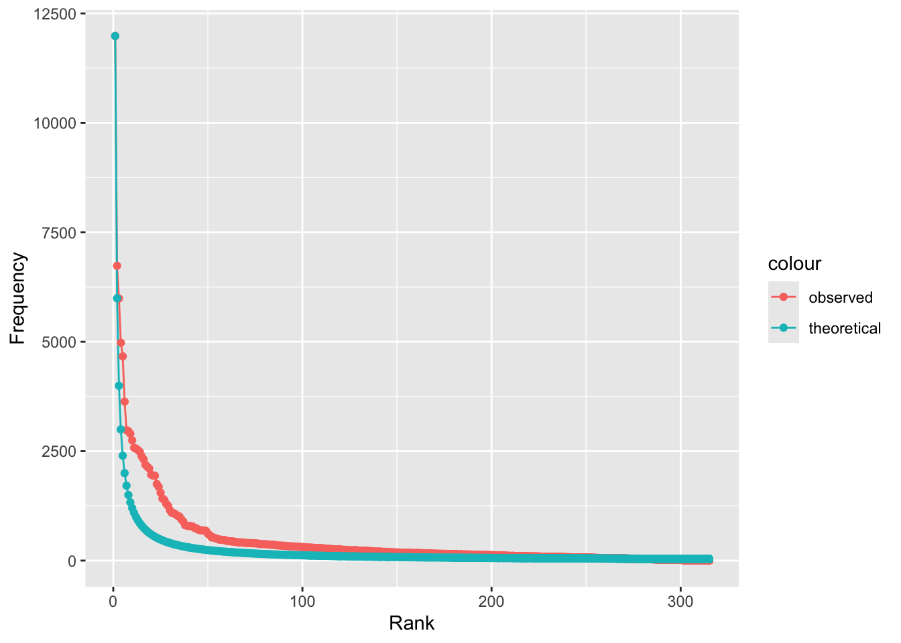

# Textanalyse III: Wortfrequenzanalysen

Die Konstruktion von Geschlecht und Geschlechterrollen in europäischen Märchen wird seit den 1970er Jahren in zahlreichen Forschungsarbeiten untersucht (zum Beispiel von [Marcia Lieberman 1972](https://www.jstor.org/stable/375142), [Alessandra Levorato 2003](https://doi.org/10.1057/9780230503878), [Simone Loleit und Liliane Schüller 2022](https://doi.org/10.1515/9783110726404-005)). In den letzten beiden Jahrzehnten sind Märchen auch zum Gegenstand von Arbeiten aus den Digital Humanities geworden (so z.B. in den Arbeiten von [Saif Mohammad 2011](https://aclanthology.org/W11-1514.pdf), [Mark Finlayson 2012](http://hdl.handle.net/1721.1/71284), [Berenike Herrmann und Jana Lüdtke 2023](https://doi.org/10.17175/2023_005)). Eine Reihe von Digital Humanities Arbeiten haben sich explizit Geschlecht und Geschlechterrollen in Märchen gewidmet, so zum Beispiel: 

* Toro Isaza, Paulina et al. (2023). [*Are Fairy Tales Fair? Analyzing Gender Bias in Temporal Narrative Event Chains of Children's Fairy Tales*](
https://doi.org/10.48550/arXiv.2305.16641), in: Proceedings of the 61st Annual Meeting of the Association for Computational Linguistics 1: Long Papers, pp. 6509-6531.
* Jorgensen, Jeana (2019). [*The Most Beautiful of All: A Quantitative Approach to Fairy-Tale Femininity*](https://works.bepress.com/jeana_jorgensen/29/), in: Journal of American Folklore 132 (523), pp. 36-60.
* Weingart, Scott and Jorgensen, Jeana (2013). [*Computational Analysis of the Body in European Fairy Tales*](http://dx.doi.org/10.1093/llc/fqs015), in: Literary and Linguistic Computing 28 (1), pp. 404-416.

In den nächsten beiden Wochen werden wir ein Korpus von Kinder- und Hausmärchen der Gebrüder Grimm aus dem Jahr 1857 im Hinblick auf die Darstellung verschiedener Märchencharaktere untersuchen. Dabei werden wir verschiedene Analysemethoden kennenlernen und kritisch beleuchten, inwieweit diese Methoden uns helfen können, bestimmte Muster in der Beschreibung von Märchencharakteren zu identifizieren. In diesem Kapitel werden wir zunächst Worthäufigkeiten und das gemeinsame Vorkommen verschiedener Wörter unabhängig von der Beziehung der Wörter zueinander betrachten. Wir werden dabei kritisch beleuchten, was die vorgestellten  Analysemethoden leisten können und was nicht. Im Kapitel 9 werden wir dann konkreten Fragen nachgehen: Welche Charaktere kommen in den Märchen vor? Mit welchen Adjektiven werden diese beschrieben? Welche Verben werden mit ihnen assoziiert? 

:::task
Verständnisfragen:

- Welche theoretischen Annahmen liegen unserer Forschungsfrage zugrunde? 
- Wie wird die Fragestellung im Folgenden operationalisiert?

:::

## Märchenkorpus einlesen und Pakete installieren

Um unser Korpus in R einzulesen, müssen wir zuerst wieder das **Arbeitsverzeichnis setzen**: 


```r
# Arbeitsverzeichnis setzen: Setzt hier euren eigenen Pfad ein
setwd("/Users/gast/R-Seminar") 
# Backslashes für Windows:
# setwd("C:\Users\gast\R-Seminar")
```

Wie bereits vergangene Woche erläutert kann das Arbeitsverzeichnis auch über den Tab "Files" im Fenster unten rechts gesetzt werden. Navigiert euch dazu erst in den gewünschten Ordner, klickt dann auf "More" und "Set As Working Directory" (siehe Kapitel "Orientierung im RStudio"). Wählt dabei den Ordner als Arbeitsverzeichnis, in dem ihr den Ordner maerchen_alle gespeichert habt. Achtung: Zip-Ordner müsst ihr vorher entpacken!

Wenn ihr das Arbeitsverzeichnis gesetzt habt, könnt ihr die **Dateien einlesen**. Wir werden ganz am Ende unserer Analyse die Grimm-Märchen in der siebten Edition von 1857 mit den Märchen aus der ersten Edition von 1812/15 vergleichen, um einen möglichen Wandel über die Zeit zu identifizieren. 


```r
library(readtext)

# Märchen von 1857 und 1812/15 einlesen und Informationen aus dem Dateinamen extrahieren
maerchen_alle <- readtext("maerchen_alle/*.txt", docvarsfrom = "filenames", dvsep = "_", docvarnames = c("Titel", "Jahr"), encoding = "UTF-8")
```


Bevor wir mit der Analyse starten können, müssen wir noch einige Pakete installieren, die wir brauchen werden: 


```r
install.packages(c("quanteda.textplots", "quanteda.textstats", "ggplot2", "plotly", "udpipe", "dplyr"))
```


Die Pakete müssen wie bisher immer nur einmal am Anfang des Skripts geladen werden. Allerdings werden wir in den folgenden Abschnitten Funktionen aus vielen verschiedenen Paketen verwenden. **Deswegen werden wir in diesem Kapitel ausnahmsweise Pakete erst dann laden, wenn sie gebraucht werden, sodass ihr in jeder Codezelle direkt erkennt, ob der Code Funktionen aus zusätzlichen Paketen enthält.** 


## Corpus-Objekt erstellen und erste Preprocessingschritte

Wir werden in der Analyse verschiedene Methoden einmal auf das Korpus mit und einmal ohne Stoppwörter anwenden, denn je nach Fragestellung und Methode sind Stoppwörter mehr oder weniger interessant. Deswegen erstellen wir in diesem Abschnitt zwei verschiedene tokens-Objekte. Wir werden aber auch sehen, dass Textanalyse und Preprocessing eigentlich iterative Prozesse sind: Es kommt oft vor, dass bei der Analyse weitere Preprocessingschritte notwendig werden.


```r
library(quanteda)

# Quanteda-corpus-Objekt erstellen
maerchen_corpus_alle <- corpus(maerchen_alle) 

# Teilkorpus extrahieren
maerchen_corpus <- corpus_subset(maerchen_corpus_alle, Jahr == 1857)

# Quanteda tokens-Objekt erstellen ohne weiteres Preprocessing
maerchen_toks_raw <- tokens(maerchen_corpus)

# Quanteda-tokens-Objekt erstellen MIT Stoppwörtern
maerchen_toks <- tokens(maerchen_corpus, remove_punct = TRUE) %>%
  tokens_tolower()

# Quanteda-tokens-Objekt erstellen OHNE Stoppwörter
maerchen_toks_rm <- tokens_remove(maerchen_toks, pattern = stopwords("de"))
```

Wir haben jetzt also ein corpus-Objekt sowie zwei verschiedene tokens-Objekte (eins mit und eins ohne Stoppwörter), die wir in unserer Analyse verwenden können. 

## Worthäufigkeiten verstehen: absolute und relative Häufigkeiten

In diesem Abschnitt betrachten wir Worthäufigkeiten über das gesamte Korpus hinweg und vergleichen Worthäufigkeiten in verschiedenen Dokumenten miteinander. Dazu lernen wir drei verschiedene Maße kennen: absolute Häufigkeiten, relative Häufigkeiten und TF-IDF, die sogenannte Term Frequency-Inverse Document Frequency. 

### Absolute Häufigkeiten und das Zipf'sche Gesetz

Zunächst ist es sinnvoll, sich einen Überblick über das Korpus zu verschaffen. Aus der letzten Woche kennt ihr bereits die `summary()`-Funktion. Wenn dieser Funktion als Argument ein Quanteda Corpus-Objekt übergeben wird, liefert sie einen Dataframe mit der Anzahl von Types und Tokens zu jedem Text. Der Text wird dabei automatisch mit den Defaultargumenten tokenisiert. 


```r
token_info <- summary(maerchen_corpus, 200)
token_info
```

```{style="max-height: 150px;"}
## Corpus consisting of 194 documents, showing 194 documents:
## 
##                                                               Text Types Tokens Sentences                                                    Titel Jahr
##                                              Allerleirauh_1857.txt   617   2361        86                                             Allerleirauh 1857
##                      Armuth-und-Demuth-fuehren-zum-Himmel_1857.txt   252    517        22                     Armuth-und-Demuth-fuehren-zum-Himmel 1857
##                                              Aschenputtel_1857.txt   703   2851       105                                             Aschenputtel 1857
##                                             Bruder-Lustig_1857.txt   950   4792       232                                            Bruder-Lustig 1857
##                             Bruederchen-und-Schwesterchen_1857.txt   691   2670       100                            Bruederchen-und-Schwesterchen 1857
##                                      Das-alte-Muetterchen_1857.txt   188    355        12                                     Das-alte-Muetterchen 1857
##                                           Das-blaue-Licht_1857.txt   605   1929        78                                          Das-blaue-Licht 1857
##                          Das-Dietmarsische-Luegenmaerchen_1857.txt   132    211         9                         Das-Dietmarsische-Luegenmaerchen 1857
##                                     Das-eigensinnige-Kind_1857.txt    83    136         4                                    Das-eigensinnige-Kind 1857
##                                               Das-Eselein_1857.txt   508   1420        58                                              Das-Eselein 1857
##                                        Das-Hirtenbueblein_1857.txt   179    367        13                                       Das-Hirtenbueblein 1857
##                               Das-junggegluehte-Maennlein_1857.txt   288    561        19                              Das-junggegluehte-Maennlein 1857
##                                         Das-kluge-Grethel_1857.txt   368   1083        43                                        Das-kluge-Grethel 1857
##                               Das-Laemmchen-und-Fischchen_1857.txt   262    637        21                              Das-Laemmchen-und-Fischchen 1857
##                                        Das-Lumpengesindel_1857.txt   369    859        28                                       Das-Lumpengesindel 1857
##                                  Das-Maedchen-ohne-Haende_1857.txt   686   2548        99                                 Das-Maedchen-ohne-Haende 1857
##                         Das-Maerchen-vom-Schlauraffenland_1857.txt   192    349        13                        Das-Maerchen-vom-Schlauraffenland 1857
##                                          Das-Meerhaeschen_1857.txt   447   1307        57                                         Das-Meerhaeschen 1857
##                                              Das-Raethsel_1857.txt   466   1236        48                                             Das-Raethsel 1857
##                   Das-singende-springende-Loeweneckerchen_1857.txt   694   2560        73                  Das-singende-springende-Loeweneckerchen 1857
##                                 Das-tapfere-Schneiderlein_1857.txt   998   3607       146                                Das-tapfere-Schneiderlein 1857
##                                        Das-Todtenhemdchen_1857.txt   145    285         7                                       Das-Todtenhemdchen 1857
##                                              Das-Waldhaus_1857.txt   606   2014        72                                             Das-Waldhaus 1857
##                                     Das-Wasser-des-Lebens_1857.txt   663   2440        84                                    Das-Wasser-des-Lebens 1857
##                                  Daumerlings-Wanderschaft_1857.txt   610   1767        74                                 Daumerlings-Wanderschaft 1857
##                                                Daumesdick_1857.txt   743   2575       107                                               Daumesdick 1857
##                         Der-alte-Grossvater-und-der-Enkel_1857.txt   152    262        11                        Der-alte-Grossvater-und-der-Enkel 1857
##                                       Der-alte-Hildebrand_1857.txt   385   1620        43                                      Der-alte-Hildebrand 1857
##                                           Der-alte-Sultan_1857.txt   400    938        34                                          Der-alte-Sultan 1857
##                                    Der-arme-Junge-im-Grab_1857.txt   500   1347        58                                   Der-arme-Junge-im-Grab 1857
##                  Der-arme-Muellerbursch-und-das-Kaetzchen_1857.txt   506   1501        52                 Der-arme-Muellerbursch-und-das-Kaetzchen 1857
##                                   Der-Arme-und-der-Reiche_1857.txt   607   1802        62                                  Der-Arme-und-der-Reiche 1857
##                                         Der-Baerenhaeuter_1857.txt   698   2179        81                                        Der-Baerenhaeuter 1857
##                                  Der-Bauer-und-der-Teufel_1857.txt   192    405        19                                 Der-Bauer-und-der-Teufel 1857
##                               Der-Dreschflegel-vom-Himmel_1857.txt   199    394        11                              Der-Dreschflegel-vom-Himmel 1857
##                                             Der-Eisenhans_1857.txt   885   3502       149                                            Der-Eisenhans 1857
##                                             Der-Eisenofen_1857.txt   595   2307        86                                            Der-Eisenofen 1857
##                                           Der-faule-Heinz_1857.txt   462   1077        39                                          Der-faule-Heinz 1857
##                        Der-Frieder-und-das-Catherlieschen_1857.txt   749   2898       130                       Der-Frieder-und-das-Catherlieschen 1857
##                Der-Froschkoenig-oder-der-eiserne-Heinrich_1857.txt   497   1560        52               Der-Froschkoenig-oder-der-eiserne-Heinrich 1857
##                                   Der-Fuchs-und-das-Pferd_1857.txt   236    537        17                                  Der-Fuchs-und-das-Pferd 1857
##                         Der-Fuchs-und-die-Frau-Gevatterin_1857.txt   207    399        13                        Der-Fuchs-und-die-Frau-Gevatterin 1857
##                                  Der-Fuchs-und-die-Gaense_1857.txt   141    258        11                                 Der-Fuchs-und-die-Gaense 1857
##                                   Der-Fuchs-und-die-Katze_1857.txt   173    331        21                                  Der-Fuchs-und-die-Katze 1857
##                                         Der-Geist-im-Glas_1857.txt   605   2054        75                                        Der-Geist-im-Glas 1857
##                                       Der-gelernte-Jaeger_1857.txt   670   2443        80                                      Der-gelernte-Jaeger 1857
##                                       Der-gescheidte-Hans_1857.txt   163   1318       166                                      Der-gescheidte-Hans 1857
##                                     Der-gestohlene-Heller_1857.txt   179    359        13                                    Der-gestohlene-Heller 1857
##                                          Der-Gevatter-Tod_1857.txt   477   1336        52                                         Der-Gevatter-Tod 1857
##                                        Der-glaeserne-Sarg_1857.txt   957   2443        89                                       Der-glaeserne-Sarg 1857
##                                    Der-goldene-Schluessel_1857.txt   120    192         9                                   Der-goldene-Schluessel 1857
##                                         Der-goldene-Vogel_1857.txt   862   3285       126                                        Der-goldene-Vogel 1857
##                                            Der-Grabhuegel_1857.txt   597   1608        71                                           Der-Grabhuegel 1857
##                                           Der-gute-Handel_1857.txt   565   1926        70                                          Der-gute-Handel 1857
##                                          Der-Hahnenbalken_1857.txt   155    288        13                                         Der-Hahnenbalken 1857
##                                     Der-Hase-und-der-Igel_1857.txt   518   1523        68                                    Der-Hase-und-der-Igel 1857
##                               Der-heilige-Joseph-im-Walde_1857.txt   408   1282        58                              Der-heilige-Joseph-im-Walde 1857
##                                         Der-Herr-Gevatter_1857.txt   250    685        34                                        Der-Herr-Gevatter 1857
##                                 Der-Hund-und-der-Sperling_1857.txt   384   1379        62                                Der-Hund-und-der-Sperling 1857
##                                          Der-Jude-im-Dorn_1857.txt   647   1995        76                                         Der-Jude-im-Dorn 1857
##                                           Der-junge-Riese_1857.txt   790   3381       123                                          Der-junge-Riese 1857
##                                          Der-kluge-Knecht_1857.txt   146    295        15                                         Der-kluge-Knecht 1857
##                              Der-Koenig-vom-goldenen-Berg_1857.txt   739   2635        94                             Der-Koenig-vom-goldenen-Berg 1857
##             Der-Koenigssohn-der-sich-vor-nichts-fuerchtet_1857.txt   685   2279        86            Der-Koenigssohn-der-sich-vor-nichts-fuerchtet 1857
##                                             Der-Krautesel_1857.txt   833   2893       104                                            Der-Krautesel 1857
##                                        Der-Liebste-Roland_1857.txt   530   1614        57                                       Der-Liebste-Roland 1857
##                                           Der-Meisterdieb_1857.txt   975   3430       129                                          Der-Meisterdieb 1857
##                                                  Der-Mond_1857.txt   364    790        35                                                 Der-Mond 1857
##                                                 Der-Nagel_1857.txt   146    291        15                                                Der-Nagel 1857
##                                     Der-Raeuberbraeutigam_1857.txt   488   1488        63                                    Der-Raeuberbraeutigam 1857
##                Der-Ranzen,-das-Huetlein-und-das-Hoernlein_1857.txt   773   2506        85               Der-Ranzen,-das-Huetlein-und-das-Hoernlein 1857
##                               Der-Riese-und-der-Schneider_1857.txt   324    838        45                              Der-Riese-und-der-Schneider 1857
##                                   Der-Schneider-im-Himmel_1857.txt   353    843        32                                  Der-Schneider-im-Himmel 1857
##                                      Der-singende-Knochen_1857.txt   355    799        28                                     Der-singende-Knochen 1857
##                        Der-Sperling-und-seine-vier-Kinder_1857.txt   440   1018        39                       Der-Sperling-und-seine-vier-Kinder 1857
##                                           Der-starke-Hans_1857.txt   803   2879        99                                          Der-starke-Hans 1857
##                              Der-Stiefel-von-Bueffelleder_1857.txt   546   1598        67                             Der-Stiefel-von-Bueffelleder 1857
##                                           Der-suesse-Brei_1857.txt   132    266         6                                          Der-suesse-Brei 1857
##                   Der-Teufel-mit-den-drei-goldenen-Haaren_1857.txt   730   2958       129                  Der-Teufel-mit-den-drei-goldenen-Haaren 1857
##                          Der-Teufel-und-seine-Grossmutter_1857.txt   477   1376        56                         Der-Teufel-und-seine-Grossmutter 1857
##                                        Der-treue-Johannes_1857.txt   861   3383       114                                       Der-treue-Johannes 1857
##                                              Der-Trommler_1857.txt  1029   4223       180                                             Der-Trommler 1857
##                                       Der-undankbare-Sohn_1857.txt   104    166         5                                      Der-undankbare-Sohn 1857
##                                    Der-Wolf-und-der-Fuchs_1857.txt   291    812        31                                   Der-Wolf-und-der-Fuchs 1857
##                                   Der-Wolf-und-der-Mensch_1857.txt   206    483        19                                  Der-Wolf-und-der-Mensch 1857
##                   Der-Wolf-und-die-sieben-jungen-Geislein_1857.txt   403   1191        50                  Der-Wolf-und-die-sieben-jungen-Geislein 1857
##                                 Der-wunderliche-Spielmann_1857.txt   374   1218        49                                Der-wunderliche-Spielmann 1857
##                                            Der-Zaunkoenig_1857.txt   478   1280        70                                           Der-Zaunkoenig 1857
##                               Der-Zaunkoenig-und-der-Baer_1857.txt   384   1026        36                              Der-Zaunkoenig-und-der-Baer 1857
##                         Des-Herrn-und-des-Teufels-Gethier_1857.txt   206    369        15                        Des-Herrn-und-des-Teufels-Gethier 1857
##                               Des-Teufels-russiger-Bruder_1857.txt   448   1392        47                              Des-Teufels-russiger-Bruder 1857
##                                       Die-alte-Bettelfrau_1857.txt   102    167         8                                      Die-alte-Bettelfrau 1857
##                                          Die-Alte-im-Wald_1857.txt   361   1001        32                                         Die-Alte-im-Wald 1857
##                                       Die-beiden-Wanderer_1857.txt  1198   4487       176                                      Die-beiden-Wanderer 1857
##                                        Die-Bienenkoenigin_1857.txt   318    845        27                                       Die-Bienenkoenigin 1857
##                                       Die-Boten-des-Todes_1857.txt   309    702        35                                      Die-Boten-des-Todes 1857
##                                            Die-Brautschau_1857.txt    98    165         5                                           Die-Brautschau 1857
##                                Die-Bremer-Stadtmusikanten_1857.txt   528   1424        50                               Die-Bremer-Stadtmusikanten 1857
##                                Die-Brosamen-auf-dem-Tisch_1857.txt   111    194         9                               Die-Brosamen-auf-dem-Tisch 1857
##                                          Die-drei-Brueder_1857.txt   309    728        21                                         Die-drei-Brueder 1857
##                                           Die-drei-Faulen_1857.txt   124    254         6                                          Die-drei-Faulen 1857
##                                           Die-drei-Federn_1857.txt   396   1104        44                                          Die-drei-Federn 1857
##                                      Die-drei-Feldscherer_1857.txt   394   1114        47                                     Die-drei-Feldscherer 1857
##                                    Die-drei-Glueckskinder_1857.txt   449   1064        36                                   Die-drei-Glueckskinder 1857
##                                   Die-drei-gruenen-Zweige_1857.txt   409   1018        37                                  Die-drei-gruenen-Zweige 1857
##                                Die-drei-Handwerksburschen_1857.txt   438   1311        58                               Die-drei-Handwerksburschen 1857
##                               Die-drei-Maennlein-im-Walde_1857.txt   642   2200        85                              Die-drei-Maennlein-im-Walde 1857
##                                Die-drei-Schlangenblaetter_1857.txt   561   1560        53                               Die-drei-Schlangenblaetter 1857
##                                     Die-drei-Spinnerinnen_1857.txt   379    977        35                                    Die-drei-Spinnerinnen 1857
##                                         Die-drei-Sprachen_1857.txt   405   1014        39                                        Die-drei-Sprachen 1857
##                                                  Die-Eule_1857.txt   438    895        30                                                 Die-Eule 1857
##                                       Die-faule-Spinnerin_1857.txt   305    827        29                                      Die-faule-Spinnerin 1857
##                               Die-Gaensehirtin-am-Brunnen_1857.txt  1142   4376       194                              Die-Gaensehirtin-am-Brunnen 1857
##                                            Die-Gaensemagd_1857.txt   678   2295        72                                           Die-Gaensemagd 1857
##                          Die-Geschenke-des-kleinen-Volkes_1857.txt   428    975        30                         Die-Geschenke-des-kleinen-Volkes 1857
##                                          Die-goldene-Gans_1857.txt   543   1706        54                                         Die-goldene-Gans 1857
##                                            Die-Goldkinder_1857.txt   611   2183        81                                           Die-Goldkinder 1857
##                                          Die-hagere-Liese_1857.txt   237    515        17                                         Die-hagere-Liese 1857
##                                            Die-Haselruthe_1857.txt   135    217         7                                           Die-Haselruthe 1857
##                                   Die-himmlische-Hochzeit_1857.txt   235    566        20                                  Die-himmlische-Hochzeit 1857
##                            Die-Hochzeit-der-Frau-Fuechsin_1857.txt   303    910        47                           Die-Hochzeit-der-Frau-Fuechsin 1857
##                        Die-klare-Sonne-bringts-an-den-Tag_1857.txt   265    585        21                       Die-klare-Sonne-bringts-an-den-Tag 1857
##                                   Die-kluge-Bauerntochter_1857.txt   457   1519        50                                  Die-kluge-Bauerntochter 1857
##                                            Die-kluge-Else_1857.txt   408   1564        62                                           Die-kluge-Else 1857
##                                          Die-klugen-Leute_1857.txt   545   1752        75                                         Die-klugen-Leute 1857
##                                             Die-Kornaehre_1857.txt   146    246         9                                            Die-Kornaehre 1857
##                                         Die-Krystallkugel_1857.txt   458   1144        40                                        Die-Krystallkugel 1857
##                                            Die-Lebenszeit_1857.txt   272    674        38                                           Die-Lebenszeit 1857
##                                                 Die-Nelke_1857.txt   558   1963        64                                                Die-Nelke 1857
##                                         Die-Nixe-im-Teich_1857.txt   744   2335        99                                        Die-Nixe-im-Teich 1857
##                                                  Die-Rabe_1857.txt   603   2427        91                                                 Die-Rabe 1857
##                                                  Die-Rose_1857.txt   104    183         7                                                 Die-Rose 1857
##                                                 Die-Ruebe_1857.txt   471   1181        39                                                Die-Ruebe 1857
##                                        Die-Schlickerlinge_1857.txt   121    191         8                                       Die-Schlickerlinge 1857
##                Die-schoene-Katrinelje-und-Pif-Paf-Poltrie_1857.txt   116    500        45               Die-schoene-Katrinelje-und-Pif-Paf-Poltrie 1857
##                                               Die-Scholle_1857.txt   145    265        14                                              Die-Scholle 1857
##                                          Die-sechs-Diener_1857.txt   821   2911       103                                         Die-sechs-Diener 1857
##                                        Die-sechs-Schwaene_1857.txt   652   2143        82                                       Die-sechs-Schwaene 1857
##                                          Die-sieben-Raben_1857.txt   388    961        37                                         Die-sieben-Raben 1857
##                                       Die-sieben-Schwaben_1857.txt   475   1126        41                                      Die-sieben-Schwaben 1857
##                                           Die-Sternthaler_1857.txt   166    341        11                                          Die-Sternthaler 1857
##                                Die-ungleichen-Kinder-Evas_1857.txt   322    786        29                               Die-ungleichen-Kinder-Evas 1857
##                             Die-vier-kunstreichen-Brueder_1857.txt   581   1739        63                            Die-vier-kunstreichen-Brueder 1857
##                                           Die-wahre-Braut_1857.txt   853   2838       116                                          Die-wahre-Braut 1857
##                                            Die-Wassernixe_1857.txt   151    305        10                                           Die-Wassernixe 1857
##                                       Die-weisse-Schlange_1857.txt   638   1705        60                                      Die-weisse-Schlange 1857
##                         Die-weisse-und-die-schwarze-Braut_1857.txt   518   1609        61                        Die-weisse-und-die-schwarze-Braut 1857
##                                        Die-Wichtelmaenner_1857.txt   459   1201        42                                       Die-Wichtelmaenner 1857
##                                     Die-zertanzten-Schuhe_1857.txt   551   1549        57                                    Die-zertanzten-Schuhe 1857
##                                          Die-zwei-Brueder_1857.txt  1533   9166       318                                         Die-zwei-Brueder 1857
##                                        Die-zwoelf-Apostel_1857.txt   219    423        18                                       Die-zwoelf-Apostel 1857
##                                        Die-zwoelf-Brueder_1857.txt   660   2178        77                                       Die-zwoelf-Brueder 1857
##                                 Die-zwoelf-faulen-Knechte_1857.txt   466   1144        54                                Die-zwoelf-faulen-Knechte 1857
##                                         Die-zwoelf-Jaeger_1857.txt   394   1197        46                                        Die-zwoelf-Jaeger 1857
##                                         Doctor-Allwissend_1857.txt   307    836        35                                        Doctor-Allwissend 1857
##                                              Dornroeschen_1857.txt   511   1423        44                                             Dornroeschen 1857
##                Einaeuglein,-Zweiaeuglein-und-Dreiaeuglein_1857.txt   694   2724        96               Einaeuglein,-Zweiaeuglein-und-Dreiaeuglein 1857
##                                            Fitchers-Vogel_1857.txt   503   1434        57                                           Fitchers-Vogel 1857
##                                                Frau-Holle_1857.txt   412   1269        42                                               Frau-Holle 1857
##                                                Frau-Trude_1857.txt   166    349        17                                               Frau-Trude 1857
##                                                Fundevogel_1857.txt   306   1059        42                                               Fundevogel 1857
##                                             Gottes-Speise_1857.txt   148    256         8                                            Gottes-Speise 1857
##                                       Haensel-und-Grethel_1857.txt   835   3231       127                                      Haensel-und-Grethel 1857
##                                            Haesichenbraut_1857.txt   160    488        32                                           Haesichenbraut 1857
##                                            Hans-heirathet_1857.txt   241    502        18                                           Hans-heirathet 1857
##                                            Hans-im-Glueck_1857.txt   715   2309        93                                           Hans-im-Glueck 1857
##                                            Hans-mein-Igel_1857.txt   552   2218        67                                           Hans-mein-Igel 1857
##                                               Herr-Korbes_1857.txt   175    412        19                                              Herr-Korbes 1857
##                                      Jorinde-und-Joringel_1857.txt   391   1017        44                                     Jorinde-und-Joringel 1857
##                                           Jungfrau-Maleen_1857.txt   637   2204       100                                          Jungfrau-Maleen 1857
##                            Katze-und-Maus-in-Gesellschaft_1857.txt   414   1112        49                           Katze-und-Maus-in-Gesellschaft 1857
##                                        Koenig-Drosselbart_1857.txt   625   1883        81                                       Koenig-Drosselbart 1857
##                                   Laeuschen-und-Floehchen_1857.txt   113    465        31                                  Laeuschen-und-Floehchen 1857
##                                     Lieb-und-Leid-theilen_1857.txt   202    427        16                                    Lieb-und-Leid-theilen 1857
##   Maehrchen-von-einem,-der-auszog-das-Fuerchten-zu-lernen_1857.txt   966   4284       189  Maehrchen-von-einem,-der-auszog-das-Fuerchten-zu-lernen 1857
##                                     Maerchen-von-der-Unke_1857.txt   236    528        21                                    Maerchen-von-der-Unke 1857
##                                                Marienkind_1857.txt   616   2049        67                                               Marienkind 1857
##                                            Meister-Pfriem_1857.txt   592   1562        77                                           Meister-Pfriem 1857
##                                     Muttergottesglaeschen_1857.txt   100    164         6                                    Muttergottesglaeschen 1857
##                                          Raethselmaerchen_1857.txt    87    139         4                                         Raethselmaerchen 1857
##                                                  Rapunzel_1857.txt   518   1577        52                                                 Rapunzel 1857
##                                  Rohrdommel-und-Wiedehopf_1857.txt   139    273        17                                 Rohrdommel-und-Wiedehopf 1857
##                                             Rothkaeppchen_1857.txt   499   1537        61                                            Rothkaeppchen 1857
##                                           Rumpelstilzchen_1857.txt   404   1211        39                                          Rumpelstilzchen 1857
##                             Schneeweisschen-und-Rosenroth_1857.txt   877   2683        95                            Schneeweisschen-und-Rosenroth 1857
##                        Sechse-kommen-durch-die-ganze-Welt_1857.txt   671   2274        78                       Sechse-kommen-durch-die-ganze-Welt 1857
##                                                Simeliberg_1857.txt   338    889        31                                               Simeliberg 1857
##                                              Sneewittchen_1857.txt   814   3436       142                                             Sneewittchen 1857
##                        Spindel,-Weberschiffchen-und-Nadel_1857.txt   430   1149        43                       Spindel,-Weberschiffchen-und-Nadel 1857
##                                Strohhalm,-Kohle-und-Bohne_1857.txt   269    566        22                               Strohhalm,-Kohle-und-Bohne 1857
##  Tischchen-deck-dich,-Goldesel,-und-Knueppel-aus-dem-Sack_1857.txt   945   4290       183 Tischchen-deck-dich,-Goldesel,-und-Knueppel-aus-dem-Sack 1857
##                                  Vom-klugen-Schneiderlein_1857.txt   470   1301        50                                 Vom-klugen-Schneiderlein 1857
##           Von-dem-Maeuschen,-Voegelchen-und-der-Bratwurst_1857.txt   297    648        22          Von-dem-Maeuschen,-Voegelchen-und-der-Bratwurst 1857
##                               Von-dem-Tode-des-Huehnchens_1857.txt   243    713        26                              Von-dem-Tode-des-Huehnchens 1857
```

Um schnell den längsten und kürzesten Text zu finden, können wir einfach wieder die Funktionen `max()` und `min()` anwenden (s. [Kapitel 5.5](https://lipogg.github.io/textanalyse-mit-r/textanalyse-i-korpus-tokens-daten-und-dateien.html#quanteda-corpus-objekte)), oder den Dataframe absteigend nach der Spalte Types bzw. Tokens sortieren: 


```r
token_info[order(token_info$Tokens, decreasing = TRUE),]
```

```{style="max-height: 150px;"}
##                                                                  Text Types Tokens Sentences                                                    Titel Jahr
## 150                                         Die-zwei-Brueder_1857.txt  1533   9166       318                                         Die-zwei-Brueder 1857
## 4                                              Bruder-Lustig_1857.txt   950   4792       232                                            Bruder-Lustig 1857
## 94                                       Die-beiden-Wanderer_1857.txt  1198   4487       176                                      Die-beiden-Wanderer 1857
## 113                              Die-Gaensehirtin-am-Brunnen_1857.txt  1142   4376       194                              Die-Gaensehirtin-am-Brunnen 1857
## 191 Tischchen-deck-dich,-Goldesel,-und-Knueppel-aus-dem-Sack_1857.txt   945   4290       183 Tischchen-deck-dich,-Goldesel,-und-Knueppel-aus-dem-Sack 1857
## 175  Maehrchen-von-einem,-der-auszog-das-Fuerchten-zu-lernen_1857.txt   966   4284       189  Maehrchen-von-einem,-der-auszog-das-Fuerchten-zu-lernen 1857
## 82                                              Der-Trommler_1857.txt  1029   4223       180                                             Der-Trommler 1857
## 21                                 Das-tapfere-Schneiderlein_1857.txt   998   3607       146                                Das-tapfere-Schneiderlein 1857
## 36                                             Der-Eisenhans_1857.txt   885   3502       149                                            Der-Eisenhans 1857
## 188                                             Sneewittchen_1857.txt   814   3436       142                                             Sneewittchen 1857
## 67                                           Der-Meisterdieb_1857.txt   975   3430       129                                          Der-Meisterdieb 1857
## 81                                        Der-treue-Johannes_1857.txt   861   3383       114                                       Der-treue-Johannes 1857
## 61                                           Der-junge-Riese_1857.txt   790   3381       123                                          Der-junge-Riese 1857
## 52                                         Der-goldene-Vogel_1857.txt   862   3285       126                                        Der-goldene-Vogel 1857
## 163                                      Haensel-und-Grethel_1857.txt   835   3231       127                                      Haensel-und-Grethel 1857
## 79                   Der-Teufel-mit-den-drei-goldenen-Haaren_1857.txt   730   2958       129                  Der-Teufel-mit-den-drei-goldenen-Haaren 1857
## 137                                         Die-sechs-Diener_1857.txt   821   2911       103                                         Die-sechs-Diener 1857
## 39                        Der-Frieder-und-das-Catherlieschen_1857.txt   749   2898       130                       Der-Frieder-und-das-Catherlieschen 1857
## 65                                             Der-Krautesel_1857.txt   833   2893       104                                            Der-Krautesel 1857
## 76                                           Der-starke-Hans_1857.txt   803   2879        99                                          Der-starke-Hans 1857
## 3                                               Aschenputtel_1857.txt   703   2851       105                                             Aschenputtel 1857
## 144                                          Die-wahre-Braut_1857.txt   853   2838       116                                          Die-wahre-Braut 1857
## 157               Einaeuglein,-Zweiaeuglein-und-Dreiaeuglein_1857.txt   694   2724        96               Einaeuglein,-Zweiaeuglein-und-Dreiaeuglein 1857
## 185                            Schneeweisschen-und-Rosenroth_1857.txt   877   2683        95                            Schneeweisschen-und-Rosenroth 1857
## 5                              Bruederchen-und-Schwesterchen_1857.txt   691   2670       100                            Bruederchen-und-Schwesterchen 1857
## 63                              Der-Koenig-vom-goldenen-Berg_1857.txt   739   2635        94                             Der-Koenig-vom-goldenen-Berg 1857
## 26                                                Daumesdick_1857.txt   743   2575       107                                               Daumesdick 1857
## 20                   Das-singende-springende-Loeweneckerchen_1857.txt   694   2560        73                  Das-singende-springende-Loeweneckerchen 1857
## 16                                  Das-Maedchen-ohne-Haende_1857.txt   686   2548        99                                 Das-Maedchen-ohne-Haende 1857
## 71                Der-Ranzen,-das-Huetlein-und-das-Hoernlein_1857.txt   773   2506        85               Der-Ranzen,-das-Huetlein-und-das-Hoernlein 1857
## 46                                       Der-gelernte-Jaeger_1857.txt   670   2443        80                                      Der-gelernte-Jaeger 1857
## 50                                        Der-glaeserne-Sarg_1857.txt   957   2443        89                                       Der-glaeserne-Sarg 1857
## 24                                     Das-Wasser-des-Lebens_1857.txt   663   2440        84                                    Das-Wasser-des-Lebens 1857
## 131                                                 Die-Rabe_1857.txt   603   2427        91                                                 Die-Rabe 1857
## 1                                               Allerleirauh_1857.txt   617   2361        86                                             Allerleirauh 1857
## 130                                        Die-Nixe-im-Teich_1857.txt   744   2335        99                                        Die-Nixe-im-Teich 1857
## 166                                           Hans-im-Glueck_1857.txt   715   2309        93                                           Hans-im-Glueck 1857
## 37                                             Der-Eisenofen_1857.txt   595   2307        86                                            Der-Eisenofen 1857
## 114                                           Die-Gaensemagd_1857.txt   678   2295        72                                           Die-Gaensemagd 1857
## 64             Der-Koenigssohn-der-sich-vor-nichts-fuerchtet_1857.txt   685   2279        86            Der-Koenigssohn-der-sich-vor-nichts-fuerchtet 1857
## 186                       Sechse-kommen-durch-die-ganze-Welt_1857.txt   671   2274        78                       Sechse-kommen-durch-die-ganze-Welt 1857
## 167                                           Hans-mein-Igel_1857.txt   552   2218        67                                           Hans-mein-Igel 1857
## 170                                          Jungfrau-Maleen_1857.txt   637   2204       100                                          Jungfrau-Maleen 1857
## 107                              Die-drei-Maennlein-im-Walde_1857.txt   642   2200        85                              Die-drei-Maennlein-im-Walde 1857
## 117                                           Die-Goldkinder_1857.txt   611   2183        81                                           Die-Goldkinder 1857
## 33                                         Der-Baerenhaeuter_1857.txt   698   2179        81                                        Der-Baerenhaeuter 1857
## 152                                       Die-zwoelf-Brueder_1857.txt   660   2178        77                                       Die-zwoelf-Brueder 1857
## 138                                       Die-sechs-Schwaene_1857.txt   652   2143        82                                       Die-sechs-Schwaene 1857
## 45                                         Der-Geist-im-Glas_1857.txt   605   2054        75                                        Der-Geist-im-Glas 1857
## 177                                               Marienkind_1857.txt   616   2049        67                                               Marienkind 1857
## 23                                              Das-Waldhaus_1857.txt   606   2014        72                                             Das-Waldhaus 1857
## 60                                          Der-Jude-im-Dorn_1857.txt   647   1995        76                                         Der-Jude-im-Dorn 1857
## 129                                                Die-Nelke_1857.txt   558   1963        64                                                Die-Nelke 1857
## 7                                            Das-blaue-Licht_1857.txt   605   1929        78                                          Das-blaue-Licht 1857
## 54                                           Der-gute-Handel_1857.txt   565   1926        70                                          Der-gute-Handel 1857
## 172                                       Koenig-Drosselbart_1857.txt   625   1883        81                                       Koenig-Drosselbart 1857
## 32                                   Der-Arme-und-der-Reiche_1857.txt   607   1802        62                                  Der-Arme-und-der-Reiche 1857
## 25                                  Daumerlings-Wanderschaft_1857.txt   610   1767        74                                 Daumerlings-Wanderschaft 1857
## 125                                         Die-klugen-Leute_1857.txt   545   1752        75                                         Die-klugen-Leute 1857
## 143                            Die-vier-kunstreichen-Brueder_1857.txt   581   1739        63                            Die-vier-kunstreichen-Brueder 1857
## 116                                         Die-goldene-Gans_1857.txt   543   1706        54                                         Die-goldene-Gans 1857
## 146                                      Die-weisse-Schlange_1857.txt   638   1705        60                                      Die-weisse-Schlange 1857
## 28                                       Der-alte-Hildebrand_1857.txt   385   1620        43                                      Der-alte-Hildebrand 1857
## 66                                        Der-Liebste-Roland_1857.txt   530   1614        57                                       Der-Liebste-Roland 1857
## 147                        Die-weisse-und-die-schwarze-Braut_1857.txt   518   1609        61                        Die-weisse-und-die-schwarze-Braut 1857
## 53                                            Der-Grabhuegel_1857.txt   597   1608        71                                           Der-Grabhuegel 1857
## 77                              Der-Stiefel-von-Bueffelleder_1857.txt   546   1598        67                             Der-Stiefel-von-Bueffelleder 1857
## 181                                                 Rapunzel_1857.txt   518   1577        52                                                 Rapunzel 1857
## 124                                           Die-kluge-Else_1857.txt   408   1564        62                                           Die-kluge-Else 1857
## 178                                           Meister-Pfriem_1857.txt   592   1562        77                                           Meister-Pfriem 1857
## 40                Der-Froschkoenig-oder-der-eiserne-Heinrich_1857.txt   497   1560        52               Der-Froschkoenig-oder-der-eiserne-Heinrich 1857
## 108                               Die-drei-Schlangenblaetter_1857.txt   561   1560        53                               Die-drei-Schlangenblaetter 1857
## 149                                    Die-zertanzten-Schuhe_1857.txt   551   1549        57                                    Die-zertanzten-Schuhe 1857
## 183                                            Rothkaeppchen_1857.txt   499   1537        61                                            Rothkaeppchen 1857
## 56                                     Der-Hase-und-der-Igel_1857.txt   518   1523        68                                    Der-Hase-und-der-Igel 1857
## 123                                  Die-kluge-Bauerntochter_1857.txt   457   1519        50                                  Die-kluge-Bauerntochter 1857
## 31                  Der-arme-Muellerbursch-und-das-Kaetzchen_1857.txt   506   1501        52                 Der-arme-Muellerbursch-und-das-Kaetzchen 1857
## 70                                     Der-Raeuberbraeutigam_1857.txt   488   1488        63                                    Der-Raeuberbraeutigam 1857
## 158                                           Fitchers-Vogel_1857.txt   503   1434        57                                           Fitchers-Vogel 1857
## 98                                Die-Bremer-Stadtmusikanten_1857.txt   528   1424        50                               Die-Bremer-Stadtmusikanten 1857
## 156                                             Dornroeschen_1857.txt   511   1423        44                                             Dornroeschen 1857
## 10                                               Das-Eselein_1857.txt   508   1420        58                                              Das-Eselein 1857
## 91                               Des-Teufels-russiger-Bruder_1857.txt   448   1392        47                              Des-Teufels-russiger-Bruder 1857
## 59                                 Der-Hund-und-der-Sperling_1857.txt   384   1379        62                                Der-Hund-und-der-Sperling 1857
## 80                          Der-Teufel-und-seine-Grossmutter_1857.txt   477   1376        56                         Der-Teufel-und-seine-Grossmutter 1857
## 30                                    Der-arme-Junge-im-Grab_1857.txt   500   1347        58                                   Der-arme-Junge-im-Grab 1857
## 49                                          Der-Gevatter-Tod_1857.txt   477   1336        52                                         Der-Gevatter-Tod 1857
## 47                                       Der-gescheidte-Hans_1857.txt   163   1318       166                                      Der-gescheidte-Hans 1857
## 106                               Die-drei-Handwerksburschen_1857.txt   438   1311        58                               Die-drei-Handwerksburschen 1857
## 18                                          Das-Meerhaeschen_1857.txt   447   1307        57                                         Das-Meerhaeschen 1857
## 192                                 Vom-klugen-Schneiderlein_1857.txt   470   1301        50                                 Vom-klugen-Schneiderlein 1857
## 57                               Der-heilige-Joseph-im-Walde_1857.txt   408   1282        58                              Der-heilige-Joseph-im-Walde 1857
## 88                                            Der-Zaunkoenig_1857.txt   478   1280        70                                           Der-Zaunkoenig 1857
## 159                                               Frau-Holle_1857.txt   412   1269        42                                               Frau-Holle 1857
## 19                                              Das-Raethsel_1857.txt   466   1236        48                                             Das-Raethsel 1857
## 87                                 Der-wunderliche-Spielmann_1857.txt   374   1218        49                                Der-wunderliche-Spielmann 1857
## 184                                          Rumpelstilzchen_1857.txt   404   1211        39                                          Rumpelstilzchen 1857
## 148                                       Die-Wichtelmaenner_1857.txt   459   1201        42                                       Die-Wichtelmaenner 1857
## 154                                        Die-zwoelf-Jaeger_1857.txt   394   1197        46                                        Die-zwoelf-Jaeger 1857
## 86                   Der-Wolf-und-die-sieben-jungen-Geislein_1857.txt   403   1191        50                  Der-Wolf-und-die-sieben-jungen-Geislein 1857
## 133                                                Die-Ruebe_1857.txt   471   1181        39                                                Die-Ruebe 1857
## 189                       Spindel,-Weberschiffchen-und-Nadel_1857.txt   430   1149        43                       Spindel,-Weberschiffchen-und-Nadel 1857
## 127                                        Die-Krystallkugel_1857.txt   458   1144        40                                        Die-Krystallkugel 1857
## 153                                Die-zwoelf-faulen-Knechte_1857.txt   466   1144        54                                Die-zwoelf-faulen-Knechte 1857
## 140                                      Die-sieben-Schwaben_1857.txt   475   1126        41                                      Die-sieben-Schwaben 1857
## 103                                     Die-drei-Feldscherer_1857.txt   394   1114        47                                     Die-drei-Feldscherer 1857
## 171                           Katze-und-Maus-in-Gesellschaft_1857.txt   414   1112        49                           Katze-und-Maus-in-Gesellschaft 1857
## 102                                          Die-drei-Federn_1857.txt   396   1104        44                                          Die-drei-Federn 1857
## 13                                         Das-kluge-Grethel_1857.txt   368   1083        43                                        Das-kluge-Grethel 1857
## 38                                           Der-faule-Heinz_1857.txt   462   1077        39                                          Der-faule-Heinz 1857
## 104                                   Die-drei-Glueckskinder_1857.txt   449   1064        36                                   Die-drei-Glueckskinder 1857
## 161                                               Fundevogel_1857.txt   306   1059        42                                               Fundevogel 1857
## 89                               Der-Zaunkoenig-und-der-Baer_1857.txt   384   1026        36                              Der-Zaunkoenig-und-der-Baer 1857
## 75                        Der-Sperling-und-seine-vier-Kinder_1857.txt   440   1018        39                       Der-Sperling-und-seine-vier-Kinder 1857
## 105                                  Die-drei-gruenen-Zweige_1857.txt   409   1018        37                                  Die-drei-gruenen-Zweige 1857
## 169                                     Jorinde-und-Joringel_1857.txt   391   1017        44                                     Jorinde-und-Joringel 1857
## 110                                        Die-drei-Sprachen_1857.txt   405   1014        39                                        Die-drei-Sprachen 1857
## 93                                          Die-Alte-im-Wald_1857.txt   361   1001        32                                         Die-Alte-im-Wald 1857
## 109                                    Die-drei-Spinnerinnen_1857.txt   379    977        35                                    Die-drei-Spinnerinnen 1857
## 115                         Die-Geschenke-des-kleinen-Volkes_1857.txt   428    975        30                         Die-Geschenke-des-kleinen-Volkes 1857
## 139                                         Die-sieben-Raben_1857.txt   388    961        37                                         Die-sieben-Raben 1857
## 29                                           Der-alte-Sultan_1857.txt   400    938        34                                          Der-alte-Sultan 1857
## 121                           Die-Hochzeit-der-Frau-Fuechsin_1857.txt   303    910        47                           Die-Hochzeit-der-Frau-Fuechsin 1857
## 111                                                 Die-Eule_1857.txt   438    895        30                                                 Die-Eule 1857
## 187                                               Simeliberg_1857.txt   338    889        31                                               Simeliberg 1857
## 15                                        Das-Lumpengesindel_1857.txt   369    859        28                                       Das-Lumpengesindel 1857
## 95                                        Die-Bienenkoenigin_1857.txt   318    845        27                                       Die-Bienenkoenigin 1857
## 73                                   Der-Schneider-im-Himmel_1857.txt   353    843        32                                  Der-Schneider-im-Himmel 1857
## 72                               Der-Riese-und-der-Schneider_1857.txt   324    838        45                              Der-Riese-und-der-Schneider 1857
## 155                                        Doctor-Allwissend_1857.txt   307    836        35                                        Doctor-Allwissend 1857
## 112                                      Die-faule-Spinnerin_1857.txt   305    827        29                                      Die-faule-Spinnerin 1857
## 84                                    Der-Wolf-und-der-Fuchs_1857.txt   291    812        31                                   Der-Wolf-und-der-Fuchs 1857
## 74                                      Der-singende-Knochen_1857.txt   355    799        28                                     Der-singende-Knochen 1857
## 68                                                  Der-Mond_1857.txt   364    790        35                                                 Der-Mond 1857
## 142                               Die-ungleichen-Kinder-Evas_1857.txt   322    786        29                               Die-ungleichen-Kinder-Evas 1857
## 100                                         Die-drei-Brueder_1857.txt   309    728        21                                         Die-drei-Brueder 1857
## 194                              Von-dem-Tode-des-Huehnchens_1857.txt   243    713        26                              Von-dem-Tode-des-Huehnchens 1857
## 96                                       Die-Boten-des-Todes_1857.txt   309    702        35                                      Die-Boten-des-Todes 1857
## 58                                         Der-Herr-Gevatter_1857.txt   250    685        34                                        Der-Herr-Gevatter 1857
## 128                                           Die-Lebenszeit_1857.txt   272    674        38                                           Die-Lebenszeit 1857
## 193          Von-dem-Maeuschen,-Voegelchen-und-der-Bratwurst_1857.txt   297    648        22          Von-dem-Maeuschen,-Voegelchen-und-der-Bratwurst 1857
## 14                               Das-Laemmchen-und-Fischchen_1857.txt   262    637        21                              Das-Laemmchen-und-Fischchen 1857
## 122                       Die-klare-Sonne-bringts-an-den-Tag_1857.txt   265    585        21                       Die-klare-Sonne-bringts-an-den-Tag 1857
## 120                                  Die-himmlische-Hochzeit_1857.txt   235    566        20                                  Die-himmlische-Hochzeit 1857
## 190                               Strohhalm,-Kohle-und-Bohne_1857.txt   269    566        22                               Strohhalm,-Kohle-und-Bohne 1857
## 12                               Das-junggegluehte-Maennlein_1857.txt   288    561        19                              Das-junggegluehte-Maennlein 1857
## 41                                   Der-Fuchs-und-das-Pferd_1857.txt   236    537        17                                  Der-Fuchs-und-das-Pferd 1857
## 176                                    Maerchen-von-der-Unke_1857.txt   236    528        21                                    Maerchen-von-der-Unke 1857
## 2                       Armuth-und-Demuth-fuehren-zum-Himmel_1857.txt   252    517        22                     Armuth-und-Demuth-fuehren-zum-Himmel 1857
## 118                                         Die-hagere-Liese_1857.txt   237    515        17                                         Die-hagere-Liese 1857
## 165                                           Hans-heirathet_1857.txt   241    502        18                                           Hans-heirathet 1857
## 135               Die-schoene-Katrinelje-und-Pif-Paf-Poltrie_1857.txt   116    500        45               Die-schoene-Katrinelje-und-Pif-Paf-Poltrie 1857
## 164                                           Haesichenbraut_1857.txt   160    488        32                                           Haesichenbraut 1857
## 85                                   Der-Wolf-und-der-Mensch_1857.txt   206    483        19                                  Der-Wolf-und-der-Mensch 1857
## 173                                  Laeuschen-und-Floehchen_1857.txt   113    465        31                                  Laeuschen-und-Floehchen 1857
## 174                                    Lieb-und-Leid-theilen_1857.txt   202    427        16                                    Lieb-und-Leid-theilen 1857
## 151                                       Die-zwoelf-Apostel_1857.txt   219    423        18                                       Die-zwoelf-Apostel 1857
## 168                                              Herr-Korbes_1857.txt   175    412        19                                              Herr-Korbes 1857
## 34                                  Der-Bauer-und-der-Teufel_1857.txt   192    405        19                                 Der-Bauer-und-der-Teufel 1857
## 42                         Der-Fuchs-und-die-Frau-Gevatterin_1857.txt   207    399        13                        Der-Fuchs-und-die-Frau-Gevatterin 1857
## 35                               Der-Dreschflegel-vom-Himmel_1857.txt   199    394        11                              Der-Dreschflegel-vom-Himmel 1857
## 90                         Des-Herrn-und-des-Teufels-Gethier_1857.txt   206    369        15                        Des-Herrn-und-des-Teufels-Gethier 1857
## 11                                        Das-Hirtenbueblein_1857.txt   179    367        13                                       Das-Hirtenbueblein 1857
## 48                                     Der-gestohlene-Heller_1857.txt   179    359        13                                    Der-gestohlene-Heller 1857
## 6                                       Das-alte-Muetterchen_1857.txt   188    355        12                                     Das-alte-Muetterchen 1857
## 17                         Das-Maerchen-vom-Schlauraffenland_1857.txt   192    349        13                        Das-Maerchen-vom-Schlauraffenland 1857
## 160                                               Frau-Trude_1857.txt   166    349        17                                               Frau-Trude 1857
## 141                                          Die-Sternthaler_1857.txt   166    341        11                                          Die-Sternthaler 1857
## 44                                   Der-Fuchs-und-die-Katze_1857.txt   173    331        21                                  Der-Fuchs-und-die-Katze 1857
## 145                                           Die-Wassernixe_1857.txt   151    305        10                                           Die-Wassernixe 1857
## 62                                          Der-kluge-Knecht_1857.txt   146    295        15                                         Der-kluge-Knecht 1857
## 69                                                 Der-Nagel_1857.txt   146    291        15                                                Der-Nagel 1857
## 55                                          Der-Hahnenbalken_1857.txt   155    288        13                                         Der-Hahnenbalken 1857
## 22                                        Das-Todtenhemdchen_1857.txt   145    285         7                                       Das-Todtenhemdchen 1857
## 182                                 Rohrdommel-und-Wiedehopf_1857.txt   139    273        17                                 Rohrdommel-und-Wiedehopf 1857
## 78                                           Der-suesse-Brei_1857.txt   132    266         6                                          Der-suesse-Brei 1857
## 136                                              Die-Scholle_1857.txt   145    265        14                                              Die-Scholle 1857
## 27                         Der-alte-Grossvater-und-der-Enkel_1857.txt   152    262        11                        Der-alte-Grossvater-und-der-Enkel 1857
## 43                                  Der-Fuchs-und-die-Gaense_1857.txt   141    258        11                                 Der-Fuchs-und-die-Gaense 1857
## 162                                            Gottes-Speise_1857.txt   148    256         8                                            Gottes-Speise 1857
## 101                                          Die-drei-Faulen_1857.txt   124    254         6                                          Die-drei-Faulen 1857
## 126                                            Die-Kornaehre_1857.txt   146    246         9                                            Die-Kornaehre 1857
## 119                                           Die-Haselruthe_1857.txt   135    217         7                                           Die-Haselruthe 1857
## 8                           Das-Dietmarsische-Luegenmaerchen_1857.txt   132    211         9                         Das-Dietmarsische-Luegenmaerchen 1857
## 99                                Die-Brosamen-auf-dem-Tisch_1857.txt   111    194         9                               Die-Brosamen-auf-dem-Tisch 1857
## 51                                    Der-goldene-Schluessel_1857.txt   120    192         9                                   Der-goldene-Schluessel 1857
## 134                                       Die-Schlickerlinge_1857.txt   121    191         8                                       Die-Schlickerlinge 1857
## 132                                                 Die-Rose_1857.txt   104    183         7                                                 Die-Rose 1857
## 92                                       Die-alte-Bettelfrau_1857.txt   102    167         8                                      Die-alte-Bettelfrau 1857
## 83                                       Der-undankbare-Sohn_1857.txt   104    166         5                                      Der-undankbare-Sohn 1857
## 97                                            Die-Brautschau_1857.txt    98    165         5                                           Die-Brautschau 1857
## 179                                    Muttergottesglaeschen_1857.txt   100    164         6                                    Muttergottesglaeschen 1857
## 180                                         Raethselmaerchen_1857.txt    87    139         4                                         Raethselmaerchen 1857
## 9                                      Das-eigensinnige-Kind_1857.txt    83    136         4                                    Das-eigensinnige-Kind 1857
```


Um uns einen visuellen Überblick zu verschaffen, können wir die Tokenanzahl auch visualisieren. Dazu verwenden wir das Paket `ggplot2`, welches spezialisierte Funktionen zur Datenvisualisierung bietet. 

:::tip
Grafiken erstellen mit ggplot2

Die Syntax zur Erstellung von Grafiken mit ggplot2 folgt einem eigenen Design-Prinzip, das nach dem Titel des zugrundeliegenden Werks ["Grammar of Graphics"](https://doi.org/10.1007/0-387-28695-0) genannt wird. Diese "Grammatik" legt fest, wie die einzelnen Bestandteile einer Grafik beschrieben und konstruiert werden können. Konkret bedeutet das, dass ggplot2-Grafiken immer als mehrere, übereinanderliegende Ebenen erstellt werden, die mit einem `+`-Operator verknüpft werden: Die erste Ebene ist dabei immer ein Datenobjekt, das mit der Funktion `ggplot()` erzeugt wird. Welche Ebenen es genau gibt könnt ihr in den [ggplot2-Dokumentationsseiten](https://ggplot2.tidyverse.org/reference/index.html) nachlesen. Einen leicht verständlichen Einstieg in die Grammar of Graphics und ggplot2 bietet dieser [Artikel von Dipanjan Sarkar](https://towardsdatascience.com/a-comprehensive-guide-to-the-grammar-of-graphics-for-effective-visualization-of-multi-dimensional-1f92b4ed4149). Einen tieferen Einblick bietet dieser [Artikel von Hadley Wickham](https://www.tandfonline.com/doi/abs/10.1198/jcgs.2009.07098). 

:::


Bei der Erstellung von Visualisierungen für quanteda-Objekte ist wichtig zu beachten, dass die Funktion `ggplot()` als Input einen Dataframe erwartet. Das Objekt `token_info` ist bereits ein Dataframe und kann direkt als Argument der `ggplot()`-Funktion übergeben werden. Als zusätzliches Argument geben wir mithilfe der Funktion `aes()` ein Mapping ("Ästhetik") für das Datenobjekt an, welches die Dimensionen der Daten bestimmt. Es legt fest, welche Spalte des Dataframes auf welcher Achse des Koordinatensystems abgebildet werden soll. Alle weiteren Ebenen werden dem Datenobjekt mithilfe des `+`-Operators angefügt: Zunächst ein geometrisches Objekt ("geom"), das bestimmt, dass die Datenpunkte als Punkte dargestellt werden sollen, nicht etwa als Säulen oder Linien (also als `geom_point()` statt `geom_col()` oder `geom_line()`). Die restlichen drei Ebenen dienen dazu, das Aussehen des Plots anzupassen: Es wird mit `theme_bw()` eine Designvorlage gewählt und anschließend mit `theme()` angepasst. `ggtitle()` bestimmt den Titel des Plots, und `labs()` legt die Beschriftung der Achsen fest.


```r
library(ggplot2)

options(scipen=999) 
summary_plot <- ggplot(data=token_info, mapping=aes(x=Titel, y=Tokens)) +
  geom_point(alpha=0.6) + 
  theme_bw() + 
  theme(axis.text.x = element_text(angle = 90, vjust = 0.5, hjust=1, size=4)) + 
  ggtitle("Anzahl Tokens / Text") + 
  labs(x="Text", y="Anzahl Tokens")
```

Die Grafiken, die mit ggplot2 erstellt werden, sind praktischerweise kompatibel mit dem Paket plotly, das darauf spezialisiert ist, ggplot-Grafiken in interaktive Grafiken umzuwandeln: 


```r
library(plotly)

ggplotly(summary_plot) %>%
  layout(xaxis = list(title = list(standoff = 10)))
```

```{=html}
<div class="plotly html-widget html-fill-item-overflow-hidden html-fill-item" id="htmlwidget-05dcb3c85eb0f25878a7" style="width:768px;height:576px;"></div>
<script type="application/json" data-for="htmlwidget-05dcb3c85eb0f25878a7">{"x":{"data":[{"x":[1,2,3,4,5,6,7,8,9,10,11,12,13,14,15,16,17,18,19,20,21,22,23,24,25,26,27,28,29,30,31,32,33,34,35,36,37,38,39,40,41,42,43,44,45,46,47,48,49,50,51,52,53,54,55,56,57,58,59,60,61,62,63,64,65,66,67,68,69,70,71,72,73,74,75,76,77,78,79,80,81,82,83,84,85,86,87,88,89,90,91,92,93,94,95,96,97,98,99,100,101,102,103,104,105,106,107,108,109,110,111,112,113,114,115,116,117,118,119,120,121,122,123,124,125,126,127,128,129,130,131,132,133,134,135,136,137,138,139,140,141,142,143,144,145,146,147,148,149,150,151,152,153,154,155,156,157,158,159,160,161,162,163,164,165,166,167,168,169,170,171,172,173,174,175,176,177,178,179,180,181,182,183,184,185,186,187,188,189,190,191,192,193,194],"y":[2361,517,2851,4792,2670,355,1929,211,136,1420,367,561,1083,637,859,2548,349,1307,1236,2560,3607,285,2014,2440,1767,2575,262,1620,938,1347,1501,1802,2179,405,394,3502,2307,1077,2898,1560,537,399,258,331,2054,2443,1318,359,1336,2443,192,3285,1608,1926,288,1523,1282,685,1379,1995,3381,295,2635,2279,2893,1614,3430,790,291,1488,2506,838,843,799,1018,2879,1598,266,2958,1376,3383,4223,166,812,483,1191,1218,1280,1026,369,1392,167,1001,4487,845,702,165,1424,194,728,254,1104,1114,1064,1018,1311,2200,1560,977,1014,895,827,4376,2295,975,1706,2183,515,217,566,910,585,1519,1564,1752,246,1144,674,1963,2335,2427,183,1181,191,500,265,2911,2143,961,1126,341,786,1739,2838,305,1705,1609,1201,1549,9166,423,2178,1144,1197,836,1423,2724,1434,1269,349,1059,256,3231,488,502,2309,2218,412,1017,2204,1112,1883,465,427,4284,528,2049,1562,164,139,1577,273,1537,1211,2683,2274,889,3436,1149,566,4290,1301,648,713],"text":["Titel: Allerleirauh<br />Tokens: 2361","Titel: Armuth-und-Demuth-fuehren-zum-Himmel<br />Tokens:  517","Titel: Aschenputtel<br />Tokens: 2851","Titel: Bruder-Lustig<br />Tokens: 4792","Titel: Bruederchen-und-Schwesterchen<br />Tokens: 2670","Titel: Das-alte-Muetterchen<br />Tokens:  355","Titel: Das-blaue-Licht<br />Tokens: 1929","Titel: Das-Dietmarsische-Luegenmaerchen<br />Tokens:  211","Titel: Das-eigensinnige-Kind<br />Tokens:  136","Titel: Das-Eselein<br />Tokens: 1420","Titel: Das-Hirtenbueblein<br />Tokens:  367","Titel: Das-junggegluehte-Maennlein<br />Tokens:  561","Titel: Das-kluge-Grethel<br />Tokens: 1083","Titel: Das-Laemmchen-und-Fischchen<br />Tokens:  637","Titel: Das-Lumpengesindel<br />Tokens:  859","Titel: Das-Maedchen-ohne-Haende<br />Tokens: 2548","Titel: Das-Maerchen-vom-Schlauraffenland<br />Tokens:  349","Titel: Das-Meerhaeschen<br />Tokens: 1307","Titel: Das-Raethsel<br />Tokens: 1236","Titel: Das-singende-springende-Loeweneckerchen<br />Tokens: 2560","Titel: Das-tapfere-Schneiderlein<br />Tokens: 3607","Titel: Das-Todtenhemdchen<br />Tokens:  285","Titel: Das-Waldhaus<br />Tokens: 2014","Titel: Das-Wasser-des-Lebens<br />Tokens: 2440","Titel: Daumerlings-Wanderschaft<br />Tokens: 1767","Titel: Daumesdick<br />Tokens: 2575","Titel: Der-alte-Grossvater-und-der-Enkel<br />Tokens:  262","Titel: Der-alte-Hildebrand<br />Tokens: 1620","Titel: Der-alte-Sultan<br />Tokens:  938","Titel: Der-arme-Junge-im-Grab<br />Tokens: 1347","Titel: Der-arme-Muellerbursch-und-das-Kaetzchen<br />Tokens: 1501","Titel: Der-Arme-und-der-Reiche<br />Tokens: 1802","Titel: Der-Baerenhaeuter<br />Tokens: 2179","Titel: Der-Bauer-und-der-Teufel<br />Tokens:  405","Titel: Der-Dreschflegel-vom-Himmel<br />Tokens:  394","Titel: Der-Eisenhans<br />Tokens: 3502","Titel: Der-Eisenofen<br />Tokens: 2307","Titel: Der-faule-Heinz<br />Tokens: 1077","Titel: Der-Frieder-und-das-Catherlieschen<br />Tokens: 2898","Titel: Der-Froschkoenig-oder-der-eiserne-Heinrich<br />Tokens: 1560","Titel: Der-Fuchs-und-das-Pferd<br />Tokens:  537","Titel: Der-Fuchs-und-die-Frau-Gevatterin<br />Tokens:  399","Titel: Der-Fuchs-und-die-Gaense<br />Tokens:  258","Titel: Der-Fuchs-und-die-Katze<br />Tokens:  331","Titel: Der-Geist-im-Glas<br />Tokens: 2054","Titel: Der-gelernte-Jaeger<br />Tokens: 2443","Titel: Der-gescheidte-Hans<br />Tokens: 1318","Titel: Der-gestohlene-Heller<br />Tokens:  359","Titel: Der-Gevatter-Tod<br />Tokens: 1336","Titel: Der-glaeserne-Sarg<br />Tokens: 2443","Titel: Der-goldene-Schluessel<br />Tokens:  192","Titel: Der-goldene-Vogel<br />Tokens: 3285","Titel: Der-Grabhuegel<br />Tokens: 1608","Titel: Der-gute-Handel<br />Tokens: 1926","Titel: Der-Hahnenbalken<br />Tokens:  288","Titel: Der-Hase-und-der-Igel<br />Tokens: 1523","Titel: Der-heilige-Joseph-im-Walde<br />Tokens: 1282","Titel: Der-Herr-Gevatter<br />Tokens:  685","Titel: Der-Hund-und-der-Sperling<br />Tokens: 1379","Titel: Der-Jude-im-Dorn<br />Tokens: 1995","Titel: Der-junge-Riese<br />Tokens: 3381","Titel: Der-kluge-Knecht<br />Tokens:  295","Titel: Der-Koenig-vom-goldenen-Berg<br />Tokens: 2635","Titel: Der-Koenigssohn-der-sich-vor-nichts-fuerchtet<br />Tokens: 2279","Titel: Der-Krautesel<br />Tokens: 2893","Titel: Der-Liebste-Roland<br />Tokens: 1614","Titel: Der-Meisterdieb<br />Tokens: 3430","Titel: Der-Mond<br />Tokens:  790","Titel: Der-Nagel<br />Tokens:  291","Titel: Der-Raeuberbraeutigam<br />Tokens: 1488","Titel: Der-Ranzen,-das-Huetlein-und-das-Hoernlein<br />Tokens: 2506","Titel: Der-Riese-und-der-Schneider<br />Tokens:  838","Titel: Der-Schneider-im-Himmel<br />Tokens:  843","Titel: Der-singende-Knochen<br />Tokens:  799","Titel: Der-Sperling-und-seine-vier-Kinder<br />Tokens: 1018","Titel: Der-starke-Hans<br />Tokens: 2879","Titel: Der-Stiefel-von-Bueffelleder<br />Tokens: 1598","Titel: Der-suesse-Brei<br />Tokens:  266","Titel: Der-Teufel-mit-den-drei-goldenen-Haaren<br />Tokens: 2958","Titel: Der-Teufel-und-seine-Grossmutter<br />Tokens: 1376","Titel: Der-treue-Johannes<br />Tokens: 3383","Titel: Der-Trommler<br />Tokens: 4223","Titel: Der-undankbare-Sohn<br />Tokens:  166","Titel: Der-Wolf-und-der-Fuchs<br />Tokens:  812","Titel: Der-Wolf-und-der-Mensch<br />Tokens:  483","Titel: Der-Wolf-und-die-sieben-jungen-Geislein<br />Tokens: 1191","Titel: Der-wunderliche-Spielmann<br />Tokens: 1218","Titel: Der-Zaunkoenig<br />Tokens: 1280","Titel: Der-Zaunkoenig-und-der-Baer<br />Tokens: 1026","Titel: Des-Herrn-und-des-Teufels-Gethier<br />Tokens:  369","Titel: Des-Teufels-russiger-Bruder<br />Tokens: 1392","Titel: Die-alte-Bettelfrau<br />Tokens:  167","Titel: Die-Alte-im-Wald<br />Tokens: 1001","Titel: Die-beiden-Wanderer<br />Tokens: 4487","Titel: Die-Bienenkoenigin<br />Tokens:  845","Titel: Die-Boten-des-Todes<br />Tokens:  702","Titel: Die-Brautschau<br />Tokens:  165","Titel: Die-Bremer-Stadtmusikanten<br />Tokens: 1424","Titel: Die-Brosamen-auf-dem-Tisch<br />Tokens:  194","Titel: Die-drei-Brueder<br />Tokens:  728","Titel: Die-drei-Faulen<br />Tokens:  254","Titel: Die-drei-Federn<br />Tokens: 1104","Titel: Die-drei-Feldscherer<br />Tokens: 1114","Titel: Die-drei-Glueckskinder<br />Tokens: 1064","Titel: Die-drei-gruenen-Zweige<br />Tokens: 1018","Titel: Die-drei-Handwerksburschen<br />Tokens: 1311","Titel: Die-drei-Maennlein-im-Walde<br />Tokens: 2200","Titel: Die-drei-Schlangenblaetter<br />Tokens: 1560","Titel: Die-drei-Spinnerinnen<br />Tokens:  977","Titel: Die-drei-Sprachen<br />Tokens: 1014","Titel: Die-Eule<br />Tokens:  895","Titel: Die-faule-Spinnerin<br />Tokens:  827","Titel: Die-Gaensehirtin-am-Brunnen<br />Tokens: 4376","Titel: Die-Gaensemagd<br />Tokens: 2295","Titel: Die-Geschenke-des-kleinen-Volkes<br />Tokens:  975","Titel: Die-goldene-Gans<br />Tokens: 1706","Titel: Die-Goldkinder<br />Tokens: 2183","Titel: Die-hagere-Liese<br />Tokens:  515","Titel: Die-Haselruthe<br />Tokens:  217","Titel: Die-himmlische-Hochzeit<br />Tokens:  566","Titel: Die-Hochzeit-der-Frau-Fuechsin<br />Tokens:  910","Titel: Die-klare-Sonne-bringts-an-den-Tag<br />Tokens:  585","Titel: Die-kluge-Bauerntochter<br />Tokens: 1519","Titel: Die-kluge-Else<br />Tokens: 1564","Titel: Die-klugen-Leute<br />Tokens: 1752","Titel: Die-Kornaehre<br />Tokens:  246","Titel: Die-Krystallkugel<br />Tokens: 1144","Titel: Die-Lebenszeit<br />Tokens:  674","Titel: Die-Nelke<br />Tokens: 1963","Titel: Die-Nixe-im-Teich<br />Tokens: 2335","Titel: Die-Rabe<br />Tokens: 2427","Titel: Die-Rose<br />Tokens:  183","Titel: Die-Ruebe<br />Tokens: 1181","Titel: Die-Schlickerlinge<br />Tokens:  191","Titel: Die-schoene-Katrinelje-und-Pif-Paf-Poltrie<br />Tokens:  500","Titel: Die-Scholle<br />Tokens:  265","Titel: Die-sechs-Diener<br />Tokens: 2911","Titel: Die-sechs-Schwaene<br />Tokens: 2143","Titel: Die-sieben-Raben<br />Tokens:  961","Titel: Die-sieben-Schwaben<br />Tokens: 1126","Titel: Die-Sternthaler<br />Tokens:  341","Titel: Die-ungleichen-Kinder-Evas<br />Tokens:  786","Titel: Die-vier-kunstreichen-Brueder<br />Tokens: 1739","Titel: Die-wahre-Braut<br />Tokens: 2838","Titel: Die-Wassernixe<br />Tokens:  305","Titel: Die-weisse-Schlange<br />Tokens: 1705","Titel: Die-weisse-und-die-schwarze-Braut<br />Tokens: 1609","Titel: Die-Wichtelmaenner<br />Tokens: 1201","Titel: Die-zertanzten-Schuhe<br />Tokens: 1549","Titel: Die-zwei-Brueder<br />Tokens: 9166","Titel: Die-zwoelf-Apostel<br />Tokens:  423","Titel: Die-zwoelf-Brueder<br />Tokens: 2178","Titel: Die-zwoelf-faulen-Knechte<br />Tokens: 1144","Titel: Die-zwoelf-Jaeger<br />Tokens: 1197","Titel: Doctor-Allwissend<br />Tokens:  836","Titel: Dornroeschen<br />Tokens: 1423","Titel: Einaeuglein,-Zweiaeuglein-und-Dreiaeuglein<br />Tokens: 2724","Titel: Fitchers-Vogel<br />Tokens: 1434","Titel: Frau-Holle<br />Tokens: 1269","Titel: Frau-Trude<br />Tokens:  349","Titel: Fundevogel<br />Tokens: 1059","Titel: Gottes-Speise<br />Tokens:  256","Titel: Haensel-und-Grethel<br />Tokens: 3231","Titel: Haesichenbraut<br />Tokens:  488","Titel: Hans-heirathet<br />Tokens:  502","Titel: Hans-im-Glueck<br />Tokens: 2309","Titel: Hans-mein-Igel<br />Tokens: 2218","Titel: Herr-Korbes<br />Tokens:  412","Titel: Jorinde-und-Joringel<br />Tokens: 1017","Titel: Jungfrau-Maleen<br />Tokens: 2204","Titel: Katze-und-Maus-in-Gesellschaft<br />Tokens: 1112","Titel: Koenig-Drosselbart<br />Tokens: 1883","Titel: Laeuschen-und-Floehchen<br />Tokens:  465","Titel: Lieb-und-Leid-theilen<br />Tokens:  427","Titel: Maehrchen-von-einem,-der-auszog-das-Fuerchten-zu-lernen<br />Tokens: 4284","Titel: Maerchen-von-der-Unke<br />Tokens:  528","Titel: Marienkind<br />Tokens: 2049","Titel: Meister-Pfriem<br />Tokens: 1562","Titel: Muttergottesglaeschen<br />Tokens:  164","Titel: Raethselmaerchen<br />Tokens:  139","Titel: Rapunzel<br />Tokens: 1577","Titel: Rohrdommel-und-Wiedehopf<br />Tokens:  273","Titel: Rothkaeppchen<br />Tokens: 1537","Titel: Rumpelstilzchen<br />Tokens: 1211","Titel: Schneeweisschen-und-Rosenroth<br />Tokens: 2683","Titel: Sechse-kommen-durch-die-ganze-Welt<br />Tokens: 2274","Titel: Simeliberg<br />Tokens:  889","Titel: Sneewittchen<br />Tokens: 3436","Titel: Spindel,-Weberschiffchen-und-Nadel<br />Tokens: 1149","Titel: Strohhalm,-Kohle-und-Bohne<br />Tokens:  566","Titel: Tischchen-deck-dich,-Goldesel,-und-Knueppel-aus-dem-Sack<br />Tokens: 4290","Titel: Vom-klugen-Schneiderlein<br />Tokens: 1301","Titel: Von-dem-Maeuschen,-Voegelchen-und-der-Bratwurst<br />Tokens:  648","Titel: Von-dem-Tode-des-Huehnchens<br />Tokens:  713"],"type":"scatter","mode":"markers","marker":{"autocolorscale":false,"color":"rgba(0,0,0,1)","opacity":0.59999999999999998,"size":5.6692913385826778,"symbol":"circle","line":{"width":1.8897637795275593,"color":"rgba(0,0,0,1)"}},"hoveron":"points","showlegend":false,"xaxis":"x","yaxis":"y","hoverinfo":"text","frame":null}],"layout":{"margin":{"t":43.275494672754945,"r":7.3059360730593621,"b":176.78151376781511,"l":48.949771689497723},"plot_bgcolor":"rgba(255,255,255,1)","paper_bgcolor":"rgba(255,255,255,1)","font":{"color":"rgba(0,0,0,1)","family":"","size":14.611872146118724},"title":{"text":"Anzahl Tokens / Text","font":{"color":"rgba(0,0,0,1)","family":"","size":17.534246575342465},"x":0,"xref":"paper"},"xaxis":{"domain":[0,1],"automargin":true,"type":"linear","autorange":false,"range":[0.40000000000000002,194.59999999999999],"tickmode":"array","ticktext":["Allerleirauh","Armuth-und-Demuth-fuehren-zum-Himmel","Aschenputtel","Bruder-Lustig","Bruederchen-und-Schwesterchen","Das-alte-Muetterchen","Das-blaue-Licht","Das-Dietmarsische-Luegenmaerchen","Das-eigensinnige-Kind","Das-Eselein","Das-Hirtenbueblein","Das-junggegluehte-Maennlein","Das-kluge-Grethel","Das-Laemmchen-und-Fischchen","Das-Lumpengesindel","Das-Maedchen-ohne-Haende","Das-Maerchen-vom-Schlauraffenland","Das-Meerhaeschen","Das-Raethsel","Das-singende-springende-Loeweneckerchen","Das-tapfere-Schneiderlein","Das-Todtenhemdchen","Das-Waldhaus","Das-Wasser-des-Lebens","Daumerlings-Wanderschaft","Daumesdick","Der-alte-Grossvater-und-der-Enkel","Der-alte-Hildebrand","Der-alte-Sultan","Der-arme-Junge-im-Grab","Der-arme-Muellerbursch-und-das-Kaetzchen","Der-Arme-und-der-Reiche","Der-Baerenhaeuter","Der-Bauer-und-der-Teufel","Der-Dreschflegel-vom-Himmel","Der-Eisenhans","Der-Eisenofen","Der-faule-Heinz","Der-Frieder-und-das-Catherlieschen","Der-Froschkoenig-oder-der-eiserne-Heinrich","Der-Fuchs-und-das-Pferd","Der-Fuchs-und-die-Frau-Gevatterin","Der-Fuchs-und-die-Gaense","Der-Fuchs-und-die-Katze","Der-Geist-im-Glas","Der-gelernte-Jaeger","Der-gescheidte-Hans","Der-gestohlene-Heller","Der-Gevatter-Tod","Der-glaeserne-Sarg","Der-goldene-Schluessel","Der-goldene-Vogel","Der-Grabhuegel","Der-gute-Handel","Der-Hahnenbalken","Der-Hase-und-der-Igel","Der-heilige-Joseph-im-Walde","Der-Herr-Gevatter","Der-Hund-und-der-Sperling","Der-Jude-im-Dorn","Der-junge-Riese","Der-kluge-Knecht","Der-Koenig-vom-goldenen-Berg","Der-Koenigssohn-der-sich-vor-nichts-fuerchtet","Der-Krautesel","Der-Liebste-Roland","Der-Meisterdieb","Der-Mond","Der-Nagel","Der-Raeuberbraeutigam","Der-Ranzen,-das-Huetlein-und-das-Hoernlein","Der-Riese-und-der-Schneider","Der-Schneider-im-Himmel","Der-singende-Knochen","Der-Sperling-und-seine-vier-Kinder","Der-starke-Hans","Der-Stiefel-von-Bueffelleder","Der-suesse-Brei","Der-Teufel-mit-den-drei-goldenen-Haaren","Der-Teufel-und-seine-Grossmutter","Der-treue-Johannes","Der-Trommler","Der-undankbare-Sohn","Der-Wolf-und-der-Fuchs","Der-Wolf-und-der-Mensch","Der-Wolf-und-die-sieben-jungen-Geislein","Der-wunderliche-Spielmann","Der-Zaunkoenig","Der-Zaunkoenig-und-der-Baer","Des-Herrn-und-des-Teufels-Gethier","Des-Teufels-russiger-Bruder","Die-alte-Bettelfrau","Die-Alte-im-Wald","Die-beiden-Wanderer","Die-Bienenkoenigin","Die-Boten-des-Todes","Die-Brautschau","Die-Bremer-Stadtmusikanten","Die-Brosamen-auf-dem-Tisch","Die-drei-Brueder","Die-drei-Faulen","Die-drei-Federn","Die-drei-Feldscherer","Die-drei-Glueckskinder","Die-drei-gruenen-Zweige","Die-drei-Handwerksburschen","Die-drei-Maennlein-im-Walde","Die-drei-Schlangenblaetter","Die-drei-Spinnerinnen","Die-drei-Sprachen","Die-Eule","Die-faule-Spinnerin","Die-Gaensehirtin-am-Brunnen","Die-Gaensemagd","Die-Geschenke-des-kleinen-Volkes","Die-goldene-Gans","Die-Goldkinder","Die-hagere-Liese","Die-Haselruthe","Die-himmlische-Hochzeit","Die-Hochzeit-der-Frau-Fuechsin","Die-klare-Sonne-bringts-an-den-Tag","Die-kluge-Bauerntochter","Die-kluge-Else","Die-klugen-Leute","Die-Kornaehre","Die-Krystallkugel","Die-Lebenszeit","Die-Nelke","Die-Nixe-im-Teich","Die-Rabe","Die-Rose","Die-Ruebe","Die-Schlickerlinge","Die-schoene-Katrinelje-und-Pif-Paf-Poltrie","Die-Scholle","Die-sechs-Diener","Die-sechs-Schwaene","Die-sieben-Raben","Die-sieben-Schwaben","Die-Sternthaler","Die-ungleichen-Kinder-Evas","Die-vier-kunstreichen-Brueder","Die-wahre-Braut","Die-Wassernixe","Die-weisse-Schlange","Die-weisse-und-die-schwarze-Braut","Die-Wichtelmaenner","Die-zertanzten-Schuhe","Die-zwei-Brueder","Die-zwoelf-Apostel","Die-zwoelf-Brueder","Die-zwoelf-faulen-Knechte","Die-zwoelf-Jaeger","Doctor-Allwissend","Dornroeschen","Einaeuglein,-Zweiaeuglein-und-Dreiaeuglein","Fitchers-Vogel","Frau-Holle","Frau-Trude","Fundevogel","Gottes-Speise","Haensel-und-Grethel","Haesichenbraut","Hans-heirathet","Hans-im-Glueck","Hans-mein-Igel","Herr-Korbes","Jorinde-und-Joringel","Jungfrau-Maleen","Katze-und-Maus-in-Gesellschaft","Koenig-Drosselbart","Laeuschen-und-Floehchen","Lieb-und-Leid-theilen","Maehrchen-von-einem,-der-auszog-das-Fuerchten-zu-lernen","Maerchen-von-der-Unke","Marienkind","Meister-Pfriem","Muttergottesglaeschen","Raethselmaerchen","Rapunzel","Rohrdommel-und-Wiedehopf","Rothkaeppchen","Rumpelstilzchen","Schneeweisschen-und-Rosenroth","Sechse-kommen-durch-die-ganze-Welt","Simeliberg","Sneewittchen","Spindel,-Weberschiffchen-und-Nadel","Strohhalm,-Kohle-und-Bohne","Tischchen-deck-dich,-Goldesel,-und-Knueppel-aus-dem-Sack","Vom-klugen-Schneiderlein","Von-dem-Maeuschen,-Voegelchen-und-der-Bratwurst","Von-dem-Tode-des-Huehnchens"],"tickvals":[1,2,3,3.9999999999999996,5,6,6.9999999999999991,7.9999999999999991,9,10,11,12,13,14,15,16,17,18,19,20,21,22,23,24,25,26,27,28,29,30,31,32,33,34,35,36,37,38,39,40,41,42,43,44,45,46,47,48,49,49.999999999999993,51,51.999999999999993,53,53.999999999999993,55,55.999999999999993,57,57.999999999999993,59,59.999999999999993,61,61.999999999999993,63,63.999999999999993,65,66,67,68,69,70,71,72,73,74,75,76,77,78,79,80,81,82,83,84,85,86,87,88,89,90,91,92,93,94,95,96,97,97.999999999999986,99,100,101.00000000000001,101.99999999999999,103,104,105.00000000000001,105.99999999999999,107,108,109.00000000000001,109.99999999999999,111,112,113.00000000000001,113.99999999999999,115,116,117.00000000000001,117.99999999999999,119,120,121.00000000000001,121.99999999999999,123,124,125.00000000000001,125.99999999999999,127,128,129,130,131,132,133,134,135,136,137,138,139,140,141,142,143,144,145,146,147,148,149,150,151,152,153,154,155,156,157,158,159,160,161,162,163,164,165,166,167,168,169,170,171,172,173,174,175,176,177,178,179,180,181,182,183,184,185,186,187,188,189,190,191,192,193,194],"categoryorder":"array","categoryarray":["Allerleirauh","Armuth-und-Demuth-fuehren-zum-Himmel","Aschenputtel","Bruder-Lustig","Bruederchen-und-Schwesterchen","Das-alte-Muetterchen","Das-blaue-Licht","Das-Dietmarsische-Luegenmaerchen","Das-eigensinnige-Kind","Das-Eselein","Das-Hirtenbueblein","Das-junggegluehte-Maennlein","Das-kluge-Grethel","Das-Laemmchen-und-Fischchen","Das-Lumpengesindel","Das-Maedchen-ohne-Haende","Das-Maerchen-vom-Schlauraffenland","Das-Meerhaeschen","Das-Raethsel","Das-singende-springende-Loeweneckerchen","Das-tapfere-Schneiderlein","Das-Todtenhemdchen","Das-Waldhaus","Das-Wasser-des-Lebens","Daumerlings-Wanderschaft","Daumesdick","Der-alte-Grossvater-und-der-Enkel","Der-alte-Hildebrand","Der-alte-Sultan","Der-arme-Junge-im-Grab","Der-arme-Muellerbursch-und-das-Kaetzchen","Der-Arme-und-der-Reiche","Der-Baerenhaeuter","Der-Bauer-und-der-Teufel","Der-Dreschflegel-vom-Himmel","Der-Eisenhans","Der-Eisenofen","Der-faule-Heinz","Der-Frieder-und-das-Catherlieschen","Der-Froschkoenig-oder-der-eiserne-Heinrich","Der-Fuchs-und-das-Pferd","Der-Fuchs-und-die-Frau-Gevatterin","Der-Fuchs-und-die-Gaense","Der-Fuchs-und-die-Katze","Der-Geist-im-Glas","Der-gelernte-Jaeger","Der-gescheidte-Hans","Der-gestohlene-Heller","Der-Gevatter-Tod","Der-glaeserne-Sarg","Der-goldene-Schluessel","Der-goldene-Vogel","Der-Grabhuegel","Der-gute-Handel","Der-Hahnenbalken","Der-Hase-und-der-Igel","Der-heilige-Joseph-im-Walde","Der-Herr-Gevatter","Der-Hund-und-der-Sperling","Der-Jude-im-Dorn","Der-junge-Riese","Der-kluge-Knecht","Der-Koenig-vom-goldenen-Berg","Der-Koenigssohn-der-sich-vor-nichts-fuerchtet","Der-Krautesel","Der-Liebste-Roland","Der-Meisterdieb","Der-Mond","Der-Nagel","Der-Raeuberbraeutigam","Der-Ranzen,-das-Huetlein-und-das-Hoernlein","Der-Riese-und-der-Schneider","Der-Schneider-im-Himmel","Der-singende-Knochen","Der-Sperling-und-seine-vier-Kinder","Der-starke-Hans","Der-Stiefel-von-Bueffelleder","Der-suesse-Brei","Der-Teufel-mit-den-drei-goldenen-Haaren","Der-Teufel-und-seine-Grossmutter","Der-treue-Johannes","Der-Trommler","Der-undankbare-Sohn","Der-Wolf-und-der-Fuchs","Der-Wolf-und-der-Mensch","Der-Wolf-und-die-sieben-jungen-Geislein","Der-wunderliche-Spielmann","Der-Zaunkoenig","Der-Zaunkoenig-und-der-Baer","Des-Herrn-und-des-Teufels-Gethier","Des-Teufels-russiger-Bruder","Die-alte-Bettelfrau","Die-Alte-im-Wald","Die-beiden-Wanderer","Die-Bienenkoenigin","Die-Boten-des-Todes","Die-Brautschau","Die-Bremer-Stadtmusikanten","Die-Brosamen-auf-dem-Tisch","Die-drei-Brueder","Die-drei-Faulen","Die-drei-Federn","Die-drei-Feldscherer","Die-drei-Glueckskinder","Die-drei-gruenen-Zweige","Die-drei-Handwerksburschen","Die-drei-Maennlein-im-Walde","Die-drei-Schlangenblaetter","Die-drei-Spinnerinnen","Die-drei-Sprachen","Die-Eule","Die-faule-Spinnerin","Die-Gaensehirtin-am-Brunnen","Die-Gaensemagd","Die-Geschenke-des-kleinen-Volkes","Die-goldene-Gans","Die-Goldkinder","Die-hagere-Liese","Die-Haselruthe","Die-himmlische-Hochzeit","Die-Hochzeit-der-Frau-Fuechsin","Die-klare-Sonne-bringts-an-den-Tag","Die-kluge-Bauerntochter","Die-kluge-Else","Die-klugen-Leute","Die-Kornaehre","Die-Krystallkugel","Die-Lebenszeit","Die-Nelke","Die-Nixe-im-Teich","Die-Rabe","Die-Rose","Die-Ruebe","Die-Schlickerlinge","Die-schoene-Katrinelje-und-Pif-Paf-Poltrie","Die-Scholle","Die-sechs-Diener","Die-sechs-Schwaene","Die-sieben-Raben","Die-sieben-Schwaben","Die-Sternthaler","Die-ungleichen-Kinder-Evas","Die-vier-kunstreichen-Brueder","Die-wahre-Braut","Die-Wassernixe","Die-weisse-Schlange","Die-weisse-und-die-schwarze-Braut","Die-Wichtelmaenner","Die-zertanzten-Schuhe","Die-zwei-Brueder","Die-zwoelf-Apostel","Die-zwoelf-Brueder","Die-zwoelf-faulen-Knechte","Die-zwoelf-Jaeger","Doctor-Allwissend","Dornroeschen","Einaeuglein,-Zweiaeuglein-und-Dreiaeuglein","Fitchers-Vogel","Frau-Holle","Frau-Trude","Fundevogel","Gottes-Speise","Haensel-und-Grethel","Haesichenbraut","Hans-heirathet","Hans-im-Glueck","Hans-mein-Igel","Herr-Korbes","Jorinde-und-Joringel","Jungfrau-Maleen","Katze-und-Maus-in-Gesellschaft","Koenig-Drosselbart","Laeuschen-und-Floehchen","Lieb-und-Leid-theilen","Maehrchen-von-einem,-der-auszog-das-Fuerchten-zu-lernen","Maerchen-von-der-Unke","Marienkind","Meister-Pfriem","Muttergottesglaeschen","Raethselmaerchen","Rapunzel","Rohrdommel-und-Wiedehopf","Rothkaeppchen","Rumpelstilzchen","Schneeweisschen-und-Rosenroth","Sechse-kommen-durch-die-ganze-Welt","Simeliberg","Sneewittchen","Spindel,-Weberschiffchen-und-Nadel","Strohhalm,-Kohle-und-Bohne","Tischchen-deck-dich,-Goldesel,-und-Knueppel-aus-dem-Sack","Vom-klugen-Schneiderlein","Von-dem-Maeuschen,-Voegelchen-und-der-Bratwurst","Von-dem-Tode-des-Huehnchens"],"nticks":null,"ticks":"outside","tickcolor":"rgba(51,51,51,1)","ticklen":3.6529680365296811,"tickwidth":0.66417600664176002,"showticklabels":true,"tickfont":{"color":"rgba(77,77,77,1)","family":"","size":5.3134080531340802},"tickangle":-90,"showline":false,"linecolor":null,"linewidth":0,"showgrid":true,"gridcolor":"rgba(235,235,235,1)","gridwidth":0.66417600664176002,"zeroline":false,"anchor":"y","title":{"text":"Text","font":{"color":"rgba(0,0,0,1)","family":"","size":14.611872146118724},"standoff":10},"hoverformat":".2f"},"yaxis":{"domain":[0,1],"automargin":true,"type":"linear","autorange":false,"range":[-315.5,9617.5],"tickmode":"array","ticktext":["0","2500","5000","7500"],"tickvals":[0,2499.9999999999995,5000,7500],"categoryorder":"array","categoryarray":["0","2500","5000","7500"],"nticks":null,"ticks":"outside","tickcolor":"rgba(51,51,51,1)","ticklen":3.6529680365296811,"tickwidth":0.66417600664176002,"showticklabels":true,"tickfont":{"color":"rgba(77,77,77,1)","family":"","size":11.68949771689498},"tickangle":-0,"showline":false,"linecolor":null,"linewidth":0,"showgrid":true,"gridcolor":"rgba(235,235,235,1)","gridwidth":0.66417600664176002,"zeroline":false,"anchor":"x","title":{"text":"Anzahl Tokens","font":{"color":"rgba(0,0,0,1)","family":"","size":14.611872146118724}},"hoverformat":".2f"},"shapes":[{"type":"rect","fillcolor":"transparent","line":{"color":"rgba(51,51,51,1)","width":0.66417600664176002,"linetype":"solid"},"yref":"paper","xref":"paper","x0":0,"x1":1,"y0":0,"y1":1}],"showlegend":false,"legend":{"bgcolor":"rgba(255,255,255,1)","bordercolor":"transparent","borderwidth":1.8897637795275593,"font":{"color":"rgba(0,0,0,1)","family":"","size":11.68949771689498}},"hovermode":"closest","barmode":"relative"},"config":{"doubleClick":"reset","modeBarButtonsToAdd":["hoverclosest","hovercompare"],"showSendToCloud":false},"source":"A","attrs":{"30a55998a359":{"x":{},"y":{},"type":"scatter"}},"cur_data":"30a55998a359","visdat":{"30a55998a359":["function (y) ","x"]},"highlight":{"on":"plotly_click","persistent":false,"dynamic":false,"selectize":false,"opacityDim":0.20000000000000001,"selected":{"opacity":1},"debounce":0},"shinyEvents":["plotly_hover","plotly_click","plotly_selected","plotly_relayout","plotly_brushed","plotly_brushing","plotly_clickannotation","plotly_doubleclick","plotly_deselect","plotly_afterplot","plotly_sunburstclick"],"base_url":"https://plot.ly"},"evals":[],"jsHooks":[]}</script>
```

Die Funktion `layout()` passt die Position der x-Achsen-Beschriftung auf der interaktiven Grafik an. 

:::task
Verständnisfragen:

- Bewertet das Diagramm: Welche Informationen könnt ihr daraus entnehmen? 
- Eignet sich das Diagramm, um einen Überblick über die Verteilung der Tokens in unserem Korpus zu verschaffen? 

:::

Wenn man im Plot-Fenster den Cursor über die Visualisierung bewegt, werden die x- und y-Werte zu den einzelnen Datenpunkten automatisch angezeigt. Der Grafik können wir entnehmen, dass das Märchen "Die zwei Brüder" mit einer Tokenanzahl von 9265 das mit Abstand längste Märchen ist, und dass die meisten Märchen weniger als 2500 Tokens zu haben scheinen. Das ist eine nützliche Information, aber die Visualisierung ist sehr unübersichtlich, da die Titel auf der x-Achse erst durch Markieren der einzelnen Datenpunkte sichtbar werden. Die manuelle Durchsicht der Häufigkeiten mithilfe dieses Diagramms ist deswegen unpraktisch. Am besten wäre es, wenn wir auf einen Blick sehen könnten, wie stark die Tokenanzahl der Texte in unserem Korpus variiert, ob es besonders lange Texte gibt, und wie viele Tokens die meisten Texte haben. So einen zusammenfassenden Blick auf unser Korpus bietet ein **Boxplot**: 


```r
ggplot(token_info, aes(x = "", y = Tokens)) +
  geom_boxplot() + 
  labs(y = "Anzahl Tokens",
       x = "")
```


:::task
Verständnisfragen:

- Beschreibt die Verteilung der Tokens in unserem Korpus anhand des Boxplots. Falls ihr nicht wisst, was ein Boxplot ist, ist an dieser Stelle Eigenrecherche gefordert, in diesem Fall hilft sogar [Wikipedia](https://de.wikipedia.org/wiki/Box-Plot) weiter. 

:::

Als nächstes schauen wir uns an, welche Tokens denn in unserem Korpus am häufigsten vorkommen. Dazu erstellen wir zunächst eine Document-Feature-Matrix (DFM), und zwar zunächst aus dem tokens-Objekt mit Stoppwörtern, und lassen uns anschließend mit der quanteda-Funktion `topfeatures()` einen **Überblick über die häufigsten Tokens**  ausgeben: 


```r
maerchen_dfm <- dfm(maerchen_toks)

# schneller Überblick über die 100 häufigsten Tokens
topfeatures(maerchen_dfm, n=100)
```

```{style="max-height: 150px;"}
##        und        der        die         er        sie        das        den         in         es        ich         so         da         zu      nicht        ein       aber       sich        dem        war        als        auf         du        mit     sprach        ihm       dass         an        wie        ihr        ihn        was       eine      einen      hatte        ist        von     wieder        mir        kam       wenn       ging      sagte       auch        aus       sein      könig       noch        nun     wollte       will        vor       nach antwortete      seine       dich       mich        dir        sah         im      einem     nichts         wo        nur        hat       ward        wir       wäre     einmal      waren       rief       frau        zum         um        bei       habe       mein        bis       doch       dann       über      alles         am        des       mann       alle     konnte       fort       ließ      vater       haus        für      haben       alte     sollte       hast       nahm      damit     andern     seinen    mädchen 
##      11984       6734       5988       4977       4666       3632       2980       2955       2898       2746       2575       2559       2525       2488       2386       2316       2188       2144       2104       1962       1943       1938       1750       1684       1552       1418       1385       1297       1250       1147       1089       1082       1056       1024       1006        939        893        808        798        790        790        788        778        745        734        706        693        692        685        679        613        581        530        528        511        497        479        477        471        468        449        446        439        438        438        431        423        418        416        415        409        403        400        400        399        397        396        394        391        383        379        377        376        372        367        363        362        361        352        346        343        342        338        337        332        328        324        323        322        317
```

Diese Übersicht zeigt, dass die häufigsten Wörter in unserem Korpus anscheinend Funktionswörter wie "und", "der" oder "es" sind. Warum ist das so? Handelt es sich dabei um eine besondere Eigenschaft von Märchentexten, von unserem konkreten Korpus oder gar nur von einigen wenigen Texten in unserem Korpus, in denen zufällig besonders viele Funktionswörter vorkommen? 
Die Funktion `textstat_frequency()` liefert detaillierte Informationen zu den 100 häufigsten Tokens als Dataframe. Neben dem Vorkommen der einzelnen Tokens gibt der Dataframe auch an, in wie vielen Texten jedes Token vorkommt: 


```r
library("quanteda.textstats")

# Detaillierte Informationen zu den 100 häufigsten Tokens
tstat_freq <- textstat_frequency(maerchen_dfm, n = 100)
tstat_freq
```

```{style="max-height: 150px;"}
##        feature frequency rank docfreq group
## 1          und     11984    1     193   all
## 2          der      6734    2     193   all
## 3          die      5988    3     190   all
## 4           er      4977    4     182   all
## 5          sie      4666    5     184   all
## 6          das      3632    6     191   all
## 7          den      2980    7     185   all
## 8           in      2955    8     193   all
## 9           es      2898    9     186   all
## 10         ich      2746   10     176   all
## 11          so      2575   11     191   all
## 12          da      2559   12     185   all
## 13          zu      2525   13     184   all
## 14       nicht      2488   14     181   all
## 15         ein      2386   15     188   all
## 16        aber      2316   16     183   all
## 17        sich      2188   17     182   all
## 18         dem      2144   18     181   all
## 19         war      2104   19     182   all
## 20         als      1962   20     177   all
## 21         auf      1943   21     183   all
## 22          du      1938   22     166   all
## 23         mit      1750   23     181   all
## 24      sprach      1684   24     176   all
## 25         ihm      1552   25     174   all
## 26        dass      1418   26     176   all
## 27          an      1385   27     177   all
## 28         wie      1297   28     184   all
## 29         ihr      1250   29     153   all
## 30         ihn      1147   30     150   all
## 31         was      1089   31     168   all
## 32        eine      1082   32     176   all
## 33       einen      1056   33     168   all
## 34       hatte      1024   34     164   all
## 35         ist      1006   35     166   all
## 36         von       939   36     164   all
## 37      wieder       893   37     153   all
## 38         mir       808   38     143   all
## 39         kam       798   39     169   all
## 40        wenn       790   40     161   all
## 41        ging       790   40     156   all
## 42       sagte       788   42     153   all
## 43        auch       778   43     167   all
## 44         aus       745   44     150   all
## 45        sein       734   45     155   all
## 46       könig       706   46      66   all
## 47        noch       693   47     153   all
## 48         nun       692   48     150   all
## 49      wollte       685   49     162   all
## 50        will       679   50     149   all
## 51         vor       613   51     145   all
## 52        nach       581   52     156   all
## 53  antwortete       530   53     135   all
## 54       seine       528   54     143   all
## 55        dich       511   55     125   all
## 56        mich       497   56     119   all
## 57         dir       479   57     126   all
## 58         sah       477   58     144   all
## 59          im       471   59     149   all
## 60       einem       468   60     139   all
## 61      nichts       449   61     135   all
## 62          wo       446   62     140   all
## 63         nur       439   63     132   all
## 64         hat       438   64     125   all
## 65        ward       438   64     131   all
## 66         wir       431   66     108   all
## 67        wäre       423   67     128   all
## 68      einmal       418   68     159   all
## 69       waren       416   69     139   all
## 70        rief       415   70     121   all
## 71        frau       409   71     100   all
## 72         zum       403   72     132   all
## 73          um       400   73     138   all
## 74         bei       400   73     132   all
## 75        habe       399   75     119   all
## 76        mein       397   76     116   all
## 77         bis       396   77     144   all
## 78        doch       394   78     139   all
## 79        dann       391   79     135   all
## 80        über       383   80     134   all
## 81       alles       379   81     128   all
## 82          am       377   82     132   all
## 83         des       376   83     126   all
## 84        mann       372   84      98   all
## 85        alle       367   85     136   all
## 86      konnte       363   86     134   all
## 87        fort       362   87     133   all
## 88        ließ       361   88     132   all
## 89       vater       352   89      67   all
## 90        haus       346   90     112   all
## 91         für       343   91     114   all
## 92       haben       342   92     113   all
## 93        alte       338   93      84   all
## 94      sollte       337   94     117   all
## 95        hast       332   95     113   all
## 96        nahm       328   96     111   all
## 97       damit       324   97     132   all
## 98      andern       323   98     122   all
## 99      seinen       322   99     115   all
## 100    mädchen       317  100      58   all
```

Dem Dataframe können wir entnehmen, dass die Funktionswörter in allen oder fast allen der 193 Märchen in unserem Märchenkorpus vorkommen. Das ist kein Zufall: Tatsächlich kommen in natürlichsprachigen Texten in der Regel einige wenige Wörter sehr häufig vor und viele Wörter sehr selten. Wenn wir die häufigsten Wörter des `tstat_freq`-Dataframes nach ihrer Häufigkeit ordnen und visualisieren, wird dieser Umstand direkt deutlich: 


```r
# Top Features visualisieren
ggplot(tstat_freq, aes(x = reorder(feature, -frequency), y = frequency)) +
  geom_point() +
  theme(axis.text.x = element_text(angle = 90, vjust = 0.5, hjust=1, size=5)) + 
  labs(x = "Feature", y = "Frequency")
```


Die Funktion `reorder(feature, -frequency)` bewirkt, dass die Tokens nach Häufigkeit geordnet werden, sodass die Tokens, die am häufigsten vorkommen, auf der linken Seite der x-Achse angezeigt werden.

:::task
Verständnisfragen: 

- Welche Informationen liefert die Funktion `textstat_frequency()`?
- Was wäre ein passender Titel für die Visualisierung? 
- Wozu wird die Funktion `labs()` verwendet? Was beschreibt diese Ebene? 
- Was passiert, wenn das - vor frequency in `reorder(feature, -frequency)` entfernt wird? 
:::

Die hier am Beispiel unseres Märchenkorpus aufgezeigte Eigenschaft natürlichsprachlicher Texte lässt sich formal mit dem **Zipf'schen Gesetz** beschreiben, nach dem in einem Korpus von natürlichsprachlichen Äußerungen die Häufigkeit irgendeines Wortes umgekehrt proportional zu seinem Rang in der Häufigkeitstabelle ist. Dieser Umstand begründet auch die Motivation, Funktionswörter und andere erwartungsgemäß besonders häufig vorkommende Tokens während des Preprocessing zu entfernen. Die folgende Grafik vergleicht die Verteilung der Wörter in unserem Märchenkorpus ("observed") mit einer idealtypischen oder theoretischen Verteilung nach dem Zipf'schen Gesetz (Zipf-Verteilung, "theoretical"): 


```r
# Diesen Code könnt ihr ignorieren
tstat_freq_alle <- textstat_frequency(maerchen_dfm, n = ncol(maerchen_dfm)) 
# Aber falls ihr den Code doch genauer verstehen wollt: Die Spalte rank wird hier zunächst transformiert, sodass Ränge konsekutiv sind und beim Vorkommen mehrerer gleicher Ränge trotzdem kontinuierlich weitergezählt wird. Das lässt sich leider seit Quanteda Version 3 nicht mehr mit der textstat_frequency()-Funktion einstellen, hier ist die Funktionsdokumentation veraltet
neuer_rang <- c(TRUE, diff(tstat_freq_alle$rank) != 0)
tstat_freq_alle$rank <- cumsum(neuer_rang)

zipfs_freq = ifelse(tstat_freq_alle$rank == 1, tstat_freq_alle$frequency, dplyr::first(tstat_freq_alle$frequency) / tstat_freq_alle$rank ^ 1)

ggplot(tstat_freq_alle, aes(x = rank, y = frequency, group="all")) +
  geom_line(aes(color = "observed")) +
  geom_line(aes(y = zipfs_freq, color = "theoretical")) +
  geom_point(aes(color = "observed")) +
  geom_point(aes(y = zipfs_freq, color = "theoretical")) +
  labs(x = "Rank", y = "Frequency")
```



**Wenn wir einen Eindruck davon gewinnen möchten, welche inhaltlich möglicherweise aufschlussreichen Wörter in unserem Korpus vorkommen, dann ist es also sinnvoll, beim Preprocessing die besonders häufig vorkommenden Wörter mithilfe einer Stoppwortliste zu entfernen.** Im Abschnitt 8.2 haben wir bereits für diesen Zweck ein Objekt `maerchen_toks_rm` erstellt. Dieses Objekt enthält unsere Märchentexte als Tokens ohne Stoppwörter und Satzzeichen; zusätzlich wurden alle Wörter in Kleinbuchstaben umgewandelt. Durch das Umwandeln der Wörter in Kleinbuchstaben können wir später einfacher nach bestimmten Tokens suchen, die sowohl in Groß- als auch in Kleinschreibung vorkommen. Dazu in Kürze mehr. 

Zunächst verschaffen wir uns noch einmal einen Überblick über die besonders häufigen Tokens in unserem Korpus, aber diesmal ohne die Stoppwörter und Satzzeichen: 


```r
maerchen_dfm_rm <- dfm(maerchen_toks_rm)
topfeatures(maerchen_dfm_rm, n=100)
```

```{style="max-height: 150px;"}
##        sprach          dass           kam          ging         sagte         könig    antwortete           sah          ward          wäre          rief          frau          mann        konnte          fort          ließ         vater          haus          alte          hast          nahm       mädchen          mehr         schon          wohl         stand          ganz          zwei       endlich          drei          wald        dachte         hätte        fragte         lange            ja        hinaus        darauf           tag        hinein           gab         mußte          hans        wasser          herr         augen        mutter           gut        morgen         immer         kamen        setzte          kind        heraus         gehen           wer          zeit        kommen           ach         nacht        machte       schloss          hand         sehen            ab         essen königstochter      zusammen         jäger         leben         darin         legte          welt          kopf        bruder       tochter          fing           saß           zog        sprang         junge         geben          voll          baum         hörte          gott        großen         herum           tat         davon       königin        sollst         weiss        gleich          türe         große          bald          geld          gold          herz 
##          1684          1418           798           790           788           706           530           477           438           423           415           409           372           363           362           361           352           346           338           332           328           317           315           313           310           306           296           296           293           291           289           287           287           286           269           260           260           259           257           255           247           244           237           235           235           234           234           234           228           228           226           224           223           223           222           220           214           208           207           205           205           203           203           202           199           197           194           194           190           188           182           181           178           177           177           176           175           173           171           171           171           170           170           169           168           166           166           164           162           162           161           160           158           157           156           155           154           153           152           150
```

```r
tstat_freq_rm <- textstat_frequency(maerchen_dfm_rm, n = 100)
tstat_freq_rm
```

```{style="max-height: 150px;"}
##           feature frequency rank docfreq group
## 1          sprach      1684    1     176   all
## 2            dass      1418    2     176   all
## 3             kam       798    3     169   all
## 4            ging       790    4     156   all
## 5           sagte       788    5     153   all
## 6           könig       706    6      66   all
## 7      antwortete       530    7     135   all
## 8             sah       477    8     144   all
## 9            ward       438    9     131   all
## 10           wäre       423   10     128   all
## 11           rief       415   11     121   all
## 12           frau       409   12     100   all
## 13           mann       372   13      98   all
## 14         konnte       363   14     134   all
## 15           fort       362   15     133   all
## 16           ließ       361   16     132   all
## 17          vater       352   17      67   all
## 18           haus       346   18     112   all
## 19           alte       338   19      84   all
## 20           hast       332   20     113   all
## 21           nahm       328   21     111   all
## 22        mädchen       317   22      58   all
## 23           mehr       315   23     128   all
## 24          schon       313   24     121   all
## 25           wohl       310   25     125   all
## 26          stand       306   26     119   all
## 27           ganz       296   27     119   all
## 28           zwei       296   27      99   all
## 29        endlich       293   29     129   all
## 30           drei       291   30      96   all
## 31           wald       289   31      86   all
## 32         dachte       287   32     112   all
## 33          hätte       287   32     106   all
## 34         fragte       286   34     110   all
## 35          lange       269   35     117   all
## 36             ja       260   36      91   all
## 37         hinaus       260   36     113   all
## 38         darauf       259   38     112   all
## 39            tag       257   39     102   all
## 40         hinein       255   40     113   all
## 41            gab       247   41      99   all
## 42          mußte       244   42     118   all
## 43           hans       237   43      14   all
## 44         wasser       235   44      77   all
## 45           herr       235   44      70   all
## 46          augen       234   46      93   all
## 47         mutter       234   46      69   all
## 48            gut       234   46     104   all
## 49         morgen       228   49      94   all
## 50          immer       228   49      97   all
## 51          kamen       226   51     100   all
## 52         setzte       224   52      97   all
## 53           kind       223   53      77   all
## 54         heraus       223   53      92   all
## 55          gehen       222   55     102   all
## 56            wer       220   56     104   all
## 57           zeit       214   57     113   all
## 58         kommen       208   58     103   all
## 59            ach       207   59      93   all
## 60          nacht       205   60      90   all
## 61         machte       205   60      99   all
## 62        schloss       203   62      61   all
## 63           hand       203   62      89   all
## 64          sehen       202   64      92   all
## 65             ab       199   65      90   all
## 66          essen       197   66      79   all
## 67  königstochter       194   67      43   all
## 68       zusammen       194   67      97   all
## 69          jäger       190   69      21   all
## 70          leben       188   70      84   all
## 71          darin       182   71      82   all
## 72          legte       181   72      87   all
## 73           welt       178   73      85   all
## 74           kopf       177   74      83   all
## 75         bruder       177   74      34   all
## 76        tochter       176   76      57   all
## 77           fing       175   77      89   all
## 78            saß       173   78      88   all
## 79            zog       171   79      85   all
## 80         sprang       171   79      85   all
## 81          junge       171   79      53   all
## 82          geben       170   82      88   all
## 83           voll       170   82      97   all
## 84           baum       169   84      55   all
## 85          hörte       168   85      92   all
## 86           gott       166   86      79   all
## 87         großen       166   86      92   all
## 88          herum       164   88      89   all
## 89            tat       162   89      90   all
## 90          davon       162   89      90   all
## 91        königin       161   91      30   all
## 92         sollst       160   92      79   all
## 93          weiss       158   93      82   all
## 94         gleich       157   94      93   all
## 95           türe       156   95      65   all
## 96          große       155   96      75   all
## 97           bald       154   97      81   all
## 98           geld       153   98      57   all
## 99           gold       152   99      57   all
## 100          herz       150  100      66   all
```

Die häufigsten Tokens können auch in einer **Wortwolke** visualisiert werden, und zwar mit der Quanteda-Funktion `textplot_wordcloud()`: 


```r
library(quanteda.textplots)

set.seed(100)
textplot_wordcloud(maerchen_dfm_rm,  # wir verwenden die dfm ohne Stoppwörter und Satzzeichen
                   min_count = 6, 
                   random_order = FALSE, 
                   rotation = .25,
                   )
```


:::task
Verständnisfragen:

- Was visualisiert die Wortwolke?
- Vergleicht eure Wortwolke mit der Wortwolke eurer Nachbar:in. Unterscheiden sich eure Ergebnisse? 
- Führt den Code zur Erstellung der Wortwolke jetzt noch einmal aus, allerdings ohne die Zeile set.seed(100). Unterscheiden sich eure Wortwolken jetzt? Warum ist das so? Ruft die Dokumentationsseite zur Funktion set.seed() mit `?set.seed` auf. 

:::

Eines der häufigsten Wörter ist "dass". Aber Stoppwörter haben wir doch eigentlich entfernt! Inspiziert die [Stoppwortliste](http://snowball.tartarus.org/algorithms/german/stop.txt), welche die Funktion `tokens_remove()` verwendet: Warum wurde das Wort "dass" nicht entfernt? Lest euch nochmal den Abschnitt "Stoppwörter entfernen" im Kapitel "Textanalyse II" an. Wie können wir das Problem lösen? 

Die wohl einfachste Lösung wäre, das Token, das in der Stoppwortliste nicht enthalten ist, zusätzlich manuell zu entfernen: 


```r
maerchen_toks_rm <- tokens_remove(maerchen_toks_rm, pattern = "dass")
maerchen_dfm_rm <- dfm(maerchen_toks_rm)

set.seed(100)
textplot_wordcloud(maerchen_dfm_rm, 
                   min_count = 6, 
                   random_order = FALSE, 
                   rotation = .25,
                   )
```


So ist die Wortwolke deutlich informativer. Diese Wortwolke können wir bereits zur explorativen Annäherung an unsere Fragestellung nutzen. Wir interessieren uns dafür, wie verschiedene Märchencharaktere beschrieben werden. **Zunächst müssen wir also überhaupt erstmal Charaktere, die in unseren Märchen vorkommen, identifizieren.** Unter den 100 häufigsten Tokens finden sich nach der Wortwolke zu urteilen scheinbar auch einige Charaktere: Unter den Wörtern, die im Zentrum der Wortwolke am größten dargestellt sind, befinden sich die Tokens "könig", "frau", "vater", "mann", "mädchen", und etwas kleiner "hans", "kind", "königstochter", "herr". Erste Vermutungen, die wir anhand der Wortwolke gemacht haben, können wir anschließend mithilfe des bereits erstellten Dataframes `tstat_freq_rm` überprüfen: Haben wir vielleicht einfach nur das Token "prinzessin" übersehen? 


```r
"prinzessin" %in% tstat_freq_rm$feature
```

```
## [1] FALSE
```

Und in wie vielen Texten kommt das Token "könig" vor? 


```r
tstat_freq$docfreq[tstat_freq_rm$feature == "könig"]
```

```
## [1] 191
```


Eine genauere Inspektion des Dataframes `tstat_freq_rm` zeigt außerdem, dass die Tokens "königstochter", aber auch "tochter" und "mädchen" zwar in der Wortwolke recht unscheinbar erscheinen, aber dass sie dennoch in je ca. 50 der Märchen vorkommen. Die Tokens "königssohn" und "sohn" tauchen dagegen unter den 100 häufigsten Tokens überhaupt nicht auf, ebenso die Wörter Prinz und Prinzessin. Das verwundert vielleicht im ersten Moment, wir werden aber später noch einmal darauf zurückkommen.  

Nun haben wir aber ja anfangs bemerkt, dass die Märchen sehr verschiedene Längen haben. Der Dataframe `tstat_freq_rm`, den wir mithilfe der Funktion `textstat_frequency()` erstellt haben, verrät zwar, dass die Tokens in je etwa fünfzig Märchen vorkommen, allerdings wissen wir nicht, wie sie über diese Märchen verteilt sind. Es könnte ja sein, dass ein Märchen, beispielsweise das längste, besonders häufig ein bestimmtes Token enthält. **Im Folgenden werden wir also die Häufigkeit der Tokens je Text vergleichen, und überprüfen, ob ein Token vielleicht ganz besonders häufig in dem längsten Text vorkommt, aber kaum in den anderen.** Als Beispiel nehmen wir alle Tokens, welche die Zeichenkette "tochter" enthalten. Um das Vorkommen der Tokens in verschiedenen Texten zu vergleichen, müssen wir der Funktion `textstat_frequency()` ein zusätzliches Argument übergeben: `groups = Titel` legt fest, dass die berechneten Häufigkeiten für jeden Text einzeln bestimmt werden sollen. `Titel` ist dabei der Vektor mit den Titeln der Texte, den wir ganz am Anfang mit der `readtext()`-Funktion aus dem Dateinamen eingelesen haben (siehe dazu auch das Kapitel "Textanalyse I": da haben wir das Konzept der Metadaten auf Dokumentenebene, oder "docvars", etwas ausführlicher besprochen). Mit dem Ausdruck `grepl("tochter", tstat_freq_text$feature)` werden anschließend nur die Zeilen aus dem Dataframe `tstat_freq_grouped` ausgewählt, die die Zeichenkette "tochter" oder "töchter" in der Spalte `feature` enthalten. 


```r
library(quanteda.textstats)

tstat_freq_grouped <- textstat_frequency(maerchen_dfm_rm, groups = Titel)
tstat_subset <- tstat_freq_grouped[grepl("t(o|ö)chter", tstat_freq_grouped$feature), ]
tstat_subset
```

```{style="max-height: 150px;"}
##                     feature frequency rank docfreq                                                   group
## 35                  tochter         4   29       1                                            Allerleirauh
## 39            königstochter         4   29       1                                            Allerleirauh
## 850                 tochter         1  214       1                                            Aschenputtel
## 867           königstochter         1  214       1                                            Aschenputtel
## 931             töchterlein         1  214       1                                            Aschenputtel
## 944                 töchter         1  214       1                                            Aschenputtel
## 987            stieftöchter         1  214       1                                            Aschenputtel
## 1001          stieftöchtern         1  214       1                                            Aschenputtel
## 1045               töchtern         1  214       1                                            Aschenputtel
## 1228          königstochter         5   57       1                                           Bruder-Lustig
## 1322                tochter         2  147       1                                           Bruder-Lustig
## 1946                tochter         5   28       1                           Bruederchen-und-Schwesterchen
## 2572          königstochter         7    6       1                                         Das-blaue-Licht
## 2636                tochter         2   59       1                                         Das-blaue-Licht
## 3156                tochter         4    9       1                                             Das-Eselein
## 4660                tochter         1  165       1                                Das-Maedchen-ohne-Haende
## 4868         müllerstochter         1  165       1                                Das-Maedchen-ohne-Haende
## 5140          königstochter        10    1       1                                        Das-Meerhaeschen
## 5464          königstochter         5    7       1                                            Das-Raethsel
## 5492                tochter         2   32       1                                            Das-Raethsel
## 5818                tochter         5   27       1                 Das-singende-springende-Loeweneckerchen
## 5828          königstochter         4   35       1                 Das-singende-springende-Loeweneckerchen
## 6049                töchter         1  188       1                 Das-singende-springende-Loeweneckerchen
## 6387                tochter         3   64       1                               Das-tapfere-Schneiderlein
## 6587          königstochter         1  243       1                               Das-tapfere-Schneiderlein
## 7347                tochter         1  141       1                                            Das-Waldhaus
## 7417               töchtern         1  141       1                                            Das-Waldhaus
## 7686          königstochter         4   31       1                                   Das-Wasser-des-Lebens
## 10211         königstochter         4   14       1                Der-arme-Muellerbursch-und-das-Kaetzchen
## 11033               töchter         4   19       1                                       Der-Baerenhaeuter
## 11781         königstochter         8   17       1                                           Der-Eisenhans
## 11821               tochter         4   56       1                                           Der-Eisenhans
## 12467         königstochter         7   10       1                                           Der-Eisenofen
## 12512               tochter         3   55       1                                           Der-Eisenofen
## 12538        müllerstochter         3   55       1                                           Der-Eisenofen
## 12629 schweinehirtentochter         2   94       1                                           Der-Eisenofen
## 12966               tochter         1   59       1                                         Der-faule-Heinz
## 13804         königstochter         8    2       1              Der-Froschkoenig-oder-der-eiserne-Heinrich
## 13979               töchter         1  110       1              Der-Froschkoenig-oder-der-eiserne-Heinrich
## 15055         königstochter         7   11       1                                     Der-gelernte-Jaeger
## 15071               tochter         4   26       1                                     Der-gelernte-Jaeger
## 15804         königstochter         2   27       1                                        Der-Gevatter-Tod
## 15868               tochter         1   78       1                                        Der-Gevatter-Tod
## 16268               tochter         1  145       1                                      Der-glaeserne-Sarg
## 17012         königstochter         3   64       1                                       Der-goldene-Vogel
## 17054               tochter         2  100       1                                       Der-goldene-Vogel
## 17714         königstochter         1   87       1                                          Der-Grabhuegel
## 18114               tochter         2   61       1                                         Der-gute-Handel
## 18118         königstochter         2   61       1                                         Der-gute-Handel
## 19045               tochter         2   46       1                             Der-heilige-Joseph-im-Walde
## 19146               töchter         1   83       1                             Der-heilige-Joseph-im-Walde
## 20977         königstochter         2   88       1                            Der-Koenig-vom-goldenen-Berg
## 21618         königstochter         1  147       1           Der-Koenigssohn-der-sich-vor-nichts-fuerchtet
## 22528    herzenstöchterchen         1  186       1                                           Der-Krautesel
## 22658          stieftochter         3   24       1                                      Der-Liebste-Roland
## 22664               tochter         2   48       1                                      Der-Liebste-Roland
## 22786               töchter         1   99       1                                      Der-Liebste-Roland
## 23223               tochter         1  211       1                                         Der-Meisterdieb
## 24175               tochter         2   47       1                                   Der-Raeuberbraeutigam
## 24501         königstochter         3   39       1              Der-Ranzen,-das-Huetlein-und-das-Hoernlein
## 24531               tochter         2   71       1              Der-Ranzen,-das-Huetlein-und-das-Hoernlein
## 25530               tochter         2   20       1                                    Der-singende-Knochen
## 25607           töchterlein         1   49       1                                    Der-singende-Knochen
## 26282         königstochter         1  189       1                                         Der-starke-Hans
## 27201               tochter         7   17       1                 Der-Teufel-mit-den-drei-goldenen-Haaren
## 27294         königstochter         2  101       1                 Der-Teufel-mit-den-drei-goldenen-Haaren
## 28092         königstochter         9    9       1                                      Der-treue-Johannes
## 28775         königstochter        10   10       1                                            Der-Trommler
## 29025               tochter         1  246       1                                            Der-Trommler
## 31314               tochter         1   94       1                             Des-Teufels-russiger-Bruder
## 31328         königstochter         1   94       1                             Des-Teufels-russiger-Bruder
## 31672         königstochter         1   71       1                                        Die-Alte-im-Wald
## 32155               tochter         1  305       1                                     Die-beiden-Wanderer
## 32234               töchter         1  305       1                                     Die-beiden-Wanderer
## 32671        meistertochter         1  305       1                                     Die-beiden-Wanderer
## 32845         königstochter         2   28       1                                      Die-Bienenkoenigin
## 32927              töchtern         1   60       1                                      Die-Bienenkoenigin
## 35476               tochter        16    2       1                             Die-drei-Maennlein-im-Walde
## 35616          stieftochter         2   71       1                             Die-drei-Maennlein-im-Walde
## 35928           töchterchen         1  150       1                             Die-drei-Maennlein-im-Walde
## 35999               tochter         2   45       1                              Die-drei-Schlangenblaetter
## 36370               tochter         3   13       1                                   Die-drei-Spinnerinnen
## 37418               tochter         7   19       1                             Die-Gaensehirtin-am-Brunnen
## 37449           töchterchen         5   31       1                             Die-Gaensehirtin-am-Brunnen
## 37497         königstochter         3   93       1                             Die-Gaensehirtin-am-Brunnen
## 37604               töchter         2  153       1                             Die-Gaensehirtin-am-Brunnen
## 38325         königstochter         9    6       1                                          Die-Gaensemagd
## 38410               tochter         2   84       1                                          Die-Gaensemagd
## 39165               tochter         4   21       1                                        Die-goldene-Gans
## 39294         königstochter         1  132       1                                        Die-goldene-Gans
## 39346               töchter         1  132       1                                        Die-goldene-Gans
## 39584               tochter         3   41       1                                          Die-Goldkinder
## 40595               tochter         1   34       1                      Die-klare-Sonne-bringts-an-den-Tag
## 40719               tochter         9    3       1                                 Die-kluge-Bauerntochter
## 41143               tochter         1  102       1                                          Die-kluge-Else
## 41791         königstochter         6    1       1                                       Die-Krystallkugel
## 42446               tochter         1  146       1                                               Die-Nelke
## 43313         königstochter         4   36       1                                                Die-Rabe
## 43689           töchterchen         1  160       1                                                Die-Rabe
## 44232               tochter         2   27       1              Die-schoene-Katrinelje-und-Pif-Paf-Poltrie
## 44372               tochter        10    6       1                                        Die-sechs-Diener
## 45071               tochter         2   61       1                                      Die-sechs-Schwaene
## 45536           töchterchen         2   23       1                                        Die-sieben-Raben
## 46430         königstochter         6    7       1                           Die-vier-kunstreichen-Brueder
## 46539               tochter         1  111       1                           Die-vier-kunstreichen-Brueder
## 47039               tochter         1  187       1                                         Die-wahre-Braut
## 47625         königstochter         5    8       1                                     Die-weisse-Schlange
## 48108               tochter         7    7       1                       Die-weisse-und-die-schwarze-Braut
## 48120          stieftochter         5   16       1                       Die-weisse-und-die-schwarze-Braut
## 48835               töchter         3   23       1                                   Die-zertanzten-Schuhe
## 48888         königstöchter         2   43       1                                   Die-zertanzten-Schuhe
## 49221         königstochter        18   17       1                                        Die-zwei-Brueder
## 49244               tochter        11   40       1                                        Die-zwei-Brueder
## 50686         königstochter         3   36       1                                      Die-zwoelf-Brueder
## 50881           töchterlein         1  144       1                                      Die-zwoelf-Brueder
## 51094           töchterchen         1  144       1                                      Die-zwoelf-Brueder
## 51488         königstochter         5   10       1                                       Die-zwoelf-Jaeger
## 51569               tochter         1   75       1                                       Die-zwoelf-Jaeger
## 51944         königstochter         5    5       1                                            Dornroeschen
## 52056               tochter         1  109       1                                            Dornroeschen
## 52578               töchter         1  191       1              Einaeuglein,-Zweiaeuglein-und-Dreiaeuglein
## 53016               töchter         1  107       1                                          Fitchers-Vogel
## 53253               tochter         2   38       1                                              Frau-Holle
## 53356               töchter         1   84       1                                              Frau-Holle
## 54758         bauerntochter         1   24       1                                          Hans-heirathet
## 55348               tochter         4   30       1                                          Hans-mein-Igel
## 55396         königstochter         2   71       1                                          Hans-mein-Igel
## 56282               tochter         1  164       1                                         Jungfrau-Maleen
## 56890         königstochter         5   12       1                                      Koenig-Drosselbart
## 56892               tochter         4   14       1                                      Koenig-Drosselbart
## 57623               tochter         3   85       1 Maehrchen-von-einem,-der-auszog-das-Fuerchten-zu-lernen
## 58555           töchterlein         2   63       1                                              Marienkind
## 60263        müllerstochter         6    9       1                                         Rumpelstilzchen
## 60278               tochter         3   24       1                                         Rumpelstilzchen
## 61245         königstochter         6   13       1                      Sechse-kommen-durch-die-ganze-Welt
## 61262               tochter         4   29       1                      Sechse-kommen-durch-die-ganze-Welt
## 62236         königstochter         1  233       1                                            Sneewittchen
## 62293           töchterlein         1  233       1                                            Sneewittchen
## 62693               tochter         1   71       1                      Spindel,-Weberschiffchen-und-Nadel
```

Die Häufigkeit der Tochter-Tokens können wir anschließend visualisieren: 


```r
library(ggplot2)
library(plotly)

tochter_plot <- ggplot(tstat_subset, aes(x = group, y = feature, size = frequency)) +
  geom_point(alpha=0.6) +
  theme(axis.text.y = element_text(size=5), 
        axis.text.x = element_text(angle = 90, vjust = 0.5, hjust=1, 
                                   size=5)) + 
  labs(x = "Text", y = "Token", size = "Frequency")

ggplotly(tochter_plot) %>%
  layout(xaxis = list(title = list(standoff = 5))) 
```

```{=html}
<div class="plotly html-widget html-fill-item-overflow-hidden html-fill-item" id="htmlwidget-42abc10a4ff6d2698107" style="width:672px;height:480px;"></div>
<script type="application/json" data-for="htmlwidget-42abc10a4ff6d2698107">{"x":{"data":[{"x":[1,1,2,2,2,2,2,2,2,3,3,4,5,5,6,7,7,8,9,9,10,10,10,11,11,12,12,13,14,15,16,16,17,17,17,17,18,19,19,20,20,21,21,22,23,23,24,25,25,26,26,27,28,29,30,30,30,31,32,33,33,34,34,35,36,36,37,38,38,39,39,40,41,41,41,42,42,43,43,43,44,45,46,46,46,46,47,47,48,48,48,49,50,51,52,53,54,55,55,56,57,58,59,60,60,61,62,63,63,64,64,65,65,66,66,66,67,67,68,68,69,70,71,71,72,73,73,74,75,75,76,77,78,78,79,79,80,80,81],"y":[11,3,11,3,14,12,9,10,15,3,11,11,3,11,11,11,6,3,3,11,11,3,12,11,3,11,15,3,3,12,3,11,3,11,6,7,11,3,12,3,11,3,11,11,3,11,3,11,3,11,12,3,3,2,8,11,12,11,11,3,11,11,14,3,11,3,3,3,11,11,3,3,11,12,5,3,15,11,8,13,11,11,11,13,3,12,3,11,11,3,12,11,11,11,11,3,11,3,13,11,11,11,13,3,11,11,3,11,8,12,4,3,11,3,14,13,3,11,3,11,12,12,11,12,1,11,3,11,3,11,11,14,6,11,3,11,3,14,11],"text":["feature: tochter<br />frequency:  4","feature: königstochter<br />frequency:  4","feature: tochter<br />frequency:  1","feature: königstochter<br />frequency:  1","feature: töchterlein<br />frequency:  1","feature: töchter<br />frequency:  1","feature: stieftöchter<br />frequency:  1","feature: stieftöchtern<br />frequency:  1","feature: töchtern<br />frequency:  1","feature: königstochter<br />frequency:  5","feature: tochter<br />frequency:  2","feature: tochter<br />frequency:  5","feature: königstochter<br />frequency:  7","feature: tochter<br />frequency:  2","feature: tochter<br />frequency:  4","feature: tochter<br />frequency:  1","feature: müllerstochter<br />frequency:  1","feature: königstochter<br />frequency: 10","feature: königstochter<br />frequency:  5","feature: tochter<br />frequency:  2","feature: tochter<br />frequency:  5","feature: königstochter<br />frequency:  4","feature: töchter<br />frequency:  1","feature: tochter<br />frequency:  3","feature: königstochter<br />frequency:  1","feature: tochter<br />frequency:  1","feature: töchtern<br />frequency:  1","feature: königstochter<br />frequency:  4","feature: königstochter<br />frequency:  4","feature: töchter<br />frequency:  4","feature: königstochter<br />frequency:  8","feature: tochter<br />frequency:  4","feature: königstochter<br />frequency:  7","feature: tochter<br />frequency:  3","feature: müllerstochter<br />frequency:  3","feature: schweinehirtentochter<br />frequency:  2","feature: tochter<br />frequency:  1","feature: königstochter<br />frequency:  8","feature: töchter<br />frequency:  1","feature: königstochter<br />frequency:  7","feature: tochter<br />frequency:  4","feature: königstochter<br />frequency:  2","feature: tochter<br />frequency:  1","feature: tochter<br />frequency:  1","feature: königstochter<br />frequency:  3","feature: tochter<br />frequency:  2","feature: königstochter<br />frequency:  1","feature: tochter<br />frequency:  2","feature: königstochter<br />frequency:  2","feature: tochter<br />frequency:  2","feature: töchter<br />frequency:  1","feature: königstochter<br />frequency:  2","feature: königstochter<br />frequency:  1","feature: herzenstöchterchen<br />frequency:  1","feature: stieftochter<br />frequency:  3","feature: tochter<br />frequency:  2","feature: töchter<br />frequency:  1","feature: tochter<br />frequency:  1","feature: tochter<br />frequency:  2","feature: königstochter<br />frequency:  3","feature: tochter<br />frequency:  2","feature: tochter<br />frequency:  2","feature: töchterlein<br />frequency:  1","feature: königstochter<br />frequency:  1","feature: tochter<br />frequency:  7","feature: königstochter<br />frequency:  2","feature: königstochter<br />frequency:  9","feature: königstochter<br />frequency: 10","feature: tochter<br />frequency:  1","feature: tochter<br />frequency:  1","feature: königstochter<br />frequency:  1","feature: königstochter<br />frequency:  1","feature: tochter<br />frequency:  1","feature: töchter<br />frequency:  1","feature: meistertochter<br />frequency:  1","feature: königstochter<br />frequency:  2","feature: töchtern<br />frequency:  1","feature: tochter<br />frequency: 16","feature: stieftochter<br />frequency:  2","feature: töchterchen<br />frequency:  1","feature: tochter<br />frequency:  2","feature: tochter<br />frequency:  3","feature: tochter<br />frequency:  7","feature: töchterchen<br />frequency:  5","feature: königstochter<br />frequency:  3","feature: töchter<br />frequency:  2","feature: königstochter<br />frequency:  9","feature: tochter<br />frequency:  2","feature: tochter<br />frequency:  4","feature: königstochter<br />frequency:  1","feature: töchter<br />frequency:  1","feature: tochter<br />frequency:  3","feature: tochter<br />frequency:  1","feature: tochter<br />frequency:  9","feature: tochter<br />frequency:  1","feature: königstochter<br />frequency:  6","feature: tochter<br />frequency:  1","feature: königstochter<br />frequency:  4","feature: töchterchen<br />frequency:  1","feature: tochter<br />frequency:  2","feature: tochter<br />frequency: 10","feature: tochter<br />frequency:  2","feature: töchterchen<br />frequency:  2","feature: königstochter<br />frequency:  6","feature: tochter<br />frequency:  1","feature: tochter<br />frequency:  1","feature: königstochter<br />frequency:  5","feature: tochter<br />frequency:  7","feature: stieftochter<br />frequency:  5","feature: töchter<br />frequency:  3","feature: königstöchter<br />frequency:  2","feature: königstochter<br />frequency: 18","feature: tochter<br />frequency: 11","feature: königstochter<br />frequency:  3","feature: töchterlein<br />frequency:  1","feature: töchterchen<br />frequency:  1","feature: königstochter<br />frequency:  5","feature: tochter<br />frequency:  1","feature: königstochter<br />frequency:  5","feature: tochter<br />frequency:  1","feature: töchter<br />frequency:  1","feature: töchter<br />frequency:  1","feature: tochter<br />frequency:  2","feature: töchter<br />frequency:  1","feature: bauerntochter<br />frequency:  1","feature: tochter<br />frequency:  4","feature: königstochter<br />frequency:  2","feature: tochter<br />frequency:  1","feature: königstochter<br />frequency:  5","feature: tochter<br />frequency:  4","feature: tochter<br />frequency:  3","feature: töchterlein<br />frequency:  2","feature: müllerstochter<br />frequency:  6","feature: tochter<br />frequency:  3","feature: königstochter<br />frequency:  6","feature: tochter<br />frequency:  4","feature: königstochter<br />frequency:  1","feature: töchterlein<br />frequency:  1","feature: tochter<br />frequency:  1"],"type":"scatter","mode":"markers","marker":{"autocolorscale":false,"color":"rgba(0,0,0,1)","opacity":0.59999999999999998,"size":[11.718123311024939,11.718123311024939,3.7795275590551185,3.7795275590551185,3.7795275590551185,3.7795275590551185,3.7795275590551185,3.7795275590551185,3.7795275590551185,12.94622834782991,8.3628779534425135,12.94622834782991,15.006397337688277,8.3628779534425135,11.718123311024939,3.7795275590551185,3.7795275590551185,17.529578742217303,12.94622834782991,8.3628779534425135,12.94622834782991,11.718123311024939,3.7795275590551185,10.261363847905846,3.7795275590551185,3.7795275590551185,3.7795275590551185,11.718123311024939,11.718123311024939,11.718123311024939,15.905932874073978,11.718123311024939,15.006397337688277,10.261363847905846,10.261363847905846,8.3628779534425135,3.7795275590551185,15.905932874073978,3.7795275590551185,15.006397337688277,11.718123311024939,8.3628779534425135,3.7795275590551185,3.7795275590551185,10.261363847905846,8.3628779534425135,3.7795275590551185,8.3628779534425135,8.3628779534425135,8.3628779534425135,3.7795275590551185,8.3628779534425135,3.7795275590551185,3.7795275590551185,10.261363847905846,8.3628779534425135,3.7795275590551185,3.7795275590551185,8.3628779534425135,10.261363847905846,8.3628779534425135,8.3628779534425135,3.7795275590551185,3.7795275590551185,15.006397337688277,8.3628779534425135,16.743200136756574,17.529578742217303,3.7795275590551185,3.7795275590551185,3.7795275590551185,3.7795275590551185,3.7795275590551185,3.7795275590551185,3.7795275590551185,8.3628779534425135,3.7795275590551185,21.5307673063507,8.3628779534425135,3.7795275590551185,8.3628779534425135,10.261363847905846,15.006397337688277,12.94622834782991,10.261363847905846,8.3628779534425135,16.743200136756574,8.3628779534425135,11.718123311024939,3.7795275590551185,3.7795275590551185,10.261363847905846,3.7795275590551185,16.743200136756574,3.7795275590551185,14.028210605605803,3.7795275590551185,11.718123311024939,3.7795275590551185,8.3628779534425135,17.529578742217303,8.3628779534425135,8.3628779534425135,14.028210605605803,3.7795275590551185,3.7795275590551185,12.94622834782991,15.006397337688277,12.94622834782991,10.261363847905846,8.3628779534425135,22.677165354330711,18.273354119950305,10.261363847905846,3.7795275590551185,3.7795275590551185,12.94622834782991,3.7795275590551185,12.94622834782991,3.7795275590551185,3.7795275590551185,3.7795275590551185,8.3628779534425135,3.7795275590551185,3.7795275590551185,11.718123311024939,8.3628779534425135,3.7795275590551185,12.94622834782991,11.718123311024939,10.261363847905846,8.3628779534425135,14.028210605605803,10.261363847905846,14.028210605605803,11.718123311024939,3.7795275590551185,3.7795275590551185,3.7795275590551185],"symbol":"circle","line":{"width":1.8897637795275593,"color":"rgba(0,0,0,1)"}},"hoveron":"points","showlegend":false,"xaxis":"x","yaxis":"y","hoverinfo":"text","frame":null}],"layout":{"margin":{"t":26.228310502283108,"r":7.3059360730593621,"b":211.14155251141557,"l":95.3092569530926},"plot_bgcolor":"rgba(235,235,235,1)","paper_bgcolor":"rgba(255,255,255,1)","font":{"color":"rgba(0,0,0,1)","family":"","size":14.611872146118724},"xaxis":{"domain":[0,1],"automargin":true,"type":"linear","autorange":false,"range":[0.40000000000000002,81.599999999999994],"tickmode":"array","ticktext":["Allerleirauh","Aschenputtel","Bruder-Lustig","Bruederchen-und-Schwesterchen","Das-blaue-Licht","Das-Eselein","Das-Maedchen-ohne-Haende","Das-Meerhaeschen","Das-Raethsel","Das-singende-springende-Loeweneckerchen","Das-tapfere-Schneiderlein","Das-Waldhaus","Das-Wasser-des-Lebens","Der-arme-Muellerbursch-und-das-Kaetzchen","Der-Baerenhaeuter","Der-Eisenhans","Der-Eisenofen","Der-faule-Heinz","Der-Froschkoenig-oder-der-eiserne-Heinrich","Der-gelernte-Jaeger","Der-Gevatter-Tod","Der-glaeserne-Sarg","Der-goldene-Vogel","Der-Grabhuegel","Der-gute-Handel","Der-heilige-Joseph-im-Walde","Der-Koenig-vom-goldenen-Berg","Der-Koenigssohn-der-sich-vor-nichts-fuerchtet","Der-Krautesel","Der-Liebste-Roland","Der-Meisterdieb","Der-Raeuberbraeutigam","Der-Ranzen,-das-Huetlein-und-das-Hoernlein","Der-singende-Knochen","Der-starke-Hans","Der-Teufel-mit-den-drei-goldenen-Haaren","Der-treue-Johannes","Der-Trommler","Des-Teufels-russiger-Bruder","Die-Alte-im-Wald","Die-beiden-Wanderer","Die-Bienenkoenigin","Die-drei-Maennlein-im-Walde","Die-drei-Schlangenblaetter","Die-drei-Spinnerinnen","Die-Gaensehirtin-am-Brunnen","Die-Gaensemagd","Die-goldene-Gans","Die-Goldkinder","Die-klare-Sonne-bringts-an-den-Tag","Die-kluge-Bauerntochter","Die-kluge-Else","Die-Krystallkugel","Die-Nelke","Die-Rabe","Die-schoene-Katrinelje-und-Pif-Paf-Poltrie","Die-sechs-Diener","Die-sechs-Schwaene","Die-sieben-Raben","Die-vier-kunstreichen-Brueder","Die-wahre-Braut","Die-weisse-Schlange","Die-weisse-und-die-schwarze-Braut","Die-zertanzten-Schuhe","Die-zwei-Brueder","Die-zwoelf-Brueder","Die-zwoelf-Jaeger","Dornroeschen","Einaeuglein,-Zweiaeuglein-und-Dreiaeuglein","Fitchers-Vogel","Frau-Holle","Hans-heirathet","Hans-mein-Igel","Jungfrau-Maleen","Koenig-Drosselbart","Maehrchen-von-einem,-der-auszog-das-Fuerchten-zu-lernen","Marienkind","Rumpelstilzchen","Sechse-kommen-durch-die-ganze-Welt","Sneewittchen","Spindel,-Weberschiffchen-und-Nadel"],"tickvals":[1,2,2.9999999999999996,4,5,5.9999999999999991,7,8,9,10,11,12,12.999999999999998,14,15,16,17,18,19,20,21.000000000000004,22,23,23.999999999999996,25,26,27,28,29,30,31.000000000000004,32,33,34,35,36,37,38,39,40,41,41.999999999999993,43,44,45,46,47,48,49,50,51,52,53.000000000000007,54,55,56.000000000000007,57,58,59.000000000000007,60,61,61.999999999999993,63,64,65,66,67,68,69,70,71,72,73,74,75,76,77,78,79,80,81],"categoryorder":"array","categoryarray":["Allerleirauh","Aschenputtel","Bruder-Lustig","Bruederchen-und-Schwesterchen","Das-blaue-Licht","Das-Eselein","Das-Maedchen-ohne-Haende","Das-Meerhaeschen","Das-Raethsel","Das-singende-springende-Loeweneckerchen","Das-tapfere-Schneiderlein","Das-Waldhaus","Das-Wasser-des-Lebens","Der-arme-Muellerbursch-und-das-Kaetzchen","Der-Baerenhaeuter","Der-Eisenhans","Der-Eisenofen","Der-faule-Heinz","Der-Froschkoenig-oder-der-eiserne-Heinrich","Der-gelernte-Jaeger","Der-Gevatter-Tod","Der-glaeserne-Sarg","Der-goldene-Vogel","Der-Grabhuegel","Der-gute-Handel","Der-heilige-Joseph-im-Walde","Der-Koenig-vom-goldenen-Berg","Der-Koenigssohn-der-sich-vor-nichts-fuerchtet","Der-Krautesel","Der-Liebste-Roland","Der-Meisterdieb","Der-Raeuberbraeutigam","Der-Ranzen,-das-Huetlein-und-das-Hoernlein","Der-singende-Knochen","Der-starke-Hans","Der-Teufel-mit-den-drei-goldenen-Haaren","Der-treue-Johannes","Der-Trommler","Des-Teufels-russiger-Bruder","Die-Alte-im-Wald","Die-beiden-Wanderer","Die-Bienenkoenigin","Die-drei-Maennlein-im-Walde","Die-drei-Schlangenblaetter","Die-drei-Spinnerinnen","Die-Gaensehirtin-am-Brunnen","Die-Gaensemagd","Die-goldene-Gans","Die-Goldkinder","Die-klare-Sonne-bringts-an-den-Tag","Die-kluge-Bauerntochter","Die-kluge-Else","Die-Krystallkugel","Die-Nelke","Die-Rabe","Die-schoene-Katrinelje-und-Pif-Paf-Poltrie","Die-sechs-Diener","Die-sechs-Schwaene","Die-sieben-Raben","Die-vier-kunstreichen-Brueder","Die-wahre-Braut","Die-weisse-Schlange","Die-weisse-und-die-schwarze-Braut","Die-zertanzten-Schuhe","Die-zwei-Brueder","Die-zwoelf-Brueder","Die-zwoelf-Jaeger","Dornroeschen","Einaeuglein,-Zweiaeuglein-und-Dreiaeuglein","Fitchers-Vogel","Frau-Holle","Hans-heirathet","Hans-mein-Igel","Jungfrau-Maleen","Koenig-Drosselbart","Maehrchen-von-einem,-der-auszog-das-Fuerchten-zu-lernen","Marienkind","Rumpelstilzchen","Sechse-kommen-durch-die-ganze-Welt","Sneewittchen","Spindel,-Weberschiffchen-und-Nadel"],"nticks":null,"ticks":"outside","tickcolor":"rgba(51,51,51,1)","ticklen":3.6529680365296811,"tickwidth":0.66417600664176002,"showticklabels":true,"tickfont":{"color":"rgba(77,77,77,1)","family":"","size":6.6417600664176026},"tickangle":-90,"showline":false,"linecolor":null,"linewidth":0,"showgrid":true,"gridcolor":"rgba(255,255,255,1)","gridwidth":0.66417600664176002,"zeroline":false,"anchor":"y","title":{"text":"Text","font":{"color":"rgba(0,0,0,1)","family":"","size":14.611872146118724},"standoff":5},"hoverformat":".2f"},"yaxis":{"domain":[0,1],"automargin":true,"type":"linear","autorange":false,"range":[0.40000000000000002,15.6],"tickmode":"array","ticktext":["bauerntochter","herzenstöchterchen","königstochter","königstöchter","meistertochter","müllerstochter","schweinehirtentochter","stieftochter","stieftöchter","stieftöchtern","tochter","töchter","töchterchen","töchterlein","töchtern"],"tickvals":[1,2,3,4,5,6,7,8,9,10,11,12,13,14,15],"categoryorder":"array","categoryarray":["bauerntochter","herzenstöchterchen","königstochter","königstöchter","meistertochter","müllerstochter","schweinehirtentochter","stieftochter","stieftöchter","stieftöchtern","tochter","töchter","töchterchen","töchterlein","töchtern"],"nticks":null,"ticks":"outside","tickcolor":"rgba(51,51,51,1)","ticklen":3.6529680365296811,"tickwidth":0.66417600664176002,"showticklabels":true,"tickfont":{"color":"rgba(77,77,77,1)","family":"","size":6.6417600664176026},"tickangle":-0,"showline":false,"linecolor":null,"linewidth":0,"showgrid":true,"gridcolor":"rgba(255,255,255,1)","gridwidth":0.66417600664176002,"zeroline":false,"anchor":"x","title":{"text":"Token","font":{"color":"rgba(0,0,0,1)","family":"","size":14.611872146118724}},"hoverformat":".2f"},"shapes":[{"type":"rect","fillcolor":null,"line":{"color":null,"width":0,"linetype":[]},"yref":"paper","xref":"paper","x0":0,"x1":1,"y0":0,"y1":1}],"showlegend":false,"legend":{"bgcolor":"rgba(255,255,255,1)","bordercolor":"transparent","borderwidth":1.8897637795275593,"font":{"color":"rgba(0,0,0,1)","family":"","size":11.68949771689498},"title":{"text":"Frequency","font":{"color":"rgba(0,0,0,1)","family":"","size":14.611872146118724}}},"hovermode":"closest","barmode":"relative"},"config":{"doubleClick":"reset","modeBarButtonsToAdd":["hoverclosest","hovercompare"],"showSendToCloud":false},"source":"A","attrs":{"30a557892627":{"x":{},"y":{},"size":{},"type":"scatter"}},"cur_data":"30a557892627","visdat":{"30a557892627":["function (y) ","x"]},"highlight":{"on":"plotly_click","persistent":false,"dynamic":false,"selectize":false,"opacityDim":0.20000000000000001,"selected":{"opacity":1},"debounce":0},"shinyEvents":["plotly_hover","plotly_click","plotly_selected","plotly_relayout","plotly_brushed","plotly_brushing","plotly_clickannotation","plotly_doubleclick","plotly_deselect","plotly_afterplot","plotly_sunburstclick"],"base_url":"https://plot.ly"},"evals":[],"jsHooks":[]}</script>
```

Die Visualisierung zeigt anhand der Größe der Datenpunkte an, wie häufig ein Token in dem entsprechenden Text vorkommt. Die Tochter-Tokens sind demnach über das gesamte Korpus verteilt und kommen nicht in einem bestimmten Märchen ganz besonders häufig vor. 

Aber: bisher haben wir nur absolute, "rohe" Worthäufigkeiten betrachtet. Wie sieht es aus, wenn wir relative Häufigkeiten betrachten? Was ändert sich, wenn wir die Lemmata verwenden? Zunächst untersuchen wir, wie sich die absoluten Worthäufigkeiten verändern, wenn wir das Korpus lemmatisieren. Etwas später kommen wir auf die Frage nach den relativen Häufigkeiten zurück. 

### Absolute Häufigkeiten und Lemmata

Die Suche nach allen Tochter-Tokens mithilfe des regulären Ausdrucks "t(o|ö)chter" hat verschiedene Zeichenketten mit "tochter" oder "töchter" geliefert, darunter auch Flexionsformen der jeweiligen Wörter (z.B. "töchtern"). Wenn wir Worthäufigkeiten vergleichen wollen, ist das unpraktisch: In jedem Schritt müssen wir verschiedene Flexionsformen berücksichtigen und zusammenzählen. **Wir lemmatisieren deswegen im Folgenden das Märchenkorpus und betrachten die Worthäufigkeiten danach erneut.** Dazu verwenden wir den **Code aus Abschnitt 7.7 im Kapitel "Textanalyse II"**.


```r
# Code aus Abschnitt 7.7
library(udpipe)

# Deutsches Sprachmodell ins Arbeitsverzeichnis herunterladen und laden
ud_model <- udpipe_download_model("german")
ud_model <- udpipe_load_model(ud_model)

# Tokens-Objekt ohne Stoppwörter lemmatisieren und bereinigen
maerchen_txt <- sapply(maerchen_toks_raw, FUN=function(x) paste(x, collapse = "\n"))
maerchen_annotated <- udpipe_annotate(ud_model, maerchen_txt, tagger="default", parser="none", doc_id = maerchen_toks_raw$Titel, tokenizer = "vertical", trace=TRUE)
```


```r
# Code aus Abschnitt 7.7
library(dplyr)

maerchen_df <- as.data.frame(maerchen_annotated)
maerchen_cleaned_df <- maerchen_df[!is.na(maerchen_df$lemma), ]
# "Quick and dirty" Methode: bei mehreren möglichen Varianten immer die letzte Variante wählen 
maerchen_cleaned_df$lemma <- gsub("\\w+\\|(\\|\\w+)?", "", maerchen_cleaned_df$lemma)
# Dataframe umformen, sodass jede Zeile einem Dokument entspricht, das nur aus den Lemmata besteht 
maerchen_split <- split(maerchen_cleaned_df$lemma, maerchen_cleaned_df$doc_id)
# Dataframe in Quanteda Tokens-Objekt umwandeln
maerchen_lemmata <- tokens(maerchen_split, remove_punct = TRUE) 
```

Jetzt wiederholen wir das Preprocessing aus Abschnitt 8.2 für das lemmatisierte Korpus:


```r
# Code aus Abschnitt 8.2
library(quanteda)

# Token "dass" entfernen
maerchen_lemmata_rm <- maerchen_lemmata %>%
  tokens_tolower() %>%
  tokens_remove(pattern = stopwords("de")) %>%
  tokens_remove(pattern = "dass")

# DFM erstellen
maerchen_dfm_lemmata <- dfm(maerchen_lemmata_rm)
```

Mit dem Objekt `maerchen_lemmata_rm` können wir jetzt unsere beiden Visualisierungen erstellen und kopieren dazu den Code aus Abschnitt 8.3: 


```r
# Code aus Abschnitt 8.3
library(quanteda.textplots)

set.seed(100)
textplot_wordcloud(maerchen_dfm_lemmata, 
                   min_count = 6, 
                   random_order = FALSE, 
                   rotation = .25,
                   )
```


:::task
Verständnisfragen:

- Vergleicht diese Wortwolke mit der Wortwolke aus Abschnitt 8.3. Wie kommt es, dass in der Wortwolke der Lemmata einige Verben größer abgebildet sind als in der Wortwolke der einfachen Tokens? 
- Wie wirkt sich die Lemmatisierung auf die Rangliste der häufigsten Tokens in unserem Korpus aus? 
:::

Um einen genaueren Eindruck davon zu gewinnen, wie sich die Lemmatisierung auf die Rangliste der häufigsten Tokens in unserem Korpus auswirkt, können wir uns einfach wieder mithilfe der Funktion `topfeatures()` die häufigsten 100 Tokens anzeigen lassen:   


```r
# Häufigste Tokens nach der Lemmatisierung
topfeatures(maerchen_dfm_lemmata, n=100)
```

```
##      sprechen        kommen         gehen         sagen        sollen         sehen         könig        lassen           gut          groß           alt        müssen         geben     antworten          ganz        stehen        nehmen         rufen         schön          ward          mann           tag          frau          kind          haus         vater           tun        setzen       bringen          fort        wissen        sitzen        liegen          herr          wald       mädchen        fragen          mehr        finden         schon        denken          wohl       bleiben         leben          zwei       endlich          drei         legen         essen          lieb        ziehen        bruder        sprach         klein          hand          auge            ja        hinaus        darauf        hinein         hören        laufen          jung          erst         recht        wasser        tragen         lange         holen          hans        halten        mutter         nacht        schloß          baum        morgen         immer          herz          zeit          lang        heraus         abend         beide           tür           ach      schlafen          voll           wer            ab          jahr         jäger        golden       tochter        fangen          kopf          gott königstochter      zusammen        fallen        führen 
##          1574          1552          1424          1100           969           901           782           672           662           620           619           591           586           535           523           521           499           490           455           438           430           428           417           399           395           385           378           368           359           350           349           344           336           331           327           323           321           316           314           314           312           310           309           306           298           293           291           290           289           283           272           269           267           265           264           260           260           260           259           255           253           251           251           250           248           242           241           240           240           237           235           234           234           231           230           228           228           227           226           224           223           216           209           208           207           206           203           202           200           200           199           198           198           197           197           194           194           194           184           184
```

```r
# Häufigste Tokens vor der Lemmatisierung
topfeatures(maerchen_dfm_rm, n=100)
```

```
##        sprach           kam          ging         sagte         könig    antwortete           sah          ward          wäre          rief          frau          mann        konnte          fort          ließ         vater          haus          alte          hast          nahm       mädchen          mehr         schon          wohl         stand          ganz          zwei       endlich          drei          wald        dachte         hätte        fragte         lange            ja        hinaus        darauf           tag        hinein           gab         mußte          hans        wasser          herr         augen        mutter           gut        morgen         immer         kamen        setzte          kind        heraus         gehen           wer          zeit        kommen           ach         nacht        machte       schloss          hand         sehen            ab         essen königstochter      zusammen         jäger         leben         darin         legte          welt          kopf        bruder       tochter          fing           saß           zog        sprang         junge         geben          voll          baum         hörte          gott        großen         herum           tat         davon       königin        sollst         weiss        gleich          türe         große          bald          geld          gold          herz     schneider 
##          1684           798           790           788           706           530           477           438           423           415           409           372           363           362           361           352           346           338           332           328           317           315           313           310           306           296           296           293           291           289           287           287           286           269           260           260           259           257           255           247           244           237           235           235           234           234           234           228           228           226           224           223           223           222           220           214           208           207           205           205           203           203           202           199           197           194           194           190           188           182           181           178           177           177           176           175           173           171           171           171           170           170           169           168           166           166           164           162           162           161           160           158           157           156           155           154           153           152           150           150
```

Zuletzt vergleichen wir, wie sich die Lemmatisierung auf die Anzahl der Tochter-Tokens ausgewirkt hat. Dazu kopieren wir den Code aus Abschnitt 8.3: 


```r
# Code aus Abschnitt 8.3
library(quanteda.textstats)
library(ggplot2)
library(plotly)

# Diese Zeile kommt neu hinzu: Nach dem Lemmatisieren müssen wir die Metadaten auf Dokumentenebene ("docvars") neu festlegen
docvars(maerchen_dfm_lemmata, "Titel") <- docnames(maerchen_dfm_lemmata)
# Weiter wie in Abschnitt 8.3
tstat_freq_lemmata <- textstat_frequency(maerchen_dfm_lemmata, groups = Titel)
tstat_subset_lemmata <- tstat_freq_lemmata[grepl("t(o|ö)chter", tstat_freq_lemmata$feature), ]

tochter_plot <- ggplot(tstat_subset_lemmata, aes(x = group, y = feature, size = frequency)) +
  geom_point(alpha=0.6) + 
  theme(axis.text.y = element_text(size=5), 
        axis.text.x = element_text(angle = 90, vjust = 0.5, hjust=1, size=5)) + 
  labs(x = "Text", y = "Token")

ggplotly(tochter_plot) %>%
  layout(xaxis = list(title = list(text = "Text", standoff = 5)))
```

```{=html}
<div class="plotly html-widget html-fill-item-overflow-hidden html-fill-item" id="htmlwidget-e2b5e95acdbb4f157c55" style="width:672px;height:480px;"></div>
<script type="application/json" data-for="htmlwidget-e2b5e95acdbb4f157c55">{"x":{"data":[{"x":[1,1,2,2,2,2,3,3,4,5,5,6,7,7,8,9,9,10,10,11,11,12,13,14,15,16,16,17,17,17,17,18,19,19,20,20,21,21,22,23,23,24,25,25,26,27,28,29,30,30,31,32,33,33,34,34,35,36,36,37,38,38,39,39,40,41,41,42,42,43,43,43,44,45,46,46,46,47,47,48,48,49,50,51,52,53,54,55,55,56,57,58,59,60,60,61,62,63,63,64,64,65,65,66,66,66,67,67,68,68,69,70,71,72,73,73,74,75,75,76,77,78,78,79,79,80,80,81],"y":[10,3,10,9,3,12,3,10,10,3,10,10,10,6,3,3,10,10,3,10,3,10,3,3,10,3,10,3,10,6,7,10,3,10,3,10,3,10,10,3,10,3,10,3,10,3,3,2,10,8,10,10,3,10,10,12,3,10,3,3,3,10,10,3,3,10,5,3,10,10,8,11,10,10,10,11,3,3,10,10,3,10,10,10,10,3,10,3,11,10,10,10,11,3,10,10,3,10,8,10,4,3,10,3,12,11,3,10,3,10,10,10,10,1,10,3,10,3,10,10,12,6,10,3,10,3,12,10],"text":["feature: tochter<br />frequency:  4","feature: königstochter<br />frequency:  4","feature: tochter<br />frequency:  3","feature: stieftöchter<br />frequency:  2","feature: königstochter<br />frequency:  1","feature: töchterlein<br />frequency:  1","feature: königstochter<br />frequency:  5","feature: tochter<br />frequency:  2","feature: tochter<br />frequency:  5","feature: königstochter<br />frequency:  7","feature: tochter<br />frequency:  2","feature: tochter<br />frequency:  4","feature: tochter<br />frequency:  1","feature: müllerstochter<br />frequency:  1","feature: königstochter<br />frequency: 10","feature: königstochter<br />frequency:  5","feature: tochter<br />frequency:  2","feature: tochter<br />frequency:  6","feature: königstochter<br />frequency:  4","feature: tochter<br />frequency:  3","feature: königstochter<br />frequency:  1","feature: tochter<br />frequency:  2","feature: königstochter<br />frequency:  4","feature: königstochter<br />frequency:  4","feature: tochter<br />frequency:  4","feature: königstochter<br />frequency:  8","feature: tochter<br />frequency:  4","feature: königstochter<br />frequency:  7","feature: tochter<br />frequency:  3","feature: müllerstochter<br />frequency:  3","feature: schweinehirtentochter<br />frequency:  2","feature: tochter<br />frequency:  1","feature: königstochter<br />frequency:  8","feature: tochter<br />frequency:  1","feature: königstochter<br />frequency:  7","feature: tochter<br />frequency:  4","feature: königstochter<br />frequency:  2","feature: tochter<br />frequency:  1","feature: tochter<br />frequency:  1","feature: königstochter<br />frequency:  3","feature: tochter<br />frequency:  2","feature: königstochter<br />frequency:  1","feature: tochter<br />frequency:  2","feature: königstochter<br />frequency:  2","feature: tochter<br />frequency:  3","feature: königstochter<br />frequency:  2","feature: königstochter<br />frequency:  1","feature: herzenstöchterchen<br />frequency:  1","feature: tochter<br />frequency:  3","feature: stieftochter<br />frequency:  3","feature: tochter<br />frequency:  1","feature: tochter<br />frequency:  2","feature: königstochter<br />frequency:  3","feature: tochter<br />frequency:  2","feature: tochter<br />frequency:  2","feature: töchterlein<br />frequency:  1","feature: königstochter<br />frequency:  1","feature: tochter<br />frequency:  7","feature: königstochter<br />frequency:  2","feature: königstochter<br />frequency:  9","feature: königstochter<br />frequency: 10","feature: tochter<br />frequency:  1","feature: tochter<br />frequency:  1","feature: königstochter<br />frequency:  1","feature: königstochter<br />frequency:  1","feature: tochter<br />frequency:  2","feature: meistertochter<br />frequency:  1","feature: königstochter<br />frequency:  2","feature: tochter<br />frequency:  1","feature: tochter<br />frequency: 16","feature: stieftochter<br />frequency:  2","feature: töchterchen<br />frequency:  1","feature: tochter<br />frequency:  2","feature: tochter<br />frequency:  3","feature: tochter<br />frequency:  9","feature: töchterchen<br />frequency:  5","feature: königstochter<br />frequency:  3","feature: königstochter<br />frequency:  9","feature: tochter<br />frequency:  2","feature: tochter<br />frequency:  5","feature: königstochter<br />frequency:  1","feature: tochter<br />frequency:  3","feature: tochter<br />frequency:  1","feature: tochter<br />frequency:  9","feature: tochter<br />frequency:  1","feature: königstochter<br />frequency:  6","feature: tochter<br />frequency:  1","feature: königstochter<br />frequency:  4","feature: töchterchen<br />frequency:  1","feature: tochter<br />frequency:  2","feature: tochter<br />frequency: 10","feature: tochter<br />frequency:  2","feature: töchterchen<br />frequency:  2","feature: königstochter<br />frequency:  6","feature: tochter<br />frequency:  1","feature: tochter<br />frequency:  1","feature: königstochter<br />frequency:  5","feature: tochter<br />frequency:  7","feature: stieftochter<br />frequency:  5","feature: tochter<br />frequency:  3","feature: königstöchter<br />frequency:  2","feature: königstochter<br />frequency: 18","feature: tochter<br />frequency: 11","feature: königstochter<br />frequency:  3","feature: töchterlein<br />frequency:  1","feature: töchterchen<br />frequency:  1","feature: königstochter<br />frequency:  5","feature: tochter<br />frequency:  1","feature: königstochter<br />frequency:  5","feature: tochter<br />frequency:  1","feature: tochter<br />frequency:  1","feature: tochter<br />frequency:  1","feature: tochter<br />frequency:  3","feature: bauerntochter<br />frequency:  1","feature: tochter<br />frequency:  4","feature: königstochter<br />frequency:  2","feature: tochter<br />frequency:  1","feature: königstochter<br />frequency:  5","feature: tochter<br />frequency:  4","feature: tochter<br />frequency:  3","feature: töchterlein<br />frequency:  2","feature: müllerstochter<br />frequency:  6","feature: tochter<br />frequency:  3","feature: königstochter<br />frequency:  6","feature: tochter<br />frequency:  4","feature: königstochter<br />frequency:  1","feature: töchterlein<br />frequency:  1","feature: tochter<br />frequency:  1"],"type":"scatter","mode":"markers","marker":{"autocolorscale":false,"color":"rgba(0,0,0,1)","opacity":0.59999999999999998,"size":[11.718123311024939,11.718123311024939,10.261363847905846,8.3628779534425135,3.7795275590551185,3.7795275590551185,12.94622834782991,8.3628779534425135,12.94622834782991,15.006397337688277,8.3628779534425135,11.718123311024939,3.7795275590551185,3.7795275590551185,17.529578742217303,12.94622834782991,8.3628779534425135,14.028210605605803,11.718123311024939,10.261363847905846,3.7795275590551185,8.3628779534425135,11.718123311024939,11.718123311024939,11.718123311024939,15.905932874073978,11.718123311024939,15.006397337688277,10.261363847905846,10.261363847905846,8.3628779534425135,3.7795275590551185,15.905932874073978,3.7795275590551185,15.006397337688277,11.718123311024939,8.3628779534425135,3.7795275590551185,3.7795275590551185,10.261363847905846,8.3628779534425135,3.7795275590551185,8.3628779534425135,8.3628779534425135,10.261363847905846,8.3628779534425135,3.7795275590551185,3.7795275590551185,10.261363847905846,10.261363847905846,3.7795275590551185,8.3628779534425135,10.261363847905846,8.3628779534425135,8.3628779534425135,3.7795275590551185,3.7795275590551185,15.006397337688277,8.3628779534425135,16.743200136756574,17.529578742217303,3.7795275590551185,3.7795275590551185,3.7795275590551185,3.7795275590551185,8.3628779534425135,3.7795275590551185,8.3628779534425135,3.7795275590551185,21.5307673063507,8.3628779534425135,3.7795275590551185,8.3628779534425135,10.261363847905846,16.743200136756574,12.94622834782991,10.261363847905846,16.743200136756574,8.3628779534425135,12.94622834782991,3.7795275590551185,10.261363847905846,3.7795275590551185,16.743200136756574,3.7795275590551185,14.028210605605803,3.7795275590551185,11.718123311024939,3.7795275590551185,8.3628779534425135,17.529578742217303,8.3628779534425135,8.3628779534425135,14.028210605605803,3.7795275590551185,3.7795275590551185,12.94622834782991,15.006397337688277,12.94622834782991,10.261363847905846,8.3628779534425135,22.677165354330711,18.273354119950305,10.261363847905846,3.7795275590551185,3.7795275590551185,12.94622834782991,3.7795275590551185,12.94622834782991,3.7795275590551185,3.7795275590551185,3.7795275590551185,10.261363847905846,3.7795275590551185,11.718123311024939,8.3628779534425135,3.7795275590551185,12.94622834782991,11.718123311024939,10.261363847905846,8.3628779534425135,14.028210605605803,10.261363847905846,14.028210605605803,11.718123311024939,3.7795275590551185,3.7795275590551185,3.7795275590551185],"symbol":"circle","line":{"width":1.8897637795275593,"color":"rgba(0,0,0,1)"}},"hoveron":"points","showlegend":false,"xaxis":"x","yaxis":"y","hoverinfo":"text","frame":null}],"layout":{"margin":{"t":26.228310502283108,"r":7.3059360730593621,"b":211.14155251141557,"l":95.3092569530926},"plot_bgcolor":"rgba(235,235,235,1)","paper_bgcolor":"rgba(255,255,255,1)","font":{"color":"rgba(0,0,0,1)","family":"","size":14.611872146118724},"xaxis":{"domain":[0,1],"automargin":true,"type":"linear","autorange":false,"range":[0.40000000000000002,81.599999999999994],"tickmode":"array","ticktext":["Allerleirauh","Aschenputtel","Bruder-Lustig","Bruederchen-und-Schwesterchen","Das-blaue-Licht","Das-Eselein","Das-Maedchen-ohne-Haende","Das-Meerhaeschen","Das-Raethsel","Das-singende-springende-Loeweneckerchen","Das-tapfere-Schneiderlein","Das-Waldhaus","Das-Wasser-des-Lebens","Der-arme-Muellerbursch-und-das-Kaetzchen","Der-Baerenhaeuter","Der-Eisenhans","Der-Eisenofen","Der-faule-Heinz","Der-Froschkoenig-oder-der-eiserne-Heinrich","Der-gelernte-Jaeger","Der-Gevatter-Tod","Der-glaeserne-Sarg","Der-goldene-Vogel","Der-Grabhuegel","Der-gute-Handel","Der-heilige-Joseph-im-Walde","Der-Koenig-vom-goldenen-Berg","Der-Koenigssohn-der-sich-vor-nichts-fuerchtet","Der-Krautesel","Der-Liebste-Roland","Der-Meisterdieb","Der-Raeuberbraeutigam","Der-Ranzen,-das-Huetlein-und-das-Hoernlein","Der-singende-Knochen","Der-starke-Hans","Der-Teufel-mit-den-drei-goldenen-Haaren","Der-treue-Johannes","Der-Trommler","Des-Teufels-russiger-Bruder","Die-Alte-im-Wald","Die-beiden-Wanderer","Die-Bienenkoenigin","Die-drei-Maennlein-im-Walde","Die-drei-Schlangenblaetter","Die-drei-Spinnerinnen","Die-Gaensehirtin-am-Brunnen","Die-Gaensemagd","Die-goldene-Gans","Die-Goldkinder","Die-klare-Sonne-bringts-an-den-Tag","Die-kluge-Bauerntochter","Die-kluge-Else","Die-Krystallkugel","Die-Nelke","Die-Rabe","Die-schoene-Katrinelje-und-Pif-Paf-Poltrie","Die-sechs-Diener","Die-sechs-Schwaene","Die-sieben-Raben","Die-vier-kunstreichen-Brueder","Die-wahre-Braut","Die-weisse-Schlange","Die-weisse-und-die-schwarze-Braut","Die-zertanzten-Schuhe","Die-zwei-Brueder","Die-zwoelf-Brueder","Die-zwoelf-Jaeger","Dornroeschen","Einaeuglein,-Zweiaeuglein-und-Dreiaeuglein","Fitchers-Vogel","Frau-Holle","Hans-heirathet","Hans-mein-Igel","Jungfrau-Maleen","Koenig-Drosselbart","Maehrchen-von-einem,-der-auszog-das-Fuerchten-zu-lernen","Marienkind","Rumpelstilzchen","Sechse-kommen-durch-die-ganze-Welt","Sneewittchen","Spindel,-Weberschiffchen-und-Nadel"],"tickvals":[1,2,2.9999999999999996,4,5,5.9999999999999991,7,8,9,10,11,12,12.999999999999998,14,15,16,17,18,19,20,21.000000000000004,22,23,23.999999999999996,25,26,27,28,29,30,31.000000000000004,32,33,34,35,36,37,38,39,40,41,41.999999999999993,43,44,45,46,47,48,49,50,51,52,53.000000000000007,54,55,56.000000000000007,57,58,59.000000000000007,60,61,61.999999999999993,63,64,65,66,67,68,69,70,71,72,73,74,75,76,77,78,79,80,81],"categoryorder":"array","categoryarray":["Allerleirauh","Aschenputtel","Bruder-Lustig","Bruederchen-und-Schwesterchen","Das-blaue-Licht","Das-Eselein","Das-Maedchen-ohne-Haende","Das-Meerhaeschen","Das-Raethsel","Das-singende-springende-Loeweneckerchen","Das-tapfere-Schneiderlein","Das-Waldhaus","Das-Wasser-des-Lebens","Der-arme-Muellerbursch-und-das-Kaetzchen","Der-Baerenhaeuter","Der-Eisenhans","Der-Eisenofen","Der-faule-Heinz","Der-Froschkoenig-oder-der-eiserne-Heinrich","Der-gelernte-Jaeger","Der-Gevatter-Tod","Der-glaeserne-Sarg","Der-goldene-Vogel","Der-Grabhuegel","Der-gute-Handel","Der-heilige-Joseph-im-Walde","Der-Koenig-vom-goldenen-Berg","Der-Koenigssohn-der-sich-vor-nichts-fuerchtet","Der-Krautesel","Der-Liebste-Roland","Der-Meisterdieb","Der-Raeuberbraeutigam","Der-Ranzen,-das-Huetlein-und-das-Hoernlein","Der-singende-Knochen","Der-starke-Hans","Der-Teufel-mit-den-drei-goldenen-Haaren","Der-treue-Johannes","Der-Trommler","Des-Teufels-russiger-Bruder","Die-Alte-im-Wald","Die-beiden-Wanderer","Die-Bienenkoenigin","Die-drei-Maennlein-im-Walde","Die-drei-Schlangenblaetter","Die-drei-Spinnerinnen","Die-Gaensehirtin-am-Brunnen","Die-Gaensemagd","Die-goldene-Gans","Die-Goldkinder","Die-klare-Sonne-bringts-an-den-Tag","Die-kluge-Bauerntochter","Die-kluge-Else","Die-Krystallkugel","Die-Nelke","Die-Rabe","Die-schoene-Katrinelje-und-Pif-Paf-Poltrie","Die-sechs-Diener","Die-sechs-Schwaene","Die-sieben-Raben","Die-vier-kunstreichen-Brueder","Die-wahre-Braut","Die-weisse-Schlange","Die-weisse-und-die-schwarze-Braut","Die-zertanzten-Schuhe","Die-zwei-Brueder","Die-zwoelf-Brueder","Die-zwoelf-Jaeger","Dornroeschen","Einaeuglein,-Zweiaeuglein-und-Dreiaeuglein","Fitchers-Vogel","Frau-Holle","Hans-heirathet","Hans-mein-Igel","Jungfrau-Maleen","Koenig-Drosselbart","Maehrchen-von-einem,-der-auszog-das-Fuerchten-zu-lernen","Marienkind","Rumpelstilzchen","Sechse-kommen-durch-die-ganze-Welt","Sneewittchen","Spindel,-Weberschiffchen-und-Nadel"],"nticks":null,"ticks":"outside","tickcolor":"rgba(51,51,51,1)","ticklen":3.6529680365296811,"tickwidth":0.66417600664176002,"showticklabels":true,"tickfont":{"color":"rgba(77,77,77,1)","family":"","size":6.6417600664176026},"tickangle":-90,"showline":false,"linecolor":null,"linewidth":0,"showgrid":true,"gridcolor":"rgba(255,255,255,1)","gridwidth":0.66417600664176002,"zeroline":false,"anchor":"y","title":{"text":"Text","font":{"color":"rgba(0,0,0,1)","family":"","size":14.611872146118724},"standoff":5},"hoverformat":".2f"},"yaxis":{"domain":[0,1],"automargin":true,"type":"linear","autorange":false,"range":[0.40000000000000002,12.6],"tickmode":"array","ticktext":["bauerntochter","herzenstöchterchen","königstochter","königstöchter","meistertochter","müllerstochter","schweinehirtentochter","stieftochter","stieftöchter","tochter","töchterchen","töchterlein"],"tickvals":[1,2,3,4.0000000000000009,5,6,7.0000000000000009,8,9,10,11,12],"categoryorder":"array","categoryarray":["bauerntochter","herzenstöchterchen","königstochter","königstöchter","meistertochter","müllerstochter","schweinehirtentochter","stieftochter","stieftöchter","tochter","töchterchen","töchterlein"],"nticks":null,"ticks":"outside","tickcolor":"rgba(51,51,51,1)","ticklen":3.6529680365296811,"tickwidth":0.66417600664176002,"showticklabels":true,"tickfont":{"color":"rgba(77,77,77,1)","family":"","size":6.6417600664176026},"tickangle":-0,"showline":false,"linecolor":null,"linewidth":0,"showgrid":true,"gridcolor":"rgba(255,255,255,1)","gridwidth":0.66417600664176002,"zeroline":false,"anchor":"x","title":{"text":"Token","font":{"color":"rgba(0,0,0,1)","family":"","size":14.611872146118724}},"hoverformat":".2f"},"shapes":[{"type":"rect","fillcolor":null,"line":{"color":null,"width":0,"linetype":[]},"yref":"paper","xref":"paper","x0":0,"x1":1,"y0":0,"y1":1}],"showlegend":false,"legend":{"bgcolor":"rgba(255,255,255,1)","bordercolor":"transparent","borderwidth":1.8897637795275593,"font":{"color":"rgba(0,0,0,1)","family":"","size":11.68949771689498},"title":{"text":"frequency","font":{"color":"rgba(0,0,0,1)","family":"","size":14.611872146118724}}},"hovermode":"closest","barmode":"relative"},"config":{"doubleClick":"reset","modeBarButtonsToAdd":["hoverclosest","hovercompare"],"showSendToCloud":false},"source":"A","attrs":{"30a55ca6c1dd":{"x":{},"y":{},"size":{},"type":"scatter"}},"cur_data":"30a55ca6c1dd","visdat":{"30a55ca6c1dd":["function (y) ","x"]},"highlight":{"on":"plotly_click","persistent":false,"dynamic":false,"selectize":false,"opacityDim":0.20000000000000001,"selected":{"opacity":1},"debounce":0},"shinyEvents":["plotly_hover","plotly_click","plotly_selected","plotly_relayout","plotly_brushed","plotly_brushing","plotly_clickannotation","plotly_doubleclick","plotly_deselect","plotly_afterplot","plotly_sunburstclick"],"base_url":"https://plot.ly"},"evals":[],"jsHooks":[]}</script>
```

Der Abgleich dieses Diagramms mit dem Diagramm aus Abschnitt 8.3 ist jedoch nicht so einfach wie der Vergleich der Wortwolken. Es wäre vorteilhaft, wenn wir die Anzahl der jeweiligen Tokens vor und nach der Lemmatisierung in einer einzigen Visualisierung nebeneinanderstellen könnten. Dazu können wir mithilfe der `textstat_frequency()`-Funktion zunächst die Anzahl der Tochter-Tokens vor und nach der Lemmatisierung bestimmen, und dann für das lemmatisierte und das nicht-lemmatisierte Korpus jeweils ein **Balkendiagramm** erstellen. Die Balkendiagramme werden mithilfe der ggplot2-Funktion `facet_grid()` nebeneinander angeordnet. Die Funktion `facet_grid()` erwartet, dass die Daten für beide Balkendiagramme in einem einzigen Dataframe enthalten sind, und dass es eine Spalte gibt, welche die Daten den beiden Balkendiagrammen zuordnet. Wir kombinieren deswegen zunächst die beiden Dataframes, die wir mithilfe der Funktion `textstat_frequency()` erstellt haben und fügen eine gemeinsame Spalte `origin` hinzu, welche zur Unterscheidung der lemmatisierten von den nichtlemmatisierten Daten dient.


```r
library(quanteda.textstats)

# Informationen zu häufigsten Tokens vor und nach der Lemmatisierung abrufen 
tstat_freq <- textstat_frequency(maerchen_dfm_rm)
tstat_tokens <- tstat_freq[grepl("t(o|ö)chter", tstat_freq$feature), ]
tstat_freq <- textstat_frequency(maerchen_dfm_lemmata)
tstat_lemmata <- tstat_freq[grepl("t(o|ö)chter", tstat_freq$feature), ]

# Spalte origin hinzufügen
tstat_tokens$origin <- "Raw tokens"
tstat_lemmata$origin <- "Lemmata"

# Dataframes kombinieren: die rbind()-Funktion kennt ihr bereits aus "R Basics II"
tstat_combined <- rbind(tstat_tokens, tstat_lemmata) 
```


```r
library(ggplot2)

# Facettiertes Balkendiagramm erstellen
ggplot(tstat_combined, aes(x = feature, y = frequency)) +
  geom_col(position = "dodge2") +
  labs(x = NULL, y = "Frequency", fill = "Feature") +
  guides(fill = FALSE) +
  coord_flip() +
  facet_grid(~ origin)
```


:::task
Verständnisfragen:

- Was macht die Ebene `facet_grid(~ origin)`? Recherchiert in den ggplot2-Dokumentationsseiten und zieht [dieses Lehrbuch](https://ggplot2-book.org/facet) zurate. 
- Wie wirkt sich das Lemmatisieren auf die Tochter-Tokens aus?
:::

### Relative Häufigkeiten und TF-IDF

Wir haben bisher gesehen, dass sich die Worthäufigkeiten unterscheiden, je nachdem, welche Preprocessingentscheidungen getroffen wurden: das Entfernen der Stoppwörter und Satzzeichen hat die Aufmerksamkeit auf die am häufigsten vorkommenden Wörter gelenkt, die keine Funktionswörter sind. Die Lemmatisierung hat die Gesamtanzahl der Tokens weiter reduziert, indem verschiedene Flexionsformen zu einem Wortstamm zusammengefasst wurden. **Mit unserem `tochter_plot` haben wir danach versucht einzuschätzen, was diese Häufigkeiten bedeuten**: Wenn "königstochter" fast 200 Mal in unserem Märchenkorpus vorkommt, bedeutet das etwa, dass in fast jedem Märchen eine Königstochter vorkommt? Oder gibt es vielleicht nur wenige Märchen, in denen immer wieder eine Königstochter erwähnt wird? 
Unsem `tochter_plot` konnten wir entnehmen, dass "königstochter" in fast 50 verschiedenen Märchen vorkommt: in manchen Märchen nur ein oder zweimal, und in anderen Märchen zehn oder sogar 18 Mal. **Aus unserem Plot können wir aber nicht ablesen, was diese Unterschiede bedeuten**: "königstochter" kommt im Märchen "Der Forschkönig" 13 Mal vor, und in "Die zwei Brüder" 18 Mal. Im Vergleich mit anderen Märchen erscheint das viel, aber bedeuten diese Zahlen wirklich dasselbe, wenn ein Märchen nur etwa 1500 Token lang ist, und das andere 9000? **Um Worthäufigkeiten vergleich zu können, brauchen wir also anstelle der absoluten Häufigkeiten ein Maß, das die verschiedenen Textlängen berücksichtigt.**

Eine simple Lösung wäre es, einfach alle Worthäufigkeiten durch die Länge der Märchen zu teilen, also die **relativen Häufigkeiten** zu betrachten. Das geht ganz einfach mit der Funktion `dfm_weight(scheme="prop")`:


```r
library(quanteda)
library(quanteda.textstats)
library(ggplot2)
library(plotly)

maerchen_dfm_weighted <- maerchen_dfm_lemmata %>%
  dfm_weight(scheme="prop")


tstat_freq_grouped <- textstat_frequency(maerchen_dfm_weighted, groups = Titel)
tstat_subset <- tstat_freq_grouped[grepl("t(o|ö)chter", tstat_freq_grouped$feature), ]

tochter_plot <- ggplot(tstat_subset, aes(x = group, y = feature, size = frequency)) +
  geom_point(alpha=0.6) +
  theme(axis.text.y = element_text(size=5), 
        axis.text.x = element_text(angle = 90, vjust = 0.5, hjust=1, 
                                   size=5)) + 
  labs(x = "Text", y = "Token", size = "Frequency")

ggplotly(tochter_plot) %>%
  layout(xaxis = list(title = list(standoff = 5))) 
```

```{=html}
<div class="plotly html-widget html-fill-item-overflow-hidden html-fill-item" id="htmlwidget-12243e78b76dc266cd81" style="width:672px;height:480px;"></div>
<script type="application/json" data-for="htmlwidget-12243e78b76dc266cd81">{"x":{"data":[{"x":[1,1,2,2,2,2,3,3,4,5,5,6,7,7,8,9,9,10,10,11,11,12,13,14,15,16,16,17,17,17,17,18,19,19,20,20,21,21,22,23,23,24,25,25,26,27,28,29,30,30,31,32,33,33,34,34,35,36,36,37,38,38,39,39,40,41,41,42,42,43,43,43,44,45,46,46,46,47,47,48,48,49,50,51,52,53,54,55,55,56,57,58,59,60,60,61,62,63,63,64,64,65,65,66,66,66,67,67,68,68,69,70,71,72,73,73,74,75,75,76,77,78,78,79,79,80,80,81],"y":[10,3,10,9,3,12,3,10,10,3,10,10,10,6,3,3,10,10,3,10,3,10,3,3,10,3,10,3,10,6,7,10,3,10,3,10,3,10,10,3,10,3,10,3,10,3,3,2,10,8,10,10,3,10,10,12,3,10,3,3,3,10,10,3,3,10,5,3,10,10,8,11,10,10,10,11,3,3,10,10,3,10,10,10,10,3,10,3,11,10,10,10,11,3,10,10,3,10,8,10,4,3,10,3,12,11,3,10,3,10,10,10,10,1,10,3,10,3,10,10,12,6,10,3,10,3,12,10],"text":["feature: tochter<br />frequency: 0.0046565774","feature: königstochter<br />frequency: 0.0046565774","feature: tochter<br />frequency: 0.0026690391","feature: stieftöchter<br />frequency: 0.0017793594","feature: königstochter<br />frequency: 0.0008896797","feature: töchterlein<br />frequency: 0.0008896797","feature: königstochter<br />frequency: 0.0028636884","feature: tochter<br />frequency: 0.0011454754","feature: tochter<br />frequency: 0.0050709939","feature: königstochter<br />frequency: 0.0097087379","feature: tochter<br />frequency: 0.0027739251","feature: tochter<br />frequency: 0.0075614367","feature: tochter<br />frequency: 0.0010515247","feature: müllerstochter<br />frequency: 0.0010515247","feature: königstochter<br />frequency: 0.0204498978","feature: königstochter<br />frequency: 0.0106157113","feature: tochter<br />frequency: 0.0042462845","feature: tochter<br />frequency: 0.0064446831","feature: königstochter<br />frequency: 0.0042964554","feature: tochter<br />frequency: 0.0021929825","feature: königstochter<br />frequency: 0.0007309942","feature: tochter<br />frequency: 0.0025542784","feature: königstochter<br />frequency: 0.0043859649","feature: königstochter<br />frequency: 0.0074626866","feature: tochter<br />frequency: 0.0049875312","feature: königstochter<br />frequency: 0.0061443932","feature: tochter<br />frequency: 0.0030721966","feature: königstochter<br />frequency: 0.0081112399","feature: tochter<br />frequency: 0.0034762457","feature: müllerstochter<br />frequency: 0.0034762457","feature: schweinehirtentochter<br />frequency: 0.0023174971","feature: tochter<br />frequency: 0.0023696682","feature: königstochter<br />frequency: 0.0142602496","feature: tochter<br />frequency: 0.0017825312","feature: königstochter<br />frequency: 0.0077777778","feature: tochter<br />frequency: 0.0044444444","feature: königstochter<br />frequency: 0.0041067762","feature: tochter<br />frequency: 0.0020533881","feature: tochter<br />frequency: 0.0009940358","feature: königstochter<br />frequency: 0.0024711697","feature: tochter<br />frequency: 0.0016474465","feature: königstochter<br />frequency: 0.0017006803","feature: tochter<br />frequency: 0.0028409091","feature: königstochter<br />frequency: 0.0028409091","feature: tochter<br />frequency: 0.0065645514","feature: königstochter<br />frequency: 0.0021551724","feature: königstochter<br />frequency: 0.0012004802","feature: herzenstöchterchen<br />frequency: 0.0009478673","feature: tochter<br />frequency: 0.0049833887","feature: stieftochter<br />frequency: 0.0049833887","feature: tochter<br />frequency: 0.0008143322","feature: tochter<br />frequency: 0.0036764706","feature: königstochter<br />frequency: 0.0032644178","feature: tochter<br />frequency: 0.0021762786","feature: tochter<br />frequency: 0.0060606061","feature: töchterlein<br />frequency: 0.0030303030","feature: königstochter<br />frequency: 0.0009009009","feature: tochter<br />frequency: 0.0067307692","feature: königstochter<br />frequency: 0.0019230769","feature: königstochter<br />frequency: 0.0071315372","feature: königstochter<br />frequency: 0.0067567568","feature: tochter<br />frequency: 0.0006756757","feature: tochter<br />frequency: 0.0019493177","feature: königstochter<br />frequency: 0.0019493177","feature: königstochter<br />frequency: 0.0027173913","feature: tochter<br />frequency: 0.0011547344","feature: meistertochter<br />frequency: 0.0005773672","feature: königstochter<br />frequency: 0.0060422961","feature: tochter<br />frequency: 0.0030211480","feature: tochter<br />frequency: 0.0188457008","feature: stieftochter<br />frequency: 0.0023557126","feature: töchterchen<br />frequency: 0.0011778563","feature: tochter<br />frequency: 0.0034129693","feature: tochter<br />frequency: 0.0080000000","feature: tochter<br />frequency: 0.0055796652","feature: töchterchen<br />frequency: 0.0030998140","feature: königstochter<br />frequency: 0.0018598884","feature: königstochter<br />frequency: 0.0100000000","feature: tochter<br />frequency: 0.0022222222","feature: tochter<br />frequency: 0.0074850299","feature: königstochter<br />frequency: 0.0014970060","feature: tochter<br />frequency: 0.0038809832","feature: tochter<br />frequency: 0.0046296296","feature: tochter<br />frequency: 0.0167286245","feature: tochter<br />frequency: 0.0017543860","feature: königstochter<br />frequency: 0.0145631068","feature: tochter<br />frequency: 0.0013477089","feature: königstochter<br />frequency: 0.0047961631","feature: töchterchen<br />frequency: 0.0011990408","feature: tochter<br />frequency: 0.0105820106","feature: tochter<br />frequency: 0.0095602294","feature: tochter<br />frequency: 0.0026595745","feature: töchterchen<br />frequency: 0.0053191489","feature: königstochter<br />frequency: 0.0094488189","feature: tochter<br />frequency: 0.0015748031","feature: tochter<br />frequency: 0.0009310987","feature: königstochter<br />frequency: 0.0073746313","feature: tochter<br />frequency: 0.0115131579","feature: stieftochter<br />frequency: 0.0082236842","feature: tochter<br />frequency: 0.0051369863","feature: königstöchter<br />frequency: 0.0034246575","feature: königstochter<br />frequency: 0.0052279988","feature: tochter<br />frequency: 0.0031948882","feature: königstochter<br />frequency: 0.0036674817","feature: töchterlein<br />frequency: 0.0012224939","feature: töchterchen<br />frequency: 0.0012224939","feature: königstochter<br />frequency: 0.0114416476","feature: tochter<br />frequency: 0.0022883295","feature: königstochter<br />frequency: 0.0089928058","feature: tochter<br />frequency: 0.0017985612","feature: tochter<br />frequency: 0.0009407338","feature: tochter<br />frequency: 0.0018248175","feature: tochter<br />frequency: 0.0063694268","feature: bauerntochter<br />frequency: 0.0053763441","feature: tochter<br />frequency: 0.0050314465","feature: königstochter<br />frequency: 0.0025157233","feature: tochter<br />frequency: 0.0011709602","feature: königstochter<br />frequency: 0.0070422535","feature: tochter<br />frequency: 0.0056338028","feature: tochter<br />frequency: 0.0019762846","feature: töchterlein<br />frequency: 0.0026246719","feature: müllerstochter<br />frequency: 0.0131868132","feature: tochter<br />frequency: 0.0065934066","feature: königstochter<br />frequency: 0.0069444444","feature: tochter<br />frequency: 0.0046296296","feature: königstochter<br />frequency: 0.0007662835","feature: töchterlein<br />frequency: 0.0007662835","feature: tochter<br />frequency: 0.0022321429"],"type":"scatter","mode":"markers","marker":{"autocolorscale":false,"color":"rgba(0,0,0,1)","opacity":0.59999999999999998,"size":[12.341404414876671,12.341404414876671,9.910476783301938,8.4271598817117184,6.1485851824387439,6.1485851824387439,10.189402527841624,6.9747158085520669,12.765796878057483,16.589521376045717,10.062313478633692,14.982550089608003,6.6985823632895087,6.6985823632895087,22.677165354330711,17.210639611021222,11.899412871331439,14.04787774239907,11.954742394454067,9.1678044646438153,5.4410822215869716,9.7399153477291733,12.052536333580818,14.903066477339811,12.681952125332762,13.781659067311555,10.475310431418812,15.415162086478334,10.99717953107262,10.99717953107262,9.371586864223417,9.4547960539916929,19.460382255350279,8.433287824701523,15.154741268235608,12.115808789194132,11.743539949586902,8.9297642136063224,6.515906946459963,9.6132837502554462,8.1647225161791486,8.2724750136569902,10.15739078903456,10.15739078903456,14.152237763669037,9.1043806062152814,7.125823414210136,6.3598566270968124,12.677770118620604,12.677770118620604,5.8431159458601369,11.242278814736718,10.72847232622674,9.1398773173459436,13.706104575340209,10.418854072319137,6.1907689678599676,14.295237038670789,8.6971663785855178,14.632277244274938,14.317419024218939,5.1086849268851422,8.7448809193086099,8.7448809193086099,9.9809350017120746,7.0006481964697178,3.7795275590551185,13.689516980110659,10.406452644064546,21.898368030753424,9.4326578082334969,7.0645133621749263,10.917971891391815,15.328940837441383,13.260780108432165,10.512269091482313,8.5803231036675687,16.792217072906624,9.2163449455041881,14.92110021415869,7.8447992249057208,11.484582025277552,12.313077125472315,20.816173678617002,8.3786251636820062,19.632972656805805,7.5002102593527962,12.4866607928364,7.1219561173224353,17.188075230953441,16.484926433652653,9.8965899854787729,13.01059053242424,16.405890829628849,8.0132603217717673,6.3007885035572855,14.83170897718745,17.798172259689885,15.501672413326329,12.831541540430901,10.932668968656618,12.921436787601145,10.637978228959758,11.231448129001574,7.1844203062271763,7.1844203062271763,17.752262380456322,9.3245225229136945,16.077097768184462,8.464135555576334,6.3348953529637519,8.514228603726405,13.981812367232658,13.066095983387214,12.726166447279734,9.6815072792640393,7.0455962386191526,14.5581033604913,13.311947682700996,8.793442557032737,9.8451053510454294,18.832731202137783,14.177203303165891,14.476256563014122,12.313077125472315,5.6220622439030512,5.6220622439030512,9.2327158708937382],"symbol":"circle","line":{"width":1.8897637795275593,"color":"rgba(0,0,0,1)"}},"hoveron":"points","showlegend":false,"xaxis":"x","yaxis":"y","hoverinfo":"text","frame":null}],"layout":{"margin":{"t":26.228310502283108,"r":7.3059360730593621,"b":211.14155251141557,"l":95.3092569530926},"plot_bgcolor":"rgba(235,235,235,1)","paper_bgcolor":"rgba(255,255,255,1)","font":{"color":"rgba(0,0,0,1)","family":"","size":14.611872146118724},"xaxis":{"domain":[0,1],"automargin":true,"type":"linear","autorange":false,"range":[0.40000000000000002,81.599999999999994],"tickmode":"array","ticktext":["Allerleirauh","Aschenputtel","Bruder-Lustig","Bruederchen-und-Schwesterchen","Das-blaue-Licht","Das-Eselein","Das-Maedchen-ohne-Haende","Das-Meerhaeschen","Das-Raethsel","Das-singende-springende-Loeweneckerchen","Das-tapfere-Schneiderlein","Das-Waldhaus","Das-Wasser-des-Lebens","Der-arme-Muellerbursch-und-das-Kaetzchen","Der-Baerenhaeuter","Der-Eisenhans","Der-Eisenofen","Der-faule-Heinz","Der-Froschkoenig-oder-der-eiserne-Heinrich","Der-gelernte-Jaeger","Der-Gevatter-Tod","Der-glaeserne-Sarg","Der-goldene-Vogel","Der-Grabhuegel","Der-gute-Handel","Der-heilige-Joseph-im-Walde","Der-Koenig-vom-goldenen-Berg","Der-Koenigssohn-der-sich-vor-nichts-fuerchtet","Der-Krautesel","Der-Liebste-Roland","Der-Meisterdieb","Der-Raeuberbraeutigam","Der-Ranzen,-das-Huetlein-und-das-Hoernlein","Der-singende-Knochen","Der-starke-Hans","Der-Teufel-mit-den-drei-goldenen-Haaren","Der-treue-Johannes","Der-Trommler","Des-Teufels-russiger-Bruder","Die-Alte-im-Wald","Die-beiden-Wanderer","Die-Bienenkoenigin","Die-drei-Maennlein-im-Walde","Die-drei-Schlangenblaetter","Die-drei-Spinnerinnen","Die-Gaensehirtin-am-Brunnen","Die-Gaensemagd","Die-goldene-Gans","Die-Goldkinder","Die-klare-Sonne-bringts-an-den-Tag","Die-kluge-Bauerntochter","Die-kluge-Else","Die-Krystallkugel","Die-Nelke","Die-Rabe","Die-schoene-Katrinelje-und-Pif-Paf-Poltrie","Die-sechs-Diener","Die-sechs-Schwaene","Die-sieben-Raben","Die-vier-kunstreichen-Brueder","Die-wahre-Braut","Die-weisse-Schlange","Die-weisse-und-die-schwarze-Braut","Die-zertanzten-Schuhe","Die-zwei-Brueder","Die-zwoelf-Brueder","Die-zwoelf-Jaeger","Dornroeschen","Einaeuglein,-Zweiaeuglein-und-Dreiaeuglein","Fitchers-Vogel","Frau-Holle","Hans-heirathet","Hans-mein-Igel","Jungfrau-Maleen","Koenig-Drosselbart","Maehrchen-von-einem,-der-auszog-das-Fuerchten-zu-lernen","Marienkind","Rumpelstilzchen","Sechse-kommen-durch-die-ganze-Welt","Sneewittchen","Spindel,-Weberschiffchen-und-Nadel"],"tickvals":[1,2,2.9999999999999996,4,5,5.9999999999999991,7,8,9,10,11,12,12.999999999999998,14,15,16,17,18,19,20,21.000000000000004,22,23,23.999999999999996,25,26,27,28,29,30,31.000000000000004,32,33,34,35,36,37,38,39,40,41,41.999999999999993,43,44,45,46,47,48,49,50,51,52,53.000000000000007,54,55,56.000000000000007,57,58,59.000000000000007,60,61,61.999999999999993,63,64,65,66,67,68,69,70,71,72,73,74,75,76,77,78,79,80,81],"categoryorder":"array","categoryarray":["Allerleirauh","Aschenputtel","Bruder-Lustig","Bruederchen-und-Schwesterchen","Das-blaue-Licht","Das-Eselein","Das-Maedchen-ohne-Haende","Das-Meerhaeschen","Das-Raethsel","Das-singende-springende-Loeweneckerchen","Das-tapfere-Schneiderlein","Das-Waldhaus","Das-Wasser-des-Lebens","Der-arme-Muellerbursch-und-das-Kaetzchen","Der-Baerenhaeuter","Der-Eisenhans","Der-Eisenofen","Der-faule-Heinz","Der-Froschkoenig-oder-der-eiserne-Heinrich","Der-gelernte-Jaeger","Der-Gevatter-Tod","Der-glaeserne-Sarg","Der-goldene-Vogel","Der-Grabhuegel","Der-gute-Handel","Der-heilige-Joseph-im-Walde","Der-Koenig-vom-goldenen-Berg","Der-Koenigssohn-der-sich-vor-nichts-fuerchtet","Der-Krautesel","Der-Liebste-Roland","Der-Meisterdieb","Der-Raeuberbraeutigam","Der-Ranzen,-das-Huetlein-und-das-Hoernlein","Der-singende-Knochen","Der-starke-Hans","Der-Teufel-mit-den-drei-goldenen-Haaren","Der-treue-Johannes","Der-Trommler","Des-Teufels-russiger-Bruder","Die-Alte-im-Wald","Die-beiden-Wanderer","Die-Bienenkoenigin","Die-drei-Maennlein-im-Walde","Die-drei-Schlangenblaetter","Die-drei-Spinnerinnen","Die-Gaensehirtin-am-Brunnen","Die-Gaensemagd","Die-goldene-Gans","Die-Goldkinder","Die-klare-Sonne-bringts-an-den-Tag","Die-kluge-Bauerntochter","Die-kluge-Else","Die-Krystallkugel","Die-Nelke","Die-Rabe","Die-schoene-Katrinelje-und-Pif-Paf-Poltrie","Die-sechs-Diener","Die-sechs-Schwaene","Die-sieben-Raben","Die-vier-kunstreichen-Brueder","Die-wahre-Braut","Die-weisse-Schlange","Die-weisse-und-die-schwarze-Braut","Die-zertanzten-Schuhe","Die-zwei-Brueder","Die-zwoelf-Brueder","Die-zwoelf-Jaeger","Dornroeschen","Einaeuglein,-Zweiaeuglein-und-Dreiaeuglein","Fitchers-Vogel","Frau-Holle","Hans-heirathet","Hans-mein-Igel","Jungfrau-Maleen","Koenig-Drosselbart","Maehrchen-von-einem,-der-auszog-das-Fuerchten-zu-lernen","Marienkind","Rumpelstilzchen","Sechse-kommen-durch-die-ganze-Welt","Sneewittchen","Spindel,-Weberschiffchen-und-Nadel"],"nticks":null,"ticks":"outside","tickcolor":"rgba(51,51,51,1)","ticklen":3.6529680365296811,"tickwidth":0.66417600664176002,"showticklabels":true,"tickfont":{"color":"rgba(77,77,77,1)","family":"","size":6.6417600664176026},"tickangle":-90,"showline":false,"linecolor":null,"linewidth":0,"showgrid":true,"gridcolor":"rgba(255,255,255,1)","gridwidth":0.66417600664176002,"zeroline":false,"anchor":"y","title":{"text":"Text","font":{"color":"rgba(0,0,0,1)","family":"","size":14.611872146118724},"standoff":5},"hoverformat":".2f"},"yaxis":{"domain":[0,1],"automargin":true,"type":"linear","autorange":false,"range":[0.40000000000000002,12.6],"tickmode":"array","ticktext":["bauerntochter","herzenstöchterchen","königstochter","königstöchter","meistertochter","müllerstochter","schweinehirtentochter","stieftochter","stieftöchter","tochter","töchterchen","töchterlein"],"tickvals":[1,2,3,4.0000000000000009,5,6,7.0000000000000009,8,9,10,11,12],"categoryorder":"array","categoryarray":["bauerntochter","herzenstöchterchen","königstochter","königstöchter","meistertochter","müllerstochter","schweinehirtentochter","stieftochter","stieftöchter","tochter","töchterchen","töchterlein"],"nticks":null,"ticks":"outside","tickcolor":"rgba(51,51,51,1)","ticklen":3.6529680365296811,"tickwidth":0.66417600664176002,"showticklabels":true,"tickfont":{"color":"rgba(77,77,77,1)","family":"","size":6.6417600664176026},"tickangle":-0,"showline":false,"linecolor":null,"linewidth":0,"showgrid":true,"gridcolor":"rgba(255,255,255,1)","gridwidth":0.66417600664176002,"zeroline":false,"anchor":"x","title":{"text":"Token","font":{"color":"rgba(0,0,0,1)","family":"","size":14.611872146118724}},"hoverformat":".2f"},"shapes":[{"type":"rect","fillcolor":null,"line":{"color":null,"width":0,"linetype":[]},"yref":"paper","xref":"paper","x0":0,"x1":1,"y0":0,"y1":1}],"showlegend":false,"legend":{"bgcolor":"rgba(255,255,255,1)","bordercolor":"transparent","borderwidth":1.8897637795275593,"font":{"color":"rgba(0,0,0,1)","family":"","size":11.68949771689498},"title":{"text":"Frequency","font":{"color":"rgba(0,0,0,1)","family":"","size":14.611872146118724}}},"hovermode":"closest","barmode":"relative"},"config":{"doubleClick":"reset","modeBarButtonsToAdd":["hoverclosest","hovercompare"],"showSendToCloud":false},"source":"A","attrs":{"30a52ed5173e":{"x":{},"y":{},"size":{},"type":"scatter"}},"cur_data":"30a52ed5173e","visdat":{"30a52ed5173e":["function (y) ","x"]},"highlight":{"on":"plotly_click","persistent":false,"dynamic":false,"selectize":false,"opacityDim":0.20000000000000001,"selected":{"opacity":1},"debounce":0},"shinyEvents":["plotly_hover","plotly_click","plotly_selected","plotly_relayout","plotly_brushed","plotly_brushing","plotly_clickannotation","plotly_doubleclick","plotly_deselect","plotly_afterplot","plotly_sunburstclick"],"base_url":"https://plot.ly"},"evals":[],"jsHooks":[]}</script>
```

:::task
Verständnisfragen:

- Was hat sich verändert? Vergleicht die Märchen Froschkönig und die zwei Brüder!
- Welche anderen Möglichkeiten gibt es, die Länge der Märchen zu berücksichtigen? Ruft die Dokumentationsseiten zur Funktion `dfm_weight()` mit `?dfm_weight` auf. 

:::

Im Vergleich mit dem Plot für die absoluten Häufigkeiten sticht das Märchen "Die zwei Brüder" nicht hervor, wenn die relativen Häufigkeiten verwendet werden. Der Punkt bei "königstochter" für "Die zwei Brüder" ist jetzt sogar etwas kleiner als der Punkt für "Der Froschkönig". Kleine Punkte in unserem Plot sind also durch das Einbeziehen der Textlängen scheinbar etwas größer geworden, und große Punkte kleiner. Warum ist das so? Unserer Beobachtung können wir nachgehen, indem wir direkt die Häufigkeiten für das Token "königstochter" für die beiden Märchen "Der Froschkönig" und "Die zwei Brüder" vergleichen:  


```r
docvars(maerchen_lemmata_rm, "Titel") <- docnames(maerchen_lemmata_rm)

subset_dfm_lemmata <- maerchen_lemmata_rm %>%
  tokens_subset(Titel %in% c("Der-Froschkoenig-oder-der-eiserne-Heinrich", "Die-zwei-Brueder")) %>% 
  dfm()

subset_dfm_lemmata[, "königstochter"]
```

```
## Document-feature matrix of: 2 documents, 1 feature (0.00% sparse) and 1 docvar.
##                                             features
## docs                                         königstochter
##   Der-Froschkoenig-oder-der-eiserne-Heinrich             8
##   Die-zwei-Brueder                                      18
```

```r
subset_dfm_weighted <- dfm_weight(subset_dfm_lemmata, scheme="prop")
subset_dfm_weighted[, "königstochter"]
```

```
## Document-feature matrix of: 2 documents, 1 feature (0.00% sparse) and 1 docvar.
##                                             features
## docs                                         königstochter
##   Der-Froschkoenig-oder-der-eiserne-Heinrich   0.014260250
##   Die-zwei-Brueder                             0.005227999
```

**Ihr seht: die absoluten Häufigkeiten können ganz schön täuschen. Als wir anfangs von den absoluten Häufigkeiten ausgegangen sind, um Märchencharaktere zu identifizieren, sind wir von den insgesamt am häufigsten vorkommenden Tokens ausgegangen. Wie wir gesehen haben,  bevorzugt diese Methode aber Charaktere, die in den längsten Märchen immer wieder vorkommen, weil die Anzahl an Erwähnungen mit der Gesamtanzahl der Wörter in einem Text zunimmt. Die relativen Häufigkeiten betonen dagegen Charaktere, die im Verhältnis zur Länge des Märchens häufig vorkommen und erlauben es, Märchen mit unterschiedlicher Länge zu vergleichen.** 


:::tip
Achtung:

Relative Häufigkeiten sind aber nicht immer hilfreich. Wenn die Texte zu kurz sind und wie beispielsweise Tweets oder andere Social Media-Beiträge nur einige wenige Wörter enthalten, reicht es nicht aus, nur die Textlänge zu berücksichtigen. Einen Überblick über verschiedene Strategien, die in diesem Fall angewandt werden können, bietet [Aatu Liimatta, Text length and short texts](https://doi.org/10.1075/scl.118.07lii) (Volltext verfügbar über [Google Books](https://books.google.de/books?id=gbUfEQAAQBAJ)).
 
:::
 

Neben den absoluten und den relativen Häufigkeiten gibt es noch ein drittes Maß, das häufig  verwendet wird, um Worthäufigkeiten in einem Korpus zu vergleichen: die sogenannte **Term Frequency-Inverse Document Frequency** (kurz **TF-IDF**). **Dieses Maß eignet sich besonders, um Tokens zu identifizieren, die häufig in einem bestimmten Dokument, aber selten im gesamten Korpus vorkommen**. Der Name TF-IDF verrät bereits, wie das Maß berechnet wird: die absolute Häufigkeit jedes Tokens in einem Dokument (TF) wird ins Verhältnis zur Textlänge und zusätzlich zur Anzahl der Dokumente, in denen das Token auftritt (IDF), gesetzt. TF-IDF-Werte können mithilfe der Funktion `dfm_tfidf()` berechnet werden. Wir berechnen im Folgenden die TF-IDF-Werte für die beiden Märchen "Der Froschkönig" und "Die zwei Brüder" und vergleichen die Tokens mit den höchsten TF-IDF Werten. Anders als bei den absoluten und relativen Häufigkeiten müssen zur Berechnung der TF-IDF Werte Satzzeichen und Stoppwörter nicht unbedingt entfernt werden, weil das Maß Tokens, die in allen oder fast allen Texten vorkommen, gegenüber Tokens, die nur in wenigen Texten vorkommen, benachteiligt. Da wir aber bereits das Objekt `subset_dfm_lemmata` ohne Stoppwörter und Satzzeichen verwenden, die TF-IDF-Werte sind dieselben.

**Da die TF-IDF Werte von der Anzahl der Dokumente, in denen das Token auftritt, abhängen, macht es einen Unterschied, ob die Werte für das gesamte Korpus oder für ein Teilkorpus berechnet werden:** 


```r
# TF-IDF-Werte für ein Teilkorpus 
tfidf_subset <- maerchen_corpus %>%
  corpus_subset(Titel %in% c("Der-Froschkoenig-oder-der-eiserne-Heinrich", "Die-zwei-Brueder")) %>% 
  tokens() %>%
  tokens_tolower() %>%
  dfm() %>%
  dfm_tfidf()
tfidf_subset[, "königstochter"]
```

```
## Document-feature matrix of: 2 documents, 1 feature (0.00% sparse) and 2 docvars.
##                                                      features
## docs                                                  königstochter
##   Der-Froschkoenig-oder-der-eiserne-Heinrich_1857.txt             0
##   Die-zwei-Brueder_1857.txt                                       0
```

```r
# TF-IDF-Werte für das gesamte Korpus
tfidf_corpus <- maerchen_corpus %>%
  tokens() %>%
  tokens_tolower() %>%
  dfm() %>%
  dfm_tfidf()
tfidf_corpus[c("Der-Froschkoenig-oder-der-eiserne-Heinrich_1857.txt", "Die-zwei-Brueder_1857.txt"), "königstochter"]
```

```
## Document-feature matrix of: 2 documents, 1 feature (0.00% sparse) and 2 docvars.
##                                                      features
## docs                                                  königstochter
##   Der-Froschkoenig-oder-der-eiserne-Heinrich_1857.txt      5.234666
##   Die-zwei-Brueder_1857.txt                               11.777999
```

Die TF-IDF Werte für das Teilkorpus geben Auskunft darüber, welche Tokens für jedes Dokument im Vergleich mit dem Teilkorpus besonders häufig vorkommen, also in diesem Fall verraten sie uns, dass im Märchen Forschkönig das Token "königstochter" im Vergleich mit dem Märchen Die zwei Brüder nicht besonders häufig vorkommt, denn das Token findet sich in beiden Texten. Die TF-IDF-Werte für das gesamte Korpus geben dagegen Auskunft darüber, welche Tokens in den beiden Märchen im Vergleich mit allen anderen Märchen besonders häufig vorkommen. Warum unterscheiden sich diese Werte? Schaut im optionalen Abschnitt "Mathemtatischer Hintergrund: TF-IDF" nach.   


```r
# TF-IDF-Werte für das gesamte Korpus berechnen
maerchen_dfm_tfidf <- maerchen_lemmata_rm %>%
  dfm() %>%
  dfm_tfidf()
tstat_freq_tfidf <- textstat_frequency(maerchen_dfm_tfidf, n = 10, groups = Titel, force = TRUE)
# Märchen Froschkönig und Die zwei Brüder auswählen
tstat_freq_tfidf_subset <- tstat_freq_tfidf[tstat_freq_tfidf$group %in% c("Die-zwei-Brueder", "Der-Froschkoenig-oder-der-eiserne-Heinrich"), ]
# Tokens mit den höchsten TF-IDF-Werten visualisieren
ggplot(data = tstat_freq_tfidf_subset,
                      aes(x = factor(nrow(tstat_freq_tfidf_subset):1),
                          y = frequency)) +
  geom_point() +
  facet_wrap(~ group, scales = "free_y") +
  coord_flip() +
  scale_x_discrete(breaks = factor(nrow(tstat_freq_tfidf_subset):1),
                   labels = tstat_freq_tfidf_subset$feature) +
  labs(x = NULL, y = "TF-IDF")
```


Können wir ausgehend von den TF-IDF-Werten Vermutungen über den Inhalt oder die Charaktere in den beiden Märchen anstellen? Zum Vergleich betrachten wir noch einmal die Tokens mit den höchsten absoluten und relativen Häufigkeiten in den beiden Märchen: 


```r
tstat_freq_lemmata <- textstat_frequency(subset_dfm_lemmata, n = 10, groups = Titel, force = TRUE)
# plot frequencies
ggplot(data = tstat_freq_lemmata,
                      aes(x = factor(nrow(tstat_freq_lemmata):1),
                          y = frequency)) +
  geom_point() +
  facet_wrap(~ group, scales = "free_y") +
  coord_flip() +
  scale_x_discrete(breaks = factor(nrow(tstat_freq_lemmata):1),
                   labels = tstat_freq_lemmata$feature) +
  labs(x = NULL, y = "Raw Frequencies")
```


```r
tstat_freq_weighted <- textstat_frequency(subset_dfm_weighted, n = 10, groups = Titel, force = TRUE)
# plot frequencies
ggplot(data = tstat_freq_weighted,
                      aes(x = factor(nrow(tstat_freq_weighted):1),
                          y = frequency)) +
  geom_point() +
  facet_wrap(~ group, scales = "free_y") +
  coord_flip() +
  scale_x_discrete(breaks = factor(nrow(tstat_freq_weighted):1),
                   labels = tstat_freq_weighted$feature) +
  labs(x = NULL, y = "Relative Frequencies")
```


:::task

Dustin Stoltz und Marshall Taylor schreiben in ihrem Lehrbuch "Mapping Texts": "We can think of *tf-idf* scores as giving us the **keywords** for a document — the set of words best summarizing the purpose or content of that text" (S. 88). Was haltet ihr nach unserem kleinen Beispiel von dieser Aussage? 
 

:::


<details>
<summary><b>Anwendungsbeispiele: TF-IDF</b></summary>

- Kimmo Elo (2022). A Text Network Analysis of Discursive Changes in German, Austrian and Swiss New Year’s Speeches 2000-2021, https://www.digitalhumanities.org/dhq/vol/16/1/000598/000598.html
- Kritik einer Arbeit, die TF-IDF auf problematische Weise anwendet: David L. Hoover (2016). Argument, Evidence, and the Limits of Digital Literary Studies, https://dhdebates.gc.cuny.edu/read/untitled/section/70f5261e-e268-4f56-928f-0c4ea30d254d.
- Die Arbeit, die kritisiert wird: https://companions.digitalhumanities.org/DLS/?chapter=content/9781405148641_chapter_26.html

</details>

<details>
<summary><b>Theoretischer Hintergrund: TF-IDF </b></summary>
- Alessandro Lenci und Magnus Sahlgren (2023). Distributional Semantics. Ch.2.3.1: Co-occurrence Weighting Functions, https://doi.org/10.1017/9780511783692.003 
</details>

<details>
<summary><b>Mathematischer Hintergrund: TF-IDF </b></summary>

Für einen allgemeinen Einstieg in den mathematischen Hintergrund hinter TF-IDF empfehle ich:

- Dan Jurafsky (2022). Vectors 5 TF IDF, https://www.youtube.com/watch?v=TBUpxFw8oIA
- Dan Jurafsky und James Martin (2024). Speech and Language Processing. Ch. 6.5: TF-IDF. Weighing Terms in the Vector, https://web.stanford.edu/~jurafsky/slp3/.

Um zu verstehen, wie TF-IDF-Werte in Quanteda berechnet werden, müssen wir jedoch auch die [Funktionsdokumentation](https://quanteda.io/reference/dfm_tfidf.html) zu Rate ziehen, den die Formeln zur Berechnung der TF-IDF Werte unterscheiden sich mitunter etwas. Unter "References" ist die Arbeit angegeben, welcher die Formel zur Berechnung der TF-IDF-Werte entnommen ist, ["Introduction to Information Retrieval" von Christopher Manning, Prabhakar Raghavan, und Hinrich Schütze](https://nlp.stanford.edu/IR-book/pdf/irbookonlinereading.pdf). Auf den Seiten 117-120 können wir nachlesen, wie die TF-IDF Werte berechnet werden: 

"The tf-idf weighting scheme assigns to term t a weight in document d given TF-IDF by

$tfidf_{t,d} = tf_{t,d} × idf_t$. 

In other words, $tf-idf_{t,d}$ assigns to term $t$ a weight in document $d$ that is

1. highest when $t$ occurs many times within a small number of documents
(thus lending high discriminating power to those documents);
2. lower when the term occurs fewer times in a document, or occurs in many
documents (thus offering a less pronounced relevance signal);
3. lowest when the term occurs in virtually all documents."

Die term frequency $tf_t,d$ ist einfach die absolute Häufigkeit für das Wort $t$ im Dokument $d$. Die inverse document frequency $idf_t$ berechnet sich wie folgt: 

$idf_t = log (\frac{N}{df_t})$

$N$: total number of documents in a collection \
$df_t$: document frequency df of a term $t$: in how many documents term t occurs

Dem Text können wir entnehmen, dass mit log() in diesem Fall der Logarithmus zur Basis 10 gemeint ist. 

Diese Formeln verwenden wir nun, um manuell die TF-IDF-Werte für das Token "königstochter" in den beiden Märchen "Der Froschkönig" und "Die zwei Brüder" nachzurechnen. 

Für das Teilkorpus nur aus den beiden Märchen hatte die Funktion `dfm_tfidf()` die folgenden TF-IDF Werte berechnet: 


```r
# TF-IDF-Werte für ein Teilkorpus 
tfidf_subset[, "königstochter"]
```

```
## Document-feature matrix of: 2 documents, 1 feature (0.00% sparse) and 2 docvars.
##                                                      features
## docs                                                  königstochter
##   Der-Froschkoenig-oder-der-eiserne-Heinrich_1857.txt             0
##   Die-zwei-Brueder_1857.txt                                       0
```

In diesem Fall ist also: 

$t$ = "königstochter" \
$N$ = 2 

Für das Märchen "Der Froschkönig": 

$tf_t$ = 8 \
$df_t$ = 2

Also: 


```r
# Froschkönig
tf_fr <- 8
idf_fr<- log10(2/2) # 0
tfidf_fr <- tf_fr * idf_fr
tfidf_fr
```

```
## [1] 0
```

Für das Märchen "Die zwei Brüder": 

$tf_t$ = 18 \
$df_t$ = 2

Also: 


```r
# Zwei Brüder
tf_br <- 18
idf_br<- log10(2/2) # 0
tfidf_br <- tf_br * idf_br
tfidf_br
```

```
## [1] 0
```

Für das gesamte Korpus mit allen Märchen hatte die Funktion `dfm_tfidf()` dagegen die folgenden TF-IDF Werte berechnet: 


```r
# TF-IDF-Werte für das gesamte Korpus
tfidf_corpus[c("Der-Froschkoenig-oder-der-eiserne-Heinrich_1857.txt", "Die-zwei-Brueder_1857.txt"), "königstochter"]
```

```
## Document-feature matrix of: 2 documents, 1 feature (0.00% sparse) and 2 docvars.
##                                                      features
## docs                                                  königstochter
##   Der-Froschkoenig-oder-der-eiserne-Heinrich_1857.txt      5.234666
##   Die-zwei-Brueder_1857.txt                               11.777999
```

Auch diese Werte können wir manuell nachrechnen: 

$t$ = "königstochter" \
$N$ =  194


```r
df_t <- length(tstat_freq_grouped$feature[grepl("königstochter", tstat_freq_grouped$feature)]
)
df_t
```

```
## [1] 43
```

```r
# Froschkönig
tf_fr <- 8
idf_fr<- log10(194/df_t) 
tfidf_fr <- tf_fr * idf_fr
tfidf_fr
```

```
## [1] 5.234666
```

```r
# Zwei Brüder
tf_br <- 18
idf_br<- log10(194/df_t) 
tfidf_br <- tf_br * idf_br
tfidf_br
```

```
## [1] 11.778
```


</details>


## Quellen {-}

- Quanteda-Website: https://quanteda.io/
- Quanteda Tutorials: https://tutorials.quanteda.io/
- Quanteda Quick Start Guide: https://quanteda.io/articles/quickstart.html
- Beispiel “Textual Data Visualization”: https://quanteda.io/articles/pkgdown/examples/plotting.html
- Universität Stuttgart (2015), DH-Lexikon. Kollokation, https://www.ilw.uni-stuttgart.de/abteilungen/digital-humanities/dda/dhlexikon/index.html#K. 
- Heiberger, Raphael and Munoz-Najar Galvez, Sebastian (2021). *Text Mining and Topic Modeling*, in: Engel et al. (eds.), Handbook of Computational Social Science. Vol. 2: Data Science, Statistical Modelling, and Machine Learning Methods, https://www.routledgehandbooks.com/doi/10.4324/9781003025245-24. 
- Szudarski, Paweł (2023). *Collocations, Corpora and Language Learning*, Cambridge: Cambridge Univ. Press, https://doi.org/10.1017/9781108992602. 
- Gabrielatos, Costas (2018). *Keyness Analysis. Nature, Metrics and Techniques*, in: Taylor, C. and Marchi, A. (eds.), Corpus Approaches to Discourse. A Critical Review, Oxford: Routledge, https://core.ac.uk/download/pdf/227092349.pdf.
- Evert, Stephanie (2009). *Corpora and Collocations*, in: Anke Lüdeling and Merja Kytö (eds.), Corpus Linguistics. An International Handbook. Vol. 2, pp. 1212-1248, https://doi.org/10.1515/9783110213881.2.1212.
- Schmid, Hans-Jörg (2003). *Collocation: Hard to Pin Down, But Bloody Useful*, in: Zeitschrift für Anglistik und Amerikanistik 513 (3), pp. 235-258, https://www.anglistik.uni-muenchen.de/personen/professoren/schmid/schmid_publ/collocation.pdf. 
- Desagulier, Guillaume (2017). *Corpus Linguistics and Statistics with R. Ch. 9.3. Association Measures*, pp. 203-213, https://doi.org/10.1007/978-3-319-64572-8.
- Xiao, Richard et al. (2006). *Corpus-Based Language Studies. Ch. 6: Making Statistical Claims*, https://www.lancaster.ac.uk/fass/projects/corpus/ZJU/xCBLS/chapters/A06.pdf. 
- Van Atteweldt, Wouter et al. (2022). *Computational Analysis of Communication. Ch. 10.3: Advanced Representation of Text*, https://cssbook.net/content/chapter10.html#sec-ngram.
- Levshina, Natalia (2015). *How to Do Linguistics with R. Ch. 3.3: Zipf's Law and Word Frequency*, pp. 62-68, https://doi.org/10.1075/z.195.
- Maj, Michal (2019). *Investigating Word Distribution with R - Zipf's Law*, https://www.r-bloggers.com/2019/02/investigating-words-distribution-with-r-zipfs-law/.
- Stoltz, Dustin und Taylor, Marshall (2024). *Mapping Texts. Computational Text Analysis for the Social Sciences, Ch. 6: From Text to Numbers*, Oxford: Oxford Univ. Press. 
- Grimmer, Justin, Roberts, Margaret und Stewart, Brandon (2022). *Text as Data. A New Framework for Machine Learning and the Social Sciences*, Princeton: Princeton Univ. Press, Ch. 5, 6, 7.
- Jurafsky, Daniel und Martin, James (2024). *Speech and Language Processing. Ch. 6.5: TF-IDF. Weighing Terms in the Vector*, https://web.stanford.edu/~jurafsky/slp3/.
- Manning, Christopher, Raghavan, Prabhakar, und Schütze, Hinrich (2008). *Introduction to Information Retrieval. Ch. 6.2 Term Frequency and Weighting*, pp. 117-120,  https://nlp.stanford.edu/IR-book/pdf/irbookonlinereading.pdf
- Bubenhofer, Noah (2009). *Sprachgebrauchsmuster. Korpuslinguistik als Methode der Diskurs- und Kulturanalyse. Kap. 6.1 Kollokationen, Kookkurrenzen, n-Gramme*,  https://www.zora.uzh.ch/id/eprint/111287/1/BubenhoferSprachgebrauchsmusterPub.pdf
- Evert, Stephanie (2005) *The Statistics of Word Cooccurrences. Word Pairs and Collocations*, Dissertation Universität Stuttgart, http://dx.doi.org/10.18419/opus-2556, insb. Kap. 3.1., 2.2. 
- Church, Kenneth und Hanks, Patrick (1990). *Word Association Norms, Mutual Information, and Lexicography*, https://aclanthology.org/J90-1003/.
