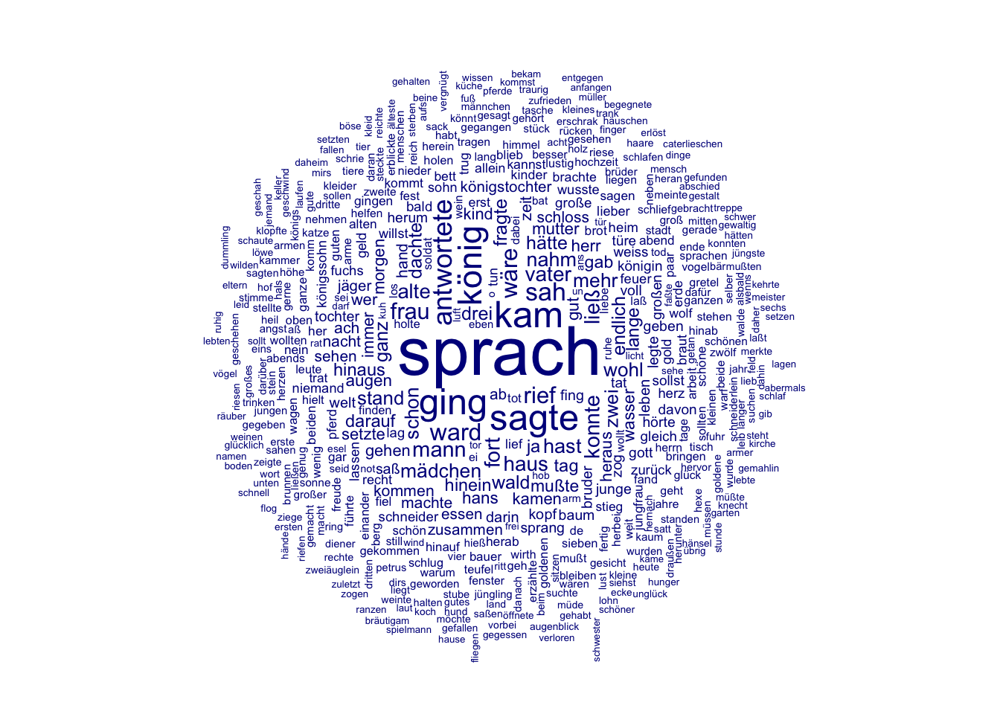
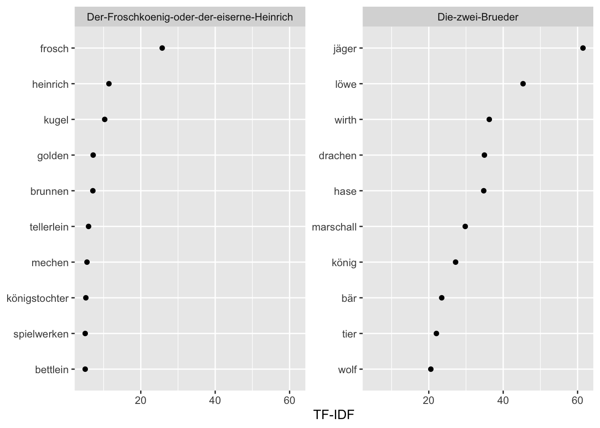
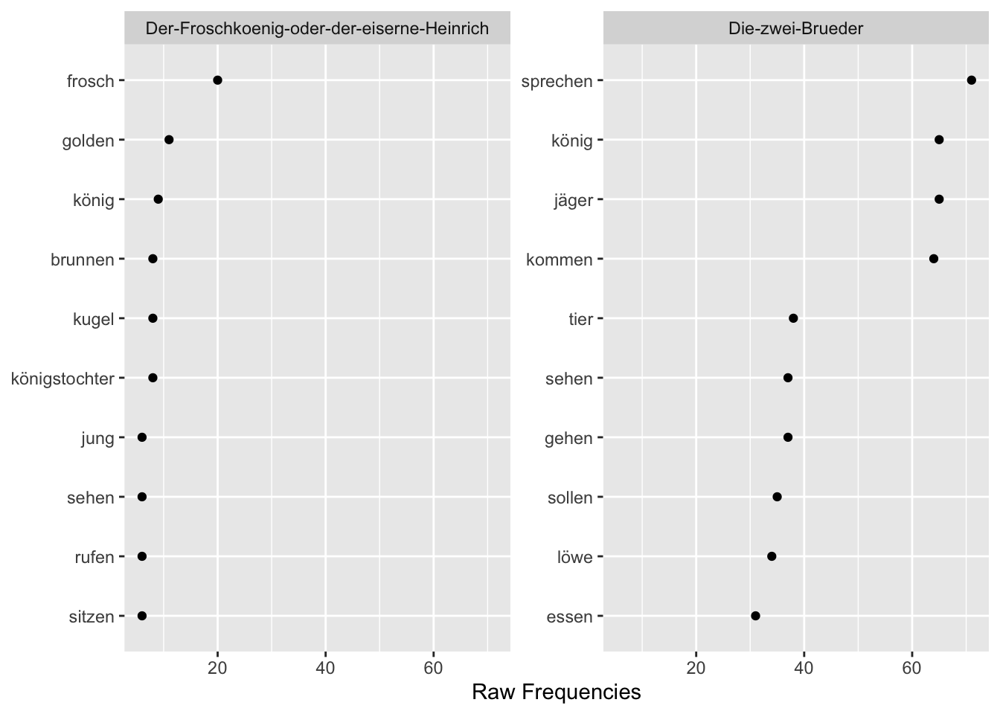
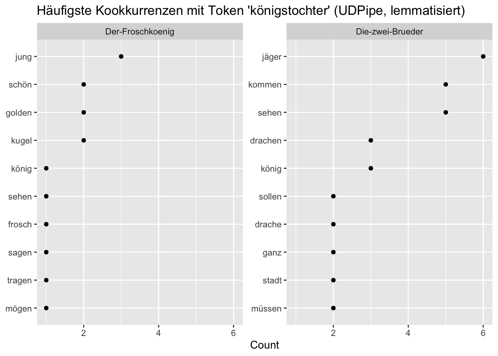
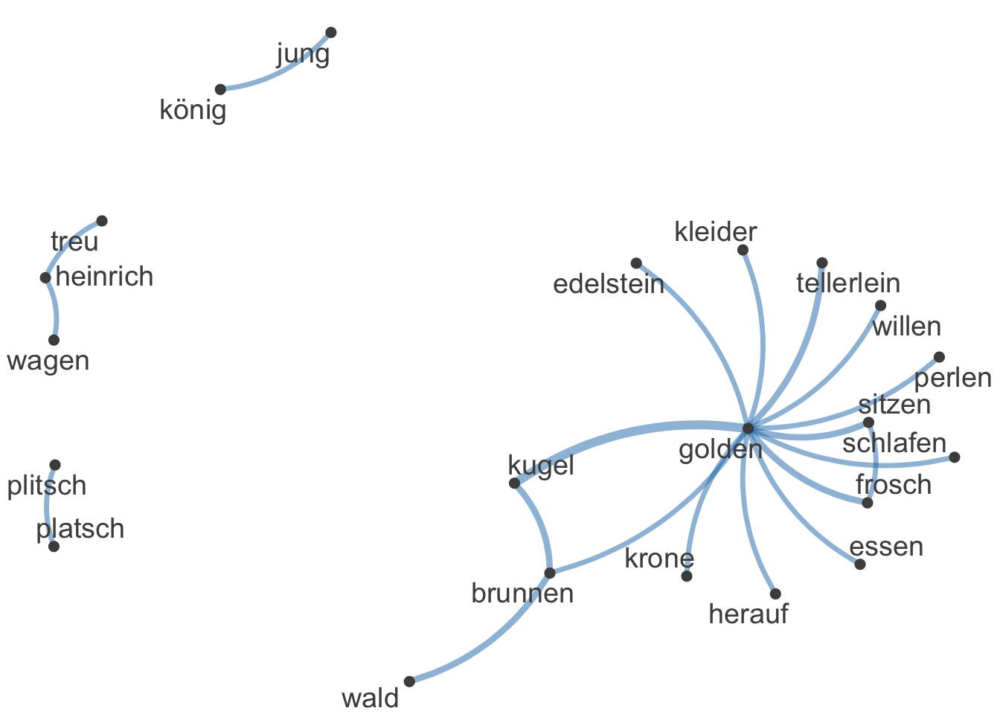
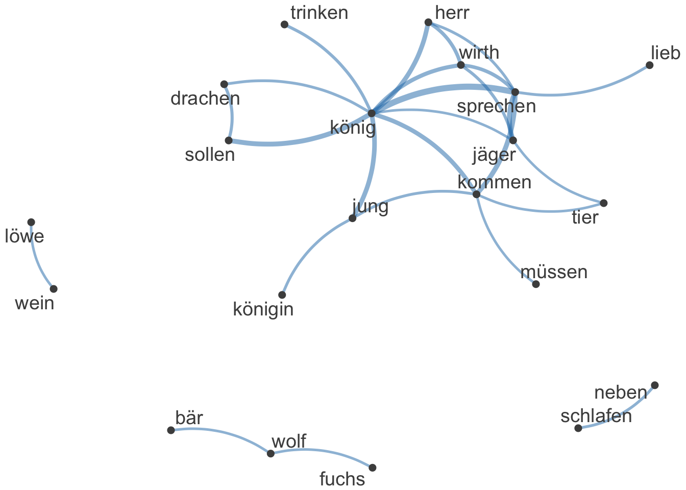

# Textanalyse III: Wortfrequenzanalysen

Die Konstruktion von Geschlecht und Geschlechterrollen in europäischen Märchen wird seit den 1970er Jahren in zahlreichen Forschungsarbeiten untersucht (zum Beispiel von [Marcia Lieberman 1972](https://www.jstor.org/stable/375142), [Alessandra Levorato 2003](https://doi.org/10.1057/9780230503878), [Simone Loleit und Liliane Schüller 2022](https://doi.org/10.1515/9783110726404-005)). In den letzten beiden Jahrzehnten sind Märchen auch zum Gegenstand von Arbeiten aus den Digital Humanities geworden (so z.B. in den Arbeiten von [Saif Mohammad 2011](https://aclanthology.org/W11-1514.pdf), [Mark Finlayson 2012](http://hdl.handle.net/1721.1/71284), [Berenike Herrmann und Jana Lüdtke 2023](https://doi.org/10.17175/2023_005)). Eine Reihe von Digital Humanities Arbeiten haben sich explizit Geschlecht und Geschlechterrollen in Märchen gewidmet, so zum Beispiel: 

* Toro Isaza, Paulina et al. (2023). [*Are Fairy Tales Fair? Analyzing Gender Bias in Temporal Narrative Event Chains of Children's Fairy Tales*](
https://doi.org/10.48550/arXiv.2305.16641), in: Proceedings of the 61st Annual Meeting of the Association for Computational Linguistics 1: Long Papers, pp. 6509-6531.
* Jorgensen, Jeana (2019). [*The Most Beautiful of All: A Quantitative Approach to Fairy-Tale Femininity*](https://works.bepress.com/jeana_jorgensen/29/), in: Journal of American Folklore 132 (523), pp. 36-60.
* Weingart, Scott and Jorgensen, Jeana (2013). [*Computational Analysis of the Body in European Fairy Tales*](http://dx.doi.org/10.1093/llc/fqs015), in: Literary and Linguistic Computing 28 (1), pp. 404-416.

In den nächsten beiden Wochen werden wir ein Korpus von Kinder- und Hausmärchen der Gebrüder Grimm aus dem Jahr 1857 im Hinblick auf die Darstellung verschiedener Märchencharaktere untersuchen. Dabei werden wir verschiedene Analysemethoden kennenlernen und kritisch beleuchten, inwieweit diese Methoden uns helfen können, bestimmte Muster in der Beschreibung von Märchencharakteren zu identifizieren. In diesem Kapitel werden wir zunächst Worthäufigkeiten und das gemeinsame Vorkommen verschiedener Wörter unabhängig von der Beziehung der Wörter zueinander betrachten. Wir werden dabei kritisch beleuchten, was die vorgestellten  Analysemethoden leisten können und was nicht. Im Kapitel 9 werden wir dann konkreten Fragen nachgehen: Welche Charaktere kommen in den Märchen vor? Mit welchen Adjektiven werden diese beschrieben? Welche Verben werden mit ihnen assoziiert? 

:::task
Verständnisfragen:

- Welche theoretischen Annahmen liegen unserer Forschungsfrage zugrunde? 
- Wie wird die Fragestellung im Folgenden operationalisiert?

:::

## Märchenkorpus einlesen und Pakete installieren

Um unser Korpus in R einzulesen, müssen wir zuerst wieder das **Arbeitsverzeichnis setzen**: 


```r
# Arbeitsverzeichnis setzen: Setzt hier euren eigenen Pfad ein
setwd("/Users/gast/R-Seminar") 
# Backslashes für Windows:
# setwd("C:\Users\gast\R-Seminar")
```

Wie bereits vergangene Woche erläutert kann das Arbeitsverzeichnis auch über den Tab "Files" im Fenster unten rechts gesetzt werden. Navigiert euch dazu erst in den gewünschten Ordner, klickt dann auf "More" und "Set As Working Directory" (siehe Kapitel "Orientierung im RStudio"). Wählt dabei den Ordner als Arbeitsverzeichnis, in dem ihr den Ordner maerchen_alle gespeichert habt. Achtung: Zip-Ordner müsst ihr vorher entpacken!

Wenn ihr das Arbeitsverzeichnis gesetzt habt, könnt ihr die **Dateien einlesen**. Wir werden ganz am Ende unserer Analyse die Grimm-Märchen in der siebten Edition von 1857 mit den Märchen aus der ersten Edition von 1812/15 vergleichen, um einen möglichen Wandel über die Zeit zu identifizieren. 


```r
library(readtext)

# Märchen von 1857 und 1812/15 einlesen und Informationen aus dem Dateinamen extrahieren
maerchen_alle <- readtext("maerchen_alle/*.txt", docvarsfrom = "filenames", dvsep = "_", docvarnames = c("Titel", "Jahr"), encoding = "UTF-8")
```


Bevor wir mit der Analyse starten können, müssen wir noch einige Pakete installieren, die wir brauchen werden: 


```r
install.packages(c("quanteda.textplots", "quanteda.textstats", "ggplot2", "plotly", "udpipe", "dplyr"))
```


Die Pakete müssen wie bisher immer nur einmal am Anfang des Skripts geladen werden. Allerdings werden wir in den folgenden Abschnitten Funktionen aus vielen verschiedenen Paketen verwenden. **Deswegen werden wir in diesem Kapitel ausnahmsweise Pakete erst dann laden, wenn sie gebraucht werden, sodass ihr in jeder Codezelle direkt erkennt, ob der Code Funktionen aus zusätzlichen Paketen enthält.** 


## Corpus-Objekt erstellen und erste Preprocessingschritte

Wir werden in der Analyse verschiedene Methoden einmal auf das Korpus mit und einmal ohne Stoppwörter anwenden, denn je nach Fragestellung und Methode sind Stoppwörter mehr oder weniger interessant. Deswegen erstellen wir in diesem Abschnitt zwei verschiedene tokens-Objekte. Wir werden aber auch sehen, dass Textanalyse und Preprocessing eigentlich iterative Prozesse sind: Es kommt oft vor, dass bei der Analyse weitere Preprocessingschritte notwendig werden.


```r
library(quanteda)

# Quanteda-corpus-Objekt erstellen
maerchen_corpus_alle <- corpus(maerchen_alle) 

# Teilkorpus extrahieren
maerchen_corpus <- corpus_subset(maerchen_corpus_alle, Jahr == 1857)

# Quanteda tokens-Objekt erstellen ohne weiteres Preprocessing
maerchen_toks_raw <- tokens(maerchen_corpus)

# Quanteda-tokens-Objekt erstellen MIT Stoppwörtern
maerchen_toks <- tokens(maerchen_corpus, remove_punct = TRUE) %>%
  tokens_tolower()

# Quanteda-tokens-Objekt erstellen OHNE Stoppwörter
maerchen_toks_rm <- tokens_remove(maerchen_toks, pattern = stopwords("de"))
```

Wir haben jetzt also ein corpus-Objekt sowie zwei verschiedene tokens-Objekte (eins mit und eins ohne Stoppwörter), die wir in unserer Analyse verwenden können. 

## Worthäufigkeiten verstehen: absolute und relative Häufigkeiten

In diesem Abschnitt betrachten wir Worthäufigkeiten über das gesamte Korpus hinweg und vergleichen Worthäufigkeiten in verschiedenen Dokumenten miteinander. Dazu lernen wir drei verschiedene Maße kennen: absolute Häufigkeiten, relative Häufigkeiten und TF-IDF, die sogenannte Term Frequency-Inverse Document Frequency. 

### Absolute Häufigkeiten und das Zipf'sche Gesetz

Zunächst ist es sinnvoll, sich einen Überblick über das Korpus zu verschaffen. Aus der letzten Woche kennt ihr bereits die `summary()`-Funktion. Wenn dieser Funktion als Argument ein Quanteda Corpus-Objekt übergeben wird, liefert sie einen Dataframe mit der Anzahl von Types und Tokens zu jedem Text. Der Text wird dabei automatisch mit den Defaultargumenten tokenisiert. 


```r
token_info <- summary(maerchen_corpus, 200)
token_info
```

```{style="max-height: 150px;"}
## Corpus consisting of 194 documents, showing 194 documents:
## 
##                                                               Text Types Tokens Sentences                                                    Titel Jahr
##                                              Allerleirauh_1857.txt   617   2361        86                                             Allerleirauh 1857
##                      Armuth-und-Demuth-fuehren-zum-Himmel_1857.txt   252    517        22                     Armuth-und-Demuth-fuehren-zum-Himmel 1857
##                                              Aschenputtel_1857.txt   703   2851       105                                             Aschenputtel 1857
##                                             Bruder-Lustig_1857.txt   950   4792       232                                            Bruder-Lustig 1857
##                             Bruederchen-und-Schwesterchen_1857.txt   691   2670       100                            Bruederchen-und-Schwesterchen 1857
##                                      Das-alte-Muetterchen_1857.txt   188    355        12                                     Das-alte-Muetterchen 1857
##                                           Das-blaue-Licht_1857.txt   605   1929        78                                          Das-blaue-Licht 1857
##                          Das-Dietmarsische-Luegenmaerchen_1857.txt   132    211         9                         Das-Dietmarsische-Luegenmaerchen 1857
##                                     Das-eigensinnige-Kind_1857.txt    83    136         4                                    Das-eigensinnige-Kind 1857
##                                               Das-Eselein_1857.txt   508   1420        58                                              Das-Eselein 1857
##                                        Das-Hirtenbueblein_1857.txt   179    367        13                                       Das-Hirtenbueblein 1857
##                               Das-junggegluehte-Maennlein_1857.txt   288    561        19                              Das-junggegluehte-Maennlein 1857
##                                         Das-kluge-Grethel_1857.txt   368   1083        43                                        Das-kluge-Grethel 1857
##                               Das-Laemmchen-und-Fischchen_1857.txt   262    637        21                              Das-Laemmchen-und-Fischchen 1857
##                                        Das-Lumpengesindel_1857.txt   369    859        28                                       Das-Lumpengesindel 1857
##                                  Das-Maedchen-ohne-Haende_1857.txt   686   2548        99                                 Das-Maedchen-ohne-Haende 1857
##                         Das-Maerchen-vom-Schlauraffenland_1857.txt   192    349        13                        Das-Maerchen-vom-Schlauraffenland 1857
##                                          Das-Meerhaeschen_1857.txt   447   1307        57                                         Das-Meerhaeschen 1857
##                                              Das-Raethsel_1857.txt   466   1236        48                                             Das-Raethsel 1857
##                   Das-singende-springende-Loeweneckerchen_1857.txt   694   2560        73                  Das-singende-springende-Loeweneckerchen 1857
##                                 Das-tapfere-Schneiderlein_1857.txt   998   3607       146                                Das-tapfere-Schneiderlein 1857
##                                        Das-Todtenhemdchen_1857.txt   145    285         7                                       Das-Todtenhemdchen 1857
##                                              Das-Waldhaus_1857.txt   606   2014        72                                             Das-Waldhaus 1857
##                                     Das-Wasser-des-Lebens_1857.txt   663   2440        84                                    Das-Wasser-des-Lebens 1857
##                                  Daumerlings-Wanderschaft_1857.txt   610   1767        74                                 Daumerlings-Wanderschaft 1857
##                                                Daumesdick_1857.txt   743   2575       107                                               Daumesdick 1857
##                         Der-alte-Grossvater-und-der-Enkel_1857.txt   152    262        11                        Der-alte-Grossvater-und-der-Enkel 1857
##                                       Der-alte-Hildebrand_1857.txt   385   1620        43                                      Der-alte-Hildebrand 1857
##                                           Der-alte-Sultan_1857.txt   400    938        34                                          Der-alte-Sultan 1857
##                                    Der-arme-Junge-im-Grab_1857.txt   500   1347        58                                   Der-arme-Junge-im-Grab 1857
##                  Der-arme-Muellerbursch-und-das-Kaetzchen_1857.txt   506   1501        52                 Der-arme-Muellerbursch-und-das-Kaetzchen 1857
##                                   Der-Arme-und-der-Reiche_1857.txt   607   1802        62                                  Der-Arme-und-der-Reiche 1857
##                                         Der-Baerenhaeuter_1857.txt   698   2179        81                                        Der-Baerenhaeuter 1857
##                                  Der-Bauer-und-der-Teufel_1857.txt   192    405        19                                 Der-Bauer-und-der-Teufel 1857
##                               Der-Dreschflegel-vom-Himmel_1857.txt   199    394        11                              Der-Dreschflegel-vom-Himmel 1857
##                                             Der-Eisenhans_1857.txt   885   3502       149                                            Der-Eisenhans 1857
##                                             Der-Eisenofen_1857.txt   595   2307        86                                            Der-Eisenofen 1857
##                                           Der-faule-Heinz_1857.txt   462   1077        39                                          Der-faule-Heinz 1857
##                        Der-Frieder-und-das-Catherlieschen_1857.txt   749   2898       130                       Der-Frieder-und-das-Catherlieschen 1857
##                Der-Froschkoenig-oder-der-eiserne-Heinrich_1857.txt   497   1560        52               Der-Froschkoenig-oder-der-eiserne-Heinrich 1857
##                                   Der-Fuchs-und-das-Pferd_1857.txt   236    537        17                                  Der-Fuchs-und-das-Pferd 1857
##                         Der-Fuchs-und-die-Frau-Gevatterin_1857.txt   207    399        13                        Der-Fuchs-und-die-Frau-Gevatterin 1857
##                                  Der-Fuchs-und-die-Gaense_1857.txt   141    258        11                                 Der-Fuchs-und-die-Gaense 1857
##                                   Der-Fuchs-und-die-Katze_1857.txt   173    331        21                                  Der-Fuchs-und-die-Katze 1857
##                                         Der-Geist-im-Glas_1857.txt   605   2054        75                                        Der-Geist-im-Glas 1857
##                                       Der-gelernte-Jaeger_1857.txt   670   2443        80                                      Der-gelernte-Jaeger 1857
##                                       Der-gescheidte-Hans_1857.txt   163   1318       166                                      Der-gescheidte-Hans 1857
##                                     Der-gestohlene-Heller_1857.txt   179    359        13                                    Der-gestohlene-Heller 1857
##                                          Der-Gevatter-Tod_1857.txt   477   1336        52                                         Der-Gevatter-Tod 1857
##                                        Der-glaeserne-Sarg_1857.txt   957   2443        89                                       Der-glaeserne-Sarg 1857
##                                    Der-goldene-Schluessel_1857.txt   120    192         9                                   Der-goldene-Schluessel 1857
##                                         Der-goldene-Vogel_1857.txt   862   3285       126                                        Der-goldene-Vogel 1857
##                                            Der-Grabhuegel_1857.txt   597   1608        71                                           Der-Grabhuegel 1857
##                                           Der-gute-Handel_1857.txt   565   1926        70                                          Der-gute-Handel 1857
##                                          Der-Hahnenbalken_1857.txt   155    288        13                                         Der-Hahnenbalken 1857
##                                     Der-Hase-und-der-Igel_1857.txt   518   1523        68                                    Der-Hase-und-der-Igel 1857
##                               Der-heilige-Joseph-im-Walde_1857.txt   408   1282        58                              Der-heilige-Joseph-im-Walde 1857
##                                         Der-Herr-Gevatter_1857.txt   250    685        34                                        Der-Herr-Gevatter 1857
##                                 Der-Hund-und-der-Sperling_1857.txt   384   1379        62                                Der-Hund-und-der-Sperling 1857
##                                          Der-Jude-im-Dorn_1857.txt   647   1995        76                                         Der-Jude-im-Dorn 1857
##                                           Der-junge-Riese_1857.txt   790   3381       123                                          Der-junge-Riese 1857
##                                          Der-kluge-Knecht_1857.txt   146    295        15                                         Der-kluge-Knecht 1857
##                              Der-Koenig-vom-goldenen-Berg_1857.txt   739   2635        94                             Der-Koenig-vom-goldenen-Berg 1857
##             Der-Koenigssohn-der-sich-vor-nichts-fuerchtet_1857.txt   685   2279        86            Der-Koenigssohn-der-sich-vor-nichts-fuerchtet 1857
##                                             Der-Krautesel_1857.txt   833   2893       104                                            Der-Krautesel 1857
##                                        Der-Liebste-Roland_1857.txt   530   1614        57                                       Der-Liebste-Roland 1857
##                                           Der-Meisterdieb_1857.txt   975   3430       129                                          Der-Meisterdieb 1857
##                                                  Der-Mond_1857.txt   364    790        35                                                 Der-Mond 1857
##                                                 Der-Nagel_1857.txt   146    291        15                                                Der-Nagel 1857
##                                     Der-Raeuberbraeutigam_1857.txt   488   1488        63                                    Der-Raeuberbraeutigam 1857
##                Der-Ranzen,-das-Huetlein-und-das-Hoernlein_1857.txt   773   2506        85               Der-Ranzen,-das-Huetlein-und-das-Hoernlein 1857
##                               Der-Riese-und-der-Schneider_1857.txt   324    838        45                              Der-Riese-und-der-Schneider 1857
##                                   Der-Schneider-im-Himmel_1857.txt   353    843        32                                  Der-Schneider-im-Himmel 1857
##                                      Der-singende-Knochen_1857.txt   355    799        28                                     Der-singende-Knochen 1857
##                        Der-Sperling-und-seine-vier-Kinder_1857.txt   440   1018        39                       Der-Sperling-und-seine-vier-Kinder 1857
##                                           Der-starke-Hans_1857.txt   803   2879        99                                          Der-starke-Hans 1857
##                              Der-Stiefel-von-Bueffelleder_1857.txt   546   1598        67                             Der-Stiefel-von-Bueffelleder 1857
##                                           Der-suesse-Brei_1857.txt   132    266         6                                          Der-suesse-Brei 1857
##                   Der-Teufel-mit-den-drei-goldenen-Haaren_1857.txt   730   2958       129                  Der-Teufel-mit-den-drei-goldenen-Haaren 1857
##                          Der-Teufel-und-seine-Grossmutter_1857.txt   477   1376        56                         Der-Teufel-und-seine-Grossmutter 1857
##                                        Der-treue-Johannes_1857.txt   861   3383       114                                       Der-treue-Johannes 1857
##                                              Der-Trommler_1857.txt  1029   4223       180                                             Der-Trommler 1857
##                                       Der-undankbare-Sohn_1857.txt   104    166         5                                      Der-undankbare-Sohn 1857
##                                    Der-Wolf-und-der-Fuchs_1857.txt   291    812        31                                   Der-Wolf-und-der-Fuchs 1857
##                                   Der-Wolf-und-der-Mensch_1857.txt   206    483        19                                  Der-Wolf-und-der-Mensch 1857
##                   Der-Wolf-und-die-sieben-jungen-Geislein_1857.txt   403   1191        50                  Der-Wolf-und-die-sieben-jungen-Geislein 1857
##                                 Der-wunderliche-Spielmann_1857.txt   374   1218        49                                Der-wunderliche-Spielmann 1857
##                                            Der-Zaunkoenig_1857.txt   478   1280        70                                           Der-Zaunkoenig 1857
##                               Der-Zaunkoenig-und-der-Baer_1857.txt   384   1026        36                              Der-Zaunkoenig-und-der-Baer 1857
##                         Des-Herrn-und-des-Teufels-Gethier_1857.txt   206    369        15                        Des-Herrn-und-des-Teufels-Gethier 1857
##                               Des-Teufels-russiger-Bruder_1857.txt   448   1392        47                              Des-Teufels-russiger-Bruder 1857
##                                       Die-alte-Bettelfrau_1857.txt   102    167         8                                      Die-alte-Bettelfrau 1857
##                                          Die-Alte-im-Wald_1857.txt   361   1001        32                                         Die-Alte-im-Wald 1857
##                                       Die-beiden-Wanderer_1857.txt  1198   4487       176                                      Die-beiden-Wanderer 1857
##                                        Die-Bienenkoenigin_1857.txt   318    845        27                                       Die-Bienenkoenigin 1857
##                                       Die-Boten-des-Todes_1857.txt   309    702        35                                      Die-Boten-des-Todes 1857
##                                            Die-Brautschau_1857.txt    98    165         5                                           Die-Brautschau 1857
##                                Die-Bremer-Stadtmusikanten_1857.txt   528   1424        50                               Die-Bremer-Stadtmusikanten 1857
##                                Die-Brosamen-auf-dem-Tisch_1857.txt   111    194         9                               Die-Brosamen-auf-dem-Tisch 1857
##                                          Die-drei-Brueder_1857.txt   309    728        21                                         Die-drei-Brueder 1857
##                                           Die-drei-Faulen_1857.txt   124    254         6                                          Die-drei-Faulen 1857
##                                           Die-drei-Federn_1857.txt   396   1104        44                                          Die-drei-Federn 1857
##                                      Die-drei-Feldscherer_1857.txt   394   1114        47                                     Die-drei-Feldscherer 1857
##                                    Die-drei-Glueckskinder_1857.txt   449   1064        36                                   Die-drei-Glueckskinder 1857
##                                   Die-drei-gruenen-Zweige_1857.txt   409   1018        37                                  Die-drei-gruenen-Zweige 1857
##                                Die-drei-Handwerksburschen_1857.txt   438   1311        58                               Die-drei-Handwerksburschen 1857
##                               Die-drei-Maennlein-im-Walde_1857.txt   642   2200        85                              Die-drei-Maennlein-im-Walde 1857
##                                Die-drei-Schlangenblaetter_1857.txt   561   1560        53                               Die-drei-Schlangenblaetter 1857
##                                     Die-drei-Spinnerinnen_1857.txt   379    977        35                                    Die-drei-Spinnerinnen 1857
##                                         Die-drei-Sprachen_1857.txt   405   1014        39                                        Die-drei-Sprachen 1857
##                                                  Die-Eule_1857.txt   438    895        30                                                 Die-Eule 1857
##                                       Die-faule-Spinnerin_1857.txt   305    827        29                                      Die-faule-Spinnerin 1857
##                               Die-Gaensehirtin-am-Brunnen_1857.txt  1142   4376       194                              Die-Gaensehirtin-am-Brunnen 1857
##                                            Die-Gaensemagd_1857.txt   678   2295        72                                           Die-Gaensemagd 1857
##                          Die-Geschenke-des-kleinen-Volkes_1857.txt   428    975        30                         Die-Geschenke-des-kleinen-Volkes 1857
##                                          Die-goldene-Gans_1857.txt   543   1706        54                                         Die-goldene-Gans 1857
##                                            Die-Goldkinder_1857.txt   611   2183        81                                           Die-Goldkinder 1857
##                                          Die-hagere-Liese_1857.txt   237    515        17                                         Die-hagere-Liese 1857
##                                            Die-Haselruthe_1857.txt   135    217         7                                           Die-Haselruthe 1857
##                                   Die-himmlische-Hochzeit_1857.txt   235    566        20                                  Die-himmlische-Hochzeit 1857
##                            Die-Hochzeit-der-Frau-Fuechsin_1857.txt   303    910        47                           Die-Hochzeit-der-Frau-Fuechsin 1857
##                        Die-klare-Sonne-bringts-an-den-Tag_1857.txt   265    585        21                       Die-klare-Sonne-bringts-an-den-Tag 1857
##                                   Die-kluge-Bauerntochter_1857.txt   457   1519        50                                  Die-kluge-Bauerntochter 1857
##                                            Die-kluge-Else_1857.txt   408   1564        62                                           Die-kluge-Else 1857
##                                          Die-klugen-Leute_1857.txt   545   1752        75                                         Die-klugen-Leute 1857
##                                             Die-Kornaehre_1857.txt   146    246         9                                            Die-Kornaehre 1857
##                                         Die-Krystallkugel_1857.txt   458   1144        40                                        Die-Krystallkugel 1857
##                                            Die-Lebenszeit_1857.txt   272    674        38                                           Die-Lebenszeit 1857
##                                                 Die-Nelke_1857.txt   558   1963        64                                                Die-Nelke 1857
##                                         Die-Nixe-im-Teich_1857.txt   744   2335        99                                        Die-Nixe-im-Teich 1857
##                                                  Die-Rabe_1857.txt   603   2427        91                                                 Die-Rabe 1857
##                                                  Die-Rose_1857.txt   104    183         7                                                 Die-Rose 1857
##                                                 Die-Ruebe_1857.txt   471   1181        39                                                Die-Ruebe 1857
##                                        Die-Schlickerlinge_1857.txt   121    191         8                                       Die-Schlickerlinge 1857
##                Die-schoene-Katrinelje-und-Pif-Paf-Poltrie_1857.txt   116    500        45               Die-schoene-Katrinelje-und-Pif-Paf-Poltrie 1857
##                                               Die-Scholle_1857.txt   145    265        14                                              Die-Scholle 1857
##                                          Die-sechs-Diener_1857.txt   821   2911       103                                         Die-sechs-Diener 1857
##                                        Die-sechs-Schwaene_1857.txt   652   2143        82                                       Die-sechs-Schwaene 1857
##                                          Die-sieben-Raben_1857.txt   388    961        37                                         Die-sieben-Raben 1857
##                                       Die-sieben-Schwaben_1857.txt   475   1126        41                                      Die-sieben-Schwaben 1857
##                                           Die-Sternthaler_1857.txt   166    341        11                                          Die-Sternthaler 1857
##                                Die-ungleichen-Kinder-Evas_1857.txt   322    786        29                               Die-ungleichen-Kinder-Evas 1857
##                             Die-vier-kunstreichen-Brueder_1857.txt   581   1739        63                            Die-vier-kunstreichen-Brueder 1857
##                                           Die-wahre-Braut_1857.txt   853   2838       116                                          Die-wahre-Braut 1857
##                                            Die-Wassernixe_1857.txt   151    305        10                                           Die-Wassernixe 1857
##                                       Die-weisse-Schlange_1857.txt   638   1705        60                                      Die-weisse-Schlange 1857
##                         Die-weisse-und-die-schwarze-Braut_1857.txt   518   1609        61                        Die-weisse-und-die-schwarze-Braut 1857
##                                        Die-Wichtelmaenner_1857.txt   459   1201        42                                       Die-Wichtelmaenner 1857
##                                     Die-zertanzten-Schuhe_1857.txt   551   1549        57                                    Die-zertanzten-Schuhe 1857
##                                          Die-zwei-Brueder_1857.txt  1533   9166       318                                         Die-zwei-Brueder 1857
##                                        Die-zwoelf-Apostel_1857.txt   219    423        18                                       Die-zwoelf-Apostel 1857
##                                        Die-zwoelf-Brueder_1857.txt   660   2178        77                                       Die-zwoelf-Brueder 1857
##                                 Die-zwoelf-faulen-Knechte_1857.txt   466   1144        54                                Die-zwoelf-faulen-Knechte 1857
##                                         Die-zwoelf-Jaeger_1857.txt   394   1197        46                                        Die-zwoelf-Jaeger 1857
##                                         Doctor-Allwissend_1857.txt   307    836        35                                        Doctor-Allwissend 1857
##                                              Dornroeschen_1857.txt   511   1423        44                                             Dornroeschen 1857
##                Einaeuglein,-Zweiaeuglein-und-Dreiaeuglein_1857.txt   694   2724        96               Einaeuglein,-Zweiaeuglein-und-Dreiaeuglein 1857
##                                            Fitchers-Vogel_1857.txt   503   1434        57                                           Fitchers-Vogel 1857
##                                                Frau-Holle_1857.txt   412   1269        42                                               Frau-Holle 1857
##                                                Frau-Trude_1857.txt   166    349        17                                               Frau-Trude 1857
##                                                Fundevogel_1857.txt   306   1059        42                                               Fundevogel 1857
##                                             Gottes-Speise_1857.txt   148    256         8                                            Gottes-Speise 1857
##                                       Haensel-und-Grethel_1857.txt   835   3231       127                                      Haensel-und-Grethel 1857
##                                            Haesichenbraut_1857.txt   160    488        32                                           Haesichenbraut 1857
##                                            Hans-heirathet_1857.txt   241    502        18                                           Hans-heirathet 1857
##                                            Hans-im-Glueck_1857.txt   715   2309        93                                           Hans-im-Glueck 1857
##                                            Hans-mein-Igel_1857.txt   552   2218        67                                           Hans-mein-Igel 1857
##                                               Herr-Korbes_1857.txt   175    412        19                                              Herr-Korbes 1857
##                                      Jorinde-und-Joringel_1857.txt   391   1017        44                                     Jorinde-und-Joringel 1857
##                                           Jungfrau-Maleen_1857.txt   637   2204       100                                          Jungfrau-Maleen 1857
##                            Katze-und-Maus-in-Gesellschaft_1857.txt   414   1112        49                           Katze-und-Maus-in-Gesellschaft 1857
##                                        Koenig-Drosselbart_1857.txt   625   1883        81                                       Koenig-Drosselbart 1857
##                                   Laeuschen-und-Floehchen_1857.txt   113    465        31                                  Laeuschen-und-Floehchen 1857
##                                     Lieb-und-Leid-theilen_1857.txt   202    427        16                                    Lieb-und-Leid-theilen 1857
##   Maehrchen-von-einem,-der-auszog-das-Fuerchten-zu-lernen_1857.txt   966   4284       189  Maehrchen-von-einem,-der-auszog-das-Fuerchten-zu-lernen 1857
##                                     Maerchen-von-der-Unke_1857.txt   236    528        21                                    Maerchen-von-der-Unke 1857
##                                                Marienkind_1857.txt   616   2049        67                                               Marienkind 1857
##                                            Meister-Pfriem_1857.txt   592   1562        77                                           Meister-Pfriem 1857
##                                     Muttergottesglaeschen_1857.txt   100    164         6                                    Muttergottesglaeschen 1857
##                                          Raethselmaerchen_1857.txt    87    139         4                                         Raethselmaerchen 1857
##                                                  Rapunzel_1857.txt   518   1577        52                                                 Rapunzel 1857
##                                  Rohrdommel-und-Wiedehopf_1857.txt   139    273        17                                 Rohrdommel-und-Wiedehopf 1857
##                                             Rothkaeppchen_1857.txt   499   1537        61                                            Rothkaeppchen 1857
##                                           Rumpelstilzchen_1857.txt   404   1211        39                                          Rumpelstilzchen 1857
##                             Schneeweisschen-und-Rosenroth_1857.txt   877   2683        95                            Schneeweisschen-und-Rosenroth 1857
##                        Sechse-kommen-durch-die-ganze-Welt_1857.txt   671   2274        78                       Sechse-kommen-durch-die-ganze-Welt 1857
##                                                Simeliberg_1857.txt   338    889        31                                               Simeliberg 1857
##                                              Sneewittchen_1857.txt   814   3436       142                                             Sneewittchen 1857
##                        Spindel,-Weberschiffchen-und-Nadel_1857.txt   430   1149        43                       Spindel,-Weberschiffchen-und-Nadel 1857
##                                Strohhalm,-Kohle-und-Bohne_1857.txt   269    566        22                               Strohhalm,-Kohle-und-Bohne 1857
##  Tischchen-deck-dich,-Goldesel,-und-Knueppel-aus-dem-Sack_1857.txt   945   4290       183 Tischchen-deck-dich,-Goldesel,-und-Knueppel-aus-dem-Sack 1857
##                                  Vom-klugen-Schneiderlein_1857.txt   470   1301        50                                 Vom-klugen-Schneiderlein 1857
##           Von-dem-Maeuschen,-Voegelchen-und-der-Bratwurst_1857.txt   297    648        22          Von-dem-Maeuschen,-Voegelchen-und-der-Bratwurst 1857
##                               Von-dem-Tode-des-Huehnchens_1857.txt   243    713        26                              Von-dem-Tode-des-Huehnchens 1857
```

Um schnell den längsten und kürzesten Text zu finden, können wir einfach wieder die Funktionen `max()` und `min()` anwenden (s. [Kapitel 5.5](https://lipogg.github.io/textanalyse-mit-r/textanalyse-i-korpus-tokens-daten-und-dateien.html#quanteda-corpus-objekte)), oder den Dataframe absteigend nach der Spalte Types bzw. Tokens sortieren: 


```r
token_info[order(token_info$Tokens, decreasing = TRUE),]
```

```{style="max-height: 150px;"}
##                                                                  Text Types Tokens Sentences                                                    Titel Jahr
## 150                                         Die-zwei-Brueder_1857.txt  1533   9166       318                                         Die-zwei-Brueder 1857
## 4                                              Bruder-Lustig_1857.txt   950   4792       232                                            Bruder-Lustig 1857
## 94                                       Die-beiden-Wanderer_1857.txt  1198   4487       176                                      Die-beiden-Wanderer 1857
## 113                              Die-Gaensehirtin-am-Brunnen_1857.txt  1142   4376       194                              Die-Gaensehirtin-am-Brunnen 1857
## 191 Tischchen-deck-dich,-Goldesel,-und-Knueppel-aus-dem-Sack_1857.txt   945   4290       183 Tischchen-deck-dich,-Goldesel,-und-Knueppel-aus-dem-Sack 1857
## 175  Maehrchen-von-einem,-der-auszog-das-Fuerchten-zu-lernen_1857.txt   966   4284       189  Maehrchen-von-einem,-der-auszog-das-Fuerchten-zu-lernen 1857
## 82                                              Der-Trommler_1857.txt  1029   4223       180                                             Der-Trommler 1857
## 21                                 Das-tapfere-Schneiderlein_1857.txt   998   3607       146                                Das-tapfere-Schneiderlein 1857
## 36                                             Der-Eisenhans_1857.txt   885   3502       149                                            Der-Eisenhans 1857
## 188                                             Sneewittchen_1857.txt   814   3436       142                                             Sneewittchen 1857
## 67                                           Der-Meisterdieb_1857.txt   975   3430       129                                          Der-Meisterdieb 1857
## 81                                        Der-treue-Johannes_1857.txt   861   3383       114                                       Der-treue-Johannes 1857
## 61                                           Der-junge-Riese_1857.txt   790   3381       123                                          Der-junge-Riese 1857
## 52                                         Der-goldene-Vogel_1857.txt   862   3285       126                                        Der-goldene-Vogel 1857
## 163                                      Haensel-und-Grethel_1857.txt   835   3231       127                                      Haensel-und-Grethel 1857
## 79                   Der-Teufel-mit-den-drei-goldenen-Haaren_1857.txt   730   2958       129                  Der-Teufel-mit-den-drei-goldenen-Haaren 1857
## 137                                         Die-sechs-Diener_1857.txt   821   2911       103                                         Die-sechs-Diener 1857
## 39                        Der-Frieder-und-das-Catherlieschen_1857.txt   749   2898       130                       Der-Frieder-und-das-Catherlieschen 1857
## 65                                             Der-Krautesel_1857.txt   833   2893       104                                            Der-Krautesel 1857
## 76                                           Der-starke-Hans_1857.txt   803   2879        99                                          Der-starke-Hans 1857
## 3                                               Aschenputtel_1857.txt   703   2851       105                                             Aschenputtel 1857
## 144                                          Die-wahre-Braut_1857.txt   853   2838       116                                          Die-wahre-Braut 1857
## 157               Einaeuglein,-Zweiaeuglein-und-Dreiaeuglein_1857.txt   694   2724        96               Einaeuglein,-Zweiaeuglein-und-Dreiaeuglein 1857
## 185                            Schneeweisschen-und-Rosenroth_1857.txt   877   2683        95                            Schneeweisschen-und-Rosenroth 1857
## 5                              Bruederchen-und-Schwesterchen_1857.txt   691   2670       100                            Bruederchen-und-Schwesterchen 1857
## 63                              Der-Koenig-vom-goldenen-Berg_1857.txt   739   2635        94                             Der-Koenig-vom-goldenen-Berg 1857
## 26                                                Daumesdick_1857.txt   743   2575       107                                               Daumesdick 1857
## 20                   Das-singende-springende-Loeweneckerchen_1857.txt   694   2560        73                  Das-singende-springende-Loeweneckerchen 1857
## 16                                  Das-Maedchen-ohne-Haende_1857.txt   686   2548        99                                 Das-Maedchen-ohne-Haende 1857
## 71                Der-Ranzen,-das-Huetlein-und-das-Hoernlein_1857.txt   773   2506        85               Der-Ranzen,-das-Huetlein-und-das-Hoernlein 1857
## 46                                       Der-gelernte-Jaeger_1857.txt   670   2443        80                                      Der-gelernte-Jaeger 1857
## 50                                        Der-glaeserne-Sarg_1857.txt   957   2443        89                                       Der-glaeserne-Sarg 1857
## 24                                     Das-Wasser-des-Lebens_1857.txt   663   2440        84                                    Das-Wasser-des-Lebens 1857
## 131                                                 Die-Rabe_1857.txt   603   2427        91                                                 Die-Rabe 1857
## 1                                               Allerleirauh_1857.txt   617   2361        86                                             Allerleirauh 1857
## 130                                        Die-Nixe-im-Teich_1857.txt   744   2335        99                                        Die-Nixe-im-Teich 1857
## 166                                           Hans-im-Glueck_1857.txt   715   2309        93                                           Hans-im-Glueck 1857
## 37                                             Der-Eisenofen_1857.txt   595   2307        86                                            Der-Eisenofen 1857
## 114                                           Die-Gaensemagd_1857.txt   678   2295        72                                           Die-Gaensemagd 1857
## 64             Der-Koenigssohn-der-sich-vor-nichts-fuerchtet_1857.txt   685   2279        86            Der-Koenigssohn-der-sich-vor-nichts-fuerchtet 1857
## 186                       Sechse-kommen-durch-die-ganze-Welt_1857.txt   671   2274        78                       Sechse-kommen-durch-die-ganze-Welt 1857
## 167                                           Hans-mein-Igel_1857.txt   552   2218        67                                           Hans-mein-Igel 1857
## 170                                          Jungfrau-Maleen_1857.txt   637   2204       100                                          Jungfrau-Maleen 1857
## 107                              Die-drei-Maennlein-im-Walde_1857.txt   642   2200        85                              Die-drei-Maennlein-im-Walde 1857
## 117                                           Die-Goldkinder_1857.txt   611   2183        81                                           Die-Goldkinder 1857
## 33                                         Der-Baerenhaeuter_1857.txt   698   2179        81                                        Der-Baerenhaeuter 1857
## 152                                       Die-zwoelf-Brueder_1857.txt   660   2178        77                                       Die-zwoelf-Brueder 1857
## 138                                       Die-sechs-Schwaene_1857.txt   652   2143        82                                       Die-sechs-Schwaene 1857
## 45                                         Der-Geist-im-Glas_1857.txt   605   2054        75                                        Der-Geist-im-Glas 1857
## 177                                               Marienkind_1857.txt   616   2049        67                                               Marienkind 1857
## 23                                              Das-Waldhaus_1857.txt   606   2014        72                                             Das-Waldhaus 1857
## 60                                          Der-Jude-im-Dorn_1857.txt   647   1995        76                                         Der-Jude-im-Dorn 1857
## 129                                                Die-Nelke_1857.txt   558   1963        64                                                Die-Nelke 1857
## 7                                            Das-blaue-Licht_1857.txt   605   1929        78                                          Das-blaue-Licht 1857
## 54                                           Der-gute-Handel_1857.txt   565   1926        70                                          Der-gute-Handel 1857
## 172                                       Koenig-Drosselbart_1857.txt   625   1883        81                                       Koenig-Drosselbart 1857
## 32                                   Der-Arme-und-der-Reiche_1857.txt   607   1802        62                                  Der-Arme-und-der-Reiche 1857
## 25                                  Daumerlings-Wanderschaft_1857.txt   610   1767        74                                 Daumerlings-Wanderschaft 1857
## 125                                         Die-klugen-Leute_1857.txt   545   1752        75                                         Die-klugen-Leute 1857
## 143                            Die-vier-kunstreichen-Brueder_1857.txt   581   1739        63                            Die-vier-kunstreichen-Brueder 1857
## 116                                         Die-goldene-Gans_1857.txt   543   1706        54                                         Die-goldene-Gans 1857
## 146                                      Die-weisse-Schlange_1857.txt   638   1705        60                                      Die-weisse-Schlange 1857
## 28                                       Der-alte-Hildebrand_1857.txt   385   1620        43                                      Der-alte-Hildebrand 1857
## 66                                        Der-Liebste-Roland_1857.txt   530   1614        57                                       Der-Liebste-Roland 1857
## 147                        Die-weisse-und-die-schwarze-Braut_1857.txt   518   1609        61                        Die-weisse-und-die-schwarze-Braut 1857
## 53                                            Der-Grabhuegel_1857.txt   597   1608        71                                           Der-Grabhuegel 1857
## 77                              Der-Stiefel-von-Bueffelleder_1857.txt   546   1598        67                             Der-Stiefel-von-Bueffelleder 1857
## 181                                                 Rapunzel_1857.txt   518   1577        52                                                 Rapunzel 1857
## 124                                           Die-kluge-Else_1857.txt   408   1564        62                                           Die-kluge-Else 1857
## 178                                           Meister-Pfriem_1857.txt   592   1562        77                                           Meister-Pfriem 1857
## 40                Der-Froschkoenig-oder-der-eiserne-Heinrich_1857.txt   497   1560        52               Der-Froschkoenig-oder-der-eiserne-Heinrich 1857
## 108                               Die-drei-Schlangenblaetter_1857.txt   561   1560        53                               Die-drei-Schlangenblaetter 1857
## 149                                    Die-zertanzten-Schuhe_1857.txt   551   1549        57                                    Die-zertanzten-Schuhe 1857
## 183                                            Rothkaeppchen_1857.txt   499   1537        61                                            Rothkaeppchen 1857
## 56                                     Der-Hase-und-der-Igel_1857.txt   518   1523        68                                    Der-Hase-und-der-Igel 1857
## 123                                  Die-kluge-Bauerntochter_1857.txt   457   1519        50                                  Die-kluge-Bauerntochter 1857
## 31                  Der-arme-Muellerbursch-und-das-Kaetzchen_1857.txt   506   1501        52                 Der-arme-Muellerbursch-und-das-Kaetzchen 1857
## 70                                     Der-Raeuberbraeutigam_1857.txt   488   1488        63                                    Der-Raeuberbraeutigam 1857
## 158                                           Fitchers-Vogel_1857.txt   503   1434        57                                           Fitchers-Vogel 1857
## 98                                Die-Bremer-Stadtmusikanten_1857.txt   528   1424        50                               Die-Bremer-Stadtmusikanten 1857
## 156                                             Dornroeschen_1857.txt   511   1423        44                                             Dornroeschen 1857
## 10                                               Das-Eselein_1857.txt   508   1420        58                                              Das-Eselein 1857
## 91                               Des-Teufels-russiger-Bruder_1857.txt   448   1392        47                              Des-Teufels-russiger-Bruder 1857
## 59                                 Der-Hund-und-der-Sperling_1857.txt   384   1379        62                                Der-Hund-und-der-Sperling 1857
## 80                          Der-Teufel-und-seine-Grossmutter_1857.txt   477   1376        56                         Der-Teufel-und-seine-Grossmutter 1857
## 30                                    Der-arme-Junge-im-Grab_1857.txt   500   1347        58                                   Der-arme-Junge-im-Grab 1857
## 49                                          Der-Gevatter-Tod_1857.txt   477   1336        52                                         Der-Gevatter-Tod 1857
## 47                                       Der-gescheidte-Hans_1857.txt   163   1318       166                                      Der-gescheidte-Hans 1857
## 106                               Die-drei-Handwerksburschen_1857.txt   438   1311        58                               Die-drei-Handwerksburschen 1857
## 18                                          Das-Meerhaeschen_1857.txt   447   1307        57                                         Das-Meerhaeschen 1857
## 192                                 Vom-klugen-Schneiderlein_1857.txt   470   1301        50                                 Vom-klugen-Schneiderlein 1857
## 57                               Der-heilige-Joseph-im-Walde_1857.txt   408   1282        58                              Der-heilige-Joseph-im-Walde 1857
## 88                                            Der-Zaunkoenig_1857.txt   478   1280        70                                           Der-Zaunkoenig 1857
## 159                                               Frau-Holle_1857.txt   412   1269        42                                               Frau-Holle 1857
## 19                                              Das-Raethsel_1857.txt   466   1236        48                                             Das-Raethsel 1857
## 87                                 Der-wunderliche-Spielmann_1857.txt   374   1218        49                                Der-wunderliche-Spielmann 1857
## 184                                          Rumpelstilzchen_1857.txt   404   1211        39                                          Rumpelstilzchen 1857
## 148                                       Die-Wichtelmaenner_1857.txt   459   1201        42                                       Die-Wichtelmaenner 1857
## 154                                        Die-zwoelf-Jaeger_1857.txt   394   1197        46                                        Die-zwoelf-Jaeger 1857
## 86                   Der-Wolf-und-die-sieben-jungen-Geislein_1857.txt   403   1191        50                  Der-Wolf-und-die-sieben-jungen-Geislein 1857
## 133                                                Die-Ruebe_1857.txt   471   1181        39                                                Die-Ruebe 1857
## 189                       Spindel,-Weberschiffchen-und-Nadel_1857.txt   430   1149        43                       Spindel,-Weberschiffchen-und-Nadel 1857
## 127                                        Die-Krystallkugel_1857.txt   458   1144        40                                        Die-Krystallkugel 1857
## 153                                Die-zwoelf-faulen-Knechte_1857.txt   466   1144        54                                Die-zwoelf-faulen-Knechte 1857
## 140                                      Die-sieben-Schwaben_1857.txt   475   1126        41                                      Die-sieben-Schwaben 1857
## 103                                     Die-drei-Feldscherer_1857.txt   394   1114        47                                     Die-drei-Feldscherer 1857
## 171                           Katze-und-Maus-in-Gesellschaft_1857.txt   414   1112        49                           Katze-und-Maus-in-Gesellschaft 1857
## 102                                          Die-drei-Federn_1857.txt   396   1104        44                                          Die-drei-Federn 1857
## 13                                         Das-kluge-Grethel_1857.txt   368   1083        43                                        Das-kluge-Grethel 1857
## 38                                           Der-faule-Heinz_1857.txt   462   1077        39                                          Der-faule-Heinz 1857
## 104                                   Die-drei-Glueckskinder_1857.txt   449   1064        36                                   Die-drei-Glueckskinder 1857
## 161                                               Fundevogel_1857.txt   306   1059        42                                               Fundevogel 1857
## 89                               Der-Zaunkoenig-und-der-Baer_1857.txt   384   1026        36                              Der-Zaunkoenig-und-der-Baer 1857
## 75                        Der-Sperling-und-seine-vier-Kinder_1857.txt   440   1018        39                       Der-Sperling-und-seine-vier-Kinder 1857
## 105                                  Die-drei-gruenen-Zweige_1857.txt   409   1018        37                                  Die-drei-gruenen-Zweige 1857
## 169                                     Jorinde-und-Joringel_1857.txt   391   1017        44                                     Jorinde-und-Joringel 1857
## 110                                        Die-drei-Sprachen_1857.txt   405   1014        39                                        Die-drei-Sprachen 1857
## 93                                          Die-Alte-im-Wald_1857.txt   361   1001        32                                         Die-Alte-im-Wald 1857
## 109                                    Die-drei-Spinnerinnen_1857.txt   379    977        35                                    Die-drei-Spinnerinnen 1857
## 115                         Die-Geschenke-des-kleinen-Volkes_1857.txt   428    975        30                         Die-Geschenke-des-kleinen-Volkes 1857
## 139                                         Die-sieben-Raben_1857.txt   388    961        37                                         Die-sieben-Raben 1857
## 29                                           Der-alte-Sultan_1857.txt   400    938        34                                          Der-alte-Sultan 1857
## 121                           Die-Hochzeit-der-Frau-Fuechsin_1857.txt   303    910        47                           Die-Hochzeit-der-Frau-Fuechsin 1857
## 111                                                 Die-Eule_1857.txt   438    895        30                                                 Die-Eule 1857
## 187                                               Simeliberg_1857.txt   338    889        31                                               Simeliberg 1857
## 15                                        Das-Lumpengesindel_1857.txt   369    859        28                                       Das-Lumpengesindel 1857
## 95                                        Die-Bienenkoenigin_1857.txt   318    845        27                                       Die-Bienenkoenigin 1857
## 73                                   Der-Schneider-im-Himmel_1857.txt   353    843        32                                  Der-Schneider-im-Himmel 1857
## 72                               Der-Riese-und-der-Schneider_1857.txt   324    838        45                              Der-Riese-und-der-Schneider 1857
## 155                                        Doctor-Allwissend_1857.txt   307    836        35                                        Doctor-Allwissend 1857
## 112                                      Die-faule-Spinnerin_1857.txt   305    827        29                                      Die-faule-Spinnerin 1857
## 84                                    Der-Wolf-und-der-Fuchs_1857.txt   291    812        31                                   Der-Wolf-und-der-Fuchs 1857
## 74                                      Der-singende-Knochen_1857.txt   355    799        28                                     Der-singende-Knochen 1857
## 68                                                  Der-Mond_1857.txt   364    790        35                                                 Der-Mond 1857
## 142                               Die-ungleichen-Kinder-Evas_1857.txt   322    786        29                               Die-ungleichen-Kinder-Evas 1857
## 100                                         Die-drei-Brueder_1857.txt   309    728        21                                         Die-drei-Brueder 1857
## 194                              Von-dem-Tode-des-Huehnchens_1857.txt   243    713        26                              Von-dem-Tode-des-Huehnchens 1857
## 96                                       Die-Boten-des-Todes_1857.txt   309    702        35                                      Die-Boten-des-Todes 1857
## 58                                         Der-Herr-Gevatter_1857.txt   250    685        34                                        Der-Herr-Gevatter 1857
## 128                                           Die-Lebenszeit_1857.txt   272    674        38                                           Die-Lebenszeit 1857
## 193          Von-dem-Maeuschen,-Voegelchen-und-der-Bratwurst_1857.txt   297    648        22          Von-dem-Maeuschen,-Voegelchen-und-der-Bratwurst 1857
## 14                               Das-Laemmchen-und-Fischchen_1857.txt   262    637        21                              Das-Laemmchen-und-Fischchen 1857
## 122                       Die-klare-Sonne-bringts-an-den-Tag_1857.txt   265    585        21                       Die-klare-Sonne-bringts-an-den-Tag 1857
## 120                                  Die-himmlische-Hochzeit_1857.txt   235    566        20                                  Die-himmlische-Hochzeit 1857
## 190                               Strohhalm,-Kohle-und-Bohne_1857.txt   269    566        22                               Strohhalm,-Kohle-und-Bohne 1857
## 12                               Das-junggegluehte-Maennlein_1857.txt   288    561        19                              Das-junggegluehte-Maennlein 1857
## 41                                   Der-Fuchs-und-das-Pferd_1857.txt   236    537        17                                  Der-Fuchs-und-das-Pferd 1857
## 176                                    Maerchen-von-der-Unke_1857.txt   236    528        21                                    Maerchen-von-der-Unke 1857
## 2                       Armuth-und-Demuth-fuehren-zum-Himmel_1857.txt   252    517        22                     Armuth-und-Demuth-fuehren-zum-Himmel 1857
## 118                                         Die-hagere-Liese_1857.txt   237    515        17                                         Die-hagere-Liese 1857
## 165                                           Hans-heirathet_1857.txt   241    502        18                                           Hans-heirathet 1857
## 135               Die-schoene-Katrinelje-und-Pif-Paf-Poltrie_1857.txt   116    500        45               Die-schoene-Katrinelje-und-Pif-Paf-Poltrie 1857
## 164                                           Haesichenbraut_1857.txt   160    488        32                                           Haesichenbraut 1857
## 85                                   Der-Wolf-und-der-Mensch_1857.txt   206    483        19                                  Der-Wolf-und-der-Mensch 1857
## 173                                  Laeuschen-und-Floehchen_1857.txt   113    465        31                                  Laeuschen-und-Floehchen 1857
## 174                                    Lieb-und-Leid-theilen_1857.txt   202    427        16                                    Lieb-und-Leid-theilen 1857
## 151                                       Die-zwoelf-Apostel_1857.txt   219    423        18                                       Die-zwoelf-Apostel 1857
## 168                                              Herr-Korbes_1857.txt   175    412        19                                              Herr-Korbes 1857
## 34                                  Der-Bauer-und-der-Teufel_1857.txt   192    405        19                                 Der-Bauer-und-der-Teufel 1857
## 42                         Der-Fuchs-und-die-Frau-Gevatterin_1857.txt   207    399        13                        Der-Fuchs-und-die-Frau-Gevatterin 1857
## 35                               Der-Dreschflegel-vom-Himmel_1857.txt   199    394        11                              Der-Dreschflegel-vom-Himmel 1857
## 90                         Des-Herrn-und-des-Teufels-Gethier_1857.txt   206    369        15                        Des-Herrn-und-des-Teufels-Gethier 1857
## 11                                        Das-Hirtenbueblein_1857.txt   179    367        13                                       Das-Hirtenbueblein 1857
## 48                                     Der-gestohlene-Heller_1857.txt   179    359        13                                    Der-gestohlene-Heller 1857
## 6                                       Das-alte-Muetterchen_1857.txt   188    355        12                                     Das-alte-Muetterchen 1857
## 17                         Das-Maerchen-vom-Schlauraffenland_1857.txt   192    349        13                        Das-Maerchen-vom-Schlauraffenland 1857
## 160                                               Frau-Trude_1857.txt   166    349        17                                               Frau-Trude 1857
## 141                                          Die-Sternthaler_1857.txt   166    341        11                                          Die-Sternthaler 1857
## 44                                   Der-Fuchs-und-die-Katze_1857.txt   173    331        21                                  Der-Fuchs-und-die-Katze 1857
## 145                                           Die-Wassernixe_1857.txt   151    305        10                                           Die-Wassernixe 1857
## 62                                          Der-kluge-Knecht_1857.txt   146    295        15                                         Der-kluge-Knecht 1857
## 69                                                 Der-Nagel_1857.txt   146    291        15                                                Der-Nagel 1857
## 55                                          Der-Hahnenbalken_1857.txt   155    288        13                                         Der-Hahnenbalken 1857
## 22                                        Das-Todtenhemdchen_1857.txt   145    285         7                                       Das-Todtenhemdchen 1857
## 182                                 Rohrdommel-und-Wiedehopf_1857.txt   139    273        17                                 Rohrdommel-und-Wiedehopf 1857
## 78                                           Der-suesse-Brei_1857.txt   132    266         6                                          Der-suesse-Brei 1857
## 136                                              Die-Scholle_1857.txt   145    265        14                                              Die-Scholle 1857
## 27                         Der-alte-Grossvater-und-der-Enkel_1857.txt   152    262        11                        Der-alte-Grossvater-und-der-Enkel 1857
## 43                                  Der-Fuchs-und-die-Gaense_1857.txt   141    258        11                                 Der-Fuchs-und-die-Gaense 1857
## 162                                            Gottes-Speise_1857.txt   148    256         8                                            Gottes-Speise 1857
## 101                                          Die-drei-Faulen_1857.txt   124    254         6                                          Die-drei-Faulen 1857
## 126                                            Die-Kornaehre_1857.txt   146    246         9                                            Die-Kornaehre 1857
## 119                                           Die-Haselruthe_1857.txt   135    217         7                                           Die-Haselruthe 1857
## 8                           Das-Dietmarsische-Luegenmaerchen_1857.txt   132    211         9                         Das-Dietmarsische-Luegenmaerchen 1857
## 99                                Die-Brosamen-auf-dem-Tisch_1857.txt   111    194         9                               Die-Brosamen-auf-dem-Tisch 1857
## 51                                    Der-goldene-Schluessel_1857.txt   120    192         9                                   Der-goldene-Schluessel 1857
## 134                                       Die-Schlickerlinge_1857.txt   121    191         8                                       Die-Schlickerlinge 1857
## 132                                                 Die-Rose_1857.txt   104    183         7                                                 Die-Rose 1857
## 92                                       Die-alte-Bettelfrau_1857.txt   102    167         8                                      Die-alte-Bettelfrau 1857
## 83                                       Der-undankbare-Sohn_1857.txt   104    166         5                                      Der-undankbare-Sohn 1857
## 97                                            Die-Brautschau_1857.txt    98    165         5                                           Die-Brautschau 1857
## 179                                    Muttergottesglaeschen_1857.txt   100    164         6                                    Muttergottesglaeschen 1857
## 180                                         Raethselmaerchen_1857.txt    87    139         4                                         Raethselmaerchen 1857
## 9                                      Das-eigensinnige-Kind_1857.txt    83    136         4                                    Das-eigensinnige-Kind 1857
```


Um uns einen visuellen Überblick zu verschaffen, können wir die Tokenanzahl auch visualisieren. Dazu verwenden wir das Paket `ggplot2`, welches spezialisierte Funktionen zur Datenvisualisierung bietet. 

:::tip
Grafiken erstellen mit ggplot2

Die Syntax zur Erstellung von Grafiken mit ggplot2 folgt einem eigenen Design-Prinzip, das nach dem Titel des zugrundeliegenden Werks ["Grammar of Graphics"](https://doi.org/10.1007/0-387-28695-0) genannt wird. Diese "Grammatik" legt fest, wie die einzelnen Bestandteile einer Grafik beschrieben und konstruiert werden können. Konkret bedeutet das, dass ggplot2-Grafiken immer als mehrere, übereinanderliegende Ebenen erstellt werden, die mit einem `+`-Operator verknüpft werden: Die erste Ebene ist dabei immer ein Datenobjekt, das mit der Funktion `ggplot()` erzeugt wird. Welche Ebenen es genau gibt könnt ihr in den [ggplot2-Dokumentationsseiten](https://ggplot2.tidyverse.org/reference/index.html) nachlesen. Einen leicht verständlichen Einstieg in die Grammar of Graphics und ggplot2 bietet dieser [Artikel von Dipanjan Sarkar](https://towardsdatascience.com/a-comprehensive-guide-to-the-grammar-of-graphics-for-effective-visualization-of-multi-dimensional-1f92b4ed4149). Einen tieferen Einblick bietet dieser [Artikel von Hadley Wickham](https://www.tandfonline.com/doi/abs/10.1198/jcgs.2009.07098). 

:::


Bei der Erstellung von Visualisierungen für quanteda-Objekte ist wichtig zu beachten, dass die Funktion `ggplot()` als Input einen Dataframe erwartet. Das Objekt `token_info` ist bereits ein Dataframe und kann direkt als Argument der `ggplot()`-Funktion übergeben werden. Als zusätzliches Argument geben wir mithilfe der Funktion `aes()` ein Mapping ("Ästhetik") für das Datenobjekt an, welches die Dimensionen der Daten bestimmt. Es legt fest, welche Spalte des Dataframes auf welcher Achse des Koordinatensystems abgebildet werden soll. Alle weiteren Ebenen werden dem Datenobjekt mithilfe des `+`-Operators angefügt: Zunächst ein geometrisches Objekt ("geom"), das bestimmt, dass die Datenpunkte als Punkte dargestellt werden sollen, nicht etwa als Säulen oder Linien (also als `geom_point()` statt `geom_col()` oder `geom_line()`). Die restlichen drei Ebenen dienen dazu, das Aussehen des Plots anzupassen: Es wird mit `theme_bw()` eine Designvorlage gewählt und anschließend mit `theme()` angepasst. `ggtitle()` bestimmt den Titel des Plots, und `labs()` legt die Beschriftung der Achsen fest.


```r
library(ggplot2)

options(scipen=999) 
summary_plot <- ggplot(data=token_info, mapping=aes(x=Titel, y=Tokens)) +
  geom_point(alpha=0.6) + 
  theme_bw() + 
  theme(axis.text.x = element_text(angle = 90, vjust = 0.5, hjust=1, size=4)) + 
  ggtitle("Anzahl Tokens / Text") + 
  labs(x="Text", y="Anzahl Tokens")
```

Die Grafiken, die mit ggplot2 erstellt werden, sind praktischerweise kompatibel mit dem Paket plotly, das darauf spezialisiert ist, ggplot-Grafiken in interaktive Grafiken umzuwandeln: 


```r
library(plotly)

ggplotly(summary_plot) %>%
  layout(xaxis = list(title = list(standoff = 10)))
```

```{=html}
<div class="plotly html-widget html-fill-item-overflow-hidden html-fill-item" id="htmlwidget-76ec3f97ca3330706321" style="width:768px;height:576px;"></div>
<script type="application/json" data-for="htmlwidget-76ec3f97ca3330706321">{"x":{"data":[{"x":[1,2,3,4,5,6,7,8,9,10,11,12,13,14,15,16,17,18,19,20,21,22,23,24,25,26,27,28,29,30,31,32,33,34,35,36,37,38,39,40,41,42,43,44,45,46,47,48,49,50,51,52,53,54,55,56,57,58,59,60,61,62,63,64,65,66,67,68,69,70,71,72,73,74,75,76,77,78,79,80,81,82,83,84,85,86,87,88,89,90,91,92,93,94,95,96,97,98,99,100,101,102,103,104,105,106,107,108,109,110,111,112,113,114,115,116,117,118,119,120,121,122,123,124,125,126,127,128,129,130,131,132,133,134,135,136,137,138,139,140,141,142,143,144,145,146,147,148,149,150,151,152,153,154,155,156,157,158,159,160,161,162,163,164,165,166,167,168,169,170,171,172,173,174,175,176,177,178,179,180,181,182,183,184,185,186,187,188,189,190,191,192,193,194],"y":[2361,517,2851,4792,2670,355,1929,211,136,1420,367,561,1083,637,859,2548,349,1307,1236,2560,3607,285,2014,2440,1767,2575,262,1620,938,1347,1501,1802,2179,405,394,3502,2307,1077,2898,1560,537,399,258,331,2054,2443,1318,359,1336,2443,192,3285,1608,1926,288,1523,1282,685,1379,1995,3381,295,2635,2279,2893,1614,3430,790,291,1488,2506,838,843,799,1018,2879,1598,266,2958,1376,3383,4223,166,812,483,1191,1218,1280,1026,369,1392,167,1001,4487,845,702,165,1424,194,728,254,1104,1114,1064,1018,1311,2200,1560,977,1014,895,827,4376,2295,975,1706,2183,515,217,566,910,585,1519,1564,1752,246,1144,674,1963,2335,2427,183,1181,191,500,265,2911,2143,961,1126,341,786,1739,2838,305,1705,1609,1201,1549,9166,423,2178,1144,1197,836,1423,2724,1434,1269,349,1059,256,3231,488,502,2309,2218,412,1017,2204,1112,1883,465,427,4284,528,2049,1562,164,139,1577,273,1537,1211,2683,2274,889,3436,1149,566,4290,1301,648,713],"text":["Titel: Allerleirauh<br />Tokens: 2361","Titel: Armuth-und-Demuth-fuehren-zum-Himmel<br />Tokens:  517","Titel: Aschenputtel<br />Tokens: 2851","Titel: Bruder-Lustig<br />Tokens: 4792","Titel: Bruederchen-und-Schwesterchen<br />Tokens: 2670","Titel: Das-alte-Muetterchen<br />Tokens:  355","Titel: Das-blaue-Licht<br />Tokens: 1929","Titel: Das-Dietmarsische-Luegenmaerchen<br />Tokens:  211","Titel: Das-eigensinnige-Kind<br />Tokens:  136","Titel: Das-Eselein<br />Tokens: 1420","Titel: Das-Hirtenbueblein<br />Tokens:  367","Titel: Das-junggegluehte-Maennlein<br />Tokens:  561","Titel: Das-kluge-Grethel<br />Tokens: 1083","Titel: Das-Laemmchen-und-Fischchen<br />Tokens:  637","Titel: Das-Lumpengesindel<br />Tokens:  859","Titel: Das-Maedchen-ohne-Haende<br />Tokens: 2548","Titel: Das-Maerchen-vom-Schlauraffenland<br />Tokens:  349","Titel: Das-Meerhaeschen<br />Tokens: 1307","Titel: Das-Raethsel<br />Tokens: 1236","Titel: Das-singende-springende-Loeweneckerchen<br />Tokens: 2560","Titel: Das-tapfere-Schneiderlein<br />Tokens: 3607","Titel: Das-Todtenhemdchen<br />Tokens:  285","Titel: Das-Waldhaus<br />Tokens: 2014","Titel: Das-Wasser-des-Lebens<br />Tokens: 2440","Titel: Daumerlings-Wanderschaft<br />Tokens: 1767","Titel: Daumesdick<br />Tokens: 2575","Titel: Der-alte-Grossvater-und-der-Enkel<br />Tokens:  262","Titel: Der-alte-Hildebrand<br />Tokens: 1620","Titel: Der-alte-Sultan<br />Tokens:  938","Titel: Der-arme-Junge-im-Grab<br />Tokens: 1347","Titel: Der-arme-Muellerbursch-und-das-Kaetzchen<br />Tokens: 1501","Titel: Der-Arme-und-der-Reiche<br />Tokens: 1802","Titel: Der-Baerenhaeuter<br />Tokens: 2179","Titel: Der-Bauer-und-der-Teufel<br />Tokens:  405","Titel: Der-Dreschflegel-vom-Himmel<br />Tokens:  394","Titel: Der-Eisenhans<br />Tokens: 3502","Titel: Der-Eisenofen<br />Tokens: 2307","Titel: Der-faule-Heinz<br />Tokens: 1077","Titel: Der-Frieder-und-das-Catherlieschen<br />Tokens: 2898","Titel: Der-Froschkoenig-oder-der-eiserne-Heinrich<br />Tokens: 1560","Titel: Der-Fuchs-und-das-Pferd<br />Tokens:  537","Titel: Der-Fuchs-und-die-Frau-Gevatterin<br />Tokens:  399","Titel: Der-Fuchs-und-die-Gaense<br />Tokens:  258","Titel: Der-Fuchs-und-die-Katze<br />Tokens:  331","Titel: Der-Geist-im-Glas<br />Tokens: 2054","Titel: Der-gelernte-Jaeger<br />Tokens: 2443","Titel: Der-gescheidte-Hans<br />Tokens: 1318","Titel: Der-gestohlene-Heller<br />Tokens:  359","Titel: Der-Gevatter-Tod<br />Tokens: 1336","Titel: Der-glaeserne-Sarg<br />Tokens: 2443","Titel: Der-goldene-Schluessel<br />Tokens:  192","Titel: Der-goldene-Vogel<br />Tokens: 3285","Titel: Der-Grabhuegel<br />Tokens: 1608","Titel: Der-gute-Handel<br />Tokens: 1926","Titel: Der-Hahnenbalken<br />Tokens:  288","Titel: Der-Hase-und-der-Igel<br />Tokens: 1523","Titel: Der-heilige-Joseph-im-Walde<br />Tokens: 1282","Titel: Der-Herr-Gevatter<br />Tokens:  685","Titel: Der-Hund-und-der-Sperling<br />Tokens: 1379","Titel: Der-Jude-im-Dorn<br />Tokens: 1995","Titel: Der-junge-Riese<br />Tokens: 3381","Titel: Der-kluge-Knecht<br />Tokens:  295","Titel: Der-Koenig-vom-goldenen-Berg<br />Tokens: 2635","Titel: Der-Koenigssohn-der-sich-vor-nichts-fuerchtet<br />Tokens: 2279","Titel: Der-Krautesel<br />Tokens: 2893","Titel: Der-Liebste-Roland<br />Tokens: 1614","Titel: Der-Meisterdieb<br />Tokens: 3430","Titel: Der-Mond<br />Tokens:  790","Titel: Der-Nagel<br />Tokens:  291","Titel: Der-Raeuberbraeutigam<br />Tokens: 1488","Titel: Der-Ranzen,-das-Huetlein-und-das-Hoernlein<br />Tokens: 2506","Titel: Der-Riese-und-der-Schneider<br />Tokens:  838","Titel: Der-Schneider-im-Himmel<br />Tokens:  843","Titel: Der-singende-Knochen<br />Tokens:  799","Titel: Der-Sperling-und-seine-vier-Kinder<br />Tokens: 1018","Titel: Der-starke-Hans<br />Tokens: 2879","Titel: Der-Stiefel-von-Bueffelleder<br />Tokens: 1598","Titel: Der-suesse-Brei<br />Tokens:  266","Titel: Der-Teufel-mit-den-drei-goldenen-Haaren<br />Tokens: 2958","Titel: Der-Teufel-und-seine-Grossmutter<br />Tokens: 1376","Titel: Der-treue-Johannes<br />Tokens: 3383","Titel: Der-Trommler<br />Tokens: 4223","Titel: Der-undankbare-Sohn<br />Tokens:  166","Titel: Der-Wolf-und-der-Fuchs<br />Tokens:  812","Titel: Der-Wolf-und-der-Mensch<br />Tokens:  483","Titel: Der-Wolf-und-die-sieben-jungen-Geislein<br />Tokens: 1191","Titel: Der-wunderliche-Spielmann<br />Tokens: 1218","Titel: Der-Zaunkoenig<br />Tokens: 1280","Titel: Der-Zaunkoenig-und-der-Baer<br />Tokens: 1026","Titel: Des-Herrn-und-des-Teufels-Gethier<br />Tokens:  369","Titel: Des-Teufels-russiger-Bruder<br />Tokens: 1392","Titel: Die-alte-Bettelfrau<br />Tokens:  167","Titel: Die-Alte-im-Wald<br />Tokens: 1001","Titel: Die-beiden-Wanderer<br />Tokens: 4487","Titel: Die-Bienenkoenigin<br />Tokens:  845","Titel: Die-Boten-des-Todes<br />Tokens:  702","Titel: Die-Brautschau<br />Tokens:  165","Titel: Die-Bremer-Stadtmusikanten<br />Tokens: 1424","Titel: Die-Brosamen-auf-dem-Tisch<br />Tokens:  194","Titel: Die-drei-Brueder<br />Tokens:  728","Titel: Die-drei-Faulen<br />Tokens:  254","Titel: Die-drei-Federn<br />Tokens: 1104","Titel: Die-drei-Feldscherer<br />Tokens: 1114","Titel: Die-drei-Glueckskinder<br />Tokens: 1064","Titel: Die-drei-gruenen-Zweige<br />Tokens: 1018","Titel: Die-drei-Handwerksburschen<br />Tokens: 1311","Titel: Die-drei-Maennlein-im-Walde<br />Tokens: 2200","Titel: Die-drei-Schlangenblaetter<br />Tokens: 1560","Titel: Die-drei-Spinnerinnen<br />Tokens:  977","Titel: Die-drei-Sprachen<br />Tokens: 1014","Titel: Die-Eule<br />Tokens:  895","Titel: Die-faule-Spinnerin<br />Tokens:  827","Titel: Die-Gaensehirtin-am-Brunnen<br />Tokens: 4376","Titel: Die-Gaensemagd<br />Tokens: 2295","Titel: Die-Geschenke-des-kleinen-Volkes<br />Tokens:  975","Titel: Die-goldene-Gans<br />Tokens: 1706","Titel: Die-Goldkinder<br />Tokens: 2183","Titel: Die-hagere-Liese<br />Tokens:  515","Titel: Die-Haselruthe<br />Tokens:  217","Titel: Die-himmlische-Hochzeit<br />Tokens:  566","Titel: Die-Hochzeit-der-Frau-Fuechsin<br />Tokens:  910","Titel: Die-klare-Sonne-bringts-an-den-Tag<br />Tokens:  585","Titel: Die-kluge-Bauerntochter<br />Tokens: 1519","Titel: Die-kluge-Else<br />Tokens: 1564","Titel: Die-klugen-Leute<br />Tokens: 1752","Titel: Die-Kornaehre<br />Tokens:  246","Titel: Die-Krystallkugel<br />Tokens: 1144","Titel: Die-Lebenszeit<br />Tokens:  674","Titel: Die-Nelke<br />Tokens: 1963","Titel: Die-Nixe-im-Teich<br />Tokens: 2335","Titel: Die-Rabe<br />Tokens: 2427","Titel: Die-Rose<br />Tokens:  183","Titel: Die-Ruebe<br />Tokens: 1181","Titel: Die-Schlickerlinge<br />Tokens:  191","Titel: Die-schoene-Katrinelje-und-Pif-Paf-Poltrie<br />Tokens:  500","Titel: Die-Scholle<br />Tokens:  265","Titel: Die-sechs-Diener<br />Tokens: 2911","Titel: Die-sechs-Schwaene<br />Tokens: 2143","Titel: Die-sieben-Raben<br />Tokens:  961","Titel: Die-sieben-Schwaben<br />Tokens: 1126","Titel: Die-Sternthaler<br />Tokens:  341","Titel: Die-ungleichen-Kinder-Evas<br />Tokens:  786","Titel: Die-vier-kunstreichen-Brueder<br />Tokens: 1739","Titel: Die-wahre-Braut<br />Tokens: 2838","Titel: Die-Wassernixe<br />Tokens:  305","Titel: Die-weisse-Schlange<br />Tokens: 1705","Titel: Die-weisse-und-die-schwarze-Braut<br />Tokens: 1609","Titel: Die-Wichtelmaenner<br />Tokens: 1201","Titel: Die-zertanzten-Schuhe<br />Tokens: 1549","Titel: Die-zwei-Brueder<br />Tokens: 9166","Titel: Die-zwoelf-Apostel<br />Tokens:  423","Titel: Die-zwoelf-Brueder<br />Tokens: 2178","Titel: Die-zwoelf-faulen-Knechte<br />Tokens: 1144","Titel: Die-zwoelf-Jaeger<br />Tokens: 1197","Titel: Doctor-Allwissend<br />Tokens:  836","Titel: Dornroeschen<br />Tokens: 1423","Titel: Einaeuglein,-Zweiaeuglein-und-Dreiaeuglein<br />Tokens: 2724","Titel: Fitchers-Vogel<br />Tokens: 1434","Titel: Frau-Holle<br />Tokens: 1269","Titel: Frau-Trude<br />Tokens:  349","Titel: Fundevogel<br />Tokens: 1059","Titel: Gottes-Speise<br />Tokens:  256","Titel: Haensel-und-Grethel<br />Tokens: 3231","Titel: Haesichenbraut<br />Tokens:  488","Titel: Hans-heirathet<br />Tokens:  502","Titel: Hans-im-Glueck<br />Tokens: 2309","Titel: Hans-mein-Igel<br />Tokens: 2218","Titel: Herr-Korbes<br />Tokens:  412","Titel: Jorinde-und-Joringel<br />Tokens: 1017","Titel: Jungfrau-Maleen<br />Tokens: 2204","Titel: Katze-und-Maus-in-Gesellschaft<br />Tokens: 1112","Titel: Koenig-Drosselbart<br />Tokens: 1883","Titel: Laeuschen-und-Floehchen<br />Tokens:  465","Titel: Lieb-und-Leid-theilen<br />Tokens:  427","Titel: Maehrchen-von-einem,-der-auszog-das-Fuerchten-zu-lernen<br />Tokens: 4284","Titel: Maerchen-von-der-Unke<br />Tokens:  528","Titel: Marienkind<br />Tokens: 2049","Titel: Meister-Pfriem<br />Tokens: 1562","Titel: Muttergottesglaeschen<br />Tokens:  164","Titel: Raethselmaerchen<br />Tokens:  139","Titel: Rapunzel<br />Tokens: 1577","Titel: Rohrdommel-und-Wiedehopf<br />Tokens:  273","Titel: Rothkaeppchen<br />Tokens: 1537","Titel: Rumpelstilzchen<br />Tokens: 1211","Titel: Schneeweisschen-und-Rosenroth<br />Tokens: 2683","Titel: Sechse-kommen-durch-die-ganze-Welt<br />Tokens: 2274","Titel: Simeliberg<br />Tokens:  889","Titel: Sneewittchen<br />Tokens: 3436","Titel: Spindel,-Weberschiffchen-und-Nadel<br />Tokens: 1149","Titel: Strohhalm,-Kohle-und-Bohne<br />Tokens:  566","Titel: Tischchen-deck-dich,-Goldesel,-und-Knueppel-aus-dem-Sack<br />Tokens: 4290","Titel: Vom-klugen-Schneiderlein<br />Tokens: 1301","Titel: Von-dem-Maeuschen,-Voegelchen-und-der-Bratwurst<br />Tokens:  648","Titel: Von-dem-Tode-des-Huehnchens<br />Tokens:  713"],"type":"scatter","mode":"markers","marker":{"autocolorscale":false,"color":"rgba(0,0,0,1)","opacity":0.59999999999999998,"size":5.6692913385826778,"symbol":"circle","line":{"width":1.8897637795275593,"color":"rgba(0,0,0,1)"}},"hoveron":"points","showlegend":false,"xaxis":"x","yaxis":"y","hoverinfo":"text","frame":null}],"layout":{"margin":{"t":43.275494672754945,"r":7.3059360730593621,"b":176.78151376781511,"l":48.949771689497723},"plot_bgcolor":"rgba(255,255,255,1)","paper_bgcolor":"rgba(255,255,255,1)","font":{"color":"rgba(0,0,0,1)","family":"","size":14.611872146118724},"title":{"text":"Anzahl Tokens / Text","font":{"color":"rgba(0,0,0,1)","family":"","size":17.534246575342465},"x":0,"xref":"paper"},"xaxis":{"domain":[0,1],"automargin":true,"type":"linear","autorange":false,"range":[0.40000000000000002,194.59999999999999],"tickmode":"array","ticktext":["Allerleirauh","Armuth-und-Demuth-fuehren-zum-Himmel","Aschenputtel","Bruder-Lustig","Bruederchen-und-Schwesterchen","Das-alte-Muetterchen","Das-blaue-Licht","Das-Dietmarsische-Luegenmaerchen","Das-eigensinnige-Kind","Das-Eselein","Das-Hirtenbueblein","Das-junggegluehte-Maennlein","Das-kluge-Grethel","Das-Laemmchen-und-Fischchen","Das-Lumpengesindel","Das-Maedchen-ohne-Haende","Das-Maerchen-vom-Schlauraffenland","Das-Meerhaeschen","Das-Raethsel","Das-singende-springende-Loeweneckerchen","Das-tapfere-Schneiderlein","Das-Todtenhemdchen","Das-Waldhaus","Das-Wasser-des-Lebens","Daumerlings-Wanderschaft","Daumesdick","Der-alte-Grossvater-und-der-Enkel","Der-alte-Hildebrand","Der-alte-Sultan","Der-arme-Junge-im-Grab","Der-arme-Muellerbursch-und-das-Kaetzchen","Der-Arme-und-der-Reiche","Der-Baerenhaeuter","Der-Bauer-und-der-Teufel","Der-Dreschflegel-vom-Himmel","Der-Eisenhans","Der-Eisenofen","Der-faule-Heinz","Der-Frieder-und-das-Catherlieschen","Der-Froschkoenig-oder-der-eiserne-Heinrich","Der-Fuchs-und-das-Pferd","Der-Fuchs-und-die-Frau-Gevatterin","Der-Fuchs-und-die-Gaense","Der-Fuchs-und-die-Katze","Der-Geist-im-Glas","Der-gelernte-Jaeger","Der-gescheidte-Hans","Der-gestohlene-Heller","Der-Gevatter-Tod","Der-glaeserne-Sarg","Der-goldene-Schluessel","Der-goldene-Vogel","Der-Grabhuegel","Der-gute-Handel","Der-Hahnenbalken","Der-Hase-und-der-Igel","Der-heilige-Joseph-im-Walde","Der-Herr-Gevatter","Der-Hund-und-der-Sperling","Der-Jude-im-Dorn","Der-junge-Riese","Der-kluge-Knecht","Der-Koenig-vom-goldenen-Berg","Der-Koenigssohn-der-sich-vor-nichts-fuerchtet","Der-Krautesel","Der-Liebste-Roland","Der-Meisterdieb","Der-Mond","Der-Nagel","Der-Raeuberbraeutigam","Der-Ranzen,-das-Huetlein-und-das-Hoernlein","Der-Riese-und-der-Schneider","Der-Schneider-im-Himmel","Der-singende-Knochen","Der-Sperling-und-seine-vier-Kinder","Der-starke-Hans","Der-Stiefel-von-Bueffelleder","Der-suesse-Brei","Der-Teufel-mit-den-drei-goldenen-Haaren","Der-Teufel-und-seine-Grossmutter","Der-treue-Johannes","Der-Trommler","Der-undankbare-Sohn","Der-Wolf-und-der-Fuchs","Der-Wolf-und-der-Mensch","Der-Wolf-und-die-sieben-jungen-Geislein","Der-wunderliche-Spielmann","Der-Zaunkoenig","Der-Zaunkoenig-und-der-Baer","Des-Herrn-und-des-Teufels-Gethier","Des-Teufels-russiger-Bruder","Die-alte-Bettelfrau","Die-Alte-im-Wald","Die-beiden-Wanderer","Die-Bienenkoenigin","Die-Boten-des-Todes","Die-Brautschau","Die-Bremer-Stadtmusikanten","Die-Brosamen-auf-dem-Tisch","Die-drei-Brueder","Die-drei-Faulen","Die-drei-Federn","Die-drei-Feldscherer","Die-drei-Glueckskinder","Die-drei-gruenen-Zweige","Die-drei-Handwerksburschen","Die-drei-Maennlein-im-Walde","Die-drei-Schlangenblaetter","Die-drei-Spinnerinnen","Die-drei-Sprachen","Die-Eule","Die-faule-Spinnerin","Die-Gaensehirtin-am-Brunnen","Die-Gaensemagd","Die-Geschenke-des-kleinen-Volkes","Die-goldene-Gans","Die-Goldkinder","Die-hagere-Liese","Die-Haselruthe","Die-himmlische-Hochzeit","Die-Hochzeit-der-Frau-Fuechsin","Die-klare-Sonne-bringts-an-den-Tag","Die-kluge-Bauerntochter","Die-kluge-Else","Die-klugen-Leute","Die-Kornaehre","Die-Krystallkugel","Die-Lebenszeit","Die-Nelke","Die-Nixe-im-Teich","Die-Rabe","Die-Rose","Die-Ruebe","Die-Schlickerlinge","Die-schoene-Katrinelje-und-Pif-Paf-Poltrie","Die-Scholle","Die-sechs-Diener","Die-sechs-Schwaene","Die-sieben-Raben","Die-sieben-Schwaben","Die-Sternthaler","Die-ungleichen-Kinder-Evas","Die-vier-kunstreichen-Brueder","Die-wahre-Braut","Die-Wassernixe","Die-weisse-Schlange","Die-weisse-und-die-schwarze-Braut","Die-Wichtelmaenner","Die-zertanzten-Schuhe","Die-zwei-Brueder","Die-zwoelf-Apostel","Die-zwoelf-Brueder","Die-zwoelf-faulen-Knechte","Die-zwoelf-Jaeger","Doctor-Allwissend","Dornroeschen","Einaeuglein,-Zweiaeuglein-und-Dreiaeuglein","Fitchers-Vogel","Frau-Holle","Frau-Trude","Fundevogel","Gottes-Speise","Haensel-und-Grethel","Haesichenbraut","Hans-heirathet","Hans-im-Glueck","Hans-mein-Igel","Herr-Korbes","Jorinde-und-Joringel","Jungfrau-Maleen","Katze-und-Maus-in-Gesellschaft","Koenig-Drosselbart","Laeuschen-und-Floehchen","Lieb-und-Leid-theilen","Maehrchen-von-einem,-der-auszog-das-Fuerchten-zu-lernen","Maerchen-von-der-Unke","Marienkind","Meister-Pfriem","Muttergottesglaeschen","Raethselmaerchen","Rapunzel","Rohrdommel-und-Wiedehopf","Rothkaeppchen","Rumpelstilzchen","Schneeweisschen-und-Rosenroth","Sechse-kommen-durch-die-ganze-Welt","Simeliberg","Sneewittchen","Spindel,-Weberschiffchen-und-Nadel","Strohhalm,-Kohle-und-Bohne","Tischchen-deck-dich,-Goldesel,-und-Knueppel-aus-dem-Sack","Vom-klugen-Schneiderlein","Von-dem-Maeuschen,-Voegelchen-und-der-Bratwurst","Von-dem-Tode-des-Huehnchens"],"tickvals":[1,2,3,3.9999999999999996,5,6,6.9999999999999991,7.9999999999999991,9,10,11,12,13,14,15,16,17,18,19,20,21,22,23,24,25,26,27,28,29,30,31,32,33,34,35,36,37,38,39,40,41,42,43,44,45,46,47,48,49,49.999999999999993,51,51.999999999999993,53,53.999999999999993,55,55.999999999999993,57,57.999999999999993,59,59.999999999999993,61,61.999999999999993,63,63.999999999999993,65,66,67,68,69,70,71,72,73,74,75,76,77,78,79,80,81,82,83,84,85,86,87,88,89,90,91,92,93,94,95,96,97,97.999999999999986,99,100,101.00000000000001,101.99999999999999,103,104,105.00000000000001,105.99999999999999,107,108,109.00000000000001,109.99999999999999,111,112,113.00000000000001,113.99999999999999,115,116,117.00000000000001,117.99999999999999,119,120,121.00000000000001,121.99999999999999,123,124,125.00000000000001,125.99999999999999,127,128,129,130,131,132,133,134,135,136,137,138,139,140,141,142,143,144,145,146,147,148,149,150,151,152,153,154,155,156,157,158,159,160,161,162,163,164,165,166,167,168,169,170,171,172,173,174,175,176,177,178,179,180,181,182,183,184,185,186,187,188,189,190,191,192,193,194],"categoryorder":"array","categoryarray":["Allerleirauh","Armuth-und-Demuth-fuehren-zum-Himmel","Aschenputtel","Bruder-Lustig","Bruederchen-und-Schwesterchen","Das-alte-Muetterchen","Das-blaue-Licht","Das-Dietmarsische-Luegenmaerchen","Das-eigensinnige-Kind","Das-Eselein","Das-Hirtenbueblein","Das-junggegluehte-Maennlein","Das-kluge-Grethel","Das-Laemmchen-und-Fischchen","Das-Lumpengesindel","Das-Maedchen-ohne-Haende","Das-Maerchen-vom-Schlauraffenland","Das-Meerhaeschen","Das-Raethsel","Das-singende-springende-Loeweneckerchen","Das-tapfere-Schneiderlein","Das-Todtenhemdchen","Das-Waldhaus","Das-Wasser-des-Lebens","Daumerlings-Wanderschaft","Daumesdick","Der-alte-Grossvater-und-der-Enkel","Der-alte-Hildebrand","Der-alte-Sultan","Der-arme-Junge-im-Grab","Der-arme-Muellerbursch-und-das-Kaetzchen","Der-Arme-und-der-Reiche","Der-Baerenhaeuter","Der-Bauer-und-der-Teufel","Der-Dreschflegel-vom-Himmel","Der-Eisenhans","Der-Eisenofen","Der-faule-Heinz","Der-Frieder-und-das-Catherlieschen","Der-Froschkoenig-oder-der-eiserne-Heinrich","Der-Fuchs-und-das-Pferd","Der-Fuchs-und-die-Frau-Gevatterin","Der-Fuchs-und-die-Gaense","Der-Fuchs-und-die-Katze","Der-Geist-im-Glas","Der-gelernte-Jaeger","Der-gescheidte-Hans","Der-gestohlene-Heller","Der-Gevatter-Tod","Der-glaeserne-Sarg","Der-goldene-Schluessel","Der-goldene-Vogel","Der-Grabhuegel","Der-gute-Handel","Der-Hahnenbalken","Der-Hase-und-der-Igel","Der-heilige-Joseph-im-Walde","Der-Herr-Gevatter","Der-Hund-und-der-Sperling","Der-Jude-im-Dorn","Der-junge-Riese","Der-kluge-Knecht","Der-Koenig-vom-goldenen-Berg","Der-Koenigssohn-der-sich-vor-nichts-fuerchtet","Der-Krautesel","Der-Liebste-Roland","Der-Meisterdieb","Der-Mond","Der-Nagel","Der-Raeuberbraeutigam","Der-Ranzen,-das-Huetlein-und-das-Hoernlein","Der-Riese-und-der-Schneider","Der-Schneider-im-Himmel","Der-singende-Knochen","Der-Sperling-und-seine-vier-Kinder","Der-starke-Hans","Der-Stiefel-von-Bueffelleder","Der-suesse-Brei","Der-Teufel-mit-den-drei-goldenen-Haaren","Der-Teufel-und-seine-Grossmutter","Der-treue-Johannes","Der-Trommler","Der-undankbare-Sohn","Der-Wolf-und-der-Fuchs","Der-Wolf-und-der-Mensch","Der-Wolf-und-die-sieben-jungen-Geislein","Der-wunderliche-Spielmann","Der-Zaunkoenig","Der-Zaunkoenig-und-der-Baer","Des-Herrn-und-des-Teufels-Gethier","Des-Teufels-russiger-Bruder","Die-alte-Bettelfrau","Die-Alte-im-Wald","Die-beiden-Wanderer","Die-Bienenkoenigin","Die-Boten-des-Todes","Die-Brautschau","Die-Bremer-Stadtmusikanten","Die-Brosamen-auf-dem-Tisch","Die-drei-Brueder","Die-drei-Faulen","Die-drei-Federn","Die-drei-Feldscherer","Die-drei-Glueckskinder","Die-drei-gruenen-Zweige","Die-drei-Handwerksburschen","Die-drei-Maennlein-im-Walde","Die-drei-Schlangenblaetter","Die-drei-Spinnerinnen","Die-drei-Sprachen","Die-Eule","Die-faule-Spinnerin","Die-Gaensehirtin-am-Brunnen","Die-Gaensemagd","Die-Geschenke-des-kleinen-Volkes","Die-goldene-Gans","Die-Goldkinder","Die-hagere-Liese","Die-Haselruthe","Die-himmlische-Hochzeit","Die-Hochzeit-der-Frau-Fuechsin","Die-klare-Sonne-bringts-an-den-Tag","Die-kluge-Bauerntochter","Die-kluge-Else","Die-klugen-Leute","Die-Kornaehre","Die-Krystallkugel","Die-Lebenszeit","Die-Nelke","Die-Nixe-im-Teich","Die-Rabe","Die-Rose","Die-Ruebe","Die-Schlickerlinge","Die-schoene-Katrinelje-und-Pif-Paf-Poltrie","Die-Scholle","Die-sechs-Diener","Die-sechs-Schwaene","Die-sieben-Raben","Die-sieben-Schwaben","Die-Sternthaler","Die-ungleichen-Kinder-Evas","Die-vier-kunstreichen-Brueder","Die-wahre-Braut","Die-Wassernixe","Die-weisse-Schlange","Die-weisse-und-die-schwarze-Braut","Die-Wichtelmaenner","Die-zertanzten-Schuhe","Die-zwei-Brueder","Die-zwoelf-Apostel","Die-zwoelf-Brueder","Die-zwoelf-faulen-Knechte","Die-zwoelf-Jaeger","Doctor-Allwissend","Dornroeschen","Einaeuglein,-Zweiaeuglein-und-Dreiaeuglein","Fitchers-Vogel","Frau-Holle","Frau-Trude","Fundevogel","Gottes-Speise","Haensel-und-Grethel","Haesichenbraut","Hans-heirathet","Hans-im-Glueck","Hans-mein-Igel","Herr-Korbes","Jorinde-und-Joringel","Jungfrau-Maleen","Katze-und-Maus-in-Gesellschaft","Koenig-Drosselbart","Laeuschen-und-Floehchen","Lieb-und-Leid-theilen","Maehrchen-von-einem,-der-auszog-das-Fuerchten-zu-lernen","Maerchen-von-der-Unke","Marienkind","Meister-Pfriem","Muttergottesglaeschen","Raethselmaerchen","Rapunzel","Rohrdommel-und-Wiedehopf","Rothkaeppchen","Rumpelstilzchen","Schneeweisschen-und-Rosenroth","Sechse-kommen-durch-die-ganze-Welt","Simeliberg","Sneewittchen","Spindel,-Weberschiffchen-und-Nadel","Strohhalm,-Kohle-und-Bohne","Tischchen-deck-dich,-Goldesel,-und-Knueppel-aus-dem-Sack","Vom-klugen-Schneiderlein","Von-dem-Maeuschen,-Voegelchen-und-der-Bratwurst","Von-dem-Tode-des-Huehnchens"],"nticks":null,"ticks":"outside","tickcolor":"rgba(51,51,51,1)","ticklen":3.6529680365296811,"tickwidth":0.66417600664176002,"showticklabels":true,"tickfont":{"color":"rgba(77,77,77,1)","family":"","size":5.3134080531340802},"tickangle":-90,"showline":false,"linecolor":null,"linewidth":0,"showgrid":true,"gridcolor":"rgba(235,235,235,1)","gridwidth":0.66417600664176002,"zeroline":false,"anchor":"y","title":{"text":"Text","font":{"color":"rgba(0,0,0,1)","family":"","size":14.611872146118724},"standoff":10},"hoverformat":".2f"},"yaxis":{"domain":[0,1],"automargin":true,"type":"linear","autorange":false,"range":[-315.5,9617.5],"tickmode":"array","ticktext":["0","2500","5000","7500"],"tickvals":[0,2499.9999999999995,5000,7500],"categoryorder":"array","categoryarray":["0","2500","5000","7500"],"nticks":null,"ticks":"outside","tickcolor":"rgba(51,51,51,1)","ticklen":3.6529680365296811,"tickwidth":0.66417600664176002,"showticklabels":true,"tickfont":{"color":"rgba(77,77,77,1)","family":"","size":11.68949771689498},"tickangle":-0,"showline":false,"linecolor":null,"linewidth":0,"showgrid":true,"gridcolor":"rgba(235,235,235,1)","gridwidth":0.66417600664176002,"zeroline":false,"anchor":"x","title":{"text":"Anzahl Tokens","font":{"color":"rgba(0,0,0,1)","family":"","size":14.611872146118724}},"hoverformat":".2f"},"shapes":[{"type":"rect","fillcolor":"transparent","line":{"color":"rgba(51,51,51,1)","width":0.66417600664176002,"linetype":"solid"},"yref":"paper","xref":"paper","x0":0,"x1":1,"y0":0,"y1":1}],"showlegend":false,"legend":{"bgcolor":"rgba(255,255,255,1)","bordercolor":"transparent","borderwidth":1.8897637795275593,"font":{"color":"rgba(0,0,0,1)","family":"","size":11.68949771689498}},"hovermode":"closest","barmode":"relative"},"config":{"doubleClick":"reset","modeBarButtonsToAdd":["hoverclosest","hovercompare"],"showSendToCloud":false},"source":"A","attrs":{"88d05cdd3fe0":{"x":{},"y":{},"type":"scatter"}},"cur_data":"88d05cdd3fe0","visdat":{"88d05cdd3fe0":["function (y) ","x"]},"highlight":{"on":"plotly_click","persistent":false,"dynamic":false,"selectize":false,"opacityDim":0.20000000000000001,"selected":{"opacity":1},"debounce":0},"shinyEvents":["plotly_hover","plotly_click","plotly_selected","plotly_relayout","plotly_brushed","plotly_brushing","plotly_clickannotation","plotly_doubleclick","plotly_deselect","plotly_afterplot","plotly_sunburstclick"],"base_url":"https://plot.ly"},"evals":[],"jsHooks":[]}</script>
```

Die Funktion `layout()` passt die Position der x-Achsen-Beschriftung auf der interaktiven Grafik an. 

:::task
Verständnisfragen:

- Bewertet das Diagramm: Welche Informationen könnt ihr daraus entnehmen? 
- Eignet sich das Diagramm, um einen Überblick über die Verteilung der Tokens in unserem Korpus zu verschaffen? 

:::

Wenn man im Plot-Fenster den Cursor über die Visualisierung bewegt, werden die x- und y-Werte zu den einzelnen Datenpunkten automatisch angezeigt. Der Grafik können wir entnehmen, dass das Märchen "Die zwei Brüder" mit einer Tokenanzahl von 9265 das mit Abstand längste Märchen ist, und dass die meisten Märchen weniger als 2500 Tokens zu haben scheinen. Das ist eine nützliche Information, aber die Visualisierung ist sehr unübersichtlich, da die Titel auf der x-Achse erst durch Markieren der einzelnen Datenpunkte sichtbar werden. Die manuelle Durchsicht der Häufigkeiten mithilfe dieses Diagramms ist deswegen unpraktisch. Am besten wäre es, wenn wir auf einen Blick sehen könnten, wie stark die Tokenanzahl der Texte in unserem Korpus variiert, ob es besonders lange Texte gibt, und wie viele Tokens die meisten Texte haben. So einen zusammenfassenden Blick auf unser Korpus bietet ein **Boxplot**: 


```r
ggplot(token_info, aes(x = "", y = Tokens)) +
  geom_boxplot() + 
  labs(y = "Anzahl Tokens",
       x = "")
```


:::task
Verständnisfragen:

- Beschreibt die Verteilung der Tokens in unserem Korpus anhand des Boxplots. Falls ihr nicht wisst, was ein Boxplot ist, ist an dieser Stelle Eigenrecherche gefordert, in diesem Fall hilft sogar [Wikipedia](https://de.wikipedia.org/wiki/Box-Plot) weiter. 

:::

Als nächstes schauen wir uns an, welche Tokens denn in unserem Korpus am häufigsten vorkommen. Dazu erstellen wir zunächst eine Document-Feature-Matrix (DFM), und zwar zunächst aus dem tokens-Objekt mit Stoppwörtern, und lassen uns anschließend mit der quanteda-Funktion `topfeatures()` einen **Überblick über die häufigsten Tokens**  ausgeben: 


```r
maerchen_dfm <- dfm(maerchen_toks)

# schneller Überblick über die 100 häufigsten Tokens
topfeatures(maerchen_dfm, n=100)
```

```{style="max-height: 150px;"}
##        und        der        die         er        sie        das        den         in         es        ich         so         da         zu      nicht        ein       aber       sich        dem        war        als        auf         du        mit     sprach        ihm       dass         an        wie        ihr        ihn        was       eine      einen      hatte        ist        von     wieder        mir        kam       wenn       ging      sagte       auch        aus       sein      könig       noch        nun     wollte       will        vor       nach antwortete      seine       dich       mich        dir        sah         im      einem     nichts         wo        nur        hat       ward        wir       wäre     einmal      waren       rief       frau        zum         um        bei       habe       mein        bis       doch       dann       über      alles         am        des       mann       alle     konnte       fort       ließ      vater       haus        für      haben       alte     sollte       hast       nahm      damit     andern     seinen    mädchen 
##      11984       6734       5988       4977       4666       3632       2980       2955       2898       2746       2575       2559       2525       2488       2386       2316       2188       2144       2104       1962       1943       1938       1750       1684       1552       1418       1385       1297       1250       1147       1089       1082       1056       1024       1006        939        893        808        798        790        790        788        778        745        734        706        693        692        685        679        613        581        530        528        511        497        479        477        471        468        449        446        439        438        438        431        423        418        416        415        409        403        400        400        399        397        396        394        391        383        379        377        376        372        367        363        362        361        352        346        343        342        338        337        332        328        324        323        322        317
```

Diese Übersicht zeigt, dass die häufigsten Wörter in unserem Korpus anscheinend Funktionswörter wie "und", "der" oder "es" sind. Warum ist das so? Handelt es sich dabei um eine besondere Eigenschaft von Märchentexten, von unserem konkreten Korpus oder gar nur von einigen wenigen Texten in unserem Korpus, in denen zufällig besonders viele Funktionswörter vorkommen? 
Die Funktion `textstat_frequency()` liefert detaillierte Informationen zu den 100 häufigsten Tokens als Dataframe. Neben dem Vorkommen der einzelnen Tokens gibt der Dataframe auch an, in wie vielen Texten jedes Token vorkommt: 


```r
library("quanteda.textstats")

# Detaillierte Informationen zu den 100 häufigsten Tokens
tstat_freq <- textstat_frequency(maerchen_dfm, n = 100)
tstat_freq
```

```{style="max-height: 150px;"}
##        feature frequency rank docfreq group
## 1          und     11984    1     193   all
## 2          der      6734    2     193   all
## 3          die      5988    3     190   all
## 4           er      4977    4     182   all
## 5          sie      4666    5     184   all
## 6          das      3632    6     191   all
## 7          den      2980    7     185   all
## 8           in      2955    8     193   all
## 9           es      2898    9     186   all
## 10         ich      2746   10     176   all
## 11          so      2575   11     191   all
## 12          da      2559   12     185   all
## 13          zu      2525   13     184   all
## 14       nicht      2488   14     181   all
## 15         ein      2386   15     188   all
## 16        aber      2316   16     183   all
## 17        sich      2188   17     182   all
## 18         dem      2144   18     181   all
## 19         war      2104   19     182   all
## 20         als      1962   20     177   all
## 21         auf      1943   21     183   all
## 22          du      1938   22     166   all
## 23         mit      1750   23     181   all
## 24      sprach      1684   24     176   all
## 25         ihm      1552   25     174   all
## 26        dass      1418   26     176   all
## 27          an      1385   27     177   all
## 28         wie      1297   28     184   all
## 29         ihr      1250   29     153   all
## 30         ihn      1147   30     150   all
## 31         was      1089   31     168   all
## 32        eine      1082   32     176   all
## 33       einen      1056   33     168   all
## 34       hatte      1024   34     164   all
## 35         ist      1006   35     166   all
## 36         von       939   36     164   all
## 37      wieder       893   37     153   all
## 38         mir       808   38     143   all
## 39         kam       798   39     169   all
## 40        wenn       790   40     161   all
## 41        ging       790   40     156   all
## 42       sagte       788   42     153   all
## 43        auch       778   43     167   all
## 44         aus       745   44     150   all
## 45        sein       734   45     155   all
## 46       könig       706   46      66   all
## 47        noch       693   47     153   all
## 48         nun       692   48     150   all
## 49      wollte       685   49     162   all
## 50        will       679   50     149   all
## 51         vor       613   51     145   all
## 52        nach       581   52     156   all
## 53  antwortete       530   53     135   all
## 54       seine       528   54     143   all
## 55        dich       511   55     125   all
## 56        mich       497   56     119   all
## 57         dir       479   57     126   all
## 58         sah       477   58     144   all
## 59          im       471   59     149   all
## 60       einem       468   60     139   all
## 61      nichts       449   61     135   all
## 62          wo       446   62     140   all
## 63         nur       439   63     132   all
## 64         hat       438   64     125   all
## 65        ward       438   64     131   all
## 66         wir       431   66     108   all
## 67        wäre       423   67     128   all
## 68      einmal       418   68     159   all
## 69       waren       416   69     139   all
## 70        rief       415   70     121   all
## 71        frau       409   71     100   all
## 72         zum       403   72     132   all
## 73          um       400   73     138   all
## 74         bei       400   73     132   all
## 75        habe       399   75     119   all
## 76        mein       397   76     116   all
## 77         bis       396   77     144   all
## 78        doch       394   78     139   all
## 79        dann       391   79     135   all
## 80        über       383   80     134   all
## 81       alles       379   81     128   all
## 82          am       377   82     132   all
## 83         des       376   83     126   all
## 84        mann       372   84      98   all
## 85        alle       367   85     136   all
## 86      konnte       363   86     134   all
## 87        fort       362   87     133   all
## 88        ließ       361   88     132   all
## 89       vater       352   89      67   all
## 90        haus       346   90     112   all
## 91         für       343   91     114   all
## 92       haben       342   92     113   all
## 93        alte       338   93      84   all
## 94      sollte       337   94     117   all
## 95        hast       332   95     113   all
## 96        nahm       328   96     111   all
## 97       damit       324   97     132   all
## 98      andern       323   98     122   all
## 99      seinen       322   99     115   all
## 100    mädchen       317  100      58   all
```

Dem Dataframe können wir entnehmen, dass die Funktionswörter in allen oder fast allen der 193 Märchen in unserem Märchenkorpus vorkommen. Das ist kein Zufall: Tatsächlich kommen in natürlichsprachigen Texten in der Regel einige wenige Wörter sehr häufig vor und viele Wörter sehr selten. Wenn wir die häufigsten Wörter des `tstat_freq`-Dataframes nach ihrer Häufigkeit ordnen und visualisieren, wird dieser Umstand direkt deutlich: 


```r
# Top Features visualisieren
ggplot(tstat_freq, aes(x = reorder(feature, -frequency), y = frequency)) +
  geom_point() +
  theme(axis.text.x = element_text(angle = 90, vjust = 0.5, hjust=1, size=5)) + 
  labs(x = "Feature", y = "Frequency")
```


Die Funktion `reorder(feature, -frequency)` bewirkt, dass die Tokens nach Häufigkeit geordnet werden, sodass die Tokens, die am häufigsten vorkommen, auf der linken Seite der x-Achse angezeigt werden.

:::task
Verständnisfragen: 

- Welche Informationen liefert die Funktion `textstat_frequency()`?
- Was wäre ein passender Titel für die Visualisierung? 
- Wozu wird die Funktion `labs()` verwendet? Was beschreibt diese Ebene? 
- Was passiert, wenn das - vor frequency in `reorder(feature, -frequency)` entfernt wird? 
:::

Die hier am Beispiel unseres Märchenkorpus aufgezeigte Eigenschaft natürlichsprachlicher Texte lässt sich formal mit dem **Zipf'schen Gesetz** beschreiben, nach dem in einem Korpus von natürlichsprachlichen Äußerungen die Häufigkeit irgendeines Wortes umgekehrt proportional zu seinem Rang in der Häufigkeitstabelle ist. Dieser Umstand begründet auch die Motivation, Funktionswörter und andere erwartungsgemäß besonders häufig vorkommende Tokens während des Preprocessing zu entfernen. Die folgende Grafik vergleicht die Verteilung der Wörter in unserem Märchenkorpus ("observed") mit einer idealtypischen oder theoretischen Verteilung nach dem Zipf'schen Gesetz (Zipf-Verteilung, "theoretical"): 


```r
# Diesen Code könnt ihr ignorieren
tstat_freq_alle <- textstat_frequency(maerchen_dfm, n = ncol(maerchen_dfm)) 
# Aber falls ihr den Code doch genauer verstehen wollt: Die Spalte rank wird hier zunächst transformiert, sodass Ränge konsekutiv sind und beim Vorkommen mehrerer gleicher Ränge trotzdem kontinuierlich weitergezählt wird. Das lässt sich leider seit Quanteda Version 3 nicht mehr mit der textstat_frequency()-Funktion einstellen, hier ist die Funktionsdokumentation veraltet
neuer_rang <- c(TRUE, diff(tstat_freq_alle$rank) != 0)
tstat_freq_alle$rank <- cumsum(neuer_rang)

zipfs_freq = ifelse(tstat_freq_alle$rank == 1, tstat_freq_alle$frequency, dplyr::first(tstat_freq_alle$frequency) / tstat_freq_alle$rank ^ 1)

ggplot(tstat_freq_alle, aes(x = rank, y = frequency, group="all")) +
  geom_line(aes(color = "observed")) +
  geom_line(aes(y = zipfs_freq, color = "theoretical")) +
  geom_point(aes(color = "observed")) +
  geom_point(aes(y = zipfs_freq, color = "theoretical")) +
  labs(x = "Rank", y = "Frequency")
```


**Wenn wir einen Eindruck davon gewinnen möchten, welche inhaltlich möglicherweise aufschlussreichen Wörter in unserem Korpus vorkommen, dann ist es also sinnvoll, beim Preprocessing die besonders häufig vorkommenden Wörter mithilfe einer Stoppwortliste zu entfernen.** Im Abschnitt 8.2 haben wir bereits für diesen Zweck ein Objekt `maerchen_toks_rm` erstellt. Dieses Objekt enthält unsere Märchentexte als Tokens ohne Stoppwörter und Satzzeichen; zusätzlich wurden alle Wörter in Kleinbuchstaben umgewandelt. Durch das Umwandeln der Wörter in Kleinbuchstaben können wir später einfacher nach bestimmten Tokens suchen, die sowohl in Groß- als auch in Kleinschreibung vorkommen. Dazu in Kürze mehr. 

Zunächst verschaffen wir uns noch einmal einen Überblick über die besonders häufigen Tokens in unserem Korpus, aber diesmal ohne die Stoppwörter und Satzzeichen: 


```r
maerchen_dfm_rm <- dfm(maerchen_toks_rm)
topfeatures(maerchen_dfm_rm, n=100)
```

```{style="max-height: 150px;"}
##        sprach          dass           kam          ging         sagte         könig    antwortete           sah          ward          wäre          rief          frau          mann        konnte          fort          ließ         vater          haus          alte          hast          nahm       mädchen          mehr         schon          wohl         stand          ganz          zwei       endlich          drei          wald        dachte         hätte        fragte         lange            ja        hinaus        darauf           tag        hinein           gab         mußte          hans        wasser          herr         augen        mutter           gut        morgen         immer         kamen        setzte          kind        heraus         gehen           wer          zeit        kommen           ach         nacht        machte       schloss          hand         sehen            ab         essen königstochter      zusammen         jäger         leben         darin         legte          welt          kopf        bruder       tochter          fing           saß           zog        sprang         junge         geben          voll          baum         hörte          gott        großen         herum           tat         davon       königin        sollst         weiss        gleich          türe         große          bald          geld          gold          herz 
##          1684          1418           798           790           788           706           530           477           438           423           415           409           372           363           362           361           352           346           338           332           328           317           315           313           310           306           296           296           293           291           289           287           287           286           269           260           260           259           257           255           247           244           237           235           235           234           234           234           228           228           226           224           223           223           222           220           214           208           207           205           205           203           203           202           199           197           194           194           190           188           182           181           178           177           177           176           175           173           171           171           171           170           170           169           168           166           166           164           162           162           161           160           158           157           156           155           154           153           152           150
```

```r
tstat_freq_rm <- textstat_frequency(maerchen_dfm_rm, n = 100)
tstat_freq_rm
```

```{style="max-height: 150px;"}
##           feature frequency rank docfreq group
## 1          sprach      1684    1     176   all
## 2            dass      1418    2     176   all
## 3             kam       798    3     169   all
## 4            ging       790    4     156   all
## 5           sagte       788    5     153   all
## 6           könig       706    6      66   all
## 7      antwortete       530    7     135   all
## 8             sah       477    8     144   all
## 9            ward       438    9     131   all
## 10           wäre       423   10     128   all
## 11           rief       415   11     121   all
## 12           frau       409   12     100   all
## 13           mann       372   13      98   all
## 14         konnte       363   14     134   all
## 15           fort       362   15     133   all
## 16           ließ       361   16     132   all
## 17          vater       352   17      67   all
## 18           haus       346   18     112   all
## 19           alte       338   19      84   all
## 20           hast       332   20     113   all
## 21           nahm       328   21     111   all
## 22        mädchen       317   22      58   all
## 23           mehr       315   23     128   all
## 24          schon       313   24     121   all
## 25           wohl       310   25     125   all
## 26          stand       306   26     119   all
## 27           ganz       296   27     119   all
## 28           zwei       296   27      99   all
## 29        endlich       293   29     129   all
## 30           drei       291   30      96   all
## 31           wald       289   31      86   all
## 32         dachte       287   32     112   all
## 33          hätte       287   32     106   all
## 34         fragte       286   34     110   all
## 35          lange       269   35     117   all
## 36             ja       260   36      91   all
## 37         hinaus       260   36     113   all
## 38         darauf       259   38     112   all
## 39            tag       257   39     102   all
## 40         hinein       255   40     113   all
## 41            gab       247   41      99   all
## 42          mußte       244   42     118   all
## 43           hans       237   43      14   all
## 44         wasser       235   44      77   all
## 45           herr       235   44      70   all
## 46          augen       234   46      93   all
## 47         mutter       234   46      69   all
## 48            gut       234   46     104   all
## 49         morgen       228   49      94   all
## 50          immer       228   49      97   all
## 51          kamen       226   51     100   all
## 52         setzte       224   52      97   all
## 53           kind       223   53      77   all
## 54         heraus       223   53      92   all
## 55          gehen       222   55     102   all
## 56            wer       220   56     104   all
## 57           zeit       214   57     113   all
## 58         kommen       208   58     103   all
## 59            ach       207   59      93   all
## 60          nacht       205   60      90   all
## 61         machte       205   60      99   all
## 62        schloss       203   62      61   all
## 63           hand       203   62      89   all
## 64          sehen       202   64      92   all
## 65             ab       199   65      90   all
## 66          essen       197   66      79   all
## 67  königstochter       194   67      43   all
## 68       zusammen       194   67      97   all
## 69          jäger       190   69      21   all
## 70          leben       188   70      84   all
## 71          darin       182   71      82   all
## 72          legte       181   72      87   all
## 73           welt       178   73      85   all
## 74           kopf       177   74      83   all
## 75         bruder       177   74      34   all
## 76        tochter       176   76      57   all
## 77           fing       175   77      89   all
## 78            saß       173   78      88   all
## 79            zog       171   79      85   all
## 80         sprang       171   79      85   all
## 81          junge       171   79      53   all
## 82          geben       170   82      88   all
## 83           voll       170   82      97   all
## 84           baum       169   84      55   all
## 85          hörte       168   85      92   all
## 86           gott       166   86      79   all
## 87         großen       166   86      92   all
## 88          herum       164   88      89   all
## 89            tat       162   89      90   all
## 90          davon       162   89      90   all
## 91        königin       161   91      30   all
## 92         sollst       160   92      79   all
## 93          weiss       158   93      82   all
## 94         gleich       157   94      93   all
## 95           türe       156   95      65   all
## 96          große       155   96      75   all
## 97           bald       154   97      81   all
## 98           geld       153   98      57   all
## 99           gold       152   99      57   all
## 100          herz       150  100      66   all
```

Die häufigsten Tokens können auch in einer **Wortwolke** visualisiert werden, und zwar mit der Quanteda-Funktion `textplot_wordcloud()`: 


```r
library(quanteda.textplots)

set.seed(100)
textplot_wordcloud(maerchen_dfm_rm,  # wir verwenden die dfm ohne Stoppwörter und Satzzeichen
                   min_count = 6, 
                   random_order = FALSE, 
                   rotation = .25,
                   )
```


:::task
Verständnisfragen:

- Was visualisiert die Wortwolke?
- Vergleicht eure Wortwolke mit der Wortwolke eurer Nachbar:in. Unterscheiden sich eure Ergebnisse? 
- Führt den Code zur Erstellung der Wortwolke jetzt noch einmal aus, allerdings ohne die Zeile set.seed(100). Unterscheiden sich eure Wortwolken jetzt? Warum ist das so? Ruft die Dokumentationsseite zur Funktion set.seed() mit `?set.seed` auf. 

:::

Eines der häufigsten Wörter ist "dass". Aber Stoppwörter haben wir doch eigentlich entfernt! Inspiziert die [Stoppwortliste](http://snowball.tartarus.org/algorithms/german/stop.txt), welche die Funktion `tokens_remove()` verwendet: Warum wurde das Wort "dass" nicht entfernt? Lest euch nochmal den Abschnitt "Stoppwörter entfernen" im Kapitel "Textanalyse II" an. Wie können wir das Problem lösen? 

Die wohl einfachste Lösung wäre, das Token, das in der Stoppwortliste nicht enthalten ist, zusätzlich manuell zu entfernen: 


```r
maerchen_toks_rm <- tokens_remove(maerchen_toks_rm, pattern = "dass")
maerchen_dfm_rm <- dfm(maerchen_toks_rm)

set.seed(100)
textplot_wordcloud(maerchen_dfm_rm, 
                   min_count = 6, 
                   random_order = FALSE, 
                   rotation = .25,
                   )
```



So ist die Wortwolke deutlich informativer. Diese Wortwolke können wir bereits zur explorativen Annäherung an unsere Fragestellung nutzen. Wir interessieren uns dafür, wie verschiedene Märchencharaktere beschrieben werden. **Zunächst müssen wir also überhaupt erstmal Charaktere, die in unseren Märchen vorkommen, identifizieren.** Unter den 100 häufigsten Tokens finden sich nach der Wortwolke zu urteilen scheinbar auch einige Charaktere: Unter den Wörtern, die im Zentrum der Wortwolke am größten dargestellt sind, befinden sich die Tokens "könig", "frau", "vater", "mann", "mädchen", und etwas kleiner "hans", "kind", "königstochter", "herr". Erste Vermutungen, die wir anhand der Wortwolke gemacht haben, können wir anschließend mithilfe des bereits erstellten Dataframes `tstat_freq_rm` überprüfen: Haben wir vielleicht einfach nur das Token "prinzessin" übersehen? 


```r
"prinzessin" %in% tstat_freq_rm$feature
```

```
## [1] FALSE
```

Und in wie vielen Texten kommt das Token "könig" vor? 


```r
tstat_freq$docfreq[tstat_freq_rm$feature == "könig"]
```

```
## [1] 191
```


Eine genauere Inspektion des Dataframes `tstat_freq_rm` zeigt außerdem, dass die Tokens "königstochter", aber auch "tochter" und "mädchen" zwar in der Wortwolke recht unscheinbar erscheinen, aber dass sie dennoch in je ca. 50 der Märchen vorkommen. Die Tokens "königssohn" und "sohn" tauchen dagegen unter den 100 häufigsten Tokens überhaupt nicht auf, ebenso die Wörter Prinz und Prinzessin. Das verwundert vielleicht im ersten Moment, wir werden aber später noch einmal darauf zurückkommen.  

Nun haben wir aber ja anfangs bemerkt, dass die Märchen sehr verschiedene Längen haben. Der Dataframe `tstat_freq_rm`, den wir mithilfe der Funktion `textstat_frequency()` erstellt haben, verrät zwar, dass die Tokens in je etwa fünfzig Märchen vorkommen, allerdings wissen wir nicht, wie sie über diese Märchen verteilt sind. Es könnte ja sein, dass ein Märchen, beispielsweise das längste, besonders häufig ein bestimmtes Token enthält. **Im Folgenden werden wir also die Häufigkeit der Tokens je Text vergleichen, und überprüfen, ob ein Token vielleicht ganz besonders häufig in dem längsten Text vorkommt, aber kaum in den anderen.** Als Beispiel nehmen wir alle Tokens, welche die Zeichenkette "tochter" enthalten. Um das Vorkommen der Tokens in verschiedenen Texten zu vergleichen, müssen wir der Funktion `textstat_frequency()` ein zusätzliches Argument übergeben: `groups = Titel` legt fest, dass die berechneten Häufigkeiten für jeden Text einzeln bestimmt werden sollen. `Titel` ist dabei der Vektor mit den Titeln der Texte, den wir ganz am Anfang mit der `readtext()`-Funktion aus dem Dateinamen eingelesen haben (siehe dazu auch das Kapitel "Textanalyse I": da haben wir das Konzept der Metadaten auf Dokumentenebene, oder "docvars", etwas ausführlicher besprochen). Mit dem Ausdruck `grepl("tochter", tstat_freq_text$feature)` werden anschließend nur die Zeilen aus dem Dataframe `tstat_freq_grouped` ausgewählt, die die Zeichenkette "tochter" oder "töchter" in der Spalte `feature` enthalten. 


```r
library(quanteda.textstats)

tstat_freq_grouped <- textstat_frequency(maerchen_dfm_rm, groups = Titel)
tstat_subset <- tstat_freq_grouped[grepl("t(o|ö)chter", tstat_freq_grouped$feature), ]
tstat_subset
```

```{style="max-height: 150px;"}
##                     feature frequency rank docfreq                                                   group
## 35                  tochter         4   29       1                                            Allerleirauh
## 39            königstochter         4   29       1                                            Allerleirauh
## 850                 tochter         1  214       1                                            Aschenputtel
## 867           königstochter         1  214       1                                            Aschenputtel
## 931             töchterlein         1  214       1                                            Aschenputtel
## 944                 töchter         1  214       1                                            Aschenputtel
## 987            stieftöchter         1  214       1                                            Aschenputtel
## 1001          stieftöchtern         1  214       1                                            Aschenputtel
## 1045               töchtern         1  214       1                                            Aschenputtel
## 1228          königstochter         5   57       1                                           Bruder-Lustig
## 1322                tochter         2  147       1                                           Bruder-Lustig
## 1946                tochter         5   28       1                           Bruederchen-und-Schwesterchen
## 2572          königstochter         7    6       1                                         Das-blaue-Licht
## 2636                tochter         2   59       1                                         Das-blaue-Licht
## 3156                tochter         4    9       1                                             Das-Eselein
## 4660                tochter         1  165       1                                Das-Maedchen-ohne-Haende
## 4868         müllerstochter         1  165       1                                Das-Maedchen-ohne-Haende
## 5140          königstochter        10    1       1                                        Das-Meerhaeschen
## 5464          königstochter         5    7       1                                            Das-Raethsel
## 5492                tochter         2   32       1                                            Das-Raethsel
## 5818                tochter         5   27       1                 Das-singende-springende-Loeweneckerchen
## 5828          königstochter         4   35       1                 Das-singende-springende-Loeweneckerchen
## 6049                töchter         1  188       1                 Das-singende-springende-Loeweneckerchen
## 6387                tochter         3   64       1                               Das-tapfere-Schneiderlein
## 6587          königstochter         1  243       1                               Das-tapfere-Schneiderlein
## 7347                tochter         1  141       1                                            Das-Waldhaus
## 7417               töchtern         1  141       1                                            Das-Waldhaus
## 7686          königstochter         4   31       1                                   Das-Wasser-des-Lebens
## 10211         königstochter         4   14       1                Der-arme-Muellerbursch-und-das-Kaetzchen
## 11033               töchter         4   19       1                                       Der-Baerenhaeuter
## 11781         königstochter         8   17       1                                           Der-Eisenhans
## 11821               tochter         4   56       1                                           Der-Eisenhans
## 12467         königstochter         7   10       1                                           Der-Eisenofen
## 12512               tochter         3   55       1                                           Der-Eisenofen
## 12538        müllerstochter         3   55       1                                           Der-Eisenofen
## 12629 schweinehirtentochter         2   94       1                                           Der-Eisenofen
## 12966               tochter         1   59       1                                         Der-faule-Heinz
## 13804         königstochter         8    2       1              Der-Froschkoenig-oder-der-eiserne-Heinrich
## 13979               töchter         1  110       1              Der-Froschkoenig-oder-der-eiserne-Heinrich
## 15055         königstochter         7   11       1                                     Der-gelernte-Jaeger
## 15071               tochter         4   26       1                                     Der-gelernte-Jaeger
## 15804         königstochter         2   27       1                                        Der-Gevatter-Tod
## 15868               tochter         1   78       1                                        Der-Gevatter-Tod
## 16268               tochter         1  145       1                                      Der-glaeserne-Sarg
## 17012         königstochter         3   64       1                                       Der-goldene-Vogel
## 17054               tochter         2  100       1                                       Der-goldene-Vogel
## 17714         königstochter         1   87       1                                          Der-Grabhuegel
## 18114               tochter         2   61       1                                         Der-gute-Handel
## 18118         königstochter         2   61       1                                         Der-gute-Handel
## 19045               tochter         2   46       1                             Der-heilige-Joseph-im-Walde
## 19146               töchter         1   83       1                             Der-heilige-Joseph-im-Walde
## 20977         königstochter         2   88       1                            Der-Koenig-vom-goldenen-Berg
## 21618         königstochter         1  147       1           Der-Koenigssohn-der-sich-vor-nichts-fuerchtet
## 22528    herzenstöchterchen         1  186       1                                           Der-Krautesel
## 22658          stieftochter         3   24       1                                      Der-Liebste-Roland
## 22664               tochter         2   48       1                                      Der-Liebste-Roland
## 22786               töchter         1   99       1                                      Der-Liebste-Roland
## 23223               tochter         1  211       1                                         Der-Meisterdieb
## 24175               tochter         2   47       1                                   Der-Raeuberbraeutigam
## 24501         königstochter         3   39       1              Der-Ranzen,-das-Huetlein-und-das-Hoernlein
## 24531               tochter         2   71       1              Der-Ranzen,-das-Huetlein-und-das-Hoernlein
## 25530               tochter         2   20       1                                    Der-singende-Knochen
## 25607           töchterlein         1   49       1                                    Der-singende-Knochen
## 26282         königstochter         1  189       1                                         Der-starke-Hans
## 27201               tochter         7   17       1                 Der-Teufel-mit-den-drei-goldenen-Haaren
## 27294         königstochter         2  101       1                 Der-Teufel-mit-den-drei-goldenen-Haaren
## 28092         königstochter         9    9       1                                      Der-treue-Johannes
## 28775         königstochter        10   10       1                                            Der-Trommler
## 29025               tochter         1  246       1                                            Der-Trommler
## 31314               tochter         1   94       1                             Des-Teufels-russiger-Bruder
## 31328         königstochter         1   94       1                             Des-Teufels-russiger-Bruder
## 31672         königstochter         1   71       1                                        Die-Alte-im-Wald
## 32155               tochter         1  305       1                                     Die-beiden-Wanderer
## 32234               töchter         1  305       1                                     Die-beiden-Wanderer
## 32671        meistertochter         1  305       1                                     Die-beiden-Wanderer
## 32845         königstochter         2   28       1                                      Die-Bienenkoenigin
## 32927              töchtern         1   60       1                                      Die-Bienenkoenigin
## 35476               tochter        16    2       1                             Die-drei-Maennlein-im-Walde
## 35616          stieftochter         2   71       1                             Die-drei-Maennlein-im-Walde
## 35928           töchterchen         1  150       1                             Die-drei-Maennlein-im-Walde
## 35999               tochter         2   45       1                              Die-drei-Schlangenblaetter
## 36370               tochter         3   13       1                                   Die-drei-Spinnerinnen
## 37418               tochter         7   19       1                             Die-Gaensehirtin-am-Brunnen
## 37449           töchterchen         5   31       1                             Die-Gaensehirtin-am-Brunnen
## 37497         königstochter         3   93       1                             Die-Gaensehirtin-am-Brunnen
## 37604               töchter         2  153       1                             Die-Gaensehirtin-am-Brunnen
## 38325         königstochter         9    6       1                                          Die-Gaensemagd
## 38410               tochter         2   84       1                                          Die-Gaensemagd
## 39165               tochter         4   21       1                                        Die-goldene-Gans
## 39294         königstochter         1  132       1                                        Die-goldene-Gans
## 39346               töchter         1  132       1                                        Die-goldene-Gans
## 39584               tochter         3   41       1                                          Die-Goldkinder
## 40595               tochter         1   34       1                      Die-klare-Sonne-bringts-an-den-Tag
## 40719               tochter         9    3       1                                 Die-kluge-Bauerntochter
## 41143               tochter         1  102       1                                          Die-kluge-Else
## 41791         königstochter         6    1       1                                       Die-Krystallkugel
## 42446               tochter         1  146       1                                               Die-Nelke
## 43313         königstochter         4   36       1                                                Die-Rabe
## 43689           töchterchen         1  160       1                                                Die-Rabe
## 44232               tochter         2   27       1              Die-schoene-Katrinelje-und-Pif-Paf-Poltrie
## 44372               tochter        10    6       1                                        Die-sechs-Diener
## 45071               tochter         2   61       1                                      Die-sechs-Schwaene
## 45536           töchterchen         2   23       1                                        Die-sieben-Raben
## 46430         königstochter         6    7       1                           Die-vier-kunstreichen-Brueder
## 46539               tochter         1  111       1                           Die-vier-kunstreichen-Brueder
## 47039               tochter         1  187       1                                         Die-wahre-Braut
## 47625         königstochter         5    8       1                                     Die-weisse-Schlange
## 48108               tochter         7    7       1                       Die-weisse-und-die-schwarze-Braut
## 48120          stieftochter         5   16       1                       Die-weisse-und-die-schwarze-Braut
## 48835               töchter         3   23       1                                   Die-zertanzten-Schuhe
## 48888         königstöchter         2   43       1                                   Die-zertanzten-Schuhe
## 49221         königstochter        18   17       1                                        Die-zwei-Brueder
## 49244               tochter        11   40       1                                        Die-zwei-Brueder
## 50686         königstochter         3   36       1                                      Die-zwoelf-Brueder
## 50881           töchterlein         1  144       1                                      Die-zwoelf-Brueder
## 51094           töchterchen         1  144       1                                      Die-zwoelf-Brueder
## 51488         königstochter         5   10       1                                       Die-zwoelf-Jaeger
## 51569               tochter         1   75       1                                       Die-zwoelf-Jaeger
## 51944         königstochter         5    5       1                                            Dornroeschen
## 52056               tochter         1  109       1                                            Dornroeschen
## 52578               töchter         1  191       1              Einaeuglein,-Zweiaeuglein-und-Dreiaeuglein
## 53016               töchter         1  107       1                                          Fitchers-Vogel
## 53253               tochter         2   38       1                                              Frau-Holle
## 53356               töchter         1   84       1                                              Frau-Holle
## 54758         bauerntochter         1   24       1                                          Hans-heirathet
## 55348               tochter         4   30       1                                          Hans-mein-Igel
## 55396         königstochter         2   71       1                                          Hans-mein-Igel
## 56282               tochter         1  164       1                                         Jungfrau-Maleen
## 56890         königstochter         5   12       1                                      Koenig-Drosselbart
## 56892               tochter         4   14       1                                      Koenig-Drosselbart
## 57623               tochter         3   85       1 Maehrchen-von-einem,-der-auszog-das-Fuerchten-zu-lernen
## 58555           töchterlein         2   63       1                                              Marienkind
## 60263        müllerstochter         6    9       1                                         Rumpelstilzchen
## 60278               tochter         3   24       1                                         Rumpelstilzchen
## 61245         königstochter         6   13       1                      Sechse-kommen-durch-die-ganze-Welt
## 61262               tochter         4   29       1                      Sechse-kommen-durch-die-ganze-Welt
## 62236         königstochter         1  233       1                                            Sneewittchen
## 62293           töchterlein         1  233       1                                            Sneewittchen
## 62693               tochter         1   71       1                      Spindel,-Weberschiffchen-und-Nadel
```

Die Häufigkeit der Tochter-Tokens können wir anschließend visualisieren: 


```r
library(ggplot2)
library(plotly)

tochter_plot <- ggplot(tstat_subset, aes(x = group, y = feature, size = frequency)) +
  geom_point(alpha=0.6) +
  theme(axis.text.y = element_text(size=5), 
        axis.text.x = element_text(angle = 90, vjust = 0.5, hjust=1, 
                                   size=5)) + 
  labs(x = "Text", y = "Token", size = "Frequency")

ggplotly(tochter_plot) %>%
  layout(xaxis = list(title = list(standoff = 5))) 
```

```{=html}
<div class="plotly html-widget html-fill-item-overflow-hidden html-fill-item" id="htmlwidget-22390856a094669b47bb" style="width:672px;height:480px;"></div>
<script type="application/json" data-for="htmlwidget-22390856a094669b47bb">{"x":{"data":[{"x":[1,1,2,2,2,2,2,2,2,3,3,4,5,5,6,7,7,8,9,9,10,10,10,11,11,12,12,13,14,15,16,16,17,17,17,17,18,19,19,20,20,21,21,22,23,23,24,25,25,26,26,27,28,29,30,30,30,31,32,33,33,34,34,35,36,36,37,38,38,39,39,40,41,41,41,42,42,43,43,43,44,45,46,46,46,46,47,47,48,48,48,49,50,51,52,53,54,55,55,56,57,58,59,60,60,61,62,63,63,64,64,65,65,66,66,66,67,67,68,68,69,70,71,71,72,73,73,74,75,75,76,77,78,78,79,79,80,80,81],"y":[11,3,11,3,14,12,9,10,15,3,11,11,3,11,11,11,6,3,3,11,11,3,12,11,3,11,15,3,3,12,3,11,3,11,6,7,11,3,12,3,11,3,11,11,3,11,3,11,3,11,12,3,3,2,8,11,12,11,11,3,11,11,14,3,11,3,3,3,11,11,3,3,11,12,5,3,15,11,8,13,11,11,11,13,3,12,3,11,11,3,12,11,11,11,11,3,11,3,13,11,11,11,13,3,11,11,3,11,8,12,4,3,11,3,14,13,3,11,3,11,12,12,11,12,1,11,3,11,3,11,11,14,6,11,3,11,3,14,11],"text":["feature: tochter<br />frequency:  4","feature: königstochter<br />frequency:  4","feature: tochter<br />frequency:  1","feature: königstochter<br />frequency:  1","feature: töchterlein<br />frequency:  1","feature: töchter<br />frequency:  1","feature: stieftöchter<br />frequency:  1","feature: stieftöchtern<br />frequency:  1","feature: töchtern<br />frequency:  1","feature: königstochter<br />frequency:  5","feature: tochter<br />frequency:  2","feature: tochter<br />frequency:  5","feature: königstochter<br />frequency:  7","feature: tochter<br />frequency:  2","feature: tochter<br />frequency:  4","feature: tochter<br />frequency:  1","feature: müllerstochter<br />frequency:  1","feature: königstochter<br />frequency: 10","feature: königstochter<br />frequency:  5","feature: tochter<br />frequency:  2","feature: tochter<br />frequency:  5","feature: königstochter<br />frequency:  4","feature: töchter<br />frequency:  1","feature: tochter<br />frequency:  3","feature: königstochter<br />frequency:  1","feature: tochter<br />frequency:  1","feature: töchtern<br />frequency:  1","feature: königstochter<br />frequency:  4","feature: königstochter<br />frequency:  4","feature: töchter<br />frequency:  4","feature: königstochter<br />frequency:  8","feature: tochter<br />frequency:  4","feature: königstochter<br />frequency:  7","feature: tochter<br />frequency:  3","feature: müllerstochter<br />frequency:  3","feature: schweinehirtentochter<br />frequency:  2","feature: tochter<br />frequency:  1","feature: königstochter<br />frequency:  8","feature: töchter<br />frequency:  1","feature: königstochter<br />frequency:  7","feature: tochter<br />frequency:  4","feature: königstochter<br />frequency:  2","feature: tochter<br />frequency:  1","feature: tochter<br />frequency:  1","feature: königstochter<br />frequency:  3","feature: tochter<br />frequency:  2","feature: königstochter<br />frequency:  1","feature: tochter<br />frequency:  2","feature: königstochter<br />frequency:  2","feature: tochter<br />frequency:  2","feature: töchter<br />frequency:  1","feature: königstochter<br />frequency:  2","feature: königstochter<br />frequency:  1","feature: herzenstöchterchen<br />frequency:  1","feature: stieftochter<br />frequency:  3","feature: tochter<br />frequency:  2","feature: töchter<br />frequency:  1","feature: tochter<br />frequency:  1","feature: tochter<br />frequency:  2","feature: königstochter<br />frequency:  3","feature: tochter<br />frequency:  2","feature: tochter<br />frequency:  2","feature: töchterlein<br />frequency:  1","feature: königstochter<br />frequency:  1","feature: tochter<br />frequency:  7","feature: königstochter<br />frequency:  2","feature: königstochter<br />frequency:  9","feature: königstochter<br />frequency: 10","feature: tochter<br />frequency:  1","feature: tochter<br />frequency:  1","feature: königstochter<br />frequency:  1","feature: königstochter<br />frequency:  1","feature: tochter<br />frequency:  1","feature: töchter<br />frequency:  1","feature: meistertochter<br />frequency:  1","feature: königstochter<br />frequency:  2","feature: töchtern<br />frequency:  1","feature: tochter<br />frequency: 16","feature: stieftochter<br />frequency:  2","feature: töchterchen<br />frequency:  1","feature: tochter<br />frequency:  2","feature: tochter<br />frequency:  3","feature: tochter<br />frequency:  7","feature: töchterchen<br />frequency:  5","feature: königstochter<br />frequency:  3","feature: töchter<br />frequency:  2","feature: königstochter<br />frequency:  9","feature: tochter<br />frequency:  2","feature: tochter<br />frequency:  4","feature: königstochter<br />frequency:  1","feature: töchter<br />frequency:  1","feature: tochter<br />frequency:  3","feature: tochter<br />frequency:  1","feature: tochter<br />frequency:  9","feature: tochter<br />frequency:  1","feature: königstochter<br />frequency:  6","feature: tochter<br />frequency:  1","feature: königstochter<br />frequency:  4","feature: töchterchen<br />frequency:  1","feature: tochter<br />frequency:  2","feature: tochter<br />frequency: 10","feature: tochter<br />frequency:  2","feature: töchterchen<br />frequency:  2","feature: königstochter<br />frequency:  6","feature: tochter<br />frequency:  1","feature: tochter<br />frequency:  1","feature: königstochter<br />frequency:  5","feature: tochter<br />frequency:  7","feature: stieftochter<br />frequency:  5","feature: töchter<br />frequency:  3","feature: königstöchter<br />frequency:  2","feature: königstochter<br />frequency: 18","feature: tochter<br />frequency: 11","feature: königstochter<br />frequency:  3","feature: töchterlein<br />frequency:  1","feature: töchterchen<br />frequency:  1","feature: königstochter<br />frequency:  5","feature: tochter<br />frequency:  1","feature: königstochter<br />frequency:  5","feature: tochter<br />frequency:  1","feature: töchter<br />frequency:  1","feature: töchter<br />frequency:  1","feature: tochter<br />frequency:  2","feature: töchter<br />frequency:  1","feature: bauerntochter<br />frequency:  1","feature: tochter<br />frequency:  4","feature: königstochter<br />frequency:  2","feature: tochter<br />frequency:  1","feature: königstochter<br />frequency:  5","feature: tochter<br />frequency:  4","feature: tochter<br />frequency:  3","feature: töchterlein<br />frequency:  2","feature: müllerstochter<br />frequency:  6","feature: tochter<br />frequency:  3","feature: königstochter<br />frequency:  6","feature: tochter<br />frequency:  4","feature: königstochter<br />frequency:  1","feature: töchterlein<br />frequency:  1","feature: tochter<br />frequency:  1"],"type":"scatter","mode":"markers","marker":{"autocolorscale":false,"color":"rgba(0,0,0,1)","opacity":0.59999999999999998,"size":[11.718123311024939,11.718123311024939,3.7795275590551185,3.7795275590551185,3.7795275590551185,3.7795275590551185,3.7795275590551185,3.7795275590551185,3.7795275590551185,12.94622834782991,8.3628779534425135,12.94622834782991,15.006397337688277,8.3628779534425135,11.718123311024939,3.7795275590551185,3.7795275590551185,17.529578742217303,12.94622834782991,8.3628779534425135,12.94622834782991,11.718123311024939,3.7795275590551185,10.261363847905846,3.7795275590551185,3.7795275590551185,3.7795275590551185,11.718123311024939,11.718123311024939,11.718123311024939,15.905932874073978,11.718123311024939,15.006397337688277,10.261363847905846,10.261363847905846,8.3628779534425135,3.7795275590551185,15.905932874073978,3.7795275590551185,15.006397337688277,11.718123311024939,8.3628779534425135,3.7795275590551185,3.7795275590551185,10.261363847905846,8.3628779534425135,3.7795275590551185,8.3628779534425135,8.3628779534425135,8.3628779534425135,3.7795275590551185,8.3628779534425135,3.7795275590551185,3.7795275590551185,10.261363847905846,8.3628779534425135,3.7795275590551185,3.7795275590551185,8.3628779534425135,10.261363847905846,8.3628779534425135,8.3628779534425135,3.7795275590551185,3.7795275590551185,15.006397337688277,8.3628779534425135,16.743200136756574,17.529578742217303,3.7795275590551185,3.7795275590551185,3.7795275590551185,3.7795275590551185,3.7795275590551185,3.7795275590551185,3.7795275590551185,8.3628779534425135,3.7795275590551185,21.5307673063507,8.3628779534425135,3.7795275590551185,8.3628779534425135,10.261363847905846,15.006397337688277,12.94622834782991,10.261363847905846,8.3628779534425135,16.743200136756574,8.3628779534425135,11.718123311024939,3.7795275590551185,3.7795275590551185,10.261363847905846,3.7795275590551185,16.743200136756574,3.7795275590551185,14.028210605605803,3.7795275590551185,11.718123311024939,3.7795275590551185,8.3628779534425135,17.529578742217303,8.3628779534425135,8.3628779534425135,14.028210605605803,3.7795275590551185,3.7795275590551185,12.94622834782991,15.006397337688277,12.94622834782991,10.261363847905846,8.3628779534425135,22.677165354330711,18.273354119950305,10.261363847905846,3.7795275590551185,3.7795275590551185,12.94622834782991,3.7795275590551185,12.94622834782991,3.7795275590551185,3.7795275590551185,3.7795275590551185,8.3628779534425135,3.7795275590551185,3.7795275590551185,11.718123311024939,8.3628779534425135,3.7795275590551185,12.94622834782991,11.718123311024939,10.261363847905846,8.3628779534425135,14.028210605605803,10.261363847905846,14.028210605605803,11.718123311024939,3.7795275590551185,3.7795275590551185,3.7795275590551185],"symbol":"circle","line":{"width":1.8897637795275593,"color":"rgba(0,0,0,1)"}},"hoveron":"points","showlegend":false,"xaxis":"x","yaxis":"y","hoverinfo":"text","frame":null}],"layout":{"margin":{"t":26.228310502283108,"r":7.3059360730593621,"b":211.14155251141557,"l":95.3092569530926},"plot_bgcolor":"rgba(235,235,235,1)","paper_bgcolor":"rgba(255,255,255,1)","font":{"color":"rgba(0,0,0,1)","family":"","size":14.611872146118724},"xaxis":{"domain":[0,1],"automargin":true,"type":"linear","autorange":false,"range":[0.40000000000000002,81.599999999999994],"tickmode":"array","ticktext":["Allerleirauh","Aschenputtel","Bruder-Lustig","Bruederchen-und-Schwesterchen","Das-blaue-Licht","Das-Eselein","Das-Maedchen-ohne-Haende","Das-Meerhaeschen","Das-Raethsel","Das-singende-springende-Loeweneckerchen","Das-tapfere-Schneiderlein","Das-Waldhaus","Das-Wasser-des-Lebens","Der-arme-Muellerbursch-und-das-Kaetzchen","Der-Baerenhaeuter","Der-Eisenhans","Der-Eisenofen","Der-faule-Heinz","Der-Froschkoenig-oder-der-eiserne-Heinrich","Der-gelernte-Jaeger","Der-Gevatter-Tod","Der-glaeserne-Sarg","Der-goldene-Vogel","Der-Grabhuegel","Der-gute-Handel","Der-heilige-Joseph-im-Walde","Der-Koenig-vom-goldenen-Berg","Der-Koenigssohn-der-sich-vor-nichts-fuerchtet","Der-Krautesel","Der-Liebste-Roland","Der-Meisterdieb","Der-Raeuberbraeutigam","Der-Ranzen,-das-Huetlein-und-das-Hoernlein","Der-singende-Knochen","Der-starke-Hans","Der-Teufel-mit-den-drei-goldenen-Haaren","Der-treue-Johannes","Der-Trommler","Des-Teufels-russiger-Bruder","Die-Alte-im-Wald","Die-beiden-Wanderer","Die-Bienenkoenigin","Die-drei-Maennlein-im-Walde","Die-drei-Schlangenblaetter","Die-drei-Spinnerinnen","Die-Gaensehirtin-am-Brunnen","Die-Gaensemagd","Die-goldene-Gans","Die-Goldkinder","Die-klare-Sonne-bringts-an-den-Tag","Die-kluge-Bauerntochter","Die-kluge-Else","Die-Krystallkugel","Die-Nelke","Die-Rabe","Die-schoene-Katrinelje-und-Pif-Paf-Poltrie","Die-sechs-Diener","Die-sechs-Schwaene","Die-sieben-Raben","Die-vier-kunstreichen-Brueder","Die-wahre-Braut","Die-weisse-Schlange","Die-weisse-und-die-schwarze-Braut","Die-zertanzten-Schuhe","Die-zwei-Brueder","Die-zwoelf-Brueder","Die-zwoelf-Jaeger","Dornroeschen","Einaeuglein,-Zweiaeuglein-und-Dreiaeuglein","Fitchers-Vogel","Frau-Holle","Hans-heirathet","Hans-mein-Igel","Jungfrau-Maleen","Koenig-Drosselbart","Maehrchen-von-einem,-der-auszog-das-Fuerchten-zu-lernen","Marienkind","Rumpelstilzchen","Sechse-kommen-durch-die-ganze-Welt","Sneewittchen","Spindel,-Weberschiffchen-und-Nadel"],"tickvals":[1,2,2.9999999999999996,4,5,5.9999999999999991,7,8,9,10,11,12,12.999999999999998,14,15,16,17,18,19,20,21.000000000000004,22,23,23.999999999999996,25,26,27,28,29,30,31.000000000000004,32,33,34,35,36,37,38,39,40,41,41.999999999999993,43,44,45,46,47,48,49,50,51,52,53.000000000000007,54,55,56.000000000000007,57,58,59.000000000000007,60,61,61.999999999999993,63,64,65,66,67,68,69,70,71,72,73,74,75,76,77,78,79,80,81],"categoryorder":"array","categoryarray":["Allerleirauh","Aschenputtel","Bruder-Lustig","Bruederchen-und-Schwesterchen","Das-blaue-Licht","Das-Eselein","Das-Maedchen-ohne-Haende","Das-Meerhaeschen","Das-Raethsel","Das-singende-springende-Loeweneckerchen","Das-tapfere-Schneiderlein","Das-Waldhaus","Das-Wasser-des-Lebens","Der-arme-Muellerbursch-und-das-Kaetzchen","Der-Baerenhaeuter","Der-Eisenhans","Der-Eisenofen","Der-faule-Heinz","Der-Froschkoenig-oder-der-eiserne-Heinrich","Der-gelernte-Jaeger","Der-Gevatter-Tod","Der-glaeserne-Sarg","Der-goldene-Vogel","Der-Grabhuegel","Der-gute-Handel","Der-heilige-Joseph-im-Walde","Der-Koenig-vom-goldenen-Berg","Der-Koenigssohn-der-sich-vor-nichts-fuerchtet","Der-Krautesel","Der-Liebste-Roland","Der-Meisterdieb","Der-Raeuberbraeutigam","Der-Ranzen,-das-Huetlein-und-das-Hoernlein","Der-singende-Knochen","Der-starke-Hans","Der-Teufel-mit-den-drei-goldenen-Haaren","Der-treue-Johannes","Der-Trommler","Des-Teufels-russiger-Bruder","Die-Alte-im-Wald","Die-beiden-Wanderer","Die-Bienenkoenigin","Die-drei-Maennlein-im-Walde","Die-drei-Schlangenblaetter","Die-drei-Spinnerinnen","Die-Gaensehirtin-am-Brunnen","Die-Gaensemagd","Die-goldene-Gans","Die-Goldkinder","Die-klare-Sonne-bringts-an-den-Tag","Die-kluge-Bauerntochter","Die-kluge-Else","Die-Krystallkugel","Die-Nelke","Die-Rabe","Die-schoene-Katrinelje-und-Pif-Paf-Poltrie","Die-sechs-Diener","Die-sechs-Schwaene","Die-sieben-Raben","Die-vier-kunstreichen-Brueder","Die-wahre-Braut","Die-weisse-Schlange","Die-weisse-und-die-schwarze-Braut","Die-zertanzten-Schuhe","Die-zwei-Brueder","Die-zwoelf-Brueder","Die-zwoelf-Jaeger","Dornroeschen","Einaeuglein,-Zweiaeuglein-und-Dreiaeuglein","Fitchers-Vogel","Frau-Holle","Hans-heirathet","Hans-mein-Igel","Jungfrau-Maleen","Koenig-Drosselbart","Maehrchen-von-einem,-der-auszog-das-Fuerchten-zu-lernen","Marienkind","Rumpelstilzchen","Sechse-kommen-durch-die-ganze-Welt","Sneewittchen","Spindel,-Weberschiffchen-und-Nadel"],"nticks":null,"ticks":"outside","tickcolor":"rgba(51,51,51,1)","ticklen":3.6529680365296811,"tickwidth":0.66417600664176002,"showticklabels":true,"tickfont":{"color":"rgba(77,77,77,1)","family":"","size":6.6417600664176026},"tickangle":-90,"showline":false,"linecolor":null,"linewidth":0,"showgrid":true,"gridcolor":"rgba(255,255,255,1)","gridwidth":0.66417600664176002,"zeroline":false,"anchor":"y","title":{"text":"Text","font":{"color":"rgba(0,0,0,1)","family":"","size":14.611872146118724},"standoff":5},"hoverformat":".2f"},"yaxis":{"domain":[0,1],"automargin":true,"type":"linear","autorange":false,"range":[0.40000000000000002,15.6],"tickmode":"array","ticktext":["bauerntochter","herzenstöchterchen","königstochter","königstöchter","meistertochter","müllerstochter","schweinehirtentochter","stieftochter","stieftöchter","stieftöchtern","tochter","töchter","töchterchen","töchterlein","töchtern"],"tickvals":[1,2,3,4,5,6,7,8,9,10,11,12,13,14,15],"categoryorder":"array","categoryarray":["bauerntochter","herzenstöchterchen","königstochter","königstöchter","meistertochter","müllerstochter","schweinehirtentochter","stieftochter","stieftöchter","stieftöchtern","tochter","töchter","töchterchen","töchterlein","töchtern"],"nticks":null,"ticks":"outside","tickcolor":"rgba(51,51,51,1)","ticklen":3.6529680365296811,"tickwidth":0.66417600664176002,"showticklabels":true,"tickfont":{"color":"rgba(77,77,77,1)","family":"","size":6.6417600664176026},"tickangle":-0,"showline":false,"linecolor":null,"linewidth":0,"showgrid":true,"gridcolor":"rgba(255,255,255,1)","gridwidth":0.66417600664176002,"zeroline":false,"anchor":"x","title":{"text":"Token","font":{"color":"rgba(0,0,0,1)","family":"","size":14.611872146118724}},"hoverformat":".2f"},"shapes":[{"type":"rect","fillcolor":null,"line":{"color":null,"width":0,"linetype":[]},"yref":"paper","xref":"paper","x0":0,"x1":1,"y0":0,"y1":1}],"showlegend":false,"legend":{"bgcolor":"rgba(255,255,255,1)","bordercolor":"transparent","borderwidth":1.8897637795275593,"font":{"color":"rgba(0,0,0,1)","family":"","size":11.68949771689498},"title":{"text":"Frequency","font":{"color":"rgba(0,0,0,1)","family":"","size":14.611872146118724}}},"hovermode":"closest","barmode":"relative"},"config":{"doubleClick":"reset","modeBarButtonsToAdd":["hoverclosest","hovercompare"],"showSendToCloud":false},"source":"A","attrs":{"88d011b01e90":{"x":{},"y":{},"size":{},"type":"scatter"}},"cur_data":"88d011b01e90","visdat":{"88d011b01e90":["function (y) ","x"]},"highlight":{"on":"plotly_click","persistent":false,"dynamic":false,"selectize":false,"opacityDim":0.20000000000000001,"selected":{"opacity":1},"debounce":0},"shinyEvents":["plotly_hover","plotly_click","plotly_selected","plotly_relayout","plotly_brushed","plotly_brushing","plotly_clickannotation","plotly_doubleclick","plotly_deselect","plotly_afterplot","plotly_sunburstclick"],"base_url":"https://plot.ly"},"evals":[],"jsHooks":[]}</script>
```

Die Visualisierung zeigt anhand der Größe der Datenpunkte an, wie häufig ein Token in dem entsprechenden Text vorkommt. Die Tochter-Tokens sind demnach über das gesamte Korpus verteilt und kommen nicht in einem bestimmten Märchen ganz besonders häufig vor. 

Aber: bisher haben wir nur absolute, "rohe" Worthäufigkeiten betrachtet. Wie sieht es aus, wenn wir relative Häufigkeiten betrachten? Was ändert sich, wenn wir die Lemmata verwenden? Zunächst untersuchen wir, wie sich die absoluten Worthäufigkeiten verändern, wenn wir das Korpus lemmatisieren. Etwas später kommen wir auf die Frage nach den relativen Häufigkeiten zurück. 

### Absolute Häufigkeiten und Lemmata

Die Suche nach allen Tochter-Tokens mithilfe des regulären Ausdrucks "t(o|ö)chter" hat verschiedene Zeichenketten mit "tochter" oder "töchter" geliefert, darunter auch Flexionsformen der jeweiligen Wörter (z.B. "töchtern"). Wenn wir Worthäufigkeiten vergleichen wollen, ist das unpraktisch: In jedem Schritt müssen wir verschiedene Flexionsformen berücksichtigen und zusammenzählen. **Wir lemmatisieren deswegen im Folgenden das Märchenkorpus und betrachten die Worthäufigkeiten danach erneut.** Dazu verwenden wir den **Code aus Abschnitt 7.7 im Kapitel "Textanalyse II"**.


```r
# Code aus Abschnitt 7.7
library(udpipe)

# Deutsches Sprachmodell ins Arbeitsverzeichnis herunterladen und laden
ud_model <- udpipe_download_model("german")
ud_model <- udpipe_load_model(ud_model)

# Tokens-Objekt ohne Stoppwörter lemmatisieren und bereinigen
maerchen_txt <- sapply(maerchen_toks_raw, FUN=function(x) paste(x, collapse = "\n"))
maerchen_annotated <- udpipe_annotate(ud_model, maerchen_txt, tagger="default", parser="none", doc_id = maerchen_toks_raw$Titel, tokenizer = "vertical", trace=TRUE)
```


```r
# Code aus Abschnitt 7.7
library(dplyr)

maerchen_df <- as.data.frame(maerchen_annotated)
maerchen_cleaned_df <- maerchen_df[!is.na(maerchen_df$lemma), ]
# "Quick and dirty" Methode: bei mehreren möglichen Varianten immer die letzte Variante wählen 
maerchen_cleaned_df$lemma <- gsub("\\w+\\|(\\|\\w+)?", "", maerchen_cleaned_df$lemma)
# Dataframe umformen, sodass jede Zeile einem Dokument entspricht, das nur aus den Lemmata besteht 
maerchen_split <- split(maerchen_cleaned_df$lemma, maerchen_cleaned_df$doc_id)
# Dataframe in Quanteda Tokens-Objekt umwandeln
maerchen_lemmata <- tokens(maerchen_split, remove_punct = TRUE) 
```

Jetzt wiederholen wir das Preprocessing aus Abschnitt 8.2 für das lemmatisierte Korpus:


```r
# Code aus Abschnitt 8.2
library(quanteda)

# Token "dass" entfernen
maerchen_lemmata_rm <- maerchen_lemmata %>%
  tokens_tolower() %>%
  tokens_remove(pattern = stopwords("de")) %>%
  tokens_remove(pattern = "dass")

# DFM erstellen
maerchen_dfm_lemmata <- dfm(maerchen_lemmata_rm)
```

Mit dem Objekt `maerchen_lemmata_rm` können wir jetzt unsere beiden Visualisierungen erstellen und kopieren dazu den Code aus Abschnitt 8.3: 


```r
# Code aus Abschnitt 8.3
library(quanteda.textplots)

set.seed(100)
textplot_wordcloud(maerchen_dfm_lemmata, 
                   min_count = 6, 
                   random_order = FALSE, 
                   rotation = .25,
                   )
```


:::task
Verständnisfragen:

- Vergleicht diese Wortwolke mit der Wortwolke aus Abschnitt 8.3. Wie kommt es, dass in der Wortwolke der Lemmata einige Verben größer abgebildet sind als in der Wortwolke der einfachen Tokens? 
- Wie wirkt sich die Lemmatisierung auf die Rangliste der häufigsten Tokens in unserem Korpus aus? 
:::

Um einen genaueren Eindruck davon zu gewinnen, wie sich die Lemmatisierung auf die Rangliste der häufigsten Tokens in unserem Korpus auswirkt, können wir uns einfach wieder mithilfe der Funktion `topfeatures()` die häufigsten 100 Tokens anzeigen lassen:   


```r
# Häufigste Tokens nach der Lemmatisierung
topfeatures(maerchen_dfm_lemmata, n=100)
```

```
##      sprechen        kommen         gehen         sagen        sollen         sehen         könig        lassen           gut          groß           alt        müssen         geben     antworten          ganz        stehen        nehmen         rufen         schön          ward          mann           tag          frau          kind          haus         vater           tun        setzen       bringen          fort        wissen        sitzen        liegen          herr          wald       mädchen        fragen          mehr        finden         schon        denken          wohl       bleiben         leben          zwei       endlich          drei         legen         essen          lieb        ziehen        bruder        sprach         klein          hand          auge            ja        hinaus        darauf        hinein         hören        laufen          jung          erst         recht        wasser        tragen         lange         holen          hans        halten        mutter         nacht        schloß          baum        morgen         immer          herz          zeit          lang        heraus         abend         beide           tür           ach      schlafen          voll           wer            ab          jahr         jäger        golden       tochter        fangen          kopf          gott königstochter      zusammen        fallen        führen 
##          1574          1552          1424          1100           969           901           782           672           662           620           619           591           586           535           523           521           499           490           455           438           430           428           417           399           395           385           378           368           359           350           349           344           336           331           327           323           321           316           314           314           312           310           309           306           298           293           291           290           289           283           272           269           267           265           264           260           260           260           259           255           253           251           251           250           248           242           241           240           240           237           235           234           234           231           230           228           228           227           226           224           223           216           209           208           207           206           203           202           200           200           199           198           198           197           197           194           194           194           184           184
```

```r
# Häufigste Tokens vor der Lemmatisierung
topfeatures(maerchen_dfm_rm, n=100)
```

```
##        sprach           kam          ging         sagte         könig    antwortete           sah          ward          wäre          rief          frau          mann        konnte          fort          ließ         vater          haus          alte          hast          nahm       mädchen          mehr         schon          wohl         stand          ganz          zwei       endlich          drei          wald        dachte         hätte        fragte         lange            ja        hinaus        darauf           tag        hinein           gab         mußte          hans        wasser          herr         augen        mutter           gut        morgen         immer         kamen        setzte          kind        heraus         gehen           wer          zeit        kommen           ach         nacht        machte       schloss          hand         sehen            ab         essen königstochter      zusammen         jäger         leben         darin         legte          welt          kopf        bruder       tochter          fing           saß           zog        sprang         junge         geben          voll          baum         hörte          gott        großen         herum           tat         davon       königin        sollst         weiss        gleich          türe         große          bald          geld          gold          herz     schneider 
##          1684           798           790           788           706           530           477           438           423           415           409           372           363           362           361           352           346           338           332           328           317           315           313           310           306           296           296           293           291           289           287           287           286           269           260           260           259           257           255           247           244           237           235           235           234           234           234           228           228           226           224           223           223           222           220           214           208           207           205           205           203           203           202           199           197           194           194           190           188           182           181           178           177           177           176           175           173           171           171           171           170           170           169           168           166           166           164           162           162           161           160           158           157           156           155           154           153           152           150           150
```

Zuletzt vergleichen wir, wie sich die Lemmatisierung auf die Anzahl der Tochter-Tokens ausgewirkt hat. Dazu kopieren wir den Code aus Abschnitt 8.3: 


```r
# Code aus Abschnitt 8.3
library(quanteda.textstats)
library(ggplot2)
library(plotly)

# Diese Zeile kommt neu hinzu: Nach dem Lemmatisieren müssen wir die Metadaten auf Dokumentenebene ("docvars") neu festlegen
docvars(maerchen_dfm_lemmata, "Titel") <- docnames(maerchen_dfm_lemmata)
# Weiter wie in Abschnitt 8.3
tstat_freq_lemmata <- textstat_frequency(maerchen_dfm_lemmata, groups = Titel)
tstat_subset_lemmata <- tstat_freq_lemmata[grepl("t(o|ö)chter", tstat_freq_lemmata$feature), ]

tochter_plot <- ggplot(tstat_subset_lemmata, aes(x = group, y = feature, size = frequency)) +
  geom_point(alpha=0.6) + 
  theme(axis.text.y = element_text(size=5), 
        axis.text.x = element_text(angle = 90, vjust = 0.5, hjust=1, size=5)) + 
  labs(x = "Text", y = "Token")

ggplotly(tochter_plot) %>%
  layout(xaxis = list(title = list(text = "Text", standoff = 5)))
```

```{=html}
<div class="plotly html-widget html-fill-item-overflow-hidden html-fill-item" id="htmlwidget-0e931ce6af83238f3bf5" style="width:672px;height:480px;"></div>
<script type="application/json" data-for="htmlwidget-0e931ce6af83238f3bf5">{"x":{"data":[{"x":[1,1,2,2,2,2,3,3,4,5,5,6,7,7,8,9,9,10,10,11,11,12,13,14,15,16,16,17,17,17,17,18,19,19,20,20,21,21,22,23,23,24,25,25,26,27,28,29,30,30,31,32,33,33,34,34,35,36,36,37,38,38,39,39,40,41,41,42,42,43,43,43,44,45,46,46,46,47,47,48,48,49,50,51,52,53,54,55,55,56,57,58,59,60,60,61,62,63,63,64,64,65,65,66,66,66,67,67,68,68,69,70,71,72,73,73,74,75,75,76,77,78,78,79,79,80,80,81],"y":[10,3,10,9,3,12,3,10,10,3,10,10,10,6,3,3,10,10,3,10,3,10,3,3,10,3,10,3,10,6,7,10,3,10,3,10,3,10,10,3,10,3,10,3,10,3,3,2,10,8,10,10,3,10,10,12,3,10,3,3,3,10,10,3,3,10,5,3,10,10,8,11,10,10,10,11,3,3,10,10,3,10,10,10,10,3,10,3,11,10,10,10,11,3,10,10,3,10,8,10,4,3,10,3,12,11,3,10,3,10,10,10,10,1,10,3,10,3,10,10,12,6,10,3,10,3,12,10],"text":["feature: tochter<br />frequency:  4","feature: königstochter<br />frequency:  4","feature: tochter<br />frequency:  3","feature: stieftöchter<br />frequency:  2","feature: königstochter<br />frequency:  1","feature: töchterlein<br />frequency:  1","feature: königstochter<br />frequency:  5","feature: tochter<br />frequency:  2","feature: tochter<br />frequency:  5","feature: königstochter<br />frequency:  7","feature: tochter<br />frequency:  2","feature: tochter<br />frequency:  4","feature: tochter<br />frequency:  1","feature: müllerstochter<br />frequency:  1","feature: königstochter<br />frequency: 10","feature: königstochter<br />frequency:  5","feature: tochter<br />frequency:  2","feature: tochter<br />frequency:  6","feature: königstochter<br />frequency:  4","feature: tochter<br />frequency:  3","feature: königstochter<br />frequency:  1","feature: tochter<br />frequency:  2","feature: königstochter<br />frequency:  4","feature: königstochter<br />frequency:  4","feature: tochter<br />frequency:  4","feature: königstochter<br />frequency:  8","feature: tochter<br />frequency:  4","feature: königstochter<br />frequency:  7","feature: tochter<br />frequency:  3","feature: müllerstochter<br />frequency:  3","feature: schweinehirtentochter<br />frequency:  2","feature: tochter<br />frequency:  1","feature: königstochter<br />frequency:  8","feature: tochter<br />frequency:  1","feature: königstochter<br />frequency:  7","feature: tochter<br />frequency:  4","feature: königstochter<br />frequency:  2","feature: tochter<br />frequency:  1","feature: tochter<br />frequency:  1","feature: königstochter<br />frequency:  3","feature: tochter<br />frequency:  2","feature: königstochter<br />frequency:  1","feature: tochter<br />frequency:  2","feature: königstochter<br />frequency:  2","feature: tochter<br />frequency:  3","feature: königstochter<br />frequency:  2","feature: königstochter<br />frequency:  1","feature: herzenstöchterchen<br />frequency:  1","feature: tochter<br />frequency:  3","feature: stieftochter<br />frequency:  3","feature: tochter<br />frequency:  1","feature: tochter<br />frequency:  2","feature: königstochter<br />frequency:  3","feature: tochter<br />frequency:  2","feature: tochter<br />frequency:  2","feature: töchterlein<br />frequency:  1","feature: königstochter<br />frequency:  1","feature: tochter<br />frequency:  7","feature: königstochter<br />frequency:  2","feature: königstochter<br />frequency:  9","feature: königstochter<br />frequency: 10","feature: tochter<br />frequency:  1","feature: tochter<br />frequency:  1","feature: königstochter<br />frequency:  1","feature: königstochter<br />frequency:  1","feature: tochter<br />frequency:  2","feature: meistertochter<br />frequency:  1","feature: königstochter<br />frequency:  2","feature: tochter<br />frequency:  1","feature: tochter<br />frequency: 16","feature: stieftochter<br />frequency:  2","feature: töchterchen<br />frequency:  1","feature: tochter<br />frequency:  2","feature: tochter<br />frequency:  3","feature: tochter<br />frequency:  9","feature: töchterchen<br />frequency:  5","feature: königstochter<br />frequency:  3","feature: königstochter<br />frequency:  9","feature: tochter<br />frequency:  2","feature: tochter<br />frequency:  5","feature: königstochter<br />frequency:  1","feature: tochter<br />frequency:  3","feature: tochter<br />frequency:  1","feature: tochter<br />frequency:  9","feature: tochter<br />frequency:  1","feature: königstochter<br />frequency:  6","feature: tochter<br />frequency:  1","feature: königstochter<br />frequency:  4","feature: töchterchen<br />frequency:  1","feature: tochter<br />frequency:  2","feature: tochter<br />frequency: 10","feature: tochter<br />frequency:  2","feature: töchterchen<br />frequency:  2","feature: königstochter<br />frequency:  6","feature: tochter<br />frequency:  1","feature: tochter<br />frequency:  1","feature: königstochter<br />frequency:  5","feature: tochter<br />frequency:  7","feature: stieftochter<br />frequency:  5","feature: tochter<br />frequency:  3","feature: königstöchter<br />frequency:  2","feature: königstochter<br />frequency: 18","feature: tochter<br />frequency: 11","feature: königstochter<br />frequency:  3","feature: töchterlein<br />frequency:  1","feature: töchterchen<br />frequency:  1","feature: königstochter<br />frequency:  5","feature: tochter<br />frequency:  1","feature: königstochter<br />frequency:  5","feature: tochter<br />frequency:  1","feature: tochter<br />frequency:  1","feature: tochter<br />frequency:  1","feature: tochter<br />frequency:  3","feature: bauerntochter<br />frequency:  1","feature: tochter<br />frequency:  4","feature: königstochter<br />frequency:  2","feature: tochter<br />frequency:  1","feature: königstochter<br />frequency:  5","feature: tochter<br />frequency:  4","feature: tochter<br />frequency:  3","feature: töchterlein<br />frequency:  2","feature: müllerstochter<br />frequency:  6","feature: tochter<br />frequency:  3","feature: königstochter<br />frequency:  6","feature: tochter<br />frequency:  4","feature: königstochter<br />frequency:  1","feature: töchterlein<br />frequency:  1","feature: tochter<br />frequency:  1"],"type":"scatter","mode":"markers","marker":{"autocolorscale":false,"color":"rgba(0,0,0,1)","opacity":0.59999999999999998,"size":[11.718123311024939,11.718123311024939,10.261363847905846,8.3628779534425135,3.7795275590551185,3.7795275590551185,12.94622834782991,8.3628779534425135,12.94622834782991,15.006397337688277,8.3628779534425135,11.718123311024939,3.7795275590551185,3.7795275590551185,17.529578742217303,12.94622834782991,8.3628779534425135,14.028210605605803,11.718123311024939,10.261363847905846,3.7795275590551185,8.3628779534425135,11.718123311024939,11.718123311024939,11.718123311024939,15.905932874073978,11.718123311024939,15.006397337688277,10.261363847905846,10.261363847905846,8.3628779534425135,3.7795275590551185,15.905932874073978,3.7795275590551185,15.006397337688277,11.718123311024939,8.3628779534425135,3.7795275590551185,3.7795275590551185,10.261363847905846,8.3628779534425135,3.7795275590551185,8.3628779534425135,8.3628779534425135,10.261363847905846,8.3628779534425135,3.7795275590551185,3.7795275590551185,10.261363847905846,10.261363847905846,3.7795275590551185,8.3628779534425135,10.261363847905846,8.3628779534425135,8.3628779534425135,3.7795275590551185,3.7795275590551185,15.006397337688277,8.3628779534425135,16.743200136756574,17.529578742217303,3.7795275590551185,3.7795275590551185,3.7795275590551185,3.7795275590551185,8.3628779534425135,3.7795275590551185,8.3628779534425135,3.7795275590551185,21.5307673063507,8.3628779534425135,3.7795275590551185,8.3628779534425135,10.261363847905846,16.743200136756574,12.94622834782991,10.261363847905846,16.743200136756574,8.3628779534425135,12.94622834782991,3.7795275590551185,10.261363847905846,3.7795275590551185,16.743200136756574,3.7795275590551185,14.028210605605803,3.7795275590551185,11.718123311024939,3.7795275590551185,8.3628779534425135,17.529578742217303,8.3628779534425135,8.3628779534425135,14.028210605605803,3.7795275590551185,3.7795275590551185,12.94622834782991,15.006397337688277,12.94622834782991,10.261363847905846,8.3628779534425135,22.677165354330711,18.273354119950305,10.261363847905846,3.7795275590551185,3.7795275590551185,12.94622834782991,3.7795275590551185,12.94622834782991,3.7795275590551185,3.7795275590551185,3.7795275590551185,10.261363847905846,3.7795275590551185,11.718123311024939,8.3628779534425135,3.7795275590551185,12.94622834782991,11.718123311024939,10.261363847905846,8.3628779534425135,14.028210605605803,10.261363847905846,14.028210605605803,11.718123311024939,3.7795275590551185,3.7795275590551185,3.7795275590551185],"symbol":"circle","line":{"width":1.8897637795275593,"color":"rgba(0,0,0,1)"}},"hoveron":"points","showlegend":false,"xaxis":"x","yaxis":"y","hoverinfo":"text","frame":null}],"layout":{"margin":{"t":26.228310502283108,"r":7.3059360730593621,"b":211.14155251141557,"l":95.3092569530926},"plot_bgcolor":"rgba(235,235,235,1)","paper_bgcolor":"rgba(255,255,255,1)","font":{"color":"rgba(0,0,0,1)","family":"","size":14.611872146118724},"xaxis":{"domain":[0,1],"automargin":true,"type":"linear","autorange":false,"range":[0.40000000000000002,81.599999999999994],"tickmode":"array","ticktext":["Allerleirauh","Aschenputtel","Bruder-Lustig","Bruederchen-und-Schwesterchen","Das-blaue-Licht","Das-Eselein","Das-Maedchen-ohne-Haende","Das-Meerhaeschen","Das-Raethsel","Das-singende-springende-Loeweneckerchen","Das-tapfere-Schneiderlein","Das-Waldhaus","Das-Wasser-des-Lebens","Der-arme-Muellerbursch-und-das-Kaetzchen","Der-Baerenhaeuter","Der-Eisenhans","Der-Eisenofen","Der-faule-Heinz","Der-Froschkoenig-oder-der-eiserne-Heinrich","Der-gelernte-Jaeger","Der-Gevatter-Tod","Der-glaeserne-Sarg","Der-goldene-Vogel","Der-Grabhuegel","Der-gute-Handel","Der-heilige-Joseph-im-Walde","Der-Koenig-vom-goldenen-Berg","Der-Koenigssohn-der-sich-vor-nichts-fuerchtet","Der-Krautesel","Der-Liebste-Roland","Der-Meisterdieb","Der-Raeuberbraeutigam","Der-Ranzen,-das-Huetlein-und-das-Hoernlein","Der-singende-Knochen","Der-starke-Hans","Der-Teufel-mit-den-drei-goldenen-Haaren","Der-treue-Johannes","Der-Trommler","Des-Teufels-russiger-Bruder","Die-Alte-im-Wald","Die-beiden-Wanderer","Die-Bienenkoenigin","Die-drei-Maennlein-im-Walde","Die-drei-Schlangenblaetter","Die-drei-Spinnerinnen","Die-Gaensehirtin-am-Brunnen","Die-Gaensemagd","Die-goldene-Gans","Die-Goldkinder","Die-klare-Sonne-bringts-an-den-Tag","Die-kluge-Bauerntochter","Die-kluge-Else","Die-Krystallkugel","Die-Nelke","Die-Rabe","Die-schoene-Katrinelje-und-Pif-Paf-Poltrie","Die-sechs-Diener","Die-sechs-Schwaene","Die-sieben-Raben","Die-vier-kunstreichen-Brueder","Die-wahre-Braut","Die-weisse-Schlange","Die-weisse-und-die-schwarze-Braut","Die-zertanzten-Schuhe","Die-zwei-Brueder","Die-zwoelf-Brueder","Die-zwoelf-Jaeger","Dornroeschen","Einaeuglein,-Zweiaeuglein-und-Dreiaeuglein","Fitchers-Vogel","Frau-Holle","Hans-heirathet","Hans-mein-Igel","Jungfrau-Maleen","Koenig-Drosselbart","Maehrchen-von-einem,-der-auszog-das-Fuerchten-zu-lernen","Marienkind","Rumpelstilzchen","Sechse-kommen-durch-die-ganze-Welt","Sneewittchen","Spindel,-Weberschiffchen-und-Nadel"],"tickvals":[1,2,2.9999999999999996,4,5,5.9999999999999991,7,8,9,10,11,12,12.999999999999998,14,15,16,17,18,19,20,21.000000000000004,22,23,23.999999999999996,25,26,27,28,29,30,31.000000000000004,32,33,34,35,36,37,38,39,40,41,41.999999999999993,43,44,45,46,47,48,49,50,51,52,53.000000000000007,54,55,56.000000000000007,57,58,59.000000000000007,60,61,61.999999999999993,63,64,65,66,67,68,69,70,71,72,73,74,75,76,77,78,79,80,81],"categoryorder":"array","categoryarray":["Allerleirauh","Aschenputtel","Bruder-Lustig","Bruederchen-und-Schwesterchen","Das-blaue-Licht","Das-Eselein","Das-Maedchen-ohne-Haende","Das-Meerhaeschen","Das-Raethsel","Das-singende-springende-Loeweneckerchen","Das-tapfere-Schneiderlein","Das-Waldhaus","Das-Wasser-des-Lebens","Der-arme-Muellerbursch-und-das-Kaetzchen","Der-Baerenhaeuter","Der-Eisenhans","Der-Eisenofen","Der-faule-Heinz","Der-Froschkoenig-oder-der-eiserne-Heinrich","Der-gelernte-Jaeger","Der-Gevatter-Tod","Der-glaeserne-Sarg","Der-goldene-Vogel","Der-Grabhuegel","Der-gute-Handel","Der-heilige-Joseph-im-Walde","Der-Koenig-vom-goldenen-Berg","Der-Koenigssohn-der-sich-vor-nichts-fuerchtet","Der-Krautesel","Der-Liebste-Roland","Der-Meisterdieb","Der-Raeuberbraeutigam","Der-Ranzen,-das-Huetlein-und-das-Hoernlein","Der-singende-Knochen","Der-starke-Hans","Der-Teufel-mit-den-drei-goldenen-Haaren","Der-treue-Johannes","Der-Trommler","Des-Teufels-russiger-Bruder","Die-Alte-im-Wald","Die-beiden-Wanderer","Die-Bienenkoenigin","Die-drei-Maennlein-im-Walde","Die-drei-Schlangenblaetter","Die-drei-Spinnerinnen","Die-Gaensehirtin-am-Brunnen","Die-Gaensemagd","Die-goldene-Gans","Die-Goldkinder","Die-klare-Sonne-bringts-an-den-Tag","Die-kluge-Bauerntochter","Die-kluge-Else","Die-Krystallkugel","Die-Nelke","Die-Rabe","Die-schoene-Katrinelje-und-Pif-Paf-Poltrie","Die-sechs-Diener","Die-sechs-Schwaene","Die-sieben-Raben","Die-vier-kunstreichen-Brueder","Die-wahre-Braut","Die-weisse-Schlange","Die-weisse-und-die-schwarze-Braut","Die-zertanzten-Schuhe","Die-zwei-Brueder","Die-zwoelf-Brueder","Die-zwoelf-Jaeger","Dornroeschen","Einaeuglein,-Zweiaeuglein-und-Dreiaeuglein","Fitchers-Vogel","Frau-Holle","Hans-heirathet","Hans-mein-Igel","Jungfrau-Maleen","Koenig-Drosselbart","Maehrchen-von-einem,-der-auszog-das-Fuerchten-zu-lernen","Marienkind","Rumpelstilzchen","Sechse-kommen-durch-die-ganze-Welt","Sneewittchen","Spindel,-Weberschiffchen-und-Nadel"],"nticks":null,"ticks":"outside","tickcolor":"rgba(51,51,51,1)","ticklen":3.6529680365296811,"tickwidth":0.66417600664176002,"showticklabels":true,"tickfont":{"color":"rgba(77,77,77,1)","family":"","size":6.6417600664176026},"tickangle":-90,"showline":false,"linecolor":null,"linewidth":0,"showgrid":true,"gridcolor":"rgba(255,255,255,1)","gridwidth":0.66417600664176002,"zeroline":false,"anchor":"y","title":{"text":"Text","font":{"color":"rgba(0,0,0,1)","family":"","size":14.611872146118724},"standoff":5},"hoverformat":".2f"},"yaxis":{"domain":[0,1],"automargin":true,"type":"linear","autorange":false,"range":[0.40000000000000002,12.6],"tickmode":"array","ticktext":["bauerntochter","herzenstöchterchen","königstochter","königstöchter","meistertochter","müllerstochter","schweinehirtentochter","stieftochter","stieftöchter","tochter","töchterchen","töchterlein"],"tickvals":[1,2,3,4.0000000000000009,5,6,7.0000000000000009,8,9,10,11,12],"categoryorder":"array","categoryarray":["bauerntochter","herzenstöchterchen","königstochter","königstöchter","meistertochter","müllerstochter","schweinehirtentochter","stieftochter","stieftöchter","tochter","töchterchen","töchterlein"],"nticks":null,"ticks":"outside","tickcolor":"rgba(51,51,51,1)","ticklen":3.6529680365296811,"tickwidth":0.66417600664176002,"showticklabels":true,"tickfont":{"color":"rgba(77,77,77,1)","family":"","size":6.6417600664176026},"tickangle":-0,"showline":false,"linecolor":null,"linewidth":0,"showgrid":true,"gridcolor":"rgba(255,255,255,1)","gridwidth":0.66417600664176002,"zeroline":false,"anchor":"x","title":{"text":"Token","font":{"color":"rgba(0,0,0,1)","family":"","size":14.611872146118724}},"hoverformat":".2f"},"shapes":[{"type":"rect","fillcolor":null,"line":{"color":null,"width":0,"linetype":[]},"yref":"paper","xref":"paper","x0":0,"x1":1,"y0":0,"y1":1}],"showlegend":false,"legend":{"bgcolor":"rgba(255,255,255,1)","bordercolor":"transparent","borderwidth":1.8897637795275593,"font":{"color":"rgba(0,0,0,1)","family":"","size":11.68949771689498},"title":{"text":"frequency","font":{"color":"rgba(0,0,0,1)","family":"","size":14.611872146118724}}},"hovermode":"closest","barmode":"relative"},"config":{"doubleClick":"reset","modeBarButtonsToAdd":["hoverclosest","hovercompare"],"showSendToCloud":false},"source":"A","attrs":{"88d0273bd7f9":{"x":{},"y":{},"size":{},"type":"scatter"}},"cur_data":"88d0273bd7f9","visdat":{"88d0273bd7f9":["function (y) ","x"]},"highlight":{"on":"plotly_click","persistent":false,"dynamic":false,"selectize":false,"opacityDim":0.20000000000000001,"selected":{"opacity":1},"debounce":0},"shinyEvents":["plotly_hover","plotly_click","plotly_selected","plotly_relayout","plotly_brushed","plotly_brushing","plotly_clickannotation","plotly_doubleclick","plotly_deselect","plotly_afterplot","plotly_sunburstclick"],"base_url":"https://plot.ly"},"evals":[],"jsHooks":[]}</script>
```

Der Abgleich dieses Diagramms mit dem Diagramm aus Abschnitt 8.3 ist jedoch nicht so einfach wie der Vergleich der Wortwolken. Es wäre vorteilhaft, wenn wir die Anzahl der jeweiligen Tokens vor und nach der Lemmatisierung in einer einzigen Visualisierung nebeneinanderstellen könnten. Dazu können wir mithilfe der `textstat_frequency()`-Funktion zunächst die Anzahl der Tochter-Tokens vor und nach der Lemmatisierung bestimmen, und dann für das lemmatisierte und das nicht-lemmatisierte Korpus jeweils ein **Balkendiagramm** erstellen. Die Balkendiagramme werden mithilfe der ggplot2-Funktion `facet_grid()` nebeneinander angeordnet. Die Funktion `facet_grid()` erwartet, dass die Daten für beide Balkendiagramme in einem einzigen Dataframe enthalten sind, und dass es eine Spalte gibt, welche die Daten den beiden Balkendiagrammen zuordnet. Wir kombinieren deswegen zunächst die beiden Dataframes, die wir mithilfe der Funktion `textstat_frequency()` erstellt haben und fügen eine gemeinsame Spalte `origin` hinzu, welche zur Unterscheidung der lemmatisierten von den nichtlemmatisierten Daten dient.


```r
library(quanteda.textstats)

# Informationen zu häufigsten Tokens vor und nach der Lemmatisierung abrufen 
tstat_freq <- textstat_frequency(maerchen_dfm_rm)
tstat_tokens <- tstat_freq[grepl("t(o|ö)chter", tstat_freq$feature), ]
tstat_freq <- textstat_frequency(maerchen_dfm_lemmata)
tstat_lemmata <- tstat_freq[grepl("t(o|ö)chter", tstat_freq$feature), ]

# Spalte origin hinzufügen
tstat_tokens$origin <- "Raw tokens"
tstat_lemmata$origin <- "Lemmata"

# Dataframes kombinieren: die rbind()-Funktion kennt ihr bereits aus "R Basics II"
tstat_combined <- rbind(tstat_tokens, tstat_lemmata) 
```


```r
library(ggplot2)

# Facettiertes Balkendiagramm erstellen
ggplot(tstat_combined, aes(x = feature, y = frequency)) +
  geom_col(position = "dodge2") +
  labs(x = NULL, y = "Frequency", fill = "Feature") +
  guides(fill = FALSE) +
  coord_flip() +
  facet_grid(~ origin)
```


:::task
Verständnisfragen:

- Was macht die Ebene `facet_grid(~ origin)`? Recherchiert in den ggplot2-Dokumentationsseiten und zieht [dieses Lehrbuch](https://ggplot2-book.org/facet) zurate. 
- Wie wirkt sich das Lemmatisieren auf die Tochter-Tokens aus?
:::

### Relative Häufigkeiten und TF-IDF

Wir haben bisher gesehen, dass sich die Worthäufigkeiten unterscheiden, je nachdem, welche Preprocessingentscheidungen getroffen wurden: das Entfernen der Stoppwörter und Satzzeichen hat die Aufmerksamkeit auf die am häufigsten vorkommenden Wörter gelenkt, die keine Funktionswörter sind. Die Lemmatisierung hat die Gesamtanzahl der Tokens weiter reduziert, indem verschiedene Flexionsformen zu einem Wortstamm zusammengefasst wurden. **Mit unserem `tochter_plot` haben wir danach versucht einzuschätzen, was diese Häufigkeiten bedeuten**: Wenn "königstochter" fast 200 Mal in unserem Märchenkorpus vorkommt, bedeutet das etwa, dass in fast jedem Märchen eine Königstochter vorkommt? Oder gibt es vielleicht nur wenige Märchen, in denen immer wieder eine Königstochter erwähnt wird? 
Unsem `tochter_plot` konnten wir entnehmen, dass "königstochter" in fast 50 verschiedenen Märchen vorkommt: in manchen Märchen nur ein oder zweimal, und in anderen Märchen zehn oder sogar 18 Mal. **Aus unserem Plot können wir aber nicht ablesen, was diese Unterschiede bedeuten**: "königstochter" kommt im Märchen "Der Forschkönig" 13 Mal vor, und in "Die zwei Brüder" 18 Mal. Im Vergleich mit anderen Märchen erscheint das viel, aber bedeuten diese Zahlen wirklich dasselbe, wenn ein Märchen nur etwa 1500 Token lang ist, und das andere 9000? **Um Worthäufigkeiten vergleich zu können, brauchen wir also anstelle der absoluten Häufigkeiten ein Maß, das die verschiedenen Textlängen berücksichtigt.**

Eine simple Lösung wäre es, einfach alle Worthäufigkeiten durch die Länge der Märchen zu teilen, also die **relativen Häufigkeiten** zu betrachten. Das geht ganz einfach mit der Funktion `dfm_weight(scheme="prop")`:


```r
library(quanteda)
library(quanteda.textstats)
library(ggplot2)
library(plotly)

maerchen_dfm_weighted <- maerchen_dfm_lemmata %>%
  dfm_weight(scheme="prop")


tstat_freq_grouped <- textstat_frequency(maerchen_dfm_weighted, groups = Titel)
tstat_subset <- tstat_freq_grouped[grepl("t(o|ö)chter", tstat_freq_grouped$feature), ]

tochter_plot <- ggplot(tstat_subset, aes(x = group, y = feature, size = frequency)) +
  geom_point(alpha=0.6) +
  theme(axis.text.y = element_text(size=5), 
        axis.text.x = element_text(angle = 90, vjust = 0.5, hjust=1, 
                                   size=5)) + 
  labs(x = "Text", y = "Token", size = "Frequency")

ggplotly(tochter_plot) %>%
  layout(xaxis = list(title = list(standoff = 5))) 
```

```{=html}
<div class="plotly html-widget html-fill-item-overflow-hidden html-fill-item" id="htmlwidget-fd4f573cebe1651ad4a0" style="width:672px;height:480px;"></div>
<script type="application/json" data-for="htmlwidget-fd4f573cebe1651ad4a0">{"x":{"data":[{"x":[1,1,2,2,2,2,3,3,4,5,5,6,7,7,8,9,9,10,10,11,11,12,13,14,15,16,16,17,17,17,17,18,19,19,20,20,21,21,22,23,23,24,25,25,26,27,28,29,30,30,31,32,33,33,34,34,35,36,36,37,38,38,39,39,40,41,41,42,42,43,43,43,44,45,46,46,46,47,47,48,48,49,50,51,52,53,54,55,55,56,57,58,59,60,60,61,62,63,63,64,64,65,65,66,66,66,67,67,68,68,69,70,71,72,73,73,74,75,75,76,77,78,78,79,79,80,80,81],"y":[10,3,10,9,3,12,3,10,10,3,10,10,10,6,3,3,10,10,3,10,3,10,3,3,10,3,10,3,10,6,7,10,3,10,3,10,3,10,10,3,10,3,10,3,10,3,3,2,10,8,10,10,3,10,10,12,3,10,3,3,3,10,10,3,3,10,5,3,10,10,8,11,10,10,10,11,3,3,10,10,3,10,10,10,10,3,10,3,11,10,10,10,11,3,10,10,3,10,8,10,4,3,10,3,12,11,3,10,3,10,10,10,10,1,10,3,10,3,10,10,12,6,10,3,10,3,12,10],"text":["feature: tochter<br />frequency: 0.0046565774","feature: königstochter<br />frequency: 0.0046565774","feature: tochter<br />frequency: 0.0026690391","feature: stieftöchter<br />frequency: 0.0017793594","feature: königstochter<br />frequency: 0.0008896797","feature: töchterlein<br />frequency: 0.0008896797","feature: königstochter<br />frequency: 0.0028636884","feature: tochter<br />frequency: 0.0011454754","feature: tochter<br />frequency: 0.0050709939","feature: königstochter<br />frequency: 0.0097087379","feature: tochter<br />frequency: 0.0027739251","feature: tochter<br />frequency: 0.0075614367","feature: tochter<br />frequency: 0.0010515247","feature: müllerstochter<br />frequency: 0.0010515247","feature: königstochter<br />frequency: 0.0204498978","feature: königstochter<br />frequency: 0.0106157113","feature: tochter<br />frequency: 0.0042462845","feature: tochter<br />frequency: 0.0064446831","feature: königstochter<br />frequency: 0.0042964554","feature: tochter<br />frequency: 0.0021929825","feature: königstochter<br />frequency: 0.0007309942","feature: tochter<br />frequency: 0.0025542784","feature: königstochter<br />frequency: 0.0043859649","feature: königstochter<br />frequency: 0.0074626866","feature: tochter<br />frequency: 0.0049875312","feature: königstochter<br />frequency: 0.0061443932","feature: tochter<br />frequency: 0.0030721966","feature: königstochter<br />frequency: 0.0081112399","feature: tochter<br />frequency: 0.0034762457","feature: müllerstochter<br />frequency: 0.0034762457","feature: schweinehirtentochter<br />frequency: 0.0023174971","feature: tochter<br />frequency: 0.0023696682","feature: königstochter<br />frequency: 0.0142602496","feature: tochter<br />frequency: 0.0017825312","feature: königstochter<br />frequency: 0.0077777778","feature: tochter<br />frequency: 0.0044444444","feature: königstochter<br />frequency: 0.0041067762","feature: tochter<br />frequency: 0.0020533881","feature: tochter<br />frequency: 0.0009940358","feature: königstochter<br />frequency: 0.0024711697","feature: tochter<br />frequency: 0.0016474465","feature: königstochter<br />frequency: 0.0017006803","feature: tochter<br />frequency: 0.0028409091","feature: königstochter<br />frequency: 0.0028409091","feature: tochter<br />frequency: 0.0065645514","feature: königstochter<br />frequency: 0.0021551724","feature: königstochter<br />frequency: 0.0012004802","feature: herzenstöchterchen<br />frequency: 0.0009478673","feature: tochter<br />frequency: 0.0049833887","feature: stieftochter<br />frequency: 0.0049833887","feature: tochter<br />frequency: 0.0008143322","feature: tochter<br />frequency: 0.0036764706","feature: königstochter<br />frequency: 0.0032644178","feature: tochter<br />frequency: 0.0021762786","feature: tochter<br />frequency: 0.0060606061","feature: töchterlein<br />frequency: 0.0030303030","feature: königstochter<br />frequency: 0.0009009009","feature: tochter<br />frequency: 0.0067307692","feature: königstochter<br />frequency: 0.0019230769","feature: königstochter<br />frequency: 0.0071315372","feature: königstochter<br />frequency: 0.0067567568","feature: tochter<br />frequency: 0.0006756757","feature: tochter<br />frequency: 0.0019493177","feature: königstochter<br />frequency: 0.0019493177","feature: königstochter<br />frequency: 0.0027173913","feature: tochter<br />frequency: 0.0011547344","feature: meistertochter<br />frequency: 0.0005773672","feature: königstochter<br />frequency: 0.0060422961","feature: tochter<br />frequency: 0.0030211480","feature: tochter<br />frequency: 0.0188457008","feature: stieftochter<br />frequency: 0.0023557126","feature: töchterchen<br />frequency: 0.0011778563","feature: tochter<br />frequency: 0.0034129693","feature: tochter<br />frequency: 0.0080000000","feature: tochter<br />frequency: 0.0055796652","feature: töchterchen<br />frequency: 0.0030998140","feature: königstochter<br />frequency: 0.0018598884","feature: königstochter<br />frequency: 0.0100000000","feature: tochter<br />frequency: 0.0022222222","feature: tochter<br />frequency: 0.0074850299","feature: königstochter<br />frequency: 0.0014970060","feature: tochter<br />frequency: 0.0038809832","feature: tochter<br />frequency: 0.0046296296","feature: tochter<br />frequency: 0.0167286245","feature: tochter<br />frequency: 0.0017543860","feature: königstochter<br />frequency: 0.0145631068","feature: tochter<br />frequency: 0.0013477089","feature: königstochter<br />frequency: 0.0047961631","feature: töchterchen<br />frequency: 0.0011990408","feature: tochter<br />frequency: 0.0105820106","feature: tochter<br />frequency: 0.0095602294","feature: tochter<br />frequency: 0.0026595745","feature: töchterchen<br />frequency: 0.0053191489","feature: königstochter<br />frequency: 0.0094488189","feature: tochter<br />frequency: 0.0015748031","feature: tochter<br />frequency: 0.0009310987","feature: königstochter<br />frequency: 0.0073746313","feature: tochter<br />frequency: 0.0115131579","feature: stieftochter<br />frequency: 0.0082236842","feature: tochter<br />frequency: 0.0051369863","feature: königstöchter<br />frequency: 0.0034246575","feature: königstochter<br />frequency: 0.0052279988","feature: tochter<br />frequency: 0.0031948882","feature: königstochter<br />frequency: 0.0036674817","feature: töchterlein<br />frequency: 0.0012224939","feature: töchterchen<br />frequency: 0.0012224939","feature: königstochter<br />frequency: 0.0114416476","feature: tochter<br />frequency: 0.0022883295","feature: königstochter<br />frequency: 0.0089928058","feature: tochter<br />frequency: 0.0017985612","feature: tochter<br />frequency: 0.0009407338","feature: tochter<br />frequency: 0.0018248175","feature: tochter<br />frequency: 0.0063694268","feature: bauerntochter<br />frequency: 0.0053763441","feature: tochter<br />frequency: 0.0050314465","feature: königstochter<br />frequency: 0.0025157233","feature: tochter<br />frequency: 0.0011709602","feature: königstochter<br />frequency: 0.0070422535","feature: tochter<br />frequency: 0.0056338028","feature: tochter<br />frequency: 0.0019762846","feature: töchterlein<br />frequency: 0.0026246719","feature: müllerstochter<br />frequency: 0.0131868132","feature: tochter<br />frequency: 0.0065934066","feature: königstochter<br />frequency: 0.0069444444","feature: tochter<br />frequency: 0.0046296296","feature: königstochter<br />frequency: 0.0007662835","feature: töchterlein<br />frequency: 0.0007662835","feature: tochter<br />frequency: 0.0022321429"],"type":"scatter","mode":"markers","marker":{"autocolorscale":false,"color":"rgba(0,0,0,1)","opacity":0.59999999999999998,"size":[12.341404414876671,12.341404414876671,9.910476783301938,8.4271598817117184,6.1485851824387439,6.1485851824387439,10.189402527841624,6.9747158085520669,12.765796878057483,16.589521376045717,10.062313478633692,14.982550089608003,6.6985823632895087,6.6985823632895087,22.677165354330711,17.210639611021222,11.899412871331439,14.04787774239907,11.954742394454067,9.1678044646438153,5.4410822215869716,9.7399153477291733,12.052536333580818,14.903066477339811,12.681952125332762,13.781659067311555,10.475310431418812,15.415162086478334,10.99717953107262,10.99717953107262,9.371586864223417,9.4547960539916929,19.460382255350279,8.433287824701523,15.154741268235608,12.115808789194132,11.743539949586902,8.9297642136063224,6.515906946459963,9.6132837502554462,8.1647225161791486,8.2724750136569902,10.15739078903456,10.15739078903456,14.152237763669037,9.1043806062152814,7.125823414210136,6.3598566270968124,12.677770118620604,12.677770118620604,5.8431159458601369,11.242278814736718,10.72847232622674,9.1398773173459436,13.706104575340209,10.418854072319137,6.1907689678599676,14.295237038670789,8.6971663785855178,14.632277244274938,14.317419024218939,5.1086849268851422,8.7448809193086099,8.7448809193086099,9.9809350017120746,7.0006481964697178,3.7795275590551185,13.689516980110659,10.406452644064546,21.898368030753424,9.4326578082334969,7.0645133621749263,10.917971891391815,15.328940837441383,13.260780108432165,10.512269091482313,8.5803231036675687,16.792217072906624,9.2163449455041881,14.92110021415869,7.8447992249057208,11.484582025277552,12.313077125472315,20.816173678617002,8.3786251636820062,19.632972656805805,7.5002102593527962,12.4866607928364,7.1219561173224353,17.188075230953441,16.484926433652653,9.8965899854787729,13.01059053242424,16.405890829628849,8.0132603217717673,6.3007885035572855,14.83170897718745,17.798172259689885,15.501672413326329,12.831541540430901,10.932668968656618,12.921436787601145,10.637978228959758,11.231448129001574,7.1844203062271763,7.1844203062271763,17.752262380456322,9.3245225229136945,16.077097768184462,8.464135555576334,6.3348953529637519,8.514228603726405,13.981812367232658,13.066095983387214,12.726166447279734,9.6815072792640393,7.0455962386191526,14.5581033604913,13.311947682700996,8.793442557032737,9.8451053510454294,18.832731202137783,14.177203303165891,14.476256563014122,12.313077125472315,5.6220622439030512,5.6220622439030512,9.2327158708937382],"symbol":"circle","line":{"width":1.8897637795275593,"color":"rgba(0,0,0,1)"}},"hoveron":"points","showlegend":false,"xaxis":"x","yaxis":"y","hoverinfo":"text","frame":null}],"layout":{"margin":{"t":26.228310502283108,"r":7.3059360730593621,"b":211.14155251141557,"l":95.3092569530926},"plot_bgcolor":"rgba(235,235,235,1)","paper_bgcolor":"rgba(255,255,255,1)","font":{"color":"rgba(0,0,0,1)","family":"","size":14.611872146118724},"xaxis":{"domain":[0,1],"automargin":true,"type":"linear","autorange":false,"range":[0.40000000000000002,81.599999999999994],"tickmode":"array","ticktext":["Allerleirauh","Aschenputtel","Bruder-Lustig","Bruederchen-und-Schwesterchen","Das-blaue-Licht","Das-Eselein","Das-Maedchen-ohne-Haende","Das-Meerhaeschen","Das-Raethsel","Das-singende-springende-Loeweneckerchen","Das-tapfere-Schneiderlein","Das-Waldhaus","Das-Wasser-des-Lebens","Der-arme-Muellerbursch-und-das-Kaetzchen","Der-Baerenhaeuter","Der-Eisenhans","Der-Eisenofen","Der-faule-Heinz","Der-Froschkoenig-oder-der-eiserne-Heinrich","Der-gelernte-Jaeger","Der-Gevatter-Tod","Der-glaeserne-Sarg","Der-goldene-Vogel","Der-Grabhuegel","Der-gute-Handel","Der-heilige-Joseph-im-Walde","Der-Koenig-vom-goldenen-Berg","Der-Koenigssohn-der-sich-vor-nichts-fuerchtet","Der-Krautesel","Der-Liebste-Roland","Der-Meisterdieb","Der-Raeuberbraeutigam","Der-Ranzen,-das-Huetlein-und-das-Hoernlein","Der-singende-Knochen","Der-starke-Hans","Der-Teufel-mit-den-drei-goldenen-Haaren","Der-treue-Johannes","Der-Trommler","Des-Teufels-russiger-Bruder","Die-Alte-im-Wald","Die-beiden-Wanderer","Die-Bienenkoenigin","Die-drei-Maennlein-im-Walde","Die-drei-Schlangenblaetter","Die-drei-Spinnerinnen","Die-Gaensehirtin-am-Brunnen","Die-Gaensemagd","Die-goldene-Gans","Die-Goldkinder","Die-klare-Sonne-bringts-an-den-Tag","Die-kluge-Bauerntochter","Die-kluge-Else","Die-Krystallkugel","Die-Nelke","Die-Rabe","Die-schoene-Katrinelje-und-Pif-Paf-Poltrie","Die-sechs-Diener","Die-sechs-Schwaene","Die-sieben-Raben","Die-vier-kunstreichen-Brueder","Die-wahre-Braut","Die-weisse-Schlange","Die-weisse-und-die-schwarze-Braut","Die-zertanzten-Schuhe","Die-zwei-Brueder","Die-zwoelf-Brueder","Die-zwoelf-Jaeger","Dornroeschen","Einaeuglein,-Zweiaeuglein-und-Dreiaeuglein","Fitchers-Vogel","Frau-Holle","Hans-heirathet","Hans-mein-Igel","Jungfrau-Maleen","Koenig-Drosselbart","Maehrchen-von-einem,-der-auszog-das-Fuerchten-zu-lernen","Marienkind","Rumpelstilzchen","Sechse-kommen-durch-die-ganze-Welt","Sneewittchen","Spindel,-Weberschiffchen-und-Nadel"],"tickvals":[1,2,2.9999999999999996,4,5,5.9999999999999991,7,8,9,10,11,12,12.999999999999998,14,15,16,17,18,19,20,21.000000000000004,22,23,23.999999999999996,25,26,27,28,29,30,31.000000000000004,32,33,34,35,36,37,38,39,40,41,41.999999999999993,43,44,45,46,47,48,49,50,51,52,53.000000000000007,54,55,56.000000000000007,57,58,59.000000000000007,60,61,61.999999999999993,63,64,65,66,67,68,69,70,71,72,73,74,75,76,77,78,79,80,81],"categoryorder":"array","categoryarray":["Allerleirauh","Aschenputtel","Bruder-Lustig","Bruederchen-und-Schwesterchen","Das-blaue-Licht","Das-Eselein","Das-Maedchen-ohne-Haende","Das-Meerhaeschen","Das-Raethsel","Das-singende-springende-Loeweneckerchen","Das-tapfere-Schneiderlein","Das-Waldhaus","Das-Wasser-des-Lebens","Der-arme-Muellerbursch-und-das-Kaetzchen","Der-Baerenhaeuter","Der-Eisenhans","Der-Eisenofen","Der-faule-Heinz","Der-Froschkoenig-oder-der-eiserne-Heinrich","Der-gelernte-Jaeger","Der-Gevatter-Tod","Der-glaeserne-Sarg","Der-goldene-Vogel","Der-Grabhuegel","Der-gute-Handel","Der-heilige-Joseph-im-Walde","Der-Koenig-vom-goldenen-Berg","Der-Koenigssohn-der-sich-vor-nichts-fuerchtet","Der-Krautesel","Der-Liebste-Roland","Der-Meisterdieb","Der-Raeuberbraeutigam","Der-Ranzen,-das-Huetlein-und-das-Hoernlein","Der-singende-Knochen","Der-starke-Hans","Der-Teufel-mit-den-drei-goldenen-Haaren","Der-treue-Johannes","Der-Trommler","Des-Teufels-russiger-Bruder","Die-Alte-im-Wald","Die-beiden-Wanderer","Die-Bienenkoenigin","Die-drei-Maennlein-im-Walde","Die-drei-Schlangenblaetter","Die-drei-Spinnerinnen","Die-Gaensehirtin-am-Brunnen","Die-Gaensemagd","Die-goldene-Gans","Die-Goldkinder","Die-klare-Sonne-bringts-an-den-Tag","Die-kluge-Bauerntochter","Die-kluge-Else","Die-Krystallkugel","Die-Nelke","Die-Rabe","Die-schoene-Katrinelje-und-Pif-Paf-Poltrie","Die-sechs-Diener","Die-sechs-Schwaene","Die-sieben-Raben","Die-vier-kunstreichen-Brueder","Die-wahre-Braut","Die-weisse-Schlange","Die-weisse-und-die-schwarze-Braut","Die-zertanzten-Schuhe","Die-zwei-Brueder","Die-zwoelf-Brueder","Die-zwoelf-Jaeger","Dornroeschen","Einaeuglein,-Zweiaeuglein-und-Dreiaeuglein","Fitchers-Vogel","Frau-Holle","Hans-heirathet","Hans-mein-Igel","Jungfrau-Maleen","Koenig-Drosselbart","Maehrchen-von-einem,-der-auszog-das-Fuerchten-zu-lernen","Marienkind","Rumpelstilzchen","Sechse-kommen-durch-die-ganze-Welt","Sneewittchen","Spindel,-Weberschiffchen-und-Nadel"],"nticks":null,"ticks":"outside","tickcolor":"rgba(51,51,51,1)","ticklen":3.6529680365296811,"tickwidth":0.66417600664176002,"showticklabels":true,"tickfont":{"color":"rgba(77,77,77,1)","family":"","size":6.6417600664176026},"tickangle":-90,"showline":false,"linecolor":null,"linewidth":0,"showgrid":true,"gridcolor":"rgba(255,255,255,1)","gridwidth":0.66417600664176002,"zeroline":false,"anchor":"y","title":{"text":"Text","font":{"color":"rgba(0,0,0,1)","family":"","size":14.611872146118724},"standoff":5},"hoverformat":".2f"},"yaxis":{"domain":[0,1],"automargin":true,"type":"linear","autorange":false,"range":[0.40000000000000002,12.6],"tickmode":"array","ticktext":["bauerntochter","herzenstöchterchen","königstochter","königstöchter","meistertochter","müllerstochter","schweinehirtentochter","stieftochter","stieftöchter","tochter","töchterchen","töchterlein"],"tickvals":[1,2,3,4.0000000000000009,5,6,7.0000000000000009,8,9,10,11,12],"categoryorder":"array","categoryarray":["bauerntochter","herzenstöchterchen","königstochter","königstöchter","meistertochter","müllerstochter","schweinehirtentochter","stieftochter","stieftöchter","tochter","töchterchen","töchterlein"],"nticks":null,"ticks":"outside","tickcolor":"rgba(51,51,51,1)","ticklen":3.6529680365296811,"tickwidth":0.66417600664176002,"showticklabels":true,"tickfont":{"color":"rgba(77,77,77,1)","family":"","size":6.6417600664176026},"tickangle":-0,"showline":false,"linecolor":null,"linewidth":0,"showgrid":true,"gridcolor":"rgba(255,255,255,1)","gridwidth":0.66417600664176002,"zeroline":false,"anchor":"x","title":{"text":"Token","font":{"color":"rgba(0,0,0,1)","family":"","size":14.611872146118724}},"hoverformat":".2f"},"shapes":[{"type":"rect","fillcolor":null,"line":{"color":null,"width":0,"linetype":[]},"yref":"paper","xref":"paper","x0":0,"x1":1,"y0":0,"y1":1}],"showlegend":false,"legend":{"bgcolor":"rgba(255,255,255,1)","bordercolor":"transparent","borderwidth":1.8897637795275593,"font":{"color":"rgba(0,0,0,1)","family":"","size":11.68949771689498},"title":{"text":"Frequency","font":{"color":"rgba(0,0,0,1)","family":"","size":14.611872146118724}}},"hovermode":"closest","barmode":"relative"},"config":{"doubleClick":"reset","modeBarButtonsToAdd":["hoverclosest","hovercompare"],"showSendToCloud":false},"source":"A","attrs":{"88d05bffda56":{"x":{},"y":{},"size":{},"type":"scatter"}},"cur_data":"88d05bffda56","visdat":{"88d05bffda56":["function (y) ","x"]},"highlight":{"on":"plotly_click","persistent":false,"dynamic":false,"selectize":false,"opacityDim":0.20000000000000001,"selected":{"opacity":1},"debounce":0},"shinyEvents":["plotly_hover","plotly_click","plotly_selected","plotly_relayout","plotly_brushed","plotly_brushing","plotly_clickannotation","plotly_doubleclick","plotly_deselect","plotly_afterplot","plotly_sunburstclick"],"base_url":"https://plot.ly"},"evals":[],"jsHooks":[]}</script>
```

:::task
Verständnisfragen:

- Was hat sich verändert? Vergleicht die Märchen Froschkönig und die zwei Brüder!
- Welche anderen Möglichkeiten gibt es, die Länge der Märchen zu berücksichtigen? Ruft die Dokumentationsseiten zur Funktion `dfm_weight()` mit `?dfm_weight` auf. 

:::

Im Vergleich mit dem Plot für die absoluten Häufigkeiten sticht das Märchen "Die zwei Brüder" nicht hervor, wenn die relativen Häufigkeiten verwendet werden. Der Punkt bei "königstochter" für "Die zwei Brüder" ist jetzt sogar etwas kleiner als der Punkt für "Der Froschkönig". Kleine Punkte in unserem Plot sind also durch das Einbeziehen der Textlängen scheinbar etwas größer geworden, und große Punkte kleiner. Warum ist das so? Unserer Beobachtung können wir nachgehen, indem wir direkt die Häufigkeiten für das Token "königstochter" für die beiden Märchen "Der Froschkönig" und "Die zwei Brüder" vergleichen:  


```r
docvars(maerchen_lemmata_rm, "Titel") <- docnames(maerchen_lemmata_rm)

subset_dfm_lemmata <- maerchen_lemmata_rm %>%
  tokens_subset(Titel %in% c("Der-Froschkoenig-oder-der-eiserne-Heinrich", "Die-zwei-Brueder")) %>% 
  dfm()

subset_dfm_lemmata[, "königstochter"]
```

```
## Document-feature matrix of: 2 documents, 1 feature (0.00% sparse) and 1 docvar.
##                                             features
## docs                                         königstochter
##   Der-Froschkoenig-oder-der-eiserne-Heinrich             8
##   Die-zwei-Brueder                                      18
```

```r
subset_dfm_weighted <- dfm_weight(subset_dfm_lemmata, scheme="prop")
subset_dfm_weighted[, "königstochter"]
```

```
## Document-feature matrix of: 2 documents, 1 feature (0.00% sparse) and 1 docvar.
##                                             features
## docs                                         königstochter
##   Der-Froschkoenig-oder-der-eiserne-Heinrich   0.014260250
##   Die-zwei-Brueder                             0.005227999
```

**Ihr seht: die absoluten Häufigkeiten können ganz schön täuschen. Als wir anfangs von den absoluten Häufigkeiten ausgegangen sind, um Märchencharaktere zu identifizieren, sind wir von den insgesamt am häufigsten vorkommenden Tokens ausgegangen. Wie wir gesehen haben,  bevorzugt diese Methode aber Charaktere, die in den längsten Märchen immer wieder vorkommen, weil die Anzahl an Erwähnungen mit der Gesamtanzahl der Wörter in einem Text zunimmt. Die relativen Häufigkeiten betonen dagegen Charaktere, die im Verhältnis zur Länge des Märchens häufig vorkommen und erlauben es, Märchen mit unterschiedlicher Länge zu vergleichen.** 


:::tip
Achtung:

Relative Häufigkeiten sind aber nicht immer hilfreich. Wenn die Texte zu kurz sind und wie beispielsweise Tweets oder andere Social Media-Beiträge nur einige wenige Wörter enthalten, reicht es nicht aus, nur die Textlänge zu berücksichtigen. Einen Überblick über verschiedene Strategien, die in diesem Fall angewandt werden können, bietet [Aatu Liimatta, Text length and short texts](https://doi.org/10.1075/scl.118.07lii) (Volltext verfügbar über [Google Books](https://books.google.de/books?id=gbUfEQAAQBAJ)).
 
:::
 

Neben den absoluten und den relativen Häufigkeiten gibt es noch ein drittes Maß, das häufig  verwendet wird, um Worthäufigkeiten in einem Korpus zu vergleichen: die sogenannte **Term Frequency-Inverse Document Frequency** (kurz **TF-IDF**). **Dieses Maß eignet sich besonders, um Tokens zu identifizieren, die häufig in einem bestimmten Dokument, aber selten im gesamten Korpus vorkommen**. Der Name TF-IDF verrät bereits, wie das Maß berechnet wird: die absolute Häufigkeit jedes Tokens in einem Dokument (TF) wird ins Verhältnis zur Textlänge und zusätzlich zur Anzahl der Dokumente, in denen das Token auftritt (IDF), gesetzt. TF-IDF-Werte können mithilfe der Funktion `dfm_tfidf()` berechnet werden. Wir berechnen im Folgenden die TF-IDF-Werte für die beiden Märchen "Der Froschkönig" und "Die zwei Brüder" und vergleichen die Tokens mit den höchsten TF-IDF Werten. Anders als bei den absoluten und relativen Häufigkeiten müssen zur Berechnung der TF-IDF Werte Satzzeichen und Stoppwörter nicht unbedingt entfernt werden, weil das Maß Tokens, die in allen oder fast allen Texten vorkommen, gegenüber Tokens, die nur in wenigen Texten vorkommen, benachteiligt. Da wir aber bereits das Objekt `subset_dfm_lemmata` ohne Stoppwörter und Satzzeichen verwenden, die TF-IDF-Werte sind dieselben.

**Da die TF-IDF Werte von der Anzahl der Dokumente, in denen das Token auftritt, abhängen, macht es einen Unterschied, ob die Werte für das gesamte Korpus oder für ein Teilkorpus berechnet werden:** 


```r
# TF-IDF-Werte für ein Teilkorpus 
tfidf_subset <- maerchen_corpus %>%
  corpus_subset(Titel %in% c("Der-Froschkoenig-oder-der-eiserne-Heinrich", "Die-zwei-Brueder")) %>% 
  tokens() %>%
  tokens_tolower() %>%
  dfm() %>%
  dfm_tfidf()
tfidf_subset[, "königstochter"]
```

```
## Document-feature matrix of: 2 documents, 1 feature (0.00% sparse) and 2 docvars.
##                                                      features
## docs                                                  königstochter
##   Der-Froschkoenig-oder-der-eiserne-Heinrich_1857.txt             0
##   Die-zwei-Brueder_1857.txt                                       0
```

```r
# TF-IDF-Werte für das gesamte Korpus
tfidf_corpus <- maerchen_corpus %>%
  tokens() %>%
  tokens_tolower() %>%
  dfm() %>%
  dfm_tfidf()
tfidf_corpus[c("Der-Froschkoenig-oder-der-eiserne-Heinrich_1857.txt", "Die-zwei-Brueder_1857.txt"), "königstochter"]
```

```
## Document-feature matrix of: 2 documents, 1 feature (0.00% sparse) and 2 docvars.
##                                                      features
## docs                                                  königstochter
##   Der-Froschkoenig-oder-der-eiserne-Heinrich_1857.txt      5.234666
##   Die-zwei-Brueder_1857.txt                               11.777999
```

Die TF-IDF Werte für das Teilkorpus geben Auskunft darüber, welche Tokens für jedes Dokument im Vergleich mit dem Teilkorpus besonders häufig vorkommen, also in diesem Fall verraten sie uns, dass im Märchen Forschkönig das Token "königstochter" im Vergleich mit dem Märchen Die zwei Brüder nicht besonders häufig vorkommt, denn das Token findet sich in beiden Texten. Die TF-IDF-Werte für das gesamte Korpus geben dagegen Auskunft darüber, welche Tokens in den beiden Märchen im Vergleich mit allen anderen Märchen besonders häufig vorkommen. Warum unterscheiden sich diese Werte? Schaut im optionalen Abschnitt "Mathemtatischer Hintergrund: TF-IDF" nach.   


```r
# TF-IDF-Werte für das gesamte Korpus berechnen
maerchen_dfm_tfidf <- maerchen_lemmata_rm %>%
  dfm() %>%
  dfm_tfidf()
tstat_freq_tfidf <- textstat_frequency(maerchen_dfm_tfidf, n = 10, groups = Titel, force = TRUE)
# Märchen Froschkönig und Die zwei Brüder auswählen
tstat_freq_tfidf_subset <- tstat_freq_tfidf[tstat_freq_tfidf$group %in% c("Die-zwei-Brueder", "Der-Froschkoenig-oder-der-eiserne-Heinrich"), ]
# Tokens mit den höchsten TF-IDF-Werten visualisieren
ggplot(data = tstat_freq_tfidf_subset,
                      aes(x = factor(nrow(tstat_freq_tfidf_subset):1),
                          y = frequency)) +
  geom_point() +
  facet_wrap(~ group, scales = "free_y") +
  coord_flip() +
  scale_x_discrete(breaks = factor(nrow(tstat_freq_tfidf_subset):1),
                   labels = tstat_freq_tfidf_subset$feature) +
  labs(x = NULL, y = "TF-IDF")
```



Können wir ausgehend von den TF-IDF-Werten Vermutungen über den Inhalt oder die Charaktere in den beiden Märchen anstellen? Zum Vergleich betrachten wir noch einmal die Tokens mit den höchsten absoluten und relativen Häufigkeiten in den beiden Märchen: 


```r
tstat_freq_lemmata <- textstat_frequency(subset_dfm_lemmata, n = 10, groups = Titel, force = TRUE)
# plot frequencies
ggplot(data = tstat_freq_lemmata,
                      aes(x = factor(nrow(tstat_freq_lemmata):1),
                          y = frequency)) +
  geom_point() +
  facet_wrap(~ group, scales = "free_y") +
  coord_flip() +
  scale_x_discrete(breaks = factor(nrow(tstat_freq_lemmata):1),
                   labels = tstat_freq_lemmata$feature) +
  labs(x = NULL, y = "Raw Frequencies")
```



```r
tstat_freq_weighted <- textstat_frequency(subset_dfm_weighted, n = 10, groups = Titel, force = TRUE)
# plot frequencies
ggplot(data = tstat_freq_weighted,
                      aes(x = factor(nrow(tstat_freq_weighted):1),
                          y = frequency)) +
  geom_point() +
  facet_wrap(~ group, scales = "free_y") +
  coord_flip() +
  scale_x_discrete(breaks = factor(nrow(tstat_freq_weighted):1),
                   labels = tstat_freq_weighted$feature) +
  labs(x = NULL, y = "Relative Frequencies")
```


:::task

Dustin Stoltz und Marshall Taylor schreiben in ihrem Lehrbuch "Mapping Texts": "We can think of *tf-idf* scores as giving us the **keywords** for a document — the set of words best summarizing the purpose or content of that text" (S. 88). Was haltet ihr nach unserem kleinen Beispiel von dieser Aussage? 
 

:::


<details>
<summary><b>Anwendungsbeispiele: TF-IDF</b></summary>

- Kimmo Elo (2022). A Text Network Analysis of Discursive Changes in German, Austrian and Swiss New Year’s Speeches 2000-2021, https://www.digitalhumanities.org/dhq/vol/16/1/000598/000598.html
- Kritik einer Arbeit, die TF-IDF auf problematische Weise anwendet: David L. Hoover (2016). Argument, Evidence, and the Limits of Digital Literary Studies, https://dhdebates.gc.cuny.edu/read/untitled/section/70f5261e-e268-4f56-928f-0c4ea30d254d.
- Die Arbeit, die kritisiert wird: https://companions.digitalhumanities.org/DLS/?chapter=content/9781405148641_chapter_26.html

</details>

<details>
<summary><b>Theoretischer Hintergrund: TF-IDF </b></summary>
- Alessandro Lenci und Magnus Sahlgren (2023). Distributional Semantics. Ch.2.3.1: Co-occurrence Weighting Functions, https://doi.org/10.1017/9780511783692.003 
</details>

<details>
<summary><b>Mathematischer Hintergrund: TF-IDF </b></summary>

Für einen allgemeinen Einstieg in den mathematischen Hintergrund hinter TF-IDF empfehle ich:

- Dan Jurafsky (2022). Vectors 5 TF IDF, https://www.youtube.com/watch?v=TBUpxFw8oIA
- Dan Jurafsky und James Martin (2024). Speech and Language Processing. Ch. 6.5: TF-IDF. Weighing Terms in the Vector, https://web.stanford.edu/~jurafsky/slp3/.

Um zu verstehen, wie TF-IDF-Werte in Quanteda berechnet werden, müssen wir jedoch auch die [Funktionsdokumentation](https://quanteda.io/reference/dfm_tfidf.html) zu Rate ziehen, den die Formeln zur Berechnung der TF-IDF Werte unterscheiden sich mitunter etwas. Unter "References" ist die Arbeit angegeben, welcher die Formel zur Berechnung der TF-IDF-Werte entnommen ist, ["Introduction to Information Retrieval" von Christopher Manning, Prabhakar Raghavan, und Hinrich Schütze](https://nlp.stanford.edu/IR-book/pdf/irbookonlinereading.pdf). Auf den Seiten 117-120 können wir nachlesen, wie die TF-IDF Werte berechnet werden: 

"The tf-idf weighting scheme assigns to term t a weight in document d given TF-IDF by

$tfidf_{t,d} = tf_{t,d} × idf_t$. 

In other words, $tf-idf_{t,d}$ assigns to term $t$ a weight in document $d$ that is

1. highest when $t$ occurs many times within a small number of documents
(thus lending high discriminating power to those documents);
2. lower when the term occurs fewer times in a document, or occurs in many
documents (thus offering a less pronounced relevance signal);
3. lowest when the term occurs in virtually all documents."

Die term frequency $tf_{t,d}$ ist einfach die absolute Häufigkeit für das Wort $t$ im Dokument $d$. Die inverse document frequency $idf_t$ berechnet sich wie folgt: 

$idf_t = log (\frac{N}{df_t})$

$N$: total number of documents in a collection \
$df_t$: document frequency df of a term $t$: in how many documents term t occurs

Dem Text können wir entnehmen, dass mit log() in diesem Fall der Logarithmus zur Basis 10 gemeint ist. 

Diese Formeln verwenden wir nun, um manuell die TF-IDF-Werte für das Token "königstochter" in den beiden Märchen "Der Froschkönig" und "Die zwei Brüder" nachzurechnen. 

Für das Teilkorpus nur aus den beiden Märchen hatte die Funktion `dfm_tfidf()` die folgenden TF-IDF Werte berechnet: 


```r
# TF-IDF-Werte für ein Teilkorpus 
tfidf_subset[, "königstochter"]
```

```
## Document-feature matrix of: 2 documents, 1 feature (0.00% sparse) and 2 docvars.
##                                                      features
## docs                                                  königstochter
##   Der-Froschkoenig-oder-der-eiserne-Heinrich_1857.txt             0
##   Die-zwei-Brueder_1857.txt                                       0
```

In diesem Fall ist also: 

$t$ = "königstochter" \
$N$ = 2 

Für das Märchen "Der Froschkönig": 

$tf_t$ = 8 \
$df_t$ = 2

Also: 


```r
# Froschkönig
tf_fr <- 8
idf_fr<- log10(2/2) # 0
tfidf_fr <- tf_fr * idf_fr
tfidf_fr
```

```
## [1] 0
```

Für das Märchen "Die zwei Brüder": 

$tf_t$ = 18 \
$df_t$ = 2

Also: 


```r
# Zwei Brüder
tf_br <- 18
idf_br<- log10(2/2) # 0
tfidf_br <- tf_br * idf_br
tfidf_br
```

```
## [1] 0
```

Für das gesamte Korpus mit allen Märchen hatte die Funktion `dfm_tfidf()` dagegen die folgenden TF-IDF Werte berechnet: 


```r
# TF-IDF-Werte für das gesamte Korpus
tfidf_corpus[c("Der-Froschkoenig-oder-der-eiserne-Heinrich_1857.txt", "Die-zwei-Brueder_1857.txt"), "königstochter"]
```

```
## Document-feature matrix of: 2 documents, 1 feature (0.00% sparse) and 2 docvars.
##                                                      features
## docs                                                  königstochter
##   Der-Froschkoenig-oder-der-eiserne-Heinrich_1857.txt      5.234666
##   Die-zwei-Brueder_1857.txt                               11.777999
```

Auch diese Werte können wir manuell nachrechnen: 

$t$ = "königstochter" \
$N$ =  194


```r
df_t <- length(tstat_freq_grouped$feature[grepl("königstochter", tstat_freq_grouped$feature)]
)
df_t
```

```
## [1] 43
```

```r
# Froschkönig
tf_fr <- 8
idf_fr<- log10(194/df_t) 
tfidf_fr <- tf_fr * idf_fr
tfidf_fr
```

```
## [1] 5.234666
```

```r
# Zwei Brüder
tf_br <- 18
idf_br<- log10(194/df_t) 
tfidf_br <- tf_br * idf_br
tfidf_br
```

```
## [1] 11.778
```


</details>


## Wörter im Kontext: gemeinsames Vorkommen von Wörtern 

Bisher haben wir absolute und relative Häufigkeiten sowie TF-IDF-Werte für die Wörter in unserem Märchenkorpus betrachtet. Dabei haben wir versucht, über die am häufigsten vorkommenden Wörter Märchencharaktere zu identifizieren, die für unsere Fragestellung interessant sind, und wir haben uns beispielhaft die Tokens "tochter" und "königstochter" etwas näher angesehen. In diesem Abschnitt operationalisieren wir die ursprüngliche Fragestellung, wie Geschlechterstereotype oder Geschlechterrollen in unserem Märchenkorpus konstruiert werden, auf eine naive Art: Wir betrachten zunächst explorativ ausgewählte Märchencharaktere (zum Beispiel die Königstochter-Tokens) in ihrem Kontext. Danach betrachten wir diesen Kontext etwas genauer und untersuchen, welche Wörter mit den Tochter-Tokens gemeinsam vorkommen und wie oft, und wir werden versuchen, mit Mitteln der Statistik zu bewerten, was dieses gemeinsame Vorkommen bedeutet. 

### Keywords in Context (KWIC)

Zunächst interessiert uns: In welchem Satz- bzw. Sinnzusammenhang stehen Wörter wie Königstochter und Tochter in den Märchen? 
Mithilfe der Quanteda-Funktion `kwic()` können Tokens in ihrem Kontext übersichtlich dargestellt werden. Solche Listen von Tokens in ihrem  Zusammenhang nennt man auch **Konkordanzen** (oder "concordances"). Die Funktion `kwic()` unterstützt keine regulären Ausdrücke, aber eine **unscharfe Suche mithilfe des Platzhalters `*` und dem Argument `case_insensitive=TRUE`** ist möglich. Da es uns darum geht, die Schlüsselwörter in ihrem Kontext zu sehen, verwenden wir in diesem Fall das tokens-Objekt ohne weitere Preprocessing-Schritte: 


```r
maerchen_kwic <- kwic(maerchen_toks_raw, pattern = c("*tochter*", "*töchter*"), case_insensitive = TRUE)
maerchen_kwic # RStudio: View(maerchen_kwic)
```

```{style="max-height: 200px;"}
## Keyword-in-context with 437 matches.                                                                                                                                                                                     
##                                              [Allerleirauh_1857.txt, 228]              Nun hatte der König eine |        Tochter        | , die war gerade so                        
##                                              [Allerleirauh_1857.txt, 288]                Räten „ ich will meine |        Tochter        | heiraten, denn sie ist                     
##                                              [Allerleirauh_1857.txt, 332]         verboten dass der Vater seine |        Tochter        | heirate, aus der Sünde                     
##                                              [Allerleirauh_1857.txt, 353]              Verderben gezogen. “ Die |        Tochter        | erschrak noch mehr als sie                 
##                                              [Allerleirauh_1857.txt, 570]                       . “ Als nun die |     Königstochter     | sah dass keine Hoffnung mehr               
##                                              [Allerleirauh_1857.txt, 989]                      . Ach, du schöne |     Königstochter     | , wie solls mit dir                        
##                                             [Allerleirauh_1857.txt, 1152]               anders als dass es eine |     Königstochter     | wäre. Der König aber                       
##                                             [Allerleirauh_1857.txt, 1757]               hinauf, und glich einer |     Königstochter     | : und der König trat                       
##                                               [Aschenputtel_1857.txt, 24]               , rief sie ihr einziges |      Töchterlein      | zu sich ans Bett und                       
##                                              [Aschenputtel_1857.txt, 132]                 . Die Frau hatte zwei |        Töchter        | mit ins Haus gebracht,                     
##                                              [Aschenputtel_1857.txt, 362]               da fragte er die beiden |     Stieftöchter      | was er ihnen mitbringen sollte             
##                                              [Aschenputtel_1857.txt, 484]                       kam, gab er den |     Stieftöchtern     | was sie sich gewünscht hatten              
##                                             [Aschenputtel_1857.txt, 1203]          eilte mit ihren zwei stolzen |       Töchtern        | fort. Als nun niemand                      
##                                             [Aschenputtel_1857.txt, 1289]          meinten es müßte eine fremde |     Königstochter     | sein, so schön sah                         
##                                             [Aschenputtel_1857.txt, 2481]               „ habt ihr keine andere |        Tochter        | ? “ „ Nein,                                
##                                            [Bruder-Lustig_1857.txt, 1560]                da hörten sie dass die |     Königstochter     | totkrank läge. „ Holla                     
##                                            [Bruder-Lustig_1857.txt, 1663]            bis sie endlich hörten die |     Königstochter     | wäre gestorben. „ Da                       
##                                            [Bruder-Lustig_1857.txt, 1779]               dem König er wollte die |        Tochter        | wieder lebendig machen. Da                 
##                                            [Bruder-Lustig_1857.txt, 1915]        beim drittenmal erhob sich die |     Königstochter     | lebendig, gesund und schön                 
##                                            [Bruder-Lustig_1857.txt, 2372]                  wo er hörte dass die |     Königstochter     | gestorben wäre. „ Holla                    
##                                            [Bruder-Lustig_1857.txt, 2475]                    es wagen, da seine |        Tochter        | doch tot wäre. Nun                         
##                                            [Bruder-Lustig_1857.txt, 2775]                        auf, “ und die |     Königstochter     | stand auf, war gesund                      
##                            [Bruederchen-und-Schwesterchen_1857.txt, 1827]           bringen könnte. Ihre rechte |        Tochter        | , die häßlich war wie                      
##                            [Bruederchen-und-Schwesterchen_1857.txt, 1967]                     kalt wird. “ Ihre |        Tochter        | war auch bei der Hand                      
##                            [Bruederchen-und-Schwesterchen_1857.txt, 2028]                  , nahm die Alte ihre |        Tochter        | , setzte ihr eine Haube                    
##                            [Bruederchen-und-Schwesterchen_1857.txt, 2592]                die böse Hexe und ihre |        Tochter        | an ihr verübt hatten.                      
##                            [Bruederchen-und-Schwesterchen_1857.txt, 2615]            das Urteil gesprochen. Die |        Tochter        | ward in Wald geführt,                      
##                                           [Das-blaue-Licht_1857.txt, 933]                „ Spät Abends wenn die |     Königstochter     | im Bett liegt, so                          
##                                           [Das-blaue-Licht_1857.txt, 998]             und das Männchen trug die |     Königstochter     | herein. „ Aha,                             
##                                          [Das-blaue-Licht_1857.txt, 1120]                andern Morgen, als die |     Königstochter     | aufgestanden war, ging sie                 
##                                          [Das-blaue-Licht_1857.txt, 1277]               , als es die schlafende |     Königstochter     | wieder durch die Straßen trug              
##                                          [Das-blaue-Licht_1857.txt, 1312]         Straßen Erbsen verstreut. Die |     Königstochter     | aber mußte wieder bis zum                  
##                                          [Das-blaue-Licht_1857.txt, 1426]        Abends verlangte er sollte die |     Königstochter     | wieder herbei tragen, riet                 
##                                          [Das-blaue-Licht_1857.txt, 1474]                   der Soldat, und die |     Königstochter     | mußte auch in der dritten                  
##                                          [Das-blaue-Licht_1857.txt, 1514]         ganzen Stadt den Schuh seiner |        Tochter        | suchen: er ward bei                        
##                                          [Das-blaue-Licht_1857.txt, 1926]            Soldat das Reich und seine |        Tochter        | zur Frau.                                  
##                                               [Das-Eselein_1857.txt, 360]    nur eine einzige aber wunderschöne |        Tochter        | hatte. Das Eselein sagte                   
##                                               [Das-Eselein_1857.txt, 584]               , wie gefällt dir meine |        Tochter        | ? “ Das Eselein drehte                     
##                                               [Das-Eselein_1857.txt, 804]              : willst du meine schöne |        Tochter        | zur Frau? “ „                              
##                                              [Das-Eselein_1857.txt, 1037]                  “ sagte er zu seiner |        Tochter        | , „ dass du keinen                         
##                                  [Das-Maedchen-ohne-Haende_1857.txt, 252]         nicht gemeint, sondern unsere |        Tochter        | , die stand hinter der                     
##                                  [Das-Maedchen-ohne-Haende_1857.txt, 266]                        den Hof. “ Die |    Müllerstochter     | war ein schönes und frommes                
##                                            [Das-Meerhaeschen_1857.txt, 5]                    Es war einmal eine |     Königstochter     | , die hatte in ihrem                       
##                                          [Das-Meerhaeschen_1857.txt, 184]             meldete sich niemand. Die |     Königstochter     | war vergnügt und dachte „                  
##                                          [Das-Meerhaeschen_1857.txt, 610]                  soll, damit mich die |     Königstochter     | nicht sieht. “ Der                         
##                                          [Das-Meerhaeschen_1857.txt, 666]                  sich darauf. Als die |     Königstochter     | an das erste Fenster trat                  
##                                          [Das-Meerhaeschen_1857.txt, 775]             verbergen, damit mich die |     Königstochter     | nicht sieht. “ Der                         
##                                          [Das-Meerhaeschen_1857.txt, 815]                   Grund des Sees. Die |     Königstochter     | blickte durch ihre Fenster,                
##                                          [Das-Meerhaeschen_1857.txt, 934]                  soll, damit mich die |     Königstochter     | nicht findet. “ „                          
##                                         [Das-Meerhaeschen_1857.txt, 1027]                . Zuletzt kam auch die |     Königstochter     | , und weil sie großen                      
##                                         [Das-Meerhaeschen_1857.txt, 1061]                     zu ihm „ wenn die |     Königstochter     | ans Fenster geht, so                       
##                                         [Das-Meerhaeschen_1857.txt, 1232]                   in das Schloss. Die |     Königstochter     | wartete schon auf ihn und                  
##                                              [Das-Raethsel_1857.txt, 269]                Topf etwas kochte. Die |        Tochter        | warnte die beiden vorsichtig zu            
##                                              [Das-Raethsel_1857.txt, 622]                im Hause übrig als die |        Tochter        | des Wirths, die es                         
##                                              [Das-Raethsel_1857.txt, 691]     worin eine schöne aber übermütige |     Königstochter     | war, die hatte bekannt                     
##                                              [Das-Raethsel_1857.txt, 935]        der zweiten Nacht schickte die |     Königstochter     | ihre Kammerjungfer, die sollte             
##                                              [Das-Raethsel_1857.txt, 988]                      Bett, da kam die |     Königstochter     | selbst, hatte einen nebelgrauen            
##                                             [Das-Raethsel_1857.txt, 1129]      Am andern Morgen verkündigte die |     Königstochter     | sie habe das Rätsel erraten                
##                                             [Das-Raethsel_1857.txt, 1212]       nebelgrauen erblickten, den die |     Königstochter     | zu tragen pflegte, so                      
##                    [Das-singende-springende-Loeweneckerchen_1857.txt, 21]         Abschied fragte er seine drei |        Töchter        | was er ihnen mitbringen sollte             
##                   [Das-singende-springende-Loeweneckerchen_1857.txt, 332]               und den Vogel für deine |        Tochter        | obendrein. “ Der Mann                      
##                   [Das-singende-springende-Loeweneckerchen_1857.txt, 348]            „ das könnte meine jüngste |        Tochter        | sein, die hat mich                         
##                   [Das-singende-springende-Loeweneckerchen_1857.txt, 383]             muß euch denn gerade eure |        Tochter        | begegnen, es könnte ja                     
##                   [Das-singende-springende-Loeweneckerchen_1857.txt, 447]      anders als seine jüngste liebste |        Tochter        | : die kam gelaufen,                        
##                   [Das-singende-springende-Loeweneckerchen_1857.txt, 825]                  Wald. Wie die zweite |        Tochter        | heiratete und sie wieder zur               
##                  [Das-singende-springende-Loeweneckerchen_1857.txt, 1505]    Lindwurm ist aber eine verzauberte |     Königstochter     | . “ Da sagte der                           
##                  [Das-singende-springende-Loeweneckerchen_1857.txt, 1731]                  wieder. Aber wie die |     Königstochter     | , die vorher ein Lindwurm                  
##                  [Das-singende-springende-Loeweneckerchen_1857.txt, 2434]                Traum, denn die fremde |     Königstochter     | hatte mich bezaubert, dass                 
##                  [Das-singende-springende-Loeweneckerchen_1857.txt, 2479]                sich vor dem Vater der |     Königstochter     | , der ein Zauberer war                     
##                                [Das-tapfere-Schneiderlein_1857.txt, 2087]           wollte er ihm seine einzige |        Tochter        | zur Gemahlin geben und das                 
##                                [Das-tapfere-Schneiderlein_1857.txt, 2130]          Schneiderlein, „ eine schöne |     Königstochter     | und ein halbes Königreich wird             
##                                [Das-tapfere-Schneiderlein_1857.txt, 2752]                      . „ Ehe du meine |        Tochter        | und das halbe Reich erhältst               
##                                [Das-tapfere-Schneiderlein_1857.txt, 3232]            halten mußte und ihm seine |        Tochter        | und das halbe Königreich übergab           
##                                               [Das-Waldhaus_1857.txt, 10]              mit seiner Frau und drei |       Töchtern        | in einer kleinen Hütte an                  
##                                              [Das-Waldhaus_1857.txt, 704]         Wald und verlangte die zweite |        Tochter        | sollte ihm diesmal das Essen               
##                                    [Das-Wasser-des-Lebens_1857.txt, 1631]              einer von uns die schöne |     Königstochter     | . Aber hüte dich dass                      
##                                    [Das-Wasser-des-Lebens_1857.txt, 2046]        Gnaden aufgenommen werden. Die |     Königstochter     | aber ließ eine Straße vor                  
##                                    [Das-Wasser-des-Lebens_1857.txt, 2122]                wollte sich eilen, zur |     Königstochter     | gehen und sich für ihren                   
##                                    [Das-Wasser-des-Lebens_1857.txt, 2349]                  es aufgetan, und die |     Königstochter     | empfing ihn mit Freuden und                
##                 [Der-arme-Muellerbursch-und-das-Kaetzchen_1857.txt, 1204]     Kutsche aber stieg eine prächtige |     Königstochter     | und ging in die Mühle                      
##                 [Der-arme-Muellerbursch-und-das-Kaetzchen_1857.txt, 1214]                 Mühle hinein, und die |     Königstochter     | war das kleine bunte Kätzchen              
##                 [Der-arme-Muellerbursch-und-das-Kaetzchen_1857.txt, 1269]                      . “ Da sagte die |     Königstochter     | sie sollten ihn gleich holen               
##                 [Der-arme-Muellerbursch-und-das-Kaetzchen_1857.txt, 1400]                 sagte der Müller, die |     Königstochter     | aber sprach da wäre das                    
##                                        [Der-Baerenhaeuter_1857.txt, 1039]             geschwunden, er und seine |        Töchter        | mußten darben, und er                      
##                                        [Der-Baerenhaeuter_1857.txt, 1139]                       zu ihm, „ meine |        Töchter        | sind Wunder von Schönheit,                 
##                                        [Der-Baerenhaeuter_1857.txt, 1843]                  das Zimmer, wo seine |        Töchter        | saßen. Er mußte sich                       
##                                        [Der-Baerenhaeuter_1857.txt, 1911]                 ob er ihm eine seiner |        Töchter        | zur Frau geben wollte,                     
##                                            [Der-Eisenhans_1857.txt, 1813]      Strahlen in das Schlafzimmer der |     Königstochter     | fielen und sie aufsprang um                
##                                            [Der-Eisenhans_1857.txt, 1880]                   „ wie kannst du der |     Königstochter     | einen Strauß von schlechten Blumen         
##                                            [Der-Eisenhans_1857.txt, 1931]                Zimmer kam, sprach die |     Königstochter     | „ nimm dein Hütchen ab                     
##                                            [Der-Eisenhans_1857.txt, 2049]               andern Tag rief ihm die |     Königstochter     | abermals zu er sollte ihr                  
##                                            [Der-Eisenhans_1857.txt, 2567]                   kam, ging ihm seine |        Tochter        | entgegen und wünschte ihm Glück            
##                                            [Der-Eisenhans_1857.txt, 2609]                      Hilfe kam. “ Die |        Tochter        | wollte wissen wer der fremde               
##                                            [Der-Eisenhans_1857.txt, 2731]            Der König sprach zu seiner |        Tochter        | „ ich will ein großes                      
##                                            [Der-Eisenhans_1857.txt, 2796]            ich den goldenen Apfel der |     Königstochter     | fange. “ „ Es                              
##                                            [Der-Eisenhans_1857.txt, 2853]              von niemand erkannt. Die |     Königstochter     | trat hervor und warf den                   
##                                            [Der-Eisenhans_1857.txt, 3071]              Am andern Tag fragte die |     Königstochter     | den Gärtner nach seinem Jungen             
##                                            [Der-Eisenhans_1857.txt, 3138]                    dem Kopf. Aber die |     Königstochter     | ging auf ihn zu und                        
##                                            [Der-Eisenhans_1857.txt, 3360]                   wohl, gebt mir eure |        Tochter        | zur Frau. “ Da                             
##                                              [Der-Eisenofen_1857.txt, 47]              erlösen. Einmal kam eine |     Königstochter     | in den Wald, die                           
##                                             [Der-Eisenofen_1857.txt, 158]       größerer Königssohn als du eine |     Königstochter     | , und will dich heiraten                   
##                                             [Der-Eisenofen_1857.txt, 260]                   im Schloss, als die |     Königstochter     | wieder kam, und der                        
##                                             [Der-Eisenofen_1857.txt, 362]              er hatte nur die einzige |        Tochter        | . Beratschlagten sich also,                
##                                             [Der-Eisenofen_1857.txt, 371]                 also, sie wollten die |    Müllerstochter     | , die schön wäre,                          
##                                             [Der-Eisenofen_1857.txt, 458]                     „ So bist du eine |    Müllerstochter     | , dann geh gleich hinaus                   
##                                             [Der-Eisenofen_1857.txt, 467]             gleich hinaus und laß die |     Königstochter     | herkommen. “ Da ging                       
##                                             [Der-Eisenofen_1857.txt, 489]                nicht, er wollte seine |        Tochter        | . Da erschrak der alte                     
##                                             [Der-Eisenofen_1857.txt, 498]                der alte König und die |        Tochter        | weinte. Sie hatten aber                    
##                                             [Der-Eisenofen_1857.txt, 506]             Sie hatten aber noch eine | Schweinehirtentochter | , die war noch schöner                     
##                                             [Der-Eisenofen_1857.txt, 514]              war noch schöner als die |    Müllerstochter     | , der wollten sie ein                      
##                                             [Der-Eisenofen_1857.txt, 528]                   , damit sie für die |     Königstochter     | zum eisernen Ofen ginge.                   
##                                             [Der-Eisenofen_1857.txt, 596]                     „ So bist du eine | Schweinehirtentochter | , geh gleich fort und                      
##                                             [Der-Eisenofen_1857.txt, 604]               gleich fort und laß die |     Königstochter     | kommen: und sag ihr                        
##                                             [Der-Eisenofen_1857.txt, 645]                    bleiben. “ Als die |     Königstochter     | das hörte, fing sie                        
##                                           [Der-faule-Heinz_1857.txt, 248]   um ihre arbeitsame und tugendreiche |        Tochter        | an. Die Eltern besannen                    
##                 [Der-Froschkoenig-oder-der-eiserne-Heinrich_1857.txt, 18]               lebte ein König, dessen |        Töchter        | waren alle schön, aber                     
##                [Der-Froschkoenig-oder-der-eiserne-Heinrich_1857.txt, 144]            dass die goldene Kugel der |     Königstochter     | nicht in ihr Händchen fiel                 
##                [Der-Froschkoenig-oder-der-eiserne-Heinrich_1857.txt, 173]             Wasser hinein rollte. Die |     Königstochter     | folgte ihr mit den Augen                   
##                [Der-Froschkoenig-oder-der-eiserne-Heinrich_1857.txt, 233]                      was hast du vor, |     Königstochter     | , du schreist ja dass                      
##                [Der-Froschkoenig-oder-der-eiserne-Heinrich_1857.txt, 547]                     sie ins Gras. Die |     Königstochter     | war voll Freude, als                       
##                [Der-Froschkoenig-oder-der-eiserne-Heinrich_1857.txt, 688]                    der Tür und rief „ |     Königstochter     | , jüngste, mach mir                        
##                [Der-Froschkoenig-oder-der-eiserne-Heinrich_1857.txt, 887]             zum zweitenmal und rief „ |     Königstochter     | , jüngste, mach mir                        
##                [Der-Froschkoenig-oder-der-eiserne-Heinrich_1857.txt, 909]         bei dem kühlen Brunnenwasser? |     Königstochter     | , jüngste, mach mir                        
##               [Der-Froschkoenig-oder-der-eiserne-Heinrich_1857.txt, 1094]                 schlafen legen. “ Die |     Königstochter     | fing an zu weinen und                      
##                                       [Der-gelernte-Jaeger_1857.txt, 671]              dem Turm säß eine schöne |     Königstochter     | , die wollten sie gern                     
##                                       [Der-gelernte-Jaeger_1857.txt, 825]            und meinten sie hätten die |     Königstochter     | schon gewiss, aber der                     
##                                       [Der-gelernte-Jaeger_1857.txt, 961]                    das Zimmer, wo die |     Königstochter     | lag und schlief: und                       
##                                      [Der-gelernte-Jaeger_1857.txt, 1192]              und dachten er würde die |     Königstochter     | bringen. Er rief ihnen                     
##                                      [Der-gelernte-Jaeger_1857.txt, 1394]         er in die Schlafkammer seiner |        Tochter        | , weckte sie auf und                       
##                                      [Der-gelernte-Jaeger_1857.txt, 1497]                , und fragte wer seine |        Tochter        | befreit und die Riesen ums                 
##                                      [Der-gelernte-Jaeger_1857.txt, 1542]                hätte, sollte er seine |        Tochter        | auch heiraten. Die Jungfrau                
##                                      [Der-gelernte-Jaeger_1857.txt, 1691]                    ginge. Wie nun die |     Königstochter     | ihren Kram auf die Straße                  
##                                      [Der-gelernte-Jaeger_1857.txt, 2047]                  er ob sie des Königs |        Tochter        | wäre. „ Ja,                                
##                                      [Der-gelernte-Jaeger_1857.txt, 2238]               auf die linke Seite der |     Königstochter     | zu sitzen, der Jäger                       
##                                      [Der-gelernte-Jaeger_1857.txt, 2407]            vier Stücke zerrissen, die |     Königstochter     | aber mit dem Jäger vermählt                
##                                          [Der-Gevatter-Tod_1857.txt, 831]            “ Bald hernach verfiel die |        Tochter        | des Königs in eine schwere                 
##                                          [Der-Gevatter-Tod_1857.txt, 911]          aber die große Schönheit der |     Königstochter     | und das Glück ihr Gemahl                   
##                                         [Der-Gevatter-Tod_1857.txt, 1232]          werde und Gemahl der schönen |     Königstochter     | . “ „ Ich kann                             
##                                       [Der-glaeserne-Sarg_1857.txt, 1407]                       . „ Ich bin die |        Tochter        | eines reichen Grafen. Meine                
##                                        [Der-goldene-Vogel_1857.txt, 1551]                  , wenn er die schöne |     Königstochter     | vom goldenen Schlosse herbeischaffen könnte
##                                        [Der-goldene-Vogel_1857.txt, 1638]                , dann geht die schöne |     Königstochter     | ins Badehaus, um da                        
##                                        [Der-goldene-Vogel_1857.txt, 1920]                  , so sollst du meine |        Tochter        | zur Belohnung haben. “                     
##                                        [Der-goldene-Vogel_1857.txt, 2060]             Wort halten und ihm seine |        Tochter        | geben. Nun zogen die                       
##                                        [Der-goldene-Vogel_1857.txt, 3257]            als der Bruder der schönen |     Königstochter     | , der endlich von dem                      
##                                            [Der-Grabhuegel_1857.txt, 816]                  , der aber bekam die |     Königstochter     | zur Frau und mit ihr                       
##                                           [Der-gute-Handel_1857.txt, 809]                 der da saß mit seiner |        Tochter        | und fragte was ihm für                     
##                                           [Der-gute-Handel_1857.txt, 862]                 war. Darüber fing die |     Königstochter     | laut an zu lachen,                         
##                                           [Der-gute-Handel_1857.txt, 888]            aber dafür sollst du meine |        Tochter        | zur Frau haben: ihr                        
##                                          [Der-gute-Handel_1857.txt, 1069]             Schildwache „ du hast die |     Königstochter     | zum Lachen gebracht, da                    
##                                [Der-heilige-Joseph-im-Walde_1857.txt, 10]                Mutter, die hatte drei |        Töchter        | , davon war die älteste                    
##                                [Der-heilige-Joseph-im-Walde_1857.txt, 54]           dass sie gerade die älteste |        Tochter        | am liebsten hatte und die                  
##                               [Der-heilige-Joseph-im-Walde_1857.txt, 822]                 . Nun war die älteste |        Tochter        | neugierig geworden und wollte den          
##                             [Der-Koenig-vom-goldenen-Berg_1857.txt, 1156]         die Schlange zu einer schönen |     Königstochter     | , die kam mit dem                          
##                             [Der-Koenig-vom-goldenen-Berg_1857.txt, 1572]           vom goldenen Berge und eine |     Königstochter     | wäre seine Gemahlin, und                   
##            [Der-Koenigssohn-der-sich-vor-nichts-fuerchtet_1857.txt, 2239]          die Jungfrau war eine reiche |     Königstochter     | . Die Diener kamen und                     
##                                             [Der-Krautesel_1857.txt, 652]              wir darum berücken, mein |  Herzenstöchterchen   | : uns steht das besser                     
##                                         [Der-Liebste-Roland_1857.txt, 16]                  Hexe, und hatte zwei |        Töchter        | , eine häßlich und böse                    
##                                         [Der-Liebste-Roland_1857.txt, 32]                , weil sie ihre rechte |        Tochter        | war, und eine schön                        
##                                         [Der-Liebste-Roland_1857.txt, 48]                    sie, weil sie ihre |     Stieftochter      | war. Zu einer Zeit                         
##                                         [Der-Liebste-Roland_1857.txt, 56]               Zu einer Zeit hatte die |     Stieftochter      | eine schöne Schürze, die                   
##                                        [Der-Liebste-Roland_1857.txt, 438]                   war, rief sie ihrer |        Tochter        | , und wollte ihr die                       
##                                        [Der-Liebste-Roland_1857.txt, 610]            konnte, erblickte sie ihre |     Stieftochter      | , die mit ihrem Liebsten                   
##                                          [Der-Meisterdieb_1857.txt, 1122]               mußt du mit des Seilers |        Tochter        | Hochzeit halten, und das                   
##                                      [Der-Raeuberbraeutigam_1857.txt, 11]               , der hatte eine schöne |        Tochter        | , und als sie herangewachsen               
##                                      [Der-Raeuberbraeutigam_1857.txt, 79]             so versprach er ihm seine |        Tochter        | . Das Mädchen aber hatte                   
##               [Der-Ranzen,-das-Huetlein-und-das-Hoernlein_1857.txt, 1968]               bis mir der König seine |        Tochter        | zur Frau gibt, und                         
##               [Der-Ranzen,-das-Huetlein-und-das-Hoernlein_1857.txt, 1996]           und dieser sprach zu seiner |        Tochter        | „ Muß ist eine harte                       
##               [Der-Ranzen,-das-Huetlein-und-das-Hoernlein_1857.txt, 2045]               also gefeiert, aber die |     Königstochter     | war verdrießlich dass ihr Gemahl           
##               [Der-Ranzen,-das-Huetlein-und-das-Hoernlein_1857.txt, 2303]                 alles nieder, und die |     Königstochter     | mußte selbst kommen und um                 
##               [Der-Ranzen,-das-Huetlein-und-das-Hoernlein_1857.txt, 2456]            schlugen den König und die |     Königstochter     | tot. Und wenn er                           
##                                       [Der-singende-Knochen_1857.txt, 90]         oder töte solle seine einzige |        Tochter        | zur Gemahlin haben. Nun                    
##                                      [Der-singende-Knochen_1857.txt, 541]                getötet; worauf er die |        Tochter        | des Königs zur Gemahlin erhielt            
##                                      [Der-singende-Knochen_1857.txt, 692]               Schwein, für des Königs |      Töchterlein      | . “ „ Was für                              
##                                          [Der-starke-Hans_1857.txt, 2342]            erzählte ihm sie wäre eine |     Königstochter     | , die ein wilder Graf                      
##                    [Der-Teufel-mit-den-drei-goldenen-Haaren_1857.txt, 37]         werde im vierzehnten Jahr die |        Tochter        | des Königs zur Frau haben                  
##                   [Der-Teufel-mit-den-drei-goldenen-Haaren_1857.txt, 120]        vierzehnten Jahre solle er die |        Tochter        | des Königs zur Frau haben                  
##                   [Der-Teufel-mit-den-drei-goldenen-Haaren_1857.txt, 248]    unerwarteten Freier habe ich meine |        Tochter        | geholfen. “ Die Schachtel                  
##                   [Der-Teufel-mit-den-drei-goldenen-Haaren_1857.txt, 862]            sollte er sogleich mit der |     Königstochter     | vermählt werden. Sie ließen                
##                   [Der-Teufel-mit-den-drei-goldenen-Haaren_1857.txt, 924]      Hochzeitsfest anstellen, und die |     Königstochter     | ward mit dem Glückskind vermählt           
##                   [Der-Teufel-mit-den-drei-goldenen-Haaren_1857.txt, 970]         und das Glückskind mit seiner |        Tochter        | vermählt war. „ Wie                        
##                  [Der-Teufel-mit-den-drei-goldenen-Haaren_1857.txt, 1096]               nicht werden, wer meine |        Tochter        | haben will, der muss                       
##                  [Der-Teufel-mit-den-drei-goldenen-Haaren_1857.txt, 1127]                  , so sollst du meine |        Tochter        | behalten. “ Damit hoffte                   
##                  [Der-Teufel-mit-den-drei-goldenen-Haaren_1857.txt, 2757]           erfüllt und du kannst meine |        Tochter        | behalten. Aber, lieber                     
##                                        [Der-treue-Johannes_1857.txt, 238]                  , worin das Bild der |     Königstochter     | vom goldenen Dache verborgen steht         
##                                        [Der-treue-Johannes_1857.txt, 821]                       “ „ Das ist die |     Königstochter     | vom goldenen Dache, “                      
##                                        [Der-treue-Johannes_1857.txt, 905]             nur vor das Angesicht der |     Königstochter     | zu kommen. Endlich hatte                   
##                                       [Der-treue-Johannes_1857.txt, 1066]                Stadt kamen, worin die |     Königstochter     | vom goldenen Dache wohnte.                 
##                                       [Der-treue-Johannes_1857.txt, 1098]                     , „ bring ich die |     Königstochter     | mit, darum sorgt dass                      
##                                       [Der-treue-Johannes_1857.txt, 1244]                Mädchen „ das muss die |     Königstochter     | sehen, die hat so                          
##                                       [Der-treue-Johannes_1857.txt, 1282]            die Kammerjungfer. Als die |     Königstochter     | die Waare sah, war                         
##                                       [Der-treue-Johannes_1857.txt, 1718]                   gefallen. “ Als die |     Königstochter     | vom goldenen Dache das hörte               
##                                       [Der-treue-Johannes_1857.txt, 1819]                     , da führt er die |     Königstochter     | vom goldenen Dache heim.                   
##                                              [Der-Trommler_1857.txt, 193]                       , „ ich bin die |        Tochter        | eines mächtigen Königs, aber               
##                                             [Der-Trommler_1857.txt, 1815]            ? Ich bin ausgegangen eine |     Königstochter     | zu suchen, die hier                        
##                                             [Der-Trommler_1857.txt, 2723]                   er wohl dass es die |     Königstochter     | war. Aber die Alte                         
##                                             [Der-Trommler_1857.txt, 2801]           Hexe verzehren sollten. Die |     Königstochter     | blickte darauf den Trommler an             
##                                             [Der-Trommler_1857.txt, 3045]                      Ach, “ sagte die |     Königstochter     | , „ ich bitte dich                         
##                                             [Der-Trommler_1857.txt, 3212]              ihm jeder Gedanke an die |     Königstochter     | . Er leerte seine Taschen                  
##                                             [Der-Trommler_1857.txt, 3307]              Eltern wollten. Die arme |     Königstochter     | hatte lange vor der Stadt                  
##                                             [Der-Trommler_1857.txt, 3597]                 , so kauerte sich die |     Königstochter     | vor die Türe der Schlafkammer              
##                                             [Der-Trommler_1857.txt, 3686]             Morgen anbrach, mußte die |     Königstochter     | unverrichteter Dinge wieder fortgehen.     
##                                             [Der-Trommler_1857.txt, 3894]           Am dritten Abend drehte die |     Königstochter     | den Wunschring und sprach „                
##                                             [Der-Trommler_1857.txt, 4123]                  sprang auf, nahm die |     Königstochter     | bei der Hand und führte                    
##                              [Des-Teufels-russiger-Bruder_1857.txt, 1317]             er dem Hans seine älteste |        Tochter        | zur Ehe versprach. Als                     
##                              [Des-Teufels-russiger-Bruder_1857.txt, 1380]        des Teufels rußiger Bruder die |     Königstochter     | und als der alte König                     
##                                          [Die-Alte-im-Wald_1857.txt, 410]               herrlich, wie sie keine |     Königstochter     | hat. Also lebte es                         
##                                       [Die-beiden-Wanderer_1857.txt, 367]                      , so gab ihm die |    Meistertochter     | unter der Haustüre auch noch               
##                                      [Die-beiden-Wanderer_1857.txt, 3820]                 lang. Der König hatte |        Töchter        | genug, eine immer schöner                  
##                                      [Die-beiden-Wanderer_1857.txt, 3912]            so sollst du meine älteste |        Tochter        | zur Frau haben. “                          
##                                        [Die-Bienenkoenigin_1857.txt, 440]             Moos lagen die Perlen der |     Königstochter     | , tausend an der Zahl                      
##                                        [Die-Bienenkoenigin_1857.txt, 639]     Schlüssel zu der Schlafkammer der |     Königstochter     | aus der See zu holen                       
##                                        [Die-Bienenkoenigin_1857.txt, 688]            , aus den drei schlafenden |       Töchtern        | des Königs sollte die jüngste              
##                                [Die-drei-Maennlein-im-Walde_1857.txt, 25]               und der Mann hatte eine |        Tochter        | , und die Frau hatte                       
##                                [Die-drei-Maennlein-im-Walde_1857.txt, 33]              die Frau hatte auch eine |        Tochter        | . Die Mädchen waren mit                    
##                                [Die-drei-Maennlein-im-Walde_1857.txt, 60]              sprach sie zu des Mannes |        Tochter        | „ hör, sage deinem                         
##                                [Die-drei-Maennlein-im-Walde_1857.txt, 87]               und Wein trinken, meine |        Tochter        | aber soll sich in Wasser                   
##                               [Die-drei-Maennlein-im-Walde_1857.txt, 284]               da stand vor des Mannes |        Tochter        | Milch zum Waschen und Wein                 
##                               [Die-drei-Maennlein-im-Walde_1857.txt, 296]                 Trinken, vor der Frau |        Tochter        | aber stand Wasser zum Waschen              
##                               [Die-drei-Maennlein-im-Walde_1857.txt, 323]                 so gut vor des Mannes |        Tochter        | als vor der Frau Tochter                   
##                               [Die-drei-Maennlein-im-Walde_1857.txt, 328]              Tochter als vor der Frau |        Tochter        | . Und am dritten Morgen                    
##                               [Die-drei-Maennlein-im-Walde_1857.txt, 345]            zum Trinken vor des Mannes |        Tochter        | , und Milch zum Waschen                    
##                               [Die-drei-Maennlein-im-Walde_1857.txt, 358]              zum Trinken vor der Frau |        Tochter        | , und dabei bliebs.                        
##                               [Die-drei-Maennlein-im-Walde_1857.txt, 368]                 . Die Frau ward ihrer |     Stieftochter      | spinnefeind und wusste nicht wie           
##                               [Die-drei-Maennlein-im-Walde_1857.txt, 393]               sie neidisch, weil ihre |     Stieftochter      | schön und lieblich war,                    
##                               [Die-drei-Maennlein-im-Walde_1857.txt, 401]             lieblich war, ihre rechte |        Tochter        | aber häßlich und widerlich.                
##                              [Die-drei-Maennlein-im-Walde_1857.txt, 1067]                   „ nein, mein liebes |      Töchterchen      | , es ist zu kalt                           
##                              [Die-drei-Maennlein-im-Walde_1857.txt, 1429]                nur darauf wie sie der |        Tochter        | des Mannes alles Herzeleid antun           
##                              [Die-drei-Maennlein-im-Walde_1857.txt, 1686]                  so kam sie mit ihrer |        Tochter        | in das Schloss und tat                     
##                              [Die-drei-Maennlein-im-Walde_1857.txt, 1722]                     am Kopf, und ihre |        Tochter        | packte sie an den Füßen                    
##                              [Die-drei-Maennlein-im-Walde_1857.txt, 1751]       Darauf legte sich ihre häßliche |        Tochter        | ins Bett, und die                          
##                              [Die-drei-Maennlein-im-Walde_1857.txt, 2180]                und die Alte mit ihrer |        Tochter        | hineinstecken, dann ward der               
##                                [Die-drei-Schlangenblaetter_1857.txt, 216]                . Der König hatte eine |        Tochter        | , die war sehr schön                       
##                               [Die-drei-Schlangenblaetter_1857.txt, 1306]             Als er die Bosheit seiner |        Tochter        | vernahm, sprach er „                       
##                                      [Die-drei-Spinnerinnen_1857.txt, 79]                Mutter, warum sie ihre |        Tochter        | schlüge, dass man draußen                  
##                                     [Die-drei-Spinnerinnen_1857.txt, 102]           dass sie die Faulheit ihrer |        Tochter        | offenbaren sollte und sprach „             
##                                     [Die-drei-Spinnerinnen_1857.txt, 160]              schnurren: gebt mir eure |        Tochter        | mit ins Schloss, ich                       
##                              [Die-Gaensehirtin-am-Brunnen_1857.txt, 1146]                     “ „ Bewahre, mein |      Töchterchen      | , “ erwiderte sie,                         
##                              [Die-Gaensehirtin-am-Brunnen_1857.txt, 1281]                 ins Haus hinein, mein |      Töchterchen      | , es schickt sich nicht                    
##                              [Die-Gaensehirtin-am-Brunnen_1857.txt, 1364]               und ging dann mit ihrer |        Tochter        | in das Haus. Der                           
##                              [Die-Gaensehirtin-am-Brunnen_1857.txt, 1633]             Weg ohne nach dem schönen |      Töchterchen      | auch nur einmal umzublicken.               
##                              [Die-Gaensehirtin-am-Brunnen_1857.txt, 1848]                 Kummer. Ich habe drei |        Töchter        | gehabt, davon war die                      
##                              [Die-Gaensehirtin-am-Brunnen_1857.txt, 1953]              Der König sprach „ meine |        Töchter        | , ich weiss nicht wann                     
##                              [Die-Gaensehirtin-am-Brunnen_1857.txt, 2367]                   Art, wie sie meiner |        Tochter        | aus den Augen geflossen sind               
##                              [Die-Gaensehirtin-am-Brunnen_1857.txt, 2469]          sie auch Nachricht von ihrer |        Tochter        | finden. Die Alte saß                       
##                              [Die-Gaensehirtin-am-Brunnen_1857.txt, 2531]            Bald hernach trat auch die |        Tochter        | herein. Aber die Alte                      
##                              [Die-Gaensehirtin-am-Brunnen_1857.txt, 2550]                     mit dem Kopf. Die |        Tochter        | setzte sich zu ihr nieder                  
##                              [Die-Gaensehirtin-am-Brunnen_1857.txt, 2625]                    „ jetzt ists Zeit, |      Töchterchen      | , dass du hinaus gehst                     
##                              [Die-Gaensehirtin-am-Brunnen_1857.txt, 3720]         nicht dass das ihre verlorene |        Tochter        | gewesen wäre. Voll Freude                  
##                              [Die-Gaensehirtin-am-Brunnen_1857.txt, 3809]                den Füßen tragen. Ihre |        Tochter        | aber sahen sie nicht.                      
##                              [Die-Gaensehirtin-am-Brunnen_1857.txt, 3958]                   „ komm heraus, mein |      Töchterchen      | . “ Da ging die                            
##                              [Die-Gaensehirtin-am-Brunnen_1857.txt, 3969]                     Türe auf, und die |     Königstochter     | trat heraus in ihrem seidenen              
##                              [Die-Gaensehirtin-am-Brunnen_1857.txt, 4219]           Ich glaube immer die schöne |     Königstochter     | ist mit dem Grafen vermählt                
##                              [Die-Gaensehirtin-am-Brunnen_1857.txt, 4346]                 auch gewesen, die der |     Königstochter     | schon bei der Geburt die                   
##                                             [Die-Gaensemagd_1857.txt, 22]             und sie hatte eine schöne |        Tochter        | . Wie die erwuchs,                         
##                                            [Die-Gaensemagd_1857.txt, 132]                  , aber das Pferd der |     Königstochter     | hieß Falada und konnte sprechen            
##                                            [Die-Gaensemagd_1857.txt, 186]             hineinfallen, gab sie der |        Tochter        | und sprach „ liebes Kind                   
##                                            [Die-Gaensemagd_1857.txt, 217]            : das Läppchen steckte die |     Königstochter     | in ihren Busen vor sich                    
##                                            [Die-Gaensemagd_1857.txt, 317]                      . “ Da stieg die |     Königstochter     | vor großem Durst herunter,                 
##                                            [Die-Gaensemagd_1857.txt, 473]                      . “ Da stieg die |     Königstochter     | hernieder vor großem Durst,                
##                                            [Die-Gaensemagd_1857.txt, 760]       Treppe hinaufgeführt, die wahre |     Königstochter     | aber mußte unten stehen bleiben            
##                                            [Die-Gaensemagd_1857.txt, 976]                möchte wie sie mit der |     Königstochter     | umgegangen war. Nun war                    
##                                           [Die-Gaensemagd_1857.txt, 1003]               kam es auch der rechten |     Königstochter     | zu Ohr, und sie                            
##                                           [Die-Gaensemagd_1857.txt, 1940]                   , und bin doch eine |     Königstochter     | , und eine falsche Kammerjungfer           
##                                           [Die-Gaensemagd_1857.txt, 2114]                saß der Bräutigam, die |     Königstochter     | zur einen Seite und die                    
##                                          [Die-goldene-Gans_1857.txt, 609]             Der Wirth hatte aber drei |        Töchter        | , die sahen die Gans                       
##                                         [Die-goldene-Gans_1857.txt, 1050]                 König, der hatte eine |        Tochter        | , die war so ernstaft                      
##                                         [Die-goldene-Gans_1857.txt, 1101]              und ihrem Anhang vor die |     Königstochter     | , und als diese die                        
##                                         [Die-goldene-Gans_1857.txt, 1357]          einen Dummling nannte, seine |        Tochter        | davon tragen sollte, und                   
##                                         [Die-goldene-Gans_1857.txt, 1590]             so sollst du gleich meine |        Tochter        | zur Gemahlin haben. “                      
##                                         [Die-goldene-Gans_1857.txt, 1678]                 , konnte er ihm seine |        Tochter        | nicht länger vorentalten. Die              
##                                           [Die-Goldkinder_1857.txt, 1456]                 als er sah dass seine |        Tochter        | Hochzeit machte, verwunderte er            
##                                           [Die-Goldkinder_1857.txt, 1497] nimmermehr soll ein Bärenhäuter meine |        Tochter        | haben, “ und wollte                        
##                                           [Die-Goldkinder_1857.txt, 1560]       Morgen früh aufstand und seiner |        Tochter        | Mann sehen wollte, ob                      
##                        [Die-klare-Sonne-bringts-an-den-Tag_1857.txt, 235]               , der hatte eine schöne |        Tochter        | , in die verliebte er                      
##                                    [Die-kluge-Bauerntochter_1857.txt, 20]   kleines Häuschen und eine alleinige |        Tochter        | , da sprach die Tochter                    
##                                    [Die-kluge-Bauerntochter_1857.txt, 25]                Tochter, da sprach die |        Tochter        | „ wir sollten den Herrn                    
##                                   [Die-kluge-Bauerntochter_1857.txt, 132]                    dafür geben. “ Die |        Tochter        | aber wollt es nicht bewilligen             
##                                   [Die-kluge-Bauerntochter_1857.txt, 316]                  ach, hätt ich meiner |        Tochter        | gehört! ach, ach                           
##                                   [Die-kluge-Bauerntochter_1857.txt, 326]                  ach, hätt ich meiner |        Tochter        | gehört! “ Da gingen                        
##                                   [Die-kluge-Bauerntochter_1857.txt, 353]                , hätt ich doch meiner |        Tochter        | gehört! “ und wollte                       
##                                   [Die-kluge-Bauerntochter_1857.txt, 396]                  ach, hätt ich meiner |        Tochter        | gehört! “ „ Was                            
##                                   [Die-kluge-Bauerntochter_1857.txt, 404]                      “ „ Was hat eure |        Tochter        | denn gesagt? “ „                           
##                                   [Die-kluge-Bauerntochter_1857.txt, 436]                Habt ihr so eine kluge |        Tochter        | , so laßt sie einmal                       
##                                              [Die-kluge-Else_1857.txt, 9]                  Mann, der hatte eine |        Tochter        | , die hieß die kluge                       
##                                         [Die-Krystallkugel_1857.txt, 145]   der goldenen Sonne eine verwünschte |     Königstochter     | säße, die auf Erlösung                     
##                                         [Die-Krystallkugel_1857.txt, 414]                  , dachte aber an die |     Königstochter     | , vergaß die Riesen und                    
##                                         [Die-Krystallkugel_1857.txt, 483]                 er in dem letzten die |     Königstochter     | fand. Aber wie erschrak                    
##                                         [Die-Krystallkugel_1857.txt, 514]                      . „ Seid ihr die |     Königstochter     | , deren Schönheit alle Welt                
##                                         [Die-Krystallkugel_1857.txt, 737]                  wissen, “ sprach die |     Königstochter     | , „ wenn du den                            
##                                        [Die-Krystallkugel_1857.txt, 1115]             eilte der Jüngling zu der |     Königstochter     | , und als er in                            
##                                                  [Die-Nelke_1857.txt, 40]              ihr einen Sohn oder eine |        Tochter        | bescheren. Da kam ein                      
##                                                   [Die-Rabe_1857.txt, 10]                Königin, die hatte ein |      Töchterchen      | , das war noch klein                       
##                                                  [Die-Rabe_1857.txt, 165]                   Rabe „ ich bin eine |     Königstochter     | von Geburt und bin verwünscht              
##                                                  [Die-Rabe_1857.txt, 847]          Lohhucke und wartete auf die |     Königstochter     | : da ward er noch                          
##                                                 [Die-Rabe_1857.txt, 1898]               ganzes Jahr und sah die |     Königstochter     | alle Tage oben fahren,                     
##                                                 [Die-Rabe_1857.txt, 2401]                    er ab und nahm die |     Königstochter     | in den Arm: sie                            
##                 [Die-schoene-Katrinelje-und-Pif-Paf-Poltrie_1857.txt, 23]                 „ Könnt ich wohl eure |        Tochter        | kriegen? “ „ O                             
##                 [Die-schoene-Katrinelje-und-Pif-Paf-Poltrie_1857.txt, 99]                 „ Könnt ich wohl eure |        Tochter        | kriegen? “ „ O                             
##                                           [Die-sechs-Diener_1857.txt, 15]               eine Zauberin, und ihre |        Tochter        | war das schönste Mädchen unter             
##                                           [Die-sechs-Diener_1857.txt, 51]                so sprach sie wer ihre |        Tochter        | haben wollte, müßte zuvor                  
##                                          [Die-sechs-Diener_1857.txt, 503]            Königin, welche die schöne |        Tochter        | hat? “ Da antwortete                       
##                                         [Die-sechs-Diener_1857.txt, 1036]             wollt ihr mir eure schöne |        Tochter        | geben, so will ich                         
##                                         [Die-sechs-Diener_1857.txt, 1088]            der Herr und Gemahl meiner |        Tochter        | werden. “ „ Was                            
##                                         [Die-sechs-Diener_1857.txt, 1582]                   , „ bring ich meine |        Tochter        | zu dir in deine Kammer                     
##                                         [Die-sechs-Diener_1857.txt, 1709]                kam die Alte mit ihrer |        Tochter        | und führte sie in die                      
##                                         [Die-sechs-Diener_1857.txt, 2091]                  , “ und glaubte ihre |        Tochter        | säße dreihundert Stunden weit im           
##                                         [Die-sechs-Diener_1857.txt, 2103]                   . Als sie aber ihre |        Tochter        | in den Armen des Königssohns               
##                                         [Die-sechs-Diener_1857.txt, 2410]                  vorkäme, und ihr die |        Tochter        | zurück bringen. Der Horcher                
##                                        [Die-sechs-Schwaene_1857.txt, 165]                     . „ Ich habe eine |        Tochter        | , “ sagte die Alte                         
##                                        [Die-sechs-Schwaene_1857.txt, 234]               ihrem Häuschen, wo ihre |        Tochter        | beim Feuer saß. Sie                        
##                                           [Die-sieben-Raben_1857.txt, 10]             Söhne und immer noch kein |      Töchterchen      | , so sehr er sichs                         
##                                          [Die-sieben-Raben_1857.txt, 234]    doch einigermaßen durch ihr liebes |      Töchterchen      | , das bald zu Kräften                      
##                            [Die-vier-kunstreichen-Brueder_1857.txt, 1112]                    Lärm ins Land, die |     Königstochter     | wäre von einem Drachen entführt            
##                            [Die-vier-kunstreichen-Brueder_1857.txt, 1168]    wollten zusammen ausziehen und die |     Königstochter     | befreien. „ Wo sie                         
##                            [Die-vier-kunstreichen-Brueder_1857.txt, 1250]                 Felsen hin kamen. Die |     Königstochter     | saß da, aber der                           
##                            [Die-vier-kunstreichen-Brueder_1857.txt, 1344]           der bei seinem Erwachen die |     Königstochter     | nicht mehr gefunden hatte,                 
##                            [Die-vier-kunstreichen-Brueder_1857.txt, 1493]                 . Als der König seine |        Tochter        | wieder erblickte, war große                
##                            [Die-vier-kunstreichen-Brueder_1857.txt, 1549]                  „ hätt ich nicht die |     Königstochter     | gesehen, so wären alle                     
##                            [Die-vier-kunstreichen-Brueder_1857.txt, 1601]                ihr wärt doch samt der |     Königstochter     | von dem Untier zerrissen worden            
##                                          [Die-wahre-Braut_1857.txt, 2104]                 das Gerücht, dass die |        Tochter        | des Königs ihre Hochzeit feiern            
##                                      [Die-weisse-Schlange_1857.txt, 1012]                 machte bekannt, „ die |     Königstochter     | suche einen Gemahl, wer                    
##                                      [Die-weisse-Schlange_1857.txt, 1067]                  Jüngling, als er die |     Königstochter     | sah, ward er von                           
##                                      [Die-weisse-Schlange_1857.txt, 1262]            gewähren würde. Die stolze |     Königstochter     | aber, als sie vernahm                      
##                                      [Die-weisse-Schlange_1857.txt, 1434]              die Säcke gesammelt. Die |     Königstochter     | kam selbst in den Garten                   
##                                      [Die-weisse-Schlange_1857.txt, 1662]       Heimweg und brachte der schönen |     Königstochter     | den goldenen Apfel, der                    
##                           [Die-weisse-und-die-schwarze-Braut_1857.txt, 6]              Eine Frau ging mit ihrer |        Tochter        | und Stieftochter über Feld,                
##                           [Die-weisse-und-die-schwarze-Braut_1857.txt, 8]            ging mit ihrer Tochter und |     Stieftochter      | über Feld, Futter zu                       
##                          [Die-weisse-und-die-schwarze-Braut_1857.txt, 60]                     selber, “ und die |        Tochter        | setzte hinzu „ habt ihr                    
##                          [Die-weisse-und-die-schwarze-Braut_1857.txt, 82]                  Wegweiser mit. “ Die |     Stieftochter      | aber sprach „ armer Mann                   
##                         [Die-weisse-und-die-schwarze-Braut_1857.txt, 108]              Gott über die Mutter und |        Tochter        | , wendete ihnen den Rücken                 
##                         [Die-weisse-und-die-schwarze-Braut_1857.txt, 135]                  die Sünde. Der armen |     Stieftochter      | aber war Gott gnädig und                   
##                         [Die-weisse-und-die-schwarze-Braut_1857.txt, 270]         Als die Stiefmutter mit ihrer |        Tochter        | nach Hause kam und sah                     
##                         [Die-weisse-und-die-schwarze-Braut_1857.txt, 285]                und häßlich waren, die |     Stieftochter      | aber weiss und schön,                      
##                         [Die-weisse-und-die-schwarze-Braut_1857.txt, 318]                Leid antun könnte. Die |     Stieftochter      | aber hatte einen Bruder Namens             
##                         [Die-weisse-und-die-schwarze-Braut_1857.txt, 712]        dann die Stiefmutter mit ihrer |        Tochter        | , und Reginer saß auf                      
##                        [Die-weisse-und-die-schwarze-Braut_1857.txt, 1161]                  dass er sie und ihre |        Tochter        | behielt, ja dass sie                       
##                        [Die-weisse-und-die-schwarze-Braut_1857.txt, 1582]            an ihr und ihrer schwarzen |        Tochter        | . Der König aber heiratete                 
##                                      [Die-zertanzten-Schuhe_1857.txt, 10]                König, der hatte zwölf |        Töchter        | , eine immer schöner als                   
##                                     [Die-zertanzten-Schuhe_1857.txt, 356]            ausfindig zu machen wo die |     Königstöchter     | ihre Schuhe vertanzen, und                 
##                                     [Die-zertanzten-Schuhe_1857.txt, 556]                . Das hörten die zwölf |     Königstöchter     | , lachten, und die                         
##                                    [Die-zertanzten-Schuhe_1857.txt, 1412]                „ wo haben meine zwölf |        Töchter        | ihre Schuhe in der Nacht                   
##                                    [Die-zertanzten-Schuhe_1857.txt, 1451]               Da ließ der König seine |        Töchter        | kommen und fragte sie ob                   
##                                         [Die-zwei-Brueder_1857.txt, 2189]    weil morgen unseres Königs einzige |        Tochter        | sterben wird. “ Fragte                     
##                                         [Die-zwei-Brueder_1857.txt, 2282]                   mehr übrig, als die |     Königstochter     | , dennoch ist keine Gnade                  
##                                         [Die-zwei-Brueder_1857.txt, 2346]            den Drachen besiegt, seine |        Tochter        | zur Frau versprochen, und                  
##                                         [Die-zwei-Brueder_1857.txt, 2584]                  mit ansehen. Als die |     Königstochter     | oben auf den Berg kam                      
##                                         [Die-zwei-Brueder_1857.txt, 2869]                     auf, und fand die |     Königstochter     | auf der Erde liegen,                       
##                                         [Die-zwei-Brueder_1857.txt, 3304]                  . Da schlief nun die |     Königstochter     | , der Jäger, der                           
##                                         [Die-zwei-Brueder_1857.txt, 3384]              und nicht weit davon die |     Königstochter     | und ein Jäger mit seinen                   
##                                         [Die-zwei-Brueder_1857.txt, 4051]      seinen traurigen Gedanken an die |     Königstochter     | : erst zu Mittag,                          
##                                         [Die-zwei-Brueder_1857.txt, 4207]                        kam, wo er die |     Königstochter     | vom Drachen erlöst hatte und               
##                                         [Die-zwei-Brueder_1857.txt, 4261]        vorm Jahr sollte unsers Königs |        Tochter        | dem Drachen ausgeliefert werden,           
##                                         [Die-zwei-Brueder_1857.txt, 4564]         Schloss hinein und gerade zur |     Königstochter     | , setzte sich unter ihren                  
##                                         [Die-zwei-Brueder_1857.txt, 4902]               , setzte sich unter der |     Königstochter     | Stuhl, und kratzte an                      
##                                         [Die-zwei-Brueder_1857.txt, 5112]                     und als er in der |     Königstochter     | Zimmer kam, da zupfte                      
##                                         [Die-zwei-Brueder_1857.txt, 5363]               er gerades Weges zu der |     Königstochter     | , stellte sich hinter sie                  
##                                         [Die-zwei-Brueder_1857.txt, 5613]                      Türe. Da kam die |     Königstochter     | heraus, und wäre fast                      
##                                         [Die-zwei-Brueder_1857.txt, 6095]                   er sah dass ihn die |     Königstochter     | noch lieb hatte. Und                       
##                                         [Die-zwei-Brueder_1857.txt, 6137]              Königs Hof gehen und die |     Königstochter     | heiraten. “ Fragte der                     
##                                         [Die-zwei-Brueder_1857.txt, 6176]                   heraus, das ihm die |     Königstochter     | auf dem Drachenberg gegeben hatte          
##                                         [Die-zwei-Brueder_1857.txt, 6276]       der königlichen Tafel zu seiner |        Tochter        | „ was haben die wilden                     
##                                         [Die-zwei-Brueder_1857.txt, 6430]                 , sprach er zu seiner |        Tochter        | „ was soll ich tun                         
##                                         [Die-zwei-Brueder_1857.txt, 6531]                 , sprach er zu seiner |        Tochter        | „ wie soll ich ihn                         
##                                         [Die-zwei-Brueder_1857.txt, 6583]              an neben sich und seiner |        Tochter        | , der Marschall saß auf                    
##                                         [Die-zwei-Brueder_1857.txt, 6636]               geb ich ihm heute meine |        Tochter        | zur Gemahlin. “ Da                         
##                                         [Die-zwei-Brueder_1857.txt, 6754]               in welches der Name der |     Königstochter     | gestickt war, und zeigte                   
##                                         [Die-zwei-Brueder_1857.txt, 6874]                     . Dann hat er die |     Königstochter     | fortgetragen und vorgegeben er sei         
##                                         [Die-zwei-Brueder_1857.txt, 6958]             Da fragte der König seine |        Tochter        | , „ ist es wahr                            
##                                         [Die-zwei-Brueder_1857.txt, 7071]          der König aber übergab seine |        Tochter        | dem Jäger und ernannte ihn                 
##                                         [Die-zwei-Brueder_1857.txt, 7131]                     , Herr Wirth, die |     Königstochter     | habe ich geheiratet, und                   
##                                         [Die-zwei-Brueder_1857.txt, 9006]            sprach der König zu seiner |        Tochter        | „ sag an welcher ist                       
##                                        [Die-zwoelf-Brueder_1857.txt, 342]           wiederkommen; gebär ich ein |      Töchterlein      | , so will ich eine                         
##                                        [Die-zwoelf-Brueder_1857.txt, 646]                 ihnen nicht lang. Das |      Töchterchen      | , das ihre Mutter,                         
##                                        [Die-zwoelf-Brueder_1857.txt, 931]                    sie „ ich bin eine |     Königstochter     | und suche meine zwölf Brüder               
##                                       [Die-zwoelf-Brueder_1857.txt, 1247]                    Bütte auf, und die |     Königstochter     | kam hervor in ihren königlichen            
##                                       [Die-zwoelf-Brueder_1857.txt, 1763]             herbei und sah die schöne |     Königstochter     | mit dem goldenen Stern auf                 
##                                         [Die-zwoelf-Jaeger_1857.txt, 143]           und nannte ihm eine gewisse |     Königstochter     | , die sollte seine Gemahlin                
##                                         [Die-zwoelf-Jaeger_1857.txt, 220]                     , und ließ um die |     Königstochter     | werben, und sie ward                       
##                                         [Die-zwoelf-Jaeger_1857.txt, 337]     Jungfrauen gefunden waren, seiner |        Tochter        | von Angesicht Gestalt und Wuchs            
##                                         [Die-zwoelf-Jaeger_1857.txt, 350]                      . Als sie zu der |     Königstochter     | kamen, ließ diese zwölf                    
##                                         [Die-zwoelf-Jaeger_1857.txt, 680]                   “ Da dankte ihm die |     Königstochter     | und sprach hernach zu ihren                
##                                         [Die-zwoelf-Jaeger_1857.txt, 861]               Anschlag. Da sprach die |     Königstochter     | , als sie allein waren                     
##                                               [Dornroeschen_1857.txt, 72]                vergeht, wirst du eine |        Tochter        | zur Welt bringen. “                        
##                                              [Dornroeschen_1857.txt, 268]               mit lauter Stimme „ die |     Königstochter     | soll sich in ihrem funfzehnten             
##                                              [Dornroeschen_1857.txt, 351]                Schlaf, in welchen die |     Königstochter     | fällt. “ Der König                         
##                                              [Dornroeschen_1857.txt, 544]              Mütterchen, “ sprach die |     Königstochter     | , „ was machst du                          
##                                              [Dornroeschen_1857.txt, 844]                    , denn so ward die |     Königstochter     | genannt, also dass von                     
##                                              [Dornroeschen_1857.txt, 939]        , in welchem eine wunderschöne |     Königstochter     | , Dornröschen genannt, schon               
##                  [Einaeuglein,-Zweiaeuglein-und-Dreiaeuglein_1857.txt, 9]                  Frau, die hatte drei |        Töchter        | , davon hieß die älteste                   
##                                             [Fitchers-Vogel_1857.txt, 58]               Mannes, der drei schöne |        Töchter        | hatte, sah aus wie                         
##                                                  [Frau-Holle_1857.txt, 5]                 Eine Witwe hatte zwei |        Töchter        | , davon war die eine                       
##                                                 [Frau-Holle_1857.txt, 33]                , weil sie ihre rechte |        Tochter        | war, viel lieber,                          
##                                                [Frau-Holle_1857.txt, 853]       der andern häßlichen und faulen |        Tochter        | gerne dasselbe Glück verschaffen.          
##                                            [Hans-heirathet_1857.txt, 128]          andere Dorf zu einer reichen |     Bauerntochter     | und sprach „ wollt ihr                     
##                                            [Hans-mein-Igel_1857.txt, 752]            glücklich nach Haus. Seine |        Tochter        | aber, wie sie ihn                          
##                                           [Hans-mein-Igel_1857.txt, 1124]             Nun hatte er eine einzige |        Tochter        | , die war sehr schön                       
##                                           [Hans-mein-Igel_1857.txt, 1574]               wollt er ihm und seiner |        Tochter        | das Leben nehmen. Da                       
##                                           [Hans-mein-Igel_1857.txt, 1584]               Da gab der König seiner |        Tochter        | gute Worte, sie möchte                     
##                                           [Hans-mein-Igel_1857.txt, 1807]                     . Wie ihn nun die |     Königstochter     | sah, war sie erschrocken                   
##                                           [Hans-mein-Igel_1857.txt, 2092]                     Herr. Wie das die |     Königstochter     | sah, war sie froh                          
##                                            [Jungfrau-Maleen_1857.txt, 16]                     , der warb um die |        Tochter        | eines mächtigen Königs, die                
##                                          [Koenig-Drosselbart_1857.txt, 5]                  Ein König hatte eine |        Tochter        | , die war über alle                        
##                                        [Koenig-Drosselbart_1857.txt, 102]               Edelleute. Nun ward die |     Königstochter     | durch die Reihen geführt,                  
##                                        [Koenig-Drosselbart_1857.txt, 274]                 als er sah dass seine |        Tochter        | nichts tat als über die                    
##                                        [Koenig-Drosselbart_1857.txt, 370]              vor dem König und seiner |        Tochter        | , und bat, als                             
##                                        [Koenig-Drosselbart_1857.txt, 401]                  , dass ich dir meine |        Tochter        | da zur Frau geben will                     
##                                        [Koenig-Drosselbart_1857.txt, 410]                     geben will. “ Die |     Königstochter     | erschrak, aber der König                   
##                                        [Koenig-Drosselbart_1857.txt, 780]                  Diener? “ sprach die |     Königstochter     | . „ Was Diener!                            
##                                        [Koenig-Drosselbart_1857.txt, 826]                      ganz müde. “ Die |     Königstochter     | verstand aber nichts vom Feueranmachen     
##                                       [Koenig-Drosselbart_1857.txt, 1348]                      . “ Nun ward die |     Königstochter     | eine Küchenmagd, mußte dem                 
##  [Maehrchen-von-einem,-der-auszog-das-Fuerchten-zu-lernen_1857.txt, 1264]            wo siebene mit des Seilers |        Tochter        | Hochzeit gehalten haben und jetzt          
##  [Maehrchen-von-einem,-der-auszog-das-Fuerchten-zu-lernen_1857.txt, 2001]              ders wagen wollte, seine |        Tochter        | zur Frau versprochen, und                  
##  [Maehrchen-von-einem,-der-auszog-das-Fuerchten-zu-lernen_1857.txt, 4105]       Schloss erlöst und sollst meine |        Tochter        | heiraten. “ „ Das                          
##                                               [Marienkind_1857.txt, 1700]         gebar die Königin ein schönes |      Töchterlein      | , da erschien ihr zum                      
##                                               [Marienkind_1857.txt, 2005]       ihren Seiten und das neugeborne |      Töchterlein      | auf dem Arm. Sie                           
##                                            [Rumpelstilzchen_1857.txt, 16]             aber er hatte eine schöne |        Tochter        | . Nun traf es sich                         
##                                            [Rumpelstilzchen_1857.txt, 48]                   ihm „ ich habe eine |        Tochter        | , die kann Stroh zu                        
##                                            [Rumpelstilzchen_1857.txt, 76]              wohl gefällt, wenn deine |        Tochter        | so geschickt ist, wie                      
##                                           [Rumpelstilzchen_1857.txt, 182]                   Da saß nun die arme |    Müllerstochter     | und wusste um ihr Leben                    
##                                           [Rumpelstilzchen_1857.txt, 395]             goldgieriger. Er ließ die |    Müllerstochter     | in eine andere Kammer voll                 
##                                           [Rumpelstilzchen_1857.txt, 527]                satt, sondern ließ die |    Müllerstochter     | in eine noch größere Kammer                
##                                           [Rumpelstilzchen_1857.txt, 564]                   “ „ Wenns auch eine |    Müllerstochter     | ist, “ dachte er                           
##                                           [Rumpelstilzchen_1857.txt, 654]                noch geht “ dachte die |    Müllerstochter     | und wusste sich auch in                    
##                                           [Rumpelstilzchen_1857.txt, 713]                   ihr, und die schöne |    Müllerstochter     | ward eine Königin. Über                    
##                        [Sechse-kommen-durch-die-ganze-Welt_1857.txt, 711]          machen lassen wer mit seiner |        Tochter        | in die Wette laufen wollte                 
##                        [Sechse-kommen-durch-die-ganze-Welt_1857.txt, 850]                   einen Krug, und die |     Königstochter     | auch einen, und sie                        
##                        [Sechse-kommen-durch-die-ganze-Welt_1857.txt, 871]             einem Augenblick, als die |     Königstochter     | erst eine kleine Strecke fort              
##                        [Sechse-kommen-durch-die-ganze-Welt_1857.txt, 976]            erwachte. Indessen war die |     Königstochter     | , die auch gut laufen                      
##                       [Sechse-kommen-durch-die-ganze-Welt_1857.txt, 1073]                    Da sprach er „ die |     Königstochter     | soll doch gegen uns nicht                  
##                       [Sechse-kommen-durch-die-ganze-Welt_1857.txt, 1123]                sein Krug leer und die |     Königstochter     | schon weit voraus war.                     
##                       [Sechse-kommen-durch-die-ganze-Welt_1857.txt, 1157]             zehn Minuten eher als die |     Königstochter     | daheim. „ Seht ihr                         
##                       [Sechse-kommen-durch-die-ganze-Welt_1857.txt, 1194]                 kränkte es, und seine |        Tochter        | noch mehr, dass sie                        
##                       [Sechse-kommen-durch-die-ganze-Welt_1857.txt, 1672]              und dein Recht auf meine |        Tochter        | aufgeben, so sollst du                     
##                       [Sechse-kommen-durch-die-ganze-Welt_1857.txt, 1711]                , so verlange ich eure |        Tochter        | nicht. “ Das war                           
##                                              [Sneewittchen_1857.txt, 114]             Bald darauf bekam sie ein |      Töchterlein      | , das war so weiss                         
##                                             [Sneewittchen_1857.txt, 2883]                    , und dass es eine |     Königstochter     | wäre. Dann setzten sie                     
##                         [Spindel,-Weberschiffchen-und-Nadel_1857.txt, 85]                Bett und sagte „ liebe |        Tochter        | , ich fühle dass mein
```

Bei der Durchsicht der Kontexte im Hinblick auf unsere Fragestellung fällt vielleicht auf, dass die Tochter-Tokens häufig im Kontext von Beschreibungen vorkommen, in denen die Tochter als schön beschrieben wird, entweder durch das Adjektiv schön oder in einer Aussage der Art "...die Müllerstochter war ein schönes und frommes...". Allein 25 Textstellen enthalten Wortpaare der Art "schöne Tochter": 


```r
kwic_multiword <- kwic(maerchen_toks_raw, phrase(c("*schön* *tochter*", "*schön* *töchter*")), case_insensitive = TRUE)
kwic_multiword # RStudio: View(maerchen_kwic)
```

```{style="max-height: 200px;"}
## Keyword-in-context with 25 matches.                                                                                                                                                              
##                        [Allerleirauh_1857.txt, 988:989]           armselig. Ach, du |    schöne Königstochter    | , wie solls mit dir                        
##                         [Das-Eselein_1857.txt, 359:360]   der nur eine einzige aber |    wunderschöne Tochter    | hatte. Das Eselein sagte                   
##                         [Das-Eselein_1857.txt, 803:804]     könnte: willst du meine |       schöne Tochter       | zur Frau? “ „                              
##         [Das-tapfere-Schneiderlein_1857.txt, 2129:2130]   das Schneiderlein, „ eine |    schöne Königstochter    | und ein halbes Königreich wird             
##             [Das-Wasser-des-Lebens_1857.txt, 1630:1631]      sich einer von uns die |    schöne Königstochter    | . Aber hüte dich dass                      
##                 [Der-gelernte-Jaeger_1857.txt, 670:671]        in dem Turm säß eine |    schöne Königstochter    | , die wollten sie gern                     
##                  [Der-Gevatter-Tod_1857.txt, 1231:1232]  König werde und Gemahl der |   schönen Königstochter    | . “ „ Ich kann                             
##                 [Der-goldene-Vogel_1857.txt, 1550:1551]          Pferd, wenn er die |    schöne Königstochter    | vom goldenen Schlosse herbeischaffen könnte
##                 [Der-goldene-Vogel_1857.txt, 1637:1638]          ist, dann geht die |    schöne Königstochter    | ins Badehaus, um da                        
##                 [Der-goldene-Vogel_1857.txt, 3256:3257]   anders als der Bruder der |   schönen Königstochter    | , der endlich von dem                      
##      [Der-Koenig-vom-goldenen-Berg_1857.txt, 1155:1156]  ward die Schlange zu einer |   schönen Königstochter    | , die kam mit dem                          
##                 [Der-Raeuberbraeutigam_1857.txt, 10:11]      Müller, der hatte eine |       schöne Tochter       | , und als sie herangewachsen               
##       [Die-Gaensehirtin-am-Brunnen_1857.txt, 1632:1633]       den Weg ohne nach dem |    schönen Töchterchen     | auch nur einmal umzublicken.               
##       [Die-Gaensehirtin-am-Brunnen_1857.txt, 4218:4219]      . Ich glaube immer die |    schöne Königstochter    | ist mit dem Grafen vermählt                
##                        [Die-Gaensemagd_1857.txt, 21:22]        , und sie hatte eine |       schöne Tochter       | . Wie die erwuchs,                         
##  [Die-klare-Sonne-bringts-an-den-Tag_1857.txt, 234:235]      Arbeit, der hatte eine |       schöne Tochter       | , in die verliebte er                      
##                    [Die-sechs-Diener_1857.txt, 502:503]   alten Königin, welche die |       schöne Tochter       | hat? “ Da antwortete                       
##                  [Die-sechs-Diener_1857.txt, 1035:1036]        „ wollt ihr mir eure |       schöne Tochter       | geben, so will ich                         
##               [Die-weisse-Schlange_1857.txt, 1661:1662] den Heimweg und brachte der |   schönen Königstochter    | den goldenen Apfel, der                    
##                [Die-zwoelf-Brueder_1857.txt, 1762:1763]    König herbei und sah die |    schöne Königstochter    | mit dem goldenen Stern auf                 
##                        [Dornroeschen_1857.txt, 938:939]     stehen, in welchem eine | wunderschöne Königstochter | , Dornröschen genannt, schon               
##                        [Fitchers-Vogel_1857.txt, 57:58]      eines Mannes, der drei |       schöne Töchter       | hatte, sah aus wie                         
##                        [Marienkind_1857.txt, 1699:1700] Jahre gebar die Königin ein |    schönes Töchterlein     | , da erschien ihr zum                      
##                       [Rumpelstilzchen_1857.txt, 15:16]        , aber er hatte eine |       schöne Tochter       | . Nun traf es sich                         
##                     [Rumpelstilzchen_1857.txt, 712:713]            mit ihr, und die |   schöne Müllerstochter    | ward eine Königin. Über
```


Diese Wortpaare werden wir im Folgenden etwas genauer untersuchen. 

<details>
<summary><b>Anwendungsbeispiele: KWIC</b></summary>

- Maëlle Le Roux (2021), Digital History of Representations: Analysing Identity and Nationalism in the Capuchin Annual Periodical (1930-1977),  https://journalofdigitalhistory.org/en/article/L2gBr3BzwH8Z
- Mark Dang-Anh und Stefan Scholl (2022), *Chapter 5. Digital Discourse Analysis of Language Use under National Socialism: Methodological Reflections and Applications*, in: Julia Timpe und Frederike Buda (Hrsg.), Writing the Digital History of Nazi Germany, pp. 99-129, https://doi.org/10.1515/9783110714692 

</details>

### N-Gramme

Bei der Durchsicht der Keywords in Context sind uns Textstellen aufgefallen, in denen Töchter als schön beschrieben werden. Zwar nehmen wir natürlich aus unserem Vorwissen an, dass dies natürlich kein Zufall sondern ein verbreitetes Motiv in Märchen sein wird. Aber bisher haben wir erst einmal nur eine  Beobachtung gemacht. Der Eindruck könnte schließlich auch täuschen, und andere Wörter könnten ebenso häufig mit dem Schlüsselwort "Tochter" zusammen vorkommen. Wir untersuchen also zunächst, welche Wörter häufig zusammen mit Tokens wie Königstochter und Tochter zusammen vorkommen. Wir betrachten dabei ganz allgemein das gemeinsame Vorkommen, unabhängig vom Bezug der Wörter zueinander. 

**Sequenzen von N aufeinanderfolgenden Tokens werden auch N-Gramme (engl. n-grams) genannt. N-Gramme aus zwei Tokens werden Bigramme genannt.** N-Gramme können mithilfe der Quanteda-Funktion `tokens_ngrams()` entweder für jeden Text im Gesamten bestimmt werden, oder für jeden Satz einzeln. Um N-Gramme über die Satzgrenzen hinweg zu bestimmen, kann der `tokens_ngrams()`-Funktion einfach unser tokens-Objekt übergeben werden:


```r
toks_ngrams <- tokens_ngrams(maerchen_toks, n=3)
toks_ngrams # erste fünf Zeilen anzeigen
```

```{style="max-height: 200px;"}
## Tokens consisting of 194 documents and 2 docvars.
## Allerleirauh_1857.txt :
##  [1] "es_war_einmal"       "war_einmal_ein"      "einmal_ein_könig"    "ein_könig_der"       "könig_der_hatte"     "der_hatte_eine"      "hatte_eine_frau"     "eine_frau_mit"       "frau_mit_goldenen"   "mit_goldenen_haaren" "goldenen_haaren_und" "haaren_und_sie"     
## [ ... and 2,006 more ]
## 
## Armuth-und-Demuth-fuehren-zum-Himmel_1857.txt :
##  [1] "es_war_einmal"         "war_einmal_ein"        "einmal_ein_königssohn" "ein_königssohn_der"    "königssohn_der_ging"   "der_ging_hinaus"       "ging_hinaus_in"        "hinaus_in_das"         "in_das_feld"           "das_feld_und"          "feld_und_war"          "und_war_nachdenklich" 
## [ ... and 433 more ]
## 
## Aschenputtel_1857.txt :
##  [1] "einem_reichen_manne" "reichen_manne_dem"   "manne_dem_wurde"     "dem_wurde_seine"     "wurde_seine_frau"    "seine_frau_krank"    "frau_krank_und"      "krank_und_als"       "und_als_sie"         "als_sie_fühlte"      "sie_fühlte_dass"     "fühlte_dass_ihr"    
## [ ... and 2,406 more ]
## 
## Bruder-Lustig_1857.txt :
##  [1] "es_war_einmal"     "war_einmal_ein"    "einmal_ein_großer" "ein_großer_krieg"  "großer_krieg_und"  "krieg_und_als"     "und_als_der"       "als_der_krieg"     "der_krieg_zu"      "krieg_zu_ende"     "zu_ende_war"       "ende_war_bekamen" 
## [ ... and 3,821 more ]
## 
## Bruederchen-und-Schwesterchen_1857.txt :
##  [1] "brüderchen_nahm_sein"    "nahm_sein_schwesterchen" "sein_schwesterchen_an"   "schwesterchen_an_der"    "an_der_hand"             "der_hand_und"            "hand_und_sprach"         "und_sprach_seit"         "sprach_seit_die"         "seit_die_mutter"         "die_mutter_tot"          "mutter_tot_ist"         
## [ ... and 2,238 more ]
## 
## Das-alte-Muetterchen_1857.txt :
##  [1] "es_war_in"            "war_in_einer"         "in_einer_großen"      "einer_großen_stadt"   "großen_stadt_ein"     "stadt_ein_altes"      "ein_altes_mütterchen" "altes_mütterchen_das" "mütterchen_das_saß"   "das_saß_abends"       "saß_abends_allein"    "abends_allein_in"    
## [ ... and 297 more ]
## 
## [ reached max_ndoc ... 188 more documents ]
```

Allerdings sind diese N-Gramme für unsere Fragestellung nicht besonders aufschlussreich, denn das Bigramm "schöne tochter" könnte auch dadurch zustande kommen, dass ein vorhergehender Satz mit "schöne" endet, und der darauffolgende mit "tochter" beginnt. Durch das Entfernen der Satzzeichen und Vereinheitlichen der Groß- und Kleinschreibung würde uns dieser Umstand jedoch nicht auffallen. Es wäre deswegen für unsere explorative Analyse besser, wenn beim Bilden der N-Gramme die Satzgrenzen berücksichtigt würden.  

**Um N-Gramme auf Satzebene zu erhalten, muss zuerst das corpus-Objekt so umgeformt werden, dass es einzelne Sätze enthält, und nicht einzelne Texte:**


```r
maerchen_sentences <- corpus_reshape(maerchen_corpus, to="sentences")
```
 
Anschließend muss das corpus-Objekt wieder mit denselben Preprocessing-Schritten wie zuvor tokenisiert werden: 


```r
maerchen_sentences_toks <- tokens(maerchen_sentences, remove_punct=TRUE) %>%
  tokens_tolower()
```
 
Zuletzt kann das neue tokens-Objekt mit der `tokens_ngrams()` Funktion verwendet werden. Da wir uns aber speziell für Bigramme mit dem Wort "tochter" oder "schön" interessieren, müssen wir das Vorgehen etwas anpassen: 


```r
toks_bigram_tochter <- maerchen_sentences_toks %>%
  tokens_compound(pattern = phrase("* *tochter*")) %>%
  tokens_select(pattern = phrase("*_*tochter*"))
print(toks_bigram_tochter, max_ndoc=100) 
```

```{style="max-height: 200px;"}
## Tokens consisting of 10,998 documents and 2 docvars.
## Allerleirauh_1857.txt.1 :
## character(0)
## 
## Allerleirauh_1857.txt.2 :
## character(0)
## 
## Allerleirauh_1857.txt.3 :
## character(0)
## 
## Allerleirauh_1857.txt.4 :
## character(0)
## 
## Allerleirauh_1857.txt.5 :
## character(0)
## 
## Allerleirauh_1857.txt.6 :
## character(0)
## 
## Allerleirauh_1857.txt.7 :
## character(0)
## 
## Allerleirauh_1857.txt.8 :
## character(0)
## 
## Allerleirauh_1857.txt.9 :
## [1] "eine_tochter"
## 
## Allerleirauh_1857.txt.10 :
## character(0)
## 
## Allerleirauh_1857.txt.11 :
## [1] "meine_tochter"
## 
## Allerleirauh_1857.txt.12 :
## [1] "seine_tochter"
## 
## Allerleirauh_1857.txt.13 :
## [1] "die_tochter"
## 
## Allerleirauh_1857.txt.14 :
## character(0)
## 
## Allerleirauh_1857.txt.15 :
## character(0)
## 
## Allerleirauh_1857.txt.16 :
## character(0)
## 
## Allerleirauh_1857.txt.17 :
## character(0)
## 
## Allerleirauh_1857.txt.18 :
## [1] "die_königstochter"
## 
## Allerleirauh_1857.txt.19 :
## character(0)
## 
## Allerleirauh_1857.txt.20 :
## character(0)
## 
## Allerleirauh_1857.txt.21 :
## character(0)
## 
## Allerleirauh_1857.txt.22 :
## character(0)
## 
## Allerleirauh_1857.txt.23 :
## character(0)
## 
## Allerleirauh_1857.txt.24 :
## character(0)
## 
## Allerleirauh_1857.txt.25 :
## character(0)
## 
## Allerleirauh_1857.txt.26 :
## character(0)
## 
## Allerleirauh_1857.txt.27 :
## character(0)
## 
## Allerleirauh_1857.txt.28 :
## character(0)
## 
## Allerleirauh_1857.txt.29 :
## character(0)
## 
## Allerleirauh_1857.txt.30 :
## character(0)
## 
## Allerleirauh_1857.txt.31 :
## character(0)
## 
## Allerleirauh_1857.txt.32 :
## character(0)
## 
## Allerleirauh_1857.txt.33 :
## character(0)
## 
## Allerleirauh_1857.txt.34 :
## [1] "schöne_königstochter"
## 
## Allerleirauh_1857.txt.35 :
## character(0)
## 
## Allerleirauh_1857.txt.36 :
## character(0)
## 
## Allerleirauh_1857.txt.37 :
## character(0)
## 
## Allerleirauh_1857.txt.38 :
## character(0)
## 
## Allerleirauh_1857.txt.39 :
## character(0)
## 
## Allerleirauh_1857.txt.40 :
## [1] "eine_königstochter"
## 
## Allerleirauh_1857.txt.41 :
## character(0)
## 
## Allerleirauh_1857.txt.42 :
## character(0)
## 
## Allerleirauh_1857.txt.43 :
## character(0)
## 
## Allerleirauh_1857.txt.44 :
## character(0)
## 
## Allerleirauh_1857.txt.45 :
## character(0)
## 
## Allerleirauh_1857.txt.46 :
## character(0)
## 
## Allerleirauh_1857.txt.47 :
## character(0)
## 
## Allerleirauh_1857.txt.48 :
## character(0)
## 
## Allerleirauh_1857.txt.49 :
## character(0)
## 
## Allerleirauh_1857.txt.50 :
## character(0)
## 
## Allerleirauh_1857.txt.51 :
## character(0)
## 
## Allerleirauh_1857.txt.52 :
## character(0)
## 
## Allerleirauh_1857.txt.53 :
## character(0)
## 
## Allerleirauh_1857.txt.54 :
## character(0)
## 
## Allerleirauh_1857.txt.55 :
## character(0)
## 
## Allerleirauh_1857.txt.56 :
## character(0)
## 
## Allerleirauh_1857.txt.57 :
## character(0)
## 
## Allerleirauh_1857.txt.58 :
## character(0)
## 
## Allerleirauh_1857.txt.59 :
## character(0)
## 
## Allerleirauh_1857.txt.60 :
## character(0)
## 
## Allerleirauh_1857.txt.61 :
## character(0)
## 
## Allerleirauh_1857.txt.62 :
## character(0)
## 
## Allerleirauh_1857.txt.63 :
## character(0)
## 
## Allerleirauh_1857.txt.64 :
## character(0)
## 
## Allerleirauh_1857.txt.65 :
## character(0)
## 
## Allerleirauh_1857.txt.66 :
## [1] "einer_königstochter"
## 
## Allerleirauh_1857.txt.67 :
## character(0)
## 
## Allerleirauh_1857.txt.68 :
## character(0)
## 
## Allerleirauh_1857.txt.69 :
## character(0)
## 
## Allerleirauh_1857.txt.70 :
## character(0)
## 
## Allerleirauh_1857.txt.71 :
## character(0)
## 
## Allerleirauh_1857.txt.72 :
## character(0)
## 
## Allerleirauh_1857.txt.73 :
## character(0)
## 
## Allerleirauh_1857.txt.74 :
## character(0)
## 
## Allerleirauh_1857.txt.75 :
## character(0)
## 
## Allerleirauh_1857.txt.76 :
## character(0)
## 
## Allerleirauh_1857.txt.77 :
## character(0)
## 
## Allerleirauh_1857.txt.78 :
## character(0)
## 
## Allerleirauh_1857.txt.79 :
## character(0)
## 
## Allerleirauh_1857.txt.80 :
## character(0)
## 
## Allerleirauh_1857.txt.81 :
## character(0)
## 
## Allerleirauh_1857.txt.82 :
## character(0)
## 
## Allerleirauh_1857.txt.83 :
## character(0)
## 
## Allerleirauh_1857.txt.84 :
## character(0)
## 
## Allerleirauh_1857.txt.85 :
## character(0)
## 
## Allerleirauh_1857.txt.86 :
## character(0)
## 
## Armuth-und-Demuth-fuehren-zum-Himmel_1857.txt.1 :
## character(0)
## 
## Armuth-und-Demuth-fuehren-zum-Himmel_1857.txt.2 :
## character(0)
## 
## Armuth-und-Demuth-fuehren-zum-Himmel_1857.txt.3 :
## character(0)
## 
## Armuth-und-Demuth-fuehren-zum-Himmel_1857.txt.4 :
## character(0)
## 
## Armuth-und-Demuth-fuehren-zum-Himmel_1857.txt.5 :
## character(0)
## 
## Armuth-und-Demuth-fuehren-zum-Himmel_1857.txt.6 :
## character(0)
## 
## Armuth-und-Demuth-fuehren-zum-Himmel_1857.txt.7 :
## character(0)
## 
## Armuth-und-Demuth-fuehren-zum-Himmel_1857.txt.8 :
## character(0)
## 
## Armuth-und-Demuth-fuehren-zum-Himmel_1857.txt.9 :
## character(0)
## 
## Armuth-und-Demuth-fuehren-zum-Himmel_1857.txt.10 :
## character(0)
## 
## Armuth-und-Demuth-fuehren-zum-Himmel_1857.txt.11 :
## character(0)
## 
## Armuth-und-Demuth-fuehren-zum-Himmel_1857.txt.12 :
## character(0)
## 
## Armuth-und-Demuth-fuehren-zum-Himmel_1857.txt.13 :
## character(0)
## 
## Armuth-und-Demuth-fuehren-zum-Himmel_1857.txt.14 :
## character(0)
## 
## [ reached max_ndoc ... 10,898 more documents ]
```

Die Ausgabe ist jedoch immer noch nicht sonderlich übersichtlich: Sie enthält keine Angabe zur Häufigkeit der jeweiligen Bigramme. Einen Dataframe mit den Häufigkeiten zu allen Bigrammen erhalten wir, indem wir zunächst aus dem tokens_Objekt eine DFM machen und anschließend Informationen zu den häufigsten Bigrammen mithilfe der bereits bekannten Funktion `textstat_frequency()` abrufen. 

:::tip
Achtung

Zwar haben wir am Anfang besprochen, dass eine DFM für bag-of-words-Analysen verwendet wird. Die Bestimmung der N-Gramme ist allerdings trotzdem eine string-of-words-Methode. Wir erstellen die DFM in diesem Fall erst, nachdem wir bereits aufeinanderfolgende Tokens bestimmt haben. Die Reihenfolge der so bestimmten Bigramme in den Texten ist dann egal, sodass die zusammengesetzen Tokens als DFM repräsentiert werden können.
:::

Die Verarbeitungsschritte verketten wir mit Pipes: 


```r
library(quanteda.textstats)

toks_bigram_tochter %>%
  dfm() %>%
  textstat_frequency()
```

```{style="max-height: 200px;"}
##                       feature frequency rank docfreq group
## 1           die_königstochter       127    1     126   all
## 2               seine_tochter        22    2      22   all
## 3           der_königstochter        22    2      22   all
## 4                 die_tochter        21    4      21   all
## 5              seiner_tochter        19    5      19   all
## 6               meine_tochter        17    6      16   all
## 7                ihre_tochter        12    7      12   all
## 8                eine_tochter        11    8      10   all
## 9          eine_königstochter        11    8      11   all
## 10              ihrer_tochter        10   10      10   all
## 11       schöne_königstochter         8   11       8   all
## 12             schöne_tochter         7   12       7   all
## 13               eure_tochter         7   12       7   all
## 14         die_müllerstochter         6   14       6   all
## 15             meiner_tochter         6   14       6   all
## 16            einzige_tochter         5   16       5   all
## 17             rechte_tochter         4   17       4   all
## 18      schönen_königstochter         4   17       4   all
## 19            älteste_tochter         4   17       4   all
## 20           die_stieftochter         4   17       4   all
## 21             mannes_tochter         4   17       4   all
## 22          ihre_stieftochter         3   22       3   all
## 23               frau_tochter         3   22       3   all
## 24       fremde_königstochter         2   24       2   all
## 25              deine_tochter         2   24       2   all
## 26             zweite_tochter         2   24       2   all
## 27          zur_königstochter         2   24       2   all
## 28        eine_müllerstochter         2   24       2   all
## 29 eine_schweinehirtentochter         2   24       2   all
## 30         rief_königstochter         2   24       2   all
## 31             königs_tochter         2   24       2   all
## 32            seilers_tochter         2   24       2   all
## 33                der_tochter         2   24       2   all
## 34        einer_königstochter         1   34       1   all
## 35             andere_tochter         1   34       1   all
## 36   schlafende_königstochter         1   34       1   all
## 37       wunderschöne_tochter         1   34       1   all
## 38             unsere_tochter         1   34       1   all
## 39   übermütige_königstochter         1   34       1   all
## 40            jüngste_tochter         1   34       1   all
## 41            liebste_tochter         1   34       1   all
## 42  verzauberte_königstochter         1   34       1   all
## 43    prächtige_königstochter         1   34       1   all
## 44       tugendreiche_tochter         1   34       1   all
## 45          vor_königstochter         1   34       1   all
## 46       reiche_königstochter         1   34       1   all
## 47         arme_königstochter         1   34       1   all
## 48        keine_königstochter         1   34       1   all
## 49         die_meistertochter         1   34       1   all
## 50         ihrer_stieftochter         1   34       1   all
## 51           häßliche_tochter         1   34       1   all
## 52          verlorene_tochter         1   34       1   all
## 53        wahre_königstochter         1   34       1   all
## 54      rechten_königstochter         1   34       1   all
## 55          alleinige_tochter         1   34       1   all
## 56              kluge_tochter         1   34       1   all
## 57  verwünschte_königstochter         1   34       1   all
## 58       stolze_königstochter         1   34       1   all
## 59           und_stieftochter         1   34       1   all
## 60                und_tochter         1   34       1   all
## 61         armen_stieftochter         1   34       1   all
## 62          schwarzen_tochter         1   34       1   all
## 63      gewisse_königstochter         1   34       1   all
## 64 wunderschöne_königstochter         1   34       1   all
## 65             faulen_tochter         1   34       1   all
## 66      reichen_bauerntochter         1   34       1   all
## 67        arme_müllerstochter         1   34       1   all
## 68      schöne_müllerstochter         1   34       1   all
## 69              liebe_tochter         1   34       1   all
```

22 der 69 so bestimmten Bigramme enthalten eine Kombination aus den Wörtern "tochter" und "schön". Wenn wir die Suche auf "töchter" ausweiten würden, würden vermutlich noch einige Bigramme hinzukommen. Daneben finden sich aber auch andere Adjektive in den Bigrammen, zum Beispiel "einzige", "älteste" oder "fremde". Wie eingangs erwähnt wurde, bedeutet dies natürlich noch nicht unbedingt, dass die Töchter auch tatsächlich mit diesen Adjektiven beschrieben werden; bei der Interpretation ist also Vorsicht geboten.  

Für jede Kombination von zwei Tokens müssen jedoch alle Flexionsformen beider Wörter betrachtet werden, weil "fremde_töchter", "fremden_töchtern", "fremder_töchtern", usw. jeweils als unterschiedliche Bigramme gezählt werden. Um solche Bigramme zusammenzufassen können wieder Lemmata verwendet werden. Beim Lemmatisieren wollen wir aber diesmal ein corpus-Objekt erstellen, dessen Dokumente Sätze der einzelnen Märchen sind, das also dieselbe Form hat wie das mit `corpus_reshape()` erzeugte corpus-Objekt. Dazu nehmen wir einige Änderungen am Code aus Abschnitt 7.7 vor, damit die Satzgrenzen aus dem mit `corpus_reshape()` erzeugten corpus-Objekt in den UDPipe-Dataframe übernommen werden:  


```r
# Mit corpus_reshape() erzeugtes Corpus-Objekt in Tokens-Objekt umwandeln
maerchen_sentences_toks_raw <- tokens(maerchen_sentences)
# Tokens-Objekt lemmatisieren und Satzgrenzen aus dem mit corpus_reshape() erzeugten Objekt übernehmen
maerchen_sentences_toks_raw$Titel = paste0(maerchen_sentences_toks_raw$Titel, "_", seq_along(maerchen_sentences_toks_raw$Titel))
head(maerchen_sentences_toks_raw$Titel)
```

```
## [1] "Allerleirauh_1" "Allerleirauh_2" "Allerleirauh_3" "Allerleirauh_4" "Allerleirauh_5" "Allerleirauh_6"
```

```r
ud_model <- udpipe_download_model("german")
ud_model <- udpipe_load_model(ud_model)
maerchen_sentences_txt <- sapply(maerchen_sentences_toks_raw, FUN=function(x) paste(x, collapse = "\n"))
maerchen_sentences_annotated <- udpipe_annotate(ud_model, maerchen_sentences_txt, tagger="default", parser="none", doc_id = maerchen_sentences_toks_raw$Titel, tokenizer = "vertical", trace=TRUE)
```


```r
maerchen_sentences_df <- as.data.frame(maerchen_sentences_annotated)
# Satzgrenzen aus der Spalte doc_id in die Spalte sentence_ids kopieren
# entweder mit for-Schleife...
doc_ids <- strsplit(maerchen_sentences_df$doc_id, split="_") 
sentence_ids <- c()
for (i in seq_along(doc_ids)) {
  sentence_ids <- c(sentence_ids, doc_ids[[i]][2]) 
}
maerchen_sentences_df$sentence_id <- sentence_ids
# ...oder kurz mit sapply()
maerchen_sentences_df$sentence_id <- sapply(strsplit(maerchen_sentences_df$doc_id, split = "_"), `[`, 2)
maerchen_sentences_df
```

```{style="max-height: 200px;"}
##                                        doc_id paragraph_id sentence_id sentence token_id           token               lemma  upos   xpos                                                                   feats head_token_id dep_rel deps misc
## 1                              Allerleirauh_1            1           1     <NA>        1              Es                  es  PRON   PPER                  Case=Nom|Gender=Neut|Number=Sing|Person=3|PronType=Prs          <NA>    <NA> <NA> <NA>
## 2                              Allerleirauh_1            1           1     <NA>        2             war                sein   AUX    ADV                                                                    <NA>          <NA>    <NA> <NA> <NA>
## 3                              Allerleirauh_1            1           1     <NA>        3          einmal              einmal   ADV    ADV                                                                    <NA>          <NA>    <NA> <NA> <NA>
## 4                              Allerleirauh_1            1           1     <NA>        4             ein                 ein   DET    ART              Case=Nom|Definite=Ind|Gender=Masc|Number=Sing|PronType=Art          <NA>    <NA> <NA> <NA>
## 5                              Allerleirauh_1            1           1     <NA>        5           König               König  NOUN     NN                                        Case=Nom|Gender=Masc|Number=Sing          <NA>    <NA> <NA> <NA>
## 6                              Allerleirauh_1            1           1     <NA>        6               ,                   , PUNCT     $,                                                                    <NA>          <NA>    <NA> <NA> <NA>
## 7                              Allerleirauh_1            1           1     <NA>        7             der                 der  PRON  PRELS                           Case=Nom|Gender=Masc|Number=Sing|PronType=Rel          <NA>    <NA> <NA> <NA>
## 8                              Allerleirauh_1            1           1     <NA>        8           hatte               haben  VERB  VAFIN                   Mood=Ind|Number=Sing|Person=1|Tense=Past|VerbForm=Fin          <NA>    <NA> <NA> <NA>
## 9                              Allerleirauh_1            1           1     <NA>        9            eine                 ein   DET    ART               Case=Acc|Definite=Ind|Gender=Fem|Number=Sing|PronType=Art          <NA>    <NA> <NA> <NA>
## 10                             Allerleirauh_1            1           1     <NA>       10            Frau                Frau  NOUN     NN                                         Case=Acc|Gender=Fem|Number=Sing          <NA>    <NA> <NA> <NA>
## 11                             Allerleirauh_1            1           1     <NA>       11             mit                 mit   ADP     $(                                                                    <NA>          <NA>    <NA> <NA> <NA>
## 12                             Allerleirauh_1            1           1     <NA>       12        goldenen              golden   ADJ   ADJA                                        Case=Dat|Gender=Neut|Number=Sing          <NA>    <NA> <NA> <NA>
## 13                             Allerleirauh_1            1           1     <NA>       13          Haaren                Haar  NOUN     NN                                        Case=Dat|Gender=Neut|Number=Sing          <NA>    <NA> <NA> <NA>
## 14                             Allerleirauh_1            1           1     <NA>       14               ,                   , PUNCT     $,                                                                    <NA>          <NA>    <NA> <NA> <NA>
## 15                             Allerleirauh_1            1           1     <NA>       15             und                 und CCONJ     NN                                         Case=Acc|Gender=Fem|Number=Sing          <NA>    <NA> <NA> <NA>
## 16                             Allerleirauh_1            1           1     <NA>       16             sie                 sie  PRON   ADJA                                         Case=Acc|Gender=Fem|Number=Sing          <NA>    <NA> <NA> <NA>
## 17                             Allerleirauh_1            1           1     <NA>       17             war                sein   AUX    ADV                                                                    <NA>          <NA>    <NA> <NA> <NA>
## 18                             Allerleirauh_1            1           1     <NA>       18              so                  so   ADV     NN                                         Case=Acc|Gender=Fem|Number=Sing          <NA>    <NA> <NA> <NA>
## 19                             Allerleirauh_1            1           1     <NA>       19           schön               schön   ADJ   ADJA                                        Case=Acc|Gender=Masc|Number=Sing          <NA>    <NA> <NA> <NA>
## 20                             Allerleirauh_1            1           1     <NA>       20               ,                   , PUNCT     $,                                                                    <NA>          <NA>    <NA> <NA> <NA>
## 21                             Allerleirauh_1            1           1     <NA>       21            dass                dass SCONJ   KOUS                                                                    <NA>          <NA>    <NA> <NA> <NA>
## 22                             Allerleirauh_1            1           1     <NA>       22            sich           er|es|sie  PRON    PRF                   Case=Acc|Number=Sing|Person=3|PronType=Prs|Reflex=Yes          <NA>    <NA> <NA> <NA>
## 23                             Allerleirauh_1            1           1     <NA>       23           ihres                 ihr   DET PPOSAT                               Case=Gen|Gender=Neut|Number=Sing|Poss=Yes          <NA>    <NA> <NA> <NA>
## 24                             Allerleirauh_1            1           1     <NA>       24        Gleichen            gleichen  NOUN   ADJA                                        Case=Gen|Gender=Neut|Number=Sing          <NA>    <NA> <NA> <NA>
## 25                             Allerleirauh_1            1           1     <NA>       25           nicht               nicht  PART   CARD                                                            NumType=Card          <NA>    <NA> <NA> <NA>
## 26                             Allerleirauh_1            1           1     <NA>       26            mehr                mehr   ADV    ADV                                                                    <NA>          <NA>    <NA> <NA> <NA>
## 27                             Allerleirauh_1            1           1     <NA>       27             auf                 auf   ADP   APPR                                                                    <NA>          <NA>    <NA> <NA> <NA>
## 28                             Allerleirauh_1            1           1     <NA>       28           Erden                Erde  NOUN     NE                                         Case=Dat|Gender=Fem|Number=Sing          <NA>    <NA> <NA> <NA>
## 29                             Allerleirauh_1            1           1     <NA>       29            fand              finden  VERB  VVFIN                   Mood=Ind|Number=Sing|Person=3|Tense=Past|VerbForm=Fin          <NA>    <NA> <NA> <NA>
## 30                             Allerleirauh_1            1           1     <NA>       30               .                   . PUNCT     $.                                                                    <NA>          <NA>    <NA> <NA> <NA>
## 31                             Allerleirauh_2            1           2     <NA>        1              Es                  es  PRON   PPER                  Case=Nom|Gender=Neut|Number=Sing|Person=3|PronType=Prs          <NA>    <NA> <NA> <NA>
## 32                             Allerleirauh_2            1           2     <NA>        2         geschah           geschehen  VERB  VVFIN                   Mood=Ind|Number=Sing|Person=3|Tense=Past|VerbForm=Fin          <NA>    <NA> <NA> <NA>
## 33                             Allerleirauh_2            1           2     <NA>        3               ,                   , PUNCT     $,                                                                    <NA>          <NA>    <NA> <NA> <NA>
## 34                             Allerleirauh_2            1           2     <NA>        4            dass                dass SCONJ   KOUS                                                                    <NA>          <NA>    <NA> <NA> <NA>
## 35                             Allerleirauh_2            1           2     <NA>        5             sie                 sie  PRON   ADJA                                         Case=Nom|Gender=Fem|Number=Plur          <NA>    <NA> <NA> <NA>
## 36                             Allerleirauh_2            1           2     <NA>        6           krank               krank   ADJ   ADJD                                                                    <NA>          <NA>    <NA> <NA> <NA>
## 37                             Allerleirauh_2            1           2     <NA>        7             lag              liegen  VERB  VVFIN                   Mood=Ind|Number=Sing|Person=3|Tense=Past|VerbForm=Fin          <NA>    <NA> <NA> <NA>
## 38                             Allerleirauh_2            1           2     <NA>        8               ,                   , PUNCT     $,                                                                    <NA>          <NA>    <NA> <NA> <NA>
## 39                             Allerleirauh_2            1           2     <NA>        9             und                 und CCONJ     NN                                        Case=Acc|Gender=Neut|Number=Plur          <NA>    <NA> <NA> <NA>
## 40                             Allerleirauh_2            1           2     <NA>       10             als                 als   ADP  KOKOM                                                                    <NA>          <NA>    <NA> <NA> <NA>
## 41                             Allerleirauh_2            1           2     <NA>       11             sie                 sie  PRON     NN                                         Case=Acc|Gender=Fem|Number=Sing          <NA>    <NA> <NA> <NA>
## 42                             Allerleirauh_2            1           2     <NA>       12          fühlte              fühlen  VERB  VVFIN                   Mood=Ind|Number=Sing|Person=3|Tense=Past|VerbForm=Fin          <NA>    <NA> <NA> <NA>
## 43                             Allerleirauh_2            1           2     <NA>       13            dass                dass SCONJ   KOUS                                                                    <NA>          <NA>    <NA> <NA> <NA>
## 44                             Allerleirauh_2            1           2     <NA>       14             sie                 sie  PRON   ADJA                                         Case=Nom|Gender=Fem|Number=Plur          <NA>    <NA> <NA> <NA>
## 45                             Allerleirauh_2            1           2     <NA>       15            bald                bald   ADV    ADV                                                                    <NA>          <NA>    <NA> <NA> <NA>
## 46                             Allerleirauh_2            1           2     <NA>       16         sterben             sterben  VERB  VVINF                                                            VerbForm=Inf          <NA>    <NA> <NA> <NA>
## 47                             Allerleirauh_2            1           2     <NA>       17           würde              werden   AUX     NE                                                    Case=Nom|Number=Sing          <NA>    <NA> <NA> <NA>
## 48                             Allerleirauh_2            1           2     <NA>       18               ,                   , PUNCT     $,                                                                    <NA>          <NA>    <NA> <NA> <NA>
## 49                             Allerleirauh_2            1           2     <NA>       19            rief               rufen  VERB  VVFIN                   Mood=Ind|Number=Sing|Person=3|Tense=Past|VerbForm=Fin          <NA>    <NA> <NA> <NA>
## 50                             Allerleirauh_2            1           2     <NA>       20             sie                 sie  PRON   ADJA                                         Case=Nom|Gender=Fem|Number=Plur          <NA>    <NA> <NA> <NA>
## 51                             Allerleirauh_2            1           2     <NA>       21             den                 der   DET    ART              Case=Acc|Definite=Def|Gender=Masc|Number=Sing|PronType=Art          <NA>    <NA> <NA> <NA>
## 52                             Allerleirauh_2            1           2     <NA>       22           König               König  NOUN     NN                                        Case=Acc|Gender=Masc|Number=Sing          <NA>    <NA> <NA> <NA>
## 53                             Allerleirauh_2            1           2     <NA>       23             und                 und CCONJ     NN                                        Case=Acc|Gender=Masc|Number=Sing          <NA>    <NA> <NA> <NA>
## 54                             Allerleirauh_2            1           2     <NA>       24          sprach            sprechen  VERB  VVFIN                   Mood=Ind|Number=Sing|Person=3|Tense=Past|VerbForm=Fin          <NA>    <NA> <NA> <NA>
## 55                             Allerleirauh_2            1           2     <NA>       25               „                   „ PUNCT     $.                                                                    <NA>          <NA>    <NA> <NA> <NA>
## 56                             Allerleirauh_2            1           2     <NA>       26            wenn                wenn SCONJ  VVFIN                                                                    <NA>          <NA>    <NA> <NA> <NA>
## 57                             Allerleirauh_2            1           2     <NA>       27              du                  du  PRON   PPER                              Case=Nom|Number=Sing|Person=2|PronType=Prs          <NA>    <NA> <NA> <NA>
## 58                             Allerleirauh_2            1           2     <NA>       28            nach                nach   ADP   ADJA                                                                    <NA>          <NA>    <NA> <NA> <NA>
## 59                             Allerleirauh_2            1           2     <NA>       29          meinem                mein   DET PPOSAT                               Case=Dat|Gender=Masc|Number=Sing|Poss=Yes          <NA>    <NA> <NA> <NA>
## 60                             Allerleirauh_2            1           2     <NA>       30            Tode                 Tod  NOUN     NN                                        Case=Dat|Gender=Masc|Number=Sing          <NA>    <NA> <NA> <NA>
## 61                             Allerleirauh_2            1           2     <NA>       31            dich                  du  PRON    PRF                   Case=Acc|Number=Sing|Person=2|PronType=Prs|Reflex=Yes          <NA>    <NA> <NA> <NA>
## 62                             Allerleirauh_2            1           2     <NA>       32          wieder              wieder   ADV     NN                                        Case=Acc|Gender=Neut|Number=Plur          <NA>    <NA> <NA> <NA>
## 63                             Allerleirauh_2            1           2     <NA>       33       vermählen           vermählen  VERB  VVINF                                                            VerbForm=Inf          <NA>    <NA> <NA> <NA>
## 64                             Allerleirauh_2            1           2     <NA>       34          willst              willen   AUX  VMFIN                   Mood=Ind|Number=Sing|Person=2|Tense=Pres|VerbForm=Fin          <NA>    <NA> <NA> <NA>
## 65                             Allerleirauh_2            1           2     <NA>       35               ,                   , PUNCT     $,                                                                    <NA>          <NA>    <NA> <NA> <NA>
## 66                             Allerleirauh_2            1           2     <NA>       36              so                  so   ADV     NE                                        Case=Nom|Gender=Neut|Number=Plur          <NA>    <NA> <NA> <NA>
## 67                             Allerleirauh_2            1           2     <NA>       37            nimm                nimm   ADV     NE                                        Case=Acc|Gender=Neut|Number=Sing          <NA>    <NA> <NA> <NA>
## 68                             Allerleirauh_2            1           2     <NA>       38           keine                kein  PRON   PIAT  Case=Acc|Definite=Ind|Gender=Fem|Number=Sing|Polarity=Neg|PronType=Neg          <NA>    <NA> <NA> <NA>
## 69                             Allerleirauh_2            1           2     <NA>       39               ,                   , PUNCT     $,                                                                    <NA>          <NA>    <NA> <NA> <NA>
## 70                             Allerleirauh_2            1           2     <NA>       40             die                 der  PRON  PRELS                                       Case=Nom|Number=Plur|PronType=Rel          <NA>    <NA> <NA> <NA>
## 71                             Allerleirauh_2            1           2     <NA>       41           nicht               nicht  PART  TRUNC                                                            NumType=Card          <NA>    <NA> <NA> <NA>
## 72                             Allerleirauh_2            1           2     <NA>       42            eben                eben   ADV    ADV                                                                    <NA>          <NA>    <NA> <NA> <NA>
## 73                             Allerleirauh_2            1           2     <NA>       43              so                  so   ADV     NE                                        Case=Nom|Gender=Neut|Number=Plur          <NA>    <NA> <NA> <NA>
## 74                             Allerleirauh_2            1           2     <NA>       44           schön               schön   ADJ   ADJA                                        Case=Acc|Gender=Masc|Number=Sing          <NA>    <NA> <NA> <NA>
## 75                             Allerleirauh_2            1           2     <NA>       45             ist                sein   AUX     NN                                        Case=Gen|Gender=Masc|Number=Plur          <NA>    <NA> <NA> <NA>
## 76                             Allerleirauh_2            1           2     <NA>       46               ,                   , PUNCT     $,                                                                    <NA>          <NA>    <NA> <NA> <NA>
## 77                             Allerleirauh_2            1           2     <NA>       47             als                 als SCONJ   KOUS                                                                    <NA>          <NA>    <NA> <NA> <NA>
## 78                             Allerleirauh_2            1           2     <NA>       48             ich                 ich  PRON   PPER                              Case=Nom|Number=Sing|Person=1|PronType=Prs          <NA>    <NA> <NA> <NA>
## 79                             Allerleirauh_2            1           2     <NA>       49             bin                sein  VERB  VAFIN                   Mood=Ind|Number=Sing|Person=1|Tense=Pres|VerbForm=Fin          <NA>    <NA> <NA> <NA>
## 80                             Allerleirauh_2            1           2     <NA>       50               ,                   , PUNCT     $,                                                                    <NA>          <NA>    <NA> <NA> <NA>
## 81                             Allerleirauh_2            1           2     <NA>       51             und                 und CCONJ     NN                                        Case=Acc|Gender=Masc|Number=Sing          <NA>    <NA> <NA> <NA>
## 82                             Allerleirauh_2            1           2     <NA>       52             die                 der  PRON    ART              Case=Nom|Definite=Def|Gender=Masc|Number=Plur|PronType=Art          <NA>    <NA> <NA> <NA>
## 83                             Allerleirauh_2            1           2     <NA>       53           nicht               nicht  PART     NN                                        Case=Acc|Gender=Masc|Number=Sing          <NA>    <NA> <NA> <NA>
## 84                             Allerleirauh_2            1           2     <NA>       54          solche               solch  PRON     NE                                        Case=Acc|Gender=Neut|Number=Sing          <NA>    <NA> <NA> <NA>
## 85                             Allerleirauh_2            1           2     <NA>       55         goldene              golden   ADJ   ADJA                                        Case=Nom|Gender=Neut|Number=Plur          <NA>    <NA> <NA> <NA>
## 86                             Allerleirauh_2            1           2     <NA>       56           Haare                Haar  NOUN     NN                                        Case=Acc|Gender=Neut|Number=Plur          <NA>    <NA> <NA> <NA>
## 87                             Allerleirauh_2            1           2     <NA>       57             hat               haben  VERB  VAFIN                   Mood=Ind|Number=Sing|Person=3|Tense=Pres|VerbForm=Fin          <NA>    <NA> <NA> <NA>
## 88                             Allerleirauh_2            1           2     <NA>       58               ,                   , PUNCT     $,                                                                    <NA>          <NA>    <NA> <NA> <NA>
## 89                             Allerleirauh_2            1           2     <NA>       59             wie                 wie CCONJ     NN                                        Case=Nom|Gender=Neut|Number=Sing          <NA>    <NA> <NA> <NA>
## 90                             Allerleirauh_2            1           2     <NA>       60             ich                 ich  PRON   PPER                              Case=Nom|Number=Sing|Person=1|PronType=Prs          <NA>    <NA> <NA> <NA>
## 91                             Allerleirauh_2            1           2     <NA>       61            habe               haben   AUX  VAFIN                   Mood=Sub|Number=Sing|Person=3|Tense=Pres|VerbForm=Fin          <NA>    <NA> <NA> <NA>
## 92                             Allerleirauh_2            1           2     <NA>       62               ;                   ; PUNCT     $.                                                                    <NA>          <NA>    <NA> <NA> <NA>
## 93                             Allerleirauh_2            1           2     <NA>       63             das                 der   DET    PDS                           Case=Nom|Gender=Neut|Number=Sing|PronType=Dem          <NA>    <NA> <NA> <NA>
## 94                             Allerleirauh_2            1           2     <NA>       64            mußt                mußt  NOUN  VVFIN                   Mood=Ind|Number=Sing|Person=3|Tense=Pres|VerbForm=Fin          <NA>    <NA> <NA> <NA>
## 95                             Allerleirauh_2            1           2     <NA>       65              du                  du PROPN   PPER                              Case=Nom|Number=Sing|Person=2|PronType=Prs          <NA>    <NA> <NA> <NA>
## 96                             Allerleirauh_2            1           2     <NA>       66             mir                 ich  PRON   PPER                              Case=Dat|Number=Sing|Person=1|PronType=Prs          <NA>    <NA> <NA> <NA>
## 97                             Allerleirauh_2            1           2     <NA>       67     versprechen         versprechen   ADJ  VVFIN                   Mood=Ind|Number=Plur|Person=3|Tense=Pres|VerbForm=Fin          <NA>    <NA> <NA> <NA>
## 98                             Allerleirauh_2            1           2     <NA>       68               .                   . PUNCT     $.                                                                    <NA>          <NA>    <NA> <NA> <NA>
## 99                             Allerleirauh_2            1           2     <NA>       69               “                   “ PUNCT     $.                                                                    <NA>          <NA>    <NA> <NA> <NA>
## 100                            Allerleirauh_3            1           3     <NA>        1         Nachdem             nachdem SCONJ   KOUS                                                                    <NA>          <NA>    <NA> <NA> <NA>
## 101                            Allerleirauh_3            1           3     <NA>        2              es                  es  PRON   PPER                  Case=Nom|Gender=Neut|Number=Sing|Person=3|PronType=Prs          <NA>    <NA> <NA> <NA>
## 102                            Allerleirauh_3            1           3     <NA>        3             ihr                 ihr  PRON   PPER                   Case=Dat|Gender=Fem|Number=Sing|Person=3|PronType=Prs          <NA>    <NA> <NA> <NA>
## 103                            Allerleirauh_3            1           3     <NA>        4             der                 der   DET    ART              Case=Nom|Definite=Def|Gender=Masc|Number=Sing|PronType=Art          <NA>    <NA> <NA> <NA>
## 104                            Allerleirauh_3            1           3     <NA>        5           König               König  NOUN     NN                                        Case=Nom|Gender=Masc|Number=Sing          <NA>    <NA> <NA> <NA>
## 105                            Allerleirauh_3            1           3     <NA>        6     versprochen         versprechen  VERB   VVPP                                                           VerbForm=Part          <NA>    <NA> <NA> <NA>
## 106                            Allerleirauh_3            1           3     <NA>        7           hatte               haben   AUX  VAFIN                   Mood=Ind|Number=Sing|Person=3|Tense=Past|VerbForm=Fin          <NA>    <NA> <NA> <NA>
## 107                            Allerleirauh_3            1           3     <NA>        8               ,                   , PUNCT     $,                                                                    <NA>          <NA>    <NA> <NA> <NA>
## 108                            Allerleirauh_3            1           3     <NA>        9             tat                 tun  VERB  VVFIN                   Mood=Ind|Number=Sing|Person=3|Tense=Past|VerbForm=Fin          <NA>    <NA> <NA> <NA>
## 109                            Allerleirauh_3            1           3     <NA>       10             sie                 sie  PRON   ADJA                                         Case=Nom|Gender=Fem|Number=Plur          <NA>    <NA> <NA> <NA>
## 110                            Allerleirauh_3            1           3     <NA>       11             die                 der   DET    ART               Case=Acc|Definite=Def|Gender=Fem|Number=Sing|PronType=Art          <NA>    <NA> <NA> <NA>
## 111                            Allerleirauh_3            1           3     <NA>       12           Augen                Auge  NOUN     NN                                        Case=Acc|Gender=Neut|Number=Plur          <NA>    <NA> <NA> <NA>
## 112                            Allerleirauh_3            1           3     <NA>       13              zu                  zu   ADP     NN                                        Case=Acc|Gender=Masc|Number=Plur          <NA>    <NA> <NA> <NA>
## 113                            Allerleirauh_3            1           3     <NA>       14             und                 und CCONJ     NN                                        Case=Acc|Gender=Neut|Number=Plur          <NA>    <NA> <NA> <NA>
## 114                            Allerleirauh_3            1           3     <NA>       15           starb             sterben  VERB  VVFIN                   Mood=Ind|Number=Sing|Person=3|Tense=Past|VerbForm=Fin          <NA>    <NA> <NA> <NA>
## 115                            Allerleirauh_3            1           3     <NA>       16               .                   . PUNCT     $.                                                                    <NA>          <NA>    <NA> <NA> <NA>
## 116                            Allerleirauh_4            1           4     <NA>        1             Der                 der   DET    ART              Case=Nom|Definite=Def|Gender=Masc|Number=Sing|PronType=Art          <NA>    <NA> <NA> <NA>
## 117                            Allerleirauh_4            1           4     <NA>        2           König               König  NOUN     NN                                        Case=Nom|Gender=Masc|Number=Sing          <NA>    <NA> <NA> <NA>
## 118                            Allerleirauh_4            1           4     <NA>        3             war                sein   AUX    ADV                                                                    <NA>          <NA>    <NA> <NA> <NA>
## 119                            Allerleirauh_4            1           4     <NA>        4           lange                lang   ADJ   ADJA                                         Case=Acc|Gender=Fem|Number=Sing          <NA>    <NA> <NA> <NA>
## 120                            Allerleirauh_4            1           4     <NA>        5            Zeit                Zeit  NOUN     NN                                         Case=Acc|Gender=Fem|Number=Sing          <NA>    <NA> <NA> <NA>
## 121                            Allerleirauh_4            1           4     <NA>        6           nicht               nicht  PART     NN                           Case=Acc|Gender=Masc|Number=Sing|NumType=Card          <NA>    <NA> <NA> <NA>
## 122                            Allerleirauh_4            1           4     <NA>        7              zu                  zu  PART     NN                                        Case=Gen|Gender=Masc|Number=Sing          <NA>    <NA> <NA> <NA>
## 123                            Allerleirauh_4            1           4     <NA>        8         trösten              trösen  VERB     NN                                        Case=Gen|Gender=Masc|Number=Sing          <NA>    <NA> <NA> <NA>
## 124                            Allerleirauh_4            1           4     <NA>        9             und                 und CCONJ     NE                                        Case=Gen|Gender=Masc|Number=Sing          <NA>    <NA> <NA> <NA>
## 125                            Allerleirauh_4            1           4     <NA>       10          dachte              denken  VERB  VVFIN                   Mood=Ind|Number=Sing|Person=3|Tense=Past|VerbForm=Fin          <NA>    <NA> <NA> <NA>
## 126                            Allerleirauh_4            1           4     <NA>       11           nicht               nicht  PART   CARD                                                            NumType=Card          <NA>    <NA> <NA> <NA>
## 127                            Allerleirauh_4            1           4     <NA>       12           daran               daran   ADV    PAV                                                                    <NA>          <NA>    <NA> <NA> <NA>
## 128                            Allerleirauh_4            1           4     <NA>       13               ,                   , PUNCT     $,                                                                    <NA>          <NA>    <NA> <NA> <NA>
## 129                            Allerleirauh_4            1           4     <NA>       14            eine                 ein   DET    ART               Case=Acc|Definite=Ind|Gender=Fem|Number=Sing|PronType=Art          <NA>    <NA> <NA> <NA>
## 130                            Allerleirauh_4            1           4     <NA>       15          zweite               zweit   ADJ     NN                                         Case=Acc|Gender=Fem|Number=Sing          <NA>    <NA> <NA> <NA>
## 131                            Allerleirauh_4            1           4     <NA>       16            Frau                Frau  NOUN     NN                                         Case=Acc|Gender=Fem|Number=Sing          <NA>    <NA> <NA> <NA>
## 132                            Allerleirauh_4            1           4     <NA>       17              zu                  zu  PART     NN                                        Case=Acc|Gender=Masc|Number=Plur          <NA>    <NA> <NA> <NA>
## 133                            Allerleirauh_4            1           4     <NA>       18          nehmen              nehmen  VERB   CARD                                                            NumType=Card          <NA>    <NA> <NA> <NA>
## 134                            Allerleirauh_4            1           4     <NA>       19               .                   . PUNCT     $.                                                                    <NA>          <NA>    <NA> <NA> <NA>
## 135                            Allerleirauh_5            1           5     <NA>        1         Endlich             endlich   ADJ    ADV                                                                    <NA>          <NA>    <NA> <NA> <NA>
## 136                            Allerleirauh_5            1           5     <NA>        2        sprachen            sprechen  VERB  VVFIN                   Mood=Ind|Number=Plur|Person=3|Tense=Past|VerbForm=Fin          <NA>    <NA> <NA> <NA>
## 137                            Allerleirauh_5            1           5     <NA>        3           seine                sein   DET PPOSAT                                Case=Acc|Gender=Fem|Number=Sing|Poss=Yes          <NA>    <NA> <NA> <NA>
## 138                            Allerleirauh_5            1           5     <NA>        4            Räte                 Rat  NOUN     NN                                         Case=Acc|Gender=Fem|Number=Sing          <NA>    <NA> <NA> <NA>
## 139                            Allerleirauh_5            1           5     <NA>        5               „                   „ PUNCT     $.                                                                    <NA>          <NA>    <NA> <NA> <NA>
## 140                            Allerleirauh_5            1           5     <NA>        6              es                  es  PRON   PPER                  Case=Nom|Gender=Neut|Number=Sing|Person=3|PronType=Prs          <NA>    <NA> <NA> <NA>
## 141                            Allerleirauh_5            1           5     <NA>        7            geht               gehen  VERB  VVFIN                   Mood=Ind|Number=Sing|Person=3|Tense=Pres|VerbForm=Fin          <NA>    <NA> <NA> <NA>
## 142                            Allerleirauh_5            1           5     <NA>        8           nicht               nicht  PART   CARD                                                            NumType=Card          <NA>    <NA> <NA> <NA>
## 143                            Allerleirauh_5            1           5     <NA>        9          anders              anders   ADV    ADV                                                                    <NA>          <NA>    <NA> <NA> <NA>
## 144                            Allerleirauh_5            1           5     <NA>       10               ,                   , PUNCT     $,                                                                    <NA>          <NA>    <NA> <NA> <NA>
## 145                            Allerleirauh_5            1           5     <NA>       11             der                 der   DET    ART              Case=Nom|Definite=Def|Gender=Masc|Number=Sing|PronType=Art          <NA>    <NA> <NA> <NA>
## 146                            Allerleirauh_5            1           5     <NA>       12           König               König  NOUN     NN                                        Case=Nom|Gender=Masc|Number=Sing          <NA>    <NA> <NA> <NA>
## 147                            Allerleirauh_5            1           5     <NA>       13            muss              müssen   AUX  VMFIN                   Mood=Ind|Number=Sing|Person=3|Tense=Pres|VerbForm=Fin          <NA>    <NA> <NA> <NA>
## 148                            Allerleirauh_5            1           5     <NA>       14            sich           er|es|sie  PRON    PRF                   Case=Acc|Number=Sing|Person=3|PronType=Prs|Reflex=Yes          <NA>    <NA> <NA> <NA>
## 149                            Allerleirauh_5            1           5     <NA>       15          wieder              wieder   ADV     NN                                        Case=Acc|Gender=Neut|Number=Plur          <NA>    <NA> <NA> <NA>
## 150                            Allerleirauh_5            1           5     <NA>       16       vermählen           vermählen  VERB  VVINF                                                            VerbForm=Inf          <NA>    <NA> <NA> <NA>
## 151                            Allerleirauh_5            1           5     <NA>       17               ,                   , PUNCT     $,                                                                    <NA>          <NA>    <NA> <NA> <NA>
## 152                            Allerleirauh_5            1           5     <NA>       18           damit               damit SCONJ   KOUS                                                                    <NA>          <NA>    <NA> <NA> <NA>
## 153                            Allerleirauh_5            1           5     <NA>       19             wir                 wir  PRON   ADJD                                                                    <NA>          <NA>    <NA> <NA> <NA>
## 154                            Allerleirauh_5            1           5     <NA>       20            eine                 ein   DET    ART               Case=Nom|Definite=Ind|Gender=Fem|Number=Sing|PronType=Art          <NA>    <NA> <NA> <NA>
## 155                            Allerleirauh_5            1           5     <NA>       21         Königin             Königin  NOUN     NN                                         Case=Nom|Gender=Fem|Number=Sing          <NA>    <NA> <NA> <NA>
## 156                            Allerleirauh_5            1           5     <NA>       22           haben               haben  VERB  VAFIN                   Mood=Ind|Number=Plur|Person=3|Tense=Pres|VerbForm=Fin          <NA>    <NA> <NA> <NA>
## 157                            Allerleirauh_5            1           5     <NA>       23               .                   . PUNCT     $.                                                                    <NA>          <NA>    <NA> <NA> <NA>
## 158                            Allerleirauh_5            1           5     <NA>       24               “                   “ PUNCT     $.                                                                    <NA>          <NA>    <NA> <NA> <NA>
## 159                            Allerleirauh_6            1           6     <NA>        1             Nun                 nun   ADV    ADV                                                                    <NA>          <NA>    <NA> <NA> <NA>
## 160                            Allerleirauh_6            1           6     <NA>        2          wurden              werden   AUX     FM                                                             Foreign=Yes          <NA>    <NA> <NA> <NA>
## 161                            Allerleirauh_6            1           6     <NA>        3           Boten                Bote  NOUN   ADJA                                        Case=Acc|Gender=Masc|Number=Sing          <NA>    <NA> <NA> <NA>
## 162                            Allerleirauh_6            1           6     <NA>        4            weit                weit   ADJ PPOSAT                               Case=Nom|Gender=Neut|Number=Sing|Poss=Yes          <NA>    <NA> <NA> <NA>
## 163                            Allerleirauh_6            1           6     <NA>        5             und                 und CCONJ     NN                                        Case=Acc|Gender=Neut|Number=Plur          <NA>    <NA> <NA> <NA>
## 164                            Allerleirauh_6            1           6     <NA>        6           breit               breit   ADJ   ADJD                                                                    <NA>          <NA>    <NA> <NA> <NA>
## 165                            Allerleirauh_6            1           6     <NA>        7  umhergeschickt     umhergeschicken  VERB   VVPP                                                           VerbForm=Part          <NA>    <NA> <NA> <NA>
## 166                            Allerleirauh_6            1           6     <NA>        8               ,                   , PUNCT     $,                                                                    <NA>          <NA>    <NA> <NA> <NA>
## 167                            Allerleirauh_6            1           6     <NA>        9            eine                 ein   DET    ART               Case=Nom|Definite=Ind|Gender=Fem|Number=Sing|PronType=Art          <NA>    <NA> <NA> <NA>
## 168                            Allerleirauh_6            1           6     <NA>       10           Braut               Braut  NOUN     NN                                        Case=Nom|Gender=Masc|Number=Sing          <NA>    <NA> <NA> <NA>
## 169                            Allerleirauh_6            1           6     <NA>       11              zu                  zu  PART     NN                                        Case=Acc|Gender=Masc|Number=Plur          <NA>    <NA> <NA> <NA>
## 170                            Allerleirauh_6            1           6     <NA>       12          suchen              suchen  VERB  VVINF                                                            VerbForm=Inf          <NA>    <NA> <NA> <NA>
## 171                            Allerleirauh_6            1           6     <NA>       13               ,                   , PUNCT     $,                                                                    <NA>          <NA>    <NA> <NA> <NA>
## 172                            Allerleirauh_6            1           6     <NA>       14             die                 der  PRON  PRELS                                       Case=Nom|Number=Plur|PronType=Rel          <NA>    <NA> <NA> <NA>
## 173                            Allerleirauh_6            1           6     <NA>       15              an                  an   ADP   APPR                                                                    <NA>          <NA>    <NA> <NA> <NA>
## 174                            Allerleirauh_6            1           6     <NA>       16       Schönheit           Schönheit  NOUN     NN                                         Case=Dat|Gender=Fem|Number=Sing          <NA>    <NA> <NA> <NA>
## 175                            Allerleirauh_6            1           6     <NA>       17             der                 der   DET    ART               Case=Gen|Definite=Def|Gender=Fem|Number=Sing|PronType=Art          <NA>    <NA> <NA> <NA>
## 176                            Allerleirauh_6            1           6     <NA>       18    verstorbenen          verstorben   ADJ     NN                                         Case=Gen|Gender=Fem|Number=Sing          <NA>    <NA> <NA> <NA>
## 177                            Allerleirauh_6            1           6     <NA>       19         Königin             Königin  NOUN     NN                                         Case=Gen|Gender=Fem|Number=Sing          <NA>    <NA> <NA> <NA>
## 178                            Allerleirauh_6            1           6     <NA>       20            ganz                ganz   ADV    ADV                                                                    <NA>          <NA>    <NA> <NA> <NA>
## 179                            Allerleirauh_6            1           6     <NA>       21          gleich              gleich   ADV    ADV                                                                    <NA>          <NA>    <NA> <NA> <NA>
## 180                            Allerleirauh_6            1           6     <NA>       22            käme              kommen  VERB  VVFIN                   Mood=Sub|Number=Sing|Person=3|Tense=Past|VerbForm=Fin          <NA>    <NA> <NA> <NA>
## 181                            Allerleirauh_6            1           6     <NA>       23               .                   . PUNCT     $.                                                                    <NA>          <NA>    <NA> <NA> <NA>
## 182                            Allerleirauh_7            1           7     <NA>        1              Es                  es  PRON   PPER                  Case=Nom|Gender=Neut|Number=Sing|Person=3|PronType=Prs          <NA>    <NA> <NA> <NA>
## 183                            Allerleirauh_7            1           7     <NA>        2             war                sein   AUX    ADV                                                                    <NA>          <NA>    <NA> <NA> <NA>
## 184                            Allerleirauh_7            1           7     <NA>        3            aber                aber   ADV    ADV                                                                    <NA>          <NA>    <NA> <NA> <NA>
## 185                            Allerleirauh_7            1           7     <NA>        4           keine                kein  PRON   PIAT  Case=Acc|Definite=Ind|Gender=Fem|Number=Sing|Polarity=Neg|PronType=Neg          <NA>    <NA> <NA> <NA>
## 186                            Allerleirauh_7            1           7     <NA>        5              in                  in   ADP   APPR                                                                    <NA>          <NA>    <NA> <NA> <NA>
## 187                            Allerleirauh_7            1           7     <NA>        6             der                 der   DET    ART               Case=Dat|Definite=Def|Gender=Fem|Number=Sing|PronType=Art          <NA>    <NA> <NA> <NA>
## 188                            Allerleirauh_7            1           7     <NA>        7          ganzen                ganz   ADJ   ADJA                                         Case=Dat|Gender=Fem|Number=Sing          <NA>    <NA> <NA> <NA>
## 189                            Allerleirauh_7            1           7     <NA>        8            Welt                Welt  NOUN     NN                                         Case=Dat|Gender=Fem|Number=Sing          <NA>    <NA> <NA> <NA>
## 190                            Allerleirauh_7            1           7     <NA>        9              zu                  zu  PART    PIS              Case=Nom|Definite=Ind|Gender=Neut|Number=Sing|PronType=Ind          <NA>    <NA> <NA> <NA>
## 191                            Allerleirauh_7            1           7     <NA>       10          finden              finden  VERB  VVINF                                                            VerbForm=Inf          <NA>    <NA> <NA> <NA>
## 192                            Allerleirauh_7            1           7     <NA>       11               ,                   , PUNCT     $,                                                                    <NA>          <NA>    <NA> <NA> <NA>
## 193                            Allerleirauh_7            1           7     <NA>       12             und                 und CCONJ     NE                                                             Foreign=Yes          <NA>    <NA> <NA> <NA>
## 194                            Allerleirauh_7            1           7     <NA>       13            wenn                wenn SCONJ  VVFIN                                                                    <NA>          <NA>    <NA> <NA> <NA>
## 195                            Allerleirauh_7            1           7     <NA>       14             man                 man  PRON    PIS                          Case=Nom|Definite=Ind|Number=Sing|PronType=Ind          <NA>    <NA> <NA> <NA>
## 196                            Allerleirauh_7            1           7     <NA>       15             sie                 sie  PRON   ADJA                                         Case=Nom|Gender=Fem|Number=Plur          <NA>    <NA> <NA> <NA>
## 197                            Allerleirauh_7            1           7     <NA>       16            auch                auch   ADV    ADV                                                                    <NA>          <NA>    <NA> <NA> <NA>
## 198                            Allerleirauh_7            1           7     <NA>       17        gefunden              finden  VERB   VVPP                                                           VerbForm=Part          <NA>    <NA> <NA> <NA>
## 199                            Allerleirauh_7            1           7     <NA>       18           hätte               haben   AUX  VAFIN                   Mood=Sub|Number=Sing|Person=3|Tense=Past|VerbForm=Fin          <NA>    <NA> <NA> <NA>
## 200                            Allerleirauh_7            1           7     <NA>       19               ,                   , PUNCT     $,                                                                    <NA>          <NA>    <NA> <NA> <NA>
## 201                            Allerleirauh_7            1           7     <NA>       20              so                  so   ADV     NE                                        Case=Nom|Gender=Neut|Number=Plur          <NA>    <NA> <NA> <NA>
## 202                            Allerleirauh_7            1           7     <NA>       21             war                sein   AUX    ADV                                                                    <NA>          <NA>    <NA> <NA> <NA>
## 203                            Allerleirauh_7            1           7     <NA>       22            doch                doch   ADV    ADV                                                                    <NA>          <NA>    <NA> <NA> <NA>
## 204                            Allerleirauh_7            1           7     <NA>       23           keine                kein  PRON   PIAT  Case=Acc|Definite=Ind|Gender=Fem|Number=Sing|Polarity=Neg|PronType=Neg          <NA>    <NA> <NA> <NA>
## 205                            Allerleirauh_7            1           7     <NA>       24              da                  da   ADV    ADV                                                                    <NA>          <NA>    <NA> <NA> <NA>
## 206                            Allerleirauh_7            1           7     <NA>       25               ,                   , PUNCT     $,                                                                    <NA>          <NA>    <NA> <NA> <NA>
## 207                            Allerleirauh_7            1           7     <NA>       26             die                 der  PRON  PRELS                                       Case=Nom|Number=Plur|PronType=Rel          <NA>    <NA> <NA> <NA>
## 208                            Allerleirauh_7            1           7     <NA>       27          solche               solch  PRON   ADJD                                                                    <NA>          <NA>    <NA> <NA> <NA>
## 209                            Allerleirauh_7            1           7     <NA>       28         goldene              golden   ADJ   ADJA                                        Case=Nom|Gender=Neut|Number=Plur          <NA>    <NA> <NA> <NA>
## 210                            Allerleirauh_7            1           7     <NA>       29           Haare                Haar  NOUN     NN                                        Case=Nom|Gender=Neut|Number=Plur          <NA>    <NA> <NA> <NA>
## 211                            Allerleirauh_7            1           7     <NA>       30          gehabt               haben  VERB   VVPP                                                           VerbForm=Part          <NA>    <NA> <NA> <NA>
## 212                            Allerleirauh_7            1           7     <NA>       31           hätte               haben   AUX  VAFIN                   Mood=Sub|Number=Sing|Person=3|Tense=Past|VerbForm=Fin          <NA>    <NA> <NA> <NA>
## 213                            Allerleirauh_7            1           7     <NA>       32               .                   . PUNCT     $.                                                                    <NA>          <NA>    <NA> <NA> <NA>
## 214                            Allerleirauh_8            1           8     <NA>        1            Also                also   ADV    ADV                                                                    <NA>          <NA>    <NA> <NA> <NA>
## 215                            Allerleirauh_8            1           8     <NA>        2           kamen              kommen  VERB  VVFIN                   Mood=Ind|Number=Plur|Person=3|Tense=Past|VerbForm=Fin          <NA>    <NA> <NA> <NA>
## 216                            Allerleirauh_8            1           8     <NA>        3             die                 der   DET    ART                                       Case=Nom|Number=Plur|PronType=Art          <NA>    <NA> <NA> <NA>
## 217                            Allerleirauh_8            1           8     <NA>        4           Boten                Bote  NOUN   ADJA                                        Case=Acc|Gender=Masc|Number=Sing          <NA>    <NA> <NA> <NA>
## 218                            Allerleirauh_8            1           8     <NA>        5  unverrichteter        unverrichtet   ADJ   ADJA                                        Case=Nom|Gender=Masc|Number=Sing          <NA>    <NA> <NA> <NA>
## 219                            Allerleirauh_8            1           8     <NA>        6           Sache               Sache  NOUN     NN                                         Case=Acc|Gender=Fem|Number=Plur          <NA>    <NA> <NA> <NA>
## 220                            Allerleirauh_8            1           8     <NA>        7          wieder              wieder   ADV     NN                                        Case=Acc|Gender=Neut|Number=Plur          <NA>    <NA> <NA> <NA>
## 221                            Allerleirauh_8            1           8     <NA>        8            heim                heim   ADV  PTKVZ                                                                    <NA>          <NA>    <NA> <NA> <NA>
## 222                            Allerleirauh_8            1           8     <NA>        9               .                   . PUNCT     $.                                                                    <NA>          <NA>    <NA> <NA> <NA>
## 223                            Allerleirauh_9            1           9     <NA>        1             Nun                 nun   ADV    ADV                                                                    <NA>          <NA>    <NA> <NA> <NA>
## 224                            Allerleirauh_9            1           9     <NA>        2           hatte               haben  VERB  VAFIN                   Mood=Ind|Number=Sing|Person=3|Tense=Past|VerbForm=Fin          <NA>    <NA> <NA> <NA>
## 225                            Allerleirauh_9            1           9     <NA>        3             der                 der   DET    ART              Case=Nom|Definite=Def|Gender=Masc|Number=Sing|PronType=Art          <NA>    <NA> <NA> <NA>
## 226                            Allerleirauh_9            1           9     <NA>        4           König               König  NOUN     NN                                        Case=Nom|Gender=Masc|Number=Sing          <NA>    <NA> <NA> <NA>
## 227                            Allerleirauh_9            1           9     <NA>        5            eine                 ein   DET    ART               Case=Acc|Definite=Ind|Gender=Fem|Number=Sing|PronType=Art          <NA>    <NA> <NA> <NA>
## 228                            Allerleirauh_9            1           9     <NA>        6         Tochter             Tochter  NOUN     NN                                         Case=Acc|Gender=Fem|Number=Sing          <NA>    <NA> <NA> <NA>
## 229                            Allerleirauh_9            1           9     <NA>        7               ,                   , PUNCT     $,                                                                    <NA>          <NA>    <NA> <NA> <NA>
## 230                            Allerleirauh_9            1           9     <NA>        8             die                 der  PRON  PRELS                            Case=Nom|Gender=Fem|Number=Sing|PronType=Rel          <NA>    <NA> <NA> <NA>
## 231                            Allerleirauh_9            1           9     <NA>        9             war                sein   AUX    ADV                                                                    <NA>          <NA>    <NA> <NA> <NA>
## 232                            Allerleirauh_9            1           9     <NA>       10          gerade              gerade   ADV    ADV                                                                    <NA>          <NA>    <NA> <NA> <NA>
## 233                            Allerleirauh_9            1           9     <NA>       11              so                  so   ADV     NE                                                    Case=Dat|Number=Plur          <NA>    <NA> <NA> <NA>
## 234                            Allerleirauh_9            1           9     <NA>       12           schön               schön   ADJ  VVFIN                   Mood=Ind|Number=Plur|Person=3|Tense=Pres|VerbForm=Fin          <NA>    <NA> <NA> <NA>
## 235                            Allerleirauh_9            1           9     <NA>       13             wie                 wie CCONJ     NN                                         Case=Dat|Gender=Fem|Number=Sing          <NA>    <NA> <NA> <NA>
## 236                            Allerleirauh_9            1           9     <NA>       14            ihre                 ihr   DET PPOSAT                                Case=Acc|Gender=Fem|Number=Sing|Poss=Yes          <NA>    <NA> <NA> <NA>
## 237                            Allerleirauh_9            1           9     <NA>       15     verstorbene          verstorben   ADJ   ADJA                                         Case=Acc|Gender=Fem|Number=Sing          <NA>    <NA> <NA> <NA>
## 238                            Allerleirauh_9            1           9     <NA>       16          Mutter              Mutter  NOUN     NN                                         Case=Acc|Gender=Fem|Number=Sing          <NA>    <NA> <NA> <NA>
## 239                            Allerleirauh_9            1           9     <NA>       17               ,                   , PUNCT     $,                                                                    <NA>          <NA>    <NA> <NA> <NA>
## 240                            Allerleirauh_9            1           9     <NA>       18             und                 und CCONJ     NN                                         Case=Acc|Gender=Fem|Number=Sing          <NA>    <NA> <NA> <NA>
## 241                            Allerleirauh_9            1           9     <NA>       19           hatte               haben  VERB  VAFIN                   Mood=Ind|Number=Sing|Person=3|Tense=Past|VerbForm=Fin          <NA>    <NA> <NA> <NA>
## 242                            Allerleirauh_9            1           9     <NA>       20            auch                auch   ADV    ADV                                                                    <NA>          <NA>    <NA> <NA> <NA>
## 243                            Allerleirauh_9            1           9     <NA>       21          solche               solch  PRON   ADJD                                                                    <NA>          <NA>    <NA> <NA> <NA>
## 244                            Allerleirauh_9            1           9     <NA>       22         goldene              golden   ADJ   ADJA                                        Case=Nom|Gender=Neut|Number=Plur          <NA>    <NA> <NA> <NA>
## 245                            Allerleirauh_9            1           9     <NA>       23           Haare                Haar  NOUN     NN                                        Case=Acc|Gender=Neut|Number=Plur          <NA>    <NA> <NA> <NA>
## 246                            Allerleirauh_9            1           9     <NA>       24               .                   . PUNCT     $.                                                                    <NA>          <NA>    <NA> <NA> <NA>
## 247                           Allerleirauh_10            1          10     <NA>        1             Als                 als SCONJ  KOKOM                                                                    <NA>          <NA>    <NA> <NA> <NA>
## 248                           Allerleirauh_10            1          10     <NA>        2             sie                 sie  PRON   ADJA                                         Case=Nom|Gender=Fem|Number=Plur          <NA>    <NA> <NA> <NA>
## 249                           Allerleirauh_10            1          10     <NA>        3  herangewachsen      herangewachsen   ADJ   VVPP                                                           VerbForm=Part          <NA>    <NA> <NA> <NA>
## 250                           Allerleirauh_10            1          10     <NA>        4             war                sein   AUX  TRUNC                                         Case=Acc|Gender=Fem|Number=Sing          <NA>    <NA> <NA> <NA>
## 251                           Allerleirauh_10            1          10     <NA>        5               ,                   , PUNCT     $,                                                                    <NA>          <NA>    <NA> <NA> <NA>
## 252                           Allerleirauh_10            1          10     <NA>        6             sah               sehen  VERB  VVFIN                   Mood=Ind|Number=Sing|Person=3|Tense=Past|VerbForm=Fin          <NA>    <NA> <NA> <NA>
## 253                           Allerleirauh_10            1          10     <NA>        7             sie                 sie  PRON  VVINF                                                            VerbForm=Inf          <NA>    <NA> <NA> <NA>
## 254                           Allerleirauh_10            1          10     <NA>        8             der                 der   DET    ART              Case=Nom|Definite=Def|Gender=Masc|Number=Sing|PronType=Art          <NA>    <NA> <NA> <NA>
## 255                           Allerleirauh_10            1          10     <NA>        9           König               König  NOUN     NN                                        Case=Nom|Gender=Masc|Number=Sing          <NA>    <NA> <NA> <NA>
## 256                           Allerleirauh_10            1          10     <NA>       10          einmal              einmal   ADV    ADV                                                                    <NA>          <NA>    <NA> <NA> <NA>
## 257                           Allerleirauh_10            1          10     <NA>       11              an                  an   ADP   APPR                                                                    <NA>          <NA>    <NA> <NA> <NA>
## 258                           Allerleirauh_10            1          10     <NA>       12             und                 und CCONJ     NN                                        Case=Acc|Gender=Neut|Number=Plur          <NA>    <NA> <NA> <NA>
## 259                           Allerleirauh_10            1          10     <NA>       13             sah               sehen  VERB  VVFIN                   Mood=Ind|Number=Sing|Person=3|Tense=Past|VerbForm=Fin          <NA>    <NA> <NA> <NA>
## 260                           Allerleirauh_10            1          10     <NA>       14            dass                dass SCONJ   KOUS                                                                    <NA>          <NA>    <NA> <NA> <NA>
## 261                           Allerleirauh_10            1          10     <NA>       15             sie                 sie  PRON   ADJA                                         Case=Nom|Gender=Fem|Number=Plur          <NA>    <NA> <NA> <NA>
## 262                           Allerleirauh_10            1          10     <NA>       16              in                  in   ADP   APPR                                                                    <NA>          <NA>    <NA> <NA> <NA>
## 263                           Allerleirauh_10            1          10     <NA>       17           allem                alle  PRON    PIS              Case=Dat|Definite=Ind|Gender=Neut|Number=Sing|PronType=Ind          <NA>    <NA> <NA> <NA>
## 264                           Allerleirauh_10            1          10     <NA>       18          seiner                sein   DET PPOSAT                                Case=Gen|Gender=Fem|Number=Sing|Poss=Yes          <NA>    <NA> <NA> <NA>
## 265                           Allerleirauh_10            1          10     <NA>       19    verstorbenen          verstorben   ADJ     NN                                         Case=Gen|Gender=Fem|Number=Sing          <NA>    <NA> <NA> <NA>
## 266                           Allerleirauh_10            1          10     <NA>       20        Gemahlin            Gemahlin  NOUN     NE                                        Case=Gen|Gender=Masc|Number=Sing          <NA>    <NA> <NA> <NA>
## 267                           Allerleirauh_10            1          10     <NA>       21         ähnlich             ähnlich   ADJ     NE                                        Case=Nom|Gender=Masc|Number=Sing          <NA>    <NA> <NA> <NA>
## 268                           Allerleirauh_10            1          10     <NA>       22             war                sein   AUX    ADV                                                                    <NA>          <NA>    <NA> <NA> <NA>
## 269                           Allerleirauh_10            1          10     <NA>       23             und                 und CCONJ     NE                                        Case=Nom|Gender=Masc|Number=Sing          <NA>    <NA> <NA> <NA>
## 270                           Allerleirauh_10            1          10     <NA>       24          fühlte              fühlen  VERB  VVFIN                   Mood=Ind|Number=Sing|Person=3|Tense=Past|VerbForm=Fin          <NA>    <NA> <NA> <NA>
## 271                           Allerleirauh_10            1          10     <NA>       25       plötzlich           plötzlich   ADV   ADJD                                                                    <NA>          <NA>    <NA> <NA> <NA>
## 272                           Allerleirauh_10            1          10     <NA>       26            eine                 ein   DET    ART               Case=Acc|Definite=Ind|Gender=Fem|Number=Sing|PronType=Art          <NA>    <NA> <NA> <NA>
## 273                           Allerleirauh_10            1          10     <NA>       27         heftige              heftig   ADJ   ADJA                                         Case=Acc|Gender=Fem|Number=Sing          <NA>    <NA> <NA> <NA>
## 274                           Allerleirauh_10            1          10     <NA>       28           Liebe               Liebe  NOUN     NN                                         Case=Acc|Gender=Fem|Number=Sing          <NA>    <NA> <NA> <NA>
## 275                           Allerleirauh_10            1          10     <NA>       29              zu                  zu   ADP    PIS              Case=Nom|Definite=Ind|Gender=Neut|Number=Sing|PronType=Ind          <NA>    <NA> <NA> <NA>
## 276                           Allerleirauh_10            1          10     <NA>       30             ihr                 ihr  PRON   PPER                   Case=Dat|Gender=Fem|Number=Sing|Person=3|PronType=Prs          <NA>    <NA> <NA> <NA>
## 277                           Allerleirauh_10            1          10     <NA>       31               .                   . PUNCT     $.                                                                    <NA>          <NA>    <NA> <NA> <NA>
## 278                           Allerleirauh_11            1          11     <NA>        1              Da                  da   ADV    ADV                                                                    <NA>          <NA>    <NA> <NA> <NA>
## 279                           Allerleirauh_11            1          11     <NA>        2          sprach            sprechen  VERB  VVFIN                   Mood=Ind|Number=Sing|Person=3|Tense=Past|VerbForm=Fin          <NA>    <NA> <NA> <NA>
## 280                           Allerleirauh_11            1          11     <NA>        3              er                  er  PRON   PPER                  Case=Nom|Gender=Masc|Number=Sing|Person=3|PronType=Prs          <NA>    <NA> <NA> <NA>
## 281                           Allerleirauh_11            1          11     <NA>        4              zu                  zu   ADP    PIS              Case=Nom|Definite=Ind|Gender=Neut|Number=Sing|PronType=Ind          <NA>    <NA> <NA> <NA>
## 282                           Allerleirauh_11            1          11     <NA>        5          seinen                sein   DET PPOSAT                                Case=Dat|Gender=Fem|Number=Plur|Poss=Yes          <NA>    <NA> <NA> <NA>
## 283                           Allerleirauh_11            1          11     <NA>        6           Räten                 Rat  NOUN     NN                                         Case=Dat|Gender=Fem|Number=Plur          <NA>    <NA> <NA> <NA>
## 284                           Allerleirauh_11            1          11     <NA>        7               „                   „ PUNCT     $.                                                                    <NA>          <NA>    <NA> <NA> <NA>
## 285                           Allerleirauh_11            1          11     <NA>        8             ich                 ich  PRON   PPER                              Case=Nom|Number=Sing|Person=1|PronType=Prs          <NA>    <NA> <NA> <NA>
## 286                           Allerleirauh_11            1          11     <NA>        9            will              wollen   AUX     NE                                        Case=Acc|Gender=Masc|Number=Plur          <NA>    <NA> <NA> <NA>
## 287                           Allerleirauh_11            1          11     <NA>       10           meine                mein   DET PPOSAT                                Case=Acc|Gender=Fem|Number=Sing|Poss=Yes          <NA>    <NA> <NA> <NA>
## 288                           Allerleirauh_11            1          11     <NA>       11         Tochter             Tochter  NOUN     NN                                         Case=Acc|Gender=Fem|Number=Sing          <NA>    <NA> <NA> <NA>
## 289                           Allerleirauh_11            1          11     <NA>       12        heiraten            heiraten  VERB  VVINF                                                            VerbForm=Inf          <NA>    <NA> <NA> <NA>
## 290                           Allerleirauh_11            1          11     <NA>       13               ,                   , PUNCT     $,                                                                    <NA>          <NA>    <NA> <NA> <NA>
## 291                           Allerleirauh_11            1          11     <NA>       14            denn                denn CCONJ    KON                                                                    <NA>          <NA>    <NA> <NA> <NA>
## 292                           Allerleirauh_11            1          11     <NA>       15             sie                 sie  PRON   ADJA                                         Case=Nom|Gender=Fem|Number=Plur          <NA>    <NA> <NA> <NA>
## 293                           Allerleirauh_11            1          11     <NA>       16             ist                sein   AUX  VVFIN                   Mood=Ind|Number=Sing|Person=3|Tense=Pres|VerbForm=Fin          <NA>    <NA> <NA> <NA>
## 294                           Allerleirauh_11            1          11     <NA>       17             das                 der   DET    ART              Case=Acc|Definite=Def|Gender=Neut|Number=Sing|PronType=Art          <NA>    <NA> <NA> <NA>
## 295                           Allerleirauh_11            1          11     <NA>       18        Ebenbild            Ebenbild  NOUN     NN                                        Case=Acc|Gender=Neut|Number=Sing          <NA>    <NA> <NA> <NA>
## 296                           Allerleirauh_11            1          11     <NA>       19          meiner                mein   DET PPOSAT                                Case=Gen|Gender=Fem|Number=Sing|Poss=Yes          <NA>    <NA> <NA> <NA>
## 297                           Allerleirauh_11            1          11     <NA>       20    verstorbenen          verstorben   ADJ     NN                                         Case=Gen|Gender=Fem|Number=Sing          <NA>    <NA> <NA> <NA>
## 298                           Allerleirauh_11            1          11     <NA>       21            Frau                Frau  NOUN     NN                                         Case=Gen|Gender=Fem|Number=Sing          <NA>    <NA> <NA> <NA>
## 299                           Allerleirauh_11            1          11     <NA>       22               ,                   , PUNCT     $,                                                                    <NA>          <NA>    <NA> <NA> <NA>
## 300                           Allerleirauh_11            1          11     <NA>       23             und                 und CCONJ     NE                                        Case=Gen|Gender=Masc|Number=Sing          <NA>    <NA> <NA> <NA>
## 301                           Allerleirauh_11            1          11     <NA>       24           sonst               sonst   ADV     NN                                        Case=Gen|Gender=Masc|Number=Sing          <NA>    <NA> <NA> <NA>
## 302                           Allerleirauh_11            1          11     <NA>       25            kann              können   AUX  VMFIN                   Mood=Ind|Number=Sing|Person=1|Tense=Pres|VerbForm=Fin          <NA>    <NA> <NA> <NA>
## 303                           Allerleirauh_11            1          11     <NA>       26             ich                 ich  PRON   PPER                              Case=Nom|Number=Sing|Person=1|PronType=Prs          <NA>    <NA> <NA> <NA>
## 304                           Allerleirauh_11            1          11     <NA>       27            doch                doch   ADV    ADV                                                                    <NA>          <NA>    <NA> <NA> <NA>
## 305                           Allerleirauh_11            1          11     <NA>       28           keine                kein  PRON   PIAT Case=Acc|Definite=Ind|Gender=Masc|Number=Plur|Polarity=Neg|PronType=Neg          <NA>    <NA> <NA> <NA>
## 306                           Allerleirauh_11            1          11     <NA>       29           Braut               Braut  NOUN     NN                                        Case=Nom|Gender=Masc|Number=Sing          <NA>    <NA> <NA> <NA>
## 307                           Allerleirauh_11            1          11     <NA>       30          finden              finden  VERB  VVINF                                                            VerbForm=Inf          <NA>    <NA> <NA> <NA>
## 308                           Allerleirauh_11            1          11     <NA>       31               ,                   , PUNCT     $,                                                                    <NA>          <NA>    <NA> <NA> <NA>
## 309                           Allerleirauh_11            1          11     <NA>       32             die                 der  PRON  PRELS                            Case=Nom|Gender=Fem|Number=Sing|PronType=Rel          <NA>    <NA> <NA> <NA>
## 310                           Allerleirauh_11            1          11     <NA>       33             ihr                 ihr  PRON   PPER                   Case=Dat|Gender=Fem|Number=Sing|Person=3|PronType=Prs          <NA>    <NA> <NA> <NA>
## 311                           Allerleirauh_11            1          11     <NA>       34         gleicht            gleichen  VERB  VVFIN                   Mood=Ind|Number=Sing|Person=3|Tense=Pres|VerbForm=Fin          <NA>    <NA> <NA> <NA>
## 312                           Allerleirauh_11            1          11     <NA>       35               .                   . PUNCT     $.                                                                    <NA>          <NA>    <NA> <NA> <NA>
## 313                           Allerleirauh_11            1          11     <NA>       36               “                   “ PUNCT     $.                                                                    <NA>          <NA>    <NA> <NA> <NA>
## 314                           Allerleirauh_12            1          12     <NA>        1             Als                 als SCONJ   KOUS                                                                    <NA>          <NA>    <NA> <NA> <NA>
## 315                           Allerleirauh_12            1          12     <NA>        2             die                 der   DET    ART              Case=Nom|Definite=Def|Gender=Masc|Number=Plur|PronType=Art          <NA>    <NA> <NA> <NA>
## 316                           Allerleirauh_12            1          12     <NA>        3            Räte                 Rat  NOUN     NN                                        Case=Nom|Gender=Masc|Number=Plur          <NA>    <NA> <NA> <NA>
## 317                           Allerleirauh_12            1          12     <NA>        4             das                 der   DET    PDS                           Case=Acc|Gender=Neut|Number=Sing|PronType=Dem          <NA>    <NA> <NA> <NA>
## 318                           Allerleirauh_12            1          12     <NA>        5          hörten                hört   ADJ  VVFIN                   Mood=Ind|Number=Plur|Person=3|Tense=Past|VerbForm=Fin          <NA>    <NA> <NA> <NA>
## 319                           Allerleirauh_12            1          12     <NA>        6               ,                   , PUNCT     $,                                                                    <NA>          <NA>    <NA> <NA> <NA>
## 320                           Allerleirauh_12            1          12     <NA>        7      erschraken          erschraken  VERB  VVINF                                                            VerbForm=Inf          <NA>    <NA> <NA> <NA>
## 321                           Allerleirauh_12            1          12     <NA>        8             sie                 sie  PRON   ADJA                                         Case=Acc|Gender=Fem|Number=Sing          <NA>    <NA> <NA> <NA>
## 322                           Allerleirauh_12            1          12     <NA>        9             und                 und CCONJ     NN                                         Case=Acc|Gender=Fem|Number=Sing          <NA>    <NA> <NA> <NA>
## 323                           Allerleirauh_12            1          12     <NA>       10        sprachen            sprechen  VERB  VVFIN                   Mood=Ind|Number=Plur|Person=3|Tense=Past|VerbForm=Fin          <NA>    <NA> <NA> <NA>
## 324                           Allerleirauh_12            1          12     <NA>       11               „                   „ PUNCT     $.                                                                    <NA>          <NA>    <NA> <NA> <NA>
## 325                           Allerleirauh_12            1          12     <NA>       12            Gott                Gott  NOUN     NN                                        Case=Nom|Gender=Masc|Number=Sing          <NA>    <NA> <NA> <NA>
## 326                           Allerleirauh_12            1          12     <NA>       13             hat               haben   AUX  VAFIN                   Mood=Ind|Number=Sing|Person=3|Tense=Pres|VerbForm=Fin          <NA>    <NA> <NA> <NA>
## 327                           Allerleirauh_12            1          12     <NA>       14        verboten           verbieten  VERB   VVPP                                                           VerbForm=Part          <NA>    <NA> <NA> <NA>
## 328                           Allerleirauh_12            1          12     <NA>       15            dass                dass SCONJ   KOUS                                                                    <NA>          <NA>    <NA> <NA> <NA>
## 329                           Allerleirauh_12            1          12     <NA>       16             der                 der   DET    ART              Case=Nom|Definite=Def|Gender=Masc|Number=Sing|PronType=Art          <NA>    <NA> <NA> <NA>
## 330                           Allerleirauh_12            1          12     <NA>       17           Vater               Vater  NOUN     NN                                        Case=Nom|Gender=Masc|Number=Sing          <NA>    <NA> <NA> <NA>
## 331                           Allerleirauh_12            1          12     <NA>       18           seine                sein   DET PPOSAT                                Case=Nom|Gender=Fem|Number=Sing|Poss=Yes          <NA>    <NA> <NA> <NA>
## 332                           Allerleirauh_12            1          12     <NA>       19         Tochter             Tochter  NOUN     NN                                         Case=Nom|Gender=Fem|Number=Sing          <NA>    <NA> <NA> <NA>
## 333                           Allerleirauh_12            1          12     <NA>       20         heirate             heiraen  VERB   ADJA                                        Case=Nom|Gender=Neut|Number=Sing          <NA>    <NA> <NA> <NA>
## 334                           Allerleirauh_12            1          12     <NA>       21               ,                   , PUNCT     $,                                                                    <NA>          <NA>    <NA> <NA> <NA>
## 335                           Allerleirauh_12            1          12     <NA>       22             aus                 aus   ADP   APPR                                                                    <NA>          <NA>    <NA> <NA> <NA>
## 336                           Allerleirauh_12            1          12     <NA>       23             der                 der   DET  PRELS                            Case=Dat|Gender=Fem|Number=Sing|PronType=Rel          <NA>    <NA> <NA> <NA>
## 337                           Allerleirauh_12            1          12     <NA>       24           Sünde                Sund  NOUN     NE                                        Case=Nom|Gender=Masc|Number=Sing          <NA>    <NA> <NA> <NA>
## 338                           Allerleirauh_12            1          12     <NA>       25            kann              können   AUX  VMFIN                   Mood=Ind|Number=Sing|Person=3|Tense=Pres|VerbForm=Fin          <NA>    <NA> <NA> <NA>
## 339                           Allerleirauh_12            1          12     <NA>       26          nichts              nichts  PRON   CARD                                                            NumType=Card          <NA>    <NA> <NA> <NA>
## 340                           Allerleirauh_12            1          12     <NA>       27           Gutes                 gut  NOUN   ADJA                                                             Foreign=Yes          <NA>    <NA> <NA> <NA>
## 341                           Allerleirauh_12            1          12     <NA>       28     entspringen         entspringen  VERB  VVFIN                   Mood=Ind|Number=Plur|Person=3|Tense=Pres|VerbForm=Fin          <NA>    <NA> <NA> <NA>
## 342                           Allerleirauh_12            1          12     <NA>       29             und                 und CCONJ     NN                                        Case=Acc|Gender=Neut|Number=Plur          <NA>    <NA> <NA> <NA>
## 343                           Allerleirauh_12            1          12     <NA>       30             das                 der   DET    ART              Case=Acc|Definite=Def|Gender=Neut|Number=Sing|PronType=Art          <NA>    <NA> <NA> <NA>
## 344                           Allerleirauh_12            1          12     <NA>       31           Reich               Reich  NOUN     NN                                        Case=Acc|Gender=Neut|Number=Sing          <NA>    <NA> <NA> <NA>
## 345                           Allerleirauh_12            1          12     <NA>       32            wird              werden   AUX  VAFIN        Mood=Ind|Number=Sing|Person=3|Tense=Pres|VerbForm=Fin|Voice=Pass          <NA>    <NA> <NA> <NA>
## 346                           Allerleirauh_12            1          12     <NA>       33             mit                 mit   ADP   CARD                                                            NumType=Card          <NA>    <NA> <NA> <NA>
## 347                           Allerleirauh_12            1          12     <NA>       34             ins                  in   DET     NN                                        Case=Gen|Gender=Neut|Number=Sing          <NA>    <NA> <NA> <NA>
## 348                           Allerleirauh_12            1          12     <NA>       35       Verderben           Verderben  NOUN     NN                                         Case=Nom|Gender=Fem|Number=Plur          <NA>    <NA> <NA> <NA>
## 349                           Allerleirauh_12            1          12     <NA>       36         gezogen              ziehen  VERB   VVPP                                                           VerbForm=Part          <NA>    <NA> <NA> <NA>
## 350                           Allerleirauh_12            1          12     <NA>       37               .                   . PUNCT     $.                                                                    <NA>          <NA>    <NA> <NA> <NA>
## 351                           Allerleirauh_12            1          12     <NA>       38               “                   “ PUNCT     $.                                                                    <NA>          <NA>    <NA> <NA> <NA>
## 352                           Allerleirauh_13            1          13     <NA>        1             Die                 der   DET    ART               Case=Nom|Definite=Def|Gender=Fem|Number=Sing|PronType=Art          <NA>    <NA> <NA> <NA>
## 353                           Allerleirauh_13            1          13     <NA>        2         Tochter             Tochter  NOUN     NN                                         Case=Nom|Gender=Fem|Number=Sing          <NA>    <NA> <NA> <NA>
## 354                           Allerleirauh_13            1          13     <NA>        3        erschrak            erschrak   ADV     NE                                                    Case=Nom|Number=Sing          <NA>    <NA> <NA> <NA>
## 355                           Allerleirauh_13            1          13     <NA>        4            noch                noch   ADV     NE                                         Case=Nom|Gender=Fem|Number=Sing          <NA>    <NA> <NA> <NA>
## 356                           Allerleirauh_13            1          13     <NA>        5            mehr                mehr   ADV    ADV                                                                    <NA>          <NA>    <NA> <NA> <NA>
## 357                           Allerleirauh_13            1          13     <NA>        6             als                 als SCONJ  KOKOM                                                                    <NA>          <NA>    <NA> <NA> <NA>
## 358                           Allerleirauh_13            1          13     <NA>        7             sie                 sie  PRON   ADJA                                         Case=Nom|Gender=Fem|Number=Plur          <NA>    <NA> <NA> <NA>
## 359                           Allerleirauh_13            1          13     <NA>        8             den                 der   DET    ART              Case=Acc|Definite=Def|Gender=Masc|Number=Sing|PronType=Art          <NA>    <NA> <NA> <NA>
## 360                           Allerleirauh_13            1          13     <NA>        9       Entschluß           Entschluß  NOUN     NN                                        Case=Acc|Gender=Masc|Number=Sing          <NA>    <NA> <NA> <NA>
## 361                           Allerleirauh_13            1          13     <NA>       10           ihres                 ihr   DET PPOSAT                               Case=Gen|Gender=Masc|Number=Sing|Poss=Yes          <NA>    <NA> <NA> <NA>
## 362                           Allerleirauh_13            1          13     <NA>       11          Vaters               Vater  NOUN     NN                                        Case=Gen|Gender=Masc|Number=Sing          <NA>    <NA> <NA> <NA>
## 363                           Allerleirauh_13            1          13     <NA>       12         vernahm           vernehmen  VERB  VVFIN                   Mood=Ind|Number=Sing|Person=3|Tense=Past|VerbForm=Fin          <NA>    <NA> <NA> <NA>
## 364                           Allerleirauh_13            1          13     <NA>       13               ,                   , PUNCT     $,                                                                    <NA>          <NA>    <NA> <NA> <NA>
## 365                           Allerleirauh_13            1          13     <NA>       14          hoffte              hoffen  VERB  VVFIN                   Mood=Ind|Number=Sing|Person=3|Tense=Past|VerbForm=Fin          <NA>    <NA> <NA> <NA>
## 366                           Allerleirauh_13            1          13     <NA>       15            aber                aber   ADV    ADV                                                                    <NA>          <NA>    <NA> <NA> <NA>
## 367                           Allerleirauh_13            1          13     <NA>       16             ihn                  er  PRON   PPER                  Case=Acc|Gender=Masc|Number=Sing|Person=3|PronType=Prs          <NA>    <NA> <NA> <NA>
## 368                           Allerleirauh_13            1          13     <NA>       17             von                 von   ADP     FM                                                             Foreign=Yes          <NA>    <NA> <NA> <NA>
## 369                           Allerleirauh_13            1          13     <NA>       18          seinem                sein   DET PPOSAT                               Case=Dat|Gender=Masc|Number=Sing|Poss=Yes          <NA>    <NA> <NA> <NA>
## 370                           Allerleirauh_13            1          13     <NA>       19        Vorhaben            Vorhaben  NOUN     NN                                        Case=Acc|Gender=Neut|Number=Sing          <NA>    <NA> <NA> <NA>
## 371                           Allerleirauh_13            1          13     <NA>       20            noch                noch   ADV     NE                                        Case=Gen|Gender=Neut|Number=Sing          <NA>    <NA> <NA> <NA>
## 372                           Allerleirauh_13            1          13     <NA>       21     abzubringen           abbringen  VERB  VVIZU                                                            VerbForm=Inf          <NA>    <NA> <NA> <NA>
## 373                           Allerleirauh_13            1          13     <NA>       22               .                   . PUNCT     $.                                                                    <NA>          <NA>    <NA> <NA> <NA>
## 374                           Allerleirauh_14            1          14     <NA>        1              Da                  da   ADV    ADV                                                                    <NA>          <NA>    <NA> <NA> <NA>
## 375                           Allerleirauh_14            1          14     <NA>        2           sagte               sagen  VERB  VVFIN                   Mood=Ind|Number=Sing|Person=3|Tense=Past|VerbForm=Fin          <NA>    <NA> <NA> <NA>
## 376                           Allerleirauh_14            1          14     <NA>        3             sie                 sie  PRON   ADJA                                         Case=Nom|Gender=Fem|Number=Plur          <NA>    <NA> <NA> <NA>
## 377                           Allerleirauh_14            1          14     <NA>        4              zu                  zu   ADP     NN                                         Case=Acc|Gender=Fem|Number=Plur          <NA>    <NA> <NA> <NA>
## 378                           Allerleirauh_14            1          14     <NA>        5             ihm                  er  PRON   PPER                  Case=Dat|Gender=Masc|Number=Sing|Person=3|PronType=Prs          <NA>    <NA> <NA> <NA>
## 379                           Allerleirauh_14            1          14     <NA>        6               „                   „ PUNCT     $.                                                                    <NA>          <NA>    <NA> <NA> <NA>
## 380                           Allerleirauh_14            1          14     <NA>        7              eh                  eh   ADV  VVFIN                   Mood=Ind|Number=Sing|Person=1|Tense=Pres|VerbForm=Fin          <NA>    <NA> <NA> <NA>
## 381                           Allerleirauh_14            1          14     <NA>        8             ich                 ich  PRON   PPER                              Case=Nom|Number=Sing|Person=1|PronType=Prs          <NA>    <NA> <NA> <NA>
## 382                           Allerleirauh_14            1          14     <NA>        9           euren                euer   ADJ     NN                                        Case=Dat|Gender=Masc|Number=Plur          <NA>    <NA> <NA> <NA>
## 383                           Allerleirauh_14            1          14     <NA>       10          Wunsch              Wunsch  NOUN     NN                                        Case=Acc|Gender=Masc|Number=Sing          <NA>    <NA> <NA> <NA>
## 384                           Allerleirauh_14            1          14     <NA>       11         erfülle            erfüllen  VERB   ADJA                                         Case=Acc|Gender=Fem|Number=Sing          <NA>    <NA> <NA> <NA>
## 385                           Allerleirauh_14            1          14     <NA>       12               ,                   , PUNCT     $,                                                                    <NA>          <NA>    <NA> <NA> <NA>
## 386                           Allerleirauh_14            1          14     <NA>       13            muss              müssen   AUX  VMFIN                   Mood=Ind|Number=Sing|Person=1|Tense=Pres|VerbForm=Fin          <NA>    <NA> <NA> <NA>
## 387                           Allerleirauh_14            1          14     <NA>       14             ich                 ich  PRON   PPER                              Case=Nom|Number=Sing|Person=1|PronType=Prs          <NA>    <NA> <NA> <NA>
## 388                           Allerleirauh_14            1          14     <NA>       15            erst                erst   ADV    ADV                                                                    <NA>          <NA>    <NA> <NA> <NA>
## 389                           Allerleirauh_14            1          14     <NA>       16            drei                drei   NUM   CARD                                                            NumType=Card          <NA>    <NA> <NA> <NA>
## 390                           Allerleirauh_14            1          14     <NA>       17         Kleider             Kleider  NOUN     NE                                                    Case=Acc|Number=Sing          <NA>    <NA> <NA> <NA>
## 391                           Allerleirauh_14            1          14     <NA>       18           haben               haben  VERB  VAINF                                                            VerbForm=Inf          <NA>    <NA> <NA> <NA>
## 392                           Allerleirauh_14            1          14     <NA>       19               ,                   , PUNCT     $,                                                                    <NA>          <NA>    <NA> <NA> <NA>
## 393                           Allerleirauh_14            1          14     <NA>       20            eins                 ein   DET   CARD                                                            NumType=Card          <NA>    <NA> <NA> <NA>
## 394                           Allerleirauh_14            1          14     <NA>       21              so                  so   ADV     NN                                        Case=Gen|Gender=Neut|Number=Sing          <NA>    <NA> <NA> <NA>
## 395                           Allerleirauh_14            1          14     <NA>       22          golden                gold   ADJ  VVFIN                   Mood=Ind|Number=Plur|Person=3|Tense=Pres|VerbForm=Fin          <NA>    <NA> <NA> <NA>
## 396                           Allerleirauh_14            1          14     <NA>       23             wie                 wie   ADP     NE                                        Case=Gen|Gender=Neut|Number=Sing          <NA>    <NA> <NA> <NA>
## 397                           Allerleirauh_14            1          14     <NA>       24             die                 der   DET    ART               Case=Acc|Definite=Def|Gender=Fem|Number=Sing|PronType=Art          <NA>    <NA> <NA> <NA>
## 398                           Allerleirauh_14            1          14     <NA>       25           Sonne               Sonne  NOUN     NN                                         Case=Acc|Gender=Fem|Number=Sing          <NA>    <NA> <NA> <NA>
## 399                           Allerleirauh_14            1          14     <NA>       26               ,                   , PUNCT     $,                                                                    <NA>          <NA>    <NA> <NA> <NA>
## 400                           Allerleirauh_14            1          14     <NA>       27            eins                 ein   DET   CARD                                                            NumType=Card          <NA>    <NA> <NA> <NA>
## 401                           Allerleirauh_14            1          14     <NA>       28              so                  so   ADV     NE                                                    Case=Dat|Number=Plur          <NA>    <NA> <NA> <NA>
## 402                           Allerleirauh_14            1          14     <NA>       29         silbern             silbern   ADJ     NN                                        Case=Nom|Gender=Neut|Number=Sing          <NA>    <NA> <NA> <NA>
## 403                           Allerleirauh_14            1          14     <NA>       30             wie                 wie   ADP     NN                                         Case=Dat|Gender=Fem|Number=Sing          <NA>    <NA> <NA> <NA>
## 404                           Allerleirauh_14            1          14     <NA>       31             der                 der   DET    ART               Case=Dat|Definite=Def|Gender=Fem|Number=Sing|PronType=Art          <NA>    <NA> <NA> <NA>
## 405                           Allerleirauh_14            1          14     <NA>       32            Mond                Mond  NOUN     NN                                         Case=Dat|Gender=Fem|Number=Sing          <NA>    <NA> <NA> <NA>
## 406                           Allerleirauh_14            1          14     <NA>       33               ,                   , PUNCT     $,                                                                    <NA>          <NA>    <NA> <NA> <NA>
## 407                           Allerleirauh_14            1          14     <NA>       34             und                 und CCONJ     NN                                        Case=Acc|Gender=Masc|Number=Sing          <NA>    <NA> <NA> <NA>
## 408                           Allerleirauh_14            1          14     <NA>       35            eins                 ein   DET   CARD                                                            NumType=Card          <NA>    <NA> <NA> <NA>
## 409                           Allerleirauh_14            1          14     <NA>       36              so                  so   ADV     NN                                         Case=Acc|Gender=Fem|Number=Sing          <NA>    <NA> <NA> <NA>
## 410                           Allerleirauh_14            1          14     <NA>       37        glänzend            glänzend   ADJ   ADJD                                                                    <NA>          <NA>    <NA> <NA> <NA>
## 411                           Allerleirauh_14            1          14     <NA>       38             wie                 wie   ADP     NN                                         Case=Gen|Gender=Fem|Number=Sing          <NA>    <NA> <NA> <NA>
## 412                           Allerleirauh_14            1          14     <NA>       39             die                 der   DET    ART              Case=Nom|Definite=Def|Gender=Masc|Number=Plur|PronType=Art          <NA>    <NA> <NA> <NA>
## 413                           Allerleirauh_14            1          14     <NA>       40          Sterne               Stern  NOUN     NN                                        Case=Nom|Gender=Masc|Number=Plur          <NA>    <NA> <NA> <NA>
## 414                           Allerleirauh_14            1          14     <NA>       41               ;                   ; PUNCT     $.                                                                    <NA>          <NA>    <NA> <NA> <NA>
## 415                           Allerleirauh_14            1          14     <NA>       42          ferner                fern CCONJ    ADV                                                                    <NA>          <NA>    <NA> <NA> <NA>
## 416                           Allerleirauh_14            1          14     <NA>       43        verlange            verlange SCONJ   ADJA                                         Case=Nom|Gender=Fem|Number=Sing          <NA>    <NA> <NA> <NA>
## 417                           Allerleirauh_14            1          14     <NA>       44             ich                 ich  PRON   PPER                              Case=Nom|Number=Sing|Person=1|PronType=Prs          <NA>    <NA> <NA> <NA>
## 418                           Allerleirauh_14            1          14     <NA>       45           einen                 ein   DET    ART              Case=Acc|Definite=Ind|Gender=Masc|Number=Sing|PronType=Art          <NA>    <NA> <NA> <NA>
## 419                           Allerleirauh_14            1          14     <NA>       46          Mantel              Mantel  NOUN     NN                                        Case=Acc|Gender=Masc|Number=Sing          <NA>    <NA> <NA> <NA>
## 420                           Allerleirauh_14            1          14     <NA>       47             von                 von   ADP     NE                                        Case=Acc|Gender=Masc|Number=Sing          <NA>    <NA> <NA> <NA>
## 421                           Allerleirauh_14            1          14     <NA>       48    tausenderlei        tausenderlei   NUM   PIAT                                  Definite=Ind|Polarity=Neg|PronType=Neg          <NA>    <NA> <NA> <NA>
## 422                           Allerleirauh_14            1          14     <NA>       49            Pelz                Pelz  NOUN     NN                                        Case=Nom|Gender=Masc|Number=Sing          <NA>    <NA> <NA> <NA>
## 423                           Allerleirauh_14            1          14     <NA>       50             und                 und CCONJ     NE                                        Case=Nom|Gender=Masc|Number=Sing          <NA>    <NA> <NA> <NA>
## 424                           Allerleirauh_14            1          14     <NA>       51        Rauhwerk            Rauhwerk  NOUN     NE                                        Case=Nom|Gender=Masc|Number=Sing          <NA>    <NA> <NA> <NA>
## 425                           Allerleirauh_14            1          14     <NA>       52 zusammengesetzt     zusammengesetzt   ADV    ADV                                                                    <NA>          <NA>    <NA> <NA> <NA>
## 426                           Allerleirauh_14            1          14     <NA>       53               ,                   , PUNCT     $,                                                                    <NA>          <NA>    <NA> <NA> <NA>
## 427                           Allerleirauh_14            1          14     <NA>       54             und                 und CCONJ     NN                                        Case=Acc|Gender=Neut|Number=Plur          <NA>    <NA> <NA> <NA>
## 428                           Allerleirauh_14            1          14     <NA>       55             ein                 ein   DET    ART              Case=Acc|Definite=Ind|Gender=Neut|Number=Sing|PronType=Art          <NA>    <NA> <NA> <NA>
## 429                           Allerleirauh_14            1          14     <NA>       56           jedes                 jed  PRON   PIAT              Case=Acc|Definite=Ind|Gender=Neut|Number=Sing|PronType=Ind          <NA>    <NA> <NA> <NA>
## 430                           Allerleirauh_14            1          14     <NA>       57            Tier                Tier  NOUN     NN                                        Case=Acc|Gender=Neut|Number=Sing          <NA>    <NA> <NA> <NA>
## 431                           Allerleirauh_14            1          14     <NA>       58              in                  in   ADP   APPR                                                                    <NA>          <NA>    <NA> <NA> <NA>
## 432                           Allerleirauh_14            1          14     <NA>       59           euerm               euerm   ADJ     NN                                        Case=Acc|Gender=Neut|Number=Sing          <NA>    <NA> <NA> <NA>
## 433                           Allerleirauh_14            1          14     <NA>       60           Reich               reich  NOUN     NN                                        Case=Acc|Gender=Neut|Number=Sing          <NA>    <NA> <NA> <NA>
## 434                           Allerleirauh_14            1          14     <NA>       61            muss              müssen   AUX  VMFIN                   Mood=Ind|Number=Sing|Person=3|Tense=Pres|VerbForm=Fin          <NA>    <NA> <NA> <NA>
## 435                           Allerleirauh_14            1          14     <NA>       62             ein                 ein   DET    ART              Case=Acc|Definite=Ind|Gender=Neut|Number=Sing|PronType=Art          <NA>    <NA> <NA> <NA>
## 436                           Allerleirauh_14            1          14     <NA>       63           Stück               Stück  NOUN     NN                                        Case=Acc|Gender=Neut|Number=Sing          <NA>    <NA> <NA> <NA>
## 437                           Allerleirauh_14            1          14     <NA>       64             von                 von   ADP     FM                                                             Foreign=Yes          <NA>    <NA> <NA> <NA>
## 438                           Allerleirauh_14            1          14     <NA>       65          seiner                sein   DET PPOSAT                                Case=Dat|Gender=Fem|Number=Sing|Poss=Yes          <NA>    <NA> <NA> <NA>
## 439                           Allerleirauh_14            1          14     <NA>       66            Haut                Haut  NOUN     NN                                         Case=Dat|Gender=Fem|Number=Sing          <NA>    <NA> <NA> <NA>
## 440                           Allerleirauh_14            1          14     <NA>       67            dazu                dazu   ADV    PAV                                                                    <NA>          <NA>    <NA> <NA> <NA>
## 441                           Allerleirauh_14            1          14     <NA>       68           geben               geben  NOUN  VVINF                                                            VerbForm=Inf          <NA>    <NA> <NA> <NA>
## 442                           Allerleirauh_14            1          14     <NA>       69               .                   . PUNCT     $.                                                                    <NA>          <NA>    <NA> <NA> <NA>
## 443                           Allerleirauh_14            1          14     <NA>       70               “                   “ PUNCT     $.                                                                    <NA>          <NA>    <NA> <NA> <NA>
## 444                           Allerleirauh_15            1          15     <NA>        1             Sie             Sie|sie  PRON   PPER                   Case=Nom|Gender=Fem|Number=Sing|Person=3|PronType=Prs          <NA>    <NA> <NA> <NA>
## 445                           Allerleirauh_15            1          15     <NA>        2          dachte              denken  VERB  VVFIN                   Mood=Ind|Number=Sing|Person=3|Tense=Past|VerbForm=Fin          <NA>    <NA> <NA> <NA>
## 446                           Allerleirauh_15            1          15     <NA>        3            aber                aber   ADV    ADV                                                                    <NA>          <NA>    <NA> <NA> <NA>
## 447                           Allerleirauh_15            1          15     <NA>        4               „                   „ PUNCT     $.                                                                    <NA>          <NA>    <NA> <NA> <NA>
## 448                           Allerleirauh_15            1          15     <NA>        5             das                 der   DET    ART              Case=Acc|Definite=Def|Gender=Neut|Number=Sing|PronType=Art          <NA>    <NA> <NA> <NA>
## 449                           Allerleirauh_15            1          15     <NA>        6    anzuschaffen          anzuschaff  NOUN   ADJD                                                                    <NA>          <NA>    <NA> <NA> <NA>
## 450                           Allerleirauh_15            1          15     <NA>        7             ist                sein   AUX   ADJD                                                                    <NA>          <NA>    <NA> <NA> <NA>
## 451                           Allerleirauh_15            1          15     <NA>        8            ganz                ganz   ADV    ADV                                                                    <NA>          <NA>    <NA> <NA> <NA>
## 452                           Allerleirauh_15            1          15     <NA>        9       unmöglich           unmöglich   ADJ   ADJD                                                                    <NA>          <NA>    <NA> <NA> <NA>
## 453                           Allerleirauh_15            1          15     <NA>       10               ,                   , PUNCT     $,                                                                    <NA>          <NA>    <NA> <NA> <NA>
## 454                           Allerleirauh_15            1          15     <NA>       11             und                 und CCONJ     NE                                                             Foreign=Yes          <NA>    <NA> <NA> <NA>
## 455                           Allerleirauh_15            1          15     <NA>       12             ich                 ich  PRON   PPER                              Case=Nom|Number=Sing|Person=1|PronType=Prs          <NA>    <NA> <NA> <NA>
## 456                           Allerleirauh_15            1          15     <NA>       13          bringe             bringen  VERB  VVFIN                   Mood=Sub|Number=Sing|Person=3|Tense=Pres|VerbForm=Fin          <NA>    <NA> <NA> <NA>
## 457                           Allerleirauh_15            1          15     <NA>       14           damit               damit   ADV    PAV                                                                    <NA>          <NA>    <NA> <NA> <NA>
## 458                           Allerleirauh_15            1          15     <NA>       15          meinen                mein   DET PPOSAT         Case=Acc|Gender=Masc|Number=Sing|Person=1|Poss=Yes|PronType=Prs          <NA>    <NA> <NA> <NA>
## 459                           Allerleirauh_15            1          15     <NA>       16           Vater               Vater  NOUN     NN                                        Case=Nom|Gender=Masc|Number=Sing          <NA>    <NA> <NA> <NA>
## 460                           Allerleirauh_15            1          15     <NA>       17             von                 von   ADP     FM                                                             Foreign=Yes          <NA>    <NA> <NA> <NA>
## 461                           Allerleirauh_15            1          15     <NA>       18          seinen                sein   DET PPOSAT                               Case=Dat|Gender=Masc|Number=Plur|Poss=Yes          <NA>    <NA> <NA> <NA>
## 462                           Allerleirauh_15            1          15     <NA>       19           bösen                böse   ADJ   ADJA                                        Case=Dat|Gender=Masc|Number=Sing          <NA>    <NA> <NA> <NA>
## 463                           Allerleirauh_15            1          15     <NA>       20        Gedanken             Gedanke  NOUN     NN                                        Case=Dat|Gender=Masc|Number=Sing          <NA>    <NA> <NA> <NA>
## 464                           Allerleirauh_15            1          15     <NA>       21              ab                  ab   ADP  PTKVZ                                                                    <NA>          <NA>    <NA> <NA> <NA>
## 465                           Allerleirauh_15            1          15     <NA>       22               .                   . PUNCT     $.                                                                    <NA>          <NA>    <NA> <NA> <NA>
## 466                           Allerleirauh_15            1          15     <NA>       23               “                   “ PUNCT     $.                                                                    <NA>          <NA>    <NA> <NA> <NA>
## 467                           Allerleirauh_16            1          16     <NA>        1             Der                 der   DET    ART              Case=Nom|Definite=Def|Gender=Masc|Number=Sing|PronType=Art          <NA>    <NA> <NA> <NA>
## 468                           Allerleirauh_16            1          16     <NA>        2           König               König  NOUN     NN                                        Case=Nom|Gender=Masc|Number=Sing          <NA>    <NA> <NA> <NA>
## 469                           Allerleirauh_16            1          16     <NA>        3            ließ              lassen  VERB  VVFIN                   Mood=Ind|Number=Sing|Person=3|Tense=Past|VerbForm=Fin          <NA>    <NA> <NA> <NA>
## 470                           Allerleirauh_16            1          16     <NA>        4            aber                aber   ADV    ADV                                                                    <NA>          <NA>    <NA> <NA> <NA>
## 471                           Allerleirauh_16            1          16     <NA>        5           nicht               nicht  PART   CARD                                                            NumType=Card          <NA>    <NA> <NA> <NA>
## 472                           Allerleirauh_16            1          16     <NA>        6              ab                  ab   ADP  PTKVZ                                                                    <NA>          <NA>    <NA> <NA> <NA>
## 473                           Allerleirauh_16            1          16     <NA>        7               ,                   , PUNCT     $,                                                                    <NA>          <NA>    <NA> <NA> <NA>
## 474                           Allerleirauh_16            1          16     <NA>        8             und                 und CCONJ     NN                                        Case=Acc|Gender=Masc|Number=Sing          <NA>    <NA> <NA> <NA>
## 475                           Allerleirauh_16            1          16     <NA>        9             die                 der   DET    ART              Case=Acc|Definite=Def|Gender=Masc|Number=Plur|PronType=Art          <NA>    <NA> <NA> <NA>
## 476                           Allerleirauh_16            1          16     <NA>       10  geschicktesten          geschickte   ADJ     NN                                        Case=Acc|Gender=Masc|Number=Plur          <NA>    <NA> <NA> <NA>
## 477                           Allerleirauh_16            1          16     <NA>       11      Jungfrauen          Jungfrauen  NOUN     NE                                        Case=Nom|Gender=Masc|Number=Sing          <NA>    <NA> <NA> <NA>
## 478                           Allerleirauh_16            1          16     <NA>       12              in                  in   ADP   APPR                                                                    <NA>          <NA>    <NA> <NA> <NA>
## 479                           Allerleirauh_16            1          16     <NA>       13          seinem                sein   DET    PIS              Case=Dat|Definite=Ind|Gender=Masc|Number=Sing|PronType=Ind          <NA>    <NA> <NA> <NA>
## 480                           Allerleirauh_16            1          16     <NA>       14          Reiche               Reich  NOUN     NE                                        Case=Nom|Gender=Masc|Number=Sing          <NA>    <NA> <NA> <NA>
## 481                           Allerleirauh_16            1          16     <NA>       15          mußten              müssen   AUX   ADJA                           Case=Nom|Gender=Masc|Number=Sing|NumType=Card          <NA>    <NA> <NA> <NA>
## 482                           Allerleirauh_16            1          16     <NA>       16             die                 der   DET    ART              Case=Acc|Definite=Def|Gender=Masc|Number=Plur|PronType=Art          <NA>    <NA> <NA> <NA>
## 483                           Allerleirauh_16            1          16     <NA>       17            drei                drei   NUM   CARD                                                            NumType=Card          <NA>    <NA> <NA> <NA>
## 484                           Allerleirauh_16            1          16     <NA>       18         Kleider             Kleider  NOUN     NE                                                    Case=Acc|Number=Sing          <NA>    <NA> <NA> <NA>
## 485                           Allerleirauh_16            1          16     <NA>       19           weben               weben  VERB  VVINF                                                            VerbForm=Inf          <NA>    <NA> <NA> <NA>
## 486                           Allerleirauh_16            1          16     <NA>       20               ,                   , PUNCT     $,                                                                    <NA>          <NA>    <NA> <NA> <NA>
## 487                           Allerleirauh_16            1          16     <NA>       21            eins                 ein   DET   CARD                                                            NumType=Card          <NA>    <NA> <NA> <NA>
## 488                           Allerleirauh_16            1          16     <NA>       22              so                  so   ADV     NE                                        Case=Nom|Gender=Neut|Number=Plur          <NA>    <NA> <NA> <NA>
## 489                           Allerleirauh_16            1          16     <NA>       23          golden                gold   ADJ  VVFIN                   Mood=Ind|Number=Plur|Person=3|Tense=Pres|VerbForm=Fin          <NA>    <NA> <NA> <NA>
## 490                           Allerleirauh_16            1          16     <NA>       24             wie                 wie   ADP     NN                                         Case=Nom|Gender=Fem|Number=Sing          <NA>    <NA> <NA> <NA>
## 491                           Allerleirauh_16            1          16     <NA>       25             die                 der   DET    ART               Case=Nom|Definite=Def|Gender=Fem|Number=Sing|PronType=Art          <NA>    <NA> <NA> <NA>
## 492                           Allerleirauh_16            1          16     <NA>       26           Sonne               Sonne  NOUN     NN                                         Case=Nom|Gender=Fem|Number=Sing          <NA>    <NA> <NA> <NA>
## 493                           Allerleirauh_16            1          16     <NA>       27               ,                   , PUNCT     $,                                                                    <NA>          <NA>    <NA> <NA> <NA>
## 494                           Allerleirauh_16            1          16     <NA>       28            eins                 ein   DET   CARD                                                            NumType=Card          <NA>    <NA> <NA> <NA>
## 495                           Allerleirauh_16            1          16     <NA>       29              so                  so   ADV     NE                                                    Case=Dat|Number=Plur          <NA>    <NA> <NA> <NA>
## 496                           Allerleirauh_16            1          16     <NA>       30         silbern             silbern   ADJ     NN                                        Case=Nom|Gender=Neut|Number=Sing          <NA>    <NA> <NA> <NA>
## 497                           Allerleirauh_16            1          16     <NA>       31             wie                 wie   ADP     NN                                         Case=Dat|Gender=Fem|Number=Sing          <NA>    <NA> <NA> <NA>
## 498                           Allerleirauh_16            1          16     <NA>       32             der                 der   DET    ART               Case=Dat|Definite=Def|Gender=Fem|Number=Sing|PronType=Art          <NA>    <NA> <NA> <NA>
## 499                           Allerleirauh_16            1          16     <NA>       33            Mond                Mond  NOUN     NN                                         Case=Dat|Gender=Fem|Number=Sing          <NA>    <NA> <NA> <NA>
## 500                           Allerleirauh_16            1          16     <NA>       34               ,                   , PUNCT     $,                                                                    <NA>          <NA>    <NA> <NA> <NA>
## 501                           Allerleirauh_16            1          16     <NA>       35             und                 und CCONJ     NE                                         Case=Dat|Gender=Fem|Number=Sing          <NA>    <NA> <NA> <NA>
## 502                           Allerleirauh_16            1          16     <NA>       36            eins                 ein   DET   CARD                                                            NumType=Card          <NA>    <NA> <NA> <NA>
## 503                           Allerleirauh_16            1          16     <NA>       37              so                  so   ADV     NN                                         Case=Dat|Gender=Fem|Number=Sing          <NA>    <NA> <NA> <NA>
## 504                           Allerleirauh_16            1          16     <NA>       38        glänzend            glänzend   ADJ   ADJD                                                                    <NA>          <NA>    <NA> <NA> <NA>
## 505                           Allerleirauh_16            1          16     <NA>       39             wie                 wie   ADP     NN                                         Case=Dat|Gender=Fem|Number=Sing          <NA>    <NA> <NA> <NA>
## 506                           Allerleirauh_16            1          16     <NA>       40             die                 der   DET    ART              Case=Nom|Definite=Def|Gender=Masc|Number=Plur|PronType=Art          <NA>    <NA> <NA> <NA>
## 507                           Allerleirauh_16            1          16     <NA>       41          Sterne               Stern  NOUN     NN                                        Case=Nom|Gender=Masc|Number=Plur          <NA>    <NA> <NA> <NA>
## 508                           Allerleirauh_16            1          16     <NA>       42               ;                   ; PUNCT     $.                                                                    <NA>          <NA>    <NA> <NA> <NA>
## 509                           Allerleirauh_16            1          16     <NA>       43             und                 und CCONJ     NN                                        Case=Acc|Gender=Masc|Number=Sing          <NA>    <NA> <NA> <NA>
## 510                           Allerleirauh_16            1          16     <NA>       44           seine                sein   DET PPOSAT                               Case=Acc|Gender=Masc|Number=Plur|Poss=Yes          <NA>    <NA> <NA> <NA>
## 511                           Allerleirauh_16            1          16     <NA>       45           Jäger               Jäger  NOUN     NN                                        Case=Acc|Gender=Masc|Number=Sing          <NA>    <NA> <NA> <NA>
## 512                           Allerleirauh_16            1          16     <NA>       46          mußten              müssen   AUX   ADJA                           Case=Nom|Gender=Masc|Number=Sing|NumType=Card          <NA>    <NA> <NA> <NA>
## 513                           Allerleirauh_16            1          16     <NA>       47            alle                alle  PRON   PIAT              Case=Acc|Definite=Ind|Gender=Neut|Number=Plur|PronType=Ind          <NA>    <NA> <NA> <NA>
## 514                           Allerleirauh_16            1          16     <NA>       48           Tiere                Tier  NOUN     NN                                        Case=Acc|Gender=Neut|Number=Plur          <NA>    <NA> <NA> <NA>
## 515                           Allerleirauh_16            1          16     <NA>       49              im                  im   ADV     NN                                        Case=Acc|Gender=Neut|Number=Sing          <NA>    <NA> <NA> <NA>
## 516                           Allerleirauh_16            1          16     <NA>       50          ganzen                ganz   ADJ   ADJA                                        Case=Acc|Gender=Neut|Number=Plur          <NA>    <NA> <NA> <NA>
## 517                           Allerleirauh_16            1          16     <NA>       51          Reiche              Reiche  NOUN   ADJA                                         Case=Nom|Gender=Fem|Number=Plur          <NA>    <NA> <NA> <NA>
## 518                           Allerleirauh_16            1          16     <NA>       52       auffangen           auffangen  VERB     NN                                         Case=Nom|Gender=Fem|Number=Plur          <NA>    <NA> <NA> <NA>
## 519                           Allerleirauh_16            1          16     <NA>       53             und                 und CCONJ     NN                                         Case=Acc|Gender=Fem|Number=Sing          <NA>    <NA> <NA> <NA>
## 520                           Allerleirauh_16            1          16     <NA>       54           ihnen                 sie  PRON   PPER                              Case=Dat|Number=Plur|Person=3|PronType=Prs          <NA>    <NA> <NA> <NA>
## 521                           Allerleirauh_16            1          16     <NA>       55             ein                 ein   DET    ART              Case=Acc|Definite=Ind|Gender=Neut|Number=Sing|PronType=Art          <NA>    <NA> <NA> <NA>
## 522                           Allerleirauh_16            1          16     <NA>       56           Stück               Stück  NOUN     NN                                        Case=Acc|Gender=Neut|Number=Sing          <NA>    <NA> <NA> <NA>
## 523                           Allerleirauh_16            1          16     <NA>       57             von                 von   ADP     FM                                                             Foreign=Yes          <NA>    <NA> <NA> <NA>
## 524                           Allerleirauh_16            1          16     <NA>       58           ihrer                 ihr   DET PPOSAT                                Case=Dat|Gender=Fem|Number=Sing|Poss=Yes          <NA>    <NA> <NA> <NA>
## 525                           Allerleirauh_16            1          16     <NA>       59            Haut                Haut  NOUN     NN                                         Case=Dat|Gender=Fem|Number=Sing          <NA>    <NA> <NA> <NA>
## 526                           Allerleirauh_16            1          16     <NA>       60        abziehen            abziehen  VERB  VVFIN                                                            VerbForm=Inf          <NA>    <NA> <NA> <NA>
## 527                           Allerleirauh_16            1          16     <NA>       61               ;                   ; PUNCT     $.                                                                    <NA>          <NA>    <NA> <NA> <NA>
## 528                           Allerleirauh_16            1          16     <NA>       62          daraus              daraus   ADV    PAV                                                                    <NA>          <NA>    <NA> <NA> <NA>
## 529                           Allerleirauh_16            1          16     <NA>       63            ward                ward   ADV     NE                                        Case=Acc|Gender=Masc|Number=Sing          <NA>    <NA> <NA> <NA>
## 530                           Allerleirauh_16            1          16     <NA>       64             ein                 ein   DET    ART              Case=Nom|Definite=Ind|Gender=Masc|Number=Sing|PronType=Art          <NA>    <NA> <NA> <NA>
## 531                           Allerleirauh_16            1          16     <NA>       65          Mantel              Mantel  NOUN     NN                                        Case=Nom|Gender=Masc|Number=Sing          <NA>    <NA> <NA> <NA>
## 532                           Allerleirauh_16            1          16     <NA>       66             von                 von   ADP     FM                                                             Foreign=Yes          <NA>    <NA> <NA> <NA>
## 533                           Allerleirauh_16            1          16     <NA>       67    tausenderlei        tausenderlei   NUM   PIAT                                  Definite=Ind|Polarity=Neg|PronType=Neg          <NA>    <NA> <NA> <NA>
## 534                           Allerleirauh_16            1          16     <NA>       68        Rauhwerk            Rauhwerk  NOUN     NN                                         Case=Nom|Gender=Fem|Number=Plur          <NA>    <NA> <NA> <NA>
## 535                           Allerleirauh_16            1          16     <NA>       69         gemacht              machen  VERB   VVPP                                                           VerbForm=Part          <NA>    <NA> <NA> <NA>
## 536                           Allerleirauh_16            1          16     <NA>       70               .                   . PUNCT     $.                                                                    <NA>          <NA>    <NA> <NA> <NA>
## 537                           Allerleirauh_17            1          17     <NA>        1         Endlich             endlich   ADJ    ADV                                                                    <NA>          <NA>    <NA> <NA> <NA>
## 538                           Allerleirauh_17            1          17     <NA>        2               ,                   , PUNCT     $,                                                                    <NA>          <NA>    <NA> <NA> <NA>
## 539                           Allerleirauh_17            1          17     <NA>        3             als                 als SCONJ   KOUS                                                                    <NA>          <NA>    <NA> <NA> <NA>
## 540                           Allerleirauh_17            1          17     <NA>        4           alles                alle  PRON    PIS              Case=Nom|Definite=Ind|Gender=Neut|Number=Sing|PronType=Ind          <NA>    <NA> <NA> <NA>
## 541                           Allerleirauh_17            1          17     <NA>        5          fertig              fertig   ADJ   ADJD                                                                    <NA>          <NA>    <NA> <NA> <NA>
## 542                           Allerleirauh_17            1          17     <NA>        6             war                sein   AUX  TRUNC                                         Case=Acc|Gender=Fem|Number=Sing          <NA>    <NA> <NA> <NA>
## 543                           Allerleirauh_17            1          17     <NA>        7               ,                   , PUNCT     $,                                                                    <NA>          <NA>    <NA> <NA> <NA>
## 544                           Allerleirauh_17            1          17     <NA>        8            ließ              lassen  VERB  VVFIN                   Mood=Ind|Number=Sing|Person=3|Tense=Past|VerbForm=Fin          <NA>    <NA> <NA> <NA>
## 545                           Allerleirauh_17            1          17     <NA>        9             der                 der   DET    ART              Case=Nom|Definite=Def|Gender=Masc|Number=Sing|PronType=Art          <NA>    <NA> <NA> <NA>
## 546                           Allerleirauh_17            1          17     <NA>       10           König               König  NOUN     NN                                        Case=Nom|Gender=Masc|Number=Sing          <NA>    <NA> <NA> <NA>
## 547                           Allerleirauh_17            1          17     <NA>       11             den                 der   DET    ART              Case=Acc|Definite=Def|Gender=Masc|Number=Sing|PronType=Art          <NA>    <NA> <NA> <NA>
## 548                           Allerleirauh_17            1          17     <NA>       12          Mantel              Mantel PROPN     NN                                        Case=Acc|Gender=Masc|Number=Sing          <NA>    <NA> <NA> <NA>
## 549                           Allerleirauh_17            1          17     <NA>       13          herbei              herbei   ADV  PTKVZ                                                                    <NA>          <NA>    <NA> <NA> <NA>
## 550                           Allerleirauh_17            1          17     <NA>       14           holen               holen  VERB  VVINF                                                            VerbForm=Inf          <NA>    <NA> <NA> <NA>
## 551                           Allerleirauh_17            1          17     <NA>       15               ,                   , PUNCT     $,                                                                    <NA>          <NA>    <NA> <NA> <NA>
## 552                           Allerleirauh_17            1          17     <NA>       16        breitete             breiten  VERB  VVFIN                   Mood=Ind|Number=Sing|Person=3|Tense=Past|VerbForm=Fin          <NA>    <NA> <NA> <NA>
## 553                           Allerleirauh_17            1          17     <NA>       17             ihn                  er  PRON   PPER                  Case=Acc|Gender=Masc|Number=Sing|Person=3|PronType=Prs          <NA>    <NA> <NA> <NA>
## 554                           Allerleirauh_17            1          17     <NA>       18             vor                 vor   ADP     NE                                         Case=Acc|Gender=Fem|Number=Sing          <NA>    <NA> <NA> <NA>
## 555                           Allerleirauh_17            1          17     <NA>       19             ihr                 ihr  PRON   PPER                   Case=Dat|Gender=Fem|Number=Sing|Person=3|PronType=Prs          <NA>    <NA> <NA> <NA>
## 556                           Allerleirauh_17            1          17     <NA>       20             aus                 aus   ADP  PTKVZ                                                                    <NA>          <NA>    <NA> <NA> <NA>
## 557                           Allerleirauh_17            1          17     <NA>       21             und                 und CCONJ     NN                                         Case=Acc|Gender=Fem|Number=Sing          <NA>    <NA> <NA> <NA>
## 558                           Allerleirauh_17            1          17     <NA>       22          sprach            sprechen  VERB  VVFIN                   Mood=Ind|Number=Sing|Person=3|Tense=Past|VerbForm=Fin          <NA>    <NA> <NA> <NA>
## 559                           Allerleirauh_17            1          17     <NA>       23               „                   „ PUNCT     $.                                                                    <NA>          <NA>    <NA> <NA> <NA>
## 560                           Allerleirauh_17            1          17     <NA>       24          morgen              morgen   ADV   VVPP                                                           VerbForm=Part          <NA>    <NA> <NA> <NA>
## 561                           Allerleirauh_17            1          17     <NA>       25            soll              sollen   AUX     NN                                        Case=Nom|Gender=Masc|Number=Plur          <NA>    <NA> <NA> <NA>
## 562                           Allerleirauh_17            1          17     <NA>       26             die                 der   DET    ART               Case=Acc|Definite=Def|Gender=Fem|Number=Sing|PronType=Art          <NA>    <NA> <NA> <NA>
## 563                           Allerleirauh_17            1          17     <NA>       27        Hochzeit            Hochzeit  NOUN     NN                                         Case=Acc|Gender=Fem|Number=Sing          <NA>    <NA> <NA> <NA>
## 564                           Allerleirauh_17            1          17     <NA>       28            sein                sein   AUX  VAINF                                                            VerbForm=Inf          <NA>    <NA> <NA> <NA>
## 565                           Allerleirauh_17            1          17     <NA>       29               .                   . PUNCT     $.                                                                    <NA>          <NA>    <NA> <NA> <NA>
## 566                           Allerleirauh_17            1          17     <NA>       30               “                   “ PUNCT     $.                                                                    <NA>          <NA>    <NA> <NA> <NA>
## 567                           Allerleirauh_18            1          18     <NA>        1             Als                 als SCONJ   KOUS                                                                    <NA>          <NA>    <NA> <NA> <NA>
## 568                           Allerleirauh_18            1          18     <NA>        2             nun                 nun   ADV    ADV                                                                    <NA>          <NA>    <NA> <NA> <NA>
## 569                           Allerleirauh_18            1          18     <NA>        3             die                 der   DET    ART              Case=Nom|Definite=Def|Gender=Masc|Number=Plur|PronType=Art          <NA>    <NA> <NA> <NA>
## 570                           Allerleirauh_18            1          18     <NA>        4   Königstochter       Königstochter  NOUN     NN                                        Case=Nom|Gender=Masc|Number=Plur          <NA>    <NA> <NA> <NA>
## 571                           Allerleirauh_18            1          18     <NA>        5             sah               sehen  VERB  VVFIN                   Mood=Ind|Number=Sing|Person=3|Tense=Past|VerbForm=Fin          <NA>    <NA> <NA> <NA>
## 572                           Allerleirauh_18            1          18     <NA>        6            dass                dass SCONJ   KOUS                                                                    <NA>          <NA>    <NA> <NA> <NA>
## 573                           Allerleirauh_18            1          18     <NA>        7           keine                kein  PRON   PIAT  Case=Nom|Definite=Ind|Gender=Fem|Number=Sing|Polarity=Neg|PronType=Neg          <NA>    <NA> <NA> <NA>
## 574                           Allerleirauh_18            1          18     <NA>        8        Hoffnung            Hoffnung  NOUN     NN                                         Case=Nom|Gender=Fem|Number=Sing          <NA>    <NA> <NA> <NA>
## 575                           Allerleirauh_18            1          18     <NA>        9            mehr                mehr   ADV    ADV                                                                    <NA>          <NA>    <NA> <NA> <NA>
## 576                           Allerleirauh_18            1          18     <NA>       10             war                sein   AUX    ADV                                                                    <NA>          <NA>    <NA> <NA> <NA>
## 577                           Allerleirauh_18            1          18     <NA>       11           ihres                 ihr   DET PPOSAT                               Case=Gen|Gender=Masc|Number=Sing|Poss=Yes          <NA>    <NA> <NA> <NA>
## 578                           Allerleirauh_18            1          18     <NA>       12          Vaters               Vater  NOUN     NN                                        Case=Gen|Gender=Masc|Number=Sing          <NA>    <NA> <NA> <NA>
## 579                           Allerleirauh_18            1          18     <NA>       13            Herz                Herz PROPN     NN                                        Case=Acc|Gender=Neut|Number=Sing          <NA>    <NA> <NA> <NA>
## 580                           Allerleirauh_18            1          18     <NA>       14      umzuwenden          umzuwenden PROPN  VVINF                                                            VerbForm=Inf          <NA>    <NA> <NA> <NA>
## 581                           Allerleirauh_18            1          18     <NA>       15               ,                   , PUNCT     $,                                                                    <NA>          <NA>    <NA> <NA> <NA>
## 582                           Allerleirauh_18            1          18     <NA>       16              so                  so   ADV     NE                                                    Case=Dat|Number=Plur          <NA>    <NA> <NA> <NA>
## 583                           Allerleirauh_18            1          18     <NA>       17           faßte               faßen  VERB  VVFIN                   Mood=Ind|Number=Sing|Person=3|Tense=Past|VerbForm=Fin          <NA>    <NA> <NA> <NA>
## 584                           Allerleirauh_18            1          18     <NA>       18             sie                 sie  PRON   ADJA                                         Case=Nom|Gender=Fem|Number=Plur          <NA>    <NA> <NA> <NA>
## 585                           Allerleirauh_18            1          18     <NA>       19             den                 der   DET    ART              Case=Acc|Definite=Def|Gender=Masc|Number=Sing|PronType=Art          <NA>    <NA> <NA> <NA>
## 586                           Allerleirauh_18            1          18     <NA>       20       Entschluß           Entschluß  NOUN     NN                                        Case=Acc|Gender=Masc|Number=Sing          <NA>    <NA> <NA> <NA>
## 587                           Allerleirauh_18            1          18     <NA>       21              zu                  zu  PART     NN                                        Case=Acc|Gender=Masc|Number=Plur          <NA>    <NA> <NA> <NA>
## 588                           Allerleirauh_18            1          18     <NA>       22      entfliehen          entfliehen  VERB  VVINF                                                            VerbForm=Inf          <NA>    <NA> <NA> <NA>
## 589                           Allerleirauh_18            1          18     <NA>       23               .                   . PUNCT     $.                                                                    <NA>          <NA>    <NA> <NA> <NA>
## 590                           Allerleirauh_19            1          19     <NA>        1              In                  in   ADP   APPR                                                                    <NA>          <NA>    <NA> <NA> <NA>
## 591                           Allerleirauh_19            1          19     <NA>        2             der                 der   DET    ART               Case=Dat|Definite=Def|Gender=Fem|Number=Sing|PronType=Art          <NA>    <NA> <NA> <NA>
## 592                           Allerleirauh_19            1          19     <NA>        3           Nacht               Nacht  NOUN     NN                                         Case=Dat|Gender=Fem|Number=Sing          <NA>    <NA> <NA> <NA>
## 593                           Allerleirauh_19            1          19     <NA>        4               ,                   , PUNCT     $,                                                                    <NA>          <NA>    <NA> <NA> <NA>
## 594                           Allerleirauh_19            1          19     <NA>        5         während             während SCONJ   ADJA                                        Case=Acc|Gender=Masc|Number=Plur          <NA>    <NA> <NA> <NA>
## 595                           Allerleirauh_19            1          19     <NA>        6           alles                alle  PRON   PIAT              Case=Acc|Definite=Ind|Gender=Neut|Number=Sing|PronType=Ind          <NA>    <NA> <NA> <NA>
## 596                           Allerleirauh_19            1          19     <NA>        7         schlief            schlafen  VERB  VVFIN                   Mood=Ind|Number=Sing|Person=3|Tense=Past|VerbForm=Fin          <NA>    <NA> <NA> <NA>
## 597                           Allerleirauh_19            1          19     <NA>        8               ,                   , PUNCT     $,                                                                    <NA>          <NA>    <NA> <NA> <NA>
## 598                           Allerleirauh_19            1          19     <NA>        9           stand              stehen  VERB  VVFIN                   Mood=Ind|Number=Sing|Person=3|Tense=Past|VerbForm=Fin          <NA>    <NA> <NA> <NA>
## 599                           Allerleirauh_19            1          19     <NA>       10             sie                 sie  PRON   ADJA                                         Case=Nom|Gender=Fem|Number=Plur          <NA>    <NA> <NA> <NA>
## 600                           Allerleirauh_19            1          19     <NA>       11             auf                 auf   ADP  PTKVZ                                                                    <NA>          <NA>    <NA> <NA> <NA>
## 601                           Allerleirauh_19            1          19     <NA>       12             und                 und CCONJ     NN                                         Case=Acc|Gender=Fem|Number=Sing          <NA>    <NA> <NA> <NA>
## 602                           Allerleirauh_19            1          19     <NA>       13            nahm              nehmen  VERB  VVFIN                   Mood=Ind|Number=Sing|Person=3|Tense=Past|VerbForm=Fin          <NA>    <NA> <NA> <NA>
## 603                           Allerleirauh_19            1          19     <NA>       14             von                 von   ADP     FM                                                             Foreign=Yes          <NA>    <NA> <NA> <NA>
## 604                           Allerleirauh_19            1          19     <NA>       15           ihren                 ihr   DET PPOSAT                                Case=Dat|Gender=Fem|Number=Plur|Poss=Yes          <NA>    <NA> <NA> <NA>
## 605                           Allerleirauh_19            1          19     <NA>       16   Kostbarkeiten         Kostbarkeit  NOUN     NN                                         Case=Dat|Gender=Fem|Number=Plur          <NA>    <NA> <NA> <NA>
## 606                           Allerleirauh_19            1          19     <NA>       17       dreierlei           dreierlei   ADV   PIAT                                  Definite=Ind|Polarity=Neg|PronType=Neg          <NA>    <NA> <NA> <NA>
## 607                           Allerleirauh_19            1          19     <NA>       18               ,                   , PUNCT     $,                                                                    <NA>          <NA>    <NA> <NA> <NA>
## 608                           Allerleirauh_19            1          19     <NA>       19           einen                 ein   DET    ART              Case=Acc|Definite=Ind|Gender=Masc|Number=Sing|PronType=Art          <NA>    <NA> <NA> <NA>
## 609                           Allerleirauh_19            1          19     <NA>       20        goldenen              golden   ADJ   ADJA                                        Case=Acc|Gender=Masc|Number=Sing          <NA>    <NA> <NA> <NA>
## 610                           Allerleirauh_19            1          19     <NA>       21            Ring                Ring  NOUN     NE                                        Case=Nom|Gender=Masc|Number=Sing          <NA>    <NA> <NA> <NA>
## 611                           Allerleirauh_19            1          19     <NA>       22               ,                   , PUNCT     $,                                                                    <NA>          <NA>    <NA> <NA> <NA>
## 612                           Allerleirauh_19            1          19     <NA>       23             ein                 ein   DET    ART              Case=Acc|Definite=Ind|Gender=Neut|Number=Sing|PronType=Art          <NA>    <NA> <NA> <NA>
## 613                           Allerleirauh_19            1          19     <NA>       24        goldenes              golden   ADJ   ADJA                                        Case=Acc|Gender=Neut|Number=Sing          <NA>    <NA> <NA> <NA>
## 614                           Allerleirauh_19            1          19     <NA>       25    Spinnrädchen        Spinnrädchen  NOUN     NE                                        Case=Nom|Gender=Masc|Number=Sing          <NA>    <NA> <NA> <NA>
## 615                           Allerleirauh_19            1          19     <NA>       26             und                 und CCONJ     NN                                        Case=Acc|Gender=Neut|Number=Plur          <NA>    <NA> <NA> <NA>
## 616                           Allerleirauh_19            1          19     <NA>       27             ein                 ein   DET    ART              Case=Acc|Definite=Ind|Gender=Neut|Number=Sing|PronType=Art          <NA>    <NA> <NA> <NA>
## 617                           Allerleirauh_19            1          19     <NA>       28        goldenes              golden   ADJ   ADJA                                        Case=Acc|Gender=Neut|Number=Sing          <NA>    <NA> <NA> <NA>
## 618                           Allerleirauh_19            1          19     <NA>       29      Haspelchen          Haspelchen  NOUN     NE                                        Case=Nom|Gender=Masc|Number=Sing          <NA>    <NA> <NA> <NA>
## 619                           Allerleirauh_19            1          19     <NA>       30               ;                   ; PUNCT     $.                                                                    <NA>          <NA>    <NA> <NA> <NA>
## 620                           Allerleirauh_19            1          19     <NA>       31             die                 der   DET    ART                                       Case=Nom|Number=Plur|PronType=Art          <NA>    <NA> <NA> <NA>
## 621                           Allerleirauh_19            1          19     <NA>       32            drei                drei   NUM   CARD                                                            NumType=Card          <NA>    <NA> <NA> <NA>
## 622                           Allerleirauh_19            1          19     <NA>       33         Kleider             Kleider  NOUN     NE                                                    Case=Acc|Number=Sing          <NA>    <NA> <NA> <NA>
## 623                           Allerleirauh_19            1          19     <NA>       34             von                 von   ADP     FM                                                             Foreign=Yes          <NA>    <NA> <NA> <NA>
## 624                           Allerleirauh_19            1          19     <NA>       35           Sonne               Sonne PROPN     NN                                         Case=Dat|Gender=Fem|Number=Sing          <NA>    <NA> <NA> <NA>
## 625                           Allerleirauh_19            1          19     <NA>       36            Mond                Mond PROPN     NN                                        Case=Dat|Gender=Masc|Number=Sing          <NA>    <NA> <NA> <NA>
## 626                           Allerleirauh_19            1          19     <NA>       37             und                 und CCONJ     NE                                                             Foreign=Yes          <NA>    <NA> <NA> <NA>
## 627                           Allerleirauh_19            1          19     <NA>       38         Sternen               Stern  NOUN     NN                                        Case=Dat|Gender=Masc|Number=Plur          <NA>    <NA> <NA> <NA>
## 628                           Allerleirauh_19            1          19     <NA>       39               ,                   , PUNCT     $,                                                                    <NA>          <NA>    <NA> <NA> <NA>
## 629                           Allerleirauh_19            1          19     <NA>       40             tat                 tun  VERB  VVFIN                   Mood=Ind|Number=Sing|Person=3|Tense=Past|VerbForm=Fin          <NA>    <NA> <NA> <NA>
## 630                           Allerleirauh_19            1          19     <NA>       41             sie                 sie  PRON   ADJA                                         Case=Nom|Gender=Fem|Number=Plur          <NA>    <NA> <NA> <NA>
## 631                           Allerleirauh_19            1          19     <NA>       42              in                  in   ADP   APPR                                                                    <NA>          <NA>    <NA> <NA> <NA>
## 632                           Allerleirauh_19            1          19     <NA>       43            eine                 ein   DET    ART               Case=Acc|Definite=Ind|Gender=Fem|Number=Sing|PronType=Art          <NA>    <NA> <NA> <NA>
## 633                           Allerleirauh_19            1          19     <NA>       44      Nussschale          Nussschale  NOUN     NN                                         Case=Dat|Gender=Fem|Number=Sing          <NA>    <NA> <NA> <NA>
## 634                           Allerleirauh_19            1          19     <NA>       45               ,                   , PUNCT     $,                                                                    <NA>          <NA>    <NA> <NA> <NA>
## 635                           Allerleirauh_19            1          19     <NA>       46             zog              ziehen  VERB  VVFIN                   Mood=Ind|Number=Sing|Person=3|Tense=Past|VerbForm=Fin          <NA>    <NA> <NA> <NA>
## 636                           Allerleirauh_19            1          19     <NA>       47             den                 der   DET    ART              Case=Acc|Definite=Def|Gender=Masc|Number=Sing|PronType=Art          <NA>    <NA> <NA> <NA>
## 637                           Allerleirauh_19            1          19     <NA>       48          Mantel              Mantel PROPN     NN                                        Case=Acc|Gender=Masc|Number=Sing          <NA>    <NA> <NA> <NA>
## 638                           Allerleirauh_19            1          19     <NA>       49             von                 von   ADP     NE                                        Case=Acc|Gender=Masc|Number=Sing          <NA>    <NA> <NA> <NA>
## 639                           Allerleirauh_19            1          19     <NA>       50        allerlei            allerlei   NUM   PIAT                                  Definite=Ind|Polarity=Neg|PronType=Neg          <NA>    <NA> <NA> <NA>
## 640                           Allerleirauh_19            1          19     <NA>       51        Rauhwerk            Rauhwerk  NOUN     NE                                        Case=Nom|Gender=Masc|Number=Sing          <NA>    <NA> <NA> <NA>
## 641                           Allerleirauh_19            1          19     <NA>       52              an                  an   ADP  PTKVZ                                                                    <NA>          <NA>    <NA> <NA> <NA>
## 642                           Allerleirauh_19            1          19     <NA>       53             und                 und CCONJ     NN                                        Case=Acc|Gender=Neut|Number=Plur          <NA>    <NA> <NA> <NA>
## 643                           Allerleirauh_19            1          19     <NA>       54          machte              machen  VERB  VVFIN                   Mood=Ind|Number=Sing|Person=3|Tense=Past|VerbForm=Fin          <NA>    <NA> <NA> <NA>
## 644                           Allerleirauh_19            1          19     <NA>       55            sich           er|es|sie  PRON    PRF                   Case=Acc|Number=Sing|Person=3|PronType=Prs|Reflex=Yes          <NA>    <NA> <NA> <NA>
## 645                           Allerleirauh_19            1          19     <NA>       56         Gesicht             Gesicht  NOUN     NN                                        Case=Acc|Gender=Neut|Number=Sing          <NA>    <NA> <NA> <NA>
## 646                           Allerleirauh_19            1          19     <NA>       57             und                 und CCONJ     NN                                        Case=Acc|Gender=Masc|Number=Sing          <NA>    <NA> <NA> <NA>
## 647                           Allerleirauh_19            1          19     <NA>       58           Hände                Hand  NOUN     NN                                         Case=Acc|Gender=Fem|Number=Plur          <NA>    <NA> <NA> <NA>
## 648                           Allerleirauh_19            1          19     <NA>       59             mit                 mit   ADP     $(                                                                    <NA>          <NA>    <NA> <NA> <NA>
## 649                           Allerleirauh_19            1          19     <NA>       60             Ruß                 Ruß  NOUN  VMFIN                   Mood=Ind|Number=Sing|Person=3|Tense=Pres|VerbForm=Fin          <NA>    <NA> <NA> <NA>
## 650                           Allerleirauh_19            1          19     <NA>       61         schwarz             schwarz   ADJ   ADJD                                                                    <NA>          <NA>    <NA> <NA> <NA>
## 651                           Allerleirauh_19            1          19     <NA>       62               .                   . PUNCT     $.                                                                    <NA>          <NA>    <NA> <NA> <NA>
## 652                           Allerleirauh_20            1          20     <NA>        1            Dann                dann   ADV    ADV                                                                    <NA>          <NA>    <NA> <NA> <NA>
## 653                           Allerleirauh_20            1          20     <NA>        2          befahl            befehlen  VERB  VVFIN                   Mood=Ind|Number=Sing|Person=3|Tense=Past|VerbForm=Fin          <NA>    <NA> <NA> <NA>
## 654                           Allerleirauh_20            1          20     <NA>        3             sie                 sie  PRON     NN                                         Case=Acc|Gender=Fem|Number=Sing          <NA>    <NA> <NA> <NA>
## 655                           Allerleirauh_20            1          20     <NA>        4            sich           er|es|sie  PRON    PRF                   Case=Acc|Number=Sing|Person=3|PronType=Prs|Reflex=Yes          <NA>    <NA> <NA> <NA>
## 656                           Allerleirauh_20            1          20     <NA>        5            Gott                Gott  NOUN     NE                                        Case=Nom|Gender=Masc|Number=Sing          <NA>    <NA> <NA> <NA>
## 657                           Allerleirauh_20            1          20     <NA>        6             und                 und CCONJ     NE                                        Case=Nom|Gender=Masc|Number=Sing          <NA>    <NA> <NA> <NA>
## 658                           Allerleirauh_20            1          20     <NA>        7            ging               gehen  VERB  VVFIN                   Mood=Ind|Number=Sing|Person=3|Tense=Past|VerbForm=Fin          <NA>    <NA> <NA> <NA>
## 659                           Allerleirauh_20            1          20     <NA>        8            fort                fort   ADV  PTKVZ                                                                    <NA>          <NA>    <NA> <NA> <NA>
## 660                           Allerleirauh_20            1          20     <NA>        9               ,                   , PUNCT     $,                                                                    <NA>          <NA>    <NA> <NA> <NA>
## 661                           Allerleirauh_20            1          20     <NA>       10             und                 und CCONJ     NE                                        Case=Nom|Gender=Masc|Number=Sing          <NA>    <NA> <NA> <NA>
## 662                           Allerleirauh_20            1          20     <NA>       11            ging               gehen  VERB  VVFIN                   Mood=Ind|Number=Sing|Person=3|Tense=Past|VerbForm=Fin          <NA>    <NA> <NA> <NA>
## 663                           Allerleirauh_20            1          20     <NA>       12             die                 der   DET    ART               Case=Acc|Definite=Def|Gender=Fem|Number=Sing|PronType=Art          <NA>    <NA> <NA> <NA>
## 664                           Allerleirauh_20            1          20     <NA>       13           ganze                ganz   ADJ   ADJA                                         Case=Acc|Gender=Fem|Number=Sing          <NA>    <NA> <NA> <NA>
## 665                           Allerleirauh_20            1          20     <NA>       14           Nacht               Nacht  NOUN     NN                                         Case=Acc|Gender=Fem|Number=Sing          <NA>    <NA> <NA> <NA>
## 666                           Allerleirauh_20            1          20     <NA>       15               ,                   , PUNCT     $,                                                                    <NA>          <NA>    <NA> <NA> <NA>
## 667                           Allerleirauh_20            1          20     <NA>       16             bis                 bis SCONJ   KOUS                                                                    <NA>          <NA>    <NA> <NA> <NA>
## 668                           Allerleirauh_20            1          20     <NA>       17             sie                 sie  PRON   ADJA                                         Case=Nom|Gender=Fem|Number=Plur          <NA>    <NA> <NA> <NA>
## 669                           Allerleirauh_20            1          20     <NA>       18              in                  in   ADP   APPR                                                                    <NA>          <NA>    <NA> <NA> <NA>
## 670                           Allerleirauh_20            1          20     <NA>       19           einen                 ein   DET    ART              Case=Acc|Definite=Ind|Gender=Masc|Number=Sing|PronType=Art          <NA>    <NA> <NA> <NA>
## 671                           Allerleirauh_20            1          20     <NA>       20          großen                groß   ADJ   ADJA                                        Case=Acc|Gender=Masc|Number=Sing          <NA>    <NA> <NA> <NA>
## 672                           Allerleirauh_20            1          20     <NA>       21            Wald                Wald  NOUN     NN                                        Case=Acc|Gender=Masc|Number=Sing          <NA>    <NA> <NA> <NA>
## 673                           Allerleirauh_20            1          20     <NA>       22             kam              kommen  VERB  VVFIN                   Mood=Ind|Number=Sing|Person=3|Tense=Past|VerbForm=Fin          <NA>    <NA> <NA> <NA>
## 674                           Allerleirauh_20            1          20     <NA>       23               .                   . PUNCT     $.                                                                    <NA>          <NA>    <NA> <NA> <NA>
## 675                           Allerleirauh_21            1          21     <NA>        1             Und                 und CCONJ   ADJD                                                                    <NA>          <NA>    <NA> <NA> <NA>
## 676                           Allerleirauh_21            1          21     <NA>        2            weil                weil SCONJ   KOUS                                                                    <NA>          <NA>    <NA> <NA> <NA>
## 677                           Allerleirauh_21            1          21     <NA>        3             sie                 sie  PRON  VVINF                                                            VerbForm=Inf          <NA>    <NA> <NA> <NA>
## 678                           Allerleirauh_21            1          21     <NA>        4            müde                 müd   ADJ     NE                                                    Case=Dat|Number=Sing          <NA>    <NA> <NA> <NA>
## 679                           Allerleirauh_21            1          21     <NA>        5             war                sein   AUX    ADV                                                                    <NA>          <NA>    <NA> <NA> <NA>
## 680                           Allerleirauh_21            1          21     <NA>        6               ,                   , PUNCT     $,                                                                    <NA>          <NA>    <NA> <NA> <NA>
## 681                           Allerleirauh_21            1          21     <NA>        7          setzte              setzen  VERB  VVFIN                   Mood=Ind|Number=Sing|Person=3|Tense=Past|VerbForm=Fin          <NA>    <NA> <NA> <NA>
## 682                           Allerleirauh_21            1          21     <NA>        8             sie                 sie  PRON   ADJA                                         Case=Nom|Gender=Fem|Number=Plur          <NA>    <NA> <NA> <NA>
## 683                           Allerleirauh_21            1          21     <NA>        9            sich           er|es|sie  PRON    PRF                   Case=Acc|Number=Sing|Person=3|PronType=Prs|Reflex=Yes          <NA>    <NA> <NA> <NA>
## 684                           Allerleirauh_21            1          21     <NA>       10              in                  in   ADP   APPR                                                                    <NA>          <NA>    <NA> <NA> <NA>
## 685                           Allerleirauh_21            1          21     <NA>       11           einen                 ein   DET    ART              Case=Acc|Definite=Ind|Gender=Masc|Number=Sing|PronType=Art          <NA>    <NA> <NA> <NA>
## 686                           Allerleirauh_21            1          21     <NA>       12          hohlen                hohl  NOUN  VVFIN                   Mood=Ind|Number=Plur|Person=3|Tense=Pres|VerbForm=Fin          <NA>    <NA> <NA> <NA>
## 687                           Allerleirauh_21            1          21     <NA>       13            Baum                Baum  NOUN     NN                                        Case=Acc|Gender=Masc|Number=Sing          <NA>    <NA> <NA> <NA>
## 688                           Allerleirauh_21            1          21     <NA>       14               ,                   , PUNCT     $,                                                                    <NA>          <NA>    <NA> <NA> <NA>
## 689                           Allerleirauh_21            1          21     <NA>       15             und                 und CCONJ     NN                                         Case=Acc|Gender=Fem|Number=Sing          <NA>    <NA> <NA> <NA>
## 690                           Allerleirauh_21            1          21     <NA>       16         schlief            schlafen  VERB  VVFIN                   Mood=Ind|Number=Sing|Person=3|Tense=Past|VerbForm=Fin          <NA>    <NA> <NA> <NA>
## 691                           Allerleirauh_21            1          21     <NA>       17             ein                 ein   ADV  PTKVZ                                                                    <NA>          <NA>    <NA> <NA> <NA>
## 692                           Allerleirauh_21            1          21     <NA>       18               .                   . PUNCT     $.                                                                    <NA>          <NA>    <NA> <NA> <NA>
## 693                           Allerleirauh_22            1          22     <NA>        1             Die                 der   DET    ART               Case=Nom|Definite=Def|Gender=Fem|Number=Sing|PronType=Art          <NA>    <NA> <NA> <NA>
## 694                           Allerleirauh_22            1          22     <NA>        2           Sonne               Sonne  NOUN     NN                                         Case=Nom|Gender=Fem|Number=Sing          <NA>    <NA> <NA> <NA>
## 695                           Allerleirauh_22            1          22     <NA>        3            ging               gehen  VERB  VVFIN                   Mood=Ind|Number=Sing|Person=3|Tense=Past|VerbForm=Fin          <NA>    <NA> <NA> <NA>
## 696                           Allerleirauh_22            1          22     <NA>        4             auf                 auf   ADP   APPR                                                                    <NA>          <NA>    <NA> <NA> <NA>
## 697                           Allerleirauh_22            1          22     <NA>        5             und                 und CCONJ     NN                                         Case=Acc|Gender=Fem|Number=Sing          <NA>    <NA> <NA> <NA>
## 698                           Allerleirauh_22            1          22     <NA>        6             sie                 sie  PRON   ADJA                                         Case=Acc|Gender=Fem|Number=Sing          <NA>    <NA> <NA> <NA>
## 699                           Allerleirauh_22            1          22     <NA>        7         schlief            schlafen  VERB  VVFIN                   Mood=Ind|Number=Sing|Person=3|Tense=Past|VerbForm=Fin          <NA>    <NA> <NA> <NA>
## 700                           Allerleirauh_22            1          22     <NA>        8            fort                fort   ADV  PTKVZ                                                                    <NA>          <NA>    <NA> <NA> <NA>
## 701                           Allerleirauh_22            1          22     <NA>        9             und                 und CCONJ     NE                                        Case=Nom|Gender=Masc|Number=Sing          <NA>    <NA> <NA> <NA>
## 702                           Allerleirauh_22            1          22     <NA>       10         schlief            schlafen  VERB  VVFIN                   Mood=Ind|Number=Sing|Person=3|Tense=Past|VerbForm=Fin          <NA>    <NA> <NA> <NA>
## 703                           Allerleirauh_22            1          22     <NA>       11            noch                noch   ADV   CARD                                                            NumType=Card          <NA>    <NA> <NA> <NA>
## 704                           Allerleirauh_22            1          22     <NA>       12           immer               immer   ADV    ADV                                                                    <NA>          <NA>    <NA> <NA> <NA>
## 705                           Allerleirauh_22            1          22     <NA>       13               ,                   , PUNCT     $,                                                                    <NA>          <NA>    <NA> <NA> <NA>
## 706                           Allerleirauh_22            1          22     <NA>       14             als                 als SCONJ   KOUS                                                                    <NA>          <NA>    <NA> <NA> <NA>
## 707                           Allerleirauh_22            1          22     <NA>       15              es                  es  PRON   PPER                  Case=Nom|Gender=Neut|Number=Sing|Person=3|PronType=Prs          <NA>    <NA> <NA> <NA>
## 708                           Allerleirauh_22            1          22     <NA>       16           schon               schon   ADV    ADV                                                                    <NA>          <NA>    <NA> <NA> <NA>
## 709                           Allerleirauh_22            1          22     <NA>       17           hoher                hoch   ADJ   ADJA                                        Case=Nom|Gender=Masc|Number=Sing          <NA>    <NA> <NA> <NA>
## 710                           Allerleirauh_22            1          22     <NA>       18             Tag                 Tag  NOUN     NN                                        Case=Nom|Gender=Masc|Number=Sing          <NA>    <NA> <NA> <NA>
## 711                           Allerleirauh_22            1          22     <NA>       19             war                sein   AUX    ADV                                                                    <NA>          <NA>    <NA> <NA> <NA>
## 712                           Allerleirauh_22            1          22     <NA>       20               .                   . PUNCT     $.                                                                    <NA>          <NA>    <NA> <NA> <NA>
## 713                           Allerleirauh_23            1          23     <NA>        1              Da                  da   ADV    ADV                                                                    <NA>          <NA>    <NA> <NA> <NA>
## 714                           Allerleirauh_23            1          23     <NA>        2            trug              tragen  VERB  VVFIN                   Mood=Ind|Number=Sing|Person=3|Tense=Past|VerbForm=Fin          <NA>    <NA> <NA> <NA>
## 715                           Allerleirauh_23            1          23     <NA>        3              es                  es  PRON   PPER                  Case=Nom|Gender=Neut|Number=Sing|Person=3|PronType=Prs          <NA>    <NA> <NA> <NA>
## 716                           Allerleirauh_23            1          23     <NA>        4            sich           er|es|sie  PRON    PRF                   Case=Acc|Number=Sing|Person=3|PronType=Prs|Reflex=Yes          <NA>    <NA> <NA> <NA>
## 717                           Allerleirauh_23            1          23     <NA>        5              zu                  zu   ADP    PIS              Case=Nom|Definite=Ind|Gender=Neut|Number=Sing|PronType=Ind          <NA>    <NA> <NA> <NA>
## 718                           Allerleirauh_23            1          23     <NA>        6               ,                   , PUNCT     $,                                                                    <NA>          <NA>    <NA> <NA> <NA>
## 719                           Allerleirauh_23            1          23     <NA>        7            dass                dass SCONJ   KOUS                                                                    <NA>          <NA>    <NA> <NA> <NA>
## 720                           Allerleirauh_23            1          23     <NA>        8             der                 der   DET    ART              Case=Nom|Definite=Def|Gender=Masc|Number=Sing|PronType=Art          <NA>    <NA> <NA> <NA>
## 721                           Allerleirauh_23            1          23     <NA>        9           König               König  NOUN     NN                                        Case=Nom|Gender=Masc|Number=Sing          <NA>    <NA> <NA> <NA>
## 722                           Allerleirauh_23            1          23     <NA>       10               ,                   , PUNCT     $,                                                                    <NA>          <NA>    <NA> <NA> <NA>
## 723                           Allerleirauh_23            1          23     <NA>       11             dem                 der  PRON  PRELS                           Case=Dat|Gender=Masc|Number=Sing|PronType=Rel          <NA>    <NA> <NA> <NA>
## 724                           Allerleirauh_23            1          23     <NA>       12          dieser                dies  PRON    PDS                           Case=Nom|Gender=Masc|Number=Sing|PronType=Dem          <NA>    <NA> <NA> <NA>
## 725                           Allerleirauh_23            1          23     <NA>       13            Wald                Wald  NOUN     NN                                        Case=Acc|Gender=Masc|Number=Sing          <NA>    <NA> <NA> <NA>
## 726                           Allerleirauh_23            1          23     <NA>       14         gehörte             gehören  VERB  VVFIN                   Mood=Ind|Number=Sing|Person=3|Tense=Past|VerbForm=Fin          <NA>    <NA> <NA> <NA>
## 727                           Allerleirauh_23            1          23     <NA>       15               ,                   , PUNCT     $,                                                                    <NA>          <NA>    <NA> <NA> <NA>
## 728                           Allerleirauh_23            1          23     <NA>       16           darin               darin  PRON    PAV                                                                    <NA>          <NA>    <NA> <NA> <NA>
## 729                           Allerleirauh_23            1          23     <NA>       17           jagte               jagen  VERB  VVFIN                   Mood=Ind|Number=Sing|Person=3|Tense=Past|VerbForm=Fin          <NA>    <NA> <NA> <NA>
## 730                           Allerleirauh_23            1          23     <NA>       18               .                   . PUNCT     $.                                                                    <NA>          <NA>    <NA> <NA> <NA>
## 731                           Allerleirauh_24            1          24     <NA>        1             Als                 als   ADP   KOUS                                                                    <NA>          <NA>    <NA> <NA> <NA>
## 732                           Allerleirauh_24            1          24     <NA>        2           seine                sein   DET PPOSAT                               Case=Nom|Gender=Masc|Number=Plur|Poss=Yes          <NA>    <NA> <NA> <NA>
## 733                           Allerleirauh_24            1          24     <NA>        3           Hunde                Hund  NOUN     NN                                        Case=Nom|Gender=Masc|Number=Plur          <NA>    <NA> <NA> <NA>
## 734                           Allerleirauh_24            1          24     <NA>        4              zu                  zu   ADP    PIS              Case=Nom|Definite=Ind|Gender=Neut|Number=Sing|PronType=Ind          <NA>    <NA> <NA> <NA>
## 735                           Allerleirauh_24            1          24     <NA>        5             dem                 der   DET    ART              Case=Dat|Definite=Def|Gender=Masc|Number=Sing|PronType=Art          <NA>    <NA> <NA> <NA>
## 736                           Allerleirauh_24            1          24     <NA>        6            Baum                Baum  NOUN     NN                                        Case=Dat|Gender=Masc|Number=Sing          <NA>    <NA> <NA> <NA>
## 737                           Allerleirauh_24            1          24     <NA>        7           kamen              kommen  VERB  VVFIN                   Mood=Ind|Number=Plur|Person=3|Tense=Past|VerbForm=Fin          <NA>    <NA> <NA> <NA>
## 738                           Allerleirauh_24            1          24     <NA>        8               ,                   , PUNCT     $,                                                                    <NA>          <NA>    <NA> <NA> <NA>
## 739                           Allerleirauh_24            1          24     <NA>        9    schnupperten         schnupperen  VERB  VVFIN                   Mood=Ind|Number=Plur|Person=3|Tense=Past|VerbForm=Fin          <NA>    <NA> <NA> <NA>
## 740                           Allerleirauh_24            1          24     <NA>       10             sie                 sie  PRON   ADJA                                         Case=Nom|Gender=Fem|Number=Plur          <NA>    <NA> <NA> <NA>
## 741                           Allerleirauh_24            1          24     <NA>       11               ,                   , PUNCT     $,                                                                    <NA>          <NA>    <NA> <NA> <NA>
## 742                           Allerleirauh_24            1          24     <NA>       12          liefen              laufen  VERB  VVFIN                   Mood=Ind|Number=Plur|Person=3|Tense=Past|VerbForm=Fin          <NA>    <NA> <NA> <NA>
## 743                           Allerleirauh_24            1          24     <NA>       13           rings               rings   ADV     NN                                        Case=Acc|Gender=Neut|Number=Plur          <NA>    <NA> <NA> <NA>
## 744                           Allerleirauh_24            1          24     <NA>       14           herum               herum   ADV  PTKVZ                                                                    <NA>          <NA>    <NA> <NA> <NA>
## 745                           Allerleirauh_24            1          24     <NA>       15             und                 und CCONJ     NN                                         Case=Acc|Gender=Fem|Number=Sing          <NA>    <NA> <NA> <NA>
## 746                           Allerleirauh_24            1          24     <NA>       16         bellten              bellen  VERB  VVFIN                   Mood=Ind|Number=Plur|Person=3|Tense=Past|VerbForm=Fin          <NA>    <NA> <NA> <NA>
## 747                           Allerleirauh_24            1          24     <NA>       17               .                   . PUNCT     $.                                                                    <NA>          <NA>    <NA> <NA> <NA>
## 748                           Allerleirauh_25            1          25     <NA>        1          Sprach              sprach   ADV     NN                                        Case=Nom|Gender=Masc|Number=Sing          <NA>    <NA> <NA> <NA>
## 749                           Allerleirauh_25            1          25     <NA>        2             der                 der   DET    ART              Case=Nom|Definite=Def|Gender=Masc|Number=Sing|PronType=Art          <NA>    <NA> <NA> <NA>
## 750                           Allerleirauh_25            1          25     <NA>        3           König               König  NOUN     NN                                        Case=Nom|Gender=Masc|Number=Sing          <NA>    <NA> <NA> <NA>
## 751                           Allerleirauh_25            1          25     <NA>        4              zu                  zu   ADP    PIS              Case=Nom|Definite=Ind|Gender=Neut|Number=Sing|PronType=Ind          <NA>    <NA> <NA> <NA>
## 752                           Allerleirauh_25            1          25     <NA>        5             den                 der   DET    ART              Case=Dat|Definite=Def|Gender=Masc|Number=Plur|PronType=Art          <NA>    <NA> <NA> <NA>
## 753                           Allerleirauh_25            1          25     <NA>        6          Jägern               Jäger  NOUN     NN                                        Case=Dat|Gender=Masc|Number=Plur          <NA>    <NA> <NA> <NA>
## 754                           Allerleirauh_25            1          25     <NA>        7               „                   „ PUNCT     $.                                                                    <NA>          <NA>    <NA> <NA> <NA>
## 755                           Allerleirauh_25            1          25     <NA>        8            seht               sehen  VERB  VVFIN                   Mood=Ind|Number=Sing|Person=3|Tense=Pres|VerbForm=Fin          <NA>    <NA> <NA> <NA>
## 756                           Allerleirauh_25            1          25     <NA>        9            doch                doch   ADV    ADV                                                                    <NA>          <NA>    <NA> <NA> <NA>
## 757                           Allerleirauh_25            1          25     <NA>       10             was                 was  PRON     NN                                         Case=Acc|Gender=Fem|Number=Sing          <NA>    <NA> <NA> <NA>
## 758                           Allerleirauh_25            1          25     <NA>       11            dort                dort   ADV    ADV                                                                    <NA>          <NA>    <NA> <NA> <NA>
## 759                           Allerleirauh_25            1          25     <NA>       12             für                 für   ADP   APPR                                                                    <NA>          <NA>    <NA> <NA> <NA>
## 760                           Allerleirauh_25            1          25     <NA>       13             ein                 ein   DET    ART              Case=Acc|Definite=Ind|Gender=Neut|Number=Sing|PronType=Art          <NA>    <NA> <NA> <NA>
## 761                           Allerleirauh_25            1          25     <NA>       14            Wild                Wild  NOUN     NN                                        Case=Acc|Gender=Neut|Number=Sing          <NA>    <NA> <NA> <NA>
## 762                           Allerleirauh_25            1          25     <NA>       15            sich           er|es|sie  PRON    PRF                   Case=Acc|Number=Sing|Person=3|PronType=Prs|Reflex=Yes          <NA>    <NA> <NA> <NA>
## 763                           Allerleirauh_25            1          25     <NA>       16       versteckt          verstecken  VERB   VVPP                                                           VerbForm=Part          <NA>    <NA> <NA> <NA>
## 764                           Allerleirauh_25            1          25     <NA>       17             hat               haben   AUX  VAFIN                   Mood=Ind|Number=Sing|Person=3|Tense=Pres|VerbForm=Fin          <NA>    <NA> <NA> <NA>
## 765                           Allerleirauh_25            1          25     <NA>       18               .                   . PUNCT     $.                                                                    <NA>          <NA>    <NA> <NA> <NA>
## 766                           Allerleirauh_25            1          25     <NA>       19               “                   “ PUNCT     $.                                                                    <NA>          <NA>    <NA> <NA> <NA>
## 767                           Allerleirauh_26            1          26     <NA>        1             Die                 der   DET    ART              Case=Nom|Definite=Def|Gender=Masc|Number=Plur|PronType=Art          <NA>    <NA> <NA> <NA>
## 768                           Allerleirauh_26            1          26     <NA>        2           Jäger               Jäger  NOUN     NN                                        Case=Nom|Gender=Masc|Number=Plur          <NA>    <NA> <NA> <NA>
## 769                           Allerleirauh_26            1          26     <NA>        3         folgten              folgen  VERB  VVFIN                   Mood=Ind|Number=Plur|Person=3|Tense=Past|VerbForm=Fin          <NA>    <NA> <NA> <NA>
## 770                           Allerleirauh_26            1          26     <NA>        4             dem                 der   DET    ART              Case=Dat|Definite=Def|Gender=Masc|Number=Sing|PronType=Art          <NA>    <NA> <NA> <NA>
## 771                           Allerleirauh_26            1          26     <NA>        5          Befehl              Befehl  NOUN     NN                                        Case=Acc|Gender=Masc|Number=Sing          <NA>    <NA> <NA> <NA>
## 772                           Allerleirauh_26            1          26     <NA>        6               ,                   , PUNCT     $,                                                                    <NA>          <NA>    <NA> <NA> <NA>
## 773                           Allerleirauh_26            1          26     <NA>        7             und                 und CCONJ     NN                                         Case=Acc|Gender=Fem|Number=Sing          <NA>    <NA> <NA> <NA>
## 774                           Allerleirauh_26            1          26     <NA>        8             als                 als   ADP  KOKOM                                                                    <NA>          <NA>    <NA> <NA> <NA>
## 775                           Allerleirauh_26            1          26     <NA>        9             sie                 sie  PRON   ADJA                                         Case=Nom|Gender=Fem|Number=Plur          <NA>    <NA> <NA> <NA>
## 776                           Allerleirauh_26            1          26     <NA>       10          wieder              wieder   ADV     NN                                        Case=Nom|Gender=Neut|Number=Plur          <NA>    <NA> <NA> <NA>
## 777                           Allerleirauh_26            1          26     <NA>       11           kamen              kommen  VERB  VVFIN                   Mood=Ind|Number=Plur|Person=3|Tense=Past|VerbForm=Fin          <NA>    <NA> <NA> <NA>
## 778                           Allerleirauh_26            1          26     <NA>       12               ,                   , PUNCT     $,                                                                    <NA>          <NA>    <NA> <NA> <NA>
## 779                           Allerleirauh_26            1          26     <NA>       13        sprachen            sprechen  VERB  VVFIN                   Mood=Ind|Number=Plur|Person=3|Tense=Past|VerbForm=Fin          <NA>    <NA> <NA> <NA>
## 780                           Allerleirauh_26            1          26     <NA>       14             sie                 sie  PRON   ADJA                                         Case=Nom|Gender=Fem|Number=Plur          <NA>    <NA> <NA> <NA>
## 781                           Allerleirauh_26            1          26     <NA>       15               „                   „ PUNCT     $.                                                                    <NA>          <NA>    <NA> <NA> <NA>
## 782                           Allerleirauh_26            1          26     <NA>       16              in                  in   ADP   APPR                                                                    <NA>          <NA>    <NA> <NA> <NA>
## 783                           Allerleirauh_26            1          26     <NA>       17             dem                 der   DET    ART              Case=Dat|Definite=Def|Gender=Neut|Number=Sing|PronType=Art          <NA>    <NA> <NA> <NA>
## 784                           Allerleirauh_26            1          26     <NA>       18          hohlen                hohl  NOUN     NN                                         Case=Dat|Gender=Fem|Number=Plur          <NA>    <NA> <NA> <NA>
## 785                           Allerleirauh_26            1          26     <NA>       19            Baum                Baum PROPN     NN                                         Case=Dat|Gender=Fem|Number=Plur          <NA>    <NA> <NA> <NA>
## 786                           Allerleirauh_26            1          26     <NA>       20           liegt              liegen  VERB  VVFIN                   Mood=Ind|Number=Sing|Person=3|Tense=Pres|VerbForm=Fin          <NA>    <NA> <NA> <NA>
## 787                           Allerleirauh_26            1          26     <NA>       21             ein                 ein   DET    ART              Case=Nom|Definite=Ind|Gender=Neut|Number=Sing|PronType=Art          <NA>    <NA> <NA> <NA>
## 788                           Allerleirauh_26            1          26     <NA>       22    wunderliches          wunderlich   ADJ   ADJA                                        Case=Nom|Gender=Neut|Number=Sing          <NA>    <NA> <NA> <NA>
## 789                           Allerleirauh_26            1          26     <NA>       23            Tier                Tier  NOUN     NN                                        Case=Nom|Gender=Neut|Number=Sing          <NA>    <NA> <NA> <NA>
## 790                           Allerleirauh_26            1          26     <NA>       24               ,                   , PUNCT     $,                                                                    <NA>          <NA>    <NA> <NA> <NA>
## 791                           Allerleirauh_26            1          26     <NA>       25             wie                 wie SCONJ     NN                                        Case=Nom|Gender=Neut|Number=Sing          <NA>    <NA> <NA> <NA>
## 792                           Allerleirauh_26            1          26     <NA>       26             wir                 wir  PRON   ADJD                                                                    <NA>          <NA>    <NA> <NA> <NA>
## 793                           Allerleirauh_26            1          26     <NA>       27            noch                noch   ADV   CARD                                                            NumType=Card          <NA>    <NA> <NA> <NA>
## 794                           Allerleirauh_26            1          26     <NA>       28         niemals             niemals   ADV    ADV                                                                    <NA>          <NA>    <NA> <NA> <NA>
## 795                           Allerleirauh_26            1          26     <NA>       29            eins                 ein   DET   CARD                                                            NumType=Card          <NA>    <NA> <NA> <NA>
## 796                           Allerleirauh_26            1          26     <NA>       30         gesehen               sehen  VERB  VVINF                                                            VerbForm=Inf          <NA>    <NA> <NA> <NA>
## 797                           Allerleirauh_26            1          26     <NA>       31           haben               haben   AUX  VAFIN                   Mood=Ind|Number=Plur|Person=3|Tense=Pres|VerbForm=Fin          <NA>    <NA> <NA> <NA>
## 798                           Allerleirauh_26            1          26     <NA>       32               :                   : PUNCT     $.                                                                    <NA>          <NA>    <NA> <NA> <NA>
## 799                           Allerleirauh_26            1          26     <NA>       33              an                  an   ADP   APPR                                                                    <NA>          <NA>    <NA> <NA> <NA>
## 800                           Allerleirauh_26            1          26     <NA>       34          seiner                sein   DET PPOSAT                                Case=Dat|Gender=Fem|Number=Sing|Poss=Yes          <NA>    <NA> <NA> <NA>
## 801                           Allerleirauh_26            1          26     <NA>       35            Haut                Haut  NOUN     NN                                         Case=Dat|Gender=Fem|Number=Sing          <NA>    <NA> <NA> <NA>
## 802                           Allerleirauh_26            1          26     <NA>       36             ist                sein   AUX  VVFIN                   Mood=Ind|Number=Sing|Person=3|Tense=Pres|VerbForm=Fin          <NA>    <NA> <NA> <NA>
## 803                           Allerleirauh_26            1          26     <NA>       37    tausenderlei        tausenderlei   NUM   PIAT                                  Definite=Ind|Polarity=Neg|PronType=Neg          <NA>    <NA> <NA> <NA>
## 804                           Allerleirauh_26            1          26     <NA>       38            Pelz                Pelz  NOUN     NN                                        Case=Nom|Gender=Masc|Number=Sing          <NA>    <NA> <NA> <NA>
## 805                           Allerleirauh_26            1          26     <NA>       39               ;                   ; PUNCT     $.                                                                    <NA>          <NA>    <NA> <NA> <NA>
## 806                           Allerleirauh_26            1          26     <NA>       40              es                  es  PRON   PPER                  Case=Nom|Gender=Neut|Number=Sing|Person=3|PronType=Prs          <NA>    <NA> <NA> <NA>
## 807                           Allerleirauh_26            1          26     <NA>       41           liegt              liegen  VERB  VVFIN                   Mood=Ind|Number=Sing|Person=3|Tense=Pres|VerbForm=Fin          <NA>    <NA> <NA> <NA>
## 808                           Allerleirauh_26            1          26     <NA>       42            aber                aber   ADV    ADV                                                                    <NA>          <NA>    <NA> <NA> <NA>
## 809                           Allerleirauh_26            1          26     <NA>       43             und                 und CCONJ     NN                                         Case=Acc|Gender=Fem|Number=Sing          <NA>    <NA> <NA> <NA>
## 810                           Allerleirauh_26            1          26     <NA>       44         schläft            schlafen  VERB  VVFIN                   Mood=Ind|Number=Sing|Person=3|Tense=Pres|VerbForm=Fin          <NA>    <NA> <NA> <NA>
## 811                           Allerleirauh_26            1          26     <NA>       45               .                   . PUNCT     $.                                                                    <NA>          <NA>    <NA> <NA> <NA>
## 812                           Allerleirauh_26            1          26     <NA>       46               “                   “ PUNCT     $.                                                                    <NA>          <NA>    <NA> <NA> <NA>
## 813                           Allerleirauh_27            1          27     <NA>        1          Sprach              sprach   ADV     NN                                        Case=Nom|Gender=Masc|Number=Sing          <NA>    <NA> <NA> <NA>
## 814                           Allerleirauh_27            1          27     <NA>        2             der                 der   DET    ART              Case=Nom|Definite=Def|Gender=Masc|Number=Sing|PronType=Art          <NA>    <NA> <NA> <NA>
## 815                           Allerleirauh_27            1          27     <NA>        3           König               König  NOUN     NN                                        Case=Nom|Gender=Masc|Number=Sing          <NA>    <NA> <NA> <NA>
## 816                           Allerleirauh_27            1          27     <NA>        4               „                   „ PUNCT     $.                                                                    <NA>          <NA>    <NA> <NA> <NA>
## 817                           Allerleirauh_27            1          27     <NA>        5            seht               sehen  VERB  VVFIN                   Mood=Ind|Number=Sing|Person=3|Tense=Pres|VerbForm=Fin          <NA>    <NA> <NA> <NA>
## 818                           Allerleirauh_27            1          27     <NA>        6              zu                  zu   ADP    PIS              Case=Nom|Definite=Ind|Gender=Neut|Number=Sing|PronType=Ind          <NA>    <NA> <NA> <NA>
## 819                           Allerleirauh_27            1          27     <NA>        7              ob                  ob SCONJ   ADJA                            Case=Nom|Gender=Fem|Number=Sing|NumType=Card          <NA>    <NA> <NA> <NA>
## 820                           Allerleirauh_27            1          27     <NA>        8            ihrs                ihrs   ADV     NN                                        Case=Gen|Gender=Masc|Number=Sing          <NA>    <NA> <NA> <NA>
## 821                           Allerleirauh_27            1          27     <NA>        9        lebendig            lebendig   ADJ   ADJD                                                                    <NA>          <NA>    <NA> <NA> <NA>
## 822                           Allerleirauh_27            1          27     <NA>       10          fangen              fangen  VERB     NN                                         Case=Gen|Gender=Fem|Number=Plur          <NA>    <NA> <NA> <NA>
## 823                           Allerleirauh_27            1          27     <NA>       11           könnt              können   AUX  VMFIN                   Mood=Ind|Number=Sing|Person=3|Tense=Pres|VerbForm=Fin          <NA>    <NA> <NA> <NA>
## 824                           Allerleirauh_27            1          27     <NA>       12               ,                   , PUNCT     $,                                                                    <NA>          <NA>    <NA> <NA> <NA>
## 825                           Allerleirauh_27            1          27     <NA>       13            dann                dann   ADV    ADV                                                                    <NA>          <NA>    <NA> <NA> <NA>
## 826                           Allerleirauh_27            1          27     <NA>       14         bindets             bindets   ADV     NN                                                    Case=Dat|Number=Plur          <NA>    <NA> <NA> <NA>
## 827                           Allerleirauh_27            1          27     <NA>       15             auf                 auf   ADP   APPR                                                                    <NA>          <NA>    <NA> <NA> <NA>
## 828                           Allerleirauh_27            1          27     <NA>       16             den                 der   DET    ART              Case=Acc|Definite=Def|Gender=Masc|Number=Sing|PronType=Art          <NA>    <NA> <NA> <NA>
## 829                           Allerleirauh_27            1          27     <NA>       17           Wagen               Wagen  NOUN     NN                                        Case=Acc|Gender=Masc|Number=Sing          <NA>    <NA> <NA> <NA>
## 830                           Allerleirauh_27            1          27     <NA>       18             und                 und CCONJ     NN                                        Case=Acc|Gender=Masc|Number=Sing          <NA>    <NA> <NA> <NA>
## 831                           Allerleirauh_27            1          27     <NA>       19          nehmts              nehmts  VERB    ADV                                                                    <NA>          <NA>    <NA> <NA> <NA>
## 832                           Allerleirauh_27            1          27     <NA>       20             mit                 mit   ADP     $,                                                            NumType=Card          <NA>    <NA> <NA> <NA>
## 833                           Allerleirauh_27            1          27     <NA>       21               .                   . PUNCT     $.                                                                    <NA>          <NA>    <NA> <NA> <NA>
## 834                           Allerleirauh_27            1          27     <NA>       22               “                   “ PUNCT     $.                                                                    <NA>          <NA>    <NA> <NA> <NA>
## 835                           Allerleirauh_28            1          28     <NA>        1             Als                 als SCONJ   KOUS                                                                    <NA>          <NA>    <NA> <NA> <NA>
## 836                           Allerleirauh_28            1          28     <NA>        2             die                 der   DET    ART              Case=Nom|Definite=Def|Gender=Masc|Number=Plur|PronType=Art          <NA>    <NA> <NA> <NA>
## 837                           Allerleirauh_28            1          28     <NA>        3           Jäger               Jäger  NOUN     NN                                        Case=Nom|Gender=Masc|Number=Plur          <NA>    <NA> <NA> <NA>
## 838                           Allerleirauh_28            1          28     <NA>        4             das                 der   DET    ART              Case=Acc|Definite=Def|Gender=Neut|Number=Sing|PronType=Art          <NA>    <NA> <NA> <NA>
## 839                           Allerleirauh_28            1          28     <NA>        5         Mädchen             Mädchen  NOUN     NN                                        Case=Nom|Gender=Neut|Number=Sing          <NA>    <NA> <NA> <NA>
## 840                           Allerleirauh_28            1          28     <NA>        6        anfaßten            anfassen   AUX     NE                                        Case=Nom|Gender=Masc|Number=Sing          <NA>    <NA> <NA> <NA>
## 841                           Allerleirauh_28            1          28     <NA>        7               ,                   , PUNCT     $,                                                                    <NA>          <NA>    <NA> <NA> <NA>
## 842                           Allerleirauh_28            1          28     <NA>        8        erwachte            erwachen  VERB  VVFIN                   Mood=Ind|Number=Sing|Person=3|Tense=Past|VerbForm=Fin          <NA>    <NA> <NA> <NA>
## 843                           Allerleirauh_28            1          28     <NA>        9              es                  es  PRON   PPER                  Case=Nom|Gender=Neut|Number=Sing|Person=3|PronType=Prs          <NA>    <NA> <NA> <NA>
## 844                           Allerleirauh_28            1          28     <NA>       10            voll                voll   ADJ  VVFIN                   Mood=Ind|Number=Sing|Person=3|Tense=Past|VerbForm=Fin          <NA>    <NA> <NA> <NA>
## 845                           Allerleirauh_28            1          28     <NA>       11       Schrecken           Schrecken  NOUN     NN                                         Case=Acc|Gender=Fem|Number=Plur          <NA>    <NA> <NA> <NA>
## 846                           Allerleirauh_28            1          28     <NA>       12             und                 und CCONJ     NN                                         Case=Acc|Gender=Fem|Number=Sing          <NA>    <NA> <NA> <NA>
## 847                           Allerleirauh_28            1          28     <NA>       13            rief               rufen  VERB  VVFIN                   Mood=Ind|Number=Sing|Person=3|Tense=Past|VerbForm=Fin          <NA>    <NA> <NA> <NA>
## 848                           Allerleirauh_28            1          28     <NA>       14           ihnen                 sie  PRON   PPER                              Case=Dat|Number=Plur|Person=3|PronType=Prs          <NA>    <NA> <NA> <NA>
## 849                           Allerleirauh_28            1          28     <NA>       15              zu                  zu   ADP    PIS              Case=Nom|Definite=Ind|Gender=Neut|Number=Sing|PronType=Ind          <NA>    <NA> <NA> <NA>
## 850                           Allerleirauh_28            1          28     <NA>       16               „                   „ PUNCT     $.                                                                    <NA>          <NA>    <NA> <NA> <NA>
## 851                           Allerleirauh_28            1          28     <NA>       17             ich                 ich  PRON   PPER                              Case=Nom|Number=Sing|Person=1|PronType=Prs          <NA>    <NA> <NA> <NA>
## 852                           Allerleirauh_28            1          28     <NA>       18             bin                sein   AUX  VAFIN                   Mood=Ind|Number=Sing|Person=1|Tense=Pres|VerbForm=Fin          <NA>    <NA> <NA> <NA>
## 853                           Allerleirauh_28            1          28     <NA>       19             ein                 ein   DET    ART              Case=Acc|Definite=Ind|Gender=Neut|Number=Sing|PronType=Art          <NA>    <NA> <NA> <NA>
## 854                           Allerleirauh_28            1          28     <NA>       20           armes               armes   ADJ     NE                                        Case=Nom|Gender=Neut|Number=Sing          <NA>    <NA> <NA> <NA>
## 855                           Allerleirauh_28            1          28     <NA>       21            Kind                Kind  NOUN     NN                                        Case=Acc|Gender=Neut|Number=Sing          <NA>    <NA> <NA> <NA>
## 856                           Allerleirauh_28            1          28     <NA>       22               ,                   , PUNCT     $,                                                                    <NA>          <NA>    <NA> <NA> <NA>
## 857                           Allerleirauh_28            1          28     <NA>       23             von                 von   ADP     NE                                        Case=Acc|Gender=Masc|Number=Sing          <NA>    <NA> <NA> <NA>
## 858                           Allerleirauh_28            1          28     <NA>       24           Vater               Vater  NOUN     NN                                        Case=Acc|Gender=Masc|Number=Sing          <NA>    <NA> <NA> <NA>
## 859                           Allerleirauh_28            1          28     <NA>       25             und                 und CCONJ     NN                                        Case=Acc|Gender=Neut|Number=Plur          <NA>    <NA> <NA> <NA>
## 860                           Allerleirauh_28            1          28     <NA>       26          Mutter              Mutter  NOUN     NN                                         Case=Gen|Gender=Fem|Number=Sing          <NA>    <NA> <NA> <NA>
## 861                           Allerleirauh_28            1          28     <NA>       27       verlassen           verlassen  VERB     NN                                         Case=Gen|Gender=Fem|Number=Plur          <NA>    <NA> <NA> <NA>
## 862                           Allerleirauh_28            1          28     <NA>       28               ,                   , PUNCT     $,                                                                    <NA>          <NA>    <NA> <NA> <NA>
## 863                           Allerleirauh_28            1          28     <NA>       29         erbarmt            erbarmen  VERB  VVFIN                   Mood=Ind|Number=Sing|Person=3|Tense=Pres|VerbForm=Fin          <NA>    <NA> <NA> <NA>
## 864                           Allerleirauh_28            1          28     <NA>       30            euch                 ihr  PRON   PPER                              Case=Acc|Number=Plur|Person=2|PronType=Prs          <NA>    <NA> <NA> <NA>
## 865                           Allerleirauh_28            1          28     <NA>       31            mein                mein  PRON PPOSAT                               Case=Nom|Gender=Masc|Number=Sing|Poss=Yes          <NA>    <NA> <NA> <NA>
## 866                           Allerleirauh_28            1          28     <NA>       32             und                 und CCONJ     NN                                        Case=Acc|Gender=Masc|Number=Sing          <NA>    <NA> <NA> <NA>
## 867                           Allerleirauh_28            1          28     <NA>       33           nehmt              nehmen  VERB  VVFIN                   Mood=Ind|Number=Sing|Person=3|Tense=Pres|VerbForm=Fin          <NA>    <NA> <NA> <NA>
## 868                           Allerleirauh_28            1          28     <NA>       34            mich                 ich  PRON    PRF                   Case=Acc|Number=Sing|Person=1|PronType=Prs|Reflex=Yes          <NA>    <NA> <NA> <NA>
## 869                           Allerleirauh_28            1          28     <NA>       35             mit                 mit   ADP     $(                                                                    <NA>          <NA>    <NA> <NA> <NA>
## 870                           Allerleirauh_28            1          28     <NA>       36               .                   . PUNCT     $.                                                                    <NA>          <NA>    <NA> <NA> <NA>
## 871                           Allerleirauh_28            1          28     <NA>       37               “                   “ PUNCT     $.                                                                    <NA>          <NA>    <NA> <NA> <NA>
## 872                           Allerleirauh_29            1          29     <NA>        1              Da                  da   ADV    ADV                                                                    <NA>          <NA>    <NA> <NA> <NA>
## 873                           Allerleirauh_29            1          29     <NA>        2        sprachen            sprechen  VERB  VVFIN                   Mood=Ind|Number=Plur|Person=3|Tense=Past|VerbForm=Fin          <NA>    <NA> <NA> <NA>
## 874                           Allerleirauh_29            1          29     <NA>        3             sie                 sie  PRON   ADJA                                         Case=Nom|Gender=Fem|Number=Plur          <NA>    <NA> <NA> <NA>
## 875                           Allerleirauh_29            1          29     <NA>        4               „                   „ PUNCT     $.                                                                    <NA>          <NA>    <NA> <NA> <NA>
## 876                           Allerleirauh_29            1          29     <NA>        5    Allerleirauh        Allerleirauh PROPN     NN                                        Case=Nom|Gender=Masc|Number=Sing          <NA>    <NA> <NA> <NA>
## 877                           Allerleirauh_29            1          29     <NA>        6               ,                   , PUNCT     $,                                                                    <NA>          <NA>    <NA> <NA> <NA>
## 878                           Allerleirauh_29            1          29     <NA>        7              du                  du  PRON   PPER                              Case=Nom|Number=Sing|Person=2|PronType=Prs          <NA>    <NA> <NA> <NA>
## 879                           Allerleirauh_29            1          29     <NA>        8            bist                sein   AUX  VAFIN                   Mood=Ind|Number=Sing|Person=2|Tense=Pres|VerbForm=Fin          <NA>    <NA> <NA> <NA>
## 880                           Allerleirauh_29            1          29     <NA>        9             gut                 gut   ADJ   ADJD                                                                    <NA>          <NA>    <NA> <NA> <NA>
## 881                           Allerleirauh_29            1          29     <NA>       10             für                 für   ADP   APPR                                                                    <NA>          <NA>    <NA> <NA> <NA>
## 882                           Allerleirauh_29            1          29     <NA>       11             die                 der   DET    ART              Case=Acc|Definite=Def|Gender=Masc|Number=Plur|PronType=Art          <NA>    <NA> <NA> <NA>
## 883                           Allerleirauh_29            1          29     <NA>       12           Küche               Küche  NOUN     NN                                        Case=Acc|Gender=Masc|Number=Plur          <NA>    <NA> <NA> <NA>
## 884                           Allerleirauh_29            1          29     <NA>       13               ,                   , PUNCT     $,                                                                    <NA>          <NA>    <NA> <NA> <NA>
## 885                           Allerleirauh_29            1          29     <NA>       14            komm              kimmen  VERB  VVFIN                   Mood=Ind|Number=Sing|Person=3|Tense=Past|VerbForm=Fin          <NA>    <NA> <NA> <NA>
## 886                           Allerleirauh_29            1          29     <NA>       15             nur                 nur   ADV   CARD                                                            NumType=Card          <NA>    <NA> <NA> <NA>
## 887                           Allerleirauh_29            1          29     <NA>       16             mit                 mit   ADP   CARD                                                            NumType=Card          <NA>    <NA> <NA> <NA>
## 888                           Allerleirauh_29            1          29     <NA>       17               ,                   , PUNCT     $,                                                                    <NA>          <NA>    <NA> <NA> <NA>
## 889                           Allerleirauh_29            1          29     <NA>       18              da                  da SCONJ   KOUS                                                                    <NA>          <NA>    <NA> <NA> <NA>
## 890                           Allerleirauh_29            1          29     <NA>       19          kannst              können   AUX  VMFIN                   Mood=Ind|Number=Sing|Person=2|Tense=Pres|VerbForm=Fin          <NA>    <NA> <NA> <NA>
## 891                           Allerleirauh_29            1          29     <NA>       20              du                  du  PRON   PPER                              Case=Nom|Number=Sing|Person=2|PronType=Prs          <NA>    <NA> <NA> <NA>
## 892                           Allerleirauh_29            1          29     <NA>       21             die                 der   DET    ART               Case=Nom|Definite=Def|Gender=Fem|Number=Sing|PronType=Art          <NA>    <NA> <NA> <NA>
## 893                           Allerleirauh_29            1          29     <NA>       22           Asche               Asche  NOUN     NN                                         Case=Nom|Gender=Fem|Number=Sing          <NA>    <NA> <NA> <NA>
## 894                           Allerleirauh_29            1          29     <NA>       23  zusammenkehren      zusammenkehren  VERB  VVINF                                                            VerbForm=Inf          <NA>    <NA> <NA> <NA>
## 895                           Allerleirauh_29            1          29     <NA>       24               .                   . PUNCT     $.                                                                    <NA>          <NA>    <NA> <NA> <NA>
## 896                           Allerleirauh_29            1          29     <NA>       25               “                   “ PUNCT     $.                                                                    <NA>          <NA>    <NA> <NA> <NA>
## 897                           Allerleirauh_30            1          30     <NA>        1            Also                also   ADV    ADV                                                                    <NA>          <NA>    <NA> <NA> <NA>
## 898                           Allerleirauh_30            1          30     <NA>        2         setzten              setzen  VERB  VVFIN                   Mood=Ind|Number=Plur|Person=3|Tense=Past|VerbForm=Fin          <NA>    <NA> <NA> <NA>
## 899                           Allerleirauh_30            1          30     <NA>        3             sie                 sie  PRON  VVINF                                                            VerbForm=Inf          <NA>    <NA> <NA> <NA>
## 900                           Allerleirauh_30            1          30     <NA>        4              es                  es  PRON   PPER                  Case=Nom|Gender=Neut|Number=Sing|Person=3|PronType=Prs          <NA>    <NA> <NA> <NA>
## 901                           Allerleirauh_30            1          30     <NA>        5             auf                 auf   ADP   APPR                                                                    <NA>          <NA>    <NA> <NA> <NA>
## 902                           Allerleirauh_30            1          30     <NA>        6             den                 der   DET    ART              Case=Acc|Definite=Def|Gender=Masc|Number=Sing|PronType=Art          <NA>    <NA> <NA> <NA>
## 903                           Allerleirauh_30            1          30     <NA>        7           Wagen               Wagen  NOUN     NN                                        Case=Acc|Gender=Masc|Number=Sing          <NA>    <NA> <NA> <NA>
## 904                           Allerleirauh_30            1          30     <NA>        8             und                 und CCONJ     NN                                        Case=Acc|Gender=Masc|Number=Sing          <NA>    <NA> <NA> <NA>
## 905                           Allerleirauh_30            1          30     <NA>        9          fuhren              fahren  VERB  VVFIN                   Mood=Ind|Number=Plur|Person=3|Tense=Past|VerbForm=Fin          <NA>    <NA> <NA> <NA>
## 906                           Allerleirauh_30            1          30     <NA>       10            heim                heim   ADV  PTKVZ                                                                    <NA>          <NA>    <NA> <NA> <NA>
## 907                           Allerleirauh_30            1          30     <NA>       11              in                  in   ADP   APPR                                                                    <NA>          <NA>    <NA> <NA> <NA>
## 908                           Allerleirauh_30            1          30     <NA>       12             das                 der   DET    ART              Case=Acc|Definite=Def|Gender=Neut|Number=Sing|PronType=Art          <NA>    <NA> <NA> <NA>
## 909                           Allerleirauh_30            1          30     <NA>       13      königliche           königlich   ADJ   ADJA                                                    Case=Acc|Number=Plur          <NA>    <NA> <NA> <NA>
## 910                           Allerleirauh_30            1          30     <NA>       14         Schloss              Schloß  NOUN     NN                                        Case=Acc|Gender=Neut|Number=Sing          <NA>    <NA> <NA> <NA>
## 911                           Allerleirauh_30            1          30     <NA>       15               .                   . PUNCT     $.                                                                    <NA>          <NA>    <NA> <NA> <NA>
## 912                           Allerleirauh_31            1          31     <NA>        1            Dort                dort   ADV    ADV                                                                    <NA>          <NA>    <NA> <NA> <NA>
## 913                           Allerleirauh_31            1          31     <NA>        2          wiesen              weisen  VERB  VVFIN                   Mood=Ind|Number=Plur|Person=3|Tense=Past|VerbForm=Fin          <NA>    <NA> <NA> <NA>
## 914                           Allerleirauh_31            1          31     <NA>        3             sie                 sie  PRON  VVINF                                                            VerbForm=Inf          <NA>    <NA> <NA> <NA>
## 915                           Allerleirauh_31            1          31     <NA>        4             ihm                  er  PRON   PPER                  Case=Dat|Gender=Masc|Number=Sing|Person=3|PronType=Prs          <NA>    <NA> <NA> <NA>
## 916                           Allerleirauh_31            1          31     <NA>        5             ein                 ein   DET    ART              Case=Nom|Definite=Ind|Gender=Masc|Number=Sing|PronType=Art          <NA>    <NA> <NA> <NA>
## 917                           Allerleirauh_31            1          31     <NA>        6       Ställchen           Ställchen  NOUN     NE                                        Case=Nom|Gender=Masc|Number=Sing          <NA>    <NA> <NA> <NA>
## 918                           Allerleirauh_31            1          31     <NA>        7              an                  an   ADP   APPR                                                                    <NA>          <NA>    <NA> <NA> <NA>
## 919                           Allerleirauh_31            1          31     <NA>        8           unter               unter   ADP   ADJD                                                                    <NA>          <NA>    <NA> <NA> <NA>
## 920                           Allerleirauh_31            1          31     <NA>        9             der                 der   DET    ART               Case=Dat|Definite=Def|Gender=Fem|Number=Sing|PronType=Art          <NA>    <NA> <NA> <NA>
## 921                           Allerleirauh_31            1          31     <NA>       10          Treppe              Treppe  NOUN     NN                                         Case=Dat|Gender=Fem|Number=Sing          <NA>    <NA> <NA> <NA>
## 922                           Allerleirauh_31            1          31     <NA>       11               ,                   , PUNCT     $,                                                                    <NA>          <NA>    <NA> <NA> <NA>
## 923                           Allerleirauh_31            1          31     <NA>       12              wo                  wo   ADV     NE              Case=Gen|Definite=Ind|Gender=Neut|Number=Plur|PronType=Ind          <NA>    <NA> <NA> <NA>
## 924                           Allerleirauh_31            1          31     <NA>       13            kein                kein  PRON   PIAT Case=Acc|Definite=Ind|Gender=Neut|Number=Sing|Polarity=Neg|PronType=Neg          <NA>    <NA> <NA> <NA>
## 925                           Allerleirauh_31            1          31     <NA>       14      Tageslicht          Tageslicht  NOUN     NN                                        Case=Acc|Gender=Neut|Number=Sing          <NA>    <NA> <NA> <NA>
## 926                           Allerleirauh_31            1          31     <NA>       15          hinkam           hinkommen  VERB  VVFIN                   Mood=Ind|Number=Sing|Person=3|Tense=Past|VerbForm=Fin          <NA>    <NA> <NA> <NA>
## 927                           Allerleirauh_31            1          31     <NA>       16               ,                   , PUNCT     $,                                                                    <NA>          <NA>    <NA> <NA> <NA>
## 928                           Allerleirauh_31            1          31     <NA>       17             und                 und CCONJ     NN                                         Case=Acc|Gender=Fem|Number=Sing          <NA>    <NA> <NA> <NA>
## 929                           Allerleirauh_31            1          31     <NA>       18          sagten               sagen  VERB  VVFIN                   Mood=Ind|Number=Plur|Person=3|Tense=Past|VerbForm=Fin          <NA>    <NA> <NA> <NA>
## 930                           Allerleirauh_31            1          31     <NA>       19               „                   „ PUNCT     $.                                                                    <NA>          <NA>    <NA> <NA> <NA>
## 931                           Allerleirauh_31            1          31     <NA>       20    Rauhtierchen        Rauhtierchen  NOUN     NE                                        Case=Nom|Gender=Masc|Number=Sing          <NA>    <NA> <NA> <NA>
## 932                           Allerleirauh_31            1          31     <NA>       21               ,                   , PUNCT     $,                                                                    <NA>          <NA>    <NA> <NA> <NA>
## 933                           Allerleirauh_31            1          31     <NA>       22              da                  da SCONJ   KOUS                                                                    <NA>          <NA>    <NA> <NA> <NA>
## 934                           Allerleirauh_31            1          31     <NA>       23          kannst              können   AUX  VMFIN                   Mood=Ind|Number=Sing|Person=2|Tense=Pres|VerbForm=Fin          <NA>    <NA> <NA> <NA>
## 935                           Allerleirauh_31            1          31     <NA>       24              du                  du  PRON   PPER                              Case=Nom|Number=Sing|Person=2|PronType=Prs          <NA>    <NA> <NA> <NA>
## 936                           Allerleirauh_31            1          31     <NA>       25          wohnen              wohnen  VERB  VVINF                                                            VerbForm=Inf          <NA>    <NA> <NA> <NA>
## 937                           Allerleirauh_31            1          31     <NA>       26             und                 und CCONJ     NN                                         Case=Acc|Gender=Fem|Number=Sing          <NA>    <NA> <NA> <NA>
## 938                           Allerleirauh_31            1          31     <NA>       27        schlafen            schlafen  VERB  VVINF                                                            VerbForm=Inf          <NA>    <NA> <NA> <NA>
## 939                           Allerleirauh_31            1          31     <NA>       28               .                   . PUNCT     $.                                                                    <NA>          <NA>    <NA> <NA> <NA>
## 940                           Allerleirauh_31            1          31     <NA>       29               “                   “ PUNCT     $.                                                                    <NA>          <NA>    <NA> <NA> <NA>
## 941                           Allerleirauh_32            1          32     <NA>        1            Dann                dann   ADV    ADV                                                                    <NA>          <NA>    <NA> <NA> <NA>
## 942                           Allerleirauh_32            1          32     <NA>        2            ward                ward  PRON     NE                                        Case=Nom|Gender=Masc|Number=Sing          <NA>    <NA> <NA> <NA>
## 943                           Allerleirauh_32            1          32     <NA>        3              es                  es  PRON   PPER                  Case=Nom|Gender=Neut|Number=Sing|Person=3|PronType=Prs          <NA>    <NA> <NA> <NA>
## 944                           Allerleirauh_32            1          32     <NA>        4              in                  in   ADP   APPR                                                                    <NA>          <NA>    <NA> <NA> <NA>
## 945                           Allerleirauh_32            1          32     <NA>        5             die                 der   DET    ART              Case=Acc|Definite=Def|Gender=Masc|Number=Plur|PronType=Art          <NA>    <NA> <NA> <NA>
## 946                           Allerleirauh_32            1          32     <NA>        6           Küche               Küche  NOUN     NN                                        Case=Acc|Gender=Masc|Number=Plur          <NA>    <NA> <NA> <NA>
## 947                           Allerleirauh_32            1          32     <NA>        7       geschickt            schicken  VERB   VVPP                                                           VerbForm=Part          <NA>    <NA> <NA> <NA>
## 948                           Allerleirauh_32            1          32     <NA>        8               ,                   , PUNCT     $,                                                                    <NA>          <NA>    <NA> <NA> <NA>
## 949                           Allerleirauh_32            1          32     <NA>        9              da                  da SCONJ   KOUS                                                                    <NA>          <NA>    <NA> <NA> <NA>
## 950                           Allerleirauh_32            1          32     <NA>       10            trug              tragen  VERB  VVFIN                   Mood=Ind|Number=Sing|Person=3|Tense=Past|VerbForm=Fin          <NA>    <NA> <NA> <NA>
## 951                           Allerleirauh_32            1          32     <NA>       11              es                  es  PRON   PPER                  Case=Nom|Gender=Neut|Number=Sing|Person=3|PronType=Prs          <NA>    <NA> <NA> <NA>
## 952                           Allerleirauh_32            1          32     <NA>       12            Holz                Holz  NOUN     NN                                        Case=Acc|Gender=Neut|Number=Sing          <NA>    <NA> <NA> <NA>
## 953                           Allerleirauh_32            1          32     <NA>       13             und                 und CCONJ     NN                                        Case=Acc|Gender=Neut|Number=Plur          <NA>    <NA> <NA> <NA>
## 954                           Allerleirauh_32            1          32     <NA>       14          Wasser              Wasser  NOUN     NN                                        Case=Acc|Gender=Neut|Number=Sing          <NA>    <NA> <NA> <NA>
## 955                           Allerleirauh_32            1          32     <NA>       15               ,                   , PUNCT     $,                                                                    <NA>          <NA>    <NA> <NA> <NA>
## 956                           Allerleirauh_32            1          32     <NA>       16         schürte             schüren  VERB  VVFIN                   Mood=Ind|Number=Sing|Person=3|Tense=Past|VerbForm=Fin          <NA>    <NA> <NA> <NA>
## 957                           Allerleirauh_32            1          32     <NA>       17             das                 der   DET    ART              Case=Acc|Definite=Def|Gender=Neut|Number=Sing|PronType=Art          <NA>    <NA> <NA> <NA>
## 958                           Allerleirauh_32            1          32     <NA>       18           Feuer               Feuer  NOUN     NN                                        Case=Acc|Gender=Neut|Number=Sing          <NA>    <NA> <NA> <NA>
## 959                           Allerleirauh_32            1          32     <NA>       19               ,                   , PUNCT     $,                                                                    <NA>          <NA>    <NA> <NA> <NA>
## 960                           Allerleirauh_32            1          32     <NA>       20          rupfte              rupfen  VERB  VVFIN                   Mood=Ind|Number=Sing|Person=3|Tense=Past|VerbForm=Fin          <NA>    <NA> <NA> <NA>
## 961                           Allerleirauh_32            1          32     <NA>       21             das                 der   DET    ART              Case=Nom|Definite=Def|Gender=Neut|Number=Sing|PronType=Art          <NA>    <NA> <NA> <NA>
## 962                           Allerleirauh_32            1          32     <NA>       22       Federvieh           Federvieh  NOUN     NN                                        Case=Nom|Gender=Neut|Number=Sing          <NA>    <NA> <NA> <NA>
## 963                           Allerleirauh_32            1          32     <NA>       23               ,                   , PUNCT     $,                                                                    <NA>          <NA>    <NA> <NA> <NA>
## 964                           Allerleirauh_32            1          32     <NA>       24           belas               belas  PRON     NE                                         Case=Gen|Gender=Fem|Number=Sing          <NA>    <NA> <NA> <NA>
## 965                           Allerleirauh_32            1          32     <NA>       25             das                 der   DET    ART              Case=Acc|Definite=Def|Gender=Neut|Number=Sing|PronType=Art          <NA>    <NA> <NA> <NA>
## 966                           Allerleirauh_32            1          32     <NA>       26           Gemüs               Gemüs  NOUN     NN                                        Case=Gen|Gender=Neut|Number=Sing          <NA>    <NA> <NA> <NA>
## 967                           Allerleirauh_32            1          32     <NA>       27               ,                   , PUNCT     $,                                                                    <NA>          <NA>    <NA> <NA> <NA>
## 968                           Allerleirauh_32            1          32     <NA>       28          kehrte              kehren  VERB  VVFIN                   Mood=Ind|Number=Sing|Person=3|Tense=Past|VerbForm=Fin          <NA>    <NA> <NA> <NA>
## 969                           Allerleirauh_32            1          32     <NA>       29             die                 der   DET    ART               Case=Nom|Definite=Def|Gender=Fem|Number=Sing|PronType=Art          <NA>    <NA> <NA> <NA>
## 970                           Allerleirauh_32            1          32     <NA>       30           Asche               Asche PROPN     NN                                         Case=Nom|Gender=Fem|Number=Sing          <NA>    <NA> <NA> <NA>
## 971                           Allerleirauh_32            1          32     <NA>       31             und                 und CCONJ     NN                                        Case=Acc|Gender=Neut|Number=Plur          <NA>    <NA> <NA> <NA>
## 972                           Allerleirauh_32            1          32     <NA>       32             tat                 tun  VERB  VVFIN                   Mood=Ind|Number=Sing|Person=3|Tense=Past|VerbForm=Fin          <NA>    <NA> <NA> <NA>
## 973                           Allerleirauh_32            1          32     <NA>       33            alle                alle  PRON   PIAT              Case=Acc|Definite=Ind|Gender=Neut|Number=Plur|PronType=Ind          <NA>    <NA> <NA> <NA>
## 974                           Allerleirauh_32            1          32     <NA>       34       schlechte            schlecht   ADJ     NE                                        Case=Acc|Gender=Neut|Number=Sing          <NA>    <NA> <NA> <NA>
## 975                           Allerleirauh_32            1          32     <NA>       35          Arbeit              Arbeit  NOUN     NN                                         Case=Acc|Gender=Fem|Number=Sing          <NA>    <NA> <NA> <NA>
## 976                           Allerleirauh_32            1          32     <NA>       36               .                   . PUNCT     $.                                                                    <NA>          <NA>    <NA> <NA> <NA>
## 977                           Allerleirauh_33            1          33     <NA>        1              Da                  da   ADV    ADV                                                                    <NA>          <NA>    <NA> <NA> <NA>
## 978                           Allerleirauh_33            1          33     <NA>        2           lebte               leben  VERB  VVFIN                   Mood=Ind|Number=Sing|Person=3|Tense=Past|VerbForm=Fin          <NA>    <NA> <NA> <NA>
## 979                           Allerleirauh_33            1          33     <NA>        3    Allerleirauh        Allerleirauh PROPN     NE                                        Case=Nom|Gender=Masc|Number=Sing          <NA>    <NA> <NA> <NA>
## 980                           Allerleirauh_33            1          33     <NA>        4           lange                lang   ADJ   ADJA                                         Case=Acc|Gender=Fem|Number=Sing          <NA>    <NA> <NA> <NA>
## 981                           Allerleirauh_33            1          33     <NA>        5            Zeit                Zeit  NOUN     NN                                         Case=Acc|Gender=Fem|Number=Sing          <NA>    <NA> <NA> <NA>
## 982                           Allerleirauh_33            1          33     <NA>        6           recht               recht   ADV     NN                                        Case=Nom|Gender=Masc|Number=Sing          <NA>    <NA> <NA> <NA>
## 983                           Allerleirauh_33            1          33     <NA>        7        armselig            armselig   ADJ   ADJD                                                                    <NA>          <NA>    <NA> <NA> <NA>
## 984                           Allerleirauh_33            1          33     <NA>        8               .                   . PUNCT     $.                                                                    <NA>          <NA>    <NA> <NA> <NA>
## 985                           Allerleirauh_34            1          34     <NA>        1             Ach                 ach PROPN    ITJ                                                                    <NA>          <NA>    <NA> <NA> <NA>
## 986                           Allerleirauh_34            1          34     <NA>        2               ,                   , PUNCT     $,                                                                    <NA>          <NA>    <NA> <NA> <NA>
## 987                           Allerleirauh_34            1          34     <NA>        3              du                  du  PRON   PPER                              Case=Nom|Number=Sing|Person=2|PronType=Prs          <NA>    <NA> <NA> <NA>
## 988                           Allerleirauh_34            1          34     <NA>        4          schöne               schön   ADJ   ADJA                                        Case=Nom|Gender=Masc|Number=Sing          <NA>    <NA> <NA> <NA>
## 989                           Allerleirauh_34            1          34     <NA>        5   Königstochter       Königstochter  NOUN     NN                                        Case=Nom|Gender=Masc|Number=Sing          <NA>    <NA> <NA> <NA>
## 990                           Allerleirauh_34            1          34     <NA>        6               ,                   , PUNCT     $,                                                                    <NA>          <NA>    <NA> <NA> <NA>
## 991                           Allerleirauh_34            1          34     <NA>        7             wie                 wie   ADP     NN                                        Case=Nom|Gender=Neut|Number=Sing          <NA>    <NA> <NA> <NA>
## 992                           Allerleirauh_34            1          34     <NA>        8           solls               solls   ADV    ADV                                                                    <NA>          <NA>    <NA> <NA> <NA>
## 993                           Allerleirauh_34            1          34     <NA>        9             mit                 mit   ADP     $(                                                                    <NA>          <NA>    <NA> <NA> <NA>
## 994                           Allerleirauh_34            1          34     <NA>       10             dir                  du  PRON   PPER                              Case=Dat|Number=Sing|Person=2|PronType=Prs          <NA>    <NA> <NA> <NA>
## 995                           Allerleirauh_34            1          34     <NA>       11            noch                noch   ADV     NE                                        Case=Gen|Gender=Neut|Number=Sing          <NA>    <NA> <NA> <NA>
## 996                           Allerleirauh_34            1          34     <NA>       12          werden              werden  VERB     NE                                        Case=Gen|Gender=Masc|Number=Plur          <NA>    <NA> <NA> <NA>
## 997                           Allerleirauh_34            1          34     <NA>       13               !                   ! PUNCT     $.                                                                    <NA>          <NA>    <NA> <NA> <NA>
## 998                           Allerleirauh_35            1          35     <NA>        1              Es                  es  PRON   PPER                  Case=Nom|Gender=Neut|Number=Sing|Person=3|PronType=Prs          <NA>    <NA> <NA> <NA>
## 999                           Allerleirauh_35            1          35     <NA>        2         geschah           geschehen  VERB  VVFIN                   Mood=Ind|Number=Sing|Person=3|Tense=Past|VerbForm=Fin          <NA>    <NA> <NA> <NA>
## 1000                          Allerleirauh_35            1          35     <NA>        3            aber                aber   ADV    ADV                                                                    <NA>          <NA>    <NA> <NA> <NA>
## 1001                          Allerleirauh_35            1          35     <NA>        4          einmal              einmal   ADV    ADV                                                                    <NA>          <NA>    <NA> <NA> <NA>
## 1002                          Allerleirauh_35            1          35     <NA>        5               ,                   , PUNCT     $,                                                                    <NA>          <NA>    <NA> <NA> <NA>
## 1003                          Allerleirauh_35            1          35     <NA>        6            dass                dass SCONJ   KOUS                                                                    <NA>          <NA>    <NA> <NA> <NA>
## 1004                          Allerleirauh_35            1          35     <NA>        7             ein                 ein   DET    ART              Case=Nom|Definite=Ind|Gender=Masc|Number=Sing|PronType=Art          <NA>    <NA> <NA> <NA>
## 1005                          Allerleirauh_35            1          35     <NA>        8            Fest                Fest  NOUN     NN                                        Case=Nom|Gender=Neut|Number=Sing          <NA>    <NA> <NA> <NA>
## 1006                          Allerleirauh_35            1          35     <NA>        9              im                  im   ADJ     NE                                        Case=Acc|Gender=Masc|Number=Sing          <NA>    <NA> <NA> <NA>
## 1007                          Allerleirauh_35            1          35     <NA>       10         Schloss              Schloß  NOUN     NE                                        Case=Acc|Gender=Masc|Number=Sing          <NA>    <NA> <NA> <NA>
## 1008                          Allerleirauh_35            1          35     <NA>       11        gefeiert              feiern  VERB   VVPP                                                           VerbForm=Part          <NA>    <NA> <NA> <NA>
## 1009                          Allerleirauh_35            1          35     <NA>       12            ward                ward   ADV     NE                                        Case=Acc|Gender=Masc|Number=Sing          <NA>    <NA> <NA> <NA>
## 1010                          Allerleirauh_35            1          35     <NA>       13               ,                   , PUNCT     $,                                                                    <NA>          <NA>    <NA> <NA> <NA>
## 1011                          Allerleirauh_35            1          35     <NA>       14              da                  da SCONJ   KOUS                                                                    <NA>          <NA>    <NA> <NA> <NA>
## 1012                          Allerleirauh_35            1          35     <NA>       15          sprach            sprechen  VERB  VVFIN                   Mood=Ind|Number=Sing|Person=3|Tense=Past|VerbForm=Fin          <NA>    <NA> <NA> <NA>
## 1013                          Allerleirauh_35            1          35     <NA>       16             sie                 sie  PRON   ADJA                                         Case=Nom|Gender=Fem|Number=Plur          <NA>    <NA> <NA> <NA>
## 1014                          Allerleirauh_35            1          35     <NA>       17             zum                 zum   ADP     NN                                        Case=Acc|Gender=Masc|Number=Sing          <NA>    <NA> <NA> <NA>
## 1015                          Allerleirauh_35            1          35     <NA>       18            Koch                Koch PROPN     NE                                        Case=Gen|Gender=Masc|Number=Sing          <NA>    <NA> <NA> <NA>
## 1016                          Allerleirauh_35            1          35     <NA>       19               „                   „ PUNCT     $.                                                                    <NA>          <NA>    <NA> <NA> <NA>
## 1017                          Allerleirauh_35            1          35     <NA>       20            darf              dürfen   AUX  VMFIN                   Mood=Ind|Number=Sing|Person=3|Tense=Pres|VerbForm=Fin          <NA>    <NA> <NA> <NA>
## 1018                          Allerleirauh_35            1          35     <NA>       21             ich                 ich  PRON   PPER                              Case=Nom|Number=Sing|Person=1|PronType=Prs          <NA>    <NA> <NA> <NA>
## 1019                          Allerleirauh_35            1          35     <NA>       22             ein                 ein   DET    ART              Case=Acc|Definite=Ind|Gender=Neut|Number=Sing|PronType=Art          <NA>    <NA> <NA> <NA>
## 1020                          Allerleirauh_35            1          35     <NA>       23           wenig               wenig   ADV     NN                                        Case=Acc|Gender=Neut|Number=Sing          <NA>    <NA> <NA> <NA>
## 1021                          Allerleirauh_35            1          35     <NA>       24          hinauf              hinauf   ADV  PTKVZ                                                                    <NA>          <NA>    <NA> <NA> <NA>
## 1022                          Allerleirauh_35            1          35     <NA>       25           gehen               gehen  VERB  VVINF                                                            VerbForm=Inf          <NA>    <NA> <NA> <NA>
## 1023                          Allerleirauh_35            1          35     <NA>       26             und                 und CCONJ     NN                                         Case=Acc|Gender=Fem|Number=Sing          <NA>    <NA> <NA> <NA>
## 1024                          Allerleirauh_35            1          35     <NA>       27         zusehen             zusehen  VERB  VVFIN                                                            VerbForm=Inf          <NA>    <NA> <NA> <NA>
## 1025                          Allerleirauh_35            1          35     <NA>       28               ?                   ? PUNCT     $.                                                                    <NA>          <NA>    <NA> <NA> <NA>
## 1026                          Allerleirauh_36            1          36     <NA>        1             ich                 ich  PRON   PPER                              Case=Nom|Number=Sing|Person=1|PronType=Prs          <NA>    <NA> <NA> <NA>
## 1027                          Allerleirauh_36            1          36     <NA>        2            will              wollen   AUX     NE                                        Case=Acc|Gender=Masc|Number=Plur          <NA>    <NA> <NA> <NA>
## 1028                          Allerleirauh_36            1          36     <NA>        3            mich                 ich  PRON   PPER                              Case=Acc|Number=Sing|Person=1|PronType=Prs          <NA>    <NA> <NA> <NA>
## 1029                          Allerleirauh_36            1          36     <NA>        4           außen               außen   ADV    ADV                                                                    <NA>          <NA>    <NA> <NA> <NA>
## 1030                          Allerleirauh_36            1          36     <NA>        5             vor                 vor   ADP     NE                                         Case=Acc|Gender=Fem|Number=Sing          <NA>    <NA> <NA> <NA>
## 1031                          Allerleirauh_36            1          36     <NA>        6             die                 der   DET    ART               Case=Acc|Definite=Def|Gender=Fem|Number=Sing|PronType=Art          <NA>    <NA> <NA> <NA>
## 1032                          Allerleirauh_36            1          36     <NA>        7            Türe                 Tür  NOUN     NN                                         Case=Acc|Gender=Fem|Number=Sing          <NA>    <NA> <NA> <NA>
## 1033                          Allerleirauh_36            1          36     <NA>        8         stellen             stellen  VERB  VVINF                                                            VerbForm=Inf          <NA>    <NA> <NA> <NA>
## 1034                          Allerleirauh_36            1          36     <NA>        9               .                   . PUNCT     $.                                                                    <NA>          <NA>    <NA> <NA> <NA>
## 1035                          Allerleirauh_36            1          36     <NA>       10               “                   “ PUNCT     $.                                                                    <NA>          <NA>    <NA> <NA> <NA>
## 1036                          Allerleirauh_37            1          37     <NA>        1      Antwortete           antworten  VERB  VVFIN                   Mood=Ind|Number=Sing|Person=3|Tense=Past|VerbForm=Fin          <NA>    <NA> <NA> <NA>
## 1037                          Allerleirauh_37            1          37     <NA>        2             der                 der   DET    ART              Case=Nom|Definite=Def|Gender=Masc|Number=Sing|PronType=Art          <NA>    <NA> <NA> <NA>
## 1038                          Allerleirauh_37            1          37     <NA>        3            Koch                Koch PROPN     NE                                        Case=Nom|Gender=Masc|Number=Sing          <NA>    <NA> <NA> <NA>
## 1039                          Allerleirauh_37            1          37     <NA>        4               „                   „ PUNCT     $.                                                                    <NA>          <NA>    <NA> <NA> <NA>
## 1040                          Allerleirauh_37            1          37     <NA>        5              ja                  ja PROPN    ADV                                                                    <NA>          <NA>    <NA> <NA> <NA>
## 1041                          Allerleirauh_37            1          37     <NA>        6               ,                   , PUNCT     $,                                                                    <NA>          <NA>    <NA> <NA> <NA>
## 1042                          Allerleirauh_37            1          37     <NA>        7             geh               gehen  VERB  VVFIN                   Mood=Ind|Number=Sing|Person=1|Tense=Pres|VerbForm=Fin          <NA>    <NA> <NA> <NA>
## 1043                          Allerleirauh_37            1          37     <NA>        8             nur                 nur   ADV   CARD                                                            NumType=Card          <NA>    <NA> <NA> <NA>
## 1044                          Allerleirauh_37            1          37     <NA>        9             hin                 hin   ADV    ADV                                                                    <NA>          <NA>    <NA> <NA> <NA>
## 1045                          Allerleirauh_37            1          37     <NA>       10               ,                   , PUNCT     $,                                                                    <NA>          <NA>    <NA> <NA> <NA>
## 1046                          Allerleirauh_37            1          37     <NA>       11            aber                aber CCONJ    KON                                                                    <NA>          <NA>    <NA> <NA> <NA>
## 1047                          Allerleirauh_37            1          37     <NA>       12              in                  in   ADP   APPR                                                                    <NA>          <NA>    <NA> <NA> <NA>
## 1048                          Allerleirauh_37            1          37     <NA>       13           einer                 ein   DET    ART               Case=Dat|Definite=Ind|Gender=Fem|Number=Sing|PronType=Art          <NA>    <NA> <NA> <NA>
## 1049                          Allerleirauh_37            1          37     <NA>       14          halben                halb   ADJ   ADJA                                         Case=Dat|Gender=Fem|Number=Sing          <NA>    <NA> <NA> <NA>
## 1050                          Allerleirauh_37            1          37     <NA>       15          Stunde               Stund  NOUN     NN                                         Case=Dat|Gender=Fem|Number=Sing          <NA>    <NA> <NA> <NA>
## 1051                          Allerleirauh_37            1          37     <NA>       16            mußt               mußen  VERB  VVFIN                   Mood=Ind|Number=Sing|Person=3|Tense=Pres|VerbForm=Fin          <NA>    <NA> <NA> <NA>
## 1052                          Allerleirauh_37            1          37     <NA>       17              du                  du   ADV   PPER                              Case=Nom|Number=Sing|Person=2|PronType=Prs          <NA>    <NA> <NA> <NA>
## 1053                          Allerleirauh_37            1          37     <NA>       18          wieder              wieder   ADV     NN                                        Case=Acc|Gender=Neut|Number=Plur          <NA>    <NA> <NA> <NA>
## 1054                          Allerleirauh_37            1          37     <NA>       19            hier                hier   ADV    ADV                                                                    <NA>          <NA>    <NA> <NA> <NA>
## 1055                          Allerleirauh_37            1          37     <NA>       20            sein                sein   AUX PPOSAT                               Case=Acc|Gender=Neut|Number=Sing|Poss=Yes          <NA>    <NA> <NA> <NA>
## 1056                          Allerleirauh_37            1          37     <NA>       21             und                 und CCONJ     NN                                        Case=Acc|Gender=Neut|Number=Plur          <NA>    <NA> <NA> <NA>
## 1057                          Allerleirauh_37            1          37     <NA>       22             die                 der   DET    ART               Case=Acc|Definite=Def|Gender=Fem|Number=Sing|PronType=Art          <NA>    <NA> <NA> <NA>
## 1058                          Allerleirauh_37            1          37     <NA>       23           Asche               Asche  NOUN     NN                                         Case=Nom|Gender=Fem|Number=Sing          <NA>    <NA> <NA> <NA>
## 1059                          Allerleirauh_37            1          37     <NA>       24  zusammentragen      zusammentragen  VERB  VVFIN                   Mood=Ind|Number=Plur|Person=3|Tense=Pres|VerbForm=Fin          <NA>    <NA> <NA> <NA>
## 1060                          Allerleirauh_37            1          37     <NA>       25               .                   . PUNCT     $.                                                                    <NA>          <NA>    <NA> <NA> <NA>
## 1061                          Allerleirauh_37            1          37     <NA>       26               “                   “ PUNCT     $.                                                                    <NA>          <NA>    <NA> <NA> <NA>
## 1062                          Allerleirauh_38            1          38     <NA>        1              Da                  da   ADV    ADV                                                                    <NA>          <NA>    <NA> <NA> <NA>
## 1063                          Allerleirauh_38            1          38     <NA>        2            nahm              nehmen  VERB  VVFIN                   Mood=Ind|Number=Sing|Person=3|Tense=Past|VerbForm=Fin          <NA>    <NA> <NA> <NA>
## 1064                          Allerleirauh_38            1          38     <NA>        3             sie                 sie  PRON   ADJA                                         Case=Nom|Gender=Fem|Number=Plur          <NA>    <NA> <NA> <NA>
## 1065                          Allerleirauh_38            1          38     <NA>        4             ihr                 ihr   DET PPOSAT                               Case=Nom|Gender=Masc|Number=Sing|Poss=Yes          <NA>    <NA> <NA> <NA>
## 1066                          Allerleirauh_38            1          38     <NA>        5      Öllämpchen          Öllämpchen  NOUN     NE                                        Case=Nom|Gender=Masc|Number=Sing          <NA>    <NA> <NA> <NA>
## 1067                          Allerleirauh_38            1          38     <NA>        6               ,                   , PUNCT     $,                                                                    <NA>          <NA>    <NA> <NA> <NA>
## 1068                          Allerleirauh_38            1          38     <NA>        7            ging               gehen  VERB  VVFIN                   Mood=Ind|Number=Sing|Person=3|Tense=Past|VerbForm=Fin          <NA>    <NA> <NA> <NA>
## 1069                          Allerleirauh_38            1          38     <NA>        8              in                  in   ADP   APPR                                                                    <NA>          <NA>    <NA> <NA> <NA>
## 1070                          Allerleirauh_38            1          38     <NA>        9             ihr                 ihr   DET   PPER                   Case=Dat|Gender=Fem|Number=Sing|Person=3|PronType=Prs          <NA>    <NA> <NA> <NA>
## 1071                          Allerleirauh_38            1          38     <NA>       10       Ställchen           Ställchen  NOUN     NE                                        Case=Nom|Gender=Masc|Number=Sing          <NA>    <NA> <NA> <NA>
## 1072                          Allerleirauh_38            1          38     <NA>       11               ,                   , PUNCT     $,                                                                    <NA>          <NA>    <NA> <NA> <NA>
## 1073                          Allerleirauh_38            1          38     <NA>       12             zog              ziehen  VERB  VVFIN                   Mood=Ind|Number=Sing|Person=3|Tense=Past|VerbForm=Fin          <NA>    <NA> <NA> <NA>
## 1074                          Allerleirauh_38            1          38     <NA>       13             den                 der   DET    ART              Case=Acc|Definite=Def|Gender=Masc|Number=Sing|PronType=Art          <NA>    <NA> <NA> <NA>
## 1075                          Allerleirauh_38            1          38     <NA>       14        Pelzrock            Pelzrock  NOUN     NN                                        Case=Acc|Gender=Masc|Number=Sing          <NA>    <NA> <NA> <NA>
## 1076                          Allerleirauh_38            1          38     <NA>       15             aus                 aus   ADP  PTKVZ                                                                    <NA>          <NA>    <NA> <NA> <NA>
## 1077                          Allerleirauh_38            1          38     <NA>       16             und                 und CCONJ     NN                                        Case=Acc|Gender=Masc|Number=Sing          <NA>    <NA> <NA> <NA>
## 1078                          Allerleirauh_38            1          38     <NA>       17           wusch               wusch   ADV     NN                                        Case=Dat|Gender=Masc|Number=Sing          <NA>    <NA> <NA> <NA>
## 1079                          Allerleirauh_38            1          38     <NA>       18            sich           er|es|sie  PRON    PRF                   Case=Dat|Number=Sing|Person=3|PronType=Prs|Reflex=Yes          <NA>    <NA> <NA> <NA>
## 1080                          Allerleirauh_38            1          38     <NA>       19             den                 der   DET    ART              Case=Acc|Definite=Def|Gender=Masc|Number=Sing|PronType=Art          <NA>    <NA> <NA> <NA>
## 1081                          Allerleirauh_38            1          38     <NA>       20             Ruß                 Ruß  NOUN     NN                                        Case=Acc|Gender=Masc|Number=Sing          <NA>    <NA> <NA> <NA>
## 1082                          Allerleirauh_38            1          38     <NA>       21             von                 von   ADP     FM                                                             Foreign=Yes          <NA>    <NA> <NA> <NA>
## 1083                          Allerleirauh_38            1          38     <NA>       22             dem                 der   DET    ART              Case=Dat|Definite=Def|Gender=Neut|Number=Sing|PronType=Art          <NA>    <NA> <NA> <NA>
## 1084                          Allerleirauh_38            1          38     <NA>       23         Gesicht             Gesicht  NOUN     NN                                        Case=Dat|Gender=Neut|Number=Sing          <NA>    <NA> <NA> <NA>
## 1085                          Allerleirauh_38            1          38     <NA>       24             und                 und CCONJ     NE                                        Case=Dat|Gender=Neut|Number=Sing          <NA>    <NA> <NA> <NA>
## 1086                          Allerleirauh_38            1          38     <NA>       25             den                 der   DET    ART               Case=Dat|Definite=Def|Gender=Fem|Number=Plur|PronType=Art          <NA>    <NA> <NA> <NA>
## 1087                          Allerleirauh_38            1          38     <NA>       26          Händen                Hand  NOUN     NN                                         Case=Dat|Gender=Fem|Number=Plur          <NA>    <NA> <NA> <NA>
## 1088                          Allerleirauh_38            1          38     <NA>       27              ab                  ab   ADP  PTKVZ                                                                    <NA>          <NA>    <NA> <NA> <NA>
## 1089                          Allerleirauh_38            1          38     <NA>       28               ,                   , PUNCT     $,                                                                    <NA>          <NA>    <NA> <NA> <NA>
## 1090                          Allerleirauh_38            1          38     <NA>       29              so                  so   ADV     NE                                        Case=Nom|Gender=Neut|Number=Plur          <NA>    <NA> <NA> <NA>
## 1091                          Allerleirauh_38            1          38     <NA>       30            dass                dass SCONJ   KOUS                                                                    <NA>          <NA>    <NA> <NA> <NA>
## 1092                          Allerleirauh_38            1          38     <NA>       31            ihre                 ihr   DET PPOSAT                                Case=Acc|Gender=Fem|Number=Sing|Poss=Yes          <NA>    <NA> <NA> <NA>
## 1093                          Allerleirauh_38            1          38     <NA>       32           volle                voll   ADJ   ADJA                                         Case=Acc|Gender=Fem|Number=Sing          <NA>    <NA> <NA> <NA>
## 1094                          Allerleirauh_38            1          38     <NA>       33       Schönheit           Schönheit  NOUN     NN                                         Case=Acc|Gender=Fem|Number=Sing          <NA>    <NA> <NA> <NA>
## 1095                          Allerleirauh_38            1          38     <NA>       34          wieder              wieder   ADV     NN                                        Case=Gen|Gender=Neut|Number=Sing          <NA>    <NA> <NA> <NA>
## 1096                          Allerleirauh_38            1          38     <NA>       35              an                  an   ADP   APPR                                                                    <NA>          <NA>    <NA> <NA> <NA>
## 1097                          Allerleirauh_38            1          38     <NA>       36             den                 der   DET    ART              Case=Acc|Definite=Def|Gender=Masc|Number=Sing|PronType=Art          <NA>    <NA> <NA> <NA>
## 1098                          Allerleirauh_38            1          38     <NA>       37             Tag                 Tag  NOUN     NN                                        Case=Acc|Gender=Masc|Number=Sing          <NA>    <NA> <NA> <NA>
## 1099                          Allerleirauh_38            1          38     <NA>       38             kam              kommen  VERB  VVFIN                   Mood=Ind|Number=Sing|Person=3|Tense=Past|VerbForm=Fin          <NA>    <NA> <NA> <NA>
## 1100                          Allerleirauh_38            1          38     <NA>       39               .                   . PUNCT     $.                                                                    <NA>          <NA>    <NA> <NA> <NA>
## 1101                          Allerleirauh_39            1          39     <NA>        1            Dann                dann   ADV    ADV                                                                    <NA>          <NA>    <NA> <NA> <NA>
## 1102                          Allerleirauh_39            1          39     <NA>        2          machte              machen  VERB  VVFIN                   Mood=Ind|Number=Sing|Person=3|Tense=Past|VerbForm=Fin          <NA>    <NA> <NA> <NA>
## 1103                          Allerleirauh_39            1          39     <NA>        3             sie                 sie  PRON  VVINF                                                            VerbForm=Inf          <NA>    <NA> <NA> <NA>
## 1104                          Allerleirauh_39            1          39     <NA>        4             die                 der   DET    ART               Case=Nom|Definite=Def|Gender=Fem|Number=Sing|PronType=Art          <NA>    <NA> <NA> <NA>
## 1105                          Allerleirauh_39            1          39     <NA>        5            Nuss                 Nuß  NOUN     NN                                         Case=Nom|Gender=Fem|Number=Sing          <NA>    <NA> <NA> <NA>
## 1106                          Allerleirauh_39            1          39     <NA>        6             auf                 auf   ADP   APPR                                                                    <NA>          <NA>    <NA> <NA> <NA>
## 1107                          Allerleirauh_39            1          39     <NA>        7             und                 und CCONJ     NN                                        Case=Acc|Gender=Neut|Number=Plur          <NA>    <NA> <NA> <NA>
## 1108                          Allerleirauh_39            1          39     <NA>        8           holte               holen  VERB  VVFIN                   Mood=Ind|Number=Sing|Person=3|Tense=Past|VerbForm=Fin          <NA>    <NA> <NA> <NA>
## 1109                          Allerleirauh_39            1          39     <NA>        9             ihr                 ihr   DET PPOSAT                               Case=Acc|Gender=Neut|Number=Sing|Poss=Yes          <NA>    <NA> <NA> <NA>
## 1110                          Allerleirauh_39            1          39     <NA>       10           Kleid               Kleid  NOUN     NN                                        Case=Acc|Gender=Neut|Number=Sing          <NA>    <NA> <NA> <NA>
## 1111                          Allerleirauh_39            1          39     <NA>       11          hervor              hervor   ADV  PTKVZ                                                                    <NA>          <NA>    <NA> <NA> <NA>
## 1112                          Allerleirauh_39            1          39     <NA>       12               ,                   , PUNCT     $,                                                                    <NA>          <NA>    <NA> <NA> <NA>
## 1113                          Allerleirauh_39            1          39     <NA>       13             das                 der  PRON    ART              Case=Nom|Definite=Def|Gender=Neut|Number=Sing|PronType=Art          <NA>    <NA> <NA> <NA>
## 1114                          Allerleirauh_39            1          39     <NA>       14             wie                 wie   ADP     NN                                        Case=Nom|Gender=Neut|Number=Sing          <NA>    <NA> <NA> <NA>
## 1115                          Allerleirauh_39            1          39     <NA>       15             die                 der   DET    ART               Case=Acc|Definite=Def|Gender=Fem|Number=Sing|PronType=Art          <NA>    <NA> <NA> <NA>
## 1116                          Allerleirauh_39            1          39     <NA>       16           Sonne               Sonne  NOUN     NN                                         Case=Acc|Gender=Fem|Number=Sing          <NA>    <NA> <NA> <NA>
## 1117                          Allerleirauh_39            1          39     <NA>       17         glänzte             glänzen  VERB  VVFIN                   Mood=Ind|Number=Sing|Person=3|Tense=Past|VerbForm=Fin          <NA>    <NA> <NA> <NA>
## 1118                          Allerleirauh_39            1          39     <NA>       18               .                   . PUNCT     $.                                                                    <NA>          <NA>    <NA> <NA> <NA>
## 1119                          Allerleirauh_40            1          40     <NA>        1             Und                 und CCONJ   ADJD                                                                    <NA>          <NA>    <NA> <NA> <NA>
## 1120                          Allerleirauh_40            1          40     <NA>        2             wie                 wie   ADP     NN                                        Case=Nom|Gender=Neut|Number=Sing          <NA>    <NA> <NA> <NA>
## 1121                          Allerleirauh_40            1          40     <NA>        3             das                 der   DET    ART              Case=Nom|Definite=Def|Gender=Neut|Number=Sing|PronType=Art          <NA>    <NA> <NA> <NA>
## 1122                          Allerleirauh_40            1          40     <NA>        4       geschehen           geschehen  VERB   VVPP                                                           VerbForm=Part          <NA>    <NA> <NA> <NA>
## 1123                          Allerleirauh_40            1          40     <NA>        5             war                sein   AUX    ADV                                                                    <NA>          <NA>    <NA> <NA> <NA>
## 1124                          Allerleirauh_40            1          40     <NA>        6               ,                   , PUNCT     $,                                                                    <NA>          <NA>    <NA> <NA> <NA>
## 1125                          Allerleirauh_40            1          40     <NA>        7            ging               gehen  VERB  VVFIN                   Mood=Ind|Number=Sing|Person=3|Tense=Past|VerbForm=Fin          <NA>    <NA> <NA> <NA>
## 1126                          Allerleirauh_40            1          40     <NA>        8             sie                 sie  PRON   ADJA                                         Case=Nom|Gender=Fem|Number=Plur          <NA>    <NA> <NA> <NA>
## 1127                          Allerleirauh_40            1          40     <NA>        9          hinauf              hinauf   ADV  PTKVZ                                                                    <NA>          <NA>    <NA> <NA> <NA>
## 1128                          Allerleirauh_40            1          40     <NA>       10             zum                 zum   ADP     NN                                        Case=Acc|Gender=Neut|Number=Sing          <NA>    <NA> <NA> <NA>
## 1129                          Allerleirauh_40            1          40     <NA>       11            Fest                fest  NOUN  PTKVZ                                                                    <NA>          <NA>    <NA> <NA> <NA>
## 1130                          Allerleirauh_40            1          40     <NA>       12               ,                   , PUNCT     $,                                                                    <NA>          <NA>    <NA> <NA> <NA>
## 1131                          Allerleirauh_40            1          40     <NA>       13             und                 und CCONJ     NE                                                             Foreign=Yes          <NA>    <NA> <NA> <NA>
## 1132                          Allerleirauh_40            1          40     <NA>       14            alle                alle  PRON    PIS                          Case=Nom|Definite=Ind|Number=Plur|PronType=Ind          <NA>    <NA> <NA> <NA>
## 1133                          Allerleirauh_40            1          40     <NA>       15          traten              treten  VERB  VVFIN                   Mood=Ind|Number=Plur|Person=3|Tense=Past|VerbForm=Fin          <NA>    <NA> <NA> <NA>
## 1134                          Allerleirauh_40            1          40     <NA>       16             ihr                 ihr  PRON   PPER                   Case=Dat|Gender=Fem|Number=Sing|Person=3|PronType=Prs          <NA>    <NA> <NA> <NA>
## 1135                          Allerleirauh_40            1          40     <NA>       17             aus                 aus   ADP   APPR                                                                    <NA>          <NA>    <NA> <NA> <NA>
## 1136                          Allerleirauh_40            1          40     <NA>       18             dem                 der   DET    ART              Case=Dat|Definite=Def|Gender=Masc|Number=Sing|PronType=Art          <NA>    <NA> <NA> <NA>
## 1137                          Allerleirauh_40            1          40     <NA>       19             Weg                 Weg  NOUN     NN                                        Case=Dat|Gender=Masc|Number=Sing          <NA>    <NA> <NA> <NA>
## 1138                          Allerleirauh_40            1          40     <NA>       20               ,                   , PUNCT     $,                                                                    <NA>          <NA>    <NA> <NA> <NA>
## 1139                          Allerleirauh_40            1          40     <NA>       21            denn                denn CCONJ    KON                                                                    <NA>          <NA>    <NA> <NA> <NA>
## 1140                          Allerleirauh_40            1          40     <NA>       22         niemand             niemand  PRON    PIS                          Case=Nom|Definite=Ind|Number=Sing|PronType=Ind          <NA>    <NA> <NA> <NA>
## 1141                          Allerleirauh_40            1          40     <NA>       23          kannte              kennen  VERB  VVFIN                   Mood=Ind|Number=Sing|Person=3|Tense=Past|VerbForm=Fin          <NA>    <NA> <NA> <NA>
## 1142                          Allerleirauh_40            1          40     <NA>       24             sie                 sie  PRON   ADJA                                         Case=Acc|Gender=Fem|Number=Sing          <NA>    <NA> <NA> <NA>
## 1143                          Allerleirauh_40            1          40     <NA>       25               ,                   , PUNCT     $,                                                                    <NA>          <NA>    <NA> <NA> <NA>
## 1144                          Allerleirauh_40            1          40     <NA>       26             und                 und CCONJ     NN                                         Case=Acc|Gender=Fem|Number=Sing          <NA>    <NA> <NA> <NA>
## 1145                          Allerleirauh_40            1          40     <NA>       27         meinten              meinen  VERB  VVFIN                   Mood=Ind|Number=Plur|Person=3|Tense=Past|VerbForm=Fin          <NA>    <NA> <NA> <NA>
## 1146                          Allerleirauh_40            1          40     <NA>       28           nicht               nicht  PART   CARD                                                            NumType=Card          <NA>    <NA> <NA> <NA>
## 1147                          Allerleirauh_40            1          40     <NA>       29          anders              anders   ADV    ADV                                                                    <NA>          <NA>    <NA> <NA> <NA>
## 1148                          Allerleirauh_40            1          40     <NA>       30             als                 als   ADP  KOKOM                                                                    <NA>          <NA>    <NA> <NA> <NA>
## 1149                          Allerleirauh_40            1          40     <NA>       31            dass                dass SCONJ    ADV                                                                    <NA>          <NA>    <NA> <NA> <NA>
## 1150                          Allerleirauh_40            1          40     <NA>       32              es                  es  PRON   PPER                  Case=Nom|Gender=Neut|Number=Sing|Person=3|PronType=Prs          <NA>    <NA> <NA> <NA>
## 1151                          Allerleirauh_40            1          40     <NA>       33            eine                 ein   DET    ART               Case=Acc|Definite=Ind|Gender=Fem|Number=Sing|PronType=Art          <NA>    <NA> <NA> <NA>
## 1152                          Allerleirauh_40            1          40     <NA>       34   Königstochter       Königstochter  NOUN     NN                                        Case=Acc|Gender=Masc|Number=Sing          <NA>    <NA> <NA> <NA>
## 1153                          Allerleirauh_40            1          40     <NA>       35            wäre                sein   AUX   ADJA                                         Case=Acc|Gender=Fem|Number=Sing          <NA>    <NA> <NA> <NA>
## 1154                          Allerleirauh_40            1          40     <NA>       36               .                   . PUNCT     $.                                                                    <NA>          <NA>    <NA> <NA> <NA>
## 1155                          Allerleirauh_41            1          41     <NA>        1             Der                 der   DET    ART              Case=Nom|Definite=Def|Gender=Masc|Number=Sing|PronType=Art          <NA>    <NA> <NA> <NA>
## 1156                          Allerleirauh_41            1          41     <NA>        2           König               König  NOUN     NN                                        Case=Nom|Gender=Masc|Number=Sing          <NA>    <NA> <NA> <NA>
## 1157                          Allerleirauh_41            1          41     <NA>        3            aber                aber   ADV    ADV                                                                    <NA>          <NA>    <NA> <NA> <NA>
## 1158                          Allerleirauh_41            1          41     <NA>        4             kam              kommen  VERB  VVFIN                   Mood=Ind|Number=Sing|Person=3|Tense=Past|VerbForm=Fin          <NA>    <NA> <NA> <NA>
## 1159                          Allerleirauh_41            1          41     <NA>        5             ihr                 ihr  PRON   PPER                   Case=Dat|Gender=Fem|Number=Sing|Person=3|PronType=Prs          <NA>    <NA> <NA> <NA>
## 1160                          Allerleirauh_41            1          41     <NA>        6        entgegen            entgegen   ADV  PTKVZ                                                                    <NA>          <NA>    <NA> <NA> <NA>
## 1161                          Allerleirauh_41            1          41     <NA>        7               ,                   , PUNCT     $,                                                                    <NA>          <NA>    <NA> <NA> <NA>
## 1162                          Allerleirauh_41            1          41     <NA>        8         reichte             reichen  VERB  VVFIN                   Mood=Ind|Number=Sing|Person=3|Tense=Past|VerbForm=Fin          <NA>    <NA> <NA> <NA>
## 1163                          Allerleirauh_41            1          41     <NA>        9             ihr                 ihr  PRON   PPER                   Case=Dat|Gender=Fem|Number=Sing|Person=3|PronType=Prs          <NA>    <NA> <NA> <NA>
## 1164                          Allerleirauh_41            1          41     <NA>       10             die                 der   DET    ART               Case=Acc|Definite=Def|Gender=Fem|Number=Sing|PronType=Art          <NA>    <NA> <NA> <NA>
## 1165                          Allerleirauh_41            1          41     <NA>       11            Hand                Hand  NOUN     NN                                         Case=Acc|Gender=Fem|Number=Sing          <NA>    <NA> <NA> <NA>
## 1166                          Allerleirauh_41            1          41     <NA>       12             und                 und CCONJ     NN                                        Case=Acc|Gender=Neut|Number=Plur          <NA>    <NA> <NA> <NA>
## 1167                          Allerleirauh_41            1          41     <NA>       13          tanzte              tanzen  VERB  VVFIN                   Mood=Ind|Number=Sing|Person=3|Tense=Past|VerbForm=Fin          <NA>    <NA> <NA> <NA>
## 1168                          Allerleirauh_41            1          41     <NA>       14             mit                 mit   ADP     $(                                                                    <NA>          <NA>    <NA> <NA> <NA>
## 1169                          Allerleirauh_41            1          41     <NA>       15             ihr                 ihr  PRON   PPER                   Case=Dat|Gender=Fem|Number=Sing|Person=3|PronType=Prs          <NA>    <NA> <NA> <NA>
## 1170                          Allerleirauh_41            1          41     <NA>       16               ,                   , PUNCT     $,                                                                    <NA>          <NA>    <NA> <NA> <NA>
## 1171                          Allerleirauh_41            1          41     <NA>       17             und                 und CCONJ     NE                                        Case=Nom|Gender=Masc|Number=Sing          <NA>    <NA> <NA> <NA>
## 1172                          Allerleirauh_41            1          41     <NA>       18          dachte              denken  VERB  VVFIN                   Mood=Ind|Number=Sing|Person=3|Tense=Past|VerbForm=Fin          <NA>    <NA> <NA> <NA>
## 1173                          Allerleirauh_41            1          41     <NA>       19              in                  in   ADP   APPR                                                                    <NA>          <NA>    <NA> <NA> <NA>
## 1174                          Allerleirauh_41            1          41     <NA>       20          seinem                sein   DET PPOSAT                               Case=Dat|Gender=Neut|Number=Sing|Poss=Yes          <NA>    <NA> <NA> <NA>
## 1175                          Allerleirauh_41            1          41     <NA>       21          Herzen                Herz  NOUN     NN                                        Case=Dat|Gender=Neut|Number=Sing          <NA>    <NA> <NA> <NA>
## 1176                          Allerleirauh_41            1          41     <NA>       22               „                   „ PUNCT     $.                                                                    <NA>          <NA>    <NA> <NA> <NA>
## 1177                          Allerleirauh_41            1          41     <NA>       23              so                  so   ADV     NE                                        Case=Nom|Gender=Neut|Number=Plur          <NA>    <NA> <NA> <NA>
## 1178                          Allerleirauh_41            1          41     <NA>       24           schön               schön  VERB   ADJA                                        Case=Acc|Gender=Masc|Number=Sing          <NA>    <NA> <NA> <NA>
## 1179                          Allerleirauh_41            1          41     <NA>       25           haben               haben   AUX  VAINF                                                            VerbForm=Inf          <NA>    <NA> <NA> <NA>
## 1180                          Allerleirauh_41            1          41     <NA>       26           meine                mein  PRON PPOSAT                               Case=Acc|Gender=Neut|Number=Plur|Poss=Yes          <NA>    <NA> <NA> <NA>
## 1181                          Allerleirauh_41            1          41     <NA>       27           Augen                Auge  NOUN     NN                                        Case=Acc|Gender=Neut|Number=Plur          <NA>    <NA> <NA> <NA>
## 1182                          Allerleirauh_41            1          41     <NA>       28            noch                noch   ADV   CARD                                                            NumType=Card          <NA>    <NA> <NA> <NA>
## 1183                          Allerleirauh_41            1          41     <NA>       29           keine                kein  PRON   PIAT Case=Acc|Definite=Ind|Gender=Neut|Number=Plur|Polarity=Neg|PronType=Neg          <NA>    <NA> <NA> <NA>
## 1184                          Allerleirauh_41            1          41     <NA>       30         gesehen               sehen  VERB     NN                                        Case=Acc|Gender=Neut|Number=Sing          <NA>    <NA> <NA> <NA>
## 1185                          Allerleirauh_41            1          41     <NA>       31               .                   . PUNCT     $.                                                                    <NA>          <NA>    <NA> <NA> <NA>
## 1186                          Allerleirauh_41            1          41     <NA>       32               “                   “ PUNCT     $.                                                                    <NA>          <NA>    <NA> <NA> <NA>
## 1187                          Allerleirauh_42            1          42     <NA>        1             Als                 als   ADP   KOUS                                                                    <NA>          <NA>    <NA> <NA> <NA>
## 1188                          Allerleirauh_42            1          42     <NA>        2             der                 der   DET    ART              Case=Nom|Definite=Def|Gender=Masc|Number=Sing|PronType=Art          <NA>    <NA> <NA> <NA>
## 1189                          Allerleirauh_42            1          42     <NA>        3            Tanz                Tanz  NOUN     NN                                        Case=Nom|Gender=Masc|Number=Sing          <NA>    <NA> <NA> <NA>
## 1190                          Allerleirauh_42            1          42     <NA>        4              zu                  zu   ADP    PIS              Case=Nom|Definite=Ind|Gender=Neut|Number=Sing|PronType=Ind          <NA>    <NA> <NA> <NA>
## 1191                          Allerleirauh_42            1          42     <NA>        5            Ende                Ende  NOUN     NN                                        Case=Acc|Gender=Neut|Number=Sing          <NA>    <NA> <NA> <NA>
## 1192                          Allerleirauh_42            1          42     <NA>        6             war                sein   AUX    ADV                                                                    <NA>          <NA>    <NA> <NA> <NA>
## 1193                          Allerleirauh_42            1          42     <NA>        7               ,                   , PUNCT     $,                                                                    <NA>          <NA>    <NA> <NA> <NA>
## 1194                          Allerleirauh_42            1          42     <NA>        8       verneigte           verneigen  VERB   ADJA                                                    Case=Nom|Number=Plur          <NA>    <NA> <NA> <NA>
## 1195                          Allerleirauh_42            1          42     <NA>        9             sie                 sie  PRON  VVINF                                                            VerbForm=Inf          <NA>    <NA> <NA> <NA>
## 1196                          Allerleirauh_42            1          42     <NA>       10            sich           er|es|sie  PRON    PRF                   Case=Acc|Number=Plur|Person=3|PronType=Prs|Reflex=Yes          <NA>    <NA> <NA> <NA>
## 1197                          Allerleirauh_42            1          42     <NA>       11               ,                   , PUNCT     $,                                                                    <NA>          <NA>    <NA> <NA> <NA>
## 1198                          Allerleirauh_42            1          42     <NA>       12             und                 und CCONJ     NN                                        Case=Acc|Gender=Masc|Number=Sing          <NA>    <NA> <NA> <NA>
## 1199                          Allerleirauh_42            1          42     <NA>       13             wie                 wie   ADP     NN                                         Case=Dat|Gender=Fem|Number=Sing          <NA>    <NA> <NA> <NA>
## 1200                          Allerleirauh_42            1          42     <NA>       14            sich           er|es|sie  PRON    PRF                   Case=Acc|Number=Sing|Person=3|PronType=Prs|Reflex=Yes          <NA>    <NA> <NA> <NA>
## 1201                          Allerleirauh_42            1          42     <NA>       15             der                 der   DET    ART              Case=Nom|Definite=Def|Gender=Masc|Number=Sing|PronType=Art          <NA>    <NA> <NA> <NA>
## 1202                          Allerleirauh_42            1          42     <NA>       16           König               König  NOUN     NN                                        Case=Nom|Gender=Masc|Number=Sing          <NA>    <NA> <NA> <NA>
## 1203                          Allerleirauh_42            1          42     <NA>       17           umsah             umsehen  VERB  VVFIN                   Mood=Ind|Number=Sing|Person=3|Tense=Past|VerbForm=Fin          <NA>    <NA> <NA> <NA>
## 1204                          Allerleirauh_42            1          42     <NA>       18               ,                   , PUNCT     $,                                                                    <NA>          <NA>    <NA> <NA> <NA>
## 1205                          Allerleirauh_42            1          42     <NA>       19             war                sein   AUX    ADV                                                                    <NA>          <NA>    <NA> <NA> <NA>
## 1206                          Allerleirauh_42            1          42     <NA>       20             sie                 sie  PRON   ADJA                                         Case=Nom|Gender=Fem|Number=Plur          <NA>    <NA> <NA> <NA>
## 1207                          Allerleirauh_42            1          42     <NA>       21    verschwunden        verschwinden  VERB   VVPP                                                           VerbForm=Part          <NA>    <NA> <NA> <NA>
## 1208                          Allerleirauh_42            1          42     <NA>       22               ,                   , PUNCT     $,                                                                    <NA>          <NA>    <NA> <NA> <NA>
## 1209                          Allerleirauh_42            1          42     <NA>       23             und                 und CCONJ     NN                                        Case=Acc|Gender=Masc|Number=Sing          <NA>    <NA> <NA> <NA>
## 1210                          Allerleirauh_42            1          42     <NA>       24         niemand             niemand  PRON    PIS              Case=Nom|Definite=Ind|Gender=Masc|Number=Sing|PronType=Ind          <NA>    <NA> <NA> <NA>
## 1211                          Allerleirauh_42            1          42     <NA>       25          wusste              wissen  VERB  VVFIN                   Mood=Ind|Number=Sing|Person=3|Tense=Past|VerbForm=Fin          <NA>    <NA> <NA> <NA>
## 1212                          Allerleirauh_42            1          42     <NA>       26           wohin               wohin   ADV     NN                                         Case=Acc|Gender=Fem|Number=Sing          <NA>    <NA> <NA> <NA>
## 1213                          Allerleirauh_42            1          42     <NA>       27               .                   . PUNCT     $.                                                                    <NA>          <NA>    <NA> <NA> <NA>
## 1214                          Allerleirauh_43            1          43     <NA>        1             Die                 der   DET    ART              Case=Nom|Definite=Def|Gender=Masc|Number=Plur|PronType=Art          <NA>    <NA> <NA> <NA>
## 1215                          Allerleirauh_43            1          43     <NA>        2         Wächter             Wächter  NOUN     NN                                        Case=Nom|Gender=Masc|Number=Plur          <NA>    <NA> <NA> <NA>
## 1216                          Allerleirauh_43            1          43     <NA>        3               ,                   , PUNCT     $,                                                                    <NA>          <NA>    <NA> <NA> <NA>
## 1217                          Allerleirauh_43            1          43     <NA>        4             die                 der  PRON  PRELS                                       Case=Nom|Number=Plur|PronType=Rel          <NA>    <NA> <NA> <NA>
## 1218                          Allerleirauh_43            1          43     <NA>        5             vor                 vor   ADP     NE                                         Case=Acc|Gender=Fem|Number=Sing          <NA>    <NA> <NA> <NA>
## 1219                          Allerleirauh_43            1          43     <NA>        6             dem                 der   DET    ART              Case=Dat|Definite=Def|Gender=Masc|Number=Sing|PronType=Art          <NA>    <NA> <NA> <NA>
## 1220                          Allerleirauh_43            1          43     <NA>        7        Schlosse              Schloß  NOUN     NN                                        Case=Nom|Gender=Masc|Number=Plur          <NA>    <NA> <NA> <NA>
## 1221                          Allerleirauh_43            1          43     <NA>        8         standen              stehen  VERB  VVFIN                   Mood=Ind|Number=Plur|Person=3|Tense=Past|VerbForm=Fin          <NA>    <NA> <NA> <NA>
## 1222                          Allerleirauh_43            1          43     <NA>        9               ,                   , PUNCT     $,                                                                    <NA>          <NA>    <NA> <NA> <NA>
## 1223                          Allerleirauh_43            1          43     <NA>       10          wurden              werden   AUX     FM                                                             Foreign=Yes          <NA>    <NA> <NA> <NA>
## 1224                          Allerleirauh_43            1          43     <NA>       11         gerufen               rufen  VERB   VVPP                                                           VerbForm=Part          <NA>    <NA> <NA> <NA>
## 1225                          Allerleirauh_43            1          43     <NA>       12             und                 und CCONJ     NE                                                             Foreign=Yes          <NA>    <NA> <NA> <NA>
## 1226                          Allerleirauh_43            1          43     <NA>       13      ausgefragt         ausgefragen  VERB   VVPP                                                           VerbForm=Part          <NA>    <NA> <NA> <NA>
## 1227                          Allerleirauh_43            1          43     <NA>       14               ,                   , PUNCT     $,                                                                    <NA>          <NA>    <NA> <NA> <NA>
## 1228                          Allerleirauh_43            1          43     <NA>       15            aber                aber CCONJ    KON                                                                    <NA>          <NA>    <NA> <NA> <NA>
## 1229                          Allerleirauh_43            1          43     <NA>       16         niemand             niemand  PRON    PIS                          Case=Nom|Definite=Ind|Number=Sing|PronType=Ind          <NA>    <NA> <NA> <NA>
## 1230                          Allerleirauh_43            1          43     <NA>       17           hatte               haben  VERB  VAFIN                   Mood=Ind|Number=Sing|Person=3|Tense=Past|VerbForm=Fin          <NA>    <NA> <NA> <NA>
## 1231                          Allerleirauh_43            1          43     <NA>       18             sie                 sie  PRON   ADJA                                         Case=Nom|Gender=Fem|Number=Plur          <NA>    <NA> <NA> <NA>
## 1232                          Allerleirauh_43            1          43     <NA>       19        erblickt           erblicken   ADV   VVPP                                                           VerbForm=Part          <NA>    <NA> <NA> <NA>
## 1233                          Allerleirauh_43            1          43     <NA>       20               .                   . PUNCT     $.                                                                    <NA>          <NA>    <NA> <NA> <NA>
## 1234                          Allerleirauh_44            1          44     <NA>        1             Sie             Sie|sie  PRON   PPER                              Case=Nom|Number=Plur|Person=3|PronType=Prs          <NA>    <NA> <NA> <NA>
## 1235                          Allerleirauh_44            1          44     <NA>        2             war                sein   AUX    ADV                                                                    <NA>          <NA>    <NA> <NA> <NA>
## 1236                          Allerleirauh_44            1          44     <NA>        3            aber                aber   ADV    ADV                                                                    <NA>          <NA>    <NA> <NA> <NA>
## 1237                          Allerleirauh_44            1          44     <NA>        4              in                  in   ADP   APPR                                                                    <NA>          <NA>    <NA> <NA> <NA>
## 1238                          Allerleirauh_44            1          44     <NA>        5             ihr                 ihr   DET   PPER                   Case=Dat|Gender=Fem|Number=Sing|Person=3|PronType=Prs          <NA>    <NA> <NA> <NA>
## 1239                          Allerleirauh_44            1          44     <NA>        6       Ställchen           Ställchen  NOUN   ADJA                                         Case=Dat|Gender=Fem|Number=Plur          <NA>    <NA> <NA> <NA>
## 1240                          Allerleirauh_44            1          44     <NA>        7        gelaufen              laufen  VERB   VVPP                                                           VerbForm=Part          <NA>    <NA> <NA> <NA>
## 1241                          Allerleirauh_44            1          44     <NA>        8               ,                   , PUNCT     $,                                                                    <NA>          <NA>    <NA> <NA> <NA>
## 1242                          Allerleirauh_44            1          44     <NA>        9           hatte               haben   AUX  VAFIN                   Mood=Ind|Number=Sing|Person=3|Tense=Past|VerbForm=Fin          <NA>    <NA> <NA> <NA>
## 1243                          Allerleirauh_44            1          44     <NA>       10       geschwind           geschwind  VERB     NN                                        Case=Nom|Gender=Neut|Number=Sing          <NA>    <NA> <NA> <NA>
## 1244                          Allerleirauh_44            1          44     <NA>       11             ihr                 ihr   DET PPOSAT                               Case=Acc|Gender=Neut|Number=Sing|Poss=Yes          <NA>    <NA> <NA> <NA>
## 1245                          Allerleirauh_44            1          44     <NA>       12           Kleid               Kleid  NOUN     NN                                        Case=Acc|Gender=Neut|Number=Sing          <NA>    <NA> <NA> <NA>
## 1246                          Allerleirauh_44            1          44     <NA>       13      ausgezogen           ausziehen  VERB   VVPP                                                           VerbForm=Part          <NA>    <NA> <NA> <NA>
## 1247                          Allerleirauh_44            1          44     <NA>       14               ,                   , PUNCT     $,                                                                    <NA>          <NA>    <NA> <NA> <NA>
## 1248                          Allerleirauh_44            1          44     <NA>       15         Gesicht             Gesicht  NOUN     NN                                        Case=Nom|Gender=Neut|Number=Sing          <NA>    <NA> <NA> <NA>
## 1249                          Allerleirauh_44            1          44     <NA>       16             und                 und CCONJ     NN                                        Case=Acc|Gender=Neut|Number=Plur          <NA>    <NA> <NA> <NA>
## 1250                          Allerleirauh_44            1          44     <NA>       17           Hände                Hand  NOUN     NN                                         Case=Acc|Gender=Fem|Number=Plur          <NA>    <NA> <NA> <NA>
## 1251                          Allerleirauh_44            1          44     <NA>       18         schwarz             schwarz   ADJ   ADJD                                                                    <NA>          <NA>    <NA> <NA> <NA>
## 1252                          Allerleirauh_44            1          44     <NA>       19         gemacht              machen  VERB   VVPP                                                           VerbForm=Part          <NA>    <NA> <NA> <NA>
## 1253                          Allerleirauh_44            1          44     <NA>       20             und                 und CCONJ     NN                                        Case=Acc|Gender=Masc|Number=Sing          <NA>    <NA> <NA> <NA>
## 1254                          Allerleirauh_44            1          44     <NA>       21             den                 der   DET    ART              Case=Acc|Definite=Def|Gender=Masc|Number=Sing|PronType=Art          <NA>    <NA> <NA> <NA>
## 1255                          Allerleirauh_44            1          44     <NA>       22      Pelzmantel          Pelzmantel  NOUN     NN                                        Case=Acc|Gender=Masc|Number=Sing          <NA>    <NA> <NA> <NA>
## 1256                          Allerleirauh_44            1          44     <NA>       23         umgetan             umgetan   ADV   VVPP                                                           VerbForm=Part          <NA>    <NA> <NA> <NA>
## 1257                          Allerleirauh_44            1          44     <NA>       24               ,                   , PUNCT     $,                                                                    <NA>          <NA>    <NA> <NA> <NA>
## 1258                          Allerleirauh_44            1          44     <NA>       25             und                 und CCONJ     NE                                                             Foreign=Yes          <NA>    <NA> <NA> <NA>
## 1259                          Allerleirauh_44            1          44     <NA>       26             war                sein   AUX    ADV                                                                    <NA>          <NA>    <NA> <NA> <NA>
## 1260                          Allerleirauh_44            1          44     <NA>       27          wieder              wieder   ADV     NN                                        Case=Gen|Gender=Neut|Number=Sing          <NA>    <NA> <NA> <NA>
## 1261                          Allerleirauh_44            1          44     <NA>       28    Allerleirauh        Allerleirauh  NOUN     NE                                        Case=Dat|Gender=Neut|Number=Sing          <NA>    <NA> <NA> <NA>
## 1262                          Allerleirauh_44            1          44     <NA>       29               .                   . PUNCT     $.                                                                    <NA>          <NA>    <NA> <NA> <NA>
## 1263                          Allerleirauh_45            1          45     <NA>        1             Als                 als SCONJ   KOUS                                                                    <NA>          <NA>    <NA> <NA> <NA>
## 1264                          Allerleirauh_45            1          45     <NA>        2             sie                 sie  PRON   ADJA                                         Case=Nom|Gender=Fem|Number=Plur          <NA>    <NA> <NA> <NA>
## 1265                          Allerleirauh_45            1          45     <NA>        3             nun                 nun   ADV    ADV                                                                    <NA>          <NA>    <NA> <NA> <NA>
## 1266                          Allerleirauh_45            1          45     <NA>        4              in                  in   ADP   APPR                                                                    <NA>          <NA>    <NA> <NA> <NA>
## 1267                          Allerleirauh_45            1          45     <NA>        5             die                 der   DET    ART              Case=Acc|Definite=Def|Gender=Masc|Number=Plur|PronType=Art          <NA>    <NA> <NA> <NA>
## 1268                          Allerleirauh_45            1          45     <NA>        6           Küche               Küche  NOUN     NN                                        Case=Acc|Gender=Masc|Number=Plur          <NA>    <NA> <NA> <NA>
## 1269                          Allerleirauh_45            1          45     <NA>        7             kam              kommen  VERB  VVFIN                   Mood=Ind|Number=Sing|Person=3|Tense=Past|VerbForm=Fin          <NA>    <NA> <NA> <NA>
## 1270                          Allerleirauh_45            1          45     <NA>        8               ,                   , PUNCT     $,                                                                    <NA>          <NA>    <NA> <NA> <NA>
## 1271                          Allerleirauh_45            1          45     <NA>        9             und                 und CCONJ     NN                                         Case=Acc|Gender=Fem|Number=Sing          <NA>    <NA> <NA> <NA>
## 1272                          Allerleirauh_45            1          45     <NA>       10              an                  an   ADP   APPR                                                                    <NA>          <NA>    <NA> <NA> <NA>
## 1273                          Allerleirauh_45            1          45     <NA>       11            ihre                 ihr   DET PPOSAT                                Case=Acc|Gender=Fem|Number=Sing|Poss=Yes          <NA>    <NA> <NA> <NA>
## 1274                          Allerleirauh_45            1          45     <NA>       12          Arbeit              Arbeit  NOUN     NN                                         Case=Acc|Gender=Fem|Number=Sing          <NA>    <NA> <NA> <NA>
## 1275                          Allerleirauh_45            1          45     <NA>       13           gehen               gehen  VERB  VVINF                                                            VerbForm=Inf          <NA>    <NA> <NA> <NA>
## 1276                          Allerleirauh_45            1          45     <NA>       14             und                 und CCONJ     NN                                         Case=Acc|Gender=Fem|Number=Sing          <NA>    <NA> <NA> <NA>
## 1277                          Allerleirauh_45            1          45     <NA>       15             die                 der   DET    ART               Case=Acc|Definite=Def|Gender=Fem|Number=Sing|PronType=Art          <NA>    <NA> <NA> <NA>
## 1278                          Allerleirauh_45            1          45     <NA>       16           Asche               Asche  NOUN     NN                                         Case=Nom|Gender=Fem|Number=Sing          <NA>    <NA> <NA> <NA>
## 1279                          Allerleirauh_45            1          45     <NA>       17  zusammenkehren      zusammenkehren  VERB  VVINF                                                            VerbForm=Inf          <NA>    <NA> <NA> <NA>
## 1280                          Allerleirauh_45            1          45     <NA>       18          wollte              wollen   AUX  VMFIN                   Mood=Ind|Number=Sing|Person=3|Tense=Past|VerbForm=Fin          <NA>    <NA> <NA> <NA>
## 1281                          Allerleirauh_45            1          45     <NA>       19               ,                   , PUNCT     $,                                                                    <NA>          <NA>    <NA> <NA> <NA>
## 1282                          Allerleirauh_45            1          45     <NA>       20          sprach            sprechen  VERB  VVFIN                   Mood=Ind|Number=Sing|Person=3|Tense=Past|VerbForm=Fin          <NA>    <NA> <NA> <NA>
## 1283                          Allerleirauh_45            1          45     <NA>       21             der                 der   DET    ART              Case=Nom|Definite=Def|Gender=Masc|Number=Sing|PronType=Art          <NA>    <NA> <NA> <NA>
## 1284                          Allerleirauh_45            1          45     <NA>       22            Koch                Koch PROPN     NE                                        Case=Nom|Gender=Masc|Number=Sing          <NA>    <NA> <NA> <NA>
## 1285                          Allerleirauh_45            1          45     <NA>       23               „                   „ PUNCT     $.                                                                    <NA>          <NA>    <NA> <NA> <NA>
## 1286                          Allerleirauh_45            1          45     <NA>       24             laß                 laß SCONJ  VVFIN                   Mood=Ind|Number=Sing|Person=3|Tense=Past|VerbForm=Fin          <NA>    <NA> <NA> <NA>
## 1287                          Allerleirauh_45            1          45     <NA>       25             das                 der   DET    ART              Case=Nom|Definite=Def|Gender=Neut|Number=Sing|PronType=Art          <NA>    <NA> <NA> <NA>
## 1288                          Allerleirauh_45            1          45     <NA>       26             gut                 gut   ADJ   ADJD                                                                    <NA>          <NA>    <NA> <NA> <NA>
## 1289                          Allerleirauh_45            1          45     <NA>       27            sein                sein  NOUN  VAINF                                                            VerbForm=Inf          <NA>    <NA> <NA> <NA>
## 1290                          Allerleirauh_45            1          45     <NA>       28             bis                 bis   ADP   APPR                                                                    <NA>          <NA>    <NA> <NA> <NA>
## 1291                          Allerleirauh_45            1          45     <NA>       29          morgen              morgen   ADV    ADV                                                                    <NA>          <NA>    <NA> <NA> <NA>
## 1292                          Allerleirauh_45            1          45     <NA>       30             und                 und CCONJ     NE                                                             Foreign=Yes          <NA>    <NA> <NA> <NA>
## 1293                          Allerleirauh_45            1          45     <NA>       31           koche                koch  PRON   ADJA                                        Case=Nom|Gender=Masc|Number=Sing          <NA>    <NA> <NA> <NA>
## 1294                          Allerleirauh_45            1          45     <NA>       32             mir                 ich  PRON   PPER                              Case=Dat|Number=Sing|Person=1|PronType=Prs          <NA>    <NA> <NA> <NA>
## 1295                          Allerleirauh_45            1          45     <NA>       33              da                  da   ADV   KOUS                                                                    <NA>          <NA>    <NA> <NA> <NA>
## 1296                          Allerleirauh_45            1          45     <NA>       34             die                 der   DET    ART               Case=Nom|Definite=Def|Gender=Fem|Number=Sing|PronType=Art          <NA>    <NA> <NA> <NA>
## 1297                          Allerleirauh_45            1          45     <NA>       35           Suppe               Suppe  NOUN     NN                                         Case=Nom|Gender=Fem|Number=Sing          <NA>    <NA> <NA> <NA>
## 1298                          Allerleirauh_45            1          45     <NA>       36             für                 für   ADP   APPR                                                                    <NA>          <NA>    <NA> <NA> <NA>
## 1299                          Allerleirauh_45            1          45     <NA>       37             den                 der   DET    ART              Case=Acc|Definite=Def|Gender=Masc|Number=Sing|PronType=Art          <NA>    <NA> <NA> <NA>
## 1300                          Allerleirauh_45            1          45     <NA>       38           König               König  NOUN     NN                                        Case=Acc|Gender=Masc|Number=Sing          <NA>    <NA> <NA> <NA>
## 1301                          Allerleirauh_45            1          45     <NA>       39               ,                   , PUNCT     $,                                                                    <NA>          <NA>    <NA> <NA> <NA>
## 1302                          Allerleirauh_45            1          45     <NA>       40             ich                 ich  PRON   PPER                              Case=Nom|Number=Sing|Person=1|PronType=Prs          <NA>    <NA> <NA> <NA>
## 1303                          Allerleirauh_45            1          45     <NA>       41            will              wollen  VERB     NE                                        Case=Acc|Gender=Masc|Number=Plur          <NA>    <NA> <NA> <NA>
## 1304                          Allerleirauh_45            1          45     <NA>       42            auch                auch   ADV    ADV                                                                    <NA>          <NA>    <NA> <NA> <NA>
## 1305                          Allerleirauh_45            1          45     <NA>       43          einmal              einmal   ADV    ADV                                                                    <NA>          <NA>    <NA> <NA> <NA>
## 1306                          Allerleirauh_45            1          45     <NA>       44             ein                 ein   DET    ART              Case=Acc|Definite=Ind|Gender=Neut|Number=Sing|PronType=Art          <NA>    <NA> <NA> <NA>
## 1307                          Allerleirauh_45            1          45     <NA>       45        bisschen             bißchen  PRON    PIS                                               Definite=Ind|PronType=Ind          <NA>    <NA> <NA> <NA>
## 1308                          Allerleirauh_45            1          45     <NA>       46            oben                oben   ADV   CARD                                                            NumType=Card          <NA>    <NA> <NA> <NA>
## 1309                          Allerleirauh_45            1          45     <NA>       47        zugucken              zuguck   ADJ     NN                                        Case=Dat|Gender=Masc|Number=Plur          <NA>    <NA> <NA> <NA>
## 1310                          Allerleirauh_45            1          45     <NA>       48               :                   : PUNCT     $.                                                                    <NA>          <NA>    <NA> <NA> <NA>
## 1311                          Allerleirauh_45            1          45     <NA>       49            aber                aber   ADV    ADV                                                                    <NA>          <NA>    <NA> <NA> <NA>
## 1312                          Allerleirauh_45            1          45     <NA>       50             laß                 laß SCONJ  VVFIN                   Mood=Ind|Number=Sing|Person=3|Tense=Past|VerbForm=Fin          <NA>    <NA> <NA> <NA>
## 1313                          Allerleirauh_45            1          45     <NA>       51             mir                 ich  PRON   PPER                              Case=Dat|Number=Sing|Person=1|PronType=Prs          <NA>    <NA> <NA> <NA>
## 1314                          Allerleirauh_45            1          45     <NA>       52            kein                kein  PRON   PIAT Case=Nom|Definite=Ind|Gender=Masc|Number=Sing|Polarity=Neg|PronType=Neg          <NA>    <NA> <NA> <NA>
## 1315                          Allerleirauh_45            1          45     <NA>       53            Haar                Haar  NOUN     NN                                        Case=Dat|Gender=Neut|Number=Sing          <NA>    <NA> <NA> <NA>
## 1316                          Allerleirauh_45            1          45     <NA>       54    hineinfallen        hineinfallen  VERB   ADJA                                        Case=Dat|Gender=Masc|Number=Plur          <NA>    <NA> <NA> <NA>
## 1317                          Allerleirauh_45            1          45     <NA>       55               ,                   , PUNCT     $,                                                                    <NA>          <NA>    <NA> <NA> <NA>
## 1318                          Allerleirauh_45            1          45     <NA>       56           sonst               sonst   ADV   ADJA                                        Case=Nom|Gender=Neut|Number=Sing          <NA>    <NA> <NA> <NA>
## 1319                          Allerleirauh_45            1          45     <NA>       57         kriegst             kriegst   ADV    ADV                                                                    <NA>          <NA>    <NA> <NA> <NA>
## 1320                          Allerleirauh_45            1          45     <NA>       58              du                  du  PRON   PPER                              Case=Nom|Number=Sing|Person=2|PronType=Prs          <NA>    <NA> <NA> <NA>
## 1321                          Allerleirauh_45            1          45     <NA>       59              in                  in   ADP   APPR                                                                    <NA>          <NA>    <NA> <NA> <NA>
## 1322                          Allerleirauh_45            1          45     <NA>       60         Zukunft             Zukunft  NOUN     NN                                         Case=Dat|Gender=Fem|Number=Sing          <NA>    <NA> <NA> <NA>
## 1323                          Allerleirauh_45            1          45     <NA>       61          nichts              nichts  PRON   CARD                                                            NumType=Card          <NA>    <NA> <NA> <NA>
## 1324                          Allerleirauh_45            1          45     <NA>       62            mehr                mehr   ADV    ADV                                                                    <NA>          <NA>    <NA> <NA> <NA>
## 1325                          Allerleirauh_45            1          45     <NA>       63              zu                  zu  PART    PIS              Case=Nom|Definite=Ind|Gender=Neut|Number=Sing|PronType=Ind          <NA>    <NA> <NA> <NA>
## 1326                          Allerleirauh_45            1          45     <NA>       64           essen               essen  VERB  VVINF                                                            VerbForm=Inf          <NA>    <NA> <NA> <NA>
## 1327                          Allerleirauh_45            1          45     <NA>       65               .                   . PUNCT     $.                                                                    <NA>          <NA>    <NA> <NA> <NA>
## 1328                          Allerleirauh_45            1          45     <NA>       66               “                   “ PUNCT     $.                                                                    <NA>          <NA>    <NA> <NA> <NA>
## 1329                          Allerleirauh_46            1          46     <NA>        1              Da                  da   ADV    ADV                                                                    <NA>          <NA>    <NA> <NA> <NA>
## 1330                          Allerleirauh_46            1          46     <NA>        2            ging               gehen  VERB  VVFIN                   Mood=Ind|Number=Sing|Person=3|Tense=Past|VerbForm=Fin          <NA>    <NA> <NA> <NA>
## 1331                          Allerleirauh_46            1          46     <NA>        3             der                 der   DET    ART              Case=Nom|Definite=Def|Gender=Masc|Number=Sing|PronType=Art          <NA>    <NA> <NA> <NA>
## 1332                          Allerleirauh_46            1          46     <NA>        4            Koch                Koch  NOUN     NE                                        Case=Nom|Gender=Masc|Number=Sing          <NA>    <NA> <NA> <NA>
## 1333                          Allerleirauh_46            1          46     <NA>        5            fort                fort   ADV  PTKVZ                                                                    <NA>          <NA>    <NA> <NA> <NA>
## 1334                          Allerleirauh_46            1          46     <NA>        6               ,                   , PUNCT     $,                                                                    <NA>          <NA>    <NA> <NA> <NA>
## 1335                          Allerleirauh_46            1          46     <NA>        7             und                 und CCONJ     NE                                        Case=Nom|Gender=Masc|Number=Sing          <NA>    <NA> <NA> <NA>
## 1336                          Allerleirauh_46            1          46     <NA>        8    Allerleirauh        Allerleirauh PROPN     NE                                        Case=Nom|Gender=Masc|Number=Sing          <NA>    <NA> <NA> <NA>
## 1337                          Allerleirauh_46            1          46     <NA>        9          kochte              kochen  VERB  VVFIN                   Mood=Ind|Number=Sing|Person=3|Tense=Past|VerbForm=Fin          <NA>    <NA> <NA> <NA>
## 1338                          Allerleirauh_46            1          46     <NA>       10             die                 der   DET    ART               Case=Acc|Definite=Def|Gender=Fem|Number=Sing|PronType=Art          <NA>    <NA> <NA> <NA>
## 1339                          Allerleirauh_46            1          46     <NA>       11           Suppe               Suppe  NOUN     NN                                         Case=Acc|Gender=Fem|Number=Sing          <NA>    <NA> <NA> <NA>
## 1340                          Allerleirauh_46            1          46     <NA>       12             für                 für   ADP   APPR                                                                    <NA>          <NA>    <NA> <NA> <NA>
## 1341                          Allerleirauh_46            1          46     <NA>       13             den                 der   DET    ART              Case=Acc|Definite=Def|Gender=Masc|Number=Sing|PronType=Art          <NA>    <NA> <NA> <NA>
## 1342                          Allerleirauh_46            1          46     <NA>       14           König               König  NOUN     NN                                        Case=Acc|Gender=Masc|Number=Sing          <NA>    <NA> <NA> <NA>
## 1343                          Allerleirauh_46            1          46     <NA>       15               ,                   , PUNCT     $,                                                                    <NA>          <NA>    <NA> <NA> <NA>
## 1344                          Allerleirauh_46            1          46     <NA>       16             und                 und CCONJ     NN                                        Case=Acc|Gender=Masc|Number=Sing          <NA>    <NA> <NA> <NA>
## 1345                          Allerleirauh_46            1          46     <NA>       17          kochte              kochen  VERB  VVFIN                   Mood=Ind|Number=Sing|Person=3|Tense=Past|VerbForm=Fin          <NA>    <NA> <NA> <NA>
## 1346                          Allerleirauh_46            1          46     <NA>       18            eine                 ein   DET    ART               Case=Acc|Definite=Ind|Gender=Fem|Number=Sing|PronType=Art          <NA>    <NA> <NA> <NA>
## 1347                          Allerleirauh_46            1          46     <NA>       19       Brotsuppe           Brotsuppe  NOUN     NN                                         Case=Acc|Gender=Fem|Number=Sing          <NA>    <NA> <NA> <NA>
## 1348                          Allerleirauh_46            1          46     <NA>       20               ,                   , PUNCT     $,                                                                    <NA>          <NA>    <NA> <NA> <NA>
## 1349                          Allerleirauh_46            1          46     <NA>       21              so                  so   ADV     NE                                        Case=Nom|Gender=Neut|Number=Plur          <NA>    <NA> <NA> <NA>
## 1350                          Allerleirauh_46            1          46     <NA>       22             gut                 gut   ADJ   ADJD                                                                    <NA>          <NA>    <NA> <NA> <NA>
## 1351                          Allerleirauh_46            1          46     <NA>       23              es                  es  PRON   PPER                  Case=Nom|Gender=Neut|Number=Sing|Person=3|PronType=Prs          <NA>    <NA> <NA> <NA>
## 1352                          Allerleirauh_46            1          46     <NA>       24          konnte              können   AUX  VMFIN                   Mood=Ind|Number=Sing|Person=3|Tense=Past|VerbForm=Fin          <NA>    <NA> <NA> <NA>
## 1353                          Allerleirauh_46            1          46     <NA>       25               ,                   , PUNCT     $,                                                                    <NA>          <NA>    <NA> <NA> <NA>
## 1354                          Allerleirauh_46            1          46     <NA>       26             und                 und CCONJ     NE                                        Case=Nom|Gender=Masc|Number=Sing          <NA>    <NA> <NA> <NA>
## 1355                          Allerleirauh_46            1          46     <NA>       27             wie                 wie SCONJ     NE                                        Case=Nom|Gender=Masc|Number=Sing          <NA>    <NA> <NA> <NA>
## 1356                          Allerleirauh_46            1          46     <NA>       28             sie                 sie  PRON   ADJA                                         Case=Acc|Gender=Fem|Number=Sing          <NA>    <NA> <NA> <NA>
## 1357                          Allerleirauh_46            1          46     <NA>       29          fertig              fertig   ADJ   ADJD                                                                    <NA>          <NA>    <NA> <NA> <NA>
## 1358                          Allerleirauh_46            1          46     <NA>       30             war                sein   AUX  TRUNC                                         Case=Acc|Gender=Fem|Number=Sing          <NA>    <NA> <NA> <NA>
## 1359                          Allerleirauh_46            1          46     <NA>       31               ,                   , PUNCT     $,                                                                    <NA>          <NA>    <NA> <NA> <NA>
## 1360                          Allerleirauh_46            1          46     <NA>       32           holte               holen  VERB  VVFIN                   Mood=Ind|Number=Sing|Person=3|Tense=Past|VerbForm=Fin          <NA>    <NA> <NA> <NA>
## 1361                          Allerleirauh_46            1          46     <NA>       33              es                  es  PRON   PPER                  Case=Nom|Gender=Neut|Number=Sing|Person=3|PronType=Prs          <NA>    <NA> <NA> <NA>
## 1362                          Allerleirauh_46            1          46     <NA>       34              in                  in   ADP   APPR                                                                    <NA>          <NA>    <NA> <NA> <NA>
## 1363                          Allerleirauh_46            1          46     <NA>       35             dem                 der   DET    ART              Case=Dat|Definite=Def|Gender=Masc|Number=Sing|PronType=Art          <NA>    <NA> <NA> <NA>
## 1364                          Allerleirauh_46            1          46     <NA>       36       Ställchen           Ställchen  NOUN     NE                                        Case=Nom|Gender=Masc|Number=Sing          <NA>    <NA> <NA> <NA>
## 1365                          Allerleirauh_46            1          46     <NA>       37          seinen                sein   DET PPOSAT                               Case=Acc|Gender=Masc|Number=Sing|Poss=Yes          <NA>    <NA> <NA> <NA>
## 1366                          Allerleirauh_46            1          46     <NA>       38        goldenen              golden   ADJ   ADJA                                        Case=Acc|Gender=Masc|Number=Sing          <NA>    <NA> <NA> <NA>
## 1367                          Allerleirauh_46            1          46     <NA>       39            Ring                Ring  NOUN     NN                                        Case=Nom|Gender=Masc|Number=Sing          <NA>    <NA> <NA> <NA>
## 1368                          Allerleirauh_46            1          46     <NA>       40             und                 und CCONJ     NN                                        Case=Acc|Gender=Masc|Number=Sing          <NA>    <NA> <NA> <NA>
## 1369                          Allerleirauh_46            1          46     <NA>       41           legte               legen  VERB  VVFIN                   Mood=Ind|Number=Sing|Person=3|Tense=Past|VerbForm=Fin          <NA>    <NA> <NA> <NA>
## 1370                          Allerleirauh_46            1          46     <NA>       42             ihn                  er  PRON   PPER                  Case=Acc|Gender=Masc|Number=Sing|Person=3|PronType=Prs          <NA>    <NA> <NA> <NA>
## 1371                          Allerleirauh_46            1          46     <NA>       43              in                  in   ADP   APPR                                                                    <NA>          <NA>    <NA> <NA> <NA>
## 1372                          Allerleirauh_46            1          46     <NA>       44             die                 der   DET    ART              Case=Acc|Definite=Def|Gender=Masc|Number=Plur|PronType=Art          <NA>    <NA> <NA> <NA>
## 1373                          Allerleirauh_46            1          46     <NA>       45        Schüssel            Schüssel  NOUN     NN                                        Case=Acc|Gender=Masc|Number=Plur          <NA>    <NA> <NA> <NA>
## 1374                          Allerleirauh_46            1          46     <NA>       46               ,                   , PUNCT     $,                                                                    <NA>          <NA>    <NA> <NA> <NA>
## 1375                          Allerleirauh_46            1          46     <NA>       47              in                  in   ADP   APPR                                                                    <NA>          <NA>    <NA> <NA> <NA>
## 1376                          Allerleirauh_46            1          46     <NA>       48          welche               welch  PRON     NE                                        Case=Dat|Gender=Neut|Number=Sing          <NA>    <NA> <NA> <NA>
## 1377                          Allerleirauh_46            1          46     <NA>       49             die                 der   DET    ART               Case=Acc|Definite=Def|Gender=Fem|Number=Sing|PronType=Art          <NA>    <NA> <NA> <NA>
## 1378                          Allerleirauh_46            1          46     <NA>       50           Suppe               Suppe  NOUN     NN                                         Case=Acc|Gender=Fem|Number=Sing          <NA>    <NA> <NA> <NA>
## 1379                          Allerleirauh_46            1          46     <NA>       51     angerichtet         angerichten  VERB   VVPP                                                           VerbForm=Part          <NA>    <NA> <NA> <NA>
## 1380                          Allerleirauh_46            1          46     <NA>       52            ward                ward   ADV     NE                                        Case=Acc|Gender=Masc|Number=Sing          <NA>    <NA> <NA> <NA>
## 1381                          Allerleirauh_46            1          46     <NA>       53               .                   . PUNCT     $.                                                                    <NA>          <NA>    <NA> <NA> <NA>
## 1382                          Allerleirauh_47            1          47     <NA>        1             Als                 als   ADP   KOUS                                                                    <NA>          <NA>    <NA> <NA> <NA>
## 1383                          Allerleirauh_47            1          47     <NA>        2             der                 der   DET    ART              Case=Nom|Definite=Def|Gender=Masc|Number=Sing|PronType=Art          <NA>    <NA> <NA> <NA>
## 1384                          Allerleirauh_47            1          47     <NA>        3            Tanz                Tanz  NOUN     NN                                        Case=Nom|Gender=Masc|Number=Sing          <NA>    <NA> <NA> <NA>
## 1385                          Allerleirauh_47            1          47     <NA>        4              zu                  zu   ADP    PIS              Case=Nom|Definite=Ind|Gender=Neut|Number=Sing|PronType=Ind          <NA>    <NA> <NA> <NA>
## 1386                          Allerleirauh_47            1          47     <NA>        5            Ende                Ende  NOUN     NN                                        Case=Acc|Gender=Neut|Number=Sing          <NA>    <NA> <NA> <NA>
## 1387                          Allerleirauh_47            1          47     <NA>        6             war                sein  VERB    ADV                                                                    <NA>          <NA>    <NA> <NA> <NA>
## 1388                          Allerleirauh_47            1          47     <NA>        7               ,                   , PUNCT     $,                                                                    <NA>          <NA>    <NA> <NA> <NA>
## 1389                          Allerleirauh_47            1          47     <NA>        8            ließ              lassen  VERB  VVFIN                   Mood=Ind|Number=Sing|Person=3|Tense=Past|VerbForm=Fin          <NA>    <NA> <NA> <NA>
## 1390                          Allerleirauh_47            1          47     <NA>        9            sich           er|es|sie  PRON    PRF                   Case=Acc|Number=Sing|Person=3|PronType=Prs|Reflex=Yes          <NA>    <NA> <NA> <NA>
## 1391                          Allerleirauh_47            1          47     <NA>       10             der                 der   DET    ART              Case=Nom|Definite=Def|Gender=Masc|Number=Sing|PronType=Art          <NA>    <NA> <NA> <NA>
## 1392                          Allerleirauh_47            1          47     <NA>       11           König               König  NOUN     NN                                        Case=Nom|Gender=Masc|Number=Sing          <NA>    <NA> <NA> <NA>
## 1393                          Allerleirauh_47            1          47     <NA>       12             die                 der   DET    ART               Case=Acc|Definite=Def|Gender=Fem|Number=Sing|PronType=Art          <NA>    <NA> <NA> <NA>
## 1394                          Allerleirauh_47            1          47     <NA>       13           Suppe               Suppe  NOUN     NN                                         Case=Acc|Gender=Fem|Number=Sing          <NA>    <NA> <NA> <NA>
## 1395                          Allerleirauh_47            1          47     <NA>       14         bringen             bringen  VERB  VVINF                                                            VerbForm=Inf          <NA>    <NA> <NA> <NA>
## 1396                          Allerleirauh_47            1          47     <NA>       15             und                 und CCONJ     NN                                         Case=Acc|Gender=Fem|Number=Sing          <NA>    <NA> <NA> <NA>
## 1397                          Allerleirauh_47            1          47     <NA>       16              aß               essen  VERB  VVFIN                   Mood=Ind|Number=Sing|Person=3|Tense=Past|VerbForm=Fin          <NA>    <NA> <NA> <NA>
## 1398                          Allerleirauh_47            1          47     <NA>       17             sie                 sie  PRON   ADJA                                         Case=Acc|Gender=Fem|Number=Sing          <NA>    <NA> <NA> <NA>
## 1399                          Allerleirauh_47            1          47     <NA>       18               ,                   , PUNCT     $,                                                                    <NA>          <NA>    <NA> <NA> <NA>
## 1400                          Allerleirauh_47            1          47     <NA>       19             und                 und CCONJ     NN                                         Case=Acc|Gender=Fem|Number=Sing          <NA>    <NA> <NA> <NA>
## 1401                          Allerleirauh_47            1          47     <NA>       20             sie                 sie  PRON   ADJA                                         Case=Acc|Gender=Fem|Number=Sing          <NA>    <NA> <NA> <NA>
## 1402                          Allerleirauh_47            1          47     <NA>       21       schmeckte           schmecken  VERB  VVFIN                   Mood=Ind|Number=Sing|Person=3|Tense=Past|VerbForm=Fin          <NA>    <NA> <NA> <NA>
## 1403                          Allerleirauh_47            1          47     <NA>       22             ihm                  er  PRON   PPER                  Case=Dat|Gender=Masc|Number=Sing|Person=3|PronType=Prs          <NA>    <NA> <NA> <NA>
## 1404                          Allerleirauh_47            1          47     <NA>       23              so                  so   ADV     NE                                                    Case=Dat|Number=Plur          <NA>    <NA> <NA> <NA>
## 1405                          Allerleirauh_47            1          47     <NA>       24             gut                 gut   ADJ   ADJD                                                                    <NA>          <NA>    <NA> <NA> <NA>
## 1406                          Allerleirauh_47            1          47     <NA>       25               ,                   , PUNCT     $,                                                                    <NA>          <NA>    <NA> <NA> <NA>
## 1407                          Allerleirauh_47            1          47     <NA>       26            dass                dass SCONJ   KOUS                                                                    <NA>          <NA>    <NA> <NA> <NA>
## 1408                          Allerleirauh_47            1          47     <NA>       27              er                  er  PRON   PPER                  Case=Nom|Gender=Masc|Number=Sing|Person=3|PronType=Prs          <NA>    <NA> <NA> <NA>
## 1409                          Allerleirauh_47            1          47     <NA>       28          meinte              meinen  VERB  VVFIN                   Mood=Ind|Number=Sing|Person=3|Tense=Past|VerbForm=Fin          <NA>    <NA> <NA> <NA>
## 1410                          Allerleirauh_47            1          47     <NA>       29         niemals             niemals   ADV    ADV                                                                    <NA>          <NA>    <NA> <NA> <NA>
## 1411                          Allerleirauh_47            1          47     <NA>       30            eine                 ein   DET    ART               Case=Acc|Definite=Ind|Gender=Fem|Number=Sing|PronType=Art          <NA>    <NA> <NA> <NA>
## 1412                          Allerleirauh_47            1          47     <NA>       31         bessere                 gut   ADJ   ADJA                                         Case=Acc|Gender=Fem|Number=Sing          <NA>    <NA> <NA> <NA>
## 1413                          Allerleirauh_47            1          47     <NA>       32           Suppe               Suppe  NOUN     NN                                         Case=Acc|Gender=Fem|Number=Sing          <NA>    <NA> <NA> <NA>
## 1414                          Allerleirauh_47            1          47     <NA>       33        gegessen            gegessen  VERB   VVPP                                                           VerbForm=Part          <NA>    <NA> <NA> <NA>
## 1415                          Allerleirauh_47            1          47     <NA>       34              zu                  zu  PART    PIS              Case=Nom|Definite=Ind|Gender=Neut|Number=Sing|PronType=Ind          <NA>    <NA> <NA> <NA>
## 1416                          Allerleirauh_47            1          47     <NA>       35           haben               haben   AUX  VAINF                                                            VerbForm=Inf          <NA>    <NA> <NA> <NA>
## 1417                          Allerleirauh_47            1          47     <NA>       36               .                   . PUNCT     $.                                                                    <NA>          <NA>    <NA> <NA> <NA>
## 1418                          Allerleirauh_48            1          48     <NA>        1             Wie                 wie SCONJ     NN                                        Case=Nom|Gender=Masc|Number=Sing          <NA>    <NA> <NA> <NA>
## 1419                          Allerleirauh_48            1          48     <NA>        2              er                  er  PRON   PPER                  Case=Nom|Gender=Masc|Number=Sing|Person=3|PronType=Prs          <NA>    <NA> <NA> <NA>
## 1420                          Allerleirauh_48            1          48     <NA>        3            aber                aber   ADV    ADV                                                                    <NA>          <NA>    <NA> <NA> <NA>
## 1421                          Allerleirauh_48            1          48     <NA>        4             auf                 auf   ADP   APPR                                                                    <NA>          <NA>    <NA> <NA> <NA>
## 1422                          Allerleirauh_48            1          48     <NA>        5             den                 der   DET    ART              Case=Acc|Definite=Def|Gender=Masc|Number=Sing|PronType=Art          <NA>    <NA> <NA> <NA>
## 1423                          Allerleirauh_48            1          48     <NA>        6           Grund               Grund  NOUN     NN                                        Case=Acc|Gender=Masc|Number=Sing          <NA>    <NA> <NA> <NA>
## 1424                          Allerleirauh_48            1          48     <NA>        7             kam              kommen  VERB  VVFIN                   Mood=Ind|Number=Sing|Person=3|Tense=Past|VerbForm=Fin          <NA>    <NA> <NA> <NA>
## 1425                          Allerleirauh_48            1          48     <NA>        8               ,                   , PUNCT     $,                                                                    <NA>          <NA>    <NA> <NA> <NA>
## 1426                          Allerleirauh_48            1          48     <NA>        9             sah               sehen  VERB  VVFIN                   Mood=Ind|Number=Sing|Person=3|Tense=Past|VerbForm=Fin          <NA>    <NA> <NA> <NA>
## 1427                          Allerleirauh_48            1          48     <NA>       10              er                  er  PRON   PPER                  Case=Nom|Gender=Masc|Number=Sing|Person=3|PronType=Prs          <NA>    <NA> <NA> <NA>
## 1428                          Allerleirauh_48            1          48     <NA>       11              da                  da   ADV    ADV                                                                    <NA>          <NA>    <NA> <NA> <NA>
## 1429                          Allerleirauh_48            1          48     <NA>       12           einen                 ein   DET    ART              Case=Acc|Definite=Ind|Gender=Masc|Number=Sing|PronType=Art          <NA>    <NA> <NA> <NA>
## 1430                          Allerleirauh_48            1          48     <NA>       13        goldenen              golden   ADJ   ADJA                                        Case=Acc|Gender=Masc|Number=Sing          <NA>    <NA> <NA> <NA>
## 1431                          Allerleirauh_48            1          48     <NA>       14            Ring                Ring  NOUN     NN                                        Case=Nom|Gender=Masc|Number=Sing          <NA>    <NA> <NA> <NA>
## 1432                          Allerleirauh_48            1          48     <NA>       15          liegen              liegen  VERB  VVINF                   Mood=Ind|Number=Plur|Person=3|Tense=Pres|VerbForm=Fin          <NA>    <NA> <NA> <NA>
## 1433                          Allerleirauh_48            1          48     <NA>       16             und                 und CCONJ     NE                                        Case=Nom|Gender=Masc|Number=Sing          <NA>    <NA> <NA> <NA>
## 1434                          Allerleirauh_48            1          48     <NA>       17          konnte              können   AUX  VMFIN                   Mood=Ind|Number=Sing|Person=3|Tense=Past|VerbForm=Fin          <NA>    <NA> <NA> <NA>
## 1435                          Allerleirauh_48            1          48     <NA>       18           nicht               nicht  PART   CARD                                                            NumType=Card          <NA>    <NA> <NA> <NA>
## 1436                          Allerleirauh_48            1          48     <NA>       19       begreifen           begreifen  VERB  VVINF                                                            VerbForm=Inf          <NA>    <NA> <NA> <NA>
## 1437                          Allerleirauh_48            1          48     <NA>       20             wie                 wie SCONJ     NE                                        Case=Nom|Gender=Neut|Number=Sing          <NA>    <NA> <NA> <NA>
## 1438                          Allerleirauh_48            1          48     <NA>       21              er                  er  PRON   PPER                  Case=Nom|Gender=Masc|Number=Sing|Person=3|PronType=Prs          <NA>    <NA> <NA> <NA>
## 1439                          Allerleirauh_48            1          48     <NA>       22           dahin               dahin   ADV    PAV                                                                    <NA>          <NA>    <NA> <NA> <NA>
## 1440                          Allerleirauh_48            1          48     <NA>       23         geraten       geraten|raten  VERB  VVFIN                                                           VerbForm=Part          <NA>    <NA> <NA> <NA>
## 1441                          Allerleirauh_48            1          48     <NA>       24             war                sein   AUX    ADV                                                                    <NA>          <NA>    <NA> <NA> <NA>
## 1442                          Allerleirauh_48            1          48     <NA>       25               .                   . PUNCT     $.                                                                    <NA>          <NA>    <NA> <NA> <NA>
## 1443                          Allerleirauh_49            1          49     <NA>        1              Da                  da   ADV    ADV                                                                    <NA>          <NA>    <NA> <NA> <NA>
## 1444                          Allerleirauh_49            1          49     <NA>        2          befahl            befehlen  VERB  VVFIN                   Mood=Ind|Number=Sing|Person=3|Tense=Past|VerbForm=Fin          <NA>    <NA> <NA> <NA>
## 1445                          Allerleirauh_49            1          49     <NA>        3              er                  er  PRON   PPER                  Case=Nom|Gender=Masc|Number=Sing|Person=3|PronType=Prs          <NA>    <NA> <NA> <NA>
## 1446                          Allerleirauh_49            1          49     <NA>        4             der                 der   DET    ART              Case=Nom|Definite=Def|Gender=Masc|Number=Sing|PronType=Art          <NA>    <NA> <NA> <NA>
## 1447                          Allerleirauh_49            1          49     <NA>        5            Koch                Koch PROPN     NE                                        Case=Nom|Gender=Masc|Number=Sing          <NA>    <NA> <NA> <NA>
## 1448                          Allerleirauh_49            1          49     <NA>        6          sollte              sollen   AUX  VMFIN                   Mood=Ind|Number=Sing|Person=3|Tense=Past|VerbForm=Fin          <NA>    <NA> <NA> <NA>
## 1449                          Allerleirauh_49            1          49     <NA>        7             vor                 vor   ADP     NE                                         Case=Acc|Gender=Fem|Number=Sing          <NA>    <NA> <NA> <NA>
## 1450                          Allerleirauh_49            1          49     <NA>        8             ihn                  er  PRON   PPER                  Case=Acc|Gender=Masc|Number=Sing|Person=3|PronType=Prs          <NA>    <NA> <NA> <NA>
## 1451                          Allerleirauh_49            1          49     <NA>        9          kommen              kommen  VERB  VVFIN                   Mood=Ind|Number=Plur|Person=1|Tense=Pres|VerbForm=Fin          <NA>    <NA> <NA> <NA>
## 1452                          Allerleirauh_49            1          49     <NA>       10               .                   . PUNCT     $.                                                                    <NA>          <NA>    <NA> <NA> <NA>
## 1453                          Allerleirauh_50            1          50     <NA>        1             Der                 der   DET    ART              Case=Nom|Definite=Def|Gender=Masc|Number=Sing|PronType=Art          <NA>    <NA> <NA> <NA>
## 1454                          Allerleirauh_50            1          50     <NA>        2            Koch                Koch PROPN     NE                                        Case=Nom|Gender=Masc|Number=Sing          <NA>    <NA> <NA> <NA>
## 1455                          Allerleirauh_50            1          50     <NA>        3        erschrak            erschrak   ADJ     NE                                        Case=Nom|Gender=Masc|Number=Sing          <NA>    <NA> <NA> <NA>
## 1456                          Allerleirauh_50            1          50     <NA>        4               ,                   , PUNCT     $,                                                                    <NA>          <NA>    <NA> <NA> <NA>
## 1457                          Allerleirauh_50            1          50     <NA>        5             wie                 wie SCONJ     NE                                        Case=Nom|Gender=Neut|Number=Sing          <NA>    <NA> <NA> <NA>
## 1458                          Allerleirauh_50            1          50     <NA>        6              er                  er  PRON   PPER                  Case=Nom|Gender=Masc|Number=Sing|Person=3|PronType=Prs          <NA>    <NA> <NA> <NA>
## 1459                          Allerleirauh_50            1          50     <NA>        7             den                 der   DET    ART              Case=Acc|Definite=Def|Gender=Masc|Number=Sing|PronType=Art          <NA>    <NA> <NA> <NA>
## 1460                          Allerleirauh_50            1          50     <NA>        8          Befehl              Befehl  NOUN     NN                                        Case=Acc|Gender=Masc|Number=Sing          <NA>    <NA> <NA> <NA>
## 1461                          Allerleirauh_50            1          50     <NA>        9           hörte               hören  VERB  VVFIN                   Mood=Ind|Number=Sing|Person=3|Tense=Past|VerbForm=Fin          <NA>    <NA> <NA> <NA>
## 1462                          Allerleirauh_50            1          50     <NA>       10               ,                   , PUNCT     $,                                                                    <NA>          <NA>    <NA> <NA> <NA>
## 1463                          Allerleirauh_50            1          50     <NA>       11             und                 und CCONJ     NE                                        Case=Nom|Gender=Masc|Number=Sing          <NA>    <NA> <NA> <NA>
## 1464                          Allerleirauh_50            1          50     <NA>       12          sprach            sprechen  VERB  VVFIN                   Mood=Ind|Number=Sing|Person=3|Tense=Past|VerbForm=Fin          <NA>    <NA> <NA> <NA>
## 1465                          Allerleirauh_50            1          50     <NA>       13              zu                  zu   ADP     NE                                        Case=Nom|Gender=Masc|Number=Sing          <NA>    <NA> <NA> <NA>
## 1466                          Allerleirauh_50            1          50     <NA>       14    Allerleirauh        Allerleirauh PROPN     NE                                        Case=Nom|Gender=Masc|Number=Sing          <NA>    <NA> <NA> <NA>
## 1467                          Allerleirauh_50            1          50     <NA>       15               „                   „ PUNCT     $.                                                                    <NA>          <NA>    <NA> <NA> <NA>
## 1468                          Allerleirauh_50            1          50     <NA>       16          gewiss              gewiss   ADV   ADJD                                                                    <NA>          <NA>    <NA> <NA> <NA>
## 1469                          Allerleirauh_50            1          50     <NA>       17            hast               haben   AUX  VAFIN                   Mood=Ind|Number=Sing|Person=2|Tense=Pres|VerbForm=Fin          <NA>    <NA> <NA> <NA>
## 1470                          Allerleirauh_50            1          50     <NA>       18              du                  du  PRON   PPER                              Case=Nom|Number=Sing|Person=2|PronType=Prs          <NA>    <NA> <NA> <NA>
## 1471                          Allerleirauh_50            1          50     <NA>       19             ein                 ein   DET    ART              Case=Acc|Definite=Ind|Gender=Neut|Number=Sing|PronType=Art          <NA>    <NA> <NA> <NA>
## 1472                          Allerleirauh_50            1          50     <NA>       20            Haar                Haar  NOUN     NN                                        Case=Acc|Gender=Neut|Number=Sing          <NA>    <NA> <NA> <NA>
## 1473                          Allerleirauh_50            1          50     <NA>       21              in                  in   ADP   APPR                                                                    <NA>          <NA>    <NA> <NA> <NA>
## 1474                          Allerleirauh_50            1          50     <NA>       22             die                 der   DET    ART               Case=Acc|Definite=Def|Gender=Fem|Number=Sing|PronType=Art          <NA>    <NA> <NA> <NA>
## 1475                          Allerleirauh_50            1          50     <NA>       23           Suppe               Suppe  NOUN     NN                                         Case=Acc|Gender=Fem|Number=Sing          <NA>    <NA> <NA> <NA>
## 1476                          Allerleirauh_50            1          50     <NA>       24          fallen              fallen  VERB  VVINF                                                            VerbForm=Inf          <NA>    <NA> <NA> <NA>
## 1477                          Allerleirauh_50            1          50     <NA>       25          lassen              lassen  VERB  VVINF                                                            VerbForm=Inf          <NA>    <NA> <NA> <NA>
## 1478                          Allerleirauh_50            1          50     <NA>       26               ;                   ; PUNCT     $.                                                                    <NA>          <NA>    <NA> <NA> <NA>
## 1479                          Allerleirauh_50            1          50     <NA>       27           wenns               wenns   ADV     NN                                        Case=Gen|Gender=Masc|Number=Sing          <NA>    <NA> <NA> <NA>
## 1480                          Allerleirauh_50            1          50     <NA>       28            wahr                wahr   ADJ   ADJA                                        Case=Acc|Gender=Masc|Number=Sing          <NA>    <NA> <NA> <NA>
## 1481                          Allerleirauh_50            1          50     <NA>       29             ist                sein   AUX     NN                                        Case=Gen|Gender=Masc|Number=Plur          <NA>    <NA> <NA> <NA>
## 1482                          Allerleirauh_50            1          50     <NA>       30               ,                   , PUNCT     $,                                                                    <NA>          <NA>    <NA> <NA> <NA>
## 1483                          Allerleirauh_50            1          50     <NA>       31              so                  so   ADV     NE                                                    Case=Dat|Number=Plur          <NA>    <NA> <NA> <NA>
## 1484                          Allerleirauh_50            1          50     <NA>       32         kriegst            kriegsen  VERB  VVFIN                   Mood=Ind|Number=Sing|Person=3|Tense=Pres|VerbForm=Fin          <NA>    <NA> <NA> <NA>
## 1485                          Allerleirauh_50            1          50     <NA>       33              du                  du  PRON   PPER                              Case=Nom|Number=Sing|Person=2|PronType=Prs          <NA>    <NA> <NA> <NA>
## 1486                          Allerleirauh_50            1          50     <NA>       34         Schläge              Schlag  NOUN     NN                                        Case=Acc|Gender=Masc|Number=Plur          <NA>    <NA> <NA> <NA>
## 1487                          Allerleirauh_50            1          50     <NA>       35               .                   . PUNCT     $.                                                                    <NA>          <NA>    <NA> <NA> <NA>
## 1488                          Allerleirauh_50            1          50     <NA>       36               “                   “ PUNCT     $.                                                                    <NA>          <NA>    <NA> <NA> <NA>
## 1489                          Allerleirauh_51            1          51     <NA>        1             Als                 als SCONJ   KOUS                                                                    <NA>          <NA>    <NA> <NA> <NA>
## 1490                          Allerleirauh_51            1          51     <NA>        2              er                  er  PRON   PPER                  Case=Nom|Gender=Masc|Number=Sing|Person=3|PronType=Prs          <NA>    <NA> <NA> <NA>
## 1491                          Allerleirauh_51            1          51     <NA>        3             vor                 vor   ADP     NE                                         Case=Acc|Gender=Fem|Number=Sing          <NA>    <NA> <NA> <NA>
## 1492                          Allerleirauh_51            1          51     <NA>        4             den                 der   DET    ART              Case=Acc|Definite=Def|Gender=Masc|Number=Sing|PronType=Art          <NA>    <NA> <NA> <NA>
## 1493                          Allerleirauh_51            1          51     <NA>        5           König               König  NOUN     NN                                        Case=Acc|Gender=Masc|Number=Sing          <NA>    <NA> <NA> <NA>
## 1494                          Allerleirauh_51            1          51     <NA>        6             kam              kommen  VERB  VVFIN                   Mood=Ind|Number=Sing|Person=3|Tense=Past|VerbForm=Fin          <NA>    <NA> <NA> <NA>
## 1495                          Allerleirauh_51            1          51     <NA>        7               ,                   , PUNCT     $,                                                                    <NA>          <NA>    <NA> <NA> <NA>
## 1496                          Allerleirauh_51            1          51     <NA>        8          fragte              fragen  VERB  VVFIN                   Mood=Ind|Number=Sing|Person=3|Tense=Past|VerbForm=Fin          <NA>    <NA> <NA> <NA>
## 1497                          Allerleirauh_51            1          51     <NA>        9          dieser                dies  PRON    PDS                           Case=Nom|Gender=Masc|Number=Sing|PronType=Dem          <NA>    <NA> <NA> <NA>
## 1498                          Allerleirauh_51            1          51     <NA>       10             wer              werden   AUX    PWS                           Case=Nom|Gender=Masc|Number=Sing|PronType=Int          <NA>    <NA> <NA> <NA>
## 1499                          Allerleirauh_51            1          51     <NA>       11             die                 der   DET    ART               Case=Acc|Definite=Def|Gender=Fem|Number=Sing|PronType=Art          <NA>    <NA> <NA> <NA>
## 1500                          Allerleirauh_51            1          51     <NA>       12           Suppe               Suppe  NOUN     NN                                         Case=Acc|Gender=Fem|Number=Sing          <NA>    <NA> <NA> <NA>
## 1501                          Allerleirauh_51            1          51     <NA>       13         gekocht             gekocht  VERB   VVPP                                                           VerbForm=Part          <NA>    <NA> <NA> <NA>
## 1502                          Allerleirauh_51            1          51     <NA>       14           hätte               haben   AUX  VAFIN                   Mood=Sub|Number=Sing|Person=3|Tense=Past|VerbForm=Fin          <NA>    <NA> <NA> <NA>
## 1503                          Allerleirauh_51            1          51     <NA>       15               ?                   ? PUNCT     $.                                                                    <NA>          <NA>    <NA> <NA> <NA>
## 1504                          Allerleirauh_52            1          52     <NA>        1      Antwortete           antworten  VERB  VVFIN                   Mood=Ind|Number=Sing|Person=3|Tense=Past|VerbForm=Fin          <NA>    <NA> <NA> <NA>
## 1505                          Allerleirauh_52            1          52     <NA>        2             der                 der   DET    ART              Case=Nom|Definite=Def|Gender=Masc|Number=Sing|PronType=Art          <NA>    <NA> <NA> <NA>
## 1506                          Allerleirauh_52            1          52     <NA>        3            Koch                Koch PROPN     NE                                        Case=Nom|Gender=Masc|Number=Sing          <NA>    <NA> <NA> <NA>
## 1507                          Allerleirauh_52            1          52     <NA>        4               „                   „ PUNCT     $.                                                                    <NA>          <NA>    <NA> <NA> <NA>
## 1508                          Allerleirauh_52            1          52     <NA>        5             ich                 ich  PRON   PPER                              Case=Nom|Number=Sing|Person=1|PronType=Prs          <NA>    <NA> <NA> <NA>
## 1509                          Allerleirauh_52            1          52     <NA>        6            habe               haben  VERB  VAFIN                   Mood=Sub|Number=Sing|Person=3|Tense=Pres|VerbForm=Fin          <NA>    <NA> <NA> <NA>
## 1510                          Allerleirauh_52            1          52     <NA>        7             sie                 sie  PRON   ADJA                                         Case=Nom|Gender=Fem|Number=Plur          <NA>    <NA> <NA> <NA>
## 1511                          Allerleirauh_52            1          52     <NA>        8         gekocht              kochen   ADJ   ADJD                                                                    <NA>          <NA>    <NA> <NA> <NA>
## 1512                          Allerleirauh_52            1          52     <NA>        9               .                   . PUNCT     $.                                                                    <NA>          <NA>    <NA> <NA> <NA>
## 1513                          Allerleirauh_52            1          52     <NA>       10               “                   “ PUNCT     $.                                                                    <NA>          <NA>    <NA> <NA> <NA>
## 1514                          Allerleirauh_53            1          53     <NA>        1             Der                 der   DET    ART              Case=Nom|Definite=Def|Gender=Masc|Number=Sing|PronType=Art          <NA>    <NA> <NA> <NA>
## 1515                          Allerleirauh_53            1          53     <NA>        2           König               König  NOUN     NN                                        Case=Nom|Gender=Masc|Number=Sing          <NA>    <NA> <NA> <NA>
## 1516                          Allerleirauh_53            1          53     <NA>        3            aber                aber   ADV    ADV                                                                    <NA>          <NA>    <NA> <NA> <NA>
## 1517                          Allerleirauh_53            1          53     <NA>        4          sprach            sprechen  VERB  VVFIN                   Mood=Ind|Number=Sing|Person=3|Tense=Past|VerbForm=Fin          <NA>    <NA> <NA> <NA>
## 1518                          Allerleirauh_53            1          53     <NA>        5               „                   „ PUNCT     $.                                                                    <NA>          <NA>    <NA> <NA> <NA>
## 1519                          Allerleirauh_53            1          53     <NA>        6             das                 der  PRON    ART              Case=Nom|Definite=Def|Gender=Neut|Number=Sing|PronType=Art          <NA>    <NA> <NA> <NA>
## 1520                          Allerleirauh_53            1          53     <NA>        7             ist                sein   AUX     NN                                        Case=Nom|Gender=Masc|Number=Sing          <NA>    <NA> <NA> <NA>
## 1521                          Allerleirauh_53            1          53     <NA>        8           nicht               nicht  PART   CARD                                                            NumType=Card          <NA>    <NA> <NA> <NA>
## 1522                          Allerleirauh_53            1          53     <NA>        9            wahr                wahr   ADV     FM                                                             Foreign=Yes          <NA>    <NA> <NA> <NA>
## 1523                          Allerleirauh_53            1          53     <NA>       10               ,                   , PUNCT     $,                                                                    <NA>          <NA>    <NA> <NA> <NA>
## 1524                          Allerleirauh_53            1          53     <NA>       11            denn                denn CCONJ    KON                                                                    <NA>          <NA>    <NA> <NA> <NA>
## 1525                          Allerleirauh_53            1          53     <NA>       12             sie                 sie  PRON   ADJA                                         Case=Acc|Gender=Fem|Number=Sing          <NA>    <NA> <NA> <NA>
## 1526                          Allerleirauh_53            1          53     <NA>       13             war                sein   AUX  TRUNC                                         Case=Acc|Gender=Fem|Number=Sing          <NA>    <NA> <NA> <NA>
## 1527                          Allerleirauh_53            1          53     <NA>       14             auf                 auf   ADP   APPR                                                                    <NA>          <NA>    <NA> <NA> <NA>
## 1528                          Allerleirauh_53            1          53     <NA>       15          andere               ander  PRON   ADJA                                         Case=Acc|Gender=Fem|Number=Sing          <NA>    <NA> <NA> <NA>
## 1529                          Allerleirauh_53            1          53     <NA>       16             Art                 Art  NOUN     NN                                         Case=Acc|Gender=Fem|Number=Sing          <NA>    <NA> <NA> <NA>
## 1530                          Allerleirauh_53            1          53     <NA>       17             und                 und CCONJ     NE                                                             Foreign=Yes          <NA>    <NA> <NA> <NA>
## 1531                          Allerleirauh_53            1          53     <NA>       18            viel                viel   ADV     NE                                                             Foreign=Yes          <NA>    <NA> <NA> <NA>
## 1532                          Allerleirauh_53            1          53     <NA>       19          besser                 gut   ADV   ADJD                                                                    <NA>          <NA>    <NA> <NA> <NA>
## 1533                          Allerleirauh_53            1          53     <NA>       20         gekocht              kochen   ADJ   ADJD                                                                    <NA>          <NA>    <NA> <NA> <NA>
## 1534                          Allerleirauh_53            1          53     <NA>       21             als                 als   ADP  KOKOM                                                                    <NA>          <NA>    <NA> <NA> <NA>
## 1535                          Allerleirauh_53            1          53     <NA>       22           sonst               sonst   ADV   ADJA                                        Case=Nom|Gender=Neut|Number=Sing          <NA>    <NA> <NA> <NA>
## 1536                          Allerleirauh_53            1          53     <NA>       23               .                   . PUNCT     $.                                                                    <NA>          <NA>    <NA> <NA> <NA>
## 1537                          Allerleirauh_53            1          53     <NA>       24               “                   “ PUNCT     $.                                                                    <NA>          <NA>    <NA> <NA> <NA>
## 1538                          Allerleirauh_54            1          54     <NA>        1      Antwortete           antworten  VERB  VVFIN                   Mood=Ind|Number=Sing|Person=3|Tense=Past|VerbForm=Fin          <NA>    <NA> <NA> <NA>
## 1539                          Allerleirauh_54            1          54     <NA>        2              er                  er  PRON   PPER                  Case=Nom|Gender=Masc|Number=Sing|Person=3|PronType=Prs          <NA>    <NA> <NA> <NA>
## 1540                          Allerleirauh_54            1          54     <NA>        3               „                   „ PUNCT     $.                                                                    <NA>          <NA>    <NA> <NA> <NA>
## 1541                          Allerleirauh_54            1          54     <NA>        4             ich                 ich  PRON   PPER                              Case=Nom|Number=Sing|Person=1|PronType=Prs          <NA>    <NA> <NA> <NA>
## 1542                          Allerleirauh_54            1          54     <NA>        5            muss              müssen   AUX  VMFIN                   Mood=Ind|Number=Sing|Person=1|Tense=Pres|VerbForm=Fin          <NA>    <NA> <NA> <NA>
## 1543                          Allerleirauh_54            1          54     <NA>        6              es                  es  PRON   PPER                  Case=Nom|Gender=Neut|Number=Sing|Person=3|PronType=Prs          <NA>    <NA> <NA> <NA>
## 1544                          Allerleirauh_54            1          54     <NA>        7        gestehen              stehen  VERB  VVINF                                                            VerbForm=Inf          <NA>    <NA> <NA> <NA>
## 1545                          Allerleirauh_54            1          54     <NA>        8            dass                dass SCONJ   KOUS                                                                    <NA>          <NA>    <NA> <NA> <NA>
## 1546                          Allerleirauh_54            1          54     <NA>        9             ich                 ich  PRON   PPER                              Case=Nom|Number=Sing|Person=1|PronType=Prs          <NA>    <NA> <NA> <NA>
## 1547                          Allerleirauh_54            1          54     <NA>       10             sie                 sie  PRON     NN                                         Case=Acc|Gender=Fem|Number=Sing          <NA>    <NA> <NA> <NA>
## 1548                          Allerleirauh_54            1          54     <NA>       11           nicht               nicht  PART  VVFIN                   Mood=Ind|Number=Sing|Person=3|Tense=Pres|VerbForm=Fin          <NA>    <NA> <NA> <NA>
## 1549                          Allerleirauh_54            1          54     <NA>       12         gekocht             gekocht  VERB   VVPP                                                           VerbForm=Part          <NA>    <NA> <NA> <NA>
## 1550                          Allerleirauh_54            1          54     <NA>       13            habe               haben   AUX  VAFIN                   Mood=Sub|Number=Sing|Person=3|Tense=Pres|VerbForm=Fin          <NA>    <NA> <NA> <NA>
## 1551                          Allerleirauh_54            1          54     <NA>       14               ,                   , PUNCT     $,                                                                    <NA>          <NA>    <NA> <NA> <NA>
## 1552                          Allerleirauh_54            1          54     <NA>       15         sondern             sondern CCONJ     NN                                        Case=Dat|Gender=Neut|Number=Sing          <NA>    <NA> <NA> <NA>
## 1553                          Allerleirauh_54            1          54     <NA>       16             das                 der   DET    PDS                           Case=Nom|Gender=Neut|Number=Sing|PronType=Dem          <NA>    <NA> <NA> <NA>
## 1554                          Allerleirauh_54            1          54     <NA>       17    Rauhtierchen        Rauhtierchen  NOUN     NE                                        Case=Nom|Gender=Masc|Number=Sing          <NA>    <NA> <NA> <NA>
## 1555                          Allerleirauh_54            1          54     <NA>       18               .                   . PUNCT     $.                                                                    <NA>          <NA>    <NA> <NA> <NA>
## 1556                          Allerleirauh_54            1          54     <NA>       19               “                   “ PUNCT     $.                                                                    <NA>          <NA>    <NA> <NA> <NA>
## 1557                          Allerleirauh_55            1          55     <NA>        1          Sprach              sprach   ADV     NN                                        Case=Nom|Gender=Masc|Number=Sing          <NA>    <NA> <NA> <NA>
## 1558                          Allerleirauh_55            1          55     <NA>        2             der                 der   DET    ART              Case=Nom|Definite=Def|Gender=Masc|Number=Sing|PronType=Art          <NA>    <NA> <NA> <NA>
## 1559                          Allerleirauh_55            1          55     <NA>        3           König               König  NOUN     NN                                        Case=Nom|Gender=Masc|Number=Sing          <NA>    <NA> <NA> <NA>
## 1560                          Allerleirauh_55            1          55     <NA>        4               „                   „ PUNCT     $.                                                                    <NA>          <NA>    <NA> <NA> <NA>
## 1561                          Allerleirauh_55            1          55     <NA>        5             geh               gehen  VERB     NE                                                                    <NA>          <NA>    <NA> <NA> <NA>
## 1562                          Allerleirauh_55            1          55     <NA>        6             und                 und CCONJ     NN                                        Case=Acc|Gender=Neut|Number=Plur          <NA>    <NA> <NA> <NA>
## 1563                          Allerleirauh_55            1          55     <NA>        7             laß              litzen  VERB  VVFIN                   Mood=Ind|Number=Sing|Person=3|Tense=Past|VerbForm=Fin          <NA>    <NA> <NA> <NA>
## 1564                          Allerleirauh_55            1          55     <NA>        8              es                  es  PRON   PPER                  Case=Nom|Gender=Neut|Number=Sing|Person=3|PronType=Prs          <NA>    <NA> <NA> <NA>
## 1565                          Allerleirauh_55            1          55     <NA>        9          herauf              herauf   ADV    ADV                                                                    <NA>          <NA>    <NA> <NA> <NA>
## 1566                          Allerleirauh_55            1          55     <NA>       10          kommen              kommen  VERB  VVINF                                                            VerbForm=Inf          <NA>    <NA> <NA> <NA>
## 1567                          Allerleirauh_55            1          55     <NA>       11               .                   . PUNCT     $.                                                                    <NA>          <NA>    <NA> <NA> <NA>
## 1568                          Allerleirauh_55            1          55     <NA>       12               “                   “ PUNCT     $.                                                                    <NA>          <NA>    <NA> <NA> <NA>
## 1569                          Allerleirauh_56            1          56     <NA>        1             Als                 als   ADP  KOKOM                                                                    <NA>          <NA>    <NA> <NA> <NA>
## 1570                          Allerleirauh_56            1          56     <NA>        2    Allerleirauh        Allerleirauh  NOUN     NN                                        Case=Nom|Gender=Masc|Number=Sing          <NA>    <NA> <NA> <NA>
## 1571                          Allerleirauh_56            1          56     <NA>        3             kam              kommen  VERB  VVFIN                   Mood=Ind|Number=Sing|Person=3|Tense=Past|VerbForm=Fin          <NA>    <NA> <NA> <NA>
## 1572                          Allerleirauh_56            1          56     <NA>        4               ,                   , PUNCT     $,                                                                    <NA>          <NA>    <NA> <NA> <NA>
## 1573                          Allerleirauh_56            1          56     <NA>        5          fragte              fragen  VERB  VVFIN                   Mood=Ind|Number=Sing|Person=3|Tense=Past|VerbForm=Fin          <NA>    <NA> <NA> <NA>
## 1574                          Allerleirauh_56            1          56     <NA>        6             der                 der   DET    ART              Case=Nom|Definite=Def|Gender=Masc|Number=Sing|PronType=Art          <NA>    <NA> <NA> <NA>
## 1575                          Allerleirauh_56            1          56     <NA>        7           König               König  NOUN     NN                                        Case=Nom|Gender=Masc|Number=Sing          <NA>    <NA> <NA> <NA>
## 1576                          Allerleirauh_56            1          56     <NA>        8               „                   „ PUNCT     $.                                                                    <NA>          <NA>    <NA> <NA> <NA>
## 1577                          Allerleirauh_56            1          56     <NA>        9             wer                 wer  PRON    PWS                                       Case=Nom|Number=Sing|PronType=Int          <NA>    <NA> <NA> <NA>
## 1578                          Allerleirauh_56            1          56     <NA>       10            bist                sein   AUX  VAFIN                   Mood=Ind|Number=Sing|Person=2|Tense=Pres|VerbForm=Fin          <NA>    <NA> <NA> <NA>
## 1579                          Allerleirauh_56            1          56     <NA>       11              du                  du  PRON   PPER                              Case=Nom|Number=Sing|Person=2|PronType=Prs          <NA>    <NA> <NA> <NA>
## 1580                          Allerleirauh_56            1          56     <NA>       12               ?                   ? PUNCT     $.                                                                    <NA>          <NA>    <NA> <NA> <NA>
## 1581                          Allerleirauh_56            1          56     <NA>       13               “                   “ PUNCT     $.                                                                    <NA>          <NA>    <NA> <NA> <NA>
## 1582                          Allerleirauh_57            1          57     <NA>        1               „                   „ PUNCT     $.                                                                    <NA>          <NA>    <NA> <NA> <NA>
## 1583                          Allerleirauh_57            1          57     <NA>        2             Ich                 ich  PRON   PPER                              Case=Nom|Number=Sing|Person=1|PronType=Prs          <NA>    <NA> <NA> <NA>
## 1584                          Allerleirauh_57            1          57     <NA>        3             bin                sein   AUX  VAFIN                   Mood=Ind|Number=Sing|Person=1|Tense=Pres|VerbForm=Fin          <NA>    <NA> <NA> <NA>
## 1585                          Allerleirauh_57            1          57     <NA>        4             ein                 ein   DET    ART              Case=Acc|Definite=Ind|Gender=Neut|Number=Sing|PronType=Art          <NA>    <NA> <NA> <NA>
## 1586                          Allerleirauh_57            1          57     <NA>        5           armes               armes   ADJ     NE                                        Case=Nom|Gender=Neut|Number=Sing          <NA>    <NA> <NA> <NA>
## 1587                          Allerleirauh_57            1          57     <NA>        6            Kind                Kind  NOUN     NN                                        Case=Acc|Gender=Neut|Number=Sing          <NA>    <NA> <NA> <NA>
## 1588                          Allerleirauh_57            1          57     <NA>        7               ,                   , PUNCT     $,                                                                    <NA>          <NA>    <NA> <NA> <NA>
## 1589                          Allerleirauh_57            1          57     <NA>        8             das                 der  PRON  PRELS                           Case=Acc|Gender=Neut|Number=Sing|PronType=Rel          <NA>    <NA> <NA> <NA>
## 1590                          Allerleirauh_57            1          57     <NA>        9          keinen                kein  PRON   PIAT Case=Acc|Definite=Ind|Gender=Masc|Number=Sing|Polarity=Neg|PronType=Neg          <NA>    <NA> <NA> <NA>
## 1591                          Allerleirauh_57            1          57     <NA>       10           Vater               Vater  NOUN     NN                                        Case=Nom|Gender=Masc|Number=Sing          <NA>    <NA> <NA> <NA>
## 1592                          Allerleirauh_57            1          57     <NA>       11             und                 und CCONJ     NE                                        Case=Nom|Gender=Masc|Number=Sing          <NA>    <NA> <NA> <NA>
## 1593                          Allerleirauh_57            1          57     <NA>       12          Mutter              Mutter  NOUN     NE                                        Case=Nom|Gender=Masc|Number=Sing          <NA>    <NA> <NA> <NA>
## 1594                          Allerleirauh_57            1          57     <NA>       13            mehr                mehr  PRON    ADV                                                                    <NA>          <NA>    <NA> <NA> <NA>
## 1595                          Allerleirauh_57            1          57     <NA>       14             hat               haben  VERB  VAFIN                   Mood=Ind|Number=Sing|Person=3|Tense=Pres|VerbForm=Fin          <NA>    <NA> <NA> <NA>
## 1596                          Allerleirauh_57            1          57     <NA>       15               .                   . PUNCT     $.                                                                    <NA>          <NA>    <NA> <NA> <NA>
## 1597                          Allerleirauh_57            1          57     <NA>       16               “                   “ PUNCT     $.                                                                    <NA>          <NA>    <NA> <NA> <NA>
## 1598                          Allerleirauh_58            1          58     <NA>        1          Fragte              fragen  VERB     NN                                        Case=Nom|Gender=Masc|Number=Sing          <NA>    <NA> <NA> <NA>
## 1599                          Allerleirauh_58            1          58     <NA>        2              er                  er  PRON   PPER                  Case=Nom|Gender=Masc|Number=Sing|Person=3|PronType=Prs          <NA>    <NA> <NA> <NA>
## 1600                          Allerleirauh_58            1          58     <NA>        3          weiter              weiter   ADV    ADV                                                                    <NA>          <NA>    <NA> <NA> <NA>
## 1601                          Allerleirauh_58            1          58     <NA>        4               „                   „ PUNCT     $.                                                                    <NA>          <NA>    <NA> <NA> <NA>
## 1602                          Allerleirauh_58            1          58     <NA>        5            wozu                wozu   ADV   ADJA                                                                    <NA>          <NA>    <NA> <NA> <NA>
## 1603                          Allerleirauh_58            1          58     <NA>        6            bist                sein   AUX  VAFIN                   Mood=Ind|Number=Sing|Person=2|Tense=Pres|VerbForm=Fin          <NA>    <NA> <NA> <NA>
## 1604                          Allerleirauh_58            1          58     <NA>        7              du                  du  PRON   PPER                              Case=Nom|Number=Sing|Person=2|PronType=Prs          <NA>    <NA> <NA> <NA>
## 1605                          Allerleirauh_58            1          58     <NA>        8              in                  in   ADP   APPR                                                                    <NA>          <NA>    <NA> <NA> <NA>
## 1606                          Allerleirauh_58            1          58     <NA>        9          meinem                mein  PRON PPOSAT                               Case=Dat|Gender=Neut|Number=Sing|Poss=Yes          <NA>    <NA> <NA> <NA>
## 1607                          Allerleirauh_58            1          58     <NA>       10         Schloss              Schloß  NOUN  VVFIN                                        Case=Dat|Gender=Neut|Number=Sing          <NA>    <NA> <NA> <NA>
## 1608                          Allerleirauh_58            1          58     <NA>       11               ?                   ? PUNCT     $.                                                                    <NA>          <NA>    <NA> <NA> <NA>
## 1609                          Allerleirauh_58            1          58     <NA>       12               “                   “ PUNCT     $.                                                                    <NA>          <NA>    <NA> <NA> <NA>
## 1610                          Allerleirauh_59            1          59     <NA>        1      Antwortete           antworten  VERB  VVFIN                   Mood=Ind|Number=Sing|Person=3|Tense=Past|VerbForm=Fin          <NA>    <NA> <NA> <NA>
## 1611                          Allerleirauh_59            1          59     <NA>        2              es                  es  PRON   PPER                  Case=Nom|Gender=Neut|Number=Sing|Person=3|PronType=Prs          <NA>    <NA> <NA> <NA>
## 1612                          Allerleirauh_59            1          59     <NA>        3               „                   „ PUNCT     $.                                                                    <NA>          <NA>    <NA> <NA> <NA>
## 1613                          Allerleirauh_59            1          59     <NA>        4             ich                 ich  PRON   PPER                              Case=Nom|Number=Sing|Person=1|PronType=Prs          <NA>    <NA> <NA> <NA>
## 1614                          Allerleirauh_59            1          59     <NA>        5             bin                sein   AUX  VAFIN                   Mood=Ind|Number=Sing|Person=1|Tense=Pres|VerbForm=Fin          <NA>    <NA> <NA> <NA>
## 1615                          Allerleirauh_59            1          59     <NA>        6              zu                  zu   ADP    PIS              Case=Nom|Definite=Ind|Gender=Neut|Number=Sing|PronType=Ind          <NA>    <NA> <NA> <NA>
## 1616                          Allerleirauh_59            1          59     <NA>        7          nichts              nichts  PRON   CARD                                                            NumType=Card          <NA>    <NA> <NA> <NA>
## 1617                          Allerleirauh_59            1          59     <NA>        8             gut                 gut   ADJ   ADJD                                                                    <NA>          <NA>    <NA> <NA> <NA>
## 1618                          Allerleirauh_59            1          59     <NA>        9             als                 als   ADP  KOKOM                                                                    <NA>          <NA>    <NA> <NA> <NA>
## 1619                          Allerleirauh_59            1          59     <NA>       10            dass                dass SCONJ   KOUS                                                                    <NA>          <NA>    <NA> <NA> <NA>
## 1620                          Allerleirauh_59            1          59     <NA>       11             mir                 ich  PRON   PPER                              Case=Dat|Number=Sing|Person=1|PronType=Prs          <NA>    <NA> <NA> <NA>
## 1621                          Allerleirauh_59            1          59     <NA>       12             die                 der   DET    ART               Case=Acc|Definite=Def|Gender=Fem|Number=Plur|PronType=Art          <NA>    <NA> <NA> <NA>
## 1622                          Allerleirauh_59            1          59     <NA>       13        Stiefeln             Stiefel  NOUN     NN                                         Case=Acc|Gender=Fem|Number=Plur          <NA>    <NA> <NA> <NA>
## 1623                          Allerleirauh_59            1          59     <NA>       14              um                  um   ADP   APPR                                                                    <NA>          <NA>    <NA> <NA> <NA>
## 1624                          Allerleirauh_59            1          59     <NA>       15             den                 der   DET    ART              Case=Acc|Definite=Def|Gender=Masc|Number=Sing|PronType=Art          <NA>    <NA> <NA> <NA>
## 1625                          Allerleirauh_59            1          59     <NA>       16            Kopf                Kopf  NOUN     NN                                        Case=Acc|Gender=Masc|Number=Sing          <NA>    <NA> <NA> <NA>
## 1626                          Allerleirauh_59            1          59     <NA>       17        geworfen              werfen  VERB   VVPP                                                           VerbForm=Part          <NA>    <NA> <NA> <NA>
## 1627                          Allerleirauh_59            1          59     <NA>       18          werden              werden   AUX     NE                                                    Case=Acc|Number=Plur          <NA>    <NA> <NA> <NA>
## 1628                          Allerleirauh_59            1          59     <NA>       19               .                   . PUNCT     $.                                                                    <NA>          <NA>    <NA> <NA> <NA>
## 1629                          Allerleirauh_59            1          59     <NA>       20               “                   “ PUNCT     $.                                                                    <NA>          <NA>    <NA> <NA> <NA>
## 1630                          Allerleirauh_60            1          60     <NA>        1          Fragte              fragen  VERB     NN                                        Case=Nom|Gender=Masc|Number=Sing          <NA>    <NA> <NA> <NA>
## 1631                          Allerleirauh_60            1          60     <NA>        2              er                  er  PRON   PPER                  Case=Nom|Gender=Masc|Number=Sing|Person=3|PronType=Prs          <NA>    <NA> <NA> <NA>
## 1632                          Allerleirauh_60            1          60     <NA>        3          weiter              weiter   ADJ    ADV                                                                    <NA>          <NA>    <NA> <NA> <NA>
## 1633                          Allerleirauh_60            1          60     <NA>        4               „                   „ PUNCT     $.                                                                    <NA>          <NA>    <NA> <NA> <NA>
## 1634                          Allerleirauh_60            1          60     <NA>        5              wo                  wo   ADV     NE              Case=Gen|Definite=Ind|Gender=Neut|Number=Plur|PronType=Ind          <NA>    <NA> <NA> <NA>
## 1635                          Allerleirauh_60            1          60     <NA>        6            hast               haben   AUX  VAFIN                   Mood=Ind|Number=Sing|Person=2|Tense=Pres|VerbForm=Fin          <NA>    <NA> <NA> <NA>
## 1636                          Allerleirauh_60            1          60     <NA>        7              du                  du  PRON   PPER                              Case=Nom|Number=Sing|Person=2|PronType=Prs          <NA>    <NA> <NA> <NA>
## 1637                          Allerleirauh_60            1          60     <NA>        8             den                 der   DET    ART              Case=Acc|Definite=Def|Gender=Masc|Number=Sing|PronType=Art          <NA>    <NA> <NA> <NA>
## 1638                          Allerleirauh_60            1          60     <NA>        9            Ring                Ring  NOUN  TRUNC                                                                    <NA>          <NA>    <NA> <NA> <NA>
## 1639                          Allerleirauh_60            1          60     <NA>       10             her                 her   ADV   APZR                                                                    <NA>          <NA>    <NA> <NA> <NA>
## 1640                          Allerleirauh_60            1          60     <NA>       11               ,                   , PUNCT     $,                                                                    <NA>          <NA>    <NA> <NA> <NA>
## 1641                          Allerleirauh_60            1          60     <NA>       12             der                 der  PRON  PRELS                           Case=Nom|Gender=Masc|Number=Sing|PronType=Rel          <NA>    <NA> <NA> <NA>
## 1642                          Allerleirauh_60            1          60     <NA>       13              in                  in   ADP   APPR                                                                    <NA>          <NA>    <NA> <NA> <NA>
## 1643                          Allerleirauh_60            1          60     <NA>       14             der                 der   DET    ART               Case=Dat|Definite=Def|Gender=Fem|Number=Sing|PronType=Art          <NA>    <NA> <NA> <NA>
## 1644                          Allerleirauh_60            1          60     <NA>       15           Suppe               Suppe  NOUN     NN                                         Case=Dat|Gender=Fem|Number=Sing          <NA>    <NA> <NA> <NA>
## 1645                          Allerleirauh_60            1          60     <NA>       16             war                sein   AUX    ADV                                                                    <NA>          <NA>    <NA> <NA> <NA>
## 1646                          Allerleirauh_60            1          60     <NA>       17               ?                   ? PUNCT     $.                                                                    <NA>          <NA>    <NA> <NA> <NA>
## 1647                          Allerleirauh_60            1          60     <NA>       18               “                   “ PUNCT     $.                                                                    <NA>          <NA>    <NA> <NA> <NA>
## 1648                          Allerleirauh_61            1          61     <NA>        1      Antwortete           antworten  VERB  VVFIN                   Mood=Ind|Number=Sing|Person=3|Tense=Past|VerbForm=Fin          <NA>    <NA> <NA> <NA>
## 1649                          Allerleirauh_61            1          61     <NA>        2              es                  es  PRON   PPER                  Case=Nom|Gender=Neut|Number=Sing|Person=3|PronType=Prs          <NA>    <NA> <NA> <NA>
## 1650                          Allerleirauh_61            1          61     <NA>        3               „                   „ PUNCT     $.                                                                    <NA>          <NA>    <NA> <NA> <NA>
## 1651                          Allerleirauh_61            1          61     <NA>        4             von                 von   ADP     FM                                                             Foreign=Yes          <NA>    <NA> <NA> <NA>
## 1652                          Allerleirauh_61            1          61     <NA>        5             dem                 der   DET    ART              Case=Dat|Definite=Def|Gender=Masc|Number=Sing|PronType=Art          <NA>    <NA> <NA> <NA>
## 1653                          Allerleirauh_61            1          61     <NA>        6            Ring                Ring  NOUN     NE                                        Case=Dat|Gender=Masc|Number=Sing          <NA>    <NA> <NA> <NA>
## 1654                          Allerleirauh_61            1          61     <NA>        7           weiss              wissen  VERB  VVFIN                   Mood=Ind|Number=Sing|Person=1|Tense=Pres|VerbForm=Fin          <NA>    <NA> <NA> <NA>
## 1655                          Allerleirauh_61            1          61     <NA>        8             ich                 ich  PRON   PPER                              Case=Nom|Number=Sing|Person=1|PronType=Prs          <NA>    <NA> <NA> <NA>
## 1656                          Allerleirauh_61            1          61     <NA>        9          nichts              nichts  PRON   CARD                                                            NumType=Card          <NA>    <NA> <NA> <NA>
## 1657                          Allerleirauh_61            1          61     <NA>       10               .                   . PUNCT     $.                                                                    <NA>          <NA>    <NA> <NA> <NA>
## 1658                          Allerleirauh_61            1          61     <NA>       11               “                   “ PUNCT     $.                                                                    <NA>          <NA>    <NA> <NA> <NA>
## 1659                          Allerleirauh_62            1          62     <NA>        1            Also                also   ADV    ADV                                                                    <NA>          <NA>    <NA> <NA> <NA>
## 1660                          Allerleirauh_62            1          62     <NA>        2          konnte              können   AUX  VMFIN                   Mood=Ind|Number=Sing|Person=3|Tense=Past|VerbForm=Fin          <NA>    <NA> <NA> <NA>
## 1661                          Allerleirauh_62            1          62     <NA>        3             der                 der   DET    ART              Case=Nom|Definite=Def|Gender=Masc|Number=Sing|PronType=Art          <NA>    <NA> <NA> <NA>
## 1662                          Allerleirauh_62            1          62     <NA>        4           König               König  NOUN     NN                                        Case=Nom|Gender=Masc|Number=Sing          <NA>    <NA> <NA> <NA>
## 1663                          Allerleirauh_62            1          62     <NA>        5          nichts              nichts  PRON   ADJA                                        Case=Nom|Gender=Masc|Number=Sing          <NA>    <NA> <NA> <NA>
## 1664                          Allerleirauh_62            1          62     <NA>        6        erfahren            erfahren  VERB   VVPP                                                           VerbForm=Part          <NA>    <NA> <NA> <NA>
## 1665                          Allerleirauh_62            1          62     <NA>        7             und                 und CCONJ     NN                                        Case=Acc|Gender=Neut|Number=Plur          <NA>    <NA> <NA> <NA>
## 1666                          Allerleirauh_62            1          62     <NA>        8           mußte              müssen   AUX  VVFIN                   Mood=Ind|Number=Sing|Person=3|Tense=Past|VerbForm=Fin          <NA>    <NA> <NA> <NA>
## 1667                          Allerleirauh_62            1          62     <NA>        9              es                  es  PRON   PPER                  Case=Acc|Gender=Neut|Number=Sing|Person=3|PronType=Prs          <NA>    <NA> <NA> <NA>
## 1668                          Allerleirauh_62            1          62     <NA>       10          wieder              wieder   ADV     NN                                        Case=Acc|Gender=Neut|Number=Plur          <NA>    <NA> <NA> <NA>
## 1669                          Allerleirauh_62            1          62     <NA>       11    fortschicken        fortschicken  VERB  VVINF                                                            VerbForm=Inf          <NA>    <NA> <NA> <NA>
## 1670                          Allerleirauh_62            1          62     <NA>       12               .                   . PUNCT     $.                                                                    <NA>          <NA>    <NA> <NA> <NA>
## 1671                          Allerleirauh_63            1          63     <NA>        1            Über                über   ADP   APPR                                                                    <NA>          <NA>    <NA> <NA> <NA>
## 1672                          Allerleirauh_63            1          63     <NA>        2            eine                 ein   DET    ART               Case=Acc|Definite=Ind|Gender=Fem|Number=Sing|PronType=Art          <NA>    <NA> <NA> <NA>
## 1673                          Allerleirauh_63            1          63     <NA>        3            Zeit                Zeit  NOUN     NN                                         Case=Acc|Gender=Fem|Number=Sing          <NA>    <NA> <NA> <NA>
## 1674                          Allerleirauh_63            1          63     <NA>        4             war                sein   AUX    ADV                                                                    <NA>          <NA>    <NA> <NA> <NA>
## 1675                          Allerleirauh_63            1          63     <NA>        5          wieder              wieder   ADV     NN                                        Case=Acc|Gender=Neut|Number=Plur          <NA>    <NA> <NA> <NA>
## 1676                          Allerleirauh_63            1          63     <NA>        6             ein                 ein   DET    ART              Case=Nom|Definite=Ind|Gender=Neut|Number=Sing|PronType=Art          <NA>    <NA> <NA> <NA>
## 1677                          Allerleirauh_63            1          63     <NA>        7            Fest                Fest  NOUN     NN                                        Case=Nom|Gender=Neut|Number=Sing          <NA>    <NA> <NA> <NA>
## 1678                          Allerleirauh_63            1          63     <NA>        8               ,                   , PUNCT     $,                                                                    <NA>          <NA>    <NA> <NA> <NA>
## 1679                          Allerleirauh_63            1          63     <NA>        9              da                  da SCONJ    ADV                                                                    <NA>          <NA>    <NA> <NA> <NA>
## 1680                          Allerleirauh_63            1          63     <NA>       10             bat              bitten  VERB  VVFIN                   Mood=Ind|Number=Sing|Person=3|Tense=Past|VerbForm=Fin          <NA>    <NA> <NA> <NA>
## 1681                          Allerleirauh_63            1          63     <NA>       11    Allerleirauh        Allerleirauh PROPN     NE                                        Case=Nom|Gender=Masc|Number=Sing          <NA>    <NA> <NA> <NA>
## 1682                          Allerleirauh_63            1          63     <NA>       12             den                 der   DET    ART              Case=Acc|Definite=Def|Gender=Masc|Number=Sing|PronType=Art          <NA>    <NA> <NA> <NA>
## 1683                          Allerleirauh_63            1          63     <NA>       13            Koch                Koch  NOUN     NE                                        Case=Gen|Gender=Masc|Number=Sing          <NA>    <NA> <NA> <NA>
## 1684                          Allerleirauh_63            1          63     <NA>       14             wie                 wie   ADP     NE                                        Case=Gen|Gender=Neut|Number=Sing          <NA>    <NA> <NA> <NA>
## 1685                          Allerleirauh_63            1          63     <NA>       15      vorigesmal          vorigesmal   ADV    ADV                                                                    <NA>          <NA>    <NA> <NA> <NA>
## 1686                          Allerleirauh_63            1          63     <NA>       16              um                  um   ADP   APPR                                                                    <NA>          <NA>    <NA> <NA> <NA>
## 1687                          Allerleirauh_63            1          63     <NA>       17       Erlaubnis           Erlaubnis  NOUN     NN                                        Case=Dat|Gender=Neut|Number=Sing          <NA>    <NA> <NA> <NA>
## 1688                          Allerleirauh_63            1          63     <NA>       18         zusehen             zusehen  VERB  VVINF                                                            VerbForm=Inf          <NA>    <NA> <NA> <NA>
## 1689                          Allerleirauh_63            1          63     <NA>       19              zu                  zu  PART    PIS              Case=Nom|Definite=Ind|Gender=Neut|Number=Sing|PronType=Ind          <NA>    <NA> <NA> <NA>
## 1690                          Allerleirauh_63            1          63     <NA>       20          dürfen              dürfen   AUX  VMINF                                                            VerbForm=Inf          <NA>    <NA> <NA> <NA>
## 1691                          Allerleirauh_63            1          63     <NA>       21               .                   . PUNCT     $.                                                                    <NA>          <NA>    <NA> <NA> <NA>
## 1692                          Allerleirauh_64            1          64     <NA>        1      Antwortete           antworten  VERB  VVFIN                   Mood=Ind|Number=Sing|Person=3|Tense=Past|VerbForm=Fin          <NA>    <NA> <NA> <NA>
## 1693                          Allerleirauh_64            1          64     <NA>        2              er                  er  PRON   PPER                  Case=Nom|Gender=Masc|Number=Sing|Person=3|PronType=Prs          <NA>    <NA> <NA> <NA>
## 1694                          Allerleirauh_64            1          64     <NA>        3               „                   „ PUNCT     $.                                                                    <NA>          <NA>    <NA> <NA> <NA>
## 1695                          Allerleirauh_64            1          64     <NA>        4              ja                  ja   ADV    ADV                                                                    <NA>          <NA>    <NA> <NA> <NA>
## 1696                          Allerleirauh_64            1          64     <NA>        5               ,                   , PUNCT     $,                                                                    <NA>          <NA>    <NA> <NA> <NA>
## 1697                          Allerleirauh_64            1          64     <NA>        6            aber                aber CCONJ    KON                                                                    <NA>          <NA>    <NA> <NA> <NA>
## 1698                          Allerleirauh_64            1          64     <NA>        7            komm                komm   ADV  VVFIN                   Mood=Ind|Number=Sing|Person=3|Tense=Past|VerbForm=Fin          <NA>    <NA> <NA> <NA>
## 1699                          Allerleirauh_64            1          64     <NA>        8              in                  in   ADP   APPR                                                                    <NA>          <NA>    <NA> <NA> <NA>
## 1700                          Allerleirauh_64            1          64     <NA>        9           einer                 ein   DET    ART               Case=Dat|Definite=Ind|Gender=Fem|Number=Sing|PronType=Art          <NA>    <NA> <NA> <NA>
## 1701                          Allerleirauh_64            1          64     <NA>       10          halben                halb   ADJ   ADJA                                         Case=Dat|Gender=Fem|Number=Sing          <NA>    <NA> <NA> <NA>
## 1702                          Allerleirauh_64            1          64     <NA>       11          Stunde              Stunde  NOUN     NN                                         Case=Dat|Gender=Fem|Number=Sing          <NA>    <NA> <NA> <NA>
## 1703                          Allerleirauh_64            1          64     <NA>       12          wieder              wieder   ADV     NN                                        Case=Gen|Gender=Neut|Number=Sing          <NA>    <NA> <NA> <NA>
## 1704                          Allerleirauh_64            1          64     <NA>       13             und                 und CCONJ     NE                                        Case=Gen|Gender=Masc|Number=Sing          <NA>    <NA> <NA> <NA>
## 1705                          Allerleirauh_64            1          64     <NA>       14            koch                koch   ADP    ADV                                                                    <NA>          <NA>    <NA> <NA> <NA>
## 1706                          Allerleirauh_64            1          64     <NA>       15             dem                 der   DET    ART              Case=Dat|Definite=Def|Gender=Masc|Number=Sing|PronType=Art          <NA>    <NA> <NA> <NA>
## 1707                          Allerleirauh_64            1          64     <NA>       16           König               König  NOUN     NN                                        Case=Dat|Gender=Masc|Number=Sing          <NA>    <NA> <NA> <NA>
## 1708                          Allerleirauh_64            1          64     <NA>       17             die                 der   DET    ART               Case=Acc|Definite=Def|Gender=Fem|Number=Sing|PronType=Art          <NA>    <NA> <NA> <NA>
## 1709                          Allerleirauh_64            1          64     <NA>       18       Brotsuppe           Brotsuppe  NOUN     NN                                         Case=Acc|Gender=Fem|Number=Sing          <NA>    <NA> <NA> <NA>
## 1710                          Allerleirauh_64            1          64     <NA>       19               ,                   , PUNCT     $,                                                                    <NA>          <NA>    <NA> <NA> <NA>
## 1711                          Allerleirauh_64            1          64     <NA>       20             die                 der  PRON  PRELS                            Case=Acc|Gender=Fem|Number=Sing|PronType=Rel          <NA>    <NA> <NA> <NA>
## 1712                          Allerleirauh_64            1          64     <NA>       21              er                  er  PRON   PPER                  Case=Nom|Gender=Masc|Number=Sing|Person=3|PronType=Prs          <NA>    <NA> <NA> <NA>
## 1713                          Allerleirauh_64            1          64     <NA>       22              so                  so   ADV     NE                                        Case=Nom|Gender=Neut|Number=Plur          <NA>    <NA> <NA> <NA>
## 1714                          Allerleirauh_64            1          64     <NA>       23           gerne               gerne   ADV    ADV                                                                    <NA>          <NA>    <NA> <NA> <NA>
## 1715                          Allerleirauh_64            1          64     <NA>       24            isst               essen  VERB   ADJD                                                                    <NA>          <NA>    <NA> <NA> <NA>
## 1716                          Allerleirauh_64            1          64     <NA>       25               .                   . PUNCT     $.                                                                    <NA>          <NA>    <NA> <NA> <NA>
## 1717                          Allerleirauh_64            1          64     <NA>       26               “                   “ PUNCT     $.                                                                    <NA>          <NA>    <NA> <NA> <NA>
## 1718                          Allerleirauh_65            1          65     <NA>        1              Da                  da   ADV    ADV                                                                    <NA>          <NA>    <NA> <NA> <NA>
## 1719                          Allerleirauh_65            1          65     <NA>        2            lief              laufen  VERB  VVFIN                   Mood=Ind|Number=Sing|Person=3|Tense=Past|VerbForm=Fin          <NA>    <NA> <NA> <NA>
## 1720                          Allerleirauh_65            1          65     <NA>        3              es                  es  PRON   PPER                  Case=Nom|Gender=Neut|Number=Sing|Person=3|PronType=Prs          <NA>    <NA> <NA> <NA>
## 1721                          Allerleirauh_65            1          65     <NA>        4              in                  in   ADP   APPR                                                                    <NA>          <NA>    <NA> <NA> <NA>
## 1722                          Allerleirauh_65            1          65     <NA>        5            sein                sein   DET PPOSAT                               Case=Nom|Gender=Masc|Number=Sing|Poss=Yes          <NA>    <NA> <NA> <NA>
## 1723                          Allerleirauh_65            1          65     <NA>        6       Ställchen           Ställchen  NOUN     NE                                        Case=Nom|Gender=Masc|Number=Sing          <NA>    <NA> <NA> <NA>
## 1724                          Allerleirauh_65            1          65     <NA>        7               ,                   , PUNCT     $,                                                                    <NA>          <NA>    <NA> <NA> <NA>
## 1725                          Allerleirauh_65            1          65     <NA>        8           wusch               wusch   ADV     NE                                        Case=Nom|Gender=Masc|Number=Sing          <NA>    <NA> <NA> <NA>
## 1726                          Allerleirauh_65            1          65     <NA>        9            sich           er|es|sie  PRON    PRF                   Case=Acc|Number=Sing|Person=3|PronType=Prs|Reflex=Yes          <NA>    <NA> <NA> <NA>
## 1727                          Allerleirauh_65            1          65     <NA>       10       geschwind           geschwind  VERB     NE                                        Case=Gen|Gender=Masc|Number=Sing          <NA>    <NA> <NA> <NA>
## 1728                          Allerleirauh_65            1          65     <NA>       11             und                 und CCONJ     NE                                        Case=Gen|Gender=Masc|Number=Sing          <NA>    <NA> <NA> <NA>
## 1729                          Allerleirauh_65            1          65     <NA>       12            nahm              nehmen  VERB  VVFIN                   Mood=Ind|Number=Sing|Person=3|Tense=Past|VerbForm=Fin          <NA>    <NA> <NA> <NA>
## 1730                          Allerleirauh_65            1          65     <NA>       13             aus                 aus   ADP   APPR                                                                    <NA>          <NA>    <NA> <NA> <NA>
## 1731                          Allerleirauh_65            1          65     <NA>       14             der                 der   DET    ART               Case=Dat|Definite=Def|Gender=Fem|Number=Sing|PronType=Art          <NA>    <NA> <NA> <NA>
## 1732                          Allerleirauh_65            1          65     <NA>       15            Nuss                 Nuß  NOUN     NN                                         Case=Dat|Gender=Fem|Number=Sing          <NA>    <NA> <NA> <NA>
## 1733                          Allerleirauh_65            1          65     <NA>       16             das                 der   DET    ART              Case=Acc|Definite=Def|Gender=Neut|Number=Sing|PronType=Art          <NA>    <NA> <NA> <NA>
## 1734                          Allerleirauh_65            1          65     <NA>       17           Kleid               Kleid  NOUN     NN                                        Case=Acc|Gender=Neut|Number=Sing          <NA>    <NA> <NA> <NA>
## 1735                          Allerleirauh_65            1          65     <NA>       18               ,                   , PUNCT     $,                                                                    <NA>          <NA>    <NA> <NA> <NA>
## 1736                          Allerleirauh_65            1          65     <NA>       19             das                 der  PRON    ART                           Case=Nom|Gender=Neut|Number=Sing|PronType=Rel          <NA>    <NA> <NA> <NA>
## 1737                          Allerleirauh_65            1          65     <NA>       20              so                  so   ADV     NE                                        Case=Nom|Gender=Neut|Number=Plur          <NA>    <NA> <NA> <NA>
## 1738                          Allerleirauh_65            1          65     <NA>       21         silbern             silbern   ADJ  VVFIN                   Mood=Ind|Number=Plur|Person=1|Tense=Pres|VerbForm=Fin          <NA>    <NA> <NA> <NA>
## 1739                          Allerleirauh_65            1          65     <NA>       22             war                sein   AUX    ADV                                                                    <NA>          <NA>    <NA> <NA> <NA>
## 1740                          Allerleirauh_65            1          65     <NA>       23             wie                 wie   ADP     NN                                         Case=Dat|Gender=Fem|Number=Sing          <NA>    <NA> <NA> <NA>
## 1741                          Allerleirauh_65            1          65     <NA>       24             der                 der   DET    ART               Case=Dat|Definite=Def|Gender=Fem|Number=Sing|PronType=Art          <NA>    <NA> <NA> <NA>
## 1742                          Allerleirauh_65            1          65     <NA>       25            Mond                Mond  NOUN     NN                                         Case=Dat|Gender=Fem|Number=Sing          <NA>    <NA> <NA> <NA>
## 1743                          Allerleirauh_65            1          65     <NA>       26               ,                   , PUNCT     $,                                                                    <NA>          <NA>    <NA> <NA> <NA>
## 1744                          Allerleirauh_65            1          65     <NA>       27             und                 und CCONJ     NN                                        Case=Acc|Gender=Neut|Number=Plur          <NA>    <NA> <NA> <NA>
## 1745                          Allerleirauh_65            1          65     <NA>       28             tat                 tun  VERB  VVFIN                   Mood=Ind|Number=Sing|Person=3|Tense=Past|VerbForm=Fin          <NA>    <NA> <NA> <NA>
## 1746                          Allerleirauh_65            1          65     <NA>       29              es                  es  PRON   PPER                  Case=Nom|Gender=Neut|Number=Sing|Person=3|PronType=Prs          <NA>    <NA> <NA> <NA>
## 1747                          Allerleirauh_65            1          65     <NA>       30              an                  an   ADP  PTKVZ                                                                    <NA>          <NA>    <NA> <NA> <NA>
## 1748                          Allerleirauh_65            1          65     <NA>       31               .                   . PUNCT     $.                                                                    <NA>          <NA>    <NA> <NA> <NA>
## 1749                          Allerleirauh_66            1          66     <NA>        1              Da                  da   ADV    ADV                                                                    <NA>          <NA>    <NA> <NA> <NA>
## 1750                          Allerleirauh_66            1          66     <NA>        2            ging               gehen  VERB  VVFIN                   Mood=Ind|Number=Sing|Person=3|Tense=Past|VerbForm=Fin          <NA>    <NA> <NA> <NA>
## 1751                          Allerleirauh_66            1          66     <NA>        3             sie                 sie  PRON   ADJA                                         Case=Nom|Gender=Fem|Number=Plur          <NA>    <NA> <NA> <NA>
## 1752                          Allerleirauh_66            1          66     <NA>        4          hinauf              hinauf   ADV  PTKVZ                                                                    <NA>          <NA>    <NA> <NA> <NA>
## 1753                          Allerleirauh_66            1          66     <NA>        5               ,                   , PUNCT     $,                                                                    <NA>          <NA>    <NA> <NA> <NA>
## 1754                          Allerleirauh_66            1          66     <NA>        6             und                 und CCONJ     NE                                        Case=Nom|Gender=Masc|Number=Sing          <NA>    <NA> <NA> <NA>
## 1755                          Allerleirauh_66            1          66     <NA>        7           glich               glich   ADJ   APPR                                                                    <NA>          <NA>    <NA> <NA> <NA>
## 1756                          Allerleirauh_66            1          66     <NA>        8           einer                 ein   DET    ART               Case=Dat|Definite=Ind|Gender=Fem|Number=Sing|PronType=Art          <NA>    <NA> <NA> <NA>
## 1757                          Allerleirauh_66            1          66     <NA>        9   Königstochter       Königstochter  NOUN     NN                                        Case=Dat|Gender=Masc|Number=Sing          <NA>    <NA> <NA> <NA>
## 1758                          Allerleirauh_66            1          66     <NA>       10               :                   : PUNCT     $.                                                                    <NA>          <NA>    <NA> <NA> <NA>
## 1759                          Allerleirauh_66            1          66     <NA>       11             und                 und CCONJ     NE                                                             Foreign=Yes          <NA>    <NA> <NA> <NA>
## 1760                          Allerleirauh_66            1          66     <NA>       12             der                 der   DET    ART              Case=Nom|Definite=Def|Gender=Masc|Number=Sing|PronType=Art          <NA>    <NA> <NA> <NA>
## 1761                          Allerleirauh_66            1          66     <NA>       13           König               König  NOUN     NN                                        Case=Nom|Gender=Masc|Number=Sing          <NA>    <NA> <NA> <NA>
## 1762                          Allerleirauh_66            1          66     <NA>       14            trat              treten  VERB  VVFIN                   Mood=Ind|Number=Sing|Person=3|Tense=Past|VerbForm=Fin          <NA>    <NA> <NA> <NA>
## 1763                          Allerleirauh_66            1          66     <NA>       15             ihr                 ihr  PRON   PPER                   Case=Dat|Gender=Fem|Number=Sing|Person=3|PronType=Prs          <NA>    <NA> <NA> <NA>
## 1764                          Allerleirauh_66            1          66     <NA>       16        entgegen            entgegen   ADV  PTKVZ                                                                    <NA>          <NA>    <NA> <NA> <NA>
## 1765                          Allerleirauh_66            1          66     <NA>       17             und                 und CCONJ     NN                                         Case=Acc|Gender=Fem|Number=Sing          <NA>    <NA> <NA> <NA>
## 1766                          Allerleirauh_66            1          66     <NA>       18          freute              freute   ADV  VVFIN                   Mood=Ind|Number=Sing|Person=3|Tense=Past|VerbForm=Fin          <NA>    <NA> <NA> <NA>
## 1767                          Allerleirauh_66            1          66     <NA>       19            sich           er|es|sie  PRON    PRF                   Case=Acc|Number=Sing|Person=3|PronType=Prs|Reflex=Yes          <NA>    <NA> <NA> <NA>
## 1768                          Allerleirauh_66            1          66     <NA>       20            dass                dass SCONJ   KOUS                                                                    <NA>          <NA>    <NA> <NA> <NA>
## 1769                          Allerleirauh_66            1          66     <NA>       21              er                  er  PRON   PPER                  Case=Nom|Gender=Masc|Number=Sing|Person=3|PronType=Prs          <NA>    <NA> <NA> <NA>
## 1770                          Allerleirauh_66            1          66     <NA>       22             sie                 sie  PRON   ADJA                                         Case=Nom|Gender=Fem|Number=Plur          <NA>    <NA> <NA> <NA>
## 1771                          Allerleirauh_66            1          66     <NA>       23       wiedersah           wiedersah   ADV  VVFIN                   Mood=Ind|Number=Sing|Person=3|Tense=Past|VerbForm=Fin          <NA>    <NA> <NA> <NA>
## 1772                          Allerleirauh_66            1          66     <NA>       24               ,                   , PUNCT     $,                                                                    <NA>          <NA>    <NA> <NA> <NA>
## 1773                          Allerleirauh_66            1          66     <NA>       25             und                 und CCONJ     NN                                        Case=Acc|Gender=Neut|Number=Plur          <NA>    <NA> <NA> <NA>
## 1774                          Allerleirauh_66            1          66     <NA>       26            weil                weil SCONJ   KOUS                                                                    <NA>          <NA>    <NA> <NA> <NA>
## 1775                          Allerleirauh_66            1          66     <NA>       27            eben                eben   ADV    ADV                                                                    <NA>          <NA>    <NA> <NA> <NA>
## 1776                          Allerleirauh_66            1          66     <NA>       28             der                 der   DET    ART              Case=Nom|Definite=Def|Gender=Masc|Number=Sing|PronType=Art          <NA>    <NA> <NA> <NA>
## 1777                          Allerleirauh_66            1          66     <NA>       29            Tanz                Tanz  NOUN     NN                                        Case=Nom|Gender=Masc|Number=Sing          <NA>    <NA> <NA> <NA>
## 1778                          Allerleirauh_66            1          66     <NA>       30           anhub               anhub   ADV     NE                                        Case=Nom|Gender=Masc|Number=Sing          <NA>    <NA> <NA> <NA>
## 1779                          Allerleirauh_66            1          66     <NA>       31               ,                   , PUNCT     $,                                                                    <NA>          <NA>    <NA> <NA> <NA>
## 1780                          Allerleirauh_66            1          66     <NA>       32              so                  so   ADV     NE                                                    Case=Dat|Number=Plur          <NA>    <NA> <NA> <NA>
## 1781                          Allerleirauh_66            1          66     <NA>       33         tanzten              tanzen  VERB   ADJA                                        Case=Dat|Gender=Neut|Number=Plur          <NA>    <NA> <NA> <NA>
## 1782                          Allerleirauh_66            1          66     <NA>       34             sie                 sie  PRON   ADJA                                         Case=Nom|Gender=Fem|Number=Plur          <NA>    <NA> <NA> <NA>
## 1783                          Allerleirauh_66            1          66     <NA>       35        zusammen            zusammen   ADV     NN                                         Case=Gen|Gender=Fem|Number=Plur          <NA>    <NA> <NA> <NA>
## 1784                          Allerleirauh_66            1          66     <NA>       36               .                   . PUNCT     $.                                                                    <NA>          <NA>    <NA> <NA> <NA>
## 1785                          Allerleirauh_67            1          67     <NA>        1             Als                 als SCONJ   KOUS                                                                    <NA>          <NA>    <NA> <NA> <NA>
## 1786                          Allerleirauh_67            1          67     <NA>        2            aber                aber   ADV    ADV                                                                    <NA>          <NA>    <NA> <NA> <NA>
## 1787                          Allerleirauh_67            1          67     <NA>        3             der                 der   DET    ART              Case=Nom|Definite=Def|Gender=Masc|Number=Sing|PronType=Art          <NA>    <NA> <NA> <NA>
## 1788                          Allerleirauh_67            1          67     <NA>        4            Tanz                Tanz  NOUN     NN                                        Case=Nom|Gender=Masc|Number=Sing          <NA>    <NA> <NA> <NA>
## 1789                          Allerleirauh_67            1          67     <NA>        5              zu                  zu   ADP    PIS              Case=Nom|Definite=Ind|Gender=Neut|Number=Sing|PronType=Ind          <NA>    <NA> <NA> <NA>
## 1790                          Allerleirauh_67            1          67     <NA>        6            Ende                Ende  NOUN     NN                                        Case=Acc|Gender=Neut|Number=Sing          <NA>    <NA> <NA> <NA>
## 1791                          Allerleirauh_67            1          67     <NA>        7             war                sein   AUX    ADV                                                                    <NA>          <NA>    <NA> <NA> <NA>
## 1792                          Allerleirauh_67            1          67     <NA>        8               ,                   , PUNCT     $,                                                                    <NA>          <NA>    <NA> <NA> <NA>
## 1793                          Allerleirauh_67            1          67     <NA>        9      verschwand        verschwinden  VERB  VVFIN                   Mood=Ind|Number=Sing|Person=3|Tense=Past|VerbForm=Fin          <NA>    <NA> <NA> <NA>
## 1794                          Allerleirauh_67            1          67     <NA>       10             sie                 sie  PRON   ADJA                                         Case=Nom|Gender=Fem|Number=Plur          <NA>    <NA> <NA> <NA>
## 1795                          Allerleirauh_67            1          67     <NA>       11          wieder              wieder   ADV     NN                                        Case=Nom|Gender=Neut|Number=Plur          <NA>    <NA> <NA> <NA>
## 1796                          Allerleirauh_67            1          67     <NA>       12              so                  so   ADV     NE                                        Case=Nom|Gender=Neut|Number=Plur          <NA>    <NA> <NA> <NA>
## 1797                          Allerleirauh_67            1          67     <NA>       13         schnell             schnell   ADJ    ADV                                                                    <NA>          <NA>    <NA> <NA> <NA>
## 1798                          Allerleirauh_67            1          67     <NA>       14            dass                dass SCONJ   KOUS                                                                    <NA>          <NA>    <NA> <NA> <NA>
## 1799                          Allerleirauh_67            1          67     <NA>       15             der                 der   DET    ART              Case=Nom|Definite=Def|Gender=Masc|Number=Sing|PronType=Art          <NA>    <NA> <NA> <NA>
## 1800                          Allerleirauh_67            1          67     <NA>       16           König               König  NOUN     NN                                        Case=Nom|Gender=Masc|Number=Sing          <NA>    <NA> <NA> <NA>
## 1801                          Allerleirauh_67            1          67     <NA>       17           nicht               nicht  PART   CARD                                                             Foreign=Yes          <NA>    <NA> <NA> <NA>
## 1802                          Allerleirauh_67            1          67     <NA>       18        bemerken            bemerken  VERB  VVINF                                                            VerbForm=Inf          <NA>    <NA> <NA> <NA>
## 1803                          Allerleirauh_67            1          67     <NA>       19          konnte              können   AUX  VMFIN                   Mood=Ind|Number=Sing|Person=3|Tense=Past|VerbForm=Fin          <NA>    <NA> <NA> <NA>
## 1804                          Allerleirauh_67            1          67     <NA>       20              wo                  wo   ADV     NE              Case=Gen|Definite=Ind|Gender=Neut|Number=Plur|PronType=Ind          <NA>    <NA> <NA> <NA>
## 1805                          Allerleirauh_67            1          67     <NA>       21             sie                 sie  PRON  VVINF                                                            VerbForm=Inf          <NA>    <NA> <NA> <NA>
## 1806                          Allerleirauh_67            1          67     <NA>       22         hinging            hingehen  VERB  VVFIN                   Mood=Ind|Number=Sing|Person=3|Tense=Past|VerbForm=Fin          <NA>    <NA> <NA> <NA>
## 1807                          Allerleirauh_67            1          67     <NA>       23               .                   . PUNCT     $.                                                                    <NA>          <NA>    <NA> <NA> <NA>
## 1808                          Allerleirauh_68            1          68     <NA>        1             Sie             Sie|sie  PRON   PPER                   Case=Nom|Gender=Fem|Number=Sing|Person=3|PronType=Prs          <NA>    <NA> <NA> <NA>
## 1809                          Allerleirauh_68            1          68     <NA>        2          sprang            springen  VERB  VVFIN                   Mood=Ind|Number=Sing|Person=3|Tense=Past|VerbForm=Fin          <NA>    <NA> <NA> <NA>
## 1810                          Allerleirauh_68            1          68     <NA>        3            aber                aber   ADV    ADV                                                                    <NA>          <NA>    <NA> <NA> <NA>
## 1811                          Allerleirauh_68            1          68     <NA>        4              in                  in   ADP   APPR                                                                    <NA>          <NA>    <NA> <NA> <NA>
## 1812                          Allerleirauh_68            1          68     <NA>        5             ihr                 ihr   DET   PPER                   Case=Dat|Gender=Fem|Number=Sing|Person=3|PronType=Prs          <NA>    <NA> <NA> <NA>
## 1813                          Allerleirauh_68            1          68     <NA>        6       Ställchen           Ställchen  NOUN     NE                                        Case=Nom|Gender=Masc|Number=Sing          <NA>    <NA> <NA> <NA>
## 1814                          Allerleirauh_68            1          68     <NA>        7               ,                   , PUNCT     $,                                                                    <NA>          <NA>    <NA> <NA> <NA>
## 1815                          Allerleirauh_68            1          68     <NA>        8             und                 und CCONJ     NE                                        Case=Nom|Gender=Masc|Number=Sing          <NA>    <NA> <NA> <NA>
## 1816                          Allerleirauh_68            1          68     <NA>        9          machte              machen  VERB  VVFIN                   Mood=Ind|Number=Sing|Person=3|Tense=Past|VerbForm=Fin          <NA>    <NA> <NA> <NA>
## 1817                          Allerleirauh_68            1          68     <NA>       10            sich           er|es|sie  PRON    PRF                   Case=Acc|Number=Sing|Person=3|PronType=Prs|Reflex=Yes          <NA>    <NA> <NA> <NA>
## 1818                          Allerleirauh_68            1          68     <NA>       11          wieder              wieder   ADV     NN                                        Case=Nom|Gender=Neut|Number=Plur          <NA>    <NA> <NA> <NA>
## 1819                          Allerleirauh_68            1          68     <NA>       12             zum                 zum   ADP     NN                                        Case=Nom|Gender=Neut|Number=Sing          <NA>    <NA> <NA> <NA>
## 1820                          Allerleirauh_68            1          68     <NA>       13    Rauhtierchen        Rauhtierchen  NOUN     NE                                        Case=Nom|Gender=Masc|Number=Sing          <NA>    <NA> <NA> <NA>
## 1821                          Allerleirauh_68            1          68     <NA>       14               ,                   , PUNCT     $,                                                                    <NA>          <NA>    <NA> <NA> <NA>
## 1822                          Allerleirauh_68            1          68     <NA>       15             und                 und CCONJ     NE                                        Case=Nom|Gender=Masc|Number=Sing          <NA>    <NA> <NA> <NA>
## 1823                          Allerleirauh_68            1          68     <NA>       16            ging               gehen  VERB  VVFIN                   Mood=Ind|Number=Sing|Person=3|Tense=Past|VerbForm=Fin          <NA>    <NA> <NA> <NA>
## 1824                          Allerleirauh_68            1          68     <NA>       17              in                  in   ADP   APPR                                                                    <NA>          <NA>    <NA> <NA> <NA>
## 1825                          Allerleirauh_68            1          68     <NA>       18             die                 der   DET    ART              Case=Acc|Definite=Def|Gender=Masc|Number=Plur|PronType=Art          <NA>    <NA> <NA> <NA>
## 1826                          Allerleirauh_68            1          68     <NA>       19           Küche               Küche  NOUN     NN                                        Case=Acc|Gender=Masc|Number=Plur          <NA>    <NA> <NA> <NA>
## 1827                          Allerleirauh_68            1          68     <NA>       20               ,                   , PUNCT     $,                                                                    <NA>          <NA>    <NA> <NA> <NA>
## 1828                          Allerleirauh_68            1          68     <NA>       21             die                 der   DET    ART               Case=Nom|Definite=Def|Gender=Fem|Number=Sing|PronType=Art          <NA>    <NA> <NA> <NA>
## 1829                          Allerleirauh_68            1          68     <NA>       22       Brotsuppe           Brotsuppe  NOUN     NN                                         Case=Nom|Gender=Fem|Number=Sing          <NA>    <NA> <NA> <NA>
## 1830                          Allerleirauh_68            1          68     <NA>       23              zu                  zu  PART     NN                                        Case=Acc|Gender=Masc|Number=Plur          <NA>    <NA> <NA> <NA>
## 1831                          Allerleirauh_68            1          68     <NA>       24          kochen              kochen  VERB   ADJA                                        Case=Acc|Gender=Masc|Number=Sing          <NA>    <NA> <NA> <NA>
## 1832                          Allerleirauh_68            1          68     <NA>       25               .                   . PUNCT     $.                                                                    <NA>          <NA>    <NA> <NA> <NA>
## 1833                          Allerleirauh_69            1          69     <NA>        1             Als                 als   ADP   KOUS                                                                    <NA>          <NA>    <NA> <NA> <NA>
## 1834                          Allerleirauh_69            1          69     <NA>        2             der                 der   DET    ART              Case=Nom|Definite=Def|Gender=Masc|Number=Sing|PronType=Art          <NA>    <NA> <NA> <NA>
## 1835                          Allerleirauh_69            1          69     <NA>        3            Koch                Koch PROPN     NE                                        Case=Nom|Gender=Masc|Number=Sing          <NA>    <NA> <NA> <NA>
## 1836                          Allerleirauh_69            1          69     <NA>        4            oben                oben   ADV   CARD                                                            NumType=Card          <NA>    <NA> <NA> <NA>
## 1837                          Allerleirauh_69            1          69     <NA>        5             war                sein  VERB    ADV                                                                    <NA>          <NA>    <NA> <NA> <NA>
## 1838                          Allerleirauh_69            1          69     <NA>        6               ,                   , PUNCT     $,                                                                    <NA>          <NA>    <NA> <NA> <NA>
## 1839                          Allerleirauh_69            1          69     <NA>        7           holte               holen  VERB  VVFIN                   Mood=Ind|Number=Sing|Person=3|Tense=Past|VerbForm=Fin          <NA>    <NA> <NA> <NA>
## 1840                          Allerleirauh_69            1          69     <NA>        8              es                  es  PRON   PPER                  Case=Nom|Gender=Neut|Number=Sing|Person=3|PronType=Prs          <NA>    <NA> <NA> <NA>
## 1841                          Allerleirauh_69            1          69     <NA>        9             das                 der   DET    ART              Case=Nom|Definite=Def|Gender=Neut|Number=Sing|PronType=Art          <NA>    <NA> <NA> <NA>
## 1842                          Allerleirauh_69            1          69     <NA>       10         goldene              golden   ADJ   ADJA                                        Case=Nom|Gender=Neut|Number=Plur          <NA>    <NA> <NA> <NA>
## 1843                          Allerleirauh_69            1          69     <NA>       11        Spinnrad            Spinnrad  NOUN     NN                                        Case=Nom|Gender=Neut|Number=Sing          <NA>    <NA> <NA> <NA>
## 1844                          Allerleirauh_69            1          69     <NA>       12             und                 und CCONJ     NN                                        Case=Acc|Gender=Neut|Number=Plur          <NA>    <NA> <NA> <NA>
## 1845                          Allerleirauh_69            1          69     <NA>       13             tat                 tun  VERB  VVFIN                   Mood=Ind|Number=Sing|Person=3|Tense=Past|VerbForm=Fin          <NA>    <NA> <NA> <NA>
## 1846                          Allerleirauh_69            1          69     <NA>       14              es                  es  PRON   PPER                  Case=Nom|Gender=Neut|Number=Sing|Person=3|PronType=Prs          <NA>    <NA> <NA> <NA>
## 1847                          Allerleirauh_69            1          69     <NA>       15              in                  in   ADP   APPR                                                                    <NA>          <NA>    <NA> <NA> <NA>
## 1848                          Allerleirauh_69            1          69     <NA>       16             die                 der   DET    ART              Case=Acc|Definite=Def|Gender=Masc|Number=Plur|PronType=Art          <NA>    <NA> <NA> <NA>
## 1849                          Allerleirauh_69            1          69     <NA>       17        Schüssel            Schüssel  NOUN     NN                                        Case=Acc|Gender=Masc|Number=Plur          <NA>    <NA> <NA> <NA>
## 1850                          Allerleirauh_69            1          69     <NA>       18               ,                   , PUNCT     $,                                                                    <NA>          <NA>    <NA> <NA> <NA>
## 1851                          Allerleirauh_69            1          69     <NA>       19              so                  so   ADV     NE                                        Case=Nom|Gender=Neut|Number=Plur          <NA>    <NA> <NA> <NA>
## 1852                          Allerleirauh_69            1          69     <NA>       20            dass                dass SCONJ   KOUS                                                                    <NA>          <NA>    <NA> <NA> <NA>
## 1853                          Allerleirauh_69            1          69     <NA>       21             die                 der   DET    ART               Case=Nom|Definite=Def|Gender=Fem|Number=Sing|PronType=Art          <NA>    <NA> <NA> <NA>
## 1854                          Allerleirauh_69            1          69     <NA>       22           Suppe               Suppe  NOUN     NN                                         Case=Nom|Gender=Fem|Number=Sing          <NA>    <NA> <NA> <NA>
## 1855                          Allerleirauh_69            1          69     <NA>       23         darüber             darüber   ADV    PAV                                                                    <NA>          <NA>    <NA> <NA> <NA>
## 1856                          Allerleirauh_69            1          69     <NA>       24     angerichtet         angerichten  VERB   VVPP                                                           VerbForm=Part          <NA>    <NA> <NA> <NA>
## 1857                          Allerleirauh_69            1          69     <NA>       25           wurde              werden   AUX    KON                                                                    <NA>          <NA>    <NA> <NA> <NA>
## 1858                          Allerleirauh_69            1          69     <NA>       26               .                   . PUNCT     $.                                                                    <NA>          <NA>    <NA> <NA> <NA>
## 1859                          Allerleirauh_70            1          70     <NA>        1          Danach              danach   ADV    PAV                                                                    <NA>          <NA>    <NA> <NA> <NA>
## 1860                          Allerleirauh_70            1          70     <NA>        2            ward                ward  PRON     NE                                        Case=Nom|Gender=Masc|Number=Sing          <NA>    <NA> <NA> <NA>
## 1861                          Allerleirauh_70            1          70     <NA>        3             sie                 sie  PRON  VVINF                                                            VerbForm=Inf          <NA>    <NA> <NA> <NA>
## 1862                          Allerleirauh_70            1          70     <NA>        4             dem                 der   DET    ART              Case=Dat|Definite=Def|Gender=Masc|Number=Sing|PronType=Art          <NA>    <NA> <NA> <NA>
## 1863                          Allerleirauh_70            1          70     <NA>        5           König               König  NOUN     NN                                        Case=Dat|Gender=Masc|Number=Sing          <NA>    <NA> <NA> <NA>
## 1864                          Allerleirauh_70            1          70     <NA>        6        gebracht             bringen  VERB   VVPP                                                           VerbForm=Part          <NA>    <NA> <NA> <NA>
## 1865                          Allerleirauh_70            1          70     <NA>        7               ,                   , PUNCT     $,                                                                    <NA>          <NA>    <NA> <NA> <NA>
## 1866                          Allerleirauh_70            1          70     <NA>        8             der                 der  PRON  PRELS                           Case=Nom|Gender=Masc|Number=Sing|PronType=Rel          <NA>    <NA> <NA> <NA>
## 1867                          Allerleirauh_70            1          70     <NA>        9              aß                  aß SCONJ  VVFIN                   Mood=Ind|Number=Sing|Person=3|Tense=Past|VerbForm=Fin          <NA>    <NA> <NA> <NA>
## 1868                          Allerleirauh_70            1          70     <NA>       10             sie                 sie  PRON   ADJA                                         Case=Acc|Gender=Fem|Number=Sing          <NA>    <NA> <NA> <NA>
## 1869                          Allerleirauh_70            1          70     <NA>       11             und                 und CCONJ     NN                                         Case=Acc|Gender=Fem|Number=Sing          <NA>    <NA> <NA> <NA>
## 1870                          Allerleirauh_70            1          70     <NA>       12             sie                 sie  PRON   ADJA                                         Case=Acc|Gender=Fem|Number=Sing          <NA>    <NA> <NA> <NA>
## 1871                          Allerleirauh_70            1          70     <NA>       13       schmeckte           schmecken  VERB  VVFIN                   Mood=Ind|Number=Sing|Person=3|Tense=Past|VerbForm=Fin          <NA>    <NA> <NA> <NA>
## 1872                          Allerleirauh_70            1          70     <NA>       14             ihm                  er  PRON   PPER                  Case=Dat|Gender=Masc|Number=Sing|Person=3|PronType=Prs          <NA>    <NA> <NA> <NA>
## 1873                          Allerleirauh_70            1          70     <NA>       15              so                  so   ADV     NE                                                    Case=Dat|Number=Plur          <NA>    <NA> <NA> <NA>
## 1874                          Allerleirauh_70            1          70     <NA>       16             gut                 gut   ADJ   ADJD                                                                    <NA>          <NA>    <NA> <NA> <NA>
## 1875                          Allerleirauh_70            1          70     <NA>       17               ,                   , PUNCT     $,                                                                    <NA>          <NA>    <NA> <NA> <NA>
## 1876                          Allerleirauh_70            1          70     <NA>       18             wie                 wie   ADP     NE                                        Case=Nom|Gender=Neut|Number=Sing          <NA>    <NA> <NA> <NA>
## 1877                          Allerleirauh_70            1          70     <NA>       19             das                 der  PRON    ART              Case=Acc|Definite=Def|Gender=Neut|Number=Sing|PronType=Art          <NA>    <NA> <NA> <NA>
## 1878                          Allerleirauh_70            1          70     <NA>       20       vorigemal           vorigemal   ADV     NN                                        Case=Acc|Gender=Neut|Number=Sing          <NA>    <NA> <NA> <NA>
## 1879                          Allerleirauh_70            1          70     <NA>       21               ,                   , PUNCT     $,                                                                    <NA>          <NA>    <NA> <NA> <NA>
## 1880                          Allerleirauh_70            1          70     <NA>       22             und                 und CCONJ     NN                                        Case=Acc|Gender=Neut|Number=Plur          <NA>    <NA> <NA> <NA>
## 1881                          Allerleirauh_70            1          70     <NA>       23            ließ              lassen  VERB  VVFIN                   Mood=Ind|Number=Sing|Person=3|Tense=Past|VerbForm=Fin          <NA>    <NA> <NA> <NA>
## 1882                          Allerleirauh_70            1          70     <NA>       24             den                 der   DET    ART              Case=Acc|Definite=Def|Gender=Masc|Number=Sing|PronType=Art          <NA>    <NA> <NA> <NA>
## 1883                          Allerleirauh_70            1          70     <NA>       25            Koch                Koch  NOUN     NN                                        Case=Acc|Gender=Neut|Number=Sing          <NA>    <NA> <NA> <NA>
## 1884                          Allerleirauh_70            1          70     <NA>       26          kommen              kommen  VERB  VVINF                                                            VerbForm=Inf          <NA>    <NA> <NA> <NA>
## 1885                          Allerleirauh_70            1          70     <NA>       27               ,                   , PUNCT     $,                                                                    <NA>          <NA>    <NA> <NA> <NA>
## 1886                          Allerleirauh_70            1          70     <NA>       28             der                 der  PRON  PRELS                           Case=Nom|Gender=Masc|Number=Sing|PronType=Rel          <NA>    <NA> <NA> <NA>
## 1887                          Allerleirauh_70            1          70     <NA>       29           mußte              müssen   AUX  VVFIN                   Mood=Ind|Number=Sing|Person=3|Tense=Past|VerbForm=Fin          <NA>    <NA> <NA> <NA>
## 1888                          Allerleirauh_70            1          70     <NA>       30            auch                auch   ADV    ADV                                                                    <NA>          <NA>    <NA> <NA> <NA>
## 1889                          Allerleirauh_70            1          70     <NA>       31         diesmal             diesmal   ADV    ADV                                                                    <NA>          <NA>    <NA> <NA> <NA>
## 1890                          Allerleirauh_70            1          70     <NA>       32        gestehen              stehen  VERB  VVINF                                                            VerbForm=Inf          <NA>    <NA> <NA> <NA>
## 1891                          Allerleirauh_70            1          70     <NA>       33            dass                dass SCONJ   KOUS                                                                    <NA>          <NA>    <NA> <NA> <NA>
## 1892                          Allerleirauh_70            1          70     <NA>       34    Allerleirauh        Allerleirauh PROPN     NE                                        Case=Nom|Gender=Masc|Number=Sing          <NA>    <NA> <NA> <NA>
## 1893                          Allerleirauh_70            1          70     <NA>       35             die                 der   DET    ART               Case=Acc|Definite=Def|Gender=Fem|Number=Sing|PronType=Art          <NA>    <NA> <NA> <NA>
## 1894                          Allerleirauh_70            1          70     <NA>       36           Suppe               Suppe  NOUN     NN                                         Case=Acc|Gender=Fem|Number=Sing          <NA>    <NA> <NA> <NA>
## 1895                          Allerleirauh_70            1          70     <NA>       37         gekocht             gekocht  VERB   VVPP                                                           VerbForm=Part          <NA>    <NA> <NA> <NA>
## 1896                          Allerleirauh_70            1          70     <NA>       38           hätte               haben   AUX  VAFIN                   Mood=Sub|Number=Sing|Person=3|Tense=Past|VerbForm=Fin          <NA>    <NA> <NA> <NA>
## 1897                          Allerleirauh_70            1          70     <NA>       39               .                   . PUNCT     $.                                                                    <NA>          <NA>    <NA> <NA> <NA>
## 1898                          Allerleirauh_71            1          71     <NA>        1    Allerleirauh        Allerleirauh   ADV     NE                                        Case=Nom|Gender=Masc|Number=Sing          <NA>    <NA> <NA> <NA>
## 1899                          Allerleirauh_71            1          71     <NA>        2             kam              kommen  VERB  VVFIN                   Mood=Ind|Number=Sing|Person=3|Tense=Past|VerbForm=Fin          <NA>    <NA> <NA> <NA>
## 1900                          Allerleirauh_71            1          71     <NA>        3              da                  da   ADV    ADV                                                                    <NA>          <NA>    <NA> <NA> <NA>
## 1901                          Allerleirauh_71            1          71     <NA>        4          wieder              wieder   ADV     NN                                        Case=Nom|Gender=Neut|Number=Plur          <NA>    <NA> <NA> <NA>
## 1902                          Allerleirauh_71            1          71     <NA>        5             vor                 vor   ADP     NN                                        Case=Nom|Gender=Neut|Number=Plur          <NA>    <NA> <NA> <NA>
## 1903                          Allerleirauh_71            1          71     <NA>        6             den                 der   DET    ART              Case=Acc|Definite=Def|Gender=Masc|Number=Sing|PronType=Art          <NA>    <NA> <NA> <NA>
## 1904                          Allerleirauh_71            1          71     <NA>        7           König               König  NOUN     NN                                        Case=Acc|Gender=Masc|Number=Sing          <NA>    <NA> <NA> <NA>
## 1905                          Allerleirauh_71            1          71     <NA>        8               ,                   , PUNCT     $,                                                                    <NA>          <NA>    <NA> <NA> <NA>
## 1906                          Allerleirauh_71            1          71     <NA>        9            aber                aber CCONJ    KON                                                                    <NA>          <NA>    <NA> <NA> <NA>
## 1907                          Allerleirauh_71            1          71     <NA>       10             sie                 sie  PRON   ADJA                                         Case=Nom|Gender=Fem|Number=Plur          <NA>    <NA> <NA> <NA>
## 1908                          Allerleirauh_71            1          71     <NA>       11      antwortete           antworten  VERB  VVFIN                   Mood=Ind|Number=Sing|Person=3|Tense=Past|VerbForm=Fin          <NA>    <NA> <NA> <NA>
## 1909                          Allerleirauh_71            1          71     <NA>       12            dass                dass SCONJ   KOUS                                                                    <NA>          <NA>    <NA> <NA> <NA>
## 1910                          Allerleirauh_71            1          71     <NA>       13             sie                 sie  PRON   ADJA                                         Case=Nom|Gender=Fem|Number=Plur          <NA>    <NA> <NA> <NA>
## 1911                          Allerleirauh_71            1          71     <NA>       14             nur                 nur   ADV   CARD                                                            NumType=Card          <NA>    <NA> <NA> <NA>
## 1912                          Allerleirauh_71            1          71     <NA>       15            dazu                dazu   ADV    PAV                                                                    <NA>          <NA>    <NA> <NA> <NA>
## 1913                          Allerleirauh_71            1          71     <NA>       16              da                  da SCONJ    ADV                                                                    <NA>          <NA>    <NA> <NA> <NA>
## 1914                          Allerleirauh_71            1          71     <NA>       17            wäre                sein   AUX   ADJA                                         Case=Acc|Gender=Fem|Number=Sing          <NA>    <NA> <NA> <NA>
## 1915                          Allerleirauh_71            1          71     <NA>       18               ,                   , PUNCT     $,                                                                    <NA>          <NA>    <NA> <NA> <NA>
## 1916                          Allerleirauh_71            1          71     <NA>       19            dass                dass SCONJ   KOUS                                                                    <NA>          <NA>    <NA> <NA> <NA>
## 1917                          Allerleirauh_71            1          71     <NA>       20             ihr                 ihr  PRON   PPER                   Case=Dat|Gender=Fem|Number=Sing|Person=3|PronType=Prs          <NA>    <NA> <NA> <NA>
## 1918                          Allerleirauh_71            1          71     <NA>       21             die                 der   DET    ART               Case=Acc|Definite=Def|Gender=Fem|Number=Plur|PronType=Art          <NA>    <NA> <NA> <NA>
## 1919                          Allerleirauh_71            1          71     <NA>       22        Stiefeln             Stiefel  NOUN     NN                                         Case=Acc|Gender=Fem|Number=Plur          <NA>    <NA> <NA> <NA>
## 1920                          Allerleirauh_71            1          71     <NA>       23              an                  an   ADP   APPR                                                                    <NA>          <NA>    <NA> <NA> <NA>
## 1921                          Allerleirauh_71            1          71     <NA>       24             den                 der   DET    ART              Case=Acc|Definite=Def|Gender=Masc|Number=Sing|PronType=Art          <NA>    <NA> <NA> <NA>
## 1922                          Allerleirauh_71            1          71     <NA>       25            Kopf                Kopf  NOUN     NN                                        Case=Acc|Gender=Masc|Number=Sing          <NA>    <NA> <NA> <NA>
## 1923                          Allerleirauh_71            1          71     <NA>       26        geworfen              werfen  VERB   VVPP                                                           VerbForm=Part          <NA>    <NA> <NA> <NA>
## 1924                          Allerleirauh_71            1          71     <NA>       27          würden              werden   AUX     NN                                                             Foreign=Yes          <NA>    <NA> <NA> <NA>
## 1925                          Allerleirauh_71            1          71     <NA>       28             und                 und CCONJ     NE                                                             Foreign=Yes          <NA>    <NA> <NA> <NA>
## 1926                          Allerleirauh_71            1          71     <NA>       29            dass                dass SCONJ   KOUS                                                                    <NA>          <NA>    <NA> <NA> <NA>
## 1927                          Allerleirauh_71            1          71     <NA>       30             sie                 sie  PRON   ADJA                                         Case=Nom|Gender=Fem|Number=Plur          <NA>    <NA> <NA> <NA>
## 1928                          Allerleirauh_71            1          71     <NA>       31             von                 von   ADP     FM                                                             Foreign=Yes          <NA>    <NA> <NA> <NA>
## 1929                          Allerleirauh_71            1          71     <NA>       32             dem                 der   DET    ART              Case=Dat|Definite=Def|Gender=Masc|Number=Sing|PronType=Art          <NA>    <NA> <NA> <NA>
## 1930                          Allerleirauh_71            1          71     <NA>       33        goldenen              golden   ADJ   ADJA                                        Case=Dat|Gender=Masc|Number=Sing          <NA>    <NA> <NA> <NA>
## 1931                          Allerleirauh_71            1          71     <NA>       34    Spinnrädchen        Spinnrädchen  NOUN     NE                                        Case=Nom|Gender=Masc|Number=Sing          <NA>    <NA> <NA> <NA>
## 1932                          Allerleirauh_71            1          71     <NA>       35             gar                 gar   ADV    ADV                                                                    <NA>          <NA>    <NA> <NA> <NA>
## 1933                          Allerleirauh_71            1          71     <NA>       36          nichts              nichts  PRON   CARD                                                            NumType=Card          <NA>    <NA> <NA> <NA>
## 1934                          Allerleirauh_71            1          71     <NA>       37           wüßte               wüßen  VERB  VVFIN                   Mood=Ind|Number=Sing|Person=3|Tense=Past|VerbForm=Fin          <NA>    <NA> <NA> <NA>
## 1935                          Allerleirauh_71            1          71     <NA>       38               .                   . PUNCT     $.                                                                    <NA>          <NA>    <NA> <NA> <NA>
## 1936                          Allerleirauh_72            1          72     <NA>        1             Als                 als SCONJ   KOUS                                                                    <NA>          <NA>    <NA> <NA> <NA>
## 1937                          Allerleirauh_72            1          72     <NA>        2             der                 der   DET    ART              Case=Nom|Definite=Def|Gender=Masc|Number=Sing|PronType=Art          <NA>    <NA> <NA> <NA>
## 1938                          Allerleirauh_72            1          72     <NA>        3           König               König  NOUN     NN                                        Case=Nom|Gender=Masc|Number=Sing          <NA>    <NA> <NA> <NA>
## 1939                          Allerleirauh_72            1          72     <NA>        4             zum                 zum   ADV     NN                                        Case=Nom|Gender=Neut|Number=Sing          <NA>    <NA> <NA> <NA>
## 1940                          Allerleirauh_72            1          72     <NA>        5      drittenmal          drittenmal   ADV    ADV                                                                    <NA>          <NA>    <NA> <NA> <NA>
## 1941                          Allerleirauh_72            1          72     <NA>        6             ein                 ein   DET    ART              Case=Nom|Definite=Ind|Gender=Neut|Number=Sing|PronType=Art          <NA>    <NA> <NA> <NA>
## 1942                          Allerleirauh_72            1          72     <NA>        7            Fest                Fest  NOUN     NN                                        Case=Nom|Gender=Neut|Number=Sing          <NA>    <NA> <NA> <NA>
## 1943                          Allerleirauh_72            1          72     <NA>        8       anstellte           anstellen  VERB  VVFIN                   Mood=Ind|Number=Sing|Person=3|Tense=Past|VerbForm=Fin          <NA>    <NA> <NA> <NA>
## 1944                          Allerleirauh_72            1          72     <NA>        9               ,                   , PUNCT     $,                                                                    <NA>          <NA>    <NA> <NA> <NA>
## 1945                          Allerleirauh_72            1          72     <NA>       10              da                  da SCONJ   KOUS                                                                    <NA>          <NA>    <NA> <NA> <NA>
## 1946                          Allerleirauh_72            1          72     <NA>       11            ging               gehen  VERB  VVFIN                   Mood=Ind|Number=Sing|Person=3|Tense=Past|VerbForm=Fin          <NA>    <NA> <NA> <NA>
## 1947                          Allerleirauh_72            1          72     <NA>       12              es                  es  PRON   PPER                  Case=Nom|Gender=Neut|Number=Sing|Person=3|PronType=Prs          <NA>    <NA> <NA> <NA>
## 1948                          Allerleirauh_72            1          72     <NA>       13           nicht               nicht  PART   CARD                                                            NumType=Card          <NA>    <NA> <NA> <NA>
## 1949                          Allerleirauh_72            1          72     <NA>       14          anders              anders   ADV    ADV                                                                    <NA>          <NA>    <NA> <NA> <NA>
## 1950                          Allerleirauh_72            1          72     <NA>       15             als                 als   ADP  KOKOM                                                                    <NA>          <NA>    <NA> <NA> <NA>
## 1951                          Allerleirauh_72            1          72     <NA>       16             die                 der   DET    ART               Case=Acc|Definite=Def|Gender=Fem|Number=Plur|PronType=Art          <NA>    <NA> <NA> <NA>
## 1952                          Allerleirauh_72            1          72     <NA>       17      vorigemale           vorigemal   ADJ   ADJA                                         Case=Acc|Gender=Fem|Number=Sing          <NA>    <NA> <NA> <NA>
## 1953                          Allerleirauh_72            1          72     <NA>       18               .                   . PUNCT     $.                                                                    <NA>          <NA>    <NA> <NA> <NA>
## 1954                          Allerleirauh_73            1          73     <NA>        1             Der                 der   DET    ART              Case=Nom|Definite=Def|Gender=Masc|Number=Sing|PronType=Art          <NA>    <NA> <NA> <NA>
## 1955                          Allerleirauh_73            1          73     <NA>        2            Koch                Koch  NOUN     NE                                        Case=Nom|Gender=Masc|Number=Sing          <NA>    <NA> <NA> <NA>
## 1956                          Allerleirauh_73            1          73     <NA>        3          sprach            sprechen  VERB  VVFIN                   Mood=Ind|Number=Sing|Person=3|Tense=Past|VerbForm=Fin          <NA>    <NA> <NA> <NA>
## 1957                          Allerleirauh_73            1          73     <NA>        4            zwar                zwar   ADV    ADV                                                                    <NA>          <NA>    <NA> <NA> <NA>
## 1958                          Allerleirauh_73            1          73     <NA>        5               „                   „ PUNCT     $.                                                                    <NA>          <NA>    <NA> <NA> <NA>
## 1959                          Allerleirauh_73            1          73     <NA>        6              du                  du   ADV   PPER                              Case=Nom|Number=Sing|Person=2|PronType=Prs          <NA>    <NA> <NA> <NA>
## 1960                          Allerleirauh_73            1          73     <NA>        7            bist                sein   AUX  VAFIN                   Mood=Ind|Number=Sing|Person=2|Tense=Pres|VerbForm=Fin          <NA>    <NA> <NA> <NA>
## 1961                          Allerleirauh_73            1          73     <NA>        8            eine                 ein   DET    ART               Case=Nom|Definite=Ind|Gender=Fem|Number=Sing|PronType=Art          <NA>    <NA> <NA> <NA>
## 1962                          Allerleirauh_73            1          73     <NA>        9            Hexe                Hexe  NOUN     NN                                         Case=Dat|Gender=Fem|Number=Sing          <NA>    <NA> <NA> <NA>
## 1963                          Allerleirauh_73            1          73     <NA>       10               ,                   , PUNCT     $,                                                                    <NA>          <NA>    <NA> <NA> <NA>
## 1964                          Allerleirauh_73            1          73     <NA>       11    Rauhtierchen        Rauhtierchen  NOUN     NE                                        Case=Nom|Gender=Masc|Number=Sing          <NA>    <NA> <NA> <NA>
## 1965                          Allerleirauh_73            1          73     <NA>       12               ,                   , PUNCT     $,                                                                    <NA>          <NA>    <NA> <NA> <NA>
## 1966                          Allerleirauh_73            1          73     <NA>       13             und                 und CCONJ     NE                                        Case=Nom|Gender=Masc|Number=Sing          <NA>    <NA> <NA> <NA>
## 1967                          Allerleirauh_73            1          73     <NA>       14            tust               tusen  VERB     NE                                        Case=Nom|Gender=Masc|Number=Sing          <NA>    <NA> <NA> <NA>
## 1968                          Allerleirauh_73            1          73     <NA>       15           immer               immer   ADV    ADV                                                                    <NA>          <NA>    <NA> <NA> <NA>
## 1969                          Allerleirauh_73            1          73     <NA>       16           etwas               etwas   ADV    ADV                                                                    <NA>          <NA>    <NA> <NA> <NA>
## 1970                          Allerleirauh_73            1          73     <NA>       17              in                  in   ADP   APPR                                                                    <NA>          <NA>    <NA> <NA> <NA>
## 1971                          Allerleirauh_73            1          73     <NA>       18             die                 der   DET    ART               Case=Acc|Definite=Def|Gender=Fem|Number=Sing|PronType=Art          <NA>    <NA> <NA> <NA>
## 1972                          Allerleirauh_73            1          73     <NA>       19           Suppe               Suppe  NOUN     NN                                         Case=Acc|Gender=Fem|Number=Sing          <NA>    <NA> <NA> <NA>
## 1973                          Allerleirauh_73            1          73     <NA>       20               ,                   , PUNCT     $,                                                                    <NA>          <NA>    <NA> <NA> <NA>
## 1974                          Allerleirauh_73            1          73     <NA>       21           davon               davon   ADV    PAV                                                                    <NA>          <NA>    <NA> <NA> <NA>
## 1975                          Allerleirauh_73            1          73     <NA>       22             sie                 sie  PRON   ADJA                                         Case=Acc|Gender=Fem|Number=Sing          <NA>    <NA> <NA> <NA>
## 1976                          Allerleirauh_73            1          73     <NA>       23              so                  so   ADV     NN                                         Case=Acc|Gender=Fem|Number=Sing          <NA>    <NA> <NA> <NA>
## 1977                          Allerleirauh_73            1          73     <NA>       24             gut                 gut   ADJ   ADJD                                                                    <NA>          <NA>    <NA> <NA> <NA>
## 1978                          Allerleirauh_73            1          73     <NA>       25            wird              werden   AUX  VAFIN                   Mood=Ind|Number=Sing|Person=3|Tense=Pres|VerbForm=Fin          <NA>    <NA> <NA> <NA>
## 1979                          Allerleirauh_73            1          73     <NA>       26               ,                   , PUNCT     $,                                                                    <NA>          <NA>    <NA> <NA> <NA>
## 1980                          Allerleirauh_73            1          73     <NA>       27             und                 und CCONJ     NE                                                             Foreign=Yes          <NA>    <NA> <NA> <NA>
## 1981                          Allerleirauh_73            1          73     <NA>       28             dem                 der   DET    ART              Case=Dat|Definite=Def|Gender=Masc|Number=Sing|PronType=Art          <NA>    <NA> <NA> <NA>
## 1982                          Allerleirauh_73            1          73     <NA>       29           König               König  NOUN     NN                                        Case=Dat|Gender=Masc|Number=Sing          <NA>    <NA> <NA> <NA>
## 1983                          Allerleirauh_73            1          73     <NA>       30          besser                 gut   ADJ   ADJD                                                                    <NA>          <NA>    <NA> <NA> <NA>
## 1984                          Allerleirauh_73            1          73     <NA>       31        schmeckt           schmecken  VERB  VVFIN                   Mood=Ind|Number=Sing|Person=3|Tense=Pres|VerbForm=Fin          <NA>    <NA> <NA> <NA>
## 1985                          Allerleirauh_73            1          73     <NA>       32             als                 als SCONJ  KOKOM                                                                    <NA>          <NA>    <NA> <NA> <NA>
## 1986                          Allerleirauh_73            1          73     <NA>       33             was                 was  PRON     NN                                        Case=Acc|Gender=Masc|Number=Sing          <NA>    <NA> <NA> <NA>
## 1987                          Allerleirauh_73            1          73     <NA>       34             ich                 ich  PRON   PPER                  Case=Nom|Gender=Masc|Number=Sing|Person=1|PronType=Prs          <NA>    <NA> <NA> <NA>
## 1988                          Allerleirauh_73            1          73     <NA>       35           koche                koch  PRON   ADJA                                        Case=Nom|Gender=Masc|Number=Sing          <NA>    <NA> <NA> <NA>
## 1989                          Allerleirauh_73            1          73     <NA>       36               ;                   ; PUNCT     $.                                                                    <NA>          <NA>    <NA> <NA> <NA>
## 1990                          Allerleirauh_73            1          73     <NA>       37               “                   “ PUNCT     $.                                                                    <NA>          <NA>    <NA> <NA> <NA>
## 1991                          Allerleirauh_73            1          73     <NA>       38            doch                doch   ADV    ADV                                                                    <NA>          <NA>    <NA> <NA> <NA>
## 1992                          Allerleirauh_73            1          73     <NA>       39            weil                weil SCONJ   KOUS                                                                    <NA>          <NA>    <NA> <NA> <NA>
## 1993                          Allerleirauh_73            1          73     <NA>       40              es                  es  PRON   PPER                  Case=Nom|Gender=Neut|Number=Sing|Person=3|PronType=Prs          <NA>    <NA> <NA> <NA>
## 1994                          Allerleirauh_73            1          73     <NA>       41              so                  so   ADV     NE                                        Case=Nom|Gender=Neut|Number=Plur          <NA>    <NA> <NA> <NA>
## 1995                          Allerleirauh_73            1          73     <NA>       42             bat              bitten  VERB  VVFIN                   Mood=Ind|Number=Sing|Person=3|Tense=Past|VerbForm=Fin          <NA>    <NA> <NA> <NA>
## 1996                          Allerleirauh_73            1          73     <NA>       43               ,                   , PUNCT     $,                                                                    <NA>          <NA>    <NA> <NA> <NA>
## 1997                          Allerleirauh_73            1          73     <NA>       44              so                  so   ADV     NE                                        Case=Nom|Gender=Neut|Number=Plur          <NA>    <NA> <NA> <NA>
## 1998                          Allerleirauh_73            1          73     <NA>       45            ließ              lassen  VERB  VVFIN                   Mood=Ind|Number=Sing|Person=3|Tense=Past|VerbForm=Fin          <NA>    <NA> <NA> <NA>
## 1999                          Allerleirauh_73            1          73     <NA>       46              er                  er  PRON   PPER                  Case=Nom|Gender=Masc|Number=Sing|Person=3|PronType=Prs          <NA>    <NA> <NA> <NA>
## 2000                          Allerleirauh_73            1          73     <NA>       47              es                  es  PRON   PPER                  Case=Acc|Gender=Neut|Number=Sing|Person=3|PronType=Prs          <NA>    <NA> <NA> <NA>
## 2001                          Allerleirauh_73            1          73     <NA>       48             auf                 auf   ADP   APPR                                                                    <NA>          <NA>    <NA> <NA> <NA>
## 2002                          Allerleirauh_73            1          73     <NA>       49             die                 der   DET    ART               Case=Acc|Definite=Def|Gender=Fem|Number=Sing|PronType=Art          <NA>    <NA> <NA> <NA>
## 2003                          Allerleirauh_73            1          73     <NA>       50       bestimmte            bestimmt   ADJ   ADJA                                         Case=Acc|Gender=Fem|Number=Sing          <NA>    <NA> <NA> <NA>
## 2004                          Allerleirauh_73            1          73     <NA>       51            Zeit                Zeit  NOUN     NN                                         Case=Acc|Gender=Fem|Number=Sing          <NA>    <NA> <NA> <NA>
## 2005                          Allerleirauh_73            1          73     <NA>       52        hingehen            hingehen  VERB  VVFIN                                                            VerbForm=Inf          <NA>    <NA> <NA> <NA>
## 2006                          Allerleirauh_73            1          73     <NA>       53               .                   . PUNCT     $.                                                                    <NA>          <NA>    <NA> <NA> <NA>
## 2007                          Allerleirauh_74            1          74     <NA>        1             Nun                 nun   ADV    ADV                                                                    <NA>          <NA>    <NA> <NA> <NA>
## 2008                          Allerleirauh_74            1          74     <NA>        2             zog              ziehen  VERB  VVFIN                   Mood=Ind|Number=Sing|Person=3|Tense=Past|VerbForm=Fin          <NA>    <NA> <NA> <NA>
## 2009                          Allerleirauh_74            1          74     <NA>        3              es                  es  PRON   PPER                  Case=Nom|Gender=Neut|Number=Sing|Person=3|PronType=Prs          <NA>    <NA> <NA> <NA>
## 2010                          Allerleirauh_74            1          74     <NA>        4             ein                 ein   DET    ART              Case=Acc|Definite=Ind|Gender=Neut|Number=Sing|PronType=Art          <NA>    <NA> <NA> <NA>
## 2011                          Allerleirauh_74            1          74     <NA>        5           Kleid               Kleid  NOUN     NN                                        Case=Acc|Gender=Neut|Number=Sing          <NA>    <NA> <NA> <NA>
## 2012                          Allerleirauh_74            1          74     <NA>        6              an                  an   ADP  PTKVZ                                                                    <NA>          <NA>    <NA> <NA> <NA>
## 2013                          Allerleirauh_74            1          74     <NA>        7               ,                   , PUNCT     $,                                                                    <NA>          <NA>    <NA> <NA> <NA>
## 2014                          Allerleirauh_74            1          74     <NA>        8             das                 der  PRON    ART              Case=Nom|Definite=Def|Gender=Neut|Number=Sing|PronType=Art          <NA>    <NA> <NA> <NA>
## 2015                          Allerleirauh_74            1          74     <NA>        9             wie                 wie   ADP     NN                                        Case=Nom|Gender=Neut|Number=Sing          <NA>    <NA> <NA> <NA>
## 2016                          Allerleirauh_74            1          74     <NA>       10             die                 der   DET    ART               Case=Acc|Definite=Def|Gender=Fem|Number=Sing|PronType=Art          <NA>    <NA> <NA> <NA>
## 2017                          Allerleirauh_74            1          74     <NA>       11          Sterne               Stern  NOUN     NN                                         Case=Acc|Gender=Fem|Number=Sing          <NA>    <NA> <NA> <NA>
## 2018                          Allerleirauh_74            1          74     <NA>       12         glänzte             glänzen  VERB  VVFIN                   Mood=Ind|Number=Sing|Person=3|Tense=Past|VerbForm=Fin          <NA>    <NA> <NA> <NA>
## 2019                          Allerleirauh_74            1          74     <NA>       13               ,                   , PUNCT     $,                                                                    <NA>          <NA>    <NA> <NA> <NA>
## 2020                          Allerleirauh_74            1          74     <NA>       14             und                 und CCONJ     NE                                        Case=Nom|Gender=Masc|Number=Sing          <NA>    <NA> <NA> <NA>
## 2021                          Allerleirauh_74            1          74     <NA>       15            trat              treten  VERB  VVFIN                   Mood=Ind|Number=Sing|Person=3|Tense=Past|VerbForm=Fin          <NA>    <NA> <NA> <NA>
## 2022                          Allerleirauh_74            1          74     <NA>       16           damit               damit   ADV    PAV                                                                    <NA>          <NA>    <NA> <NA> <NA>
## 2023                          Allerleirauh_74            1          74     <NA>       17              in                  in   ADP   APPR                                                                    <NA>          <NA>    <NA> <NA> <NA>
## 2024                          Allerleirauh_74            1          74     <NA>       18             den                 der   DET    ART              Case=Acc|Definite=Def|Gender=Masc|Number=Sing|PronType=Art          <NA>    <NA> <NA> <NA>
## 2025                          Allerleirauh_74            1          74     <NA>       19            Saal                Saal  NOUN     NN                                        Case=Acc|Gender=Masc|Number=Sing          <NA>    <NA> <NA> <NA>
## 2026                          Allerleirauh_74            1          74     <NA>       20               .                   . PUNCT     $.                                                                    <NA>          <NA>    <NA> <NA> <NA>
## 2027                          Allerleirauh_75            1          75     <NA>        1             Der                 der   DET    ART              Case=Nom|Definite=Def|Gender=Masc|Number=Sing|PronType=Art          <NA>    <NA> <NA> <NA>
## 2028                          Allerleirauh_75            1          75     <NA>        2           König               König  NOUN     NN                                        Case=Nom|Gender=Masc|Number=Sing          <NA>    <NA> <NA> <NA>
## 2029                          Allerleirauh_75            1          75     <NA>        3          tanzte              tanzen  VERB   ADJA                                        Case=Nom|Gender=Masc|Number=Sing          <NA>    <NA> <NA> <NA>
## 2030                          Allerleirauh_75            1          75     <NA>        4          wieder              wieder   ADV     NN                                        Case=Nom|Gender=Neut|Number=Plur          <NA>    <NA> <NA> <NA>
## 2031                          Allerleirauh_75            1          75     <NA>        5             mit                 mit   ADP     $(                                                                    <NA>          <NA>    <NA> <NA> <NA>
## 2032                          Allerleirauh_75            1          75     <NA>        6             der                 der   DET    ART               Case=Dat|Definite=Def|Gender=Fem|Number=Sing|PronType=Art          <NA>    <NA> <NA> <NA>
## 2033                          Allerleirauh_75            1          75     <NA>        7         schönen               schön   ADJ   ADJA                                         Case=Dat|Gender=Fem|Number=Sing          <NA>    <NA> <NA> <NA>
## 2034                          Allerleirauh_75            1          75     <NA>        8        Jungfrau            Jungfrau  NOUN     NN                                         Case=Dat|Gender=Fem|Number=Sing          <NA>    <NA> <NA> <NA>
## 2035                          Allerleirauh_75            1          75     <NA>        9             und                 und CCONJ     NE                                         Case=Dat|Gender=Fem|Number=Sing          <NA>    <NA> <NA> <NA>
## 2036                          Allerleirauh_75            1          75     <NA>       10          meinte              meinen  VERB  VVFIN                   Mood=Ind|Number=Sing|Person=3|Tense=Past|VerbForm=Fin          <NA>    <NA> <NA> <NA>
## 2037                          Allerleirauh_75            1          75     <NA>       11            dass                dass SCONJ   KOUS                                                                    <NA>          <NA>    <NA> <NA> <NA>
## 2038                          Allerleirauh_75            1          75     <NA>       12             sie                 sie  PRON   ADJA                                         Case=Nom|Gender=Fem|Number=Plur          <NA>    <NA> <NA> <NA>
## 2039                          Allerleirauh_75            1          75     <NA>       13            noch                noch   ADV   CARD                                                            NumType=Card          <NA>    <NA> <NA> <NA>
## 2040                          Allerleirauh_75            1          75     <NA>       14         niemals             niemals   ADV    ADV                                                                    <NA>          <NA>    <NA> <NA> <NA>
## 2041                          Allerleirauh_75            1          75     <NA>       15              so                  so   ADV     NE                                        Case=Nom|Gender=Neut|Number=Plur          <NA>    <NA> <NA> <NA>
## 2042                          Allerleirauh_75            1          75     <NA>       16           schön               schön   ADJ   ADJA                                        Case=Acc|Gender=Masc|Number=Sing          <NA>    <NA> <NA> <NA>
## 2043                          Allerleirauh_75            1          75     <NA>       17         gewesen                sein   AUX   ADJA                                         Case=Acc|Gender=Fem|Number=Sing          <NA>    <NA> <NA> <NA>
## 2044                          Allerleirauh_75            1          75     <NA>       18            wäre                sein   AUX   ADJA                                         Case=Acc|Gender=Fem|Number=Sing          <NA>    <NA> <NA> <NA>
## 2045                          Allerleirauh_75            1          75     <NA>       19               .                   . PUNCT     $.                                                                    <NA>          <NA>    <NA> <NA> <NA>
## 2046                          Allerleirauh_76            1          76     <NA>        1             Und                 und CCONJ   ADJD                                                                    <NA>          <NA>    <NA> <NA> <NA>
## 2047                          Allerleirauh_76            1          76     <NA>        2         während             während SCONJ   ADJA                                        Case=Acc|Gender=Masc|Number=Plur          <NA>    <NA> <NA> <NA>
## 2048                          Allerleirauh_76            1          76     <NA>        3              er                  er  PRON   PPER                  Case=Nom|Gender=Masc|Number=Sing|Person=3|PronType=Prs          <NA>    <NA> <NA> <NA>
## 2049                          Allerleirauh_76            1          76     <NA>        4          tanzte              tanzen  VERB  VVFIN                   Mood=Ind|Number=Sing|Person=3|Tense=Past|VerbForm=Fin          <NA>    <NA> <NA> <NA>
## 2050                          Allerleirauh_76            1          76     <NA>        5               ,                   , PUNCT     $,                                                                    <NA>          <NA>    <NA> <NA> <NA>
## 2051                          Allerleirauh_76            1          76     <NA>        6         steckte             stecken  VERB  VVFIN                   Mood=Ind|Number=Sing|Person=3|Tense=Past|VerbForm=Fin          <NA>    <NA> <NA> <NA>
## 2052                          Allerleirauh_76            1          76     <NA>        7              er                  er  PRON   PPER                  Case=Nom|Gender=Masc|Number=Sing|Person=3|PronType=Prs          <NA>    <NA> <NA> <NA>
## 2053                          Allerleirauh_76            1          76     <NA>        8             ihr                 ihr  PRON PPOSAT                               Case=Nom|Gender=Masc|Number=Sing|Poss=Yes          <NA>    <NA> <NA> <NA>
## 2054                          Allerleirauh_76            1          76     <NA>        9               ,                   , PUNCT     $,                                                                    <NA>          <NA>    <NA> <NA> <NA>
## 2055                          Allerleirauh_76            1          76     <NA>       10            ohne                ohne   ADP     FM                                                             Foreign=Yes          <NA>    <NA> <NA> <NA>
## 2056                          Allerleirauh_76            1          76     <NA>       11            dass                dass SCONJ   KOUS                                                                    <NA>          <NA>    <NA> <NA> <NA>
## 2057                          Allerleirauh_76            1          76     <NA>       12             sie                 sie  PRON   ADJA                                         Case=Nom|Gender=Fem|Number=Plur          <NA>    <NA> <NA> <NA>
## 2058                          Allerleirauh_76            1          76     <NA>       13              es                  es  PRON   PPER                  Case=Nom|Gender=Neut|Number=Sing|Person=3|PronType=Prs          <NA>    <NA> <NA> <NA>
## 2059                          Allerleirauh_76            1          76     <NA>       14          merkte              merken  VERB  VVFIN                   Mood=Ind|Number=Sing|Person=3|Tense=Past|VerbForm=Fin          <NA>    <NA> <NA> <NA>
## 2060                          Allerleirauh_76            1          76     <NA>       15               ,                   , PUNCT     $,                                                                    <NA>          <NA>    <NA> <NA> <NA>
## 2061                          Allerleirauh_76            1          76     <NA>       16           einen                 ein   DET    ART              Case=Acc|Definite=Ind|Gender=Masc|Number=Sing|PronType=Art          <NA>    <NA> <NA> <NA>
## 2062                          Allerleirauh_76            1          76     <NA>       17        goldenen              golden   ADJ   ADJA                                        Case=Acc|Gender=Masc|Number=Sing          <NA>    <NA> <NA> <NA>
## 2063                          Allerleirauh_76            1          76     <NA>       18            Ring                Ring  NOUN     NN                                        Case=Nom|Gender=Masc|Number=Sing          <NA>    <NA> <NA> <NA>
## 2064                          Allerleirauh_76            1          76     <NA>       19              an                  an   ADP   APPR                                                                    <NA>          <NA>    <NA> <NA> <NA>
## 2065                          Allerleirauh_76            1          76     <NA>       20             den                 der   DET    ART              Case=Acc|Definite=Def|Gender=Masc|Number=Sing|PronType=Art          <NA>    <NA> <NA> <NA>
## 2066                          Allerleirauh_76            1          76     <NA>       21          Finger              Finger  NOUN   ADJA                                                                    <NA>          <NA>    <NA> <NA> <NA>
## 2067                          Allerleirauh_76            1          76     <NA>       22               ,                   , PUNCT     $,                                                                    <NA>          <NA>    <NA> <NA> <NA>
## 2068                          Allerleirauh_76            1          76     <NA>       23             und                 und CCONJ     NN                                        Case=Acc|Gender=Neut|Number=Plur          <NA>    <NA> <NA> <NA>
## 2069                          Allerleirauh_76            1          76     <NA>       24           hatte               haben   AUX  VAFIN                   Mood=Ind|Number=Sing|Person=3|Tense=Past|VerbForm=Fin          <NA>    <NA> <NA> <NA>
## 2070                          Allerleirauh_76            1          76     <NA>       25        befohlen            befohlen  VERB  VVINF                                                            VerbForm=Inf          <NA>    <NA> <NA> <NA>
## 2071                          Allerleirauh_76            1          76     <NA>       26            dass                dass SCONJ   KOUS                                                                    <NA>          <NA>    <NA> <NA> <NA>
## 2072                          Allerleirauh_76            1          76     <NA>       27             der                 der   DET    ART              Case=Nom|Definite=Def|Gender=Masc|Number=Sing|PronType=Art          <NA>    <NA> <NA> <NA>
## 2073                          Allerleirauh_76            1          76     <NA>       28            Tanz                Tanz  NOUN     NN                                        Case=Nom|Gender=Masc|Number=Sing          <NA>    <NA> <NA> <NA>
## 2074                          Allerleirauh_76            1          76     <NA>       29           recht               recht   ADV     NN                                        Case=Nom|Gender=Masc|Number=Sing          <NA>    <NA> <NA> <NA>
## 2075                          Allerleirauh_76            1          76     <NA>       30            lang                lang   ADJ   ADJD                                                                    <NA>          <NA>    <NA> <NA> <NA>
## 2076                          Allerleirauh_76            1          76     <NA>       31          währen              währen  VERB  VVINF                                                            VerbForm=Inf          <NA>    <NA> <NA> <NA>
## 2077                          Allerleirauh_76            1          76     <NA>       32          sollte              sollen   AUX  VMFIN                   Mood=Ind|Number=Sing|Person=3|Tense=Past|VerbForm=Fin          <NA>    <NA> <NA> <NA>
## 2078                          Allerleirauh_76            1          76     <NA>       33               .                   . PUNCT     $.                                                                    <NA>          <NA>    <NA> <NA> <NA>
## 2079                          Allerleirauh_77            1          77     <NA>        1             Wie                 wie SCONJ     NN                                        Case=Nom|Gender=Masc|Number=Sing          <NA>    <NA> <NA> <NA>
## 2080                          Allerleirauh_77            1          77     <NA>        2              er                  er  PRON   PPER                  Case=Nom|Gender=Masc|Number=Sing|Person=3|PronType=Prs          <NA>    <NA> <NA> <NA>
## 2081                          Allerleirauh_77            1          77     <NA>        3              zu                  zu   ADP    PIS              Case=Nom|Definite=Ind|Gender=Neut|Number=Sing|PronType=Ind          <NA>    <NA> <NA> <NA>
## 2082                          Allerleirauh_77            1          77     <NA>        4            Ende                Ende  NOUN     NN                                        Case=Acc|Gender=Neut|Number=Sing          <NA>    <NA> <NA> <NA>
## 2083                          Allerleirauh_77            1          77     <NA>        5             war                sein  VERB    ADV                                                                    <NA>          <NA>    <NA> <NA> <NA>
## 2084                          Allerleirauh_77            1          77     <NA>        6               ,                   , PUNCT     $,                                                                    <NA>          <NA>    <NA> <NA> <NA>
## 2085                          Allerleirauh_77            1          77     <NA>        7          wollte              wollen   AUX  VMFIN                   Mood=Ind|Number=Sing|Person=3|Tense=Past|VerbForm=Fin          <NA>    <NA> <NA> <NA>
## 2086                          Allerleirauh_77            1          77     <NA>        8              er                  er  PRON   PPER                  Case=Nom|Gender=Masc|Number=Sing|Person=3|PronType=Prs          <NA>    <NA> <NA> <NA>
## 2087                          Allerleirauh_77            1          77     <NA>        9             sie                 sie  PRON  VVINF                                                            VerbForm=Inf          <NA>    <NA> <NA> <NA>
## 2088                          Allerleirauh_77            1          77     <NA>       10              an                  an   ADP   APPR                                                                    <NA>          <NA>    <NA> <NA> <NA>
## 2089                          Allerleirauh_77            1          77     <NA>       11             den                 der   DET    ART               Case=Dat|Definite=Def|Gender=Fem|Number=Plur|PronType=Art          <NA>    <NA> <NA> <NA>
## 2090                          Allerleirauh_77            1          77     <NA>       12          Händen                Hand  NOUN     NN                                         Case=Dat|Gender=Fem|Number=Plur          <NA>    <NA> <NA> <NA>
## 2091                          Allerleirauh_77            1          77     <NA>       13            fest                fest   ADV  PTKVZ                                                                    <NA>          <NA>    <NA> <NA> <NA>
## 2092                          Allerleirauh_77            1          77     <NA>       14          halten              halten  VERB  VVINF                                                            VerbForm=Inf          <NA>    <NA> <NA> <NA>
## 2093                          Allerleirauh_77            1          77     <NA>       15               ,                   , PUNCT     $,                                                                    <NA>          <NA>    <NA> <NA> <NA>
## 2094                          Allerleirauh_77            1          77     <NA>       16            aber                aber CCONJ    KON                                                                    <NA>          <NA>    <NA> <NA> <NA>
## 2095                          Allerleirauh_77            1          77     <NA>       17             sie                 sie  PRON   ADJA                                         Case=Nom|Gender=Fem|Number=Plur          <NA>    <NA> <NA> <NA>
## 2096                          Allerleirauh_77            1          77     <NA>       18            riss                 riß   ADV     NE                                                                    <NA>          <NA>    <NA> <NA> <NA>
## 2097                          Allerleirauh_77            1          77     <NA>       19            sich           er|es|sie  PRON    PRF                   Case=Acc|Number=Plur|Person=3|PronType=Prs|Reflex=Yes          <NA>    <NA> <NA> <NA>
## 2098                          Allerleirauh_77            1          77     <NA>       20             los                 los   ADV  PTKVZ                                                                    <NA>          <NA>    <NA> <NA> <NA>
## 2099                          Allerleirauh_77            1          77     <NA>       21             und                 und CCONJ     NN                                         Case=Acc|Gender=Fem|Number=Sing          <NA>    <NA> <NA> <NA>
## 2100                          Allerleirauh_77            1          77     <NA>       22          sprang            springen  VERB  VVFIN                   Mood=Ind|Number=Sing|Person=3|Tense=Past|VerbForm=Fin          <NA>    <NA> <NA> <NA>
## 2101                          Allerleirauh_77            1          77     <NA>       23              so                  so   ADV     NE                                        Case=Nom|Gender=Masc|Number=Sing          <NA>    <NA> <NA> <NA>
## 2102                          Allerleirauh_77            1          77     <NA>       24       geschwind           geschwind   ADJ     NN                                        Case=Nom|Gender=Neut|Number=Sing          <NA>    <NA> <NA> <NA>
## 2103                          Allerleirauh_77            1          77     <NA>       25           unter               unter   ADP   ADJD                                                                    <NA>          <NA>    <NA> <NA> <NA>
## 2104                          Allerleirauh_77            1          77     <NA>       26             die                 der   DET    ART                                       Case=Nom|Number=Plur|PronType=Art          <NA>    <NA> <NA> <NA>
## 2105                          Allerleirauh_77            1          77     <NA>       27           Leute               Leute  NOUN     NN                                                    Case=Nom|Number=Plur          <NA>    <NA> <NA> <NA>
## 2106                          Allerleirauh_77            1          77     <NA>       28               ,                   , PUNCT     $,                                                                    <NA>          <NA>    <NA> <NA> <NA>
## 2107                          Allerleirauh_77            1          77     <NA>       29            dass                dass SCONJ   KOUS                                                                    <NA>          <NA>    <NA> <NA> <NA>
## 2108                          Allerleirauh_77            1          77     <NA>       30             sie                 sie  PRON   ADJA                                         Case=Nom|Gender=Fem|Number=Plur          <NA>    <NA> <NA> <NA>
## 2109                          Allerleirauh_77            1          77     <NA>       31             vor                 vor   ADP     NE                                         Case=Acc|Gender=Fem|Number=Sing          <NA>    <NA> <NA> <NA>
## 2110                          Allerleirauh_77            1          77     <NA>       32          seinen                sein   DET PPOSAT                               Case=Acc|Gender=Masc|Number=Sing|Poss=Yes          <NA>    <NA> <NA> <NA>
## 2111                          Allerleirauh_77            1          77     <NA>       33           Augen                Auge  NOUN     NN                                        Case=Acc|Gender=Neut|Number=Plur          <NA>    <NA> <NA> <NA>
## 2112                          Allerleirauh_77            1          77     <NA>       34      verschwand        verschwinden  VERB  VVFIN                   Mood=Ind|Number=Sing|Person=3|Tense=Past|VerbForm=Fin          <NA>    <NA> <NA> <NA>
## 2113                          Allerleirauh_77            1          77     <NA>       35               .                   . PUNCT     $.                                                                    <NA>          <NA>    <NA> <NA> <NA>
## 2114                          Allerleirauh_78            1          78     <NA>        1             Sie             Sie|sie  PRON   PPER                   Case=Nom|Gender=Fem|Number=Sing|Person=3|PronType=Prs          <NA>    <NA> <NA> <NA>
## 2115                          Allerleirauh_78            1          78     <NA>        2            lief              laufen  VERB  VVFIN                   Mood=Ind|Number=Sing|Person=3|Tense=Past|VerbForm=Fin          <NA>    <NA> <NA> <NA>
## 2116                          Allerleirauh_78            1          78     <NA>        3               ,                   , PUNCT     $,                                                                    <NA>          <NA>    <NA> <NA> <NA>
## 2117                          Allerleirauh_78            1          78     <NA>        4             was                 was  PRON     NN                                         Case=Acc|Gender=Fem|Number=Sing          <NA>    <NA> <NA> <NA>
## 2118                          Allerleirauh_78            1          78     <NA>        5             sie                 sie  PRON  VVINF                                                            VerbForm=Inf          <NA>    <NA> <NA> <NA>
## 2119                          Allerleirauh_78            1          78     <NA>        6          konnte              können   AUX  VMFIN                   Mood=Ind|Number=Sing|Person=3|Tense=Past|VerbForm=Fin          <NA>    <NA> <NA> <NA>
## 2120                          Allerleirauh_78            1          78     <NA>        7               ,                   , PUNCT     $,                                                                    <NA>          <NA>    <NA> <NA> <NA>
## 2121                          Allerleirauh_78            1          78     <NA>        8              in                  in   ADP   APPR                                                                    <NA>          <NA>    <NA> <NA> <NA>
## 2122                          Allerleirauh_78            1          78     <NA>        9             ihr                 ihr  PRON   PPER                   Case=Dat|Gender=Fem|Number=Sing|Person=3|PronType=Prs          <NA>    <NA> <NA> <NA>
## 2123                          Allerleirauh_78            1          78     <NA>       10       Ställchen           Ställchen  NOUN   ADJA                                        Case=Dat|Gender=Masc|Number=Plur          <NA>    <NA> <NA> <NA>
## 2124                          Allerleirauh_78            1          78     <NA>       11           unter               unter   ADP   ADJD                                                                    <NA>          <NA>    <NA> <NA> <NA>
## 2125                          Allerleirauh_78            1          78     <NA>       12             der                 der   DET    ART               Case=Dat|Definite=Def|Gender=Fem|Number=Sing|PronType=Art          <NA>    <NA> <NA> <NA>
## 2126                          Allerleirauh_78            1          78     <NA>       13          Treppe              Treppe  NOUN     NN                                         Case=Dat|Gender=Fem|Number=Sing          <NA>    <NA> <NA> <NA>
## 2127                          Allerleirauh_78            1          78     <NA>       14               ,                   , PUNCT     $,                                                                    <NA>          <NA>    <NA> <NA> <NA>
## 2128                          Allerleirauh_78            1          78     <NA>       15            weil                weil SCONJ   KOUS                                                                    <NA>          <NA>    <NA> <NA> <NA>
## 2129                          Allerleirauh_78            1          78     <NA>       16             sie                 sie  PRON   ADJA                                         Case=Nom|Gender=Fem|Number=Plur          <NA>    <NA> <NA> <NA>
## 2130                          Allerleirauh_78            1          78     <NA>       17            aber                aber   ADV    ADV                                                                    <NA>          <NA>    <NA> <NA> <NA>
## 2131                          Allerleirauh_78            1          78     <NA>       18              zu                  zu   ADP    PIS              Case=Nom|Definite=Ind|Gender=Neut|Number=Sing|PronType=Ind          <NA>    <NA> <NA> <NA>
## 2132                          Allerleirauh_78            1          78     <NA>       19           lange               lange   ADJ   ADJA                                         Case=Acc|Gender=Fem|Number=Sing          <NA>    <NA> <NA> <NA>
## 2133                          Allerleirauh_78            1          78     <NA>       20             und                 und CCONJ     NN                                         Case=Acc|Gender=Fem|Number=Sing          <NA>    <NA> <NA> <NA>
## 2134                          Allerleirauh_78            1          78     <NA>       21            über                über   ADP     FM                                                             Foreign=Yes          <NA>    <NA> <NA> <NA>
## 2135                          Allerleirauh_78            1          78     <NA>       22            eine                 ein   DET    ART               Case=Acc|Definite=Ind|Gender=Fem|Number=Sing|PronType=Art          <NA>    <NA> <NA> <NA>
## 2136                          Allerleirauh_78            1          78     <NA>       23           halbe                halb   ADJ   ADJA                                         Case=Acc|Gender=Fem|Number=Sing          <NA>    <NA> <NA> <NA>
## 2137                          Allerleirauh_78            1          78     <NA>       24          Stunde               Stund  NOUN     NN                                         Case=Acc|Gender=Fem|Number=Sing          <NA>    <NA> <NA> <NA>
## 2138                          Allerleirauh_78            1          78     <NA>       25       geblieben             bleiben  VERB  VVFIN                   Mood=Ind|Number=Plur|Person=3|Tense=Pres|VerbForm=Fin          <NA>    <NA> <NA> <NA>
## 2139                          Allerleirauh_78            1          78     <NA>       26             war                sein   AUX    ADV                                                                    <NA>          <NA>    <NA> <NA> <NA>
## 2140                          Allerleirauh_78            1          78     <NA>       27               ,                   , PUNCT     $,                                                                    <NA>          <NA>    <NA> <NA> <NA>
## 2141                          Allerleirauh_78            1          78     <NA>       28              so                  so   ADV     NE                                        Case=Nom|Gender=Neut|Number=Plur          <NA>    <NA> <NA> <NA>
## 2142                          Allerleirauh_78            1          78     <NA>       29          konnte              können   AUX  VMFIN                   Mood=Ind|Number=Sing|Person=3|Tense=Past|VerbForm=Fin          <NA>    <NA> <NA> <NA>
## 2143                          Allerleirauh_78            1          78     <NA>       30             sie                 sie  PRON   ADJA                                         Case=Nom|Gender=Fem|Number=Plur          <NA>    <NA> <NA> <NA>
## 2144                          Allerleirauh_78            1          78     <NA>       31             das                 der   DET    ART              Case=Acc|Definite=Def|Gender=Neut|Number=Sing|PronType=Art          <NA>    <NA> <NA> <NA>
## 2145                          Allerleirauh_78            1          78     <NA>       32          schöne               schön   ADJ   ADJA                                        Case=Acc|Gender=Neut|Number=Sing          <NA>    <NA> <NA> <NA>
## 2146                          Allerleirauh_78            1          78     <NA>       33           Kleid               Kleid  NOUN     NN                                        Case=Acc|Gender=Neut|Number=Sing          <NA>    <NA> <NA> <NA>
## 2147                          Allerleirauh_78            1          78     <NA>       34           nicht               nicht  PART  VVFIN                   Mood=Ind|Number=Sing|Person=3|Tense=Pres|VerbForm=Fin          <NA>    <NA> <NA> <NA>
## 2148                          Allerleirauh_78            1          78     <NA>       35       ausziehen           ausziehen  VERB  VVINF                                                            VerbForm=Inf          <NA>    <NA> <NA> <NA>
## 2149                          Allerleirauh_78            1          78     <NA>       36               ,                   , PUNCT     $,                                                                    <NA>          <NA>    <NA> <NA> <NA>
## 2150                          Allerleirauh_78            1          78     <NA>       37         sondern             sondern CCONJ     NN                                         Case=Nom|Gender=Fem|Number=Sing          <NA>    <NA> <NA> <NA>
## 2151                          Allerleirauh_78            1          78     <NA>       38            warf              werfen  VERB  VVFIN                   Mood=Ind|Number=Sing|Person=3|Tense=Past|VerbForm=Fin          <NA>    <NA> <NA> <NA>
## 2152                          Allerleirauh_78            1          78     <NA>       39             nur                 nur   ADV   CARD                                                            NumType=Card          <NA>    <NA> <NA> <NA>
## 2153                          Allerleirauh_78            1          78     <NA>       40             den                 der   DET    ART              Case=Acc|Definite=Def|Gender=Masc|Number=Sing|PronType=Art          <NA>    <NA> <NA> <NA>
## 2154                          Allerleirauh_78            1          78     <NA>       41          Mantel              Mantel  NOUN     NN                                        Case=Acc|Gender=Masc|Number=Sing          <NA>    <NA> <NA> <NA>
## 2155                          Allerleirauh_78            1          78     <NA>       42             von                 von   ADP     NE                                        Case=Acc|Gender=Masc|Number=Sing          <NA>    <NA> <NA> <NA>
## 2156                          Allerleirauh_78            1          78     <NA>       43            Pelz                Pelz PROPN     NE                                        Case=Nom|Gender=Masc|Number=Sing          <NA>    <NA> <NA> <NA>
## 2157                          Allerleirauh_78            1          78     <NA>       44         darüber             darüber   ADV    PAV                                                                    <NA>          <NA>    <NA> <NA> <NA>
## 2158                          Allerleirauh_78            1          78     <NA>       45               ,                   , PUNCT     $,                                                                    <NA>          <NA>    <NA> <NA> <NA>
## 2159                          Allerleirauh_78            1          78     <NA>       46             und                 und CCONJ     NE                                        Case=Nom|Gender=Masc|Number=Sing          <NA>    <NA> <NA> <NA>
## 2160                          Allerleirauh_78            1          78     <NA>       47              in                  in   ADP   APPR                                                                    <NA>          <NA>    <NA> <NA> <NA>
## 2161                          Allerleirauh_78            1          78     <NA>       48             der                 der   DET    ART               Case=Dat|Definite=Def|Gender=Fem|Number=Sing|PronType=Art          <NA>    <NA> <NA> <NA>
## 2162                          Allerleirauh_78            1          78     <NA>       49            Eile                 Eil  NOUN     NN                                        Case=Acc|Gender=Neut|Number=Plur          <NA>    <NA> <NA> <NA>
## 2163                          Allerleirauh_78            1          78     <NA>       50          machte              machen  VERB  VVFIN                   Mood=Ind|Number=Sing|Person=3|Tense=Past|VerbForm=Fin          <NA>    <NA> <NA> <NA>
## 2164                          Allerleirauh_78            1          78     <NA>       51             sie                 sie  PRON     NN                                        Case=Acc|Gender=Masc|Number=Plur          <NA>    <NA> <NA> <NA>
## 2165                          Allerleirauh_78            1          78     <NA>       52            sich           er|es|sie  PRON    PRF                   Case=Acc|Number=Sing|Person=3|PronType=Prs|Reflex=Yes          <NA>    <NA> <NA> <NA>
## 2166                          Allerleirauh_78            1          78     <NA>       53            auch                auch   ADV    ADV                                                                    <NA>          <NA>    <NA> <NA> <NA>
## 2167                          Allerleirauh_78            1          78     <NA>       54           nicht               nicht  PART   CARD                                                            NumType=Card          <NA>    <NA> <NA> <NA>
## 2168                          Allerleirauh_78            1          78     <NA>       55            ganz                ganz   ADJ    ADV                                                                    <NA>          <NA>    <NA> <NA> <NA>
## 2169                          Allerleirauh_78            1          78     <NA>       56           rußig               rußig   ADJ   ADJD                                                                    <NA>          <NA>    <NA> <NA> <NA>
## 2170                          Allerleirauh_78            1          78     <NA>       57               ,                   , PUNCT     $,                                                                    <NA>          <NA>    <NA> <NA> <NA>
## 2171                          Allerleirauh_78            1          78     <NA>       58         sondern             sondern CCONJ     NN                                        Case=Nom|Gender=Masc|Number=Plur          <NA>    <NA> <NA> <NA>
## 2172                          Allerleirauh_78            1          78     <NA>       59             ein                 ein   DET    ART              Case=Nom|Definite=Ind|Gender=Masc|Number=Sing|PronType=Art          <NA>    <NA> <NA> <NA>
## 2173                          Allerleirauh_78            1          78     <NA>       60          Finger              Finger  NOUN     NN                                        Case=Acc|Gender=Masc|Number=Plur          <NA>    <NA> <NA> <NA>
## 2174                          Allerleirauh_78            1          78     <NA>       61           blieb             bleiben  VERB  VVFIN                   Mood=Ind|Number=Sing|Person=3|Tense=Past|VerbForm=Fin          <NA>    <NA> <NA> <NA>
## 2175                          Allerleirauh_78            1          78     <NA>       62           weiss                weiß   ADV     FM                                                                    <NA>          <NA>    <NA> <NA> <NA>
## 2176                          Allerleirauh_78            1          78     <NA>       63               .                   . PUNCT     $.                                                                    <NA>          <NA>    <NA> <NA> <NA>
## 2177                          Allerleirauh_79            1          79     <NA>        1    Allerleirauh        Allerleirauh PROPN     NE                                        Case=Nom|Gender=Masc|Number=Sing          <NA>    <NA> <NA> <NA>
## 2178                          Allerleirauh_79            1          79     <NA>        2            lief              laufen  VERB  VVFIN                   Mood=Ind|Number=Sing|Person=3|Tense=Past|VerbForm=Fin          <NA>    <NA> <NA> <NA>
## 2179                          Allerleirauh_79            1          79     <NA>        3             nun                 nun   ADV    ADV                                                                    <NA>          <NA>    <NA> <NA> <NA>
## 2180                          Allerleirauh_79            1          79     <NA>        4              in                  in   ADP   APPR                                                                    <NA>          <NA>    <NA> <NA> <NA>
## 2181                          Allerleirauh_79            1          79     <NA>        5             die                 der   DET    ART              Case=Acc|Definite=Def|Gender=Masc|Number=Plur|PronType=Art          <NA>    <NA> <NA> <NA>
## 2182                          Allerleirauh_79            1          79     <NA>        6           Küche               Küche  NOUN     NN                                        Case=Acc|Gender=Masc|Number=Plur          <NA>    <NA> <NA> <NA>
## 2183                          Allerleirauh_79            1          79     <NA>        7               ,                   , PUNCT     $,                                                                    <NA>          <NA>    <NA> <NA> <NA>
## 2184                          Allerleirauh_79            1          79     <NA>        8          kochte              kochen  VERB  VVFIN                   Mood=Ind|Number=Sing|Person=3|Tense=Past|VerbForm=Fin          <NA>    <NA> <NA> <NA>
## 2185                          Allerleirauh_79            1          79     <NA>        9             dem                 der   DET    ART              Case=Dat|Definite=Def|Gender=Masc|Number=Sing|PronType=Art          <NA>    <NA> <NA> <NA>
## 2186                          Allerleirauh_79            1          79     <NA>       10           König               König  NOUN     NN                                        Case=Dat|Gender=Masc|Number=Sing          <NA>    <NA> <NA> <NA>
## 2187                          Allerleirauh_79            1          79     <NA>       11             die                 der   DET    ART               Case=Acc|Definite=Def|Gender=Fem|Number=Sing|PronType=Art          <NA>    <NA> <NA> <NA>
## 2188                          Allerleirauh_79            1          79     <NA>       12       Brotsuppe           Brotsuppe  NOUN     NN                                         Case=Acc|Gender=Fem|Number=Sing          <NA>    <NA> <NA> <NA>
## 2189                          Allerleirauh_79            1          79     <NA>       13             und                 und CCONJ     NN                                         Case=Acc|Gender=Fem|Number=Sing          <NA>    <NA> <NA> <NA>
## 2190                          Allerleirauh_79            1          79     <NA>       14           legte               legen  VERB  VVFIN                   Mood=Ind|Number=Sing|Person=3|Tense=Past|VerbForm=Fin          <NA>    <NA> <NA> <NA>
## 2191                          Allerleirauh_79            1          79     <NA>       15               ,                   , PUNCT     $,                                                                    <NA>          <NA>    <NA> <NA> <NA>
## 2192                          Allerleirauh_79            1          79     <NA>       16             wie                 wie   ADP     NN                                        Case=Gen|Gender=Masc|Number=Sing          <NA>    <NA> <NA> <NA>
## 2193                          Allerleirauh_79            1          79     <NA>       17             der                 der   DET    ART              Case=Gen|Definite=Def|Gender=Masc|Number=Plur|PronType=Art          <NA>    <NA> <NA> <NA>
## 2194                          Allerleirauh_79            1          79     <NA>       18            Koch                Koch PROPN     NE                                        Case=Gen|Gender=Masc|Number=Sing          <NA>    <NA> <NA> <NA>
## 2195                          Allerleirauh_79            1          79     <NA>       19            fort               foren  VERB  PTKVZ                                                                    <NA>          <NA>    <NA> <NA> <NA>
## 2196                          Allerleirauh_79            1          79     <NA>       20             war                sein   AUX    ADV                                                                    <NA>          <NA>    <NA> <NA> <NA>
## 2197                          Allerleirauh_79            1          79     <NA>       21               ,                   , PUNCT     $,                                                                    <NA>          <NA>    <NA> <NA> <NA>
## 2198                          Allerleirauh_79            1          79     <NA>       22             den                 der   DET    ART              Case=Acc|Definite=Def|Gender=Masc|Number=Sing|PronType=Art          <NA>    <NA> <NA> <NA>
## 2199                          Allerleirauh_79            1          79     <NA>       23        goldenen              golden   ADJ   ADJA                                        Case=Acc|Gender=Masc|Number=Sing          <NA>    <NA> <NA> <NA>
## 2200                          Allerleirauh_79            1          79     <NA>       24          Haspel              Haspel  NOUN     NN                                        Case=Acc|Gender=Masc|Number=Sing          <NA>    <NA> <NA> <NA>
## 2201                          Allerleirauh_79            1          79     <NA>       25          hinein              hinein   ADV  PTKVZ                                                                    <NA>          <NA>    <NA> <NA> <NA>
## 2202                          Allerleirauh_79            1          79     <NA>       26               .                   . PUNCT     $.                                                                    <NA>          <NA>    <NA> <NA> <NA>
## 2203                          Allerleirauh_80            1          80     <NA>        1             Der                 der   DET    ART              Case=Nom|Definite=Def|Gender=Masc|Number=Sing|PronType=Art          <NA>    <NA> <NA> <NA>
## 2204                          Allerleirauh_80            1          80     <NA>        2           König               König  NOUN     NN                                        Case=Nom|Gender=Masc|Number=Sing          <NA>    <NA> <NA> <NA>
## 2205                          Allerleirauh_80            1          80     <NA>        3             als                 als   ADP  KOKOM                                                                    <NA>          <NA>    <NA> <NA> <NA>
## 2206                          Allerleirauh_80            1          80     <NA>        4              er                  er  PRON   PPER                  Case=Nom|Gender=Masc|Number=Sing|Person=3|PronType=Prs          <NA>    <NA> <NA> <NA>
## 2207                          Allerleirauh_80            1          80     <NA>        5             den                 der   DET    ART              Case=Acc|Definite=Def|Gender=Masc|Number=Sing|PronType=Art          <NA>    <NA> <NA> <NA>
## 2208                          Allerleirauh_80            1          80     <NA>        6          Haspel              Haspel  NOUN     NN                                        Case=Acc|Gender=Masc|Number=Sing          <NA>    <NA> <NA> <NA>
## 2209                          Allerleirauh_80            1          80     <NA>        7             auf                 auf   ADP   APPR                                                                    <NA>          <NA>    <NA> <NA> <NA>
## 2210                          Allerleirauh_80            1          80     <NA>        8             dem                 der   DET    ART              Case=Dat|Definite=Def|Gender=Masc|Number=Sing|PronType=Art          <NA>    <NA> <NA> <NA>
## 2211                          Allerleirauh_80            1          80     <NA>        9          Grunde               Grund  NOUN     NN                                        Case=Dat|Gender=Masc|Number=Sing          <NA>    <NA> <NA> <NA>
## 2212                          Allerleirauh_80            1          80     <NA>       10            fand              finden  VERB  VVFIN                   Mood=Ind|Number=Sing|Person=3|Tense=Past|VerbForm=Fin          <NA>    <NA> <NA> <NA>
## 2213                          Allerleirauh_80            1          80     <NA>       11               ,                   , PUNCT     $,                                                                    <NA>          <NA>    <NA> <NA> <NA>
## 2214                          Allerleirauh_80            1          80     <NA>       12            ließ              lassen  VERB  VVFIN                   Mood=Ind|Number=Sing|Person=3|Tense=Past|VerbForm=Fin          <NA>    <NA> <NA> <NA>
## 2215                          Allerleirauh_80            1          80     <NA>       13    Allerleirauh        Allerleirauh PROPN     NE                                        Case=Nom|Gender=Masc|Number=Sing          <NA>    <NA> <NA> <NA>
## 2216                          Allerleirauh_80            1          80     <NA>       14           rufen               rufen  VERB   VVPP                                                           VerbForm=Part          <NA>    <NA> <NA> <NA>
## 2217                          Allerleirauh_80            1          80     <NA>       15               :                   : PUNCT     $.                                                                    <NA>          <NA>    <NA> <NA> <NA>
## 2218                          Allerleirauh_80            1          80     <NA>       16              da                  da   ADV    ADV                                                                    <NA>          <NA>    <NA> <NA> <NA>
## 2219                          Allerleirauh_80            1          80     <NA>       17       erblickte           erblicken  VERB  VVFIN                   Mood=Ind|Number=Sing|Person=3|Tense=Past|VerbForm=Fin          <NA>    <NA> <NA> <NA>
## 2220                          Allerleirauh_80            1          80     <NA>       18              er                  er  PRON   PPER                  Case=Nom|Gender=Masc|Number=Sing|Person=3|PronType=Prs          <NA>    <NA> <NA> <NA>
## 2221                          Allerleirauh_80            1          80     <NA>       19             den                 der   DET    ART              Case=Acc|Definite=Def|Gender=Masc|Number=Sing|PronType=Art          <NA>    <NA> <NA> <NA>
## 2222                          Allerleirauh_80            1          80     <NA>       20          weißen                weiß   ADJ   ADJA                                        Case=Acc|Gender=Masc|Number=Sing          <NA>    <NA> <NA> <NA>
## 2223                          Allerleirauh_80            1          80     <NA>       21          Finger              Finger  NOUN     NN                                        Case=Acc|Gender=Masc|Number=Plur          <NA>    <NA> <NA> <NA>
## 2224                          Allerleirauh_80            1          80     <NA>       22             und                 und CCONJ     NN                                        Case=Acc|Gender=Masc|Number=Sing          <NA>    <NA> <NA> <NA>
## 2225                          Allerleirauh_80            1          80     <NA>       23             sah               sehen  VERB  VVFIN                   Mood=Ind|Number=Sing|Person=3|Tense=Past|VerbForm=Fin          <NA>    <NA> <NA> <NA>
## 2226                          Allerleirauh_80            1          80     <NA>       24             den                 der   DET    ART              Case=Acc|Definite=Def|Gender=Masc|Number=Sing|PronType=Art          <NA>    <NA> <NA> <NA>
## 2227                          Allerleirauh_80            1          80     <NA>       25            Ring                Ring  NOUN     NN                                        Case=Nom|Gender=Masc|Number=Sing          <NA>    <NA> <NA> <NA>
## 2228                          Allerleirauh_80            1          80     <NA>       26               ,                   , PUNCT     $,                                                                    <NA>          <NA>    <NA> <NA> <NA>
## 2229                          Allerleirauh_80            1          80     <NA>       27             den                 der  PRON  PRELS                           Case=Acc|Gender=Masc|Number=Sing|PronType=Rel          <NA>    <NA> <NA> <NA>
## 2230                          Allerleirauh_80            1          80     <NA>       28              er                  er  PRON   PPER                  Case=Nom|Gender=Masc|Number=Sing|Person=3|PronType=Prs          <NA>    <NA> <NA> <NA>
## 2231                          Allerleirauh_80            1          80     <NA>       29              im                  im   ADV     NE                                        Case=Acc|Gender=Masc|Number=Sing          <NA>    <NA> <NA> <NA>
## 2232                          Allerleirauh_80            1          80     <NA>       30           Tanze               Tanze  NOUN     NN                                         Case=Nom|Gender=Fem|Number=Sing          <NA>    <NA> <NA> <NA>
## 2233                          Allerleirauh_80            1          80     <NA>       31             ihr                 ihr  PRON   PPER                   Case=Dat|Gender=Fem|Number=Sing|Person=3|PronType=Prs          <NA>    <NA> <NA> <NA>
## 2234                          Allerleirauh_80            1          80     <NA>       32      angesteckt         angestecken  VERB   VVPP                                                           VerbForm=Part          <NA>    <NA> <NA> <NA>
## 2235                          Allerleirauh_80            1          80     <NA>       33           hatte               haben   AUX  VAFIN                   Mood=Ind|Number=Sing|Person=3|Tense=Past|VerbForm=Fin          <NA>    <NA> <NA> <NA>
## 2236                          Allerleirauh_80            1          80     <NA>       34               .                   . PUNCT     $.                                                                    <NA>          <NA>    <NA> <NA> <NA>
## 2237                          Allerleirauh_81            1          81     <NA>        1              Da                  da   ADV    ADV                                                                    <NA>          <NA>    <NA> <NA> <NA>
## 2238                          Allerleirauh_81            1          81     <NA>        2         ergriff           ergreifen  VERB  VVFIN                   Mood=Ind|Number=Sing|Person=3|Tense=Past|VerbForm=Fin          <NA>    <NA> <NA> <NA>
## 2239                          Allerleirauh_81            1          81     <NA>        3              er                  er  PRON   PPER                  Case=Nom|Gender=Masc|Number=Sing|Person=3|PronType=Prs          <NA>    <NA> <NA> <NA>
## 2240                          Allerleirauh_81            1          81     <NA>        4             sie                 sie  PRON   ADJA                                         Case=Nom|Gender=Fem|Number=Plur          <NA>    <NA> <NA> <NA>
## 2241                          Allerleirauh_81            1          81     <NA>        5              an                  an   ADP   APPR                                                                    <NA>          <NA>    <NA> <NA> <NA>
## 2242                          Allerleirauh_81            1          81     <NA>        6             der                 der   DET    ART               Case=Dat|Definite=Def|Gender=Fem|Number=Sing|PronType=Art          <NA>    <NA> <NA> <NA>
## 2243                          Allerleirauh_81            1          81     <NA>        7            Hand                Hand  NOUN     NN                                         Case=Dat|Gender=Fem|Number=Sing          <NA>    <NA> <NA> <NA>
## 2244                          Allerleirauh_81            1          81     <NA>        8               ,                   , PUNCT     $,                                                                    <NA>          <NA>    <NA> <NA> <NA>
## 2245                          Allerleirauh_81            1          81     <NA>        9             und                 und CCONJ     NE                                                             Foreign=Yes          <NA>    <NA> <NA> <NA>
## 2246                          Allerleirauh_81            1          81     <NA>       10           hielt              halten  VERB  VVFIN                   Mood=Ind|Number=Sing|Person=3|Tense=Past|VerbForm=Fin          <NA>    <NA> <NA> <NA>
## 2247                          Allerleirauh_81            1          81     <NA>       11             sie                 sie  PRON   ADJA                                         Case=Nom|Gender=Fem|Number=Plur          <NA>    <NA> <NA> <NA>
## 2248                          Allerleirauh_81            1          81     <NA>       12            fest                fest   ADV  PTKVZ                                                                    <NA>          <NA>    <NA> <NA> <NA>
## 2249                          Allerleirauh_81            1          81     <NA>       13               ,                   , PUNCT     $,                                                                    <NA>          <NA>    <NA> <NA> <NA>
## 2250                          Allerleirauh_81            1          81     <NA>       14             und                 und CCONJ     NN                                         Case=Acc|Gender=Fem|Number=Sing          <NA>    <NA> <NA> <NA>
## 2251                          Allerleirauh_81            1          81     <NA>       15             als                 als SCONJ  KOKOM                                                                    <NA>          <NA>    <NA> <NA> <NA>
## 2252                          Allerleirauh_81            1          81     <NA>       16             sie                 sie  PRON   ADJA                                         Case=Acc|Gender=Fem|Number=Sing          <NA>    <NA> <NA> <NA>
## 2253                          Allerleirauh_81            1          81     <NA>       17            sich           er|es|sie  PRON    PRF                   Case=Dat|Number=Sing|Person=3|PronType=Prs|Reflex=Yes          <NA>    <NA> <NA> <NA>
## 2254                          Allerleirauh_81            1          81     <NA>       18       losmachen           losmachen  VERB   ADJA                                        Case=Dat|Gender=Neut|Number=Sing          <NA>    <NA> <NA> <NA>
## 2255                          Allerleirauh_81            1          81     <NA>       19             und                 und CCONJ     NN                                        Case=Dat|Gender=Neut|Number=Sing          <NA>    <NA> <NA> <NA>
## 2256                          Allerleirauh_81            1          81     <NA>       20    fortspringen        fortspringen  VERB     NE                                        Case=Dat|Gender=Neut|Number=Sing          <NA>    <NA> <NA> <NA>
## 2257                          Allerleirauh_81            1          81     <NA>       21          wollte              wollen   AUX  VMFIN                   Mood=Ind|Number=Sing|Person=3|Tense=Past|VerbForm=Fin          <NA>    <NA> <NA> <NA>
## 2258                          Allerleirauh_81            1          81     <NA>       22               ,                   , PUNCT     $,                                                                    <NA>          <NA>    <NA> <NA> <NA>
## 2259                          Allerleirauh_81            1          81     <NA>       23             tat                 tun  VERB  VVFIN                   Mood=Ind|Number=Sing|Person=3|Tense=Past|VerbForm=Fin          <NA>    <NA> <NA> <NA>
## 2260                          Allerleirauh_81            1          81     <NA>       24            sich           er|es|sie  PRON    PRF                   Case=Acc|Number=Sing|Person=3|PronType=Prs|Reflex=Yes          <NA>    <NA> <NA> <NA>
## 2261                          Allerleirauh_81            1          81     <NA>       25             der                 der   DET    ART              Case=Nom|Definite=Def|Gender=Masc|Number=Sing|PronType=Art          <NA>    <NA> <NA> <NA>
## 2262                          Allerleirauh_81            1          81     <NA>       26      Pelzmantel          Pelzmantel  NOUN     NN                                        Case=Nom|Gender=Masc|Number=Sing          <NA>    <NA> <NA> <NA>
## 2263                          Allerleirauh_81            1          81     <NA>       27             ein                 ein   DET    ART              Case=Acc|Definite=Ind|Gender=Neut|Number=Sing|PronType=Art          <NA>    <NA> <NA> <NA>
## 2264                          Allerleirauh_81            1          81     <NA>       28           wenig               wenig  PRON     NN                                        Case=Acc|Gender=Neut|Number=Sing          <NA>    <NA> <NA> <NA>
## 2265                          Allerleirauh_81            1          81     <NA>       29             auf                 auf   ADP  PTKVZ                                                                    <NA>          <NA>    <NA> <NA> <NA>
## 2266                          Allerleirauh_81            1          81     <NA>       30               ,                   , PUNCT     $,                                                                    <NA>          <NA>    <NA> <NA> <NA>
## 2267                          Allerleirauh_81            1          81     <NA>       31             und                 und CCONJ     NN                                        Case=Acc|Gender=Neut|Number=Plur          <NA>    <NA> <NA> <NA>
## 2268                          Allerleirauh_81            1          81     <NA>       32             das                 der   DET    ART              Case=Acc|Definite=Def|Gender=Neut|Number=Sing|PronType=Art          <NA>    <NA> <NA> <NA>
## 2269                          Allerleirauh_81            1          81     <NA>       33    Sternenkleid        Sternenkleid  NOUN     NN                                        Case=Acc|Gender=Neut|Number=Sing          <NA>    <NA> <NA> <NA>
## 2270                          Allerleirauh_81            1          81     <NA>       34      schimmerte          schimmeren  VERB  VVFIN                   Mood=Ind|Number=Sing|Person=3|Tense=Past|VerbForm=Fin          <NA>    <NA> <NA> <NA>
## 2271                          Allerleirauh_81            1          81     <NA>       35          hervor              hervor   ADV  PTKVZ                                                                    <NA>          <NA>    <NA> <NA> <NA>
## 2272                          Allerleirauh_81            1          81     <NA>       36               .                   . PUNCT     $.                                                                    <NA>          <NA>    <NA> <NA> <NA>
## 2273                          Allerleirauh_82            1          82     <NA>        1             Der                 der   DET    ART              Case=Nom|Definite=Def|Gender=Masc|Number=Sing|PronType=Art          <NA>    <NA> <NA> <NA>
## 2274                          Allerleirauh_82            1          82     <NA>        2           König               König  NOUN     NN                                        Case=Nom|Gender=Masc|Number=Sing          <NA>    <NA> <NA> <NA>
## 2275                          Allerleirauh_82            1          82     <NA>        3           faßte               faßen  VERB  VVFIN                   Mood=Ind|Number=Sing|Person=3|Tense=Past|VerbForm=Fin          <NA>    <NA> <NA> <NA>
## 2276                          Allerleirauh_82            1          82     <NA>        4             den                 der   DET    ART              Case=Acc|Definite=Def|Gender=Masc|Number=Sing|PronType=Art          <NA>    <NA> <NA> <NA>
## 2277                          Allerleirauh_82            1          82     <NA>        5          Mantel              Mantel  NOUN     NN                                        Case=Acc|Gender=Masc|Number=Sing          <NA>    <NA> <NA> <NA>
## 2278                          Allerleirauh_82            1          82     <NA>        6             und                 und CCONJ     NN                                        Case=Acc|Gender=Masc|Number=Sing          <NA>    <NA> <NA> <NA>
## 2279                          Allerleirauh_82            1          82     <NA>        7            riss                 riß   ADV     NE                                                                    <NA>          <NA>    <NA> <NA> <NA>
## 2280                          Allerleirauh_82            1          82     <NA>        8             ihn                  er  PRON   PPER                  Case=Acc|Gender=Masc|Number=Sing|Person=3|PronType=Prs          <NA>    <NA> <NA> <NA>
## 2281                          Allerleirauh_82            1          82     <NA>        9              ab                  ab   ADP  PTKVZ                                                                    <NA>          <NA>    <NA> <NA> <NA>
## 2282                          Allerleirauh_82            1          82     <NA>       10               .                   . PUNCT     $.                                                                    <NA>          <NA>    <NA> <NA> <NA>
## 2283                          Allerleirauh_83            1          83     <NA>        1              Da                  da   ADV    ADV                                                                    <NA>          <NA>    <NA> <NA> <NA>
## 2284                          Allerleirauh_83            1          83     <NA>        2           kamen              kommen  VERB  VVFIN                   Mood=Ind|Number=Plur|Person=3|Tense=Past|VerbForm=Fin          <NA>    <NA> <NA> <NA>
## 2285                          Allerleirauh_83            1          83     <NA>        3             die                 der   DET    ART              Case=Nom|Definite=Def|Gender=Masc|Number=Plur|PronType=Art          <NA>    <NA> <NA> <NA>
## 2286                          Allerleirauh_83            1          83     <NA>        4        goldenen              golden   ADJ   ADJA                                        Case=Acc|Gender=Masc|Number=Sing          <NA>    <NA> <NA> <NA>
## 2287                          Allerleirauh_83            1          83     <NA>        5           Haare                Haar  NOUN     NN                                        Case=Acc|Gender=Neut|Number=Plur          <NA>    <NA> <NA> <NA>
## 2288                          Allerleirauh_83            1          83     <NA>        6          hervor              hervor   ADV  PTKVZ                                                                    <NA>          <NA>    <NA> <NA> <NA>
## 2289                          Allerleirauh_83            1          83     <NA>        7             und                 und CCONJ     NN                                        Case=Acc|Gender=Neut|Number=Plur          <NA>    <NA> <NA> <NA>
## 2290                          Allerleirauh_83            1          83     <NA>        8             sie                 sie  PRON     NN                                         Case=Acc|Gender=Fem|Number=Sing          <NA>    <NA> <NA> <NA>
## 2291                          Allerleirauh_83            1          83     <NA>        9           stand              stehen  VERB  VVFIN                   Mood=Ind|Number=Sing|Person=3|Tense=Past|VerbForm=Fin          <NA>    <NA> <NA> <NA>
## 2292                          Allerleirauh_83            1          83     <NA>       10              da                  da   ADV    ADV                                                                    <NA>          <NA>    <NA> <NA> <NA>
## 2293                          Allerleirauh_83            1          83     <NA>       11              in                  in   ADP   APPR                                                                    <NA>          <NA>    <NA> <NA> <NA>
## 2294                          Allerleirauh_83            1          83     <NA>       12          voller                voll   ADJ   ADJA                                         Case=Dat|Gender=Fem|Number=Sing          <NA>    <NA> <NA> <NA>
## 2295                          Allerleirauh_83            1          83     <NA>       13          Pracht              Pracht  NOUN     NN                                         Case=Dat|Gender=Fem|Number=Sing          <NA>    <NA> <NA> <NA>
## 2296                          Allerleirauh_83            1          83     <NA>       14             und                 und CCONJ     NE                                         Case=Dat|Gender=Fem|Number=Sing          <NA>    <NA> <NA> <NA>
## 2297                          Allerleirauh_83            1          83     <NA>       15          konnte              können   AUX  VMFIN                   Mood=Ind|Number=Sing|Person=3|Tense=Past|VerbForm=Fin          <NA>    <NA> <NA> <NA>
## 2298                          Allerleirauh_83            1          83     <NA>       16            sich           er|es|sie  PRON    PRF                   Case=Acc|Number=Sing|Person=3|PronType=Prs|Reflex=Yes          <NA>    <NA> <NA> <NA>
## 2299                          Allerleirauh_83            1          83     <NA>       17           nicht               nicht  PART   CARD                                                            NumType=Card          <NA>    <NA> <NA> <NA>
## 2300                          Allerleirauh_83            1          83     <NA>       18          länger                läng   ADJ   ADJD                                                                    <NA>          <NA>    <NA> <NA> <NA>
## 2301                          Allerleirauh_83            1          83     <NA>       19       verbergen           verbergen  VERB  VVINF                                                            VerbForm=Inf          <NA>    <NA> <NA> <NA>
## 2302                          Allerleirauh_83            1          83     <NA>       20               .                   . PUNCT     $.                                                                    <NA>          <NA>    <NA> <NA> <NA>
## 2303                          Allerleirauh_84            1          84     <NA>        1             Und                 und CCONJ   ADJD                                                                    <NA>          <NA>    <NA> <NA> <NA>
## 2304                          Allerleirauh_84            1          84     <NA>        2             als                 als   ADP  KOKOM                                                                    <NA>          <NA>    <NA> <NA> <NA>
## 2305                          Allerleirauh_84            1          84     <NA>        3             sie                 sie  PRON   ADJA                                         Case=Nom|Gender=Fem|Number=Plur          <NA>    <NA> <NA> <NA>
## 2306                          Allerleirauh_84            1          84     <NA>        4             Ruß                 Ruß PROPN     NN                                        Case=Nom|Gender=Masc|Number=Sing          <NA>    <NA> <NA> <NA>
## 2307                          Allerleirauh_84            1          84     <NA>        5             und                 und CCONJ     NE                                                             Foreign=Yes          <NA>    <NA> <NA> <NA>
## 2308                          Allerleirauh_84            1          84     <NA>        6           Asche               Asche PROPN     NN                                         Case=Nom|Gender=Fem|Number=Sing          <NA>    <NA> <NA> <NA>
## 2309                          Allerleirauh_84            1          84     <NA>        7             aus                 aus   ADP   APPR                                                                    <NA>          <NA>    <NA> <NA> <NA>
## 2310                          Allerleirauh_84            1          84     <NA>        8           ihrem                 ihr   DET PPOSAT                               Case=Dat|Gender=Neut|Number=Sing|Poss=Yes          <NA>    <NA> <NA> <NA>
## 2311                          Allerleirauh_84            1          84     <NA>        9         Gesicht             Gesicht  NOUN     NN                                        Case=Dat|Gender=Neut|Number=Sing          <NA>    <NA> <NA> <NA>
## 2312                          Allerleirauh_84            1          84     <NA>       10        gewischt             wischen  VERB   VVPP                                                           VerbForm=Part          <NA>    <NA> <NA> <NA>
## 2313                          Allerleirauh_84            1          84     <NA>       11           hatte               haben   AUX  VAFIN                   Mood=Ind|Number=Sing|Person=3|Tense=Past|VerbForm=Fin          <NA>    <NA> <NA> <NA>
## 2314                          Allerleirauh_84            1          84     <NA>       12               ,                   , PUNCT     $,                                                                    <NA>          <NA>    <NA> <NA> <NA>
## 2315                          Allerleirauh_84            1          84     <NA>       13              da                  da   ADV   KOUS                                                                    <NA>          <NA>    <NA> <NA> <NA>
## 2316                          Allerleirauh_84            1          84     <NA>       14             war                sein   AUX    ADV                                                                    <NA>          <NA>    <NA> <NA> <NA>
## 2317                          Allerleirauh_84            1          84     <NA>       15             sie                 sie  PRON   ADJA                                         Case=Nom|Gender=Fem|Number=Plur          <NA>    <NA> <NA> <NA>
## 2318                          Allerleirauh_84            1          84     <NA>       16         schöner               schön   ADJ   ADJA                                        Case=Nom|Gender=Masc|Number=Sing          <NA>    <NA> <NA> <NA>
## 2319                          Allerleirauh_84            1          84     <NA>       17             als                 als SCONJ   KOUS                                                                    <NA>          <NA>    <NA> <NA> <NA>
## 2320                          Allerleirauh_84            1          84     <NA>       18             man                 man  PRON    PIS                          Case=Nom|Definite=Ind|Number=Sing|PronType=Ind          <NA>    <NA> <NA> <NA>
## 2321                          Allerleirauh_84            1          84     <NA>       19            noch                noch   ADV   CARD                                                            NumType=Card          <NA>    <NA> <NA> <NA>
## 2322                          Allerleirauh_84            1          84     <NA>       20          jemand              jemand  PRON    PIS                          Case=Nom|Definite=Ind|Number=Sing|PronType=Ind          <NA>    <NA> <NA> <NA>
## 2323                          Allerleirauh_84            1          84     <NA>       21             auf                 auf   ADP   APPR                                                                    <NA>          <NA>    <NA> <NA> <NA>
## 2324                          Allerleirauh_84            1          84     <NA>       22           Erden                Erde  NOUN     NE                                         Case=Dat|Gender=Fem|Number=Sing          <NA>    <NA> <NA> <NA>
## 2325                          Allerleirauh_84            1          84     <NA>       23         gesehen               sehen  VERB  VVINF                                                            VerbForm=Inf          <NA>    <NA> <NA> <NA>
## 2326                          Allerleirauh_84            1          84     <NA>       24             hat               haben   AUX  VAFIN                   Mood=Ind|Number=Sing|Person=3|Tense=Pres|VerbForm=Fin          <NA>    <NA> <NA> <NA>
## 2327                          Allerleirauh_84            1          84     <NA>       25               .                   . PUNCT     $.                                                                    <NA>          <NA>    <NA> <NA> <NA>
## 2328                          Allerleirauh_85            1          85     <NA>        1             Der                 der   DET    ART              Case=Nom|Definite=Def|Gender=Masc|Number=Sing|PronType=Art          <NA>    <NA> <NA> <NA>
## 2329                          Allerleirauh_85            1          85     <NA>        2           König               König  NOUN     NN                                        Case=Nom|Gender=Masc|Number=Sing          <NA>    <NA> <NA> <NA>
## 2330                          Allerleirauh_85            1          85     <NA>        3            aber                aber   ADV    ADV                                                                    <NA>          <NA>    <NA> <NA> <NA>
## 2331                          Allerleirauh_85            1          85     <NA>        4          sprach            sprechen  VERB  VVFIN                   Mood=Ind|Number=Sing|Person=3|Tense=Past|VerbForm=Fin          <NA>    <NA> <NA> <NA>
## 2332                          Allerleirauh_85            1          85     <NA>        5               „                   „ PUNCT     $.                                                                    <NA>          <NA>    <NA> <NA> <NA>
## 2333                          Allerleirauh_85            1          85     <NA>        6              du                  du  PRON   PPER                              Case=Nom|Number=Sing|Person=2|PronType=Prs          <NA>    <NA> <NA> <NA>
## 2334                          Allerleirauh_85            1          85     <NA>        7            bist                sein   AUX  VAFIN                   Mood=Ind|Number=Sing|Person=2|Tense=Pres|VerbForm=Fin          <NA>    <NA> <NA> <NA>
## 2335                          Allerleirauh_85            1          85     <NA>        8           meine                mein   DET  VVFIN                                Case=Nom|Gender=Fem|Number=Sing|Poss=Yes          <NA>    <NA> <NA> <NA>
## 2336                          Allerleirauh_85            1          85     <NA>        9           liebe                lieb   ADJ     NE                                        Case=Nom|Gender=Masc|Number=Plur          <NA>    <NA> <NA> <NA>
## 2337                          Allerleirauh_85            1          85     <NA>       10           Braut               Braut  NOUN     NE                                        Case=Nom|Gender=Masc|Number=Sing          <NA>    <NA> <NA> <NA>
## 2338                          Allerleirauh_85            1          85     <NA>       11               ,                   , PUNCT     $,                                                                    <NA>          <NA>    <NA> <NA> <NA>
## 2339                          Allerleirauh_85            1          85     <NA>       12             und                 und CCONJ     NN                                        Case=Acc|Gender=Neut|Number=Plur          <NA>    <NA> <NA> <NA>
## 2340                          Allerleirauh_85            1          85     <NA>       13             wir                 wir  PRON   ADJD                                                                    <NA>          <NA>    <NA> <NA> <NA>
## 2341                          Allerleirauh_85            1          85     <NA>       14        scheiden            scheiden  VERB  VVINF                                                            VerbForm=Inf          <NA>    <NA> <NA> <NA>
## 2342                          Allerleirauh_85            1          85     <NA>       15      nimmermehr          nimmermehr   ADV    ADV                                                                    <NA>          <NA>    <NA> <NA> <NA>
## 2343                          Allerleirauh_85            1          85     <NA>       16             von                 von   ADP     FM                                                             Foreign=Yes          <NA>    <NA> <NA> <NA>
## 2344                          Allerleirauh_85            1          85     <NA>       17        einander            einander   ADV    PRF                   Case=Acc|Number=Plur|Person=3|PronType=Prs|Reflex=Yes          <NA>    <NA> <NA> <NA>
## 2345                          Allerleirauh_85            1          85     <NA>       18               .                   . PUNCT     $.                                                                    <NA>          <NA>    <NA> <NA> <NA>
## 2346                          Allerleirauh_85            1          85     <NA>       19               “                   “ PUNCT     $.                                                                    <NA>          <NA>    <NA> <NA> <NA>
## 2347                          Allerleirauh_86            1          86     <NA>        1          Darauf              darauf   ADV    PAV                                                                    <NA>          <NA>    <NA> <NA> <NA>
## 2348                          Allerleirauh_86            1          86     <NA>        2            ward                ward   ADV     NE                                        Case=Nom|Gender=Masc|Number=Sing          <NA>    <NA> <NA> <NA>
## 2349                          Allerleirauh_86            1          86     <NA>        3             die                 der   DET    ART               Case=Acc|Definite=Def|Gender=Fem|Number=Sing|PronType=Art          <NA>    <NA> <NA> <NA>
## 2350                          Allerleirauh_86            1          86     <NA>        4        Hochzeit            Hochzeit  NOUN     NN                                         Case=Acc|Gender=Fem|Number=Sing          <NA>    <NA> <NA> <NA>
## 2351                          Allerleirauh_86            1          86     <NA>        5        gefeiert              feiern  VERB   VVPP                                                           VerbForm=Part          <NA>    <NA> <NA> <NA>
## 2352                          Allerleirauh_86            1          86     <NA>        6               ,                   , PUNCT     $,                                                                    <NA>          <NA>    <NA> <NA> <NA>
## 2353                          Allerleirauh_86            1          86     <NA>        7             und                 und CCONJ     NN                                        Case=Acc|Gender=Masc|Number=Sing          <NA>    <NA> <NA> <NA>
## 2354                          Allerleirauh_86            1          86     <NA>        8             sie                 sie  PRON     NN                                         Case=Acc|Gender=Fem|Number=Sing          <NA>    <NA> <NA> <NA>
## 2355                          Allerleirauh_86            1          86     <NA>        9          lebten               leben  VERB  VVFIN                   Mood=Ind|Number=Plur|Person=3|Tense=Past|VerbForm=Fin          <NA>    <NA> <NA> <NA>
## 2356                          Allerleirauh_86            1          86     <NA>       10        vergnügt           vergnügen   ADJ   ADJD                                                                    <NA>          <NA>    <NA> <NA> <NA>
## 2357                          Allerleirauh_86            1          86     <NA>       11             bis                 bis   ADP   APPR                                                                    <NA>          <NA>    <NA> <NA> <NA>
## 2358                          Allerleirauh_86            1          86     <NA>       12              an                  an   ADP   APPR                                                                    <NA>          <NA>    <NA> <NA> <NA>
## 2359                          Allerleirauh_86            1          86     <NA>       13           ihren                 ihr   DET PPOSAT                               Case=Acc|Gender=Masc|Number=Sing|Poss=Yes          <NA>    <NA> <NA> <NA>
## 2360                          Allerleirauh_86            1          86     <NA>       14             Tod                 Tod  NOUN     NN                                        Case=Acc|Gender=Masc|Number=Sing          <NA>    <NA> <NA> <NA>
## 2361                          Allerleirauh_86            1          86     <NA>       15               .                   . PUNCT     $.                                                                    <NA>          <NA>    <NA> <NA> <NA>
## 2362  Armuth-und-Demuth-fuehren-zum-Himmel_87            1          87     <NA>        1              Es                  es  PRON   PPER                  Case=Nom|Gender=Neut|Number=Sing|Person=3|PronType=Prs          <NA>    <NA> <NA> <NA>
## 2363  Armuth-und-Demuth-fuehren-zum-Himmel_87            1          87     <NA>        2             war                sein   AUX    ADV                                                                    <NA>          <NA>    <NA> <NA> <NA>
## 2364  Armuth-und-Demuth-fuehren-zum-Himmel_87            1          87     <NA>        3          einmal              einmal   ADV    ADV                                                                    <NA>          <NA>    <NA> <NA> <NA>
## 2365  Armuth-und-Demuth-fuehren-zum-Himmel_87            1          87     <NA>        4             ein                 ein   DET    ART              Case=Nom|Definite=Ind|Gender=Masc|Number=Sing|PronType=Art          <NA>    <NA> <NA> <NA>
## 2366  Armuth-und-Demuth-fuehren-zum-Himmel_87            1          87     <NA>        5      Königssohn          Königssohn  NOUN     NN                                        Case=Nom|Gender=Masc|Number=Sing          <NA>    <NA> <NA> <NA>
## 2367  Armuth-und-Demuth-fuehren-zum-Himmel_87            1          87     <NA>        6               ,                   , PUNCT     $,                                                                    <NA>          <NA>    <NA> <NA> <NA>
## 2368  Armuth-und-Demuth-fuehren-zum-Himmel_87            1          87     <NA>        7             der                 der  PRON  PRELS                           Case=Nom|Gender=Masc|Number=Sing|PronType=Rel          <NA>    <NA> <NA> <NA>
## 2369  Armuth-und-Demuth-fuehren-zum-Himmel_87            1          87     <NA>        8            ging               gehen  VERB  VVFIN                   Mood=Ind|Number=Sing|Person=3|Tense=Past|VerbForm=Fin          <NA>    <NA> <NA> <NA>
## 2370  Armuth-und-Demuth-fuehren-zum-Himmel_87            1          87     <NA>        9          hinaus              hinaus   ADV    ADV                                                                    <NA>          <NA>    <NA> <NA> <NA>
## 2371  Armuth-und-Demuth-fuehren-zum-Himmel_87            1          87     <NA>       10              in                  in   ADP   APPR                                                                    <NA>          <NA>    <NA> <NA> <NA>
## 2372  Armuth-und-Demuth-fuehren-zum-Himmel_87            1          87     <NA>       11             das                 der   DET    ART              Case=Acc|Definite=Def|Gender=Neut|Number=Sing|PronType=Art          <NA>    <NA> <NA> <NA>
## 2373  Armuth-und-Demuth-fuehren-zum-Himmel_87            1          87     <NA>       12            Feld                Feld  NOUN     NN                                        Case=Acc|Gender=Neut|Number=Sing          <NA>    <NA> <NA> <NA>
## 2374  Armuth-und-Demuth-fuehren-zum-Himmel_87            1          87     <NA>       13             und                 und CCONJ     NN                                        Case=Acc|Gender=Neut|Number=Plur          <NA>    <NA> <NA> <NA>
## 2375  Armuth-und-Demuth-fuehren-zum-Himmel_87            1          87     <NA>       14             war                sein   AUX    ADV                                                                    <NA>          <NA>    <NA> <NA> <NA>
## 2376  Armuth-und-Demuth-fuehren-zum-Himmel_87            1          87     <NA>       15    nachdenklich        nachdenklich   ADJ    ADV                                                                    <NA>          <NA>    <NA> <NA> <NA>
## 2377  Armuth-und-Demuth-fuehren-zum-Himmel_87            1          87     <NA>       16             und                 und CCONJ     NE                                                             Foreign=Yes          <NA>    <NA> <NA> <NA>
## 2378  Armuth-und-Demuth-fuehren-zum-Himmel_87            1          87     <NA>       17         traurig             traurig   ADJ   ADJD                                                                    <NA>          <NA>    <NA> <NA> <NA>
## 2379  Armuth-und-Demuth-fuehren-zum-Himmel_87            1          87     <NA>       18               .                   . PUNCT     $.                                                                    <NA>          <NA>    <NA> <NA> <NA>
## 2380  Armuth-und-Demuth-fuehren-zum-Himmel_88            1          88     <NA>        1              Er                  er  PRON   PPER                  Case=Nom|Gender=Masc|Number=Sing|Person=3|PronType=Prs          <NA>    <NA> <NA> <NA>
## 2381  Armuth-und-Demuth-fuehren-zum-Himmel_88            1          88     <NA>        2             sah               sehen  VERB  VVFIN                   Mood=Ind|Number=Sing|Person=3|Tense=Past|VerbForm=Fin          <NA>    <NA> <NA> <NA>
## 2382  Armuth-und-Demuth-fuehren-zum-Himmel_88            1          88     <NA>        3             den                 der   DET    ART              Case=Acc|Definite=Def|Gender=Masc|Number=Sing|PronType=Art          <NA>    <NA> <NA> <NA>
## 2383  Armuth-und-Demuth-fuehren-zum-Himmel_88            1          88     <NA>        4          Himmel              Himmel  NOUN     NN                                        Case=Acc|Gender=Masc|Number=Sing          <NA>    <NA> <NA> <NA>
## 2384  Armuth-und-Demuth-fuehren-zum-Himmel_88            1          88     <NA>        5              an                  an   ADP  PTKVZ                                                                    <NA>          <NA>    <NA> <NA> <NA>
## 2385  Armuth-und-Demuth-fuehren-zum-Himmel_88            1          88     <NA>        6               ,                   , PUNCT     $,                                                                    <NA>          <NA>    <NA> <NA> <NA>
## 2386  Armuth-und-Demuth-fuehren-zum-Himmel_88            1          88     <NA>        7             der                 der  PRON  PRELS                           Case=Nom|Gender=Masc|Number=Sing|PronType=Rel          <NA>    <NA> <NA> <NA>
## 2387  Armuth-und-Demuth-fuehren-zum-Himmel_88            1          88     <NA>        8             war                sein   AUX    ADV                                                                    <NA>          <NA>    <NA> <NA> <NA>
## 2388  Armuth-und-Demuth-fuehren-zum-Himmel_88            1          88     <NA>        9              so                  so   ADV     NE                                        Case=Nom|Gender=Neut|Number=Plur          <NA>    <NA> <NA> <NA>
## 2389  Armuth-und-Demuth-fuehren-zum-Himmel_88            1          88     <NA>       10           schön               schön   ADJ   ADJA                                        Case=Acc|Gender=Masc|Number=Sing          <NA>    <NA> <NA> <NA>
## 2390  Armuth-und-Demuth-fuehren-zum-Himmel_88            1          88     <NA>       11            rein                rein   ADJ   ADJA                                         Case=Acc|Gender=Fem|Number=Plur          <NA>    <NA> <NA> <NA>
## 2391  Armuth-und-Demuth-fuehren-zum-Himmel_88            1          88     <NA>       12             und                 und CCONJ     NN                                         Case=Acc|Gender=Fem|Number=Sing          <NA>    <NA> <NA> <NA>
## 2392  Armuth-und-Demuth-fuehren-zum-Himmel_88            1          88     <NA>       13            blau                blau   ADJ   ADJD                                                                    <NA>          <NA>    <NA> <NA> <NA>
## 2393  Armuth-und-Demuth-fuehren-zum-Himmel_88            1          88     <NA>       14               ,                   , PUNCT     $,                                                                    <NA>          <NA>    <NA> <NA> <NA>
## 2394  Armuth-und-Demuth-fuehren-zum-Himmel_88            1          88     <NA>       15              da                  da SCONJ   KOUS                                                                    <NA>          <NA>    <NA> <NA> <NA>
## 2395  Armuth-und-Demuth-fuehren-zum-Himmel_88            1          88     <NA>       16         seufzte             seufzen  VERB  VVFIN                   Mood=Ind|Number=Sing|Person=3|Tense=Past|VerbForm=Fin          <NA>    <NA> <NA> <NA>
## 2396  Armuth-und-Demuth-fuehren-zum-Himmel_88            1          88     <NA>       17              er                  er  PRON   PPER                  Case=Nom|Gender=Masc|Number=Sing|Person=3|PronType=Prs          <NA>    <NA> <NA> <NA>
## 2397  Armuth-und-Demuth-fuehren-zum-Himmel_88            1          88     <NA>       18             und                 und CCONJ     NN                                         Case=Acc|Gender=Fem|Number=Sing          <NA>    <NA> <NA> <NA>
## 2398  Armuth-und-Demuth-fuehren-zum-Himmel_88            1          88     <NA>       19          sprach            sprechen  VERB  VVFIN                   Mood=Ind|Number=Sing|Person=3|Tense=Past|VerbForm=Fin          <NA>    <NA> <NA> <NA>
## 2399  Armuth-und-Demuth-fuehren-zum-Himmel_88            1          88     <NA>       20               „                   „ PUNCT     $.                                                                    <NA>          <NA>    <NA> <NA> <NA>
## 2400  Armuth-und-Demuth-fuehren-zum-Himmel_88            1          88     <NA>       21             wie                 wie   ADP     NN                                        Case=Nom|Gender=Neut|Number=Sing          <NA>    <NA> <NA> <NA>
## 2401  Armuth-und-Demuth-fuehren-zum-Himmel_88            1          88     <NA>       22            wohl                wohl   ADV   CARD                                                            NumType=Card          <NA>    <NA> <NA> <NA>
## 2402  Armuth-und-Demuth-fuehren-zum-Himmel_88            1          88     <NA>       23            muss              müssen   AUX  VMFIN                   Mood=Ind|Number=Sing|Person=3|Tense=Pres|VerbForm=Fin          <NA>    <NA> <NA> <NA>
## 2403  Armuth-und-Demuth-fuehren-zum-Himmel_88            1          88     <NA>       24           einem                 ein   DET    ART              Case=Dat|Definite=Ind|Gender=Masc|Number=Sing|PronType=Art          <NA>    <NA> <NA> <NA>
## 2404  Armuth-und-Demuth-fuehren-zum-Himmel_88            1          88     <NA>       25            erst                erst   ADV    ADV                                                                    <NA>          <NA>    <NA> <NA> <NA>
## 2405  Armuth-und-Demuth-fuehren-zum-Himmel_88            1          88     <NA>       26              da                  da   ADV    ADV                                                                    <NA>          <NA>    <NA> <NA> <NA>
## 2406  Armuth-und-Demuth-fuehren-zum-Himmel_88            1          88     <NA>       27            oben                oben   ADV   CARD                                                            NumType=Card          <NA>    <NA> <NA> <NA>
## 2407  Armuth-und-Demuth-fuehren-zum-Himmel_88            1          88     <NA>       28              im                  im   ADV     NE                                        Case=Nom|Gender=Masc|Number=Sing          <NA>    <NA> <NA> <NA>
## 2408  Armuth-und-Demuth-fuehren-zum-Himmel_88            1          88     <NA>       29          Himmel              Himmel PROPN     NE                                        Case=Nom|Gender=Masc|Number=Sing          <NA>    <NA> <NA> <NA>
## 2409  Armuth-und-Demuth-fuehren-zum-Himmel_88            1          88     <NA>       30            sein                sein   DET  VAINF                                                            VerbForm=Inf          <NA>    <NA> <NA> <NA>
## 2410  Armuth-und-Demuth-fuehren-zum-Himmel_88            1          88     <NA>       31               !                   ! PUNCT     $.                                                                    <NA>          <NA>    <NA> <NA> <NA>
## 2411  Armuth-und-Demuth-fuehren-zum-Himmel_88            1          88     <NA>       32               “                   “ PUNCT     $.                                                                    <NA>          <NA>    <NA> <NA> <NA>
## 2412  Armuth-und-Demuth-fuehren-zum-Himmel_89            1          89     <NA>        1              Da                  da   ADV    ADV                                                                    <NA>          <NA>    <NA> <NA> <NA>
## 2413  Armuth-und-Demuth-fuehren-zum-Himmel_89            1          89     <NA>        2       erblickte           erblicken  VERB  VVFIN                   Mood=Ind|Number=Sing|Person=3|Tense=Past|VerbForm=Fin          <NA>    <NA> <NA> <NA>
## 2414  Armuth-und-Demuth-fuehren-zum-Himmel_89            1          89     <NA>        3              er                  er  PRON   PPER                  Case=Nom|Gender=Masc|Number=Sing|Person=3|PronType=Prs          <NA>    <NA> <NA> <NA>
## 2415  Armuth-und-Demuth-fuehren-zum-Himmel_89            1          89     <NA>        4           einen                 ein   DET    ART              Case=Acc|Definite=Ind|Gender=Masc|Number=Sing|PronType=Art          <NA>    <NA> <NA> <NA>
## 2416  Armuth-und-Demuth-fuehren-zum-Himmel_89            1          89     <NA>        5           armen                 arm   ADJ   ADJA                                        Case=Dat|Gender=Neut|Number=Plur          <NA>    <NA> <NA> <NA>
## 2417  Armuth-und-Demuth-fuehren-zum-Himmel_89            1          89     <NA>        6         greisen              greise   ADJ     NN                                        Case=Dat|Gender=Masc|Number=Plur          <NA>    <NA> <NA> <NA>
## 2418  Armuth-und-Demuth-fuehren-zum-Himmel_89            1          89     <NA>        7            Mann                Mann  NOUN     NN                                        Case=Acc|Gender=Masc|Number=Sing          <NA>    <NA> <NA> <NA>
## 2419  Armuth-und-Demuth-fuehren-zum-Himmel_89            1          89     <NA>        8               ,                   , PUNCT     $,                                                                    <NA>          <NA>    <NA> <NA> <NA>
## 2420  Armuth-und-Demuth-fuehren-zum-Himmel_89            1          89     <NA>        9             der                 der  PRON  PRELS                           Case=Nom|Gender=Masc|Number=Sing|PronType=Rel          <NA>    <NA> <NA> <NA>
## 2421  Armuth-und-Demuth-fuehren-zum-Himmel_89            1          89     <NA>       10             des                 der   DET    ART              Case=Gen|Definite=Def|Gender=Masc|Number=Sing|PronType=Art          <NA>    <NA> <NA> <NA>
## 2422  Armuth-und-Demuth-fuehren-zum-Himmel_89            1          89     <NA>       11           Weges                 Weg  NOUN     NN                                        Case=Gen|Gender=Masc|Number=Sing          <NA>    <NA> <NA> <NA>
## 2423  Armuth-und-Demuth-fuehren-zum-Himmel_89            1          89     <NA>       12           daher               daher   ADV    PAV                                                                    <NA>          <NA>    <NA> <NA> <NA>
## 2424  Armuth-und-Demuth-fuehren-zum-Himmel_89            1          89     <NA>       13             kam              kommen  VERB  VVFIN                   Mood=Ind|Number=Sing|Person=3|Tense=Past|VerbForm=Fin          <NA>    <NA> <NA> <NA>
## 2425  Armuth-und-Demuth-fuehren-zum-Himmel_89            1          89     <NA>       14               ,                   , PUNCT     $,                                                                    <NA>          <NA>    <NA> <NA> <NA>
## 2426  Armuth-und-Demuth-fuehren-zum-Himmel_89            1          89     <NA>       15          redete               reden  VERB  VVFIN                   Mood=Ind|Number=Sing|Person=3|Tense=Past|VerbForm=Fin          <NA>    <NA> <NA> <NA>
## 2427  Armuth-und-Demuth-fuehren-zum-Himmel_89            1          89     <NA>       16             ihn                  er  PRON   PPER                  Case=Acc|Gender=Masc|Number=Sing|Person=3|PronType=Prs          <NA>    <NA> <NA> <NA>
## 2428  Armuth-und-Demuth-fuehren-zum-Himmel_89            1          89     <NA>       17              an                  an   ADP  PTKVZ                                                                    <NA>          <NA>    <NA> <NA> <NA>
## 2429  Armuth-und-Demuth-fuehren-zum-Himmel_89            1          89     <NA>       18             und                 und CCONJ     NN                                        Case=Acc|Gender=Masc|Number=Sing          <NA>    <NA> <NA> <NA>
## 2430  Armuth-und-Demuth-fuehren-zum-Himmel_89            1          89     <NA>       19          fragte              fragen  VERB  VVFIN                   Mood=Ind|Number=Sing|Person=3|Tense=Past|VerbForm=Fin          <NA>    <NA> <NA> <NA>
## 2431  Armuth-und-Demuth-fuehren-zum-Himmel_89            1          89     <NA>       20               „                   „ PUNCT     $.                                                                    <NA>          <NA>    <NA> <NA> <NA>
## 2432  Armuth-und-Demuth-fuehren-zum-Himmel_89            1          89     <NA>       21             wie                 wie CCONJ     NN                                        Case=Nom|Gender=Neut|Number=Sing          <NA>    <NA> <NA> <NA>
## 2433  Armuth-und-Demuth-fuehren-zum-Himmel_89            1          89     <NA>       22            kann              können   AUX  VMFIN                   Mood=Ind|Number=Sing|Person=3|Tense=Pres|VerbForm=Fin          <NA>    <NA> <NA> <NA>
## 2434  Armuth-und-Demuth-fuehren-zum-Himmel_89            1          89     <NA>       23             ich                 ich  PRON   PPER                              Case=Nom|Number=Sing|Person=1|PronType=Prs          <NA>    <NA> <NA> <NA>
## 2435  Armuth-und-Demuth-fuehren-zum-Himmel_89            1          89     <NA>       24            wohl                wohl   ADV   CARD                                                            NumType=Card          <NA>    <NA> <NA> <NA>
## 2436  Armuth-und-Demuth-fuehren-zum-Himmel_89            1          89     <NA>       25              in                  in   ADP   APPR                                                                    <NA>          <NA>    <NA> <NA> <NA>
## 2437  Armuth-und-Demuth-fuehren-zum-Himmel_89            1          89     <NA>       26             den                 der   DET    ART              Case=Acc|Definite=Def|Gender=Masc|Number=Sing|PronType=Art          <NA>    <NA> <NA> <NA>
## 2438  Armuth-und-Demuth-fuehren-zum-Himmel_89            1          89     <NA>       27          Himmel              Himmel  NOUN     NN                                        Case=Acc|Gender=Masc|Number=Sing          <NA>    <NA> <NA> <NA>
## 2439  Armuth-und-Demuth-fuehren-zum-Himmel_89            1          89     <NA>       28          kommen              kommen  VERB  VVINF                                                            VerbForm=Inf          <NA>    <NA> <NA> <NA>
## 2440  Armuth-und-Demuth-fuehren-zum-Himmel_89            1          89     <NA>       29               ?                   ? PUNCT     $.                                                                    <NA>          <NA>    <NA> <NA> <NA>
## 2441  Armuth-und-Demuth-fuehren-zum-Himmel_89            1          89     <NA>       30               “                   “ PUNCT     $.                                                                    <NA>          <NA>    <NA> <NA> <NA>
## 2442  Armuth-und-Demuth-fuehren-zum-Himmel_90            1          90     <NA>        1             Der                 der   DET    ART              Case=Nom|Definite=Def|Gender=Masc|Number=Sing|PronType=Art          <NA>    <NA> <NA> <NA>
## 2443  Armuth-und-Demuth-fuehren-zum-Himmel_90            1          90     <NA>        2            Mann                Mann  NOUN     NN                                        Case=Nom|Gender=Masc|Number=Sing          <NA>    <NA> <NA> <NA>
## 2444  Armuth-und-Demuth-fuehren-zum-Himmel_90            1          90     <NA>        3      antwortete           antworten  VERB  VVFIN                   Mood=Ind|Number=Sing|Person=3|Tense=Past|VerbForm=Fin          <NA>    <NA> <NA> <NA>
## 2445  Armuth-und-Demuth-fuehren-zum-Himmel_90            1          90     <NA>        4               „                   „ PUNCT     $.                                                                    <NA>          <NA>    <NA> <NA> <NA>
## 2446  Armuth-und-Demuth-fuehren-zum-Himmel_90            1          90     <NA>        5           durch               durch   ADP   APPR                                                                    <NA>          <NA>    <NA> <NA> <NA>
## 2447  Armuth-und-Demuth-fuehren-zum-Himmel_90            1          90     <NA>        6           Armut               Armut  NOUN     NE                                        Case=Acc|Gender=Masc|Number=Sing          <NA>    <NA> <NA> <NA>
## 2448  Armuth-und-Demuth-fuehren-zum-Himmel_90            1          90     <NA>        7             und                 und CCONJ     NN                                        Case=Acc|Gender=Masc|Number=Sing          <NA>    <NA> <NA> <NA>
## 2449  Armuth-und-Demuth-fuehren-zum-Himmel_90            1          90     <NA>        8           Demut               Demut  NOUN     NE                                        Case=Acc|Gender=Masc|Number=Sing          <NA>    <NA> <NA> <NA>
## 2450  Armuth-und-Demuth-fuehren-zum-Himmel_90            1          90     <NA>        9               .                   . PUNCT     $.                                                                    <NA>          <NA>    <NA> <NA> <NA>
## 2451  Armuth-und-Demuth-fuehren-zum-Himmel_91            1          91     <NA>        1             Leg               legen PROPN     NN                                        Case=Nom|Gender=Neut|Number=Sing          <NA>    <NA> <NA> <NA>
## 2452  Armuth-und-Demuth-fuehren-zum-Himmel_91            1          91     <NA>        2              an                  an   ADP   APPR                                                                    <NA>          <NA>    <NA> <NA> <NA>
## 2453  Armuth-und-Demuth-fuehren-zum-Himmel_91            1          91     <NA>        3           meine                mein  PRON PPOSAT                               Case=Acc|Gender=Masc|Number=Plur|Poss=Yes          <NA>    <NA> <NA> <NA>
## 2454  Armuth-und-Demuth-fuehren-zum-Himmel_91            1          91     <NA>        4     zerrissenen           zerrissen   ADJ   ADJA                                        Case=Acc|Gender=Masc|Number=Sing          <NA>    <NA> <NA> <NA>
## 2455  Armuth-und-Demuth-fuehren-zum-Himmel_91            1          91     <NA>        5         Kleider             Kleider  NOUN     NE                                                    Case=Acc|Number=Sing          <NA>    <NA> <NA> <NA>
## 2456  Armuth-und-Demuth-fuehren-zum-Himmel_91            1          91     <NA>        6               ,                   , PUNCT     $,                                                                    <NA>          <NA>    <NA> <NA> <NA>
## 2457  Armuth-und-Demuth-fuehren-zum-Himmel_91            1          91     <NA>        7         wandere              wander  PRON   ADJA                                        Case=Acc|Gender=Neut|Number=Plur          <NA>    <NA> <NA> <NA>
## 2458  Armuth-und-Demuth-fuehren-zum-Himmel_91            1          91     <NA>        8          sieben              sieben  VERB   CARD                                                            NumType=Card          <NA>    <NA> <NA> <NA>
## 2459  Armuth-und-Demuth-fuehren-zum-Himmel_91            1          91     <NA>        9           Jahre                Jahr  NOUN     NN                                        Case=Acc|Gender=Neut|Number=Plur          <NA>    <NA> <NA> <NA>
## 2460  Armuth-und-Demuth-fuehren-zum-Himmel_91            1          91     <NA>       10              in                  in   ADP   APPR                                                                    <NA>          <NA>    <NA> <NA> <NA>
## 2461  Armuth-und-Demuth-fuehren-zum-Himmel_91            1          91     <NA>       11             der                 der   DET    ART               Case=Dat|Definite=Def|Gender=Fem|Number=Sing|PronType=Art          <NA>    <NA> <NA> <NA>
## 2462  Armuth-und-Demuth-fuehren-zum-Himmel_91            1          91     <NA>       12            Welt                Welt  NOUN     NN                                         Case=Dat|Gender=Fem|Number=Sing          <NA>    <NA> <NA> <NA>
## 2463  Armuth-und-Demuth-fuehren-zum-Himmel_91            1          91     <NA>       13             und                 und CCONJ     NE                                         Case=Dat|Gender=Fem|Number=Sing          <NA>    <NA> <NA> <NA>
## 2464  Armuth-und-Demuth-fuehren-zum-Himmel_91            1          91     <NA>       14           lerne               lerne   ADV    ADV                                                                    <NA>          <NA>    <NA> <NA> <NA>
## 2465  Armuth-und-Demuth-fuehren-zum-Himmel_91            1          91     <NA>       15             ihr                 ihr   DET   PPER                   Case=Dat|Gender=Fem|Number=Sing|Person=3|PronType=Prs          <NA>    <NA> <NA> <NA>
## 2466  Armuth-und-Demuth-fuehren-zum-Himmel_91            1          91     <NA>       16           Elend               Elend  NOUN     NN                                        Case=Dat|Gender=Neut|Number=Sing          <NA>    <NA> <NA> <NA>
## 2467  Armuth-und-Demuth-fuehren-zum-Himmel_91            1          91     <NA>       17          kennen              kennen  VERB  VVINF                                                            VerbForm=Inf          <NA>    <NA> <NA> <NA>
## 2468  Armuth-und-Demuth-fuehren-zum-Himmel_91            1          91     <NA>       18               :                   : PUNCT     $.                                                                    <NA>          <NA>    <NA> <NA> <NA>
## 2469  Armuth-und-Demuth-fuehren-zum-Himmel_91            1          91     <NA>       19            nimm                nimm   ADV   ADJD                                                                    <NA>          <NA>    <NA> <NA> <NA>
## 2470  Armuth-und-Demuth-fuehren-zum-Himmel_91            1          91     <NA>       20            kein                kein  PRON   PIAT Case=Acc|Definite=Ind|Gender=Neut|Number=Sing|Polarity=Neg|PronType=Neg          <NA>    <NA> <NA> <NA>
## 2471  Armuth-und-Demuth-fuehren-zum-Himmel_91            1          91     <NA>       21            Geld                Geld  NOUN     NN                                        Case=Acc|Gender=Neut|Number=Sing          <NA>    <NA> <NA> <NA>
## 2472  Armuth-und-Demuth-fuehren-zum-Himmel_91            1          91     <NA>       22               ,                   , PUNCT     $,                                                                    <NA>          <NA>    <NA> <NA> <NA>
## 2473  Armuth-und-Demuth-fuehren-zum-Himmel_91            1          91     <NA>       23         sondern             sondern CCONJ     NN                                         Case=Nom|Gender=Fem|Number=Sing          <NA>    <NA> <NA> <NA>
## 2474  Armuth-und-Demuth-fuehren-zum-Himmel_91            1          91     <NA>       24            wenn                wenn SCONJ  VVFIN                                                                    <NA>          <NA>    <NA> <NA> <NA>
## 2475  Armuth-und-Demuth-fuehren-zum-Himmel_91            1          91     <NA>       25              du                  du  PRON   PPER                              Case=Nom|Number=Sing|Person=2|PronType=Prs          <NA>    <NA> <NA> <NA>
## 2476  Armuth-und-Demuth-fuehren-zum-Himmel_91            1          91     <NA>       26        hungerst           hungersen  VERB    ADV                                                                    <NA>          <NA>    <NA> <NA> <NA>
## 2477  Armuth-und-Demuth-fuehren-zum-Himmel_91            1          91     <NA>       27               ,                   , PUNCT     $,                                                                    <NA>          <NA>    <NA> <NA> <NA>
## 2478  Armuth-und-Demuth-fuehren-zum-Himmel_91            1          91     <NA>       28            bitt               beten  VERB  VVFIN                   Mood=Ind|Number=Sing|Person=3|Tense=Pres|VerbForm=Fin          <NA>    <NA> <NA> <NA>
## 2479  Armuth-und-Demuth-fuehren-zum-Himmel_91            1          91     <NA>       29      mitleidige           mitleidig   ADJ   ADJA                                        Case=Acc|Gender=Masc|Number=Plur          <NA>    <NA> <NA> <NA>
## 2480  Armuth-und-Demuth-fuehren-zum-Himmel_91            1          91     <NA>       30          Herzen                Herz  NOUN     NN                                        Case=Acc|Gender=Masc|Number=Plur          <NA>    <NA> <NA> <NA>
## 2481  Armuth-und-Demuth-fuehren-zum-Himmel_91            1          91     <NA>       31              um                  um   ADP   APPR                                                                    <NA>          <NA>    <NA> <NA> <NA>
## 2482  Armuth-und-Demuth-fuehren-zum-Himmel_91            1          91     <NA>       32             ein                 ein   DET    ART              Case=Acc|Definite=Ind|Gender=Neut|Number=Sing|PronType=Art          <NA>    <NA> <NA> <NA>
## 2483  Armuth-und-Demuth-fuehren-zum-Himmel_91            1          91     <NA>       33       Stückchen           Stückchen  NOUN   ADJA                                        Case=Dat|Gender=Neut|Number=Sing          <NA>    <NA> <NA> <NA>
## 2484  Armuth-und-Demuth-fuehren-zum-Himmel_91            1          91     <NA>       34            Brot                Brot  NOUN     NN                                        Case=Dat|Gender=Neut|Number=Sing          <NA>    <NA> <NA> <NA>
## 2485  Armuth-und-Demuth-fuehren-zum-Himmel_91            1          91     <NA>       35               ,                   , PUNCT     $,                                                                    <NA>          <NA>    <NA> <NA> <NA>
## 2486  Armuth-und-Demuth-fuehren-zum-Himmel_91            1          91     <NA>       36              so                  so   ADV     NE                                        Case=Nom|Gender=Neut|Number=Plur          <NA>    <NA> <NA> <NA>
## 2487  Armuth-und-Demuth-fuehren-zum-Himmel_91            1          91     <NA>       37           wirst              werden   AUX  VAFIN                   Mood=Ind|Number=Sing|Person=2|Tense=Pres|VerbForm=Fin          <NA>    <NA> <NA> <NA>
## 2488  Armuth-und-Demuth-fuehren-zum-Himmel_91            1          91     <NA>       38              du                  du  PRON   PPER                              Case=Nom|Number=Sing|Person=2|PronType=Prs          <NA>    <NA> <NA> <NA>
## 2489  Armuth-und-Demuth-fuehren-zum-Himmel_91            1          91     <NA>       39            dich                  du  PRON    PRF                   Case=Acc|Number=Sing|Person=2|PronType=Prs|Reflex=Yes          <NA>    <NA> <NA> <NA>
## 2490  Armuth-und-Demuth-fuehren-zum-Himmel_91            1          91     <NA>       40             dem                 der   DET    ART              Case=Dat|Definite=Def|Gender=Masc|Number=Sing|PronType=Art          <NA>    <NA> <NA> <NA>
## 2491  Armuth-und-Demuth-fuehren-zum-Himmel_91            1          91     <NA>       41          Himmel              Himmel  NOUN     NN                                        Case=Dat|Gender=Masc|Number=Sing          <NA>    <NA> <NA> <NA>
## 2492  Armuth-und-Demuth-fuehren-zum-Himmel_91            1          91     <NA>       42          nähern              nähern  VERB  VVINF                                                            VerbForm=Inf          <NA>    <NA> <NA> <NA>
## 2493  Armuth-und-Demuth-fuehren-zum-Himmel_91            1          91     <NA>       43               .                   . PUNCT     $.                                                                    <NA>          <NA>    <NA> <NA> <NA>
## 2494  Armuth-und-Demuth-fuehren-zum-Himmel_91            1          91     <NA>       44               “                   “ PUNCT     $.                                                                    <NA>          <NA>    <NA> <NA> <NA>
## 2495  Armuth-und-Demuth-fuehren-zum-Himmel_92            1          92     <NA>        1              Da                  da   ADV    ADV                                                                    <NA>          <NA>    <NA> <NA> <NA>
## 2496  Armuth-und-Demuth-fuehren-zum-Himmel_92            1          92     <NA>        2             zog              ziehen  VERB  VVFIN                   Mood=Ind|Number=Sing|Person=3|Tense=Past|VerbForm=Fin          <NA>    <NA> <NA> <NA>
## 2497  Armuth-und-Demuth-fuehren-zum-Himmel_92            1          92     <NA>        3             der                 der   DET    ART              Case=Nom|Definite=Def|Gender=Masc|Number=Sing|PronType=Art          <NA>    <NA> <NA> <NA>
## 2498  Armuth-und-Demuth-fuehren-zum-Himmel_92            1          92     <NA>        4      Königssohn          Königssohn  NOUN     NN                                        Case=Nom|Gender=Masc|Number=Sing          <NA>    <NA> <NA> <NA>
## 2499  Armuth-und-Demuth-fuehren-zum-Himmel_92            1          92     <NA>        5          seinen                sein   DET PPOSAT                               Case=Acc|Gender=Masc|Number=Sing|Poss=Yes          <NA>    <NA> <NA> <NA>
## 2500  Armuth-und-Demuth-fuehren-zum-Himmel_92            1          92     <NA>        6      prächtigen            prächtig   ADJ   ADJA                                        Case=Acc|Gender=Masc|Number=Sing          <NA>    <NA> <NA> <NA>
## 2501  Armuth-und-Demuth-fuehren-zum-Himmel_92            1          92     <NA>        7            Rock                Rock  NOUN     NN                                        Case=Acc|Gender=Masc|Number=Plur          <NA>    <NA> <NA> <NA>
## 2502  Armuth-und-Demuth-fuehren-zum-Himmel_92            1          92     <NA>        8             aus                 aus   ADP  PTKVZ                                                                    <NA>          <NA>    <NA> <NA> <NA>
## 2503  Armuth-und-Demuth-fuehren-zum-Himmel_92            1          92     <NA>        9             und                 und CCONJ     NN                                        Case=Acc|Gender=Neut|Number=Plur          <NA>    <NA> <NA> <NA>
## 2504  Armuth-und-Demuth-fuehren-zum-Himmel_92            1          92     <NA>       10            hing              hängen  VERB  VVFIN                   Mood=Ind|Number=Sing|Person=3|Tense=Past|VerbForm=Fin          <NA>    <NA> <NA> <NA>
## 2505  Armuth-und-Demuth-fuehren-zum-Himmel_92            1          92     <NA>       11           dafür               dafür   ADV    PAV                                                                    <NA>          <NA>    <NA> <NA> <NA>
## 2506  Armuth-und-Demuth-fuehren-zum-Himmel_92            1          92     <NA>       12             das                 der   DET    ART              Case=Acc|Definite=Def|Gender=Neut|Number=Sing|PronType=Art          <NA>    <NA> <NA> <NA>
## 2507  Armuth-und-Demuth-fuehren-zum-Himmel_92            1          92     <NA>       13   Bettlergewand       Bettlergewand  NOUN     NN                                         Case=Acc|Gender=Fem|Number=Sing          <NA>    <NA> <NA> <NA>
## 2508  Armuth-und-Demuth-fuehren-zum-Himmel_92            1          92     <NA>       14              um                  um   ADP  PTKVZ                                                                    <NA>          <NA>    <NA> <NA> <NA>
## 2509  Armuth-und-Demuth-fuehren-zum-Himmel_92            1          92     <NA>       15               ,                   , PUNCT     $,                                                                    <NA>          <NA>    <NA> <NA> <NA>
## 2510  Armuth-und-Demuth-fuehren-zum-Himmel_92            1          92     <NA>       16            ging               gehen  VERB  VVFIN                   Mood=Ind|Number=Sing|Person=3|Tense=Past|VerbForm=Fin          <NA>    <NA> <NA> <NA>
## 2511  Armuth-und-Demuth-fuehren-zum-Himmel_92            1          92     <NA>       17          hinaus              hinaus   ADV    ADV                                                                    <NA>          <NA>    <NA> <NA> <NA>
## 2512  Armuth-und-Demuth-fuehren-zum-Himmel_92            1          92     <NA>       18              in                  in   ADP   APPR                                                                    <NA>          <NA>    <NA> <NA> <NA>
## 2513  Armuth-und-Demuth-fuehren-zum-Himmel_92            1          92     <NA>       19             die                 der   DET    ART               Case=Acc|Definite=Def|Gender=Fem|Number=Sing|PronType=Art          <NA>    <NA> <NA> <NA>
## 2514  Armuth-und-Demuth-fuehren-zum-Himmel_92            1          92     <NA>       20           weite                weit   ADJ     NN                                         Case=Acc|Gender=Fem|Number=Sing          <NA>    <NA> <NA> <NA>
## 2515  Armuth-und-Demuth-fuehren-zum-Himmel_92            1          92     <NA>       21            Welt                Welt  NOUN     NN                                         Case=Acc|Gender=Fem|Number=Sing          <NA>    <NA> <NA> <NA>
## 2516  Armuth-und-Demuth-fuehren-zum-Himmel_92            1          92     <NA>       22             und                 und CCONJ     NN                                        Case=Acc|Gender=Neut|Number=Plur          <NA>    <NA> <NA> <NA>
## 2517  Armuth-und-Demuth-fuehren-zum-Himmel_92            1          92     <NA>       23         duldete              dulden  VERB  VVFIN                   Mood=Ind|Number=Sing|Person=3|Tense=Past|VerbForm=Fin          <NA>    <NA> <NA> <NA>
## 2518  Armuth-und-Demuth-fuehren-zum-Himmel_92            1          92     <NA>       24            groß                groß   ADJ   ADJD                                                                    <NA>          <NA>    <NA> <NA> <NA>
## 2519  Armuth-und-Demuth-fuehren-zum-Himmel_92            1          92     <NA>       25           Elend               Elend  NOUN     NN                                        Case=Nom|Gender=Neut|Number=Sing          <NA>    <NA> <NA> <NA>
## 2520  Armuth-und-Demuth-fuehren-zum-Himmel_92            1          92     <NA>       26               .                   . PUNCT     $.                                                                    <NA>          <NA>    <NA> <NA> <NA>
## 2521  Armuth-und-Demuth-fuehren-zum-Himmel_93            1          93     <NA>        1              Er                  er  PRON   PPER                  Case=Nom|Gender=Masc|Number=Sing|Person=3|PronType=Prs          <NA>    <NA> <NA> <NA>
## 2522  Armuth-und-Demuth-fuehren-zum-Himmel_93            1          93     <NA>        2            nahm              nehmen  VERB  VVFIN                   Mood=Ind|Number=Sing|Person=3|Tense=Past|VerbForm=Fin          <NA>    <NA> <NA> <NA>
## 2523  Armuth-und-Demuth-fuehren-zum-Himmel_93            1          93     <NA>        3          nichts              nichts  PRON   CARD                                                            NumType=Card          <NA>    <NA> <NA> <NA>
## 2524  Armuth-und-Demuth-fuehren-zum-Himmel_93            1          93     <NA>        4             als                 als   ADP  KOKOM                                                                    <NA>          <NA>    <NA> <NA> <NA>
## 2525  Armuth-und-Demuth-fuehren-zum-Himmel_93            1          93     <NA>        5             ein                 ein   DET    ART              Case=Acc|Definite=Ind|Gender=Neut|Number=Sing|PronType=Art          <NA>    <NA> <NA> <NA>
## 2526  Armuth-und-Demuth-fuehren-zum-Himmel_93            1          93     <NA>        6           wenig               wenig   ADJ     NN                                        Case=Acc|Gender=Neut|Number=Sing          <NA>    <NA> <NA> <NA>
## 2527  Armuth-und-Demuth-fuehren-zum-Himmel_93            1          93     <NA>        7           Essen               Essen  NOUN     NE                                        Case=Acc|Gender=Neut|Number=Sing          <NA>    <NA> <NA> <NA>
## 2528  Armuth-und-Demuth-fuehren-zum-Himmel_93            1          93     <NA>        8               ,                   , PUNCT     $,                                                                    <NA>          <NA>    <NA> <NA> <NA>
## 2529  Armuth-und-Demuth-fuehren-zum-Himmel_93            1          93     <NA>        9          sprach            sprechen  VERB  VVFIN                   Mood=Ind|Number=Sing|Person=3|Tense=Past|VerbForm=Fin          <NA>    <NA> <NA> <NA>
## 2530  Armuth-und-Demuth-fuehren-zum-Himmel_93            1          93     <NA>       10          nichts              nichts  PRON   CARD                                                            NumType=Card          <NA>    <NA> <NA> <NA>
## 2531  Armuth-und-Demuth-fuehren-zum-Himmel_93            1          93     <NA>       11               ,                   , PUNCT     $,                                                                    <NA>          <NA>    <NA> <NA> <NA>
## 2532  Armuth-und-Demuth-fuehren-zum-Himmel_93            1          93     <NA>       12         sondern             sondern CCONJ     NN                                        Case=Dat|Gender=Neut|Number=Plur          <NA>    <NA> <NA> <NA>
## 2533  Armuth-und-Demuth-fuehren-zum-Himmel_93            1          93     <NA>       13          betete               betet   ADJ  VVFIN                   Mood=Ind|Number=Sing|Person=3|Tense=Past|VerbForm=Fin          <NA>    <NA> <NA> <NA>
## 2534  Armuth-und-Demuth-fuehren-zum-Himmel_93            1          93     <NA>       14              zu                  zu   ADP    PIS              Case=Nom|Definite=Ind|Gender=Neut|Number=Sing|PronType=Ind          <NA>    <NA> <NA> <NA>
## 2535  Armuth-und-Demuth-fuehren-zum-Himmel_93            1          93     <NA>       15             dem                 der   DET    ART              Case=Dat|Definite=Def|Gender=Masc|Number=Sing|PronType=Art          <NA>    <NA> <NA> <NA>
## 2536  Armuth-und-Demuth-fuehren-zum-Himmel_93            1          93     <NA>       16           Herrn                Herr  NOUN     NN                                        Case=Dat|Gender=Masc|Number=Sing          <NA>    <NA> <NA> <NA>
## 2537  Armuth-und-Demuth-fuehren-zum-Himmel_93            1          93     <NA>       17            dass                dass SCONJ   KOUS                                                                    <NA>          <NA>    <NA> <NA> <NA>
## 2538  Armuth-und-Demuth-fuehren-zum-Himmel_93            1          93     <NA>       18              er                  er  PRON   PPER                  Case=Nom|Gender=Masc|Number=Sing|Person=3|PronType=Prs          <NA>    <NA> <NA> <NA>
## 2539  Armuth-und-Demuth-fuehren-zum-Himmel_93            1          93     <NA>       19             ihn                  er  PRON   PPER                  Case=Acc|Gender=Masc|Number=Sing|Person=3|PronType=Prs          <NA>    <NA> <NA> <NA>
## 2540  Armuth-und-Demuth-fuehren-zum-Himmel_93            1          93     <NA>       20          einmal              einmal   ADV    ADV                                                                    <NA>          <NA>    <NA> <NA> <NA>
## 2541  Armuth-und-Demuth-fuehren-zum-Himmel_93            1          93     <NA>       21              in                  in   ADP   APPR                                                                    <NA>          <NA>    <NA> <NA> <NA>
## 2542  Armuth-und-Demuth-fuehren-zum-Himmel_93            1          93     <NA>       22          seinen                sein   DET PPOSAT                               Case=Acc|Gender=Masc|Number=Sing|Poss=Yes          <NA>    <NA> <NA> <NA>
## 2543  Armuth-und-Demuth-fuehren-zum-Himmel_93            1          93     <NA>       23          Himmel              Himmel  NOUN     NN                                        Case=Acc|Gender=Masc|Number=Sing          <NA>    <NA> <NA> <NA>
## 2544  Armuth-und-Demuth-fuehren-zum-Himmel_93            1          93     <NA>       24       aufnehmen           aufnehmen  VERB  VVINF                                                            VerbForm=Inf          <NA>    <NA> <NA> <NA>
## 2545  Armuth-und-Demuth-fuehren-zum-Himmel_93            1          93     <NA>       25          wollte              wollen   AUX  VMFIN                   Mood=Ind|Number=Sing|Person=3|Tense=Past|VerbForm=Fin          <NA>    <NA> <NA> <NA>
## 2546  Armuth-und-Demuth-fuehren-zum-Himmel_93            1          93     <NA>       26               .                   . PUNCT     $.                                                                    <NA>          <NA>    <NA> <NA> <NA>
## 2547  Armuth-und-Demuth-fuehren-zum-Himmel_94            1          94     <NA>        1             Als                 als SCONJ   KOUS                                                                    <NA>          <NA>    <NA> <NA> <NA>
## 2548  Armuth-und-Demuth-fuehren-zum-Himmel_94            1          94     <NA>        2             die                 der   DET    ART              Case=Nom|Definite=Def|Gender=Masc|Number=Plur|PronType=Art          <NA>    <NA> <NA> <NA>
## 2549  Armuth-und-Demuth-fuehren-zum-Himmel_94            1          94     <NA>        3          sieben              sieben   NUM   CARD                                                            NumType=Card          <NA>    <NA> <NA> <NA>
## 2550  Armuth-und-Demuth-fuehren-zum-Himmel_94            1          94     <NA>        4           Jahre                Jahr  NOUN     NN                                        Case=Acc|Gender=Neut|Number=Plur          <NA>    <NA> <NA> <NA>
## 2551  Armuth-und-Demuth-fuehren-zum-Himmel_94            1          94     <NA>        5           herum               herum   ADV    ADV                                                                    <NA>          <NA>    <NA> <NA> <NA>
## 2552  Armuth-und-Demuth-fuehren-zum-Himmel_94            1          94     <NA>        6           waren                sein   AUX  VAFIN                   Mood=Ind|Number=Plur|Person=3|Tense=Past|VerbForm=Fin          <NA>    <NA> <NA> <NA>
## 2553  Armuth-und-Demuth-fuehren-zum-Himmel_94            1          94     <NA>        7               ,                   , PUNCT     $,                                                                    <NA>          <NA>    <NA> <NA> <NA>
## 2554  Armuth-und-Demuth-fuehren-zum-Himmel_94            1          94     <NA>        8              da                  da   ADV    ADV                                                                    <NA>          <NA>    <NA> <NA> <NA>
## 2555  Armuth-und-Demuth-fuehren-zum-Himmel_94            1          94     <NA>        9             kam              kommen  VERB  VVFIN                   Mood=Ind|Number=Sing|Person=3|Tense=Past|VerbForm=Fin          <NA>    <NA> <NA> <NA>
## 2556  Armuth-und-Demuth-fuehren-zum-Himmel_94            1          94     <NA>       10              er                  er  PRON   PPER                  Case=Nom|Gender=Masc|Number=Sing|Person=3|PronType=Prs          <NA>    <NA> <NA> <NA>
## 2557  Armuth-und-Demuth-fuehren-zum-Himmel_94            1          94     <NA>       11          wieder              wieder   ADV     NN                                        Case=Acc|Gender=Neut|Number=Plur          <NA>    <NA> <NA> <NA>
## 2558  Armuth-und-Demuth-fuehren-zum-Himmel_94            1          94     <NA>       12              an                  an   ADP   APPR                                                                    <NA>          <NA>    <NA> <NA> <NA>
## 2559  Armuth-und-Demuth-fuehren-zum-Himmel_94            1          94     <NA>       13          seines                sein   DET PPOSAT                               Case=Gen|Gender=Masc|Number=Sing|Poss=Yes          <NA>    <NA> <NA> <NA>
## 2560  Armuth-und-Demuth-fuehren-zum-Himmel_94            1          94     <NA>       14          Vaters               Vater  NOUN     NN                                        Case=Gen|Gender=Masc|Number=Sing          <NA>    <NA> <NA> <NA>
## 2561  Armuth-und-Demuth-fuehren-zum-Himmel_94            1          94     <NA>       15         Schloss              Schloß  NOUN     NE                                        Case=Gen|Gender=Masc|Number=Sing          <NA>    <NA> <NA> <NA>
## 2562  Armuth-und-Demuth-fuehren-zum-Himmel_94            1          94     <NA>       16               ,                   , PUNCT     $,                                                                    <NA>          <NA>    <NA> <NA> <NA>
## 2563  Armuth-und-Demuth-fuehren-zum-Himmel_94            1          94     <NA>       17            aber                aber CCONJ    KON                                                                    <NA>          <NA>    <NA> <NA> <NA>
## 2564  Armuth-und-Demuth-fuehren-zum-Himmel_94            1          94     <NA>       18         niemand             niemand  PRON    PIS                          Case=Nom|Definite=Ind|Number=Sing|PronType=Ind          <NA>    <NA> <NA> <NA>
## 2565  Armuth-und-Demuth-fuehren-zum-Himmel_94            1          94     <NA>       19        erkannte            erkennen  VERB  VVFIN                   Mood=Ind|Number=Sing|Person=3|Tense=Past|VerbForm=Fin          <NA>    <NA> <NA> <NA>
## 2566  Armuth-und-Demuth-fuehren-zum-Himmel_94            1          94     <NA>       20             ihn                  er  PRON   PPER                  Case=Acc|Gender=Masc|Number=Sing|Person=3|PronType=Prs          <NA>    <NA> <NA> <NA>
## 2567  Armuth-und-Demuth-fuehren-zum-Himmel_94            1          94     <NA>       21               .                   . PUNCT     $.                                                                    <NA>          <NA>    <NA> <NA> <NA>
## 2568  Armuth-und-Demuth-fuehren-zum-Himmel_95            1          95     <NA>        1              Er                  er  PRON   PPER                  Case=Nom|Gender=Masc|Number=Sing|Person=3|PronType=Prs          <NA>    <NA> <NA> <NA>
## 2569  Armuth-und-Demuth-fuehren-zum-Himmel_95            1          95     <NA>        2          sprach            sprechen  VERB  VVFIN                   Mood=Ind|Number=Sing|Person=3|Tense=Past|VerbForm=Fin          <NA>    <NA> <NA> <NA>
## 2570  Armuth-und-Demuth-fuehren-zum-Himmel_95            1          95     <NA>        3              zu                  zu   ADP    PIS              Case=Nom|Definite=Ind|Gender=Neut|Number=Sing|PronType=Ind          <NA>    <NA> <NA> <NA>
## 2571  Armuth-und-Demuth-fuehren-zum-Himmel_95            1          95     <NA>        4             den                 der   DET    ART              Case=Dat|Definite=Def|Gender=Masc|Number=Plur|PronType=Art          <NA>    <NA> <NA> <NA>
## 2572  Armuth-und-Demuth-fuehren-zum-Himmel_95            1          95     <NA>        5         Dienern              Diener  NOUN     NN                                        Case=Dat|Gender=Masc|Number=Plur          <NA>    <NA> <NA> <NA>
## 2573  Armuth-und-Demuth-fuehren-zum-Himmel_95            1          95     <NA>        6               „                   „ PUNCT     $.                                                                    <NA>          <NA>    <NA> <NA> <NA>
## 2574  Armuth-und-Demuth-fuehren-zum-Himmel_95            1          95     <NA>        7            geht               gehen  VERB  VVFIN                   Mood=Ind|Number=Sing|Person=3|Tense=Pres|VerbForm=Fin          <NA>    <NA> <NA> <NA>
## 2575  Armuth-und-Demuth-fuehren-zum-Himmel_95            1          95     <NA>        8             und                 und CCONJ     NE                                        Case=Nom|Gender=Masc|Number=Sing          <NA>    <NA> <NA> <NA>
## 2576  Armuth-und-Demuth-fuehren-zum-Himmel_95            1          95     <NA>        9            sagt               sagen  VERB  VVFIN                   Mood=Ind|Number=Sing|Person=3|Tense=Pres|VerbForm=Fin          <NA>    <NA> <NA> <NA>
## 2577  Armuth-und-Demuth-fuehren-zum-Himmel_95            1          95     <NA>       10          meinen                mein  PRON PPOSAT                               Case=Acc|Gender=Masc|Number=Sing|Poss=Yes          <NA>    <NA> <NA> <NA>
## 2578  Armuth-und-Demuth-fuehren-zum-Himmel_95            1          95     <NA>       11          Eltern              Eltern  NOUN     NN                                                    Case=Nom|Number=Plur          <NA>    <NA> <NA> <NA>
## 2579  Armuth-und-Demuth-fuehren-zum-Himmel_95            1          95     <NA>       12            dass                dass SCONJ   KOUS                                                                    <NA>          <NA>    <NA> <NA> <NA>
## 2580  Armuth-und-Demuth-fuehren-zum-Himmel_95            1          95     <NA>       13             ich                 ich  PRON   PPER                              Case=Nom|Number=Sing|Person=1|PronType=Prs          <NA>    <NA> <NA> <NA>
## 2581  Armuth-und-Demuth-fuehren-zum-Himmel_95            1          95     <NA>       14  wiedergekommen      wiedergekommen  VERB   VVPP                                                           VerbForm=Part          <NA>    <NA> <NA> <NA>
## 2582  Armuth-und-Demuth-fuehren-zum-Himmel_95            1          95     <NA>       15             bin                sein   AUX  VAFIN                   Mood=Ind|Number=Sing|Person=1|Tense=Pres|VerbForm=Fin          <NA>    <NA> <NA> <NA>
## 2583  Armuth-und-Demuth-fuehren-zum-Himmel_95            1          95     <NA>       16               .                   . PUNCT     $.                                                                    <NA>          <NA>    <NA> <NA> <NA>
## 2584  Armuth-und-Demuth-fuehren-zum-Himmel_95            1          95     <NA>       17               “                   “ PUNCT     $.                                                                    <NA>          <NA>    <NA> <NA> <NA>
## 2585  Armuth-und-Demuth-fuehren-zum-Himmel_96            1          96     <NA>        1            Aber                aber CCONJ    KON                                                                    <NA>          <NA>    <NA> <NA> <NA>
## 2586  Armuth-und-Demuth-fuehren-zum-Himmel_96            1          96     <NA>        2             die                 der   DET    ART              Case=Nom|Definite=Def|Gender=Masc|Number=Plur|PronType=Art          <NA>    <NA> <NA> <NA>
## 2587  Armuth-und-Demuth-fuehren-zum-Himmel_96            1          96     <NA>        3          Diener              Diener  NOUN     NN                                        Case=Nom|Gender=Masc|Number=Plur          <NA>    <NA> <NA> <NA>
## 2588  Armuth-und-Demuth-fuehren-zum-Himmel_96            1          96     <NA>        4        glaubten             glauben  VERB  VVFIN                   Mood=Ind|Number=Plur|Person=3|Tense=Past|VerbForm=Fin          <NA>    <NA> <NA> <NA>
## 2589  Armuth-und-Demuth-fuehren-zum-Himmel_96            1          96     <NA>        5              es                  es  PRON   PPER                  Case=Acc|Gender=Neut|Number=Sing|Person=3|PronType=Prs          <NA>    <NA> <NA> <NA>
## 2590  Armuth-und-Demuth-fuehren-zum-Himmel_96            1          96     <NA>        6           nicht               nicht  PART  VVFIN                   Mood=Ind|Number=Sing|Person=3|Tense=Pres|VerbForm=Fin          <NA>    <NA> <NA> <NA>
## 2591  Armuth-und-Demuth-fuehren-zum-Himmel_96            1          96     <NA>        7               ,                   , PUNCT     $,                                                                    <NA>          <NA>    <NA> <NA> <NA>
## 2592  Armuth-und-Demuth-fuehren-zum-Himmel_96            1          96     <NA>        8         lachten              lachen  VERB  VVFIN                   Mood=Ind|Number=Plur|Person=3|Tense=Past|VerbForm=Fin          <NA>    <NA> <NA> <NA>
## 2593  Armuth-und-Demuth-fuehren-zum-Himmel_96            1          96     <NA>        9             und                 und CCONJ     NN                                         Case=Acc|Gender=Fem|Number=Sing          <NA>    <NA> <NA> <NA>
## 2594  Armuth-und-Demuth-fuehren-zum-Himmel_96            1          96     <NA>       10          ließen              lassen  VERB  VVFIN                   Mood=Ind|Number=Plur|Person=3|Tense=Past|VerbForm=Fin          <NA>    <NA> <NA> <NA>
## 2595  Armuth-und-Demuth-fuehren-zum-Himmel_96            1          96     <NA>       11             ihn                  er  PRON   PPER                  Case=Acc|Gender=Masc|Number=Sing|Person=3|PronType=Prs          <NA>    <NA> <NA> <NA>
## 2596  Armuth-und-Demuth-fuehren-zum-Himmel_96            1          96     <NA>       12          stehen              stehen  VERB  VVINF                                                            VerbForm=Inf          <NA>    <NA> <NA> <NA>
## 2597  Armuth-und-Demuth-fuehren-zum-Himmel_96            1          96     <NA>       13               .                   . PUNCT     $.                                                                    <NA>          <NA>    <NA> <NA> <NA>
## 2598  Armuth-und-Demuth-fuehren-zum-Himmel_97            1          97     <NA>        1              Da                  da   ADV    ADV                                                                    <NA>          <NA>    <NA> <NA> <NA>
## 2599  Armuth-und-Demuth-fuehren-zum-Himmel_97            1          97     <NA>        2          sprach            sprechen  VERB  VVFIN                   Mood=Ind|Number=Sing|Person=3|Tense=Past|VerbForm=Fin          <NA>    <NA> <NA> <NA>
## 2600  Armuth-und-Demuth-fuehren-zum-Himmel_97            1          97     <NA>        3              er                  er  PRON   PPER                  Case=Nom|Gender=Masc|Number=Sing|Person=3|PronType=Prs          <NA>    <NA> <NA> <NA>
## 2601  Armuth-und-Demuth-fuehren-zum-Himmel_97            1          97     <NA>        4               „                   „ PUNCT     $.                                                                    <NA>          <NA>    <NA> <NA> <NA>
## 2602  Armuth-und-Demuth-fuehren-zum-Himmel_97            1          97     <NA>        5            geht               gehen  VERB  VVFIN                   Mood=Ind|Number=Sing|Person=3|Tense=Pres|VerbForm=Fin          <NA>    <NA> <NA> <NA>
## 2603  Armuth-und-Demuth-fuehren-zum-Himmel_97            1          97     <NA>        6             und                 und CCONJ     NE                                        Case=Nom|Gender=Masc|Number=Sing          <NA>    <NA> <NA> <NA>
## 2604  Armuth-und-Demuth-fuehren-zum-Himmel_97            1          97     <NA>        7           sagts               sagts  VERB    ADV                                                                    <NA>          <NA>    <NA> <NA> <NA>
## 2605  Armuth-und-Demuth-fuehren-zum-Himmel_97            1          97     <NA>        8          meinen                mein  PRON PPOSAT                               Case=Dat|Gender=Masc|Number=Plur|Poss=Yes          <NA>    <NA> <NA> <NA>
## 2606  Armuth-und-Demuth-fuehren-zum-Himmel_97            1          97     <NA>        9         Brüdern              Bruder  NOUN     NN                                        Case=Dat|Gender=Masc|Number=Plur          <NA>    <NA> <NA> <NA>
## 2607  Armuth-und-Demuth-fuehren-zum-Himmel_97            1          97     <NA>       10               ,                   , PUNCT     $,                                                                    <NA>          <NA>    <NA> <NA> <NA>
## 2608  Armuth-und-Demuth-fuehren-zum-Himmel_97            1          97     <NA>       11            dass                dass SCONJ   KOUS                                                                    <NA>          <NA>    <NA> <NA> <NA>
## 2609  Armuth-und-Demuth-fuehren-zum-Himmel_97            1          97     <NA>       12             sie                 sie  PRON   ADJA                                         Case=Nom|Gender=Fem|Number=Plur          <NA>    <NA> <NA> <NA>
## 2610  Armuth-und-Demuth-fuehren-zum-Himmel_97            1          97     <NA>       13           herab               herab   ADV  PTKVZ                                                                    <NA>          <NA>    <NA> <NA> <NA>
## 2611  Armuth-und-Demuth-fuehren-zum-Himmel_97            1          97     <NA>       14          kommen              kommen  VERB  VVINF                                                            VerbForm=Inf          <NA>    <NA> <NA> <NA>
## 2612  Armuth-und-Demuth-fuehren-zum-Himmel_97            1          97     <NA>       15               ,                   , PUNCT     $,                                                                    <NA>          <NA>    <NA> <NA> <NA>
## 2613  Armuth-und-Demuth-fuehren-zum-Himmel_97            1          97     <NA>       16             ich                 ich  PRON   PPER                              Case=Nom|Number=Sing|Person=1|PronType=Prs          <NA>    <NA> <NA> <NA>
## 2614  Armuth-und-Demuth-fuehren-zum-Himmel_97            1          97     <NA>       17          möchte               mögen  VERB  VVFIN                   Mood=Ind|Number=Sing|Person=3|Tense=Past|VerbForm=Fin          <NA>    <NA> <NA> <NA>
## 2615  Armuth-und-Demuth-fuehren-zum-Himmel_97            1          97     <NA>       18             sie                 sie  PRON   ADJA                                         Case=Acc|Gender=Fem|Number=Sing          <NA>    <NA> <NA> <NA>
## 2616  Armuth-und-Demuth-fuehren-zum-Himmel_97            1          97     <NA>       19              so                  so   ADV     NN                                         Case=Acc|Gender=Fem|Number=Sing          <NA>    <NA> <NA> <NA>
## 2617  Armuth-und-Demuth-fuehren-zum-Himmel_97            1          97     <NA>       20           gerne               gerne   ADV    ADV                                                                    <NA>          <NA>    <NA> <NA> <NA>
## 2618  Armuth-und-Demuth-fuehren-zum-Himmel_97            1          97     <NA>       21          wieder              wieder   ADV     NN                                        Case=Acc|Gender=Neut|Number=Plur          <NA>    <NA> <NA> <NA>
## 2619  Armuth-und-Demuth-fuehren-zum-Himmel_97            1          97     <NA>       22           sehen               sehen  VERB  VVINF                                                            VerbForm=Inf          <NA>    <NA> <NA> <NA>
## 2620  Armuth-und-Demuth-fuehren-zum-Himmel_97            1          97     <NA>       23               .                   . PUNCT     $.                                                                    <NA>          <NA>    <NA> <NA> <NA>
## 2621  Armuth-und-Demuth-fuehren-zum-Himmel_97            1          97     <NA>       24               “                   “ PUNCT     $.                                                                    <NA>          <NA>    <NA> <NA> <NA>
## 2622  Armuth-und-Demuth-fuehren-zum-Himmel_98            1          98     <NA>        1             Sie             Sie|sie  PRON   PPER                              Case=Nom|Number=Plur|Person=3|PronType=Prs          <NA>    <NA> <NA> <NA>
## 2623  Armuth-und-Demuth-fuehren-zum-Himmel_98            1          98     <NA>        2         wollten              wollen   AUX  VMFIN                   Mood=Ind|Number=Plur|Person=3|Tense=Past|VerbForm=Fin          <NA>    <NA> <NA> <NA>
## 2624  Armuth-und-Demuth-fuehren-zum-Himmel_98            1          98     <NA>        3            auch                auch   ADV    ADV                                                                    <NA>          <NA>    <NA> <NA> <NA>
## 2625  Armuth-und-Demuth-fuehren-zum-Himmel_98            1          98     <NA>        4           nicht               nicht  PART   CARD                                                            NumType=Card          <NA>    <NA> <NA> <NA>
## 2626  Armuth-und-Demuth-fuehren-zum-Himmel_98            1          98     <NA>        5               ,                   , PUNCT     $,                                                                    <NA>          <NA>    <NA> <NA> <NA>
## 2627  Armuth-und-Demuth-fuehren-zum-Himmel_98            1          98     <NA>        6             bis                 bis SCONJ   KOUS                                                                    <NA>          <NA>    <NA> <NA> <NA>
## 2628  Armuth-und-Demuth-fuehren-zum-Himmel_98            1          98     <NA>        7         endlich             endlich   ADP    ADV                                                                    <NA>          <NA>    <NA> <NA> <NA>
## 2629  Armuth-und-Demuth-fuehren-zum-Himmel_98            1          98     <NA>        8           einer                 ein   DET    ART               Case=Dat|Definite=Ind|Gender=Fem|Number=Sing|PronType=Art          <NA>    <NA> <NA> <NA>
## 2630  Armuth-und-Demuth-fuehren-zum-Himmel_98            1          98     <NA>        9             von                 von   ADP     FM                                                             Foreign=Yes          <NA>    <NA> <NA> <NA>
## 2631  Armuth-und-Demuth-fuehren-zum-Himmel_98            1          98     <NA>       10           ihnen                 sie  PRON   PPER                              Case=Dat|Number=Plur|Person=3|PronType=Prs          <NA>    <NA> <NA> <NA>
## 2632  Armuth-und-Demuth-fuehren-zum-Himmel_98            1          98     <NA>       11         hinging            hingehen  VERB  VVFIN                   Mood=Ind|Number=Sing|Person=3|Tense=Past|VerbForm=Fin          <NA>    <NA> <NA> <NA>
## 2633  Armuth-und-Demuth-fuehren-zum-Himmel_98            1          98     <NA>       12             und                 und CCONJ     NN                                        Case=Acc|Gender=Neut|Number=Plur          <NA>    <NA> <NA> <NA>
## 2634  Armuth-und-Demuth-fuehren-zum-Himmel_98            1          98     <NA>       13              es                  es  PRON   PPER                  Case=Acc|Gender=Neut|Number=Sing|Person=3|PronType=Prs          <NA>    <NA> <NA> <NA>
## 2635  Armuth-und-Demuth-fuehren-zum-Himmel_98            1          98     <NA>       14             den                 der   DET    ART              Case=Dat|Definite=Def|Gender=Neut|Number=Plur|PronType=Art          <NA>    <NA> <NA> <NA>
## 2636  Armuth-und-Demuth-fuehren-zum-Himmel_98            1          98     <NA>       15   Königskindern          Königskind  NOUN     NN                                        Case=Dat|Gender=Neut|Number=Plur          <NA>    <NA> <NA> <NA>
## 2637  Armuth-und-Demuth-fuehren-zum-Himmel_98            1          98     <NA>       16           sagte               sagen  VERB  VVFIN                   Mood=Ind|Number=Sing|Person=3|Tense=Past|VerbForm=Fin          <NA>    <NA> <NA> <NA>
## 2638  Armuth-und-Demuth-fuehren-zum-Himmel_98            1          98     <NA>       17               ,                   , PUNCT     $,                                                                    <NA>          <NA>    <NA> <NA> <NA>
## 2639  Armuth-und-Demuth-fuehren-zum-Himmel_98            1          98     <NA>       18            aber                aber CCONJ    KON                                                                    <NA>          <NA>    <NA> <NA> <NA>
## 2640  Armuth-und-Demuth-fuehren-zum-Himmel_98            1          98     <NA>       19           diese                dies  PRON    PDS                            Case=Nom|Gender=Fem|Number=Sing|PronType=Dem          <NA>    <NA> <NA> <NA>
## 2641  Armuth-und-Demuth-fuehren-zum-Himmel_98            1          98     <NA>       20        glaubten             glauben  VERB   ADJA                   Mood=Ind|Number=Plur|Person=3|Tense=Past|VerbForm=Fin          <NA>    <NA> <NA> <NA>
## 2642  Armuth-und-Demuth-fuehren-zum-Himmel_98            1          98     <NA>       21              es                  es  PRON   PPER                  Case=Acc|Gender=Neut|Number=Sing|Person=3|PronType=Prs          <NA>    <NA> <NA> <NA>
## 2643  Armuth-und-Demuth-fuehren-zum-Himmel_98            1          98     <NA>       22           nicht               nicht  PART  VVFIN                   Mood=Ind|Number=Sing|Person=3|Tense=Pres|VerbForm=Fin          <NA>    <NA> <NA> <NA>
## 2644  Armuth-und-Demuth-fuehren-zum-Himmel_98            1          98     <NA>       23             und                 und CCONJ     NN                                        Case=Acc|Gender=Neut|Number=Plur          <NA>    <NA> <NA> <NA>
## 2645  Armuth-und-Demuth-fuehren-zum-Himmel_98            1          98     <NA>       24     bekümmerten          bekümmeren  VERB  VVFIN                   Mood=Ind|Number=Plur|Person=3|Tense=Past|VerbForm=Fin          <NA>    <NA> <NA> <NA>
## 2646  Armuth-und-Demuth-fuehren-zum-Himmel_98            1          98     <NA>       25            sich           er|es|sie  PRON    PRF                   Case=Acc|Number=Plur|Person=3|PronType=Prs|Reflex=Yes          <NA>    <NA> <NA> <NA>
## 2647  Armuth-und-Demuth-fuehren-zum-Himmel_98            1          98     <NA>       26           nicht               nicht  PART   CARD                                                            NumType=Card          <NA>    <NA> <NA> <NA>
## 2648  Armuth-und-Demuth-fuehren-zum-Himmel_98            1          98     <NA>       27           darum               darum   ADV    PAV                                                                    <NA>          <NA>    <NA> <NA> <NA>
## 2649  Armuth-und-Demuth-fuehren-zum-Himmel_98            1          98     <NA>       28               .                   . PUNCT     $.                                                                    <NA>          <NA>    <NA> <NA> <NA>
## 2650  Armuth-und-Demuth-fuehren-zum-Himmel_99            1          99     <NA>        1              Da                  da   ADV    ADV                                                                    <NA>          <NA>    <NA> <NA> <NA>
## 2651  Armuth-und-Demuth-fuehren-zum-Himmel_99            1          99     <NA>        2         schrieb           schreiben  VERB  VVFIN                   Mood=Ind|Number=Sing|Person=3|Tense=Past|VerbForm=Fin          <NA>    <NA> <NA> <NA>
## 2652  Armuth-und-Demuth-fuehren-zum-Himmel_99            1          99     <NA>        3              er                  er  PRON   PPER                  Case=Nom|Gender=Masc|Number=Sing|Person=3|PronType=Prs          <NA>    <NA> <NA> <NA>
## 2653  Armuth-und-Demuth-fuehren-zum-Himmel_99            1          99     <NA>        4           einen                 ein   DET    ART              Case=Acc|Definite=Ind|Gender=Masc|Number=Sing|PronType=Art          <NA>    <NA> <NA> <NA>
## 2654  Armuth-und-Demuth-fuehren-zum-Himmel_99            1          99     <NA>        5           Brief               Brief  NOUN     NN                                        Case=Acc|Gender=Masc|Number=Sing          <NA>    <NA> <NA> <NA>
## 2655  Armuth-und-Demuth-fuehren-zum-Himmel_99            1          99     <NA>        6              an                  an   ADP   APPR                                                                    <NA>          <NA>    <NA> <NA> <NA>
## 2656  Armuth-und-Demuth-fuehren-zum-Himmel_99            1          99     <NA>        7           seine                sein   DET PPOSAT                                Case=Acc|Gender=Fem|Number=Sing|Poss=Yes          <NA>    <NA> <NA> <NA>
## 2657  Armuth-und-Demuth-fuehren-zum-Himmel_99            1          99     <NA>        8          Mutter              Mutter  NOUN     NN                                         Case=Acc|Gender=Fem|Number=Sing          <NA>    <NA> <NA> <NA>
## 2658  Armuth-und-Demuth-fuehren-zum-Himmel_99            1          99     <NA>        9               ,                   , PUNCT     $,                                                                    <NA>          <NA>    <NA> <NA> <NA>
## 2659  Armuth-und-Demuth-fuehren-zum-Himmel_99            1          99     <NA>       10             und                 und CCONJ     NN                                         Case=Acc|Gender=Fem|Number=Sing          <NA>    <NA> <NA> <NA>
## 2660  Armuth-und-Demuth-fuehren-zum-Himmel_99            1          99     <NA>       11       beschrieb         beschreiben  VERB  VVFIN                   Mood=Ind|Number=Sing|Person=3|Tense=Past|VerbForm=Fin          <NA>    <NA> <NA> <NA>
## 2661  Armuth-und-Demuth-fuehren-zum-Himmel_99            1          99     <NA>       12             ihr                 ihr  PRON   PPER                   Case=Dat|Gender=Fem|Number=Sing|Person=3|PronType=Prs          <NA>    <NA> <NA> <NA>
## 2662  Armuth-und-Demuth-fuehren-zum-Himmel_99            1          99     <NA>       13           darin               darin   ADV    PAV                                                                    <NA>          <NA>    <NA> <NA> <NA>
## 2663  Armuth-und-Demuth-fuehren-zum-Himmel_99            1          99     <NA>       14             all                 all  PRON   PIAT                                               Definite=Ind|PronType=Ind          <NA>    <NA> <NA> <NA>
## 2664  Armuth-und-Demuth-fuehren-zum-Himmel_99            1          99     <NA>       15            sein                sein   DET PPOSAT                               Case=Nom|Gender=Masc|Number=Sing|Poss=Yes          <NA>    <NA> <NA> <NA>
## 2665  Armuth-und-Demuth-fuehren-zum-Himmel_99            1          99     <NA>       16           Elend               Elend  NOUN     NN                                        Case=Nom|Gender=Masc|Number=Sing          <NA>    <NA> <NA> <NA>
## 2666  Armuth-und-Demuth-fuehren-zum-Himmel_99            1          99     <NA>       17               ,                   , PUNCT     $,                                                                    <NA>          <NA>    <NA> <NA> <NA>
## 2667  Armuth-und-Demuth-fuehren-zum-Himmel_99            1          99     <NA>       18            aber                aber CCONJ    KON                                                                    <NA>          <NA>    <NA> <NA> <NA>
## 2668  Armuth-und-Demuth-fuehren-zum-Himmel_99            1          99     <NA>       19              er                  er  PRON   PPER                  Case=Nom|Gender=Masc|Number=Sing|Person=3|PronType=Prs          <NA>    <NA> <NA> <NA>
## 2669  Armuth-und-Demuth-fuehren-zum-Himmel_99            1          99     <NA>       20           sagte               sagen  VERB  VVFIN                   Mood=Ind|Number=Sing|Person=3|Tense=Past|VerbForm=Fin          <NA>    <NA> <NA> <NA>
## 2670  Armuth-und-Demuth-fuehren-zum-Himmel_99            1          99     <NA>       21           nicht               nicht  PART   CARD                                                            NumType=Card          <NA>    <NA> <NA> <NA>
## 2671  Armuth-und-Demuth-fuehren-zum-Himmel_99            1          99     <NA>       22            dass                dass SCONJ   KOUS                                                                    <NA>          <NA>    <NA> <NA> <NA>
## 2672  Armuth-und-Demuth-fuehren-zum-Himmel_99            1          99     <NA>       23              er                  er  PRON   PPER                  Case=Nom|Gender=Masc|Number=Sing|Person=3|PronType=Prs          <NA>    <NA> <NA> <NA>
## 2673  Armuth-und-Demuth-fuehren-zum-Himmel_99            1          99     <NA>       24             ihr                 ihr   DET PPOSAT                               Case=Nom|Gender=Masc|Number=Sing|Poss=Yes          <NA>    <NA> <NA> <NA>
## 2674  Armuth-und-Demuth-fuehren-zum-Himmel_99            1          99     <NA>       25            Sohn                Sohn  NOUN     NN                                        Case=Nom|Gender=Masc|Number=Sing          <NA>    <NA> <NA> <NA>
## 2675  Armuth-und-Demuth-fuehren-zum-Himmel_99            1          99     <NA>       26            wäre                sein   AUX   ADJA                                         Case=Acc|Gender=Fem|Number=Sing          <NA>    <NA> <NA> <NA>
## 2676  Armuth-und-Demuth-fuehren-zum-Himmel_99            1          99     <NA>       27               .                   . PUNCT     $.                                                                    <NA>          <NA>    <NA> <NA> <NA>
## 2677 Armuth-und-Demuth-fuehren-zum-Himmel_100            1         100     <NA>        1              Da                  da   ADV    ADV                                                                    <NA>          <NA>    <NA> <NA> <NA>
## 2678 Armuth-und-Demuth-fuehren-zum-Himmel_100            1         100     <NA>        2            ließ              lassen  VERB  VVFIN                   Mood=Ind|Number=Sing|Person=3|Tense=Past|VerbForm=Fin          <NA>    <NA> <NA> <NA>
## 2679 Armuth-und-Demuth-fuehren-zum-Himmel_100            1         100     <NA>        3             ihm                  er  PRON   PPER                  Case=Dat|Gender=Masc|Number=Sing|Person=3|PronType=Prs          <NA>    <NA> <NA> <NA>
## 2680 Armuth-und-Demuth-fuehren-zum-Himmel_100            1         100     <NA>        4             die                 der   DET    ART               Case=Nom|Definite=Def|Gender=Fem|Number=Sing|PronType=Art          <NA>    <NA> <NA> <NA>
## 2681 Armuth-und-Demuth-fuehren-zum-Himmel_100            1         100     <NA>        5         Königin             Königin  NOUN     NN                                         Case=Nom|Gender=Fem|Number=Sing          <NA>    <NA> <NA> <NA>
## 2682 Armuth-und-Demuth-fuehren-zum-Himmel_100            1         100     <NA>        6             aus                 aus   ADP   APPR                                                                    <NA>          <NA>    <NA> <NA> <NA>
## 2683 Armuth-und-Demuth-fuehren-zum-Himmel_100            1         100     <NA>        7         Mitleid             Mitleid PROPN     NN                                        Case=Dat|Gender=Neut|Number=Sing          <NA>    <NA> <NA> <NA>
## 2684 Armuth-und-Demuth-fuehren-zum-Himmel_100            1         100     <NA>        8           einen                 ein   DET    ART              Case=Acc|Definite=Ind|Gender=Masc|Number=Sing|PronType=Art          <NA>    <NA> <NA> <NA>
## 2685 Armuth-und-Demuth-fuehren-zum-Himmel_100            1         100     <NA>        9           Platz               Platz  NOUN     NN                                        Case=Acc|Gender=Masc|Number=Sing          <NA>    <NA> <NA> <NA>
## 2686 Armuth-und-Demuth-fuehren-zum-Himmel_100            1         100     <NA>       10           unter               unter   ADP   ADJD                                                                    <NA>          <NA>    <NA> <NA> <NA>
## 2687 Armuth-und-Demuth-fuehren-zum-Himmel_100            1         100     <NA>       11             der                 der   DET    ART               Case=Dat|Definite=Def|Gender=Fem|Number=Sing|PronType=Art          <NA>    <NA> <NA> <NA>
## 2688 Armuth-und-Demuth-fuehren-zum-Himmel_100            1         100     <NA>       12          Treppe              Treppe  NOUN     NN                                         Case=Dat|Gender=Fem|Number=Sing          <NA>    <NA> <NA> <NA>
## 2689 Armuth-und-Demuth-fuehren-zum-Himmel_100            1         100     <NA>       13        anweisen            anweisen  VERB  VVINF                                                            VerbForm=Inf          <NA>    <NA> <NA> <NA>
## 2690 Armuth-und-Demuth-fuehren-zum-Himmel_100            1         100     <NA>       14             und                 und CCONJ     NN                                        Case=Acc|Gender=Masc|Number=Sing          <NA>    <NA> <NA> <NA>
## 2691 Armuth-und-Demuth-fuehren-zum-Himmel_100            1         100     <NA>       15             ihm                  er  PRON   PPER                  Case=Dat|Gender=Masc|Number=Sing|Person=3|PronType=Prs          <NA>    <NA> <NA> <NA>
## 2692 Armuth-und-Demuth-fuehren-zum-Himmel_100            1         100     <NA>       16         täglich             täglich   ADV   ADJD                                                                    <NA>          <NA>    <NA> <NA> <NA>
## 2693 Armuth-und-Demuth-fuehren-zum-Himmel_100            1         100     <NA>       17           durch               durch   ADP   APPR                                                                    <NA>          <NA>    <NA> <NA> <NA>
## 2694 Armuth-und-Demuth-fuehren-zum-Himmel_100            1         100     <NA>       18            zwei                zwei   NUM     NE                                        Case=Gen|Gender=Masc|Number=Sing          <NA>    <NA> <NA> <NA>
## 2695 Armuth-und-Demuth-fuehren-zum-Himmel_100            1         100     <NA>       19          Diener              Diener  NOUN     NN                                        Case=Acc|Gender=Masc|Number=Plur          <NA>    <NA> <NA> <NA>
## 2696 Armuth-und-Demuth-fuehren-zum-Himmel_100            1         100     <NA>       20           Essen               Essen  NOUN     NE                                        Case=Acc|Gender=Neut|Number=Sing          <NA>    <NA> <NA> <NA>
## 2697 Armuth-und-Demuth-fuehren-zum-Himmel_100            1         100     <NA>       21         bringen             bringen  VERB  VVINF                                                            VerbForm=Inf          <NA>    <NA> <NA> <NA>
## 2698 Armuth-und-Demuth-fuehren-zum-Himmel_100            1         100     <NA>       22               .                   . PUNCT     $.                                                                    <NA>          <NA>    <NA> <NA> <NA>
## 2699 Armuth-und-Demuth-fuehren-zum-Himmel_101            1         101     <NA>        1            Aber                aber CCONJ    KON                                                                    <NA>          <NA>    <NA> <NA> <NA>
## 2700 Armuth-und-Demuth-fuehren-zum-Himmel_101            1         101     <NA>        2             der                 der   DET    ART              Case=Nom|Definite=Def|Gender=Masc|Number=Sing|PronType=Art          <NA>    <NA> <NA> <NA>
## 2701 Armuth-und-Demuth-fuehren-zum-Himmel_101            1         101     <NA>        3            eine                 ein  PRON   ADJA                                         Case=Nom|Gender=Fem|Number=Sing          <NA>    <NA> <NA> <NA>
## 2702 Armuth-und-Demuth-fuehren-zum-Himmel_101            1         101     <NA>        4             war                sein   AUX     NN                                        Case=Gen|Gender=Masc|Number=Sing          <NA>    <NA> <NA> <NA>
## 2703 Armuth-und-Demuth-fuehren-zum-Himmel_101            1         101     <NA>        5             bös                 bös   ADJ     NE                                        Case=Gen|Gender=Masc|Number=Sing          <NA>    <NA> <NA> <NA>
## 2704 Armuth-und-Demuth-fuehren-zum-Himmel_101            1         101     <NA>        6             und                 und CCONJ     NE                                        Case=Gen|Gender=Masc|Number=Sing          <NA>    <NA> <NA> <NA>
## 2705 Armuth-und-Demuth-fuehren-zum-Himmel_101            1         101     <NA>        7          sprach            sprechen  VERB  VVFIN                   Mood=Ind|Number=Sing|Person=3|Tense=Past|VerbForm=Fin          <NA>    <NA> <NA> <NA>
## 2706 Armuth-und-Demuth-fuehren-zum-Himmel_101            1         101     <NA>        8               „                   „ PUNCT     $.                                                                    <NA>          <NA>    <NA> <NA> <NA>
## 2707 Armuth-und-Demuth-fuehren-zum-Himmel_101            1         101     <NA>        9             was                 was  PRON     NN                                        Case=Acc|Gender=Masc|Number=Sing          <NA>    <NA> <NA> <NA>
## 2708 Armuth-und-Demuth-fuehren-zum-Himmel_101            1         101     <NA>       10            soll              sollen   AUX     NN                                        Case=Nom|Gender=Masc|Number=Plur          <NA>    <NA> <NA> <NA>
## 2709 Armuth-und-Demuth-fuehren-zum-Himmel_101            1         101     <NA>       11             dem                 der   DET    ART              Case=Dat|Definite=Def|Gender=Masc|Number=Sing|PronType=Art          <NA>    <NA> <NA> <NA>
## 2710 Armuth-und-Demuth-fuehren-zum-Himmel_101            1         101     <NA>       12         Bettler             Bettler  NOUN     NN                                        Case=Nom|Gender=Masc|Number=Plur          <NA>    <NA> <NA> <NA>
## 2711 Armuth-und-Demuth-fuehren-zum-Himmel_101            1         101     <NA>       13             das                 der   DET    ART              Case=Acc|Definite=Def|Gender=Neut|Number=Sing|PronType=Art          <NA>    <NA> <NA> <NA>
## 2712 Armuth-und-Demuth-fuehren-zum-Himmel_101            1         101     <NA>       14            gute                 gut   ADJ   ADJA                                        Case=Acc|Gender=Neut|Number=Plur          <NA>    <NA> <NA> <NA>
## 2713 Armuth-und-Demuth-fuehren-zum-Himmel_101            1         101     <NA>       15           Essen               Essen  NOUN     NN                                        Case=Acc|Gender=Neut|Number=Sing          <NA>    <NA> <NA> <NA>
## 2714 Armuth-und-Demuth-fuehren-zum-Himmel_101            1         101     <NA>       16               !                   ! PUNCT     $.                                                                    <NA>          <NA>    <NA> <NA> <NA>
## 2715 Armuth-und-Demuth-fuehren-zum-Himmel_101            1         101     <NA>       17               “                   “ PUNCT     $.                                                                    <NA>          <NA>    <NA> <NA> <NA>
## 2716 Armuth-und-Demuth-fuehren-zum-Himmel_102            1         102     <NA>        1        behielts            behielts  VERB    ADV                                                                    <NA>          <NA>    <NA> <NA> <NA>
## 2717 Armuth-und-Demuth-fuehren-zum-Himmel_102            1         102     <NA>        2             für                 für   ADP   APPR                                                                    <NA>          <NA>    <NA> <NA> <NA>
## 2718 Armuth-und-Demuth-fuehren-zum-Himmel_102            1         102     <NA>        3            sich           er|es|sie  PRON    PRF                   Case=Acc|Number=Sing|Person=3|PronType=Prs|Reflex=Yes          <NA>    <NA> <NA> <NA>
## 2719 Armuth-und-Demuth-fuehren-zum-Himmel_102            1         102     <NA>        4            oder                oder CCONJ     NE                                        Case=Nom|Gender=Masc|Number=Sing          <NA>    <NA> <NA> <NA>
## 2720 Armuth-und-Demuth-fuehren-zum-Himmel_102            1         102     <NA>        5            gabs                gabs     X     NE                                        Case=Nom|Gender=Masc|Number=Sing          <NA>    <NA> <NA> <NA>
## 2721 Armuth-und-Demuth-fuehren-zum-Himmel_102            1         102     <NA>        6             den                 der   DET    ART              Case=Acc|Definite=Def|Gender=Masc|Number=Sing|PronType=Art          <NA>    <NA> <NA> <NA>
## 2722 Armuth-und-Demuth-fuehren-zum-Himmel_102            1         102     <NA>        7          Hunden                Hund  NOUN     NN                                        Case=Dat|Gender=Masc|Number=Plur          <NA>    <NA> <NA> <NA>
## 2723 Armuth-und-Demuth-fuehren-zum-Himmel_102            1         102     <NA>        8             und                 und CCONJ     NN                                        Case=Acc|Gender=Masc|Number=Sing          <NA>    <NA> <NA> <NA>
## 2724 Armuth-und-Demuth-fuehren-zum-Himmel_102            1         102     <NA>        9         brachte             bringen  VERB  VVFIN                   Mood=Ind|Number=Sing|Person=3|Tense=Past|VerbForm=Fin          <NA>    <NA> <NA> <NA>
## 2725 Armuth-und-Demuth-fuehren-zum-Himmel_102            1         102     <NA>       10             dem                 der   DET    ART              Case=Dat|Definite=Def|Gender=Masc|Number=Sing|PronType=Art          <NA>    <NA> <NA> <NA>
## 2726 Armuth-und-Demuth-fuehren-zum-Himmel_102            1         102     <NA>       11       Schwachen           Schwachen  NOUN     NE                                        Case=Nom|Gender=Masc|Number=Sing          <NA>    <NA> <NA> <NA>
## 2727 Armuth-und-Demuth-fuehren-zum-Himmel_102            1         102     <NA>       12               ,                   , PUNCT     $,                                                                    <NA>          <NA>    <NA> <NA> <NA>
## 2728 Armuth-und-Demuth-fuehren-zum-Himmel_102            1         102     <NA>       13     Abgezehrten           Abgezehrt  NOUN     NE                                        Case=Nom|Gender=Masc|Number=Sing          <NA>    <NA> <NA> <NA>
## 2729 Armuth-und-Demuth-fuehren-zum-Himmel_102            1         102     <NA>       14             nur                 nur   ADV   CARD                                                            NumType=Card          <NA>    <NA> <NA> <NA>
## 2730 Armuth-und-Demuth-fuehren-zum-Himmel_102            1         102     <NA>       15          Wasser              Wasser  NOUN     NN                                        Case=Acc|Gender=Neut|Number=Sing          <NA>    <NA> <NA> <NA>
## 2731 Armuth-und-Demuth-fuehren-zum-Himmel_102            1         102     <NA>       16               ;                   ; PUNCT     $.                                                                    <NA>          <NA>    <NA> <NA> <NA>
## 2732 Armuth-und-Demuth-fuehren-zum-Himmel_102            1         102     <NA>       17            doch                doch CCONJ    ADV                                                                    <NA>          <NA>    <NA> <NA> <NA>
## 2733 Armuth-und-Demuth-fuehren-zum-Himmel_102            1         102     <NA>       18             der                 der   DET    ART              Case=Nom|Definite=Def|Gender=Masc|Number=Sing|PronType=Art          <NA>    <NA> <NA> <NA>
## 2734 Armuth-und-Demuth-fuehren-zum-Himmel_102            1         102     <NA>       19          andere               ander  PRON   ADJA                                        Case=Nom|Gender=Masc|Number=Sing          <NA>    <NA> <NA> <NA>
## 2735 Armuth-und-Demuth-fuehren-zum-Himmel_102            1         102     <NA>       20             war                sein   AUX    ADV                                                                    <NA>          <NA>    <NA> <NA> <NA>
## 2736 Armuth-und-Demuth-fuehren-zum-Himmel_102            1         102     <NA>       21         ehrlich             ehrlich   ADJ   ADJD                                                                    <NA>          <NA>    <NA> <NA> <NA>
## 2737 Armuth-und-Demuth-fuehren-zum-Himmel_102            1         102     <NA>       22             und                 und CCONJ     NN                                         Case=Acc|Gender=Fem|Number=Sing          <NA>    <NA> <NA> <NA>
## 2738 Armuth-und-Demuth-fuehren-zum-Himmel_102            1         102     <NA>       23         brachte             bringen  VERB  VVFIN                   Mood=Ind|Number=Sing|Person=3|Tense=Past|VerbForm=Fin          <NA>    <NA> <NA> <NA>
## 2739 Armuth-und-Demuth-fuehren-zum-Himmel_102            1         102     <NA>       24             ihm                  er  PRON   PPER                  Case=Dat|Gender=Masc|Number=Sing|Person=3|PronType=Prs          <NA>    <NA> <NA> <NA>
## 2740 Armuth-und-Demuth-fuehren-zum-Himmel_102            1         102     <NA>       25             was                 was  PRON     NN                                        Case=Acc|Gender=Masc|Number=Sing          <NA>    <NA> <NA> <NA>
## 2741 Armuth-und-Demuth-fuehren-zum-Himmel_102            1         102     <NA>       26              er                  er  PRON   PPER                  Case=Nom|Gender=Masc|Number=Sing|Person=3|PronType=Prs          <NA>    <NA> <NA> <NA>
## 2742 Armuth-und-Demuth-fuehren-zum-Himmel_102            1         102     <NA>       27             für                 für   ADP   APPR                                                                    <NA>          <NA>    <NA> <NA> <NA>
## 2743 Armuth-und-Demuth-fuehren-zum-Himmel_102            1         102     <NA>       28             ihn                  er  PRON   PPER                  Case=Acc|Gender=Masc|Number=Sing|Person=3|PronType=Prs          <NA>    <NA> <NA> <NA>
## 2744 Armuth-und-Demuth-fuehren-zum-Himmel_102            1         102     <NA>       29           bekam            bekommen  VERB  VVFIN                   Mood=Ind|Number=Sing|Person=3|Tense=Past|VerbForm=Fin          <NA>    <NA> <NA> <NA>
## 2745 Armuth-und-Demuth-fuehren-zum-Himmel_102            1         102     <NA>       30               .                   . PUNCT     $.                                                                    <NA>          <NA>    <NA> <NA> <NA>
## 2746 Armuth-und-Demuth-fuehren-zum-Himmel_103            1         103     <NA>        1              Es                  es  PRON   PPER                  Case=Nom|Gender=Neut|Number=Sing|Person=3|PronType=Prs          <NA>    <NA> <NA> <NA>
## 2747 Armuth-und-Demuth-fuehren-zum-Himmel_103            1         103     <NA>        2             war                sein   AUX    ADV                                                                    <NA>          <NA>    <NA> <NA> <NA>
## 2748 Armuth-und-Demuth-fuehren-zum-Himmel_103            1         103     <NA>        3           wenig               wenig   ADJ     NE                                         Case=Nom|Gender=Fem|Number=Sing          <NA>    <NA> <NA> <NA>
## 2749 Armuth-und-Demuth-fuehren-zum-Himmel_103            1         103     <NA>        4               ,                   , PUNCT     $,                                                                    <NA>          <NA>    <NA> <NA> <NA>
## 2750 Armuth-und-Demuth-fuehren-zum-Himmel_103            1         103     <NA>        5            doch                doch   ADV    ADV                                                                    <NA>          <NA>    <NA> <NA> <NA>
## 2751 Armuth-und-Demuth-fuehren-zum-Himmel_103            1         103     <NA>        6          konnte              können   AUX  VMFIN                   Mood=Ind|Number=Sing|Person=3|Tense=Past|VerbForm=Fin          <NA>    <NA> <NA> <NA>
## 2752 Armuth-und-Demuth-fuehren-zum-Himmel_103            1         103     <NA>        7              er                  er  PRON   PPER                  Case=Nom|Gender=Masc|Number=Sing|Person=3|PronType=Prs          <NA>    <NA> <NA> <NA>
## 2753 Armuth-und-Demuth-fuehren-zum-Himmel_103            1         103     <NA>        8           davon               davon   ADV    PAV                                                                    <NA>          <NA>    <NA> <NA> <NA>
## 2754 Armuth-und-Demuth-fuehren-zum-Himmel_103            1         103     <NA>        9            eine                 ein   DET    ART               Case=Acc|Definite=Ind|Gender=Fem|Number=Sing|PronType=Art          <NA>    <NA> <NA> <NA>
## 2755 Armuth-und-Demuth-fuehren-zum-Himmel_103            1         103     <NA>       10            Zeit                Zeit  NOUN     NN                                         Case=Acc|Gender=Fem|Number=Sing          <NA>    <NA> <NA> <NA>
## 2756 Armuth-und-Demuth-fuehren-zum-Himmel_103            1         103     <NA>       11            lang                lang   ADJ   ADJD                                                                    <NA>          <NA>    <NA> <NA> <NA>
## 2757 Armuth-und-Demuth-fuehren-zum-Himmel_103            1         103     <NA>       12           leben               leben  VERB  VVINF                   Mood=Ind|Number=Plur|Person=3|Tense=Pres|VerbForm=Fin          <NA>    <NA> <NA> <NA>
## 2758 Armuth-und-Demuth-fuehren-zum-Himmel_103            1         103     <NA>       13               ;                   ; PUNCT     $.                                                                    <NA>          <NA>    <NA> <NA> <NA>
## 2759 Armuth-und-Demuth-fuehren-zum-Himmel_103            1         103     <NA>       14           dabei               dabei   ADV    PAV                                                                    <NA>          <NA>    <NA> <NA> <NA>
## 2760 Armuth-und-Demuth-fuehren-zum-Himmel_103            1         103     <NA>       15             war                sein   AUX    ADV                                                                    <NA>          <NA>    <NA> <NA> <NA>
## 2761 Armuth-und-Demuth-fuehren-zum-Himmel_103            1         103     <NA>       16              er                  er  PRON   PPER                  Case=Nom|Gender=Masc|Number=Sing|Person=3|PronType=Prs          <NA>    <NA> <NA> <NA>
## 2762 Armuth-und-Demuth-fuehren-zum-Himmel_103            1         103     <NA>       17            ganz                ganz   ADJ    ADV                                                                    <NA>          <NA>    <NA> <NA> <NA>
## 2763 Armuth-und-Demuth-fuehren-zum-Himmel_103            1         103     <NA>       18        geduldig            geduldig   ADJ   ADJD                                                                    <NA>          <NA>    <NA> <NA> <NA>
## 2764 Armuth-und-Demuth-fuehren-zum-Himmel_103            1         103     <NA>       19               ,                   , PUNCT     $,                                                                    <NA>          <NA>    <NA> <NA> <NA>
## 2765 Armuth-und-Demuth-fuehren-zum-Himmel_103            1         103     <NA>       20             bis                 bis SCONJ   KOUS                                                                    <NA>          <NA>    <NA> <NA> <NA>
## 2766 Armuth-und-Demuth-fuehren-zum-Himmel_103            1         103     <NA>       21              er                  er  PRON   PPER                  Case=Nom|Gender=Masc|Number=Sing|Person=3|PronType=Prs          <NA>    <NA> <NA> <NA>
## 2767 Armuth-und-Demuth-fuehren-zum-Himmel_103            1         103     <NA>       22           immer               immer   ADV    ADV                                                                    <NA>          <NA>    <NA> <NA> <NA>
## 2768 Armuth-und-Demuth-fuehren-zum-Himmel_103            1         103     <NA>       23       schwächer             schwach   ADJ   ADJD                                                                    <NA>          <NA>    <NA> <NA> <NA>
## 2769 Armuth-und-Demuth-fuehren-zum-Himmel_103            1         103     <NA>       24            ward                ward   ADJ     NN                                        Case=Nom|Gender=Masc|Number=Sing          <NA>    <NA> <NA> <NA>
## 2770 Armuth-und-Demuth-fuehren-zum-Himmel_103            1         103     <NA>       25               .                   . PUNCT     $.                                                                    <NA>          <NA>    <NA> <NA> <NA>
## 2771 Armuth-und-Demuth-fuehren-zum-Himmel_104            1         104     <NA>        1             Als                 als SCONJ   KOUS                                                                    <NA>          <NA>    <NA> <NA> <NA>
## 2772 Armuth-und-Demuth-fuehren-zum-Himmel_104            1         104     <NA>        2            aber                aber   ADV    ADV                                                                    <NA>          <NA>    <NA> <NA> <NA>
## 2773 Armuth-und-Demuth-fuehren-zum-Himmel_104            1         104     <NA>        3           seine                sein   DET PPOSAT                                Case=Acc|Gender=Fem|Number=Sing|Poss=Yes          <NA>    <NA> <NA> <NA>
## 2774 Armuth-und-Demuth-fuehren-zum-Himmel_104            1         104     <NA>        4       Krankheit           Krankheit  NOUN     NN                                         Case=Acc|Gender=Fem|Number=Sing          <NA>    <NA> <NA> <NA>
## 2775 Armuth-und-Demuth-fuehren-zum-Himmel_104            1         104     <NA>        5          zunahm            zunehmen  VERB  VVFIN                   Mood=Ind|Number=Sing|Person=3|Tense=Past|VerbForm=Fin          <NA>    <NA> <NA> <NA>
## 2776 Armuth-und-Demuth-fuehren-zum-Himmel_104            1         104     <NA>        6               ,                   , PUNCT     $,                                                                    <NA>          <NA>    <NA> <NA> <NA>
## 2777 Armuth-und-Demuth-fuehren-zum-Himmel_104            1         104     <NA>        7              da                  da SCONJ   KOUS                                                                    <NA>          <NA>    <NA> <NA> <NA>
## 2778 Armuth-und-Demuth-fuehren-zum-Himmel_104            1         104     <NA>        8        begehrte            begehren  VERB  VVFIN                   Mood=Ind|Number=Sing|Person=3|Tense=Past|VerbForm=Fin          <NA>    <NA> <NA> <NA>
## 2779 Armuth-und-Demuth-fuehren-zum-Himmel_104            1         104     <NA>        9              er                  er  PRON   PPER                  Case=Nom|Gender=Masc|Number=Sing|Person=3|PronType=Prs          <NA>    <NA> <NA> <NA>
## 2780 Armuth-und-Demuth-fuehren-zum-Himmel_104            1         104     <NA>       10             das                 der   DET    ART              Case=Acc|Definite=Def|Gender=Neut|Number=Sing|PronType=Art          <NA>    <NA> <NA> <NA>
## 2781 Armuth-und-Demuth-fuehren-zum-Himmel_104            1         104     <NA>       11            heil                heil   ADJ     NN                                        Case=Acc|Gender=Neut|Number=Sing          <NA>    <NA> <NA> <NA>
## 2782 Armuth-und-Demuth-fuehren-zum-Himmel_104            1         104     <NA>       12               .                   . PUNCT     $.                                                                    <NA>          <NA>    <NA> <NA> <NA>
## 2783 Armuth-und-Demuth-fuehren-zum-Himmel_105            1         105     <NA>        1       Abendmahl           Abendmahl   ADV     NN                                        Case=Nom|Gender=Masc|Number=Sing          <NA>    <NA> <NA> <NA>
## 2784 Armuth-und-Demuth-fuehren-zum-Himmel_105            1         105     <NA>        2              zu                  zu  PART    PIS              Case=Nom|Definite=Ind|Gender=Neut|Number=Sing|PronType=Ind          <NA>    <NA> <NA> <NA>
## 2785 Armuth-und-Demuth-fuehren-zum-Himmel_105            1         105     <NA>        3       empfangen           empfangen  VERB   VVPP                                                           VerbForm=Part          <NA>    <NA> <NA> <NA>
## 2786 Armuth-und-Demuth-fuehren-zum-Himmel_105            1         105     <NA>        4               .                   . PUNCT     $.                                                                    <NA>          <NA>    <NA> <NA> <NA>
## 2787 Armuth-und-Demuth-fuehren-zum-Himmel_106            1         106     <NA>        1             Wie                 wie SCONJ     NN                                        Case=Nom|Gender=Neut|Number=Sing          <NA>    <NA> <NA> <NA>
## 2788 Armuth-und-Demuth-fuehren-zum-Himmel_106            1         106     <NA>        2              es                  es  PRON   PPER                  Case=Nom|Gender=Neut|Number=Sing|Person=3|PronType=Prs          <NA>    <NA> <NA> <NA>
## 2789 Armuth-und-Demuth-fuehren-zum-Himmel_106            1         106     <NA>        3             nun                 nun   ADV    ADV                                                                    <NA>          <NA>    <NA> <NA> <NA>
## 2790 Armuth-und-Demuth-fuehren-zum-Himmel_106            1         106     <NA>        4           unter               unter   ADP   ADJD                                                                    <NA>          <NA>    <NA> <NA> <NA>
## 2791 Armuth-und-Demuth-fuehren-zum-Himmel_106            1         106     <NA>        5             der                 der   DET    ART               Case=Dat|Definite=Def|Gender=Fem|Number=Sing|PronType=Art          <NA>    <NA> <NA> <NA>
## 2792 Armuth-und-Demuth-fuehren-zum-Himmel_106            1         106     <NA>        6          halben                halb   ADJ   ADJA                                         Case=Dat|Gender=Fem|Number=Sing          <NA>    <NA> <NA> <NA>
## 2793 Armuth-und-Demuth-fuehren-zum-Himmel_106            1         106     <NA>        7           Messe               Messe  NOUN     NN                                         Case=Dat|Gender=Fem|Number=Sing          <NA>    <NA> <NA> <NA>
## 2794 Armuth-und-Demuth-fuehren-zum-Himmel_106            1         106     <NA>        8             ist                sein   AUX  VVFIN                   Mood=Ind|Number=Sing|Person=3|Tense=Pres|VerbForm=Fin          <NA>    <NA> <NA> <NA>
## 2795 Armuth-und-Demuth-fuehren-zum-Himmel_106            1         106     <NA>        9               ,                   , PUNCT     $,                                                                    <NA>          <NA>    <NA> <NA> <NA>
## 2796 Armuth-und-Demuth-fuehren-zum-Himmel_106            1         106     <NA>       10          fangen              fangen  VERB     NN                                         Case=Nom|Gender=Fem|Number=Plur          <NA>    <NA> <NA> <NA>
## 2797 Armuth-und-Demuth-fuehren-zum-Himmel_106            1         106     <NA>       11             von                 von   ADP     FM                                                             Foreign=Yes          <NA>    <NA> <NA> <NA>
## 2798 Armuth-und-Demuth-fuehren-zum-Himmel_106            1         106     <NA>       12          selbst              selbst   ADV  VVFIN                   Mood=Ind|Number=Sing|Person=2|Tense=Pres|VerbForm=Fin          <NA>    <NA> <NA> <NA>
## 2799 Armuth-und-Demuth-fuehren-zum-Himmel_106            1         106     <NA>       13            alle                alle  PRON   PIAT               Case=Nom|Definite=Ind|Gender=Fem|Number=Plur|PronType=Ind          <NA>    <NA> <NA> <NA>
## 2800 Armuth-und-Demuth-fuehren-zum-Himmel_106            1         106     <NA>       14         Glocken              Glocke  NOUN     NN                                         Case=Nom|Gender=Fem|Number=Plur          <NA>    <NA> <NA> <NA>
## 2801 Armuth-und-Demuth-fuehren-zum-Himmel_106            1         106     <NA>       15              in                  in   ADP   APPR                                                                    <NA>          <NA>    <NA> <NA> <NA>
## 2802 Armuth-und-Demuth-fuehren-zum-Himmel_106            1         106     <NA>       16             der                 der   DET    ART               Case=Dat|Definite=Def|Gender=Fem|Number=Sing|PronType=Art          <NA>    <NA> <NA> <NA>
## 2803 Armuth-und-Demuth-fuehren-zum-Himmel_106            1         106     <NA>       17           Stadt               Stadt  NOUN     NN                                         Case=Dat|Gender=Fem|Number=Sing          <NA>    <NA> <NA> <NA>
## 2804 Armuth-und-Demuth-fuehren-zum-Himmel_106            1         106     <NA>       18             und                 und CCONJ     NE                                        Case=Dat|Gender=Neut|Number=Sing          <NA>    <NA> <NA> <NA>
## 2805 Armuth-und-Demuth-fuehren-zum-Himmel_106            1         106     <NA>       19              in                  in   ADP   APPR                                                                    <NA>          <NA>    <NA> <NA> <NA>
## 2806 Armuth-und-Demuth-fuehren-zum-Himmel_106            1         106     <NA>       20             der                 der   DET    ART               Case=Dat|Definite=Def|Gender=Fem|Number=Sing|PronType=Art          <NA>    <NA> <NA> <NA>
## 2807 Armuth-und-Demuth-fuehren-zum-Himmel_106            1         106     <NA>       21          Gegend              Gegend  NOUN     NN                                         Case=Dat|Gender=Fem|Number=Sing          <NA>    <NA> <NA> <NA>
## 2808 Armuth-und-Demuth-fuehren-zum-Himmel_106            1         106     <NA>       22              an                  an   ADP   APPR                                                                    <NA>          <NA>    <NA> <NA> <NA>
## 2809 Armuth-und-Demuth-fuehren-zum-Himmel_106            1         106     <NA>       23              zu                  zu  PART    PIS              Case=Nom|Definite=Ind|Gender=Neut|Number=Sing|PronType=Ind          <NA>    <NA> <NA> <NA>
## 2810 Armuth-und-Demuth-fuehren-zum-Himmel_106            1         106     <NA>       24          läuten              läuten  VERB  VVINF                                                            VerbForm=Inf          <NA>    <NA> <NA> <NA>
## 2811 Armuth-und-Demuth-fuehren-zum-Himmel_106            1         106     <NA>       25               .                   . PUNCT     $.                                                                    <NA>          <NA>    <NA> <NA> <NA>
## 2812 Armuth-und-Demuth-fuehren-zum-Himmel_107            1         107     <NA>        1             Der                 der   DET    ART              Case=Nom|Definite=Def|Gender=Masc|Number=Sing|PronType=Art          <NA>    <NA> <NA> <NA>
## 2813 Armuth-und-Demuth-fuehren-zum-Himmel_107            1         107     <NA>        2      Geistliche          Geistliche  NOUN     NN                                        Case=Acc|Gender=Neut|Number=Sing          <NA>    <NA> <NA> <NA>
## 2814 Armuth-und-Demuth-fuehren-zum-Himmel_107            1         107     <NA>        3            geht               gehen  VERB  VVFIN                   Mood=Ind|Number=Sing|Person=3|Tense=Pres|VerbForm=Fin          <NA>    <NA> <NA> <NA>
## 2815 Armuth-und-Demuth-fuehren-zum-Himmel_107            1         107     <NA>        4            nach                nach   ADP   ADJA                                                                    <NA>          <NA>    <NA> <NA> <NA>
## 2816 Armuth-und-Demuth-fuehren-zum-Himmel_107            1         107     <NA>        5             der                 der   DET    ART               Case=Dat|Definite=Def|Gender=Fem|Number=Sing|PronType=Art          <NA>    <NA> <NA> <NA>
## 2817 Armuth-und-Demuth-fuehren-zum-Himmel_107            1         107     <NA>        6           Messe               Messe  NOUN     NN                                         Case=Dat|Gender=Fem|Number=Sing          <NA>    <NA> <NA> <NA>
## 2818 Armuth-und-Demuth-fuehren-zum-Himmel_107            1         107     <NA>        7              zu                  zu   ADP    PIS              Case=Nom|Definite=Ind|Gender=Neut|Number=Sing|PronType=Ind          <NA>    <NA> <NA> <NA>
## 2819 Armuth-und-Demuth-fuehren-zum-Himmel_107            1         107     <NA>        8             dem                 der   DET    ART              Case=Dat|Definite=Def|Gender=Neut|Number=Sing|PronType=Art          <NA>    <NA> <NA> <NA>
## 2820 Armuth-und-Demuth-fuehren-zum-Himmel_107            1         107     <NA>        9           armen                 arm   ADJ   ADJA                                        Case=Dat|Gender=Neut|Number=Plur          <NA>    <NA> <NA> <NA>
## 2821 Armuth-und-Demuth-fuehren-zum-Himmel_107            1         107     <NA>       10            Mann                Mann  NOUN     NN                                        Case=Dat|Gender=Masc|Number=Sing          <NA>    <NA> <NA> <NA>
## 2822 Armuth-und-Demuth-fuehren-zum-Himmel_107            1         107     <NA>       11           unter               unter   ADP   ADJD                                                                    <NA>          <NA>    <NA> <NA> <NA>
## 2823 Armuth-und-Demuth-fuehren-zum-Himmel_107            1         107     <NA>       12             der                 der   DET    ART               Case=Dat|Definite=Def|Gender=Fem|Number=Sing|PronType=Art          <NA>    <NA> <NA> <NA>
## 2824 Armuth-und-Demuth-fuehren-zum-Himmel_107            1         107     <NA>       13          Treppe              Treppe  NOUN     NN                                         Case=Dat|Gender=Fem|Number=Sing          <NA>    <NA> <NA> <NA>
## 2825 Armuth-und-Demuth-fuehren-zum-Himmel_107            1         107     <NA>       14               ,                   , PUNCT     $,                                                                    <NA>          <NA>    <NA> <NA> <NA>
## 2826 Armuth-und-Demuth-fuehren-zum-Himmel_107            1         107     <NA>       15              so                  so   ADV     NE                                                    Case=Dat|Number=Plur          <NA>    <NA> <NA> <NA>
## 2827 Armuth-und-Demuth-fuehren-zum-Himmel_107            1         107     <NA>       16           liegt              liegen  VERB  VVFIN                   Mood=Ind|Number=Sing|Person=3|Tense=Pres|VerbForm=Fin          <NA>    <NA> <NA> <NA>
## 2828 Armuth-und-Demuth-fuehren-zum-Himmel_107            1         107     <NA>       17              er                  er  PRON   PPER                  Case=Nom|Gender=Masc|Number=Sing|Person=3|PronType=Prs          <NA>    <NA> <NA> <NA>
## 2829 Armuth-und-Demuth-fuehren-zum-Himmel_107            1         107     <NA>       18              da                  da   ADV    ADV                                                                    <NA>          <NA>    <NA> <NA> <NA>
## 2830 Armuth-und-Demuth-fuehren-zum-Himmel_107            1         107     <NA>       19             tot                 tot   ADJ   ADJD                                                                    <NA>          <NA>    <NA> <NA> <NA>
## 2831 Armuth-und-Demuth-fuehren-zum-Himmel_107            1         107     <NA>       20               ,                   , PUNCT     $,                                                                    <NA>          <NA>    <NA> <NA> <NA>
## 2832 Armuth-und-Demuth-fuehren-zum-Himmel_107            1         107     <NA>       21              in                  in   ADP   APPR                                                                    <NA>          <NA>    <NA> <NA> <NA>
## 2833 Armuth-und-Demuth-fuehren-zum-Himmel_107            1         107     <NA>       22             der                 der  PRON  PRELS                            Case=Dat|Gender=Fem|Number=Sing|PronType=Rel          <NA>    <NA> <NA> <NA>
## 2834 Armuth-und-Demuth-fuehren-zum-Himmel_107            1         107     <NA>       23           einen                 ein   DET    ART              Case=Acc|Definite=Ind|Gender=Masc|Number=Sing|PronType=Art          <NA>    <NA> <NA> <NA>
## 2835 Armuth-und-Demuth-fuehren-zum-Himmel_107            1         107     <NA>       24            Hand                Hand  NOUN     NN                                        Case=Acc|Gender=Masc|Number=Sing          <NA>    <NA> <NA> <NA>
## 2836 Armuth-und-Demuth-fuehren-zum-Himmel_107            1         107     <NA>       25            eine                 ein   DET    ART               Case=Acc|Definite=Ind|Gender=Fem|Number=Sing|PronType=Art          <NA>    <NA> <NA> <NA>
## 2837 Armuth-und-Demuth-fuehren-zum-Himmel_107            1         107     <NA>       26            Rose                Rose  NOUN   ADJA                                         Case=Acc|Gender=Fem|Number=Sing          <NA>    <NA> <NA> <NA>
## 2838 Armuth-und-Demuth-fuehren-zum-Himmel_107            1         107     <NA>       27               ,                   , PUNCT     $,                                                                    <NA>          <NA>    <NA> <NA> <NA>
## 2839 Armuth-und-Demuth-fuehren-zum-Himmel_107            1         107     <NA>       28              in                  in   ADP   APPR                                                                    <NA>          <NA>    <NA> <NA> <NA>
## 2840 Armuth-und-Demuth-fuehren-zum-Himmel_107            1         107     <NA>       29             der                 der   DET  PRELS                            Case=Dat|Gender=Fem|Number=Sing|PronType=Rel          <NA>    <NA> <NA> <NA>
## 2841 Armuth-und-Demuth-fuehren-zum-Himmel_107            1         107     <NA>       30          andern               ander  NOUN  VVFIN                   Mood=Ind|Number=Plur|Person=3|Tense=Pres|VerbForm=Fin          <NA>    <NA> <NA> <NA>
## 2842 Armuth-und-Demuth-fuehren-zum-Himmel_107            1         107     <NA>       31            eine                 ein   DET    ART               Case=Acc|Definite=Ind|Gender=Fem|Number=Sing|PronType=Art          <NA>    <NA> <NA> <NA>
## 2843 Armuth-und-Demuth-fuehren-zum-Himmel_107            1         107     <NA>       32           Lilie               Lilie  NOUN     NN                                         Case=Dat|Gender=Fem|Number=Sing          <NA>    <NA> <NA> <NA>
## 2844 Armuth-und-Demuth-fuehren-zum-Himmel_107            1         107     <NA>       33               ,                   , PUNCT     $,                                                                    <NA>          <NA>    <NA> <NA> <NA>
## 2845 Armuth-und-Demuth-fuehren-zum-Himmel_107            1         107     <NA>       34             und                 und CCONJ     NE                                         Case=Dat|Gender=Fem|Number=Sing          <NA>    <NA> <NA> <NA>
## 2846 Armuth-und-Demuth-fuehren-zum-Himmel_107            1         107     <NA>       35           neben               neben   ADP     NN                                                    Case=Dat|Number=Plur          <NA>    <NA> <NA> <NA>
## 2847 Armuth-und-Demuth-fuehren-zum-Himmel_107            1         107     <NA>       36             ihm                  er  PRON   PPER                  Case=Dat|Gender=Masc|Number=Sing|Person=3|PronType=Prs          <NA>    <NA> <NA> <NA>
## 2848 Armuth-und-Demuth-fuehren-zum-Himmel_107            1         107     <NA>       37             ein                 ein   DET    ART              Case=Acc|Definite=Ind|Gender=Neut|Number=Sing|PronType=Art          <NA>    <NA> <NA> <NA>
## 2849 Armuth-und-Demuth-fuehren-zum-Himmel_107            1         107     <NA>       38          Papier              Papier  NOUN     NN                                        Case=Acc|Gender=Neut|Number=Sing          <NA>    <NA> <NA> <NA>
## 2850 Armuth-und-Demuth-fuehren-zum-Himmel_107            1         107     <NA>       39               ,                   , PUNCT     $,                                                                    <NA>          <NA>    <NA> <NA> <NA>
## 2851 Armuth-und-Demuth-fuehren-zum-Himmel_107            1         107     <NA>       40          darauf              darauf   ADV    PAV                                                                    <NA>          <NA>    <NA> <NA> <NA>
## 2852 Armuth-und-Demuth-fuehren-zum-Himmel_107            1         107     <NA>       41           steht              stehen  VERB  VVFIN                   Mood=Ind|Number=Sing|Person=3|Tense=Pres|VerbForm=Fin          <NA>    <NA> <NA> <NA>
## 2853 Armuth-und-Demuth-fuehren-zum-Himmel_107            1         107     <NA>       42           seine                sein   DET PPOSAT                                Case=Acc|Gender=Fem|Number=Sing|Poss=Yes          <NA>    <NA> <NA> <NA>
## 2854 Armuth-und-Demuth-fuehren-zum-Himmel_107            1         107     <NA>       43      Geschichte          Geschichte  NOUN     NN                                         Case=Acc|Gender=Fem|Number=Sing          <NA>    <NA> <NA> <NA>
## 2855 Armuth-und-Demuth-fuehren-zum-Himmel_107            1         107     <NA>       44  aufgeschrieben      aufgeschrieben  VERB   VVPP                                                           VerbForm=Part          <NA>    <NA> <NA> <NA>
## 2856 Armuth-und-Demuth-fuehren-zum-Himmel_107            1         107     <NA>       45               .                   . PUNCT     $.                                                                    <NA>          <NA>    <NA> <NA> <NA>
## 2857 Armuth-und-Demuth-fuehren-zum-Himmel_108            1         108     <NA>        1             Als                 als SCONJ   KOUS                                                                    <NA>          <NA>    <NA> <NA> <NA>
## 2858 Armuth-und-Demuth-fuehren-zum-Himmel_108            1         108     <NA>        2              er                  er  PRON   PPER                  Case=Nom|Gender=Masc|Number=Sing|Person=3|PronType=Prs          <NA>    <NA> <NA> <NA>
## 2859 Armuth-und-Demuth-fuehren-zum-Himmel_108            1         108     <NA>        3        begraben            begraben  VERB  VVFIN                   Mood=Ind|Number=Plur|Person=3|Tense=Pres|VerbForm=Fin          <NA>    <NA> <NA> <NA>
## 2860 Armuth-und-Demuth-fuehren-zum-Himmel_108            1         108     <NA>        4             war                sein   AUX    ADV                                                                    <NA>          <NA>    <NA> <NA> <NA>
## 2861 Armuth-und-Demuth-fuehren-zum-Himmel_108            1         108     <NA>        5               ,                   , PUNCT     $,                                                                    <NA>          <NA>    <NA> <NA> <NA>
## 2862 Armuth-und-Demuth-fuehren-zum-Himmel_108            1         108     <NA>        6           wuchs             wachsen  VERB  VVFIN                   Mood=Ind|Number=Sing|Person=3|Tense=Past|VerbForm=Fin          <NA>    <NA> <NA> <NA>
## 2863 Armuth-und-Demuth-fuehren-zum-Himmel_108            1         108     <NA>        7             auf                 auf   ADP   APPR                                                                    <NA>          <NA>    <NA> <NA> <NA>
## 2864 Armuth-und-Demuth-fuehren-zum-Himmel_108            1         108     <NA>        8             der                 der   DET    ART               Case=Dat|Definite=Def|Gender=Fem|Number=Sing|PronType=Art          <NA>    <NA> <NA> <NA>
## 2865 Armuth-und-Demuth-fuehren-zum-Himmel_108            1         108     <NA>        9           einen               einen   ADJ   ADJA                                         Case=Dat|Gender=Fem|Number=Sing          <NA>    <NA> <NA> <NA>
## 2866 Armuth-und-Demuth-fuehren-zum-Himmel_108            1         108     <NA>       10           Seite               Seite  NOUN     NN                                         Case=Dat|Gender=Fem|Number=Sing          <NA>    <NA> <NA> <NA>
## 2867 Armuth-und-Demuth-fuehren-zum-Himmel_108            1         108     <NA>       11             des                 der   DET    ART              Case=Gen|Definite=Def|Gender=Masc|Number=Sing|PronType=Art          <NA>    <NA> <NA> <NA>
## 2868 Armuth-und-Demuth-fuehren-zum-Himmel_108            1         108     <NA>       12          Grabes                Grab  NOUN     NN                                        Case=Gen|Gender=Masc|Number=Sing          <NA>    <NA> <NA> <NA>
## 2869 Armuth-und-Demuth-fuehren-zum-Himmel_108            1         108     <NA>       13            eine                 ein   DET    ART               Case=Acc|Definite=Ind|Gender=Fem|Number=Sing|PronType=Art          <NA>    <NA> <NA> <NA>
## 2870 Armuth-und-Demuth-fuehren-zum-Himmel_108            1         108     <NA>       14            Rose                Rose  NOUN   ADJA                                         Case=Acc|Gender=Fem|Number=Sing          <NA>    <NA> <NA> <NA>
## 2871 Armuth-und-Demuth-fuehren-zum-Himmel_108            1         108     <NA>       15               ,                   , PUNCT     $,                                                                    <NA>          <NA>    <NA> <NA> <NA>
## 2872 Armuth-und-Demuth-fuehren-zum-Himmel_108            1         108     <NA>       16             auf                 auf   ADP   APPR                                                                    <NA>          <NA>    <NA> <NA> <NA>
## 2873 Armuth-und-Demuth-fuehren-zum-Himmel_108            1         108     <NA>       17             der                 der   DET  PRELS                            Case=Dat|Gender=Fem|Number=Sing|PronType=Rel          <NA>    <NA> <NA> <NA>
## 2874 Armuth-und-Demuth-fuehren-zum-Himmel_108            1         108     <NA>       18          andern               ander  NOUN  VVFIN                   Mood=Ind|Number=Plur|Person=3|Tense=Pres|VerbForm=Fin          <NA>    <NA> <NA> <NA>
## 2875 Armuth-und-Demuth-fuehren-zum-Himmel_108            1         108     <NA>       19            eine                 ein   DET    ART               Case=Acc|Definite=Ind|Gender=Fem|Number=Sing|PronType=Art          <NA>    <NA> <NA> <NA>
## 2876 Armuth-und-Demuth-fuehren-zum-Himmel_108            1         108     <NA>       20           Lilie               Lilie  NOUN     NN                                         Case=Dat|Gender=Fem|Number=Sing          <NA>    <NA> <NA> <NA>
## 2877 Armuth-und-Demuth-fuehren-zum-Himmel_108            1         108     <NA>       21          heraus              heraus   ADV  PTKVZ                                                                    <NA>          <NA>    <NA> <NA> <NA>
## 2878 Armuth-und-Demuth-fuehren-zum-Himmel_108            1         108     <NA>       22               .                   . PUNCT     $.                                                                    <NA>          <NA>    <NA> <NA> <NA>
## 2879                         Aschenputtel_109            1         109     <NA>        1           Einem                 ein  PRON    ART              Case=Dat|Definite=Ind|Gender=Masc|Number=Sing|PronType=Art          <NA>    <NA> <NA> <NA>
## 2880                         Aschenputtel_109            1         109     <NA>        2         reichen             reichen  VERB  VVFIN                   Mood=Ind|Number=Plur|Person=3|Tense=Pres|VerbForm=Fin          <NA>    <NA> <NA> <NA>
## 2881                         Aschenputtel_109            1         109     <NA>        3           Manne               Manne PROPN     NE                                         Case=Dat|Gender=Fem|Number=Sing          <NA>    <NA> <NA> <NA>
## 2882                         Aschenputtel_109            1         109     <NA>        4             dem                 der   DET    ART              Case=Dat|Definite=Def|Gender=Masc|Number=Sing|PronType=Art          <NA>    <NA> <NA> <NA>
## 2883                         Aschenputtel_109            1         109     <NA>        5           wurde              werden   AUX     NN                                        Case=Dat|Gender=Masc|Number=Sing          <NA>    <NA> <NA> <NA>
## 2884                         Aschenputtel_109            1         109     <NA>        6           seine                sein   DET PPOSAT                                Case=Acc|Gender=Fem|Number=Sing|Poss=Yes          <NA>    <NA> <NA> <NA>
## 2885                         Aschenputtel_109            1         109     <NA>        7            Frau                Frau  NOUN     NN                                         Case=Acc|Gender=Fem|Number=Sing          <NA>    <NA> <NA> <NA>
## 2886                         Aschenputtel_109            1         109     <NA>        8           krank             krinken  VERB   ADJD                                                                    <NA>          <NA>    <NA> <NA> <NA>
## 2887                         Aschenputtel_109            1         109     <NA>        9               ,                   , PUNCT     $,                                                                    <NA>          <NA>    <NA> <NA> <NA>
## 2888                         Aschenputtel_109            1         109     <NA>       10             und                 und CCONJ     NN                                         Case=Acc|Gender=Fem|Number=Sing          <NA>    <NA> <NA> <NA>
## 2889                         Aschenputtel_109            1         109     <NA>       11             als                 als SCONJ  KOKOM                                                                    <NA>          <NA>    <NA> <NA> <NA>
## 2890                         Aschenputtel_109            1         109     <NA>       12             sie                 sie  PRON   ADJA                                         Case=Acc|Gender=Fem|Number=Sing          <NA>    <NA> <NA> <NA>
## 2891                         Aschenputtel_109            1         109     <NA>       13          fühlte              fühlen  VERB  VVFIN                   Mood=Ind|Number=Sing|Person=3|Tense=Past|VerbForm=Fin          <NA>    <NA> <NA> <NA>
## 2892                         Aschenputtel_109            1         109     <NA>       14            dass                dass SCONJ    ADV                                                                    <NA>          <NA>    <NA> <NA> <NA>
## 2893                         Aschenputtel_109            1         109     <NA>       15             ihr                 ihr   DET PPOSAT                               Case=Acc|Gender=Neut|Number=Sing|Poss=Yes          <NA>    <NA> <NA> <NA>
## 2894                         Aschenputtel_109            1         109     <NA>       16            Ende                Ende  NOUN     NN                                        Case=Acc|Gender=Neut|Number=Sing          <NA>    <NA> <NA> <NA>
## 2895                         Aschenputtel_109            1         109     <NA>       17           heran               heran   ADV  PTKVZ                                                                    <NA>          <NA>    <NA> <NA> <NA>
## 2896                         Aschenputtel_109            1         109     <NA>       18             kam              kommen  VERB  VVFIN                   Mood=Ind|Number=Sing|Person=3|Tense=Past|VerbForm=Fin          <NA>    <NA> <NA> <NA>
## 2897                         Aschenputtel_109            1         109     <NA>       19               ,                   , PUNCT     $,                                                                    <NA>          <NA>    <NA> <NA> <NA>
## 2898                         Aschenputtel_109            1         109     <NA>       20            rief               rufen  VERB  VVFIN                   Mood=Ind|Number=Sing|Person=3|Tense=Past|VerbForm=Fin          <NA>    <NA> <NA> <NA>
## 2899                         Aschenputtel_109            1         109     <NA>       21             sie                 sie  PRON   ADJA                                         Case=Nom|Gender=Fem|Number=Plur          <NA>    <NA> <NA> <NA>
## 2900                         Aschenputtel_109            1         109     <NA>       22             ihr                 ihr   DET PPOSAT                               Case=Acc|Gender=Neut|Number=Sing|Poss=Yes          <NA>    <NA> <NA> <NA>
## 2901                         Aschenputtel_109            1         109     <NA>       23        einziges              einzig   ADJ     NN                                        Case=Acc|Gender=Neut|Number=Sing          <NA>    <NA> <NA> <NA>
## 2902                         Aschenputtel_109            1         109     <NA>       24     Töchterlein         Töchterlein  NOUN     NN                                        Case=Nom|Gender=Neut|Number=Plur          <NA>    <NA> <NA> <NA>
## 2903                         Aschenputtel_109            1         109     <NA>       25              zu                  zu   ADP     NN                                        Case=Acc|Gender=Masc|Number=Plur          <NA>    <NA> <NA> <NA>
## 2904                         Aschenputtel_109            1         109     <NA>       26            sich           er|es|sie  PRON    PRF                   Case=Acc|Number=Sing|Person=3|PronType=Prs|Reflex=Yes          <NA>    <NA> <NA> <NA>
## 2905                         Aschenputtel_109            1         109     <NA>       27             ans                 ans   ADP     NE                                        Case=Acc|Gender=Masc|Number=Sing          <NA>    <NA> <NA> <NA>
## 2906                         Aschenputtel_109            1         109     <NA>       28            Bett                Bett  NOUN     NE                                        Case=Acc|Gender=Masc|Number=Sing          <NA>    <NA> <NA> <NA>
## 2907                         Aschenputtel_109            1         109     <NA>       29             und                 und CCONJ     NN                                        Case=Acc|Gender=Neut|Number=Plur          <NA>    <NA> <NA> <NA>
## 2908                         Aschenputtel_109            1         109     <NA>       30          sprach            sprechen  VERB  VVFIN                   Mood=Ind|Number=Sing|Person=3|Tense=Past|VerbForm=Fin          <NA>    <NA> <NA> <NA>
## 2909                         Aschenputtel_109            1         109     <NA>       31               „                   „ PUNCT     $.                                                                    <NA>          <NA>    <NA> <NA> <NA>
## 2910                         Aschenputtel_109            1         109     <NA>       32          liebes                lieb   ADJ   ADJA                                        Case=Acc|Gender=Neut|Number=Sing          <NA>    <NA> <NA> <NA>
## 2911                         Aschenputtel_109            1         109     <NA>       33            Kind                Kind  NOUN     NN                                        Case=Acc|Gender=Masc|Number=Sing          <NA>    <NA> <NA> <NA>
## 2912                         Aschenputtel_109            1         109     <NA>       34               ,                   , PUNCT     $,                                                                    <NA>          <NA>    <NA> <NA> <NA>
## 2913                         Aschenputtel_109            1         109     <NA>       35           bleib               bleib   ADP     NN                                        Case=Acc|Gender=Masc|Number=Sing          <NA>    <NA> <NA> <NA>
## 2914                         Aschenputtel_109            1         109     <NA>       36           fromm               fromm   ADJ  VVFIN                   Mood=Ind|Number=Sing|Person=3|Tense=Past|VerbForm=Fin          <NA>    <NA> <NA> <NA>
## 2915                         Aschenputtel_109            1         109     <NA>       37             und                 und CCONJ     NN                                        Case=Acc|Gender=Masc|Number=Sing          <NA>    <NA> <NA> <NA>
## 2916                         Aschenputtel_109            1         109     <NA>       38             gut                 gut   ADJ   ADJD                                                                    <NA>          <NA>    <NA> <NA> <NA>
## 2917                         Aschenputtel_109            1         109     <NA>       39               ,                   , PUNCT     $,                                                                    <NA>          <NA>    <NA> <NA> <NA>
## 2918                         Aschenputtel_109            1         109     <NA>       40              so                  so   ADV     NE                                        Case=Nom|Gender=Neut|Number=Plur          <NA>    <NA> <NA> <NA>
## 2919                         Aschenputtel_109            1         109     <NA>       41            wird              werden   AUX  VAFIN        Mood=Ind|Number=Sing|Person=3|Tense=Pres|VerbForm=Fin|Voice=Pass          <NA>    <NA> <NA> <NA>
## 2920                         Aschenputtel_109            1         109     <NA>       42             dir                  du  PRON   PPER                              Case=Dat|Number=Sing|Person=2|PronType=Prs          <NA>    <NA> <NA> <NA>
## 2921                         Aschenputtel_109            1         109     <NA>       43             der                 der   DET    ART              Case=Nom|Definite=Def|Gender=Masc|Number=Sing|PronType=Art          <NA>    <NA> <NA> <NA>
## 2922                         Aschenputtel_109            1         109     <NA>       44           liebe                lieb   ADJ     NE                                        Case=Nom|Gender=Masc|Number=Plur          <NA>    <NA> <NA> <NA>
## 2923                         Aschenputtel_109            1         109     <NA>       45            Gott                Gott  NOUN     NE                                        Case=Nom|Gender=Masc|Number=Sing          <NA>    <NA> <NA> <NA>
## 2924                         Aschenputtel_109            1         109     <NA>       46           immer               immer   ADV    ADV                                                                    <NA>          <NA>    <NA> <NA> <NA>
## 2925                         Aschenputtel_109            1         109     <NA>       47       beistehen           beistehen  VERB   VVPP                                                           VerbForm=Part          <NA>    <NA> <NA> <NA>
## 2926                         Aschenputtel_109            1         109     <NA>       48               ,                   , PUNCT     $,                                                                    <NA>          <NA>    <NA> <NA> <NA>
## 2927                         Aschenputtel_109            1         109     <NA>       49             und                 und CCONJ     NN                                        Case=Acc|Gender=Masc|Number=Sing          <NA>    <NA> <NA> <NA>
## 2928                         Aschenputtel_109            1         109     <NA>       50             ich                 ich  PRON   PPER                  Case=Nom|Gender=Masc|Number=Sing|Person=1|PronType=Prs          <NA>    <NA> <NA> <NA>
## 2929                         Aschenputtel_109            1         109     <NA>       51            will              wollen   AUX     NN                                        Case=Nom|Gender=Masc|Number=Sing          <NA>    <NA> <NA> <NA>
## 2930                         Aschenputtel_109            1         109     <NA>       52             vom                 vom   ADP     NE                                        Case=Nom|Gender=Masc|Number=Sing          <NA>    <NA> <NA> <NA>
## 2931                         Aschenputtel_109            1         109     <NA>       53          Himmel              Himmel  NOUN     NE                                        Case=Nom|Gender=Masc|Number=Sing          <NA>    <NA> <NA> <NA>
## 2932                         Aschenputtel_109            1         109     <NA>       54             auf                 auf   ADP   APPR                                                                    <NA>          <NA>    <NA> <NA> <NA>
## 2933                         Aschenputtel_109            1         109     <NA>       55            dich                  du  PRON    PRF                   Case=Acc|Number=Sing|Person=2|PronType=Prs|Reflex=Yes          <NA>    <NA> <NA> <NA>
## 2934                         Aschenputtel_109            1         109     <NA>       56    herabblicken        herabblicken  VERB  VVINF                                                            VerbForm=Inf          <NA>    <NA> <NA> <NA>
## 2935                         Aschenputtel_109            1         109     <NA>       57               ,                   , PUNCT     $,                                                                    <NA>          <NA>    <NA> <NA> <NA>
## 2936                         Aschenputtel_109            1         109     <NA>       58             und                 und CCONJ     NE                                        Case=Nom|Gender=Masc|Number=Sing          <NA>    <NA> <NA> <NA>
## 2937                         Aschenputtel_109            1         109     <NA>       59            will              wollen   AUX     NE                                        Case=Nom|Gender=Masc|Number=Sing          <NA>    <NA> <NA> <NA>
## 2938                         Aschenputtel_109            1         109     <NA>       60              um                  um   ADP   APPR                                                                    <NA>          <NA>    <NA> <NA> <NA>
## 2939                         Aschenputtel_109            1         109     <NA>       61            dich                  du  PRON    PRF                   Case=Acc|Number=Sing|Person=2|PronType=Prs|Reflex=Yes          <NA>    <NA> <NA> <NA>
## 2940                         Aschenputtel_109            1         109     <NA>       62            sein                sein   AUX  VAINF                                                            VerbForm=Inf          <NA>    <NA> <NA> <NA>
## 2941                         Aschenputtel_109            1         109     <NA>       63               .                   . PUNCT     $.                                                                    <NA>          <NA>    <NA> <NA> <NA>
## 2942                         Aschenputtel_109            1         109     <NA>       64               “                   “ PUNCT     $.                                                                    <NA>          <NA>    <NA> <NA> <NA>
## 2943                         Aschenputtel_110            1         110     <NA>        1          Darauf              darauf   ADV    PAV                                                                    <NA>          <NA>    <NA> <NA> <NA>
## 2944                         Aschenputtel_110            1         110     <NA>        2             tat               teten  VERB  VVFIN                   Mood=Ind|Number=Sing|Person=3|Tense=Past|VerbForm=Fin          <NA>    <NA> <NA> <NA>
## 2945                         Aschenputtel_110            1         110     <NA>        3             sie                 sie  PRON   ADJA                                         Case=Nom|Gender=Fem|Number=Plur          <NA>    <NA> <NA> <NA>
## 2946                         Aschenputtel_110            1         110     <NA>        4             die                 der   DET    ART               Case=Acc|Definite=Def|Gender=Fem|Number=Sing|PronType=Art          <NA>    <NA> <NA> <NA>
## 2947                         Aschenputtel_110            1         110     <NA>        5           Augen                Auge  NOUN     NN                                        Case=Acc|Gender=Neut|Number=Plur          <NA>    <NA> <NA> <NA>
## 2948                         Aschenputtel_110            1         110     <NA>        6              zu                  zu   ADP     NN                                        Case=Acc|Gender=Masc|Number=Plur          <NA>    <NA> <NA> <NA>
## 2949                         Aschenputtel_110            1         110     <NA>        7             und                 und CCONJ     NN                                        Case=Acc|Gender=Neut|Number=Plur          <NA>    <NA> <NA> <NA>
## 2950                         Aschenputtel_110            1         110     <NA>        8       verschied         verscheiden  VERB  VVFIN                   Mood=Ind|Number=Sing|Person=3|Tense=Past|VerbForm=Fin          <NA>    <NA> <NA> <NA>
## 2951                         Aschenputtel_110            1         110     <NA>        9               .                   . PUNCT     $.                                                                    <NA>          <NA>    <NA> <NA> <NA>
## 2952                         Aschenputtel_111            1         111     <NA>        1             Das                 der   DET    ART              Case=Nom|Definite=Def|Gender=Neut|Number=Sing|PronType=Art          <NA>    <NA> <NA> <NA>
## 2953                         Aschenputtel_111            1         111     <NA>        2         Mädchen             Mädchen  NOUN     NN                                        Case=Nom|Gender=Neut|Number=Sing          <NA>    <NA> <NA> <NA>
## 2954                         Aschenputtel_111            1         111     <NA>        3            ging               gehen  VERB  VVFIN                   Mood=Ind|Number=Sing|Person=3|Tense=Past|VerbForm=Fin          <NA>    <NA> <NA> <NA>
## 2955                         Aschenputtel_111            1         111     <NA>        4           jeden                 jed  PRON   PIAT              Case=Acc|Definite=Ind|Gender=Masc|Number=Sing|PronType=Ind          <NA>    <NA> <NA> <NA>
## 2956                         Aschenputtel_111            1         111     <NA>        5             Tag                 Tag  NOUN     NN                                        Case=Acc|Gender=Masc|Number=Sing          <NA>    <NA> <NA> <NA>
## 2957                         Aschenputtel_111            1         111     <NA>        6          hinaus              hinaus   ADV    ADV                                                                    <NA>          <NA>    <NA> <NA> <NA>
## 2958                         Aschenputtel_111            1         111     <NA>        7              zu                  zu   ADP    PIS              Case=Nom|Definite=Ind|Gender=Neut|Number=Sing|PronType=Ind          <NA>    <NA> <NA> <NA>
## 2959                         Aschenputtel_111            1         111     <NA>        8             dem                 der   DET    ART              Case=Dat|Definite=Def|Gender=Neut|Number=Sing|PronType=Art          <NA>    <NA> <NA> <NA>
## 2960                         Aschenputtel_111            1         111     <NA>        9           Grabe                Grab  NOUN     NN                                         Case=Dat|Gender=Fem|Number=Sing          <NA>    <NA> <NA> <NA>
## 2961                         Aschenputtel_111            1         111     <NA>       10             der                 der   DET    ART               Case=Gen|Definite=Def|Gender=Fem|Number=Sing|PronType=Art          <NA>    <NA> <NA> <NA>
## 2962                         Aschenputtel_111            1         111     <NA>       11          Mutter              Mutter  NOUN     NN                                         Case=Gen|Gender=Fem|Number=Sing          <NA>    <NA> <NA> <NA>
## 2963                         Aschenputtel_111            1         111     <NA>       12             und                 und CCONJ     NE                                                             Foreign=Yes          <NA>    <NA> <NA> <NA>
## 2964                         Aschenputtel_111            1         111     <NA>       13          weinte              weinen  VERB  VVFIN                   Mood=Ind|Number=Sing|Person=3|Tense=Past|VerbForm=Fin          <NA>    <NA> <NA> <NA>
## 2965                         Aschenputtel_111            1         111     <NA>       14               ,                   , PUNCT     $,                                                                    <NA>          <NA>    <NA> <NA> <NA>
## 2966                         Aschenputtel_111            1         111     <NA>       15             und                 und CCONJ     NE                                        Case=Nom|Gender=Masc|Number=Sing          <NA>    <NA> <NA> <NA>
## 2967                         Aschenputtel_111            1         111     <NA>       16           blieb             bleiben  VERB  VVFIN                   Mood=Ind|Number=Sing|Person=3|Tense=Past|VerbForm=Fin          <NA>    <NA> <NA> <NA>
## 2968                         Aschenputtel_111            1         111     <NA>       17           fromm               fromm   ADJ  VVFIN                   Mood=Ind|Number=Sing|Person=3|Tense=Past|VerbForm=Fin          <NA>    <NA> <NA> <NA>
## 2969                         Aschenputtel_111            1         111     <NA>       18             und                 und CCONJ     NE                                        Case=Nom|Gender=Masc|Number=Sing          <NA>    <NA> <NA> <NA>
## 2970                         Aschenputtel_111            1         111     <NA>       19             gut                 gut   ADJ   ADJD                                                                    <NA>          <NA>    <NA> <NA> <NA>
## 2971                         Aschenputtel_111            1         111     <NA>       20               .                   . PUNCT     $.                                                                    <NA>          <NA>    <NA> <NA> <NA>
## 2972                         Aschenputtel_112            1         112     <NA>        1             Als                 als   ADP   KOUS                                                                    <NA>          <NA>    <NA> <NA> <NA>
## 2973                         Aschenputtel_112            1         112     <NA>        2             der                 der   DET    ART              Case=Nom|Definite=Def|Gender=Masc|Number=Sing|PronType=Art          <NA>    <NA> <NA> <NA>
## 2974                         Aschenputtel_112            1         112     <NA>        3          Winter              Winter  NOUN     NN                                        Case=Nom|Gender=Masc|Number=Sing          <NA>    <NA> <NA> <NA>
## 2975                         Aschenputtel_112            1         112     <NA>        4             kam              kommen  VERB  VVFIN                   Mood=Ind|Number=Sing|Person=3|Tense=Past|VerbForm=Fin          <NA>    <NA> <NA> <NA>
## 2976                         Aschenputtel_112            1         112     <NA>        5               ,                   , PUNCT     $,                                                                    <NA>          <NA>    <NA> <NA> <NA>
## 2977                         Aschenputtel_112            1         112     <NA>        6          deckte              decken  VERB  VVFIN                   Mood=Ind|Number=Sing|Person=3|Tense=Past|VerbForm=Fin          <NA>    <NA> <NA> <NA>
## 2978                         Aschenputtel_112            1         112     <NA>        7             der                 der   DET    ART              Case=Nom|Definite=Def|Gender=Masc|Number=Sing|PronType=Art          <NA>    <NA> <NA> <NA>
## 2979                         Aschenputtel_112            1         112     <NA>        8          Schnee              Schnee  NOUN     NN                                        Case=Acc|Gender=Masc|Number=Sing          <NA>    <NA> <NA> <NA>
## 2980                         Aschenputtel_112            1         112     <NA>        9             ein                 ein   DET    ART              Case=Acc|Definite=Ind|Gender=Neut|Number=Sing|PronType=Art          <NA>    <NA> <NA> <NA>
## 2981                         Aschenputtel_112            1         112     <NA>       10          weißes                weiß   ADJ   ADJA                                        Case=Acc|Gender=Neut|Number=Sing          <NA>    <NA> <NA> <NA>
## 2982                         Aschenputtel_112            1         112     <NA>       11        Tüchlein            Tüchlein  NOUN     NN                                        Case=Nom|Gender=Neut|Number=Sing          <NA>    <NA> <NA> <NA>
## 2983                         Aschenputtel_112            1         112     <NA>       12             auf                 auf   ADP   APPR                                                                    <NA>          <NA>    <NA> <NA> <NA>
## 2984                         Aschenputtel_112            1         112     <NA>       13             das                 der   DET    ART              Case=Acc|Definite=Def|Gender=Neut|Number=Sing|PronType=Art          <NA>    <NA> <NA> <NA>
## 2985                         Aschenputtel_112            1         112     <NA>       14            Grab                Grab  NOUN     NN                                        Case=Acc|Gender=Neut|Number=Sing          <NA>    <NA> <NA> <NA>
## 2986                         Aschenputtel_112            1         112     <NA>       15               ,                   , PUNCT     $,                                                                    <NA>          <NA>    <NA> <NA> <NA>
## 2987                         Aschenputtel_112            1         112     <NA>       16             und                 und CCONJ     NN                                        Case=Acc|Gender=Neut|Number=Plur          <NA>    <NA> <NA> <NA>
## 2988                         Aschenputtel_112            1         112     <NA>       17             als                 als   ADP  KOKOM                                                                    <NA>          <NA>    <NA> <NA> <NA>
## 2989                         Aschenputtel_112            1         112     <NA>       18             die                 der   DET    ART               Case=Acc|Definite=Def|Gender=Fem|Number=Sing|PronType=Art          <NA>    <NA> <NA> <NA>
## 2990                         Aschenputtel_112            1         112     <NA>       19           Sonne               Sonne  NOUN     NN                                         Case=Acc|Gender=Fem|Number=Sing          <NA>    <NA> <NA> <NA>
## 2991                         Aschenputtel_112            1         112     <NA>       20              im                  im   ADJ     NE                                        Case=Acc|Gender=Neut|Number=Sing          <NA>    <NA> <NA> <NA>
## 2992                         Aschenputtel_112            1         112     <NA>       21        Frühjahr            Frühjahr  NOUN     NN                                        Case=Acc|Gender=Neut|Number=Sing          <NA>    <NA> <NA> <NA>
## 2993                         Aschenputtel_112            1         112     <NA>       22              es                  es  PRON   PPER                  Case=Nom|Gender=Neut|Number=Sing|Person=3|PronType=Prs          <NA>    <NA> <NA> <NA>
## 2994                         Aschenputtel_112            1         112     <NA>       23          wieder              wieder   ADV     NN                                        Case=Nom|Gender=Neut|Number=Plur          <NA>    <NA> <NA> <NA>
## 2995                         Aschenputtel_112            1         112     <NA>       24    herabgezogen         herabziehen  VERB   VVPP                                                           VerbForm=Part          <NA>    <NA> <NA> <NA>
## 2996                         Aschenputtel_112            1         112     <NA>       25           hatte               haben   AUX  VAFIN                   Mood=Ind|Number=Sing|Person=3|Tense=Past|VerbForm=Fin          <NA>    <NA> <NA> <NA>
## 2997                         Aschenputtel_112            1         112     <NA>       26               ,                   , PUNCT     $,                                                                    <NA>          <NA>    <NA> <NA> <NA>
## 2998                         Aschenputtel_112            1         112     <NA>       27            nahm              nehmen  VERB  VVFIN                   Mood=Ind|Number=Sing|Person=3|Tense=Past|VerbForm=Fin          <NA>    <NA> <NA> <NA>
## 2999                         Aschenputtel_112            1         112     <NA>       28            sich           er|es|sie  PRON    PRF                   Case=Acc|Number=Sing|Person=3|PronType=Prs|Reflex=Yes          <NA>    <NA> <NA> <NA>
## 3000                         Aschenputtel_112            1         112     <NA>       29             der                 der   DET    ART              Case=Nom|Definite=Def|Gender=Masc|Number=Sing|PronType=Art          <NA>    <NA> <NA> <NA>
## 3001                         Aschenputtel_112            1         112     <NA>       30            Mann                Mann  NOUN     NN                                        Case=Nom|Gender=Masc|Number=Sing          <NA>    <NA> <NA> <NA>
## 3002                         Aschenputtel_112            1         112     <NA>       31            eine                 ein   DET    ART               Case=Acc|Definite=Ind|Gender=Fem|Number=Sing|PronType=Art          <NA>    <NA> <NA> <NA>
## 3003                         Aschenputtel_112            1         112     <NA>       32          andere               ander   ADJ   ADJA                                         Case=Acc|Gender=Fem|Number=Sing          <NA>    <NA> <NA> <NA>
## 3004                         Aschenputtel_112            1         112     <NA>       33            Frau                Frau  NOUN     NN                                         Case=Acc|Gender=Fem|Number=Sing          <NA>    <NA> <NA> <NA>
## 3005                         Aschenputtel_112            1         112     <NA>       34               .                   . PUNCT     $.                                                                    <NA>          <NA>    <NA> <NA> <NA>
## 3006                         Aschenputtel_113            1         113     <NA>        1             Die                 der   DET    ART               Case=Nom|Definite=Def|Gender=Fem|Number=Sing|PronType=Art          <NA>    <NA> <NA> <NA>
## 3007                         Aschenputtel_113            1         113     <NA>        2            Frau                Frau  NOUN     NN                                         Case=Nom|Gender=Fem|Number=Sing          <NA>    <NA> <NA> <NA>
## 3008                         Aschenputtel_113            1         113     <NA>        3           hatte               haben  VERB  VAFIN                   Mood=Ind|Number=Sing|Person=3|Tense=Past|VerbForm=Fin          <NA>    <NA> <NA> <NA>
## 3009                         Aschenputtel_113            1         113     <NA>        4            zwei                zwei   NUM  VVFIN                   Mood=Ind|Number=Plur|Person=3|Tense=Pres|VerbForm=Fin          <NA>    <NA> <NA> <NA>
## 3010                         Aschenputtel_113            1         113     <NA>        5         Töchter             Tochter  NOUN     NN                                         Case=Acc|Gender=Fem|Number=Plur          <NA>    <NA> <NA> <NA>
## 3011                         Aschenputtel_113            1         113     <NA>        6             mit                 mit   ADP     $(                                                                    <NA>          <NA>    <NA> <NA> <NA>
## 3012                         Aschenputtel_113            1         113     <NA>        7             ins                  in   DET     NE                                        Case=Gen|Gender=Neut|Number=Sing          <NA>    <NA> <NA> <NA>
## 3013                         Aschenputtel_113            1         113     <NA>        8            Haus                Haus  NOUN     NN                                        Case=Nom|Gender=Neut|Number=Sing          <NA>    <NA> <NA> <NA>
## 3014                         Aschenputtel_113            1         113     <NA>        9        gebracht             bringen  VERB   VVPP                                                           VerbForm=Part          <NA>    <NA> <NA> <NA>
## 3015                         Aschenputtel_113            1         113     <NA>       10               ,                   , PUNCT     $,                                                                    <NA>          <NA>    <NA> <NA> <NA>
## 3016                         Aschenputtel_113            1         113     <NA>       11             die                 der   DET  PRELS                                       Case=Nom|Number=Plur|PronType=Art          <NA>    <NA> <NA> <NA>
## 3017                         Aschenputtel_113            1         113     <NA>       12           schön               schön   ADJ   ADJA                                        Case=Acc|Gender=Masc|Number=Sing          <NA>    <NA> <NA> <NA>
## 3018                         Aschenputtel_113            1         113     <NA>       13             und                 und CCONJ     NN                                        Case=Acc|Gender=Masc|Number=Sing          <NA>    <NA> <NA> <NA>
## 3019                         Aschenputtel_113            1         113     <NA>       14           weiss                weiß   ADV     NN                                                    Case=Gen|Number=Sing          <NA>    <NA> <NA> <NA>
## 3020                         Aschenputtel_113            1         113     <NA>       15             von                 von   ADP     FM                                                             Foreign=Yes          <NA>    <NA> <NA> <NA>
## 3021                         Aschenputtel_113            1         113     <NA>       16       Angesicht           Angesicht  NOUN   VVPP                                                           VerbForm=Part          <NA>    <NA> <NA> <NA>
## 3022                         Aschenputtel_113            1         113     <NA>       17           waren                sein   AUX  VAFIN                   Mood=Ind|Number=Plur|Person=3|Tense=Past|VerbForm=Fin          <NA>    <NA> <NA> <NA>
## 3023                         Aschenputtel_113            1         113     <NA>       18               ,                   , PUNCT     $,                                                                    <NA>          <NA>    <NA> <NA> <NA>
## 3024                         Aschenputtel_113            1         113     <NA>       19            aber                aber CCONJ    KON                                                                    <NA>          <NA>    <NA> <NA> <NA>
## 3025                         Aschenputtel_113            1         113     <NA>       20         garstig             garstig   ADJ   ADJD                                                                    <NA>          <NA>    <NA> <NA> <NA>
## 3026                         Aschenputtel_113            1         113     <NA>       21             und                 und CCONJ     NN                                         Case=Acc|Gender=Fem|Number=Sing          <NA>    <NA> <NA> <NA>
## 3027                         Aschenputtel_113            1         113     <NA>       22         schwarz             schwarz   ADJ   ADJD                                                                    <NA>          <NA>    <NA> <NA> <NA>
## 3028                         Aschenputtel_113            1         113     <NA>       23             von                 von   ADP     FM                                                             Foreign=Yes          <NA>    <NA> <NA> <NA>
## 3029                         Aschenputtel_113            1         113     <NA>       24          Herzen                Herz  NOUN     NN                                        Case=Dat|Gender=Masc|Number=Plur          <NA>    <NA> <NA> <NA>
## 3030                         Aschenputtel_113            1         113     <NA>       25               .                   . PUNCT     $.                                                                    <NA>          <NA>    <NA> <NA> <NA>
## 3031                         Aschenputtel_114            1         114     <NA>        1              Da                  da   ADV    ADV                                                                    <NA>          <NA>    <NA> <NA> <NA>
## 3032                         Aschenputtel_114            1         114     <NA>        2            ging               gehen  VERB  VVFIN                   Mood=Ind|Number=Sing|Person=3|Tense=Past|VerbForm=Fin          <NA>    <NA> <NA> <NA>
## 3033                         Aschenputtel_114            1         114     <NA>        3            eine                 ein   DET    ART               Case=Acc|Definite=Ind|Gender=Fem|Number=Sing|PronType=Art          <NA>    <NA> <NA> <NA>
## 3034                         Aschenputtel_114            1         114     <NA>        4        schlimme             schlimm   ADJ     NN                                         Case=Acc|Gender=Fem|Number=Sing          <NA>    <NA> <NA> <NA>
## 3035                         Aschenputtel_114            1         114     <NA>        5            Zeit                Zeit  NOUN     NN                                         Case=Acc|Gender=Fem|Number=Sing          <NA>    <NA> <NA> <NA>
## 3036                         Aschenputtel_114            1         114     <NA>        6             für                 für   ADP   APPR                                                                    <NA>          <NA>    <NA> <NA> <NA>
## 3037                         Aschenputtel_114            1         114     <NA>        7             das                 der   DET    ART              Case=Acc|Definite=Def|Gender=Neut|Number=Sing|PronType=Art          <NA>    <NA> <NA> <NA>
## 3038                         Aschenputtel_114            1         114     <NA>        8            arme                arme   ADJ   ADJA                                        Case=Acc|Gender=Neut|Number=Plur          <NA>    <NA> <NA> <NA>
## 3039                         Aschenputtel_114            1         114     <NA>        9       Stiefkind           Stiefkind  NOUN     NN                                        Case=Acc|Gender=Neut|Number=Sing          <NA>    <NA> <NA> <NA>
## 3040                         Aschenputtel_114            1         114     <NA>       10              an                  an   ADP  PTKVZ                                                                    <NA>          <NA>    <NA> <NA> <NA>
## 3041                         Aschenputtel_114            1         114     <NA>       11               .                   . PUNCT     $.                                                                    <NA>          <NA>    <NA> <NA> <NA>
## 3042                         Aschenputtel_115            1         115     <NA>        1               „                   „ PUNCT     $.                                                                    <NA>          <NA>    <NA> <NA> <NA>
## 3043                         Aschenputtel_115            1         115     <NA>        2            Soll              sollen   AUX     NN                                         Case=Nom|Gender=Fem|Number=Sing          <NA>    <NA> <NA> <NA>
## 3044                         Aschenputtel_115            1         115     <NA>        3             die                 der   DET    ART               Case=Nom|Definite=Def|Gender=Fem|Number=Sing|PronType=Art          <NA>    <NA> <NA> <NA>
## 3045                         Aschenputtel_115            1         115     <NA>        4           dumme                dumm   ADJ   ADJA                                         Case=Nom|Gender=Fem|Number=Sing          <NA>    <NA> <NA> <NA>
## 3046                         Aschenputtel_115            1         115     <NA>        5            Gans                 Gan  NOUN     NN                                         Case=Gen|Gender=Fem|Number=Sing          <NA>    <NA> <NA> <NA>
## 3047                         Aschenputtel_115            1         115     <NA>        6             bei                 bei   ADP   APPR                                                                    <NA>          <NA>    <NA> <NA> <NA>
## 3048                         Aschenputtel_115            1         115     <NA>        7             uns                 wir  PRON     NE                                        Case=Dat|Gender=Neut|Number=Sing          <NA>    <NA> <NA> <NA>
## 3049                         Aschenputtel_115            1         115     <NA>        8              in                  in   ADP   APPR                                                                    <NA>          <NA>    <NA> <NA> <NA>
## 3050                         Aschenputtel_115            1         115     <NA>        9             der                 der   DET    ART               Case=Dat|Definite=Def|Gender=Fem|Number=Sing|PronType=Art          <NA>    <NA> <NA> <NA>
## 3051                         Aschenputtel_115            1         115     <NA>       10           Stube               Stube  NOUN     NN                                         Case=Dat|Gender=Fem|Number=Sing          <NA>    <NA> <NA> <NA>
## 3052                         Aschenputtel_115            1         115     <NA>       11          sitzen              sitzen  VERB  VVINF                   Mood=Ind|Number=Plur|Person=3|Tense=Pres|VerbForm=Fin          <NA>    <NA> <NA> <NA>
## 3053                         Aschenputtel_115            1         115     <NA>       12               !                   ! PUNCT     $.                                                                    <NA>          <NA>    <NA> <NA> <NA>
## 3054                         Aschenputtel_115            1         115     <NA>       13               “                   “ PUNCT     $.                                                                    <NA>          <NA>    <NA> <NA> <NA>
## 3055                         Aschenputtel_116            1         116     <NA>        1        sprachen            sprechen  VERB  VVFIN                   Mood=Ind|Number=Plur|Person=3|Tense=Past|VerbForm=Fin          <NA>    <NA> <NA> <NA>
## 3056                         Aschenputtel_116            1         116     <NA>        2             sie                 sie  PRON   ADJA                                         Case=Nom|Gender=Fem|Number=Plur          <NA>    <NA> <NA> <NA>
## 3057                         Aschenputtel_116            1         116     <NA>        3               ,                   , PUNCT     $,                                                                    <NA>          <NA>    <NA> <NA> <NA>
## 3058                         Aschenputtel_116            1         116     <NA>        4               „                   „ PUNCT     $.                                                                    <NA>          <NA>    <NA> <NA> <NA>
## 3059                         Aschenputtel_116            1         116     <NA>        5             wer                 wer  PRON    PWS                                       Case=Nom|Number=Sing|PronType=Int          <NA>    <NA> <NA> <NA>
## 3060                         Aschenputtel_116            1         116     <NA>        6            Brot                Brot  NOUN     NN                                        Case=Acc|Gender=Neut|Number=Sing          <NA>    <NA> <NA> <NA>
## 3061                         Aschenputtel_116            1         116     <NA>        7           essen               essen  VERB  VVINF                                                            VerbForm=Inf          <NA>    <NA> <NA> <NA>
## 3062                         Aschenputtel_116            1         116     <NA>        8            will              wollen   AUX     NE                                        Case=Acc|Gender=Masc|Number=Plur          <NA>    <NA> <NA> <NA>
## 3063                         Aschenputtel_116            1         116     <NA>        9               ,                   , PUNCT     $,                                                                    <NA>          <NA>    <NA> <NA> <NA>
## 3064                         Aschenputtel_116            1         116     <NA>       10            muss              müssen   AUX  VMFIN                   Mood=Ind|Number=Sing|Person=3|Tense=Pres|VerbForm=Fin          <NA>    <NA> <NA> <NA>
## 3065                         Aschenputtel_116            1         116     <NA>       11              es                  es  PRON   PPER                  Case=Nom|Gender=Neut|Number=Sing|Person=3|PronType=Prs          <NA>    <NA> <NA> <NA>
## 3066                         Aschenputtel_116            1         116     <NA>       12       verdienen           verdienen  VERB  VVFIN                   Mood=Ind|Number=Plur|Person=3|Tense=Pres|VerbForm=Fin          <NA>    <NA> <NA> <NA>
## 3067                         Aschenputtel_116            1         116     <NA>       13               :                   : PUNCT     $.                                                                    <NA>          <NA>    <NA> <NA> <NA>
## 3068                         Aschenputtel_116            1         116     <NA>       14          hinaus              hinaus   ADV    ADV                                                                    <NA>          <NA>    <NA> <NA> <NA>
## 3069                         Aschenputtel_116            1         116     <NA>       15             mit                 mit   ADP   ADJA                                         Case=Nom|Gender=Fem|Number=Plur          <NA>    <NA> <NA> <NA>
## 3070                         Aschenputtel_116            1         116     <NA>       16             der                 der   DET    ART               Case=Dat|Definite=Def|Gender=Fem|Number=Sing|PronType=Art          <NA>    <NA> <NA> <NA>
## 3071                         Aschenputtel_116            1         116     <NA>       17      Küchenmagd          Küchenmagd  NOUN     NN                                         Case=Dat|Gender=Fem|Number=Sing          <NA>    <NA> <NA> <NA>
## 3072                         Aschenputtel_116            1         116     <NA>       18               .                   . PUNCT     $.                                                                    <NA>          <NA>    <NA> <NA> <NA>
## 3073                         Aschenputtel_116            1         116     <NA>       19               “                   “ PUNCT     $.                                                                    <NA>          <NA>    <NA> <NA> <NA>
## 3074                         Aschenputtel_117            1         117     <NA>        1             Sie             Sie|sie  PRON   PPER                              Case=Nom|Number=Plur|Person=3|PronType=Prs          <NA>    <NA> <NA> <NA>
## 3075                         Aschenputtel_117            1         117     <NA>        2          nahmen              nehmen  VERB  VVFIN                   Mood=Ind|Number=Plur|Person=3|Tense=Past|VerbForm=Fin          <NA>    <NA> <NA> <NA>
## 3076                         Aschenputtel_117            1         117     <NA>        3             ihm                  er  PRON   PPER                  Case=Dat|Gender=Masc|Number=Sing|Person=3|PronType=Prs          <NA>    <NA> <NA> <NA>
## 3077                         Aschenputtel_117            1         117     <NA>        4           seine                sein   DET PPOSAT                                Case=Acc|Gender=Fem|Number=Plur|Poss=Yes          <NA>    <NA> <NA> <NA>
## 3078                         Aschenputtel_117            1         117     <NA>        5         schönen               schön   ADJ   ADJA                                         Case=Nom|Gender=Fem|Number=Plur          <NA>    <NA> <NA> <NA>
## 3079                         Aschenputtel_117            1         117     <NA>        6         Kleider             Kleider  NOUN     NE                                                    Case=Acc|Number=Sing          <NA>    <NA> <NA> <NA>
## 3080                         Aschenputtel_117            1         117     <NA>        7             weg                 weg   ADV  PTKVZ                                                                    <NA>          <NA>    <NA> <NA> <NA>
## 3081                         Aschenputtel_117            1         117     <NA>        8               ,                   , PUNCT     $,                                                                    <NA>          <NA>    <NA> <NA> <NA>
## 3082                         Aschenputtel_117            1         117     <NA>        9           zogen              ziehen  VERB  VVFIN                   Mood=Ind|Number=Plur|Person=3|Tense=Past|VerbForm=Fin          <NA>    <NA> <NA> <NA>
## 3083                         Aschenputtel_117            1         117     <NA>       10             ihm                  er  PRON   PPER                  Case=Dat|Gender=Masc|Number=Sing|Person=3|PronType=Prs          <NA>    <NA> <NA> <NA>
## 3084                         Aschenputtel_117            1         117     <NA>       11           einen                 ein   DET    ART              Case=Acc|Definite=Ind|Gender=Masc|Number=Sing|PronType=Art          <NA>    <NA> <NA> <NA>
## 3085                         Aschenputtel_117            1         117     <NA>       12          grauen                grau   ADJ   ADJA                                        Case=Dat|Gender=Neut|Number=Plur          <NA>    <NA> <NA> <NA>
## 3086                         Aschenputtel_117            1         117     <NA>       13           alten                 alt   ADJ   ADJA                                        Case=Acc|Gender=Masc|Number=Sing          <NA>    <NA> <NA> <NA>
## 3087                         Aschenputtel_117            1         117     <NA>       14          Kittel              Kittel  NOUN     NN                                        Case=Acc|Gender=Masc|Number=Sing          <NA>    <NA> <NA> <NA>
## 3088                         Aschenputtel_117            1         117     <NA>       15              an                  an   ADP  PTKVZ                                                                    <NA>          <NA>    <NA> <NA> <NA>
## 3089                         Aschenputtel_117            1         117     <NA>       16               ,                   , PUNCT     $,                                                                    <NA>          <NA>    <NA> <NA> <NA>
## 3090                         Aschenputtel_117            1         117     <NA>       17             und                 und CCONJ     NN                                         Case=Acc|Gender=Fem|Number=Sing          <NA>    <NA> <NA> <NA>
## 3091                         Aschenputtel_117            1         117     <NA>       18           gaben               geben  VERB  VVFIN                   Mood=Ind|Number=Plur|Person=3|Tense=Past|VerbForm=Fin          <NA>    <NA> <NA> <NA>
## 3092                         Aschenputtel_117            1         117     <NA>       19             ihm                  er  PRON   PPER                  Case=Dat|Gender=Masc|Number=Sing|Person=3|PronType=Prs          <NA>    <NA> <NA> <NA>
## 3093                         Aschenputtel_117            1         117     <NA>       20        hölzerne             hölzern   ADJ   ADJA                                        Case=Nom|Gender=Masc|Number=Plur          <NA>    <NA> <NA> <NA>
## 3094                         Aschenputtel_117            1         117     <NA>       21          Schuhe               Schuh  NOUN     NN                                        Case=Nom|Gender=Masc|Number=Plur          <NA>    <NA> <NA> <NA>
## 3095                         Aschenputtel_117            1         117     <NA>       22               .                   . PUNCT     $.                                                                    <NA>          <NA>    <NA> <NA> <NA>
## 3096                         Aschenputtel_118            1         118     <NA>        1               „                   „ PUNCT     $.                                                                    <NA>          <NA>    <NA> <NA> <NA>
## 3097                         Aschenputtel_118            1         118     <NA>        2            Seht               Sehen  VERB  VVFIN                   Mood=Ind|Number=Sing|Person=3|Tense=Pres|VerbForm=Fin          <NA>    <NA> <NA> <NA>
## 3098                         Aschenputtel_118            1         118     <NA>        3          einmal              einmal   ADV    ADV                                                                    <NA>          <NA>    <NA> <NA> <NA>
## 3099                         Aschenputtel_118            1         118     <NA>        4             die                 der   DET    ART               Case=Nom|Definite=Def|Gender=Fem|Number=Sing|PronType=Art          <NA>    <NA> <NA> <NA>
## 3100                         Aschenputtel_118            1         118     <NA>        5          stolze               stolz   ADJ     NN                                         Case=Nom|Gender=Fem|Number=Sing          <NA>    <NA> <NA> <NA>
## 3101                         Aschenputtel_118            1         118     <NA>        6      Prinzessin          Prinzessin  NOUN     NN                                         Case=Nom|Gender=Fem|Number=Sing          <NA>    <NA> <NA> <NA>
## 3102                         Aschenputtel_118            1         118     <NA>        7               ,                   , PUNCT     $,                                                                    <NA>          <NA>    <NA> <NA> <NA>
## 3103                         Aschenputtel_118            1         118     <NA>        8             wie                 wie SCONJ     NN                                         Case=Nom|Gender=Fem|Number=Sing          <NA>    <NA> <NA> <NA>
## 3104                         Aschenputtel_118            1         118     <NA>        9             sie                 sie  PRON   ADJA                                         Case=Nom|Gender=Fem|Number=Plur          <NA>    <NA> <NA> <NA>
## 3105                         Aschenputtel_118            1         118     <NA>       10         geputzt              putzen  VERB   ADJD                                                                    <NA>          <NA>    <NA> <NA> <NA>
## 3106                         Aschenputtel_118            1         118     <NA>       11             ist                sein   AUX   ADJD                                                                    <NA>          <NA>    <NA> <NA> <NA>
## 3107                         Aschenputtel_118            1         118     <NA>       12               !                   ! PUNCT     $.                                                                    <NA>          <NA>    <NA> <NA> <NA>
## 3108                         Aschenputtel_118            1         118     <NA>       13               “                   “ PUNCT     $.                                                                    <NA>          <NA>    <NA> <NA> <NA>
## 3109                         Aschenputtel_119            1         119     <NA>        1          riefen               rufen  VERB  VVFIN                   Mood=Ind|Number=Plur|Person=3|Tense=Past|VerbForm=Fin          <NA>    <NA> <NA> <NA>
## 3110                         Aschenputtel_119            1         119     <NA>        2             sie                 sie  PRON   ADJA                                         Case=Nom|Gender=Fem|Number=Plur          <NA>    <NA> <NA> <NA>
## 3111                         Aschenputtel_119            1         119     <NA>        3               ,                   , PUNCT     $,                                                                    <NA>          <NA>    <NA> <NA> <NA>
## 3112                         Aschenputtel_119            1         119     <NA>        4         lachten              lachen  VERB   ADJA                                        Case=Acc|Gender=Masc|Number=Sing          <NA>    <NA> <NA> <NA>
## 3113                         Aschenputtel_119            1         119     <NA>        5             und                 und CCONJ     NN                                         Case=Acc|Gender=Fem|Number=Sing          <NA>    <NA> <NA> <NA>
## 3114                         Aschenputtel_119            1         119     <NA>        6         führten              führen  VERB  VVFIN                   Mood=Ind|Number=Plur|Person=3|Tense=Past|VerbForm=Fin          <NA>    <NA> <NA> <NA>
## 3115                         Aschenputtel_119            1         119     <NA>        7              es                  es  PRON   PPER                  Case=Nom|Gender=Neut|Number=Sing|Person=3|PronType=Prs          <NA>    <NA> <NA> <NA>
## 3116                         Aschenputtel_119            1         119     <NA>        8              in                  in   ADP   APPR                                                                    <NA>          <NA>    <NA> <NA> <NA>
## 3117                         Aschenputtel_119            1         119     <NA>        9             die                 der   DET    ART              Case=Acc|Definite=Def|Gender=Masc|Number=Plur|PronType=Art          <NA>    <NA> <NA> <NA>
## 3118                         Aschenputtel_119            1         119     <NA>       10           Küche               Küche  NOUN     NN                                        Case=Acc|Gender=Masc|Number=Plur          <NA>    <NA> <NA> <NA>
## 3119                         Aschenputtel_119            1         119     <NA>       11               .                   . PUNCT     $.                                                                    <NA>          <NA>    <NA> <NA> <NA>
## 3120                         Aschenputtel_120            1         120     <NA>        1              Da                  da SCONJ    ADV                                                                    <NA>          <NA>    <NA> <NA> <NA>
## 3121                         Aschenputtel_120            1         120     <NA>        2           mußte              müssen   AUX  VVFIN                   Mood=Ind|Number=Sing|Person=3|Tense=Past|VerbForm=Fin          <NA>    <NA> <NA> <NA>
## 3122                         Aschenputtel_120            1         120     <NA>        3              es                  es  PRON   PPER                  Case=Nom|Gender=Neut|Number=Sing|Person=3|PronType=Prs          <NA>    <NA> <NA> <NA>
## 3123                         Aschenputtel_120            1         120     <NA>        4             von                 von   ADP     FM                                                             Foreign=Yes          <NA>    <NA> <NA> <NA>
## 3124                         Aschenputtel_120            1         120     <NA>        5          Morgen              Morgen  NOUN   VVPP                                                           VerbForm=Part          <NA>    <NA> <NA> <NA>
## 3125                         Aschenputtel_120            1         120     <NA>        6             bis                 bis   ADP   APPR                                                                    <NA>          <NA>    <NA> <NA> <NA>
## 3126                         Aschenputtel_120            1         120     <NA>        7           Abend               Abend  NOUN     NN                                        Case=Acc|Gender=Masc|Number=Sing          <NA>    <NA> <NA> <NA>
## 3127                         Aschenputtel_120            1         120     <NA>        8         schwere              schwer   ADJ   ADJA                                         Case=Acc|Gender=Fem|Number=Sing          <NA>    <NA> <NA> <NA>
## 3128                         Aschenputtel_120            1         120     <NA>        9          Arbeit              Arbeit  NOUN     NN                                         Case=Acc|Gender=Fem|Number=Sing          <NA>    <NA> <NA> <NA>
## 3129                         Aschenputtel_120            1         120     <NA>       10             tun                 tun  VERB  VVINF                                                            VerbForm=Inf          <NA>    <NA> <NA> <NA>
## 3130                         Aschenputtel_120            1         120     <NA>       11               ,                   , PUNCT     $,                                                                    <NA>          <NA>    <NA> <NA> <NA>
## 3131                         Aschenputtel_120            1         120     <NA>       12            früh                früh CCONJ   ADJD                                                                    <NA>          <NA>    <NA> <NA> <NA>
## 3132                         Aschenputtel_120            1         120     <NA>       13             vor                 vor   ADP     NN                                        Case=Nom|Gender=Neut|Number=Plur          <NA>    <NA> <NA> <NA>
## 3133                         Aschenputtel_120            1         120     <NA>       14             Tag                 Tag  NOUN     NN                                        Case=Acc|Gender=Masc|Number=Sing          <NA>    <NA> <NA> <NA>
## 3134                         Aschenputtel_120            1         120     <NA>       15        aufstehn            aufstehn   ADJ  VVFIN                   Mood=Ind|Number=Plur|Person=3|Tense=Pres|VerbForm=Fin          <NA>    <NA> <NA> <NA>
## 3135                         Aschenputtel_120            1         120     <NA>       16               ,                   , PUNCT     $,                                                                    <NA>          <NA>    <NA> <NA> <NA>
## 3136                         Aschenputtel_120            1         120     <NA>       17          Wasser              Wasser  NOUN     NN                                        Case=Nom|Gender=Neut|Number=Sing          <NA>    <NA> <NA> <NA>
## 3137                         Aschenputtel_120            1         120     <NA>       18          tragen              tragen  VERB  VVFIN                   Mood=Ind|Number=Plur|Person=3|Tense=Pres|VerbForm=Fin          <NA>    <NA> <NA> <NA>
## 3138                         Aschenputtel_120            1         120     <NA>       19               ,                   , PUNCT     $,                                                                    <NA>          <NA>    <NA> <NA> <NA>
## 3139                         Aschenputtel_120            1         120     <NA>       20           Feuer               Feuer  NOUN     NN                                        Case=Dat|Gender=Neut|Number=Sing          <NA>    <NA> <NA> <NA>
## 3140                         Aschenputtel_120            1         120     <NA>       21        anmachen            anmachen  VERB   ADJA                                        Case=Dat|Gender=Neut|Number=Sing          <NA>    <NA> <NA> <NA>
## 3141                         Aschenputtel_120            1         120     <NA>       22               ,                   , PUNCT     $,                                                                    <NA>          <NA>    <NA> <NA> <NA>
## 3142                         Aschenputtel_120            1         120     <NA>       23          kochen              kochen  VERB   ADJA                                         Case=Dat|Gender=Fem|Number=Plur          <NA>    <NA> <NA> <NA>
## 3143                         Aschenputtel_120            1         120     <NA>       24             und                 und CCONJ     NE                                         Case=Dat|Gender=Fem|Number=Sing          <NA>    <NA> <NA> <NA>
## 3144                         Aschenputtel_120            1         120     <NA>       25         waschen             waschen  VERB   ADJA                                         Case=Dat|Gender=Fem|Number=Plur          <NA>    <NA> <NA> <NA>
## 3145                         Aschenputtel_120            1         120     <NA>       26               .                   . PUNCT     $.                                                                    <NA>          <NA>    <NA> <NA> <NA>
## 3146                         Aschenputtel_121            1         121     <NA>        1       Obendrein           Obendrein   ADV    ADV                                                                    <NA>          <NA>    <NA> <NA> <NA>
## 3147                         Aschenputtel_121            1         121     <NA>        2           taten               taten  VERB  VVINF                                                            VerbForm=Inf          <NA>    <NA> <NA> <NA>
## 3148                         Aschenputtel_121            1         121     <NA>        3             ihm                  er  PRON   PPER                  Case=Dat|Gender=Masc|Number=Sing|Person=3|PronType=Prs          <NA>    <NA> <NA> <NA>
## 3149                         Aschenputtel_121            1         121     <NA>        4             die                 der   DET    ART               Case=Nom|Definite=Def|Gender=Fem|Number=Plur|PronType=Art          <NA>    <NA> <NA> <NA>
## 3150                         Aschenputtel_121            1         121     <NA>        5      Schwestern           Schwester  NOUN     NN                                         Case=Nom|Gender=Fem|Number=Plur          <NA>    <NA> <NA> <NA>
## 3151                         Aschenputtel_121            1         121     <NA>        6           alles                alle  PRON   PIAT              Case=Acc|Definite=Ind|Gender=Neut|Number=Sing|PronType=Ind          <NA>    <NA> <NA> <NA>
## 3152                         Aschenputtel_121            1         121     <NA>        7     ersinnliche          ersinnlich   ADJ   ADJA                                        Case=Acc|Gender=Masc|Number=Plur          <NA>    <NA> <NA> <NA>
## 3153                         Aschenputtel_121            1         121     <NA>        8       Herzeleid           Herzeleid  NOUN     NN                                        Case=Acc|Gender=Neut|Number=Sing          <NA>    <NA> <NA> <NA>
## 3154                         Aschenputtel_121            1         121     <NA>        9              an                  an   ADP  PTKVZ                                                                    <NA>          <NA>    <NA> <NA> <NA>
## 3155                         Aschenputtel_121            1         121     <NA>       10               ,                   , PUNCT     $,                                                                    <NA>          <NA>    <NA> <NA> <NA>
## 3156                         Aschenputtel_121            1         121     <NA>       11    verspotteten          verspotten  VERB  VVFIN                   Mood=Ind|Number=Plur|Person=3|Tense=Past|VerbForm=Fin          <NA>    <NA> <NA> <NA>
## 3157                         Aschenputtel_121            1         121     <NA>       12              es                  es  PRON   PPER                  Case=Nom|Gender=Neut|Number=Sing|Person=3|PronType=Prs          <NA>    <NA> <NA> <NA>
## 3158                         Aschenputtel_121            1         121     <NA>       13             und                 und CCONJ     NN                                         Case=Acc|Gender=Fem|Number=Sing          <NA>    <NA> <NA> <NA>
## 3159                         Aschenputtel_121            1         121     <NA>       14      schütteten            schütten  VERB  VVFIN                   Mood=Ind|Number=Plur|Person=3|Tense=Past|VerbForm=Fin          <NA>    <NA> <NA> <NA>
## 3160                         Aschenputtel_121            1         121     <NA>       15             ihm                  er  PRON   PPER                  Case=Dat|Gender=Masc|Number=Sing|Person=3|PronType=Prs          <NA>    <NA> <NA> <NA>
## 3161                         Aschenputtel_121            1         121     <NA>       16             die                 der   DET    ART              Case=Nom|Definite=Def|Gender=Masc|Number=Plur|PronType=Art          <NA>    <NA> <NA> <NA>
## 3162                         Aschenputtel_121            1         121     <NA>       17          Erbsen               Erbse  NOUN     NE                                        Case=Nom|Gender=Masc|Number=Sing          <NA>    <NA> <NA> <NA>
## 3163                         Aschenputtel_121            1         121     <NA>       18             und                 und CCONJ     NE                                        Case=Nom|Gender=Masc|Number=Sing          <NA>    <NA> <NA> <NA>
## 3164                         Aschenputtel_121            1         121     <NA>       19          Linsen        Linse|Linsen  NOUN     NE                                        Case=Nom|Gender=Masc|Number=Sing          <NA>    <NA> <NA> <NA>
## 3165                         Aschenputtel_121            1         121     <NA>       20              in                  in   ADP   APPR                                                                    <NA>          <NA>    <NA> <NA> <NA>
## 3166                         Aschenputtel_121            1         121     <NA>       21             die                 der   DET    ART               Case=Acc|Definite=Def|Gender=Fem|Number=Sing|PronType=Art          <NA>    <NA> <NA> <NA>
## 3167                         Aschenputtel_121            1         121     <NA>       22           Asche               Asche  NOUN   ADJA                                         Case=Acc|Gender=Fem|Number=Sing          <NA>    <NA> <NA> <NA>
## 3168                         Aschenputtel_121            1         121     <NA>       23               ,                   , PUNCT     $,                                                                    <NA>          <NA>    <NA> <NA> <NA>
## 3169                         Aschenputtel_121            1         121     <NA>       24              so                  so   ADV     NE                                        Case=Nom|Gender=Neut|Number=Plur          <NA>    <NA> <NA> <NA>
## 3170                         Aschenputtel_121            1         121     <NA>       25            dass                dass SCONJ   KOUS                                                                    <NA>          <NA>    <NA> <NA> <NA>
## 3171                         Aschenputtel_121            1         121     <NA>       26              es                  es  PRON   PPER                  Case=Nom|Gender=Neut|Number=Sing|Person=3|PronType=Prs          <NA>    <NA> <NA> <NA>
## 3172                         Aschenputtel_121            1         121     <NA>       27          sitzen              sitzen  VERB  VVFIN                   Mood=Ind|Number=Plur|Person=3|Tense=Pres|VerbForm=Fin          <NA>    <NA> <NA> <NA>
## 3173                         Aschenputtel_121            1         121     <NA>       28             und                 und CCONJ     NN                                         Case=Acc|Gender=Fem|Number=Sing          <NA>    <NA> <NA> <NA>
## 3174                         Aschenputtel_121            1         121     <NA>       29             sie                 sie  PRON   ADJA                                         Case=Nom|Gender=Fem|Number=Plur          <NA>    <NA> <NA> <NA>
## 3175                         Aschenputtel_121            1         121     <NA>       30          wieder              wieder   ADV     NN                                        Case=Acc|Gender=Neut|Number=Plur          <NA>    <NA> <NA> <NA>
## 3176                         Aschenputtel_121            1         121     <NA>       31        auslesen            auslesen  VERB     NN                                        Case=Acc|Gender=Neut|Number=Sing          <NA>    <NA> <NA> <NA>
## 3177                         Aschenputtel_121            1         121     <NA>       32           mußte              müssen   AUX  VVFIN                   Mood=Ind|Number=Sing|Person=3|Tense=Past|VerbForm=Fin          <NA>    <NA> <NA> <NA>
## 3178                         Aschenputtel_121            1         121     <NA>       33               .                   . PUNCT     $.                                                                    <NA>          <NA>    <NA> <NA> <NA>
## 3179                         Aschenputtel_122            1         122     <NA>        1          Abends               Abend   ADV    ADV                                                                    <NA>          <NA>    <NA> <NA> <NA>
## 3180                         Aschenputtel_122            1         122     <NA>        2               ,                   , PUNCT     $,                                                                    <NA>          <NA>    <NA> <NA> <NA>
## 3181                         Aschenputtel_122            1         122     <NA>        3            wenn                wenn SCONJ  VVFIN                                                                    <NA>          <NA>    <NA> <NA> <NA>
## 3182                         Aschenputtel_122            1         122     <NA>        4              es                  es  PRON   PPER                  Case=Nom|Gender=Neut|Number=Sing|Person=3|PronType=Prs          <NA>    <NA> <NA> <NA>
## 3183                         Aschenputtel_122            1         122     <NA>        5            sich           er|es|sie  PRON    PRF                   Case=Acc|Number=Sing|Person=3|PronType=Prs|Reflex=Yes          <NA>    <NA> <NA> <NA>
## 3184                         Aschenputtel_122            1         122     <NA>        6            müde                müde   ADV   ADJA                                         Case=Acc|Gender=Fem|Number=Sing          <NA>    <NA> <NA> <NA>
## 3185                         Aschenputtel_122            1         122     <NA>        7      gearbeitet            arbeiten  VERB   VVPP                                                           VerbForm=Part          <NA>    <NA> <NA> <NA>
## 3186                         Aschenputtel_122            1         122     <NA>        8           hatte               haben   AUX  VAFIN                   Mood=Ind|Number=Sing|Person=3|Tense=Past|VerbForm=Fin          <NA>    <NA> <NA> <NA>
## 3187                         Aschenputtel_122            1         122     <NA>        9               ,                   , PUNCT     $,                                                                    <NA>          <NA>    <NA> <NA> <NA>
## 3188                         Aschenputtel_122            1         122     <NA>       10             kam              kommen  VERB  VVFIN                   Mood=Ind|Number=Sing|Person=3|Tense=Past|VerbForm=Fin          <NA>    <NA> <NA> <NA>
## 3189                         Aschenputtel_122            1         122     <NA>       11              es                  es  PRON   PPER                  Case=Nom|Gender=Neut|Number=Sing|Person=3|PronType=Prs          <NA>    <NA> <NA> <NA>
## 3190                         Aschenputtel_122            1         122     <NA>       12              in                  in   ADP   APPR                                                                    <NA>          <NA>    <NA> <NA> <NA>
## 3191                         Aschenputtel_122            1         122     <NA>       13            kein                kein  PRON   PIAT Case=Acc|Definite=Ind|Gender=Neut|Number=Sing|Polarity=Neg|PronType=Neg          <NA>    <NA> <NA> <NA>
## 3192                         Aschenputtel_122            1         122     <NA>       14            Bett                Bett  NOUN     NN                                        Case=Acc|Gender=Neut|Number=Sing          <NA>    <NA> <NA> <NA>
## 3193                         Aschenputtel_122            1         122     <NA>       15               ,                   , PUNCT     $,                                                                    <NA>          <NA>    <NA> <NA> <NA>
## 3194                         Aschenputtel_122            1         122     <NA>       16         sondern             sondern CCONJ     NN                                         Case=Nom|Gender=Fem|Number=Sing          <NA>    <NA> <NA> <NA>
## 3195                         Aschenputtel_122            1         122     <NA>       17           mußte              müssen   AUX  VVFIN                   Mood=Ind|Number=Sing|Person=3|Tense=Past|VerbForm=Fin          <NA>    <NA> <NA> <NA>
## 3196                         Aschenputtel_122            1         122     <NA>       18            sich           er|es|sie  PRON    PRF                   Case=Acc|Number=Sing|Person=3|PronType=Prs|Reflex=Yes          <NA>    <NA> <NA> <NA>
## 3197                         Aschenputtel_122            1         122     <NA>       19           neben               neben   ADP     NN                                         Case=Gen|Gender=Fem|Number=Plur          <NA>    <NA> <NA> <NA>
## 3198                         Aschenputtel_122            1         122     <NA>       20             den                 der   DET    ART              Case=Acc|Definite=Def|Gender=Masc|Number=Sing|PronType=Art          <NA>    <NA> <NA> <NA>
## 3199                         Aschenputtel_122            1         122     <NA>       21            Herd                Herd  NOUN     NN                                        Case=Acc|Gender=Neut|Number=Sing          <NA>    <NA> <NA> <NA>
## 3200                         Aschenputtel_122            1         122     <NA>       22              in                  in   ADP   APPR                                                                    <NA>          <NA>    <NA> <NA> <NA>
## 3201                         Aschenputtel_122            1         122     <NA>       23             die                 der   DET    ART               Case=Acc|Definite=Def|Gender=Fem|Number=Sing|PronType=Art          <NA>    <NA> <NA> <NA>
## 3202                         Aschenputtel_122            1         122     <NA>       24           Asche               Asche  NOUN   ADJA                                         Case=Acc|Gender=Fem|Number=Sing          <NA>    <NA> <NA> <NA>
## 3203                         Aschenputtel_122            1         122     <NA>       25           legen               legen  VERB  VVINF                                                            VerbForm=Inf          <NA>    <NA> <NA> <NA>
## 3204                         Aschenputtel_122            1         122     <NA>       26               .                   . PUNCT     $.                                                                    <NA>          <NA>    <NA> <NA> <NA>
## 3205                         Aschenputtel_123            1         123     <NA>        1             Und                 und CCONJ   ADJD                                                                    <NA>          <NA>    <NA> <NA> <NA>
## 3206                         Aschenputtel_123            1         123     <NA>        2            weil                weil SCONJ   KOUS                                                                    <NA>          <NA>    <NA> <NA> <NA>
## 3207                         Aschenputtel_123            1         123     <NA>        3              es                  es  PRON   PPER                  Case=Nom|Gender=Neut|Number=Sing|Person=3|PronType=Prs          <NA>    <NA> <NA> <NA>
## 3208                         Aschenputtel_123            1         123     <NA>        4           darum               darum   ADV    PAV                                                                    <NA>          <NA>    <NA> <NA> <NA>
## 3209                         Aschenputtel_123            1         123     <NA>        5           immer               immer   ADV    ADV                                                                    <NA>          <NA>    <NA> <NA> <NA>
## 3210                         Aschenputtel_123            1         123     <NA>        6         staubig             staubig   ADJ   ADJD                                                                    <NA>          <NA>    <NA> <NA> <NA>
## 3211                         Aschenputtel_123            1         123     <NA>        7             und                 und CCONJ     NN                                         Case=Acc|Gender=Fem|Number=Sing          <NA>    <NA> <NA> <NA>
## 3212                         Aschenputtel_123            1         123     <NA>        8       schmutzig           schmutzig   ADJ   ADJD                                                                    <NA>          <NA>    <NA> <NA> <NA>
## 3213                         Aschenputtel_123            1         123     <NA>        9          aussah            aussehen  VERB  VVFIN                   Mood=Ind|Number=Sing|Person=3|Tense=Past|VerbForm=Fin          <NA>    <NA> <NA> <NA>
## 3214                         Aschenputtel_123            1         123     <NA>       10               ,                   , PUNCT     $,                                                                    <NA>          <NA>    <NA> <NA> <NA>
## 3215                         Aschenputtel_123            1         123     <NA>       11         nannten              nennen  VERB  VVFIN                   Mood=Ind|Number=Plur|Person=3|Tense=Past|VerbForm=Fin          <NA>    <NA> <NA> <NA>
## 3216                         Aschenputtel_123            1         123     <NA>       12             sie                 sie  PRON   ADJA                                         Case=Nom|Gender=Fem|Number=Plur          <NA>    <NA> <NA> <NA>
## 3217                         Aschenputtel_123            1         123     <NA>       13              es                  es  PRON   ADJA                                        Case=Acc|Gender=Neut|Number=Sing          <NA>    <NA> <NA> <NA>
## 3218                         Aschenputtel_123            1         123     <NA>       14    Aschenputtel        Aschenputtel  NOUN     NN                                        Case=Acc|Gender=Neut|Number=Sing          <NA>    <NA> <NA> <NA>
## 3219                         Aschenputtel_123            1         123     <NA>       15               .                   . PUNCT     $.                                                                    <NA>          <NA>    <NA> <NA> <NA>
## 3220                         Aschenputtel_124            1         124     <NA>        1              Es                  es  PRON   PPER                  Case=Nom|Gender=Neut|Number=Sing|Person=3|PronType=Prs          <NA>    <NA> <NA> <NA>
## 3221                         Aschenputtel_124            1         124     <NA>        2            trug              tragen  VERB  VVFIN                   Mood=Ind|Number=Sing|Person=3|Tense=Past|VerbForm=Fin          <NA>    <NA> <NA> <NA>
## 3222                         Aschenputtel_124            1         124     <NA>        3            sich           er|es|sie  PRON    PRF                   Case=Acc|Number=Sing|Person=3|PronType=Prs|Reflex=Yes          <NA>    <NA> <NA> <NA>
## 3223                         Aschenputtel_124            1         124     <NA>        4              zu                  zu   ADP     NN                                                    Case=Nom|Number=Plur          <NA>    <NA> <NA> <NA>
## 3224                         Aschenputtel_124            1         124     <NA>        5               ,                   , PUNCT     $,                                                                    <NA>          <NA>    <NA> <NA> <NA>
## 3225                         Aschenputtel_124            1         124     <NA>        6            dass                dass SCONJ   KOUS                                                                    <NA>          <NA>    <NA> <NA> <NA>
## 3226                         Aschenputtel_124            1         124     <NA>        7             der                 der   DET    ART              Case=Nom|Definite=Def|Gender=Masc|Number=Sing|PronType=Art          <NA>    <NA> <NA> <NA>
## 3227                         Aschenputtel_124            1         124     <NA>        8           Vater               Vater  NOUN     NN                                        Case=Nom|Gender=Masc|Number=Sing          <NA>    <NA> <NA> <NA>
## 3228                         Aschenputtel_124            1         124     <NA>        9          einmal              einmal   ADV    ADV                                                                    <NA>          <NA>    <NA> <NA> <NA>
## 3229                         Aschenputtel_124            1         124     <NA>       10              in                  in   ADP   APPR                                                                    <NA>          <NA>    <NA> <NA> <NA>
## 3230                         Aschenputtel_124            1         124     <NA>       11             die                 der   DET    ART               Case=Acc|Definite=Def|Gender=Fem|Number=Sing|PronType=Art          <NA>    <NA> <NA> <NA>
## 3231                         Aschenputtel_124            1         124     <NA>       12           Messe               Messe  NOUN     NN                                         Case=Acc|Gender=Fem|Number=Sing          <NA>    <NA> <NA> <NA>
## 3232                         Aschenputtel_124            1         124     <NA>       13          ziehen              ziehen  VERB  VVINF                                                            VerbForm=Inf          <NA>    <NA> <NA> <NA>
## 3233                         Aschenputtel_124            1         124     <NA>       14          wollte              wollen   AUX  VMFIN                   Mood=Ind|Number=Sing|Person=3|Tense=Past|VerbForm=Fin          <NA>    <NA> <NA> <NA>
## 3234                         Aschenputtel_124            1         124     <NA>       15               ,                   , PUNCT     $,                                                                    <NA>          <NA>    <NA> <NA> <NA>
## 3235                         Aschenputtel_124            1         124     <NA>       16              da                  da SCONJ   KOUS                                                                    <NA>          <NA>    <NA> <NA> <NA>
## 3236                         Aschenputtel_124            1         124     <NA>       17          fragte              fragen  VERB  VVFIN                   Mood=Ind|Number=Sing|Person=3|Tense=Past|VerbForm=Fin          <NA>    <NA> <NA> <NA>
## 3237                         Aschenputtel_124            1         124     <NA>       18              er                  er  PRON   PPER                  Case=Nom|Gender=Masc|Number=Sing|Person=3|PronType=Prs          <NA>    <NA> <NA> <NA>
## 3238                         Aschenputtel_124            1         124     <NA>       19             die                 der   DET    ART              Case=Acc|Definite=Def|Gender=Masc|Number=Plur|PronType=Art          <NA>    <NA> <NA> <NA>
## 3239                         Aschenputtel_124            1         124     <NA>       20          beiden               beide  PRON   PIAT              Case=Acc|Definite=Ind|Gender=Masc|Number=Plur|PronType=Ind          <NA>    <NA> <NA> <NA>
## 3240                         Aschenputtel_124            1         124     <NA>       21    Stieftöchter        Stieftöchter  NOUN     NN                                        Case=Acc|Gender=Masc|Number=Sing          <NA>    <NA> <NA> <NA>
## 3241                         Aschenputtel_124            1         124     <NA>       22             was                 was  PRON     NN                                        Case=Acc|Gender=Masc|Number=Sing          <NA>    <NA> <NA> <NA>
## 3242                         Aschenputtel_124            1         124     <NA>       23              er                  er  PRON   PPER                  Case=Nom|Gender=Masc|Number=Sing|Person=3|PronType=Prs          <NA>    <NA> <NA> <NA>
## 3243                         Aschenputtel_124            1         124     <NA>       24           ihnen                 sie  PRON   PPER                              Case=Dat|Number=Plur|Person=3|PronType=Prs          <NA>    <NA> <NA> <NA>
## 3244                         Aschenputtel_124            1         124     <NA>       25      mitbringen          mitbringen  VERB     NN                                         Case=Acc|Gender=Fem|Number=Plur          <NA>    <NA> <NA> <NA>
## 3245                         Aschenputtel_124            1         124     <NA>       26          sollte              sollen   AUX  VMFIN                   Mood=Ind|Number=Sing|Person=3|Tense=Past|VerbForm=Fin          <NA>    <NA> <NA> <NA>
## 3246                         Aschenputtel_124            1         124     <NA>       27               ?                   ? PUNCT     $.                                                                    <NA>          <NA>    <NA> <NA> <NA>
## 3247                         Aschenputtel_125            1         125     <NA>        1               „                   „ PUNCT     $.                                                                    <NA>          <NA>    <NA> <NA> <NA>
## 3248                         Aschenputtel_125            1         125     <NA>        2          Schöne              Schöne PROPN     NE                                        Case=Nom|Gender=Masc|Number=Sing          <NA>    <NA> <NA> <NA>
## 3249                         Aschenputtel_125            1         125     <NA>        3         Kleider             Kleider PROPN     NE                                        Case=Nom|Gender=Masc|Number=Sing          <NA>    <NA> <NA> <NA>
## 3250                         Aschenputtel_125            1         125     <NA>        4               “                   “ PUNCT     $.                                                                    <NA>          <NA>    <NA> <NA> <NA>
## 3251                         Aschenputtel_125            1         125     <NA>        5           sagte               sagen  VERB  VVFIN                   Mood=Ind|Number=Sing|Person=3|Tense=Past|VerbForm=Fin          <NA>    <NA> <NA> <NA>
## 3252                         Aschenputtel_125            1         125     <NA>        6             die                 der   DET    ART               Case=Nom|Definite=Def|Gender=Fem|Number=Sing|PronType=Art          <NA>    <NA> <NA> <NA>
## 3253                         Aschenputtel_125            1         125     <NA>        7            eine                 ein   DET   ADJA                            Case=Nom|Gender=Fem|Number=Sing|NumType=Card          <NA>    <NA> <NA> <NA>
## 3254                         Aschenputtel_125            1         125     <NA>        8               ,                   , PUNCT     $,                                                                    <NA>          <NA>    <NA> <NA> <NA>
## 3255                         Aschenputtel_125            1         125     <NA>        9               „                   „ PUNCT     $.                                                                    <NA>          <NA>    <NA> <NA> <NA>
## 3256                         Aschenputtel_125            1         125     <NA>       10          Perlen              Perlen PROPN     NN                                         Case=Acc|Gender=Fem|Number=Plur          <NA>    <NA> <NA> <NA>
## 3257                         Aschenputtel_125            1         125     <NA>       11             und                 und CCONJ     NE                                        Case=Nom|Gender=Masc|Number=Sing          <NA>    <NA> <NA> <NA>
## 3258                         Aschenputtel_125            1         125     <NA>       12      Edelsteine           Edelstein PROPN     NE                                        Case=Nom|Gender=Masc|Number=Sing          <NA>    <NA> <NA> <NA>
## 3259                         Aschenputtel_125            1         125     <NA>       13               “                   “ PUNCT     $.                                                                    <NA>          <NA>    <NA> <NA> <NA>
## 3260                         Aschenputtel_125            1         125     <NA>       14             die                 der   DET    ART               Case=Acc|Definite=Def|Gender=Fem|Number=Sing|PronType=Art          <NA>    <NA> <NA> <NA>
## 3261                         Aschenputtel_125            1         125     <NA>       15          zweite               zweit  NOUN     NN                                         Case=Acc|Gender=Fem|Number=Sing          <NA>    <NA> <NA> <NA>
## 3262                         Aschenputtel_125            1         125     <NA>       16               .                   . PUNCT     $.                                                                    <NA>          <NA>    <NA> <NA> <NA>
## 3263                         Aschenputtel_126            1         126     <NA>        1               „                   „ PUNCT     $.                                                                    <NA>          <NA>    <NA> <NA> <NA>
## 3264                         Aschenputtel_126            1         126     <NA>        2            Aber                aber PROPN    KON                                                                    <NA>          <NA>    <NA> <NA> <NA>
## 3265                         Aschenputtel_126            1         126     <NA>        3              du                  du PROPN   PPER                              Case=Nom|Number=Sing|Person=2|PronType=Prs          <NA>    <NA> <NA> <NA>
## 3266                         Aschenputtel_126            1         126     <NA>        4               ,                   , PUNCT     $,                                                                    <NA>          <NA>    <NA> <NA> <NA>
## 3267                         Aschenputtel_126            1         126     <NA>        5    Aschenputtel        Aschenputtel PROPN     NN                                        Case=Acc|Gender=Neut|Number=Plur          <NA>    <NA> <NA> <NA>
## 3268                         Aschenputtel_126            1         126     <NA>        6               ,                   , PUNCT     $,                                                                    <NA>          <NA>    <NA> <NA> <NA>
## 3269                         Aschenputtel_126            1         126     <NA>        7               “                   “ PUNCT     $.                                                                    <NA>          <NA>    <NA> <NA> <NA>
## 3270                         Aschenputtel_126            1         126     <NA>        8          sprach            sprechen  VERB  VVFIN                   Mood=Ind|Number=Sing|Person=3|Tense=Past|VerbForm=Fin          <NA>    <NA> <NA> <NA>
## 3271                         Aschenputtel_126            1         126     <NA>        9              er                  er  PRON   PPER                  Case=Nom|Gender=Masc|Number=Sing|Person=3|PronType=Prs          <NA>    <NA> <NA> <NA>
## 3272                         Aschenputtel_126            1         126     <NA>       10               ,                   , PUNCT     $,                                                                    <NA>          <NA>    <NA> <NA> <NA>
## 3273                         Aschenputtel_126            1         126     <NA>       11               „                   „ PUNCT     $.                                                                    <NA>          <NA>    <NA> <NA> <NA>
## 3274                         Aschenputtel_126            1         126     <NA>       12             was                 was  PRON     NE                                                             Foreign=Yes          <NA>    <NA> <NA> <NA>
## 3275                         Aschenputtel_126            1         126     <NA>       13          willst              willst   ADV  VMFIN                   Mood=Ind|Number=Sing|Person=2|Tense=Pres|VerbForm=Fin          <NA>    <NA> <NA> <NA>
## 3276                         Aschenputtel_126            1         126     <NA>       14              du                  du  PRON   PPER                              Case=Nom|Number=Sing|Person=2|PronType=Prs          <NA>    <NA> <NA> <NA>
## 3277                         Aschenputtel_126            1         126     <NA>       15           haben               haben  VERB  VAINF                                                            VerbForm=Inf          <NA>    <NA> <NA> <NA>
## 3278                         Aschenputtel_126            1         126     <NA>       16               ?                   ? PUNCT     $.                                                                    <NA>          <NA>    <NA> <NA> <NA>
## 3279                         Aschenputtel_126            1         126     <NA>       17               “                   “ PUNCT     $.                                                                    <NA>          <NA>    <NA> <NA> <NA>
## 3280                         Aschenputtel_127            1         127     <NA>        1               „                   „ PUNCT     $.                                                                    <NA>          <NA>    <NA> <NA> <NA>
## 3281                         Aschenputtel_127            1         127     <NA>        2           Vater               Vater  NOUN     NN                                        Case=Nom|Gender=Masc|Number=Sing          <NA>    <NA> <NA> <NA>
## 3282                         Aschenputtel_127            1         127     <NA>        3               ,                   , PUNCT     $,                                                                    <NA>          <NA>    <NA> <NA> <NA>
## 3283                         Aschenputtel_127            1         127     <NA>        4             das                 der   DET  PRELS                           Case=Nom|Gender=Neut|Number=Sing|PronType=Rel          <NA>    <NA> <NA> <NA>
## 3284                         Aschenputtel_127            1         127     <NA>        5           erste                erst   ADJ   ADJA                                        Case=Nom|Gender=Masc|Number=Sing          <NA>    <NA> <NA> <NA>
## 3285                         Aschenputtel_127            1         127     <NA>        6            Reis              Reisen  NOUN     NN                                        Case=Nom|Gender=Masc|Number=Sing          <NA>    <NA> <NA> <NA>
## 3286                         Aschenputtel_127            1         127     <NA>        7               ,                   , PUNCT     $,                                                                    <NA>          <NA>    <NA> <NA> <NA>
## 3287                         Aschenputtel_127            1         127     <NA>        8             das                 der  PRON  PRELS                           Case=Nom|Gender=Neut|Number=Sing|PronType=Rel          <NA>    <NA> <NA> <NA>
## 3288                         Aschenputtel_127            1         127     <NA>        9            euch                 ihr  PRON   PPER                              Case=Acc|Number=Plur|Person=2|PronType=Prs          <NA>    <NA> <NA> <NA>
## 3289                         Aschenputtel_127            1         127     <NA>       10             auf                 auf   ADP   APPR                                                                    <NA>          <NA>    <NA> <NA> <NA>
## 3290                         Aschenputtel_127            1         127     <NA>       11           eurem                 eur   DET   ADJA                                        Case=Dat|Gender=Masc|Number=Sing          <NA>    <NA> <NA> <NA>
## 3291                         Aschenputtel_127            1         127     <NA>       12         Heimweg             Heimweg  NOUN     NN                                        Case=Dat|Gender=Masc|Number=Sing          <NA>    <NA> <NA> <NA>
## 3292                         Aschenputtel_127            1         127     <NA>       13              an                  an   ADP   APPR                                                                    <NA>          <NA>    <NA> <NA> <NA>
## 3293                         Aschenputtel_127            1         127     <NA>       14             den                 der   DET    ART              Case=Acc|Definite=Def|Gender=Masc|Number=Sing|PronType=Art          <NA>    <NA> <NA> <NA>
## 3294                         Aschenputtel_127            1         127     <NA>       15             Hut                 Hut  NOUN     NN                                        Case=Acc|Gender=Masc|Number=Sing          <NA>    <NA> <NA> <NA>
## 3295                         Aschenputtel_127            1         127     <NA>       16           stößt              stoßen  VERB  VVFIN                   Mood=Ind|Number=Sing|Person=3|Tense=Pres|VerbForm=Fin          <NA>    <NA> <NA> <NA>
## 3296                         Aschenputtel_127            1         127     <NA>       17               ,                   , PUNCT     $,                                                                    <NA>          <NA>    <NA> <NA> <NA>
## 3297                         Aschenputtel_127            1         127     <NA>       18             das                 der  PRON  PRELS                           Case=Nom|Gender=Neut|Number=Sing|PronType=Rel          <NA>    <NA> <NA> <NA>
## 3298                         Aschenputtel_127            1         127     <NA>       19          brecht             brechen   ADJ   ADJD                                                                    <NA>          <NA>    <NA> <NA> <NA>
## 3299                         Aschenputtel_127            1         127     <NA>       20             für                 für   ADP   APPR                                                                    <NA>          <NA>    <NA> <NA> <NA>
## 3300                         Aschenputtel_127            1         127     <NA>       21            mich                 ich  PRON   PPER                              Case=Acc|Number=Sing|Person=1|PronType=Prs          <NA>    <NA> <NA> <NA>
## 3301                         Aschenputtel_127            1         127     <NA>       22              ab                  ab   ADP  PTKVZ                                                                    <NA>          <NA>    <NA> <NA> <NA>
## 3302                         Aschenputtel_127            1         127     <NA>       23               .                   . PUNCT     $.                                                                    <NA>          <NA>    <NA> <NA> <NA>
## 3303                         Aschenputtel_127            1         127     <NA>       24               “                   “ PUNCT     $.                                                                    <NA>          <NA>    <NA> <NA> <NA>
## 3304                         Aschenputtel_128            1         128     <NA>        1              Er                  er  PRON   PPER                  Case=Nom|Gender=Masc|Number=Sing|Person=3|PronType=Prs          <NA>    <NA> <NA> <NA>
## 3305                         Aschenputtel_128            1         128     <NA>        2          kaufte              kaufen  VERB  VVFIN                   Mood=Ind|Number=Sing|Person=3|Tense=Past|VerbForm=Fin          <NA>    <NA> <NA> <NA>
## 3306                         Aschenputtel_128            1         128     <NA>        3             nun                 nun   ADV    ADV                                                                    <NA>          <NA>    <NA> <NA> <NA>
## 3307                         Aschenputtel_128            1         128     <NA>        4             für                 für   ADP   APPR                                                                    <NA>          <NA>    <NA> <NA> <NA>
## 3308                         Aschenputtel_128            1         128     <NA>        5             die                 der   DET    ART              Case=Acc|Definite=Def|Gender=Masc|Number=Plur|PronType=Art          <NA>    <NA> <NA> <NA>
## 3309                         Aschenputtel_128            1         128     <NA>        6          beiden               beide  PRON   PIAT              Case=Dat|Definite=Ind|Gender=Masc|Number=Plur|PronType=Ind          <NA>    <NA> <NA> <NA>
## 3310                         Aschenputtel_128            1         128     <NA>        7 Stiefschwestern      Stiefschwester  NOUN     NN                                        Case=Dat|Gender=Masc|Number=Plur          <NA>    <NA> <NA> <NA>
## 3311                         Aschenputtel_128            1         128     <NA>        8          schöne               schön   ADJ   ADJA                                        Case=Acc|Gender=Neut|Number=Plur          <NA>    <NA> <NA> <NA>
## 3312                         Aschenputtel_128            1         128     <NA>        9         Kleider             Kleider  NOUN     NE                                                    Case=Acc|Number=Sing          <NA>    <NA> <NA> <NA>
## 3313                         Aschenputtel_128            1         128     <NA>       10               ,                   , PUNCT     $,                                                                    <NA>          <NA>    <NA> <NA> <NA>
## 3314                         Aschenputtel_128            1         128     <NA>       11          Perlen        Perle|Perlen  NOUN     NE                                         Case=Nom|Gender=Fem|Number=Plur          <NA>    <NA> <NA> <NA>
## 3315                         Aschenputtel_128            1         128     <NA>       12             und                 und CCONJ     NE                                        Case=Nom|Gender=Masc|Number=Sing          <NA>    <NA> <NA> <NA>
## 3316                         Aschenputtel_128            1         128     <NA>       13      Edelsteine           Edelstein  NOUN     NE                                        Case=Nom|Gender=Masc|Number=Sing          <NA>    <NA> <NA> <NA>
## 3317                         Aschenputtel_128            1         128     <NA>       14               ,                   , PUNCT     $,                                                                    <NA>          <NA>    <NA> <NA> <NA>
## 3318                         Aschenputtel_128            1         128     <NA>       15             und                 und CCONJ     NE                                        Case=Nom|Gender=Masc|Number=Sing          <NA>    <NA> <NA> <NA>
## 3319                         Aschenputtel_128            1         128     <NA>       16             auf                 auf   ADP   APPR                                                                    <NA>          <NA>    <NA> <NA> <NA>
## 3320                         Aschenputtel_128            1         128     <NA>       17             dem                 der   DET    ART              Case=Dat|Definite=Def|Gender=Masc|Number=Sing|PronType=Art          <NA>    <NA> <NA> <NA>
## 3321                         Aschenputtel_128            1         128     <NA>       18         Rückweg             Rückweg  NOUN     NN                                        Case=Dat|Gender=Masc|Number=Sing          <NA>    <NA> <NA> <NA>
## 3322                         Aschenputtel_128            1         128     <NA>       19               ,                   , PUNCT     $,                                                                    <NA>          <NA>    <NA> <NA> <NA>
## 3323                         Aschenputtel_128            1         128     <NA>       20             als                 als SCONJ   KOUS                                                                    <NA>          <NA>    <NA> <NA> <NA>
## 3324                         Aschenputtel_128            1         128     <NA>       21              er                  er  PRON   PPER                  Case=Nom|Gender=Masc|Number=Sing|Person=3|PronType=Prs          <NA>    <NA> <NA> <NA>
## 3325                         Aschenputtel_128            1         128     <NA>       22           durch               durch   ADP   APPR                                                                    <NA>          <NA>    <NA> <NA> <NA>
## 3326                         Aschenputtel_128            1         128     <NA>       23           einen                 ein   DET    ART              Case=Acc|Definite=Ind|Gender=Masc|Number=Sing|PronType=Art          <NA>    <NA> <NA> <NA>
## 3327                         Aschenputtel_128            1         128     <NA>       24          grünen                grün   ADJ   ADJA                                        Case=Dat|Gender=Masc|Number=Sing          <NA>    <NA> <NA> <NA>
## 3328                         Aschenputtel_128            1         128     <NA>       25           Busch               Busch  NOUN     NN                                        Case=Dat|Gender=Masc|Number=Sing          <NA>    <NA> <NA> <NA>
## 3329                         Aschenputtel_128            1         128     <NA>       26            ritt               reten  VERB  VVFIN                   Mood=Ind|Number=Sing|Person=3|Tense=Past|VerbForm=Fin          <NA>    <NA> <NA> <NA>
## 3330                         Aschenputtel_128            1         128     <NA>       27               ,                   , PUNCT     $,                                                                    <NA>          <NA>    <NA> <NA> <NA>
## 3331                         Aschenputtel_128            1         128     <NA>       28        streifte            streifen  VERB  VVFIN                   Mood=Ind|Number=Sing|Person=3|Tense=Past|VerbForm=Fin          <NA>    <NA> <NA> <NA>
## 3332                         Aschenputtel_128            1         128     <NA>       29             ihn                  er  PRON   PPER                  Case=Acc|Gender=Masc|Number=Sing|Person=3|PronType=Prs          <NA>    <NA> <NA> <NA>
## 3333                         Aschenputtel_128            1         128     <NA>       30             ein                 ein   DET    ART              Case=Acc|Definite=Ind|Gender=Neut|Number=Sing|PronType=Art          <NA>    <NA> <NA> <NA>
## 3334                         Aschenputtel_128            1         128     <NA>       31       Haselreis           Haselreis  NOUN     NN                                        Case=Acc|Gender=Masc|Number=Sing          <NA>    <NA> <NA> <NA>
## 3335                         Aschenputtel_128            1         128     <NA>       32             und                 und CCONJ     NN                                        Case=Acc|Gender=Masc|Number=Sing          <NA>    <NA> <NA> <NA>
## 3336                         Aschenputtel_128            1         128     <NA>       33           stieß              stoßen  VERB  VVFIN                   Mood=Ind|Number=Sing|Person=3|Tense=Past|VerbForm=Fin          <NA>    <NA> <NA> <NA>
## 3337                         Aschenputtel_128            1         128     <NA>       34             ihm                  er  PRON   PPER                  Case=Dat|Gender=Masc|Number=Sing|Person=3|PronType=Prs          <NA>    <NA> <NA> <NA>
## 3338                         Aschenputtel_128            1         128     <NA>       35             den                 der   DET    ART              Case=Acc|Definite=Def|Gender=Masc|Number=Sing|PronType=Art          <NA>    <NA> <NA> <NA>
## 3339                         Aschenputtel_128            1         128     <NA>       36             Hut                 Hut  NOUN     NN                                        Case=Acc|Gender=Masc|Number=Sing          <NA>    <NA> <NA> <NA>
## 3340                         Aschenputtel_128            1         128     <NA>       37              ab                  ab   ADP  PTKVZ                                                                    <NA>          <NA>    <NA> <NA> <NA>
## 3341                         Aschenputtel_128            1         128     <NA>       38               .                   . PUNCT     $.                                                                    <NA>          <NA>    <NA> <NA> <NA>
## 3342                         Aschenputtel_129            1         129     <NA>        1              Da                  da   ADV    ADV                                                                    <NA>          <NA>    <NA> <NA> <NA>
## 3343                         Aschenputtel_129            1         129     <NA>        2           brach             brechen  VERB  VVFIN                   Mood=Ind|Number=Sing|Person=3|Tense=Past|VerbForm=Fin          <NA>    <NA> <NA> <NA>
## 3344                         Aschenputtel_129            1         129     <NA>        3              er                  er  PRON   PPER                  Case=Nom|Gender=Masc|Number=Sing|Person=3|PronType=Prs          <NA>    <NA> <NA> <NA>
## 3345                         Aschenputtel_129            1         129     <NA>        4             das                 der   DET    ART              Case=Acc|Definite=Def|Gender=Neut|Number=Sing|PronType=Art          <NA>    <NA> <NA> <NA>
## 3346                         Aschenputtel_129            1         129     <NA>        5            Reis                Reis  NOUN     NN                                        Case=Acc|Gender=Masc|Number=Sing          <NA>    <NA> <NA> <NA>
## 3347                         Aschenputtel_129            1         129     <NA>        6              ab                  ab   ADP  PTKVZ                                                                    <NA>          <NA>    <NA> <NA> <NA>
## 3348                         Aschenputtel_129            1         129     <NA>        7             und                 und CCONJ     NN                                        Case=Acc|Gender=Masc|Number=Sing          <NA>    <NA> <NA> <NA>
## 3349                         Aschenputtel_129            1         129     <NA>        8            nahm              nehmen  VERB  VVFIN                   Mood=Ind|Number=Sing|Person=3|Tense=Past|VerbForm=Fin          <NA>    <NA> <NA> <NA>
## 3350                         Aschenputtel_129            1         129     <NA>        9              es                  es  PRON   PPER                  Case=Nom|Gender=Neut|Number=Sing|Person=3|PronType=Prs          <NA>    <NA> <NA> <NA>
## 3351                         Aschenputtel_129            1         129     <NA>       10             mit                 mit   ADP   CARD                                                            NumType=Card          <NA>    <NA> <NA> <NA>
## 3352                         Aschenputtel_129            1         129     <NA>       11               .                   . PUNCT     $.                                                                    <NA>          <NA>    <NA> <NA> <NA>
## 3353                         Aschenputtel_130            1         130     <NA>        1             Als                 als SCONJ   KOUS                                                                    <NA>          <NA>    <NA> <NA> <NA>
## 3354                         Aschenputtel_130            1         130     <NA>        2              er                  er  PRON   PPER                  Case=Nom|Gender=Masc|Number=Sing|Person=3|PronType=Prs          <NA>    <NA> <NA> <NA>
## 3355                         Aschenputtel_130            1         130     <NA>        3            nach                nach   ADP   ADJA                                                                    <NA>          <NA>    <NA> <NA> <NA>
## 3356                         Aschenputtel_130            1         130     <NA>        4            Haus                Haus PROPN     NN                                        Case=Dat|Gender=Neut|Number=Sing          <NA>    <NA> <NA> <NA>
## 3357                         Aschenputtel_130            1         130     <NA>        5             kam              kommen  VERB  VVFIN                   Mood=Ind|Number=Sing|Person=3|Tense=Past|VerbForm=Fin          <NA>    <NA> <NA> <NA>
## 3358                         Aschenputtel_130            1         130     <NA>        6               ,                   , PUNCT     $,                                                                    <NA>          <NA>    <NA> <NA> <NA>
## 3359                         Aschenputtel_130            1         130     <NA>        7             gab               geben  VERB  VVFIN                   Mood=Ind|Number=Sing|Person=3|Tense=Past|VerbForm=Fin          <NA>    <NA> <NA> <NA>
## 3360                         Aschenputtel_130            1         130     <NA>        8              er                  er  PRON   PPER                  Case=Nom|Gender=Masc|Number=Sing|Person=3|PronType=Prs          <NA>    <NA> <NA> <NA>
## 3361                         Aschenputtel_130            1         130     <NA>        9             den                 der   DET    ART              Case=Acc|Definite=Def|Gender=Masc|Number=Sing|PronType=Art          <NA>    <NA> <NA> <NA>
## 3362                         Aschenputtel_130            1         130     <NA>       10   Stieftöchtern        Stieftöchter  NOUN     NN                                        Case=Dat|Gender=Masc|Number=Plur          <NA>    <NA> <NA> <NA>
## 3363                         Aschenputtel_130            1         130     <NA>       11             was                 was  PRON     NN                                        Case=Acc|Gender=Masc|Number=Sing          <NA>    <NA> <NA> <NA>
## 3364                         Aschenputtel_130            1         130     <NA>       12             sie                 sie  PRON     NN                                         Case=Acc|Gender=Fem|Number=Sing          <NA>    <NA> <NA> <NA>
## 3365                         Aschenputtel_130            1         130     <NA>       13            sich           er|es|sie  PRON    PRF                   Case=Acc|Number=Plur|Person=3|PronType=Prs|Reflex=Yes          <NA>    <NA> <NA> <NA>
## 3366                         Aschenputtel_130            1         130     <NA>       14       gewünscht brauchen|gewünschen  VERB   VVPP                                                           VerbForm=Part          <NA>    <NA> <NA> <NA>
## 3367                         Aschenputtel_130            1         130     <NA>       15          hatten               haben   AUX  VAFIN                   Mood=Ind|Number=Plur|Person=3|Tense=Past|VerbForm=Fin          <NA>    <NA> <NA> <NA>
## 3368                         Aschenputtel_130            1         130     <NA>       16               ,                   , PUNCT     $,                                                                    <NA>          <NA>    <NA> <NA> <NA>
## 3369                         Aschenputtel_130            1         130     <NA>       17             und                 und CCONJ     NE                                                             Foreign=Yes          <NA>    <NA> <NA> <NA>
## 3370                         Aschenputtel_130            1         130     <NA>       18             dem                 der   DET    ART              Case=Dat|Definite=Def|Gender=Masc|Number=Sing|PronType=Art          <NA>    <NA> <NA> <NA>
## 3371                         Aschenputtel_130            1         130     <NA>       19    Aschenputtel        Aschenputtel  NOUN     NE                                        Case=Dat|Gender=Masc|Number=Sing          <NA>    <NA> <NA> <NA>
## 3372                         Aschenputtel_130            1         130     <NA>       20             gab               geben  VERB  VVFIN                   Mood=Ind|Number=Sing|Person=3|Tense=Past|VerbForm=Fin          <NA>    <NA> <NA> <NA>
## 3373                         Aschenputtel_130            1         130     <NA>       21              er                  er  PRON   PPER                  Case=Nom|Gender=Masc|Number=Sing|Person=3|PronType=Prs          <NA>    <NA> <NA> <NA>
## 3374                         Aschenputtel_130            1         130     <NA>       22             das                 der   DET    ART              Case=Acc|Definite=Def|Gender=Neut|Number=Sing|PronType=Art          <NA>    <NA> <NA> <NA>
## 3375                         Aschenputtel_130            1         130     <NA>       23            Reis                Reis  NOUN     NN                                        Case=Acc|Gender=Masc|Number=Sing          <NA>    <NA> <NA> <NA>
## 3376                         Aschenputtel_130            1         130     <NA>       24             von                 von   ADP     FM                                                             Foreign=Yes          <NA>    <NA> <NA> <NA>
## 3377                         Aschenputtel_130            1         130     <NA>       25             dem                 der   DET    ART              Case=Dat|Definite=Def|Gender=Masc|Number=Sing|PronType=Art          <NA>    <NA> <NA> <NA>
## 3378                         Aschenputtel_130            1         130     <NA>       26      Haselbusch          Haselbusch PROPN     NN                                        Case=Dat|Gender=Masc|Number=Sing          <NA>    <NA> <NA> <NA>
## 3379                         Aschenputtel_130            1         130     <NA>       27               .                   . PUNCT     $.                                                                    <NA>          <NA>    <NA> <NA> <NA>
## 3380                         Aschenputtel_131            1         131     <NA>        1    Aschenputtel        Aschenputtel PROPN     NE                                        Case=Nom|Gender=Masc|Number=Sing          <NA>    <NA> <NA> <NA>
## 3381                         Aschenputtel_131            1         131     <NA>        2          dankte              danken  VERB  VVFIN                   Mood=Ind|Number=Sing|Person=3|Tense=Past|VerbForm=Fin          <NA>    <NA> <NA> <NA>
## 3382                         Aschenputtel_131            1         131     <NA>        3             ihm                  er  PRON   PPER                  Case=Dat|Gender=Masc|Number=Sing|Person=3|PronType=Prs          <NA>    <NA> <NA> <NA>
## 3383                         Aschenputtel_131            1         131     <NA>        4               ,                   , PUNCT     $,                                                                    <NA>          <NA>    <NA> <NA> <NA>
## 3384                         Aschenputtel_131            1         131     <NA>        5            ging               gehen  VERB  VVFIN                   Mood=Ind|Number=Sing|Person=3|Tense=Past|VerbForm=Fin          <NA>    <NA> <NA> <NA>
## 3385                         Aschenputtel_131            1         131     <NA>        6              zu                  zu   ADP    PIS              Case=Nom|Definite=Ind|Gender=Neut|Number=Sing|PronType=Ind          <NA>    <NA> <NA> <NA>
## 3386                         Aschenputtel_131            1         131     <NA>        7          seiner                sein   DET PPOSAT                                Case=Dat|Gender=Fem|Number=Sing|Poss=Yes          <NA>    <NA> <NA> <NA>
## 3387                         Aschenputtel_131            1         131     <NA>        8          Mutter              Mutter  NOUN     NN                                         Case=Dat|Gender=Fem|Number=Sing          <NA>    <NA> <NA> <NA>
## 3388                         Aschenputtel_131            1         131     <NA>        9            Grab                Grab PROPN  PTKVZ                                                                    <NA>          <NA>    <NA> <NA> <NA>
## 3389                         Aschenputtel_131            1         131     <NA>       10             und                 und CCONJ     NN                                        Case=Acc|Gender=Neut|Number=Plur          <NA>    <NA> <NA> <NA>
## 3390                         Aschenputtel_131            1         131     <NA>       11        pflanzte            pflanzen  VERB  VVFIN                   Mood=Ind|Number=Sing|Person=3|Tense=Past|VerbForm=Fin          <NA>    <NA> <NA> <NA>
## 3391                         Aschenputtel_131            1         131     <NA>       12             das                 der   DET    ART              Case=Acc|Definite=Def|Gender=Neut|Number=Sing|PronType=Art          <NA>    <NA> <NA> <NA>
## 3392                         Aschenputtel_131            1         131     <NA>       13            Reis                Reis  NOUN     NN                                        Case=Acc|Gender=Masc|Number=Sing          <NA>    <NA> <NA> <NA>
## 3393                         Aschenputtel_131            1         131     <NA>       14          darauf              darauf   ADV    PAV                                                                    <NA>          <NA>    <NA> <NA> <NA>
## 3394                         Aschenputtel_131            1         131     <NA>       15               ,                   , PUNCT     $,                                                                    <NA>          <NA>    <NA> <NA> <NA>
## 3395                         Aschenputtel_131            1         131     <NA>       16             und                 und CCONJ     NN                                         Case=Acc|Gender=Fem|Number=Sing          <NA>    <NA> <NA> <NA>
## 3396                         Aschenputtel_131            1         131     <NA>       17          weinte              weinen  VERB   ADJA                                         Case=Acc|Gender=Fem|Number=Sing          <NA>    <NA> <NA> <NA>
## 3397                         Aschenputtel_131            1         131     <NA>       18              so                  so   ADV     NN                                         Case=Acc|Gender=Fem|Number=Sing          <NA>    <NA> <NA> <NA>
## 3398                         Aschenputtel_131            1         131     <NA>       19            sehr                sehr   ADV     NN                                         Case=Acc|Gender=Fem|Number=Sing          <NA>    <NA> <NA> <NA>
## 3399                         Aschenputtel_131            1         131     <NA>       20               ,                   , PUNCT     $,                                                                    <NA>          <NA>    <NA> <NA> <NA>
## 3400                         Aschenputtel_131            1         131     <NA>       21            dass                dass SCONJ   KOUS                                                                    <NA>          <NA>    <NA> <NA> <NA>
## 3401                         Aschenputtel_131            1         131     <NA>       22             die                 der   DET    ART              Case=Nom|Definite=Def|Gender=Masc|Number=Plur|PronType=Art          <NA>    <NA> <NA> <NA>
## 3402                         Aschenputtel_131            1         131     <NA>       23          Tränen               Träne  NOUN     NN                                        Case=Nom|Gender=Masc|Number=Plur          <NA>    <NA> <NA> <NA>
## 3403                         Aschenputtel_131            1         131     <NA>       24          darauf              darauf   ADV    PAV                                                                    <NA>          <NA>    <NA> <NA> <NA>
## 3404                         Aschenputtel_131            1         131     <NA>       25    niederfielen        niederfielen  VERB     NN                                        Case=Dat|Gender=Neut|Number=Plur          <NA>    <NA> <NA> <NA>
## 3405                         Aschenputtel_131            1         131     <NA>       26             und                 und CCONJ     NN                                        Case=Acc|Gender=Neut|Number=Plur          <NA>    <NA> <NA> <NA>
## 3406                         Aschenputtel_131            1         131     <NA>       27              es                  es  PRON   PPER                  Case=Acc|Gender=Neut|Number=Sing|Person=3|PronType=Prs          <NA>    <NA> <NA> <NA>
## 3407                         Aschenputtel_131            1         131     <NA>       28        begossen            begossen  VERB  VVINF                                                            VerbForm=Inf          <NA>    <NA> <NA> <NA>
## 3408                         Aschenputtel_131            1         131     <NA>       29               .                   . PUNCT     $.                                                                    <NA>          <NA>    <NA> <NA> <NA>
## 3409                         Aschenputtel_132            1         132     <NA>        1              Es                  es  PRON   PPER                  Case=Nom|Gender=Neut|Number=Sing|Person=3|PronType=Prs          <NA>    <NA> <NA> <NA>
## 3410                         Aschenputtel_132            1         132     <NA>        2           wuchs             wachsen  VERB  VVFIN                   Mood=Ind|Number=Sing|Person=3|Tense=Past|VerbForm=Fin          <NA>    <NA> <NA> <NA>
## 3411                         Aschenputtel_132            1         132     <NA>        3            aber                aber   ADV    ADV                                                                    <NA>          <NA>    <NA> <NA> <NA>
## 3412                         Aschenputtel_132            1         132     <NA>        4               ,                   , PUNCT     $,                                                                    <NA>          <NA>    <NA> <NA> <NA>
## 3413                         Aschenputtel_132            1         132     <NA>        5             und                 und CCONJ     NN                                        Case=Acc|Gender=Masc|Number=Sing          <NA>    <NA> <NA> <NA>
## 3414                         Aschenputtel_132            1         132     <NA>        6            ward                ward  PRON     NE                                        Case=Acc|Gender=Masc|Number=Sing          <NA>    <NA> <NA> <NA>
## 3415                         Aschenputtel_132            1         132     <NA>        7             ein                 ein   DET    ART              Case=Nom|Definite=Ind|Gender=Masc|Number=Sing|PronType=Art          <NA>    <NA> <NA> <NA>
## 3416                         Aschenputtel_132            1         132     <NA>        8         schöner               schön   ADJ   ADJA                                        Case=Nom|Gender=Masc|Number=Sing          <NA>    <NA> <NA> <NA>
## 3417                         Aschenputtel_132            1         132     <NA>        9            Baum                Baum  NOUN     NN                                        Case=Nom|Gender=Masc|Number=Sing          <NA>    <NA> <NA> <NA>
## 3418                         Aschenputtel_132            1         132     <NA>       10               .                   . PUNCT     $.                                                                    <NA>          <NA>    <NA> <NA> <NA>
## 3419                         Aschenputtel_133            1         133     <NA>        1    Aschenputtel        Aschenputtel PROPN     NE                                        Case=Nom|Gender=Masc|Number=Sing          <NA>    <NA> <NA> <NA>
## 3420                         Aschenputtel_133            1         133     <NA>        2            ging               gehen  VERB  VVFIN                   Mood=Ind|Number=Sing|Person=3|Tense=Past|VerbForm=Fin          <NA>    <NA> <NA> <NA>
## 3421                         Aschenputtel_133            1         133     <NA>        3            alle                alle  PRON   PIAT              Case=Acc|Definite=Ind|Gender=Masc|Number=Plur|PronType=Ind          <NA>    <NA> <NA> <NA>
## 3422                         Aschenputtel_133            1         133     <NA>        4            Tage                 Tag  NOUN     NN                                        Case=Acc|Gender=Masc|Number=Plur          <NA>    <NA> <NA> <NA>
## 3423                         Aschenputtel_133            1         133     <NA>        5         dreimal             dreimal   ADV    ADV                                                                    <NA>          <NA>    <NA> <NA> <NA>
## 3424                         Aschenputtel_133            1         133     <NA>        6        darunter            darunter   ADV    PAV                                                                    <NA>          <NA>    <NA> <NA> <NA>
## 3425                         Aschenputtel_133            1         133     <NA>        7               ,                   , PUNCT     $,                                                                    <NA>          <NA>    <NA> <NA> <NA>
## 3426                         Aschenputtel_133            1         133     <NA>        8          weinte              weinen  VERB   ADJA                                         Case=Acc|Gender=Fem|Number=Sing          <NA>    <NA> <NA> <NA>
## 3427                         Aschenputtel_133            1         133     <NA>        9             und                 und CCONJ     NN                                         Case=Acc|Gender=Fem|Number=Sing          <NA>    <NA> <NA> <NA>
## 3428                         Aschenputtel_133            1         133     <NA>       10          betete               beten  VERB  VVFIN                   Mood=Ind|Number=Sing|Person=3|Tense=Past|VerbForm=Fin          <NA>    <NA> <NA> <NA>
## 3429                         Aschenputtel_133            1         133     <NA>       11               ,                   , PUNCT     $,                                                                    <NA>          <NA>    <NA> <NA> <NA>
## 3430                         Aschenputtel_133            1         133     <NA>       12             und                 und CCONJ     NN                                        Case=Acc|Gender=Masc|Number=Sing          <NA>    <NA> <NA> <NA>
## 3431                         Aschenputtel_133            1         133     <NA>       13         allemal             allemal   ADV    ADV                                                                    <NA>          <NA>    <NA> <NA> <NA>
## 3432                         Aschenputtel_133            1         133     <NA>       14             kam              kommen  VERB  VVFIN                   Mood=Ind|Number=Sing|Person=3|Tense=Past|VerbForm=Fin          <NA>    <NA> <NA> <NA>
## 3433                         Aschenputtel_133            1         133     <NA>       15             ein                 ein   DET    ART              Case=Nom|Definite=Ind|Gender=Neut|Number=Sing|PronType=Art          <NA>    <NA> <NA> <NA>
## 3434                         Aschenputtel_133            1         133     <NA>       16          weißes                weiß   ADJ   ADJA                                        Case=Nom|Gender=Neut|Number=Sing          <NA>    <NA> <NA> <NA>
## 3435                         Aschenputtel_133            1         133     <NA>       17         Vöglein             Vöglein  NOUN     NN                                        Case=Nom|Gender=Neut|Number=Plur          <NA>    <NA> <NA> <NA>
## 3436                         Aschenputtel_133            1         133     <NA>       18             auf                 auf   ADP   APPR                                                                    <NA>          <NA>    <NA> <NA> <NA>
## 3437                         Aschenputtel_133            1         133     <NA>       19             den                 der   DET    ART              Case=Acc|Definite=Def|Gender=Masc|Number=Sing|PronType=Art          <NA>    <NA> <NA> <NA>
## 3438                         Aschenputtel_133            1         133     <NA>       20            Baum                Baum  NOUN     NN                                        Case=Acc|Gender=Masc|Number=Sing          <NA>    <NA> <NA> <NA>
## 3439                         Aschenputtel_133            1         133     <NA>       21               ,                   , PUNCT     $,                                                                    <NA>          <NA>    <NA> <NA> <NA>
## 3440                         Aschenputtel_133            1         133     <NA>       22             und                 und CCONJ     NN                                        Case=Acc|Gender=Masc|Number=Sing          <NA>    <NA> <NA> <NA>
## 3441                         Aschenputtel_133            1         133     <NA>       23            wenn                wenn SCONJ  VVFIN                                                                    <NA>          <NA>    <NA> <NA> <NA>
## 3442                         Aschenputtel_133            1         133     <NA>       24              es                  es  PRON   PPER                  Case=Nom|Gender=Neut|Number=Sing|Person=3|PronType=Prs          <NA>    <NA> <NA> <NA>
## 3443                         Aschenputtel_133            1         133     <NA>       25           einen                 ein   DET    ART              Case=Acc|Definite=Ind|Gender=Masc|Number=Sing|PronType=Art          <NA>    <NA> <NA> <NA>
## 3444                         Aschenputtel_133            1         133     <NA>       26          Wunsch              Wunsch  NOUN     NN                                        Case=Acc|Gender=Masc|Number=Sing          <NA>    <NA> <NA> <NA>
## 3445                         Aschenputtel_133            1         133     <NA>       27       aussprach           aussprach   ADP  PTKVZ                                                                    <NA>          <NA>    <NA> <NA> <NA>
## 3446                         Aschenputtel_133            1         133     <NA>       28               ,                   , PUNCT     $,                                                                    <NA>          <NA>    <NA> <NA> <NA>
## 3447                         Aschenputtel_133            1         133     <NA>       29              so                  so   ADV     NE                                                    Case=Dat|Number=Plur          <NA>    <NA> <NA> <NA>
## 3448                         Aschenputtel_133            1         133     <NA>       30            warf              werfen  VERB  VVFIN                   Mood=Ind|Number=Sing|Person=3|Tense=Past|VerbForm=Fin          <NA>    <NA> <NA> <NA>
## 3449                         Aschenputtel_133            1         133     <NA>       31             ihm                  er  PRON   PPER                  Case=Dat|Gender=Masc|Number=Sing|Person=3|PronType=Prs          <NA>    <NA> <NA> <NA>
## 3450                         Aschenputtel_133            1         133     <NA>       32             das                 der   DET    ART              Case=Nom|Definite=Def|Gender=Neut|Number=Sing|PronType=Art          <NA>    <NA> <NA> <NA>
## 3451                         Aschenputtel_133            1         133     <NA>       33         Vöglein             Vöglein  NOUN     NN                                        Case=Nom|Gender=Neut|Number=Sing          <NA>    <NA> <NA> <NA>
## 3452                         Aschenputtel_133            1         133     <NA>       34           herab               herab   ADV  PTKVZ                                                                    <NA>          <NA>    <NA> <NA> <NA>
## 3453                         Aschenputtel_133            1         133     <NA>       35             was                 was  PRON     NN                                        Case=Acc|Gender=Masc|Number=Sing          <NA>    <NA> <NA> <NA>
## 3454                         Aschenputtel_133            1         133     <NA>       36              es                  es  PRON   PPER                  Case=Nom|Gender=Neut|Number=Sing|Person=3|PronType=Prs          <NA>    <NA> <NA> <NA>
## 3455                         Aschenputtel_133            1         133     <NA>       37            sich           er|es|sie  PRON    PRF                   Case=Acc|Number=Sing|Person=3|PronType=Prs|Reflex=Yes          <NA>    <NA> <NA> <NA>
## 3456                         Aschenputtel_133            1         133     <NA>       38       gewünscht brauchen|gewünschen  VERB   VVPP                                                           VerbForm=Part          <NA>    <NA> <NA> <NA>
## 3457                         Aschenputtel_133            1         133     <NA>       39           hatte               haben   AUX  VAFIN                   Mood=Ind|Number=Sing|Person=3|Tense=Past|VerbForm=Fin          <NA>    <NA> <NA> <NA>
## 3458                         Aschenputtel_133            1         133     <NA>       40               .                   . PUNCT     $.                                                                    <NA>          <NA>    <NA> <NA> <NA>
## 3459                         Aschenputtel_134            1         134     <NA>        1              Es                  es  PRON   PPER                  Case=Nom|Gender=Neut|Number=Sing|Person=3|PronType=Prs          <NA>    <NA> <NA> <NA>
## 3460                         Aschenputtel_134            1         134     <NA>        2           begab             begeben  VERB  VVFIN                   Mood=Ind|Number=Sing|Person=3|Tense=Past|VerbForm=Fin          <NA>    <NA> <NA> <NA>
## 3461                         Aschenputtel_134            1         134     <NA>        3            sich           er|es|sie  PRON    PRF                   Case=Acc|Number=Sing|Person=3|PronType=Prs|Reflex=Yes          <NA>    <NA> <NA> <NA>
## 3462                         Aschenputtel_134            1         134     <NA>        4            aber                aber   ADV    ADV                                                                    <NA>          <NA>    <NA> <NA> <NA>
## 3463                         Aschenputtel_134            1         134     <NA>        5               ,                   , PUNCT     $,                                                                    <NA>          <NA>    <NA> <NA> <NA>
## 3464                         Aschenputtel_134            1         134     <NA>        6            dass                dass SCONJ   KOUS                                                                    <NA>          <NA>    <NA> <NA> <NA>
## 3465                         Aschenputtel_134            1         134     <NA>        7             der                 der   DET    ART              Case=Nom|Definite=Def|Gender=Masc|Number=Sing|PronType=Art          <NA>    <NA> <NA> <NA>
## 3466                         Aschenputtel_134            1         134     <NA>        8           König               König  NOUN     NN                                        Case=Nom|Gender=Masc|Number=Sing          <NA>    <NA> <NA> <NA>
## 3467                         Aschenputtel_134            1         134     <NA>        9             ein                 ein   DET    ART              Case=Acc|Definite=Ind|Gender=Neut|Number=Sing|PronType=Art          <NA>    <NA> <NA> <NA>
## 3468                         Aschenputtel_134            1         134     <NA>       10            Fest                Fest  NOUN     NN                                        Case=Acc|Gender=Neut|Number=Sing          <NA>    <NA> <NA> <NA>
## 3469                         Aschenputtel_134            1         134     <NA>       11       anstellte           anstellen  VERB  VVFIN                   Mood=Ind|Number=Sing|Person=3|Tense=Past|VerbForm=Fin          <NA>    <NA> <NA> <NA>
## 3470                         Aschenputtel_134            1         134     <NA>       12               ,                   , PUNCT     $,                                                                    <NA>          <NA>    <NA> <NA> <NA>
## 3471                         Aschenputtel_134            1         134     <NA>       13             das                 der  PRON  PRELS                           Case=Nom|Gender=Neut|Number=Sing|PronType=Rel          <NA>    <NA> <NA> <NA>
## 3472                         Aschenputtel_134            1         134     <NA>       14            drei                drei   NUM   CARD                                                            NumType=Card          <NA>    <NA> <NA> <NA>
## 3473                         Aschenputtel_134            1         134     <NA>       15            Tage                 Tag  NOUN     NN                                        Case=Acc|Gender=Masc|Number=Plur          <NA>    <NA> <NA> <NA>
## 3474                         Aschenputtel_134            1         134     <NA>       16          dauern              dauern  VERB  VVINF                                                            VerbForm=Inf          <NA>    <NA> <NA> <NA>
## 3475                         Aschenputtel_134            1         134     <NA>       17          sollte              sollen   AUX  VMFIN                   Mood=Ind|Number=Sing|Person=3|Tense=Past|VerbForm=Fin          <NA>    <NA> <NA> <NA>
## 3476                         Aschenputtel_134            1         134     <NA>       18               ,                   , PUNCT     $,                                                                    <NA>          <NA>    <NA> <NA> <NA>
## 3477                         Aschenputtel_134            1         134     <NA>       19             und                 und CCONJ     NE                                        Case=Nom|Gender=Masc|Number=Sing          <NA>    <NA> <NA> <NA>
## 3478                         Aschenputtel_134            1         134     <NA>       20            wozu                wozu  PRON     NE                                        Case=Nom|Gender=Masc|Number=Sing          <NA>    <NA> <NA> <NA>
## 3479                         Aschenputtel_134            1         134     <NA>       21            alle                alle  PRON   PIAT               Case=Acc|Definite=Ind|Gender=Fem|Number=Plur|PronType=Ind          <NA>    <NA> <NA> <NA>
## 3480                         Aschenputtel_134            1         134     <NA>       22         schönen               schön   ADJ   ADJA                                         Case=Acc|Gender=Fem|Number=Plur          <NA>    <NA> <NA> <NA>
## 3481                         Aschenputtel_134            1         134     <NA>       23      Jungfrauen          Jungfrauen  NOUN     NN                                         Case=Acc|Gender=Fem|Number=Plur          <NA>    <NA> <NA> <NA>
## 3482                         Aschenputtel_134            1         134     <NA>       24              im                  im   ADV     NN                                        Case=Acc|Gender=Neut|Number=Sing          <NA>    <NA> <NA> <NA>
## 3483                         Aschenputtel_134            1         134     <NA>       25           Lande                Land  NOUN     NN                                                             Foreign=Yes          <NA>    <NA> <NA> <NA>
## 3484                         Aschenputtel_134            1         134     <NA>       26      eingeladen            einladen  VERB   VVPP                                                           VerbForm=Part          <NA>    <NA> <NA> <NA>
## 3485                         Aschenputtel_134            1         134     <NA>       27          wurden              werden   AUX     NE                                                             Foreign=Yes          <NA>    <NA> <NA> <NA>
## 3486                         Aschenputtel_134            1         134     <NA>       28               ,                   , PUNCT     $,                                                                    <NA>          <NA>    <NA> <NA> <NA>
## 3487                         Aschenputtel_134            1         134     <NA>       29           damit               damit SCONJ   KOUS                                                                    <NA>          <NA>    <NA> <NA> <NA>
## 3488                         Aschenputtel_134            1         134     <NA>       30            sich           er|es|sie  PRON    PRF                   Case=Acc|Number=Sing|Person=3|PronType=Prs|Reflex=Yes          <NA>    <NA> <NA> <NA>
## 3489                         Aschenputtel_134            1         134     <NA>       31            sein                sein   DET PPOSAT                               Case=Nom|Gender=Masc|Number=Sing|Poss=Yes          <NA>    <NA> <NA> <NA>
## 3490                         Aschenputtel_134            1         134     <NA>       32            Sohn                Sohn  NOUN     NN                                        Case=Nom|Gender=Masc|Number=Sing          <NA>    <NA> <NA> <NA>
## 3491                         Aschenputtel_134            1         134     <NA>       33            eine                 ein   DET    ART               Case=Acc|Definite=Ind|Gender=Fem|Number=Sing|PronType=Art          <NA>    <NA> <NA> <NA>
## 3492                         Aschenputtel_134            1         134     <NA>       34           Braut               Braut  NOUN     NN                                        Case=Nom|Gender=Masc|Number=Sing          <NA>    <NA> <NA> <NA>
## 3493                         Aschenputtel_134            1         134     <NA>       35       aussuchen           aussuchen  VERB  VVINF                                                            VerbForm=Inf          <NA>    <NA> <NA> <NA>
## 3494                         Aschenputtel_134            1         134     <NA>       36          möchte               mögen   AUX  VVFIN                   Mood=Ind|Number=Sing|Person=3|Tense=Past|VerbForm=Fin          <NA>    <NA> <NA> <NA>
## 3495                         Aschenputtel_134            1         134     <NA>       37               .                   . PUNCT     $.                                                                    <NA>          <NA>    <NA> <NA> <NA>
## 3496                         Aschenputtel_135            1         135     <NA>        1             Die                 der   DET    PDS                                       Case=Nom|Number=Plur|PronType=Dem          <NA>    <NA> <NA> <NA>
## 3497                         Aschenputtel_135            1         135     <NA>        2            zwei                zwei   NUM  VVFIN                   Mood=Ind|Number=Plur|Person=3|Tense=Pres|VerbForm=Fin          <NA>    <NA> <NA> <NA>
## 3498                         Aschenputtel_135            1         135     <NA>        3 Stiefschwestern      Stiefschwester  NOUN     NE                                        Case=Nom|Gender=Masc|Number=Sing          <NA>    <NA> <NA> <NA>
## 3499                         Aschenputtel_135            1         135     <NA>        4             als                 als CCONJ  KOKOM                                                                    <NA>          <NA>    <NA> <NA> <NA>
## 3500                         Aschenputtel_135            1         135     <NA>        5             sie                 sie  PRON   ADJA                                         Case=Nom|Gender=Fem|Number=Plur          <NA>    <NA> <NA> <NA>
## 3501                         Aschenputtel_135            1         135     <NA>        6          hörten               hören  VERB     NN                                         Case=Nom|Gender=Fem|Number=Plur          <NA>    <NA> <NA> <NA>
## 3502                         Aschenputtel_135            1         135     <NA>        7            dass                dass SCONJ   KOUS                                                                    <NA>          <NA>    <NA> <NA> <NA>
## 3503                         Aschenputtel_135            1         135     <NA>        8             sie                 sie  PRON   ADJA                                         Case=Nom|Gender=Fem|Number=Plur          <NA>    <NA> <NA> <NA>
## 3504                         Aschenputtel_135            1         135     <NA>        9            auch                auch   ADV    ADV                                                                    <NA>          <NA>    <NA> <NA> <NA>
## 3505                         Aschenputtel_135            1         135     <NA>       10           dabei               dabei   ADV    PAV                                                                    <NA>          <NA>    <NA> <NA> <NA>
## 3506                         Aschenputtel_135            1         135     <NA>       11      erscheinen          erscheinen  VERB  VVINF                                                            VerbForm=Inf          <NA>    <NA> <NA> <NA>
## 3507                         Aschenputtel_135            1         135     <NA>       12         sollten              sollen   AUX  VMFIN                   Mood=Ind|Number=Plur|Person=3|Tense=Past|VerbForm=Fin          <NA>    <NA> <NA> <NA>
## 3508                         Aschenputtel_135            1         135     <NA>       13               ,                   , PUNCT     $,                                                                    <NA>          <NA>    <NA> <NA> <NA>
## 3509                         Aschenputtel_135            1         135     <NA>       14           waren                sein   AUX  VAFIN                   Mood=Ind|Number=Plur|Person=3|Tense=Past|VerbForm=Fin          <NA>    <NA> <NA> <NA>
## 3510                         Aschenputtel_135            1         135     <NA>       15           guter                 gut   ADJ   ADJA                                         Case=Gen|Gender=Fem|Number=Plur          <NA>    <NA> <NA> <NA>
## 3511                         Aschenputtel_135            1         135     <NA>       16           Dinge                Ding  NOUN     NN                                        Case=Gen|Gender=Neut|Number=Plur          <NA>    <NA> <NA> <NA>
## 3512                         Aschenputtel_135            1         135     <NA>       17               ,                   , PUNCT     $,                                                                    <NA>          <NA>    <NA> <NA> <NA>
## 3513                         Aschenputtel_135            1         135     <NA>       18          riefen                rief   ADJ  VVFIN                   Mood=Ind|Number=Plur|Person=3|Tense=Past|VerbForm=Fin          <NA>    <NA> <NA> <NA>
## 3514                         Aschenputtel_135            1         135     <NA>       19    Aschenputtel        Aschenputtel  NOUN     NN                                        Case=Nom|Gender=Neut|Number=Plur          <NA>    <NA> <NA> <NA>
## 3515                         Aschenputtel_135            1         135     <NA>       20               ,                   , PUNCT     $,                                                                    <NA>          <NA>    <NA> <NA> <NA>
## 3516                         Aschenputtel_135            1         135     <NA>       21             und                 und CCONJ     NN                                         Case=Acc|Gender=Fem|Number=Sing          <NA>    <NA> <NA> <NA>
## 3517                         Aschenputtel_135            1         135     <NA>       22        sprachen            sprechen  VERB  VVFIN                   Mood=Ind|Number=Plur|Person=3|Tense=Past|VerbForm=Fin          <NA>    <NA> <NA> <NA>
## 3518                         Aschenputtel_135            1         135     <NA>       23               „                   „ PUNCT     $.                                                                    <NA>          <NA>    <NA> <NA> <NA>
## 3519                         Aschenputtel_135            1         135     <NA>       24            kämm                kämm   ADV     NN                                        Case=Nom|Gender=Masc|Number=Sing          <NA>    <NA> <NA> <NA>
## 3520                         Aschenputtel_135            1         135     <NA>       25             uns                 wir  PRON     NE                                        Case=Nom|Gender=Masc|Number=Sing          <NA>    <NA> <NA> <NA>
## 3521                         Aschenputtel_135            1         135     <NA>       26             die                 der   DET    ART              Case=Acc|Definite=Def|Gender=Neut|Number=Plur|PronType=Art          <NA>    <NA> <NA> <NA>
## 3522                         Aschenputtel_135            1         135     <NA>       27           Haare                Haar  NOUN     NN                                        Case=Acc|Gender=Neut|Number=Plur          <NA>    <NA> <NA> <NA>
## 3523                         Aschenputtel_135            1         135     <NA>       28               ,                   , PUNCT     $,                                                                    <NA>          <NA>    <NA> <NA> <NA>
## 3524                         Aschenputtel_135            1         135     <NA>       29          bürste              bürste  VERB   ADJA                                        Case=Nom|Gender=Neut|Number=Sing          <NA>    <NA> <NA> <NA>
## 3525                         Aschenputtel_135            1         135     <NA>       30             uns                 wir  PRON     NE                                        Case=Nom|Gender=Masc|Number=Sing          <NA>    <NA> <NA> <NA>
## 3526                         Aschenputtel_135            1         135     <NA>       31             die                 der   DET    ART               Case=Acc|Definite=Def|Gender=Fem|Number=Sing|PronType=Art          <NA>    <NA> <NA> <NA>
## 3527                         Aschenputtel_135            1         135     <NA>       32          Schuhe               Schuh  NOUN     NN                                         Case=Acc|Gender=Fem|Number=Sing          <NA>    <NA> <NA> <NA>
## 3528                         Aschenputtel_135            1         135     <NA>       33             und                 und CCONJ     NN                                        Case=Acc|Gender=Neut|Number=Plur          <NA>    <NA> <NA> <NA>
## 3529                         Aschenputtel_135            1         135     <NA>       34           mache                mach  PRON     NN                                         Case=Acc|Gender=Fem|Number=Sing          <NA>    <NA> <NA> <NA>
## 3530                         Aschenputtel_135            1         135     <NA>       35             uns                 wir  PRON   ADJA                                         Case=Gen|Gender=Fem|Number=Sing          <NA>    <NA> <NA> <NA>
## 3531                         Aschenputtel_135            1         135     <NA>       36             die                 der   DET    ART               Case=Acc|Definite=Def|Gender=Fem|Number=Plur|PronType=Art          <NA>    <NA> <NA> <NA>
## 3532                         Aschenputtel_135            1         135     <NA>       37       Schnallen            Schnalle  NOUN     NN                                         Case=Acc|Gender=Fem|Number=Plur          <NA>    <NA> <NA> <NA>
## 3533                         Aschenputtel_135            1         135     <NA>       38            fest                fest   ADV  PTKVZ                                                                    <NA>          <NA>    <NA> <NA> <NA>
## 3534                         Aschenputtel_135            1         135     <NA>       39               ,                   , PUNCT     $,                                                                    <NA>          <NA>    <NA> <NA> <NA>
## 3535                         Aschenputtel_135            1         135     <NA>       40             wir                 wir  PRON   ADJD                                                                    <NA>          <NA>    <NA> <NA> <NA>
## 3536                         Aschenputtel_135            1         135     <NA>       41           gehen               gehen  VERB  VVFIN                   Mood=Ind|Number=Plur|Person=3|Tense=Pres|VerbForm=Fin          <NA>    <NA> <NA> <NA>
## 3537                         Aschenputtel_135            1         135     <NA>       42             zur                 zur   ADV     NN                                         Case=Gen|Gender=Fem|Number=Sing          <NA>    <NA> <NA> <NA>
## 3538                         Aschenputtel_135            1         135     <NA>       43        Hochzeit            Hochzeit  NOUN     NN                                         Case=Gen|Gender=Fem|Number=Sing          <NA>    <NA> <NA> <NA>
## 3539                         Aschenputtel_135            1         135     <NA>       44             auf                 auf   ADP   APPR                                                                    <NA>          <NA>    <NA> <NA> <NA>
## 3540                         Aschenputtel_135            1         135     <NA>       45             des                 der   DET    ART              Case=Gen|Definite=Def|Gender=Masc|Number=Sing|PronType=Art          <NA>    <NA> <NA> <NA>
## 3541                         Aschenputtel_135            1         135     <NA>       46          Königs               König  NOUN     NN                                        Case=Gen|Gender=Masc|Number=Sing          <NA>    <NA> <NA> <NA>
## 3542                         Aschenputtel_135            1         135     <NA>       47         Schloss              Schloß PROPN     NE                                        Case=Gen|Gender=Masc|Number=Sing          <NA>    <NA> <NA> <NA>
## 3543                         Aschenputtel_135            1         135     <NA>       48               .                   . PUNCT     $.                                                                    <NA>          <NA>    <NA> <NA> <NA>
## 3544                         Aschenputtel_135            1         135     <NA>       49               “                   “ PUNCT     $.                                                                    <NA>          <NA>    <NA> <NA> <NA>
## 3545                         Aschenputtel_136            1         136     <NA>        1    Aschenputtel        Aschenputtel PROPN     NE                                        Case=Nom|Gender=Masc|Number=Sing          <NA>    <NA> <NA> <NA>
## 3546                         Aschenputtel_136            1         136     <NA>        2       gehorchte           gehorchen  VERB  VVFIN                   Mood=Ind|Number=Sing|Person=3|Tense=Past|VerbForm=Fin          <NA>    <NA> <NA> <NA>
## 3547                         Aschenputtel_136            1         136     <NA>        3               ,                   , PUNCT     $,                                                                    <NA>          <NA>    <NA> <NA> <NA>
## 3548                         Aschenputtel_136            1         136     <NA>        4          weinte              weinen  VERB  VVFIN                   Mood=Ind|Number=Sing|Person=3|Tense=Past|VerbForm=Fin          <NA>    <NA> <NA> <NA>
## 3549                         Aschenputtel_136            1         136     <NA>        5            aber                aber   ADV    ADV                                                                    <NA>          <NA>    <NA> <NA> <NA>
## 3550                         Aschenputtel_136            1         136     <NA>        6               ,                   , PUNCT     $,                                                                    <NA>          <NA>    <NA> <NA> <NA>
## 3551                         Aschenputtel_136            1         136     <NA>        7            weil                weil SCONJ   KOUS                                                                    <NA>          <NA>    <NA> <NA> <NA>
## 3552                         Aschenputtel_136            1         136     <NA>        8              es                  es  PRON   PPER                  Case=Nom|Gender=Neut|Number=Sing|Person=3|PronType=Prs          <NA>    <NA> <NA> <NA>
## 3553                         Aschenputtel_136            1         136     <NA>        9            auch                auch   ADV    ADV                                                                    <NA>          <NA>    <NA> <NA> <NA>
## 3554                         Aschenputtel_136            1         136     <NA>       10            gern                gern   ADV    ADV                                                                    <NA>          <NA>    <NA> <NA> <NA>
## 3555                         Aschenputtel_136            1         136     <NA>       11             zum                 zum   ADP     NN                                        Case=Acc|Gender=Masc|Number=Sing          <NA>    <NA> <NA> <NA>
## 3556                         Aschenputtel_136            1         136     <NA>       12            Tanz                Tanz  NOUN     NN                                        Case=Nom|Gender=Masc|Number=Sing          <NA>    <NA> <NA> <NA>
## 3557                         Aschenputtel_136            1         136     <NA>       13     mitgegangen         mitgegangen  VERB     NE                                        Case=Dat|Gender=Neut|Number=Sing          <NA>    <NA> <NA> <NA>
## 3558                         Aschenputtel_136            1         136     <NA>       14            wäre                sein   AUX     NN                                                             Foreign=Yes          <NA>    <NA> <NA> <NA>
## 3559                         Aschenputtel_136            1         136     <NA>       15               ,                   , PUNCT     $,                                                                    <NA>          <NA>    <NA> <NA> <NA>
## 3560                         Aschenputtel_136            1         136     <NA>       16             und                 und CCONJ     NE                                        Case=Nom|Gender=Masc|Number=Sing          <NA>    <NA> <NA> <NA>
## 3561                         Aschenputtel_136            1         136     <NA>       17             bat              bitten  VERB  VVFIN                   Mood=Ind|Number=Sing|Person=3|Tense=Past|VerbForm=Fin          <NA>    <NA> <NA> <NA>
## 3562                         Aschenputtel_136            1         136     <NA>       18             die                 der   DET    ART               Case=Acc|Definite=Def|Gender=Fem|Number=Sing|PronType=Art          <NA>    <NA> <NA> <NA>
## 3563                         Aschenputtel_136            1         136     <NA>       19     Stiefmutter         Stiefmutter  NOUN     NN                                         Case=Dat|Gender=Fem|Number=Sing          <NA>    <NA> <NA> <NA>
## 3564                         Aschenputtel_136            1         136     <NA>       20             sie                 sie  PRON     NN                                         Case=Acc|Gender=Fem|Number=Sing          <NA>    <NA> <NA> <NA>
## 3565                         Aschenputtel_136            1         136     <NA>       21          möchte               mögen   AUX  VVFIN                   Mood=Ind|Number=Sing|Person=3|Tense=Past|VerbForm=Fin          <NA>    <NA> <NA> <NA>
## 3566                         Aschenputtel_136            1         136     <NA>       22              es                  es  PRON   PPER                  Case=Nom|Gender=Neut|Number=Sing|Person=3|PronType=Prs          <NA>    <NA> <NA> <NA>
## 3567                         Aschenputtel_136            1         136     <NA>       23             ihm                  er  PRON   PPER                  Case=Dat|Gender=Masc|Number=Sing|Person=3|PronType=Prs          <NA>    <NA> <NA> <NA>
## 3568                         Aschenputtel_136            1         136     <NA>       24        erlauben            erlauben  VERB  VVFIN                   Mood=Ind|Number=Plur|Person=3|Tense=Pres|VerbForm=Fin          <NA>    <NA> <NA> <NA>
## 3569                         Aschenputtel_136            1         136     <NA>       25               .                   . PUNCT     $.                                                                    <NA>          <NA>    <NA> <NA> <NA>
## 3570                         Aschenputtel_137            1         137     <NA>        1               „                   „ PUNCT     $.                                                                    <NA>          <NA>    <NA> <NA> <NA>
## 3571                         Aschenputtel_137            1         137     <NA>        2              Du                  Du PROPN     NE                                        Case=Nom|Gender=Masc|Number=Sing          <NA>    <NA> <NA> <NA>
## 3572                         Aschenputtel_137            1         137     <NA>        3    Aschenputtel        Aschenputtel PROPN     NE                                        Case=Nom|Gender=Masc|Number=Sing          <NA>    <NA> <NA> <NA>
## 3573                         Aschenputtel_137            1         137     <NA>        4               ,                   , PUNCT     $,                                                                    <NA>          <NA>    <NA> <NA> <NA>
## 3574                         Aschenputtel_137            1         137     <NA>        5               “                   “ PUNCT     $.                                                                    <NA>          <NA>    <NA> <NA> <NA>
## 3575                         Aschenputtel_137            1         137     <NA>        6          sprach            sprechen  VERB  VVFIN                   Mood=Ind|Number=Sing|Person=3|Tense=Past|VerbForm=Fin          <NA>    <NA> <NA> <NA>
## 3576                         Aschenputtel_137            1         137     <NA>        7             sie                 sie  PRON   ADJA                                         Case=Nom|Gender=Fem|Number=Plur          <NA>    <NA> <NA> <NA>
## 3577                         Aschenputtel_137            1         137     <NA>        8               ,                   , PUNCT     $,                                                                    <NA>          <NA>    <NA> <NA> <NA>
## 3578                         Aschenputtel_137            1         137     <NA>        9               „                   „ PUNCT     $.                                                                    <NA>          <NA>    <NA> <NA> <NA>
## 3579                         Aschenputtel_137            1         137     <NA>       10            bist                bist   ADV  VAFIN                   Mood=Ind|Number=Sing|Person=2|Tense=Pres|VerbForm=Fin          <NA>    <NA> <NA> <NA>
## 3580                         Aschenputtel_137            1         137     <NA>       11            voll                voll   ADJ  VVFIN                   Mood=Ind|Number=Sing|Person=3|Tense=Past|VerbForm=Fin          <NA>    <NA> <NA> <NA>
## 3581                         Aschenputtel_137            1         137     <NA>       12           Staub               Staub  NOUN     NE                                                    Case=Nom|Number=Sing          <NA>    <NA> <NA> <NA>
## 3582                         Aschenputtel_137            1         137     <NA>       13             und                 und CCONJ     NE                                                             Foreign=Yes          <NA>    <NA> <NA> <NA>
## 3583                         Aschenputtel_137            1         137     <NA>       14         Schmutz             Schmutz  NOUN     NN                                        Case=Dat|Gender=Masc|Number=Sing          <NA>    <NA> <NA> <NA>
## 3584                         Aschenputtel_137            1         137     <NA>       15             und                 und CCONJ     NE                                                             Foreign=Yes          <NA>    <NA> <NA> <NA>
## 3585                         Aschenputtel_137            1         137     <NA>       16          willst              willst   ADV  VMFIN                   Mood=Ind|Number=Sing|Person=2|Tense=Pres|VerbForm=Fin          <NA>    <NA> <NA> <NA>
## 3586                         Aschenputtel_137            1         137     <NA>       17             zur                 zur   ADV     NE                                                             Foreign=Yes          <NA>    <NA> <NA> <NA>
## 3587                         Aschenputtel_137            1         137     <NA>       18        Hochzeit            Hochzeit  NOUN     NN                                         Case=Nom|Gender=Fem|Number=Sing          <NA>    <NA> <NA> <NA>
## 3588                         Aschenputtel_137            1         137     <NA>       19               ?                   ? PUNCT     $.                                                                    <NA>          <NA>    <NA> <NA> <NA>
## 3589                         Aschenputtel_138            1         138     <NA>        1              du                  du  PRON   PPER                              Case=Nom|Number=Sing|Person=2|PronType=Prs          <NA>    <NA> <NA> <NA>
## 3590                         Aschenputtel_138            1         138     <NA>        2            hast               haben  VERB  VAFIN                   Mood=Ind|Number=Sing|Person=2|Tense=Pres|VerbForm=Fin          <NA>    <NA> <NA> <NA>
## 3591                         Aschenputtel_138            1         138     <NA>        3           keine                kein  PRON   PIAT Case=Acc|Definite=Ind|Gender=Masc|Number=Plur|Polarity=Neg|PronType=Neg          <NA>    <NA> <NA> <NA>
## 3592                         Aschenputtel_138            1         138     <NA>        4         Kleider             Kleider  NOUN     NE                                                    Case=Acc|Number=Sing          <NA>    <NA> <NA> <NA>
## 3593                         Aschenputtel_138            1         138     <NA>        5             und                 und CCONJ     NN                                        Case=Acc|Gender=Masc|Number=Sing          <NA>    <NA> <NA> <NA>
## 3594                         Aschenputtel_138            1         138     <NA>        6          Schuhe               Schuh  NOUN     NN                                        Case=Acc|Gender=Masc|Number=Plur          <NA>    <NA> <NA> <NA>
## 3595                         Aschenputtel_138            1         138     <NA>        7               ,                   , PUNCT     $,                                                                    <NA>          <NA>    <NA> <NA> <NA>
## 3596                         Aschenputtel_138            1         138     <NA>        8             und                 und CCONJ     NN                                        Case=Acc|Gender=Masc|Number=Sing          <NA>    <NA> <NA> <NA>
## 3597                         Aschenputtel_138            1         138     <NA>        9          willst              willst   ADV    ADV                                                                    <NA>          <NA>    <NA> <NA> <NA>
## 3598                         Aschenputtel_138            1         138     <NA>       10          tanzen              tanzen  VERB  VVFIN                   Mood=Ind|Number=Plur|Person=3|Tense=Pres|VerbForm=Fin          <NA>    <NA> <NA> <NA>
## 3599                         Aschenputtel_138            1         138     <NA>       11               !                   ! PUNCT     $.                                                                    <NA>          <NA>    <NA> <NA> <NA>
## 3600                         Aschenputtel_138            1         138     <NA>       12               “                   “ PUNCT     $.                                                                    <NA>          <NA>    <NA> <NA> <NA>
## 3601                         Aschenputtel_139            1         139     <NA>        1             Als                 als SCONJ   KOUS                                                                    <NA>          <NA>    <NA> <NA> <NA>
## 3602                         Aschenputtel_139            1         139     <NA>        2              es                  es  PRON   PPER                  Case=Nom|Gender=Neut|Number=Sing|Person=3|PronType=Prs          <NA>    <NA> <NA> <NA>
## 3603                         Aschenputtel_139            1         139     <NA>        3            aber                aber   ADV    ADV                                                                    <NA>          <NA>    <NA> <NA> <NA>
## 3604                         Aschenputtel_139            1         139     <NA>        4             mit                 mit   ADP   CARD                                                            NumType=Card          <NA>    <NA> <NA> <NA>
## 3605                         Aschenputtel_139            1         139     <NA>        5          Bitten              bitten  NOUN     NN                                         Case=Dat|Gender=Fem|Number=Plur          <NA>    <NA> <NA> <NA>
## 3606                         Aschenputtel_139            1         139     <NA>        6         anhielt            anhalten  VERB  VVFIN                   Mood=Ind|Number=Sing|Person=3|Tense=Past|VerbForm=Fin          <NA>    <NA> <NA> <NA>
## 3607                         Aschenputtel_139            1         139     <NA>        7               ,                   , PUNCT     $,                                                                    <NA>          <NA>    <NA> <NA> <NA>
## 3608                         Aschenputtel_139            1         139     <NA>        8          sprach            sprechen  VERB  VVFIN                   Mood=Ind|Number=Sing|Person=3|Tense=Past|VerbForm=Fin          <NA>    <NA> <NA> <NA>
## 3609                         Aschenputtel_139            1         139     <NA>        9             sie                 sie  PRON   ADJA                                         Case=Nom|Gender=Fem|Number=Plur          <NA>    <NA> <NA> <NA>
## 3610                         Aschenputtel_139            1         139     <NA>       10         endlich             endlich   ADV    ADV                                                                    <NA>          <NA>    <NA> <NA> <NA>
## 3611                         Aschenputtel_139            1         139     <NA>       11               „                   „ PUNCT     $.                                                                    <NA>          <NA>    <NA> <NA> <NA>
## 3612                         Aschenputtel_139            1         139     <NA>       12              da                  da   ADV    ADV                                                                    <NA>          <NA>    <NA> <NA> <NA>
## 3613                         Aschenputtel_139            1         139     <NA>       13            habe               haben   AUX  VAFIN                   Mood=Ind|Number=Sing|Person=1|Tense=Pres|VerbForm=Fin          <NA>    <NA> <NA> <NA>
## 3614                         Aschenputtel_139            1         139     <NA>       14             ich                 ich  PRON   PPER                              Case=Nom|Number=Sing|Person=1|PronType=Prs          <NA>    <NA> <NA> <NA>
## 3615                         Aschenputtel_139            1         139     <NA>       15             dir                  du  PRON   PPER                              Case=Dat|Number=Sing|Person=2|PronType=Prs          <NA>    <NA> <NA> <NA>
## 3616                         Aschenputtel_139            1         139     <NA>       16            eine                 ein   DET    ART               Case=Acc|Definite=Ind|Gender=Fem|Number=Sing|PronType=Art          <NA>    <NA> <NA> <NA>
## 3617                         Aschenputtel_139            1         139     <NA>       17        Schüssel            Schüssel  NOUN     NN                                        Case=Dat|Gender=Masc|Number=Sing          <NA>    <NA> <NA> <NA>
## 3618                         Aschenputtel_139            1         139     <NA>       18          Linsen              Linsen PROPN     NN                                        Case=Dat|Gender=Masc|Number=Plur          <NA>    <NA> <NA> <NA>
## 3619                         Aschenputtel_139            1         139     <NA>       19              in                  in   ADP   APPR                                                                    <NA>          <NA>    <NA> <NA> <NA>
## 3620                         Aschenputtel_139            1         139     <NA>       20             die                 der   DET    ART               Case=Acc|Definite=Def|Gender=Fem|Number=Sing|PronType=Art          <NA>    <NA> <NA> <NA>
## 3621                         Aschenputtel_139            1         139     <NA>       21           Asche               Asche  NOUN     NN                                         Case=Nom|Gender=Fem|Number=Sing          <NA>    <NA> <NA> <NA>
## 3622                         Aschenputtel_139            1         139     <NA>       22      geschüttet            schütten  VERB   VVPP                                                           VerbForm=Part          <NA>    <NA> <NA> <NA>
## 3623                         Aschenputtel_139            1         139     <NA>       23               ,                   , PUNCT     $,                                                                    <NA>          <NA>    <NA> <NA> <NA>
## 3624                         Aschenputtel_139            1         139     <NA>       24            wenn                wenn SCONJ  VVFIN                                                                    <NA>          <NA>    <NA> <NA> <NA>
## 3625                         Aschenputtel_139            1         139     <NA>       25              du                  du  PRON   PPER                              Case=Nom|Number=Sing|Person=2|PronType=Prs          <NA>    <NA> <NA> <NA>
## 3626                         Aschenputtel_139            1         139     <NA>       26             die                 der   DET    ART              Case=Acc|Definite=Def|Gender=Masc|Number=Plur|PronType=Art          <NA>    <NA> <NA> <NA>
## 3627                         Aschenputtel_139            1         139     <NA>       27          Linsen        Linse|Linsen  NOUN     NN                                        Case=Acc|Gender=Masc|Number=Plur          <NA>    <NA> <NA> <NA>
## 3628                         Aschenputtel_139            1         139     <NA>       28              in                  in   ADP   APPR                                                                    <NA>          <NA>    <NA> <NA> <NA>
## 3629                         Aschenputtel_139            1         139     <NA>       29            zwei                zwei   NUM     NN                                        Case=Dat|Gender=Neut|Number=Sing          <NA>    <NA> <NA> <NA>
## 3630                         Aschenputtel_139            1         139     <NA>       30         Stunden      Stunde|Stunden  NOUN     NN                                        Case=Dat|Gender=Neut|Number=Sing          <NA>    <NA> <NA> <NA>
## 3631                         Aschenputtel_139            1         139     <NA>       31          wieder              wieder   ADV     NN                                        Case=Gen|Gender=Neut|Number=Sing          <NA>    <NA> <NA> <NA>
## 3632                         Aschenputtel_139            1         139     <NA>       32      ausgelesen            auslesen  VERB   VVPP                                                           VerbForm=Part          <NA>    <NA> <NA> <NA>
## 3633                         Aschenputtel_139            1         139     <NA>       33            hast               haben   AUX  VAFIN                   Mood=Ind|Number=Sing|Person=2|Tense=Pres|VerbForm=Fin          <NA>    <NA> <NA> <NA>
## 3634                         Aschenputtel_139            1         139     <NA>       34               ,                   , PUNCT     $,                                                                    <NA>          <NA>    <NA> <NA> <NA>
## 3635                         Aschenputtel_139            1         139     <NA>       35              so                  so   ADV     NE                                        Case=Nom|Gender=Neut|Number=Plur          <NA>    <NA> <NA> <NA>
## 3636                         Aschenputtel_139            1         139     <NA>       36          sollst              sollen   AUX  VMFIN                   Mood=Ind|Number=Sing|Person=2|Tense=Pres|VerbForm=Fin          <NA>    <NA> <NA> <NA>
## 3637                         Aschenputtel_139            1         139     <NA>       37              du                  du  PRON   PPER                              Case=Nom|Number=Sing|Person=2|PronType=Prs          <NA>    <NA> <NA> <NA>
## 3638                         Aschenputtel_139            1         139     <NA>       38        mitgehen            mitgehen  VERB   VVPP                                                           VerbForm=Part          <NA>    <NA> <NA> <NA>
## 3639                         Aschenputtel_139            1         139     <NA>       39               .                   . PUNCT     $.                                                                    <NA>          <NA>    <NA> <NA> <NA>
## 3640                         Aschenputtel_139            1         139     <NA>       40               “                   “ PUNCT     $.                                                                    <NA>          <NA>    <NA> <NA> <NA>
## 3641                         Aschenputtel_140            1         140     <NA>        1             Das                 der   DET    ART              Case=Nom|Definite=Def|Gender=Neut|Number=Sing|PronType=Art          <NA>    <NA> <NA> <NA>
## 3642                         Aschenputtel_140            1         140     <NA>        2         Mädchen             Mädchen  NOUN     NN                                        Case=Nom|Gender=Neut|Number=Sing          <NA>    <NA> <NA> <NA>
## 3643                         Aschenputtel_140            1         140     <NA>        3            ging               gehen  VERB  VVFIN                   Mood=Ind|Number=Sing|Person=3|Tense=Past|VerbForm=Fin          <NA>    <NA> <NA> <NA>
## 3644                         Aschenputtel_140            1         140     <NA>        4           durch               durch   ADP   APPR                                                                    <NA>          <NA>    <NA> <NA> <NA>
## 3645                         Aschenputtel_140            1         140     <NA>        5             die                 der   DET    ART               Case=Acc|Definite=Def|Gender=Fem|Number=Sing|PronType=Art          <NA>    <NA> <NA> <NA>
## 3646                         Aschenputtel_140            1         140     <NA>        6      Hintertüre          Hintertüre  NOUN     NN                                         Case=Acc|Gender=Fem|Number=Sing          <NA>    <NA> <NA> <NA>
## 3647                         Aschenputtel_140            1         140     <NA>        7            nach                nach   ADP     NE                                         Case=Acc|Gender=Fem|Number=Sing          <NA>    <NA> <NA> <NA>
## 3648                         Aschenputtel_140            1         140     <NA>        8             dem                 der   DET    ART              Case=Dat|Definite=Def|Gender=Masc|Number=Sing|PronType=Art          <NA>    <NA> <NA> <NA>
## 3649                         Aschenputtel_140            1         140     <NA>        9          Garten              Garten  NOUN     NN                                        Case=Dat|Gender=Masc|Number=Sing          <NA>    <NA> <NA> <NA>
## 3650                         Aschenputtel_140            1         140     <NA>       10             und                 und CCONJ     NE                                        Case=Dat|Gender=Neut|Number=Sing          <NA>    <NA> <NA> <NA>
## 3651                         Aschenputtel_140            1         140     <NA>       11            rief               rufen  VERB  VVFIN                   Mood=Ind|Number=Sing|Person=3|Tense=Past|VerbForm=Fin          <NA>    <NA> <NA> <NA>
## 3652                         Aschenputtel_140            1         140     <NA>       12               „                   „ PUNCT     $.                                                                    <NA>          <NA>    <NA> <NA> <NA>
## 3653                         Aschenputtel_140            1         140     <NA>       13             ihr                 ihr   DET   PPER                   Case=Dat|Gender=Fem|Number=Sing|Person=3|PronType=Prs          <NA>    <NA> <NA> <NA>
## 3654                         Aschenputtel_140            1         140     <NA>       14          zahmen                zahm   ADJ     NN                                         Case=Acc|Gender=Fem|Number=Plur          <NA>    <NA> <NA> <NA>
## 3655                         Aschenputtel_140            1         140     <NA>       15        Täubchen            Täubchen  NOUN     NE                                        Case=Nom|Gender=Masc|Number=Sing          <NA>    <NA> <NA> <NA>
## 3656                         Aschenputtel_140            1         140     <NA>       16               ,                   , PUNCT     $,                                                                    <NA>          <NA>    <NA> <NA> <NA>
## 3657                         Aschenputtel_140            1         140     <NA>       17             ihr                 ihr   DET PPOSAT                               Case=Nom|Gender=Masc|Number=Sing|Poss=Yes          <NA>    <NA> <NA> <NA>
## 3658                         Aschenputtel_140            1         140     <NA>       18  Turteltäubchen      Turteltäubchen  NOUN     NE                                        Case=Nom|Gender=Masc|Number=Sing          <NA>    <NA> <NA> <NA>
## 3659                         Aschenputtel_140            1         140     <NA>       19               ,                   , PUNCT     $,                                                                    <NA>          <NA>    <NA> <NA> <NA>
## 3660                         Aschenputtel_140            1         140     <NA>       20             all                 all  PRON   PIAT                                               Definite=Ind|PronType=Ind          <NA>    <NA> <NA> <NA>
## 3661                         Aschenputtel_140            1         140     <NA>       21             ihr                 ihr   DET   PPER                   Case=Dat|Gender=Fem|Number=Sing|Person=3|PronType=Prs          <NA>    <NA> <NA> <NA>
## 3662                         Aschenputtel_140            1         140     <NA>       22         Vöglein             Vöglein  NOUN     NE                                                    Case=Dat|Number=Sing          <NA>    <NA> <NA> <NA>
## 3663                         Aschenputtel_140            1         140     <NA>       23           unter               unter   ADP   ADJD                                                                    <NA>          <NA>    <NA> <NA> <NA>
## 3664                         Aschenputtel_140            1         140     <NA>       24             dem                 der   DET    ART              Case=Dat|Definite=Def|Gender=Masc|Number=Sing|PronType=Art          <NA>    <NA> <NA> <NA>
## 3665                         Aschenputtel_140            1         140     <NA>       25          Himmel              Himmel  NOUN     NN                                        Case=Dat|Gender=Masc|Number=Sing          <NA>    <NA> <NA> <NA>
## 3666                         Aschenputtel_140            1         140     <NA>       26               ,                   , PUNCT     $,                                                                    <NA>          <NA>    <NA> <NA> <NA>
## 3667                         Aschenputtel_140            1         140     <NA>       27           kommt              kommen  VERB  VVFIN                   Mood=Ind|Number=Sing|Person=3|Tense=Pres|VerbForm=Fin          <NA>    <NA> <NA> <NA>
## 3668                         Aschenputtel_140            1         140     <NA>       28             und                 und CCONJ     NE                                        Case=Nom|Gender=Masc|Number=Sing          <NA>    <NA> <NA> <NA>
## 3669                         Aschenputtel_140            1         140     <NA>       29           helft              helfen  VERB     NN                                         Case=Dat|Gender=Fem|Number=Sing          <NA>    <NA> <NA> <NA>
## 3670                         Aschenputtel_140            1         140     <NA>       30             mir                 ich  PRON   PPER                              Case=Dat|Number=Sing|Person=1|PronType=Prs          <NA>    <NA> <NA> <NA>
## 3671                         Aschenputtel_140            1         140     <NA>       31           lesen               lesen  VERB  VVINF                                                            VerbForm=Inf          <NA>    <NA> <NA> <NA>
## 3672                         Aschenputtel_140            1         140     <NA>       32               ,                   , PUNCT     $,                                                                    <NA>          <NA>    <NA> <NA> <NA>
## 3673                         Aschenputtel_140            1         140     <NA>       33             die                 der  PRON    ART                                       Case=Nom|Number=Plur|PronType=Art          <NA>    <NA> <NA> <NA>
## 3674                         Aschenputtel_140            1         140     <NA>       34           guten                 gut   ADJ   ADJA                                        Case=Nom|Gender=Masc|Number=Plur          <NA>    <NA> <NA> <NA>
## 3675                         Aschenputtel_140            1         140     <NA>       35             ins                  in   DET     NN                                        Case=Gen|Gender=Masc|Number=Sing          <NA>    <NA> <NA> <NA>
## 3676                         Aschenputtel_140            1         140     <NA>       36        Töpfchen            Töpfchen  NOUN     NE                                        Case=Nom|Gender=Masc|Number=Sing          <NA>    <NA> <NA> <NA>
## 3677                         Aschenputtel_140            1         140     <NA>       37               ,                   , PUNCT     $,                                                                    <NA>          <NA>    <NA> <NA> <NA>
## 3678                         Aschenputtel_140            1         140     <NA>       38             die                 der  PRON  PRELS                                       Case=Nom|Number=Plur|PronType=Rel          <NA>    <NA> <NA> <NA>
## 3679                         Aschenputtel_140            1         140     <NA>       39      schlechten           schlechen  VERB  VVFIN                   Mood=Ind|Number=Plur|Person=3|Tense=Past|VerbForm=Fin          <NA>    <NA> <NA> <NA>
## 3680                         Aschenputtel_140            1         140     <NA>       40             ins                  in   DET     NE                                        Case=Nom|Gender=Masc|Number=Sing          <NA>    <NA> <NA> <NA>
## 3681                         Aschenputtel_140            1         140     <NA>       41       Kröpfchen           Kröpfchen  NOUN     NE                                        Case=Nom|Gender=Masc|Number=Sing          <NA>    <NA> <NA> <NA>
## 3682                         Aschenputtel_140            1         140     <NA>       42               .                   . PUNCT     $.                                                                    <NA>          <NA>    <NA> <NA> <NA>
## 3683                         Aschenputtel_140            1         140     <NA>       43               “                   “ PUNCT     $.                                                                    <NA>          <NA>    <NA> <NA> <NA>
## 3684                         Aschenputtel_141            1         141     <NA>        1              Da                  da   ADV    ADV                                                                    <NA>          <NA>    <NA> <NA> <NA>
## 3685                         Aschenputtel_141            1         141     <NA>        2           kamen              kommen  VERB  VVFIN                   Mood=Ind|Number=Plur|Person=3|Tense=Past|VerbForm=Fin          <NA>    <NA> <NA> <NA>
## 3686                         Aschenputtel_141            1         141     <NA>        3             zum                 zum   ADP     NN                                        Case=Acc|Gender=Masc|Number=Sing          <NA>    <NA> <NA> <NA>
## 3687                         Aschenputtel_141            1         141     <NA>        4   Küchenfenster       Küchenfenster  NOUN     NN                                        Case=Nom|Gender=Masc|Number=Sing          <NA>    <NA> <NA> <NA>
## 3688                         Aschenputtel_141            1         141     <NA>        5            zwei                zwei   NUM     NE                                        Case=Gen|Gender=Masc|Number=Sing          <NA>    <NA> <NA> <NA>
## 3689                         Aschenputtel_141            1         141     <NA>        6           weiße                weiß   ADJ   ADJA                                        Case=Acc|Gender=Masc|Number=Plur          <NA>    <NA> <NA> <NA>
## 3690                         Aschenputtel_141            1         141     <NA>        7        Täubchen            Täubchen  NOUN     NE                                        Case=Nom|Gender=Masc|Number=Sing          <NA>    <NA> <NA> <NA>
## 3691                         Aschenputtel_141            1         141     <NA>        8          herein              herein   ADV  PTKVZ                                                                    <NA>          <NA>    <NA> <NA> <NA>
## 3692                         Aschenputtel_141            1         141     <NA>        9               ,                   , PUNCT     $,                                                                    <NA>          <NA>    <NA> <NA> <NA>
## 3693                         Aschenputtel_141            1         141     <NA>       10             und                 und CCONJ     NN                                         Case=Acc|Gender=Fem|Number=Sing          <NA>    <NA> <NA> <NA>
## 3694                         Aschenputtel_141            1         141     <NA>       11          danach              danach   ADV    PAV                                                                    <NA>          <NA>    <NA> <NA> <NA>
## 3695                         Aschenputtel_141            1         141     <NA>       12             die                 der   DET    ART              Case=Nom|Definite=Def|Gender=Masc|Number=Plur|PronType=Art          <NA>    <NA> <NA> <NA>
## 3696                         Aschenputtel_141            1         141     <NA>       13  Turteltäubchen      Turteltäubchen  NOUN     NE                                        Case=Nom|Gender=Masc|Number=Sing          <NA>    <NA> <NA> <NA>
## 3697                         Aschenputtel_141            1         141     <NA>       14               ,                   , PUNCT     $,                                                                    <NA>          <NA>    <NA> <NA> <NA>
## 3698                         Aschenputtel_141            1         141     <NA>       15             und                 und CCONJ     NE                                        Case=Nom|Gender=Masc|Number=Sing          <NA>    <NA> <NA> <NA>
## 3699                         Aschenputtel_141            1         141     <NA>       16         endlich             endlich   ADV    ADV                                                                    <NA>          <NA>    <NA> <NA> <NA>
## 3700                         Aschenputtel_141            1         141     <NA>       17      schwirrten           schwirren  VERB  VVFIN                   Mood=Ind|Number=Plur|Person=3|Tense=Past|VerbForm=Fin          <NA>    <NA> <NA> <NA>
## 3701                         Aschenputtel_141            1         141     <NA>       18             und                 und CCONJ     NN                                        Case=Acc|Gender=Neut|Number=Plur          <NA>    <NA> <NA> <NA>
## 3702                         Aschenputtel_141            1         141     <NA>       19      schwärmten           schwärmen  VERB  VVFIN                   Mood=Ind|Number=Plur|Person=3|Tense=Past|VerbForm=Fin          <NA>    <NA> <NA> <NA>
## 3703                         Aschenputtel_141            1         141     <NA>       20            alle                alle  PRON   PIAT              Case=Acc|Definite=Ind|Gender=Neut|Number=Plur|PronType=Ind          <NA>    <NA> <NA> <NA>
## 3704                         Aschenputtel_141            1         141     <NA>       21         Vöglein             Vöglein  NOUN     NN                                        Case=Nom|Gender=Neut|Number=Plur          <NA>    <NA> <NA> <NA>
## 3705                         Aschenputtel_141            1         141     <NA>       22           unter               unter   ADP   ADJD                                                                    <NA>          <NA>    <NA> <NA> <NA>
## 3706                         Aschenputtel_141            1         141     <NA>       23             dem                 der   DET    ART              Case=Dat|Definite=Def|Gender=Masc|Number=Sing|PronType=Art          <NA>    <NA> <NA> <NA>
## 3707                         Aschenputtel_141            1         141     <NA>       24          Himmel              Himmel  NOUN     NN                                        Case=Dat|Gender=Masc|Number=Sing          <NA>    <NA> <NA> <NA>
## 3708                         Aschenputtel_141            1         141     <NA>       25          herein              herein   ADV  PTKVZ                                                                    <NA>          <NA>    <NA> <NA> <NA>
## 3709                         Aschenputtel_141            1         141     <NA>       26               ,                   , PUNCT     $,                                                                    <NA>          <NA>    <NA> <NA> <NA>
## 3710                         Aschenputtel_141            1         141     <NA>       27             und                 und CCONJ     NN                                         Case=Acc|Gender=Fem|Number=Sing          <NA>    <NA> <NA> <NA>
## 3711                         Aschenputtel_141            1         141     <NA>       28          ließen              lassen  VERB  VVFIN                   Mood=Ind|Number=Plur|Person=3|Tense=Past|VerbForm=Fin          <NA>    <NA> <NA> <NA>
## 3712                         Aschenputtel_141            1         141     <NA>       29            sich           er|es|sie  PRON    PRF                   Case=Acc|Number=Plur|Person=3|PronType=Prs|Reflex=Yes          <NA>    <NA> <NA> <NA>
## 3713                         Aschenputtel_141            1         141     <NA>       30              um                  um   ADP   APPR                                                                    <NA>          <NA>    <NA> <NA> <NA>
## 3714                         Aschenputtel_141            1         141     <NA>       31             die                 der   DET    ART               Case=Acc|Definite=Def|Gender=Fem|Number=Sing|PronType=Art          <NA>    <NA> <NA> <NA>
## 3715                         Aschenputtel_141            1         141     <NA>       32           Asche               Asche  NOUN   ADJA                                         Case=Acc|Gender=Fem|Number=Sing          <NA>    <NA> <NA> <NA>
## 3716                         Aschenputtel_141            1         141     <NA>       33          nieder              nieder   ADV   CARD                                                            NumType=Card          <NA>    <NA> <NA> <NA>
## 3717                         Aschenputtel_141            1         141     <NA>       34               .                   . PUNCT     $.                                                                    <NA>          <NA>    <NA> <NA> <NA>
## 3718                         Aschenputtel_142            1         142     <NA>        1             Und                 und CCONJ   ADJD                                                                    <NA>          <NA>    <NA> <NA> <NA>
## 3719                         Aschenputtel_142            1         142     <NA>        2             die                 der   DET    ART              Case=Nom|Definite=Def|Gender=Masc|Number=Plur|PronType=Art          <NA>    <NA> <NA> <NA>
## 3720                         Aschenputtel_142            1         142     <NA>        3        Täubchen            Täubchen  NOUN     NE                                        Case=Nom|Gender=Masc|Number=Sing          <NA>    <NA> <NA> <NA>
## 3721                         Aschenputtel_142            1         142     <NA>        4         nickten              nicken  VERB  VVFIN                   Mood=Ind|Number=Plur|Person=3|Tense=Past|VerbForm=Fin          <NA>    <NA> <NA> <NA>
## 3722                         Aschenputtel_142            1         142     <NA>        5             mit                 mit   ADP   CARD                                                            NumType=Card          <NA>    <NA> <NA> <NA>
## 3723                         Aschenputtel_142            1         142     <NA>        6             den                 der   DET    ART              Case=Acc|Definite=Def|Gender=Masc|Number=Sing|PronType=Art          <NA>    <NA> <NA> <NA>
## 3724                         Aschenputtel_142            1         142     <NA>        7        Köpfchen            Köpfchen  NOUN     NE                                        Case=Nom|Gender=Masc|Number=Sing          <NA>    <NA> <NA> <NA>
## 3725                         Aschenputtel_142            1         142     <NA>        8             und                 und CCONJ     NN                                        Case=Acc|Gender=Masc|Number=Sing          <NA>    <NA> <NA> <NA>
## 3726                         Aschenputtel_142            1         142     <NA>        9          fingen              fangen  VERB  VVFIN                   Mood=Ind|Number=Plur|Person=3|Tense=Past|VerbForm=Fin          <NA>    <NA> <NA> <NA>
## 3727                         Aschenputtel_142            1         142     <NA>       10              an                  an   ADP   APPR                                                                    <NA>          <NA>    <NA> <NA> <NA>
## 3728                         Aschenputtel_142            1         142     <NA>       11             pik               piken  NOUN     NN                                         Case=Acc|Gender=Fem|Number=Sing          <NA>    <NA> <NA> <NA>
## 3729                         Aschenputtel_142            1         142     <NA>       12               ,                   , PUNCT     $,                                                                    <NA>          <NA>    <NA> <NA> <NA>
## 3730                         Aschenputtel_142            1         142     <NA>       13             pik                 pik   ADP     NN                                         Case=Acc|Gender=Fem|Number=Sing          <NA>    <NA> <NA> <NA>
## 3731                         Aschenputtel_142            1         142     <NA>       14               ,                   , PUNCT     $,                                                                    <NA>          <NA>    <NA> <NA> <NA>
## 3732                         Aschenputtel_142            1         142     <NA>       15             pik                 pik   ADP     NN                                         Case=Acc|Gender=Fem|Number=Sing          <NA>    <NA> <NA> <NA>
## 3733                         Aschenputtel_142            1         142     <NA>       16               ,                   , PUNCT     $,                                                                    <NA>          <NA>    <NA> <NA> <NA>
## 3734                         Aschenputtel_142            1         142     <NA>       17             pik               piken  NOUN     NN                                         Case=Acc|Gender=Fem|Number=Sing          <NA>    <NA> <NA> <NA>
## 3735                         Aschenputtel_142            1         142     <NA>       18               ,                   , PUNCT     $,                                                                    <NA>          <NA>    <NA> <NA> <NA>
## 3736                         Aschenputtel_142            1         142     <NA>       19             und                 und CCONJ     NN                                        Case=Acc|Gender=Masc|Number=Sing          <NA>    <NA> <NA> <NA>
## 3737                         Aschenputtel_142            1         142     <NA>       20              da                  da   ADV    ADV                                                                    <NA>          <NA>    <NA> <NA> <NA>
## 3738                         Aschenputtel_142            1         142     <NA>       21          fingen              fingen  VERB  VVFIN                   Mood=Ind|Number=Plur|Person=3|Tense=Past|VerbForm=Fin          <NA>    <NA> <NA> <NA>
## 3739                         Aschenputtel_142            1         142     <NA>       22             die                 der   DET    ART                                       Case=Nom|Number=Plur|PronType=Art          <NA>    <NA> <NA> <NA>
## 3740                         Aschenputtel_142            1         142     <NA>       23         übrigen               übrig  NOUN   ADJA                                                    Case=Dat|Number=Sing          <NA>    <NA> <NA> <NA>
## 3741                         Aschenputtel_142            1         142     <NA>       24            auch                auch   ADV    ADV                                                                    <NA>          <NA>    <NA> <NA> <NA>
## 3742                         Aschenputtel_142            1         142     <NA>       25              an                  an   ADP   APPR                                                                    <NA>          <NA>    <NA> <NA> <NA>
## 3743                         Aschenputtel_142            1         142     <NA>       26             pik               piken  NOUN     NN                                         Case=Acc|Gender=Fem|Number=Sing          <NA>    <NA> <NA> <NA>
## 3744                         Aschenputtel_142            1         142     <NA>       27               ,                   , PUNCT     $,                                                                    <NA>          <NA>    <NA> <NA> <NA>
## 3745                         Aschenputtel_142            1         142     <NA>       28             pik                 pik   ADP     NN                                         Case=Acc|Gender=Fem|Number=Sing          <NA>    <NA> <NA> <NA>
## 3746                         Aschenputtel_142            1         142     <NA>       29               ,                   , PUNCT     $,                                                                    <NA>          <NA>    <NA> <NA> <NA>
## 3747                         Aschenputtel_142            1         142     <NA>       30             pik                 pik   ADP     NN                                         Case=Acc|Gender=Fem|Number=Sing          <NA>    <NA> <NA> <NA>
## 3748                         Aschenputtel_142            1         142     <NA>       31               ,                   , PUNCT     $,                                                                    <NA>          <NA>    <NA> <NA> <NA>
## 3749                         Aschenputtel_142            1         142     <NA>       32             pik               piken  NOUN     NN                                         Case=Acc|Gender=Fem|Number=Sing          <NA>    <NA> <NA> <NA>
## 3750                         Aschenputtel_142            1         142     <NA>       33               ,                   , PUNCT     $,                                                                    <NA>          <NA>    <NA> <NA> <NA>
## 3751                         Aschenputtel_142            1         142     <NA>       34             und                 und CCONJ     NN                                        Case=Acc|Gender=Neut|Number=Plur          <NA>    <NA> <NA> <NA>
## 3752                         Aschenputtel_142            1         142     <NA>       35           lasen               lasen  VERB   VVPP                                                           VerbForm=Part          <NA>    <NA> <NA> <NA>
## 3753                         Aschenputtel_142            1         142     <NA>       36            alle                alle  PRON   PIAT               Case=Acc|Definite=Ind|Gender=Fem|Number=Plur|PronType=Ind          <NA>    <NA> <NA> <NA>
## 3754                         Aschenputtel_142            1         142     <NA>       37           guten                 gut   ADJ   ADJA                                         Case=Nom|Gender=Fem|Number=Plur          <NA>    <NA> <NA> <NA>
## 3755                         Aschenputtel_142            1         142     <NA>       38        Körnlein            Körnlein  NOUN     NN                                        Case=Nom|Gender=Neut|Number=Sing          <NA>    <NA> <NA> <NA>
## 3756                         Aschenputtel_142            1         142     <NA>       39              in                  in   ADP   APPR                                                                    <NA>          <NA>    <NA> <NA> <NA>
## 3757                         Aschenputtel_142            1         142     <NA>       40             die                 der   DET    ART              Case=Acc|Definite=Def|Gender=Masc|Number=Plur|PronType=Art          <NA>    <NA> <NA> <NA>
## 3758                         Aschenputtel_142            1         142     <NA>       41        Schüssel            Schüssel  NOUN     NN                                        Case=Acc|Gender=Masc|Number=Plur          <NA>    <NA> <NA> <NA>
## 3759                         Aschenputtel_142            1         142     <NA>       42               .                   . PUNCT     $.                                                                    <NA>          <NA>    <NA> <NA> <NA>
## 3760                         Aschenputtel_143            1         143     <NA>        1            Kaum                kaum PROPN     NN                                        Case=Nom|Gender=Masc|Number=Sing          <NA>    <NA> <NA> <NA>
## 3761                         Aschenputtel_143            1         143     <NA>        2             war                sein   AUX    ADV                                                                    <NA>          <NA>    <NA> <NA> <NA>
## 3762                         Aschenputtel_143            1         143     <NA>        3            eine                 ein   DET    ART               Case=Acc|Definite=Ind|Gender=Fem|Number=Sing|PronType=Art          <NA>    <NA> <NA> <NA>
## 3763                         Aschenputtel_143            1         143     <NA>        4          Stunde              Stunde  NOUN     NN                                         Case=Acc|Gender=Fem|Number=Sing          <NA>    <NA> <NA> <NA>
## 3764                         Aschenputtel_143            1         143     <NA>        5           herum               herum   ADV  PTKVZ                                                                    <NA>          <NA>    <NA> <NA> <NA>
## 3765                         Aschenputtel_143            1         143     <NA>        6               ,                   , PUNCT     $,                                                                    <NA>          <NA>    <NA> <NA> <NA>
## 3766                         Aschenputtel_143            1         143     <NA>        7              so                  so   ADV     NE                                        Case=Nom|Gender=Neut|Number=Plur          <NA>    <NA> <NA> <NA>
## 3767                         Aschenputtel_143            1         143     <NA>        8           waren                sein   AUX  VAFIN                   Mood=Ind|Number=Plur|Person=3|Tense=Past|VerbForm=Fin          <NA>    <NA> <NA> <NA>
## 3768                         Aschenputtel_143            1         143     <NA>        9             sie                 sie  PRON   ADJA                                         Case=Nom|Gender=Fem|Number=Plur          <NA>    <NA> <NA> <NA>
## 3769                         Aschenputtel_143            1         143     <NA>       10           schon               schon   ADV    ADV                                                                    <NA>          <NA>    <NA> <NA> <NA>
## 3770                         Aschenputtel_143            1         143     <NA>       11          fertig              fertig   ADJ   ADJD                                                                    <NA>          <NA>    <NA> <NA> <NA>
## 3771                         Aschenputtel_143            1         143     <NA>       12             und                 und CCONJ     NN                                         Case=Acc|Gender=Fem|Number=Sing          <NA>    <NA> <NA> <NA>
## 3772                         Aschenputtel_143            1         143     <NA>       13          flogen             fliehen  VERB   ADJD                                                                    <NA>          <NA>    <NA> <NA> <NA>
## 3773                         Aschenputtel_143            1         143     <NA>       14            alle                alle  PRON   PIAT              Case=Acc|Definite=Ind|Gender=Neut|Number=Plur|PronType=Ind          <NA>    <NA> <NA> <NA>
## 3774                         Aschenputtel_143            1         143     <NA>       15          wieder              wieder   ADV     NN                                        Case=Acc|Gender=Neut|Number=Plur          <NA>    <NA> <NA> <NA>
## 3775                         Aschenputtel_143            1         143     <NA>       16          hinaus              hinaus   ADV    ADV                                                                    <NA>          <NA>    <NA> <NA> <NA>
## 3776                         Aschenputtel_143            1         143     <NA>       17               .                   . PUNCT     $.                                                                    <NA>          <NA>    <NA> <NA> <NA>
## 3777                         Aschenputtel_144            1         144     <NA>        1              Da                  da   ADV    ADV                                                                    <NA>          <NA>    <NA> <NA> <NA>
## 3778                         Aschenputtel_144            1         144     <NA>        2         brachte             bringen  VERB  VVFIN                   Mood=Ind|Number=Sing|Person=3|Tense=Past|VerbForm=Fin          <NA>    <NA> <NA> <NA>
## 3779                         Aschenputtel_144            1         144     <NA>        3             das                 der   DET    ART              Case=Nom|Definite=Def|Gender=Neut|Number=Sing|PronType=Art          <NA>    <NA> <NA> <NA>
## 3780                         Aschenputtel_144            1         144     <NA>        4         Mädchen             Mädchen  NOUN     NN                                        Case=Nom|Gender=Neut|Number=Sing          <NA>    <NA> <NA> <NA>
## 3781                         Aschenputtel_144            1         144     <NA>        5             die                 der   DET    ART              Case=Acc|Definite=Def|Gender=Masc|Number=Plur|PronType=Art          <NA>    <NA> <NA> <NA>
## 3782                         Aschenputtel_144            1         144     <NA>        6        Schüssel            Schüssel  NOUN     NN                                        Case=Acc|Gender=Masc|Number=Plur          <NA>    <NA> <NA> <NA>
## 3783                         Aschenputtel_144            1         144     <NA>        7             der                 der   DET    ART              Case=Nom|Definite=Def|Gender=Masc|Number=Sing|PronType=Art          <NA>    <NA> <NA> <NA>
## 3784                         Aschenputtel_144            1         144     <NA>        8     Stiefmutter         Stiefmutter  NOUN     NN                                        Case=Nom|Gender=Masc|Number=Sing          <NA>    <NA> <NA> <NA>
## 3785                         Aschenputtel_144            1         144     <NA>        9               ,                   , PUNCT     $,                                                                    <NA>          <NA>    <NA> <NA> <NA>
## 3786                         Aschenputtel_144            1         144     <NA>       10          freute              freute   ADV  VVFIN                   Mood=Ind|Number=Sing|Person=3|Tense=Past|VerbForm=Fin          <NA>    <NA> <NA> <NA>
## 3787                         Aschenputtel_144            1         144     <NA>       11            sich           er|es|sie  PRON    PRF                   Case=Acc|Number=Sing|Person=3|PronType=Prs|Reflex=Yes          <NA>    <NA> <NA> <NA>
## 3788                         Aschenputtel_144            1         144     <NA>       12             und                 und CCONJ     NN                                         Case=Acc|Gender=Fem|Number=Sing          <NA>    <NA> <NA> <NA>
## 3789                         Aschenputtel_144            1         144     <NA>       13         glaubte             glauben  VERB  VVFIN                   Mood=Ind|Number=Sing|Person=3|Tense=Past|VerbForm=Fin          <NA>    <NA> <NA> <NA>
## 3790                         Aschenputtel_144            1         144     <NA>       14              es                  es  PRON   PPER                  Case=Nom|Gender=Neut|Number=Sing|Person=3|PronType=Prs          <NA>    <NA> <NA> <NA>
## 3791                         Aschenputtel_144            1         144     <NA>       15          dürfte              dürfen   AUX  VMFIN                   Mood=Sub|Number=Sing|Person=3|Tense=Past|VerbForm=Fin          <NA>    <NA> <NA> <NA>
## 3792                         Aschenputtel_144            1         144     <NA>       16             nun                 nun   ADV    ADV                                                                    <NA>          <NA>    <NA> <NA> <NA>
## 3793                         Aschenputtel_144            1         144     <NA>       17             mit                 mit   ADP   ADJA                                                    Case=Nom|Number=Plur          <NA>    <NA> <NA> <NA>
## 3794                         Aschenputtel_144            1         144     <NA>       18             auf                 auf   ADP   APPR                                                                    <NA>          <NA>    <NA> <NA> <NA>
## 3795                         Aschenputtel_144            1         144     <NA>       19             die                 der   DET    ART               Case=Acc|Definite=Def|Gender=Fem|Number=Sing|PronType=Art          <NA>    <NA> <NA> <NA>
## 3796                         Aschenputtel_144            1         144     <NA>       20        Hochzeit            Hochzeit  NOUN     NN                                         Case=Acc|Gender=Fem|Number=Sing          <NA>    <NA> <NA> <NA>
## 3797                         Aschenputtel_144            1         144     <NA>       21           gehen               gehen  VERB  VVINF                                                            VerbForm=Inf          <NA>    <NA> <NA> <NA>
## 3798                         Aschenputtel_144            1         144     <NA>       22               .                   . PUNCT     $.                                                                    <NA>          <NA>    <NA> <NA> <NA>
## 3799                         Aschenputtel_145            1         145     <NA>        1            Aber                aber CCONJ    KON                                                                    <NA>          <NA>    <NA> <NA> <NA>
## 3800                         Aschenputtel_145            1         145     <NA>        2             sie                 sie  PRON   ADJA                                         Case=Nom|Gender=Fem|Number=Plur          <NA>    <NA> <NA> <NA>
## 3801                         Aschenputtel_145            1         145     <NA>        3          sprach            sprechen  VERB  VVFIN                   Mood=Ind|Number=Sing|Person=3|Tense=Past|VerbForm=Fin          <NA>    <NA> <NA> <NA>
## 3802                         Aschenputtel_145            1         145     <NA>        4               „                   „ PUNCT     $.                                                                    <NA>          <NA>    <NA> <NA> <NA>
## 3803                         Aschenputtel_145            1         145     <NA>        5            nein                nein  PART PTKANT                                                                    <NA>          <NA>    <NA> <NA> <NA>
## 3804                         Aschenputtel_145            1         145     <NA>        6               ,                   , PUNCT     $,                                                                    <NA>          <NA>    <NA> <NA> <NA>
## 3805                         Aschenputtel_145            1         145     <NA>        7    Aschenputtel        Aschenputtel  NOUN     NN                                        Case=Nom|Gender=Neut|Number=Plur          <NA>    <NA> <NA> <NA>
## 3806                         Aschenputtel_145            1         145     <NA>        8               ,                   , PUNCT     $,                                                                    <NA>          <NA>    <NA> <NA> <NA>
## 3807                         Aschenputtel_145            1         145     <NA>        9              du                  du  PRON   PPER                              Case=Nom|Number=Sing|Person=2|PronType=Prs          <NA>    <NA> <NA> <NA>
## 3808                         Aschenputtel_145            1         145     <NA>       10            hast               haben  VERB  VAFIN                   Mood=Ind|Number=Sing|Person=2|Tense=Pres|VerbForm=Fin          <NA>    <NA> <NA> <NA>
## 3809                         Aschenputtel_145            1         145     <NA>       11           keine                kein  PRON   PIAT  Case=Acc|Definite=Ind|Gender=Fem|Number=Sing|Polarity=Neg|PronType=Neg          <NA>    <NA> <NA> <NA>
## 3810                         Aschenputtel_145            1         145     <NA>       12         Kleider             Kleider  NOUN     NE                                                    Case=Acc|Number=Sing          <NA>    <NA> <NA> <NA>
## 3811                         Aschenputtel_145            1         145     <NA>       13               ,                   , PUNCT     $,                                                                    <NA>          <NA>    <NA> <NA> <NA>
## 3812                         Aschenputtel_145            1         145     <NA>       14             und                 und CCONJ     NN                                        Case=Acc|Gender=Neut|Number=Plur          <NA>    <NA> <NA> <NA>
## 3813                         Aschenputtel_145            1         145     <NA>       15          kannst              können   AUX  VMFIN                   Mood=Ind|Number=Sing|Person=2|Tense=Pres|VerbForm=Fin          <NA>    <NA> <NA> <NA>
## 3814                         Aschenputtel_145            1         145     <NA>       16           nicht               nicht  PART   CARD                                                            NumType=Card          <NA>    <NA> <NA> <NA>
## 3815                         Aschenputtel_145            1         145     <NA>       17          tanzen              tanzen  VERB  VVINF                                                            VerbForm=Inf          <NA>    <NA> <NA> <NA>
## 3816                         Aschenputtel_145            1         145     <NA>       18               :                   : PUNCT     $.                                                                    <NA>          <NA>    <NA> <NA> <NA>
## 3817                         Aschenputtel_145            1         145     <NA>       19              du                  du  PRON   PPER                              Case=Nom|Number=Sing|Person=2|PronType=Prs          <NA>    <NA> <NA> <NA>
## 3818                         Aschenputtel_145            1         145     <NA>       20           wirst               wirst   ADV  VAFIN                   Mood=Ind|Number=Sing|Person=2|Tense=Pres|VerbForm=Fin          <NA>    <NA> <NA> <NA>
## 3819                         Aschenputtel_145            1         145     <NA>       21             nur                 nur   ADV   CARD                                                            NumType=Card          <NA>    <NA> <NA> <NA>
## 3820                         Aschenputtel_145            1         145     <NA>       22      ausgelacht         ausgelachen  VERB  VVFIN                   Mood=Ind|Number=Sing|Person=3|Tense=Pres|VerbForm=Fin          <NA>    <NA> <NA> <NA>
## 3821                         Aschenputtel_145            1         145     <NA>       23               .                   . PUNCT     $.                                                                    <NA>          <NA>    <NA> <NA> <NA>
## 3822                         Aschenputtel_145            1         145     <NA>       24               “                   “ PUNCT     $.                                                                    <NA>          <NA>    <NA> <NA> <NA>
## 3823                         Aschenputtel_146            1         146     <NA>        1             Als                 als SCONJ   KOUS                                                                    <NA>          <NA>    <NA> <NA> <NA>
## 3824                         Aschenputtel_146            1         146     <NA>        2              es                  es  PRON   PPER                  Case=Nom|Gender=Neut|Number=Sing|Person=3|PronType=Prs          <NA>    <NA> <NA> <NA>
## 3825                         Aschenputtel_146            1         146     <NA>        3             nun                 nun   ADV    ADV                                                                    <NA>          <NA>    <NA> <NA> <NA>
## 3826                         Aschenputtel_146            1         146     <NA>        4          weinte              weinen  VERB  VVFIN                   Mood=Ind|Number=Sing|Person=3|Tense=Past|VerbForm=Fin          <NA>    <NA> <NA> <NA>
## 3827                         Aschenputtel_146            1         146     <NA>        5               ,                   , PUNCT     $,                                                                    <NA>          <NA>    <NA> <NA> <NA>
## 3828                         Aschenputtel_146            1         146     <NA>        6          sprach            sprechen  VERB  VVFIN                   Mood=Ind|Number=Sing|Person=3|Tense=Past|VerbForm=Fin          <NA>    <NA> <NA> <NA>
## 3829                         Aschenputtel_146            1         146     <NA>        7             sie                 sie  PRON   ADJA                                         Case=Nom|Gender=Fem|Number=Plur          <NA>    <NA> <NA> <NA>
## 3830                         Aschenputtel_146            1         146     <NA>        8               „                   „ PUNCT     $.                                                                    <NA>          <NA>    <NA> <NA> <NA>
## 3831                         Aschenputtel_146            1         146     <NA>        9            wenn                wenn SCONJ     NE                                                             Foreign=Yes          <NA>    <NA> <NA> <NA>
## 3832                         Aschenputtel_146            1         146     <NA>       10              du                  du  PRON     NE                                                             Foreign=Yes          <NA>    <NA> <NA> <NA>
## 3833                         Aschenputtel_146            1         146     <NA>       11             mir                 ich  PRON   PPER                              Case=Dat|Number=Sing|Person=1|PronType=Prs          <NA>    <NA> <NA> <NA>
## 3834                         Aschenputtel_146            1         146     <NA>       12            zwei                zwei   NUM     NE                                        Case=Gen|Gender=Masc|Number=Sing          <NA>    <NA> <NA> <NA>
## 3835                         Aschenputtel_146            1         146     <NA>       13       Schüsseln            Schüssel  NOUN     NN                                         Case=Gen|Gender=Fem|Number=Plur          <NA>    <NA> <NA> <NA>
## 3836                         Aschenputtel_146            1         146     <NA>       14            voll                voll   ADJ  VVFIN                   Mood=Ind|Number=Sing|Person=3|Tense=Past|VerbForm=Fin          <NA>    <NA> <NA> <NA>
## 3837                         Aschenputtel_146            1         146     <NA>       15          Linsen        Linse|Linsen  NOUN     NE                                        Case=Nom|Gender=Masc|Number=Sing          <NA>    <NA> <NA> <NA>
## 3838                         Aschenputtel_146            1         146     <NA>       16              in                  in   ADP   APPR                                                                    <NA>          <NA>    <NA> <NA> <NA>
## 3839                         Aschenputtel_146            1         146     <NA>       17           einer                 ein   DET    ART               Case=Dat|Definite=Ind|Gender=Fem|Number=Sing|PronType=Art          <NA>    <NA> <NA> <NA>
## 3840                         Aschenputtel_146            1         146     <NA>       18          Stunde               Stund  NOUN     NN                                         Case=Dat|Gender=Fem|Number=Sing          <NA>    <NA> <NA> <NA>
## 3841                         Aschenputtel_146            1         146     <NA>       19             aus                 aus   ADP   APPR                                                                    <NA>          <NA>    <NA> <NA> <NA>
## 3842                         Aschenputtel_146            1         146     <NA>       20             der                 der   DET    ART               Case=Dat|Definite=Def|Gender=Fem|Number=Sing|PronType=Art          <NA>    <NA> <NA> <NA>
## 3843                         Aschenputtel_146            1         146     <NA>       21           Asche               Asche  NOUN   ADJA                                         Case=Acc|Gender=Fem|Number=Sing          <NA>    <NA> <NA> <NA>
## 3844                         Aschenputtel_146            1         146     <NA>       22            rein                rein   ADV   ADJA                                         Case=Acc|Gender=Fem|Number=Plur          <NA>    <NA> <NA> <NA>
## 3845                         Aschenputtel_146            1         146     <NA>       23           lesen               lesen  VERB  VVINF                                                            VerbForm=Inf          <NA>    <NA> <NA> <NA>
## 3846                         Aschenputtel_146            1         146     <NA>       24          kannst              können   AUX  VMFIN                   Mood=Ind|Number=Sing|Person=2|Tense=Pres|VerbForm=Fin          <NA>    <NA> <NA> <NA>
## 3847                         Aschenputtel_146            1         146     <NA>       25               ,                   , PUNCT     $,                                                                    <NA>          <NA>    <NA> <NA> <NA>
## 3848                         Aschenputtel_146            1         146     <NA>       26              so                  so   ADV     NE                                        Case=Nom|Gender=Neut|Number=Plur          <NA>    <NA> <NA> <NA>
## 3849                         Aschenputtel_146            1         146     <NA>       27          sollst              sollen   AUX  VMFIN                   Mood=Ind|Number=Sing|Person=2|Tense=Pres|VerbForm=Fin          <NA>    <NA> <NA> <NA>
## 3850                         Aschenputtel_146            1         146     <NA>       28              du                  du  PRON   PPER                              Case=Nom|Number=Sing|Person=2|PronType=Prs          <NA>    <NA> <NA> <NA>
## 3851                         Aschenputtel_146            1         146     <NA>       29        mitgehen            mitgehen  VERB  VVINF                                                            VerbForm=Inf          <NA>    <NA> <NA> <NA>
## 3852                         Aschenputtel_146            1         146     <NA>       30               ,                   , PUNCT     $,                                                                    <NA>          <NA>    <NA> <NA> <NA>
## 3853                         Aschenputtel_146            1         146     <NA>       31               “                   “ PUNCT     $.                                                                    <NA>          <NA>    <NA> <NA> <NA>
## 3854                         Aschenputtel_146            1         146     <NA>       32             und                 und CCONJ     NN                                         Case=Acc|Gender=Fem|Number=Sing          <NA>    <NA> <NA> <NA>
## 3855                         Aschenputtel_146            1         146     <NA>       33          dachte              denken  VERB  VVFIN                   Mood=Ind|Number=Sing|Person=3|Tense=Past|VerbForm=Fin          <NA>    <NA> <NA> <NA>
## 3856                         Aschenputtel_146            1         146     <NA>       34               „                   „ PUNCT     $.                                                                    <NA>          <NA>    <NA> <NA> <NA>
## 3857                         Aschenputtel_146            1         146     <NA>       35             das                 der  PRON    PDS                           Case=Nom|Gender=Neut|Number=Sing|PronType=Dem          <NA>    <NA> <NA> <NA>
## 3858                         Aschenputtel_146            1         146     <NA>       36            kann              können   AUX  VMFIN                   Mood=Ind|Number=Sing|Person=3|Tense=Pres|VerbForm=Fin          <NA>    <NA> <NA> <NA>
## 3859                         Aschenputtel_146            1         146     <NA>       37              es                  es  PRON   PPER                  Case=Nom|Gender=Neut|Number=Sing|Person=3|PronType=Prs          <NA>    <NA> <NA> <NA>
## 3860                         Aschenputtel_146            1         146     <NA>       38              ja                  ja   ADV    ADV                                                                    <NA>          <NA>    <NA> <NA> <NA>
## 3861                         Aschenputtel_146            1         146     <NA>       39      nimmermehr          nimmermehr   ADV    ADV                                                                    <NA>          <NA>    <NA> <NA> <NA>
## 3862                         Aschenputtel_146            1         146     <NA>       40               .                   . PUNCT     $.                                                                    <NA>          <NA>    <NA> <NA> <NA>
## 3863                         Aschenputtel_146            1         146     <NA>       41               “                   “ PUNCT     $.                                                                    <NA>          <NA>    <NA> <NA> <NA>
## 3864                         Aschenputtel_147            1         147     <NA>        1             Als                 als SCONJ   KOUS                                                                    <NA>          <NA>    <NA> <NA> <NA>
## 3865                         Aschenputtel_147            1         147     <NA>        2             sie                 sie  PRON   ADJA                                         Case=Nom|Gender=Fem|Number=Plur          <NA>    <NA> <NA> <NA>
## 3866                         Aschenputtel_147            1         147     <NA>        3             die                 der   DET    ART               Case=Nom|Definite=Def|Gender=Fem|Number=Plur|PronType=Art          <NA>    <NA> <NA> <NA>
## 3867                         Aschenputtel_147            1         147     <NA>        4            zwei                zwei   NUM  VVFIN                   Mood=Ind|Number=Plur|Person=3|Tense=Pres|VerbForm=Fin          <NA>    <NA> <NA> <NA>
## 3868                         Aschenputtel_147            1         147     <NA>        5       Schüsseln            Schüssel  NOUN     NN                                         Case=Nom|Gender=Fem|Number=Plur          <NA>    <NA> <NA> <NA>
## 3869                         Aschenputtel_147            1         147     <NA>        6          Linsen        Linse|Linsen  NOUN     NN                                         Case=Nom|Gender=Fem|Number=Plur          <NA>    <NA> <NA> <NA>
## 3870                         Aschenputtel_147            1         147     <NA>        7              in                  in   ADP   APPR                                                                    <NA>          <NA>    <NA> <NA> <NA>
## 3871                         Aschenputtel_147            1         147     <NA>        8             die                 der   DET    ART               Case=Acc|Definite=Def|Gender=Fem|Number=Sing|PronType=Art          <NA>    <NA> <NA> <NA>
## 3872                         Aschenputtel_147            1         147     <NA>        9           Asche               Asche  NOUN     NN                                         Case=Nom|Gender=Fem|Number=Sing          <NA>    <NA> <NA> <NA>
## 3873                         Aschenputtel_147            1         147     <NA>       10      geschüttet            schütten  VERB   VVPP                                                           VerbForm=Part          <NA>    <NA> <NA> <NA>
## 3874                         Aschenputtel_147            1         147     <NA>       11           hatte               haben   AUX  VAFIN                   Mood=Ind|Number=Sing|Person=3|Tense=Past|VerbForm=Fin          <NA>    <NA> <NA> <NA>
## 3875                         Aschenputtel_147            1         147     <NA>       12               ,                   , PUNCT     $,                                                                    <NA>          <NA>    <NA> <NA> <NA>
## 3876                         Aschenputtel_147            1         147     <NA>       13            ging               gehen  VERB  VVFIN                   Mood=Ind|Number=Sing|Person=3|Tense=Past|VerbForm=Fin          <NA>    <NA> <NA> <NA>
## 3877                         Aschenputtel_147            1         147     <NA>       14             das                 der   DET    ART              Case=Nom|Definite=Def|Gender=Neut|Number=Sing|PronType=Art          <NA>    <NA> <NA> <NA>
## 3878                         Aschenputtel_147            1         147     <NA>       15         Mädchen             Mädchen  NOUN     NN                                        Case=Nom|Gender=Neut|Number=Sing          <NA>    <NA> <NA> <NA>
## 3879                         Aschenputtel_147            1         147     <NA>       16           durch               durch   ADP   APPR                                                                    <NA>          <NA>    <NA> <NA> <NA>
## 3880                         Aschenputtel_147            1         147     <NA>       17             die                 der   DET    ART               Case=Acc|Definite=Def|Gender=Fem|Number=Sing|PronType=Art          <NA>    <NA> <NA> <NA>
## 3881                         Aschenputtel_147            1         147     <NA>       18      Hintertüre          Hintertüre  NOUN     NN                                         Case=Acc|Gender=Fem|Number=Sing          <NA>    <NA> <NA> <NA>
## 3882                         Aschenputtel_147            1         147     <NA>       19            nach                nach   ADP     NE                                         Case=Acc|Gender=Fem|Number=Sing          <NA>    <NA> <NA> <NA>
## 3883                         Aschenputtel_147            1         147     <NA>       20             dem                 der   DET    ART              Case=Dat|Definite=Def|Gender=Masc|Number=Sing|PronType=Art          <NA>    <NA> <NA> <NA>
## 3884                         Aschenputtel_147            1         147     <NA>       21          Garten              Garten  NOUN     NN                                        Case=Dat|Gender=Masc|Number=Sing          <NA>    <NA> <NA> <NA>
## 3885                         Aschenputtel_147            1         147     <NA>       22             und                 und CCONJ     NE                                        Case=Dat|Gender=Neut|Number=Sing          <NA>    <NA> <NA> <NA>
## 3886                         Aschenputtel_147            1         147     <NA>       23            rief               rufen  VERB  VVFIN                   Mood=Ind|Number=Sing|Person=3|Tense=Past|VerbForm=Fin          <NA>    <NA> <NA> <NA>
## 3887                         Aschenputtel_147            1         147     <NA>       24               „                   „ PUNCT     $.                                                                    <NA>          <NA>    <NA> <NA> <NA>
## 3888                         Aschenputtel_147            1         147     <NA>       25             ihr                 ihr   DET   PPER                   Case=Dat|Gender=Fem|Number=Sing|Person=3|PronType=Prs          <NA>    <NA> <NA> <NA>
## 3889                         Aschenputtel_147            1         147     <NA>       26          zahmen                zahm   ADJ     NN                                         Case=Acc|Gender=Fem|Number=Plur          <NA>    <NA> <NA> <NA>
## 3890                         Aschenputtel_147            1         147     <NA>       27        Täubchen            Täubchen  NOUN     NE                                        Case=Nom|Gender=Masc|Number=Sing          <NA>    <NA> <NA> <NA>
## 3891                         Aschenputtel_147            1         147     <NA>       28               ,                   , PUNCT     $,                                                                    <NA>          <NA>    <NA> <NA> <NA>
## 3892                         Aschenputtel_147            1         147     <NA>       29             ihr                 ihr   DET PPOSAT                               Case=Nom|Gender=Masc|Number=Sing|Poss=Yes          <NA>    <NA> <NA> <NA>
## 3893                         Aschenputtel_147            1         147     <NA>       30  Turteltäubchen      Turteltäubchen  NOUN     NE                                        Case=Nom|Gender=Masc|Number=Sing          <NA>    <NA> <NA> <NA>
## 3894                         Aschenputtel_147            1         147     <NA>       31               ,                   , PUNCT     $,                                                                    <NA>          <NA>    <NA> <NA> <NA>
## 3895                         Aschenputtel_147            1         147     <NA>       32             all                 all  PRON   PIAT                                               Definite=Ind|PronType=Ind          <NA>    <NA> <NA> <NA>
## 3896                         Aschenputtel_147            1         147     <NA>       33             ihr                 ihr   DET   PPER                   Case=Dat|Gender=Fem|Number=Sing|Person=3|PronType=Prs          <NA>    <NA> <NA> <NA>
## 3897                         Aschenputtel_147            1         147     <NA>       34         Vöglein             Vöglein  NOUN     NE                                                    Case=Dat|Number=Sing          <NA>    <NA> <NA> <NA>
## 3898                         Aschenputtel_147            1         147     <NA>       35           unter               unter   ADP   ADJD                                                                    <NA>          <NA>    <NA> <NA> <NA>
## 3899                         Aschenputtel_147            1         147     <NA>       36             dem                 der   DET    ART              Case=Dat|Definite=Def|Gender=Masc|Number=Sing|PronType=Art          <NA>    <NA> <NA> <NA>
## 3900                         Aschenputtel_147            1         147     <NA>       37          Himmel              Himmel  NOUN     NN                                        Case=Dat|Gender=Masc|Number=Sing          <NA>    <NA> <NA> <NA>
## 3901                         Aschenputtel_147            1         147     <NA>       38               ,                   , PUNCT     $,                                                                    <NA>          <NA>    <NA> <NA> <NA>
## 3902                         Aschenputtel_147            1         147     <NA>       39           kommt              kommen  VERB  VVFIN                   Mood=Ind|Number=Sing|Person=3|Tense=Pres|VerbForm=Fin          <NA>    <NA> <NA> <NA>
## 3903                         Aschenputtel_147            1         147     <NA>       40             und                 und CCONJ     NE                                        Case=Nom|Gender=Masc|Number=Sing          <NA>    <NA> <NA> <NA>
## 3904                         Aschenputtel_147            1         147     <NA>       41           helft              helfen  VERB     NN                                         Case=Dat|Gender=Fem|Number=Sing          <NA>    <NA> <NA> <NA>
## 3905                         Aschenputtel_147            1         147     <NA>       42             mir                 ich  PRON   PPER                              Case=Dat|Number=Sing|Person=1|PronType=Prs          <NA>    <NA> <NA> <NA>
## 3906                         Aschenputtel_147            1         147     <NA>       43           lesen               lesen  VERB  VVINF                                                            VerbForm=Inf          <NA>    <NA> <NA> <NA>
## 3907                         Aschenputtel_147            1         147     <NA>       44               ,                   , PUNCT     $,                                                                    <NA>          <NA>    <NA> <NA> <NA>
## 3908                         Aschenputtel_147            1         147     <NA>       45             die                 der  PRON    ART                                       Case=Nom|Number=Plur|PronType=Art          <NA>    <NA> <NA> <NA>
## 3909                         Aschenputtel_147            1         147     <NA>       46           guten                 gut   ADJ   ADJA                                        Case=Nom|Gender=Masc|Number=Plur          <NA>    <NA> <NA> <NA>
## 3910                         Aschenputtel_147            1         147     <NA>       47             ins                  in   DET     NN                                        Case=Gen|Gender=Masc|Number=Sing          <NA>    <NA> <NA> <NA>
## 3911                         Aschenputtel_147            1         147     <NA>       48        Töpfchen            Töpfchen  NOUN     NE                                        Case=Nom|Gender=Masc|Number=Sing          <NA>    <NA> <NA> <NA>
## 3912                         Aschenputtel_147            1         147     <NA>       49               ,                   , PUNCT     $,                                                                    <NA>          <NA>    <NA> <NA> <NA>
## 3913                         Aschenputtel_147            1         147     <NA>       50             die                 der  PRON  PRELS                                       Case=Nom|Number=Plur|PronType=Rel          <NA>    <NA> <NA> <NA>
## 3914                         Aschenputtel_147            1         147     <NA>       51      schlechten           schlechen  VERB  VVFIN                   Mood=Ind|Number=Plur|Person=3|Tense=Past|VerbForm=Fin          <NA>    <NA> <NA> <NA>
## 3915                         Aschenputtel_147            1         147     <NA>       52             ins                  in   DET     NE                                        Case=Nom|Gender=Masc|Number=Sing          <NA>    <NA> <NA> <NA>
## 3916                         Aschenputtel_147            1         147     <NA>       53       Kröpfchen           Kröpfchen  NOUN     NE                                        Case=Nom|Gender=Masc|Number=Sing          <NA>    <NA> <NA> <NA>
## 3917                         Aschenputtel_147            1         147     <NA>       54               .                   . PUNCT     $.                                                                    <NA>          <NA>    <NA> <NA> <NA>
## 3918                         Aschenputtel_147            1         147     <NA>       55               “                   “ PUNCT     $.                                                                    <NA>          <NA>    <NA> <NA> <NA>
## 3919                         Aschenputtel_148            1         148     <NA>        1              Da                  da   ADV    ADV                                                                    <NA>          <NA>    <NA> <NA> <NA>
## 3920                         Aschenputtel_148            1         148     <NA>        2           kamen              kommen  VERB  VVFIN                   Mood=Ind|Number=Plur|Person=3|Tense=Past|VerbForm=Fin          <NA>    <NA> <NA> <NA>
## 3921                         Aschenputtel_148            1         148     <NA>        3             zum                 zum   ADP     NN                                        Case=Acc|Gender=Masc|Number=Sing          <NA>    <NA> <NA> <NA>
## 3922                         Aschenputtel_148            1         148     <NA>        4   Küchenfenster       Küchenfenster  NOUN     NN                                        Case=Nom|Gender=Masc|Number=Sing          <NA>    <NA> <NA> <NA>
## 3923                         Aschenputtel_148            1         148     <NA>        5            zwei                zwei   NUM     NE                                        Case=Gen|Gender=Masc|Number=Sing          <NA>    <NA> <NA> <NA>
## 3924                         Aschenputtel_148            1         148     <NA>        6           weiße                weiß   ADJ   ADJA                                        Case=Acc|Gender=Masc|Number=Plur          <NA>    <NA> <NA> <NA>
## 3925                         Aschenputtel_148            1         148     <NA>        7        Täubchen            Täubchen  NOUN     NE                                        Case=Nom|Gender=Masc|Number=Sing          <NA>    <NA> <NA> <NA>
## 3926                         Aschenputtel_148            1         148     <NA>        8          herein              herein   ADV  PTKVZ                                                                    <NA>          <NA>    <NA> <NA> <NA>
## 3927                         Aschenputtel_148            1         148     <NA>        9             und                 und CCONJ     NN                                         Case=Acc|Gender=Fem|Number=Sing          <NA>    <NA> <NA> <NA>
## 3928                         Aschenputtel_148            1         148     <NA>       10          danach              danach   ADV    PAV                                                                    <NA>          <NA>    <NA> <NA> <NA>
## 3929                         Aschenputtel_148            1         148     <NA>       11             die                 der   DET    ART              Case=Nom|Definite=Def|Gender=Masc|Number=Plur|PronType=Art          <NA>    <NA> <NA> <NA>
## 3930                         Aschenputtel_148            1         148     <NA>       12  Turteltäubchen      Turteltäubchen  NOUN     NE                                        Case=Nom|Gender=Masc|Number=Sing          <NA>    <NA> <NA> <NA>
## 3931                         Aschenputtel_148            1         148     <NA>       13               ,                   , PUNCT     $,                                                                    <NA>          <NA>    <NA> <NA> <NA>
## 3932                         Aschenputtel_148            1         148     <NA>       14             und                 und CCONJ     NE                                        Case=Nom|Gender=Masc|Number=Sing          <NA>    <NA> <NA> <NA>
## 3933                         Aschenputtel_148            1         148     <NA>       15         endlich             endlich   ADV    ADV                                                                    <NA>          <NA>    <NA> <NA> <NA>
## 3934                         Aschenputtel_148            1         148     <NA>       16      schwirrten           schwirren  VERB  VVFIN                   Mood=Ind|Number=Plur|Person=3|Tense=Past|VerbForm=Fin          <NA>    <NA> <NA> <NA>
## 3935                         Aschenputtel_148            1         148     <NA>       17             und                 und CCONJ     NN                                        Case=Acc|Gender=Neut|Number=Plur          <NA>    <NA> <NA> <NA>
## 3936                         Aschenputtel_148            1         148     <NA>       18      schwärmten           schwärmen  VERB  VVFIN                   Mood=Ind|Number=Plur|Person=3|Tense=Past|VerbForm=Fin          <NA>    <NA> <NA> <NA>
## 3937                         Aschenputtel_148            1         148     <NA>       19            alle                alle  PRON   PIAT              Case=Acc|Definite=Ind|Gender=Neut|Number=Plur|PronType=Ind          <NA>    <NA> <NA> <NA>
## 3938                         Aschenputtel_148            1         148     <NA>       20         Vöglein             Vöglein  NOUN     NN                                        Case=Nom|Gender=Neut|Number=Plur          <NA>    <NA> <NA> <NA>
## 3939                         Aschenputtel_148            1         148     <NA>       21           unter               unter   ADP   ADJD                                                                    <NA>          <NA>    <NA> <NA> <NA>
## 3940                         Aschenputtel_148            1         148     <NA>       22             dem                 der   DET    ART              Case=Dat|Definite=Def|Gender=Masc|Number=Sing|PronType=Art          <NA>    <NA> <NA> <NA>
## 3941                         Aschenputtel_148            1         148     <NA>       23          Himmel              Himmel  NOUN     NN                                        Case=Dat|Gender=Masc|Number=Sing          <NA>    <NA> <NA> <NA>
## 3942                         Aschenputtel_148            1         148     <NA>       24          herein              herein   ADV  PTKVZ                                                                    <NA>          <NA>    <NA> <NA> <NA>
## 3943                         Aschenputtel_148            1         148     <NA>       25               ,                   , PUNCT     $,                                                                    <NA>          <NA>    <NA> <NA> <NA>
## 3944                         Aschenputtel_148            1         148     <NA>       26             und                 und CCONJ     NN                                         Case=Acc|Gender=Fem|Number=Sing          <NA>    <NA> <NA> <NA>
## 3945                         Aschenputtel_148            1         148     <NA>       27          ließen              lassen  VERB  VVFIN                   Mood=Ind|Number=Plur|Person=3|Tense=Past|VerbForm=Fin          <NA>    <NA> <NA> <NA>
## 3946                         Aschenputtel_148            1         148     <NA>       28            sich           er|es|sie  PRON    PRF                   Case=Acc|Number=Plur|Person=3|PronType=Prs|Reflex=Yes          <NA>    <NA> <NA> <NA>
## 3947                         Aschenputtel_148            1         148     <NA>       29              um                  um   ADP   APPR                                                                    <NA>          <NA>    <NA> <NA> <NA>
## 3948                         Aschenputtel_148            1         148     <NA>       30             die                 der   DET    ART               Case=Acc|Definite=Def|Gender=Fem|Number=Sing|PronType=Art          <NA>    <NA> <NA> <NA>
## 3949                         Aschenputtel_148            1         148     <NA>       31           Asche               Asche  NOUN   ADJA                                         Case=Acc|Gender=Fem|Number=Sing          <NA>    <NA> <NA> <NA>
## 3950                         Aschenputtel_148            1         148     <NA>       32          nieder              nieder   ADV   CARD                                                            NumType=Card          <NA>    <NA> <NA> <NA>
## 3951                         Aschenputtel_148            1         148     <NA>       33               .                   . PUNCT     $.                                                                    <NA>          <NA>    <NA> <NA> <NA>
## 3952                         Aschenputtel_149            1         149     <NA>        1             Und                 und CCONJ   ADJD                                                                    <NA>          <NA>    <NA> <NA> <NA>
## 3953                         Aschenputtel_149            1         149     <NA>        2             die                 der   DET    ART              Case=Nom|Definite=Def|Gender=Masc|Number=Plur|PronType=Art          <NA>    <NA> <NA> <NA>
## 3954                         Aschenputtel_149            1         149     <NA>        3        Täubchen            Täubchen  NOUN     NE                                        Case=Nom|Gender=Masc|Number=Sing          <NA>    <NA> <NA> <NA>
## 3955                         Aschenputtel_149            1         149     <NA>        4         nickten              nicken  VERB  VVFIN                   Mood=Ind|Number=Plur|Person=3|Tense=Past|VerbForm=Fin          <NA>    <NA> <NA> <NA>
## 3956                         Aschenputtel_149            1         149     <NA>        5             mit                 mit   ADP   CARD                                                            NumType=Card          <NA>    <NA> <NA> <NA>
## 3957                         Aschenputtel_149            1         149     <NA>        6           ihren                 ihr   DET PPOSAT                               Case=Acc|Gender=Masc|Number=Sing|Poss=Yes          <NA>    <NA> <NA> <NA>
## 3958                         Aschenputtel_149            1         149     <NA>        7        Köpfchen            Köpfchen  NOUN     NE                                        Case=Nom|Gender=Masc|Number=Sing          <NA>    <NA> <NA> <NA>
## 3959                         Aschenputtel_149            1         149     <NA>        8             und                 und CCONJ     NE                                        Case=Nom|Gender=Masc|Number=Sing          <NA>    <NA> <NA> <NA>
## 3960                         Aschenputtel_149            1         149     <NA>        9          fingen              fangen  VERB  VVFIN                   Mood=Ind|Number=Plur|Person=3|Tense=Past|VerbForm=Fin          <NA>    <NA> <NA> <NA>
## 3961                         Aschenputtel_149            1         149     <NA>       10              an                  an   ADP   APPR                                                                    <NA>          <NA>    <NA> <NA> <NA>
## 3962                         Aschenputtel_149            1         149     <NA>       11             pik               piken  NOUN     NN                                         Case=Acc|Gender=Fem|Number=Sing          <NA>    <NA> <NA> <NA>
## 3963                         Aschenputtel_149            1         149     <NA>       12               ,                   , PUNCT     $,                                                                    <NA>          <NA>    <NA> <NA> <NA>
## 3964                         Aschenputtel_149            1         149     <NA>       13             pik                 pik   ADP     NN                                         Case=Acc|Gender=Fem|Number=Sing          <NA>    <NA> <NA> <NA>
## 3965                         Aschenputtel_149            1         149     <NA>       14               ,                   , PUNCT     $,                                                                    <NA>          <NA>    <NA> <NA> <NA>
## 3966                         Aschenputtel_149            1         149     <NA>       15             pik                 pik   ADP     NN                                         Case=Acc|Gender=Fem|Number=Sing          <NA>    <NA> <NA> <NA>
## 3967                         Aschenputtel_149            1         149     <NA>       16               ,                   , PUNCT     $,                                                                    <NA>          <NA>    <NA> <NA> <NA>
## 3968                         Aschenputtel_149            1         149     <NA>       17             pik               piken  NOUN     NN                                         Case=Acc|Gender=Fem|Number=Sing          <NA>    <NA> <NA> <NA>
## 3969                         Aschenputtel_149            1         149     <NA>       18               ,                   , PUNCT     $,                                                                    <NA>          <NA>    <NA> <NA> <NA>
## 3970                         Aschenputtel_149            1         149     <NA>       19             und                 und CCONJ     NN                                        Case=Acc|Gender=Masc|Number=Sing          <NA>    <NA> <NA> <NA>
## 3971                         Aschenputtel_149            1         149     <NA>       20              da                  da   ADV    ADV                                                                    <NA>          <NA>    <NA> <NA> <NA>
## 3972                         Aschenputtel_149            1         149     <NA>       21          fingen              fingen  VERB  VVFIN                   Mood=Ind|Number=Plur|Person=3|Tense=Past|VerbForm=Fin          <NA>    <NA> <NA> <NA>
## 3973                         Aschenputtel_149            1         149     <NA>       22             die                 der   DET    ART                                       Case=Nom|Number=Plur|PronType=Art          <NA>    <NA> <NA> <NA>
## 3974                         Aschenputtel_149            1         149     <NA>       23         übrigen               übrig  NOUN   ADJA                                                    Case=Dat|Number=Sing          <NA>    <NA> <NA> <NA>
## 3975                         Aschenputtel_149            1         149     <NA>       24            auch                auch   ADV    ADV                                                                    <NA>          <NA>    <NA> <NA> <NA>
## 3976                         Aschenputtel_149            1         149     <NA>       25              an                  an   ADP   APPR                                                                    <NA>          <NA>    <NA> <NA> <NA>
## 3977                         Aschenputtel_149            1         149     <NA>       26             pik               piken  NOUN     NN                                         Case=Acc|Gender=Fem|Number=Sing          <NA>    <NA> <NA> <NA>
## 3978                         Aschenputtel_149            1         149     <NA>       27               ,                   , PUNCT     $,                                                                    <NA>          <NA>    <NA> <NA> <NA>
## 3979                         Aschenputtel_149            1         149     <NA>       28             pik                 pik   ADP     NN                                         Case=Acc|Gender=Fem|Number=Sing          <NA>    <NA> <NA> <NA>
## 3980                         Aschenputtel_149            1         149     <NA>       29               ,                   , PUNCT     $,                                                                    <NA>          <NA>    <NA> <NA> <NA>
## 3981                         Aschenputtel_149            1         149     <NA>       30             pik                 pik   ADP     NN                                         Case=Acc|Gender=Fem|Number=Sing          <NA>    <NA> <NA> <NA>
## 3982                         Aschenputtel_149            1         149     <NA>       31               ,                   , PUNCT     $,                                                                    <NA>          <NA>    <NA> <NA> <NA>
## 3983                         Aschenputtel_149            1         149     <NA>       32             pik               piken  NOUN     NN                                         Case=Acc|Gender=Fem|Number=Sing          <NA>    <NA> <NA> <NA>
## 3984                         Aschenputtel_149            1         149     <NA>       33               ,                   , PUNCT     $,                                                                    <NA>          <NA>    <NA> <NA> <NA>
## 3985                         Aschenputtel_149            1         149     <NA>       34             und                 und CCONJ     NN                                        Case=Acc|Gender=Neut|Number=Plur          <NA>    <NA> <NA> <NA>
## 3986                         Aschenputtel_149            1         149     <NA>       35           lasen               lasen  VERB   VVPP                                                           VerbForm=Part          <NA>    <NA> <NA> <NA>
## 3987                         Aschenputtel_149            1         149     <NA>       36            alle                alle  PRON   PIAT              Case=Acc|Definite=Ind|Gender=Neut|Number=Plur|PronType=Ind          <NA>    <NA> <NA> <NA>
## 3988                         Aschenputtel_149            1         149     <NA>       37           guten                 gut   ADJ   ADJA                                        Case=Acc|Gender=Masc|Number=Sing          <NA>    <NA> <NA> <NA>
## 3989                         Aschenputtel_149            1         149     <NA>       38          Körner                Korn  NOUN     NN                                        Case=Acc|Gender=Neut|Number=Plur          <NA>    <NA> <NA> <NA>
## 3990                         Aschenputtel_149            1         149     <NA>       39              in                  in   ADP   APPR                                                                    <NA>          <NA>    <NA> <NA> <NA>
## 3991                         Aschenputtel_149            1         149     <NA>       40             die                 der   DET    ART               Case=Acc|Definite=Def|Gender=Fem|Number=Plur|PronType=Art          <NA>    <NA> <NA> <NA>
## 3992                         Aschenputtel_149            1         149     <NA>       41       Schüsseln            Schüssel  NOUN     NN                                         Case=Acc|Gender=Fem|Number=Plur          <NA>    <NA> <NA> <NA>
## 3993                         Aschenputtel_149            1         149     <NA>       42               .                   . PUNCT     $.                                                                    <NA>          <NA>    <NA> <NA> <NA>
## 3994                         Aschenputtel_150            1         150     <NA>        1             Und                 und CCONJ   ADJD                                                                    <NA>          <NA>    <NA> <NA> <NA>
## 3995                         Aschenputtel_150            1         150     <NA>        2              eh                  eh   ADV  VVFIN                   Mood=Ind|Number=Sing|Person=1|Tense=Pres|VerbForm=Fin          <NA>    <NA> <NA> <NA>
## 3996                         Aschenputtel_150            1         150     <NA>        3            eine                 ein   DET    ART               Case=Acc|Definite=Ind|Gender=Fem|Number=Sing|PronType=Art          <NA>    <NA> <NA> <NA>
## 3997                         Aschenputtel_150            1         150     <NA>        4           halbe                halb   ADJ   ADJA                                         Case=Acc|Gender=Fem|Number=Sing          <NA>    <NA> <NA> <NA>
## 3998                         Aschenputtel_150            1         150     <NA>        5          Stunde              Stunde  NOUN     NN                                         Case=Acc|Gender=Fem|Number=Sing          <NA>    <NA> <NA> <NA>
## 3999                         Aschenputtel_150            1         150     <NA>        6           herum               herum   ADV    ADV                                                                    <NA>          <NA>    <NA> <NA> <NA>
## 4000                         Aschenputtel_150            1         150     <NA>        7             war                sein   AUX    ADV                                                                    <NA>          <NA>    <NA> <NA> <NA>
## 4001                         Aschenputtel_150            1         150     <NA>        8               ,                   , PUNCT     $,                                                                    <NA>          <NA>    <NA> <NA> <NA>
## 4002                         Aschenputtel_150            1         150     <NA>        9           waren                sein   AUX  VAFIN                   Mood=Ind|Number=Plur|Person=3|Tense=Past|VerbForm=Fin          <NA>    <NA> <NA> <NA>
## 4003                         Aschenputtel_150            1         150     <NA>       10             sie                 sie  PRON   ADJA                                         Case=Nom|Gender=Fem|Number=Plur          <NA>    <NA> <NA> <NA>
## 4004                         Aschenputtel_150            1         150     <NA>       11           schon               schon   ADV    ADV                                                                    <NA>          <NA>    <NA> <NA> <NA>
## 4005                         Aschenputtel_150            1         150     <NA>       12          fertig              fertig   ADJ   ADJD                                                                    <NA>          <NA>    <NA> <NA> <NA>
## 4006                         Aschenputtel_150            1         150     <NA>       13               ,                   , PUNCT     $,                                                                    <NA>          <NA>    <NA> <NA> <NA>
## 4007                         Aschenputtel_150            1         150     <NA>       14             und                 und CCONJ     NN                                         Case=Acc|Gender=Fem|Number=Sing          <NA>    <NA> <NA> <NA>
## 4008                         Aschenputtel_150            1         150     <NA>       15          flogen             fliehen  VERB   ADJD                                                                    <NA>          <NA>    <NA> <NA> <NA>
## 4009                         Aschenputtel_150            1         150     <NA>       16            alle                alle  PRON   PIAT              Case=Acc|Definite=Ind|Gender=Neut|Number=Plur|PronType=Ind          <NA>    <NA> <NA> <NA>
## 4010                         Aschenputtel_150            1         150     <NA>       17          wieder              wieder   ADV     NN                                        Case=Acc|Gender=Neut|Number=Plur          <NA>    <NA> <NA> <NA>
## 4011                         Aschenputtel_150            1         150     <NA>       18          hinaus              hinaus   ADV    ADV                                                                    <NA>          <NA>    <NA> <NA> <NA>
## 4012                         Aschenputtel_150            1         150     <NA>       19               .                   . PUNCT     $.                                                                    <NA>          <NA>    <NA> <NA> <NA>
## 4013                         Aschenputtel_151            1         151     <NA>        1              Da                  da   ADV    ADV                                                                    <NA>          <NA>    <NA> <NA> <NA>
## 4014                         Aschenputtel_151            1         151     <NA>        2            trug              tragen  VERB  VVFIN                   Mood=Ind|Number=Sing|Person=3|Tense=Past|VerbForm=Fin          <NA>    <NA> <NA> <NA>
## 4015                         Aschenputtel_151            1         151     <NA>        3             das                 der   DET    ART              Case=Nom|Definite=Def|Gender=Neut|Number=Sing|PronType=Art          <NA>    <NA> <NA> <NA>
## 4016                         Aschenputtel_151            1         151     <NA>        4         Mädchen             Mädchen  NOUN     NN                                        Case=Nom|Gender=Neut|Number=Sing          <NA>    <NA> <NA> <NA>
## 4017                         Aschenputtel_151            1         151     <NA>        5             die                 der   DET    ART               Case=Acc|Definite=Def|Gender=Fem|Number=Plur|PronType=Art          <NA>    <NA> <NA> <NA>
## 4018                         Aschenputtel_151            1         151     <NA>        6       Schüsseln            Schüssel  NOUN     NN                                         Case=Acc|Gender=Fem|Number=Plur          <NA>    <NA> <NA> <NA>
## 4019                         Aschenputtel_151            1         151     <NA>        7              zu                  zu   ADP    PIS              Case=Nom|Definite=Ind|Gender=Neut|Number=Sing|PronType=Ind          <NA>    <NA> <NA> <NA>
## 4020                         Aschenputtel_151            1         151     <NA>        8             der                 der   DET    ART               Case=Dat|Definite=Def|Gender=Fem|Number=Sing|PronType=Art          <NA>    <NA> <NA> <NA>
## 4021                         Aschenputtel_151            1         151     <NA>        9     Stiefmutter         Stiefmutter  NOUN     NN                                         Case=Dat|Gender=Fem|Number=Sing          <NA>    <NA> <NA> <NA>
## 4022                         Aschenputtel_151            1         151     <NA>       10               ,                   , PUNCT     $,                                                                    <NA>          <NA>    <NA> <NA> <NA>
## 4023                         Aschenputtel_151            1         151     <NA>       11          freute              freuen  VERB  VVFIN                   Mood=Ind|Number=Sing|Person=3|Tense=Past|VerbForm=Fin          <NA>    <NA> <NA> <NA>
## 4024                         Aschenputtel_151            1         151     <NA>       12            sich           er|es|sie  PRON    PRF                   Case=Acc|Number=Sing|Person=3|PronType=Prs|Reflex=Yes          <NA>    <NA> <NA> <NA>
## 4025                         Aschenputtel_151            1         151     <NA>       13             und                 und CCONJ     NN                                         Case=Acc|Gender=Fem|Number=Sing          <NA>    <NA> <NA> <NA>
## 4026                         Aschenputtel_151            1         151     <NA>       14         glaubte             glauben  VERB  VVFIN                   Mood=Ind|Number=Sing|Person=3|Tense=Past|VerbForm=Fin          <NA>    <NA> <NA> <NA>
## 4027                         Aschenputtel_151            1         151     <NA>       15             nun                 nun   ADV    ADV                                                                    <NA>          <NA>    <NA> <NA> <NA>
## 4028                         Aschenputtel_151            1         151     <NA>       16          dürfte              dürfen   AUX  VMFIN                   Mood=Sub|Number=Sing|Person=3|Tense=Past|VerbForm=Fin          <NA>    <NA> <NA> <NA>
## 4029                         Aschenputtel_151            1         151     <NA>       17              es                  es  PRON   PPER                  Case=Nom|Gender=Neut|Number=Sing|Person=3|PronType=Prs          <NA>    <NA> <NA> <NA>
## 4030                         Aschenputtel_151            1         151     <NA>       18             mit                 mit   ADP   CARD                                                            NumType=Card          <NA>    <NA> <NA> <NA>
## 4031                         Aschenputtel_151            1         151     <NA>       19             auf                 auf   ADP   APPR                                                                    <NA>          <NA>    <NA> <NA> <NA>
## 4032                         Aschenputtel_151            1         151     <NA>       20             die                 der   DET    ART               Case=Acc|Definite=Def|Gender=Fem|Number=Sing|PronType=Art          <NA>    <NA> <NA> <NA>
## 4033                         Aschenputtel_151            1         151     <NA>       21        Hochzeit            Hochzeit  NOUN     NN                                         Case=Acc|Gender=Fem|Number=Sing          <NA>    <NA> <NA> <NA>
## 4034                         Aschenputtel_151            1         151     <NA>       22           gehen               gehen  VERB  VVINF                                                            VerbForm=Inf          <NA>    <NA> <NA> <NA>
## 4035                         Aschenputtel_151            1         151     <NA>       23               .                   . PUNCT     $.                                                                    <NA>          <NA>    <NA> <NA> <NA>
## 4036                         Aschenputtel_152            1         152     <NA>        1            Aber                aber CCONJ    KON                                                                    <NA>          <NA>    <NA> <NA> <NA>
## 4037                         Aschenputtel_152            1         152     <NA>        2             sie                 sie  PRON   ADJA                                         Case=Nom|Gender=Fem|Number=Plur          <NA>    <NA> <NA> <NA>
## 4038                         Aschenputtel_152            1         152     <NA>        3          sprach            sprechen  VERB  VVFIN                   Mood=Ind|Number=Sing|Person=3|Tense=Past|VerbForm=Fin          <NA>    <NA> <NA> <NA>
## 4039                         Aschenputtel_152            1         152     <NA>        4               „                   „ PUNCT     $.                                                                    <NA>          <NA>    <NA> <NA> <NA>
## 4040                         Aschenputtel_152            1         152     <NA>        5              es                  es  PRON   PPER                  Case=Nom|Gender=Neut|Number=Sing|Person=3|PronType=Prs          <NA>    <NA> <NA> <NA>
## 4041                         Aschenputtel_152            1         152     <NA>        6           hilft              helfen  VERB  VVFIN                   Mood=Ind|Number=Sing|Person=3|Tense=Pres|VerbForm=Fin          <NA>    <NA> <NA> <NA>
## 4042                         Aschenputtel_152            1         152     <NA>        7             dir                  du  PRON   PPER                              Case=Dat|Number=Sing|Person=2|PronType=Prs          <NA>    <NA> <NA> <NA>
## 4043                         Aschenputtel_152            1         152     <NA>        8           alles                alle  PRON    PIS              Case=Acc|Definite=Ind|Gender=Neut|Number=Sing|PronType=Ind          <NA>    <NA> <NA> <NA>
## 4044                         Aschenputtel_152            1         152     <NA>        9          nichts              nichts  PRON   CARD                                                            NumType=Card          <NA>    <NA> <NA> <NA>
## 4045                         Aschenputtel_152            1         152     <NA>       10               :                   : PUNCT     $.                                                                    <NA>          <NA>    <NA> <NA> <NA>
## 4046                         Aschenputtel_152            1         152     <NA>       11              du                  du   ADV   PPER                              Case=Nom|Number=Sing|Person=2|PronType=Prs          <NA>    <NA> <NA> <NA>
## 4047                         Aschenputtel_152            1         152     <NA>       12          kommst              kommen  VERB    ADV                                                                    <NA>          <NA>    <NA> <NA> <NA>
## 4048                         Aschenputtel_152            1         152     <NA>       13           nicht               nicht  PART   CARD                                                            NumType=Card          <NA>    <NA> <NA> <NA>
## 4049                         Aschenputtel_152            1         152     <NA>       14             mit                 mit   ADP     $(                                                                    <NA>          <NA>    <NA> <NA> <NA>
## 4050                         Aschenputtel_152            1         152     <NA>       15               ,                   , PUNCT     $,                                                                    <NA>          <NA>    <NA> <NA> <NA>
## 4051                         Aschenputtel_152            1         152     <NA>       16            denn                denn SCONJ    KON                                                                    <NA>          <NA>    <NA> <NA> <NA>
## 4052                         Aschenputtel_152            1         152     <NA>       17              du                  du  PRON   PPER                              Case=Nom|Number=Sing|Person=2|PronType=Prs          <NA>    <NA> <NA> <NA>
## 4053                         Aschenputtel_152            1         152     <NA>       18            hast               haben  VERB  VAFIN                   Mood=Ind|Number=Sing|Person=2|Tense=Pres|VerbForm=Fin          <NA>    <NA> <NA> <NA>
## 4054                         Aschenputtel_152            1         152     <NA>       19           keine                kein  PRON   PIAT Case=Acc|Definite=Ind|Gender=Masc|Number=Plur|Polarity=Neg|PronType=Neg          <NA>    <NA> <NA> <NA>
## 4055                         Aschenputtel_152            1         152     <NA>       20         Kleider             Kleider  NOUN     NE                                                    Case=Acc|Number=Sing          <NA>    <NA> <NA> <NA>
## 4056                         Aschenputtel_152            1         152     <NA>       21             und                 und CCONJ     NN                                        Case=Acc|Gender=Neut|Number=Plur          <NA>    <NA> <NA> <NA>
## 4057                         Aschenputtel_152            1         152     <NA>       22          kannst              können   AUX  VMFIN                   Mood=Ind|Number=Sing|Person=2|Tense=Pres|VerbForm=Fin          <NA>    <NA> <NA> <NA>
## 4058                         Aschenputtel_152            1         152     <NA>       23           nicht               nicht  PART  VVFIN                   Mood=Ind|Number=Sing|Person=3|Tense=Pres|VerbForm=Fin          <NA>    <NA> <NA> <NA>
## 4059                         Aschenputtel_152            1         152     <NA>       24          tanzen              tanzen  VERB  VVFIN                   Mood=Ind|Number=Plur|Person=3|Tense=Pres|VerbForm=Fin          <NA>    <NA> <NA> <NA>
## 4060                         Aschenputtel_152            1         152     <NA>       25               ;                   ; PUNCT     $.                                                                    <NA>          <NA>    <NA> <NA> <NA>
## 4061                         Aschenputtel_152            1         152     <NA>       26             wir                 wir  PRON   ADJD                                                                    <NA>          <NA>    <NA> <NA> <NA>
## 4062                         Aschenputtel_152            1         152     <NA>       27          müßten              müssen   AUX   CARD                                                            NumType=Card          <NA>    <NA> <NA> <NA>
## 4063                         Aschenputtel_152            1         152     <NA>       28             uns                 wir  PRON   ADJA                                         Case=Gen|Gender=Fem|Number=Sing          <NA>    <NA> <NA> <NA>
## 4064                         Aschenputtel_152            1         152     <NA>       29          deiner                dein  PRON PPOSAT                                Case=Gen|Gender=Fem|Number=Sing|Poss=Yes          <NA>    <NA> <NA> <NA>
## 4065                         Aschenputtel_152            1         152     <NA>       30         schämen             schämen  VERB  VVINF                                                            VerbForm=Inf          <NA>    <NA> <NA> <NA>
## 4066                         Aschenputtel_152            1         152     <NA>       31               .                   . PUNCT     $.                                                                    <NA>          <NA>    <NA> <NA> <NA>
## 4067                         Aschenputtel_152            1         152     <NA>       32               “                   “ PUNCT     $.                                                                    <NA>          <NA>    <NA> <NA> <NA>
## 4068                         Aschenputtel_153            1         153     <NA>        1          Darauf              darauf   ADV    PAV                                                                    <NA>          <NA>    <NA> <NA> <NA>
## 4069                         Aschenputtel_153            1         153     <NA>        2          kehrte              kehren  VERB  VVFIN                   Mood=Ind|Number=Sing|Person=3|Tense=Past|VerbForm=Fin          <NA>    <NA> <NA> <NA>
## 4070                         Aschenputtel_153            1         153     <NA>        3             sie                 sie  PRON   ADJA                                         Case=Nom|Gender=Fem|Number=Plur          <NA>    <NA> <NA> <NA>
## 4071                         Aschenputtel_153            1         153     <NA>        4             ihm                  er  PRON   PPER                  Case=Dat|Gender=Masc|Number=Sing|Person=3|PronType=Prs          <NA>    <NA> <NA> <NA>
## 4072                         Aschenputtel_153            1         153     <NA>        5             den                 der   DET    ART              Case=Acc|Definite=Def|Gender=Masc|Number=Sing|PronType=Art          <NA>    <NA> <NA> <NA>
## 4073                         Aschenputtel_153            1         153     <NA>        6          Rücken              Rücken  NOUN     NN                                        Case=Acc|Gender=Masc|Number=Sing          <NA>    <NA> <NA> <NA>
## 4074                         Aschenputtel_153            1         153     <NA>        7              zu                  zu   ADP     NN                                        Case=Acc|Gender=Masc|Number=Plur          <NA>    <NA> <NA> <NA>
## 4075                         Aschenputtel_153            1         153     <NA>        8             und                 und CCONJ     NN                                        Case=Acc|Gender=Neut|Number=Plur          <NA>    <NA> <NA> <NA>
## 4076                         Aschenputtel_153            1         153     <NA>        9           eilte               eilen  VERB  VVFIN                   Mood=Ind|Number=Sing|Person=3|Tense=Past|VerbForm=Fin          <NA>    <NA> <NA> <NA>
## 4077                         Aschenputtel_153            1         153     <NA>       10             mit                 mit   ADP   CARD                                                            NumType=Card          <NA>    <NA> <NA> <NA>
## 4078                         Aschenputtel_153            1         153     <NA>       11           ihren                 ihr   DET PPOSAT                               Case=Dat|Gender=Masc|Number=Plur|Poss=Yes          <NA>    <NA> <NA> <NA>
## 4079                         Aschenputtel_153            1         153     <NA>       12            zwei                zwei   NUM     NN                                        Case=Dat|Gender=Masc|Number=Plur          <NA>    <NA> <NA> <NA>
## 4080                         Aschenputtel_153            1         153     <NA>       13         stolzen             stolzen  VERB     NN                                        Case=Acc|Gender=Masc|Number=Sing          <NA>    <NA> <NA> <NA>
## 4081                         Aschenputtel_153            1         153     <NA>       14        Töchtern             Tochter  NOUN     NN                                         Case=Acc|Gender=Fem|Number=Plur          <NA>    <NA> <NA> <NA>
## 4082                         Aschenputtel_153            1         153     <NA>       15            fort                fort   ADV  PTKVZ                                                                    <NA>          <NA>    <NA> <NA> <NA>
## 4083                         Aschenputtel_153            1         153     <NA>       16               .                   . PUNCT     $.                                                                    <NA>          <NA>    <NA> <NA> <NA>
## 4084                         Aschenputtel_154            1         154     <NA>        1             Als                 als SCONJ   KOUS                                                                    <NA>          <NA>    <NA> <NA> <NA>
## 4085                         Aschenputtel_154            1         154     <NA>        2             nun                 nun   ADV    ADV                                                                    <NA>          <NA>    <NA> <NA> <NA>
## 4086                         Aschenputtel_154            1         154     <NA>        3         niemand             niemand  PRON    PIS                          Case=Nom|Definite=Ind|Number=Sing|PronType=Ind          <NA>    <NA> <NA> <NA>
## 4087                         Aschenputtel_154            1         154     <NA>        4            mehr                mehr  PRON    ADV                                                                    <NA>          <NA>    <NA> <NA> <NA>
## 4088                         Aschenputtel_154            1         154     <NA>        5          daheim              daheim   ADV    ADV                                                                    <NA>          <NA>    <NA> <NA> <NA>
## 4089                         Aschenputtel_154            1         154     <NA>        6             war                sein   AUX    ADV                                                                    <NA>          <NA>    <NA> <NA> <NA>
## 4090                         Aschenputtel_154            1         154     <NA>        7               ,                   , PUNCT     $,                                                                    <NA>          <NA>    <NA> <NA> <NA>
## 4091                         Aschenputtel_154            1         154     <NA>        8            ging               gehen  VERB  VVFIN                   Mood=Ind|Number=Sing|Person=3|Tense=Past|VerbForm=Fin          <NA>    <NA> <NA> <NA>
## 4092                         Aschenputtel_154            1         154     <NA>        9    Aschenputtel        Aschenputtel PROPN     NE                                        Case=Nom|Gender=Masc|Number=Sing          <NA>    <NA> <NA> <NA>
## 4093                         Aschenputtel_154            1         154     <NA>       10              zu                  zu   ADP    PIS              Case=Nom|Definite=Ind|Gender=Neut|Number=Sing|PronType=Ind          <NA>    <NA> <NA> <NA>
## 4094                         Aschenputtel_154            1         154     <NA>       11          seiner                sein   DET PPOSAT                                Case=Gen|Gender=Fem|Number=Sing|Poss=Yes          <NA>    <NA> <NA> <NA>
## 4095                         Aschenputtel_154            1         154     <NA>       12          Mutter              Mutter  NOUN     NN                                         Case=Gen|Gender=Fem|Number=Sing          <NA>    <NA> <NA> <NA>
## 4096                         Aschenputtel_154            1         154     <NA>       13            Grab                Grab  NOUN  PTKVZ                                                                    <NA>          <NA>    <NA> <NA> <NA>
## 4097                         Aschenputtel_154            1         154     <NA>       14           unter               unter   ADP   ADJD                                                                    <NA>          <NA>    <NA> <NA> <NA>
## 4098                         Aschenputtel_154            1         154     <NA>       15             den                 der   DET    ART              Case=Acc|Definite=Def|Gender=Masc|Number=Sing|PronType=Art          <NA>    <NA> <NA> <NA>
## 4099                         Aschenputtel_154            1         154     <NA>       16       Haselbaum           Haselbaum  NOUN     NN                                        Case=Acc|Gender=Masc|Number=Sing          <NA>    <NA> <NA> <NA>
## 4100                         Aschenputtel_154            1         154     <NA>       17             und                 und CCONJ     NN                                        Case=Acc|Gender=Masc|Number=Sing          <NA>    <NA> <NA> <NA>
## 4101                         Aschenputtel_154            1         154     <NA>       18            rief               rufen  VERB  VVFIN                   Mood=Ind|Number=Sing|Person=3|Tense=Past|VerbForm=Fin          <NA>    <NA> <NA> <NA>
## 4102                         Aschenputtel_154            1         154     <NA>       19               „                   „ PUNCT     $.                                                                    <NA>          <NA>    <NA> <NA> <NA>
## 4103                         Aschenputtel_154            1         154     <NA>       20        Bäumchen            Bäumchen  NOUN     NE                                        Case=Nom|Gender=Masc|Number=Sing          <NA>    <NA> <NA> <NA>
## 4104                         Aschenputtel_154            1         154     <NA>       21               ,                   , PUNCT     $,                                                                    <NA>          <NA>    <NA> <NA> <NA>
## 4105                         Aschenputtel_154            1         154     <NA>       22          rüttel              rüttel   ADV     NE                                        Case=Dat|Gender=Neut|Number=Sing          <NA>    <NA> <NA> <NA>
## 4106                         Aschenputtel_154            1         154     <NA>       23            dich                  du  PRON    PRF                   Case=Acc|Number=Sing|Person=2|PronType=Prs|Reflex=Yes          <NA>    <NA> <NA> <NA>
## 4107                         Aschenputtel_154            1         154     <NA>       24             und                 und CCONJ     NN                                        Case=Acc|Gender=Neut|Number=Plur          <NA>    <NA> <NA> <NA>
## 4108                         Aschenputtel_154            1         154     <NA>       25        schüttel            schüttel   ADV     NE                                        Case=Dat|Gender=Neut|Number=Sing          <NA>    <NA> <NA> <NA>
## 4109                         Aschenputtel_154            1         154     <NA>       26            dich                  du  PRON    PRF                   Case=Acc|Number=Sing|Person=2|PronType=Prs|Reflex=Yes          <NA>    <NA> <NA> <NA>
## 4110                         Aschenputtel_154            1         154     <NA>       27            wirf                wirf   ADV     NE                                        Case=Acc|Gender=Neut|Number=Sing          <NA>    <NA> <NA> <NA>
## 4111                         Aschenputtel_154            1         154     <NA>       28            Gold                Gold  NOUN     NE                                        Case=Gen|Gender=Masc|Number=Sing          <NA>    <NA> <NA> <NA>
## 4112                         Aschenputtel_154            1         154     <NA>       29             und                 und CCONJ     NE                                        Case=Gen|Gender=Masc|Number=Sing          <NA>    <NA> <NA> <NA>
## 4113                         Aschenputtel_154            1         154     <NA>       30          Silber              Silber  NOUN     NN                                       Case=Gen|Number=Plur|PronType=Dem          <NA>    <NA> <NA> <NA>
## 4114                         Aschenputtel_154            1         154     <NA>       31            über                über   ADP     FM                                                             Foreign=Yes          <NA>    <NA> <NA> <NA>
## 4115                         Aschenputtel_154            1         154     <NA>       32            mich                 ich  PRON   PPER                              Case=Acc|Number=Sing|Person=1|PronType=Prs          <NA>    <NA> <NA> <NA>
## 4116                         Aschenputtel_154            1         154     <NA>       33               .                   . PUNCT     $.                                                                    <NA>          <NA>    <NA> <NA> <NA>
## 4117                         Aschenputtel_154            1         154     <NA>       34               “                   “ PUNCT     $.                                                                    <NA>          <NA>    <NA> <NA> <NA>
## 4118                         Aschenputtel_155            1         155     <NA>        1              Da                  da   ADV    ADV                                                                    <NA>          <NA>    <NA> <NA> <NA>
## 4119                         Aschenputtel_155            1         155     <NA>        2            warf              werfen  VERB  VVFIN                   Mood=Ind|Number=Sing|Person=3|Tense=Past|VerbForm=Fin          <NA>    <NA> <NA> <NA>
## 4120                         Aschenputtel_155            1         155     <NA>        3             ihm                  er  PRON   PPER                  Case=Dat|Gender=Masc|Number=Sing|Person=3|PronType=Prs          <NA>    <NA> <NA> <NA>
## 4121                         Aschenputtel_155            1         155     <NA>        4             der                 der   DET    ART              Case=Nom|Definite=Def|Gender=Masc|Number=Sing|PronType=Art          <NA>    <NA> <NA> <NA>
## 4122                         Aschenputtel_155            1         155     <NA>        5           Vogel               Vogel  NOUN     NN                                        Case=Nom|Gender=Masc|Number=Sing          <NA>    <NA> <NA> <NA>
## 4123                         Aschenputtel_155            1         155     <NA>        6             ein                 ein   DET    ART              Case=Acc|Definite=Ind|Gender=Neut|Number=Sing|PronType=Art          <NA>    <NA> <NA> <NA>
## 4124                         Aschenputtel_155            1         155     <NA>        7          golden                gold   ADJ   ADJA                                        Case=Acc|Gender=Masc|Number=Sing          <NA>    <NA> <NA> <NA>
## 4125                         Aschenputtel_155            1         155     <NA>        8             und                 und CCONJ     NN                                        Case=Acc|Gender=Masc|Number=Sing          <NA>    <NA> <NA> <NA>
## 4126                         Aschenputtel_155            1         155     <NA>        9         silbern             silbern   ADJ     NE                                        Case=Nom|Gender=Neut|Number=Sing          <NA>    <NA> <NA> <NA>
## 4127                         Aschenputtel_155            1         155     <NA>       10           Kleid               Kleid  NOUN     NE                                        Case=Nom|Gender=Masc|Number=Sing          <NA>    <NA> <NA> <NA>
## 4128                         Aschenputtel_155            1         155     <NA>       11        herunter            herunter   ADV     NE                                        Case=Nom|Gender=Masc|Number=Sing          <NA>    <NA> <NA> <NA>
## 4129                         Aschenputtel_155            1         155     <NA>       12               ,                   , PUNCT     $,                                                                    <NA>          <NA>    <NA> <NA> <NA>
## 4130                         Aschenputtel_155            1         155     <NA>       13             und                 und CCONJ     NE                                        Case=Nom|Gender=Masc|Number=Sing          <NA>    <NA> <NA> <NA>
## 4131                         Aschenputtel_155            1         155     <NA>       14             mit                 mit   ADP     $(                                                                    <NA>          <NA>    <NA> <NA> <NA>
## 4132                         Aschenputtel_155            1         155     <NA>       15           Seide               Seide  NOUN     NN                                        Case=Nom|Gender=Masc|Number=Plur          <NA>    <NA> <NA> <NA>
## 4133                         Aschenputtel_155            1         155     <NA>       16             und                 und CCONJ     NN                                        Case=Acc|Gender=Masc|Number=Sing          <NA>    <NA> <NA> <NA>
## 4134                         Aschenputtel_155            1         155     <NA>       17          Silber              Silber  NOUN     NE                                        Case=Acc|Gender=Masc|Number=Sing          <NA>    <NA> <NA> <NA>
## 4135                         Aschenputtel_155            1         155     <NA>       18    ausgestickte         ausgestickt   ADJ   ADJA                                        Case=Acc|Gender=Masc|Number=Plur          <NA>    <NA> <NA> <NA>
## 4136                         Aschenputtel_155            1         155     <NA>       19      Pantoffeln           Pantoffel  NOUN     NN                                        Case=Acc|Gender=Neut|Number=Sing          <NA>    <NA> <NA> <NA>
## 4137                         Aschenputtel_155            1         155     <NA>       20               .                   . PUNCT     $.                                                                    <NA>          <NA>    <NA> <NA> <NA>
## 4138                         Aschenputtel_156            1         156     <NA>        1              In                  in   ADP   APPR                                                                    <NA>          <NA>    <NA> <NA> <NA>
## 4139                         Aschenputtel_156            1         156     <NA>        2           aller                alle  PRON   PIAT              Case=Gen|Definite=Ind|Gender=Neut|Number=Plur|PronType=Ind          <NA>    <NA> <NA> <NA>
## 4140                         Aschenputtel_156            1         156     <NA>        3            Eile                 Eil  NOUN     NN                                        Case=Gen|Gender=Neut|Number=Plur          <NA>    <NA> <NA> <NA>
## 4141                         Aschenputtel_156            1         156     <NA>        4             zog              ziehen  VERB  VVFIN                   Mood=Ind|Number=Sing|Person=3|Tense=Past|VerbForm=Fin          <NA>    <NA> <NA> <NA>
## 4142                         Aschenputtel_156            1         156     <NA>        5              es                  es  PRON   PPER                  Case=Nom|Gender=Neut|Number=Sing|Person=3|PronType=Prs          <NA>    <NA> <NA> <NA>
## 4143                         Aschenputtel_156            1         156     <NA>        6             das                 der   DET    ART              Case=Acc|Definite=Def|Gender=Neut|Number=Sing|PronType=Art          <NA>    <NA> <NA> <NA>
## 4144                         Aschenputtel_156            1         156     <NA>        7           Kleid               Kleid  NOUN     NN                                        Case=Acc|Gender=Neut|Number=Sing          <NA>    <NA> <NA> <NA>
## 4145                         Aschenputtel_156            1         156     <NA>        8              an                  an   ADP  PTKVZ                                                                    <NA>          <NA>    <NA> <NA> <NA>
## 4146                         Aschenputtel_156            1         156     <NA>        9             und                 und CCONJ     NN                                        Case=Acc|Gender=Neut|Number=Plur          <NA>    <NA> <NA> <NA>
## 4147                         Aschenputtel_156            1         156     <NA>       10            ging               gehen  VERB  VVFIN                   Mood=Ind|Number=Sing|Person=3|Tense=Past|VerbForm=Fin          <NA>    <NA> <NA> <NA>
## 4148                         Aschenputtel_156            1         156     <NA>       11             zur                 zur   ADV     NE                                                             Foreign=Yes          <NA>    <NA> <NA> <NA>
## 4149                         Aschenputtel_156            1         156     <NA>       12        Hochzeit            Hochzeit  NOUN     NN                                         Case=Acc|Gender=Fem|Number=Sing          <NA>    <NA> <NA> <NA>
## 4150                         Aschenputtel_156            1         156     <NA>       13               .                   . PUNCT     $.                                                                    <NA>          <NA>    <NA> <NA> <NA>
## 4151                         Aschenputtel_157            1         157     <NA>        1           Seine                sein   DET PPOSAT                                Case=Nom|Gender=Fem|Number=Plur|Poss=Yes          <NA>    <NA> <NA> <NA>
## 4152                         Aschenputtel_157            1         157     <NA>        2      Schwestern           Schwester  NOUN     NN                                         Case=Nom|Gender=Fem|Number=Plur          <NA>    <NA> <NA> <NA>
## 4153                         Aschenputtel_157            1         157     <NA>        3            aber                aber   ADV    ADV                                                                    <NA>          <NA>    <NA> <NA> <NA>
## 4154                         Aschenputtel_157            1         157     <NA>        4             und                 und CCONJ     NN                                        Case=Acc|Gender=Neut|Number=Plur          <NA>    <NA> <NA> <NA>
## 4155                         Aschenputtel_157            1         157     <NA>        5             die                 der   DET    ART              Case=Nom|Definite=Def|Gender=Neut|Number=Plur|PronType=Art          <NA>    <NA> <NA> <NA>
## 4156                         Aschenputtel_157            1         157     <NA>        6     Stiefmutter         Stiefmutter  NOUN     NN                                        Case=Nom|Gender=Neut|Number=Plur          <NA>    <NA> <NA> <NA>
## 4157                         Aschenputtel_157            1         157     <NA>        7         kannten              kennen  VERB  VVFIN                   Mood=Ind|Number=Plur|Person=3|Tense=Past|VerbForm=Fin          <NA>    <NA> <NA> <NA>
## 4158                         Aschenputtel_157            1         157     <NA>        8              es                  es  PRON   PPER                  Case=Nom|Gender=Neut|Number=Sing|Person=3|PronType=Prs          <NA>    <NA> <NA> <NA>
## 4159                         Aschenputtel_157            1         157     <NA>        9           nicht               nicht  PART  VVFIN                   Mood=Ind|Number=Sing|Person=3|Tense=Pres|VerbForm=Fin          <NA>    <NA> <NA> <NA>
## 4160                         Aschenputtel_157            1         157     <NA>       10               ,                   , PUNCT     $,                                                                    <NA>          <NA>    <NA> <NA> <NA>
## 4161                         Aschenputtel_157            1         157     <NA>       11             und                 und CCONJ     NN                                        Case=Acc|Gender=Neut|Number=Plur          <NA>    <NA> <NA> <NA>
## 4162                         Aschenputtel_157            1         157     <NA>       12         meinten              meinen  VERB  VVFIN                   Mood=Ind|Number=Plur|Person=3|Tense=Past|VerbForm=Fin          <NA>    <NA> <NA> <NA>
## 4163                         Aschenputtel_157            1         157     <NA>       13              es                  es  PRON   PPER                  Case=Acc|Gender=Neut|Number=Sing|Person=3|PronType=Prs          <NA>    <NA> <NA> <NA>
## 4164                         Aschenputtel_157            1         157     <NA>       14           müßte               müßen  VERB  VVFIN                   Mood=Ind|Number=Sing|Person=3|Tense=Past|VerbForm=Fin          <NA>    <NA> <NA> <NA>
## 4165                         Aschenputtel_157            1         157     <NA>       15            eine                 ein   DET    ART               Case=Acc|Definite=Ind|Gender=Fem|Number=Sing|PronType=Art          <NA>    <NA> <NA> <NA>
## 4166                         Aschenputtel_157            1         157     <NA>       16          fremde               fremd   ADJ   ADJA                                         Case=Acc|Gender=Fem|Number=Sing          <NA>    <NA> <NA> <NA>
## 4167                         Aschenputtel_157            1         157     <NA>       17   Königstochter       Königstochter  NOUN     NN                                        Case=Acc|Gender=Masc|Number=Sing          <NA>    <NA> <NA> <NA>
## 4168                         Aschenputtel_157            1         157     <NA>       18            sein                sein   AUX  VAINF                                                            VerbForm=Inf          <NA>    <NA> <NA> <NA>
## 4169                         Aschenputtel_157            1         157     <NA>       19               ,                   , PUNCT     $,                                                                    <NA>          <NA>    <NA> <NA> <NA>
## 4170                         Aschenputtel_157            1         157     <NA>       20              so                  so   ADV     NE                                        Case=Nom|Gender=Neut|Number=Plur          <NA>    <NA> <NA> <NA>
## 4171                         Aschenputtel_157            1         157     <NA>       21           schön               schön   ADJ   ADJA                                        Case=Acc|Gender=Masc|Number=Sing          <NA>    <NA> <NA> <NA>
## 4172                         Aschenputtel_157            1         157     <NA>       22             sah               sehen  VERB  VVFIN                   Mood=Ind|Number=Sing|Person=3|Tense=Past|VerbForm=Fin          <NA>    <NA> <NA> <NA>
## 4173                         Aschenputtel_157            1         157     <NA>       23              es                  es  PRON   PPER                  Case=Nom|Gender=Neut|Number=Sing|Person=3|PronType=Prs          <NA>    <NA> <NA> <NA>
## 4174                         Aschenputtel_157            1         157     <NA>       24              in                  in   ADP   APPR                                                                    <NA>          <NA>    <NA> <NA> <NA>
## 4175                         Aschenputtel_157            1         157     <NA>       25             dem                 der   DET    ART              Case=Dat|Definite=Def|Gender=Neut|Number=Sing|PronType=Art          <NA>    <NA> <NA> <NA>
## 4176                         Aschenputtel_157            1         157     <NA>       26        goldenen              golden   ADJ   ADJA                                         Case=Dat|Gender=Fem|Number=Sing          <NA>    <NA> <NA> <NA>
## 4177                         Aschenputtel_157            1         157     <NA>       27          Kleide              Kleide  NOUN     NN                                         Case=Dat|Gender=Fem|Number=Sing          <NA>    <NA> <NA> <NA>
## 4178                         Aschenputtel_157            1         157     <NA>       28             aus                 aus   ADP  PTKVZ                                                                    <NA>          <NA>    <NA> <NA> <NA>
## 4179                         Aschenputtel_157            1         157     <NA>       29               .                   . PUNCT     $.                                                                    <NA>          <NA>    <NA> <NA> <NA>
## 4180                         Aschenputtel_158            1         158     <NA>        1              An                  an   ADP   APPR                                                                    <NA>          <NA>    <NA> <NA> <NA>
## 4181                         Aschenputtel_158            1         158     <NA>        2    Aschenputtel        Aschenputtel  NOUN     NN                                        Case=Nom|Gender=Neut|Number=Plur          <NA>    <NA> <NA> <NA>
## 4182                         Aschenputtel_158            1         158     <NA>        3         dachten              denken  VERB  VVFIN                   Mood=Ind|Number=Plur|Person=3|Tense=Past|VerbForm=Fin          <NA>    <NA> <NA> <NA>
## 4183                         Aschenputtel_158            1         158     <NA>        4             sie                 sie  PRON   ADJA                                         Case=Nom|Gender=Fem|Number=Plur          <NA>    <NA> <NA> <NA>
## 4184                         Aschenputtel_158            1         158     <NA>        5             gar                 gar   ADV    ADV                                                                    <NA>          <NA>    <NA> <NA> <NA>
## 4185                         Aschenputtel_158            1         158     <NA>        6           nicht               nicht  PART   CARD                                                            NumType=Card          <NA>    <NA> <NA> <NA>
## 4186                         Aschenputtel_158            1         158     <NA>        7             und                 und CCONJ     NN                                         Case=Acc|Gender=Fem|Number=Sing          <NA>    <NA> <NA> <NA>
## 4187                         Aschenputtel_158            1         158     <NA>        8         dachten              denken  VERB  VVFIN                   Mood=Ind|Number=Plur|Person=3|Tense=Past|VerbForm=Fin          <NA>    <NA> <NA> <NA>
## 4188                         Aschenputtel_158            1         158     <NA>        9              es                  es  PRON   PPER                  Case=Nom|Gender=Neut|Number=Sing|Person=3|PronType=Prs          <NA>    <NA> <NA> <NA>
## 4189                         Aschenputtel_158            1         158     <NA>       10            säße                 säß   ADJ   ADJA                                        Case=Nom|Gender=Neut|Number=Plur          <NA>    <NA> <NA> <NA>
## 4190                         Aschenputtel_158            1         158     <NA>       11          daheim              daheim   ADV    ADV                                                                    <NA>          <NA>    <NA> <NA> <NA>
## 4191                         Aschenputtel_158            1         158     <NA>       12              im                  im   ADJ     NN                                        Case=Acc|Gender=Neut|Number=Sing          <NA>    <NA> <NA> <NA>
## 4192                         Aschenputtel_158            1         158     <NA>       13         Schmutz             Schmutz  NOUN     NN                                        Case=Nom|Gender=Masc|Number=Sing          <NA>    <NA> <NA> <NA>
## 4193                         Aschenputtel_158            1         158     <NA>       14             und                 und CCONJ     NN                                        Case=Acc|Gender=Neut|Number=Plur          <NA>    <NA> <NA> <NA>
## 4194                         Aschenputtel_158            1         158     <NA>       15          suchte              suchen  VERB  VVFIN                   Mood=Ind|Number=Sing|Person=3|Tense=Past|VerbForm=Fin          <NA>    <NA> <NA> <NA>
## 4195                         Aschenputtel_158            1         158     <NA>       16             die                 der   DET    ART              Case=Acc|Definite=Def|Gender=Masc|Number=Plur|PronType=Art          <NA>    <NA> <NA> <NA>
## 4196                         Aschenputtel_158            1         158     <NA>       17          Linsen        Linse|Linsen  NOUN     NN                                        Case=Acc|Gender=Masc|Number=Plur          <NA>    <NA> <NA> <NA>
## 4197                         Aschenputtel_158            1         158     <NA>       18             aus                 aus   ADP   APPR                                                                    <NA>          <NA>    <NA> <NA> <NA>
## 4198                         Aschenputtel_158            1         158     <NA>       19             der                 der   DET    ART               Case=Dat|Definite=Def|Gender=Fem|Number=Sing|PronType=Art          <NA>    <NA> <NA> <NA>
## 4199                         Aschenputtel_158            1         158     <NA>       20           Asche               Asche  NOUN     NN                                         Case=Nom|Gender=Fem|Number=Sing          <NA>    <NA> <NA> <NA>
## 4200                         Aschenputtel_158            1         158     <NA>       21               .                   . PUNCT     $.                                                                    <NA>          <NA>    <NA> <NA> <NA>
## 4201                         Aschenputtel_159            1         159     <NA>        1             Der                 der   DET    ART              Case=Nom|Definite=Def|Gender=Masc|Number=Sing|PronType=Art          <NA>    <NA> <NA> <NA>
## 4202                         Aschenputtel_159            1         159     <NA>        2      Königssohn          Königssohn  NOUN     NN                                        Case=Nom|Gender=Masc|Number=Sing          <NA>    <NA> <NA> <NA>
## 4203                         Aschenputtel_159            1         159     <NA>        3             kam              kommen  VERB  VVFIN                   Mood=Ind|Number=Sing|Person=3|Tense=Past|VerbForm=Fin          <NA>    <NA> <NA> <NA>
## 4204                         Aschenputtel_159            1         159     <NA>        4             ihm                  er  PRON   PPER                  Case=Dat|Gender=Masc|Number=Sing|Person=3|PronType=Prs          <NA>    <NA> <NA> <NA>
## 4205                         Aschenputtel_159            1         159     <NA>        5        entgegen            entgegen   ADP  PTKVZ                                                                    <NA>          <NA>    <NA> <NA> <NA>
## 4206                         Aschenputtel_159            1         159     <NA>        6               ,                   , PUNCT     $,                                                                    <NA>          <NA>    <NA> <NA> <NA>
## 4207                         Aschenputtel_159            1         159     <NA>        7            nahm              nehmen  VERB  VVFIN                   Mood=Ind|Number=Sing|Person=3|Tense=Past|VerbForm=Fin          <NA>    <NA> <NA> <NA>
## 4208                         Aschenputtel_159            1         159     <NA>        8              es                  es  PRON   PPER                  Case=Nom|Gender=Neut|Number=Sing|Person=3|PronType=Prs          <NA>    <NA> <NA> <NA>
## 4209                         Aschenputtel_159            1         159     <NA>        9             bei                 bei   ADP   APPR                                                                    <NA>          <NA>    <NA> <NA> <NA>
## 4210                         Aschenputtel_159            1         159     <NA>       10             der                 der   DET    ART               Case=Dat|Definite=Def|Gender=Fem|Number=Sing|PronType=Art          <NA>    <NA> <NA> <NA>
## 4211                         Aschenputtel_159            1         159     <NA>       11            Hand                Hand  NOUN     NN                                         Case=Dat|Gender=Fem|Number=Sing          <NA>    <NA> <NA> <NA>
## 4212                         Aschenputtel_159            1         159     <NA>       12             und                 und CCONJ     NE                                         Case=Dat|Gender=Fem|Number=Sing          <NA>    <NA> <NA> <NA>
## 4213                         Aschenputtel_159            1         159     <NA>       13          tanzte              tanzen  VERB  VVFIN                   Mood=Ind|Number=Sing|Person=3|Tense=Past|VerbForm=Fin          <NA>    <NA> <NA> <NA>
## 4214                         Aschenputtel_159            1         159     <NA>       14             mit                 mit   ADP     $(                                                                    <NA>          <NA>    <NA> <NA> <NA>
## 4215                         Aschenputtel_159            1         159     <NA>       15             ihm                  er  PRON   PPER                  Case=Dat|Gender=Masc|Number=Sing|Person=3|PronType=Prs          <NA>    <NA> <NA> <NA>
## 4216                         Aschenputtel_159            1         159     <NA>       16               .                   . PUNCT     $.                                                                    <NA>          <NA>    <NA> <NA> <NA>
## 4217                         Aschenputtel_160            1         160     <NA>        1              Er                  er  PRON   PPER                  Case=Nom|Gender=Masc|Number=Sing|Person=3|PronType=Prs          <NA>    <NA> <NA> <NA>
## 4218                         Aschenputtel_160            1         160     <NA>        2          wollte              wollen   AUX  VMFIN                   Mood=Ind|Number=Sing|Person=3|Tense=Past|VerbForm=Fin          <NA>    <NA> <NA> <NA>
## 4219                         Aschenputtel_160            1         160     <NA>        3            auch                auch   ADV    ADV                                                                    <NA>          <NA>    <NA> <NA> <NA>
## 4220                         Aschenputtel_160            1         160     <NA>        4             mit                 mit   ADP   ADJA                                        Case=Nom|Gender=Neut|Number=Plur          <NA>    <NA> <NA> <NA>
## 4221                         Aschenputtel_160            1         160     <NA>        5           sonst               sonst   ADV   ADJA                                        Case=Nom|Gender=Neut|Number=Sing          <NA>    <NA> <NA> <NA>
## 4222                         Aschenputtel_160            1         160     <NA>        6         niemand             niemand  PRON    PIS                          Case=Nom|Definite=Ind|Number=Sing|PronType=Ind          <NA>    <NA> <NA> <NA>
## 4223                         Aschenputtel_160            1         160     <NA>        7          tanzen              tanzen  VERB  VVINF                                                            VerbForm=Inf          <NA>    <NA> <NA> <NA>
## 4224                         Aschenputtel_160            1         160     <NA>        8               ,                   , PUNCT     $,                                                                    <NA>          <NA>    <NA> <NA> <NA>
## 4225                         Aschenputtel_160            1         160     <NA>        9            also                also   ADV    ADV                                                                    <NA>          <NA>    <NA> <NA> <NA>
## 4226                         Aschenputtel_160            1         160     <NA>       10            dass                dass SCONJ   KOUS                                                                    <NA>          <NA>    <NA> <NA> <NA>
## 4227                         Aschenputtel_160            1         160     <NA>       11              er                  er  PRON   PPER                  Case=Nom|Gender=Masc|Number=Sing|Person=3|PronType=Prs          <NA>    <NA> <NA> <NA>
## 4228                         Aschenputtel_160            1         160     <NA>       12             ihm                  er  PRON   PPER                  Case=Dat|Gender=Masc|Number=Sing|Person=3|PronType=Prs          <NA>    <NA> <NA> <NA>
## 4229                         Aschenputtel_160            1         160     <NA>       13             die                 der   DET    ART               Case=Acc|Definite=Def|Gender=Fem|Number=Sing|PronType=Art          <NA>    <NA> <NA> <NA>
## 4230                         Aschenputtel_160            1         160     <NA>       14            Hand                Hand  NOUN     NN                                         Case=Acc|Gender=Fem|Number=Sing          <NA>    <NA> <NA> <NA>
## 4231                         Aschenputtel_160            1         160     <NA>       15           nicht               nicht  PART   CARD                                                             Foreign=Yes          <NA>    <NA> <NA> <NA>
## 4232                         Aschenputtel_160            1         160     <NA>       16             los                 los   ADJ  PTKVZ                                                                    <NA>          <NA>    <NA> <NA> <NA>
## 4233                         Aschenputtel_160            1         160     <NA>       17            ließ              lassen  NOUN  VVFIN                   Mood=Ind|Number=Sing|Person=3|Tense=Past|VerbForm=Fin          <NA>    <NA> <NA> <NA>
## 4234                         Aschenputtel_160            1         160     <NA>       18               ,                   , PUNCT     $,                                                                    <NA>          <NA>    <NA> <NA> <NA>
## 4235                         Aschenputtel_160            1         160     <NA>       19             und                 und CCONJ     NE                                        Case=Nom|Gender=Masc|Number=Sing          <NA>    <NA> <NA> <NA>
## 4236                         Aschenputtel_160            1         160     <NA>       20            wenn                wenn SCONJ  VVFIN                                                                    <NA>          <NA>    <NA> <NA> <NA>
## 4237                         Aschenputtel_160            1         160     <NA>       21             ein                 ein   DET    ART              Case=Nom|Definite=Ind|Gender=Masc|Number=Sing|PronType=Art          <NA>    <NA> <NA> <NA>
## 4238                         Aschenputtel_160            1         160     <NA>       22         anderer               ander  PRON   ADJA                                        Case=Nom|Gender=Masc|Number=Sing          <NA>    <NA> <NA> <NA>
## 4239                         Aschenputtel_160            1         160     <NA>       23             kam              kommen  VERB  VVFIN                   Mood=Ind|Number=Sing|Person=3|Tense=Past|VerbForm=Fin          <NA>    <NA> <NA> <NA>
## 4240                         Aschenputtel_160            1         160     <NA>       24               ,                   , PUNCT     $,                                                                    <NA>          <NA>    <NA> <NA> <NA>
## 4241                         Aschenputtel_160            1         160     <NA>       25              es                  es  PRON   PPER                  Case=Nom|Gender=Neut|Number=Sing|Person=3|PronType=Prs          <NA>    <NA> <NA> <NA>
## 4242                         Aschenputtel_160            1         160     <NA>       26    aufzufordern        aufzufordern  VERB  VVINF                                                            VerbForm=Inf          <NA>    <NA> <NA> <NA>
## 4243                         Aschenputtel_160            1         160     <NA>       27               ,                   , PUNCT     $,                                                                    <NA>          <NA>    <NA> <NA> <NA>
## 4244                         Aschenputtel_160            1         160     <NA>       28          sprach            sprechen  VERB  VVFIN                   Mood=Ind|Number=Sing|Person=3|Tense=Past|VerbForm=Fin          <NA>    <NA> <NA> <NA>
## 4245                         Aschenputtel_160            1         160     <NA>       29              er                  er  PRON   PPER                  Case=Nom|Gender=Masc|Number=Sing|Person=3|PronType=Prs          <NA>    <NA> <NA> <NA>
## 4246                         Aschenputtel_160            1         160     <NA>       30               „                   „ PUNCT     $.                                                                    <NA>          <NA>    <NA> <NA> <NA>
## 4247                         Aschenputtel_160            1         160     <NA>       31             das                 der  PRON    PDS                           Case=Nom|Gender=Neut|Number=Sing|PronType=Dem          <NA>    <NA> <NA> <NA>
## 4248                         Aschenputtel_160            1         160     <NA>       32             ist                sein   AUX  VVFIN                   Mood=Ind|Number=Sing|Person=3|Tense=Pres|VerbForm=Fin          <NA>    <NA> <NA> <NA>
## 4249                         Aschenputtel_160            1         160     <NA>       33           meine                mein   DET PPOSAT                                Case=Nom|Gender=Fem|Number=Sing|Poss=Yes          <NA>    <NA> <NA> <NA>
## 4250                         Aschenputtel_160            1         160     <NA>       34        Tänzerin            Tänzerin  NOUN     NN                                         Case=Nom|Gender=Fem|Number=Sing          <NA>    <NA> <NA> <NA>
## 4251                         Aschenputtel_160            1         160     <NA>       35               .                   . PUNCT     $.                                                                    <NA>          <NA>    <NA> <NA> <NA>
## 4252                         Aschenputtel_160            1         160     <NA>       36               “                   “ PUNCT     $.                                                                    <NA>          <NA>    <NA> <NA> <NA>
## 4253                         Aschenputtel_161            1         161     <NA>        1              Es                  es  PRON   PPER                  Case=Nom|Gender=Neut|Number=Sing|Person=3|PronType=Prs          <NA>    <NA> <NA> <NA>
## 4254                         Aschenputtel_161            1         161     <NA>        2          tanzte              tanzen  VERB  VVFIN                   Mood=Ind|Number=Sing|Person=3|Tense=Past|VerbForm=Fin          <NA>    <NA> <NA> <NA>
## 4255                         Aschenputtel_161            1         161     <NA>        3             bis                 bis   ADP   APPR                                                                    <NA>          <NA>    <NA> <NA> <NA>
## 4256                         Aschenputtel_161            1         161     <NA>        4              es                  es  PRON   PPER                  Case=Nom|Gender=Neut|Number=Sing|Person=3|PronType=Prs          <NA>    <NA> <NA> <NA>
## 4257                         Aschenputtel_161            1         161     <NA>        5           Abend               Abend   ADJ     NN                                        Case=Acc|Gender=Masc|Number=Sing          <NA>    <NA> <NA> <NA>
## 4258                         Aschenputtel_161            1         161     <NA>        6             war                sein   AUX    ADV                                                                    <NA>          <NA>    <NA> <NA> <NA>
## 4259                         Aschenputtel_161            1         161     <NA>        7               ,                   , PUNCT     $,                                                                    <NA>          <NA>    <NA> <NA> <NA>
## 4260                         Aschenputtel_161            1         161     <NA>        8              da                  da SCONJ   KOUS                                                                    <NA>          <NA>    <NA> <NA> <NA>
## 4261                         Aschenputtel_161            1         161     <NA>        9          wollte              wollen  VERB  VMFIN                   Mood=Ind|Number=Sing|Person=3|Tense=Past|VerbForm=Fin          <NA>    <NA> <NA> <NA>
## 4262                         Aschenputtel_161            1         161     <NA>       10              es                  es  PRON   PPER                  Case=Nom|Gender=Neut|Number=Sing|Person=3|PronType=Prs          <NA>    <NA> <NA> <NA>
## 4263                         Aschenputtel_161            1         161     <NA>       11            nach                nach   ADP   ADJA                                                                    <NA>          <NA>    <NA> <NA> <NA>
## 4264                         Aschenputtel_161            1         161     <NA>       12            Haus                Haus PROPN     NN                                        Case=Dat|Gender=Neut|Number=Sing          <NA>    <NA> <NA> <NA>
## 4265                         Aschenputtel_161            1         161     <NA>       13           gehen               gehen  VERB  VVINF                                                            VerbForm=Inf          <NA>    <NA> <NA> <NA>
## 4266                         Aschenputtel_161            1         161     <NA>       14               .                   . PUNCT     $.                                                                    <NA>          <NA>    <NA> <NA> <NA>
## 4267                         Aschenputtel_162            1         162     <NA>        1             Der                 der   DET    ART              Case=Nom|Definite=Def|Gender=Masc|Number=Sing|PronType=Art          <NA>    <NA> <NA> <NA>
## 4268                         Aschenputtel_162            1         162     <NA>        2      Königssohn          Königssohn  NOUN     NN                                        Case=Nom|Gender=Masc|Number=Sing          <NA>    <NA> <NA> <NA>
## 4269                         Aschenputtel_162            1         162     <NA>        3            aber                aber   ADV    ADV                                                                    <NA>          <NA>    <NA> <NA> <NA>
## 4270                         Aschenputtel_162            1         162     <NA>        4          sprach            sprechen  VERB  VVFIN                   Mood=Ind|Number=Sing|Person=3|Tense=Past|VerbForm=Fin          <NA>    <NA> <NA> <NA>
## 4271                         Aschenputtel_162            1         162     <NA>        5               „                   „ PUNCT     $.                                                                    <NA>          <NA>    <NA> <NA> <NA>
## 4272                         Aschenputtel_162            1         162     <NA>        6             ich                 ich  PRON   PPER                              Case=Nom|Number=Sing|Person=1|PronType=Prs          <NA>    <NA> <NA> <NA>
## 4273                         Aschenputtel_162            1         162     <NA>        7            gehe               gehen  VERB  VVFIN                   Mood=Ind|Number=Sing|Person=1|Tense=Pres|VerbForm=Fin          <NA>    <NA> <NA> <NA>
## 4274                         Aschenputtel_162            1         162     <NA>        8             mit                 mit   ADP     NE                                       Case=Nom|Number=Sing|NumType=Card          <NA>    <NA> <NA> <NA>
## 4275                         Aschenputtel_162            1         162     <NA>        9             und                 und CCONJ     NN                                         Case=Acc|Gender=Fem|Number=Sing          <NA>    <NA> <NA> <NA>
## 4276                         Aschenputtel_162            1         162     <NA>       10        begleite            begleien  VERB   ADJA                                         Case=Acc|Gender=Fem|Number=Sing          <NA>    <NA> <NA> <NA>
## 4277                         Aschenputtel_162            1         162     <NA>       11            dich                  du  PRON    PRF                   Case=Acc|Number=Sing|Person=2|PronType=Prs|Reflex=Yes          <NA>    <NA> <NA> <NA>
## 4278                         Aschenputtel_162            1         162     <NA>       12               ,                   , PUNCT     $,                                                                    <NA>          <NA>    <NA> <NA> <NA>
## 4279                         Aschenputtel_162            1         162     <NA>       13               “                   “ PUNCT     $.                                                                    <NA>          <NA>    <NA> <NA> <NA>
## 4280                         Aschenputtel_162            1         162     <NA>       14            denn                denn CCONJ    KON                                                                    <NA>          <NA>    <NA> <NA> <NA>
## 4281                         Aschenputtel_162            1         162     <NA>       15              er                  er  PRON   PPER                  Case=Nom|Gender=Masc|Number=Sing|Person=3|PronType=Prs          <NA>    <NA> <NA> <NA>
## 4282                         Aschenputtel_162            1         162     <NA>       16          wollte              wollen   AUX  VMFIN                   Mood=Ind|Number=Sing|Person=3|Tense=Past|VerbForm=Fin          <NA>    <NA> <NA> <NA>
## 4283                         Aschenputtel_162            1         162     <NA>       17           sehen               sehen  VERB  VVINF                                                            VerbForm=Inf          <NA>    <NA> <NA> <NA>
## 4284                         Aschenputtel_162            1         162     <NA>       18             wem                 wer  PRON    PWS                                       Case=Dat|Number=Sing|PronType=Int          <NA>    <NA> <NA> <NA>
## 4285                         Aschenputtel_162            1         162     <NA>       19             das                 der   DET    ART              Case=Acc|Definite=Def|Gender=Neut|Number=Sing|PronType=Art          <NA>    <NA> <NA> <NA>
## 4286                         Aschenputtel_162            1         162     <NA>       20          schöne               schön   ADJ   ADJA                                        Case=Acc|Gender=Neut|Number=Sing          <NA>    <NA> <NA> <NA>
## 4287                         Aschenputtel_162            1         162     <NA>       21         Mädchen             Mädchen  NOUN     NN                                        Case=Gen|Gender=Neut|Number=Plur          <NA>    <NA> <NA> <NA>
## 4288                         Aschenputtel_162            1         162     <NA>       22       angehörte           angehören  VERB  VVFIN                   Mood=Ind|Number=Sing|Person=3|Tense=Past|VerbForm=Fin          <NA>    <NA> <NA> <NA>
## 4289                         Aschenputtel_162            1         162     <NA>       23               .                   . PUNCT     $.                                                                    <NA>          <NA>    <NA> <NA> <NA>
## 4290                         Aschenputtel_163            1         163     <NA>        1             Sie             Sie|sie  PRON   PPER                   Case=Nom|Gender=Fem|Number=Sing|Person=3|PronType=Prs          <NA>    <NA> <NA> <NA>
## 4291                         Aschenputtel_163            1         163     <NA>        2      entwischte          entwischen  VERB  VVFIN                   Mood=Ind|Number=Sing|Person=3|Tense=Past|VerbForm=Fin          <NA>    <NA> <NA> <NA>
## 4292                         Aschenputtel_163            1         163     <NA>        3             ihm                  er  PRON   PPER                  Case=Dat|Gender=Masc|Number=Sing|Person=3|PronType=Prs          <NA>    <NA> <NA> <NA>
## 4293                         Aschenputtel_163            1         163     <NA>        4            aber                aber   ADV    ADV                                                                    <NA>          <NA>    <NA> <NA> <NA>
## 4294                         Aschenputtel_163            1         163     <NA>        5             und                 und CCONJ     NE                                        Case=Nom|Gender=Masc|Number=Sing          <NA>    <NA> <NA> <NA>
## 4295                         Aschenputtel_163            1         163     <NA>        6          sprang            springen  VERB  VVFIN                   Mood=Ind|Number=Sing|Person=3|Tense=Past|VerbForm=Fin          <NA>    <NA> <NA> <NA>
## 4296                         Aschenputtel_163            1         163     <NA>        7              in                  in   ADP   APPR                                                                    <NA>          <NA>    <NA> <NA> <NA>
## 4297                         Aschenputtel_163            1         163     <NA>        8             das                 der   DET    ART              Case=Acc|Definite=Def|Gender=Neut|Number=Sing|PronType=Art          <NA>    <NA> <NA> <NA>
## 4298                         Aschenputtel_163            1         163     <NA>        9      Taubenhaus          Taubenhaus  NOUN     NN                                        Case=Acc|Gender=Neut|Number=Sing          <NA>    <NA> <NA> <NA>
## 4299                         Aschenputtel_163            1         163     <NA>       10               .                   . PUNCT     $.                                                                    <NA>          <NA>    <NA> <NA> <NA>
## 4300                         Aschenputtel_164            1         164     <NA>        1             Nun                 nun   ADV    ADV                                                                    <NA>          <NA>    <NA> <NA> <NA>
## 4301                         Aschenputtel_164            1         164     <NA>        2         wartete              warten  VERB  VVFIN                   Mood=Ind|Number=Sing|Person=3|Tense=Past|VerbForm=Fin          <NA>    <NA> <NA> <NA>
## 4302                         Aschenputtel_164            1         164     <NA>        3             der                 der   DET    ART              Case=Nom|Definite=Def|Gender=Masc|Number=Sing|PronType=Art          <NA>    <NA> <NA> <NA>
## 4303                         Aschenputtel_164            1         164     <NA>        4      Königssohn          Königssohn  NOUN     NN                                        Case=Nom|Gender=Masc|Number=Sing          <NA>    <NA> <NA> <NA>
## 4304                         Aschenputtel_164            1         164     <NA>        5             bis                 bis   ADP   APPR                                                                    <NA>          <NA>    <NA> <NA> <NA>
## 4305                         Aschenputtel_164            1         164     <NA>        6             der                 der   DET    ART              Case=Nom|Definite=Def|Gender=Masc|Number=Sing|PronType=Art          <NA>    <NA> <NA> <NA>
## 4306                         Aschenputtel_164            1         164     <NA>        7           Vater               Vater  NOUN     NN                                        Case=Nom|Gender=Masc|Number=Sing          <NA>    <NA> <NA> <NA>
## 4307                         Aschenputtel_164            1         164     <NA>        8             kam              kommen  VERB  VVFIN                   Mood=Ind|Number=Sing|Person=3|Tense=Past|VerbForm=Fin          <NA>    <NA> <NA> <NA>
## 4308                         Aschenputtel_164            1         164     <NA>        9             und                 und CCONJ     NE                                        Case=Nom|Gender=Masc|Number=Sing          <NA>    <NA> <NA> <NA>
## 4309                         Aschenputtel_164            1         164     <NA>       10           sagte               sagen  VERB  VVFIN                   Mood=Ind|Number=Sing|Person=3|Tense=Past|VerbForm=Fin          <NA>    <NA> <NA> <NA>
## 4310                         Aschenputtel_164            1         164     <NA>       11             ihm                  er  PRON   PPER                  Case=Dat|Gender=Masc|Number=Sing|Person=3|PronType=Prs          <NA>    <NA> <NA> <NA>
## 4311                         Aschenputtel_164            1         164     <NA>       12             das                 der   DET    ART              Case=Acc|Definite=Def|Gender=Neut|Number=Sing|PronType=Art          <NA>    <NA> <NA> <NA>
## 4312                         Aschenputtel_164            1         164     <NA>       13          fremde               fremd   ADJ   ADJA                                        Case=Nom|Gender=Masc|Number=Sing          <NA>    <NA> <NA> <NA>
## 4313                         Aschenputtel_164            1         164     <NA>       14         Mädchen             Mädchen  NOUN     NN                                        Case=Nom|Gender=Neut|Number=Plur          <NA>    <NA> <NA> <NA>
## 4314                         Aschenputtel_164            1         164     <NA>       15             wär                 wär   ADV   ADJD                                                                    <NA>          <NA>    <NA> <NA> <NA>
## 4315                         Aschenputtel_164            1         164     <NA>       16              in                  in   ADP   APPR                                                                    <NA>          <NA>    <NA> <NA> <NA>
## 4316                         Aschenputtel_164            1         164     <NA>       17             das                 der   DET    ART              Case=Acc|Definite=Def|Gender=Neut|Number=Sing|PronType=Art          <NA>    <NA> <NA> <NA>
## 4317                         Aschenputtel_164            1         164     <NA>       18      Taubenhaus          Taubenhaus PROPN     NN                                        Case=Acc|Gender=Neut|Number=Sing          <NA>    <NA> <NA> <NA>
## 4318                         Aschenputtel_164            1         164     <NA>       19      gesprungen          gesprungen  VERB     NN                                         Case=Acc|Gender=Fem|Number=Plur          <NA>    <NA> <NA> <NA>
## 4319                         Aschenputtel_164            1         164     <NA>       20               .                   . PUNCT     $.                                                                    <NA>          <NA>    <NA> <NA> <NA>
## 4320                         Aschenputtel_165            1         165     <NA>        1             Der                 der   DET    ART              Case=Nom|Definite=Def|Gender=Masc|Number=Sing|PronType=Art          <NA>    <NA> <NA> <NA>
## 4321                         Aschenputtel_165            1         165     <NA>        2            Alte                 alt  NOUN   ADJA                                        Case=Nom|Gender=Masc|Number=Sing          <NA>    <NA> <NA> <NA>
## 4322                         Aschenputtel_165            1         165     <NA>        3          dachte              denken  VERB  VVFIN                   Mood=Ind|Number=Sing|Person=3|Tense=Past|VerbForm=Fin          <NA>    <NA> <NA> <NA>
## 4323                         Aschenputtel_165            1         165     <NA>        4               „                   „ PUNCT     $.                                                                    <NA>          <NA>    <NA> <NA> <NA>
## 4324                         Aschenputtel_165            1         165     <NA>        5          sollte              sollen   AUX  VMFIN                   Mood=Ind|Number=Sing|Person=3|Tense=Past|VerbForm=Fin          <NA>    <NA> <NA> <NA>
## 4325                         Aschenputtel_165            1         165     <NA>        6              es                  es  PRON   PPER                  Case=Nom|Gender=Neut|Number=Sing|Person=3|PronType=Prs          <NA>    <NA> <NA> <NA>
## 4326                         Aschenputtel_165            1         165     <NA>        7    Aschenputtel        Aschenputtel  NOUN     NN                                        Case=Nom|Gender=Neut|Number=Sing          <NA>    <NA> <NA> <NA>
## 4327                         Aschenputtel_165            1         165     <NA>        8            sein                sein   AUX  VAINF                                                            VerbForm=Inf          <NA>    <NA> <NA> <NA>
## 4328                         Aschenputtel_165            1         165     <NA>        9               ,                   , PUNCT     $,                                                                    <NA>          <NA>    <NA> <NA> <NA>
## 4329                         Aschenputtel_165            1         165     <NA>       10               “                   “ PUNCT     $.                                                                    <NA>          <NA>    <NA> <NA> <NA>
## 4330                         Aschenputtel_165            1         165     <NA>       11             und                 und CCONJ     NE                                        Case=Nom|Gender=Masc|Number=Sing          <NA>    <NA> <NA> <NA>
## 4331                         Aschenputtel_165            1         165     <NA>       12             sie                 sie  PRON  VVINF                                                            VerbForm=Inf          <NA>    <NA> <NA> <NA>
## 4332                         Aschenputtel_165            1         165     <NA>       13          mußten              müssen   AUX   ADJA                           Case=Nom|Gender=Masc|Number=Sing|NumType=Card          <NA>    <NA> <NA> <NA>
## 4333                         Aschenputtel_165            1         165     <NA>       14             ihm                  er  PRON   PPER                  Case=Dat|Gender=Masc|Number=Sing|Person=3|PronType=Prs          <NA>    <NA> <NA> <NA>
## 4334                         Aschenputtel_165            1         165     <NA>       15             Axt                 Axt  NOUN     NN                                        Case=Nom|Gender=Masc|Number=Sing          <NA>    <NA> <NA> <NA>
## 4335                         Aschenputtel_165            1         165     <NA>       16             und                 und CCONJ     NE                                        Case=Nom|Gender=Masc|Number=Sing          <NA>    <NA> <NA> <NA>
## 4336                         Aschenputtel_165            1         165     <NA>       17          Hacken              Hacken  NOUN     NE                                        Case=Nom|Gender=Masc|Number=Sing          <NA>    <NA> <NA> <NA>
## 4337                         Aschenputtel_165            1         165     <NA>       18         bringen             bringen  VERB  VVINF                                                            VerbForm=Inf          <NA>    <NA> <NA> <NA>
## 4338                         Aschenputtel_165            1         165     <NA>       19               ,                   , PUNCT     $,                                                                    <NA>          <NA>    <NA> <NA> <NA>
## 4339                         Aschenputtel_165            1         165     <NA>       20           damit               damit SCONJ   KOUS                                                                    <NA>          <NA>    <NA> <NA> <NA>
## 4340                         Aschenputtel_165            1         165     <NA>       21              er                  er  PRON   PPER                  Case=Nom|Gender=Masc|Number=Sing|Person=3|PronType=Prs          <NA>    <NA> <NA> <NA>
## 4341                         Aschenputtel_165            1         165     <NA>       22             das                 der   DET    ART              Case=Acc|Definite=Def|Gender=Neut|Number=Sing|PronType=Art          <NA>    <NA> <NA> <NA>
## 4342                         Aschenputtel_165            1         165     <NA>       23      Taubenhaus          Taubenhaus  NOUN     NN                                        Case=Acc|Gender=Neut|Number=Sing          <NA>    <NA> <NA> <NA>
## 4343                         Aschenputtel_165            1         165     <NA>       24         entzwei             entzwei   ADV   CARD                                                            NumType=Card          <NA>    <NA> <NA> <NA>
## 4344                         Aschenputtel_165            1         165     <NA>       25        schlagen            schlagen  VERB  VVINF                                                            VerbForm=Inf          <NA>    <NA> <NA> <NA>
## 4345                         Aschenputtel_165            1         165     <NA>       26          konnte              können   AUX  VMFIN                   Mood=Ind|Number=Sing|Person=3|Tense=Past|VerbForm=Fin          <NA>    <NA> <NA> <NA>
## 4346                         Aschenputtel_165            1         165     <NA>       27               :                   : PUNCT     $.                                                                    <NA>          <NA>    <NA> <NA> <NA>
## 4347                         Aschenputtel_165            1         165     <NA>       28            aber                aber CCONJ    KON                                                                    <NA>          <NA>    <NA> <NA> <NA>
## 4348                         Aschenputtel_165            1         165     <NA>       29              es                  es  PRON   PPER                  Case=Nom|Gender=Neut|Number=Sing|Person=3|PronType=Prs          <NA>    <NA> <NA> <NA>
## 4349                         Aschenputtel_165            1         165     <NA>       30             war                sein   AUX    ADV                                                                    <NA>          <NA>    <NA> <NA> <NA>
## 4350                         Aschenputtel_165            1         165     <NA>       31         niemand             niemand  PRON    PIS                          Case=Nom|Definite=Ind|Number=Sing|PronType=Ind          <NA>    <NA> <NA> <NA>
## 4351                         Aschenputtel_165            1         165     <NA>       32           darin               darin   ADV    PAV                                                                    <NA>          <NA>    <NA> <NA> <NA>
## 4352                         Aschenputtel_165            1         165     <NA>       33               .                   . PUNCT     $.                                                                    <NA>          <NA>    <NA> <NA> <NA>
## 4353                         Aschenputtel_166            1         166     <NA>        1             Und                 und CCONJ   ADJD                                                                    <NA>          <NA>    <NA> <NA> <NA>
## 4354                         Aschenputtel_166            1         166     <NA>        2             als                 als SCONJ  KOKOM                                                                    <NA>          <NA>    <NA> <NA> <NA>
## 4355                         Aschenputtel_166            1         166     <NA>        3             sie                 sie  PRON   ADJA                                         Case=Nom|Gender=Fem|Number=Plur          <NA>    <NA> <NA> <NA>
## 4356                         Aschenputtel_166            1         166     <NA>        4             ins                 ins   ADV     NN                                        Case=Gen|Gender=Masc|Number=Sing          <NA>    <NA> <NA> <NA>
## 4357                         Aschenputtel_166            1         166     <NA>        5            Haus                Haus  NOUN     NN                                        Case=Gen|Gender=Masc|Number=Sing          <NA>    <NA> <NA> <NA>
## 4358                         Aschenputtel_166            1         166     <NA>        6           kamen              kommen  VERB  VVFIN                   Mood=Ind|Number=Plur|Person=3|Tense=Past|VerbForm=Fin          <NA>    <NA> <NA> <NA>
## 4359                         Aschenputtel_166            1         166     <NA>        7               ,                   , PUNCT     $,                                                                    <NA>          <NA>    <NA> <NA> <NA>
## 4360                         Aschenputtel_166            1         166     <NA>        8             lag              liegen  VERB  VVFIN                   Mood=Ind|Number=Sing|Person=3|Tense=Past|VerbForm=Fin          <NA>    <NA> <NA> <NA>
## 4361                         Aschenputtel_166            1         166     <NA>        9    Aschenputtel        Aschenputtel PROPN     NE                                        Case=Nom|Gender=Masc|Number=Sing          <NA>    <NA> <NA> <NA>
## 4362                         Aschenputtel_166            1         166     <NA>       10              in                  in   ADP   APPR                                                                    <NA>          <NA>    <NA> <NA> <NA>
## 4363                         Aschenputtel_166            1         166     <NA>       11          seinen                sein   DET PPOSAT                                Case=Dat|Gender=Fem|Number=Plur|Poss=Yes          <NA>    <NA> <NA> <NA>
## 4364                         Aschenputtel_166            1         166     <NA>       12     schmutzigen           schmutzig   ADJ   ADJA                                         Case=Dat|Gender=Fem|Number=Plur          <NA>    <NA> <NA> <NA>
## 4365                         Aschenputtel_166            1         166     <NA>       13        Kleidern               Kleid  NOUN     NN                                        Case=Dat|Gender=Neut|Number=Plur          <NA>    <NA> <NA> <NA>
## 4366                         Aschenputtel_166            1         166     <NA>       14              in                  in   ADP   APPR                                                                    <NA>          <NA>    <NA> <NA> <NA>
## 4367                         Aschenputtel_166            1         166     <NA>       15             der                 der   DET    ART               Case=Dat|Definite=Def|Gender=Fem|Number=Sing|PronType=Art          <NA>    <NA> <NA> <NA>
## 4368                         Aschenputtel_166            1         166     <NA>       16           Asche               Asche  NOUN     NN                                         Case=Nom|Gender=Fem|Number=Sing          <NA>    <NA> <NA> <NA>
## 4369                         Aschenputtel_166            1         166     <NA>       17               ,                   , PUNCT     $,                                                                    <NA>          <NA>    <NA> <NA> <NA>
## 4370                         Aschenputtel_166            1         166     <NA>       18             und                 und CCONJ     NN                                        Case=Acc|Gender=Neut|Number=Plur          <NA>    <NA> <NA> <NA>
## 4371                         Aschenputtel_166            1         166     <NA>       19             ein                 ein   DET    ART              Case=Acc|Definite=Ind|Gender=Neut|Number=Sing|PronType=Art          <NA>    <NA> <NA> <NA>
## 4372                         Aschenputtel_166            1         166     <NA>       20          trübes                trüb   ADJ   ADJA                                        Case=Acc|Gender=Neut|Number=Sing          <NA>    <NA> <NA> <NA>
## 4373                         Aschenputtel_166            1         166     <NA>       21      Öllämpchen          Öllämpchen  NOUN     NE                                        Case=Nom|Gender=Masc|Number=Sing          <NA>    <NA> <NA> <NA>
## 4374                         Aschenputtel_166            1         166     <NA>       22         brannte             brennen  VERB  VVFIN                   Mood=Ind|Number=Sing|Person=3|Tense=Past|VerbForm=Fin          <NA>    <NA> <NA> <NA>
## 4375                         Aschenputtel_166            1         166     <NA>       23              im                  im   ADV     NE                                        Case=Nom|Gender=Masc|Number=Sing          <NA>    <NA> <NA> <NA>
## 4376                         Aschenputtel_166            1         166     <NA>       24     Schornstein         Schornstein PROPN     NE                                        Case=Nom|Gender=Masc|Number=Sing          <NA>    <NA> <NA> <NA>
## 4377                         Aschenputtel_166            1         166     <NA>       25               ;                   ; PUNCT     $.                                                                    <NA>          <NA>    <NA> <NA> <NA>
## 4378                         Aschenputtel_166            1         166     <NA>       26            denn                denn CCONJ    ADV                                                                    <NA>          <NA>    <NA> <NA> <NA>
## 4379                         Aschenputtel_166            1         166     <NA>       27    Aschenputtel        Aschenputtel PROPN     NE                                        Case=Nom|Gender=Masc|Number=Sing          <NA>    <NA> <NA> <NA>
## 4380                         Aschenputtel_166            1         166     <NA>       28             war                sein   AUX    ADV                                                                    <NA>          <NA>    <NA> <NA> <NA>
## 4381                         Aschenputtel_166            1         166     <NA>       29       geschwind           geschwind   ADJ     NN                                        Case=Nom|Gender=Neut|Number=Sing          <NA>    <NA> <NA> <NA>
## 4382                         Aschenputtel_166            1         166     <NA>       30             aus                 aus   ADP   APPR                                                                    <NA>          <NA>    <NA> <NA> <NA>
## 4383                         Aschenputtel_166            1         166     <NA>       31             dem                 der   DET    ART              Case=Dat|Definite=Def|Gender=Neut|Number=Sing|PronType=Art          <NA>    <NA> <NA> <NA>
## 4384                         Aschenputtel_166            1         166     <NA>       32      Taubenhaus          Taubenhaus  NOUN     NN                                        Case=Dat|Gender=Neut|Number=Sing          <NA>    <NA> <NA> <NA>
## 4385                         Aschenputtel_166            1         166     <NA>       33          hinten              hinten   ADV    ADV                                                                    <NA>          <NA>    <NA> <NA> <NA>
## 4386                         Aschenputtel_166            1         166     <NA>       34           herab               herab   ADV  PTKVZ                                                                    <NA>          <NA>    <NA> <NA> <NA>
## 4387                         Aschenputtel_166            1         166     <NA>       35      gesprungen            sprungen   ADJ     NN                                         Case=Acc|Gender=Fem|Number=Plur          <NA>    <NA> <NA> <NA>
## 4388                         Aschenputtel_166            1         166     <NA>       36               ,                   , PUNCT     $,                                                                    <NA>          <NA>    <NA> <NA> <NA>
## 4389                         Aschenputtel_166            1         166     <NA>       37             und                 und CCONJ     NN                                        Case=Acc|Gender=Masc|Number=Sing          <NA>    <NA> <NA> <NA>
## 4390                         Aschenputtel_166            1         166     <NA>       38             war                sein   AUX    ADV                                                                    <NA>          <NA>    <NA> <NA> <NA>
## 4391                         Aschenputtel_166            1         166     <NA>       39              zu                  zu   ADP    PIS              Case=Nom|Definite=Ind|Gender=Neut|Number=Sing|PronType=Ind          <NA>    <NA> <NA> <NA>
## 4392                         Aschenputtel_166            1         166     <NA>       40             dem                 der   DET    ART              Case=Dat|Definite=Def|Gender=Neut|Number=Sing|PronType=Art          <NA>    <NA> <NA> <NA>
## 4393                         Aschenputtel_166            1         166     <NA>       41   Haselbäumchen       Haselbäumchen  NOUN   ADJA                                        Case=Dat|Gender=Neut|Number=Sing          <NA>    <NA> <NA> <NA>
## 4394                         Aschenputtel_166            1         166     <NA>       42        gelaufen              laufen  VERB   VVPP                                                           VerbForm=Part          <NA>    <NA> <NA> <NA>
## 4395                         Aschenputtel_166            1         166     <NA>       43               :                   : PUNCT     $.                                                                    <NA>          <NA>    <NA> <NA> <NA>
## 4396                         Aschenputtel_166            1         166     <NA>       44              da                  da   ADV    ADV                                                                    <NA>          <NA>    <NA> <NA> <NA>
## 4397                         Aschenputtel_166            1         166     <NA>       45           hatte               haben  VERB  VAFIN                   Mood=Ind|Number=Sing|Person=3|Tense=Past|VerbForm=Fin          <NA>    <NA> <NA> <NA>
## 4398                         Aschenputtel_166            1         166     <NA>       46              es                  es  PRON   PPER                  Case=Nom|Gender=Neut|Number=Sing|Person=3|PronType=Prs          <NA>    <NA> <NA> <NA>
## 4399                         Aschenputtel_166            1         166     <NA>       47             die                 der   DET    ART               Case=Nom|Definite=Def|Gender=Fem|Number=Sing|PronType=Art          <NA>    <NA> <NA> <NA>
## 4400                         Aschenputtel_166            1         166     <NA>       48         schönen               schön   ADJ   ADJA                                         Case=Nom|Gender=Fem|Number=Sing          <NA>    <NA> <NA> <NA>
## 4401                         Aschenputtel_166            1         166     <NA>       49         Kleider             Kleider  NOUN     NE                                                    Case=Acc|Number=Sing          <NA>    <NA> <NA> <NA>
## 4402                         Aschenputtel_166            1         166     <NA>       50       abgezogen           abgezogen   ADJ   ADJD                                                                    <NA>          <NA>    <NA> <NA> <NA>
## 4403                         Aschenputtel_166            1         166     <NA>       51             und                 und CCONJ     NN                                        Case=Acc|Gender=Neut|Number=Plur          <NA>    <NA> <NA> <NA>
## 4404                         Aschenputtel_166            1         166     <NA>       52            aufs                aufs   ADV     NN                                        Case=Acc|Gender=Neut|Number=Plur          <NA>    <NA> <NA> <NA>
## 4405                         Aschenputtel_166            1         166     <NA>       53            Grab                Grab  NOUN     NN                                        Case=Acc|Gender=Neut|Number=Sing          <NA>    <NA> <NA> <NA>
## 4406                         Aschenputtel_166            1         166     <NA>       54          gelegt               legen   ADJ   VVPP                                                           VerbForm=Part          <NA>    <NA> <NA> <NA>
## 4407                         Aschenputtel_166            1         166     <NA>       55               ,                   , PUNCT     $,                                                                    <NA>          <NA>    <NA> <NA> <NA>
## 4408                         Aschenputtel_166            1         166     <NA>       56             und                 und CCONJ     NN                                        Case=Acc|Gender=Masc|Number=Sing          <NA>    <NA> <NA> <NA>
## 4409                         Aschenputtel_166            1         166     <NA>       57             der                 der   DET    ART              Case=Nom|Definite=Def|Gender=Masc|Number=Sing|PronType=Art          <NA>    <NA> <NA> <NA>
## 4410                         Aschenputtel_166            1         166     <NA>       58           Vogel               Vogel  NOUN     NN                                        Case=Nom|Gender=Masc|Number=Sing          <NA>    <NA> <NA> <NA>
## 4411                         Aschenputtel_166            1         166     <NA>       59           hatte               haben  VERB  VAFIN                   Mood=Ind|Number=Sing|Person=3|Tense=Past|VerbForm=Fin          <NA>    <NA> <NA> <NA>
## 4412                         Aschenputtel_166            1         166     <NA>       60             sie                 sie  PRON   ADJA                                         Case=Nom|Gender=Fem|Number=Plur          <NA>    <NA> <NA> <NA>
## 4413                         Aschenputtel_166            1         166     <NA>       61          wieder              wieder   ADV     NN                                        Case=Nom|Gender=Neut|Number=Plur          <NA>    <NA> <NA> <NA>
## 4414                         Aschenputtel_166            1         166     <NA>       62     weggenommen         weggenommen  NOUN   VVPP                                                           VerbForm=Part          <NA>    <NA> <NA> <NA>
## 4415                         Aschenputtel_166            1         166     <NA>       63               ,                   , PUNCT     $,                                                                    <NA>          <NA>    <NA> <NA> <NA>
## 4416                         Aschenputtel_166            1         166     <NA>       64             und                 und CCONJ     NE                                                             Foreign=Yes          <NA>    <NA> <NA> <NA>
## 4417                         Aschenputtel_166            1         166     <NA>       65            dann                dann   ADV    ADV                                                                    <NA>          <NA>    <NA> <NA> <NA>
## 4418                         Aschenputtel_166            1         166     <NA>       66           hatte               haben   AUX  VAFIN                   Mood=Ind|Number=Sing|Person=3|Tense=Past|VerbForm=Fin          <NA>    <NA> <NA> <NA>
## 4419                         Aschenputtel_166            1         166     <NA>       67              es                  es  PRON   PPER                  Case=Nom|Gender=Neut|Number=Sing|Person=3|PronType=Prs          <NA>    <NA> <NA> <NA>
## 4420                         Aschenputtel_166            1         166     <NA>       68            sich           er|es|sie  PRON    PRF                   Case=Acc|Number=Sing|Person=3|PronType=Prs|Reflex=Yes          <NA>    <NA> <NA> <NA>
## 4421                         Aschenputtel_166            1         166     <NA>       69              in                  in   ADP   APPR                                                                    <NA>          <NA>    <NA> <NA> <NA>
## 4422                         Aschenputtel_166            1         166     <NA>       70          seinem                sein   DET PPOSAT                               Case=Dat|Gender=Neut|Number=Sing|Poss=Yes          <NA>    <NA> <NA> <NA>
## 4423                         Aschenputtel_166            1         166     <NA>       71          grauen                grau   ADJ   ADJA                                        Case=Dat|Gender=Neut|Number=Plur          <NA>    <NA> <NA> <NA>
## 4424                         Aschenputtel_166            1         166     <NA>       72      Kittelchen          Kittelchen  NOUN     NE                                        Case=Nom|Gender=Masc|Number=Sing          <NA>    <NA> <NA> <NA>
## 4425                         Aschenputtel_166            1         166     <NA>       73              in                  in   ADP   APPR                                                                    <NA>          <NA>    <NA> <NA> <NA>
## 4426                         Aschenputtel_166            1         166     <NA>       74             die                 der   DET    ART              Case=Acc|Definite=Def|Gender=Masc|Number=Plur|PronType=Art          <NA>    <NA> <NA> <NA>
## 4427                         Aschenputtel_166            1         166     <NA>       75           Küche               Küche  NOUN     NN                                        Case=Acc|Gender=Masc|Number=Plur          <NA>    <NA> <NA> <NA>
## 4428                         Aschenputtel_166            1         166     <NA>       76             zur                 zur   ADV     NE                                                             Foreign=Yes          <NA>    <NA> <NA> <NA>
## 4429                         Aschenputtel_166            1         166     <NA>       77           Asche               Asche  NOUN     NN                                         Case=Nom|Gender=Fem|Number=Sing          <NA>    <NA> <NA> <NA>
## 4430                         Aschenputtel_166            1         166     <NA>       78         gesetzt              setzen  VERB   VVPP                                                           VerbForm=Part          <NA>    <NA> <NA> <NA>
## 4431                         Aschenputtel_166            1         166     <NA>       79               .                   . PUNCT     $.                                                                    <NA>          <NA>    <NA> <NA> <NA>
## 4432                         Aschenputtel_167            1         167     <NA>        1              Am                  am PROPN     NE                                        Case=Nom|Gender=Neut|Number=Sing          <NA>    <NA> <NA> <NA>
## 4433                         Aschenputtel_167            1         167     <NA>        2          andern              andern  VERB  VVFIN                   Mood=Ind|Number=Plur|Person=3|Tense=Pres|VerbForm=Fin          <NA>    <NA> <NA> <NA>
## 4434                         Aschenputtel_167            1         167     <NA>        3             Tag                 Tag  NOUN     NN                                        Case=Acc|Gender=Masc|Number=Sing          <NA>    <NA> <NA> <NA>
## 4435                         Aschenputtel_167            1         167     <NA>        4               ,                   , PUNCT     $,                                                                    <NA>          <NA>    <NA> <NA> <NA>
## 4436                         Aschenputtel_167            1         167     <NA>        5             als                 als SCONJ   KOUS                                                                    <NA>          <NA>    <NA> <NA> <NA>
## 4437                         Aschenputtel_167            1         167     <NA>        6             das                 der   DET    ART              Case=Nom|Definite=Def|Gender=Neut|Number=Sing|PronType=Art          <NA>    <NA> <NA> <NA>
## 4438                         Aschenputtel_167            1         167     <NA>        7            Fest                Fest  NOUN     NN                                        Case=Nom|Gender=Neut|Number=Sing          <NA>    <NA> <NA> <NA>
## 4439                         Aschenputtel_167            1         167     <NA>        8             von                 von   ADP     NE                                        Case=Nom|Gender=Neut|Number=Sing          <NA>    <NA> <NA> <NA>
## 4440                         Aschenputtel_167            1         167     <NA>        9           neuem                 neu   ADJ   ADJD                                                                    <NA>          <NA>    <NA> <NA> <NA>
## 4441                         Aschenputtel_167            1         167     <NA>       10           anhub               anhub  NOUN     NE                                        Case=Nom|Gender=Neut|Number=Sing          <NA>    <NA> <NA> <NA>
## 4442                         Aschenputtel_167            1         167     <NA>       11               ,                   , PUNCT     $,                                                                    <NA>          <NA>    <NA> <NA> <NA>
## 4443                         Aschenputtel_167            1         167     <NA>       12             und                 und CCONJ     NN                                        Case=Acc|Gender=Neut|Number=Plur          <NA>    <NA> <NA> <NA>
## 4444                         Aschenputtel_167            1         167     <NA>       13             die                 der   DET    ART                                       Case=Nom|Number=Plur|PronType=Art          <NA>    <NA> <NA> <NA>
## 4445                         Aschenputtel_167            1         167     <NA>       14          Eltern              Eltern  NOUN     NN                                                    Case=Nom|Number=Plur          <NA>    <NA> <NA> <NA>
## 4446                         Aschenputtel_167            1         167     <NA>       15             und                 und CCONJ     NE                                                             Foreign=Yes          <NA>    <NA> <NA> <NA>
## 4447                         Aschenputtel_167            1         167     <NA>       16 Stiefschwestern      Stiefschwester  NOUN     NE                                        Case=Nom|Gender=Masc|Number=Sing          <NA>    <NA> <NA> <NA>
## 4448                         Aschenputtel_167            1         167     <NA>       17          wieder              wieder   ADV     NN                                        Case=Nom|Gender=Neut|Number=Plur          <NA>    <NA> <NA> <NA>
## 4449                         Aschenputtel_167            1         167     <NA>       18            fort                fort   ADV  PTKVZ                                                                    <NA>          <NA>    <NA> <NA> <NA>
## 4450                         Aschenputtel_167            1         167     <NA>       19           waren                sein  VERB  VAFIN                   Mood=Ind|Number=Plur|Person=3|Tense=Past|VerbForm=Fin          <NA>    <NA> <NA> <NA>
## 4451                         Aschenputtel_167            1         167     <NA>       20               ,                   , PUNCT     $,                                                                    <NA>          <NA>    <NA> <NA> <NA>
## 4452                         Aschenputtel_167            1         167     <NA>       21            ging               gehen  VERB  VVFIN                   Mood=Ind|Number=Sing|Person=3|Tense=Past|VerbForm=Fin          <NA>    <NA> <NA> <NA>
## 4453                         Aschenputtel_167            1         167     <NA>       22    Aschenputtel        Aschenputtel PROPN     NE                                        Case=Nom|Gender=Masc|Number=Sing          <NA>    <NA> <NA> <NA>
## 4454                         Aschenputtel_167            1         167     <NA>       23              zu                  zu   ADP    PIS              Case=Nom|Definite=Ind|Gender=Neut|Number=Sing|PronType=Ind          <NA>    <NA> <NA> <NA>
## 4455                         Aschenputtel_167            1         167     <NA>       24             dem                 der   DET    ART              Case=Dat|Definite=Def|Gender=Masc|Number=Sing|PronType=Art          <NA>    <NA> <NA> <NA>
## 4456                         Aschenputtel_167            1         167     <NA>       25       Haselbaum           Haselbaum  NOUN     NN                                        Case=Dat|Gender=Masc|Number=Sing          <NA>    <NA> <NA> <NA>
## 4457                         Aschenputtel_167            1         167     <NA>       26             und                 und CCONJ     NE                                        Case=Dat|Gender=Neut|Number=Sing          <NA>    <NA> <NA> <NA>
## 4458                         Aschenputtel_167            1         167     <NA>       27          sprach            sprechen  VERB  VVFIN                   Mood=Ind|Number=Sing|Person=3|Tense=Past|VerbForm=Fin          <NA>    <NA> <NA> <NA>
## 4459                         Aschenputtel_167            1         167     <NA>       28               „                   „ PUNCT     $.                                                                    <NA>          <NA>    <NA> <NA> <NA>
## 4460                         Aschenputtel_167            1         167     <NA>       29        Bäumchen            Bäumchen  NOUN     NE                                        Case=Nom|Gender=Masc|Number=Sing          <NA>    <NA> <NA> <NA>
## 4461                         Aschenputtel_167            1         167     <NA>       30               ,                   , PUNCT     $,                                                                    <NA>          <NA>    <NA> <NA> <NA>
## 4462                         Aschenputtel_167            1         167     <NA>       31          rüttel              rüttel   ADV     NE                                        Case=Dat|Gender=Neut|Number=Sing          <NA>    <NA> <NA> <NA>
## 4463                         Aschenputtel_167            1         167     <NA>       32            dich                  du  PRON    PRF                   Case=Acc|Number=Sing|Person=2|PronType=Prs|Reflex=Yes          <NA>    <NA> <NA> <NA>
## 4464                         Aschenputtel_167            1         167     <NA>       33             und                 und CCONJ     NN                                        Case=Acc|Gender=Neut|Number=Plur          <NA>    <NA> <NA> <NA>
## 4465                         Aschenputtel_167            1         167     <NA>       34        schüttel            schüttel   ADV     NN                                        Case=Acc|Gender=Neut|Number=Plur          <NA>    <NA> <NA> <NA>
## 4466                         Aschenputtel_167            1         167     <NA>       35            dich                  du  PRON    PRF                   Case=Acc|Number=Sing|Person=2|PronType=Prs|Reflex=Yes          <NA>    <NA> <NA> <NA>
## 4467                         Aschenputtel_167            1         167     <NA>       36               ,                   , PUNCT     $,                                                                    <NA>          <NA>    <NA> <NA> <NA>
## 4468                         Aschenputtel_167            1         167     <NA>       37            wirf                wirf   ADV     NE                                        Case=Acc|Gender=Neut|Number=Sing          <NA>    <NA> <NA> <NA>
## 4469                         Aschenputtel_167            1         167     <NA>       38            Gold                Gold  NOUN     NE                                        Case=Gen|Gender=Masc|Number=Sing          <NA>    <NA> <NA> <NA>
## 4470                         Aschenputtel_167            1         167     <NA>       39             und                 und CCONJ     NE                                        Case=Gen|Gender=Masc|Number=Sing          <NA>    <NA> <NA> <NA>
## 4471                         Aschenputtel_167            1         167     <NA>       40          Silber              Silber  NOUN     NN                                       Case=Gen|Number=Plur|PronType=Dem          <NA>    <NA> <NA> <NA>
## 4472                         Aschenputtel_167            1         167     <NA>       41            über                über   ADP     FM                                                             Foreign=Yes          <NA>    <NA> <NA> <NA>
## 4473                         Aschenputtel_167            1         167     <NA>       42            mich                 ich  PRON   PPER                              Case=Acc|Number=Sing|Person=1|PronType=Prs          <NA>    <NA> <NA> <NA>
## 4474                         Aschenputtel_167            1         167     <NA>       43               .                   . PUNCT     $.                                                                    <NA>          <NA>    <NA> <NA> <NA>
## 4475                         Aschenputtel_167            1         167     <NA>       44               “                   “ PUNCT     $.                                                                    <NA>          <NA>    <NA> <NA> <NA>
## 4476                         Aschenputtel_168            1         168     <NA>        1              Da                  da   ADV    ADV                                                                    <NA>          <NA>    <NA> <NA> <NA>
## 4477                         Aschenputtel_168            1         168     <NA>        2            warf              werfen  VERB  VVFIN                   Mood=Ind|Number=Sing|Person=3|Tense=Past|VerbForm=Fin          <NA>    <NA> <NA> <NA>
## 4478                         Aschenputtel_168            1         168     <NA>        3             der                 der   DET    ART              Case=Nom|Definite=Def|Gender=Masc|Number=Sing|PronType=Art          <NA>    <NA> <NA> <NA>
## 4479                         Aschenputtel_168            1         168     <NA>        4           Vogel               Vogel  NOUN     NN                                        Case=Nom|Gender=Masc|Number=Sing          <NA>    <NA> <NA> <NA>
## 4480                         Aschenputtel_168            1         168     <NA>        5             ein                 ein   ADV    ART              Case=Acc|Definite=Ind|Gender=Neut|Number=Sing|PronType=Art          <NA>    <NA> <NA> <NA>
## 4481                         Aschenputtel_168            1         168     <NA>        6            noch                noch   ADV   CARD                                                            NumType=Card          <NA>    <NA> <NA> <NA>
## 4482                         Aschenputtel_168            1         168     <NA>        7            viel                viel   ADV    PIS              Case=Dat|Definite=Ind|Gender=Neut|Number=Sing|PronType=Ind          <NA>    <NA> <NA> <NA>
## 4483                         Aschenputtel_168            1         168     <NA>        8       stolzeres               stolz   ADJ   ADJA                                        Case=Acc|Gender=Neut|Number=Sing          <NA>    <NA> <NA> <NA>
## 4484                         Aschenputtel_168            1         168     <NA>        9           Kleid               Kleid  NOUN     NN                                        Case=Acc|Gender=Neut|Number=Sing          <NA>    <NA> <NA> <NA>
## 4485                         Aschenputtel_168            1         168     <NA>       10           herab               herab   ADV  PTKVZ                                                                    <NA>          <NA>    <NA> <NA> <NA>
## 4486                         Aschenputtel_168            1         168     <NA>       11               ,                   , PUNCT     $,                                                                    <NA>          <NA>    <NA> <NA> <NA>
## 4487                         Aschenputtel_168            1         168     <NA>       12             als                 als   ADP  KOKOM                                                                    <NA>          <NA>    <NA> <NA> <NA>
## 4488                         Aschenputtel_168            1         168     <NA>       13              am                  am   ADJ   ADJD                                                                    <NA>          <NA>    <NA> <NA> <NA>
## 4489                         Aschenputtel_168            1         168     <NA>       14         vorigen               vorig   ADJ   ADJA                                        Case=Acc|Gender=Masc|Number=Sing          <NA>    <NA> <NA> <NA>
## 4490                         Aschenputtel_168            1         168     <NA>       15             Tag                 Tag  NOUN     NN                                        Case=Acc|Gender=Masc|Number=Sing          <NA>    <NA> <NA> <NA>
## 4491                         Aschenputtel_168            1         168     <NA>       16               .                   . PUNCT     $.                                                                    <NA>          <NA>    <NA> <NA> <NA>
## 4492                         Aschenputtel_169            1         169     <NA>        1             Und                 und CCONJ   ADJD                                                                    <NA>          <NA>    <NA> <NA> <NA>
## 4493                         Aschenputtel_169            1         169     <NA>        2             als                 als   ADP  KOKOM                                                                    <NA>          <NA>    <NA> <NA> <NA>
## 4494                         Aschenputtel_169            1         169     <NA>        3              es                  es  PRON   PPER                  Case=Nom|Gender=Neut|Number=Sing|Person=3|PronType=Prs          <NA>    <NA> <NA> <NA>
## 4495                         Aschenputtel_169            1         169     <NA>        4             mit                 mit   ADP     $(                                                                    <NA>          <NA>    <NA> <NA> <NA>
## 4496                         Aschenputtel_169            1         169     <NA>        5          diesem                dies  PRON    PDS                           Case=Dat|Gender=Masc|Number=Sing|PronType=Dem          <NA>    <NA> <NA> <NA>
## 4497                         Aschenputtel_169            1         169     <NA>        6          Kleide              Kleide  NOUN     NN                                         Case=Dat|Gender=Fem|Number=Sing          <NA>    <NA> <NA> <NA>
## 4498                         Aschenputtel_169            1         169     <NA>        7             auf                 auf   ADP   APPR                                                                    <NA>          <NA>    <NA> <NA> <NA>
## 4499                         Aschenputtel_169            1         169     <NA>        8             der                 der   DET    ART               Case=Dat|Definite=Def|Gender=Fem|Number=Sing|PronType=Art          <NA>    <NA> <NA> <NA>
## 4500                         Aschenputtel_169            1         169     <NA>        9        Hochzeit            Hochzeit  NOUN     NN                                         Case=Dat|Gender=Fem|Number=Sing          <NA>    <NA> <NA> <NA>
## 4501                         Aschenputtel_169            1         169     <NA>       10        erschien          erscheinen  VERB  VVFIN                   Mood=Ind|Number=Sing|Person=3|Tense=Past|VerbForm=Fin          <NA>    <NA> <NA> <NA>
## 4502                         Aschenputtel_169            1         169     <NA>       11               ,                   , PUNCT     $,                                                                    <NA>          <NA>    <NA> <NA> <NA>
## 4503                         Aschenputtel_169            1         169     <NA>       12       erstaunte           erstaunen  VERB   ADJA                                         Case=Nom|Gender=Fem|Number=Sing          <NA>    <NA> <NA> <NA>
## 4504                         Aschenputtel_169            1         169     <NA>       13       jedermann           jedermann   ADV     NE                                         Case=Nom|Gender=Fem|Number=Sing          <NA>    <NA> <NA> <NA>
## 4505                         Aschenputtel_169            1         169     <NA>       14            über                über   ADP     FM                                                             Foreign=Yes          <NA>    <NA> <NA> <NA>
## 4506                         Aschenputtel_169            1         169     <NA>       15           seine                sein   DET PPOSAT                                Case=Acc|Gender=Fem|Number=Sing|Poss=Yes          <NA>    <NA> <NA> <NA>
## 4507                         Aschenputtel_169            1         169     <NA>       16       Schönheit           Schönheit  NOUN     NN                                         Case=Acc|Gender=Fem|Number=Sing          <NA>    <NA> <NA> <NA>
## 4508                         Aschenputtel_169            1         169     <NA>       17               .                   . PUNCT     $.                                                                    <NA>          <NA>    <NA> <NA> <NA>
## 4509                         Aschenputtel_170            1         170     <NA>        1             Der                 der   DET    ART              Case=Nom|Definite=Def|Gender=Masc|Number=Sing|PronType=Art          <NA>    <NA> <NA> <NA>
## 4510                         Aschenputtel_170            1         170     <NA>        2      Königssohn          Königssohn  NOUN     NN                                        Case=Nom|Gender=Masc|Number=Sing          <NA>    <NA> <NA> <NA>
## 4511                         Aschenputtel_170            1         170     <NA>        3            aber                aber   ADV    ADV                                                                    <NA>          <NA>    <NA> <NA> <NA>
## 4512                         Aschenputtel_170            1         170     <NA>        4           hatte               haben   AUX  VAFIN                   Mood=Ind|Number=Sing|Person=3|Tense=Past|VerbForm=Fin          <NA>    <NA> <NA> <NA>
## 4513                         Aschenputtel_170            1         170     <NA>        5        gewartet              warten  VERB   VVPP                                                           VerbForm=Part          <NA>    <NA> <NA> <NA>
## 4514                         Aschenputtel_170            1         170     <NA>        6             bis                 bis SCONJ   APPR                                                                    <NA>          <NA>    <NA> <NA> <NA>
## 4515                         Aschenputtel_170            1         170     <NA>        7              es                  es  PRON   PPER                  Case=Nom|Gender=Neut|Number=Sing|Person=3|PronType=Prs          <NA>    <NA> <NA> <NA>
## 4516                         Aschenputtel_170            1         170     <NA>        8             kam              kommen  VERB  VVFIN                   Mood=Ind|Number=Sing|Person=3|Tense=Past|VerbForm=Fin          <NA>    <NA> <NA> <NA>
## 4517                         Aschenputtel_170            1         170     <NA>        9               ,                   , PUNCT     $,                                                                    <NA>          <NA>    <NA> <NA> <NA>
## 4518                         Aschenputtel_170            1         170     <NA>       10            nahm              nehmen  VERB  VVFIN                   Mood=Ind|Number=Sing|Person=3|Tense=Past|VerbForm=Fin          <NA>    <NA> <NA> <NA>
## 4519                         Aschenputtel_170            1         170     <NA>       11              es                  es  PRON   PPER                  Case=Nom|Gender=Neut|Number=Sing|Person=3|PronType=Prs          <NA>    <NA> <NA> <NA>
## 4520                         Aschenputtel_170            1         170     <NA>       12          gleich              gleich   ADV    ADV                                                                    <NA>          <NA>    <NA> <NA> <NA>
## 4521                         Aschenputtel_170            1         170     <NA>       13             bei                 bei   ADP   APPR                                                                    <NA>          <NA>    <NA> <NA> <NA>
## 4522                         Aschenputtel_170            1         170     <NA>       14             der                 der   DET    ART               Case=Dat|Definite=Def|Gender=Fem|Number=Sing|PronType=Art          <NA>    <NA> <NA> <NA>
## 4523                         Aschenputtel_170            1         170     <NA>       15            Hand                Hand  NOUN     NN                                         Case=Dat|Gender=Fem|Number=Sing          <NA>    <NA> <NA> <NA>
## 4524                         Aschenputtel_170            1         170     <NA>       16             und                 und CCONJ     NE                                         Case=Dat|Gender=Fem|Number=Sing          <NA>    <NA> <NA> <NA>
## 4525                         Aschenputtel_170            1         170     <NA>       17          tanzte              tanzen  VERB  VVFIN                   Mood=Ind|Number=Sing|Person=3|Tense=Past|VerbForm=Fin          <NA>    <NA> <NA> <NA>
## 4526                         Aschenputtel_170            1         170     <NA>       18             nur                 nur   ADV   CARD                                                            NumType=Card          <NA>    <NA> <NA> <NA>
## 4527                         Aschenputtel_170            1         170     <NA>       19          allein              allein   ADV    ADV                                                                    <NA>          <NA>    <NA> <NA> <NA>
## 4528                         Aschenputtel_170            1         170     <NA>       20             mit                 mit   ADP   CARD                                                            NumType=Card          <NA>    <NA> <NA> <NA>
## 4529                         Aschenputtel_170            1         170     <NA>       21             ihm                  er  PRON   PPER                  Case=Dat|Gender=Masc|Number=Sing|Person=3|PronType=Prs          <NA>    <NA> <NA> <NA>
## 4530                         Aschenputtel_170            1         170     <NA>       22               .                   . PUNCT     $.                                                                    <NA>          <NA>    <NA> <NA> <NA>
## 4531                         Aschenputtel_171            1         171     <NA>        1            Wenn                wenn SCONJ   KOUS                                                                    <NA>          <NA>    <NA> <NA> <NA>
## 4532                         Aschenputtel_171            1         171     <NA>        2             die                 der   DET    PDS                                       Case=Nom|Number=Plur|PronType=Dem          <NA>    <NA> <NA> <NA>
## 4533                         Aschenputtel_171            1         171     <NA>        3          andern               ander  NOUN  VVFIN                   Mood=Ind|Number=Plur|Person=3|Tense=Pres|VerbForm=Fin          <NA>    <NA> <NA> <NA>
## 4534                         Aschenputtel_171            1         171     <NA>        4           kamen              kommen  VERB  VVFIN                   Mood=Ind|Number=Plur|Person=3|Tense=Past|VerbForm=Fin          <NA>    <NA> <NA> <NA>
## 4535                         Aschenputtel_171            1         171     <NA>        5             und                 und CCONJ     NN                                        Case=Acc|Gender=Neut|Number=Plur          <NA>    <NA> <NA> <NA>
## 4536                         Aschenputtel_171            1         171     <NA>        6              es                  es  PRON   PPER                  Case=Acc|Gender=Neut|Number=Sing|Person=3|PronType=Prs          <NA>    <NA> <NA> <NA>
## 4537                         Aschenputtel_171            1         171     <NA>        7    aufforderten          auffordern  VERB  VVFIN                   Mood=Ind|Number=Plur|Person=3|Tense=Past|VerbForm=Fin          <NA>    <NA> <NA> <NA>
## 4538                         Aschenputtel_171            1         171     <NA>        8               ,                   , PUNCT     $,                                                                    <NA>          <NA>    <NA> <NA> <NA>
## 4539                         Aschenputtel_171            1         171     <NA>        9          sprach            sprechen  VERB  VVFIN                   Mood=Ind|Number=Sing|Person=3|Tense=Past|VerbForm=Fin          <NA>    <NA> <NA> <NA>
## 4540                         Aschenputtel_171            1         171     <NA>       10              er                  er  PRON   PPER                  Case=Nom|Gender=Masc|Number=Sing|Person=3|PronType=Prs          <NA>    <NA> <NA> <NA>
## 4541                         Aschenputtel_171            1         171     <NA>       11               „                   „ PUNCT     $.                                                                    <NA>          <NA>    <NA> <NA> <NA>
## 4542                         Aschenputtel_171            1         171     <NA>       12             das                 der  PRON    PDS                           Case=Nom|Gender=Neut|Number=Sing|PronType=Dem          <NA>    <NA> <NA> <NA>
## 4543                         Aschenputtel_171            1         171     <NA>       13             ist                sein   AUX  VVFIN                   Mood=Ind|Number=Sing|Person=3|Tense=Pres|VerbForm=Fin          <NA>    <NA> <NA> <NA>
## 4544                         Aschenputtel_171            1         171     <NA>       14           meine                mein   DET PPOSAT                                Case=Nom|Gender=Fem|Number=Sing|Poss=Yes          <NA>    <NA> <NA> <NA>
## 4545                         Aschenputtel_171            1         171     <NA>       15        Tänzerin            Tänzerin  NOUN     NN                                         Case=Nom|Gender=Fem|Number=Sing          <NA>    <NA> <NA> <NA>
## 4546                         Aschenputtel_171            1         171     <NA>       16               .                   . PUNCT     $.                                                                    <NA>          <NA>    <NA> <NA> <NA>
## 4547                         Aschenputtel_171            1         171     <NA>       17               “                   “ PUNCT     $.                                                                    <NA>          <NA>    <NA> <NA> <NA>
## 4548                         Aschenputtel_172            1         172     <NA>        1             Als                 als SCONJ   KOUS                                                                    <NA>          <NA>    <NA> <NA> <NA>
## 4549                         Aschenputtel_172            1         172     <NA>        2              es                  es  PRON   PPER                  Case=Nom|Gender=Neut|Number=Sing|Person=3|PronType=Prs          <NA>    <NA> <NA> <NA>
## 4550                         Aschenputtel_172            1         172     <NA>        3             nun                 nun   ADV    ADV                                                                    <NA>          <NA>    <NA> <NA> <NA>
## 4551                         Aschenputtel_172            1         172     <NA>        4           Abend               Abend   ADJ     NN                                        Case=Nom|Gender=Masc|Number=Sing          <NA>    <NA> <NA> <NA>
## 4552                         Aschenputtel_172            1         172     <NA>        5             war                sein   AUX    ADV                                                                    <NA>          <NA>    <NA> <NA> <NA>
## 4553                         Aschenputtel_172            1         172     <NA>        6               ,                   , PUNCT     $,                                                                    <NA>          <NA>    <NA> <NA> <NA>
## 4554                         Aschenputtel_172            1         172     <NA>        7          wollte              wollen   AUX  VMFIN                   Mood=Ind|Number=Sing|Person=3|Tense=Past|VerbForm=Fin          <NA>    <NA> <NA> <NA>
## 4555                         Aschenputtel_172            1         172     <NA>        8              es                  es  PRON   PPER                  Case=Acc|Gender=Neut|Number=Sing|Person=3|PronType=Prs          <NA>    <NA> <NA> <NA>
## 4556                         Aschenputtel_172            1         172     <NA>        9            fort               foren  VERB  PTKVZ                                                                    <NA>          <NA>    <NA> <NA> <NA>
## 4557                         Aschenputtel_172            1         172     <NA>       10               ,                   , PUNCT     $,                                                                    <NA>          <NA>    <NA> <NA> <NA>
## 4558                         Aschenputtel_172            1         172     <NA>       11             und                 und CCONJ     NN                                        Case=Acc|Gender=Masc|Number=Sing          <NA>    <NA> <NA> <NA>
## 4559                         Aschenputtel_172            1         172     <NA>       12             der                 der   DET    ART              Case=Nom|Definite=Def|Gender=Masc|Number=Sing|PronType=Art          <NA>    <NA> <NA> <NA>
## 4560                         Aschenputtel_172            1         172     <NA>       13      Königssohn          Königssohn  NOUN     NN                                        Case=Nom|Gender=Masc|Number=Sing          <NA>    <NA> <NA> <NA>
## 4561                         Aschenputtel_172            1         172     <NA>       14            ging               gehen  VERB  VVFIN                   Mood=Ind|Number=Sing|Person=3|Tense=Past|VerbForm=Fin          <NA>    <NA> <NA> <NA>
## 4562                         Aschenputtel_172            1         172     <NA>       15             ihm                  er  PRON   PPER                  Case=Dat|Gender=Masc|Number=Sing|Person=3|PronType=Prs          <NA>    <NA> <NA> <NA>
## 4563                         Aschenputtel_172            1         172     <NA>       16            nach                nach   ADP   CARD                                                                    <NA>          <NA>    <NA> <NA> <NA>
## 4564                         Aschenputtel_172            1         172     <NA>       17             und                 und CCONJ     NE                                        Case=Dat|Gender=Neut|Number=Sing          <NA>    <NA> <NA> <NA>
## 4565                         Aschenputtel_172            1         172     <NA>       18          wollte              wollen   AUX  VMFIN                   Mood=Ind|Number=Sing|Person=3|Tense=Past|VerbForm=Fin          <NA>    <NA> <NA> <NA>
## 4566                         Aschenputtel_172            1         172     <NA>       19           sehen               sehen  VERB  VVFIN                   Mood=Ind|Number=Plur|Person=3|Tense=Pres|VerbForm=Fin          <NA>    <NA> <NA> <NA>
## 4567                         Aschenputtel_172            1         172     <NA>       20              in                  in   ADP   APPR                                                                    <NA>          <NA>    <NA> <NA> <NA>
## 4568                         Aschenputtel_172            1         172     <NA>       21         welches               welch   ADJ  PRELS                           Case=Acc|Gender=Neut|Number=Sing|PronType=Rel          <NA>    <NA> <NA> <NA>
## 4569                         Aschenputtel_172            1         172     <NA>       22            Haus                Haus  NOUN     NN                                        Case=Acc|Gender=Neut|Number=Sing          <NA>    <NA> <NA> <NA>
## 4570                         Aschenputtel_172            1         172     <NA>       23              es                  es  PRON   PPER                  Case=Acc|Gender=Neut|Number=Sing|Person=3|PronType=Prs          <NA>    <NA> <NA> <NA>
## 4571                         Aschenputtel_172            1         172     <NA>       24            ging               gehen  VERB  VVFIN                   Mood=Ind|Number=Sing|Person=3|Tense=Past|VerbForm=Fin          <NA>    <NA> <NA> <NA>
## 4572                         Aschenputtel_172            1         172     <NA>       25               :                   : PUNCT     $.                                                                    <NA>          <NA>    <NA> <NA> <NA>
## 4573                         Aschenputtel_172            1         172     <NA>       26            aber                aber CCONJ    ADV                                                                    <NA>          <NA>    <NA> <NA> <NA>
## 4574                         Aschenputtel_172            1         172     <NA>       27              es                  es  PRON   PPER                  Case=Nom|Gender=Neut|Number=Sing|Person=3|PronType=Prs          <NA>    <NA> <NA> <NA>
## 4575                         Aschenputtel_172            1         172     <NA>       28          sprang            springen  VERB  VVFIN                   Mood=Ind|Number=Sing|Person=3|Tense=Past|VerbForm=Fin          <NA>    <NA> <NA> <NA>
## 4576                         Aschenputtel_172            1         172     <NA>       29             ihm                  er  PRON   PPER                  Case=Dat|Gender=Masc|Number=Sing|Person=3|PronType=Prs          <NA>    <NA> <NA> <NA>
## 4577                         Aschenputtel_172            1         172     <NA>       30            fort                fort   ADV  PTKVZ                                                                    <NA>          <NA>    <NA> <NA> <NA>
## 4578                         Aschenputtel_172            1         172     <NA>       31             und                 und CCONJ     NN                                        Case=Acc|Gender=Neut|Number=Plur          <NA>    <NA> <NA> <NA>
## 4579                         Aschenputtel_172            1         172     <NA>       32              in                  in   ADP   APPR                                                                    <NA>          <NA>    <NA> <NA> <NA>
## 4580                         Aschenputtel_172            1         172     <NA>       33             den                 der   DET    ART              Case=Acc|Definite=Def|Gender=Masc|Number=Sing|PronType=Art          <NA>    <NA> <NA> <NA>
## 4581                         Aschenputtel_172            1         172     <NA>       34          Garten              Garten  NOUN     NN                                        Case=Acc|Gender=Masc|Number=Sing          <NA>    <NA> <NA> <NA>
## 4582                         Aschenputtel_172            1         172     <NA>       35          hinter              hinter   ADP   APPR                                                                    <NA>          <NA>    <NA> <NA> <NA>
## 4583                         Aschenputtel_172            1         172     <NA>       36             dem                 der   DET    ART              Case=Dat|Definite=Def|Gender=Neut|Number=Sing|PronType=Art          <NA>    <NA> <NA> <NA>
## 4584                         Aschenputtel_172            1         172     <NA>       37            Haus                Haus  NOUN     NN                                        Case=Dat|Gender=Neut|Number=Sing          <NA>    <NA> <NA> <NA>
## 4585                         Aschenputtel_172            1         172     <NA>       38               .                   . PUNCT     $.                                                                    <NA>          <NA>    <NA> <NA> <NA>
## 4586                         Aschenputtel_173            1         173     <NA>        1           Darin               darin   ADV    PAV                                                                    <NA>          <NA>    <NA> <NA> <NA>
## 4587                         Aschenputtel_173            1         173     <NA>        2           stand              stehen  VERB  VVFIN                   Mood=Ind|Number=Sing|Person=3|Tense=Past|VerbForm=Fin          <NA>    <NA> <NA> <NA>
## 4588                         Aschenputtel_173            1         173     <NA>        3             ein                 ein   DET    ART              Case=Nom|Definite=Ind|Gender=Masc|Number=Sing|PronType=Art          <NA>    <NA> <NA> <NA>
## 4589                         Aschenputtel_173            1         173     <NA>        4         schöner               schön   ADJ   ADJA                                        Case=Nom|Gender=Masc|Number=Sing          <NA>    <NA> <NA> <NA>
## 4590                         Aschenputtel_173            1         173     <NA>        5          großer                groß   ADJ   ADJA                                        Case=Nom|Gender=Masc|Number=Sing          <NA>    <NA> <NA> <NA>
## 4591                         Aschenputtel_173            1         173     <NA>        6            Baum                Baum  NOUN     NN                                        Case=Nom|Gender=Masc|Number=Sing          <NA>    <NA> <NA> <NA>
## 4592                         Aschenputtel_173            1         173     <NA>        7              an                  an   ADP   APPR                                                                    <NA>          <NA>    <NA> <NA> <NA>
## 4593                         Aschenputtel_173            1         173     <NA>        8             dem                 der  PRON  PRELS                           Case=Dat|Gender=Masc|Number=Sing|PronType=Rel          <NA>    <NA> <NA> <NA>
## 4594                         Aschenputtel_173            1         173     <NA>        9             die                 der   DET    ART              Case=Nom|Definite=Def|Gender=Masc|Number=Plur|PronType=Art          <NA>    <NA> <NA> <NA>
## 4595                         Aschenputtel_173            1         173     <NA>       10    herrlichsten            herrlich   ADJ     NN                                        Case=Acc|Gender=Masc|Number=Plur          <NA>    <NA> <NA> <NA>
## 4596                         Aschenputtel_173            1         173     <NA>       11          Birnen               Birne  NOUN   ADJA                                         Case=Gen|Gender=Fem|Number=Sing          <NA>    <NA> <NA> <NA>
## 4597                         Aschenputtel_173            1         173     <NA>       12          hingen              hingen  VERB     NN                                         Case=Gen|Gender=Fem|Number=Plur          <NA>    <NA> <NA> <NA>
## 4598                         Aschenputtel_173            1         173     <NA>       13               ,                   , PUNCT     $,                                                                    <NA>          <NA>    <NA> <NA> <NA>
## 4599                         Aschenputtel_173            1         173     <NA>       14              es                  es  PRON   PPER                  Case=Nom|Gender=Neut|Number=Sing|Person=3|PronType=Prs          <NA>    <NA> <NA> <NA>
## 4600                         Aschenputtel_173            1         173     <NA>       15       kletterte            klettern  VERB   ADJA                                         Case=Acc|Gender=Fem|Number=Sing          <NA>    <NA> <NA> <NA>
## 4601                         Aschenputtel_173            1         173     <NA>       16              so                  so   ADV     NN                                         Case=Acc|Gender=Fem|Number=Sing          <NA>    <NA> <NA> <NA>
## 4602                         Aschenputtel_173            1         173     <NA>       17          behend              behend   ADJ   APPR                                                                    <NA>          <NA>    <NA> <NA> <NA>
## 4603                         Aschenputtel_173            1         173     <NA>       18             wie                 wie   ADP     NN                                         Case=Dat|Gender=Fem|Number=Sing          <NA>    <NA> <NA> <NA>
## 4604                         Aschenputtel_173            1         173     <NA>       19             ein                 ein   DET    ART              Case=Nom|Definite=Ind|Gender=Masc|Number=Sing|PronType=Art          <NA>    <NA> <NA> <NA>
## 4605                         Aschenputtel_173            1         173     <NA>       20    Eichhörnchen        Eichhörnchen  NOUN     NE                                        Case=Nom|Gender=Masc|Number=Sing          <NA>    <NA> <NA> <NA>
## 4606                         Aschenputtel_173            1         173     <NA>       21        zwischen            zwischen   ADP     NN                                        Case=Dat|Gender=Masc|Number=Sing          <NA>    <NA> <NA> <NA>
## 4607                         Aschenputtel_173            1         173     <NA>       22             die                 der   DET    ART              Case=Acc|Definite=Def|Gender=Masc|Number=Plur|PronType=Art          <NA>    <NA> <NA> <NA>
## 4608                         Aschenputtel_173            1         173     <NA>       23            Äste                 Ast  NOUN     NN                                        Case=Acc|Gender=Masc|Number=Plur          <NA>    <NA> <NA> <NA>
## 4609                         Aschenputtel_173            1         173     <NA>       24               ,                   , PUNCT     $,                                                                    <NA>          <NA>    <NA> <NA> <NA>
## 4610                         Aschenputtel_173            1         173     <NA>       25             und                 und CCONJ     NN                                        Case=Acc|Gender=Masc|Number=Sing          <NA>    <NA> <NA> <NA>
## 4611                         Aschenputtel_173            1         173     <NA>       26             der                 der   DET    ART              Case=Nom|Definite=Def|Gender=Masc|Number=Sing|PronType=Art          <NA>    <NA> <NA> <NA>
## 4612                         Aschenputtel_173            1         173     <NA>       27      Königssohn          Königssohn  NOUN     NN                                        Case=Nom|Gender=Masc|Number=Sing          <NA>    <NA> <NA> <NA>
## 4613                         Aschenputtel_173            1         173     <NA>       28          wusste              wissen  VERB  VVFIN                   Mood=Ind|Number=Sing|Person=3|Tense=Past|VerbForm=Fin          <NA>    <NA> <NA> <NA>
## 4614                         Aschenputtel_173            1         173     <NA>       29           nicht               nicht  PART   CARD                                                            NumType=Card          <NA>    <NA> <NA> <NA>
## 4615                         Aschenputtel_173            1         173     <NA>       30              wo                  wo   ADV     NE              Case=Gen|Definite=Ind|Gender=Neut|Number=Plur|PronType=Ind          <NA>    <NA> <NA> <NA>
## 4616                         Aschenputtel_173            1         173     <NA>       31              es                  es  PRON   PPER                  Case=Nom|Gender=Neut|Number=Sing|Person=3|PronType=Prs          <NA>    <NA> <NA> <NA>
## 4617                         Aschenputtel_173            1         173     <NA>       32     hingekommen         hingekommen  VERB  VVFIN                   Mood=Ind|Number=Plur|Person=3|Tense=Pres|VerbForm=Fin          <NA>    <NA> <NA> <NA>
## 4618                         Aschenputtel_173            1         173     <NA>       33             war                sein   AUX    ADV                                                                    <NA>          <NA>    <NA> <NA> <NA>
## 4619                         Aschenputtel_173            1         173     <NA>       34               .                   . PUNCT     $.                                                                    <NA>          <NA>    <NA> <NA> <NA>
## 4620                         Aschenputtel_174            1         174     <NA>        1              Er                  er  PRON   PPER                  Case=Nom|Gender=Masc|Number=Sing|Person=3|PronType=Prs          <NA>    <NA> <NA> <NA>
## 4621                         Aschenputtel_174            1         174     <NA>        2         wartete              warten  VERB  VVFIN                   Mood=Ind|Number=Sing|Person=3|Tense=Past|VerbForm=Fin          <NA>    <NA> <NA> <NA>
## 4622                         Aschenputtel_174            1         174     <NA>        3            aber                aber   ADV    ADV                                                                    <NA>          <NA>    <NA> <NA> <NA>
## 4623                         Aschenputtel_174            1         174     <NA>        4             bis                 bis   ADP   APPR                                                                    <NA>          <NA>    <NA> <NA> <NA>
## 4624                         Aschenputtel_174            1         174     <NA>        5             der                 der   DET    ART              Case=Nom|Definite=Def|Gender=Masc|Number=Sing|PronType=Art          <NA>    <NA> <NA> <NA>
## 4625                         Aschenputtel_174            1         174     <NA>        6           Vater               Vater  NOUN     NN                                        Case=Nom|Gender=Masc|Number=Sing          <NA>    <NA> <NA> <NA>
## 4626                         Aschenputtel_174            1         174     <NA>        7             kam              kommen  VERB  VVFIN                   Mood=Ind|Number=Sing|Person=3|Tense=Past|VerbForm=Fin          <NA>    <NA> <NA> <NA>
## 4627                         Aschenputtel_174            1         174     <NA>        8             und                 und CCONJ     NE                                        Case=Nom|Gender=Masc|Number=Sing          <NA>    <NA> <NA> <NA>
## 4628                         Aschenputtel_174            1         174     <NA>        9          sprach            sprechen  VERB  VVFIN                   Mood=Ind|Number=Sing|Person=3|Tense=Past|VerbForm=Fin          <NA>    <NA> <NA> <NA>
## 4629                         Aschenputtel_174            1         174     <NA>       10              zu                  zu   ADP    PIS              Case=Nom|Definite=Ind|Gender=Neut|Number=Sing|PronType=Ind          <NA>    <NA> <NA> <NA>
## 4630                         Aschenputtel_174            1         174     <NA>       11             ihm                  er  PRON   PPER                  Case=Dat|Gender=Masc|Number=Sing|Person=3|PronType=Prs          <NA>    <NA> <NA> <NA>
## 4631                         Aschenputtel_174            1         174     <NA>       12               „                   „ PUNCT     $.                                                                    <NA>          <NA>    <NA> <NA> <NA>
## 4632                         Aschenputtel_174            1         174     <NA>       13             das                 der   DET    ART              Case=Nom|Definite=Def|Gender=Neut|Number=Sing|PronType=Art          <NA>    <NA> <NA> <NA>
## 4633                         Aschenputtel_174            1         174     <NA>       14          fremde               fremd   ADJ     NN                                        Case=Nom|Gender=Masc|Number=Sing          <NA>    <NA> <NA> <NA>
## 4634                         Aschenputtel_174            1         174     <NA>       15         Mädchen             Mädchen  NOUN     NN                                        Case=Nom|Gender=Neut|Number=Sing          <NA>    <NA> <NA> <NA>
## 4635                         Aschenputtel_174            1         174     <NA>       16             ist                sein   AUX  VVFIN                   Mood=Ind|Number=Sing|Person=3|Tense=Pres|VerbForm=Fin          <NA>    <NA> <NA> <NA>
## 4636                         Aschenputtel_174            1         174     <NA>       17             mir                 ich  PRON   PPER                              Case=Dat|Number=Sing|Person=1|PronType=Prs          <NA>    <NA> <NA> <NA>
## 4637                         Aschenputtel_174            1         174     <NA>       18       entwischt          entwischen  VERB   ADJD                                                                    <NA>          <NA>    <NA> <NA> <NA>
## 4638                         Aschenputtel_174            1         174     <NA>       19               ,                   , PUNCT     $,                                                                    <NA>          <NA>    <NA> <NA> <NA>
## 4639                         Aschenputtel_174            1         174     <NA>       20             und                 und CCONJ     NE                                                             Foreign=Yes          <NA>    <NA> <NA> <NA>
## 4640                         Aschenputtel_174            1         174     <NA>       21             ich                 ich  PRON   PPER                              Case=Nom|Number=Sing|Person=1|PronType=Prs          <NA>    <NA> <NA> <NA>
## 4641                         Aschenputtel_174            1         174     <NA>       22          glaube             glauben  VERB  VVFIN                   Mood=Sub|Number=Sing|Person=3|Tense=Pres|VerbForm=Fin          <NA>    <NA> <NA> <NA>
## 4642                         Aschenputtel_174            1         174     <NA>       23              es                  es  PRON   PPER                  Case=Nom|Gender=Neut|Number=Sing|Person=3|PronType=Prs          <NA>    <NA> <NA> <NA>
## 4643                         Aschenputtel_174            1         174     <NA>       24             ist                sein   AUX   ADJD                                                                    <NA>          <NA>    <NA> <NA> <NA>
## 4644                         Aschenputtel_174            1         174     <NA>       25             auf                 auf   ADP   APPR                                                                    <NA>          <NA>    <NA> <NA> <NA>
## 4645                         Aschenputtel_174            1         174     <NA>       26             den                 der   DET    ART              Case=Acc|Definite=Def|Gender=Masc|Number=Sing|PronType=Art          <NA>    <NA> <NA> <NA>
## 4646                         Aschenputtel_174            1         174     <NA>       27        Birnbaum            Birnbaum  NOUN     NN                                        Case=Acc|Gender=Masc|Number=Sing          <NA>    <NA> <NA> <NA>
## 4647                         Aschenputtel_174            1         174     <NA>       28      gesprungen          gesprungen  VERB     NN                                         Case=Acc|Gender=Fem|Number=Plur          <NA>    <NA> <NA> <NA>
## 4648                         Aschenputtel_174            1         174     <NA>       29               .                   . PUNCT     $.                                                                    <NA>          <NA>    <NA> <NA> <NA>
## 4649                         Aschenputtel_174            1         174     <NA>       30               “                   “ PUNCT     $.                                                                    <NA>          <NA>    <NA> <NA> <NA>
## 4650                         Aschenputtel_175            1         175     <NA>        1             Der                 der   DET    ART              Case=Nom|Definite=Def|Gender=Masc|Number=Sing|PronType=Art          <NA>    <NA> <NA> <NA>
## 4651                         Aschenputtel_175            1         175     <NA>        2           Vater               Vater  NOUN     NN                                        Case=Nom|Gender=Masc|Number=Sing          <NA>    <NA> <NA> <NA>
## 4652                         Aschenputtel_175            1         175     <NA>        3          dachte              denken  VERB  VVFIN                   Mood=Ind|Number=Sing|Person=3|Tense=Past|VerbForm=Fin          <NA>    <NA> <NA> <NA>
## 4653                         Aschenputtel_175            1         175     <NA>        4               „                   „ PUNCT     $.                                                                    <NA>          <NA>    <NA> <NA> <NA>
## 4654                         Aschenputtel_175            1         175     <NA>        5          sollte              sollen   AUX  VMFIN                   Mood=Ind|Number=Sing|Person=3|Tense=Past|VerbForm=Fin          <NA>    <NA> <NA> <NA>
## 4655                         Aschenputtel_175            1         175     <NA>        6              es                  es  PRON   PPER                  Case=Nom|Gender=Neut|Number=Sing|Person=3|PronType=Prs          <NA>    <NA> <NA> <NA>
## 4656                         Aschenputtel_175            1         175     <NA>        7    Aschenputtel        Aschenputtel  NOUN     NN                                        Case=Nom|Gender=Neut|Number=Sing          <NA>    <NA> <NA> <NA>
## 4657                         Aschenputtel_175            1         175     <NA>        8            sein                sein   AUX  VAINF                                                            VerbForm=Inf          <NA>    <NA> <NA> <NA>
## 4658                         Aschenputtel_175            1         175     <NA>        9               ,                   , PUNCT     $,                                                                    <NA>          <NA>    <NA> <NA> <NA>
## 4659                         Aschenputtel_175            1         175     <NA>       10               “                   “ PUNCT     $.                                                                    <NA>          <NA>    <NA> <NA> <NA>
## 4660                         Aschenputtel_175            1         175     <NA>       11            ließ              lassen  VERB  VVFIN                   Mood=Ind|Number=Sing|Person=3|Tense=Past|VerbForm=Fin          <NA>    <NA> <NA> <NA>
## 4661                         Aschenputtel_175            1         175     <NA>       12            sich           er|es|sie  PRON    PRF                   Case=Acc|Number=Sing|Person=3|PronType=Prs|Reflex=Yes          <NA>    <NA> <NA> <NA>
## 4662                         Aschenputtel_175            1         175     <NA>       13             die                 der   DET    ART               Case=Nom|Definite=Def|Gender=Fem|Number=Sing|PronType=Art          <NA>    <NA> <NA> <NA>
## 4663                         Aschenputtel_175            1         175     <NA>       14             Axt                 Axt  NOUN     NN                                         Case=Nom|Gender=Fem|Number=Sing          <NA>    <NA> <NA> <NA>
## 4664                         Aschenputtel_175            1         175     <NA>       15           holen               holen  VERB     NN                                         Case=Acc|Gender=Fem|Number=Plur          <NA>    <NA> <NA> <NA>
## 4665                         Aschenputtel_175            1         175     <NA>       16             und                 und CCONJ     NN                                        Case=Acc|Gender=Neut|Number=Plur          <NA>    <NA> <NA> <NA>
## 4666                         Aschenputtel_175            1         175     <NA>       17            hieb              heiben  VERB  VVFIN                   Mood=Ind|Number=Sing|Person=3|Tense=Past|VerbForm=Fin          <NA>    <NA> <NA> <NA>
## 4667                         Aschenputtel_175            1         175     <NA>       18             den                 der   DET    ART              Case=Acc|Definite=Def|Gender=Masc|Number=Sing|PronType=Art          <NA>    <NA> <NA> <NA>
## 4668                         Aschenputtel_175            1         175     <NA>       19            Baum                Baum  NOUN     NN                                        Case=Acc|Gender=Masc|Number=Sing          <NA>    <NA> <NA> <NA>
## 4669                         Aschenputtel_175            1         175     <NA>       20              um                  um   ADP  PTKVZ                                                                    <NA>          <NA>    <NA> <NA> <NA>
## 4670                         Aschenputtel_175            1         175     <NA>       21               ,                   , PUNCT     $,                                                                    <NA>          <NA>    <NA> <NA> <NA>
## 4671                         Aschenputtel_175            1         175     <NA>       22            aber                aber CCONJ    KON                                                                    <NA>          <NA>    <NA> <NA> <NA>
## 4672                         Aschenputtel_175            1         175     <NA>       23              es                  es  PRON   PPER                  Case=Nom|Gender=Neut|Number=Sing|Person=3|PronType=Prs          <NA>    <NA> <NA> <NA>
## 4673                         Aschenputtel_175            1         175     <NA>       24             war                sein   AUX    ADV                                                                    <NA>          <NA>    <NA> <NA> <NA>
## 4674                         Aschenputtel_175            1         175     <NA>       25         niemand             niemand  PRON    PIS                          Case=Nom|Definite=Ind|Number=Sing|PronType=Ind          <NA>    <NA> <NA> <NA>
## 4675                         Aschenputtel_175            1         175     <NA>       26          darauf              darauf   ADV    PAV                                                                    <NA>          <NA>    <NA> <NA> <NA>
## 4676                         Aschenputtel_175            1         175     <NA>       27               .                   . PUNCT     $.                                                                    <NA>          <NA>    <NA> <NA> <NA>
## 4677                         Aschenputtel_176            1         176     <NA>        1             Und                 und CCONJ   ADJD                                                                    <NA>          <NA>    <NA> <NA> <NA>
## 4678                         Aschenputtel_176            1         176     <NA>        2             als                 als   ADP  KOKOM                                                                    <NA>          <NA>    <NA> <NA> <NA>
## 4679                         Aschenputtel_176            1         176     <NA>        3             sie                 sie  PRON     NN                                         Case=Nom|Gender=Fem|Number=Sing          <NA>    <NA> <NA> <NA>
## 4680                         Aschenputtel_176            1         176     <NA>        4              in                  in   ADP   APPR                                                                    <NA>          <NA>    <NA> <NA> <NA>
## 4681                         Aschenputtel_176            1         176     <NA>        5             die                 der   DET    ART              Case=Acc|Definite=Def|Gender=Masc|Number=Plur|PronType=Art          <NA>    <NA> <NA> <NA>
## 4682                         Aschenputtel_176            1         176     <NA>        6           Küche               Küche  NOUN     NN                                        Case=Acc|Gender=Masc|Number=Plur          <NA>    <NA> <NA> <NA>
## 4683                         Aschenputtel_176            1         176     <NA>        7           kamen              kommen  VERB  VVFIN                   Mood=Ind|Number=Plur|Person=3|Tense=Past|VerbForm=Fin          <NA>    <NA> <NA> <NA>
## 4684                         Aschenputtel_176            1         176     <NA>        8               ,                   , PUNCT     $,                                                                    <NA>          <NA>    <NA> <NA> <NA>
## 4685                         Aschenputtel_176            1         176     <NA>        9             lag              liegen  VERB  VVFIN                   Mood=Ind|Number=Sing|Person=3|Tense=Past|VerbForm=Fin          <NA>    <NA> <NA> <NA>
## 4686                         Aschenputtel_176            1         176     <NA>       10    Aschenputtel        Aschenputtel PROPN     NE                                        Case=Nom|Gender=Masc|Number=Sing          <NA>    <NA> <NA> <NA>
## 4687                         Aschenputtel_176            1         176     <NA>       11              da                  da   ADV    ADV                                                                    <NA>          <NA>    <NA> <NA> <NA>
## 4688                         Aschenputtel_176            1         176     <NA>       12              in                  in   ADP   APPR                                                                    <NA>          <NA>    <NA> <NA> <NA>
## 4689                         Aschenputtel_176            1         176     <NA>       13             der                 der   DET    ART               Case=Dat|Definite=Def|Gender=Fem|Number=Sing|PronType=Art          <NA>    <NA> <NA> <NA>
## 4690                         Aschenputtel_176            1         176     <NA>       14           Asche               Asche  NOUN     NN                                         Case=Nom|Gender=Fem|Number=Sing          <NA>    <NA> <NA> <NA>
## 4691                         Aschenputtel_176            1         176     <NA>       15               ,                   , PUNCT     $,                                                                    <NA>          <NA>    <NA> <NA> <NA>
## 4692                         Aschenputtel_176            1         176     <NA>       16             wie                 wie   ADV     NN                                        Case=Nom|Gender=Neut|Number=Sing          <NA>    <NA> <NA> <NA>
## 4693                         Aschenputtel_176            1         176     <NA>       17           sonst               sonst   ADV   ADJA                                        Case=Nom|Gender=Neut|Number=Sing          <NA>    <NA> <NA> <NA>
## 4694                         Aschenputtel_176            1         176     <NA>       18            auch                auch   ADV    ADV                                                                    <NA>          <NA>    <NA> <NA> <NA>
## 4695                         Aschenputtel_176            1         176     <NA>       19               ,                   , PUNCT     $,                                                                    <NA>          <NA>    <NA> <NA> <NA>
## 4696                         Aschenputtel_176            1         176     <NA>       20            denn                denn CCONJ    KON                                                                    <NA>          <NA>    <NA> <NA> <NA>
## 4697                         Aschenputtel_176            1         176     <NA>       21              es                  es  PRON   PPER                  Case=Nom|Gender=Neut|Number=Sing|Person=3|PronType=Prs          <NA>    <NA> <NA> <NA>
## 4698                         Aschenputtel_176            1         176     <NA>       22             war                sein   AUX    ADV                                                                    <NA>          <NA>    <NA> <NA> <NA>
## 4699                         Aschenputtel_176            1         176     <NA>       23             auf                 auf   ADP   APPR                                                                    <NA>          <NA>    <NA> <NA> <NA>
## 4700                         Aschenputtel_176            1         176     <NA>       24             der                 der   DET    ART               Case=Dat|Definite=Def|Gender=Fem|Number=Sing|PronType=Art          <NA>    <NA> <NA> <NA>
## 4701                         Aschenputtel_176            1         176     <NA>       25          andern               ander  NOUN  VVFIN                   Mood=Ind|Number=Plur|Person=3|Tense=Pres|VerbForm=Fin          <NA>    <NA> <NA> <NA>
## 4702                         Aschenputtel_176            1         176     <NA>       26           Seite               Seite  NOUN     NN                                         Case=Dat|Gender=Fem|Number=Sing          <NA>    <NA> <NA> <NA>
## 4703                         Aschenputtel_176            1         176     <NA>       27             vom                 vom   ADP     NN                                         Case=Nom|Gender=Fem|Number=Sing          <NA>    <NA> <NA> <NA>
## 4704                         Aschenputtel_176            1         176     <NA>       28            Baum                Baum  NOUN     NN                                         Case=Dat|Gender=Fem|Number=Plur          <NA>    <NA> <NA> <NA>
## 4705                         Aschenputtel_176            1         176     <NA>       29 herabgesprungen     herabgesprungen  VERB     NN                                         Case=Acc|Gender=Fem|Number=Plur          <NA>    <NA> <NA> <NA>
## 4706                         Aschenputtel_176            1         176     <NA>       30               ,                   , PUNCT     $,                                                                    <NA>          <NA>    <NA> <NA> <NA>
## 4707                         Aschenputtel_176            1         176     <NA>       31           hatte               haben   AUX  VAFIN                   Mood=Ind|Number=Sing|Person=3|Tense=Past|VerbForm=Fin          <NA>    <NA> <NA> <NA>
## 4708                         Aschenputtel_176            1         176     <NA>       32             dem                 der   DET    ART              Case=Dat|Definite=Def|Gender=Masc|Number=Sing|PronType=Art          <NA>    <NA> <NA> <NA>
## 4709                         Aschenputtel_176            1         176     <NA>       33           Vogel               Vogel  NOUN     NN                                        Case=Dat|Gender=Masc|Number=Sing          <NA>    <NA> <NA> <NA>
## 4710                         Aschenputtel_176            1         176     <NA>       34             auf                 auf   ADP   APPR                                                                    <NA>          <NA>    <NA> <NA> <NA>
## 4711                         Aschenputtel_176            1         176     <NA>       35             dem                 der   DET    ART              Case=Dat|Definite=Def|Gender=Masc|Number=Sing|PronType=Art          <NA>    <NA> <NA> <NA>
## 4712                         Aschenputtel_176            1         176     <NA>       36   Haselbäumchen       Haselbäumchen  NOUN     NE                                        Case=Nom|Gender=Masc|Number=Sing          <NA>    <NA> <NA> <NA>
## 4713                         Aschenputtel_176            1         176     <NA>       37             die                 der   DET    ART               Case=Acc|Definite=Def|Gender=Fem|Number=Sing|PronType=Art          <NA>    <NA> <NA> <NA>
## 4714                         Aschenputtel_176            1         176     <NA>       38         schönen               schön   ADJ   ADJA                                         Case=Nom|Gender=Fem|Number=Plur          <NA>    <NA> <NA> <NA>
## 4715                         Aschenputtel_176            1         176     <NA>       39         Kleider             Kleider  NOUN   PIAT              Case=Nom|Definite=Ind|Gender=Neut|Number=Plur|PronType=Ind          <NA>    <NA> <NA> <NA>
## 4716                         Aschenputtel_176            1         176     <NA>       40          wieder              wieder   ADV     NN                                        Case=Nom|Gender=Neut|Number=Plur          <NA>    <NA> <NA> <NA>
## 4717                         Aschenputtel_176            1         176     <NA>       41        gebracht             bringen  VERB   VVPP                                                           VerbForm=Part          <NA>    <NA> <NA> <NA>
## 4718                         Aschenputtel_176            1         176     <NA>       42             und                 und CCONJ     NE                                        Case=Nom|Gender=Masc|Number=Sing          <NA>    <NA> <NA> <NA>
## 4719                         Aschenputtel_176            1         176     <NA>       43            sein                sein   DET  VAINF                                                            VerbForm=Inf          <NA>    <NA> <NA> <NA>
## 4720                         Aschenputtel_176            1         176     <NA>       44          graues              graues   ADJ     NE                                        Case=Nom|Gender=Masc|Number=Sing          <NA>    <NA> <NA> <NA>
## 4721                         Aschenputtel_176            1         176     <NA>       45      Kittelchen          Kittelchen  NOUN     NE                                        Case=Nom|Gender=Masc|Number=Sing          <NA>    <NA> <NA> <NA>
## 4722                         Aschenputtel_176            1         176     <NA>       46       angezogen            anziehen  VERB   VVPP                                                           VerbForm=Part          <NA>    <NA> <NA> <NA>
## 4723                         Aschenputtel_176            1         176     <NA>       47               .                   . PUNCT     $.                                                                    <NA>          <NA>    <NA> <NA> <NA>
## 4724                         Aschenputtel_177            1         177     <NA>        1              Am                  am PROPN   ADJD                                                                    <NA>          <NA>    <NA> <NA> <NA>
## 4725                         Aschenputtel_177            1         177     <NA>        2         dritten               dritt   ADJ   ADJA                                        Case=Acc|Gender=Masc|Number=Sing          <NA>    <NA> <NA> <NA>
## 4726                         Aschenputtel_177            1         177     <NA>        3             Tag               Tagen  NOUN     NN                                        Case=Acc|Gender=Masc|Number=Sing          <NA>    <NA> <NA> <NA>
## 4727                         Aschenputtel_177            1         177     <NA>        4               ,                   , PUNCT     $,                                                                    <NA>          <NA>    <NA> <NA> <NA>
## 4728                         Aschenputtel_177            1         177     <NA>        5             als                 als   ADP   KOUS                                                                    <NA>          <NA>    <NA> <NA> <NA>
## 4729                         Aschenputtel_177            1         177     <NA>        6             die                 der   DET    ART                                       Case=Nom|Number=Plur|PronType=Art          <NA>    <NA> <NA> <NA>
## 4730                         Aschenputtel_177            1         177     <NA>        7          Eltern              Eltern  NOUN     NN                                                    Case=Nom|Number=Plur          <NA>    <NA> <NA> <NA>
## 4731                         Aschenputtel_177            1         177     <NA>        8             und                 und CCONJ     NE                                                             Foreign=Yes          <NA>    <NA> <NA> <NA>
## 4732                         Aschenputtel_177            1         177     <NA>        9      Schwestern           Schwester  NOUN     NN                                         Case=Nom|Gender=Fem|Number=Plur          <NA>    <NA> <NA> <NA>
## 4733                         Aschenputtel_177            1         177     <NA>       10            fort                fort   ADV  PTKVZ                                                                    <NA>          <NA>    <NA> <NA> <NA>
## 4734                         Aschenputtel_177            1         177     <NA>       11           waren                sein  VERB  VAFIN                   Mood=Ind|Number=Plur|Person=3|Tense=Past|VerbForm=Fin          <NA>    <NA> <NA> <NA>
## 4735                         Aschenputtel_177            1         177     <NA>       12               ,                   , PUNCT     $,                                                                    <NA>          <NA>    <NA> <NA> <NA>
## 4736                         Aschenputtel_177            1         177     <NA>       13            ging               gehen  VERB  VVFIN                   Mood=Ind|Number=Sing|Person=3|Tense=Past|VerbForm=Fin          <NA>    <NA> <NA> <NA>
## 4737                         Aschenputtel_177            1         177     <NA>       14    Aschenputtel        Aschenputtel PROPN     NE                                        Case=Nom|Gender=Masc|Number=Sing          <NA>    <NA> <NA> <NA>
## 4738                         Aschenputtel_177            1         177     <NA>       15          wieder              wieder   ADV     NN                                        Case=Gen|Gender=Neut|Number=Sing          <NA>    <NA> <NA> <NA>
## 4739                         Aschenputtel_177            1         177     <NA>       16              zu                  zu   ADP     NE                                        Case=Gen|Gender=Neut|Number=Sing          <NA>    <NA> <NA> <NA>
## 4740                         Aschenputtel_177            1         177     <NA>       17          seiner                sein   DET PPOSAT                                Case=Gen|Gender=Fem|Number=Sing|Poss=Yes          <NA>    <NA> <NA> <NA>
## 4741                         Aschenputtel_177            1         177     <NA>       18          Mutter              Mutter  NOUN     NN                                         Case=Gen|Gender=Fem|Number=Sing          <NA>    <NA> <NA> <NA>
## 4742                         Aschenputtel_177            1         177     <NA>       19            Grab                Grab PROPN  PTKVZ                                                                    <NA>          <NA>    <NA> <NA> <NA>
## 4743                         Aschenputtel_177            1         177     <NA>       20             und                 und CCONJ     NE                                        Case=Nom|Gender=Masc|Number=Sing          <NA>    <NA> <NA> <NA>
## 4744                         Aschenputtel_177            1         177     <NA>       21          sprach              sprach   ADV  VVFIN                   Mood=Ind|Number=Sing|Person=3|Tense=Past|VerbForm=Fin          <NA>    <NA> <NA> <NA>
## 4745                         Aschenputtel_177            1         177     <NA>       22              zu                  zu   ADP    PIS              Case=Nom|Definite=Ind|Gender=Neut|Number=Sing|PronType=Ind          <NA>    <NA> <NA> <NA>
## 4746                         Aschenputtel_177            1         177     <NA>       23             dem                 der   DET    ART              Case=Dat|Definite=Def|Gender=Neut|Number=Sing|PronType=Art          <NA>    <NA> <NA> <NA>
## 4747                         Aschenputtel_177            1         177     <NA>       24        Bäumchen            Bäumchen  NOUN     NE                                        Case=Nom|Gender=Masc|Number=Sing          <NA>    <NA> <NA> <NA>
## 4748                         Aschenputtel_177            1         177     <NA>       25               „                   „ PUNCT     $.                                                                    <NA>          <NA>    <NA> <NA> <NA>
## 4749                         Aschenputtel_177            1         177     <NA>       26        Bäumchen            Bäumchen  NOUN     NE                                        Case=Nom|Gender=Masc|Number=Sing          <NA>    <NA> <NA> <NA>
## 4750                         Aschenputtel_177            1         177     <NA>       27               ,                   , PUNCT     $,                                                                    <NA>          <NA>    <NA> <NA> <NA>
## 4751                         Aschenputtel_177            1         177     <NA>       28          rüttel              rüttel   ADV     NE                                        Case=Dat|Gender=Neut|Number=Sing          <NA>    <NA> <NA> <NA>
## 4752                         Aschenputtel_177            1         177     <NA>       29            dich                  du  PRON    PRF                   Case=Acc|Number=Sing|Person=2|PronType=Prs|Reflex=Yes          <NA>    <NA> <NA> <NA>
## 4753                         Aschenputtel_177            1         177     <NA>       30             und                 und CCONJ     NN                                        Case=Acc|Gender=Neut|Number=Plur          <NA>    <NA> <NA> <NA>
## 4754                         Aschenputtel_177            1         177     <NA>       31        schüttel            schüttel   ADV     NN                                        Case=Acc|Gender=Neut|Number=Plur          <NA>    <NA> <NA> <NA>
## 4755                         Aschenputtel_177            1         177     <NA>       32            dich                  du  PRON    PRF                   Case=Acc|Number=Sing|Person=2|PronType=Prs|Reflex=Yes          <NA>    <NA> <NA> <NA>
## 4756                         Aschenputtel_177            1         177     <NA>       33               ,                   , PUNCT     $,                                                                    <NA>          <NA>    <NA> <NA> <NA>
## 4757                         Aschenputtel_177            1         177     <NA>       34            wirf                wirf   ADV     NE                                        Case=Acc|Gender=Neut|Number=Sing          <NA>    <NA> <NA> <NA>
## 4758                         Aschenputtel_177            1         177     <NA>       35            Gold                Gold  NOUN     NE                                        Case=Gen|Gender=Masc|Number=Sing          <NA>    <NA> <NA> <NA>
## 4759                         Aschenputtel_177            1         177     <NA>       36             und                 und CCONJ     NE                                        Case=Gen|Gender=Masc|Number=Sing          <NA>    <NA> <NA> <NA>
## 4760                         Aschenputtel_177            1         177     <NA>       37          Silber              Silber  NOUN     NN                                       Case=Gen|Number=Plur|PronType=Dem          <NA>    <NA> <NA> <NA>
## 4761                         Aschenputtel_177            1         177     <NA>       38            über                über   ADP     FM                                                             Foreign=Yes          <NA>    <NA> <NA> <NA>
## 4762                         Aschenputtel_177            1         177     <NA>       39            mich                 ich  PRON   PPER                              Case=Acc|Number=Sing|Person=1|PronType=Prs          <NA>    <NA> <NA> <NA>
## 4763                         Aschenputtel_177            1         177     <NA>       40               .                   . PUNCT     $.                                                                    <NA>          <NA>    <NA> <NA> <NA>
## 4764                         Aschenputtel_177            1         177     <NA>       41               “                   “ PUNCT     $.                                                                    <NA>          <NA>    <NA> <NA> <NA>
## 4765                         Aschenputtel_178            1         178     <NA>        1             Nun                 nun   ADV    ADV                                                                    <NA>          <NA>    <NA> <NA> <NA>
## 4766                         Aschenputtel_178            1         178     <NA>        2            warf              werfen  VERB  VVFIN                   Mood=Ind|Number=Sing|Person=3|Tense=Past|VerbForm=Fin          <NA>    <NA> <NA> <NA>
## 4767                         Aschenputtel_178            1         178     <NA>        3             ihm                  er  PRON   PPER                  Case=Dat|Gender=Masc|Number=Sing|Person=3|PronType=Prs          <NA>    <NA> <NA> <NA>
## 4768                         Aschenputtel_178            1         178     <NA>        4             der                 der   DET    ART              Case=Nom|Definite=Def|Gender=Masc|Number=Sing|PronType=Art          <NA>    <NA> <NA> <NA>
## 4769                         Aschenputtel_178            1         178     <NA>        5           Vogel               Vogel  NOUN     NN                                        Case=Nom|Gender=Masc|Number=Sing          <NA>    <NA> <NA> <NA>
## 4770                         Aschenputtel_178            1         178     <NA>        6             ein                 ein   DET    ART              Case=Acc|Definite=Ind|Gender=Neut|Number=Sing|PronType=Art          <NA>    <NA> <NA> <NA>
## 4771                         Aschenputtel_178            1         178     <NA>        7           Kleid               Kleid  NOUN     NN                                        Case=Acc|Gender=Neut|Number=Sing          <NA>    <NA> <NA> <NA>
## 4772                         Aschenputtel_178            1         178     <NA>        8           herab               herab   ADV  PTKVZ                                                                    <NA>          <NA>    <NA> <NA> <NA>
## 4773                         Aschenputtel_178            1         178     <NA>        9               ,                   , PUNCT     $,                                                                    <NA>          <NA>    <NA> <NA> <NA>
## 4774                         Aschenputtel_178            1         178     <NA>       10             das                 der  PRON  PRELS                           Case=Nom|Gender=Neut|Number=Sing|PronType=Rel          <NA>    <NA> <NA> <NA>
## 4775                         Aschenputtel_178            1         178     <NA>       11             war                sein   AUX    ADV                                                                    <NA>          <NA>    <NA> <NA> <NA>
## 4776                         Aschenputtel_178            1         178     <NA>       12              so                  so   ADV     NE                                        Case=Nom|Gender=Neut|Number=Plur          <NA>    <NA> <NA> <NA>
## 4777                         Aschenputtel_178            1         178     <NA>       13        prächtig            prächtig   ADJ   ADJD                                                                    <NA>          <NA>    <NA> <NA> <NA>
## 4778                         Aschenputtel_178            1         178     <NA>       14             und                 und CCONJ     NN                                        Case=Acc|Gender=Neut|Number=Plur          <NA>    <NA> <NA> <NA>
## 4779                         Aschenputtel_178            1         178     <NA>       15        glänzend            glänzend   ADJ   ADJD                                                                    <NA>          <NA>    <NA> <NA> <NA>
## 4780                         Aschenputtel_178            1         178     <NA>       16             wie                 wie CCONJ     NE                                        Case=Gen|Gender=Neut|Number=Sing          <NA>    <NA> <NA> <NA>
## 4781                         Aschenputtel_178            1         178     <NA>       17              es                  es  PRON   PPER                  Case=Nom|Gender=Neut|Number=Sing|Person=3|PronType=Prs          <NA>    <NA> <NA> <NA>
## 4782                         Aschenputtel_178            1         178     <NA>       18            noch                noch   ADV     NE                                        Case=Gen|Gender=Neut|Number=Sing          <NA>    <NA> <NA> <NA>
## 4783                         Aschenputtel_178            1         178     <NA>       19           keins               keins   ADV     NE                                        Case=Gen|Gender=Neut|Number=Sing          <NA>    <NA> <NA> <NA>
## 4784                         Aschenputtel_178            1         178     <NA>       20          gehabt               haben  VERB   VVPP                                                           VerbForm=Part          <NA>    <NA> <NA> <NA>
## 4785                         Aschenputtel_178            1         178     <NA>       21           hatte               haben   AUX  VAFIN                   Mood=Ind|Number=Sing|Person=3|Tense=Past|VerbForm=Fin          <NA>    <NA> <NA> <NA>
## 4786                         Aschenputtel_178            1         178     <NA>       22               ,                   , PUNCT     $,                                                                    <NA>          <NA>    <NA> <NA> <NA>
## 4787                         Aschenputtel_178            1         178     <NA>       23             und                 und CCONJ     NN                                        Case=Acc|Gender=Neut|Number=Plur          <NA>    <NA> <NA> <NA>
## 4788                         Aschenputtel_178            1         178     <NA>       24             die                 der   DET    ART              Case=Acc|Definite=Def|Gender=Neut|Number=Plur|PronType=Art          <NA>    <NA> <NA> <NA>
## 4789                         Aschenputtel_178            1         178     <NA>       25      Pantoffeln           Pantoffel  NOUN     NN                                        Case=Acc|Gender=Neut|Number=Sing          <NA>    <NA> <NA> <NA>
## 4790                         Aschenputtel_178            1         178     <NA>       26           waren                sein   AUX  VAFIN                   Mood=Ind|Number=Plur|Person=3|Tense=Past|VerbForm=Fin          <NA>    <NA> <NA> <NA>
## 4791                         Aschenputtel_178            1         178     <NA>       27            ganz                ganz   ADV    ADV                                                                    <NA>          <NA>    <NA> <NA> <NA>
## 4792                         Aschenputtel_178            1         178     <NA>       28          golden                gold   ADJ  VVINF                                                            VerbForm=Inf          <NA>    <NA> <NA> <NA>
## 4793                         Aschenputtel_178            1         178     <NA>       29               .                   . PUNCT     $.                                                                    <NA>          <NA>    <NA> <NA> <NA>
## 4794                         Aschenputtel_179            1         179     <NA>        1             Als                 als SCONJ   KOUS                                                                    <NA>          <NA>    <NA> <NA> <NA>
## 4795                         Aschenputtel_179            1         179     <NA>        2              es                  es  PRON   PPER                  Case=Nom|Gender=Neut|Number=Sing|Person=3|PronType=Prs          <NA>    <NA> <NA> <NA>
## 4796                         Aschenputtel_179            1         179     <NA>        3              in                  in   ADP   APPR                                                                    <NA>          <NA>    <NA> <NA> <NA>
## 4797                         Aschenputtel_179            1         179     <NA>        4             dem                 der   DET    ART              Case=Dat|Definite=Def|Gender=Neut|Number=Sing|PronType=Art          <NA>    <NA> <NA> <NA>
## 4798                         Aschenputtel_179            1         179     <NA>        5           Kleid               Kleid  NOUN     NN                                        Case=Dat|Gender=Neut|Number=Sing          <NA>    <NA> <NA> <NA>
## 4799                         Aschenputtel_179            1         179     <NA>        6              zu                  zu   ADP    PIS              Case=Nom|Definite=Ind|Gender=Neut|Number=Sing|PronType=Ind          <NA>    <NA> <NA> <NA>
## 4800                         Aschenputtel_179            1         179     <NA>        7             der                 der   DET    ART               Case=Dat|Definite=Def|Gender=Fem|Number=Sing|PronType=Art          <NA>    <NA> <NA> <NA>
## 4801                         Aschenputtel_179            1         179     <NA>        8        Hochzeit            Hochzeit  NOUN     NN                                         Case=Dat|Gender=Fem|Number=Sing          <NA>    <NA> <NA> <NA>
## 4802                         Aschenputtel_179            1         179     <NA>        9             kam              kommen  VERB  VVFIN                   Mood=Ind|Number=Sing|Person=3|Tense=Past|VerbForm=Fin          <NA>    <NA> <NA> <NA>
## 4803                         Aschenputtel_179            1         179     <NA>       10               ,                   , PUNCT     $,                                                                    <NA>          <NA>    <NA> <NA> <NA>
## 4804                         Aschenputtel_179            1         179     <NA>       11         wussten              wissen  VERB  VVFIN                   Mood=Ind|Number=Plur|Person=3|Tense=Past|VerbForm=Fin          <NA>    <NA> <NA> <NA>
## 4805                         Aschenputtel_179            1         179     <NA>       12             sie                 sie  PRON     NN                                         Case=Acc|Gender=Fem|Number=Sing          <NA>    <NA> <NA> <NA>
## 4806                         Aschenputtel_179            1         179     <NA>       13            alle                alle  PRON   PIAT               Case=Acc|Definite=Ind|Gender=Fem|Number=Plur|PronType=Ind          <NA>    <NA> <NA> <NA>
## 4807                         Aschenputtel_179            1         179     <NA>       14           nicht               nicht  PART  VVFIN                   Mood=Ind|Number=Sing|Person=3|Tense=Pres|VerbForm=Fin          <NA>    <NA> <NA> <NA>
## 4808                         Aschenputtel_179            1         179     <NA>       15             was                 was  PRON     NN                                         Case=Acc|Gender=Fem|Number=Sing          <NA>    <NA> <NA> <NA>
## 4809                         Aschenputtel_179            1         179     <NA>       16             sie                 sie  PRON     NN                                         Case=Acc|Gender=Fem|Number=Sing          <NA>    <NA> <NA> <NA>
## 4810                         Aschenputtel_179            1         179     <NA>       17             vor                 vor   ADP     NE                                         Case=Acc|Gender=Fem|Number=Sing          <NA>    <NA> <NA> <NA>
## 4811                         Aschenputtel_179            1         179     <NA>       18    Verwunderung        Verwunderung  NOUN     NN                                         Case=Acc|Gender=Fem|Number=Sing          <NA>    <NA> <NA> <NA>
## 4812                         Aschenputtel_179            1         179     <NA>       19           sagen               sagen  VERB  VVINF                                                            VerbForm=Inf          <NA>    <NA> <NA> <NA>
## 4813                         Aschenputtel_179            1         179     <NA>       20         sollten              sollen   AUX  VMFIN                   Mood=Sub|Number=Plur|Person=3|Tense=Past|VerbForm=Fin          <NA>    <NA> <NA> <NA>
## 4814                         Aschenputtel_179            1         179     <NA>       21               .                   . PUNCT     $.                                                                    <NA>          <NA>    <NA> <NA> <NA>
## 4815                         Aschenputtel_180            1         180     <NA>        1             Der                 der   DET    ART              Case=Nom|Definite=Def|Gender=Masc|Number=Sing|PronType=Art          <NA>    <NA> <NA> <NA>
## 4816                         Aschenputtel_180            1         180     <NA>        2      Königssohn          Königssohn  NOUN     NN                                        Case=Nom|Gender=Masc|Number=Sing          <NA>    <NA> <NA> <NA>
## 4817                         Aschenputtel_180            1         180     <NA>        3          tanzte              tanzen  VERB  VVFIN                   Mood=Ind|Number=Sing|Person=3|Tense=Past|VerbForm=Fin          <NA>    <NA> <NA> <NA>
## 4818                         Aschenputtel_180            1         180     <NA>        4            ganz                ganz   ADV    ADV                                                                    <NA>          <NA>    <NA> <NA> <NA>
## 4819                         Aschenputtel_180            1         180     <NA>        5          allein              allein   ADV    ADV                                                                    <NA>          <NA>    <NA> <NA> <NA>
## 4820                         Aschenputtel_180            1         180     <NA>        6             mit                 mit   ADP   CARD                                                            NumType=Card          <NA>    <NA> <NA> <NA>
## 4821                         Aschenputtel_180            1         180     <NA>        7             ihm                  er  PRON   PPER                  Case=Dat|Gender=Masc|Number=Sing|Person=3|PronType=Prs          <NA>    <NA> <NA> <NA>
## 4822                         Aschenputtel_180            1         180     <NA>        8               ,                   , PUNCT     $,                                                                    <NA>          <NA>    <NA> <NA> <NA>
## 4823                         Aschenputtel_180            1         180     <NA>        9             und                 und CCONJ     NN                                        Case=Acc|Gender=Masc|Number=Sing          <NA>    <NA> <NA> <NA>
## 4824                         Aschenputtel_180            1         180     <NA>       10            wenn                wenn SCONJ  VVFIN                                                                    <NA>          <NA>    <NA> <NA> <NA>
## 4825                         Aschenputtel_180            1         180     <NA>       11              es                  es  PRON   PPER                  Case=Nom|Gender=Neut|Number=Sing|Person=3|PronType=Prs          <NA>    <NA> <NA> <NA>
## 4826                         Aschenputtel_180            1         180     <NA>       12           einer                 ein   DET    PIS              Case=Nom|Definite=Ind|Gender=Masc|Number=Sing|PronType=Ind          <NA>    <NA> <NA> <NA>
## 4827                         Aschenputtel_180            1         180     <NA>       13     aufforderte          auffordern  VERB  VVFIN                   Mood=Ind|Number=Sing|Person=3|Tense=Past|VerbForm=Fin          <NA>    <NA> <NA> <NA>
## 4828                         Aschenputtel_180            1         180     <NA>       14               ,                   , PUNCT     $,                                                                    <NA>          <NA>    <NA> <NA> <NA>
## 4829                         Aschenputtel_180            1         180     <NA>       15          sprach            sprechen  VERB  VVFIN                   Mood=Ind|Number=Sing|Person=3|Tense=Past|VerbForm=Fin          <NA>    <NA> <NA> <NA>
## 4830                         Aschenputtel_180            1         180     <NA>       16              er                  er  PRON   PPER                  Case=Nom|Gender=Masc|Number=Sing|Person=3|PronType=Prs          <NA>    <NA> <NA> <NA>
## 4831                         Aschenputtel_180            1         180     <NA>       17               „                   „ PUNCT     $.                                                                    <NA>          <NA>    <NA> <NA> <NA>
## 4832                         Aschenputtel_180            1         180     <NA>       18             das                 der  PRON    PDS                           Case=Nom|Gender=Neut|Number=Sing|PronType=Dem          <NA>    <NA> <NA> <NA>
## 4833                         Aschenputtel_180            1         180     <NA>       19             ist                sein   AUX  VVFIN                   Mood=Ind|Number=Sing|Person=3|Tense=Pres|VerbForm=Fin          <NA>    <NA> <NA> <NA>
## 4834                         Aschenputtel_180            1         180     <NA>       20           meine                mein   DET PPOSAT                                Case=Nom|Gender=Fem|Number=Sing|Poss=Yes          <NA>    <NA> <NA> <NA>
## 4835                         Aschenputtel_180            1         180     <NA>       21        Tänzerin            Tänzerin  NOUN     NN                                         Case=Nom|Gender=Fem|Number=Sing          <NA>    <NA> <NA> <NA>
## 4836                         Aschenputtel_180            1         180     <NA>       22               .                   . PUNCT     $.                                                                    <NA>          <NA>    <NA> <NA> <NA>
## 4837                         Aschenputtel_180            1         180     <NA>       23               “                   “ PUNCT     $.                                                                    <NA>          <NA>    <NA> <NA> <NA>
## 4838                         Aschenputtel_181            1         181     <NA>        1             Als                 als SCONJ   KOUS                                                                    <NA>          <NA>    <NA> <NA> <NA>
## 4839                         Aschenputtel_181            1         181     <NA>        2              es                  es  PRON   PPER                  Case=Nom|Gender=Neut|Number=Sing|Person=3|PronType=Prs          <NA>    <NA> <NA> <NA>
## 4840                         Aschenputtel_181            1         181     <NA>        3             nun                 nun   ADV    ADV                                                                    <NA>          <NA>    <NA> <NA> <NA>
## 4841                         Aschenputtel_181            1         181     <NA>        4           Abend               Abend   ADJ     NN                                        Case=Nom|Gender=Masc|Number=Sing          <NA>    <NA> <NA> <NA>
## 4842                         Aschenputtel_181            1         181     <NA>        5             war                sein   AUX    ADV                                                                    <NA>          <NA>    <NA> <NA> <NA>
## 4843                         Aschenputtel_181            1         181     <NA>        6               ,                   , PUNCT     $,                                                                    <NA>          <NA>    <NA> <NA> <NA>
## 4844                         Aschenputtel_181            1         181     <NA>        7          wollte              wollen   AUX  VMFIN                   Mood=Ind|Number=Sing|Person=3|Tense=Past|VerbForm=Fin          <NA>    <NA> <NA> <NA>
## 4845                         Aschenputtel_181            1         181     <NA>        8    Aschenputtel        Aschenputtel  NOUN     NE                                        Case=Nom|Gender=Masc|Number=Sing          <NA>    <NA> <NA> <NA>
## 4846                         Aschenputtel_181            1         181     <NA>        9            fort               foren  VERB     NE                                                             Foreign=Yes          <NA>    <NA> <NA> <NA>
## 4847                         Aschenputtel_181            1         181     <NA>       10               ,                   , PUNCT     $,                                                                    <NA>          <NA>    <NA> <NA> <NA>
## 4848                         Aschenputtel_181            1         181     <NA>       11             und                 und CCONJ     NE                                                             Foreign=Yes          <NA>    <NA> <NA> <NA>
## 4849                         Aschenputtel_181            1         181     <NA>       12             der                 der   DET    ART              Case=Nom|Definite=Def|Gender=Masc|Number=Sing|PronType=Art          <NA>    <NA> <NA> <NA>
## 4850                         Aschenputtel_181            1         181     <NA>       13      Königssohn          Königssohn  NOUN     NN                                        Case=Nom|Gender=Masc|Number=Sing          <NA>    <NA> <NA> <NA>
## 4851                         Aschenputtel_181            1         181     <NA>       14          wollte              wollen   AUX  VMFIN                   Mood=Ind|Number=Sing|Person=3|Tense=Past|VerbForm=Fin          <NA>    <NA> <NA> <NA>
## 4852                         Aschenputtel_181            1         181     <NA>       15              es                  es  PRON   PPER                  Case=Nom|Gender=Neut|Number=Sing|Person=3|PronType=Prs          <NA>    <NA> <NA> <NA>
## 4853                         Aschenputtel_181            1         181     <NA>       16       begleiten           begleiten  VERB  VVINF                                                            VerbForm=Inf          <NA>    <NA> <NA> <NA>
## 4854                         Aschenputtel_181            1         181     <NA>       17               ,                   , PUNCT     $,                                                                    <NA>          <NA>    <NA> <NA> <NA>
## 4855                         Aschenputtel_181            1         181     <NA>       18            aber                aber CCONJ    KON                                                                    <NA>          <NA>    <NA> <NA> <NA>
## 4856                         Aschenputtel_181            1         181     <NA>       19              es                  es  PRON   PPER                  Case=Nom|Gender=Neut|Number=Sing|Person=3|PronType=Prs          <NA>    <NA> <NA> <NA>
## 4857                         Aschenputtel_181            1         181     <NA>       20       entsprang         entspringen  VERB  VVFIN                   Mood=Ind|Number=Sing|Person=3|Tense=Past|VerbForm=Fin          <NA>    <NA> <NA> <NA>
## 4858                         Aschenputtel_181            1         181     <NA>       21             ihm                  er  PRON   PPER                  Case=Dat|Gender=Masc|Number=Sing|Person=3|PronType=Prs          <NA>    <NA> <NA> <NA>
## 4859                         Aschenputtel_181            1         181     <NA>       22              so                  so   ADV     NE                                                    Case=Dat|Number=Plur          <NA>    <NA> <NA> <NA>
## 4860                         Aschenputtel_181            1         181     <NA>       23       geschwind           geschwind  VERB     NE                                        Case=Gen|Gender=Masc|Number=Sing          <NA>    <NA> <NA> <NA>
## 4861                         Aschenputtel_181            1         181     <NA>       24            dass                dass SCONJ   KOUS                                                                    <NA>          <NA>    <NA> <NA> <NA>
## 4862                         Aschenputtel_181            1         181     <NA>       25              er                  er  PRON   PPER                  Case=Nom|Gender=Masc|Number=Sing|Person=3|PronType=Prs          <NA>    <NA> <NA> <NA>
## 4863                         Aschenputtel_181            1         181     <NA>       26           nicht               nicht  PART  VVFIN                   Mood=Ind|Number=Sing|Person=3|Tense=Pres|VerbForm=Fin          <NA>    <NA> <NA> <NA>
## 4864                         Aschenputtel_181            1         181     <NA>       27          folgen              folgen  VERB  VVINF                                                            VerbForm=Inf          <NA>    <NA> <NA> <NA>
## 4865                         Aschenputtel_181            1         181     <NA>       28          konnte              können   AUX  VMFIN                   Mood=Ind|Number=Sing|Person=3|Tense=Past|VerbForm=Fin          <NA>    <NA> <NA> <NA>
## 4866                         Aschenputtel_181            1         181     <NA>       29               .                   . PUNCT     $.                                                                    <NA>          <NA>    <NA> <NA> <NA>
## 4867                         Aschenputtel_182            1         182     <NA>        1             Der                 der   DET    ART              Case=Nom|Definite=Def|Gender=Masc|Number=Sing|PronType=Art          <NA>    <NA> <NA> <NA>
## 4868                         Aschenputtel_182            1         182     <NA>        2      Königssohn          Königssohn  NOUN     NN                                        Case=Nom|Gender=Masc|Number=Sing          <NA>    <NA> <NA> <NA>
## 4869                         Aschenputtel_182            1         182     <NA>        3           hatte               haben  VERB  VAFIN                   Mood=Ind|Number=Sing|Person=3|Tense=Past|VerbForm=Fin          <NA>    <NA> <NA> <NA>
## 4870                         Aschenputtel_182            1         182     <NA>        4            aber                aber   ADV    ADV                                                                    <NA>          <NA>    <NA> <NA> <NA>
## 4871                         Aschenputtel_182            1         182     <NA>        5            eine                 ein   DET    ART               Case=Acc|Definite=Ind|Gender=Fem|Number=Sing|PronType=Art          <NA>    <NA> <NA> <NA>
## 4872                         Aschenputtel_182            1         182     <NA>        6            List                list  NOUN     NN                                        Case=Nom|Gender=Masc|Number=Sing          <NA>    <NA> <NA> <NA>
## 4873                         Aschenputtel_182            1         182     <NA>        7       gebraucht            brauchen   ADJ   VVPP                                                           VerbForm=Part          <NA>    <NA> <NA> <NA>
## 4874                         Aschenputtel_182            1         182     <NA>        8               ,                   , PUNCT     $,                                                                    <NA>          <NA>    <NA> <NA> <NA>
## 4875                         Aschenputtel_182            1         182     <NA>        9             und                 und CCONJ     NE                                        Case=Nom|Gender=Masc|Number=Sing          <NA>    <NA> <NA> <NA>
## 4876                         Aschenputtel_182            1         182     <NA>       10           hatte               haben  VERB  VAFIN                   Mood=Ind|Number=Sing|Person=3|Tense=Past|VerbForm=Fin          <NA>    <NA> <NA> <NA>
## 4877                         Aschenputtel_182            1         182     <NA>       11             die                 der   DET    ART               Case=Acc|Definite=Def|Gender=Fem|Number=Sing|PronType=Art          <NA>    <NA> <NA> <NA>
## 4878                         Aschenputtel_182            1         182     <NA>       12           ganze                ganz   ADJ   ADJA                                         Case=Acc|Gender=Fem|Number=Sing          <NA>    <NA> <NA> <NA>
## 4879                         Aschenputtel_182            1         182     <NA>       13          Treppe              Treppe  NOUN     NN                                         Case=Acc|Gender=Fem|Number=Sing          <NA>    <NA> <NA> <NA>
## 4880                         Aschenputtel_182            1         182     <NA>       14             mit                 mit   ADP     $(                                                                    <NA>          <NA>    <NA> <NA> <NA>
## 4881                         Aschenputtel_182            1         182     <NA>       15            Pech                Pech  NOUN     NN                                        Case=Dat|Gender=Neut|Number=Sing          <NA>    <NA> <NA> <NA>
## 4882                         Aschenputtel_182            1         182     <NA>       16     bestreichen         bestreichen  VERB   ADJA                                        Case=Dat|Gender=Neut|Number=Sing          <NA>    <NA> <NA> <NA>
## 4883                         Aschenputtel_182            1         182     <NA>       17          lassen              lassen  VERB  VVINF                                                            VerbForm=Inf          <NA>    <NA> <NA> <NA>
## 4884                         Aschenputtel_182            1         182     <NA>       18               :                   : PUNCT     $.                                                                    <NA>          <NA>    <NA> <NA> <NA>
## 4885                         Aschenputtel_182            1         182     <NA>       19              da                  da SCONJ   KOUS                                                                    <NA>          <NA>    <NA> <NA> <NA>
## 4886                         Aschenputtel_182            1         182     <NA>       20             war                sein   AUX    ADV                                                                    <NA>          <NA>    <NA> <NA> <NA>
## 4887                         Aschenputtel_182            1         182     <NA>       21               ,                   , PUNCT     $,                                                                    <NA>          <NA>    <NA> <NA> <NA>
## 4888                         Aschenputtel_182            1         182     <NA>       22             als                 als SCONJ   KOUS                                                                    <NA>          <NA>    <NA> <NA> <NA>
## 4889                         Aschenputtel_182            1         182     <NA>       23              es                  es  PRON   PPER                  Case=Nom|Gender=Neut|Number=Sing|Person=3|PronType=Prs          <NA>    <NA> <NA> <NA>
## 4890                         Aschenputtel_182            1         182     <NA>       24     hinabsprang         hinabsprang   ADV  VVFIN                   Mood=Ind|Number=Sing|Person=3|Tense=Past|VerbForm=Fin          <NA>    <NA> <NA> <NA>
## 4891                         Aschenputtel_182            1         182     <NA>       25               ,                   , PUNCT     $,                                                                    <NA>          <NA>    <NA> <NA> <NA>
## 4892                         Aschenputtel_182            1         182     <NA>       26             der                 der   DET  PRELS                           Case=Nom|Gender=Masc|Number=Sing|PronType=Rel          <NA>    <NA> <NA> <NA>
## 4893                         Aschenputtel_182            1         182     <NA>       27           linke                link   ADJ   ADJA                                         Case=Nom|Gender=Fem|Number=Sing          <NA>    <NA> <NA> <NA>
## 4894                         Aschenputtel_182            1         182     <NA>       28       Pantoffel           Pantoffel  NOUN     NN                                         Case=Nom|Gender=Fem|Number=Sing          <NA>    <NA> <NA> <NA>
## 4895                         Aschenputtel_182            1         182     <NA>       29             des                 der   DET    ART              Case=Gen|Definite=Def|Gender=Neut|Number=Sing|PronType=Art          <NA>    <NA> <NA> <NA>
## 4896                         Aschenputtel_182            1         182     <NA>       30        Mädchens             Mädchen  NOUN     NN                                        Case=Gen|Gender=Neut|Number=Sing          <NA>    <NA> <NA> <NA>
## 4897                         Aschenputtel_182            1         182     <NA>       31          hängen              hängen  VERB  VVINF                                                            VerbForm=Inf          <NA>    <NA> <NA> <NA>
## 4898                         Aschenputtel_182            1         182     <NA>       32       geblieben             bleiben  VERB   VVPP                                                           VerbForm=Part          <NA>    <NA> <NA> <NA>
## 4899                         Aschenputtel_182            1         182     <NA>       33               .                   . PUNCT     $.                                                                    <NA>          <NA>    <NA> <NA> <NA>
## 4900                         Aschenputtel_183            1         183     <NA>        1             Der                 der   DET    ART              Case=Nom|Definite=Def|Gender=Masc|Number=Sing|PronType=Art          <NA>    <NA> <NA> <NA>
## 4901                         Aschenputtel_183            1         183     <NA>        2      Königssohn          Königssohn  NOUN     NN                                        Case=Nom|Gender=Masc|Number=Sing          <NA>    <NA> <NA> <NA>
## 4902                         Aschenputtel_183            1         183     <NA>        3             hob              hieben  VERB  VVFIN                   Mood=Ind|Number=Sing|Person=3|Tense=Past|VerbForm=Fin          <NA>    <NA> <NA> <NA>
## 4903                         Aschenputtel_183            1         183     <NA>        4             ihn                  er  PRON   PPER                  Case=Acc|Gender=Masc|Number=Sing|Person=3|PronType=Prs          <NA>    <NA> <NA> <NA>
## 4904                         Aschenputtel_183            1         183     <NA>        5             auf                 auf   ADP  PTKVZ                                                                    <NA>          <NA>    <NA> <NA> <NA>
## 4905                         Aschenputtel_183            1         183     <NA>        6               ,                   , PUNCT     $,                                                                    <NA>          <NA>    <NA> <NA> <NA>
## 4906                         Aschenputtel_183            1         183     <NA>        7             und                 und CCONJ     NE                                        Case=Nom|Gender=Masc|Number=Sing          <NA>    <NA> <NA> <NA>
## 4907                         Aschenputtel_183            1         183     <NA>        8              er                  er  PRON   PPER                  Case=Nom|Gender=Masc|Number=Sing|Person=3|PronType=Prs          <NA>    <NA> <NA> <NA>
## 4908                         Aschenputtel_183            1         183     <NA>        9             war                sein   AUX    ADV                                                                    <NA>          <NA>    <NA> <NA> <NA>
## 4909                         Aschenputtel_183            1         183     <NA>       10           klein               klein   ADJ   ADJD                                                                    <NA>          <NA>    <NA> <NA> <NA>
## 4910                         Aschenputtel_183            1         183     <NA>       11             und                 und CCONJ     NN                                        Case=Acc|Gender=Masc|Number=Sing          <NA>    <NA> <NA> <NA>
## 4911                         Aschenputtel_183            1         183     <NA>       12        zierlich            zierlich   ADJ    ADV                                                                    <NA>          <NA>    <NA> <NA> <NA>
## 4912                         Aschenputtel_183            1         183     <NA>       13             und                 und CCONJ     NN                                        Case=Acc|Gender=Masc|Number=Sing          <NA>    <NA> <NA> <NA>
## 4913                         Aschenputtel_183            1         183     <NA>       14            ganz                ganz   ADJ    ADV                                                                    <NA>          <NA>    <NA> <NA> <NA>
## 4914                         Aschenputtel_183            1         183     <NA>       15          golden              golden  VERB  VVINF                                                            VerbForm=Inf          <NA>    <NA> <NA> <NA>
## 4915                         Aschenputtel_183            1         183     <NA>       16               .                   . PUNCT     $.                                                                    <NA>          <NA>    <NA> <NA> <NA>
## 4916                         Aschenputtel_184            1         184     <NA>        1              Am                  am PROPN   ADJD                                                                    <NA>          <NA>    <NA> <NA> <NA>
## 4917                         Aschenputtel_184            1         184     <NA>        2        nächsten                 nah   ADJ   ADJA                                         Case=Nom|Gender=Fem|Number=Plur          <NA>    <NA> <NA> <NA>
## 4918                         Aschenputtel_184            1         184     <NA>        3          Morgen              Morgen  NOUN     NN                                                                    <NA>          <NA>    <NA> <NA> <NA>
## 4919                         Aschenputtel_184            1         184     <NA>        4            ging               gehen  VERB  VVFIN                   Mood=Ind|Number=Sing|Person=3|Tense=Past|VerbForm=Fin          <NA>    <NA> <NA> <NA>
## 4920                         Aschenputtel_184            1         184     <NA>        5              er                  er  PRON   PPER                  Case=Nom|Gender=Masc|Number=Sing|Person=3|PronType=Prs          <NA>    <NA> <NA> <NA>
## 4921                         Aschenputtel_184            1         184     <NA>        6           damit               damit   ADV    PAV                                                                    <NA>          <NA>    <NA> <NA> <NA>
## 4922                         Aschenputtel_184            1         184     <NA>        7              zu                  zu   ADP    PIS              Case=Nom|Definite=Ind|Gender=Neut|Number=Sing|PronType=Ind          <NA>    <NA> <NA> <NA>
## 4923                         Aschenputtel_184            1         184     <NA>        8             dem                 der   DET    ART              Case=Dat|Definite=Def|Gender=Masc|Number=Sing|PronType=Art          <NA>    <NA> <NA> <NA>
## 4924                         Aschenputtel_184            1         184     <NA>        9            Mann                Mann  NOUN     NN                                        Case=Dat|Gender=Masc|Number=Sing          <NA>    <NA> <NA> <NA>
## 4925                         Aschenputtel_184            1         184     <NA>       10               ,                   , PUNCT     $,                                                                    <NA>          <NA>    <NA> <NA> <NA>
## 4926                         Aschenputtel_184            1         184     <NA>       11             und                 und CCONJ     NE                                                             Foreign=Yes          <NA>    <NA> <NA> <NA>
## 4927                         Aschenputtel_184            1         184     <NA>       12           sagte               sagen  VERB  VVFIN                   Mood=Ind|Number=Sing|Person=3|Tense=Past|VerbForm=Fin          <NA>    <NA> <NA> <NA>
## 4928                         Aschenputtel_184            1         184     <NA>       13              zu                  zu   ADP    PIS              Case=Nom|Definite=Ind|Gender=Neut|Number=Sing|PronType=Ind          <NA>    <NA> <NA> <NA>
## 4929                         Aschenputtel_184            1         184     <NA>       14             ihm                  er  PRON   PPER                  Case=Dat|Gender=Masc|Number=Sing|Person=3|PronType=Prs          <NA>    <NA> <NA> <NA>
## 4930                         Aschenputtel_184            1         184     <NA>       15               „                   „ PUNCT     $.                                                                    <NA>          <NA>    <NA> <NA> <NA>
## 4931                         Aschenputtel_184            1         184     <NA>       16           keine                kein  PRON   PIAT Case=Acc|Definite=Ind|Gender=Masc|Number=Plur|Polarity=Neg|PronType=Neg          <NA>    <NA> <NA> <NA>
## 4932                         Aschenputtel_184            1         184     <NA>       17          andere               ander  PRON   ADJA                                        Case=Acc|Gender=Masc|Number=Plur          <NA>    <NA> <NA> <NA>
## 4933                         Aschenputtel_184            1         184     <NA>       18            soll              sollen   AUX     NN                                        Case=Acc|Gender=Masc|Number=Plur          <NA>    <NA> <NA> <NA>
## 4934                         Aschenputtel_184            1         184     <NA>       19           meine                mein   DET PPOSAT                               Case=Acc|Gender=Masc|Number=Plur|Poss=Yes          <NA>    <NA> <NA> <NA>
## 4935                         Aschenputtel_184            1         184     <NA>       20        Gemahlin            Gemahlin  NOUN     NE                                        Case=Gen|Gender=Masc|Number=Sing          <NA>    <NA> <NA> <NA>
## 4936                         Aschenputtel_184            1         184     <NA>       21          werden              werden   AUX     NE                                        Case=Gen|Gender=Masc|Number=Plur          <NA>    <NA> <NA> <NA>
## 4937                         Aschenputtel_184            1         184     <NA>       22             als                 als   ADP  KOKOM                                                                    <NA>          <NA>    <NA> <NA> <NA>
## 4938                         Aschenputtel_184            1         184     <NA>       23             die                 der   DET    ART               Case=Acc|Definite=Def|Gender=Fem|Number=Sing|PronType=Art          <NA>    <NA> <NA> <NA>
## 4939                         Aschenputtel_184            1         184     <NA>       24               ,                   , PUNCT     $,                                                                    <NA>          <NA>    <NA> <NA> <NA>
## 4940                         Aschenputtel_184            1         184     <NA>       25              an                  an   ADP   APPR                                                                    <NA>          <NA>    <NA> <NA> <NA>
## 4941                         Aschenputtel_184            1         184     <NA>       26           deren                 der   DET PRELAT                            Case=Gen|Gender=Fem|Number=Sing|PronType=Rel          <NA>    <NA> <NA> <NA>
## 4942                         Aschenputtel_184            1         184     <NA>       27             Fuß                 Fuß  NOUN     NN                                        Case=Dat|Gender=Masc|Number=Sing          <NA>    <NA> <NA> <NA>
## 4943                         Aschenputtel_184            1         184     <NA>       28          dieser                dies  PRON    PDS                           Case=Nom|Gender=Masc|Number=Sing|PronType=Dem          <NA>    <NA> <NA> <NA>
## 4944                         Aschenputtel_184            1         184     <NA>       29         goldene              golden   ADJ   ADJA                                         Case=Acc|Gender=Fem|Number=Sing          <NA>    <NA> <NA> <NA>
## 4945                         Aschenputtel_184            1         184     <NA>       30           Schuh               Schuh  NOUN     NN                                         Case=Acc|Gender=Fem|Number=Sing          <NA>    <NA> <NA> <NA>
## 4946                         Aschenputtel_184            1         184     <NA>       31            paßt               paßen  VERB  VVFIN                   Mood=Ind|Number=Sing|Person=2|Tense=Pres|VerbForm=Fin          <NA>    <NA> <NA> <NA>
## 4947                         Aschenputtel_184            1         184     <NA>       32               .                   . PUNCT     $.                                                                    <NA>          <NA>    <NA> <NA> <NA>
## 4948                         Aschenputtel_184            1         184     <NA>       33               “                   “ PUNCT     $.                                                                    <NA>          <NA>    <NA> <NA> <NA>
## 4949                         Aschenputtel_185            1         185     <NA>        1              Da                  da   ADV    ADV                                                                    <NA>          <NA>    <NA> <NA> <NA>
## 4950                         Aschenputtel_185            1         185     <NA>        2         freuten              freuen  VERB  VVFIN                   Mood=Ind|Number=Plur|Person=3|Tense=Past|VerbForm=Fin          <NA>    <NA> <NA> <NA>
## 4951                         Aschenputtel_185            1         185     <NA>        3            sich           er|es|sie  PRON    PRF                   Case=Acc|Number=Plur|Person=3|PronType=Prs|Reflex=Yes          <NA>    <NA> <NA> <NA>
## 4952                         Aschenputtel_185            1         185     <NA>        4             die                 der   DET    ART                                       Case=Nom|Number=Plur|PronType=Art          <NA>    <NA> <NA> <NA>
## 4953                         Aschenputtel_185            1         185     <NA>        5          beiden               beide  PRON    PIS                          Case=Nom|Definite=Ind|Number=Plur|PronType=Ind          <NA>    <NA> <NA> <NA>
## 4954                         Aschenputtel_185            1         185     <NA>        6      Schwestern           Schwester  NOUN     NN                                         Case=Nom|Gender=Fem|Number=Plur          <NA>    <NA> <NA> <NA>
## 4955                         Aschenputtel_185            1         185     <NA>        7               ,                   , PUNCT     $,                                                                    <NA>          <NA>    <NA> <NA> <NA>
## 4956                         Aschenputtel_185            1         185     <NA>        8            denn                denn CCONJ    KON                                                                    <NA>          <NA>    <NA> <NA> <NA>
## 4957                         Aschenputtel_185            1         185     <NA>        9             sie                 sie  PRON   ADJA                                         Case=Nom|Gender=Fem|Number=Plur          <NA>    <NA> <NA> <NA>
## 4958                         Aschenputtel_185            1         185     <NA>       10          hatten               haben  VERB  VAFIN                   Mood=Ind|Number=Plur|Person=3|Tense=Past|VerbForm=Fin          <NA>    <NA> <NA> <NA>
## 4959                         Aschenputtel_185            1         185     <NA>       11          schöne               schön   ADJ   ADJA                                        Case=Acc|Gender=Masc|Number=Plur          <NA>    <NA> <NA> <NA>
## 4960                         Aschenputtel_185            1         185     <NA>       12            Füße                 Fuß  NOUN     NN                                        Case=Acc|Gender=Masc|Number=Plur          <NA>    <NA> <NA> <NA>
## 4961                         Aschenputtel_185            1         185     <NA>       13               .                   . PUNCT     $.                                                                    <NA>          <NA>    <NA> <NA> <NA>
## 4962                         Aschenputtel_186            1         186     <NA>        1             Die                 der   DET    ART              Case=Nom|Definite=Def|Gender=Masc|Number=Plur|PronType=Art          <NA>    <NA> <NA> <NA>
## 4963                         Aschenputtel_186            1         186     <NA>        2         Älteste                 alt  NOUN     NN                                        Case=Nom|Gender=Masc|Number=Plur          <NA>    <NA> <NA> <NA>
## 4964                         Aschenputtel_186            1         186     <NA>        3            ging               gehen  VERB  VVFIN                   Mood=Ind|Number=Sing|Person=3|Tense=Past|VerbForm=Fin          <NA>    <NA> <NA> <NA>
## 4965                         Aschenputtel_186            1         186     <NA>        4             mit                 mit   ADP     $(                                                                    <NA>          <NA>    <NA> <NA> <NA>
## 4966                         Aschenputtel_186            1         186     <NA>        5             dem                 der   DET    ART              Case=Dat|Definite=Def|Gender=Masc|Number=Sing|PronType=Art          <NA>    <NA> <NA> <NA>
## 4967                         Aschenputtel_186            1         186     <NA>        6           Schuh               Schuh  NOUN     NN                                        Case=Dat|Gender=Masc|Number=Sing          <NA>    <NA> <NA> <NA>
## 4968                         Aschenputtel_186            1         186     <NA>        7              in                  in   ADP   APPR                                                                    <NA>          <NA>    <NA> <NA> <NA>
## 4969                         Aschenputtel_186            1         186     <NA>        8             die                 der   DET    ART               Case=Acc|Definite=Def|Gender=Fem|Number=Sing|PronType=Art          <NA>    <NA> <NA> <NA>
## 4970                         Aschenputtel_186            1         186     <NA>        9          Kammer              Kammer  NOUN     NN                                         Case=Acc|Gender=Fem|Number=Sing          <NA>    <NA> <NA> <NA>
## 4971                         Aschenputtel_186            1         186     <NA>       10             und                 und CCONJ     NN                                        Case=Acc|Gender=Neut|Number=Plur          <NA>    <NA> <NA> <NA>
## 4972                         Aschenputtel_186            1         186     <NA>       11          wollte              wollen   AUX  VMFIN                   Mood=Ind|Number=Sing|Person=3|Tense=Past|VerbForm=Fin          <NA>    <NA> <NA> <NA>
## 4973                         Aschenputtel_186            1         186     <NA>       12             ihn                  er  PRON   PPER                  Case=Acc|Gender=Masc|Number=Sing|Person=3|PronType=Prs          <NA>    <NA> <NA> <NA>
## 4974                         Aschenputtel_186            1         186     <NA>       13     anprobieren         anprobieren  VERB  VVINF                                                            VerbForm=Inf          <NA>    <NA> <NA> <NA>
## 4975                         Aschenputtel_186            1         186     <NA>       14               ,                   , PUNCT     $,                                                                    <NA>          <NA>    <NA> <NA> <NA>
## 4976                         Aschenputtel_186            1         186     <NA>       15             und                 und CCONJ     NN                                        Case=Acc|Gender=Masc|Number=Sing          <NA>    <NA> <NA> <NA>
## 4977                         Aschenputtel_186            1         186     <NA>       16             die                 der   DET    ART               Case=Acc|Definite=Def|Gender=Fem|Number=Sing|PronType=Art          <NA>    <NA> <NA> <NA>
## 4978                         Aschenputtel_186            1         186     <NA>       17          Mutter              Mutter  NOUN     NN                                         Case=Acc|Gender=Fem|Number=Sing          <NA>    <NA> <NA> <NA>
## 4979                         Aschenputtel_186            1         186     <NA>       18           stand              stehen  VERB  VVFIN                   Mood=Ind|Number=Sing|Person=3|Tense=Past|VerbForm=Fin          <NA>    <NA> <NA> <NA>
## 4980                         Aschenputtel_186            1         186     <NA>       19           dabei               dabei   ADV    PAV                                                                    <NA>          <NA>    <NA> <NA> <NA>
## 4981                         Aschenputtel_186            1         186     <NA>       20               .                   . PUNCT     $.                                                                    <NA>          <NA>    <NA> <NA> <NA>
## 4982                         Aschenputtel_187            1         187     <NA>        1            Aber                aber CCONJ    KON                                                                    <NA>          <NA>    <NA> <NA> <NA>
## 4983                         Aschenputtel_187            1         187     <NA>        2             sie                 sie  PRON  VVINF                                                            VerbForm=Inf          <NA>    <NA> <NA> <NA>
## 4984                         Aschenputtel_187            1         187     <NA>        3          konnte              können   AUX  VMFIN                   Mood=Ind|Number=Sing|Person=3|Tense=Past|VerbForm=Fin          <NA>    <NA> <NA> <NA>
## 4985                         Aschenputtel_187            1         187     <NA>        4             mit                 mit   ADP     $(                                                                    <NA>          <NA>    <NA> <NA> <NA>
## 4986                         Aschenputtel_187            1         187     <NA>        5             der                 der   DET    ART               Case=Dat|Definite=Def|Gender=Fem|Number=Sing|PronType=Art          <NA>    <NA> <NA> <NA>
## 4987                         Aschenputtel_187            1         187     <NA>        6          großen                groß   ADJ   ADJA                                         Case=Dat|Gender=Fem|Number=Sing          <NA>    <NA> <NA> <NA>
## 4988                         Aschenputtel_187            1         187     <NA>        7            Zehe                Zehe  NOUN     NN                                         Case=Acc|Gender=Fem|Number=Sing          <NA>    <NA> <NA> <NA>
## 4989                         Aschenputtel_187            1         187     <NA>        8           nicht               nicht  PART  VVFIN                   Mood=Ind|Number=Sing|Person=3|Tense=Pres|VerbForm=Fin          <NA>    <NA> <NA> <NA>
## 4990                         Aschenputtel_187            1         187     <NA>        9    hineinkommen        hineinkommen  VERB  VVINF                                                            VerbForm=Inf          <NA>    <NA> <NA> <NA>
## 4991                         Aschenputtel_187            1         187     <NA>       10               ,                   , PUNCT     $,                                                                    <NA>          <NA>    <NA> <NA> <NA>
## 4992                         Aschenputtel_187            1         187     <NA>       11             und                 und CCONJ     NN                                        Case=Acc|Gender=Masc|Number=Sing          <NA>    <NA> <NA> <NA>
## 4993                         Aschenputtel_187            1         187     <NA>       12             der                 der   DET    ART              Case=Nom|Definite=Def|Gender=Masc|Number=Sing|PronType=Art          <NA>    <NA> <NA> <NA>
## 4994                         Aschenputtel_187            1         187     <NA>       13           Schuh               Schuh  NOUN     NN                                        Case=Nom|Gender=Masc|Number=Sing          <NA>    <NA> <NA> <NA>
## 4995                         Aschenputtel_187            1         187     <NA>       14             war                sein   AUX    ADV                                                                    <NA>          <NA>    <NA> <NA> <NA>
## 4996                         Aschenputtel_187            1         187     <NA>       15             ihr                 ihr  PRON PPOSAT                               Case=Acc|Gender=Neut|Number=Sing|Poss=Yes          <NA>    <NA> <NA> <NA>
## 4997                         Aschenputtel_187            1         187     <NA>       16              zu                  zu   ADV    PIS              Case=Nom|Definite=Ind|Gender=Neut|Number=Sing|PronType=Ind          <NA>    <NA> <NA> <NA>
## 4998                         Aschenputtel_187            1         187     <NA>       17           klein               klein   ADJ   ADJD                                                                    <NA>          <NA>    <NA> <NA> <NA>
## 4999                         Aschenputtel_187            1         187     <NA>       18               ,                   , PUNCT     $,                                                                    <NA>          <NA>    <NA> <NA> <NA>
## 5000                         Aschenputtel_187            1         187     <NA>       19              da                  da SCONJ   KOUS                                                                    <NA>          <NA>    <NA> <NA> <NA>
## 5001                         Aschenputtel_187            1         187     <NA>       20         reichte             reichen  VERB  VVFIN                   Mood=Ind|Number=Sing|Person=3|Tense=Past|VerbForm=Fin          <NA>    <NA> <NA> <NA>
## 5002                         Aschenputtel_187            1         187     <NA>       21             ihr                 ihr  PRON   PPER                   Case=Dat|Gender=Fem|Number=Sing|Person=3|PronType=Prs          <NA>    <NA> <NA> <NA>
## 5003                         Aschenputtel_187            1         187     <NA>       22             die                 der   DET    ART               Case=Nom|Definite=Def|Gender=Fem|Number=Sing|PronType=Art          <NA>    <NA> <NA> <NA>
## 5004                         Aschenputtel_187            1         187     <NA>       23          Mutter              Mutter  NOUN     NN                                         Case=Nom|Gender=Fem|Number=Sing          <NA>    <NA> <NA> <NA>
## 5005                         Aschenputtel_187            1         187     <NA>       24             ein                 ein   DET    ART              Case=Acc|Definite=Ind|Gender=Neut|Number=Sing|PronType=Art          <NA>    <NA> <NA> <NA>
## 5006                         Aschenputtel_187            1         187     <NA>       25          Messer              Messer  NOUN     NN                                        Case=Acc|Gender=Neut|Number=Sing          <NA>    <NA> <NA> <NA>
## 5007                         Aschenputtel_187            1         187     <NA>       26             und                 und CCONJ     NN                                        Case=Acc|Gender=Neut|Number=Plur          <NA>    <NA> <NA> <NA>
## 5008                         Aschenputtel_187            1         187     <NA>       27          sprach            sprechen  VERB  VVFIN                   Mood=Ind|Number=Sing|Person=3|Tense=Past|VerbForm=Fin          <NA>    <NA> <NA> <NA>
## 5009                         Aschenputtel_187            1         187     <NA>       28               „                   „ PUNCT     $.                                                                    <NA>          <NA>    <NA> <NA> <NA>
## 5010                         Aschenputtel_187            1         187     <NA>       29             hau                 hau   ADV     NE                                         Case=Nom|Gender=Fem|Number=Sing          <NA>    <NA> <NA> <NA>
## 5011                         Aschenputtel_187            1         187     <NA>       30             die                 der   DET    ART               Case=Acc|Definite=Def|Gender=Fem|Number=Sing|PronType=Art          <NA>    <NA> <NA> <NA>
## 5012                         Aschenputtel_187            1         187     <NA>       31            Zehe                Zehe  NOUN     NN                                         Case=Acc|Gender=Fem|Number=Sing          <NA>    <NA> <NA> <NA>
## 5013                         Aschenputtel_187            1         187     <NA>       32              ab                  ab   ADP  PTKVZ                                                                    <NA>          <NA>    <NA> <NA> <NA>
## 5014                         Aschenputtel_187            1         187     <NA>       33               :                   : PUNCT     $.                                                                    <NA>          <NA>    <NA> <NA> <NA>
## 5015                         Aschenputtel_187            1         187     <NA>       34            wann                wann   ADV  VVFIN                   Mood=Ind|Number=Sing|Person=3|Tense=Past|VerbForm=Fin          <NA>    <NA> <NA> <NA>
## 5016                         Aschenputtel_187            1         187     <NA>       35              du                  du  PRON   PPER                              Case=Nom|Number=Sing|Person=2|PronType=Prs          <NA>    <NA> <NA> <NA>
## 5017                         Aschenputtel_187            1         187     <NA>       36         Königin             Königin  NOUN     NE                                        Case=Nom|Gender=Masc|Number=Sing          <NA>    <NA> <NA> <NA>
## 5018                         Aschenputtel_187            1         187     <NA>       37            bist                sein   AUX  VAFIN                   Mood=Ind|Number=Sing|Person=2|Tense=Pres|VerbForm=Fin          <NA>    <NA> <NA> <NA>
## 5019                         Aschenputtel_187            1         187     <NA>       38               ,                   , PUNCT     $,                                                                    <NA>          <NA>    <NA> <NA> <NA>
## 5020                         Aschenputtel_187            1         187     <NA>       39              so                  so   ADV     NE                                                    Case=Dat|Number=Plur          <NA>    <NA> <NA> <NA>
## 5021                         Aschenputtel_187            1         187     <NA>       40        brauchst            brauchen  VERB  VVFIN                   Mood=Ind|Number=Sing|Person=2|Tense=Pres|VerbForm=Fin          <NA>    <NA> <NA> <NA>
## 5022                         Aschenputtel_187            1         187     <NA>       41              du                  du  PRON   PPER                              Case=Nom|Number=Sing|Person=2|PronType=Prs          <NA>    <NA> <NA> <NA>
## 5023                         Aschenputtel_187            1         187     <NA>       42           nicht               nicht  PART   CARD                                                            NumType=Card          <NA>    <NA> <NA> <NA>
## 5024                         Aschenputtel_187            1         187     <NA>       43            mehr                mehr   ADV    ADV                                                                    <NA>          <NA>    <NA> <NA> <NA>
## 5025                         Aschenputtel_187            1         187     <NA>       44              zu                  zu   ADP    PIS              Case=Nom|Definite=Ind|Gender=Neut|Number=Sing|PronType=Ind          <NA>    <NA> <NA> <NA>
## 5026                         Aschenputtel_187            1         187     <NA>       45             Fuß                 Fuß  NOUN  VMFIN                   Mood=Ind|Number=Sing|Person=3|Tense=Pres|VerbForm=Fin          <NA>    <NA> <NA> <NA>
## 5027                         Aschenputtel_187            1         187     <NA>       46              zu                  zu  PART    PIS              Case=Nom|Definite=Ind|Gender=Neut|Number=Sing|PronType=Ind          <NA>    <NA> <NA> <NA>
## 5028                         Aschenputtel_187            1         187     <NA>       47           gehen               gehen  VERB  VVINF                                                            VerbForm=Inf          <NA>    <NA> <NA> <NA>
## 5029                         Aschenputtel_187            1         187     <NA>       48               .                   . PUNCT     $.                                                                    <NA>          <NA>    <NA> <NA> <NA>
## 5030                         Aschenputtel_187            1         187     <NA>       49               “                   “ PUNCT     $.                                                                    <NA>          <NA>    <NA> <NA> <NA>
## 5031                         Aschenputtel_188            1         188     <NA>        1             Das                 der   DET    ART              Case=Nom|Definite=Def|Gender=Neut|Number=Sing|PronType=Art          <NA>    <NA> <NA> <NA>
## 5032                         Aschenputtel_188            1         188     <NA>        2         Mädchen             Mädchen  NOUN     NN                                        Case=Nom|Gender=Neut|Number=Sing          <NA>    <NA> <NA> <NA>
## 5033                         Aschenputtel_188            1         188     <NA>        3            hieb              heiben  VERB  VVFIN                   Mood=Ind|Number=Sing|Person=3|Tense=Past|VerbForm=Fin          <NA>    <NA> <NA> <NA>
## 5034                         Aschenputtel_188            1         188     <NA>        4             die                 der   DET    ART               Case=Acc|Definite=Def|Gender=Fem|Number=Sing|PronType=Art          <NA>    <NA> <NA> <NA>
## 5035                         Aschenputtel_188            1         188     <NA>        5            Zehe                Zehe  NOUN     NN                                         Case=Acc|Gender=Fem|Number=Sing          <NA>    <NA> <NA> <NA>
## 5036                         Aschenputtel_188            1         188     <NA>        6              ab                  ab   ADP  PTKVZ                                                                    <NA>          <NA>    <NA> <NA> <NA>
## 5037                         Aschenputtel_188            1         188     <NA>        7               ,                   , PUNCT     $,                                                                    <NA>          <NA>    <NA> <NA> <NA>
## 5038                         Aschenputtel_188            1         188     <NA>        8         zwängte             zwängen  VERB  VVFIN                   Mood=Ind|Number=Sing|Person=3|Tense=Past|VerbForm=Fin          <NA>    <NA> <NA> <NA>
## 5039                         Aschenputtel_188            1         188     <NA>        9             den                 der   DET    ART              Case=Acc|Definite=Def|Gender=Masc|Number=Sing|PronType=Art          <NA>    <NA> <NA> <NA>
## 5040                         Aschenputtel_188            1         188     <NA>       10             Fuß                 Fuß  NOUN     NN                                        Case=Acc|Gender=Masc|Number=Sing          <NA>    <NA> <NA> <NA>
## 5041                         Aschenputtel_188            1         188     <NA>       11              in                  in   ADP   APPR                                                                    <NA>          <NA>    <NA> <NA> <NA>
## 5042                         Aschenputtel_188            1         188     <NA>       12             den                 der   DET    ART               Case=Dat|Definite=Def|Gender=Fem|Number=Plur|PronType=Art          <NA>    <NA> <NA> <NA>
## 5043                         Aschenputtel_188            1         188     <NA>       13           Schuh               Schuh  NOUN     NN                                        Case=Dat|Gender=Masc|Number=Sing          <NA>    <NA> <NA> <NA>
## 5044                         Aschenputtel_188            1         188     <NA>       14               ,                   , PUNCT     $,                                                                    <NA>          <NA>    <NA> <NA> <NA>
## 5045                         Aschenputtel_188            1         188     <NA>       15         verbiss              verbiß   ADV     NE                                        Case=Nom|Gender=Masc|Number=Sing          <NA>    <NA> <NA> <NA>
## 5046                         Aschenputtel_188            1         188     <NA>       16             den                 der   DET    ART              Case=Acc|Definite=Def|Gender=Masc|Number=Sing|PronType=Art          <NA>    <NA> <NA> <NA>
## 5047                         Aschenputtel_188            1         188     <NA>       17         Schmerz             Schmerz  NOUN     NN                                        Case=Acc|Gender=Masc|Number=Sing          <NA>    <NA> <NA> <NA>
## 5048                         Aschenputtel_188            1         188     <NA>       18             und                 und CCONJ     NN                                        Case=Acc|Gender=Masc|Number=Sing          <NA>    <NA> <NA> <NA>
## 5049                         Aschenputtel_188            1         188     <NA>       19            ging               gehen  VERB  VVFIN                   Mood=Ind|Number=Sing|Person=3|Tense=Past|VerbForm=Fin          <NA>    <NA> <NA> <NA>
## 5050                         Aschenputtel_188            1         188     <NA>       20          heraus              heraus   ADV  PTKVZ                                                                    <NA>          <NA>    <NA> <NA> <NA>
## 5051                         Aschenputtel_188            1         188     <NA>       21             zum                 zum   ADP     NN                                        Case=Acc|Gender=Masc|Number=Sing          <NA>    <NA> <NA> <NA>
## 5052                         Aschenputtel_188            1         188     <NA>       22      Königssohn          Königssohn  NOUN     NE                                        Case=Nom|Gender=Masc|Number=Sing          <NA>    <NA> <NA> <NA>
## 5053                         Aschenputtel_188            1         188     <NA>       23               .                   . PUNCT     $.                                                                    <NA>          <NA>    <NA> <NA> <NA>
## 5054                         Aschenputtel_189            1         189     <NA>        1              Da                  da   ADV    ADV                                                                    <NA>          <NA>    <NA> <NA> <NA>
## 5055                         Aschenputtel_189            1         189     <NA>        2            nahm              nehmen  VERB  VVFIN                   Mood=Ind|Number=Sing|Person=3|Tense=Past|VerbForm=Fin          <NA>    <NA> <NA> <NA>
## 5056                         Aschenputtel_189            1         189     <NA>        3              er                  er  PRON   PPER                  Case=Nom|Gender=Masc|Number=Sing|Person=3|PronType=Prs          <NA>    <NA> <NA> <NA>
## 5057                         Aschenputtel_189            1         189     <NA>        4             sie                 sie  PRON     NN                                        Case=Acc|Gender=Masc|Number=Plur          <NA>    <NA> <NA> <NA>
## 5058                         Aschenputtel_189            1         189     <NA>        5             als                 als   ADP  KOKOM                                                                    <NA>          <NA>    <NA> <NA> <NA>
## 5059                         Aschenputtel_189            1         189     <NA>        6           seine                sein   DET PPOSAT                               Case=Acc|Gender=Masc|Number=Plur|Poss=Yes          <NA>    <NA> <NA> <NA>
## 5060                         Aschenputtel_189            1         189     <NA>        7           Braut               Braut  NOUN     NN                                        Case=Nom|Gender=Masc|Number=Sing          <NA>    <NA> <NA> <NA>
## 5061                         Aschenputtel_189            1         189     <NA>        8            aufs                aufs   ADV     NN                                        Case=Gen|Gender=Masc|Number=Sing          <NA>    <NA> <NA> <NA>
## 5062                         Aschenputtel_189            1         189     <NA>        9           Pferd               Pferd  NOUN     NE                                        Case=Nom|Gender=Masc|Number=Sing          <NA>    <NA> <NA> <NA>
## 5063                         Aschenputtel_189            1         189     <NA>       10               ,                   , PUNCT     $,                                                                    <NA>          <NA>    <NA> <NA> <NA>
## 5064                         Aschenputtel_189            1         189     <NA>       11             und                 und CCONJ     NE                                        Case=Nom|Gender=Masc|Number=Sing          <NA>    <NA> <NA> <NA>
## 5065                         Aschenputtel_189            1         189     <NA>       12            ritt               reten  VERB  VVFIN                   Mood=Ind|Number=Sing|Person=3|Tense=Past|VerbForm=Fin          <NA>    <NA> <NA> <NA>
## 5066                         Aschenputtel_189            1         189     <NA>       13             mit                 mit   ADP     $(                                                                    <NA>          <NA>    <NA> <NA> <NA>
## 5067                         Aschenputtel_189            1         189     <NA>       14             ihr                 ihr  PRON   PPER                   Case=Dat|Gender=Fem|Number=Sing|Person=3|PronType=Prs          <NA>    <NA> <NA> <NA>
## 5068                         Aschenputtel_189            1         189     <NA>       15            fort                fort   ADV  PTKVZ                                                                    <NA>          <NA>    <NA> <NA> <NA>
## 5069                         Aschenputtel_189            1         189     <NA>       16               .                   . PUNCT     $.                                                                    <NA>          <NA>    <NA> <NA> <NA>
## 5070                         Aschenputtel_190            1         190     <NA>        1             Sie             Sie|sie  PRON   PPER                   Case=Nom|Gender=Fem|Number=Sing|Person=3|PronType=Prs          <NA>    <NA> <NA> <NA>
## 5071                         Aschenputtel_190            1         190     <NA>        2          mußten              müssen   AUX   ADJA                           Case=Nom|Gender=Masc|Number=Sing|NumType=Card          <NA>    <NA> <NA> <NA>
## 5072                         Aschenputtel_190            1         190     <NA>        3            aber                aber   ADV    ADV                                                                    <NA>          <NA>    <NA> <NA> <NA>
## 5073                         Aschenputtel_190            1         190     <NA>        4              an                  an   ADP   APPR                                                                    <NA>          <NA>    <NA> <NA> <NA>
## 5074                         Aschenputtel_190            1         190     <NA>        5             dem                 der   DET    ART              Case=Dat|Definite=Def|Gender=Neut|Number=Sing|PronType=Art          <NA>    <NA> <NA> <NA>
## 5075                         Aschenputtel_190            1         190     <NA>        6           Grabe                Grab  NOUN     NN                                         Case=Dat|Gender=Fem|Number=Sing          <NA>    <NA> <NA> <NA>
## 5076                         Aschenputtel_190            1         190     <NA>        7          vorbei              vorbei   ADV     NN                                        Case=Dat|Gender=Neut|Number=Sing          <NA>    <NA> <NA> <NA>
## 5077                         Aschenputtel_190            1         190     <NA>        8               ,                   , PUNCT     $,                                                                    <NA>          <NA>    <NA> <NA> <NA>
## 5078                         Aschenputtel_190            1         190     <NA>        9              da                  da SCONJ   KOUS                                                                    <NA>          <NA>    <NA> <NA> <NA>
## 5079                         Aschenputtel_190            1         190     <NA>       10           saßen              sitzen  VERB  VVFIN                   Mood=Ind|Number=Plur|Person=3|Tense=Past|VerbForm=Fin          <NA>    <NA> <NA> <NA>
## 5080                         Aschenputtel_190            1         190     <NA>       11             die                 der   DET    ART              Case=Nom|Definite=Def|Gender=Masc|Number=Plur|PronType=Art          <NA>    <NA> <NA> <NA>
## 5081                         Aschenputtel_190            1         190     <NA>       12            zwei                zwei   NUM     NN                                        Case=Nom|Gender=Neut|Number=Sing          <NA>    <NA> <NA> <NA>
## 5082                         Aschenputtel_190            1         190     <NA>       13        Täubchen            Täubchen  NOUN     NE                                        Case=Nom|Gender=Masc|Number=Sing          <NA>    <NA> <NA> <NA>
## 5083                         Aschenputtel_190            1         190     <NA>       14             auf                 auf   ADP   APPR                                                                    <NA>          <NA>    <NA> <NA> <NA>
## 5084                         Aschenputtel_190            1         190     <NA>       15             dem                 der   DET    ART              Case=Dat|Definite=Def|Gender=Neut|Number=Sing|PronType=Art          <NA>    <NA> <NA> <NA>
## 5085                         Aschenputtel_190            1         190     <NA>       16   Haselbäumchen       Haselbäumchen  NOUN   ADJA                                        Case=Dat|Gender=Neut|Number=Sing          <NA>    <NA> <NA> <NA>
## 5086                         Aschenputtel_190            1         190     <NA>       17               ,                   , PUNCT     $,                                                                    <NA>          <NA>    <NA> <NA> <NA>
## 5087                         Aschenputtel_190            1         190     <NA>       18             und                 und CCONJ     NN                                         Case=Acc|Gender=Fem|Number=Sing          <NA>    <NA> <NA> <NA>
## 5088                         Aschenputtel_190            1         190     <NA>       19          riefen               rufen  VERB  VVFIN                   Mood=Ind|Number=Plur|Person=3|Tense=Past|VerbForm=Fin          <NA>    <NA> <NA> <NA>
## 5089                         Aschenputtel_190            1         190     <NA>       20               „                   „ PUNCT     $.                                                                    <NA>          <NA>    <NA> <NA> <NA>
## 5090                         Aschenputtel_190            1         190     <NA>       21           rucke                ruck   ADJ     NE                                        Case=Nom|Gender=Masc|Number=Sing          <NA>    <NA> <NA> <NA>
## 5091                         Aschenputtel_190            1         190     <NA>       22              di                  di   ADV     NE                                        Case=Nom|Gender=Masc|Number=Sing          <NA>    <NA> <NA> <NA>
## 5092                         Aschenputtel_190            1         190     <NA>       23            guck                guck   ADJ     NE                                        Case=Nom|Gender=Masc|Number=Sing          <NA>    <NA> <NA> <NA>
## 5093                         Aschenputtel_190            1         190     <NA>       24               ,                   , PUNCT     $,                                                                    <NA>          <NA>    <NA> <NA> <NA>
## 5094                         Aschenputtel_190            1         190     <NA>       25           rucke                ruck   ADJ     NE                                        Case=Nom|Gender=Masc|Number=Sing          <NA>    <NA> <NA> <NA>
## 5095                         Aschenputtel_190            1         190     <NA>       26              di                  di PROPN     NE                                        Case=Nom|Gender=Masc|Number=Sing          <NA>    <NA> <NA> <NA>
## 5096                         Aschenputtel_190            1         190     <NA>       27            guck                guck   ADV     NE                                        Case=Nom|Gender=Masc|Number=Sing          <NA>    <NA> <NA> <NA>
## 5097                         Aschenputtel_190            1         190     <NA>       28               ,                   , PUNCT     $,                                                                    <NA>          <NA>    <NA> <NA> <NA>
## 5098                         Aschenputtel_190            1         190     <NA>       29            Blut                Blut  NOUN     NN                                        Case=Nom|Gender=Neut|Number=Sing          <NA>    <NA> <NA> <NA>
## 5099                         Aschenputtel_190            1         190     <NA>       30             ist                sein   AUX     NE                                        Case=Nom|Gender=Masc|Number=Sing          <NA>    <NA> <NA> <NA>
## 5100                         Aschenputtel_190            1         190     <NA>       31              im                  im PROPN     NE                                        Case=Nom|Gender=Masc|Number=Sing          <NA>    <NA> <NA> <NA>
## 5101                         Aschenputtel_190            1         190     <NA>       32          Schuck              Schuck PROPN     NE                                        Case=Nom|Gender=Masc|Number=Sing          <NA>    <NA> <NA> <NA>
## 5102                         Aschenputtel_190            1         190     <NA>       33               (                   ( PUNCT     $(                                                                    <NA>          <NA>    <NA> <NA> <NA>
## 5103                         Aschenputtel_190            1         190     <NA>       34           Schuh               Schuh PROPN     NN                                        Case=Nom|Gender=Masc|Number=Sing          <NA>    <NA> <NA> <NA>
## 5104                         Aschenputtel_190            1         190     <NA>       35               )                   ) PUNCT     $(                                                                    <NA>          <NA>    <NA> <NA> <NA>
## 5105                         Aschenputtel_190            1         190     <NA>       36               :                   : PUNCT     $.                                                                    <NA>          <NA>    <NA> <NA> <NA>
## 5106                         Aschenputtel_190            1         190     <NA>       37             Der                 der   DET    ART              Case=Nom|Definite=Def|Gender=Masc|Number=Sing|PronType=Art          <NA>    <NA> <NA> <NA>
## 5107                         Aschenputtel_190            1         190     <NA>       38          Schuck              Schuck  NOUN     NN                                        Case=Nom|Gender=Masc|Number=Sing          <NA>    <NA> <NA> <NA>
## 5108                         Aschenputtel_190            1         190     <NA>       39             ist                sein   AUX  VVFIN                   Mood=Ind|Number=Sing|Person=3|Tense=Pres|VerbForm=Fin          <NA>    <NA> <NA> <NA>
## 5109                         Aschenputtel_190            1         190     <NA>       40              zu                  zu   ADP    PIS              Case=Nom|Definite=Ind|Gender=Neut|Number=Sing|PronType=Ind          <NA>    <NA> <NA> <NA>
## 5110                         Aschenputtel_190            1         190     <NA>       41           klein               klein   ADJ   ADJD                                                                    <NA>          <NA>    <NA> <NA> <NA>
## 5111                         Aschenputtel_190            1         190     <NA>       42               ,                   , PUNCT     $,                                                                    <NA>          <NA>    <NA> <NA> <NA>
## 5112                         Aschenputtel_190            1         190     <NA>       43             die                 der   DET    ART               Case=Nom|Definite=Def|Gender=Fem|Number=Sing|PronType=Art          <NA>    <NA> <NA> <NA>
## 5113                         Aschenputtel_190            1         190     <NA>       44          rechte               recht   ADJ   ADJA                                         Case=Nom|Gender=Fem|Number=Sing          <NA>    <NA> <NA> <NA>
## 5114                         Aschenputtel_190            1         190     <NA>       45           Braut               Braut  NOUN     NN                                        Case=Nom|Gender=Masc|Number=Sing          <NA>    <NA> <NA> <NA>
## 5115                         Aschenputtel_190            1         190     <NA>       46           sitzt              sitzen  VERB  VVFIN                   Mood=Ind|Number=Sing|Person=3|Tense=Pres|VerbForm=Fin          <NA>    <NA> <NA> <NA>
## 5116                         Aschenputtel_190            1         190     <NA>       47            noch                noch   ADV     NE                                        Case=Nom|Gender=Masc|Number=Sing          <NA>    <NA> <NA> <NA>
## 5117                         Aschenputtel_190            1         190     <NA>       48          daheim              daheim   ADV    ADV                                                                    <NA>          <NA>    <NA> <NA> <NA>
## 5118                         Aschenputtel_190            1         190     <NA>       49               .                   . PUNCT     $.                                                                    <NA>          <NA>    <NA> <NA> <NA>
## 5119                         Aschenputtel_190            1         190     <NA>       50               “                   “ PUNCT     $.                                                                    <NA>          <NA>    <NA> <NA> <NA>
## 5120                         Aschenputtel_191            1         191     <NA>        1              Da                  da   ADV    ADV                                                                    <NA>          <NA>    <NA> <NA> <NA>
## 5121                         Aschenputtel_191            1         191     <NA>        2         blickte             blicken  VERB  VVFIN                   Mood=Ind|Number=Sing|Person=3|Tense=Past|VerbForm=Fin          <NA>    <NA> <NA> <NA>
## 5122                         Aschenputtel_191            1         191     <NA>        3              er                  er  PRON   PPER                  Case=Nom|Gender=Masc|Number=Sing|Person=3|PronType=Prs          <NA>    <NA> <NA> <NA>
## 5123                         Aschenputtel_191            1         191     <NA>        4             auf                 auf   ADP   APPR                                                                    <NA>          <NA>    <NA> <NA> <NA>
## 5124                         Aschenputtel_191            1         191     <NA>        5           ihren                 ihr   DET PPOSAT                               Case=Acc|Gender=Masc|Number=Sing|Poss=Yes          <NA>    <NA> <NA> <NA>
## 5125                         Aschenputtel_191            1         191     <NA>        6             Fuß                 Fuß  NOUN     NN                                        Case=Acc|Gender=Masc|Number=Sing          <NA>    <NA> <NA> <NA>
## 5126                         Aschenputtel_191            1         191     <NA>        7             und                 und CCONJ     NN                                        Case=Acc|Gender=Masc|Number=Sing          <NA>    <NA> <NA> <NA>
## 5127                         Aschenputtel_191            1         191     <NA>        8             sah               sehen  VERB  VVFIN                   Mood=Ind|Number=Sing|Person=3|Tense=Past|VerbForm=Fin          <NA>    <NA> <NA> <NA>
## 5128                         Aschenputtel_191            1         191     <NA>        9             wie                 wie   ADP     NE                                        Case=Nom|Gender=Neut|Number=Sing          <NA>    <NA> <NA> <NA>
## 5129                         Aschenputtel_191            1         191     <NA>       10             das                 der   DET    ART              Case=Acc|Definite=Def|Gender=Neut|Number=Sing|PronType=Art          <NA>    <NA> <NA> <NA>
## 5130                         Aschenputtel_191            1         191     <NA>       11            Blut                Blut  NOUN     NN                                        Case=Acc|Gender=Neut|Number=Sing          <NA>    <NA> <NA> <NA>
## 5131                         Aschenputtel_191            1         191     <NA>       12     herausquoll       herausquellen  VERB  VMFIN                   Mood=Ind|Number=Sing|Person=3|Tense=Pres|VerbForm=Fin          <NA>    <NA> <NA> <NA>
## 5132                         Aschenputtel_191            1         191     <NA>       13               .                   . PUNCT     $.                                                                    <NA>          <NA>    <NA> <NA> <NA>
## 5133                         Aschenputtel_192            1         192     <NA>        1              Er                  er  PRON   PPER                  Case=Nom|Gender=Masc|Number=Sing|Person=3|PronType=Prs          <NA>    <NA> <NA> <NA>
## 5134                         Aschenputtel_192            1         192     <NA>        2         wendete              wenden  VERB  VVFIN                   Mood=Ind|Number=Sing|Person=3|Tense=Past|VerbForm=Fin          <NA>    <NA> <NA> <NA>
## 5135                         Aschenputtel_192            1         192     <NA>        3            sein                sein   DET PPOSAT                               Case=Acc|Gender=Neut|Number=Sing|Poss=Yes          <NA>    <NA> <NA> <NA>
## 5136                         Aschenputtel_192            1         192     <NA>        4           Pferd               Pferd  NOUN     NN                                        Case=Acc|Gender=Neut|Number=Sing          <NA>    <NA> <NA> <NA>
## 5137                         Aschenputtel_192            1         192     <NA>        5              um                  um   ADP  PTKVZ                                                                    <NA>          <NA>    <NA> <NA> <NA>
## 5138                         Aschenputtel_192            1         192     <NA>        6               ,                   , PUNCT     $,                                                                    <NA>          <NA>    <NA> <NA> <NA>
## 5139                         Aschenputtel_192            1         192     <NA>        7         brachte             bringen  VERB  VVFIN                   Mood=Ind|Number=Sing|Person=3|Tense=Past|VerbForm=Fin          <NA>    <NA> <NA> <NA>
## 5140                         Aschenputtel_192            1         192     <NA>        8             die                 der   DET    ART               Case=Nom|Definite=Def|Gender=Fem|Number=Sing|PronType=Art          <NA>    <NA> <NA> <NA>
## 5141                         Aschenputtel_192            1         192     <NA>        9         falsche              falsch   ADJ   ADJA                                         Case=Nom|Gender=Fem|Number=Sing          <NA>    <NA> <NA> <NA>
## 5142                         Aschenputtel_192            1         192     <NA>       10           Braut               Braut  NOUN     NN                                        Case=Nom|Gender=Masc|Number=Sing          <NA>    <NA> <NA> <NA>
## 5143                         Aschenputtel_192            1         192     <NA>       11          wieder              wieder   ADV     NN                                        Case=Gen|Gender=Neut|Number=Sing          <NA>    <NA> <NA> <NA>
## 5144                         Aschenputtel_192            1         192     <NA>       12            nach                nach   ADP     NE                                                    Case=Acc|Number=Plur          <NA>    <NA> <NA> <NA>
## 5145                         Aschenputtel_192            1         192     <NA>       13            Haus                Haus PROPN     NN                                        Case=Acc|Gender=Neut|Number=Sing          <NA>    <NA> <NA> <NA>
## 5146                         Aschenputtel_192            1         192     <NA>       14             und                 und CCONJ     NN                                        Case=Acc|Gender=Neut|Number=Plur          <NA>    <NA> <NA> <NA>
## 5147                         Aschenputtel_192            1         192     <NA>       15           sagte               sagen  VERB  VVFIN                   Mood=Ind|Number=Sing|Person=3|Tense=Past|VerbForm=Fin          <NA>    <NA> <NA> <NA>
## 5148                         Aschenputtel_192            1         192     <NA>       16             das                 der  PRON    ART              Case=Acc|Definite=Def|Gender=Neut|Number=Sing|PronType=Art          <NA>    <NA> <NA> <NA>
## 5149                         Aschenputtel_192            1         192     <NA>       17            wäre                sein   AUX     NN                                                             Foreign=Yes          <NA>    <NA> <NA> <NA>
## 5150                         Aschenputtel_192            1         192     <NA>       18           nicht               nicht  PART   CARD                                                            NumType=Card          <NA>    <NA> <NA> <NA>
## 5151                         Aschenputtel_192            1         192     <NA>       19             die                 der   DET    ART               Case=Acc|Definite=Def|Gender=Fem|Number=Sing|PronType=Art          <NA>    <NA> <NA> <NA>
## 5152                         Aschenputtel_192            1         192     <NA>       20          rechte               recht  NOUN   ADJA                                         Case=Acc|Gender=Fem|Number=Sing          <NA>    <NA> <NA> <NA>
## 5153                         Aschenputtel_192            1         192     <NA>       21               ,                   , PUNCT     $,                                                                    <NA>          <NA>    <NA> <NA> <NA>
## 5154                         Aschenputtel_192            1         192     <NA>       22             die                 der   DET    ART               Case=Acc|Definite=Def|Gender=Fem|Number=Sing|PronType=Art          <NA>    <NA> <NA> <NA>
## 5155                         Aschenputtel_192            1         192     <NA>       23          andere               ander   ADJ   ADJA                                         Case=Acc|Gender=Fem|Number=Sing          <NA>    <NA> <NA> <NA>
## 5156                         Aschenputtel_192            1         192     <NA>       24       Schwester           Schwester  NOUN     NN                                         Case=Acc|Gender=Fem|Number=Sing          <NA>    <NA> <NA> <NA>
## 5157                         Aschenputtel_192            1         192     <NA>       25          sollte              sollen   AUX  VMFIN                   Mood=Ind|Number=Sing|Person=3|Tense=Past|VerbForm=Fin          <NA>    <NA> <NA> <NA>
## 5158                         Aschenputtel_192            1         192     <NA>       26             den                 der   DET    ART              Case=Acc|Definite=Def|Gender=Masc|Number=Sing|PronType=Art          <NA>    <NA> <NA> <NA>
## 5159                         Aschenputtel_192            1         192     <NA>       27           Schuh               Schuh  NOUN     NN                                         Case=Acc|Gender=Fem|Number=Sing          <NA>    <NA> <NA> <NA>
## 5160                         Aschenputtel_192            1         192     <NA>       28        anziehen            anziehen  VERB  VVINF                                                            VerbForm=Inf          <NA>    <NA> <NA> <NA>
## 5161                         Aschenputtel_192            1         192     <NA>       29               .                   . PUNCT     $.                                                                    <NA>          <NA>    <NA> <NA> <NA>
## 5162                         Aschenputtel_193            1         193     <NA>        1              Da                  da   ADV    ADV                                                                    <NA>          <NA>    <NA> <NA> <NA>
## 5163                         Aschenputtel_193            1         193     <NA>        2            ging               gehen  VERB  VVFIN                   Mood=Ind|Number=Sing|Person=3|Tense=Past|VerbForm=Fin          <NA>    <NA> <NA> <NA>
## 5164                         Aschenputtel_193            1         193     <NA>        3           diese                dies  PRON   PDAT                            Case=Nom|Gender=Fem|Number=Sing|PronType=Dem          <NA>    <NA> <NA> <NA>
## 5165                         Aschenputtel_193            1         193     <NA>        4              in                  in   ADP   APPR                                                                    <NA>          <NA>    <NA> <NA> <NA>
## 5166                         Aschenputtel_193            1         193     <NA>        5             die                 der   DET    ART               Case=Acc|Definite=Def|Gender=Fem|Number=Sing|PronType=Art          <NA>    <NA> <NA> <NA>
## 5167                         Aschenputtel_193            1         193     <NA>        6          Kammer              Kammer  NOUN     NN                                         Case=Acc|Gender=Fem|Number=Sing          <NA>    <NA> <NA> <NA>
## 5168                         Aschenputtel_193            1         193     <NA>        7             und                 und CCONJ     NN                                        Case=Acc|Gender=Neut|Number=Plur          <NA>    <NA> <NA> <NA>
## 5169                         Aschenputtel_193            1         193     <NA>        8             kam              kommen  VERB  VVFIN                   Mood=Ind|Number=Sing|Person=3|Tense=Past|VerbForm=Fin          <NA>    <NA> <NA> <NA>
## 5170                         Aschenputtel_193            1         193     <NA>        9             mit                 mit   ADP   CARD                                                            NumType=Card          <NA>    <NA> <NA> <NA>
## 5171                         Aschenputtel_193            1         193     <NA>       10             den                 der   DET    ART              Case=Dat|Definite=Def|Gender=Neut|Number=Plur|PronType=Art          <NA>    <NA> <NA> <NA>
## 5172                         Aschenputtel_193            1         193     <NA>       11           Zehen            Zeh|Zehe  NOUN     NN                                        Case=Dat|Gender=Neut|Number=Plur          <NA>    <NA> <NA> <NA>
## 5173                         Aschenputtel_193            1         193     <NA>       12       glücklich           glücklich   ADJ   ADJD                                                                    <NA>          <NA>    <NA> <NA> <NA>
## 5174                         Aschenputtel_193            1         193     <NA>       13              in                  in   ADP   APPR                                                                    <NA>          <NA>    <NA> <NA> <NA>
## 5175                         Aschenputtel_193            1         193     <NA>       14             den                 der   DET    ART              Case=Acc|Definite=Def|Gender=Masc|Number=Sing|PronType=Art          <NA>    <NA> <NA> <NA>
## 5176                         Aschenputtel_193            1         193     <NA>       15           Schuh               Schuh  NOUN     NN                                         Case=Acc|Gender=Fem|Number=Sing          <NA>    <NA> <NA> <NA>
## 5177                         Aschenputtel_193            1         193     <NA>       16               ,                   , PUNCT     $,                                                                    <NA>          <NA>    <NA> <NA> <NA>
## 5178                         Aschenputtel_193            1         193     <NA>       17            aber                aber CCONJ    KON                                                                    <NA>          <NA>    <NA> <NA> <NA>
## 5179                         Aschenputtel_193            1         193     <NA>       18             die                 der   DET    ART              Case=Nom|Definite=Def|Gender=Masc|Number=Plur|PronType=Art          <NA>    <NA> <NA> <NA>
## 5180                         Aschenputtel_193            1         193     <NA>       19           Ferse               Ferse  NOUN     NN                                        Case=Nom|Gender=Masc|Number=Plur          <NA>    <NA> <NA> <NA>
## 5181                         Aschenputtel_193            1         193     <NA>       20             war                sein   AUX    ADV                                                                    <NA>          <NA>    <NA> <NA> <NA>
## 5182                         Aschenputtel_193            1         193     <NA>       21              zu                  zu   ADP    PIS              Case=Nom|Definite=Ind|Gender=Neut|Number=Sing|PronType=Ind          <NA>    <NA> <NA> <NA>
## 5183                         Aschenputtel_193            1         193     <NA>       22            groß                groß   ADJ   ADJD                                                                    <NA>          <NA>    <NA> <NA> <NA>
## 5184                         Aschenputtel_193            1         193     <NA>       23               .                   . PUNCT     $.                                                                    <NA>          <NA>    <NA> <NA> <NA>
## 5185                         Aschenputtel_194            1         194     <NA>        1              Da                  da   ADV    ADV                                                                    <NA>          <NA>    <NA> <NA> <NA>
## 5186                         Aschenputtel_194            1         194     <NA>        2         reichte             reichen  VERB  VVFIN                   Mood=Ind|Number=Sing|Person=3|Tense=Past|VerbForm=Fin          <NA>    <NA> <NA> <NA>
## 5187                         Aschenputtel_194            1         194     <NA>        3             ihr                 ihr  PRON   PPER                   Case=Dat|Gender=Fem|Number=Sing|Person=3|PronType=Prs          <NA>    <NA> <NA> <NA>
## 5188                         Aschenputtel_194            1         194     <NA>        4             die                 der   DET    ART               Case=Nom|Definite=Def|Gender=Fem|Number=Sing|PronType=Art          <NA>    <NA> <NA> <NA>
## 5189                         Aschenputtel_194            1         194     <NA>        5          Mutter              Mutter  NOUN     NN                                         Case=Nom|Gender=Fem|Number=Sing          <NA>    <NA> <NA> <NA>
## 5190                         Aschenputtel_194            1         194     <NA>        6             ein                 ein   DET    ART              Case=Acc|Definite=Ind|Gender=Neut|Number=Sing|PronType=Art          <NA>    <NA> <NA> <NA>
## 5191                         Aschenputtel_194            1         194     <NA>        7          Messer              Messer  NOUN     NN                                        Case=Acc|Gender=Neut|Number=Sing          <NA>    <NA> <NA> <NA>
## 5192                         Aschenputtel_194            1         194     <NA>        8             und                 und CCONJ     NN                                        Case=Acc|Gender=Neut|Number=Plur          <NA>    <NA> <NA> <NA>
## 5193                         Aschenputtel_194            1         194     <NA>        9          sprach            sprechen  VERB  VVFIN                   Mood=Ind|Number=Sing|Person=3|Tense=Past|VerbForm=Fin          <NA>    <NA> <NA> <NA>
## 5194                         Aschenputtel_194            1         194     <NA>       10               „                   „ PUNCT     $.                                                                    <NA>          <NA>    <NA> <NA> <NA>
## 5195                         Aschenputtel_194            1         194     <NA>       11             hau                 hau   ADV     NN                                        Case=Acc|Gender=Masc|Number=Sing          <NA>    <NA> <NA> <NA>
## 5196                         Aschenputtel_194            1         194     <NA>       12             ein                 ein   DET    ART              Case=Acc|Definite=Ind|Gender=Neut|Number=Sing|PronType=Art          <NA>    <NA> <NA> <NA>
## 5197                         Aschenputtel_194            1         194     <NA>       13           Stück               Stück  NOUN     NN                                        Case=Acc|Gender=Neut|Number=Sing          <NA>    <NA> <NA> <NA>
## 5198                         Aschenputtel_194            1         194     <NA>       14             von                 von   ADP     FM                                                             Foreign=Yes          <NA>    <NA> <NA> <NA>
## 5199                         Aschenputtel_194            1         194     <NA>       15             der                 der   DET    ART               Case=Dat|Definite=Def|Gender=Fem|Number=Sing|PronType=Art          <NA>    <NA> <NA> <NA>
## 5200                         Aschenputtel_194            1         194     <NA>       16           Ferse               Ferse  NOUN     NN                                         Case=Dat|Gender=Fem|Number=Sing          <NA>    <NA> <NA> <NA>
## 5201                         Aschenputtel_194            1         194     <NA>       17              ab                  ab   ADP  PTKVZ                                                                    <NA>          <NA>    <NA> <NA> <NA>
## 5202                         Aschenputtel_194            1         194     <NA>       18               :                   : PUNCT     $.                                                                    <NA>          <NA>    <NA> <NA> <NA>
## 5203                         Aschenputtel_194            1         194     <NA>       19            wann                wann   ADV  VVFIN                   Mood=Ind|Number=Sing|Person=3|Tense=Past|VerbForm=Fin          <NA>    <NA> <NA> <NA>
## 5204                         Aschenputtel_194            1         194     <NA>       20              du                  du  PRON   PPER                              Case=Nom|Number=Sing|Person=2|PronType=Prs          <NA>    <NA> <NA> <NA>
## 5205                         Aschenputtel_194            1         194     <NA>       21         Königin             Königin  NOUN     NE                                        Case=Nom|Gender=Masc|Number=Sing          <NA>    <NA> <NA> <NA>
## 5206                         Aschenputtel_194            1         194     <NA>       22            bist                sein   AUX  VAFIN                   Mood=Ind|Number=Sing|Person=2|Tense=Pres|VerbForm=Fin          <NA>    <NA> <NA> <NA>
## 5207                         Aschenputtel_194            1         194     <NA>       23               ,                   , PUNCT     $,                                                                    <NA>          <NA>    <NA> <NA> <NA>
## 5208                         Aschenputtel_194            1         194     <NA>       24        brauchst            brauchen  VERB  VVFIN                   Mood=Ind|Number=Sing|Person=2|Tense=Pres|VerbForm=Fin          <NA>    <NA> <NA> <NA>
## 5209                         Aschenputtel_194            1         194     <NA>       25              du                  du  PRON   PPER                              Case=Nom|Number=Sing|Person=2|PronType=Prs          <NA>    <NA> <NA> <NA>
## 5210                         Aschenputtel_194            1         194     <NA>       26           nicht               nicht  PART   CARD                                                            NumType=Card          <NA>    <NA> <NA> <NA>
## 5211                         Aschenputtel_194            1         194     <NA>       27            mehr                mehr   ADV    ADV                                                                    <NA>          <NA>    <NA> <NA> <NA>
## 5212                         Aschenputtel_194            1         194     <NA>       28              zu                  zu   ADP    PIS              Case=Nom|Definite=Ind|Gender=Neut|Number=Sing|PronType=Ind          <NA>    <NA> <NA> <NA>
## 5213                         Aschenputtel_194            1         194     <NA>       29             Fuß                 Fuß  NOUN  VMFIN                   Mood=Ind|Number=Sing|Person=3|Tense=Pres|VerbForm=Fin          <NA>    <NA> <NA> <NA>
## 5214                         Aschenputtel_194            1         194     <NA>       30              zu                  zu  PART    PIS              Case=Nom|Definite=Ind|Gender=Neut|Number=Sing|PronType=Ind          <NA>    <NA> <NA> <NA>
## 5215                         Aschenputtel_194            1         194     <NA>       31           gehen               gehen  VERB  VVINF                                                            VerbForm=Inf          <NA>    <NA> <NA> <NA>
## 5216                         Aschenputtel_194            1         194     <NA>       32               .                   . PUNCT     $.                                                                    <NA>          <NA>    <NA> <NA> <NA>
## 5217                         Aschenputtel_194            1         194     <NA>       33               “                   “ PUNCT     $.                                                                    <NA>          <NA>    <NA> <NA> <NA>
## 5218                         Aschenputtel_195            1         195     <NA>        1             Das                 der   DET    ART              Case=Nom|Definite=Def|Gender=Neut|Number=Sing|PronType=Art          <NA>    <NA> <NA> <NA>
## 5219                         Aschenputtel_195            1         195     <NA>        2         Mädchen             Mädchen  NOUN     NN                                        Case=Nom|Gender=Neut|Number=Sing          <NA>    <NA> <NA> <NA>
## 5220                         Aschenputtel_195            1         195     <NA>        3            hieb              heiben  VERB  VVFIN                   Mood=Ind|Number=Sing|Person=3|Tense=Past|VerbForm=Fin          <NA>    <NA> <NA> <NA>
## 5221                         Aschenputtel_195            1         195     <NA>        4             ein                 ein   DET    ART              Case=Acc|Definite=Ind|Gender=Neut|Number=Sing|PronType=Art          <NA>    <NA> <NA> <NA>
## 5222                         Aschenputtel_195            1         195     <NA>        5           Stück               Stück  NOUN     NN                                        Case=Acc|Gender=Neut|Number=Sing          <NA>    <NA> <NA> <NA>
## 5223                         Aschenputtel_195            1         195     <NA>        6             von                 von   ADP     FM                                                             Foreign=Yes          <NA>    <NA> <NA> <NA>
## 5224                         Aschenputtel_195            1         195     <NA>        7             der                 der   DET    ART               Case=Dat|Definite=Def|Gender=Fem|Number=Sing|PronType=Art          <NA>    <NA> <NA> <NA>
## 5225                         Aschenputtel_195            1         195     <NA>        8           Ferse               Ferse  NOUN     NN                                         Case=Dat|Gender=Fem|Number=Sing          <NA>    <NA> <NA> <NA>
## 5226                         Aschenputtel_195            1         195     <NA>        9              ab                  ab   ADP  PTKVZ                                                                    <NA>          <NA>    <NA> <NA> <NA>
## 5227                         Aschenputtel_195            1         195     <NA>       10               ,                   , PUNCT     $,                                                                    <NA>          <NA>    <NA> <NA> <NA>
## 5228                         Aschenputtel_195            1         195     <NA>       11         zwängte             zwängen  VERB  VVFIN                   Mood=Ind|Number=Sing|Person=3|Tense=Past|VerbForm=Fin          <NA>    <NA> <NA> <NA>
## 5229                         Aschenputtel_195            1         195     <NA>       12             den                 der   DET    ART              Case=Acc|Definite=Def|Gender=Masc|Number=Sing|PronType=Art          <NA>    <NA> <NA> <NA>
## 5230                         Aschenputtel_195            1         195     <NA>       13             Fuß                 Fuß  NOUN     NN                                        Case=Acc|Gender=Masc|Number=Sing          <NA>    <NA> <NA> <NA>
## 5231                         Aschenputtel_195            1         195     <NA>       14              in                  in   ADP   APPR                                                                    <NA>          <NA>    <NA> <NA> <NA>
## 5232                         Aschenputtel_195            1         195     <NA>       15             den                 der   DET    ART               Case=Dat|Definite=Def|Gender=Fem|Number=Plur|PronType=Art          <NA>    <NA> <NA> <NA>
## 5233                         Aschenputtel_195            1         195     <NA>       16           Schuh               Schuh  NOUN     NN                                        Case=Dat|Gender=Masc|Number=Sing          <NA>    <NA> <NA> <NA>
## 5234                         Aschenputtel_195            1         195     <NA>       17               ,                   , PUNCT     $,                                                                    <NA>          <NA>    <NA> <NA> <NA>
## 5235                         Aschenputtel_195            1         195     <NA>       18         verbiss              verbiß   ADV     NE                                        Case=Nom|Gender=Masc|Number=Sing          <NA>    <NA> <NA> <NA>
## 5236                         Aschenputtel_195            1         195     <NA>       19             den                 der   DET    ART              Case=Acc|Definite=Def|Gender=Masc|Number=Sing|PronType=Art          <NA>    <NA> <NA> <NA>
## 5237                         Aschenputtel_195            1         195     <NA>       20         Schmerz             Schmerz  NOUN     NN                                        Case=Acc|Gender=Masc|Number=Sing          <NA>    <NA> <NA> <NA>
## 5238                         Aschenputtel_195            1         195     <NA>       21             und                 und CCONJ     NN                                        Case=Acc|Gender=Masc|Number=Sing          <NA>    <NA> <NA> <NA>
## 5239                         Aschenputtel_195            1         195     <NA>       22            ging               gehen  VERB  VVFIN                   Mood=Ind|Number=Sing|Person=3|Tense=Past|VerbForm=Fin          <NA>    <NA> <NA> <NA>
## 5240                         Aschenputtel_195            1         195     <NA>       23          heraus              heraus   ADV  PTKVZ                                                                    <NA>          <NA>    <NA> <NA> <NA>
## 5241                         Aschenputtel_195            1         195     <NA>       24             zum                 zum   ADP     NN                                        Case=Acc|Gender=Masc|Number=Sing          <NA>    <NA> <NA> <NA>
## 5242                         Aschenputtel_195            1         195     <NA>       25      Königssohn          Königssohn  NOUN     NE                                        Case=Nom|Gender=Masc|Number=Sing          <NA>    <NA> <NA> <NA>
## 5243                         Aschenputtel_195            1         195     <NA>       26               .                   . PUNCT     $.                                                                    <NA>          <NA>    <NA> <NA> <NA>
## 5244                         Aschenputtel_196            1         196     <NA>        1              Da                  da   ADV    ADV                                                                    <NA>          <NA>    <NA> <NA> <NA>
## 5245                         Aschenputtel_196            1         196     <NA>        2            nahm              nehmen  VERB  VVFIN                   Mood=Ind|Number=Sing|Person=3|Tense=Past|VerbForm=Fin          <NA>    <NA> <NA> <NA>
## 5246                         Aschenputtel_196            1         196     <NA>        3              er                  er  PRON   PPER                  Case=Nom|Gender=Masc|Number=Sing|Person=3|PronType=Prs          <NA>    <NA> <NA> <NA>
## 5247                         Aschenputtel_196            1         196     <NA>        4             sie                 sie  PRON     NN                                        Case=Acc|Gender=Masc|Number=Plur          <NA>    <NA> <NA> <NA>
## 5248                         Aschenputtel_196            1         196     <NA>        5             als                 als   ADP  KOKOM                                                                    <NA>          <NA>    <NA> <NA> <NA>
## 5249                         Aschenputtel_196            1         196     <NA>        6           seine                sein   DET PPOSAT                               Case=Acc|Gender=Masc|Number=Plur|Poss=Yes          <NA>    <NA> <NA> <NA>
## 5250                         Aschenputtel_196            1         196     <NA>        7           Braut               Braut  NOUN     NN                                        Case=Nom|Gender=Masc|Number=Sing          <NA>    <NA> <NA> <NA>
## 5251                         Aschenputtel_196            1         196     <NA>        8            aufs                 auf PROPN     NN                                        Case=Acc|Gender=Neut|Number=Plur          <NA>    <NA> <NA> <NA>
## 5252                         Aschenputtel_196            1         196     <NA>        9           Pferd               Pferd PROPN     NN                                        Case=Acc|Gender=Neut|Number=Sing          <NA>    <NA> <NA> <NA>
## 5253                         Aschenputtel_196            1         196     <NA>       10             und                 und CCONJ     NN                                        Case=Acc|Gender=Neut|Number=Plur          <NA>    <NA> <NA> <NA>
## 5254                         Aschenputtel_196            1         196     <NA>       11            ritt               reten  VERB  VVFIN                   Mood=Ind|Number=Sing|Person=3|Tense=Past|VerbForm=Fin          <NA>    <NA> <NA> <NA>
## 5255                         Aschenputtel_196            1         196     <NA>       12             mit                 mit   ADP     $(                                                                    <NA>          <NA>    <NA> <NA> <NA>
## 5256                         Aschenputtel_196            1         196     <NA>       13             ihr                 ihr  PRON   PPER                   Case=Dat|Gender=Fem|Number=Sing|Person=3|PronType=Prs          <NA>    <NA> <NA> <NA>
## 5257                         Aschenputtel_196            1         196     <NA>       14            fort                fort   ADV  PTKVZ                                                                    <NA>          <NA>    <NA> <NA> <NA>
## 5258                         Aschenputtel_196            1         196     <NA>       15               .                   . PUNCT     $.                                                                    <NA>          <NA>    <NA> <NA> <NA>
## 5259                         Aschenputtel_197            1         197     <NA>        1             Als                 als SCONJ   KOUS                                                                    <NA>          <NA>    <NA> <NA> <NA>
## 5260                         Aschenputtel_197            1         197     <NA>        2             sie                 sie  PRON   ADJA                                         Case=Nom|Gender=Fem|Number=Plur          <NA>    <NA> <NA> <NA>
## 5261                         Aschenputtel_197            1         197     <NA>        3              an                  an   ADP   APPR                                                                    <NA>          <NA>    <NA> <NA> <NA>
## 5262                         Aschenputtel_197            1         197     <NA>        4             dem                 der   DET    ART              Case=Dat|Definite=Def|Gender=Masc|Number=Sing|PronType=Art          <NA>    <NA> <NA> <NA>
## 5263                         Aschenputtel_197            1         197     <NA>        5   Haselbäumchen       Haselbäumchen  NOUN   ADJA                                        Case=Dat|Gender=Masc|Number=Sing          <NA>    <NA> <NA> <NA>
## 5264                         Aschenputtel_197            1         197     <NA>        6     vorbeikamen           vorbeikam   ADJ     NN                                        Case=Dat|Gender=Masc|Number=Sing          <NA>    <NA> <NA> <NA>
## 5265                         Aschenputtel_197            1         197     <NA>        7               ,                   , PUNCT     $,                                                                    <NA>          <NA>    <NA> <NA> <NA>
## 5266                         Aschenputtel_197            1         197     <NA>        8           saßen              sitzen  VERB  VVFIN                   Mood=Ind|Number=Plur|Person=3|Tense=Past|VerbForm=Fin          <NA>    <NA> <NA> <NA>
## 5267                         Aschenputtel_197            1         197     <NA>        9             die                 der   DET    ART              Case=Nom|Definite=Def|Gender=Masc|Number=Plur|PronType=Art          <NA>    <NA> <NA> <NA>
## 5268                         Aschenputtel_197            1         197     <NA>       10            zwei                zwei   NUM     NN                                        Case=Nom|Gender=Neut|Number=Sing          <NA>    <NA> <NA> <NA>
## 5269                         Aschenputtel_197            1         197     <NA>       11        Täubchen            Täubchen  NOUN     NE                                        Case=Nom|Gender=Masc|Number=Sing          <NA>    <NA> <NA> <NA>
## 5270                         Aschenputtel_197            1         197     <NA>       12          darauf              darauf   ADV    PAV                                                                    <NA>          <NA>    <NA> <NA> <NA>
## 5271                         Aschenputtel_197            1         197     <NA>       13             und                 und CCONJ     NN                                         Case=Acc|Gender=Fem|Number=Sing          <NA>    <NA> <NA> <NA>
## 5272                         Aschenputtel_197            1         197     <NA>       14          riefen               rufen  VERB  VVFIN                   Mood=Ind|Number=Plur|Person=3|Tense=Past|VerbForm=Fin          <NA>    <NA> <NA> <NA>
## 5273                         Aschenputtel_197            1         197     <NA>       15               „                   „ PUNCT     $.                                                                    <NA>          <NA>    <NA> <NA> <NA>
## 5274                         Aschenputtel_197            1         197     <NA>       16           rucke                ruck   ADJ     NE                                        Case=Nom|Gender=Masc|Number=Sing          <NA>    <NA> <NA> <NA>
## 5275                         Aschenputtel_197            1         197     <NA>       17              di                  di   ADV     NE                                        Case=Nom|Gender=Masc|Number=Sing          <NA>    <NA> <NA> <NA>
## 5276                         Aschenputtel_197            1         197     <NA>       18            guck                guck   ADJ     NE                                        Case=Nom|Gender=Masc|Number=Sing          <NA>    <NA> <NA> <NA>
## 5277                         Aschenputtel_197            1         197     <NA>       19               ,                   , PUNCT     $,                                                                    <NA>          <NA>    <NA> <NA> <NA>
## 5278                         Aschenputtel_197            1         197     <NA>       20           rucke                ruck   ADJ     NE                                        Case=Nom|Gender=Masc|Number=Sing          <NA>    <NA> <NA> <NA>
## 5279                         Aschenputtel_197            1         197     <NA>       21              di                  di PROPN     NE                                        Case=Nom|Gender=Masc|Number=Sing          <NA>    <NA> <NA> <NA>
## 5280                         Aschenputtel_197            1         197     <NA>       22            guck                guck   ADV     NE                                        Case=Nom|Gender=Masc|Number=Sing          <NA>    <NA> <NA> <NA>
## 5281                         Aschenputtel_197            1         197     <NA>       23               ,                   , PUNCT     $,                                                                    <NA>          <NA>    <NA> <NA> <NA>
## 5282                         Aschenputtel_197            1         197     <NA>       24            Blut                Blut  NOUN     NN                                        Case=Nom|Gender=Neut|Number=Sing          <NA>    <NA> <NA> <NA>
## 5283                         Aschenputtel_197            1         197     <NA>       25             ist                sein   AUX     NE                                        Case=Nom|Gender=Masc|Number=Sing          <NA>    <NA> <NA> <NA>
## 5284                         Aschenputtel_197            1         197     <NA>       26              im                  im PROPN     NE                                        Case=Nom|Gender=Masc|Number=Sing          <NA>    <NA> <NA> <NA>
## 5285                         Aschenputtel_197            1         197     <NA>       27          Schuck              Schuck PROPN     NE                                        Case=Nom|Gender=Masc|Number=Sing          <NA>    <NA> <NA> <NA>
## 5286                         Aschenputtel_197            1         197     <NA>       28               :                   : PUNCT     $.                                                                    <NA>          <NA>    <NA> <NA> <NA>
## 5287                         Aschenputtel_197            1         197     <NA>       29             der                 der   DET    ART              Case=Nom|Definite=Def|Gender=Masc|Number=Sing|PronType=Art          <NA>    <NA> <NA> <NA>
## 5288                         Aschenputtel_197            1         197     <NA>       30          Schuck              Schuck  NOUN     NN                                        Case=Nom|Gender=Masc|Number=Sing          <NA>    <NA> <NA> <NA>
## 5289                         Aschenputtel_197            1         197     <NA>       31             ist                sein   AUX  VVFIN                   Mood=Ind|Number=Sing|Person=3|Tense=Pres|VerbForm=Fin          <NA>    <NA> <NA> <NA>
## 5290                         Aschenputtel_197            1         197     <NA>       32              zu                  zu   ADP    PIS              Case=Nom|Definite=Ind|Gender=Neut|Number=Sing|PronType=Ind          <NA>    <NA> <NA> <NA>
## 5291                         Aschenputtel_197            1         197     <NA>       33           klein               klein   ADJ   ADJD                                                                    <NA>          <NA>    <NA> <NA> <NA>
## 5292                         Aschenputtel_197            1         197     <NA>       34               ,                   , PUNCT     $,                                                                    <NA>          <NA>    <NA> <NA> <NA>
## 5293                         Aschenputtel_197            1         197     <NA>       35             die                 der   DET    ART               Case=Nom|Definite=Def|Gender=Fem|Number=Sing|PronType=Art          <NA>    <NA> <NA> <NA>
## 5294                         Aschenputtel_197            1         197     <NA>       36          rechte               recht   ADJ   ADJA                                         Case=Nom|Gender=Fem|Number=Sing          <NA>    <NA> <NA> <NA>
## 5295                         Aschenputtel_197            1         197     <NA>       37           Braut               Braut  NOUN     NN                                        Case=Nom|Gender=Masc|Number=Sing          <NA>    <NA> <NA> <NA>
## 5296                         Aschenputtel_197            1         197     <NA>       38           sitzt              sitzen  VERB  VVFIN                   Mood=Ind|Number=Sing|Person=3|Tense=Pres|VerbForm=Fin          <NA>    <NA> <NA> <NA>
## 5297                         Aschenputtel_197            1         197     <NA>       39            noch                noch   ADV     NE                                        Case=Nom|Gender=Masc|Number=Sing          <NA>    <NA> <NA> <NA>
## 5298                         Aschenputtel_197            1         197     <NA>       40          daheim              daheim   ADV    ADV                                                                    <NA>          <NA>    <NA> <NA> <NA>
## 5299                         Aschenputtel_197            1         197     <NA>       41               .                   . PUNCT     $.                                                                    <NA>          <NA>    <NA> <NA> <NA>
## 5300                         Aschenputtel_197            1         197     <NA>       42               “                   “ PUNCT     $.                                                                    <NA>          <NA>    <NA> <NA> <NA>
## 5301                         Aschenputtel_198            1         198     <NA>        1              Er                  er  PRON   PPER                  Case=Nom|Gender=Masc|Number=Sing|Person=3|PronType=Prs          <NA>    <NA> <NA> <NA>
## 5302                         Aschenputtel_198            1         198     <NA>        2         blickte             blicken  VERB  VVFIN                   Mood=Ind|Number=Sing|Person=3|Tense=Past|VerbForm=Fin          <NA>    <NA> <NA> <NA>
## 5303                         Aschenputtel_198            1         198     <NA>        3          nieder              nieder   ADV   CARD                                                            NumType=Card          <NA>    <NA> <NA> <NA>
## 5304                         Aschenputtel_198            1         198     <NA>        4             auf                 auf   ADP   APPR                                                                    <NA>          <NA>    <NA> <NA> <NA>
## 5305                         Aschenputtel_198            1         198     <NA>        5           ihren                 ihr   DET PPOSAT                               Case=Acc|Gender=Masc|Number=Sing|Poss=Yes          <NA>    <NA> <NA> <NA>
## 5306                         Aschenputtel_198            1         198     <NA>        6             Fuß                 Fuß  NOUN     NN                                        Case=Acc|Gender=Masc|Number=Sing          <NA>    <NA> <NA> <NA>
## 5307                         Aschenputtel_198            1         198     <NA>        7               ,                   , PUNCT     $,                                                                    <NA>          <NA>    <NA> <NA> <NA>
## 5308                         Aschenputtel_198            1         198     <NA>        8             und                 und CCONJ     NN                                        Case=Acc|Gender=Masc|Number=Sing          <NA>    <NA> <NA> <NA>
## 5309                         Aschenputtel_198            1         198     <NA>        9             sah               sehen  VERB  VVFIN                   Mood=Ind|Number=Sing|Person=3|Tense=Past|VerbForm=Fin          <NA>    <NA> <NA> <NA>
## 5310                         Aschenputtel_198            1         198     <NA>       10             wie                 wie   ADP     NE                                        Case=Nom|Gender=Neut|Number=Sing          <NA>    <NA> <NA> <NA>
## 5311                         Aschenputtel_198            1         198     <NA>       11             das                 der   DET    ART              Case=Acc|Definite=Def|Gender=Neut|Number=Sing|PronType=Art          <NA>    <NA> <NA> <NA>
## 5312                         Aschenputtel_198            1         198     <NA>       12            Blut                Blut  NOUN     NN                                        Case=Acc|Gender=Neut|Number=Sing          <NA>    <NA> <NA> <NA>
## 5313                         Aschenputtel_198            1         198     <NA>       13             aus                 aus   ADP   APPR                                                                    <NA>          <NA>    <NA> <NA> <NA>
## 5314                         Aschenputtel_198            1         198     <NA>       14             dem                 der   DET    ART              Case=Dat|Definite=Def|Gender=Masc|Number=Sing|PronType=Art          <NA>    <NA> <NA> <NA>
## 5315                         Aschenputtel_198            1         198     <NA>       15           Schuh               Schuh  NOUN     NN                                        Case=Dat|Gender=Masc|Number=Sing          <NA>    <NA> <NA> <NA>
## 5316                         Aschenputtel_198            1         198     <NA>       16           quoll             quellen  VERB  VVFIN                   Mood=Ind|Number=Sing|Person=3|Tense=Past|VerbForm=Fin          <NA>    <NA> <NA> <NA>
## 5317                         Aschenputtel_198            1         198     <NA>       17             und                 und CCONJ     NE                                        Case=Nom|Gender=Masc|Number=Sing          <NA>    <NA> <NA> <NA>
## 5318                         Aschenputtel_198            1         198     <NA>       18              an                  an   ADP   APPR                                                                    <NA>          <NA>    <NA> <NA> <NA>
## 5319                         Aschenputtel_198            1         198     <NA>       19             den                 der   DET    ART              Case=Dat|Definite=Def|Gender=Masc|Number=Plur|PronType=Art          <NA>    <NA> <NA> <NA>
## 5320                         Aschenputtel_198            1         198     <NA>       20          weißen                weiß   ADJ   ADJA                                        Case=Dat|Gender=Masc|Number=Plur          <NA>    <NA> <NA> <NA>
## 5321                         Aschenputtel_198            1         198     <NA>       21       Strümpfen           Strümpfen  NOUN     NN                                        Case=Dat|Gender=Masc|Number=Plur          <NA>    <NA> <NA> <NA>
## 5322                         Aschenputtel_198            1         198     <NA>       22            ganz                ganz   ADV    ADV                                                                    <NA>          <NA>    <NA> <NA> <NA>
## 5323                         Aschenputtel_198            1         198     <NA>       23             rot                 rot   ADJ     NN                                        Case=Dat|Gender=Masc|Number=Plur          <NA>    <NA> <NA> <NA>
## 5324                         Aschenputtel_198            1         198     <NA>       24 heraufgestiegen     heraufgestiegen  VERB  VVFIN                   Mood=Ind|Number=Plur|Person=3|Tense=Pres|VerbForm=Fin          <NA>    <NA> <NA> <NA>
## 5325                         Aschenputtel_198            1         198     <NA>       25             war                sein   AUX    ADV                                                                    <NA>          <NA>    <NA> <NA> <NA>
## 5326                         Aschenputtel_198            1         198     <NA>       26               .                   . PUNCT     $.                                                                    <NA>          <NA>    <NA> <NA> <NA>
## 5327                         Aschenputtel_199            1         199     <NA>        1              Da                  da   ADV    ADV                                                                    <NA>          <NA>    <NA> <NA> <NA>
## 5328                         Aschenputtel_199            1         199     <NA>        2         wendete              wenden  VERB  VVFIN                   Mood=Ind|Number=Sing|Person=3|Tense=Past|VerbForm=Fin          <NA>    <NA> <NA> <NA>
## 5329                         Aschenputtel_199            1         199     <NA>        3              er                  er  PRON   PPER                  Case=Nom|Gender=Masc|Number=Sing|Person=3|PronType=Prs          <NA>    <NA> <NA> <NA>
## 5330                         Aschenputtel_199            1         199     <NA>        4            sein                sein   DET PPOSAT                               Case=Acc|Gender=Neut|Number=Sing|Poss=Yes          <NA>    <NA> <NA> <NA>
## 5331                         Aschenputtel_199            1         199     <NA>        5           Pferd               Pferd  NOUN     NN                                        Case=Acc|Gender=Neut|Number=Sing          <NA>    <NA> <NA> <NA>
## 5332                         Aschenputtel_199            1         199     <NA>        6               ,                   , PUNCT     $,                                                                    <NA>          <NA>    <NA> <NA> <NA>
## 5333                         Aschenputtel_199            1         199     <NA>        7             und                 und CCONJ     NN                                         Case=Acc|Gender=Fem|Number=Sing          <NA>    <NA> <NA> <NA>
## 5334                         Aschenputtel_199            1         199     <NA>        8         brachte             bringen  VERB  VVFIN                   Mood=Ind|Number=Sing|Person=3|Tense=Past|VerbForm=Fin          <NA>    <NA> <NA> <NA>
## 5335                         Aschenputtel_199            1         199     <NA>        9             die                 der   DET    ART               Case=Acc|Definite=Def|Gender=Fem|Number=Sing|PronType=Art          <NA>    <NA> <NA> <NA>
## 5336                         Aschenputtel_199            1         199     <NA>       10         falsche              falsch   ADJ   ADJA                                         Case=Acc|Gender=Fem|Number=Sing          <NA>    <NA> <NA> <NA>
## 5337                         Aschenputtel_199            1         199     <NA>       11           Braut               Braut  NOUN     NN                                        Case=Nom|Gender=Masc|Number=Sing          <NA>    <NA> <NA> <NA>
## 5338                         Aschenputtel_199            1         199     <NA>       12          wieder              wieder   ADV     NN                                        Case=Gen|Gender=Neut|Number=Sing          <NA>    <NA> <NA> <NA>
## 5339                         Aschenputtel_199            1         199     <NA>       13            nach                nach   ADP   CARD                                                                    <NA>          <NA>    <NA> <NA> <NA>
## 5340                         Aschenputtel_199            1         199     <NA>       14            Haus                Haus PROPN     NN                                        Case=Dat|Gender=Neut|Number=Sing          <NA>    <NA> <NA> <NA>
## 5341                         Aschenputtel_199            1         199     <NA>       15               .                   . PUNCT     $.                                                                    <NA>          <NA>    <NA> <NA> <NA>
## 5342                         Aschenputtel_200            1         200     <NA>        1               „                   „ PUNCT     $.                                                                    <NA>          <NA>    <NA> <NA> <NA>
## 5343                         Aschenputtel_200            1         200     <NA>        2             Das                 der  PRON    PDS                           Case=Nom|Gender=Neut|Number=Sing|PronType=Dem          <NA>    <NA> <NA> <NA>
## 5344                         Aschenputtel_200            1         200     <NA>        3             ist                sein   AUX  VVFIN                   Mood=Ind|Number=Sing|Person=3|Tense=Pres|VerbForm=Fin          <NA>    <NA> <NA> <NA>
## 5345                         Aschenputtel_200            1         200     <NA>        4            auch                auch   ADV    ADV                                                                    <NA>          <NA>    <NA> <NA> <NA>
## 5346                         Aschenputtel_200            1         200     <NA>        5           nicht               nicht  PART   CARD                                                            NumType=Card          <NA>    <NA> <NA> <NA>
## 5347                         Aschenputtel_200            1         200     <NA>        6             die                 der   DET    ART               Case=Acc|Definite=Def|Gender=Fem|Number=Sing|PronType=Art          <NA>    <NA> <NA> <NA>
## 5348                         Aschenputtel_200            1         200     <NA>        7          rechte              rechte  NOUN   ADJA                                         Case=Acc|Gender=Fem|Number=Sing          <NA>    <NA> <NA> <NA>
## 5349                         Aschenputtel_200            1         200     <NA>        8               ,                   , PUNCT     $,                                                                    <NA>          <NA>    <NA> <NA> <NA>
## 5350                         Aschenputtel_200            1         200     <NA>        9               “                   “ PUNCT     $.                                                                    <NA>          <NA>    <NA> <NA> <NA>
## 5351                         Aschenputtel_200            1         200     <NA>       10          sprach            sprechen  VERB  VVFIN                   Mood=Ind|Number=Sing|Person=3|Tense=Past|VerbForm=Fin          <NA>    <NA> <NA> <NA>
## 5352                         Aschenputtel_200            1         200     <NA>       11              er                  er  PRON   PPER                  Case=Nom|Gender=Masc|Number=Sing|Person=3|PronType=Prs          <NA>    <NA> <NA> <NA>
## 5353                         Aschenputtel_200            1         200     <NA>       12               ,                   , PUNCT     $,                                                                    <NA>          <NA>    <NA> <NA> <NA>
## 5354                         Aschenputtel_200            1         200     <NA>       13               „                   „ PUNCT     $.                                                                    <NA>          <NA>    <NA> <NA> <NA>
## 5355                         Aschenputtel_200            1         200     <NA>       14            habt               haben  VERB  VVFIN                   Mood=Ind|Number=Sing|Person=3|Tense=Pres|VerbForm=Fin          <NA>    <NA> <NA> <NA>
## 5356                         Aschenputtel_200            1         200     <NA>       15             ihr                 ihr  PRON   PPER                   Case=Dat|Gender=Fem|Number=Sing|Person=3|PronType=Prs          <NA>    <NA> <NA> <NA>
## 5357                         Aschenputtel_200            1         200     <NA>       16           keine                kein  PRON   PIAT  Case=Acc|Definite=Ind|Gender=Fem|Number=Sing|Polarity=Neg|PronType=Neg          <NA>    <NA> <NA> <NA>
## 5358                         Aschenputtel_200            1         200     <NA>       17          andere               ander   ADJ   ADJA                                         Case=Acc|Gender=Fem|Number=Sing          <NA>    <NA> <NA> <NA>
## 5359                         Aschenputtel_200            1         200     <NA>       18         Tochter             Tochter  NOUN     NN                                         Case=Acc|Gender=Fem|Number=Sing          <NA>    <NA> <NA> <NA>
## 5360                         Aschenputtel_200            1         200     <NA>       19               ?                   ? PUNCT     $.                                                                    <NA>          <NA>    <NA> <NA> <NA>
## 5361                         Aschenputtel_200            1         200     <NA>       20               “                   “ PUNCT     $.                                                                    <NA>          <NA>    <NA> <NA> <NA>
## 5362                         Aschenputtel_201            1         201     <NA>        1               „                   „ PUNCT     $.                                                                    <NA>          <NA>    <NA> <NA> <NA>
## 5363                         Aschenputtel_201            1         201     <NA>        2            Nein                nein  PART PTKANT                                                                    <NA>          <NA>    <NA> <NA> <NA>
## 5364                         Aschenputtel_201            1         201     <NA>        3               ,                   , PUNCT     $,                                                                    <NA>          <NA>    <NA> <NA> <NA>
## 5365                         Aschenputtel_201            1         201     <NA>        4               “                   “ PUNCT     $.                                                                    <NA>          <NA>    <NA> <NA> <NA>
## 5366                         Aschenputtel_201            1         201     <NA>        5           sagte               sagen  VERB  VVFIN                   Mood=Ind|Number=Sing|Person=3|Tense=Past|VerbForm=Fin          <NA>    <NA> <NA> <NA>
## 5367                         Aschenputtel_201            1         201     <NA>        6             der                 der   DET    ART              Case=Nom|Definite=Def|Gender=Masc|Number=Sing|PronType=Art          <NA>    <NA> <NA> <NA>
## 5368                         Aschenputtel_201            1         201     <NA>        7            Mann                Mann  NOUN     NN                                        Case=Nom|Gender=Masc|Number=Sing          <NA>    <NA> <NA> <NA>
## 5369                         Aschenputtel_201            1         201     <NA>        8               ,                   , PUNCT     $,                                                                    <NA>          <NA>    <NA> <NA> <NA>
## 5370                         Aschenputtel_201            1         201     <NA>        9               „                   „ PUNCT     $.                                                                    <NA>          <NA>    <NA> <NA> <NA>
## 5371                         Aschenputtel_201            1         201     <NA>       10             nur                 nur   ADV   CARD                                                            NumType=Card          <NA>    <NA> <NA> <NA>
## 5372                         Aschenputtel_201            1         201     <NA>       11             von                 von   ADP     FM                                                             Foreign=Yes          <NA>    <NA> <NA> <NA>
## 5373                         Aschenputtel_201            1         201     <NA>       12          meiner                mein   DET  PPOSS                               Case=Nom|Gender=Masc|Number=Sing|Poss=Yes          <NA>    <NA> <NA> <NA>
## 5374                         Aschenputtel_201            1         201     <NA>       13    verstorbenen          verstorben   ADJ     NE                                                             Foreign=Yes          <NA>    <NA> <NA> <NA>
## 5375                         Aschenputtel_201            1         201     <NA>       14            Frau                Frau  NOUN     NN                                        Case=Nom|Gender=Masc|Number=Sing          <NA>    <NA> <NA> <NA>
## 5376                         Aschenputtel_201            1         201     <NA>       15             ist                sein   AUX     NE                                        Case=Nom|Gender=Masc|Number=Sing          <NA>    <NA> <NA> <NA>
## 5377                         Aschenputtel_201            1         201     <NA>       16            noch                noch   ADV     NE                                        Case=Nom|Gender=Masc|Number=Sing          <NA>    <NA> <NA> <NA>
## 5378                         Aschenputtel_201            1         201     <NA>       17             ein                 ein   DET    ART              Case=Acc|Definite=Ind|Gender=Neut|Number=Sing|PronType=Art          <NA>    <NA> <NA> <NA>
## 5379                         Aschenputtel_201            1         201     <NA>       18         kleines               klein   ADJ   ADJA                                        Case=Acc|Gender=Neut|Number=Sing          <NA>    <NA> <NA> <NA>
## 5380                         Aschenputtel_201            1         201     <NA>       19     verbuttetes           verbuttet   ADJ   ADJA                                        Case=Acc|Gender=Neut|Number=Sing          <NA>    <NA> <NA> <NA>
## 5381                         Aschenputtel_201            1         201     <NA>       20    Aschenputtel        Aschenputtel  NOUN     NN                                        Case=Acc|Gender=Neut|Number=Sing          <NA>    <NA> <NA> <NA>
## 5382                         Aschenputtel_201            1         201     <NA>       21              da                  da SCONJ    ADV                                                                    <NA>          <NA>    <NA> <NA> <NA>
## 5383                         Aschenputtel_201            1         201     <NA>       22               :                   : PUNCT     $.                                                                    <NA>          <NA>    <NA> <NA> <NA>
## 5384                         Aschenputtel_201            1         201     <NA>       23             das                 der   DET    PDS                           Case=Nom|Gender=Neut|Number=Sing|PronType=Dem          <NA>    <NA> <NA> <NA>
## 5385                         Aschenputtel_201            1         201     <NA>       24            kann              können   AUX  VMFIN                   Mood=Ind|Number=Sing|Person=3|Tense=Pres|VerbForm=Fin          <NA>    <NA> <NA> <NA>
## 5386                         Aschenputtel_201            1         201     <NA>       25       unmöglich           unmöglich   ADJ   ADJD                                                                    <NA>          <NA>    <NA> <NA> <NA>
## 5387                         Aschenputtel_201            1         201     <NA>       26             die                 der   DET    ART               Case=Acc|Definite=Def|Gender=Fem|Number=Sing|PronType=Art          <NA>    <NA> <NA> <NA>
## 5388                         Aschenputtel_201            1         201     <NA>       27           Braut               Braut  NOUN   ADJD                                                                    <NA>          <NA>    <NA> <NA> <NA>
## 5389                         Aschenputtel_201            1         201     <NA>       28            sein                sein   AUX  VAINF                                                            VerbForm=Inf          <NA>    <NA> <NA> <NA>
## 5390                         Aschenputtel_201            1         201     <NA>       29               .                   . PUNCT     $.                                                                    <NA>          <NA>    <NA> <NA> <NA>
## 5391                         Aschenputtel_201            1         201     <NA>       30               “                   “ PUNCT     $.                                                                    <NA>          <NA>    <NA> <NA> <NA>
## 5392                         Aschenputtel_202            1         202     <NA>        1             Der                 der   DET    ART              Case=Nom|Definite=Def|Gender=Masc|Number=Sing|PronType=Art          <NA>    <NA> <NA> <NA>
## 5393                         Aschenputtel_202            1         202     <NA>        2      Königssohn          Königssohn  NOUN     NN                                        Case=Nom|Gender=Masc|Number=Sing          <NA>    <NA> <NA> <NA>
## 5394                         Aschenputtel_202            1         202     <NA>        3          sprach            sprechen  VERB  VVFIN                   Mood=Ind|Number=Sing|Person=3|Tense=Past|VerbForm=Fin          <NA>    <NA> <NA> <NA>
## 5395                         Aschenputtel_202            1         202     <NA>        4              er                  er  PRON   PPER                  Case=Nom|Gender=Masc|Number=Sing|Person=3|PronType=Prs          <NA>    <NA> <NA> <NA>
## 5396                         Aschenputtel_202            1         202     <NA>        5          sollte              sollen   AUX  VMFIN                   Mood=Ind|Number=Sing|Person=3|Tense=Past|VerbForm=Fin          <NA>    <NA> <NA> <NA>
## 5397                         Aschenputtel_202            1         202     <NA>        6              es                  es  PRON   PPER                  Case=Nom|Gender=Neut|Number=Sing|Person=3|PronType=Prs          <NA>    <NA> <NA> <NA>
## 5398                         Aschenputtel_202            1         202     <NA>        7  heraufschicken      heraufschicken  VERB  VVINF                                                            VerbForm=Inf          <NA>    <NA> <NA> <NA>
## 5399                         Aschenputtel_202            1         202     <NA>        8               ,                   , PUNCT     $,                                                                    <NA>          <NA>    <NA> <NA> <NA>
## 5400                         Aschenputtel_202            1         202     <NA>        9             die                 der   DET    ART               Case=Nom|Definite=Def|Gender=Fem|Number=Sing|PronType=Art          <NA>    <NA> <NA> <NA>
## 5401                         Aschenputtel_202            1         202     <NA>       10          Mutter              Mutter  NOUN     NN                                         Case=Nom|Gender=Fem|Number=Sing          <NA>    <NA> <NA> <NA>
## 5402                         Aschenputtel_202            1         202     <NA>       11            aber                aber   ADV    ADV                                                                    <NA>          <NA>    <NA> <NA> <NA>
## 5403                         Aschenputtel_202            1         202     <NA>       12      antwortete           antworten  VERB  VVFIN                   Mood=Ind|Number=Sing|Person=3|Tense=Past|VerbForm=Fin          <NA>    <NA> <NA> <NA>
## 5404                         Aschenputtel_202            1         202     <NA>       13               „                   „ PUNCT     $.                                                                    <NA>          <NA>    <NA> <NA> <NA>
## 5405                         Aschenputtel_202            1         202     <NA>       14             ach                 ach   ADJ   ADJD                                                                    <NA>          <NA>    <NA> <NA> <NA>
## 5406                         Aschenputtel_202            1         202     <NA>       15            nein                nein  PART PTKANT                                                                    <NA>          <NA>    <NA> <NA> <NA>
## 5407                         Aschenputtel_202            1         202     <NA>       16               ,                   , PUNCT     $,                                                                    <NA>          <NA>    <NA> <NA> <NA>
## 5408                         Aschenputtel_202            1         202     <NA>       17             das                 der  PRON    PDS                           Case=Nom|Gender=Neut|Number=Sing|PronType=Dem          <NA>    <NA> <NA> <NA>
## 5409                         Aschenputtel_202            1         202     <NA>       18             ist                sein   AUX  VVFIN                   Mood=Ind|Number=Sing|Person=3|Tense=Pres|VerbForm=Fin          <NA>    <NA> <NA> <NA>
## 5410                         Aschenputtel_202            1         202     <NA>       19            viel                viel  PRON    PIS              Case=Dat|Definite=Ind|Gender=Neut|Number=Sing|PronType=Ind          <NA>    <NA> <NA> <NA>
## 5411                         Aschenputtel_202            1         202     <NA>       20              zu                  zu   ADP    PIS              Case=Nom|Definite=Ind|Gender=Neut|Number=Sing|PronType=Ind          <NA>    <NA> <NA> <NA>
## 5412                         Aschenputtel_202            1         202     <NA>       21       schmutzig           schmutzig   ADJ   ADJD                                                                    <NA>          <NA>    <NA> <NA> <NA>
## 5413                         Aschenputtel_202            1         202     <NA>       22               ,                   , PUNCT     $,                                                                    <NA>          <NA>    <NA> <NA> <NA>
## 5414                         Aschenputtel_202            1         202     <NA>       23             das                 der  PRON    PDS                           Case=Nom|Gender=Neut|Number=Sing|PronType=Dem          <NA>    <NA> <NA> <NA>
## 5415                         Aschenputtel_202            1         202     <NA>       24            darf              dürfen   AUX  VMFIN                   Mood=Ind|Number=Sing|Person=3|Tense=Pres|VerbForm=Fin          <NA>    <NA> <NA> <NA>
## 5416                         Aschenputtel_202            1         202     <NA>       25            sich           er|es|sie  PRON    PRF                   Case=Acc|Number=Sing|Person=3|PronType=Prs|Reflex=Yes          <NA>    <NA> <NA> <NA>
## 5417                         Aschenputtel_202            1         202     <NA>       26           nicht               nicht  PART  VVFIN                   Mood=Ind|Number=Sing|Person=3|Tense=Pres|VerbForm=Fin          <NA>    <NA> <NA> <NA>
## 5418                         Aschenputtel_202            1         202     <NA>       27           sehen               sehen  VERB  VVINF                                                            VerbForm=Inf          <NA>    <NA> <NA> <NA>
## 5419                         Aschenputtel_202            1         202     <NA>       28          lassen              lassen  VERB  VVINF                                                            VerbForm=Inf          <NA>    <NA> <NA> <NA>
## 5420                         Aschenputtel_202            1         202     <NA>       29               .                   . PUNCT     $.                                                                    <NA>          <NA>    <NA> <NA> <NA>
## 5421                         Aschenputtel_202            1         202     <NA>       30               “                   “ PUNCT     $.                                                                    <NA>          <NA>    <NA> <NA> <NA>
## 5422                         Aschenputtel_203            1         203     <NA>        1              Er                  er  PRON   PPER                  Case=Nom|Gender=Masc|Number=Sing|Person=3|PronType=Prs          <NA>    <NA> <NA> <NA>
## 5423                         Aschenputtel_203            1         203     <NA>        2          wollte              wollen   AUX  VMFIN                   Mood=Ind|Number=Sing|Person=3|Tense=Past|VerbForm=Fin          <NA>    <NA> <NA> <NA>
## 5424                         Aschenputtel_203            1         203     <NA>        3              es                  es  PRON   PPER                  Case=Acc|Gender=Neut|Number=Sing|Person=3|PronType=Prs          <NA>    <NA> <NA> <NA>
## 5425                         Aschenputtel_203            1         203     <NA>        4            aber                aber   ADV    ADV                                                                    <NA>          <NA>    <NA> <NA> <NA>
## 5426                         Aschenputtel_203            1         203     <NA>        5        durchaus            durchaus   ADV    ADV                                                                    <NA>          <NA>    <NA> <NA> <NA>
## 5427                         Aschenputtel_203            1         203     <NA>        6           haben               haben  VERB  VAFIN                   Mood=Ind|Number=Plur|Person=3|Tense=Pres|VerbForm=Fin          <NA>    <NA> <NA> <NA>
## 5428                         Aschenputtel_203            1         203     <NA>        7               ,                   , PUNCT     $,                                                                    <NA>          <NA>    <NA> <NA> <NA>
## 5429                         Aschenputtel_203            1         203     <NA>        8             und                 und CCONJ     NE                                        Case=Nom|Gender=Masc|Number=Sing          <NA>    <NA> <NA> <NA>
## 5430                         Aschenputtel_203            1         203     <NA>        9    Aschenputtel        Aschenputtel  NOUN     NE                                        Case=Nom|Gender=Masc|Number=Sing          <NA>    <NA> <NA> <NA>
## 5431                         Aschenputtel_203            1         203     <NA>       10           mußte              müssen   AUX  VVFIN                   Mood=Ind|Number=Sing|Person=3|Tense=Past|VerbForm=Fin          <NA>    <NA> <NA> <NA>
## 5432                         Aschenputtel_203            1         203     <NA>       11         gerufen               rufen   ADJ   VVPP                                                           VerbForm=Part          <NA>    <NA> <NA> <NA>
## 5433                         Aschenputtel_203            1         203     <NA>       12          werden              werden   AUX     NE                                                    Case=Acc|Number=Plur          <NA>    <NA> <NA> <NA>
## 5434                         Aschenputtel_203            1         203     <NA>       13               .                   . PUNCT     $.                                                                    <NA>          <NA>    <NA> <NA> <NA>
## 5435                         Aschenputtel_204            1         204     <NA>        1              Da                  da SCONJ   KOUS                                                                    <NA>          <NA>    <NA> <NA> <NA>
## 5436                         Aschenputtel_204            1         204     <NA>        2           wusch               wusch   ADV     NN                                        Case=Nom|Gender=Neut|Number=Sing          <NA>    <NA> <NA> <NA>
## 5437                         Aschenputtel_204            1         204     <NA>        3              es                  es  PRON   PPER                  Case=Nom|Gender=Neut|Number=Sing|Person=3|PronType=Prs          <NA>    <NA> <NA> <NA>
## 5438                         Aschenputtel_204            1         204     <NA>        4            sich           er|es|sie  PRON    PRF                   Case=Acc|Number=Sing|Person=3|PronType=Prs|Reflex=Yes          <NA>    <NA> <NA> <NA>
## 5439                         Aschenputtel_204            1         204     <NA>        5            erst                erst   ADV    ADV                                                                    <NA>          <NA>    <NA> <NA> <NA>
## 5440                         Aschenputtel_204            1         204     <NA>        6           Hände                Händ  NOUN     NN                                         Case=Nom|Gender=Fem|Number=Plur          <NA>    <NA> <NA> <NA>
## 5441                         Aschenputtel_204            1         204     <NA>        7             und                 und CCONJ     NE                                        Case=Nom|Gender=Masc|Number=Sing          <NA>    <NA> <NA> <NA>
## 5442                         Aschenputtel_204            1         204     <NA>        8       Angesicht           Angesicht  NOUN     NE                                        Case=Nom|Gender=Masc|Number=Sing          <NA>    <NA> <NA> <NA>
## 5443                         Aschenputtel_204            1         204     <NA>        9            rein                rein   ADJ   VVPP                                                           VerbForm=Part          <NA>    <NA> <NA> <NA>
## 5444                         Aschenputtel_204            1         204     <NA>       10               ,                   , PUNCT     $,                                                                    <NA>          <NA>    <NA> <NA> <NA>
## 5445                         Aschenputtel_204            1         204     <NA>       11            ging               gehen  VERB  VVFIN                   Mood=Ind|Number=Sing|Person=3|Tense=Past|VerbForm=Fin          <NA>    <NA> <NA> <NA>
## 5446                         Aschenputtel_204            1         204     <NA>       12            dann                dann   ADV    ADV                                                                    <NA>          <NA>    <NA> <NA> <NA>
## 5447                         Aschenputtel_204            1         204     <NA>       13             hin                 hin   ADV    ADV                                                                    <NA>          <NA>    <NA> <NA> <NA>
## 5448                         Aschenputtel_204            1         204     <NA>       14             und                 und CCONJ     NN                                        Case=Acc|Gender=Masc|Number=Sing          <NA>    <NA> <NA> <NA>
## 5449                         Aschenputtel_204            1         204     <NA>       15          neigte              neigen  VERB  VVFIN                   Mood=Ind|Number=Sing|Person=3|Tense=Past|VerbForm=Fin          <NA>    <NA> <NA> <NA>
## 5450                         Aschenputtel_204            1         204     <NA>       16            sich           er|es|sie  PRON    PRF                   Case=Acc|Number=Sing|Person=3|PronType=Prs|Reflex=Yes          <NA>    <NA> <NA> <NA>
## 5451                         Aschenputtel_204            1         204     <NA>       17             vor                 vor   ADP     NE                                        Case=Nom|Gender=Masc|Number=Sing          <NA>    <NA> <NA> <NA>
## 5452                         Aschenputtel_204            1         204     <NA>       18             dem                 der   DET    ART              Case=Dat|Definite=Def|Gender=Masc|Number=Sing|PronType=Art          <NA>    <NA> <NA> <NA>
## 5453                         Aschenputtel_204            1         204     <NA>       19      Königssohn          Königssohn  NOUN     NN                                        Case=Dat|Gender=Masc|Number=Sing          <NA>    <NA> <NA> <NA>
## 5454                         Aschenputtel_204            1         204     <NA>       20               ,                   , PUNCT     $,                                                                    <NA>          <NA>    <NA> <NA> <NA>
## 5455                         Aschenputtel_204            1         204     <NA>       21             der                 der  PRON  PRELS                           Case=Nom|Gender=Masc|Number=Sing|PronType=Rel          <NA>    <NA> <NA> <NA>
## 5456                         Aschenputtel_204            1         204     <NA>       22             ihm                  er  PRON   PPER                  Case=Dat|Gender=Masc|Number=Sing|Person=3|PronType=Prs          <NA>    <NA> <NA> <NA>
## 5457                         Aschenputtel_204            1         204     <NA>       23             den                 der   DET    ART              Case=Acc|Definite=Def|Gender=Masc|Number=Sing|PronType=Art          <NA>    <NA> <NA> <NA>
## 5458                         Aschenputtel_204            1         204     <NA>       24        goldenen              golden   ADJ   ADJA                                        Case=Acc|Gender=Masc|Number=Sing          <NA>    <NA> <NA> <NA>
## 5459                         Aschenputtel_204            1         204     <NA>       25           Schuh               Schuh  NOUN     NN                                         Case=Acc|Gender=Fem|Number=Sing          <NA>    <NA> <NA> <NA>
## 5460                         Aschenputtel_204            1         204     <NA>       26         reichte             reichen  VERB  VVFIN                   Mood=Ind|Number=Sing|Person=3|Tense=Past|VerbForm=Fin          <NA>    <NA> <NA> <NA>
## 5461                         Aschenputtel_204            1         204     <NA>       27               .                   . PUNCT     $.                                                                    <NA>          <NA>    <NA> <NA> <NA>
## 5462                         Aschenputtel_205            1         205     <NA>        1            Dann                dann   ADV    ADV                                                                    <NA>          <NA>    <NA> <NA> <NA>
## 5463                         Aschenputtel_205            1         205     <NA>        2          setzte              setzen  VERB  VVFIN                   Mood=Ind|Number=Sing|Person=3|Tense=Past|VerbForm=Fin          <NA>    <NA> <NA> <NA>
## 5464                         Aschenputtel_205            1         205     <NA>        3              es                  es  PRON   PPER                  Case=Nom|Gender=Neut|Number=Sing|Person=3|PronType=Prs          <NA>    <NA> <NA> <NA>
## 5465                         Aschenputtel_205            1         205     <NA>        4            sich           er|es|sie  PRON    PRF                   Case=Acc|Number=Sing|Person=3|PronType=Prs|Reflex=Yes          <NA>    <NA> <NA> <NA>
## 5466                         Aschenputtel_205            1         205     <NA>        5             auf                 auf   ADP   APPR                                                                    <NA>          <NA>    <NA> <NA> <NA>
## 5467                         Aschenputtel_205            1         205     <NA>        6           einen                 ein   DET    ART              Case=Acc|Definite=Ind|Gender=Masc|Number=Sing|PronType=Art          <NA>    <NA> <NA> <NA>
## 5468                         Aschenputtel_205            1         205     <NA>        7         Schemel             Schemel  NOUN     NN                                         Case=Acc|Gender=Fem|Number=Sing          <NA>    <NA> <NA> <NA>
## 5469                         Aschenputtel_205            1         205     <NA>        8               ,                   , PUNCT     $,                                                                    <NA>          <NA>    <NA> <NA> <NA>
## 5470                         Aschenputtel_205            1         205     <NA>        9             zog              ziehen  VERB  VVFIN                   Mood=Ind|Number=Sing|Person=3|Tense=Past|VerbForm=Fin          <NA>    <NA> <NA> <NA>
## 5471                         Aschenputtel_205            1         205     <NA>       10             den                 der   DET    ART              Case=Acc|Definite=Def|Gender=Masc|Number=Sing|PronType=Art          <NA>    <NA> <NA> <NA>
## 5472                         Aschenputtel_205            1         205     <NA>       11             Fuß                 Fuß  NOUN     NN                                        Case=Acc|Gender=Masc|Number=Sing          <NA>    <NA> <NA> <NA>
## 5473                         Aschenputtel_205            1         205     <NA>       12             aus                 aus   ADP   APPR                                                                    <NA>          <NA>    <NA> <NA> <NA>
## 5474                         Aschenputtel_205            1         205     <NA>       13             dem                 der   DET    ART              Case=Dat|Definite=Def|Gender=Masc|Number=Sing|PronType=Art          <NA>    <NA> <NA> <NA>
## 5475                         Aschenputtel_205            1         205     <NA>       14        schweren              schwer   ADJ   ADJA                                        Case=Dat|Gender=Masc|Number=Sing          <NA>    <NA> <NA> <NA>
## 5476                         Aschenputtel_205            1         205     <NA>       15       Holzschuh           Holzschuh  NOUN     NN                                        Case=Dat|Gender=Masc|Number=Sing          <NA>    <NA> <NA> <NA>
## 5477                         Aschenputtel_205            1         205     <NA>       16             und                 und CCONJ     NN                                        Case=Acc|Gender=Masc|Number=Sing          <NA>    <NA> <NA> <NA>
## 5478                         Aschenputtel_205            1         205     <NA>       17         steckte             stecken  VERB  VVFIN                   Mood=Ind|Number=Sing|Person=3|Tense=Past|VerbForm=Fin          <NA>    <NA> <NA> <NA>
## 5479                         Aschenputtel_205            1         205     <NA>       18             ihn                  er  PRON   PPER                  Case=Acc|Gender=Masc|Number=Sing|Person=3|PronType=Prs          <NA>    <NA> <NA> <NA>
## 5480                         Aschenputtel_205            1         205     <NA>       19              in                  in   ADP   APPR                                                                    <NA>          <NA>    <NA> <NA> <NA>
## 5481                         Aschenputtel_205            1         205     <NA>       20             den                 der   DET    ART              Case=Dat|Definite=Def|Gender=Masc|Number=Plur|PronType=Art          <NA>    <NA> <NA> <NA>
## 5482                         Aschenputtel_205            1         205     <NA>       21       Pantoffel           Pantoffel  NOUN     NN                                        Case=Dat|Gender=Masc|Number=Sing          <NA>    <NA> <NA> <NA>
## 5483                         Aschenputtel_205            1         205     <NA>       22               ,                   , PUNCT     $,                                                                    <NA>          <NA>    <NA> <NA> <NA>
## 5484                         Aschenputtel_205            1         205     <NA>       23             der                 der  PRON  PRELS                           Case=Nom|Gender=Masc|Number=Sing|PronType=Rel          <NA>    <NA> <NA> <NA>
## 5485                         Aschenputtel_205            1         205     <NA>       24             war                sein   AUX    ADV                                                                    <NA>          <NA>    <NA> <NA> <NA>
## 5486                         Aschenputtel_205            1         205     <NA>       25             wie                 wie   ADP     NN                                        Case=Nom|Gender=Masc|Number=Sing          <NA>    <NA> <NA> <NA>
## 5487                         Aschenputtel_205            1         205     <NA>       26      angegossen          angegossen   ADV   VVPP                                                           VerbForm=Part          <NA>    <NA> <NA> <NA>
## 5488                         Aschenputtel_205            1         205     <NA>       27               .                   . PUNCT     $.                                                                    <NA>          <NA>    <NA> <NA> <NA>
## 5489                         Aschenputtel_206            1         206     <NA>        1             Und                 und CCONJ   ADJD                                                                    <NA>          <NA>    <NA> <NA> <NA>
## 5490                         Aschenputtel_206            1         206     <NA>        2             als                 als   ADP  KOKOM                                                                    <NA>          <NA>    <NA> <NA> <NA>
## 5491                         Aschenputtel_206            1         206     <NA>        3              es                  es  PRON   PPER                  Case=Nom|Gender=Neut|Number=Sing|Person=3|PronType=Prs          <NA>    <NA> <NA> <NA>
## 5492                         Aschenputtel_206            1         206     <NA>        4            sich           er|es|sie  PRON    PRF                   Case=Acc|Number=Sing|Person=3|PronType=Prs|Reflex=Yes          <NA>    <NA> <NA> <NA>
## 5493                         Aschenputtel_206            1         206     <NA>        5              in                  in   ADP   APPR                                                                    <NA>          <NA>    <NA> <NA> <NA>
## 5494                         Aschenputtel_206            1         206     <NA>        6             die                 der   DET    ART               Case=Acc|Definite=Def|Gender=Fem|Number=Sing|PronType=Art          <NA>    <NA> <NA> <NA>
## 5495                         Aschenputtel_206            1         206     <NA>        7            Höhe                Höhe  NOUN     NN                                         Case=Acc|Gender=Fem|Number=Sing          <NA>    <NA> <NA> <NA>
## 5496                         Aschenputtel_206            1         206     <NA>        8        richtete             richten  VERB  VVFIN                   Mood=Ind|Number=Sing|Person=3|Tense=Past|VerbForm=Fin          <NA>    <NA> <NA> <NA>
## 5497                         Aschenputtel_206            1         206     <NA>        9             und                 und CCONJ     NN                                        Case=Acc|Gender=Masc|Number=Sing          <NA>    <NA> <NA> <NA>
## 5498                         Aschenputtel_206            1         206     <NA>       10             der                 der   DET    ART              Case=Nom|Definite=Def|Gender=Masc|Number=Sing|PronType=Art          <NA>    <NA> <NA> <NA>
## 5499                         Aschenputtel_206            1         206     <NA>       11           König               König  NOUN     NN                                        Case=Nom|Gender=Masc|Number=Sing          <NA>    <NA> <NA> <NA>
## 5500                         Aschenputtel_206            1         206     <NA>       12             ihm                  er  PRON   PPER                  Case=Dat|Gender=Masc|Number=Sing|Person=3|PronType=Prs          <NA>    <NA> <NA> <NA>
## 5501                         Aschenputtel_206            1         206     <NA>       13             ins                  in   DET     NE                                        Case=Gen|Gender=Neut|Number=Sing          <NA>    <NA> <NA> <NA>
## 5502                         Aschenputtel_206            1         206     <NA>       14         Gesicht             Gesicht  NOUN     NN                                        Case=Nom|Gender=Neut|Number=Sing          <NA>    <NA> <NA> <NA>
## 5503                         Aschenputtel_206            1         206     <NA>       15             sah               sehen  VERB  VVFIN                   Mood=Ind|Number=Sing|Person=3|Tense=Past|VerbForm=Fin          <NA>    <NA> <NA> <NA>
## 5504                         Aschenputtel_206            1         206     <NA>       16               ,                   , PUNCT     $,                                                                    <NA>          <NA>    <NA> <NA> <NA>
## 5505                         Aschenputtel_206            1         206     <NA>       17              so                  so   ADV     NE                                        Case=Nom|Gender=Neut|Number=Plur          <NA>    <NA> <NA> <NA>
## 5506                         Aschenputtel_206            1         206     <NA>       18        erkannte            erkennen  VERB  VVFIN                   Mood=Ind|Number=Sing|Person=3|Tense=Past|VerbForm=Fin          <NA>    <NA> <NA> <NA>
## 5507                         Aschenputtel_206            1         206     <NA>       19              er                  er  PRON   PPER                  Case=Nom|Gender=Masc|Number=Sing|Person=3|PronType=Prs          <NA>    <NA> <NA> <NA>
## 5508                         Aschenputtel_206            1         206     <NA>       20             das                 der   DET    ART              Case=Acc|Definite=Def|Gender=Neut|Number=Sing|PronType=Art          <NA>    <NA> <NA> <NA>
## 5509                         Aschenputtel_206            1         206     <NA>       21          schöne               schön   ADJ   ADJA                                        Case=Acc|Gender=Neut|Number=Sing          <NA>    <NA> <NA> <NA>
## 5510                         Aschenputtel_206            1         206     <NA>       22         Mädchen             Mädchen  NOUN     NN                                        Case=Nom|Gender=Neut|Number=Sing          <NA>    <NA> <NA> <NA>
## 5511                         Aschenputtel_206            1         206     <NA>       23               ,                   , PUNCT     $,                                                                    <NA>          <NA>    <NA> <NA> <NA>
## 5512                         Aschenputtel_206            1         206     <NA>       24             das                 der  PRON  PRELS                           Case=Nom|Gender=Neut|Number=Sing|PronType=Rel          <NA>    <NA> <NA> <NA>
## 5513                         Aschenputtel_206            1         206     <NA>       25             mit                 mit   ADP   CARD                                                            NumType=Card          <NA>    <NA> <NA> <NA>
## 5514                         Aschenputtel_206            1         206     <NA>       26             ihm                  er  PRON   PPER                  Case=Dat|Gender=Masc|Number=Sing|Person=3|PronType=Prs          <NA>    <NA> <NA> <NA>
## 5515                         Aschenputtel_206            1         206     <NA>       27         getanzt              tanzen  VERB   VVPP                                                           VerbForm=Part          <NA>    <NA> <NA> <NA>
## 5516                         Aschenputtel_206            1         206     <NA>       28           hatte               haben   AUX  VAFIN                   Mood=Ind|Number=Sing|Person=3|Tense=Past|VerbForm=Fin          <NA>    <NA> <NA> <NA>
## 5517                         Aschenputtel_206            1         206     <NA>       29               ,                   , PUNCT     $,                                                                    <NA>          <NA>    <NA> <NA> <NA>
## 5518                         Aschenputtel_206            1         206     <NA>       30             und                 und CCONJ     NN                                         Case=Acc|Gender=Fem|Number=Sing          <NA>    <NA> <NA> <NA>
## 5519                         Aschenputtel_206            1         206     <NA>       31            rief               rufen  VERB  VVFIN                   Mood=Ind|Number=Sing|Person=3|Tense=Past|VerbForm=Fin          <NA>    <NA> <NA> <NA>
## 5520                         Aschenputtel_206            1         206     <NA>       32               „                   „ PUNCT     $.                                                                    <NA>          <NA>    <NA> <NA> <NA>
## 5521                         Aschenputtel_206            1         206     <NA>       33             das                 der  PRON    PDS                           Case=Nom|Gender=Neut|Number=Sing|PronType=Dem          <NA>    <NA> <NA> <NA>
## 5522                         Aschenputtel_206            1         206     <NA>       34             ist                sein   AUX  VVFIN                   Mood=Ind|Number=Sing|Person=3|Tense=Pres|VerbForm=Fin          <NA>    <NA> <NA> <NA>
## 5523                         Aschenputtel_206            1         206     <NA>       35             die                 der   DET    ART               Case=Nom|Definite=Def|Gender=Fem|Number=Sing|PronType=Art          <NA>    <NA> <NA> <NA>
## 5524                         Aschenputtel_206            1         206     <NA>       36          rechte               recht   ADJ   ADJA                                         Case=Nom|Gender=Fem|Number=Sing          <NA>    <NA> <NA> <NA>
## 5525                         Aschenputtel_206            1         206     <NA>       37           Braut               Braut  NOUN   ADJD                   Mood=Ind|Number=Sing|Person=3|Tense=Pres|VerbForm=Fin          <NA>    <NA> <NA> <NA>
## 5526                         Aschenputtel_206            1         206     <NA>       38               !                   ! PUNCT     $.                                                                    <NA>          <NA>    <NA> <NA> <NA>
## 5527                         Aschenputtel_206            1         206     <NA>       39               “                   “ PUNCT     $.                                                                    <NA>          <NA>    <NA> <NA> <NA>
## 5528                         Aschenputtel_207            1         207     <NA>        1             Die                 der   DET    ART              Case=Nom|Definite=Def|Gender=Neut|Number=Plur|PronType=Art          <NA>    <NA> <NA> <NA>
## 5529                         Aschenputtel_207            1         207     <NA>        2     Stiefmutter         Stiefmutter  NOUN     NN                                        Case=Nom|Gender=Neut|Number=Plur          <NA>    <NA> <NA> <NA>
## 5530                         Aschenputtel_207            1         207     <NA>        3             und                 und CCONJ     NN                                        Case=Acc|Gender=Neut|Number=Plur          <NA>    <NA> <NA> <NA>
## 5531                         Aschenputtel_207            1         207     <NA>        4             die                 der   DET    ART               Case=Nom|Definite=Def|Gender=Fem|Number=Plur|PronType=Art          <NA>    <NA> <NA> <NA>
## 5532                         Aschenputtel_207            1         207     <NA>        5          beiden               beide  PRON   PIAT               Case=Nom|Definite=Ind|Gender=Fem|Number=Plur|PronType=Ind          <NA>    <NA> <NA> <NA>
## 5533                         Aschenputtel_207            1         207     <NA>        6      Schwestern           Schwester  NOUN     NN                                         Case=Nom|Gender=Fem|Number=Plur          <NA>    <NA> <NA> <NA>
## 5534                         Aschenputtel_207            1         207     <NA>        7      erschraken          erschraken  VERB     NN                                         Case=Dat|Gender=Fem|Number=Plur          <NA>    <NA> <NA> <NA>
## 5535                         Aschenputtel_207            1         207     <NA>        8             und                 und CCONJ     NE                                                             Foreign=Yes          <NA>    <NA> <NA> <NA>
## 5536                         Aschenputtel_207            1         207     <NA>        9          wurden              werden   AUX     NE                                                             Foreign=Yes          <NA>    <NA> <NA> <NA>
## 5537                         Aschenputtel_207            1         207     <NA>       10          bleich              bleich   ADJ   ADJD                                                                    <NA>          <NA>    <NA> <NA> <NA>
## 5538                         Aschenputtel_207            1         207     <NA>       11             vor                 vor   ADP     NN                                        Case=Nom|Gender=Neut|Number=Plur          <NA>    <NA> <NA> <NA>
## 5539                         Aschenputtel_207            1         207     <NA>       12           Ärger               Ärger  NOUN     NN                                        Case=Dat|Gender=Masc|Number=Sing          <NA>    <NA> <NA> <NA>
## 5540                         Aschenputtel_207            1         207     <NA>       13               :                   : PUNCT     $.                                                                    <NA>          <NA>    <NA> <NA> <NA>
## 5541                         Aschenputtel_207            1         207     <NA>       14              er                  er  PRON   PPER                  Case=Nom|Gender=Masc|Number=Sing|Person=3|PronType=Prs          <NA>    <NA> <NA> <NA>
## 5542                         Aschenputtel_207            1         207     <NA>       15            aber                aber   ADV    ADV                                                                    <NA>          <NA>    <NA> <NA> <NA>
## 5543                         Aschenputtel_207            1         207     <NA>       16            nahm              nehmen  VERB  VVFIN                   Mood=Ind|Number=Sing|Person=3|Tense=Past|VerbForm=Fin          <NA>    <NA> <NA> <NA>
## 5544                         Aschenputtel_207            1         207     <NA>       17    Aschenputtel        Aschenputtel PROPN     NE                                        Case=Nom|Gender=Masc|Number=Sing          <NA>    <NA> <NA> <NA>
## 5545                         Aschenputtel_207            1         207     <NA>       18            aufs                 auf PROPN     NN                                        Case=Acc|Gender=Neut|Number=Plur          <NA>    <NA> <NA> <NA>
## 5546                         Aschenputtel_207            1         207     <NA>       19           Pferd               Pferd PROPN     NN                                        Case=Acc|Gender=Neut|Number=Sing          <NA>    <NA> <NA> <NA>
## 5547                         Aschenputtel_207            1         207     <NA>       20             und                 und CCONJ     NN                                        Case=Acc|Gender=Neut|Number=Plur          <NA>    <NA> <NA> <NA>
## 5548                         Aschenputtel_207            1         207     <NA>       21            ritt               reten  VERB  VVFIN                   Mood=Ind|Number=Sing|Person=3|Tense=Past|VerbForm=Fin          <NA>    <NA> <NA> <NA>
## 5549                         Aschenputtel_207            1         207     <NA>       22             mit                 mit   ADP     $(                                                                    <NA>          <NA>    <NA> <NA> <NA>
## 5550                         Aschenputtel_207            1         207     <NA>       23             ihm                  er  PRON   PPER                  Case=Dat|Gender=Masc|Number=Sing|Person=3|PronType=Prs          <NA>    <NA> <NA> <NA>
## 5551                         Aschenputtel_207            1         207     <NA>       24            fort                fort   ADV  PTKVZ                                                                    <NA>          <NA>    <NA> <NA> <NA>
## 5552                         Aschenputtel_207            1         207     <NA>       25               .                   . PUNCT     $.                                                                    <NA>          <NA>    <NA> <NA> <NA>
## 5553                         Aschenputtel_208            1         208     <NA>        1             Als                 als SCONJ   KOUS                                                                    <NA>          <NA>    <NA> <NA> <NA>
## 5554                         Aschenputtel_208            1         208     <NA>        2             sie                 sie  PRON   ADJA                                         Case=Nom|Gender=Fem|Number=Plur          <NA>    <NA> <NA> <NA>
## 5555                         Aschenputtel_208            1         208     <NA>        3              an                  an   ADP   APPR                                                                    <NA>          <NA>    <NA> <NA> <NA>
## 5556                         Aschenputtel_208            1         208     <NA>        4             dem                 der   DET    ART              Case=Dat|Definite=Def|Gender=Neut|Number=Sing|PronType=Art          <NA>    <NA> <NA> <NA>
## 5557                         Aschenputtel_208            1         208     <NA>        5   Haselbäumchen         Haselbäumch PROPN   ADJA                                        Case=Dat|Gender=Neut|Number=Sing          <NA>    <NA> <NA> <NA>
## 5558                         Aschenputtel_208            1         208     <NA>        6          vorbei              vorbei   ADV     NN                                        Case=Dat|Gender=Neut|Number=Sing          <NA>    <NA> <NA> <NA>
## 5559                         Aschenputtel_208            1         208     <NA>        7           kamen              kommen  VERB  VVFIN                   Mood=Ind|Number=Plur|Person=3|Tense=Past|VerbForm=Fin          <NA>    <NA> <NA> <NA>
## 5560                         Aschenputtel_208            1         208     <NA>        8               ,                   , PUNCT     $,                                                                    <NA>          <NA>    <NA> <NA> <NA>
## 5561                         Aschenputtel_208            1         208     <NA>        9          riefen               rufen  VERB  VVFIN                   Mood=Ind|Number=Plur|Person=3|Tense=Past|VerbForm=Fin          <NA>    <NA> <NA> <NA>
## 5562                         Aschenputtel_208            1         208     <NA>       10             die                 der   DET    ART              Case=Nom|Definite=Def|Gender=Masc|Number=Plur|PronType=Art          <NA>    <NA> <NA> <NA>
## 5563                         Aschenputtel_208            1         208     <NA>       11            zwei                zwei   NUM     NE                                        Case=Gen|Gender=Masc|Number=Sing          <NA>    <NA> <NA> <NA>
## 5564                         Aschenputtel_208            1         208     <NA>       12          weißen                weiß   ADJ   ADJA                                        Case=Gen|Gender=Neut|Number=Sing          <NA>    <NA> <NA> <NA>
## 5565                         Aschenputtel_208            1         208     <NA>       13        Täubchen            Täubchen  NOUN     NE                                        Case=Nom|Gender=Masc|Number=Sing          <NA>    <NA> <NA> <NA>
## 5566                         Aschenputtel_208            1         208     <NA>       14               „                   „ PUNCT     $.                                                                    <NA>          <NA>    <NA> <NA> <NA>
## 5567                         Aschenputtel_208            1         208     <NA>       15           rucke                ruck   ADJ     NE                                        Case=Nom|Gender=Masc|Number=Sing          <NA>    <NA> <NA> <NA>
## 5568                         Aschenputtel_208            1         208     <NA>       16              di                  di   ADV     NE                                        Case=Nom|Gender=Masc|Number=Sing          <NA>    <NA> <NA> <NA>
## 5569                         Aschenputtel_208            1         208     <NA>       17            guck                guck   ADJ     NE                                        Case=Nom|Gender=Masc|Number=Sing          <NA>    <NA> <NA> <NA>
## 5570                         Aschenputtel_208            1         208     <NA>       18               ,                   , PUNCT     $,                                                                    <NA>          <NA>    <NA> <NA> <NA>
## 5571                         Aschenputtel_208            1         208     <NA>       19           rucke                ruck   ADJ     NE                                        Case=Nom|Gender=Masc|Number=Sing          <NA>    <NA> <NA> <NA>
## 5572                         Aschenputtel_208            1         208     <NA>       20              di                  di PROPN     NE                                        Case=Nom|Gender=Masc|Number=Sing          <NA>    <NA> <NA> <NA>
## 5573                         Aschenputtel_208            1         208     <NA>       21            guck                guck   ADV     NE                                        Case=Nom|Gender=Masc|Number=Sing          <NA>    <NA> <NA> <NA>
## 5574                         Aschenputtel_208            1         208     <NA>       22               ,                   , PUNCT     $,                                                                    <NA>          <NA>    <NA> <NA> <NA>
## 5575                         Aschenputtel_208            1         208     <NA>       23            kein                kein  PRON   PIAT Case=Nom|Definite=Ind|Gender=Neut|Number=Sing|Polarity=Neg|PronType=Neg          <NA>    <NA> <NA> <NA>
## 5576                         Aschenputtel_208            1         208     <NA>       24            Blut                Blut  NOUN     NN                                        Case=Nom|Gender=Neut|Number=Sing          <NA>    <NA> <NA> <NA>
## 5577                         Aschenputtel_208            1         208     <NA>       25              im                  im PROPN     NE                                        Case=Nom|Gender=Masc|Number=Sing          <NA>    <NA> <NA> <NA>
## 5578                         Aschenputtel_208            1         208     <NA>       26          Schuck              Schuck PROPN     NE                                        Case=Nom|Gender=Masc|Number=Sing          <NA>    <NA> <NA> <NA>
## 5579                         Aschenputtel_208            1         208     <NA>       27               :                   : PUNCT     $.                                                                    <NA>          <NA>    <NA> <NA> <NA>
## 5580                         Aschenputtel_208            1         208     <NA>       28             der                 der   DET    ART              Case=Nom|Definite=Def|Gender=Masc|Number=Sing|PronType=Art          <NA>    <NA> <NA> <NA>
## 5581                         Aschenputtel_208            1         208     <NA>       29          Schuck              Schuck  NOUN     NN                                        Case=Nom|Gender=Masc|Number=Sing          <NA>    <NA> <NA> <NA>
## 5582                         Aschenputtel_208            1         208     <NA>       30             ist                sein  VERB     NE                                        Case=Nom|Gender=Masc|Number=Sing          <NA>    <NA> <NA> <NA>
## 5583                         Aschenputtel_208            1         208     <NA>       31           nicht               nicht  PART  VVFIN                   Mood=Ind|Number=Sing|Person=3|Tense=Pres|VerbForm=Fin          <NA>    <NA> <NA> <NA>
## 5584                         Aschenputtel_208            1         208     <NA>       32              zu                  zu  PART    PIS              Case=Nom|Definite=Ind|Gender=Neut|Number=Sing|PronType=Ind          <NA>    <NA> <NA> <NA>
## 5585                         Aschenputtel_208            1         208     <NA>       33           klein               klein   ADJ   ADJD                                                                    <NA>          <NA>    <NA> <NA> <NA>
## 5586                         Aschenputtel_208            1         208     <NA>       34               ,                   , PUNCT     $,                                                                    <NA>          <NA>    <NA> <NA> <NA>
## 5587                         Aschenputtel_208            1         208     <NA>       35             die                 der   DET    ART               Case=Nom|Definite=Def|Gender=Fem|Number=Sing|PronType=Art          <NA>    <NA> <NA> <NA>
## 5588                         Aschenputtel_208            1         208     <NA>       36          rechte               recht   ADJ   ADJA                                         Case=Nom|Gender=Fem|Number=Sing          <NA>    <NA> <NA> <NA>
## 5589                         Aschenputtel_208            1         208     <NA>       37           Braut               Braut  NOUN     NN                                        Case=Nom|Gender=Masc|Number=Sing          <NA>    <NA> <NA> <NA>
## 5590                         Aschenputtel_208            1         208     <NA>       38               ,                   , PUNCT     $,                                                                    <NA>          <NA>    <NA> <NA> <NA>
## 5591                         Aschenputtel_208            1         208     <NA>       39             die                 der  PRON  PRELS                            Case=Nom|Gender=Fem|Number=Sing|PronType=Rel          <NA>    <NA> <NA> <NA>
## 5592                         Aschenputtel_208            1         208     <NA>       40           führt              führen  VERB  VVFIN                   Mood=Ind|Number=Sing|Person=3|Tense=Pres|VerbForm=Fin          <NA>    <NA> <NA> <NA>
## 5593                         Aschenputtel_208            1         208     <NA>       41              er                  er  PRON   PPER                  Case=Nom|Gender=Masc|Number=Sing|Person=3|PronType=Prs          <NA>    <NA> <NA> <NA>
## 5594                         Aschenputtel_208            1         208     <NA>       42            heim                heim   ADV  PTKVZ                                                                    <NA>          <NA>    <NA> <NA> <NA>
## 5595                         Aschenputtel_208            1         208     <NA>       43               .                   . PUNCT     $.                                                                    <NA>          <NA>    <NA> <NA> <NA>
## 5596                         Aschenputtel_208            1         208     <NA>       44               “                   “ PUNCT     $.                                                                    <NA>          <NA>    <NA> <NA> <NA>
## 5597                         Aschenputtel_209            1         209     <NA>        1             Und                 und CCONJ   ADJD                                                                    <NA>          <NA>    <NA> <NA> <NA>
## 5598                         Aschenputtel_209            1         209     <NA>        2             als                 als   ADP  KOKOM                                                                    <NA>          <NA>    <NA> <NA> <NA>
## 5599                         Aschenputtel_209            1         209     <NA>        3             sie                 sie  PRON     NN                                        Case=Nom|Gender=Neut|Number=Sing          <NA>    <NA> <NA> <NA>
## 5600                         Aschenputtel_209            1         209     <NA>        4             das                 der   DET    ART              Case=Acc|Definite=Def|Gender=Neut|Number=Sing|PronType=Art          <NA>    <NA> <NA> <NA>
## 5601                         Aschenputtel_209            1         209     <NA>        5         gerufen               rufen   ADJ   VVPP                                                           VerbForm=Part          <NA>    <NA> <NA> <NA>
## 5602                         Aschenputtel_209            1         209     <NA>        6          hatten               haben  VERB  VAFIN                   Mood=Ind|Number=Plur|Person=3|Tense=Past|VerbForm=Fin          <NA>    <NA> <NA> <NA>
## 5603                         Aschenputtel_209            1         209     <NA>        7               ,                   , PUNCT     $,                                                                    <NA>          <NA>    <NA> <NA> <NA>
## 5604                         Aschenputtel_209            1         209     <NA>        8           kamen              kommen  VERB  VVFIN                   Mood=Ind|Number=Plur|Person=3|Tense=Past|VerbForm=Fin          <NA>    <NA> <NA> <NA>
## 5605                         Aschenputtel_209            1         209     <NA>        9             sie                 sie  PRON   ADJA                                         Case=Nom|Gender=Fem|Number=Plur          <NA>    <NA> <NA> <NA>
## 5606                         Aschenputtel_209            1         209     <NA>       10           beide               beide  PRON    PIS                          Case=Nom|Definite=Ind|Number=Plur|PronType=Ind          <NA>    <NA> <NA> <NA>
## 5607                         Aschenputtel_209            1         209     <NA>       11           herab               herab   ADV  PTKVZ                                                                    <NA>          <NA>    <NA> <NA> <NA>
## 5608                         Aschenputtel_209            1         209     <NA>       12        geflogen             fliegen  VERB   VVPP                                                           VerbForm=Part          <NA>    <NA> <NA> <NA>
## 5609                         Aschenputtel_209            1         209     <NA>       13             und                 und CCONJ     NN                                        Case=Acc|Gender=Masc|Number=Sing          <NA>    <NA> <NA> <NA>
## 5610                         Aschenputtel_209            1         209     <NA>       14         setzten              setzen  VERB  VVFIN                   Mood=Ind|Number=Plur|Person=3|Tense=Past|VerbForm=Fin          <NA>    <NA> <NA> <NA>
## 5611                         Aschenputtel_209            1         209     <NA>       15            sich           er|es|sie  PRON    PRF                   Case=Acc|Number=Plur|Person=3|PronType=Prs|Reflex=Yes          <NA>    <NA> <NA> <NA>
## 5612                         Aschenputtel_209            1         209     <NA>       16             dem                 der   DET    ART              Case=Dat|Definite=Def|Gender=Neut|Number=Sing|PronType=Art          <NA>    <NA> <NA> <NA>
## 5613                         Aschenputtel_209            1         209     <NA>       17    Aschenputtel        Aschenputtel  NOUN     NN                                        Case=Nom|Gender=Neut|Number=Plur          <NA>    <NA> <NA> <NA>
## 5614                         Aschenputtel_209            1         209     <NA>       18             auf                 auf   ADP   APPR                                                                    <NA>          <NA>    <NA> <NA> <NA>
## 5615                         Aschenputtel_209            1         209     <NA>       19             die                 der   DET    ART               Case=Acc|Definite=Def|Gender=Fem|Number=Plur|PronType=Art          <NA>    <NA> <NA> <NA>
## 5616                         Aschenputtel_209            1         209     <NA>       20       Schultern            Schulter  NOUN     NN                                        Case=Dat|Gender=Masc|Number=Plur          <NA>    <NA> <NA> <NA>
## 5617                         Aschenputtel_209            1         209     <NA>       21               ,                   , PUNCT     $,                                                                    <NA>          <NA>    <NA> <NA> <NA>
## 5618                         Aschenputtel_209            1         209     <NA>       22            eine                 ein  PRON    ART               Case=Nom|Definite=Ind|Gender=Fem|Number=Sing|PronType=Art          <NA>    <NA> <NA> <NA>
## 5619                         Aschenputtel_209            1         209     <NA>       23          rechts              rechts   ADV     NN                                        Case=Nom|Gender=Neut|Number=Plur          <NA>    <NA> <NA> <NA>
## 5620                         Aschenputtel_209            1         209     <NA>       24               ,                   , PUNCT     $,                                                                    <NA>          <NA>    <NA> <NA> <NA>
## 5621                         Aschenputtel_209            1         209     <NA>       25             die                 der   DET  PRELS                                       Case=Nom|Number=Plur|PronType=Rel          <NA>    <NA> <NA> <NA>
## 5622                         Aschenputtel_209            1         209     <NA>       26          andere               ander   ADJ    PIS                          Case=Nom|Definite=Ind|Number=Plur|PronType=Ind          <NA>    <NA> <NA> <NA>
## 5623                         Aschenputtel_209            1         209     <NA>       27           links               links  NOUN    ADV                                                                    <NA>          <NA>    <NA> <NA> <NA>
## 5624                         Aschenputtel_209            1         209     <NA>       28               ,                   , PUNCT     $,                                                                    <NA>          <NA>    <NA> <NA> <NA>
## 5625                         Aschenputtel_209            1         209     <NA>       29             und                 und CCONJ     NE                                        Case=Nom|Gender=Masc|Number=Sing          <NA>    <NA> <NA> <NA>
## 5626                         Aschenputtel_209            1         209     <NA>       30         blieben             bleiben  VERB  VVFIN                   Mood=Ind|Number=Plur|Person=3|Tense=Past|VerbForm=Fin          <NA>    <NA> <NA> <NA>
## 5627                         Aschenputtel_209            1         209     <NA>       31              da                  da   ADV    ADV                                                                    <NA>          <NA>    <NA> <NA> <NA>
## 5628                         Aschenputtel_209            1         209     <NA>       32          sitzen              sitzen  VERB  VVINF                   Mood=Ind|Number=Plur|Person=3|Tense=Pres|VerbForm=Fin          <NA>    <NA> <NA> <NA>
## 5629                         Aschenputtel_209            1         209     <NA>       33               .                   . PUNCT     $.                                                                    <NA>          <NA>    <NA> <NA> <NA>
## 5630                         Aschenputtel_210            1         210     <NA>        1             Als                 als SCONJ   KOUS                                                                    <NA>          <NA>    <NA> <NA> <NA>
## 5631                         Aschenputtel_210            1         210     <NA>        2             die                 der   DET    ART               Case=Nom|Definite=Def|Gender=Fem|Number=Sing|PronType=Art          <NA>    <NA> <NA> <NA>
## 5632                         Aschenputtel_210            1         210     <NA>        3        Hochzeit            Hochzeit  NOUN     NN                                         Case=Nom|Gender=Fem|Number=Sing          <NA>    <NA> <NA> <NA>
## 5633                         Aschenputtel_210            1         210     <NA>        4             mit                 mit   ADP     $(                                                                    <NA>          <NA>    <NA> <NA> <NA>
## 5634                         Aschenputtel_210            1         210     <NA>        5             dem                 der   DET    ART              Case=Dat|Definite=Def|Gender=Masc|Number=Sing|PronType=Art          <NA>    <NA> <NA> <NA>
## 5635                         Aschenputtel_210            1         210     <NA>        6      Königssohn          Königssohn  NOUN     NN                                        Case=Dat|Gender=Masc|Number=Sing          <NA>    <NA> <NA> <NA>
## 5636                         Aschenputtel_210            1         210     <NA>        7          sollte              sollen   AUX  VMFIN                   Mood=Ind|Number=Sing|Person=3|Tense=Past|VerbForm=Fin          <NA>    <NA> <NA> <NA>
## 5637                         Aschenputtel_210            1         210     <NA>        8        gehalten              halten  VERB   VVPP                                                           VerbForm=Part          <NA>    <NA> <NA> <NA>
## 5638                         Aschenputtel_210            1         210     <NA>        9          werden              werden   AUX     NE                                                    Case=Acc|Number=Plur          <NA>    <NA> <NA> <NA>
## 5639                         Aschenputtel_210            1         210     <NA>       10               ,                   , PUNCT     $,                                                                    <NA>          <NA>    <NA> <NA> <NA>
## 5640                         Aschenputtel_210            1         210     <NA>       11           kamen              kommen  VERB  VVFIN                   Mood=Ind|Number=Plur|Person=3|Tense=Past|VerbForm=Fin          <NA>    <NA> <NA> <NA>
## 5641                         Aschenputtel_210            1         210     <NA>       12             die                 der   DET    ART              Case=Nom|Definite=Def|Gender=Neut|Number=Plur|PronType=Art          <NA>    <NA> <NA> <NA>
## 5642                         Aschenputtel_210            1         210     <NA>       13        falschen              falsch   ADJ   ADJA                                        Case=Dat|Gender=Neut|Number=Sing          <NA>    <NA> <NA> <NA>
## 5643                         Aschenputtel_210            1         210     <NA>       14      Schwestern           Schwester  NOUN     NN                                         Case=Nom|Gender=Fem|Number=Plur          <NA>    <NA> <NA> <NA>
## 5644                         Aschenputtel_210            1         210     <NA>       15               ,                   , PUNCT     $,                                                                    <NA>          <NA>    <NA> <NA> <NA>
## 5645                         Aschenputtel_210            1         210     <NA>       16         wollten              wollen   AUX  VMFIN                   Mood=Ind|Number=Plur|Person=3|Tense=Past|VerbForm=Fin          <NA>    <NA> <NA> <NA>
## 5646                         Aschenputtel_210            1         210     <NA>       17            sich           er|es|sie  PRON    PRF                   Case=Acc|Number=Plur|Person=3|PronType=Prs|Reflex=Yes          <NA>    <NA> <NA> <NA>
## 5647                         Aschenputtel_210            1         210     <NA>       18  einschmeicheln       einschmeichel  NOUN  VVINF                                                            VerbForm=Inf          <NA>    <NA> <NA> <NA>
## 5648                         Aschenputtel_210            1         210     <NA>       19             und                 und CCONJ     NN                                        Case=Acc|Gender=Masc|Number=Sing          <NA>    <NA> <NA> <NA>
## 5649                         Aschenputtel_210            1         210     <NA>       20            Teil                Teil  NOUN     NN                                        Case=Nom|Gender=Masc|Number=Sing          <NA>    <NA> <NA> <NA>
## 5650                         Aschenputtel_210            1         210     <NA>       21              an                  an   ADP   APPR                                                                    <NA>          <NA>    <NA> <NA> <NA>
## 5651                         Aschenputtel_210            1         210     <NA>       22          seinem                sein   DET PPOSAT                               Case=Dat|Gender=Neut|Number=Sing|Poss=Yes          <NA>    <NA> <NA> <NA>
## 5652                         Aschenputtel_210            1         210     <NA>       23           Glück               Glück  NOUN     NN                                        Case=Dat|Gender=Neut|Number=Sing          <NA>    <NA> <NA> <NA>
## 5653                         Aschenputtel_210            1         210     <NA>       24          nehmen              nehmen  VERB   CARD                                                            NumType=Card          <NA>    <NA> <NA> <NA>
## 5654                         Aschenputtel_210            1         210     <NA>       25               .                   . PUNCT     $.                                                                    <NA>          <NA>    <NA> <NA> <NA>
## 5655                         Aschenputtel_211            1         211     <NA>        1             Als                 als SCONJ   KOUS                                                                    <NA>          <NA>    <NA> <NA> <NA>
## 5656                         Aschenputtel_211            1         211     <NA>        2             die                 der   DET    ART                                       Case=Nom|Number=Plur|PronType=Art          <NA>    <NA> <NA> <NA>
## 5657                         Aschenputtel_211            1         211     <NA>        3      Brautleute          Brautleute  NOUN     NN                                                    Case=Nom|Number=Plur          <NA>    <NA> <NA> <NA>
## 5658                         Aschenputtel_211            1         211     <NA>        4             nun                 nun   ADV    ADV                                                                    <NA>          <NA>    <NA> <NA> <NA>
## 5659                         Aschenputtel_211            1         211     <NA>        5             zur                 zur   ADV     NE                                                             Foreign=Yes          <NA>    <NA> <NA> <NA>
## 5660                         Aschenputtel_211            1         211     <NA>        6          Kirche              Kirche  NOUN     NN                                         Case=Nom|Gender=Fem|Number=Sing          <NA>    <NA> <NA> <NA>
## 5661                         Aschenputtel_211            1         211     <NA>        7          gingen               gehen  VERB  VVFIN                   Mood=Ind|Number=Plur|Person=3|Tense=Past|VerbForm=Fin          <NA>    <NA> <NA> <NA>
## 5662                         Aschenputtel_211            1         211     <NA>        8               ,                   , PUNCT     $,                                                                    <NA>          <NA>    <NA> <NA> <NA>
## 5663                         Aschenputtel_211            1         211     <NA>        9             war                sein   AUX    ADV                                                                    <NA>          <NA>    <NA> <NA> <NA>
## 5664                         Aschenputtel_211            1         211     <NA>       10             die                 der   DET    ART               Case=Acc|Definite=Def|Gender=Fem|Number=Sing|PronType=Art          <NA>    <NA> <NA> <NA>
## 5665                         Aschenputtel_211            1         211     <NA>       11         älteste                 alt   ADJ   ADJA                                         Case=Acc|Gender=Fem|Number=Sing          <NA>    <NA> <NA> <NA>
## 5666                         Aschenputtel_211            1         211     <NA>       12             zur                 zur   ADV     NN                                         Case=Acc|Gender=Fem|Number=Sing          <NA>    <NA> <NA> <NA>
## 5667                         Aschenputtel_211            1         211     <NA>       13         rechten               recht   ADJ  VVINF                                                            VerbForm=Inf          <NA>    <NA> <NA> <NA>
## 5668                         Aschenputtel_211            1         211     <NA>       14               ,                   , PUNCT     $,                                                                    <NA>          <NA>    <NA> <NA> <NA>
## 5669                         Aschenputtel_211            1         211     <NA>       15             die                 der  PRON    ART               Case=Acc|Definite=Def|Gender=Fem|Number=Sing|PronType=Art          <NA>    <NA> <NA> <NA>
## 5670                         Aschenputtel_211            1         211     <NA>       16         jüngste                jung   ADJ   ADJA                                         Case=Acc|Gender=Fem|Number=Sing          <NA>    <NA> <NA> <NA>
## 5671                         Aschenputtel_211            1         211     <NA>       17             zur                 zur   ADV     NN                                         Case=Acc|Gender=Fem|Number=Sing          <NA>    <NA> <NA> <NA>
## 5672                         Aschenputtel_211            1         211     <NA>       18          linken                link   ADJ  VVFIN                   Mood=Ind|Number=Plur|Person=3|Tense=Pres|VerbForm=Fin          <NA>    <NA> <NA> <NA>
## 5673                         Aschenputtel_211            1         211     <NA>       19           Seite               Seite  NOUN     NN                                         Case=Acc|Gender=Fem|Number=Sing          <NA>    <NA> <NA> <NA>
## 5674                         Aschenputtel_211            1         211     <NA>       20               :                   : PUNCT     $.                                                                    <NA>          <NA>    <NA> <NA> <NA>
## 5675                         Aschenputtel_211            1         211     <NA>       21              da                  da   ADV    ADV                                                                    <NA>          <NA>    <NA> <NA> <NA>
## 5676                         Aschenputtel_211            1         211     <NA>       22         pickten              picken  VERB  VVFIN                   Mood=Ind|Number=Plur|Person=3|Tense=Past|VerbForm=Fin          <NA>    <NA> <NA> <NA>
## 5677                         Aschenputtel_211            1         211     <NA>       23             die                 der   DET    ART                                       Case=Nom|Number=Plur|PronType=Art          <NA>    <NA> <NA> <NA>
## 5678                         Aschenputtel_211            1         211     <NA>       24          Tauben               Taube  NOUN     NN                                         Case=Dat|Gender=Fem|Number=Plur          <NA>    <NA> <NA> <NA>
## 5679                         Aschenputtel_211            1         211     <NA>       25           einer                 ein  PRON    PIS              Case=Nom|Definite=Ind|Gender=Masc|Number=Sing|PronType=Ind          <NA>    <NA> <NA> <NA>
## 5680                         Aschenputtel_211            1         211     <NA>       26           jeden                 jed  PRON   PIAT              Case=Acc|Definite=Ind|Gender=Masc|Number=Sing|PronType=Ind          <NA>    <NA> <NA> <NA>
## 5681                         Aschenputtel_211            1         211     <NA>       27             das                 der  PRON    PDS                           Case=Acc|Gender=Neut|Number=Sing|PronType=Dem          <NA>    <NA> <NA> <NA>
## 5682                         Aschenputtel_211            1         211     <NA>       28            eine                 ein   DET    ART               Case=Acc|Definite=Ind|Gender=Fem|Number=Sing|PronType=Art          <NA>    <NA> <NA> <NA>
## 5683                         Aschenputtel_211            1         211     <NA>       29            Auge                Auge  NOUN     NN                                        Case=Nom|Gender=Neut|Number=Sing          <NA>    <NA> <NA> <NA>
## 5684                         Aschenputtel_211            1         211     <NA>       30             aus                 aus   ADP  PTKVZ                                                                    <NA>          <NA>    <NA> <NA> <NA>
## 5685                         Aschenputtel_211            1         211     <NA>       31               .                   . PUNCT     $.                                                                    <NA>          <NA>    <NA> <NA> <NA>
## 5686                         Aschenputtel_212            1         212     <NA>        1         Hernach             Hernach   ADV    PAV                                                                    <NA>          <NA>    <NA> <NA> <NA>
## 5687                         Aschenputtel_212            1         212     <NA>        2             als                 als SCONJ  KOKOM                                                                    <NA>          <NA>    <NA> <NA> <NA>
## 5688                         Aschenputtel_212            1         212     <NA>        3             sie                 sie  PRON   ADJA                                         Case=Nom|Gender=Fem|Number=Plur          <NA>    <NA> <NA> <NA>
## 5689                         Aschenputtel_212            1         212     <NA>        4          heraus              heraus   ADV    ADV                                                                    <NA>          <NA>    <NA> <NA> <NA>
## 5690                         Aschenputtel_212            1         212     <NA>        5          gingen               gehen  VERB  VVFIN                   Mood=Ind|Number=Plur|Person=3|Tense=Past|VerbForm=Fin          <NA>    <NA> <NA> <NA>
## 5691                         Aschenputtel_212            1         212     <NA>        6               ,                   , PUNCT     $,                                                                    <NA>          <NA>    <NA> <NA> <NA>
## 5692                         Aschenputtel_212            1         212     <NA>        7             war                sein   AUX    ADV                                                                    <NA>          <NA>    <NA> <NA> <NA>
## 5693                         Aschenputtel_212            1         212     <NA>        8             die                 der   DET    ART               Case=Acc|Definite=Def|Gender=Fem|Number=Sing|PronType=Art          <NA>    <NA> <NA> <NA>
## 5694                         Aschenputtel_212            1         212     <NA>        9         älteste                 alt   ADJ   ADJA                                         Case=Acc|Gender=Fem|Number=Sing          <NA>    <NA> <NA> <NA>
## 5695                         Aschenputtel_212            1         212     <NA>       10             zur                 zur   ADV     NN                                         Case=Acc|Gender=Fem|Number=Sing          <NA>    <NA> <NA> <NA>
## 5696                         Aschenputtel_212            1         212     <NA>       11          linken                link   ADJ  VVFIN                   Mood=Ind|Number=Plur|Person=3|Tense=Pres|VerbForm=Fin          <NA>    <NA> <NA> <NA>
## 5697                         Aschenputtel_212            1         212     <NA>       12             und                 und CCONJ     NN                                         Case=Acc|Gender=Fem|Number=Sing          <NA>    <NA> <NA> <NA>
## 5698                         Aschenputtel_212            1         212     <NA>       13             die                 der   DET    ART               Case=Acc|Definite=Def|Gender=Fem|Number=Sing|PronType=Art          <NA>    <NA> <NA> <NA>
## 5699                         Aschenputtel_212            1         212     <NA>       14         jüngste                jung  NOUN   ADJA                                         Case=Acc|Gender=Fem|Number=Sing          <NA>    <NA> <NA> <NA>
## 5700                         Aschenputtel_212            1         212     <NA>       15             zur                 zur   ADV     NN                                         Case=Acc|Gender=Fem|Number=Sing          <NA>    <NA> <NA> <NA>
## 5701                         Aschenputtel_212            1         212     <NA>       16         rechten             rechten  VERB  VVFIN                   Mood=Ind|Number=Plur|Person=3|Tense=Past|VerbForm=Fin          <NA>    <NA> <NA> <NA>
## 5702                         Aschenputtel_212            1         212     <NA>       17               :                   : PUNCT     $.                                                                    <NA>          <NA>    <NA> <NA> <NA>
## 5703                         Aschenputtel_212            1         212     <NA>       18              da                  da   ADV    ADV                                                                    <NA>          <NA>    <NA> <NA> <NA>
## 5704                         Aschenputtel_212            1         212     <NA>       19         pickten              picken  VERB  VVFIN                   Mood=Ind|Number=Plur|Person=3|Tense=Past|VerbForm=Fin          <NA>    <NA> <NA> <NA>
## 5705                         Aschenputtel_212            1         212     <NA>       20             die                 der   DET    ART                                       Case=Nom|Number=Plur|PronType=Art          <NA>    <NA> <NA> <NA>
## 5706                         Aschenputtel_212            1         212     <NA>       21          Tauben               Taube  NOUN     NN                                         Case=Dat|Gender=Fem|Number=Plur          <NA>    <NA> <NA> <NA>
## 5707                         Aschenputtel_212            1         212     <NA>       22           einer                 ein  PRON    ART               Case=Dat|Definite=Ind|Gender=Fem|Number=Sing|PronType=Art          <NA>    <NA> <NA> <NA>
## 5708                         Aschenputtel_212            1         212     <NA>       23           jeden                 jed  PRON   PIAT              Case=Acc|Definite=Ind|Gender=Masc|Number=Sing|PronType=Ind          <NA>    <NA> <NA> <NA>
## 5709                         Aschenputtel_212            1         212     <NA>       24             das                 der   DET    ART              Case=Nom|Definite=Def|Gender=Neut|Number=Sing|PronType=Art          <NA>    <NA> <NA> <NA>
## 5710                         Aschenputtel_212            1         212     <NA>       25          andere               ander   ADJ   ADJA                                        Case=Nom|Gender=Neut|Number=Sing          <NA>    <NA> <NA> <NA>
## 5711                         Aschenputtel_212            1         212     <NA>       26            Auge                Auge  NOUN     NN                                        Case=Nom|Gender=Neut|Number=Sing          <NA>    <NA> <NA> <NA>
## 5712                         Aschenputtel_212            1         212     <NA>       27             aus                 aus   ADP  PTKVZ                                                                    <NA>          <NA>    <NA> <NA> <NA>
## 5713                         Aschenputtel_212            1         212     <NA>       28               .                   . PUNCT     $.                                                                    <NA>          <NA>    <NA> <NA> <NA>
## 5714                         Aschenputtel_213            1         213     <NA>        1             Und                 und CCONJ   ADJD                                                                    <NA>          <NA>    <NA> <NA> <NA>
## 5715                         Aschenputtel_213            1         213     <NA>        2           waren                sein   AUX  VAFIN                   Mood=Ind|Number=Plur|Person=3|Tense=Past|VerbForm=Fin          <NA>    <NA> <NA> <NA>
## 5716                         Aschenputtel_213            1         213     <NA>        3             sie                 sie  PRON  VVINF                                                            VerbForm=Inf          <NA>    <NA> <NA> <NA>
## 5717                         Aschenputtel_213            1         213     <NA>        4            also                also   ADV    ADV                                                                    <NA>          <NA>    <NA> <NA> <NA>
## 5718                         Aschenputtel_213            1         213     <NA>        5             für                 für   ADP   APPR                                                                    <NA>          <NA>    <NA> <NA> <NA>
## 5719                         Aschenputtel_213            1         213     <NA>        6            ihre                 ihr   DET PPOSAT                                Case=Acc|Gender=Fem|Number=Sing|Poss=Yes          <NA>    <NA> <NA> <NA>
## 5720                         Aschenputtel_213            1         213     <NA>        7         Bosheit             Bosheit  NOUN     NN                                         Case=Acc|Gender=Fem|Number=Sing          <NA>    <NA> <NA> <NA>
## 5721                         Aschenputtel_213            1         213     <NA>        8             und                 und CCONJ     NE                                                             Foreign=Yes          <NA>    <NA> <NA> <NA>
## 5722                         Aschenputtel_213            1         213     <NA>        9      Falschheit          Falschheit  NOUN     NN                                         Case=Dat|Gender=Fem|Number=Sing          <NA>    <NA> <NA> <NA>
## 5723                         Aschenputtel_213            1         213     <NA>       10             mit                 mit   ADP     $(                                                                    <NA>          <NA>    <NA> <NA> <NA>
## 5724                         Aschenputtel_213            1         213     <NA>       11       Blindheit           Blindheit  NOUN     NN                                         Case=Dat|Gender=Fem|Number=Sing          <NA>    <NA> <NA> <NA>
## 5725                         Aschenputtel_213            1         213     <NA>       12             auf                 auf   ADP   APPR                                                                    <NA>          <NA>    <NA> <NA> <NA>
## 5726                         Aschenputtel_213            1         213     <NA>       13             ihr                 ihr   DET   PPER                   Case=Dat|Gender=Fem|Number=Sing|Person=3|PronType=Prs          <NA>    <NA> <NA> <NA>
## 5727                         Aschenputtel_213            1         213     <NA>       14          Lebtag              Lebtag  NOUN     NN                                        Case=Dat|Gender=Masc|Number=Sing          <NA>    <NA> <NA> <NA>
## 5728                         Aschenputtel_213            1         213     <NA>       15        gestraft             strafen  VERB   VVPP                                                           VerbForm=Part          <NA>    <NA> <NA> <NA>
## 5729                         Aschenputtel_213            1         213     <NA>       16               .                   . PUNCT     $.                                                                    <NA>          <NA>    <NA> <NA> <NA>
## 5730                        Bruder-Lustig_214            1         214     <NA>        1              Es                  es  PRON   PPER                  Case=Nom|Gender=Neut|Number=Sing|Person=3|PronType=Prs          <NA>    <NA> <NA> <NA>
## 5731                        Bruder-Lustig_214            1         214     <NA>        2             war                sein   AUX    ADV                                                                    <NA>          <NA>    <NA> <NA> <NA>
## 5732                        Bruder-Lustig_214            1         214     <NA>        3          einmal              einmal   ADV    ADV                                                                    <NA>          <NA>    <NA> <NA> <NA>
## 5733                        Bruder-Lustig_214            1         214     <NA>        4             ein                 ein   DET    ART              Case=Nom|Definite=Ind|Gender=Masc|Number=Sing|PronType=Art          <NA>    <NA> <NA> <NA>
## 5734                        Bruder-Lustig_214            1         214     <NA>        5          großer                groß   ADJ   ADJA                                        Case=Nom|Gender=Masc|Number=Sing          <NA>    <NA> <NA> <NA>
## 5735                        Bruder-Lustig_214            1         214     <NA>        6           Krieg               Krieg  NOUN     NN                                        Case=Nom|Gender=Masc|Number=Sing          <NA>    <NA> <NA> <NA>
## 5736                        Bruder-Lustig_214            1         214     <NA>        7               ,                   , PUNCT     $,                                                                    <NA>          <NA>    <NA> <NA> <NA>
## 5737                        Bruder-Lustig_214            1         214     <NA>        8             und                 und CCONJ     NE                                        Case=Nom|Gender=Masc|Number=Sing          <NA>    <NA> <NA> <NA>
## 5738                        Bruder-Lustig_214            1         214     <NA>        9             als                 als   ADP  KOKOM                                                                    <NA>          <NA>    <NA> <NA> <NA>
## 5739                        Bruder-Lustig_214            1         214     <NA>       10             der                 der   DET    ART              Case=Nom|Definite=Def|Gender=Masc|Number=Sing|PronType=Art          <NA>    <NA> <NA> <NA>
## 5740                        Bruder-Lustig_214            1         214     <NA>       11           Krieg               Krieg  NOUN     NN                                        Case=Nom|Gender=Masc|Number=Sing          <NA>    <NA> <NA> <NA>
## 5741                        Bruder-Lustig_214            1         214     <NA>       12              zu                  zu   ADP    PIS              Case=Nom|Definite=Ind|Gender=Neut|Number=Sing|PronType=Ind          <NA>    <NA> <NA> <NA>
## 5742                        Bruder-Lustig_214            1         214     <NA>       13            Ende                Ende  NOUN     NN                                        Case=Acc|Gender=Neut|Number=Sing          <NA>    <NA> <NA> <NA>
## 5743                        Bruder-Lustig_214            1         214     <NA>       14             war                sein  VERB    ADV                                                                    <NA>          <NA>    <NA> <NA> <NA>
## 5744                        Bruder-Lustig_214            1         214     <NA>       15               ,                   , PUNCT     $,                                                                    <NA>          <NA>    <NA> <NA> <NA>
## 5745                        Bruder-Lustig_214            1         214     <NA>       16         bekamen            bekommen  VERB  VVFIN                   Mood=Ind|Number=Plur|Person=3|Tense=Past|VerbForm=Fin          <NA>    <NA> <NA> <NA>
## 5746                        Bruder-Lustig_214            1         214     <NA>       17           viele                viel   DET     NE                                        Case=Nom|Gender=Neut|Number=Sing          <NA>    <NA> <NA> <NA>
## 5747                        Bruder-Lustig_214            1         214     <NA>       18        Soldaten              Soldat  NOUN     NN                                        Case=Nom|Gender=Masc|Number=Plur          <NA>    <NA> <NA> <NA>
## 5748                        Bruder-Lustig_214            1         214     <NA>       19           ihren                 ihr   DET PPOSAT                               Case=Acc|Gender=Masc|Number=Sing|Poss=Yes          <NA>    <NA> <NA> <NA>
## 5749                        Bruder-Lustig_214            1         214     <NA>       20        Abschied            Abschied  NOUN     NN                                        Case=Acc|Gender=Masc|Number=Sing          <NA>    <NA> <NA> <NA>
## 5750                        Bruder-Lustig_214            1         214     <NA>       21               .                   . PUNCT     $.                                                                    <NA>          <NA>    <NA> <NA> <NA>
## 5751                        Bruder-Lustig_215            1         215     <NA>        1             Nun                 nun   ADV    ADV                                                                    <NA>          <NA>    <NA> <NA> <NA>
## 5752                        Bruder-Lustig_215            1         215     <NA>        2           bekam            bekommen  VERB  VVFIN                   Mood=Ind|Number=Sing|Person=3|Tense=Past|VerbForm=Fin          <NA>    <NA> <NA> <NA>
## 5753                        Bruder-Lustig_215            1         215     <NA>        3             der                 der   DET    ART              Case=Nom|Definite=Def|Gender=Masc|Number=Sing|PronType=Art          <NA>    <NA> <NA> <NA>
## 5754                        Bruder-Lustig_215            1         215     <NA>        4          Bruder              Bruder  NOUN     NN                                        Case=Nom|Gender=Masc|Number=Sing          <NA>    <NA> <NA> <NA>
## 5755                        Bruder-Lustig_215            1         215     <NA>        5          Lustig              lustig PROPN     NE                                                                    <NA>          <NA>    <NA> <NA> <NA>
## 5756                        Bruder-Lustig_215            1         215     <NA>        6            auch                auch   ADV    ADV                                                                    <NA>          <NA>    <NA> <NA> <NA>
## 5757                        Bruder-Lustig_215            1         215     <NA>        7          seinen                sein   DET PPOSAT                               Case=Acc|Gender=Masc|Number=Sing|Poss=Yes          <NA>    <NA> <NA> <NA>
## 5758                        Bruder-Lustig_215            1         215     <NA>        8        Abschied            Abschied  NOUN     NN                                        Case=Acc|Gender=Masc|Number=Sing          <NA>    <NA> <NA> <NA>
## 5759                        Bruder-Lustig_215            1         215     <NA>        9             und                 und CCONJ     NE                                        Case=Gen|Gender=Masc|Number=Sing          <NA>    <NA> <NA> <NA>
## 5760                        Bruder-Lustig_215            1         215     <NA>       10           sonst               sonst   ADV     NN                                        Case=Gen|Gender=Masc|Number=Sing          <NA>    <NA> <NA> <NA>
## 5761                        Bruder-Lustig_215            1         215     <NA>       11          nichts              nichts  PRON   CARD                                                            NumType=Card          <NA>    <NA> <NA> <NA>
## 5762                        Bruder-Lustig_215            1         215     <NA>       12             als                 als   ADP  KOKOM                                                                    <NA>          <NA>    <NA> <NA> <NA>
## 5763                        Bruder-Lustig_215            1         215     <NA>       13             ein                 ein   DET    ART              Case=Nom|Definite=Ind|Gender=Neut|Number=Sing|PronType=Art          <NA>    <NA> <NA> <NA>
## 5764                        Bruder-Lustig_215            1         215     <NA>       14         kleines               klein   ADJ   ADJA                                        Case=Nom|Gender=Neut|Number=Sing          <NA>    <NA> <NA> <NA>
## 5765                        Bruder-Lustig_215            1         215     <NA>       15        Laibchen            Laibchen  NOUN     NE                                        Case=Nom|Gender=Masc|Number=Sing          <NA>    <NA> <NA> <NA>
## 5766                        Bruder-Lustig_215            1         215     <NA>       16      Commißbrot          Commißbrot PROPN     NN                                        Case=Acc|Gender=Neut|Number=Sing          <NA>    <NA> <NA> <NA>
## 5767                        Bruder-Lustig_215            1         215     <NA>       17             und                 und CCONJ     NN                                        Case=Acc|Gender=Neut|Number=Plur          <NA>    <NA> <NA> <NA>
## 5768                        Bruder-Lustig_215            1         215     <NA>       18            vier                vier   NUM     NE                                        Case=Acc|Gender=Masc|Number=Sing          <NA>    <NA> <NA> <NA>
## 5769                        Bruder-Lustig_215            1         215     <NA>       19         Kreuzer             Kreuzer  NOUN     NN                                        Case=Acc|Gender=Masc|Number=Plur          <NA>    <NA> <NA> <NA>
## 5770                        Bruder-Lustig_215            1         215     <NA>       20              an                  an   ADP   APPR                                                                    <NA>          <NA>    <NA> <NA> <NA>
## 5771                        Bruder-Lustig_215            1         215     <NA>       21            Geld                Geld  NOUN     NN                                        Case=Acc|Gender=Neut|Number=Sing          <NA>    <NA> <NA> <NA>
## 5772                        Bruder-Lustig_215            1         215     <NA>       22               ;                   ; PUNCT     $.                                                                    <NA>          <NA>    <NA> <NA> <NA>
## 5773                        Bruder-Lustig_215            1         215     <NA>       23           damit               damit   ADV    PAV                                                                    <NA>          <NA>    <NA> <NA> <NA>
## 5774                        Bruder-Lustig_215            1         215     <NA>       24             zog              ziehen  VERB  VVFIN                   Mood=Ind|Number=Sing|Person=3|Tense=Past|VerbForm=Fin          <NA>    <NA> <NA> <NA>
## 5775                        Bruder-Lustig_215            1         215     <NA>       25              er                  er  PRON   PPER                  Case=Nom|Gender=Masc|Number=Sing|Person=3|PronType=Prs          <NA>    <NA> <NA> <NA>
## 5776                        Bruder-Lustig_215            1         215     <NA>       26            fort                fort   ADV  PTKVZ                                                                    <NA>          <NA>    <NA> <NA> <NA>
## 5777                        Bruder-Lustig_215            1         215     <NA>       27               .                   . PUNCT     $.                                                                    <NA>          <NA>    <NA> <NA> <NA>
## 5778                        Bruder-Lustig_216            1         216     <NA>        1             Der                 der   DET    ART              Case=Nom|Definite=Def|Gender=Masc|Number=Sing|PronType=Art          <NA>    <NA> <NA> <NA>
## 5779                        Bruder-Lustig_216            1         216     <NA>        2         heilige              heilig   ADJ   ADJA                                        Case=Nom|Gender=Masc|Number=Sing          <NA>    <NA> <NA> <NA>
## 5780                        Bruder-Lustig_216            1         216     <NA>        3          Petrus              Petrus PROPN     NE                                        Case=Nom|Gender=Masc|Number=Sing          <NA>    <NA> <NA> <NA>
## 5781                        Bruder-Lustig_216            1         216     <NA>        4            aber                aber   ADV    ADV                                                                    <NA>          <NA>    <NA> <NA> <NA>
## 5782                        Bruder-Lustig_216            1         216     <NA>        5           hatte               haben   AUX  VAFIN                   Mood=Ind|Number=Sing|Person=3|Tense=Past|VerbForm=Fin          <NA>    <NA> <NA> <NA>
## 5783                        Bruder-Lustig_216            1         216     <NA>        6            sich           er|es|sie  PRON    PRF                   Case=Acc|Number=Sing|Person=3|PronType=Prs|Reflex=Yes          <NA>    <NA> <NA> <NA>
## 5784                        Bruder-Lustig_216            1         216     <NA>        7             als                 als   ADP  KOKOM                                                                    <NA>          <NA>    <NA> <NA> <NA>
## 5785                        Bruder-Lustig_216            1         216     <NA>        8             ein                 ein   DET    ART              Case=Nom|Definite=Ind|Gender=Masc|Number=Sing|PronType=Art          <NA>    <NA> <NA> <NA>
## 5786                        Bruder-Lustig_216            1         216     <NA>        9           armer               armer   ADJ     NN                                        Case=Nom|Gender=Masc|Number=Plur          <NA>    <NA> <NA> <NA>
## 5787                        Bruder-Lustig_216            1         216     <NA>       10         Bettler             Bettler  NOUN     NN                                        Case=Nom|Gender=Masc|Number=Sing          <NA>    <NA> <NA> <NA>
## 5788                        Bruder-Lustig_216            1         216     <NA>       11              an                  an   ADP   APPR                                                                    <NA>          <NA>    <NA> <NA> <NA>
## 5789                        Bruder-Lustig_216            1         216     <NA>       12             den                 der   DET    ART              Case=Acc|Definite=Def|Gender=Masc|Number=Sing|PronType=Art          <NA>    <NA> <NA> <NA>
## 5790                        Bruder-Lustig_216            1         216     <NA>       13             Weg                 Weg  NOUN     NN                                        Case=Acc|Gender=Masc|Number=Sing          <NA>    <NA> <NA> <NA>
## 5791                        Bruder-Lustig_216            1         216     <NA>       14         gesetzt              setzen  VERB   VVPP                                                           VerbForm=Part          <NA>    <NA> <NA> <NA>
## 5792                        Bruder-Lustig_216            1         216     <NA>       15               ,                   , PUNCT     $,                                                                    <NA>          <NA>    <NA> <NA> <NA>
## 5793                        Bruder-Lustig_216            1         216     <NA>       16             und                 und CCONJ     NE                                                             Foreign=Yes          <NA>    <NA> <NA> <NA>
## 5794                        Bruder-Lustig_216            1         216     <NA>       17             wie                 wie   ADP     NN                                         Case=Dat|Gender=Fem|Number=Sing          <NA>    <NA> <NA> <NA>
## 5795                        Bruder-Lustig_216            1         216     <NA>       18             der                 der   DET    ART              Case=Nom|Definite=Def|Gender=Masc|Number=Sing|PronType=Art          <NA>    <NA> <NA> <NA>
## 5796                        Bruder-Lustig_216            1         216     <NA>       19          Bruder              Bruder  NOUN     NN                                        Case=Nom|Gender=Masc|Number=Sing          <NA>    <NA> <NA> <NA>
## 5797                        Bruder-Lustig_216            1         216     <NA>       20          Lustig              lustig PROPN     NE                                                                    <NA>          <NA>    <NA> <NA> <NA>
## 5798                        Bruder-Lustig_216            1         216     <NA>       21           daher               daher   ADV    PAV                                                                    <NA>          <NA>    <NA> <NA> <NA>
## 5799                        Bruder-Lustig_216            1         216     <NA>       22             kam              kommen  VERB  VVFIN                   Mood=Ind|Number=Sing|Person=3|Tense=Past|VerbForm=Fin          <NA>    <NA> <NA> <NA>
## 5800                        Bruder-Lustig_216            1         216     <NA>       23               ,                   , PUNCT     $,                                                                    <NA>          <NA>    <NA> <NA> <NA>
## 5801                        Bruder-Lustig_216            1         216     <NA>       24             bat              bitten  VERB  VVFIN                   Mood=Ind|Number=Sing|Person=3|Tense=Past|VerbForm=Fin          <NA>    <NA> <NA> <NA>
## 5802                        Bruder-Lustig_216            1         216     <NA>       25              er                  er  PRON   PPER                  Case=Nom|Gender=Masc|Number=Sing|Person=3|PronType=Prs          <NA>    <NA> <NA> <NA>
## 5803                        Bruder-Lustig_216            1         216     <NA>       26             ihn                  er  PRON   PPER                  Case=Acc|Gender=Masc|Number=Sing|Person=3|PronType=Prs          <NA>    <NA> <NA> <NA>
## 5804                        Bruder-Lustig_216            1         216     <NA>       27              um                  um   ADP   APPR                                                                    <NA>          <NA>    <NA> <NA> <NA>
## 5805                        Bruder-Lustig_216            1         216     <NA>       28             ein                 ein   DET    ART              Case=Acc|Definite=Ind|Gender=Neut|Number=Sing|PronType=Art          <NA>    <NA> <NA> <NA>
## 5806                        Bruder-Lustig_216            1         216     <NA>       29         Almosen              Almose  NOUN     NN                                        Case=Dat|Gender=Neut|Number=Sing          <NA>    <NA> <NA> <NA>
## 5807                        Bruder-Lustig_216            1         216     <NA>       30               .                   . PUNCT     $.                                                                    <NA>          <NA>    <NA> <NA> <NA>
## 5808                        Bruder-Lustig_217            1         217     <NA>        1              Er                  er  PRON   PPER                  Case=Nom|Gender=Masc|Number=Sing|Person=3|PronType=Prs          <NA>    <NA> <NA> <NA>
## 5809                        Bruder-Lustig_217            1         217     <NA>        2      antwortete           antworten  VERB  VVFIN                   Mood=Ind|Number=Sing|Person=3|Tense=Past|VerbForm=Fin          <NA>    <NA> <NA> <NA>
## 5810                        Bruder-Lustig_217            1         217     <NA>        3               „                   „ PUNCT     $.                                                                    <NA>          <NA>    <NA> <NA> <NA>
## 5811                        Bruder-Lustig_217            1         217     <NA>        4          lieber                lieb   ADV    ADV                                                                    <NA>          <NA>    <NA> <NA> <NA>
## 5812                        Bruder-Lustig_217            1         217     <NA>        5      Bettelmann          Bettelmann PROPN     NE                                         Case=Nom|Gender=Fem|Number=Sing          <NA>    <NA> <NA> <NA>
## 5813                        Bruder-Lustig_217            1         217     <NA>        6               ,                   , PUNCT     $,                                                                    <NA>          <NA>    <NA> <NA> <NA>
## 5814                        Bruder-Lustig_217            1         217     <NA>        7             was                 was  PRON     NN                                        Case=Acc|Gender=Masc|Number=Sing          <NA>    <NA> <NA> <NA>
## 5815                        Bruder-Lustig_217            1         217     <NA>        8            soll              sollen   AUX     NN                                        Case=Nom|Gender=Masc|Number=Plur          <NA>    <NA> <NA> <NA>
## 5816                        Bruder-Lustig_217            1         217     <NA>        9             ich                 ich  PRON   PPER                              Case=Nom|Number=Sing|Person=1|PronType=Prs          <NA>    <NA> <NA> <NA>
## 5817                        Bruder-Lustig_217            1         217     <NA>       10             dir                  du  PRON   PPER                              Case=Dat|Number=Sing|Person=2|PronType=Prs          <NA>    <NA> <NA> <NA>
## 5818                        Bruder-Lustig_217            1         217     <NA>       11           geben               geben  VERB  VVINF                                                            VerbForm=Inf          <NA>    <NA> <NA> <NA>
## 5819                        Bruder-Lustig_217            1         217     <NA>       12               ?                   ? PUNCT     $.                                                                    <NA>          <NA>    <NA> <NA> <NA>
## 5820                        Bruder-Lustig_218            1         218     <NA>        1             ich                 ich  PRON   PPER                              Case=Nom|Number=Sing|Person=1|PronType=Prs          <NA>    <NA> <NA> <NA>
## 5821                        Bruder-Lustig_218            1         218     <NA>        2             bin                sein   AUX  VAFIN                   Mood=Ind|Number=Sing|Person=1|Tense=Pres|VerbForm=Fin          <NA>    <NA> <NA> <NA>
## 5822                        Bruder-Lustig_218            1         218     <NA>        3          Soldat              Soldat  NOUN     NN                                        Case=Nom|Gender=Masc|Number=Sing          <NA>    <NA> <NA> <NA>
## 5823                        Bruder-Lustig_218            1         218     <NA>        4         gewesen                sein   AUX   ADJA                                         Case=Acc|Gender=Fem|Number=Sing          <NA>    <NA> <NA> <NA>
## 5824                        Bruder-Lustig_218            1         218     <NA>        5             und                 und CCONJ     NN                                         Case=Acc|Gender=Fem|Number=Sing          <NA>    <NA> <NA> <NA>
## 5825                        Bruder-Lustig_218            1         218     <NA>        6            habe               haben   AUX  VAFIN                   Mood=Sub|Number=Sing|Person=3|Tense=Pres|VerbForm=Fin          <NA>    <NA> <NA> <NA>
## 5826                        Bruder-Lustig_218            1         218     <NA>        7          meinen                mein  PRON PPOSAT                               Case=Acc|Gender=Masc|Number=Sing|Poss=Yes          <NA>    <NA> <NA> <NA>
## 5827                        Bruder-Lustig_218            1         218     <NA>        8        Abschied            Abschied  NOUN     NN                                        Case=Acc|Gender=Masc|Number=Sing          <NA>    <NA> <NA> <NA>
## 5828                        Bruder-Lustig_218            1         218     <NA>        9        bekommen            bekommen  VERB   VVPP                                                           VerbForm=Part          <NA>    <NA> <NA> <NA>
## 5829                        Bruder-Lustig_218            1         218     <NA>       10               ,                   , PUNCT     $,                                                                    <NA>          <NA>    <NA> <NA> <NA>
## 5830                        Bruder-Lustig_218            1         218     <NA>       11             und                 und CCONJ     NN                                         Case=Acc|Gender=Fem|Number=Sing          <NA>    <NA> <NA> <NA>
## 5831                        Bruder-Lustig_218            1         218     <NA>       12            habe               haben   AUX  VAFIN                   Mood=Sub|Number=Sing|Person=3|Tense=Pres|VerbForm=Fin          <NA>    <NA> <NA> <NA>
## 5832                        Bruder-Lustig_218            1         218     <NA>       13           sonst               sonst   ADV   ADJA                                        Case=Nom|Gender=Neut|Number=Sing          <NA>    <NA> <NA> <NA>
## 5833                        Bruder-Lustig_218            1         218     <NA>       14          nichts              nichts  PRON   CARD                                                            NumType=Card          <NA>    <NA> <NA> <NA>
## 5834                        Bruder-Lustig_218            1         218     <NA>       15             als                 als   ADP  KOKOM                                                                    <NA>          <NA>    <NA> <NA> <NA>
## 5835                        Bruder-Lustig_218            1         218     <NA>       16             das                 der   DET    ART              Case=Nom|Definite=Def|Gender=Neut|Number=Sing|PronType=Art          <NA>    <NA> <NA> <NA>
## 5836                        Bruder-Lustig_218            1         218     <NA>       17          kleine               klein   ADJ   ADJA                                        Case=Nom|Gender=Neut|Number=Sing          <NA>    <NA> <NA> <NA>
## 5837                        Bruder-Lustig_218            1         218     <NA>       18      Commißbrot          Commißbrot  NOUN     NN                                        Case=Nom|Gender=Neut|Number=Sing          <NA>    <NA> <NA> <NA>
## 5838                        Bruder-Lustig_218            1         218     <NA>       19             und                 und CCONJ     NN                                        Case=Acc|Gender=Masc|Number=Sing          <NA>    <NA> <NA> <NA>
## 5839                        Bruder-Lustig_218            1         218     <NA>       20            vier                vier   NUM     NE                                        Case=Acc|Gender=Masc|Number=Sing          <NA>    <NA> <NA> <NA>
## 5840                        Bruder-Lustig_218            1         218     <NA>       21         Kreuzer             Kreuzer  NOUN     NN                                        Case=Acc|Gender=Masc|Number=Plur          <NA>    <NA> <NA> <NA>
## 5841                        Bruder-Lustig_218            1         218     <NA>       22            Geld                Geld  NOUN     NN                                        Case=Acc|Gender=Neut|Number=Sing          <NA>    <NA> <NA> <NA>
## 5842                        Bruder-Lustig_218            1         218     <NA>       23               ,                   , PUNCT     $,                                                                    <NA>          <NA>    <NA> <NA> <NA>
## 5843                        Bruder-Lustig_218            1         218     <NA>       24            wenn                wenn SCONJ  VVFIN                                                                    <NA>          <NA>    <NA> <NA> <NA>
## 5844                        Bruder-Lustig_218            1         218     <NA>       25             das                 der   DET    PDS                           Case=Nom|Gender=Neut|Number=Sing|PronType=Dem          <NA>    <NA> <NA> <NA>
## 5845                        Bruder-Lustig_218            1         218     <NA>       26             all                 all  NOUN   PIAT                                               Definite=Ind|PronType=Ind          <NA>    <NA> <NA> <NA>
## 5846                        Bruder-Lustig_218            1         218     <NA>       27             ist                sein   AUX     NN                                        Case=Gen|Gender=Masc|Number=Plur          <NA>    <NA> <NA> <NA>
## 5847                        Bruder-Lustig_218            1         218     <NA>       28               ,                   , PUNCT     $,                                                                    <NA>          <NA>    <NA> <NA> <NA>
## 5848                        Bruder-Lustig_218            1         218     <NA>       29            muss              müssen   AUX  VMFIN                   Mood=Ind|Number=Sing|Person=1|Tense=Pres|VerbForm=Fin          <NA>    <NA> <NA> <NA>
## 5849                        Bruder-Lustig_218            1         218     <NA>       30             ich                 ich  PRON   PPER                              Case=Nom|Number=Sing|Person=1|PronType=Prs          <NA>    <NA> <NA> <NA>
## 5850                        Bruder-Lustig_218            1         218     <NA>       31         betteln             betteln  VERB  VVFIN                   Mood=Ind|Number=Plur|Person=3|Tense=Pres|VerbForm=Fin          <NA>    <NA> <NA> <NA>
## 5851                        Bruder-Lustig_218            1         218     <NA>       32               ,                   , PUNCT     $,                                                                    <NA>          <NA>    <NA> <NA> <NA>
## 5852                        Bruder-Lustig_218            1         218     <NA>       33              so                  so   ADV     NE                                        Case=Nom|Gender=Neut|Number=Plur          <NA>    <NA> <NA> <NA>
## 5853                        Bruder-Lustig_218            1         218     <NA>       34             gut                 gut   ADJ   ADJD                                                                    <NA>          <NA>    <NA> <NA> <NA>
## 5854                        Bruder-Lustig_218            1         218     <NA>       35             wie                 wie CCONJ     NN                                        Case=Nom|Gender=Neut|Number=Sing          <NA>    <NA> <NA> <NA>
## 5855                        Bruder-Lustig_218            1         218     <NA>       36              du                  du   ADJ   PPER                              Case=Nom|Number=Sing|Person=2|PronType=Prs          <NA>    <NA> <NA> <NA>
## 5856                        Bruder-Lustig_218            1         218     <NA>       37               .                   . PUNCT     $.                                                                    <NA>          <NA>    <NA> <NA> <NA>
## 5857                        Bruder-Lustig_219            1         219     <NA>        1            Doch                doch   ADV    KON                                                                    <NA>          <NA>    <NA> <NA> <NA>
## 5858                        Bruder-Lustig_219            1         219     <NA>        2           geben               geben  VERB  VVINF                                                            VerbForm=Inf          <NA>    <NA> <NA> <NA>
## 5859                        Bruder-Lustig_219            1         219     <NA>        3            will              wollen   AUX     NE                                        Case=Acc|Gender=Masc|Number=Plur          <NA>    <NA> <NA> <NA>
## 5860                        Bruder-Lustig_219            1         219     <NA>        4             ich                 ich  PRON   PPER                              Case=Nom|Number=Sing|Person=1|PronType=Prs          <NA>    <NA> <NA> <NA>
## 5861                        Bruder-Lustig_219            1         219     <NA>        5             dir                  du  PRON   PPER                              Case=Dat|Number=Sing|Person=2|PronType=Prs          <NA>    <NA> <NA> <NA>
## 5862                        Bruder-Lustig_219            1         219     <NA>        6             was                 was  PRON     NN                                         Case=Acc|Gender=Fem|Number=Sing          <NA>    <NA> <NA> <NA>
## 5863                        Bruder-Lustig_219            1         219     <NA>        7               .                   . PUNCT     $.                                                                    <NA>          <NA>    <NA> <NA> <NA>
## 5864                        Bruder-Lustig_219            1         219     <NA>        8               “                   “ PUNCT     $.                                                                    <NA>          <NA>    <NA> <NA> <NA>
## 5865                        Bruder-Lustig_220            1         220     <NA>        1          Darauf              darauf   ADV    PAV                                                                    <NA>          <NA>    <NA> <NA> <NA>
## 5866                        Bruder-Lustig_220            1         220     <NA>        2          teilte              teilen  VERB  VVFIN                   Mood=Ind|Number=Sing|Person=3|Tense=Past|VerbForm=Fin          <NA>    <NA> <NA> <NA>
## 5867                        Bruder-Lustig_220            1         220     <NA>        3              er                  er  PRON   PPER                  Case=Nom|Gender=Masc|Number=Sing|Person=3|PronType=Prs          <NA>    <NA> <NA> <NA>
## 5868                        Bruder-Lustig_220            1         220     <NA>        4             den                 der   DET    ART              Case=Acc|Definite=Def|Gender=Masc|Number=Sing|PronType=Art          <NA>    <NA> <NA> <NA>
## 5869                        Bruder-Lustig_220            1         220     <NA>        5            Laib                Laib  NOUN     NN                                        Case=Acc|Gender=Masc|Number=Sing          <NA>    <NA> <NA> <NA>
## 5870                        Bruder-Lustig_220            1         220     <NA>        6              in                  in   ADP   APPR                                                                    <NA>          <NA>    <NA> <NA> <NA>
## 5871                        Bruder-Lustig_220            1         220     <NA>        7            vier                vier   NUM     NE                                        Case=Acc|Gender=Masc|Number=Sing          <NA>    <NA> <NA> <NA>
## 5872                        Bruder-Lustig_220            1         220     <NA>        8           Teile                Teil  NOUN     NN                                        Case=Acc|Gender=Masc|Number=Plur          <NA>    <NA> <NA> <NA>
## 5873                        Bruder-Lustig_220            1         220     <NA>        9               ,                   , PUNCT     $,                                                                    <NA>          <NA>    <NA> <NA> <NA>
## 5874                        Bruder-Lustig_220            1         220     <NA>       10             und                 und CCONJ     NE                                        Case=Nom|Gender=Masc|Number=Sing          <NA>    <NA> <NA> <NA>
## 5875                        Bruder-Lustig_220            1         220     <NA>       11             gab               geben  VERB  VVFIN                   Mood=Ind|Number=Sing|Person=3|Tense=Past|VerbForm=Fin          <NA>    <NA> <NA> <NA>
## 5876                        Bruder-Lustig_220            1         220     <NA>       12           davon               davon   ADV    PAV                                                                    <NA>          <NA>    <NA> <NA> <NA>
## 5877                        Bruder-Lustig_220            1         220     <NA>       13             dem                 der   DET    ART              Case=Dat|Definite=Def|Gender=Masc|Number=Sing|PronType=Art          <NA>    <NA> <NA> <NA>
## 5878                        Bruder-Lustig_220            1         220     <NA>       14         Apostel             Apostel  NOUN     NN                                        Case=Dat|Gender=Masc|Number=Sing          <NA>    <NA> <NA> <NA>
## 5879                        Bruder-Lustig_220            1         220     <NA>       15           einen                 ein   NUM    ART              Case=Acc|Definite=Ind|Gender=Masc|Number=Sing|PronType=Art          <NA>    <NA> <NA> <NA>
## 5880                        Bruder-Lustig_220            1         220     <NA>       16             und                 und CCONJ     NN                                         Case=Acc|Gender=Fem|Number=Sing          <NA>    <NA> <NA> <NA>
## 5881                        Bruder-Lustig_220            1         220     <NA>       17            auch                auch   ADV    ADV                                                                    <NA>          <NA>    <NA> <NA> <NA>
## 5882                        Bruder-Lustig_220            1         220     <NA>       18           einen                 ein   DET    ART              Case=Acc|Definite=Ind|Gender=Masc|Number=Sing|PronType=Art          <NA>    <NA> <NA> <NA>
## 5883                        Bruder-Lustig_220            1         220     <NA>       19         Kreuzer             Kreuzer  NOUN     NN                                        Case=Acc|Gender=Masc|Number=Sing          <NA>    <NA> <NA> <NA>
## 5884                        Bruder-Lustig_220            1         220     <NA>       20               .                   . PUNCT     $.                                                                    <NA>          <NA>    <NA> <NA> <NA>
## 5885                        Bruder-Lustig_221            1         221     <NA>        1             Der                 der   DET    ART              Case=Nom|Definite=Def|Gender=Masc|Number=Sing|PronType=Art          <NA>    <NA> <NA> <NA>
## 5886                        Bruder-Lustig_221            1         221     <NA>        2         heilige              heilig   ADJ   ADJA                                        Case=Nom|Gender=Masc|Number=Sing          <NA>    <NA> <NA> <NA>
## 5887                        Bruder-Lustig_221            1         221     <NA>        3          Petrus              Petrus PROPN     NE                                        Case=Nom|Gender=Masc|Number=Sing          <NA>    <NA> <NA> <NA>
## 5888                        Bruder-Lustig_221            1         221     <NA>        4        bedankte            bedanken  VERB  VVFIN                   Mood=Ind|Number=Sing|Person=3|Tense=Past|VerbForm=Fin          <NA>    <NA> <NA> <NA>
## 5889                        Bruder-Lustig_221            1         221     <NA>        5            sich           er|es|sie  PRON    PRF                   Case=Acc|Number=Sing|Person=3|PronType=Prs|Reflex=Yes          <NA>    <NA> <NA> <NA>
## 5890                        Bruder-Lustig_221            1         221     <NA>        6               ,                   , PUNCT     $,                                                                    <NA>          <NA>    <NA> <NA> <NA>
## 5891                        Bruder-Lustig_221            1         221     <NA>        7            ging               gehen  VERB  VVFIN                   Mood=Ind|Number=Sing|Person=3|Tense=Past|VerbForm=Fin          <NA>    <NA> <NA> <NA>
## 5892                        Bruder-Lustig_221            1         221     <NA>        8          weiter                weit   ADV    ADV                                                                    <NA>          <NA>    <NA> <NA> <NA>
## 5893                        Bruder-Lustig_221            1         221     <NA>        9             und                 und CCONJ     NN                                        Case=Acc|Gender=Neut|Number=Plur          <NA>    <NA> <NA> <NA>
## 5894                        Bruder-Lustig_221            1         221     <NA>       10          setzte              setzen  VERB  VVFIN                   Mood=Ind|Number=Sing|Person=3|Tense=Past|VerbForm=Fin          <NA>    <NA> <NA> <NA>
## 5895                        Bruder-Lustig_221            1         221     <NA>       11            sich           er|es|sie  PRON    PRF                   Case=Acc|Number=Sing|Person=3|PronType=Prs|Reflex=Yes          <NA>    <NA> <NA> <NA>
## 5896                        Bruder-Lustig_221            1         221     <NA>       12              in                  in   ADP   APPR                                                                    <NA>          <NA>    <NA> <NA> <NA>
## 5897                        Bruder-Lustig_221            1         221     <NA>       13           einer                 ein   DET    ART               Case=Dat|Definite=Ind|Gender=Fem|Number=Sing|PronType=Art          <NA>    <NA> <NA> <NA>
## 5898                        Bruder-Lustig_221            1         221     <NA>       14          andern               ander  NOUN     NN                                        Case=Dat|Gender=Neut|Number=Plur          <NA>    <NA> <NA> <NA>
## 5899                        Bruder-Lustig_221            1         221     <NA>       15         Gestalt             Gestalt  NOUN     NN                                         Case=Gen|Gender=Fem|Number=Sing          <NA>    <NA> <NA> <NA>
## 5900                        Bruder-Lustig_221            1         221     <NA>       16          wieder              wieder   ADV     NN                                        Case=Gen|Gender=Neut|Number=Sing          <NA>    <NA> <NA> <NA>
## 5901                        Bruder-Lustig_221            1         221     <NA>       17             als                 als   ADP  KOKOM                                                                    <NA>          <NA>    <NA> <NA> <NA>
## 5902                        Bruder-Lustig_221            1         221     <NA>       18      Bettelmann          Bettelmann  NOUN     NN                                        Case=Nom|Gender=Masc|Number=Sing          <NA>    <NA> <NA> <NA>
## 5903                        Bruder-Lustig_221            1         221     <NA>       19             dem                 der   DET    ART              Case=Dat|Definite=Def|Gender=Masc|Number=Sing|PronType=Art          <NA>    <NA> <NA> <NA>
## 5904                        Bruder-Lustig_221            1         221     <NA>       20        Soldaten              Soldat  NOUN     NN                                        Case=Acc|Gender=Masc|Number=Plur          <NA>    <NA> <NA> <NA>
## 5905                        Bruder-Lustig_221            1         221     <NA>       21              an                  an   ADP   APPR                                                                    <NA>          <NA>    <NA> <NA> <NA>
## 5906                        Bruder-Lustig_221            1         221     <NA>       22             den                 der   DET    ART              Case=Acc|Definite=Def|Gender=Masc|Number=Sing|PronType=Art          <NA>    <NA> <NA> <NA>
## 5907                        Bruder-Lustig_221            1         221     <NA>       23             Weg                 Weg  NOUN     NN                                        Case=Acc|Gender=Masc|Number=Sing          <NA>    <NA> <NA> <NA>
## 5908                        Bruder-Lustig_221            1         221     <NA>       24               ,                   , PUNCT     $,                                                                    <NA>          <NA>    <NA> <NA> <NA>
## 5909                        Bruder-Lustig_221            1         221     <NA>       25             und                 und CCONJ     NN                                        Case=Acc|Gender=Masc|Number=Sing          <NA>    <NA> <NA> <NA>
## 5910                        Bruder-Lustig_221            1         221     <NA>       26             als                 als   ADP  KOKOM                                                                    <NA>          <NA>    <NA> <NA> <NA>
## 5911                        Bruder-Lustig_221            1         221     <NA>       27              er                  er  PRON   PPER                  Case=Nom|Gender=Masc|Number=Sing|Person=3|PronType=Prs          <NA>    <NA> <NA> <NA>
## 5912                        Bruder-Lustig_221            1         221     <NA>       28              zu                  zu   ADP    PIS              Case=Nom|Definite=Ind|Gender=Neut|Number=Sing|PronType=Ind          <NA>    <NA> <NA> <NA>
## 5913                        Bruder-Lustig_221            1         221     <NA>       29             ihm                  er  PRON   PPER                  Case=Dat|Gender=Masc|Number=Sing|Person=3|PronType=Prs          <NA>    <NA> <NA> <NA>
## 5914                        Bruder-Lustig_221            1         221     <NA>       30             kam              kommen  VERB  VVFIN                   Mood=Ind|Number=Sing|Person=3|Tense=Past|VerbForm=Fin          <NA>    <NA> <NA> <NA>
## 5915                        Bruder-Lustig_221            1         221     <NA>       31               ,                   , PUNCT     $,                                                                    <NA>          <NA>    <NA> <NA> <NA>
## 5916                        Bruder-Lustig_221            1         221     <NA>       32             bat              bitten  VERB  VVFIN                   Mood=Ind|Number=Sing|Person=3|Tense=Past|VerbForm=Fin          <NA>    <NA> <NA> <NA>
## 5917                        Bruder-Lustig_221            1         221     <NA>       33              er                  er  PRON   PPER                  Case=Nom|Gender=Masc|Number=Sing|Person=3|PronType=Prs          <NA>    <NA> <NA> <NA>
## 5918                        Bruder-Lustig_221            1         221     <NA>       34             ihn                  er  PRON   PPER                  Case=Acc|Gender=Masc|Number=Sing|Person=3|PronType=Prs          <NA>    <NA> <NA> <NA>
## 5919                        Bruder-Lustig_221            1         221     <NA>       35               ,                   , PUNCT     $,                                                                    <NA>          <NA>    <NA> <NA> <NA>
## 5920                        Bruder-Lustig_221            1         221     <NA>       36             wie                 wie   ADP     NN                                        Case=Nom|Gender=Neut|Number=Sing          <NA>    <NA> <NA> <NA>
## 5921                        Bruder-Lustig_221            1         221     <NA>       37             das                 der  PRON    PDS                           Case=Nom|Gender=Neut|Number=Sing|PronType=Dem          <NA>    <NA> <NA> <NA>
## 5922                        Bruder-Lustig_221            1         221     <NA>       38       vorigemal           vorigemal   ADV    ADV                                                                    <NA>          <NA>    <NA> <NA> <NA>
## 5923                        Bruder-Lustig_221            1         221     <NA>       39               ,                   , PUNCT     $,                                                                    <NA>          <NA>    <NA> <NA> <NA>
## 5924                        Bruder-Lustig_221            1         221     <NA>       40              um                  um   ADP   KOUI                                                                    <NA>          <NA>    <NA> <NA> <NA>
## 5925                        Bruder-Lustig_221            1         221     <NA>       41            eine                 ein   DET    ART               Case=Acc|Definite=Ind|Gender=Fem|Number=Sing|PronType=Art          <NA>    <NA> <NA> <NA>
## 5926                        Bruder-Lustig_221            1         221     <NA>       42            Gabe                Gabe  NOUN     NN                                         Case=Acc|Gender=Fem|Number=Sing          <NA>    <NA> <NA> <NA>
## 5927                        Bruder-Lustig_221            1         221     <NA>       43               .                   . PUNCT     $.                                                                    <NA>          <NA>    <NA> <NA> <NA>
## 5928                        Bruder-Lustig_222            1         222     <NA>        1             Der                 der   DET    ART              Case=Nom|Definite=Def|Gender=Masc|Number=Sing|PronType=Art          <NA>    <NA> <NA> <NA>
## 5929                        Bruder-Lustig_222            1         222     <NA>        2          Bruder              Bruder  NOUN     NN                                        Case=Nom|Gender=Masc|Number=Sing          <NA>    <NA> <NA> <NA>
## 5930                        Bruder-Lustig_222            1         222     <NA>        3          Lustig              lustig PROPN     NE                                                                    <NA>          <NA>    <NA> <NA> <NA>
## 5931                        Bruder-Lustig_222            1         222     <NA>        4          sprach            sprechen  VERB  VVFIN                   Mood=Ind|Number=Sing|Person=3|Tense=Past|VerbForm=Fin          <NA>    <NA> <NA> <NA>
## 5932                        Bruder-Lustig_222            1         222     <NA>        5             wie                 wie   ADV     NE                                        Case=Nom|Gender=Masc|Number=Sing          <NA>    <NA> <NA> <NA>
## 5933                        Bruder-Lustig_222            1         222     <NA>        6          vorher              vorher   ADV    ADV                                                                    <NA>          <NA>    <NA> <NA> <NA>
## 5934                        Bruder-Lustig_222            1         222     <NA>        7             und                 und CCONJ     NE                                        Case=Nom|Gender=Masc|Number=Sing          <NA>    <NA> <NA> <NA>
## 5935                        Bruder-Lustig_222            1         222     <NA>        8             gab               geben  VERB  VVFIN                   Mood=Ind|Number=Sing|Person=3|Tense=Past|VerbForm=Fin          <NA>    <NA> <NA> <NA>
## 5936                        Bruder-Lustig_222            1         222     <NA>        9             ihm                  er  PRON   PPER                  Case=Dat|Gender=Masc|Number=Sing|Person=3|PronType=Prs          <NA>    <NA> <NA> <NA>
## 5937                        Bruder-Lustig_222            1         222     <NA>       10          wieder              wieder   ADV     NN                                        Case=Acc|Gender=Neut|Number=Plur          <NA>    <NA> <NA> <NA>
## 5938                        Bruder-Lustig_222            1         222     <NA>       11             ein                 ein   DET    ART              Case=Nom|Definite=Ind|Gender=Neut|Number=Sing|PronType=Art          <NA>    <NA> <NA> <NA>
## 5939                        Bruder-Lustig_222            1         222     <NA>       12         Viertel             Viertel  NOUN     NN                                        Case=Nom|Gender=Neut|Number=Sing          <NA>    <NA> <NA> <NA>
## 5940                        Bruder-Lustig_222            1         222     <NA>       13             von                 von   ADP     FM                                                             Foreign=Yes          <NA>    <NA> <NA> <NA>
## 5941                        Bruder-Lustig_222            1         222     <NA>       14             dem                 der   DET    ART              Case=Dat|Definite=Def|Gender=Neut|Number=Sing|PronType=Art          <NA>    <NA> <NA> <NA>
## 5942                        Bruder-Lustig_222            1         222     <NA>       15            Brot                Brot  NOUN     NN                                        Case=Dat|Gender=Neut|Number=Sing          <NA>    <NA> <NA> <NA>
## 5943                        Bruder-Lustig_222            1         222     <NA>       16             und                 und CCONJ     NN                                        Case=Acc|Gender=Masc|Number=Sing          <NA>    <NA> <NA> <NA>
## 5944                        Bruder-Lustig_222            1         222     <NA>       17           einen                 ein   DET    ART              Case=Acc|Definite=Ind|Gender=Masc|Number=Sing|PronType=Art          <NA>    <NA> <NA> <NA>
## 5945                        Bruder-Lustig_222            1         222     <NA>       18         Kreuzer             Kreuzer  NOUN     NN                                        Case=Acc|Gender=Masc|Number=Sing          <NA>    <NA> <NA> <NA>
## 5946                        Bruder-Lustig_222            1         222     <NA>       19               .                   . PUNCT     $.                                                                    <NA>          <NA>    <NA> <NA> <NA>
## 5947                        Bruder-Lustig_223            1         223     <NA>        1             Der                 der  PRON    ART              Case=Nom|Definite=Def|Gender=Masc|Number=Sing|PronType=Art          <NA>    <NA> <NA> <NA>
## 5948                        Bruder-Lustig_223            1         223     <NA>        2            heil                heil  VERB     NN                                        Case=Nom|Gender=Masc|Number=Sing          <NA>    <NA> <NA> <NA>
## 5949                        Bruder-Lustig_223            1         223     <NA>        3               .                   . PUNCT     $.                                                                    <NA>          <NA>    <NA> <NA> <NA>
## 5950                        Bruder-Lustig_224            1         224     <NA>        1          Petrus              Petrus PROPN     NE                                        Case=Nom|Gender=Masc|Number=Sing          <NA>    <NA> <NA> <NA>
## 5951                        Bruder-Lustig_224            1         224     <NA>        2        bedankte            bedanken  VERB  VVFIN                   Mood=Ind|Number=Sing|Person=3|Tense=Past|VerbForm=Fin          <NA>    <NA> <NA> <NA>
## 5952                        Bruder-Lustig_224            1         224     <NA>        3            sich           er|es|sie  PRON    PRF                   Case=Acc|Number=Sing|Person=3|PronType=Prs|Reflex=Yes          <NA>    <NA> <NA> <NA>
## 5953                        Bruder-Lustig_224            1         224     <NA>        4             und                 und CCONJ     NN                                         Case=Acc|Gender=Fem|Number=Sing          <NA>    <NA> <NA> <NA>
## 5954                        Bruder-Lustig_224            1         224     <NA>        5            ging               gehen  VERB  VVFIN                   Mood=Ind|Number=Sing|Person=3|Tense=Past|VerbForm=Fin          <NA>    <NA> <NA> <NA>
## 5955                        Bruder-Lustig_224            1         224     <NA>        6          weiter              weiter   ADV    ADV                                                                    <NA>          <NA>    <NA> <NA> <NA>
## 5956                        Bruder-Lustig_224            1         224     <NA>        7               ,                   , PUNCT     $,                                                                    <NA>          <NA>    <NA> <NA> <NA>
## 5957                        Bruder-Lustig_224            1         224     <NA>        8          setzte              setzen  VERB  VVFIN                   Mood=Ind|Number=Sing|Person=3|Tense=Past|VerbForm=Fin          <NA>    <NA> <NA> <NA>
## 5958                        Bruder-Lustig_224            1         224     <NA>        9            sich           er|es|sie  PRON    PRF                   Case=Acc|Number=Sing|Person=3|PronType=Prs|Reflex=Yes          <NA>    <NA> <NA> <NA>
## 5959                        Bruder-Lustig_224            1         224     <NA>       10            aber                aber   ADV    ADV                                                                    <NA>          <NA>    <NA> <NA> <NA>
## 5960                        Bruder-Lustig_224            1         224     <NA>       11             zum                 zum   ADV     NN                                        Case=Nom|Gender=Neut|Number=Sing          <NA>    <NA> <NA> <NA>
## 5961                        Bruder-Lustig_224            1         224     <NA>       12      drittenmal          drittenmal   ADV    ADV                                                                    <NA>          <NA>    <NA> <NA> <NA>
## 5962                        Bruder-Lustig_224            1         224     <NA>       13              in                  in   ADP   APPR                                                                    <NA>          <NA>    <NA> <NA> <NA>
## 5963                        Bruder-Lustig_224            1         224     <NA>       14           einer                 ein   DET    ART               Case=Dat|Definite=Ind|Gender=Fem|Number=Sing|PronType=Art          <NA>    <NA> <NA> <NA>
## 5964                        Bruder-Lustig_224            1         224     <NA>       15          andern               ander  NOUN     NN                                        Case=Dat|Gender=Neut|Number=Plur          <NA>    <NA> <NA> <NA>
## 5965                        Bruder-Lustig_224            1         224     <NA>       16         Gestalt             Gestalt  NOUN     NN                                         Case=Dat|Gender=Fem|Number=Sing          <NA>    <NA> <NA> <NA>
## 5966                        Bruder-Lustig_224            1         224     <NA>       17             als                 als   ADP  KOKOM                                                                    <NA>          <NA>    <NA> <NA> <NA>
## 5967                        Bruder-Lustig_224            1         224     <NA>       18             ein                 ein   DET    ART              Case=Nom|Definite=Ind|Gender=Masc|Number=Sing|PronType=Art          <NA>    <NA> <NA> <NA>
## 5968                        Bruder-Lustig_224            1         224     <NA>       19         Bettler             Bettler  NOUN     NN                                        Case=Nom|Gender=Masc|Number=Sing          <NA>    <NA> <NA> <NA>
## 5969                        Bruder-Lustig_224            1         224     <NA>       20              an                  an   ADP   APPR                                                                    <NA>          <NA>    <NA> <NA> <NA>
## 5970                        Bruder-Lustig_224            1         224     <NA>       21             den                 der   DET    ART              Case=Acc|Definite=Def|Gender=Masc|Number=Sing|PronType=Art          <NA>    <NA> <NA> <NA>
## 5971                        Bruder-Lustig_224            1         224     <NA>       22             Weg                 Weg  NOUN     NN                                        Case=Acc|Gender=Masc|Number=Sing          <NA>    <NA> <NA> <NA>
## 5972                        Bruder-Lustig_224            1         224     <NA>       23             und                 und CCONJ     NN                                        Case=Acc|Gender=Masc|Number=Sing          <NA>    <NA> <NA> <NA>
## 5973                        Bruder-Lustig_224            1         224     <NA>       24          sprach            sprechen  VERB  VVFIN                   Mood=Ind|Number=Sing|Person=3|Tense=Past|VerbForm=Fin          <NA>    <NA> <NA> <NA>
## 5974                        Bruder-Lustig_224            1         224     <NA>       25             den                 der   DET    ART              Case=Acc|Definite=Def|Gender=Masc|Number=Sing|PronType=Art          <NA>    <NA> <NA> <NA>
## 5975                        Bruder-Lustig_224            1         224     <NA>       26          Bruder              Bruder  NOUN     NN                                        Case=Acc|Gender=Masc|Number=Sing          <NA>    <NA> <NA> <NA>
## 5976                        Bruder-Lustig_224            1         224     <NA>       27          Lustig              lustig PROPN     NE                                                                    <NA>          <NA>    <NA> <NA> <NA>
## 5977                        Bruder-Lustig_224            1         224     <NA>       28              an                  an   ADP  PTKVZ                                                                    <NA>          <NA>    <NA> <NA> <NA>
## 5978                        Bruder-Lustig_224            1         224     <NA>       29               .                   . PUNCT     $.                                                                    <NA>          <NA>    <NA> <NA> <NA>
## 5979                        Bruder-Lustig_225            1         225     <NA>        1             Der                 der   DET    ART              Case=Nom|Definite=Def|Gender=Masc|Number=Sing|PronType=Art          <NA>    <NA> <NA> <NA>
## 5980                        Bruder-Lustig_225            1         225     <NA>        2          Bruder              Bruder  NOUN     NN                                        Case=Nom|Gender=Masc|Number=Sing          <NA>    <NA> <NA> <NA>
## 5981                        Bruder-Lustig_225            1         225     <NA>        3          Lustig              lustig PROPN     NE                                                                    <NA>          <NA>    <NA> <NA> <NA>
## 5982                        Bruder-Lustig_225            1         225     <NA>        4             gab               geben  VERB  VVFIN                   Mood=Ind|Number=Sing|Person=3|Tense=Past|VerbForm=Fin          <NA>    <NA> <NA> <NA>
## 5983                        Bruder-Lustig_225            1         225     <NA>        5             ihm                  er  PRON   PPER                  Case=Dat|Gender=Masc|Number=Sing|Person=3|PronType=Prs          <NA>    <NA> <NA> <NA>
## 5984                        Bruder-Lustig_225            1         225     <NA>        6            auch                auch   ADV    ADV                                                                    <NA>          <NA>    <NA> <NA> <NA>
## 5985                        Bruder-Lustig_225            1         225     <NA>        7             das                 der   DET    ART              Case=Nom|Definite=Def|Gender=Neut|Number=Sing|PronType=Art          <NA>    <NA> <NA> <NA>
## 5986                        Bruder-Lustig_225            1         225     <NA>        8          dritte               dritt   ADJ   ADJA                                        Case=Nom|Gender=Neut|Number=Sing          <NA>    <NA> <NA> <NA>
## 5987                        Bruder-Lustig_225            1         225     <NA>        9         Viertel             Viertel  NOUN     NN                                        Case=Nom|Gender=Neut|Number=Sing          <NA>    <NA> <NA> <NA>
## 5988                        Bruder-Lustig_225            1         225     <NA>       10            Brot                Brot PROPN     NN                                        Case=Acc|Gender=Neut|Number=Sing          <NA>    <NA> <NA> <NA>
## 5989                        Bruder-Lustig_225            1         225     <NA>       11             und                 und CCONJ     NN                                        Case=Acc|Gender=Neut|Number=Plur          <NA>    <NA> <NA> <NA>
## 5990                        Bruder-Lustig_225            1         225     <NA>       12             den                 der   DET    ART              Case=Acc|Definite=Def|Gender=Masc|Number=Sing|PronType=Art          <NA>    <NA> <NA> <NA>
## 5991                        Bruder-Lustig_225            1         225     <NA>       13         dritten               dritt   ADJ   ADJA                                        Case=Acc|Gender=Masc|Number=Sing          <NA>    <NA> <NA> <NA>
## 5992                        Bruder-Lustig_225            1         225     <NA>       14         Kreuzer             Kreuzer  NOUN     NN                                        Case=Acc|Gender=Masc|Number=Sing          <NA>    <NA> <NA> <NA>
## 5993                        Bruder-Lustig_225            1         225     <NA>       15               .                   . PUNCT     $.                                                                    <NA>          <NA>    <NA> <NA> <NA>
## 5994                        Bruder-Lustig_226            1         226     <NA>        1             Der                 der  PRON    ART              Case=Nom|Definite=Def|Gender=Masc|Number=Sing|PronType=Art          <NA>    <NA> <NA> <NA>
## 5995                        Bruder-Lustig_226            1         226     <NA>        2            heil                heil  VERB     NN                                        Case=Nom|Gender=Masc|Number=Sing          <NA>    <NA> <NA> <NA>
## 5996                        Bruder-Lustig_226            1         226     <NA>        3               .                   . PUNCT     $.                                                                    <NA>          <NA>    <NA> <NA> <NA>
## 5997                        Bruder-Lustig_227            1         227     <NA>        1          Petrus              Petrus PROPN     NE                                        Case=Nom|Gender=Masc|Number=Sing          <NA>    <NA> <NA> <NA>
## 5998                        Bruder-Lustig_227            1         227     <NA>        2        bedankte            bedanken  VERB  VVFIN                   Mood=Ind|Number=Sing|Person=3|Tense=Past|VerbForm=Fin          <NA>    <NA> <NA> <NA>
## 5999                        Bruder-Lustig_227            1         227     <NA>        3            sich           er|es|sie  PRON    PRF                   Case=Acc|Number=Sing|Person=3|PronType=Prs|Reflex=Yes          <NA>    <NA> <NA> <NA>
## 6000                        Bruder-Lustig_227            1         227     <NA>        4               ,                   , PUNCT     $,                                                                    <NA>          <NA>    <NA> <NA> <NA>
## 6001                        Bruder-Lustig_227            1         227     <NA>        5             und                 und CCONJ     NN                                        Case=Acc|Gender=Masc|Number=Sing          <NA>    <NA> <NA> <NA>
## 6002                        Bruder-Lustig_227            1         227     <NA>        6             der                 der   DET    ART              Case=Nom|Definite=Def|Gender=Masc|Number=Sing|PronType=Art          <NA>    <NA> <NA> <NA>
## 6003                        Bruder-Lustig_227            1         227     <NA>        7          Bruder              Bruder  NOUN     NN                                        Case=Nom|Gender=Masc|Number=Sing          <NA>    <NA> <NA> <NA>
## 6004                        Bruder-Lustig_227            1         227     <NA>        8          Lustig              lustig PROPN     NE                                                                    <NA>          <NA>    <NA> <NA> <NA>
## 6005                        Bruder-Lustig_227            1         227     <NA>        9            ging               gehen  VERB  VVFIN                   Mood=Ind|Number=Sing|Person=3|Tense=Past|VerbForm=Fin          <NA>    <NA> <NA> <NA>
## 6006                        Bruder-Lustig_227            1         227     <NA>       10          weiter              weiter   ADV    ADV                                                                    <NA>          <NA>    <NA> <NA> <NA>
## 6007                        Bruder-Lustig_227            1         227     <NA>       11             und                 und CCONJ     NN                                         Case=Acc|Gender=Fem|Number=Sing          <NA>    <NA> <NA> <NA>
## 6008                        Bruder-Lustig_227            1         227     <NA>       12           hatte               haben  VERB  VAFIN                   Mood=Ind|Number=Sing|Person=3|Tense=Past|VerbForm=Fin          <NA>    <NA> <NA> <NA>
## 6009                        Bruder-Lustig_227            1         227     <NA>       13           nicht               nicht  PART   CARD                                                            NumType=Card          <NA>    <NA> <NA> <NA>
## 6010                        Bruder-Lustig_227            1         227     <NA>       14            mehr                mehr   ADV    ADV                                                                    <NA>          <NA>    <NA> <NA> <NA>
## 6011                        Bruder-Lustig_227            1         227     <NA>       15             als                 als   ADP  KOKOM                                                                    <NA>          <NA>    <NA> <NA> <NA>
## 6012                        Bruder-Lustig_227            1         227     <NA>       16             ein                 ein   DET    ART              Case=Nom|Definite=Ind|Gender=Neut|Number=Sing|PronType=Art          <NA>    <NA> <NA> <NA>
## 6013                        Bruder-Lustig_227            1         227     <NA>       17         Viertel             Viertel  NOUN     NN                                        Case=Nom|Gender=Neut|Number=Sing          <NA>    <NA> <NA> <NA>
## 6014                        Bruder-Lustig_227            1         227     <NA>       18            Brot                Brot  NOUN     NN                                        Case=Acc|Gender=Neut|Number=Sing          <NA>    <NA> <NA> <NA>
## 6015                        Bruder-Lustig_227            1         227     <NA>       19             und                 und CCONJ     NE                                                             Foreign=Yes          <NA>    <NA> <NA> <NA>
## 6016                        Bruder-Lustig_227            1         227     <NA>       20           einen                 ein   DET    ART              Case=Acc|Definite=Ind|Gender=Masc|Number=Sing|PronType=Art          <NA>    <NA> <NA> <NA>
## 6017                        Bruder-Lustig_227            1         227     <NA>       21         Kreuzer             Kreuzer  NOUN     NN                                        Case=Acc|Gender=Masc|Number=Sing          <NA>    <NA> <NA> <NA>
## 6018                        Bruder-Lustig_227            1         227     <NA>       22               .                   . PUNCT     $.                                                                    <NA>          <NA>    <NA> <NA> <NA>
## 6019                        Bruder-Lustig_228            1         228     <NA>        1           Damit               damit   ADV    PAV                                                                    <NA>          <NA>    <NA> <NA> <NA>
## 6020                        Bruder-Lustig_228            1         228     <NA>        2            ging               gehen  VERB  VVFIN                   Mood=Ind|Number=Sing|Person=3|Tense=Past|VerbForm=Fin          <NA>    <NA> <NA> <NA>
## 6021                        Bruder-Lustig_228            1         228     <NA>        3              er                  er  PRON   PPER                  Case=Nom|Gender=Masc|Number=Sing|Person=3|PronType=Prs          <NA>    <NA> <NA> <NA>
## 6022                        Bruder-Lustig_228            1         228     <NA>        4              in                  in   ADP   APPR                                                                    <NA>          <NA>    <NA> <NA> <NA>
## 6023                        Bruder-Lustig_228            1         228     <NA>        5             ein                 ein   DET    ART              Case=Acc|Definite=Ind|Gender=Neut|Number=Sing|PronType=Art          <NA>    <NA> <NA> <NA>
## 6024                        Bruder-Lustig_228            1         228     <NA>        6      Wirthshaus          Wirthshaus  NOUN     NN                                        Case=Acc|Gender=Neut|Number=Sing          <NA>    <NA> <NA> <NA>
## 6025                        Bruder-Lustig_228            1         228     <NA>        7               ,                   , PUNCT     $,                                                                    <NA>          <NA>    <NA> <NA> <NA>
## 6026                        Bruder-Lustig_228            1         228     <NA>        8              aß                  aß SCONJ   KOUS                                                                    <NA>          <NA>    <NA> <NA> <NA>
## 6027                        Bruder-Lustig_228            1         228     <NA>        9             das                 der   DET    ART              Case=Nom|Definite=Def|Gender=Neut|Number=Sing|PronType=Art          <NA>    <NA> <NA> <NA>
## 6028                        Bruder-Lustig_228            1         228     <NA>       10            Brot                Brot  NOUN     NN                                        Case=Acc|Gender=Neut|Number=Sing          <NA>    <NA> <NA> <NA>
## 6029                        Bruder-Lustig_228            1         228     <NA>       11             und                 und CCONJ     NN                                        Case=Acc|Gender=Neut|Number=Plur          <NA>    <NA> <NA> <NA>
## 6030                        Bruder-Lustig_228            1         228     <NA>       12            ließ              lassen  VERB  VVFIN                   Mood=Ind|Number=Sing|Person=3|Tense=Past|VerbForm=Fin          <NA>    <NA> <NA> <NA>
## 6031                        Bruder-Lustig_228            1         228     <NA>       13            sich           er|es|sie  PRON    PRF                   Case=Acc|Number=Sing|Person=3|PronType=Prs|Reflex=Yes          <NA>    <NA> <NA> <NA>
## 6032                        Bruder-Lustig_228            1         228     <NA>       14             für                 für   ADP   APPR                                                                    <NA>          <NA>    <NA> <NA> <NA>
## 6033                        Bruder-Lustig_228            1         228     <NA>       15             den                 der   DET    ART              Case=Acc|Definite=Def|Gender=Masc|Number=Sing|PronType=Art          <NA>    <NA> <NA> <NA>
## 6034                        Bruder-Lustig_228            1         228     <NA>       16         Kreuzer             Kreuzer  NOUN     NN                                        Case=Acc|Gender=Masc|Number=Sing          <NA>    <NA> <NA> <NA>
## 6035                        Bruder-Lustig_228            1         228     <NA>       17            Bier                Bier PROPN     NN                                        Case=Acc|Gender=Neut|Number=Sing          <NA>    <NA> <NA> <NA>
## 6036                        Bruder-Lustig_228            1         228     <NA>       18            dazu                dazu   ADV    PAV                                                                    <NA>          <NA>    <NA> <NA> <NA>
## 6037                        Bruder-Lustig_228            1         228     <NA>       19           geben               geben  VERB  VVINF                                                            VerbForm=Inf          <NA>    <NA> <NA> <NA>
## 6038                        Bruder-Lustig_228            1         228     <NA>       20               .                   . PUNCT     $.                                                                    <NA>          <NA>    <NA> <NA> <NA>
## 6039                        Bruder-Lustig_229            1         229     <NA>        1             Als                 als SCONJ   KOUS                                                                    <NA>          <NA>    <NA> <NA> <NA>
## 6040                        Bruder-Lustig_229            1         229     <NA>        2              er                  er  PRON   PPER                  Case=Nom|Gender=Masc|Number=Sing|Person=3|PronType=Prs          <NA>    <NA> <NA> <NA>
## 6041                        Bruder-Lustig_229            1         229     <NA>        3          fertig              fertig   ADJ   ADJD                                                                    <NA>          <NA>    <NA> <NA> <NA>
## 6042                        Bruder-Lustig_229            1         229     <NA>        4             war                sein   AUX  TRUNC                                         Case=Acc|Gender=Fem|Number=Sing          <NA>    <NA> <NA> <NA>
## 6043                        Bruder-Lustig_229            1         229     <NA>        5               ,                   , PUNCT     $,                                                                    <NA>          <NA>    <NA> <NA> <NA>
## 6044                        Bruder-Lustig_229            1         229     <NA>        6             zog              ziehen  VERB  VVFIN                   Mood=Ind|Number=Sing|Person=3|Tense=Past|VerbForm=Fin          <NA>    <NA> <NA> <NA>
## 6045                        Bruder-Lustig_229            1         229     <NA>        7              er                  er  PRON   PPER                  Case=Nom|Gender=Masc|Number=Sing|Person=3|PronType=Prs          <NA>    <NA> <NA> <NA>
## 6046                        Bruder-Lustig_229            1         229     <NA>        8          weiter              weiter   ADV    ADV                                                                    <NA>          <NA>    <NA> <NA> <NA>
## 6047                        Bruder-Lustig_229            1         229     <NA>        9               ,                   , PUNCT     $,                                                                    <NA>          <NA>    <NA> <NA> <NA>
## 6048                        Bruder-Lustig_229            1         229     <NA>       10             und                 und CCONJ     NN                                        Case=Acc|Gender=Masc|Number=Sing          <NA>    <NA> <NA> <NA>
## 6049                        Bruder-Lustig_229            1         229     <NA>       11              da                  da   ADV    ADV                                                                    <NA>          <NA>    <NA> <NA> <NA>
## 6050                        Bruder-Lustig_229            1         229     <NA>       12            ging               gehen  VERB  VVFIN                   Mood=Ind|Number=Sing|Person=3|Tense=Past|VerbForm=Fin          <NA>    <NA> <NA> <NA>
## 6051                        Bruder-Lustig_229            1         229     <NA>       13             ihm                  er  PRON   PPER                  Case=Dat|Gender=Masc|Number=Sing|Person=3|PronType=Prs          <NA>    <NA> <NA> <NA>
## 6052                        Bruder-Lustig_229            1         229     <NA>       14             der                 der   DET    ART              Case=Nom|Definite=Def|Gender=Masc|Number=Sing|PronType=Art          <NA>    <NA> <NA> <NA>
## 6053                        Bruder-Lustig_229            1         229     <NA>       15            heil                heil   ADJ     NN                                        Case=Nom|Gender=Masc|Number=Sing          <NA>    <NA> <NA> <NA>
## 6054                        Bruder-Lustig_229            1         229     <NA>       16               .                   . PUNCT     $.                                                                    <NA>          <NA>    <NA> <NA> <NA>
## 6055                        Bruder-Lustig_230            1         230     <NA>        1          Petrus              Petrus PROPN     NE                                        Case=Nom|Gender=Masc|Number=Sing          <NA>    <NA> <NA> <NA>
## 6056                        Bruder-Lustig_230            1         230     <NA>        2     gleichfalls         gleichfalls   ADV    ADV                                                                    <NA>          <NA>    <NA> <NA> <NA>
## 6057                        Bruder-Lustig_230            1         230     <NA>        3              in                  in   ADP   APPR                                                                    <NA>          <NA>    <NA> <NA> <NA>
## 6058                        Bruder-Lustig_230            1         230     <NA>        4             der                 der   DET    ART               Case=Dat|Definite=Def|Gender=Fem|Number=Sing|PronType=Art          <NA>    <NA> <NA> <NA>
## 6059                        Bruder-Lustig_230            1         230     <NA>        5         Gestalt             Gestalt  NOUN     NN                                         Case=Dat|Gender=Fem|Number=Sing          <NA>    <NA> <NA> <NA>
## 6060                        Bruder-Lustig_230            1         230     <NA>        6           eines                 ein   DET    ART              Case=Gen|Definite=Ind|Gender=Masc|Number=Sing|PronType=Art          <NA>    <NA> <NA> <NA>
## 6061                        Bruder-Lustig_230            1         230     <NA>        7 verabschiedeten       verabschiedet   ADJ   ADJA                                        Case=Gen|Gender=Masc|Number=Sing          <NA>    <NA> <NA> <NA>
## 6062                        Bruder-Lustig_230            1         230     <NA>        8        Soldaten              Soldat  NOUN     NN                                        Case=Gen|Gender=Masc|Number=Sing          <NA>    <NA> <NA> <NA>
## 6063                        Bruder-Lustig_230            1         230     <NA>        9        entgegen            entgegen   ADV   APPR                                                                    <NA>          <NA>    <NA> <NA> <NA>
## 6064                        Bruder-Lustig_230            1         230     <NA>       10             und                 und CCONJ     NE                                        Case=Gen|Gender=Masc|Number=Sing          <NA>    <NA> <NA> <NA>
## 6065                        Bruder-Lustig_230            1         230     <NA>       11          redete              redete  VERB  VVFIN                   Mood=Ind|Number=Sing|Person=3|Tense=Past|VerbForm=Fin          <NA>    <NA> <NA> <NA>
## 6066                        Bruder-Lustig_230            1         230     <NA>       12             ihn                  er  PRON   PPER                  Case=Acc|Gender=Masc|Number=Sing|Person=3|PronType=Prs          <NA>    <NA> <NA> <NA>
## 6067                        Bruder-Lustig_230            1         230     <NA>       13              an                  an   ADP  PTKVZ                                                                    <NA>          <NA>    <NA> <NA> <NA>
## 6068                        Bruder-Lustig_230            1         230     <NA>       14               ,                   , PUNCT     $,                                                                    <NA>          <NA>    <NA> <NA> <NA>
## 6069                        Bruder-Lustig_230            1         230     <NA>       15               „                   „ PUNCT     $.                                                                    <NA>          <NA>    <NA> <NA> <NA>
## 6070                        Bruder-Lustig_230            1         230     <NA>       16           guten                 gut   ADJ   ADJA                                        Case=Acc|Gender=Masc|Number=Sing          <NA>    <NA> <NA> <NA>
## 6071                        Bruder-Lustig_230            1         230     <NA>       17             Tag                 Tag  NOUN     NN                                        Case=Acc|Gender=Masc|Number=Sing          <NA>    <NA> <NA> <NA>
## 6072                        Bruder-Lustig_230            1         230     <NA>       18               ,                   , PUNCT     $,                                                                    <NA>          <NA>    <NA> <NA> <NA>
## 6073                        Bruder-Lustig_230            1         230     <NA>       19         Camerad             Camerad PROPN     NN                                        Case=Acc|Gender=Masc|Number=Sing          <NA>    <NA> <NA> <NA>
## 6074                        Bruder-Lustig_230            1         230     <NA>       20               ,                   , PUNCT     $,                                                                    <NA>          <NA>    <NA> <NA> <NA>
## 6075                        Bruder-Lustig_230            1         230     <NA>       21          kannst              können   AUX  VMFIN                   Mood=Ind|Number=Sing|Person=2|Tense=Pres|VerbForm=Fin          <NA>    <NA> <NA> <NA>
## 6076                        Bruder-Lustig_230            1         230     <NA>       22              du                  du  PRON   PPER                              Case=Nom|Number=Sing|Person=2|PronType=Prs          <NA>    <NA> <NA> <NA>
## 6077                        Bruder-Lustig_230            1         230     <NA>       23             mir                 ich  PRON   PPER                              Case=Dat|Number=Sing|Person=1|PronType=Prs          <NA>    <NA> <NA> <NA>
## 6078                        Bruder-Lustig_230            1         230     <NA>       24           nicht               nicht  PART   CARD                                                            NumType=Card          <NA>    <NA> <NA> <NA>
## 6079                        Bruder-Lustig_230            1         230     <NA>       25             ein                 ein   DET    ART              Case=Acc|Definite=Ind|Gender=Neut|Number=Sing|PronType=Art          <NA>    <NA> <NA> <NA>
## 6080                        Bruder-Lustig_230            1         230     <NA>       26           Stück               Stück  NOUN     NN                                        Case=Acc|Gender=Neut|Number=Sing          <NA>    <NA> <NA> <NA>
## 6081                        Bruder-Lustig_230            1         230     <NA>       27            Brot                Brot  NOUN     NN                                        Case=Acc|Gender=Neut|Number=Sing          <NA>    <NA> <NA> <NA>
## 6082                        Bruder-Lustig_230            1         230     <NA>       28           geben               geben  VERB  VVINF                                                            VerbForm=Inf          <NA>    <NA> <NA> <NA>
## 6083                        Bruder-Lustig_230            1         230     <NA>       29             und                 und CCONJ     NN                                        Case=Acc|Gender=Masc|Number=Sing          <NA>    <NA> <NA> <NA>
## 6084                        Bruder-Lustig_230            1         230     <NA>       30           einen                 ein   DET    ART              Case=Acc|Definite=Ind|Gender=Masc|Number=Sing|PronType=Art          <NA>    <NA> <NA> <NA>
## 6085                        Bruder-Lustig_230            1         230     <NA>       31         Kreuzer             Kreuzer  NOUN     NN                                        Case=Acc|Gender=Masc|Number=Sing          <NA>    <NA> <NA> <NA>
## 6086                        Bruder-Lustig_230            1         230     <NA>       32              zu                  zu   ADP    PIS              Case=Nom|Definite=Ind|Gender=Neut|Number=Sing|PronType=Ind          <NA>    <NA> <NA> <NA>
## 6087                        Bruder-Lustig_230            1         230     <NA>       33           einem                 ein   DET    ART              Case=Dat|Definite=Ind|Gender=Masc|Number=Sing|PronType=Art          <NA>    <NA> <NA> <NA>
## 6088                        Bruder-Lustig_230            1         230     <NA>       34           Trunk               Trunk  NOUN     NN                                        Case=Dat|Gender=Masc|Number=Sing          <NA>    <NA> <NA> <NA>
## 6089                        Bruder-Lustig_230            1         230     <NA>       35               ?                   ? PUNCT     $.                                                                    <NA>          <NA>    <NA> <NA> <NA>
## 6090                        Bruder-Lustig_230            1         230     <NA>       36               “                   “ PUNCT     $.                                                                    <NA>          <NA>    <NA> <NA> <NA>
## 6091                        Bruder-Lustig_231            1         231     <NA>        1               „                   „ PUNCT     $.                                                                    <NA>          <NA>    <NA> <NA> <NA>
## 6092                        Bruder-Lustig_231            1         231     <NA>        2              Wo                  wo   ADV   PWAV                                                            PronType=Int          <NA>    <NA> <NA> <NA>
## 6093                        Bruder-Lustig_231            1         231     <NA>        3            soll              sollen   AUX     NN                                        Case=Nom|Gender=Masc|Number=Plur          <NA>    <NA> <NA> <NA>
## 6094                        Bruder-Lustig_231            1         231     <NA>        4            ichs                 ich PROPN     NN                                        Case=Gen|Gender=Masc|Number=Sing          <NA>    <NA> <NA> <NA>
## 6095                        Bruder-Lustig_231            1         231     <NA>        5       hernehmen           hernehmen  VERB  VVINF                                                            VerbForm=Inf          <NA>    <NA> <NA> <NA>
## 6096                        Bruder-Lustig_231            1         231     <NA>        6               ,                   , PUNCT     $,                                                                    <NA>          <NA>    <NA> <NA> <NA>
## 6097                        Bruder-Lustig_231            1         231     <NA>        7               “                   “ PUNCT     $.                                                                    <NA>          <NA>    <NA> <NA> <NA>
## 6098                        Bruder-Lustig_231            1         231     <NA>        8      antwortete           antworten  VERB  VVFIN                   Mood=Ind|Number=Sing|Person=3|Tense=Past|VerbForm=Fin          <NA>    <NA> <NA> <NA>
## 6099                        Bruder-Lustig_231            1         231     <NA>        9             der                 der   DET    ART              Case=Nom|Definite=Def|Gender=Masc|Number=Sing|PronType=Art          <NA>    <NA> <NA> <NA>
## 6100                        Bruder-Lustig_231            1         231     <NA>       10          Bruder              Bruder  NOUN     NN                                        Case=Nom|Gender=Masc|Number=Sing          <NA>    <NA> <NA> <NA>
## 6101                        Bruder-Lustig_231            1         231     <NA>       11          Lustig              lustig PROPN     NE                                                                    <NA>          <NA>    <NA> <NA> <NA>
## 6102                        Bruder-Lustig_231            1         231     <NA>       12               ,                   , PUNCT     $,                                                                    <NA>          <NA>    <NA> <NA> <NA>
## 6103                        Bruder-Lustig_231            1         231     <NA>       13               „                   „ PUNCT     $.                                                                    <NA>          <NA>    <NA> <NA> <NA>
## 6104                        Bruder-Lustig_231            1         231     <NA>       14             ich                 ich  PRON   PPER                              Case=Nom|Number=Sing|Person=1|PronType=Prs          <NA>    <NA> <NA> <NA>
## 6105                        Bruder-Lustig_231            1         231     <NA>       15            habe               haben  VERB  VAFIN                   Mood=Sub|Number=Sing|Person=3|Tense=Pres|VerbForm=Fin          <NA>    <NA> <NA> <NA>
## 6106                        Bruder-Lustig_231            1         231     <NA>       16          meinen                mein   DET PPOSAT                               Case=Acc|Gender=Masc|Number=Sing|Poss=Yes          <NA>    <NA> <NA> <NA>
## 6107                        Bruder-Lustig_231            1         231     <NA>       17        Abschied            Abschied  NOUN     NN                                        Case=Acc|Gender=Masc|Number=Sing          <NA>    <NA> <NA> <NA>
## 6108                        Bruder-Lustig_231            1         231     <NA>       18             und                 und CCONJ     NE                                        Case=Gen|Gender=Masc|Number=Sing          <NA>    <NA> <NA> <NA>
## 6109                        Bruder-Lustig_231            1         231     <NA>       19           sonst               sonst   ADV     NN                                        Case=Gen|Gender=Masc|Number=Sing          <NA>    <NA> <NA> <NA>
## 6110                        Bruder-Lustig_231            1         231     <NA>       20          nichts              nichts  PRON   CARD                                                            NumType=Card          <NA>    <NA> <NA> <NA>
## 6111                        Bruder-Lustig_231            1         231     <NA>       21             als                 als   ADP  KOKOM                                                                    <NA>          <NA>    <NA> <NA> <NA>
## 6112                        Bruder-Lustig_231            1         231     <NA>       22           einen                 ein   DET    ART              Case=Acc|Definite=Ind|Gender=Masc|Number=Sing|PronType=Art          <NA>    <NA> <NA> <NA>
## 6113                        Bruder-Lustig_231            1         231     <NA>       23            Laib                Laib  NOUN     NN                                        Case=Acc|Gender=Masc|Number=Sing          <NA>    <NA> <NA> <NA>
## 6114                        Bruder-Lustig_231            1         231     <NA>       24      Commißbrot          Commißbrot PROPN     NN                                        Case=Acc|Gender=Neut|Number=Sing          <NA>    <NA> <NA> <NA>
## 6115                        Bruder-Lustig_231            1         231     <NA>       25             und                 und CCONJ     NN                                        Case=Acc|Gender=Masc|Number=Sing          <NA>    <NA> <NA> <NA>
## 6116                        Bruder-Lustig_231            1         231     <NA>       26            vier                vier   NUM     NE                                        Case=Acc|Gender=Masc|Number=Sing          <NA>    <NA> <NA> <NA>
## 6117                        Bruder-Lustig_231            1         231     <NA>       27         Kreuzer             Kreuzer  NOUN     NN                                        Case=Acc|Gender=Masc|Number=Plur          <NA>    <NA> <NA> <NA>
## 6118                        Bruder-Lustig_231            1         231     <NA>       28              an                  an   ADP   APPR                                                                    <NA>          <NA>    <NA> <NA> <NA>
## 6119                        Bruder-Lustig_231            1         231     <NA>       29            Geld                Geld  NOUN     NN                                        Case=Acc|Gender=Neut|Number=Sing          <NA>    <NA> <NA> <NA>
## 6120                        Bruder-Lustig_231            1         231     <NA>       30        bekommen            bekommen  VERB   VVPP                                                           VerbForm=Part          <NA>    <NA> <NA> <NA>
## 6121                        Bruder-Lustig_231            1         231     <NA>       31               .                   . PUNCT     $.                                                                    <NA>          <NA>    <NA> <NA> <NA>
## 6122                        Bruder-Lustig_232            1         232     <NA>        1            Drei                drei   NUM   CARD                                                            NumType=Card          <NA>    <NA> <NA> <NA>
## 6123                        Bruder-Lustig_232            1         232     <NA>        2         Bettler             Bettler  NOUN     NN                                        Case=Nom|Gender=Masc|Number=Plur          <NA>    <NA> <NA> <NA>
## 6124                        Bruder-Lustig_232            1         232     <NA>        3            sind                sein   AUX   ADJD                                                                    <NA>          <NA>    <NA> <NA> <NA>
## 6125                        Bruder-Lustig_232            1         232     <NA>        4             mir                 ich  PRON   PPER                              Case=Dat|Number=Sing|Person=1|PronType=Prs          <NA>    <NA> <NA> <NA>
## 6126                        Bruder-Lustig_232            1         232     <NA>        5             auf                 auf   ADP   APPR                                                                    <NA>          <NA>    <NA> <NA> <NA>
## 6127                        Bruder-Lustig_232            1         232     <NA>        6             der                 der   DET    ART               Case=Dat|Definite=Def|Gender=Fem|Number=Sing|PronType=Art          <NA>    <NA> <NA> <NA>
## 6128                        Bruder-Lustig_232            1         232     <NA>        7      Landstraße          Landstraße  NOUN     NN                                         Case=Dat|Gender=Fem|Number=Sing          <NA>    <NA> <NA> <NA>
## 6129                        Bruder-Lustig_232            1         232     <NA>        8        begegnet            begegnen  VERB   VVPP                                                           VerbForm=Part          <NA>    <NA> <NA> <NA>
## 6130                        Bruder-Lustig_232            1         232     <NA>        9               ,                   , PUNCT     $,                                                                    <NA>          <NA>    <NA> <NA> <NA>
## 6131                        Bruder-Lustig_232            1         232     <NA>       10           davon               davon   ADV    PAV                                                                    <NA>          <NA>    <NA> <NA> <NA>
## 6132                        Bruder-Lustig_232            1         232     <NA>       11             hab               haben   AUX  VAFIN                   Mood=Ind|Number=Sing|Person=1|Tense=Pres|VerbForm=Fin          <NA>    <NA> <NA> <NA>
## 6133                        Bruder-Lustig_232            1         232     <NA>       12             ich                 ich  PRON   PPER                              Case=Nom|Number=Sing|Person=1|PronType=Prs          <NA>    <NA> <NA> <NA>
## 6134                        Bruder-Lustig_232            1         232     <NA>       13           jedem                 jed  PRON    PIS              Case=Dat|Definite=Ind|Gender=Masc|Number=Sing|PronType=Ind          <NA>    <NA> <NA> <NA>
## 6135                        Bruder-Lustig_232            1         232     <NA>       14             ein                 ein   DET    ART              Case=Acc|Definite=Ind|Gender=Neut|Number=Sing|PronType=Art          <NA>    <NA> <NA> <NA>
## 6136                        Bruder-Lustig_232            1         232     <NA>       15         Viertel             Viertel  NOUN     NN                                        Case=Nom|Gender=Neut|Number=Sing          <NA>    <NA> <NA> <NA>
## 6137                        Bruder-Lustig_232            1         232     <NA>       16             von                 von   ADP     NE                                        Case=Nom|Gender=Neut|Number=Sing          <NA>    <NA> <NA> <NA>
## 6138                        Bruder-Lustig_232            1         232     <NA>       17          meinem                mein  PRON PPOSAT                               Case=Dat|Gender=Neut|Number=Sing|Poss=Yes          <NA>    <NA> <NA> <NA>
## 6139                        Bruder-Lustig_232            1         232     <NA>       18            Brot                Brot  NOUN     NN                                        Case=Acc|Gender=Neut|Number=Sing          <NA>    <NA> <NA> <NA>
## 6140                        Bruder-Lustig_232            1         232     <NA>       19             und                 und CCONJ     NN                                        Case=Acc|Gender=Masc|Number=Sing          <NA>    <NA> <NA> <NA>
## 6141                        Bruder-Lustig_232            1         232     <NA>       20           einen                 ein   DET    ART              Case=Acc|Definite=Ind|Gender=Masc|Number=Sing|PronType=Art          <NA>    <NA> <NA> <NA>
## 6142                        Bruder-Lustig_232            1         232     <NA>       21         Kreuzer             Kreuzer  NOUN     NN                                        Case=Acc|Gender=Masc|Number=Sing          <NA>    <NA> <NA> <NA>
## 6143                        Bruder-Lustig_232            1         232     <NA>       22            Geld                Geld  NOUN     NN                                        Case=Acc|Gender=Neut|Number=Sing          <NA>    <NA> <NA> <NA>
## 6144                        Bruder-Lustig_232            1         232     <NA>       23         gegeben               geben  VERB   VVPP                                                           VerbForm=Part          <NA>    <NA> <NA> <NA>
## 6145                        Bruder-Lustig_232            1         232     <NA>       24               .                   . PUNCT     $.                                                                    <NA>          <NA>    <NA> <NA> <NA>
## 6146                        Bruder-Lustig_233            1         233     <NA>        1             Das                 der   DET    ART              Case=Nom|Definite=Def|Gender=Neut|Number=Sing|PronType=Art          <NA>    <NA> <NA> <NA>
## 6147                        Bruder-Lustig_233            1         233     <NA>        2          letzte               letzt   ADJ   ADJA                                        Case=Nom|Gender=Neut|Number=Sing          <NA>    <NA> <NA> <NA>
## 6148                        Bruder-Lustig_233            1         233     <NA>        3         Viertel             Viertel  NOUN     NN                                        Case=Nom|Gender=Neut|Number=Sing          <NA>    <NA> <NA> <NA>
## 6149                        Bruder-Lustig_233            1         233     <NA>        4             hab               haben   AUX  VAFIN                   Mood=Ind|Number=Sing|Person=1|Tense=Pres|VerbForm=Fin          <NA>    <NA> <NA> <NA>
## 6150                        Bruder-Lustig_233            1         233     <NA>        5             ich                 ich  PRON   PPER                              Case=Nom|Number=Sing|Person=1|PronType=Prs          <NA>    <NA> <NA> <NA>
## 6151                        Bruder-Lustig_233            1         233     <NA>        6              im                  im   ADV     NE                                        Case=Acc|Gender=Neut|Number=Sing          <NA>    <NA> <NA> <NA>
## 6152                        Bruder-Lustig_233            1         233     <NA>        7      Wirthshaus          Wirthshaus  NOUN     NN                                        Case=Acc|Gender=Neut|Number=Sing          <NA>    <NA> <NA> <NA>
## 6153                        Bruder-Lustig_233            1         233     <NA>        8        gegessen               essen  VERB   VVPP                                                           VerbForm=Part          <NA>    <NA> <NA> <NA>
## 6154                        Bruder-Lustig_233            1         233     <NA>        9             und                 und CCONJ     NN                                        Case=Acc|Gender=Neut|Number=Plur          <NA>    <NA> <NA> <NA>
## 6155                        Bruder-Lustig_233            1         233     <NA>       10             für                 für   ADP   APPR                                                                    <NA>          <NA>    <NA> <NA> <NA>
## 6156                        Bruder-Lustig_233            1         233     <NA>       11             den                 der   DET    ART              Case=Acc|Definite=Def|Gender=Masc|Number=Sing|PronType=Art          <NA>    <NA> <NA> <NA>
## 6157                        Bruder-Lustig_233            1         233     <NA>       12         letzten               letzt   ADJ   ADJA                                        Case=Acc|Gender=Masc|Number=Sing          <NA>    <NA> <NA> <NA>
## 6158                        Bruder-Lustig_233            1         233     <NA>       13         Kreuzer             Kreuzer  NOUN     NN                                        Case=Acc|Gender=Masc|Number=Sing          <NA>    <NA> <NA> <NA>
## 6159                        Bruder-Lustig_233            1         233     <NA>       14            dazu                dazu  PART    PAV                                                                    <NA>          <NA>    <NA> <NA> <NA>
## 6160                        Bruder-Lustig_233            1         233     <NA>       15       getrunken             trinken  VERB   ADJD                                                                    <NA>          <NA>    <NA> <NA> <NA>
## 6161                        Bruder-Lustig_233            1         233     <NA>       16               .                   . PUNCT     $.                                                                    <NA>          <NA>    <NA> <NA> <NA>
## 6162                        Bruder-Lustig_234            1         234     <NA>        1           Jetzt               jetzt   ADV    ADV                                                                    <NA>          <NA>    <NA> <NA> <NA>
## 6163                        Bruder-Lustig_234            1         234     <NA>        2             bin                sein   AUX  VAFIN                   Mood=Ind|Number=Sing|Person=1|Tense=Pres|VerbForm=Fin          <NA>    <NA> <NA> <NA>
## 6164                        Bruder-Lustig_234            1         234     <NA>        3             ich                 ich  PRON   PPER                              Case=Nom|Number=Sing|Person=1|PronType=Prs          <NA>    <NA> <NA> <NA>
## 6165                        Bruder-Lustig_234            1         234     <NA>        4            leer                leer   ADJ   ADJD                                                                    <NA>          <NA>    <NA> <NA> <NA>
## 6166                        Bruder-Lustig_234            1         234     <NA>        5               ,                   , PUNCT     $,                                                                    <NA>          <NA>    <NA> <NA> <NA>
## 6167                        Bruder-Lustig_234            1         234     <NA>        6             und                 und CCONJ     NE                                                             Foreign=Yes          <NA>    <NA> <NA> <NA>
## 6168                        Bruder-Lustig_234            1         234     <NA>        7            wenn                wenn SCONJ  VVFIN                                                                    <NA>          <NA>    <NA> <NA> <NA>
## 6169                        Bruder-Lustig_234            1         234     <NA>        8              du                  du  PRON   PPER                              Case=Nom|Number=Sing|Person=2|PronType=Prs          <NA>    <NA> <NA> <NA>
## 6170                        Bruder-Lustig_234            1         234     <NA>        9            auch                auch   ADV    ADV                                                                    <NA>          <NA>    <NA> <NA> <NA>
## 6171                        Bruder-Lustig_234            1         234     <NA>       10          nichts              nichts  PRON   CARD                                                            NumType=Card          <NA>    <NA> <NA> <NA>
## 6172                        Bruder-Lustig_234            1         234     <NA>       11            mehr                mehr  PRON    ADV                                                                    <NA>          <NA>    <NA> <NA> <NA>
## 6173                        Bruder-Lustig_234            1         234     <NA>       12            hast               haben  VERB  VAFIN                   Mood=Ind|Number=Sing|Person=2|Tense=Pres|VerbForm=Fin          <NA>    <NA> <NA> <NA>
## 6174                        Bruder-Lustig_234            1         234     <NA>       13               ,                   , PUNCT     $,                                                                    <NA>          <NA>    <NA> <NA> <NA>
## 6175                        Bruder-Lustig_234            1         234     <NA>       14              so                  so   ADV     NE                                        Case=Nom|Gender=Neut|Number=Plur          <NA>    <NA> <NA> <NA>
## 6176                        Bruder-Lustig_234            1         234     <NA>       15          können              können   AUX  VMFIN                   Mood=Ind|Number=Plur|Person=3|Tense=Pres|VerbForm=Fin          <NA>    <NA> <NA> <NA>
## 6177                        Bruder-Lustig_234            1         234     <NA>       16             wir                 wir  PRON   ADJD                                                                    <NA>          <NA>    <NA> <NA> <NA>
## 6178                        Bruder-Lustig_234            1         234     <NA>       17             mit                 mit   ADP     $(                                                                    <NA>          <NA>    <NA> <NA> <NA>
## 6179                        Bruder-Lustig_234            1         234     <NA>       18        einander            einander   ADV    ADV                                                                    <NA>          <NA>    <NA> <NA> <NA>
## 6180                        Bruder-Lustig_234            1         234     <NA>       19         betteln             betteln  VERB  VVINF                                                            VerbForm=Inf          <NA>    <NA> <NA> <NA>
## 6181                        Bruder-Lustig_234            1         234     <NA>       20           gehen               gehen  VERB  VVINF                                                            VerbForm=Inf          <NA>    <NA> <NA> <NA>
## 6182                        Bruder-Lustig_234            1         234     <NA>       21               .                   . PUNCT     $.                                                                    <NA>          <NA>    <NA> <NA> <NA>
## 6183                        Bruder-Lustig_234            1         234     <NA>       22               “                   “ PUNCT     $.                                                                    <NA>          <NA>    <NA> <NA> <NA>
## 6184                        Bruder-Lustig_235            1         235     <NA>        1               „                   „ PUNCT     $.                                                                    <NA>          <NA>    <NA> <NA> <NA>
## 6185                        Bruder-Lustig_235            1         235     <NA>        2            Nein                nein  PART PTKANT                                                                    <NA>          <NA>    <NA> <NA> <NA>
## 6186                        Bruder-Lustig_235            1         235     <NA>        3               ,                   , PUNCT     $,                                                                    <NA>          <NA>    <NA> <NA> <NA>
## 6187                        Bruder-Lustig_235            1         235     <NA>        4               “                   “ PUNCT     $.                                                                    <NA>          <NA>    <NA> <NA> <NA>
## 6188                        Bruder-Lustig_235            1         235     <NA>        5      antwortete           antworten  VERB  VVFIN                   Mood=Ind|Number=Sing|Person=3|Tense=Past|VerbForm=Fin          <NA>    <NA> <NA> <NA>
## 6189                        Bruder-Lustig_235            1         235     <NA>        6             der                 der   DET    ART              Case=Nom|Definite=Def|Gender=Masc|Number=Sing|PronType=Art          <NA>    <NA> <NA> <NA>
## 6190                        Bruder-Lustig_235            1         235     <NA>        7            heil                heil   ADJ     NN                                        Case=Nom|Gender=Masc|Number=Sing          <NA>    <NA> <NA> <NA>
## 6191                        Bruder-Lustig_235            1         235     <NA>        8               .                   . PUNCT     $.                                                                    <NA>          <NA>    <NA> <NA> <NA>
## 6192                        Bruder-Lustig_236            1         236     <NA>        1          Petrus              Petrus PROPN     NE                                        Case=Nom|Gender=Masc|Number=Sing          <NA>    <NA> <NA> <NA>
## 6193                        Bruder-Lustig_236            1         236     <NA>        2               ,                   , PUNCT     $,                                                                    <NA>          <NA>    <NA> <NA> <NA>
## 6194                        Bruder-Lustig_236            1         236     <NA>        3               „                   „ PUNCT     $.                                                                    <NA>          <NA>    <NA> <NA> <NA>
## 6195                        Bruder-Lustig_236            1         236     <NA>        4             das                 der   DET    PDS                           Case=Nom|Gender=Neut|Number=Sing|PronType=Dem          <NA>    <NA> <NA> <NA>
## 6196                        Bruder-Lustig_236            1         236     <NA>        5            wird              werden   AUX  VAFIN                   Mood=Ind|Number=Sing|Person=3|Tense=Pres|VerbForm=Fin          <NA>    <NA> <NA> <NA>
## 6197                        Bruder-Lustig_236            1         236     <NA>        6            just                just   ADV     NE                                        Case=Nom|Gender=Masc|Number=Sing          <NA>    <NA> <NA> <NA>
## 6198                        Bruder-Lustig_236            1         236     <NA>        7           nicht               nicht  PART  VVFIN                   Mood=Ind|Number=Sing|Person=3|Tense=Pres|VerbForm=Fin          <NA>    <NA> <NA> <NA>
## 6199                        Bruder-Lustig_236            1         236     <NA>        8           nötig               nötig   ADJ   ADJD                                                                    <NA>          <NA>    <NA> <NA> <NA>
## 6200                        Bruder-Lustig_236            1         236     <NA>        9            sein                sein   AUX  VAINF                                                            VerbForm=Inf          <NA>    <NA> <NA> <NA>
## 6201                        Bruder-Lustig_236            1         236     <NA>       10               :                   : PUNCT     $.                                                                    <NA>          <NA>    <NA> <NA> <NA>
## 6202                        Bruder-Lustig_236            1         236     <NA>       11             ich                 ich  PRON   PPER                              Case=Nom|Number=Sing|Person=1|PronType=Prs          <NA>    <NA> <NA> <NA>
## 6203                        Bruder-Lustig_236            1         236     <NA>       12        verstehe           verstehen  VERB  VVFIN                   Mood=Ind|Number=Sing|Person=1|Tense=Pres|VerbForm=Fin          <NA>    <NA> <NA> <NA>
## 6204                        Bruder-Lustig_236            1         236     <NA>       13            mich                 ich  PRON    PRF                   Case=Acc|Number=Sing|Person=1|PronType=Prs|Reflex=Yes          <NA>    <NA> <NA> <NA>
## 6205                        Bruder-Lustig_236            1         236     <NA>       14             ein                 ein   DET    ART              Case=Acc|Definite=Ind|Gender=Neut|Number=Sing|PronType=Art          <NA>    <NA> <NA> <NA>
## 6206                        Bruder-Lustig_236            1         236     <NA>       15           wenig               wenig  PRON     NN                                        Case=Acc|Gender=Neut|Number=Sing          <NA>    <NA> <NA> <NA>
## 6207                        Bruder-Lustig_236            1         236     <NA>       16             auf                 auf   ADP   APPR                                                                    <NA>          <NA>    <NA> <NA> <NA>
## 6208                        Bruder-Lustig_236            1         236     <NA>       17             die                 der   DET    ART               Case=Acc|Definite=Def|Gender=Fem|Number=Sing|PronType=Art          <NA>    <NA> <NA> <NA>
## 6209                        Bruder-Lustig_236            1         236     <NA>       18        Doctorei            Doctorei  NOUN     NN                                         Case=Acc|Gender=Fem|Number=Sing          <NA>    <NA> <NA> <NA>
## 6210                        Bruder-Lustig_236            1         236     <NA>       19               ,                   , PUNCT     $,                                                                    <NA>          <NA>    <NA> <NA> <NA>
## 6211                        Bruder-Lustig_236            1         236     <NA>       20             und                 und CCONJ     NN                                         Case=Acc|Gender=Fem|Number=Sing          <NA>    <NA> <NA> <NA>
## 6212                        Bruder-Lustig_236            1         236     <NA>       21           damit               damit   ADV    PAV                                                                    <NA>          <NA>    <NA> <NA> <NA>
## 6213                        Bruder-Lustig_236            1         236     <NA>       22            will              wollen   AUX     NE                                        Case=Acc|Gender=Masc|Number=Plur          <NA>    <NA> <NA> <NA>
## 6214                        Bruder-Lustig_236            1         236     <NA>       23             ich                 ich  PRON   PPER                              Case=Nom|Number=Sing|Person=1|PronType=Prs          <NA>    <NA> <NA> <NA>
## 6215                        Bruder-Lustig_236            1         236     <NA>       24             mir                 ich  PRON    PRF                   Case=Dat|Number=Sing|Person=1|PronType=Prs|Reflex=Yes          <NA>    <NA> <NA> <NA>
## 6216                        Bruder-Lustig_236            1         236     <NA>       25           schon               schon   ADV    ADV                                                                    <NA>          <NA>    <NA> <NA> <NA>
## 6217                        Bruder-Lustig_236            1         236     <NA>       26              so                  so   ADV     NE                                                    Case=Dat|Number=Plur          <NA>    <NA> <NA> <NA>
## 6218                        Bruder-Lustig_236            1         236     <NA>       27            viel                viel   ADV     NE                                                             Foreign=Yes          <NA>    <NA> <NA> <NA>
## 6219                        Bruder-Lustig_236            1         236     <NA>       28       verdienen           verdienen  VERB  VVFIN                   Mood=Ind|Number=Plur|Person=3|Tense=Pres|VerbForm=Fin          <NA>    <NA> <NA> <NA>
## 6220                        Bruder-Lustig_236            1         236     <NA>       29             als                 als SCONJ  KOKOM                                                                    <NA>          <NA>    <NA> <NA> <NA>
## 6221                        Bruder-Lustig_236            1         236     <NA>       30             ich                 ich  PRON   PPER                              Case=Nom|Number=Sing|Person=1|PronType=Prs          <NA>    <NA> <NA> <NA>
## 6222                        Bruder-Lustig_236            1         236     <NA>       31         brauche            brauchen  VERB  VVFIN                   Mood=Sub|Number=Sing|Person=3|Tense=Pres|VerbForm=Fin          <NA>    <NA> <NA> <NA>
## 6223                        Bruder-Lustig_236            1         236     <NA>       32               .                   . PUNCT     $.                                                                    <NA>          <NA>    <NA> <NA> <NA>
## 6224                        Bruder-Lustig_236            1         236     <NA>       33               “                   “ PUNCT     $.                                                                    <NA>          <NA>    <NA> <NA> <NA>
## 6225                        Bruder-Lustig_237            1         237     <NA>        1               „                   „ PUNCT     $.                                                                    <NA>          <NA>    <NA> <NA> <NA>
## 6226                        Bruder-Lustig_237            1         237     <NA>        2              Ja                  Ja PROPN PTKANT                                                                    <NA>          <NA>    <NA> <NA> <NA>
## 6227                        Bruder-Lustig_237            1         237     <NA>        3               ,                   , PUNCT     $,                                                                    <NA>          <NA>    <NA> <NA> <NA>
## 6228                        Bruder-Lustig_237            1         237     <NA>        4               “                   “ PUNCT     $.                                                                    <NA>          <NA>    <NA> <NA> <NA>
## 6229                        Bruder-Lustig_237            1         237     <NA>        5           sagte               sagen  VERB  VVFIN                   Mood=Ind|Number=Sing|Person=3|Tense=Past|VerbForm=Fin          <NA>    <NA> <NA> <NA>
## 6230                        Bruder-Lustig_237            1         237     <NA>        6             der                 der   DET    ART              Case=Nom|Definite=Def|Gender=Masc|Number=Sing|PronType=Art          <NA>    <NA> <NA> <NA>
## 6231                        Bruder-Lustig_237            1         237     <NA>        7          Bruder              Bruder  NOUN     NN                                        Case=Nom|Gender=Masc|Number=Sing          <NA>    <NA> <NA> <NA>
## 6232                        Bruder-Lustig_237            1         237     <NA>        8          Lustig              lustig PROPN     NE                                                                    <NA>          <NA>    <NA> <NA> <NA>
## 6233                        Bruder-Lustig_237            1         237     <NA>        9               ,                   , PUNCT     $,                                                                    <NA>          <NA>    <NA> <NA> <NA>
## 6234                        Bruder-Lustig_237            1         237     <NA>       10               „                   „ PUNCT     $.                                                                    <NA>          <NA>    <NA> <NA> <NA>
## 6235                        Bruder-Lustig_237            1         237     <NA>       11           davon               davon   ADV    PAV                                                                    <NA>          <NA>    <NA> <NA> <NA>
## 6236                        Bruder-Lustig_237            1         237     <NA>       12        verstehe            verstehe  VERB  VVFIN                   Mood=Ind|Number=Sing|Person=1|Tense=Pres|VerbForm=Fin          <NA>    <NA> <NA> <NA>
## 6237                        Bruder-Lustig_237            1         237     <NA>       13             ich                 ich  PRON   PPER                              Case=Nom|Number=Sing|Person=1|PronType=Prs          <NA>    <NA> <NA> <NA>
## 6238                        Bruder-Lustig_237            1         237     <NA>       14          nichts              nichts  PRON   CARD                                                            NumType=Card          <NA>    <NA> <NA> <NA>
## 6239                        Bruder-Lustig_237            1         237     <NA>       15               ,                   , PUNCT     $,                                                                    <NA>          <NA>    <NA> <NA> <NA>
## 6240                        Bruder-Lustig_237            1         237     <NA>       16            also                also   ADV    ADV                                                                    <NA>          <NA>    <NA> <NA> <NA>
## 6241                        Bruder-Lustig_237            1         237     <NA>       17            muss              müssen   AUX  VMFIN                   Mood=Ind|Number=Sing|Person=1|Tense=Pres|VerbForm=Fin          <NA>    <NA> <NA> <NA>
## 6242                        Bruder-Lustig_237            1         237     <NA>       18             ich                 ich  PRON   PPER                              Case=Nom|Number=Sing|Person=1|PronType=Prs          <NA>    <NA> <NA> <NA>
## 6243                        Bruder-Lustig_237            1         237     <NA>       19          allein              allein   ADV    ADV                                                                    <NA>          <NA>    <NA> <NA> <NA>
## 6244                        Bruder-Lustig_237            1         237     <NA>       20         betteln             betteln  VERB  VVINF                                                            VerbForm=Inf          <NA>    <NA> <NA> <NA>
## 6245                        Bruder-Lustig_237            1         237     <NA>       21           gehen               gehen  VERB  VVINF                                                            VerbForm=Inf          <NA>    <NA> <NA> <NA>
## 6246                        Bruder-Lustig_237            1         237     <NA>       22               .                   . PUNCT     $.                                                                    <NA>          <NA>    <NA> <NA> <NA>
## 6247                        Bruder-Lustig_237            1         237     <NA>       23               “                   “ PUNCT     $.                                                                    <NA>          <NA>    <NA> <NA> <NA>
## 6248                        Bruder-Lustig_238            1         238     <NA>        1               „                   „ PUNCT     $.                                                                    <NA>          <NA>    <NA> <NA> <NA>
## 6249                        Bruder-Lustig_238            1         238     <NA>        2             Nun                 nun   ADV    ADV                                                                    <NA>          <NA>    <NA> <NA> <NA>
## 6250                        Bruder-Lustig_238            1         238     <NA>        3            komm              kimmen  VERB  VVFIN                   Mood=Ind|Number=Sing|Person=3|Tense=Past|VerbForm=Fin          <NA>    <NA> <NA> <NA>
## 6251                        Bruder-Lustig_238            1         238     <NA>        4             nur                 nur   ADV   CARD                                                            NumType=Card          <NA>    <NA> <NA> <NA>
## 6252                        Bruder-Lustig_238            1         238     <NA>        5             mit                 mit   ADP   CARD                                                            NumType=Card          <NA>    <NA> <NA> <NA>
## 6253                        Bruder-Lustig_238            1         238     <NA>        6               ,                   , PUNCT     $,                                                                    <NA>          <NA>    <NA> <NA> <NA>
## 6254                        Bruder-Lustig_238            1         238     <NA>        7               “                   “ PUNCT     $.                                                                    <NA>          <NA>    <NA> <NA> <NA>
## 6255                        Bruder-Lustig_238            1         238     <NA>        8          sprach            sprechen  VERB  VVFIN                   Mood=Ind|Number=Sing|Person=3|Tense=Past|VerbForm=Fin          <NA>    <NA> <NA> <NA>
## 6256                        Bruder-Lustig_238            1         238     <NA>        9             der                 der   DET    ART              Case=Nom|Definite=Def|Gender=Masc|Number=Sing|PronType=Art          <NA>    <NA> <NA> <NA>
## 6257                        Bruder-Lustig_238            1         238     <NA>       10            heil                heil   ADJ     NN                                        Case=Nom|Gender=Masc|Number=Sing          <NA>    <NA> <NA> <NA>
## 6258                        Bruder-Lustig_238            1         238     <NA>       11               .                   . PUNCT     $.                                                                    <NA>          <NA>    <NA> <NA> <NA>
## 6259                        Bruder-Lustig_239            1         239     <NA>        1          Petrus              Petrus PROPN     NE                                        Case=Nom|Gender=Masc|Number=Sing          <NA>    <NA> <NA> <NA>
## 6260                        Bruder-Lustig_239            1         239     <NA>        2               ,                   , PUNCT     $,                                                                    <NA>          <NA>    <NA> <NA> <NA>
## 6261                        Bruder-Lustig_239            1         239     <NA>        3               „                   „ PUNCT     $.                                                                    <NA>          <NA>    <NA> <NA> <NA>
## 6262                        Bruder-Lustig_239            1         239     <NA>        4            wenn                wenn SCONJ  VVFIN                                                                    <NA>          <NA>    <NA> <NA> <NA>
## 6263                        Bruder-Lustig_239            1         239     <NA>        5             ich                 ich  PRON   PPER                              Case=Nom|Number=Sing|Person=1|PronType=Prs          <NA>    <NA> <NA> <NA>
## 6264                        Bruder-Lustig_239            1         239     <NA>        6             was                 was  PRON     NN                                         Case=Acc|Gender=Fem|Number=Sing          <NA>    <NA> <NA> <NA>
## 6265                        Bruder-Lustig_239            1         239     <NA>        7        verdiene           verdienen  VERB  VVFIN                   Mood=Sub|Number=Sing|Person=3|Tense=Pres|VerbForm=Fin          <NA>    <NA> <NA> <NA>
## 6266                        Bruder-Lustig_239            1         239     <NA>        8               ,                   , PUNCT     $,                                                                    <NA>          <NA>    <NA> <NA> <NA>
## 6267                        Bruder-Lustig_239            1         239     <NA>        9          sollst              sollen   AUX  VMFIN                   Mood=Ind|Number=Sing|Person=2|Tense=Pres|VerbForm=Fin          <NA>    <NA> <NA> <NA>
## 6268                        Bruder-Lustig_239            1         239     <NA>       10              du                  du   ADV   PPER                              Case=Nom|Number=Sing|Person=2|PronType=Prs          <NA>    <NA> <NA> <NA>
## 6269                        Bruder-Lustig_239            1         239     <NA>       11             die                 der   DET    ART               Case=Acc|Definite=Def|Gender=Fem|Number=Sing|PronType=Art          <NA>    <NA> <NA> <NA>
## 6270                        Bruder-Lustig_239            1         239     <NA>       12          Hälfte              Hälfte  NOUN     NN                                         Case=Acc|Gender=Fem|Number=Sing          <NA>    <NA> <NA> <NA>
## 6271                        Bruder-Lustig_239            1         239     <NA>       13           davon               davon   ADV    PAV                                                                    <NA>          <NA>    <NA> <NA> <NA>
## 6272                        Bruder-Lustig_239            1         239     <NA>       14           haben               haben  VERB  VAFIN                   Mood=Ind|Number=Plur|Person=3|Tense=Pres|VerbForm=Fin          <NA>    <NA> <NA> <NA>
## 6273                        Bruder-Lustig_239            1         239     <NA>       15               .                   . PUNCT     $.                                                                    <NA>          <NA>    <NA> <NA> <NA>
## 6274                        Bruder-Lustig_239            1         239     <NA>       16               “                   “ PUNCT     $.                                                                    <NA>          <NA>    <NA> <NA> <NA>
## 6275                        Bruder-Lustig_240            1         240     <NA>        1               „                   „ PUNCT     $.                                                                    <NA>          <NA>    <NA> <NA> <NA>
## 6276                        Bruder-Lustig_240            1         240     <NA>        2             Das                 der  PRON    PDS                           Case=Nom|Gender=Neut|Number=Sing|PronType=Dem          <NA>    <NA> <NA> <NA>
## 6277                        Bruder-Lustig_240            1         240     <NA>        3             ist                sein   AUX  VVFIN                   Mood=Ind|Number=Sing|Person=3|Tense=Pres|VerbForm=Fin          <NA>    <NA> <NA> <NA>
## 6278                        Bruder-Lustig_240            1         240     <NA>        4             mir                 ich  PRON   PPER                              Case=Dat|Number=Sing|Person=1|PronType=Prs          <NA>    <NA> <NA> <NA>
## 6279                        Bruder-Lustig_240            1         240     <NA>        5            wohl                wohl   ADV   CARD                                                            NumType=Card          <NA>    <NA> <NA> <NA>
## 6280                        Bruder-Lustig_240            1         240     <NA>        6           recht               recht   ADV     NN                                        Case=Dat|Gender=Masc|Number=Sing          <NA>    <NA> <NA> <NA>
## 6281                        Bruder-Lustig_240            1         240     <NA>        7               “                   “ PUNCT     $.                                                                    <NA>          <NA>    <NA> <NA> <NA>
## 6282                        Bruder-Lustig_240            1         240     <NA>        8           sagte                sagt  VERB  VVFIN                   Mood=Ind|Number=Sing|Person=3|Tense=Past|VerbForm=Fin          <NA>    <NA> <NA> <NA>
## 6283                        Bruder-Lustig_240            1         240     <NA>        9             der                 der   DET    ART              Case=Nom|Definite=Def|Gender=Masc|Number=Sing|PronType=Art          <NA>    <NA> <NA> <NA>
## 6284                        Bruder-Lustig_240            1         240     <NA>       10          Bruder              Bruder  NOUN     NN                                        Case=Nom|Gender=Masc|Number=Sing          <NA>    <NA> <NA> <NA>
## 6285                        Bruder-Lustig_240            1         240     <NA>       11          Lustig              lustig PROPN     NE                                                                    <NA>          <NA>    <NA> <NA> <NA>
## 6286                        Bruder-Lustig_240            1         240     <NA>       12               .                   . PUNCT     $.                                                                    <NA>          <NA>    <NA> <NA> <NA>
## 6287                        Bruder-Lustig_241            1         241     <NA>        1            Also                also   ADV    ADV                                                                    <NA>          <NA>    <NA> <NA> <NA>
## 6288                        Bruder-Lustig_241            1         241     <NA>        2           zogen              ziehen  VERB  VVFIN                   Mood=Ind|Number=Plur|Person=3|Tense=Past|VerbForm=Fin          <NA>    <NA> <NA> <NA>
## 6289                        Bruder-Lustig_241            1         241     <NA>        3             sie                 sie  PRON   ADJA                                         Case=Nom|Gender=Fem|Number=Plur          <NA>    <NA> <NA> <NA>
## 6290                        Bruder-Lustig_241            1         241     <NA>        4             mit                 mit   ADP   ADJA                                         Case=Nom|Gender=Fem|Number=Plur          <NA>    <NA> <NA> <NA>
## 6291                        Bruder-Lustig_241            1         241     <NA>        5        einander            einander   ADV    PRF                   Case=Acc|Number=Plur|Person=3|PronType=Prs|Reflex=Yes          <NA>    <NA> <NA> <NA>
## 6292                        Bruder-Lustig_241            1         241     <NA>        6            fort                fort   ADV  PTKVZ                                                                    <NA>          <NA>    <NA> <NA> <NA>
## 6293                        Bruder-Lustig_241            1         241     <NA>        7               .                   . PUNCT     $.                                                                    <NA>          <NA>    <NA> <NA> <NA>
## 6294                        Bruder-Lustig_242            1         242     <NA>        1             Nun                 nun   ADV    ADV                                                                    <NA>          <NA>    <NA> <NA> <NA>
## 6295                        Bruder-Lustig_242            1         242     <NA>        2           kamen              kommen  VERB  VVFIN                   Mood=Ind|Number=Plur|Person=3|Tense=Past|VerbForm=Fin          <NA>    <NA> <NA> <NA>
## 6296                        Bruder-Lustig_242            1         242     <NA>        3             sie                 sie  PRON   ADJA                                         Case=Nom|Gender=Fem|Number=Plur          <NA>    <NA> <NA> <NA>
## 6297                        Bruder-Lustig_242            1         242     <NA>        4              an                  an   ADP   APPR                                                                    <NA>          <NA>    <NA> <NA> <NA>
## 6298                        Bruder-Lustig_242            1         242     <NA>        5             ein                 ein   DET    ART              Case=Acc|Definite=Ind|Gender=Neut|Number=Sing|PronType=Art          <NA>    <NA> <NA> <NA>
## 6299                        Bruder-Lustig_242            1         242     <NA>        6      Bauernhaus          Bauernhaus  NOUN     NN                                        Case=Acc|Gender=Neut|Number=Sing          <NA>    <NA> <NA> <NA>
## 6300                        Bruder-Lustig_242            1         242     <NA>        7             und                 und CCONJ     NN                                        Case=Acc|Gender=Neut|Number=Plur          <NA>    <NA> <NA> <NA>
## 6301                        Bruder-Lustig_242            1         242     <NA>        8          hörten               hören  VERB  VVFIN                   Mood=Ind|Number=Plur|Person=3|Tense=Past|VerbForm=Fin          <NA>    <NA> <NA> <NA>
## 6302                        Bruder-Lustig_242            1         242     <NA>        9           darin               darin  PRON    PAV                                                                    <NA>          <NA>    <NA> <NA> <NA>
## 6303                        Bruder-Lustig_242            1         242     <NA>       10        gewaltig            gewaltig   ADJ   ADJD                                                                    <NA>          <NA>    <NA> <NA> <NA>
## 6304                        Bruder-Lustig_242            1         242     <NA>       11         jammern             jammern  VERB     NN                                         Case=Acc|Gender=Fem|Number=Plur          <NA>    <NA> <NA> <NA>
## 6305                        Bruder-Lustig_242            1         242     <NA>       12             und                 und CCONJ     NN                                        Case=Acc|Gender=Neut|Number=Plur          <NA>    <NA> <NA> <NA>
## 6306                        Bruder-Lustig_242            1         242     <NA>       13        schreien             schrein   AUX   ADJA                                        Case=Dat|Gender=Neut|Number=Plur          <NA>    <NA> <NA> <NA>
## 6307                        Bruder-Lustig_242            1         242     <NA>       14               ,                   , PUNCT     $,                                                                    <NA>          <NA>    <NA> <NA> <NA>
## 6308                        Bruder-Lustig_242            1         242     <NA>       15              da                  da SCONJ   KOUS                                                                    <NA>          <NA>    <NA> <NA> <NA>
## 6309                        Bruder-Lustig_242            1         242     <NA>       16          gingen               gehen  VERB  VVFIN                   Mood=Ind|Number=Plur|Person=3|Tense=Past|VerbForm=Fin          <NA>    <NA> <NA> <NA>
## 6310                        Bruder-Lustig_242            1         242     <NA>       17             sie                 sie  PRON   ADJA                                         Case=Nom|Gender=Fem|Number=Plur          <NA>    <NA> <NA> <NA>
## 6311                        Bruder-Lustig_242            1         242     <NA>       18          hinein              hinein   ADV  PTKVZ                                                                    <NA>          <NA>    <NA> <NA> <NA>
## 6312                        Bruder-Lustig_242            1         242     <NA>       19               ,                   , PUNCT     $,                                                                    <NA>          <NA>    <NA> <NA> <NA>
## 6313                        Bruder-Lustig_242            1         242     <NA>       20              so                  so   ADV     NE                                                    Case=Dat|Number=Plur          <NA>    <NA> <NA> <NA>
## 6314                        Bruder-Lustig_242            1         242     <NA>       21             lag              liegen  VERB  VVFIN                   Mood=Ind|Number=Sing|Person=3|Tense=Past|VerbForm=Fin          <NA>    <NA> <NA> <NA>
## 6315                        Bruder-Lustig_242            1         242     <NA>       22             der                 der   DET    ART              Case=Nom|Definite=Def|Gender=Masc|Number=Sing|PronType=Art          <NA>    <NA> <NA> <NA>
## 6316                        Bruder-Lustig_242            1         242     <NA>       23            Mann                Mann  NOUN     NN                                        Case=Nom|Gender=Masc|Number=Sing          <NA>    <NA> <NA> <NA>
## 6317                        Bruder-Lustig_242            1         242     <NA>       24           darin               darin   ADV    PAV                                                                    <NA>          <NA>    <NA> <NA> <NA>
## 6318                        Bruder-Lustig_242            1         242     <NA>       25             auf                 auf   ADP   APPR                                                                    <NA>          <NA>    <NA> <NA> <NA>
## 6319                        Bruder-Lustig_242            1         242     <NA>       26             den                 der   DET    ART              Case=Acc|Definite=Def|Gender=Masc|Number=Sing|PronType=Art          <NA>    <NA> <NA> <NA>
## 6320                        Bruder-Lustig_242            1         242     <NA>       27             Tod                 Tod  NOUN     NN                                        Case=Acc|Gender=Masc|Number=Sing          <NA>    <NA> <NA> <NA>
## 6321                        Bruder-Lustig_242            1         242     <NA>       28           krank             krinken  VERB   ADJD                                                                    <NA>          <NA>    <NA> <NA> <NA>
## 6322                        Bruder-Lustig_242            1         242     <NA>       29             und                 und CCONJ     NN                                        Case=Acc|Gender=Masc|Number=Sing          <NA>    <NA> <NA> <NA>
## 6323                        Bruder-Lustig_242            1         242     <NA>       30             war                sein   AUX    ADV                                                                    <NA>          <NA>    <NA> <NA> <NA>
## 6324                        Bruder-Lustig_242            1         242     <NA>       31             nah                 nah   ADJ   ADJD                                                                    <NA>          <NA>    <NA> <NA> <NA>
## 6325                        Bruder-Lustig_242            1         242     <NA>       32              am                  am   ADJ   ADJD                                                                    <NA>          <NA>    <NA> <NA> <NA>
## 6326                        Bruder-Lustig_242            1         242     <NA>       33     Verscheiden         Verscheiden  NOUN     NN                                        Case=Acc|Gender=Neut|Number=Sing          <NA>    <NA> <NA> <NA>
## 6327                        Bruder-Lustig_242            1         242     <NA>       34               ,                   , PUNCT     $,                                                                    <NA>          <NA>    <NA> <NA> <NA>
## 6328                        Bruder-Lustig_242            1         242     <NA>       35             und                 und CCONJ     NN                                        Case=Acc|Gender=Masc|Number=Sing          <NA>    <NA> <NA> <NA>
## 6329                        Bruder-Lustig_242            1         242     <NA>       36             die                 der   DET    ART               Case=Acc|Definite=Def|Gender=Fem|Number=Sing|PronType=Art          <NA>    <NA> <NA> <NA>
## 6330                        Bruder-Lustig_242            1         242     <NA>       37            Frau                Frau  NOUN     NN                                         Case=Acc|Gender=Fem|Number=Sing          <NA>    <NA> <NA> <NA>
## 6331                        Bruder-Lustig_242            1         242     <NA>       38          heulte              heulen  VERB  VVFIN                   Mood=Ind|Number=Sing|Person=3|Tense=Past|VerbForm=Fin          <NA>    <NA> <NA> <NA>
## 6332                        Bruder-Lustig_242            1         242     <NA>       39             und                 und CCONJ     NE                                        Case=Nom|Gender=Masc|Number=Sing          <NA>    <NA> <NA> <NA>
## 6333                        Bruder-Lustig_242            1         242     <NA>       40          weinte              weinen  VERB  VVFIN                   Mood=Ind|Number=Sing|Person=3|Tense=Past|VerbForm=Fin          <NA>    <NA> <NA> <NA>
## 6334                        Bruder-Lustig_242            1         242     <NA>       41            ganz                ganz   ADV    ADV                                                                    <NA>          <NA>    <NA> <NA> <NA>
## 6335                        Bruder-Lustig_242            1         242     <NA>       42            laut                laut   ADJ   ADJD                                                                    <NA>          <NA>    <NA> <NA> <NA>
## 6336                        Bruder-Lustig_242            1         242     <NA>       43               .                   . PUNCT     $.                                                                    <NA>          <NA>    <NA> <NA> <NA>
## 6337                        Bruder-Lustig_243            1         243     <NA>        1               „                   „ PUNCT     $.                                                                    <NA>          <NA>    <NA> <NA> <NA>
## 6338                        Bruder-Lustig_243            1         243     <NA>        2            Laßt                laßt  NOUN  VVIMP                              Mood=Imp|Number=Plur|Person=2|VerbForm=Fin          <NA>    <NA> <NA> <NA>
## 6339                        Bruder-Lustig_243            1         243     <NA>        3            euer                euer   ADJ   ADJA                                        Case=Nom|Gender=Masc|Number=Sing          <NA>    <NA> <NA> <NA>
## 6340                        Bruder-Lustig_243            1         243     <NA>        4          Heulen               Heule  NOUN     NE                                        Case=Nom|Gender=Masc|Number=Sing          <NA>    <NA> <NA> <NA>
## 6341                        Bruder-Lustig_243            1         243     <NA>        5             und                 und CCONJ     NE                                        Case=Nom|Gender=Masc|Number=Sing          <NA>    <NA> <NA> <NA>
## 6342                        Bruder-Lustig_243            1         243     <NA>        6          Weinen               Weine  NOUN     NE                                        Case=Nom|Gender=Masc|Number=Sing          <NA>    <NA> <NA> <NA>
## 6343                        Bruder-Lustig_243            1         243     <NA>        7               ,                   , PUNCT     $,                                                                    <NA>          <NA>    <NA> <NA> <NA>
## 6344                        Bruder-Lustig_243            1         243     <NA>        8               “                   “ PUNCT     $.                                                                    <NA>          <NA>    <NA> <NA> <NA>
## 6345                        Bruder-Lustig_243            1         243     <NA>        9          sprach            sprechen  VERB  VVFIN                   Mood=Ind|Number=Sing|Person=3|Tense=Past|VerbForm=Fin          <NA>    <NA> <NA> <NA>
## 6346                        Bruder-Lustig_243            1         243     <NA>       10             der                 der   DET    ART              Case=Nom|Definite=Def|Gender=Masc|Number=Sing|PronType=Art          <NA>    <NA> <NA> <NA>
## 6347                        Bruder-Lustig_243            1         243     <NA>       11            heil                heil   ADJ     NN                                        Case=Nom|Gender=Masc|Number=Sing          <NA>    <NA> <NA> <NA>
## 6348                        Bruder-Lustig_243            1         243     <NA>       12               .                   . PUNCT     $.                                                                    <NA>          <NA>    <NA> <NA> <NA>
## 6349                        Bruder-Lustig_244            1         244     <NA>        1          Petrus              Petrus PROPN     NE                                        Case=Nom|Gender=Masc|Number=Sing          <NA>    <NA> <NA> <NA>
## 6350                        Bruder-Lustig_244            1         244     <NA>        2               ,                   , PUNCT     $,                                                                    <NA>          <NA>    <NA> <NA> <NA>
## 6351                        Bruder-Lustig_244            1         244     <NA>        3               „                   „ PUNCT     $.                                                                    <NA>          <NA>    <NA> <NA> <NA>
## 6352                        Bruder-Lustig_244            1         244     <NA>        4             ich                 ich  PRON   PPER                              Case=Nom|Number=Sing|Person=1|PronType=Prs          <NA>    <NA> <NA> <NA>
## 6353                        Bruder-Lustig_244            1         244     <NA>        5            will              wollen   AUX     NE                                        Case=Acc|Gender=Masc|Number=Plur          <NA>    <NA> <NA> <NA>
## 6354                        Bruder-Lustig_244            1         244     <NA>        6             den                 der   DET    ART              Case=Acc|Definite=Def|Gender=Masc|Number=Sing|PronType=Art          <NA>    <NA> <NA> <NA>
## 6355                        Bruder-Lustig_244            1         244     <NA>        7            Mann                Mann  NOUN     NN                                        Case=Acc|Gender=Masc|Number=Sing          <NA>    <NA> <NA> <NA>
## 6356                        Bruder-Lustig_244            1         244     <NA>        8          wieder              wieder   ADV     NN                                        Case=Acc|Gender=Neut|Number=Plur          <NA>    <NA> <NA> <NA>
## 6357                        Bruder-Lustig_244            1         244     <NA>        9          gesund              gesund   ADJ   ADJD                                                                    <NA>          <NA>    <NA> <NA> <NA>
## 6358                        Bruder-Lustig_244            1         244     <NA>       10          machen              machen  VERB  VVINF                                                            VerbForm=Inf          <NA>    <NA> <NA> <NA>
## 6359                        Bruder-Lustig_244            1         244     <NA>       11               ,                   , PUNCT     $,                                                                    <NA>          <NA>    <NA> <NA> <NA>
## 6360                        Bruder-Lustig_244            1         244     <NA>       12               “                   “ PUNCT     $.                                                                    <NA>          <NA>    <NA> <NA> <NA>
## 6361                        Bruder-Lustig_244            1         244     <NA>       13            nahm              nehmen  VERB  VVFIN                   Mood=Ind|Number=Sing|Person=3|Tense=Past|VerbForm=Fin          <NA>    <NA> <NA> <NA>
## 6362                        Bruder-Lustig_244            1         244     <NA>       14            eine                 ein   DET    ART               Case=Acc|Definite=Ind|Gender=Fem|Number=Sing|PronType=Art          <NA>    <NA> <NA> <NA>
## 6363                        Bruder-Lustig_244            1         244     <NA>       15           Salbe               Salbe  NOUN     NN                                         Case=Acc|Gender=Fem|Number=Sing          <NA>    <NA> <NA> <NA>
## 6364                        Bruder-Lustig_244            1         244     <NA>       16             aus                 aus   ADP   APPR                                                                    <NA>          <NA>    <NA> <NA> <NA>
## 6365                        Bruder-Lustig_244            1         244     <NA>       17             der                 der   DET    ART               Case=Dat|Definite=Def|Gender=Fem|Number=Sing|PronType=Art          <NA>    <NA> <NA> <NA>
## 6366                        Bruder-Lustig_244            1         244     <NA>       18          Tasche              Tasche  NOUN     NN                                         Case=Dat|Gender=Fem|Number=Sing          <NA>    <NA> <NA> <NA>
## 6367                        Bruder-Lustig_244            1         244     <NA>       19             und                 und CCONJ     NE                                         Case=Dat|Gender=Fem|Number=Sing          <NA>    <NA> <NA> <NA>
## 6368                        Bruder-Lustig_244            1         244     <NA>       20          heilte              heilen  VERB  VVFIN                   Mood=Ind|Number=Sing|Person=3|Tense=Past|VerbForm=Fin          <NA>    <NA> <NA> <NA>
## 6369                        Bruder-Lustig_244            1         244     <NA>       21             den                 der   DET    ART              Case=Acc|Definite=Def|Gender=Masc|Number=Sing|PronType=Art          <NA>    <NA> <NA> <NA>
## 6370                        Bruder-Lustig_244            1         244     <NA>       22         Kranken              Kranke  NOUN     NN                                        Case=Acc|Gender=Masc|Number=Sing          <NA>    <NA> <NA> <NA>
## 6371                        Bruder-Lustig_244            1         244     <NA>       23  augenblicklich      augenblicklich   ADV   ADJD                                                                    <NA>          <NA>    <NA> <NA> <NA>
## 6372                        Bruder-Lustig_244            1         244     <NA>       24               ,                   , PUNCT     $,                                                                    <NA>          <NA>    <NA> <NA> <NA>
## 6373                        Bruder-Lustig_244            1         244     <NA>       25              so                  so   ADV     NE                                        Case=Nom|Gender=Neut|Number=Plur          <NA>    <NA> <NA> <NA>
## 6374                        Bruder-Lustig_244            1         244     <NA>       26            dass                dass SCONJ   KOUS                                                                    <NA>          <NA>    <NA> <NA> <NA>
## 6375                        Bruder-Lustig_244            1         244     <NA>       27              er                  er  PRON   PPER                  Case=Nom|Gender=Masc|Number=Sing|Person=3|PronType=Prs          <NA>    <NA> <NA> <NA>
## 6376                        Bruder-Lustig_244            1         244     <NA>       28       aufstehen           aufstehen  VERB  VVINF                                                            VerbForm=Inf          <NA>    <NA> <NA> <NA>
## 6377                        Bruder-Lustig_244            1         244     <NA>       29          konnte              können   AUX  VMFIN                   Mood=Ind|Number=Sing|Person=3|Tense=Past|VerbForm=Fin          <NA>    <NA> <NA> <NA>
## 6378                        Bruder-Lustig_244            1         244     <NA>       30               ,                   , PUNCT     $,                                                                    <NA>          <NA>    <NA> <NA> <NA>
## 6379                        Bruder-Lustig_244            1         244     <NA>       31             und                 und CCONJ     NE                                                             Foreign=Yes          <NA>    <NA> <NA> <NA>
## 6380                        Bruder-Lustig_244            1         244     <NA>       32            ganz                ganz   ADV    ADV                                                                    <NA>          <NA>    <NA> <NA> <NA>
## 6381                        Bruder-Lustig_244            1         244     <NA>       33          gesund              gesund   ADJ   ADJD                                                                    <NA>          <NA>    <NA> <NA> <NA>
## 6382                        Bruder-Lustig_244            1         244     <NA>       34             war                sein   AUX  TRUNC                                         Case=Acc|Gender=Fem|Number=Sing          <NA>    <NA> <NA> <NA>
## 6383                        Bruder-Lustig_244            1         244     <NA>       35               .                   . PUNCT     $.                                                                    <NA>          <NA>    <NA> <NA> <NA>
## 6384                        Bruder-Lustig_245            1         245     <NA>        1        Sprachen             Sprache  NOUN     NN                                         Case=Nom|Gender=Fem|Number=Plur          <NA>    <NA> <NA> <NA>
## 6385                        Bruder-Lustig_245            1         245     <NA>        2            Mann                Mann  NOUN     NN                                        Case=Nom|Gender=Masc|Number=Sing          <NA>    <NA> <NA> <NA>
## 6386                        Bruder-Lustig_245            1         245     <NA>        3             und                 und CCONJ     NE                                        Case=Gen|Gender=Masc|Number=Sing          <NA>    <NA> <NA> <NA>
## 6387                        Bruder-Lustig_245            1         245     <NA>        4            Frau                Frau  NOUN     NN                                         Case=Gen|Gender=Fem|Number=Sing          <NA>    <NA> <NA> <NA>
## 6388                        Bruder-Lustig_245            1         245     <NA>        5              in                  in   ADP   APPR                                                                    <NA>          <NA>    <NA> <NA> <NA>
## 6389                        Bruder-Lustig_245            1         245     <NA>        6          großer                groß   ADJ   ADJA                                         Case=Dat|Gender=Fem|Number=Sing          <NA>    <NA> <NA> <NA>
## 6390                        Bruder-Lustig_245            1         245     <NA>        7          Freude              Freude  NOUN     NN                                        Case=Dat|Gender=Neut|Number=Sing          <NA>    <NA> <NA> <NA>
## 6391                        Bruder-Lustig_245            1         245     <NA>        8               „                   „ PUNCT     $.                                                                    <NA>          <NA>    <NA> <NA> <NA>
## 6392                        Bruder-Lustig_245            1         245     <NA>        9             wie                 wie   ADV     NN                                        Case=Nom|Gender=Neut|Number=Sing          <NA>    <NA> <NA> <NA>
## 6393                        Bruder-Lustig_245            1         245     <NA>       10          können              können   AUX  VMFIN                   Mood=Ind|Number=Plur|Person=3|Tense=Pres|VerbForm=Fin          <NA>    <NA> <NA> <NA>
## 6394                        Bruder-Lustig_245            1         245     <NA>       11             wir                 wir  PRON   ADJD                                                                    <NA>          <NA>    <NA> <NA> <NA>
## 6395                        Bruder-Lustig_245            1         245     <NA>       12            euch                 ihr  PRON   PPER                              Case=Acc|Number=Plur|Person=2|PronType=Prs          <NA>    <NA> <NA> <NA>
## 6396                        Bruder-Lustig_245            1         245     <NA>       13          lohnen              lohnen  VERB  VVFIN                                                            VerbForm=Inf          <NA>    <NA> <NA> <NA>
## 6397                        Bruder-Lustig_245            1         245     <NA>       14               ?                   ? PUNCT     $.                                                                    <NA>          <NA>    <NA> <NA> <NA>
## 6398                        Bruder-Lustig_246            1         246     <NA>        1             was                 was  PRON     NN                                         Case=Nom|Gender=Fem|Number=Plur          <NA>    <NA> <NA> <NA>
## 6399                        Bruder-Lustig_246            1         246     <NA>        2          sollen              sollen   AUX  VMFIN                   Mood=Ind|Number=Plur|Person=3|Tense=Pres|VerbForm=Fin          <NA>    <NA> <NA> <NA>
## 6400                        Bruder-Lustig_246            1         246     <NA>        3             wir                 wir  PRON   ADJD                                                                    <NA>          <NA>    <NA> <NA> <NA>
## 6401                        Bruder-Lustig_246            1         246     <NA>        4            euch                 ihr  PRON   PPER                              Case=Acc|Number=Plur|Person=2|PronType=Prs          <NA>    <NA> <NA> <NA>
## 6402                        Bruder-Lustig_246            1         246     <NA>        5           geben               geben  VERB  VVINF                                                            VerbForm=Inf          <NA>    <NA> <NA> <NA>
## 6403                        Bruder-Lustig_246            1         246     <NA>        6               ?                   ? PUNCT     $.                                                                    <NA>          <NA>    <NA> <NA> <NA>
## 6404                        Bruder-Lustig_246            1         246     <NA>        7               “                   “ PUNCT     $.                                                                    <NA>          <NA>    <NA> <NA> <NA>
## 6405                        Bruder-Lustig_247            1         247     <NA>        1             Der                 der  PRON    ART              Case=Nom|Definite=Def|Gender=Masc|Number=Sing|PronType=Art          <NA>    <NA> <NA> <NA>
## 6406                        Bruder-Lustig_247            1         247     <NA>        2            heil                heil  VERB     NN                                        Case=Nom|Gender=Masc|Number=Sing          <NA>    <NA> <NA> <NA>
## 6407                        Bruder-Lustig_247            1         247     <NA>        3               .                   . PUNCT     $.                                                                    <NA>          <NA>    <NA> <NA> <NA>
## 6408                        Bruder-Lustig_248            1         248     <NA>        1          Petrus              Petrus PROPN     NE                                        Case=Nom|Gender=Masc|Number=Sing          <NA>    <NA> <NA> <NA>
## 6409                        Bruder-Lustig_248            1         248     <NA>        2            aber                aber   ADV    ADV                                                                    <NA>          <NA>    <NA> <NA> <NA>
## 6410                        Bruder-Lustig_248            1         248     <NA>        3          wollte              wollen   AUX  VMFIN                   Mood=Ind|Number=Sing|Person=3|Tense=Past|VerbForm=Fin          <NA>    <NA> <NA> <NA>
## 6411                        Bruder-Lustig_248            1         248     <NA>        4          nichts              nichts  PRON   CARD                                                            NumType=Card          <NA>    <NA> <NA> <NA>
## 6412                        Bruder-Lustig_248            1         248     <NA>        5          nehmen              nehmen  VERB   CARD                                                            NumType=Card          <NA>    <NA> <NA> <NA>
## 6413                        Bruder-Lustig_248            1         248     <NA>        6               ,                   , PUNCT     $,                                                                    <NA>          <NA>    <NA> <NA> <NA>
## 6414                        Bruder-Lustig_248            1         248     <NA>        7             und                 und CCONJ     NN                                        Case=Acc|Gender=Neut|Number=Plur          <NA>    <NA> <NA> <NA>
## 6415                        Bruder-Lustig_248            1         248     <NA>        8          jemehr              jemehr  PRON    PIS                                               Definite=Ind|PronType=Ind          <NA>    <NA> <NA> <NA>
## 6416                        Bruder-Lustig_248            1         248     <NA>        9             ihn                  er  PRON   PPER                  Case=Acc|Gender=Masc|Number=Sing|Person=3|PronType=Prs          <NA>    <NA> <NA> <NA>
## 6417                        Bruder-Lustig_248            1         248     <NA>       10             die                 der   DET    ART              Case=Acc|Definite=Def|Gender=Neut|Number=Plur|PronType=Art          <NA>    <NA> <NA> <NA>
## 6418                        Bruder-Lustig_248            1         248     <NA>       11     Bauersleute         Bauersleute  NOUN     NN                                                    Case=Acc|Number=Plur          <NA>    <NA> <NA> <NA>
## 6419                        Bruder-Lustig_248            1         248     <NA>       12           baten              bitten  VERB  VVFIN                   Mood=Ind|Number=Plur|Person=3|Tense=Past|VerbForm=Fin          <NA>    <NA> <NA> <NA>
## 6420                        Bruder-Lustig_248            1         248     <NA>       13               ,                   , PUNCT     $,                                                                    <NA>          <NA>    <NA> <NA> <NA>
## 6421                        Bruder-Lustig_248            1         248     <NA>       14           desto               desto CCONJ    KON                                                                    <NA>          <NA>    <NA> <NA> <NA>
## 6422                        Bruder-Lustig_248            1         248     <NA>       15            mehr                mehr   ADV    ADV                                                                    <NA>          <NA>    <NA> <NA> <NA>
## 6423                        Bruder-Lustig_248            1         248     <NA>       16        weigerte             weigern  VERB  VVFIN                   Mood=Ind|Number=Sing|Person=3|Tense=Past|VerbForm=Fin          <NA>    <NA> <NA> <NA>
## 6424                        Bruder-Lustig_248            1         248     <NA>       17              er                  er  PRON   PPER                  Case=Nom|Gender=Masc|Number=Sing|Person=3|PronType=Prs          <NA>    <NA> <NA> <NA>
## 6425                        Bruder-Lustig_248            1         248     <NA>       18            sich           er|es|sie  PRON    PRF                   Case=Acc|Number=Sing|Person=3|PronType=Prs|Reflex=Yes          <NA>    <NA> <NA> <NA>
## 6426                        Bruder-Lustig_248            1         248     <NA>       19               .                   . PUNCT     $.                                                                    <NA>          <NA>    <NA> <NA> <NA>
## 6427                        Bruder-Lustig_249            1         249     <NA>        1             Der                 der   DET    ART              Case=Nom|Definite=Def|Gender=Masc|Number=Sing|PronType=Art          <NA>    <NA> <NA> <NA>
## 6428                        Bruder-Lustig_249            1         249     <NA>        2          Bruder              Bruder  NOUN     NN                                        Case=Nom|Gender=Masc|Number=Sing          <NA>    <NA> <NA> <NA>
## 6429                        Bruder-Lustig_249            1         249     <NA>        3          Lustig              lustig PROPN     NE                                                                    <NA>          <NA>    <NA> <NA> <NA>
## 6430                        Bruder-Lustig_249            1         249     <NA>        4            aber                aber   ADV    ADV                                                                    <NA>          <NA>    <NA> <NA> <NA>
## 6431                        Bruder-Lustig_249            1         249     <NA>        5           stieß              stoßen  VERB  VVFIN                   Mood=Ind|Number=Sing|Person=3|Tense=Past|VerbForm=Fin          <NA>    <NA> <NA> <NA>
## 6432                        Bruder-Lustig_249            1         249     <NA>        6             den                 der   DET    ART              Case=Acc|Definite=Def|Gender=Masc|Number=Sing|PronType=Art          <NA>    <NA> <NA> <NA>
## 6433                        Bruder-Lustig_249            1         249     <NA>        7            heil                heil   ADJ     NN                                        Case=Acc|Gender=Masc|Number=Sing          <NA>    <NA> <NA> <NA>
## 6434                        Bruder-Lustig_249            1         249     <NA>        8               .                   . PUNCT     $.                                                                    <NA>          <NA>    <NA> <NA> <NA>
## 6435                        Bruder-Lustig_250            1         250     <NA>        1          Petrus              Petrus PROPN     NE                                        Case=Nom|Gender=Masc|Number=Sing          <NA>    <NA> <NA> <NA>
## 6436                        Bruder-Lustig_250            1         250     <NA>        2              an                  an  VERB  PTKVZ                                                                    <NA>          <NA>    <NA> <NA> <NA>
## 6437                        Bruder-Lustig_250            1         250     <NA>        3               ,                   , PUNCT     $,                                                                    <NA>          <NA>    <NA> <NA> <NA>
## 6438                        Bruder-Lustig_250            1         250     <NA>        4             und                 und CCONJ     NN                                         Case=Acc|Gender=Fem|Number=Sing          <NA>    <NA> <NA> <NA>
## 6439                        Bruder-Lustig_250            1         250     <NA>        5           sagte               sagen  VERB  VVFIN                   Mood=Ind|Number=Sing|Person=3|Tense=Past|VerbForm=Fin          <NA>    <NA> <NA> <NA>
## 6440                        Bruder-Lustig_250            1         250     <NA>        6               „                   „ PUNCT     $.                                                                    <NA>          <NA>    <NA> <NA> <NA>
## 6441                        Bruder-Lustig_250            1         250     <NA>        7              so                  so   ADV     NE                                        Case=Nom|Gender=Neut|Number=Plur          <NA>    <NA> <NA> <NA>
## 6442                        Bruder-Lustig_250            1         250     <NA>        8            nimm                nimm   ADV     NE                                        Case=Acc|Gender=Neut|Number=Sing          <NA>    <NA> <NA> <NA>
## 6443                        Bruder-Lustig_250            1         250     <NA>        9            doch                doch   ADV    ADV                                                                    <NA>          <NA>    <NA> <NA> <NA>
## 6444                        Bruder-Lustig_250            1         250     <NA>       10             was                 was  PRON     NN                                         Case=Acc|Gender=Fem|Number=Sing          <NA>    <NA> <NA> <NA>
## 6445                        Bruder-Lustig_250            1         250     <NA>       11               ,                   , PUNCT     $,                                                                    <NA>          <NA>    <NA> <NA> <NA>
## 6446                        Bruder-Lustig_250            1         250     <NA>       12             wir                 wir  PRON   ADJD                                                                    <NA>          <NA>    <NA> <NA> <NA>
## 6447                        Bruder-Lustig_250            1         250     <NA>       13       brauchens           brauchens   ADV     NN                                        Case=Gen|Gender=Neut|Number=Sing          <NA>    <NA> <NA> <NA>
## 6448                        Bruder-Lustig_250            1         250     <NA>       14              ja                  ja   ADV    ADV                                                                    <NA>          <NA>    <NA> <NA> <NA>
## 6449                        Bruder-Lustig_250            1         250     <NA>       15               .                   . PUNCT     $.                                                                    <NA>          <NA>    <NA> <NA> <NA>
## 6450                        Bruder-Lustig_250            1         250     <NA>       16               “                   “ PUNCT     $.                                                                    <NA>          <NA>    <NA> <NA> <NA>
## 6451                        Bruder-Lustig_251            1         251     <NA>        1         Endlich             endlich   ADJ    ADV                                                                    <NA>          <NA>    <NA> <NA> <NA>
## 6452                        Bruder-Lustig_251            1         251     <NA>        2         brachte             bringen  VERB  VVFIN                   Mood=Ind|Number=Sing|Person=3|Tense=Past|VerbForm=Fin          <NA>    <NA> <NA> <NA>
## 6453                        Bruder-Lustig_251            1         251     <NA>        3             die                 der   DET    ART               Case=Nom|Definite=Def|Gender=Fem|Number=Sing|PronType=Art          <NA>    <NA> <NA> <NA>
## 6454                        Bruder-Lustig_251            1         251     <NA>        4         Bäuerin             Bäuerin  NOUN     NN                                         Case=Nom|Gender=Fem|Number=Sing          <NA>    <NA> <NA> <NA>
## 6455                        Bruder-Lustig_251            1         251     <NA>        5             ein                 ein   DET    ART              Case=Acc|Definite=Ind|Gender=Neut|Number=Sing|PronType=Art          <NA>    <NA> <NA> <NA>
## 6456                        Bruder-Lustig_251            1         251     <NA>        6            Lamm                Lamm  NOUN     NN                                        Case=Acc|Gender=Neut|Number=Sing          <NA>    <NA> <NA> <NA>
## 6457                        Bruder-Lustig_251            1         251     <NA>        7             und                 und CCONJ     NN                                        Case=Acc|Gender=Neut|Number=Plur          <NA>    <NA> <NA> <NA>
## 6458                        Bruder-Lustig_251            1         251     <NA>        8          sprach              sprach   ADV  VVFIN                   Mood=Ind|Number=Sing|Person=3|Tense=Past|VerbForm=Fin          <NA>    <NA> <NA> <NA>
## 6459                        Bruder-Lustig_251            1         251     <NA>        9              zu                  zu   ADP    PIS              Case=Nom|Definite=Ind|Gender=Neut|Number=Sing|PronType=Ind          <NA>    <NA> <NA> <NA>
## 6460                        Bruder-Lustig_251            1         251     <NA>       10             dem                 der   DET    ART              Case=Dat|Definite=Def|Gender=Neut|Number=Sing|PronType=Art          <NA>    <NA> <NA> <NA>
## 6461                        Bruder-Lustig_251            1         251     <NA>       11            heil                heil  NOUN     NN                                        Case=Dat|Gender=Neut|Number=Sing          <NA>    <NA> <NA> <NA>
## 6462                        Bruder-Lustig_251            1         251     <NA>       12               .                   . PUNCT     $.                                                                    <NA>          <NA>    <NA> <NA> <NA>
## 6463                        Bruder-Lustig_252            1         252     <NA>        1          Petrus              Petrus PROPN     NE                                        Case=Nom|Gender=Masc|Number=Sing          <NA>    <NA> <NA> <NA>
## 6464                        Bruder-Lustig_252            1         252     <NA>        2             das                 der   DET    PDS                           Case=Nom|Gender=Neut|Number=Sing|PronType=Dem          <NA>    <NA> <NA> <NA>
## 6465                        Bruder-Lustig_252            1         252     <NA>        3           müßte               müßte  NOUN  VVFIN                   Mood=Ind|Number=Sing|Person=3|Tense=Past|VerbForm=Fin          <NA>    <NA> <NA> <NA>
## 6466                        Bruder-Lustig_252            1         252     <NA>        4              er                  er  PRON   PPER                  Case=Nom|Gender=Masc|Number=Sing|Person=3|PronType=Prs          <NA>    <NA> <NA> <NA>
## 6467                        Bruder-Lustig_252            1         252     <NA>        5        annehmen            annehmen  VERB  VVFIN                   Mood=Ind|Number=Plur|Person=3|Tense=Pres|VerbForm=Fin          <NA>    <NA> <NA> <NA>
## 6468                        Bruder-Lustig_252            1         252     <NA>        6               ,                   , PUNCT     $,                                                                    <NA>          <NA>    <NA> <NA> <NA>
## 6469                        Bruder-Lustig_252            1         252     <NA>        7            aber                aber CCONJ    KON                                                                    <NA>          <NA>    <NA> <NA> <NA>
## 6470                        Bruder-Lustig_252            1         252     <NA>        8              er                  er  PRON   PPER                  Case=Nom|Gender=Masc|Number=Sing|Person=3|PronType=Prs          <NA>    <NA> <NA> <NA>
## 6471                        Bruder-Lustig_252            1         252     <NA>        9          wollte              wollen  VERB  VMFIN                   Mood=Ind|Number=Sing|Person=3|Tense=Past|VerbForm=Fin          <NA>    <NA> <NA> <NA>
## 6472                        Bruder-Lustig_252            1         252     <NA>       10              es                  es  PRON   PPER                  Case=Acc|Gender=Neut|Number=Sing|Person=3|PronType=Prs          <NA>    <NA> <NA> <NA>
## 6473                        Bruder-Lustig_252            1         252     <NA>       11           nicht               nicht  PART   CARD                                                            NumType=Card          <NA>    <NA> <NA> <NA>
## 6474                        Bruder-Lustig_252            1         252     <NA>       12               .                   . PUNCT     $.                                                                    <NA>          <NA>    <NA> <NA> <NA>
## 6475                        Bruder-Lustig_253            1         253     <NA>        1              Da                  da   ADV    ADV                                                                    <NA>          <NA>    <NA> <NA> <NA>
## 6476                        Bruder-Lustig_253            1         253     <NA>        2           stieß              stoßen  VERB  VVFIN                   Mood=Ind|Number=Sing|Person=3|Tense=Past|VerbForm=Fin          <NA>    <NA> <NA> <NA>
## 6477                        Bruder-Lustig_253            1         253     <NA>        3             ihn                  er  PRON   PPER                  Case=Acc|Gender=Masc|Number=Sing|Person=3|PronType=Prs          <NA>    <NA> <NA> <NA>
## 6478                        Bruder-Lustig_253            1         253     <NA>        4             der                 der   DET    ART              Case=Nom|Definite=Def|Gender=Masc|Number=Sing|PronType=Art          <NA>    <NA> <NA> <NA>
## 6479                        Bruder-Lustig_253            1         253     <NA>        5          Bruder              Bruder  NOUN     NN                                        Case=Nom|Gender=Masc|Number=Sing          <NA>    <NA> <NA> <NA>
## 6480                        Bruder-Lustig_253            1         253     <NA>        6          Lustig              lustig PROPN     NE                                                                    <NA>          <NA>    <NA> <NA> <NA>
## 6481                        Bruder-Lustig_253            1         253     <NA>        7              in                  in   ADP   APPR                                                                    <NA>          <NA>    <NA> <NA> <NA>
## 6482                        Bruder-Lustig_253            1         253     <NA>        8             die                 der   DET    ART               Case=Acc|Definite=Def|Gender=Fem|Number=Sing|PronType=Art          <NA>    <NA> <NA> <NA>
## 6483                        Bruder-Lustig_253            1         253     <NA>        9           Seite               Seite  NOUN   ADJA                                         Case=Acc|Gender=Fem|Number=Sing          <NA>    <NA> <NA> <NA>
## 6484                        Bruder-Lustig_253            1         253     <NA>       10             und                 und CCONJ     NN                                         Case=Acc|Gender=Fem|Number=Sing          <NA>    <NA> <NA> <NA>
## 6485                        Bruder-Lustig_253            1         253     <NA>       11          sprach            sprechen  VERB  VVFIN                   Mood=Ind|Number=Sing|Person=3|Tense=Past|VerbForm=Fin          <NA>    <NA> <NA> <NA>
## 6486                        Bruder-Lustig_253            1         253     <NA>       12               „                   „ PUNCT     $.                                                                    <NA>          <NA>    <NA> <NA> <NA>
## 6487                        Bruder-Lustig_253            1         253     <NA>       13           nimms                nimm PROPN     NN                                        Case=Gen|Gender=Neut|Number=Sing          <NA>    <NA> <NA> <NA>
## 6488                        Bruder-Lustig_253            1         253     <NA>       14            doch                doch   ADV    ADV                                                                    <NA>          <NA>    <NA> <NA> <NA>
## 6489                        Bruder-Lustig_253            1         253     <NA>       15               ,                   , PUNCT     $,                                                                    <NA>          <NA>    <NA> <NA> <NA>
## 6490                        Bruder-Lustig_253            1         253     <NA>       16          dummer              dummer   ADV     NN                                        Case=Nom|Gender=Masc|Number=Sing          <NA>    <NA> <NA> <NA>
## 6491                        Bruder-Lustig_253            1         253     <NA>       17          Teufel              Teufel PROPN     NN                                        Case=Acc|Gender=Masc|Number=Sing          <NA>    <NA> <NA> <NA>
## 6492                        Bruder-Lustig_253            1         253     <NA>       18               ,                   , PUNCT     $,                                                                    <NA>          <NA>    <NA> <NA> <NA>
## 6493                        Bruder-Lustig_253            1         253     <NA>       19             wir                 wir  PRON   ADJD                                                                    <NA>          <NA>    <NA> <NA> <NA>
## 6494                        Bruder-Lustig_253            1         253     <NA>       20       brauchens           brauchens   ADV     NN                                        Case=Gen|Gender=Neut|Number=Sing          <NA>    <NA> <NA> <NA>
## 6495                        Bruder-Lustig_253            1         253     <NA>       21              ja                  ja   ADV    ADV                                                                    <NA>          <NA>    <NA> <NA> <NA>
## 6496                        Bruder-Lustig_253            1         253     <NA>       22               .                   . PUNCT     $.                                                                    <NA>          <NA>    <NA> <NA> <NA>
## 6497                        Bruder-Lustig_253            1         253     <NA>       23               “                   “ PUNCT     $.                                                                    <NA>          <NA>    <NA> <NA> <NA>
## 6498                        Bruder-Lustig_254            1         254     <NA>        1              Da                  da   ADV    ADV                                                                    <NA>          <NA>    <NA> <NA> <NA>
## 6499                        Bruder-Lustig_254            1         254     <NA>        2           sagte               sagen  VERB  VVFIN                   Mood=Ind|Number=Sing|Person=3|Tense=Past|VerbForm=Fin          <NA>    <NA> <NA> <NA>
## 6500                        Bruder-Lustig_254            1         254     <NA>        3             der                 der   DET    ART              Case=Nom|Definite=Def|Gender=Masc|Number=Sing|PronType=Art          <NA>    <NA> <NA> <NA>
## 6501                        Bruder-Lustig_254            1         254     <NA>        4            heil                heil   ADJ     NN                                        Case=Nom|Gender=Masc|Number=Sing          <NA>    <NA> <NA> <NA>
## 6502                        Bruder-Lustig_254            1         254     <NA>        5               .                   . PUNCT     $.                                                                    <NA>          <NA>    <NA> <NA> <NA>
## 6503                        Bruder-Lustig_255            1         255     <NA>        1          Petrus              Petrus PROPN     NE                                        Case=Nom|Gender=Masc|Number=Sing          <NA>    <NA> <NA> <NA>
## 6504                        Bruder-Lustig_255            1         255     <NA>        2         endlich             endlich   ADV    ADV                                                                    <NA>          <NA>    <NA> <NA> <NA>
## 6505                        Bruder-Lustig_255            1         255     <NA>        3               „                   „ PUNCT     $.                                                                    <NA>          <NA>    <NA> <NA> <NA>
## 6506                        Bruder-Lustig_255            1         255     <NA>        4              ja                  ja   ADV    ADV                                                                    <NA>          <NA>    <NA> <NA> <NA>
## 6507                        Bruder-Lustig_255            1         255     <NA>        5               ,                   , PUNCT     $,                                                                    <NA>          <NA>    <NA> <NA> <NA>
## 6508                        Bruder-Lustig_255            1         255     <NA>        6             das                 der   DET    ART              Case=Nom|Definite=Def|Gender=Neut|Number=Sing|PronType=Art          <NA>    <NA> <NA> <NA>
## 6509                        Bruder-Lustig_255            1         255     <NA>        7            Lamm                Lamm  NOUN     NN                                        Case=Dat|Gender=Masc|Number=Sing          <NA>    <NA> <NA> <NA>
## 6510                        Bruder-Lustig_255            1         255     <NA>        8            will              wollen   AUX     NN                                        Case=Nom|Gender=Masc|Number=Sing          <NA>    <NA> <NA> <NA>
## 6511                        Bruder-Lustig_255            1         255     <NA>        9             ich                 ich  PRON   PPER                              Case=Nom|Number=Sing|Person=1|PronType=Prs          <NA>    <NA> <NA> <NA>
## 6512                        Bruder-Lustig_255            1         255     <NA>       10          nehmen              nehmen  VERB   CARD                                                            NumType=Card          <NA>    <NA> <NA> <NA>
## 6513                        Bruder-Lustig_255            1         255     <NA>       11               ,                   , PUNCT     $,                                                                    <NA>          <NA>    <NA> <NA> <NA>
## 6514                        Bruder-Lustig_255            1         255     <NA>       12            aber                aber CCONJ    KON                                                                    <NA>          <NA>    <NA> <NA> <NA>
## 6515                        Bruder-Lustig_255            1         255     <NA>       13             ich                 ich  PRON   PPER                              Case=Nom|Number=Sing|Person=1|PronType=Prs          <NA>    <NA> <NA> <NA>
## 6516                        Bruder-Lustig_255            1         255     <NA>       14           trags               trags   ADV    ADV                                                                    <NA>          <NA>    <NA> <NA> <NA>
## 6517                        Bruder-Lustig_255            1         255     <NA>       15           nicht               nicht  PART  VVFIN                   Mood=Ind|Number=Sing|Person=3|Tense=Pres|VerbForm=Fin          <NA>    <NA> <NA> <NA>
## 6518                        Bruder-Lustig_255            1         255     <NA>       16               :                   : PUNCT     $.                                                                    <NA>          <NA>    <NA> <NA> <NA>
## 6519                        Bruder-Lustig_255            1         255     <NA>       17            wenn                wenn SCONJ  VVFIN                                                                    <NA>          <NA>    <NA> <NA> <NA>
## 6520                        Bruder-Lustig_255            1         255     <NA>       18             dus                 dus  PRON   APPR                                                                    <NA>          <NA>    <NA> <NA> <NA>
## 6521                        Bruder-Lustig_255            1         255     <NA>       19          willst              willst   ADV    ADV                                                                    <NA>          <NA>    <NA> <NA> <NA>
## 6522                        Bruder-Lustig_255            1         255     <NA>       20               ,                   , PUNCT     $,                                                                    <NA>          <NA>    <NA> <NA> <NA>
## 6523                        Bruder-Lustig_255            1         255     <NA>       21              so                  so   ADV     NE                                                    Case=Dat|Number=Plur          <NA>    <NA> <NA> <NA>
## 6524                        Bruder-Lustig_255            1         255     <NA>       22            mußt               mußen  VERB  VVFIN                   Mood=Ind|Number=Sing|Person=3|Tense=Pres|VerbForm=Fin          <NA>    <NA> <NA> <NA>
## 6525                        Bruder-Lustig_255            1         255     <NA>       23              du                  du  PRON   PPER                              Case=Nom|Number=Sing|Person=2|PronType=Prs          <NA>    <NA> <NA> <NA>
## 6526                        Bruder-Lustig_255            1         255     <NA>       24              es                  es  PRON   PPER                  Case=Nom|Gender=Neut|Number=Sing|Person=3|PronType=Prs          <NA>    <NA> <NA> <NA>
## 6527                        Bruder-Lustig_255            1         255     <NA>       25          tragen              tragen  VERB  VVINF                                                            VerbForm=Inf          <NA>    <NA> <NA> <NA>
## 6528                        Bruder-Lustig_255            1         255     <NA>       26               .                   . PUNCT     $.                                                                    <NA>          <NA>    <NA> <NA> <NA>
## 6529                        Bruder-Lustig_255            1         255     <NA>       27               “                   “ PUNCT     $.                                                                    <NA>          <NA>    <NA> <NA> <NA>
## 6530                        Bruder-Lustig_256            1         256     <NA>        1               „                   „ PUNCT     $.                                                                    <NA>          <NA>    <NA> <NA> <NA>
## 6531                        Bruder-Lustig_256            1         256     <NA>        2             Das                 der  PRON    PDS                           Case=Nom|Gender=Neut|Number=Sing|PronType=Dem          <NA>    <NA> <NA> <NA>
## 6532                        Bruder-Lustig_256            1         256     <NA>        3             hat               haben  VERB  VAFIN                   Mood=Ind|Number=Sing|Person=3|Tense=Pres|VerbForm=Fin          <NA>    <NA> <NA> <NA>
## 6533                        Bruder-Lustig_256            1         256     <NA>        4           keine                kein  PRON   PIAT  Case=Acc|Definite=Ind|Gender=Fem|Number=Sing|Polarity=Neg|PronType=Neg          <NA>    <NA> <NA> <NA>
## 6534                        Bruder-Lustig_256            1         256     <NA>        5             Not                 not  NOUN     NN                                        Case=Nom|Gender=Neut|Number=Sing          <NA>    <NA> <NA> <NA>
## 6535                        Bruder-Lustig_256            1         256     <NA>        6               ,                   , PUNCT     $,                                                                    <NA>          <NA>    <NA> <NA> <NA>
## 6536                        Bruder-Lustig_256            1         256     <NA>        7               “                   “ PUNCT     $.                                                                    <NA>          <NA>    <NA> <NA> <NA>
## 6537                        Bruder-Lustig_256            1         256     <NA>        8          sprach              sprach   ADV  VVFIN                   Mood=Ind|Number=Sing|Person=3|Tense=Past|VerbForm=Fin          <NA>    <NA> <NA> <NA>
## 6538                        Bruder-Lustig_256            1         256     <NA>        9             der                 der   DET    ART              Case=Nom|Definite=Def|Gender=Masc|Number=Sing|PronType=Art          <NA>    <NA> <NA> <NA>
## 6539                        Bruder-Lustig_256            1         256     <NA>       10          Bruder              Bruder  NOUN     NN                                        Case=Nom|Gender=Masc|Number=Sing          <NA>    <NA> <NA> <NA>
## 6540                        Bruder-Lustig_256            1         256     <NA>       11          Lustig              lustig PROPN     NE                                                                    <NA>          <NA>    <NA> <NA> <NA>
## 6541                        Bruder-Lustig_256            1         256     <NA>       12               ,                   , PUNCT     $,                                                                    <NA>          <NA>    <NA> <NA> <NA>
## 6542                        Bruder-Lustig_256            1         256     <NA>       13               „                   „ PUNCT     $.                                                                    <NA>          <NA>    <NA> <NA> <NA>
## 6543                        Bruder-Lustig_256            1         256     <NA>       14             das                 der  PRON    ART              Case=Nom|Definite=Def|Gender=Neut|Number=Sing|PronType=Art          <NA>    <NA> <NA> <NA>
## 6544                        Bruder-Lustig_256            1         256     <NA>       15            will              wollen   AUX     NE                                        Case=Acc|Gender=Masc|Number=Plur          <NA>    <NA> <NA> <NA>
## 6545                        Bruder-Lustig_256            1         256     <NA>       16             ich                 ich  PRON   PPER                              Case=Nom|Number=Sing|Person=1|PronType=Prs          <NA>    <NA> <NA> <NA>
## 6546                        Bruder-Lustig_256            1         256     <NA>       17           schon               schon   ADV    ADV                                                                    <NA>          <NA>    <NA> <NA> <NA>
## 6547                        Bruder-Lustig_256            1         256     <NA>       18          tragen                trag  NOUN  VVINF                                                            VerbForm=Inf          <NA>    <NA> <NA> <NA>
## 6548                        Bruder-Lustig_256            1         256     <NA>       19               ,                   , PUNCT     $,                                                                    <NA>          <NA>    <NA> <NA> <NA>
## 6549                        Bruder-Lustig_256            1         256     <NA>       20               “                   “ PUNCT     $.                                                                    <NA>          <NA>    <NA> <NA> <NA>
## 6550                        Bruder-Lustig_256            1         256     <NA>       21             und                 und CCONJ     NE                                        Case=Nom|Gender=Masc|Number=Sing          <NA>    <NA> <NA> <NA>
## 6551                        Bruder-Lustig_256            1         256     <NA>       22           nahms                nahm  NOUN     NN                                        Case=Gen|Gender=Neut|Number=Sing          <NA>    <NA> <NA> <NA>
## 6552                        Bruder-Lustig_256            1         256     <NA>       23             auf                 auf   ADP   APPR                                                                    <NA>          <NA>    <NA> <NA> <NA>
## 6553                        Bruder-Lustig_256            1         256     <NA>       24             die                 der   DET    ART               Case=Acc|Definite=Def|Gender=Fem|Number=Sing|PronType=Art          <NA>    <NA> <NA> <NA>
## 6554                        Bruder-Lustig_256            1         256     <NA>       25        Schulter            Schulter  NOUN     NN                                         Case=Nom|Gender=Fem|Number=Sing          <NA>    <NA> <NA> <NA>
## 6555                        Bruder-Lustig_256            1         256     <NA>       26               .                   . PUNCT     $.                                                                    <NA>          <NA>    <NA> <NA> <NA>
## 6556                        Bruder-Lustig_257            1         257     <NA>        1             Nun                 nun   ADV    ADV                                                                    <NA>          <NA>    <NA> <NA> <NA>
## 6557                        Bruder-Lustig_257            1         257     <NA>        2          gingen               gehen  VERB  VVFIN                   Mood=Ind|Number=Plur|Person=3|Tense=Past|VerbForm=Fin          <NA>    <NA> <NA> <NA>
## 6558                        Bruder-Lustig_257            1         257     <NA>        3             sie                 sie  PRON   ADJA                                         Case=Nom|Gender=Fem|Number=Plur          <NA>    <NA> <NA> <NA>
## 6559                        Bruder-Lustig_257            1         257     <NA>        4            fort                fort   ADV  PTKVZ                                                                    <NA>          <NA>    <NA> <NA> <NA>
## 6560                        Bruder-Lustig_257            1         257     <NA>        5             und                 und CCONJ     NN                                         Case=Acc|Gender=Fem|Number=Sing          <NA>    <NA> <NA> <NA>
## 6561                        Bruder-Lustig_257            1         257     <NA>        6           kamen              kommen  VERB  VVFIN                   Mood=Ind|Number=Plur|Person=3|Tense=Past|VerbForm=Fin          <NA>    <NA> <NA> <NA>
## 6562                        Bruder-Lustig_257            1         257     <NA>        7              in                  in   ADP   APPR                                                                    <NA>          <NA>    <NA> <NA> <NA>
## 6563                        Bruder-Lustig_257            1         257     <NA>        8           einen                 ein   DET    ART              Case=Acc|Definite=Ind|Gender=Masc|Number=Sing|PronType=Art          <NA>    <NA> <NA> <NA>
## 6564                        Bruder-Lustig_257            1         257     <NA>        9            Wald                Wald  NOUN     NN                                        Case=Acc|Gender=Masc|Number=Sing          <NA>    <NA> <NA> <NA>
## 6565                        Bruder-Lustig_257            1         257     <NA>       10               ,                   , PUNCT     $,                                                                    <NA>          <NA>    <NA> <NA> <NA>
## 6566                        Bruder-Lustig_257            1         257     <NA>       11              da                  da SCONJ   KOUS                                                                    <NA>          <NA>    <NA> <NA> <NA>
## 6567                        Bruder-Lustig_257            1         257     <NA>       12             war                sein   AUX    ADV                                                                    <NA>          <NA>    <NA> <NA> <NA>
## 6568                        Bruder-Lustig_257            1         257     <NA>       13             das                 der   DET    ART              Case=Nom|Definite=Def|Gender=Neut|Number=Sing|PronType=Art          <NA>    <NA> <NA> <NA>
## 6569                        Bruder-Lustig_257            1         257     <NA>       14            Lamm                Lamm  NOUN     NN                                        Case=Dat|Gender=Masc|Number=Sing          <NA>    <NA> <NA> <NA>
## 6570                        Bruder-Lustig_257            1         257     <NA>       15             dem                 der   DET    ART              Case=Dat|Definite=Def|Gender=Masc|Number=Sing|PronType=Art          <NA>    <NA> <NA> <NA>
## 6571                        Bruder-Lustig_257            1         257     <NA>       16          Bruder              Bruder  NOUN     NN                                        Case=Dat|Gender=Masc|Number=Sing          <NA>    <NA> <NA> <NA>
## 6572                        Bruder-Lustig_257            1         257     <NA>       17          Lustig              lustig PROPN     NE                                        Case=Dat|Gender=Masc|Number=Sing          <NA>    <NA> <NA> <NA>
## 6573                        Bruder-Lustig_257            1         257     <NA>       18          schwer              schwer   ADJ     NE                                                             Foreign=Yes          <NA>    <NA> <NA> <NA>
## 6574                        Bruder-Lustig_257            1         257     <NA>       19        geworden              werden  VERB   ADJA                                        Case=Nom|Gender=Masc|Number=Sing          <NA>    <NA> <NA> <NA>
## 6575                        Bruder-Lustig_257            1         257     <NA>       20               ,                   , PUNCT     $,                                                                    <NA>          <NA>    <NA> <NA> <NA>
## 6576                        Bruder-Lustig_257            1         257     <NA>       21              er                  er  PRON  PRELS                           Case=Nom|Gender=Masc|Number=Sing|PronType=Rel          <NA>    <NA> <NA> <NA>
## 6577                        Bruder-Lustig_257            1         257     <NA>       22            aber                aber   ADV    ADV                                                                    <NA>          <NA>    <NA> <NA> <NA>
## 6578                        Bruder-Lustig_257            1         257     <NA>       23             war                sein   AUX    ADV                                                                    <NA>          <NA>    <NA> <NA> <NA>
## 6579                        Bruder-Lustig_257            1         257     <NA>       24         hungrig             hungrig   ADJ  PTKVZ                                                                    <NA>          <NA>    <NA> <NA> <NA>
## 6580                        Bruder-Lustig_257            1         257     <NA>       25               ,                   , PUNCT     $,                                                                    <NA>          <NA>    <NA> <NA> <NA>
## 6581                        Bruder-Lustig_257            1         257     <NA>       26            also                also   ADV    ADV                                                                    <NA>          <NA>    <NA> <NA> <NA>
## 6582                        Bruder-Lustig_257            1         257     <NA>       27          sprach              sprach   ADV  VVFIN                   Mood=Ind|Number=Sing|Person=3|Tense=Past|VerbForm=Fin          <NA>    <NA> <NA> <NA>
## 6583                        Bruder-Lustig_257            1         257     <NA>       28              er                  er  PRON   PPER                  Case=Nom|Gender=Masc|Number=Sing|Person=3|PronType=Prs          <NA>    <NA> <NA> <NA>
## 6584                        Bruder-Lustig_257            1         257     <NA>       29              zu                  zu   ADP    PIS              Case=Nom|Definite=Ind|Gender=Neut|Number=Sing|PronType=Ind          <NA>    <NA> <NA> <NA>
## 6585                        Bruder-Lustig_257            1         257     <NA>       30             dem                 der   DET    ART              Case=Dat|Definite=Def|Gender=Neut|Number=Sing|PronType=Art          <NA>    <NA> <NA> <NA>
## 6586                        Bruder-Lustig_257            1         257     <NA>       31            heil                heil  NOUN     NN                                        Case=Dat|Gender=Neut|Number=Sing          <NA>    <NA> <NA> <NA>
## 6587                        Bruder-Lustig_257            1         257     <NA>       32               .                   . PUNCT     $.                                                                    <NA>          <NA>    <NA> <NA> <NA>
## 6588                        Bruder-Lustig_258            1         258     <NA>        1          Petrus              Petrus PROPN     NE                                        Case=Nom|Gender=Masc|Number=Sing          <NA>    <NA> <NA> <NA>
## 6589                        Bruder-Lustig_258            1         258     <NA>        2               „                   „ PUNCT     $.                                                                    <NA>          <NA>    <NA> <NA> <NA>
## 6590                        Bruder-Lustig_258            1         258     <NA>        3           schau               schau   ADJ     NE                                         Case=Nom|Gender=Fem|Number=Sing          <NA>    <NA> <NA> <NA>
## 6591                        Bruder-Lustig_258            1         258     <NA>        4               ,                   , PUNCT     $,                                                                    <NA>          <NA>    <NA> <NA> <NA>
## 6592                        Bruder-Lustig_258            1         258     <NA>        5              da                  da SCONJ   KOUS                                                                    <NA>          <NA>    <NA> <NA> <NA>
## 6593                        Bruder-Lustig_258            1         258     <NA>        6             ist                sein   AUX  VVFIN                   Mood=Ind|Number=Sing|Person=3|Tense=Pres|VerbForm=Fin          <NA>    <NA> <NA> <NA>
## 6594                        Bruder-Lustig_258            1         258     <NA>        7             ein                 ein   DET    ART              Case=Nom|Definite=Ind|Gender=Masc|Number=Sing|PronType=Art          <NA>    <NA> <NA> <NA>
## 6595                        Bruder-Lustig_258            1         258     <NA>        8         schöner               schön   ADJ   ADJA                                        Case=Nom|Gender=Masc|Number=Sing          <NA>    <NA> <NA> <NA>
## 6596                        Bruder-Lustig_258            1         258     <NA>        9           Platz               Platz  NOUN     NN                                        Case=Nom|Gender=Masc|Number=Sing          <NA>    <NA> <NA> <NA>
## 6597                        Bruder-Lustig_258            1         258     <NA>       10               ,                   , PUNCT     $,                                                                    <NA>          <NA>    <NA> <NA> <NA>
## 6598                        Bruder-Lustig_258            1         258     <NA>       11              da                  da SCONJ   KOUS                                                                    <NA>          <NA>    <NA> <NA> <NA>
## 6599                        Bruder-Lustig_258            1         258     <NA>       12         könnten              können   AUX  VMFIN                   Mood=Sub|Number=Plur|Person=3|Tense=Past|VerbForm=Fin          <NA>    <NA> <NA> <NA>
## 6600                        Bruder-Lustig_258            1         258     <NA>       13             wir                 wir  PRON   ADJD                                                                    <NA>          <NA>    <NA> <NA> <NA>
## 6601                        Bruder-Lustig_258            1         258     <NA>       14             das                 der   DET    ART              Case=Acc|Definite=Def|Gender=Neut|Number=Sing|PronType=Art          <NA>    <NA> <NA> <NA>
## 6602                        Bruder-Lustig_258            1         258     <NA>       15            Lamm                Lamm  NOUN     NN                                        Case=Acc|Gender=Neut|Number=Sing          <NA>    <NA> <NA> <NA>
## 6603                        Bruder-Lustig_258            1         258     <NA>       16          kochen              kochen  VERB   ADJA                                        Case=Acc|Gender=Masc|Number=Sing          <NA>    <NA> <NA> <NA>
## 6604                        Bruder-Lustig_258            1         258     <NA>       17             und                 und CCONJ     NN                                         Case=Acc|Gender=Fem|Number=Sing          <NA>    <NA> <NA> <NA>
## 6605                        Bruder-Lustig_258            1         258     <NA>       18       verzehren           verzehren  VERB  VVINF                                                            VerbForm=Inf          <NA>    <NA> <NA> <NA>
## 6606                        Bruder-Lustig_258            1         258     <NA>       19               .                   . PUNCT     $.                                                                    <NA>          <NA>    <NA> <NA> <NA>
## 6607                        Bruder-Lustig_258            1         258     <NA>       20               “                   “ PUNCT     $.                                                                    <NA>          <NA>    <NA> <NA> <NA>
## 6608                        Bruder-Lustig_259            1         259     <NA>        1               „                   „ PUNCT     $.                                                                    <NA>          <NA>    <NA> <NA> <NA>
## 6609                        Bruder-Lustig_259            1         259     <NA>        2             Mir                 ich  PRON   PPER                              Case=Dat|Number=Sing|Person=1|PronType=Prs          <NA>    <NA> <NA> <NA>
## 6610                        Bruder-Lustig_259            1         259     <NA>        3            ists                ists  VERB     FM                                                             Foreign=Yes          <NA>    <NA> <NA> <NA>
## 6611                        Bruder-Lustig_259            1         259     <NA>        4           recht               recht   ADV     NN                                        Case=Dat|Gender=Masc|Number=Sing          <NA>    <NA> <NA> <NA>
## 6612                        Bruder-Lustig_259            1         259     <NA>        5               ,                   , PUNCT     $,                                                                    <NA>          <NA>    <NA> <NA> <NA>
## 6613                        Bruder-Lustig_259            1         259     <NA>        6               “                   “ PUNCT     $.                                                                    <NA>          <NA>    <NA> <NA> <NA>
## 6614                        Bruder-Lustig_259            1         259     <NA>        7      antwortete           antworten  VERB  VVFIN                   Mood=Ind|Number=Sing|Person=3|Tense=Past|VerbForm=Fin          <NA>    <NA> <NA> <NA>
## 6615                        Bruder-Lustig_259            1         259     <NA>        8             der                 der   DET    ART              Case=Nom|Definite=Def|Gender=Masc|Number=Sing|PronType=Art          <NA>    <NA> <NA> <NA>
## 6616                        Bruder-Lustig_259            1         259     <NA>        9            heil                heil   ADJ     NN                                        Case=Nom|Gender=Masc|Number=Sing          <NA>    <NA> <NA> <NA>
## 6617                        Bruder-Lustig_259            1         259     <NA>       10               .                   . PUNCT     $.                                                                    <NA>          <NA>    <NA> <NA> <NA>
## 6618                        Bruder-Lustig_260            1         260     <NA>        1          Petrus              Petrus PROPN     NE                                        Case=Nom|Gender=Masc|Number=Sing          <NA>    <NA> <NA> <NA>
## 6619                        Bruder-Lustig_260            1         260     <NA>        2               ,                   , PUNCT     $,                                                                    <NA>          <NA>    <NA> <NA> <NA>
## 6620                        Bruder-Lustig_260            1         260     <NA>        3               „                   „ PUNCT     $.                                                                    <NA>          <NA>    <NA> <NA> <NA>
## 6621                        Bruder-Lustig_260            1         260     <NA>        4            doch                doch   ADV    ADV                                                                    <NA>          <NA>    <NA> <NA> <NA>
## 6622                        Bruder-Lustig_260            1         260     <NA>        5            kann              können   AUX  VMFIN                   Mood=Ind|Number=Sing|Person=1|Tense=Pres|VerbForm=Fin          <NA>    <NA> <NA> <NA>
## 6623                        Bruder-Lustig_260            1         260     <NA>        6             ich                 ich  PRON   PPER                              Case=Nom|Number=Sing|Person=1|PronType=Prs          <NA>    <NA> <NA> <NA>
## 6624                        Bruder-Lustig_260            1         260     <NA>        7             mit                 mit   ADP   ADJA                                         Case=Nom|Gender=Fem|Number=Plur          <NA>    <NA> <NA> <NA>
## 6625                        Bruder-Lustig_260            1         260     <NA>        8             der                 der   DET    ART               Case=Dat|Definite=Def|Gender=Fem|Number=Sing|PronType=Art          <NA>    <NA> <NA> <NA>
## 6626                        Bruder-Lustig_260            1         260     <NA>        9        Kocherei            Kocherei  NOUN     NN                                         Case=Dat|Gender=Fem|Number=Sing          <NA>    <NA> <NA> <NA>
## 6627                        Bruder-Lustig_260            1         260     <NA>       10           nicht               nicht  PART   CARD                                                             Foreign=Yes          <NA>    <NA> <NA> <NA>
## 6628                        Bruder-Lustig_260            1         260     <NA>       11         umgehen             umgehen  VERB  VVFIN                   Mood=Ind|Number=Plur|Person=3|Tense=Pres|VerbForm=Fin          <NA>    <NA> <NA> <NA>
## 6629                        Bruder-Lustig_260            1         260     <NA>       12               :                   : PUNCT     $.                                                                    <NA>          <NA>    <NA> <NA> <NA>
## 6630                        Bruder-Lustig_260            1         260     <NA>       13          willst              willen   AUX    ADV                                                                    <NA>          <NA>    <NA> <NA> <NA>
## 6631                        Bruder-Lustig_260            1         260     <NA>       14              du                  du  PRON   PPER                              Case=Nom|Number=Sing|Person=2|PronType=Prs          <NA>    <NA> <NA> <NA>
## 6632                        Bruder-Lustig_260            1         260     <NA>       15          kochen              kochen  VERB   ADJA                                        Case=Dat|Gender=Masc|Number=Plur          <NA>    <NA> <NA> <NA>
## 6633                        Bruder-Lustig_260            1         260     <NA>       16               ,                   , PUNCT     $,                                                                    <NA>          <NA>    <NA> <NA> <NA>
## 6634                        Bruder-Lustig_260            1         260     <NA>       17              so                  so   ADV     NE                                        Case=Nom|Gender=Neut|Number=Plur          <NA>    <NA> <NA> <NA>
## 6635                        Bruder-Lustig_260            1         260     <NA>       18            hast               haben   AUX  VAFIN                   Mood=Ind|Number=Sing|Person=2|Tense=Pres|VerbForm=Fin          <NA>    <NA> <NA> <NA>
## 6636                        Bruder-Lustig_260            1         260     <NA>       19              du                  du  PRON   PPER                              Case=Nom|Number=Sing|Person=2|PronType=Prs          <NA>    <NA> <NA> <NA>
## 6637                        Bruder-Lustig_260            1         260     <NA>       20              da                  da   ADV    ADV                                                                    <NA>          <NA>    <NA> <NA> <NA>
## 6638                        Bruder-Lustig_260            1         260     <NA>       21           einen                 ein   DET    ART              Case=Acc|Definite=Ind|Gender=Masc|Number=Sing|PronType=Art          <NA>    <NA> <NA> <NA>
## 6639                        Bruder-Lustig_260            1         260     <NA>       22          Kessel              Kessel  NOUN     NN                                        Case=Acc|Gender=Masc|Number=Sing          <NA>    <NA> <NA> <NA>
## 6640                        Bruder-Lustig_260            1         260     <NA>       23               ,                   , PUNCT     $,                                                                    <NA>          <NA>    <NA> <NA> <NA>
## 6641                        Bruder-Lustig_260            1         260     <NA>       24             ich                 ich  PRON   PPER                              Case=Nom|Number=Sing|Person=1|PronType=Prs          <NA>    <NA> <NA> <NA>
## 6642                        Bruder-Lustig_260            1         260     <NA>       25            will              wollen   AUX     NE                                        Case=Acc|Gender=Masc|Number=Plur          <NA>    <NA> <NA> <NA>
## 6643                        Bruder-Lustig_260            1         260     <NA>       26         derweil             derweil   ADV    ADV                                                                    <NA>          <NA>    <NA> <NA> <NA>
## 6644                        Bruder-Lustig_260            1         260     <NA>       27             auf                 auf   ADP  PTKVZ                                                                    <NA>          <NA>    <NA> <NA> <NA>
## 6645                        Bruder-Lustig_260            1         260     <NA>       28             und                 und CCONJ     NN                                         Case=Acc|Gender=Fem|Number=Sing          <NA>    <NA> <NA> <NA>
## 6646                        Bruder-Lustig_260            1         260     <NA>       29              ab                  ab  PART   APPR                                                                    <NA>          <NA>    <NA> <NA> <NA>
## 6647                        Bruder-Lustig_260            1         260     <NA>       30           gehen               gehen  VERB  VVFIN                   Mood=Ind|Number=Plur|Person=1|Tense=Pres|VerbForm=Fin          <NA>    <NA> <NA> <NA>
## 6648                        Bruder-Lustig_260            1         260     <NA>       31               ,                   , PUNCT     $,                                                                    <NA>          <NA>    <NA> <NA> <NA>
## 6649                        Bruder-Lustig_260            1         260     <NA>       32             bis                 bis SCONJ   KOUS                                                                    <NA>          <NA>    <NA> <NA> <NA>
## 6650                        Bruder-Lustig_260            1         260     <NA>       33              es                  es  PRON   PPER                  Case=Nom|Gender=Neut|Number=Sing|Person=3|PronType=Prs          <NA>    <NA> <NA> <NA>
## 6651                        Bruder-Lustig_260            1         260     <NA>       34            gahr                gahr   ADJ     NN                                        Case=Nom|Gender=Neut|Number=Sing          <NA>    <NA> <NA> <NA>
## 6652                        Bruder-Lustig_260            1         260     <NA>       35             ist                sein   AUX  VVFIN                   Mood=Ind|Number=Sing|Person=3|Tense=Pres|VerbForm=Fin          <NA>    <NA> <NA> <NA>
## 6653                        Bruder-Lustig_260            1         260     <NA>       36               .                   . PUNCT     $.                                                                    <NA>          <NA>    <NA> <NA> <NA>
## 6654                        Bruder-Lustig_261            1         261     <NA>        1              Du                  du  PRON   PPER                              Case=Nom|Number=Sing|Person=2|PronType=Prs          <NA>    <NA> <NA> <NA>
## 6655                        Bruder-Lustig_261            1         261     <NA>        2            mußt               mußen  VERB  VVFIN                   Mood=Ind|Number=Sing|Person=3|Tense=Pres|VerbForm=Fin          <NA>    <NA> <NA> <NA>
## 6656                        Bruder-Lustig_261            1         261     <NA>        3            aber                aber   ADV    ADV                                                                    <NA>          <NA>    <NA> <NA> <NA>
## 6657                        Bruder-Lustig_261            1         261     <NA>        4           nicht               nicht  PART   CARD                                                            NumType=Card          <NA>    <NA> <NA> <NA>
## 6658                        Bruder-Lustig_261            1         261     <NA>        5            eher                eher   ADV    ADV                                                                    <NA>          <NA>    <NA> <NA> <NA>
## 6659                        Bruder-Lustig_261            1         261     <NA>        6              zu                  zu  PART     NN                                                    Case=Nom|Number=Plur          <NA>    <NA> <NA> <NA>
## 6660                        Bruder-Lustig_261            1         261     <NA>        7           essen               essen  VERB  VVINF                                                            VerbForm=Inf          <NA>    <NA> <NA> <NA>
## 6661                        Bruder-Lustig_261            1         261     <NA>        8        anfangen            anfangen  VERB  VVINF                                                            VerbForm=Inf          <NA>    <NA> <NA> <NA>
## 6662                        Bruder-Lustig_261            1         261     <NA>        9               ,                   , PUNCT     $,                                                                    <NA>          <NA>    <NA> <NA> <NA>
## 6663                        Bruder-Lustig_261            1         261     <NA>       10             als                 als SCONJ   KOUS                                                                    <NA>          <NA>    <NA> <NA> <NA>
## 6664                        Bruder-Lustig_261            1         261     <NA>       11             bis                 bis   ADP   APPR                                                                    <NA>          <NA>    <NA> <NA> <NA>
## 6665                        Bruder-Lustig_261            1         261     <NA>       12             ich                 ich  PRON   PPER                              Case=Nom|Number=Sing|Person=1|PronType=Prs          <NA>    <NA> <NA> <NA>
## 6666                        Bruder-Lustig_261            1         261     <NA>       13          wieder              wieder   ADV     NN                                        Case=Gen|Gender=Neut|Number=Sing          <NA>    <NA> <NA> <NA>
## 6667                        Bruder-Lustig_261            1         261     <NA>       14          zurück              zurück   ADV     NN                                        Case=Gen|Gender=Neut|Number=Sing          <NA>    <NA> <NA> <NA>
## 6668                        Bruder-Lustig_261            1         261     <NA>       15             bin                sein   AUX  VAFIN                   Mood=Ind|Number=Sing|Person=1|Tense=Pres|VerbForm=Fin          <NA>    <NA> <NA> <NA>
## 6669                        Bruder-Lustig_261            1         261     <NA>       16               ;                   ; PUNCT     $.                                                                    <NA>          <NA>    <NA> <NA> <NA>
## 6670                        Bruder-Lustig_261            1         261     <NA>       17             ich                 ich  PRON   PPER                              Case=Nom|Number=Sing|Person=1|PronType=Prs          <NA>    <NA> <NA> <NA>
## 6671                        Bruder-Lustig_261            1         261     <NA>       18            will              wollen   AUX     NE                                        Case=Acc|Gender=Masc|Number=Plur          <NA>    <NA> <NA> <NA>
## 6672                        Bruder-Lustig_261            1         261     <NA>       19           schon               schon   ADV    ADV                                                                    <NA>          <NA>    <NA> <NA> <NA>
## 6673                        Bruder-Lustig_261            1         261     <NA>       20              zu                  zu   ADP    PIS              Case=Nom|Definite=Ind|Gender=Neut|Number=Sing|PronType=Ind          <NA>    <NA> <NA> <NA>
## 6674                        Bruder-Lustig_261            1         261     <NA>       21         rechter               recht   ADJ   ADJD                                                                    <NA>          <NA>    <NA> <NA> <NA>
## 6675                        Bruder-Lustig_261            1         261     <NA>       22            Zeit                Zeit  NOUN     NN                                         Case=Acc|Gender=Fem|Number=Sing          <NA>    <NA> <NA> <NA>
## 6676                        Bruder-Lustig_261            1         261     <NA>       23          kommen              kommen  VERB  VVINF                                                            VerbForm=Inf          <NA>    <NA> <NA> <NA>
## 6677                        Bruder-Lustig_261            1         261     <NA>       24               .                   . PUNCT     $.                                                                    <NA>          <NA>    <NA> <NA> <NA>
## 6678                        Bruder-Lustig_261            1         261     <NA>       25               “                   “ PUNCT     $.                                                                    <NA>          <NA>    <NA> <NA> <NA>
## 6679                        Bruder-Lustig_262            1         262     <NA>        1               „                   „ PUNCT     $.                                                                    <NA>          <NA>    <NA> <NA> <NA>
## 6680                        Bruder-Lustig_262            1         262     <NA>        2             Geh               gehen  NOUN     NE                                                                    <NA>          <NA>    <NA> <NA> <NA>
## 6681                        Bruder-Lustig_262            1         262     <NA>        3             nur                 nur   ADV  VVINF                                                            VerbForm=Inf          <NA>    <NA> <NA> <NA>
## 6682                        Bruder-Lustig_262            1         262     <NA>        4               ,                   , PUNCT     $,                                                                    <NA>          <NA>    <NA> <NA> <NA>
## 6683                        Bruder-Lustig_262            1         262     <NA>        5               “                   “ PUNCT     $.                                                                    <NA>          <NA>    <NA> <NA> <NA>
## 6684                        Bruder-Lustig_262            1         262     <NA>        6           sagte               sagen  VERB  VVFIN                   Mood=Ind|Number=Sing|Person=3|Tense=Past|VerbForm=Fin          <NA>    <NA> <NA> <NA>
## 6685                        Bruder-Lustig_262            1         262     <NA>        7          Bruder              Bruder PROPN     NN                                        Case=Nom|Gender=Masc|Number=Sing          <NA>    <NA> <NA> <NA>
## 6686                        Bruder-Lustig_262            1         262     <NA>        8          Lustig              lustig PROPN     NE                                                                    <NA>          <NA>    <NA> <NA> <NA>
## 6687                        Bruder-Lustig_262            1         262     <NA>        9               ,                   , PUNCT     $,                                                                    <NA>          <NA>    <NA> <NA> <NA>
## 6688                        Bruder-Lustig_262            1         262     <NA>       10               „                   „ PUNCT     $.                                                                    <NA>          <NA>    <NA> <NA> <NA>
## 6689                        Bruder-Lustig_262            1         262     <NA>       11             ich                 ich  PRON   PPER                              Case=Nom|Number=Sing|Person=1|PronType=Prs          <NA>    <NA> <NA> <NA>
## 6690                        Bruder-Lustig_262            1         262     <NA>       12        verstehe           verstehen  VERB  VVFIN                   Mood=Ind|Number=Sing|Person=1|Tense=Pres|VerbForm=Fin          <NA>    <NA> <NA> <NA>
## 6691                        Bruder-Lustig_262            1         262     <NA>       13            mich                 ich  PRON    PRF                   Case=Acc|Number=Sing|Person=1|PronType=Prs|Reflex=Yes          <NA>    <NA> <NA> <NA>
## 6692                        Bruder-Lustig_262            1         262     <NA>       14            aufs                aufs   ADJ     NN                                        Case=Acc|Gender=Neut|Number=Plur          <NA>    <NA> <NA> <NA>
## 6693                        Bruder-Lustig_262            1         262     <NA>       15          Kochen              Kochen  NOUN     NN                                        Case=Acc|Gender=Neut|Number=Sing          <NA>    <NA> <NA> <NA>
## 6694                        Bruder-Lustig_262            1         262     <NA>       16               ,                   , PUNCT     $,                                                                    <NA>          <NA>    <NA> <NA> <NA>
## 6695                        Bruder-Lustig_262            1         262     <NA>       17             ich                 ich  PRON   PPER                              Case=Nom|Number=Sing|Person=1|PronType=Prs          <NA>    <NA> <NA> <NA>
## 6696                        Bruder-Lustig_262            1         262     <NA>       18           wills               wills   ADV    ADV                                                                    <NA>          <NA>    <NA> <NA> <NA>
## 6697                        Bruder-Lustig_262            1         262     <NA>       19           schon               schon   ADV    ADV                                                                    <NA>          <NA>    <NA> <NA> <NA>
## 6698                        Bruder-Lustig_262            1         262     <NA>       20          machen              machen  VERB  VVINF                                                            VerbForm=Inf          <NA>    <NA> <NA> <NA>
## 6699                        Bruder-Lustig_262            1         262     <NA>       21               .                   . PUNCT     $.                                                                    <NA>          <NA>    <NA> <NA> <NA>
## 6700                        Bruder-Lustig_262            1         262     <NA>       22               “                   “ PUNCT     $.                                                                    <NA>          <NA>    <NA> <NA> <NA>
## 6701                        Bruder-Lustig_263            1         263     <NA>        1              Da                  da   ADV    ADV                                                                    <NA>          <NA>    <NA> <NA> <NA>
## 6702                        Bruder-Lustig_263            1         263     <NA>        2            ging               gehen  VERB  VVFIN                   Mood=Ind|Number=Sing|Person=3|Tense=Past|VerbForm=Fin          <NA>    <NA> <NA> <NA>
## 6703                        Bruder-Lustig_263            1         263     <NA>        3             der                 der   DET    ART              Case=Nom|Definite=Def|Gender=Masc|Number=Sing|PronType=Art          <NA>    <NA> <NA> <NA>
## 6704                        Bruder-Lustig_263            1         263     <NA>        4            heil                heil   ADJ     NN                                        Case=Nom|Gender=Masc|Number=Sing          <NA>    <NA> <NA> <NA>
## 6705                        Bruder-Lustig_263            1         263     <NA>        5               .                   . PUNCT     $.                                                                    <NA>          <NA>    <NA> <NA> <NA>
## 6706                        Bruder-Lustig_264            1         264     <NA>        1          Petrus              Petrus PROPN     NE                                        Case=Nom|Gender=Masc|Number=Sing          <NA>    <NA> <NA> <NA>
## 6707                        Bruder-Lustig_264            1         264     <NA>        2            fort               foren  VERB     NE                                                             Foreign=Yes          <NA>    <NA> <NA> <NA>
## 6708                        Bruder-Lustig_264            1         264     <NA>        3               ,                   , PUNCT     $,                                                                    <NA>          <NA>    <NA> <NA> <NA>
## 6709                        Bruder-Lustig_264            1         264     <NA>        4             und                 und CCONJ     NE                                                             Foreign=Yes          <NA>    <NA> <NA> <NA>
## 6710                        Bruder-Lustig_264            1         264     <NA>        5             der                 der   DET    ART              Case=Nom|Definite=Def|Gender=Masc|Number=Sing|PronType=Art          <NA>    <NA> <NA> <NA>
## 6711                        Bruder-Lustig_264            1         264     <NA>        6          Bruder              Bruder  NOUN     NN                                        Case=Nom|Gender=Masc|Number=Sing          <NA>    <NA> <NA> <NA>
## 6712                        Bruder-Lustig_264            1         264     <NA>        7          Lustig              lustig PROPN     NE                                                                    <NA>          <NA>    <NA> <NA> <NA>
## 6713                        Bruder-Lustig_264            1         264     <NA>        8     schlachtete          schlachten  VERB  VVFIN                   Mood=Ind|Number=Sing|Person=3|Tense=Past|VerbForm=Fin          <NA>    <NA> <NA> <NA>
## 6714                        Bruder-Lustig_264            1         264     <NA>        9             das                 der   DET    ART              Case=Acc|Definite=Def|Gender=Neut|Number=Sing|PronType=Art          <NA>    <NA> <NA> <NA>
## 6715                        Bruder-Lustig_264            1         264     <NA>       10            Lamm                Lamm  NOUN     NN                                        Case=Acc|Gender=Neut|Number=Sing          <NA>    <NA> <NA> <NA>
## 6716                        Bruder-Lustig_264            1         264     <NA>       11               ,                   , PUNCT     $,                                                                    <NA>          <NA>    <NA> <NA> <NA>
## 6717                        Bruder-Lustig_264            1         264     <NA>       12          machte              machen  VERB  VVFIN                   Mood=Ind|Number=Sing|Person=3|Tense=Past|VerbForm=Fin          <NA>    <NA> <NA> <NA>
## 6718                        Bruder-Lustig_264            1         264     <NA>       13           Feuer               Feuer PROPN   ADJA                                         Case=Dat|Gender=Fem|Number=Sing          <NA>    <NA> <NA> <NA>
## 6719                        Bruder-Lustig_264            1         264     <NA>       14              an                  an   ADP  PTKVZ                                                                    <NA>          <NA>    <NA> <NA> <NA>
## 6720                        Bruder-Lustig_264            1         264     <NA>       15               ,                   , PUNCT     $,                                                                    <NA>          <NA>    <NA> <NA> <NA>
## 6721                        Bruder-Lustig_264            1         264     <NA>       16            warf              werfen  VERB  VVFIN                   Mood=Ind|Number=Sing|Person=3|Tense=Past|VerbForm=Fin          <NA>    <NA> <NA> <NA>
## 6722                        Bruder-Lustig_264            1         264     <NA>       17             das                 der   DET    ART              Case=Nom|Definite=Def|Gender=Neut|Number=Sing|PronType=Art          <NA>    <NA> <NA> <NA>
## 6723                        Bruder-Lustig_264            1         264     <NA>       18         Fleisch             Fleisch  NOUN     NN                                        Case=Nom|Gender=Neut|Number=Sing          <NA>    <NA> <NA> <NA>
## 6724                        Bruder-Lustig_264            1         264     <NA>       19              in                  in   ADP   APPR                                                                    <NA>          <NA>    <NA> <NA> <NA>
## 6725                        Bruder-Lustig_264            1         264     <NA>       20             den                 der   DET    ART              Case=Acc|Definite=Def|Gender=Masc|Number=Sing|PronType=Art          <NA>    <NA> <NA> <NA>
## 6726                        Bruder-Lustig_264            1         264     <NA>       21          Kessel              Kessel  NOUN     NN                                        Case=Acc|Gender=Masc|Number=Sing          <NA>    <NA> <NA> <NA>
## 6727                        Bruder-Lustig_264            1         264     <NA>       22             und                 und CCONJ     NN                                        Case=Acc|Gender=Masc|Number=Sing          <NA>    <NA> <NA> <NA>
## 6728                        Bruder-Lustig_264            1         264     <NA>       23          kochte              kochen  VERB  VVFIN                   Mood=Ind|Number=Sing|Person=3|Tense=Past|VerbForm=Fin          <NA>    <NA> <NA> <NA>
## 6729                        Bruder-Lustig_264            1         264     <NA>       24               .                   . PUNCT     $.                                                                    <NA>          <NA>    <NA> <NA> <NA>
## 6730                        Bruder-Lustig_265            1         265     <NA>        1             Das                 der   DET    ART              Case=Nom|Definite=Def|Gender=Neut|Number=Sing|PronType=Art          <NA>    <NA> <NA> <NA>
## 6731                        Bruder-Lustig_265            1         265     <NA>        2            Lamm                Lamm  NOUN     NN                                        Case=Nom|Gender=Neut|Number=Sing          <NA>    <NA> <NA> <NA>
## 6732                        Bruder-Lustig_265            1         265     <NA>        3             war                sein   AUX    ADV                                                                    <NA>          <NA>    <NA> <NA> <NA>
## 6733                        Bruder-Lustig_265            1         265     <NA>        4            aber                aber   ADV    ADV                                                                    <NA>          <NA>    <NA> <NA> <NA>
## 6734                        Bruder-Lustig_265            1         265     <NA>        5           schon               schon   ADV    ADV                                                                    <NA>          <NA>    <NA> <NA> <NA>
## 6735                        Bruder-Lustig_265            1         265     <NA>        6            gahr                gahr   ADV     NN                                        Case=Nom|Gender=Masc|Number=Sing          <NA>    <NA> <NA> <NA>
## 6736                        Bruder-Lustig_265            1         265     <NA>        7             und                 und CCONJ     NE                                        Case=Nom|Gender=Masc|Number=Sing          <NA>    <NA> <NA> <NA>
## 6737                        Bruder-Lustig_265            1         265     <NA>        8             der                 der   DET    ART               Case=Gen|Definite=Def|Gender=Fem|Number=Sing|PronType=Art          <NA>    <NA> <NA> <NA>
## 6738                        Bruder-Lustig_265            1         265     <NA>        9         Apostel             Apostel  NOUN     NN                                         Case=Gen|Gender=Fem|Number=Sing          <NA>    <NA> <NA> <NA>
## 6739                        Bruder-Lustig_265            1         265     <NA>       10            noch                noch   ADV     NE                                        Case=Gen|Gender=Neut|Number=Sing          <NA>    <NA> <NA> <NA>
## 6740                        Bruder-Lustig_265            1         265     <NA>       11           immer               immer   ADV    ADV                                                                    <NA>          <NA>    <NA> <NA> <NA>
## 6741                        Bruder-Lustig_265            1         265     <NA>       12           nicht               nicht  PART  VVFIN                   Mood=Ind|Number=Sing|Person=3|Tense=Pres|VerbForm=Fin          <NA>    <NA> <NA> <NA>
## 6742                        Bruder-Lustig_265            1         265     <NA>       13          zurück              zurück   ADV     NE                                                    Case=Nom|Number=Sing          <NA>    <NA> <NA> <NA>
## 6743                        Bruder-Lustig_265            1         265     <NA>       14               ,                   , PUNCT     $,                                                                    <NA>          <NA>    <NA> <NA> <NA>
## 6744                        Bruder-Lustig_265            1         265     <NA>       15              da                  da   ADV   KOUS                                                                    <NA>          <NA>    <NA> <NA> <NA>
## 6745                        Bruder-Lustig_265            1         265     <NA>       16            nahm              nehmen  VERB  VVFIN                   Mood=Ind|Number=Sing|Person=3|Tense=Past|VerbForm=Fin          <NA>    <NA> <NA> <NA>
## 6746                        Bruder-Lustig_265            1         265     <NA>       17              es                  es  PRON   PPER                  Case=Nom|Gender=Neut|Number=Sing|Person=3|PronType=Prs          <NA>    <NA> <NA> <NA>
## 6747                        Bruder-Lustig_265            1         265     <NA>       18             der                 der   DET    ART              Case=Nom|Definite=Def|Gender=Masc|Number=Sing|PronType=Art          <NA>    <NA> <NA> <NA>
## 6748                        Bruder-Lustig_265            1         265     <NA>       19          Bruder              Bruder  NOUN     NN                                        Case=Nom|Gender=Masc|Number=Sing          <NA>    <NA> <NA> <NA>
## 6749                        Bruder-Lustig_265            1         265     <NA>       20          Lustig              lustig PROPN     NE                                                                    <NA>          <NA>    <NA> <NA> <NA>
## 6750                        Bruder-Lustig_265            1         265     <NA>       21             aus                 aus   ADP   APPR                                                                    <NA>          <NA>    <NA> <NA> <NA>
## 6751                        Bruder-Lustig_265            1         265     <NA>       22             dem                 der   DET    ART              Case=Dat|Definite=Def|Gender=Masc|Number=Sing|PronType=Art          <NA>    <NA> <NA> <NA>
## 6752                        Bruder-Lustig_265            1         265     <NA>       23          Kessel              Kessel  NOUN     NN                                        Case=Dat|Gender=Masc|Number=Sing          <NA>    <NA> <NA> <NA>
## 6753                        Bruder-Lustig_265            1         265     <NA>       24               ,                   , PUNCT     $,                                                                    <NA>          <NA>    <NA> <NA> <NA>
## 6754                        Bruder-Lustig_265            1         265     <NA>       25      zerschnitt         zerschneten  VERB  VVFIN                   Mood=Ind|Number=Sing|Person=3|Tense=Pres|VerbForm=Fin          <NA>    <NA> <NA> <NA>
## 6755                        Bruder-Lustig_265            1         265     <NA>       26              es                  es  PRON   PPER                  Case=Nom|Gender=Neut|Number=Sing|Person=3|PronType=Prs          <NA>    <NA> <NA> <NA>
## 6756                        Bruder-Lustig_265            1         265     <NA>       27             und                 und CCONJ     NN                                        Case=Acc|Gender=Neut|Number=Plur          <NA>    <NA> <NA> <NA>
## 6757                        Bruder-Lustig_265            1         265     <NA>       28            fand              finden  VERB  VVFIN                   Mood=Ind|Number=Sing|Person=3|Tense=Past|VerbForm=Fin          <NA>    <NA> <NA> <NA>
## 6758                        Bruder-Lustig_265            1         265     <NA>       29             das                 der   DET    ART              Case=Acc|Definite=Def|Gender=Neut|Number=Sing|PronType=Art          <NA>    <NA> <NA> <NA>
## 6759                        Bruder-Lustig_265            1         265     <NA>       30            Herz                Herz  NOUN     NN                                        Case=Acc|Gender=Neut|Number=Sing          <NA>    <NA> <NA> <NA>
## 6760                        Bruder-Lustig_265            1         265     <NA>       31               .                   . PUNCT     $.                                                                    <NA>          <NA>    <NA> <NA> <NA>
## 6761                        Bruder-Lustig_266            1         266     <NA>        1               „                   „ PUNCT     $.                                                                    <NA>          <NA>    <NA> <NA> <NA>
## 6762                        Bruder-Lustig_266            1         266     <NA>        2             Das                 der  PRON    PDS                           Case=Nom|Gender=Neut|Number=Sing|PronType=Dem          <NA>    <NA> <NA> <NA>
## 6763                        Bruder-Lustig_266            1         266     <NA>        3            soll              sollen   AUX     NN                                        Case=Nom|Gender=Masc|Number=Plur          <NA>    <NA> <NA> <NA>
## 6764                        Bruder-Lustig_266            1         266     <NA>        4             das                 der   DET    PDS                           Case=Nom|Gender=Neut|Number=Sing|PronType=Dem          <NA>    <NA> <NA> <NA>
## 6765                        Bruder-Lustig_266            1         266     <NA>        5           Beste               Beste  NOUN   ADJA                                        Case=Nom|Gender=Neut|Number=Sing          <NA>    <NA> <NA> <NA>
## 6766                        Bruder-Lustig_266            1         266     <NA>        6            sein                sein   AUX  VAINF                                                            VerbForm=Inf          <NA>    <NA> <NA> <NA>
## 6767                        Bruder-Lustig_266            1         266     <NA>        7               ,                   , PUNCT     $,                                                                    <NA>          <NA>    <NA> <NA> <NA>
## 6768                        Bruder-Lustig_266            1         266     <NA>        8               “                   “ PUNCT     $.                                                                    <NA>          <NA>    <NA> <NA> <NA>
## 6769                        Bruder-Lustig_266            1         266     <NA>        9          sprach            sprechen  VERB  VVFIN                   Mood=Ind|Number=Sing|Person=3|Tense=Past|VerbForm=Fin          <NA>    <NA> <NA> <NA>
## 6770                        Bruder-Lustig_266            1         266     <NA>       10              er                  er  PRON   PPER                  Case=Nom|Gender=Masc|Number=Sing|Person=3|PronType=Prs          <NA>    <NA> <NA> <NA>
## 6771                        Bruder-Lustig_266            1         266     <NA>       11             und                 und CCONJ     NN                                         Case=Acc|Gender=Fem|Number=Sing          <NA>    <NA> <NA> <NA>
## 6772                        Bruder-Lustig_266            1         266     <NA>       12       versuchte           versuchen  VERB  VVFIN                   Mood=Ind|Number=Sing|Person=3|Tense=Past|VerbForm=Fin          <NA>    <NA> <NA> <NA>
## 6773                        Bruder-Lustig_266            1         266     <NA>       13              es                  es  PRON   PPER                  Case=Nom|Gender=Neut|Number=Sing|Person=3|PronType=Prs          <NA>    <NA> <NA> <NA>
## 6774                        Bruder-Lustig_266            1         266     <NA>       14               ,                   , PUNCT     $,                                                                    <NA>          <NA>    <NA> <NA> <NA>
## 6775                        Bruder-Lustig_266            1         266     <NA>       15         zuletzt             zuletzt   ADV    ADV                                                                    <NA>          <NA>    <NA> <NA> <NA>
## 6776                        Bruder-Lustig_266            1         266     <NA>       16            aber                aber   ADV    ADV                                                                    <NA>          <NA>    <NA> <NA> <NA>
## 6777                        Bruder-Lustig_266            1         266     <NA>       17              aß                  aß SCONJ   KOUS                                                                    <NA>          <NA>    <NA> <NA> <NA>
## 6778                        Bruder-Lustig_266            1         266     <NA>       18              er                  er  PRON   PPER                  Case=Nom|Gender=Masc|Number=Sing|Person=3|PronType=Prs          <NA>    <NA> <NA> <NA>
## 6779                        Bruder-Lustig_266            1         266     <NA>       19              es                  es  PRON   PPER                  Case=Acc|Gender=Neut|Number=Sing|Person=3|PronType=Prs          <NA>    <NA> <NA> <NA>
## 6780                        Bruder-Lustig_266            1         266     <NA>       20            ganz                ganz   ADJ    ADV                                                                    <NA>          <NA>    <NA> <NA> <NA>
## 6781                        Bruder-Lustig_266            1         266     <NA>       21             auf                 auf   ADP  PTKVZ                                                                    <NA>          <NA>    <NA> <NA> <NA>
## 6782                        Bruder-Lustig_266            1         266     <NA>       22               .                   . PUNCT     $.                                                                    <NA>          <NA>    <NA> <NA> <NA>
## 6783                        Bruder-Lustig_267            1         267     <NA>        1         Endlich             endlich   ADV    ADV                                                                    <NA>          <NA>    <NA> <NA> <NA>
## 6784                        Bruder-Lustig_267            1         267     <NA>        2             kam              kommen  VERB  VVFIN                   Mood=Ind|Number=Sing|Person=3|Tense=Past|VerbForm=Fin          <NA>    <NA> <NA> <NA>
## 6785                        Bruder-Lustig_267            1         267     <NA>        3             der                 der   DET    ART              Case=Nom|Definite=Def|Gender=Masc|Number=Sing|PronType=Art          <NA>    <NA> <NA> <NA>
## 6786                        Bruder-Lustig_267            1         267     <NA>        4            heil                heil   ADJ     NN                                        Case=Nom|Gender=Masc|Number=Sing          <NA>    <NA> <NA> <NA>
## 6787                        Bruder-Lustig_267            1         267     <NA>        5               .                   . PUNCT     $.                                                                    <NA>          <NA>    <NA> <NA> <NA>
## 6788                        Bruder-Lustig_268            1         268     <NA>        1          Petrus              Petrus PROPN     NE                                        Case=Nom|Gender=Masc|Number=Sing          <NA>    <NA> <NA> <NA>
## 6789                        Bruder-Lustig_268            1         268     <NA>        2          zurück              zurück   ADV     NE                                        Case=Nom|Gender=Masc|Number=Sing          <NA>    <NA> <NA> <NA>
## 6790                        Bruder-Lustig_268            1         268     <NA>        3             und                 und CCONJ     NE                                        Case=Nom|Gender=Masc|Number=Sing          <NA>    <NA> <NA> <NA>
## 6791                        Bruder-Lustig_268            1         268     <NA>        4          sprach            sprechen  VERB  VVFIN                   Mood=Ind|Number=Sing|Person=3|Tense=Past|VerbForm=Fin          <NA>    <NA> <NA> <NA>
## 6792                        Bruder-Lustig_268            1         268     <NA>        5               „                   „ PUNCT     $.                                                                    <NA>          <NA>    <NA> <NA> <NA>
## 6793                        Bruder-Lustig_268            1         268     <NA>        6              du                  du  PRON   PPER                              Case=Nom|Number=Sing|Person=2|PronType=Prs          <NA>    <NA> <NA> <NA>
## 6794                        Bruder-Lustig_268            1         268     <NA>        7          kannst              können   AUX  VMFIN                   Mood=Ind|Number=Sing|Person=2|Tense=Pres|VerbForm=Fin          <NA>    <NA> <NA> <NA>
## 6795                        Bruder-Lustig_268            1         268     <NA>        8             das                 der   DET    ART              Case=Acc|Definite=Def|Gender=Neut|Number=Sing|PronType=Art          <NA>    <NA> <NA> <NA>
## 6796                        Bruder-Lustig_268            1         268     <NA>        9           ganze                ganz   ADJ   ADJA                                        Case=Acc|Gender=Neut|Number=Sing          <NA>    <NA> <NA> <NA>
## 6797                        Bruder-Lustig_268            1         268     <NA>       10            Lamm                Lamm  NOUN     NN                                        Case=Acc|Gender=Neut|Number=Sing          <NA>    <NA> <NA> <NA>
## 6798                        Bruder-Lustig_268            1         268     <NA>       11          allein              allein   ADJ    ADV                                                                    <NA>          <NA>    <NA> <NA> <NA>
## 6799                        Bruder-Lustig_268            1         268     <NA>       12           essen               essen  VERB  VVINF                                                            VerbForm=Inf          <NA>    <NA> <NA> <NA>
## 6800                        Bruder-Lustig_268            1         268     <NA>       13               ,                   , PUNCT     $,                                                                    <NA>          <NA>    <NA> <NA> <NA>
## 6801                        Bruder-Lustig_268            1         268     <NA>       14             ich                 ich  PRON   PPER                              Case=Nom|Number=Sing|Person=1|PronType=Prs          <NA>    <NA> <NA> <NA>
## 6802                        Bruder-Lustig_268            1         268     <NA>       15            will              wollen   AUX     NE                                        Case=Acc|Gender=Masc|Number=Plur          <NA>    <NA> <NA> <NA>
## 6803                        Bruder-Lustig_268            1         268     <NA>       16             nur                 nur   ADV  VVFIN                   Mood=Ind|Number=Plur|Person=3|Tense=Pres|VerbForm=Fin          <NA>    <NA> <NA> <NA>
## 6804                        Bruder-Lustig_268            1         268     <NA>       17             das                 der   DET    ART              Case=Acc|Definite=Def|Gender=Neut|Number=Sing|PronType=Art          <NA>    <NA> <NA> <NA>
## 6805                        Bruder-Lustig_268            1         268     <NA>       18            Herz                Herz  NOUN     NN                                        Case=Acc|Gender=Neut|Number=Sing          <NA>    <NA> <NA> <NA>
## 6806                        Bruder-Lustig_268            1         268     <NA>       19           davon               davon   ADV    PAV                                                                    <NA>          <NA>    <NA> <NA> <NA>
## 6807                        Bruder-Lustig_268            1         268     <NA>       20               ,                   , PUNCT     $,                                                                    <NA>          <NA>    <NA> <NA> <NA>
## 6808                        Bruder-Lustig_268            1         268     <NA>       21             das                 der  PRON    ART              Case=Nom|Definite=Def|Gender=Neut|Number=Sing|PronType=Art          <NA>    <NA> <NA> <NA>
## 6809                        Bruder-Lustig_268            1         268     <NA>       22             gib                 gib   ADP  TRUNC                                                                    <NA>          <NA>    <NA> <NA> <NA>
## 6810                        Bruder-Lustig_268            1         268     <NA>       23             mir                 ich  PRON   PPER                              Case=Dat|Number=Sing|Person=1|PronType=Prs          <NA>    <NA> <NA> <NA>
## 6811                        Bruder-Lustig_268            1         268     <NA>       24               .                   . PUNCT     $.                                                                    <NA>          <NA>    <NA> <NA> <NA>
## 6812                        Bruder-Lustig_268            1         268     <NA>       25               “                   “ PUNCT     $.                                                                    <NA>          <NA>    <NA> <NA> <NA>
## 6813                        Bruder-Lustig_269            1         269     <NA>        1              Da                  da   ADV    ADV                                                                    <NA>          <NA>    <NA> <NA> <NA>
## 6814                        Bruder-Lustig_269            1         269     <NA>        2            nahm              nehmen  VERB  VVFIN                   Mood=Ind|Number=Sing|Person=3|Tense=Past|VerbForm=Fin          <NA>    <NA> <NA> <NA>
## 6815                        Bruder-Lustig_269            1         269     <NA>        3          Bruder              Bruder  NOUN     NN                                        Case=Dat|Gender=Masc|Number=Sing          <NA>    <NA> <NA> <NA>
## 6816                        Bruder-Lustig_269            1         269     <NA>        4          Lustig              lustig PROPN     NE                                        Case=Dat|Gender=Masc|Number=Sing          <NA>    <NA> <NA> <NA>
## 6817                        Bruder-Lustig_269            1         269     <NA>        5          Messer              Messer PROPN     NE                                        Case=Dat|Gender=Masc|Number=Sing          <NA>    <NA> <NA> <NA>
## 6818                        Bruder-Lustig_269            1         269     <NA>        6             und                 und CCONJ     NN                                        Case=Acc|Gender=Neut|Number=Plur          <NA>    <NA> <NA> <NA>
## 6819                        Bruder-Lustig_269            1         269     <NA>        7           Gabel               Gabel PROPN     NN                                        Case=Acc|Gender=Neut|Number=Sing          <NA>    <NA> <NA> <NA>
## 6820                        Bruder-Lustig_269            1         269     <NA>        8               ,                   , PUNCT     $,                                                                    <NA>          <NA>    <NA> <NA> <NA>
## 6821                        Bruder-Lustig_269            1         269     <NA>        9             tat                 tun  VERB  VVFIN                   Mood=Ind|Number=Sing|Person=3|Tense=Past|VerbForm=Fin          <NA>    <NA> <NA> <NA>
## 6822                        Bruder-Lustig_269            1         269     <NA>       10             als                 als   ADP  KOKOM                                                                    <NA>          <NA>    <NA> <NA> <NA>
## 6823                        Bruder-Lustig_269            1         269     <NA>       11          suchte              suchen  VERB  VVFIN                   Mood=Ind|Number=Sing|Person=3|Tense=Past|VerbForm=Fin          <NA>    <NA> <NA> <NA>
## 6824                        Bruder-Lustig_269            1         269     <NA>       12              er                  er  PRON   PPER                  Case=Nom|Gender=Masc|Number=Sing|Person=3|PronType=Prs          <NA>    <NA> <NA> <NA>
## 6825                        Bruder-Lustig_269            1         269     <NA>       13          eifrig              eifrig   ADJ   ADJD                                                                    <NA>          <NA>    <NA> <NA> <NA>
## 6826                        Bruder-Lustig_269            1         269     <NA>       14              in                  in   ADP   APPR                                                                    <NA>          <NA>    <NA> <NA> <NA>
## 6827                        Bruder-Lustig_269            1         269     <NA>       15             dem                 der   DET    ART              Case=Dat|Definite=Def|Gender=Neut|Number=Sing|PronType=Art          <NA>    <NA> <NA> <NA>
## 6828                        Bruder-Lustig_269            1         269     <NA>       16     Lammfleisch         Lammfleisch  NOUN     NN                                        Case=Dat|Gender=Neut|Number=Sing          <NA>    <NA> <NA> <NA>
## 6829                        Bruder-Lustig_269            1         269     <NA>       17           herum               herum   ADV  PTKVZ                                                                    <NA>          <NA>    <NA> <NA> <NA>
## 6830                        Bruder-Lustig_269            1         269     <NA>       18               ,                   , PUNCT     $,                                                                    <NA>          <NA>    <NA> <NA> <NA>
## 6831                        Bruder-Lustig_269            1         269     <NA>       19          konnte              können   AUX  VMFIN                   Mood=Ind|Number=Sing|Person=3|Tense=Past|VerbForm=Fin          <NA>    <NA> <NA> <NA>
## 6832                        Bruder-Lustig_269            1         269     <NA>       20            aber                aber   ADV    ADV                                                                    <NA>          <NA>    <NA> <NA> <NA>
## 6833                        Bruder-Lustig_269            1         269     <NA>       21             das                 der   DET    ART              Case=Acc|Definite=Def|Gender=Neut|Number=Sing|PronType=Art          <NA>    <NA> <NA> <NA>
## 6834                        Bruder-Lustig_269            1         269     <NA>       22            Herz                Herz  NOUN     NN                                        Case=Acc|Gender=Neut|Number=Sing          <NA>    <NA> <NA> <NA>
## 6835                        Bruder-Lustig_269            1         269     <NA>       23           nicht               nicht  PART   CARD                                                            NumType=Card          <NA>    <NA> <NA> <NA>
## 6836                        Bruder-Lustig_269            1         269     <NA>       24          finden              finden  VERB  VVINF                                                            VerbForm=Inf          <NA>    <NA> <NA> <NA>
## 6837                        Bruder-Lustig_269            1         269     <NA>       25               ;                   ; PUNCT     $.                                                                    <NA>          <NA>    <NA> <NA> <NA>
## 6838                        Bruder-Lustig_269            1         269     <NA>       26         endlich             endlich   ADV    ADV                                                                    <NA>          <NA>    <NA> <NA> <NA>
## 6839                        Bruder-Lustig_269            1         269     <NA>       27           sagte               sagen  VERB  VVFIN                   Mood=Ind|Number=Sing|Person=3|Tense=Past|VerbForm=Fin          <NA>    <NA> <NA> <NA>
## 6840                        Bruder-Lustig_269            1         269     <NA>       28              er                  er  PRON   PPER                  Case=Nom|Gender=Masc|Number=Sing|Person=3|PronType=Prs          <NA>    <NA> <NA> <NA>
## 6841                        Bruder-Lustig_269            1         269     <NA>       29            kurz                kurz   ADJ   ADJD                                                                    <NA>          <NA>    <NA> <NA> <NA>
## 6842                        Bruder-Lustig_269            1         269     <NA>       30             weg                 weg   ADV  PTKVZ                                                                    <NA>          <NA>    <NA> <NA> <NA>
## 6843                        Bruder-Lustig_269            1         269     <NA>       31               „                   „ PUNCT     $.                                                                    <NA>          <NA>    <NA> <NA> <NA>
## 6844                        Bruder-Lustig_269            1         269     <NA>       32              es                  es  PRON   PPER                  Case=Nom|Gender=Neut|Number=Sing|Person=3|PronType=Prs          <NA>    <NA> <NA> <NA>
## 6845                        Bruder-Lustig_269            1         269     <NA>       33             ist                sein  VERB     NN                                        Case=Gen|Gender=Masc|Number=Plur          <NA>    <NA> <NA> <NA>
## 6846                        Bruder-Lustig_269            1         269     <NA>       34           keins               keins   ADV     NE                                        Case=Gen|Gender=Masc|Number=Sing          <NA>    <NA> <NA> <NA>
## 6847                        Bruder-Lustig_269            1         269     <NA>       35              da                  da   ADV  PTKVZ                                                                    <NA>          <NA>    <NA> <NA> <NA>
## 6848                        Bruder-Lustig_269            1         269     <NA>       36               .                   . PUNCT     $.                                                                    <NA>          <NA>    <NA> <NA> <NA>
## 6849                        Bruder-Lustig_269            1         269     <NA>       37               “                   “ PUNCT     $.                                                                    <NA>          <NA>    <NA> <NA> <NA>
## 6850                        Bruder-Lustig_270            1         270     <NA>        1               „                   „ PUNCT     $.                                                                    <NA>          <NA>    <NA> <NA> <NA>
## 6851                        Bruder-Lustig_270            1         270     <NA>        2             Nun                 nun   ADV    ADV                                                                    <NA>          <NA>    <NA> <NA> <NA>
## 6852                        Bruder-Lustig_270            1         270     <NA>        3               ,                   , PUNCT     $,                                                                    <NA>          <NA>    <NA> <NA> <NA>
## 6853                        Bruder-Lustig_270            1         270     <NA>        4              wo                  wo   ADV     NE              Case=Gen|Definite=Ind|Gender=Neut|Number=Plur|PronType=Ind          <NA>    <NA> <NA> <NA>
## 6854                        Bruder-Lustig_270            1         270     <NA>        5           solls               solls   ADV    ADV                                                                    <NA>          <NA>    <NA> <NA> <NA>
## 6855                        Bruder-Lustig_270            1         270     <NA>        6            denn                denn CCONJ  VVFIN                                                                    <NA>          <NA>    <NA> <NA> <NA>
## 6856                        Bruder-Lustig_270            1         270     <NA>        7            sein                sein   AUX  VAINF                                                            VerbForm=Inf          <NA>    <NA> <NA> <NA>
## 6857                        Bruder-Lustig_270            1         270     <NA>        8               ?                   ? PUNCT     $.                                                                    <NA>          <NA>    <NA> <NA> <NA>
## 6858                        Bruder-Lustig_270            1         270     <NA>        9               “                   “ PUNCT     $.                                                                    <NA>          <NA>    <NA> <NA> <NA>
## 6859                        Bruder-Lustig_271            1         271     <NA>        1           sagte               sagen  VERB  VVFIN                   Mood=Ind|Number=Sing|Person=3|Tense=Past|VerbForm=Fin          <NA>    <NA> <NA> <NA>
## 6860                        Bruder-Lustig_271            1         271     <NA>        2             der                 der   DET    ART              Case=Nom|Definite=Def|Gender=Masc|Number=Sing|PronType=Art          <NA>    <NA> <NA> <NA>
## 6861                        Bruder-Lustig_271            1         271     <NA>        3         Apostel             Apostel  NOUN     NE                                        Case=Nom|Gender=Masc|Number=Sing          <NA>    <NA> <NA> <NA>
## 6862                        Bruder-Lustig_271            1         271     <NA>        4               .                   . PUNCT     $.                                                                    <NA>          <NA>    <NA> <NA> <NA>
## 6863                        Bruder-Lustig_272            1         272     <NA>        1               „                   „ PUNCT     $.                                                                    <NA>          <NA>    <NA> <NA> <NA>
## 6864                        Bruder-Lustig_272            1         272     <NA>        2             Das                 der  PRON    PDS                           Case=Nom|Gender=Neut|Number=Sing|PronType=Dem          <NA>    <NA> <NA> <NA>
## 6865                        Bruder-Lustig_272            1         272     <NA>        3           weiss              wissen  VERB  VVFIN                   Mood=Ind|Number=Sing|Person=1|Tense=Pres|VerbForm=Fin          <NA>    <NA> <NA> <NA>
## 6866                        Bruder-Lustig_272            1         272     <NA>        4             ich                 ich  PRON   PPER                              Case=Nom|Number=Sing|Person=1|PronType=Prs          <NA>    <NA> <NA> <NA>
## 6867                        Bruder-Lustig_272            1         272     <NA>        5           nicht               nicht  PART  VVFIN                   Mood=Ind|Number=Sing|Person=3|Tense=Pres|VerbForm=Fin          <NA>    <NA> <NA> <NA>
## 6868                        Bruder-Lustig_272            1         272     <NA>        6               ,                   , PUNCT     $,                                                                    <NA>          <NA>    <NA> <NA> <NA>
## 6869                        Bruder-Lustig_272            1         272     <NA>        7               “                   “ PUNCT     $.                                                                    <NA>          <NA>    <NA> <NA> <NA>
## 6870                        Bruder-Lustig_272            1         272     <NA>        8      antwortete           antworten  VERB  VVFIN                   Mood=Ind|Number=Sing|Person=3|Tense=Past|VerbForm=Fin          <NA>    <NA> <NA> <NA>
## 6871                        Bruder-Lustig_272            1         272     <NA>        9             der                 der   DET    ART              Case=Nom|Definite=Def|Gender=Masc|Number=Sing|PronType=Art          <NA>    <NA> <NA> <NA>
## 6872                        Bruder-Lustig_272            1         272     <NA>       10          Bruder              Bruder  NOUN     NN                                        Case=Nom|Gender=Masc|Number=Sing          <NA>    <NA> <NA> <NA>
## 6873                        Bruder-Lustig_272            1         272     <NA>       11          Lustig              lustig PROPN     NE                                                                    <NA>          <NA>    <NA> <NA> <NA>
## 6874                        Bruder-Lustig_272            1         272     <NA>       12               ,                   , PUNCT     $,                                                                    <NA>          <NA>    <NA> <NA> <NA>
## 6875                        Bruder-Lustig_272            1         272     <NA>       13               „                   „ PUNCT     $.                                                                    <NA>          <NA>    <NA> <NA> <NA>
## 6876                        Bruder-Lustig_272            1         272     <NA>       14            aber                aber   ADV    ADV                                                                    <NA>          <NA>    <NA> <NA> <NA>
## 6877                        Bruder-Lustig_272            1         272     <NA>       15           schau               schau  PRON     NE                                         Case=Nom|Gender=Fem|Number=Sing          <NA>    <NA> <NA> <NA>
## 6878                        Bruder-Lustig_272            1         272     <NA>       16               ,                   , PUNCT     $,                                                                    <NA>          <NA>    <NA> <NA> <NA>
## 6879                        Bruder-Lustig_272            1         272     <NA>       17             was                 was  PRON     NN                                        Case=Acc|Gender=Masc|Number=Sing          <NA>    <NA> <NA> <NA>
## 6880                        Bruder-Lustig_272            1         272     <NA>       18            sind                sein   AUX   ADJD                                                                    <NA>          <NA>    <NA> <NA> <NA>
## 6881                        Bruder-Lustig_272            1         272     <NA>       19             wir                 wir  PRON   ADJD                                                                    <NA>          <NA>    <NA> <NA> <NA>
## 6882                        Bruder-Lustig_272            1         272     <NA>       20            alle                alle  PRON    PIS                          Case=Nom|Definite=Ind|Number=Plur|PronType=Ind          <NA>    <NA> <NA> <NA>
## 6883                        Bruder-Lustig_272            1         272     <NA>       21           beide               beide  PRON    PIS                          Case=Nom|Definite=Ind|Number=Plur|PronType=Ind          <NA>    <NA> <NA> <NA>
## 6884                        Bruder-Lustig_272            1         272     <NA>       22             für                 für   ADP   APPR                                                                    <NA>          <NA>    <NA> <NA> <NA>
## 6885                        Bruder-Lustig_272            1         272     <NA>       23          Narren                Narr  NOUN     NN                                        Case=Acc|Gender=Masc|Number=Plur          <NA>    <NA> <NA> <NA>
## 6886                        Bruder-Lustig_272            1         272     <NA>       24               ,                   , PUNCT     $,                                                                    <NA>          <NA>    <NA> <NA> <NA>
## 6887                        Bruder-Lustig_272            1         272     <NA>       25          suchen              suchen  VERB  VVFIN                   Mood=Ind|Number=Plur|Person=3|Tense=Pres|VerbForm=Fin          <NA>    <NA> <NA> <NA>
## 6888                        Bruder-Lustig_272            1         272     <NA>       26             das                 der   DET    ART              Case=Acc|Definite=Def|Gender=Neut|Number=Sing|PronType=Art          <NA>    <NA> <NA> <NA>
## 6889                        Bruder-Lustig_272            1         272     <NA>       27            Herz                Herz  NOUN     NN                                        Case=Acc|Gender=Neut|Number=Sing          <NA>    <NA> <NA> <NA>
## 6890                        Bruder-Lustig_272            1         272     <NA>       28             vom                 vom   ADP     NN                                        Case=Acc|Gender=Neut|Number=Sing          <NA>    <NA> <NA> <NA>
## 6891                        Bruder-Lustig_272            1         272     <NA>       29            Lamm                Lamm  NOUN     NN                                        Case=Dat|Gender=Masc|Number=Sing          <NA>    <NA> <NA> <NA>
## 6892                        Bruder-Lustig_272            1         272     <NA>       30             und                 und CCONJ     NE                                         Case=Dat|Gender=Fem|Number=Sing          <NA>    <NA> <NA> <NA>
## 6893                        Bruder-Lustig_272            1         272     <NA>       31           fällt       fallen|fällen  VERB  VVFIN                   Mood=Ind|Number=Sing|Person=3|Tense=Pres|VerbForm=Fin          <NA>    <NA> <NA> <NA>
## 6894                        Bruder-Lustig_272            1         272     <NA>       32          keinem                kein  PRON   PIAT Case=Dat|Definite=Ind|Gender=Masc|Number=Sing|Polarity=Neg|PronType=Neg          <NA>    <NA> <NA> <NA>
## 6895                        Bruder-Lustig_272            1         272     <NA>       33             von                 von   ADP     NE                                        Case=Gen|Gender=Masc|Number=Sing          <NA>    <NA> <NA> <NA>
## 6896                        Bruder-Lustig_272            1         272     <NA>       34             uns                 wir  PRON     NE                                        Case=Gen|Gender=Masc|Number=Sing          <NA>    <NA> <NA> <NA>
## 6897                        Bruder-Lustig_272            1         272     <NA>       35             ein                 ein   ADV  PTKVZ                                                                    <NA>          <NA>    <NA> <NA> <NA>
## 6898                        Bruder-Lustig_272            1         272     <NA>       36               ,                   , PUNCT     $,                                                                    <NA>          <NA>    <NA> <NA> <NA>
## 6899                        Bruder-Lustig_272            1         272     <NA>       37             ein                 ein   DET    ART              Case=Nom|Definite=Ind|Gender=Neut|Number=Sing|PronType=Art          <NA>    <NA> <NA> <NA>
## 6900                        Bruder-Lustig_272            1         272     <NA>       38            Lamm                Lamm  NOUN     NN                                        Case=Nom|Gender=Neut|Number=Sing          <NA>    <NA> <NA> <NA>
## 6901                        Bruder-Lustig_272            1         272     <NA>       39             hat               haben  VERB  VAFIN                   Mood=Ind|Number=Sing|Person=3|Tense=Pres|VerbForm=Fin          <NA>    <NA> <NA> <NA>
## 6902                        Bruder-Lustig_272            1         272     <NA>       40              ja                  ja PROPN    ADV                                                                    <NA>          <NA>    <NA> <NA> <NA>
## 6903                        Bruder-Lustig_272            1         272     <NA>       41            kein                kein  PRON   PIAT Case=Acc|Definite=Ind|Gender=Neut|Number=Sing|Polarity=Neg|PronType=Neg          <NA>    <NA> <NA> <NA>
## 6904                        Bruder-Lustig_272            1         272     <NA>       42            Herz                Herz  NOUN     NN                                        Case=Acc|Gender=Neut|Number=Sing          <NA>    <NA> <NA> <NA>
## 6905                        Bruder-Lustig_272            1         272     <NA>       43               !                   ! PUNCT     $.                                                                    <NA>          <NA>    <NA> <NA> <NA>
## 6906                        Bruder-Lustig_272            1         272     <NA>       44               “                   “ PUNCT     $.                                                                    <NA>          <NA>    <NA> <NA> <NA>
## 6907                        Bruder-Lustig_273            1         273     <NA>        1               „                   „ PUNCT     $.                                                                    <NA>          <NA>    <NA> <NA> <NA>
## 6908                        Bruder-Lustig_273            1         273     <NA>        2              Ei                  Ei  NOUN     NN                                        Case=Nom|Gender=Neut|Number=Sing          <NA>    <NA> <NA> <NA>
## 6909                        Bruder-Lustig_273            1         273     <NA>        3               ,                   , PUNCT     $,                                                                    <NA>          <NA>    <NA> <NA> <NA>
## 6910                        Bruder-Lustig_273            1         273     <NA>        4               “                   “ PUNCT     $.                                                                    <NA>          <NA>    <NA> <NA> <NA>
## 6911                        Bruder-Lustig_273            1         273     <NA>        5          sprach            sprechen  VERB  VVFIN                   Mood=Ind|Number=Sing|Person=3|Tense=Past|VerbForm=Fin          <NA>    <NA> <NA> <NA>
## 6912                        Bruder-Lustig_273            1         273     <NA>        6             der                 der   DET    ART              Case=Nom|Definite=Def|Gender=Masc|Number=Sing|PronType=Art          <NA>    <NA> <NA> <NA>
## 6913                        Bruder-Lustig_273            1         273     <NA>        7            heil                heil   ADJ     NN                                        Case=Nom|Gender=Masc|Number=Sing          <NA>    <NA> <NA> <NA>
## 6914                        Bruder-Lustig_273            1         273     <NA>        8               .                   . PUNCT     $.                                                                    <NA>          <NA>    <NA> <NA> <NA>
## 6915                        Bruder-Lustig_274            1         274     <NA>        1          Petrus              Petrus PROPN     NE                                        Case=Nom|Gender=Masc|Number=Sing          <NA>    <NA> <NA> <NA>
## 6916                        Bruder-Lustig_274            1         274     <NA>        2               ,                   , PUNCT     $,                                                                    <NA>          <NA>    <NA> <NA> <NA>
## 6917                        Bruder-Lustig_274            1         274     <NA>        3               „                   „ PUNCT     $.                                                                    <NA>          <NA>    <NA> <NA> <NA>
## 6918                        Bruder-Lustig_274            1         274     <NA>        4             das                 der  PRON    PDS                           Case=Nom|Gender=Neut|Number=Sing|PronType=Dem          <NA>    <NA> <NA> <NA>
## 6919                        Bruder-Lustig_274            1         274     <NA>        5             ist                sein   AUX  VVFIN                   Mood=Ind|Number=Sing|Person=3|Tense=Pres|VerbForm=Fin          <NA>    <NA> <NA> <NA>
## 6920                        Bruder-Lustig_274            1         274     <NA>        6             was                 was  PRON     NN                                         Case=Acc|Gender=Fem|Number=Sing          <NA>    <NA> <NA> <NA>
## 6921                        Bruder-Lustig_274            1         274     <NA>        7            ganz                ganz   ADV    ADV                                                                    <NA>          <NA>    <NA> <NA> <NA>
## 6922                        Bruder-Lustig_274            1         274     <NA>        8           Neues                 neu PROPN   ADJA                                        Case=Acc|Gender=Neut|Number=Sing          <NA>    <NA> <NA> <NA>
## 6923                        Bruder-Lustig_274            1         274     <NA>        9               ,                   , PUNCT     $,                                                                    <NA>          <NA>    <NA> <NA> <NA>
## 6924                        Bruder-Lustig_274            1         274     <NA>       10           jedes                 jed  PRON   PIAT              Case=Acc|Definite=Ind|Gender=Neut|Number=Sing|PronType=Ind          <NA>    <NA> <NA> <NA>
## 6925                        Bruder-Lustig_274            1         274     <NA>       11            Tier                Tier  NOUN     NN                                        Case=Acc|Gender=Neut|Number=Sing          <NA>    <NA> <NA> <NA>
## 6926                        Bruder-Lustig_274            1         274     <NA>       12             hat               haben  VERB  VAFIN                   Mood=Ind|Number=Sing|Person=3|Tense=Pres|VerbForm=Fin          <NA>    <NA> <NA> <NA>
## 6927                        Bruder-Lustig_274            1         274     <NA>       13              ja                  ja   ADV    ADV                                                                    <NA>          <NA>    <NA> <NA> <NA>
## 6928                        Bruder-Lustig_274            1         274     <NA>       14             ein                 ein   DET    ART              Case=Acc|Definite=Ind|Gender=Neut|Number=Sing|PronType=Art          <NA>    <NA> <NA> <NA>
## 6929                        Bruder-Lustig_274            1         274     <NA>       15            Herz                Herz  NOUN     NN                                        Case=Acc|Gender=Neut|Number=Sing          <NA>    <NA> <NA> <NA>
## 6930                        Bruder-Lustig_274            1         274     <NA>       16               ,                   , PUNCT     $,                                                                    <NA>          <NA>    <NA> <NA> <NA>
## 6931                        Bruder-Lustig_274            1         274     <NA>       17           warum               warum   ADV   ADJD                                                                    <NA>          <NA>    <NA> <NA> <NA>
## 6932                        Bruder-Lustig_274            1         274     <NA>       18           sollt              sollen   AUX  VMFIN                   Mood=Ind|Number=Sing|Person=3|Tense=Pres|VerbForm=Fin          <NA>    <NA> <NA> <NA>
## 6933                        Bruder-Lustig_274            1         274     <NA>       19             ein                 ein   DET    ART              Case=Nom|Definite=Ind|Gender=Neut|Number=Sing|PronType=Art          <NA>    <NA> <NA> <NA>
## 6934                        Bruder-Lustig_274            1         274     <NA>       20            Lamm                Lamm  NOUN     NN                                        Case=Nom|Gender=Neut|Number=Sing          <NA>    <NA> <NA> <NA>
## 6935                        Bruder-Lustig_274            1         274     <NA>       21            kein                kein  PRON   PIAT Case=Acc|Definite=Ind|Gender=Neut|Number=Sing|Polarity=Neg|PronType=Neg          <NA>    <NA> <NA> <NA>
## 6936                        Bruder-Lustig_274            1         274     <NA>       22            Herz                Herz  NOUN     NN                                        Case=Acc|Gender=Neut|Number=Sing          <NA>    <NA> <NA> <NA>
## 6937                        Bruder-Lustig_274            1         274     <NA>       23           haben               haben   AUX  VAINF                                                            VerbForm=Inf          <NA>    <NA> <NA> <NA>
## 6938                        Bruder-Lustig_274            1         274     <NA>       24               ?                   ? PUNCT     $.                                                                    <NA>          <NA>    <NA> <NA> <NA>
## 6939                        Bruder-Lustig_274            1         274     <NA>       25               “                   “ PUNCT     $.                                                                    <NA>          <NA>    <NA> <NA> <NA>
## 6940                        Bruder-Lustig_275            1         275     <NA>        1               „                   „ PUNCT     $.                                                                    <NA>          <NA>    <NA> <NA> <NA>
## 6941                        Bruder-Lustig_275            1         275     <NA>        2            Nein                nein  PART PTKANT                                                                    <NA>          <NA>    <NA> <NA> <NA>
## 6942                        Bruder-Lustig_275            1         275     <NA>        3               ,                   , PUNCT     $,                                                                    <NA>          <NA>    <NA> <NA> <NA>
## 6943                        Bruder-Lustig_275            1         275     <NA>        4       gewißlich           gewißlich   ADJ   ADJD                                                                    <NA>          <NA>    <NA> <NA> <NA>
## 6944                        Bruder-Lustig_275            1         275     <NA>        5               ,                   , PUNCT     $,                                                                    <NA>          <NA>    <NA> <NA> <NA>
## 6945                        Bruder-Lustig_275            1         275     <NA>        6          Bruder              Bruder  NOUN     NN                                        Case=Nom|Gender=Masc|Number=Sing          <NA>    <NA> <NA> <NA>
## 6946                        Bruder-Lustig_275            1         275     <NA>        7               ,                   , PUNCT     $,                                                                    <NA>          <NA>    <NA> <NA> <NA>
## 6947                        Bruder-Lustig_275            1         275     <NA>        8             ein                 ein   DET    ART              Case=Nom|Definite=Ind|Gender=Masc|Number=Sing|PronType=Art          <NA>    <NA> <NA> <NA>
## 6948                        Bruder-Lustig_275            1         275     <NA>        9            Lamm                Lamm  NOUN     NN                                        Case=Nom|Gender=Neut|Number=Sing          <NA>    <NA> <NA> <NA>
## 6949                        Bruder-Lustig_275            1         275     <NA>       10             hat               haben  VERB  VAFIN                   Mood=Ind|Number=Sing|Person=3|Tense=Pres|VerbForm=Fin          <NA>    <NA> <NA> <NA>
## 6950                        Bruder-Lustig_275            1         275     <NA>       11            kein                kein  PRON   PIAT Case=Acc|Definite=Ind|Gender=Neut|Number=Sing|Polarity=Neg|PronType=Neg          <NA>    <NA> <NA> <NA>
## 6951                        Bruder-Lustig_275            1         275     <NA>       12            Herz                Herz  NOUN     NN                                        Case=Acc|Gender=Neut|Number=Sing          <NA>    <NA> <NA> <NA>
## 6952                        Bruder-Lustig_275            1         275     <NA>       13               ,                   , PUNCT     $,                                                                    <NA>          <NA>    <NA> <NA> <NA>
## 6953                        Bruder-Lustig_275            1         275     <NA>       14            denk              denken  NOUN     NE                                        Case=Nom|Gender=Neut|Number=Sing          <NA>    <NA> <NA> <NA>
## 6954                        Bruder-Lustig_275            1         275     <NA>       15             nur                 nur   ADV   CARD                                                            NumType=Card          <NA>    <NA> <NA> <NA>
## 6955                        Bruder-Lustig_275            1         275     <NA>       16           recht               recht   ADV     NN                                        Case=Nom|Gender=Masc|Number=Sing          <NA>    <NA> <NA> <NA>
## 6956                        Bruder-Lustig_275            1         275     <NA>       17            nach                nach   ADP   CARD                                                            NumType=Card          <NA>    <NA> <NA> <NA>
## 6957                        Bruder-Lustig_275            1         275     <NA>       18               ,                   , PUNCT     $,                                                                    <NA>          <NA>    <NA> <NA> <NA>
## 6958                        Bruder-Lustig_275            1         275     <NA>       19              so                  so   ADV     NE                                                    Case=Dat|Number=Plur          <NA>    <NA> <NA> <NA>
## 6959                        Bruder-Lustig_275            1         275     <NA>       20            wird              werden   AUX  VAFIN                   Mood=Ind|Number=Sing|Person=3|Tense=Pres|VerbForm=Fin          <NA>    <NA> <NA> <NA>
## 6960                        Bruder-Lustig_275            1         275     <NA>       21            dirs                dirs   ADV     NN                                                    Case=Acc|Number=Plur          <NA>    <NA> <NA> <NA>
## 6961                        Bruder-Lustig_275            1         275     <NA>       22       einfallen             einfall   ADJ     NN                                         Case=Acc|Gender=Fem|Number=Plur          <NA>    <NA> <NA> <NA>
## 6962                        Bruder-Lustig_275            1         275     <NA>       23               ,                   , PUNCT     $,                                                                    <NA>          <NA>    <NA> <NA> <NA>
## 6963                        Bruder-Lustig_275            1         275     <NA>       24              es                  es  PRON   PPER                  Case=Nom|Gender=Neut|Number=Sing|Person=3|PronType=Prs          <NA>    <NA> <NA> <NA>
## 6964                        Bruder-Lustig_275            1         275     <NA>       25             hat               haben   AUX  VAFIN                   Mood=Ind|Number=Sing|Person=3|Tense=Pres|VerbForm=Fin          <NA>    <NA> <NA> <NA>
## 6965                        Bruder-Lustig_275            1         275     <NA>       26              im                  im PROPN     NE                                        Case=Nom|Gender=Masc|Number=Sing          <NA>    <NA> <NA> <NA>
## 6966                        Bruder-Lustig_275            1         275     <NA>       27           Ernst               Ernst PROPN     NE                                        Case=Nom|Gender=Masc|Number=Sing          <NA>    <NA> <NA> <NA>
## 6967                        Bruder-Lustig_275            1         275     <NA>       28           keins                kein PROPN     NN                                        Case=Gen|Gender=Masc|Number=Sing          <NA>    <NA> <NA> <NA>
## 6968                        Bruder-Lustig_275            1         275     <NA>       29               .                   . PUNCT     $.                                                                    <NA>          <NA>    <NA> <NA> <NA>
## 6969                        Bruder-Lustig_275            1         275     <NA>       30               “                   “ PUNCT     $.                                                                    <NA>          <NA>    <NA> <NA> <NA>
## 6970                        Bruder-Lustig_276            1         276     <NA>        1               „                   „ PUNCT     $.                                                                    <NA>          <NA>    <NA> <NA> <NA>
## 6971                        Bruder-Lustig_276            1         276     <NA>        2             Nun                 nun PROPN    ADV                                                                    <NA>          <NA>    <NA> <NA> <NA>
## 6972                        Bruder-Lustig_276            1         276     <NA>        3               ,                   , PUNCT     $,                                                                    <NA>          <NA>    <NA> <NA> <NA>
## 6973                        Bruder-Lustig_276            1         276     <NA>        4              es                  es  PRON   PPER                  Case=Nom|Gender=Neut|Number=Sing|Person=3|PronType=Prs          <NA>    <NA> <NA> <NA>
## 6974                        Bruder-Lustig_276            1         276     <NA>        5             ist                sein   AUX   ADJD                                                                    <NA>          <NA>    <NA> <NA> <NA>
## 6975                        Bruder-Lustig_276            1         276     <NA>        6           schon               schon   ADV    ADV                                                                    <NA>          <NA>    <NA> <NA> <NA>
## 6976                        Bruder-Lustig_276            1         276     <NA>        7             gut                 gut   ADJ   ADJD                                                                    <NA>          <NA>    <NA> <NA> <NA>
## 6977                        Bruder-Lustig_276            1         276     <NA>        8               ,                   , PUNCT     $,                                                                    <NA>          <NA>    <NA> <NA> <NA>
## 6978                        Bruder-Lustig_276            1         276     <NA>        9               “                   “ PUNCT     $.                                                                    <NA>          <NA>    <NA> <NA> <NA>
## 6979                        Bruder-Lustig_276            1         276     <NA>       10           sagte               sagen  VERB  VVFIN                   Mood=Ind|Number=Sing|Person=3|Tense=Past|VerbForm=Fin          <NA>    <NA> <NA> <NA>
## 6980                        Bruder-Lustig_276            1         276     <NA>       11             der                 der   DET    ART              Case=Nom|Definite=Def|Gender=Masc|Number=Sing|PronType=Art          <NA>    <NA> <NA> <NA>
## 6981                        Bruder-Lustig_276            1         276     <NA>       12            heil                heil   ADJ     NN                                        Case=Nom|Gender=Masc|Number=Sing          <NA>    <NA> <NA> <NA>
## 6982                        Bruder-Lustig_276            1         276     <NA>       13               .                   . PUNCT     $.                                                                    <NA>          <NA>    <NA> <NA> <NA>
## 6983                        Bruder-Lustig_277            1         277     <NA>        1          Petrus              Petrus PROPN     NE                                        Case=Nom|Gender=Masc|Number=Sing          <NA>    <NA> <NA> <NA>
## 6984                        Bruder-Lustig_277            1         277     <NA>        2               ,                   , PUNCT     $,                                                                    <NA>          <NA>    <NA> <NA> <NA>
## 6985                        Bruder-Lustig_277            1         277     <NA>        3               „                   „ PUNCT     $.                                                                    <NA>          <NA>    <NA> <NA> <NA>
## 6986                        Bruder-Lustig_277            1         277     <NA>        4             ist                sein   AUX  VVFIN                   Mood=Ind|Number=Sing|Person=3|Tense=Pres|VerbForm=Fin          <NA>    <NA> <NA> <NA>
## 6987                        Bruder-Lustig_277            1         277     <NA>        5            kein                kein  PRON   PIAT Case=Nom|Definite=Ind|Gender=Masc|Number=Sing|Polarity=Neg|PronType=Neg          <NA>    <NA> <NA> <NA>
## 6988                        Bruder-Lustig_277            1         277     <NA>        6            Herz                Herz  NOUN     NN                                        Case=Nom|Gender=Masc|Number=Sing          <NA>    <NA> <NA> <NA>
## 6989                        Bruder-Lustig_277            1         277     <NA>        7              da                  da   ADV    ADV                                                                    <NA>          <NA>    <NA> <NA> <NA>
## 6990                        Bruder-Lustig_277            1         277     <NA>        8               ,                   , PUNCT     $,                                                                    <NA>          <NA>    <NA> <NA> <NA>
## 6991                        Bruder-Lustig_277            1         277     <NA>        9              so                  so   ADV     NE                                                    Case=Dat|Number=Plur          <NA>    <NA> <NA> <NA>
## 6992                        Bruder-Lustig_277            1         277     <NA>       10          brauch              brauch   ADV     NN                                        Case=Nom|Gender=Masc|Number=Sing          <NA>    <NA> <NA> <NA>
## 6993                        Bruder-Lustig_277            1         277     <NA>       11             ich                 ich  PRON   PPER                              Case=Nom|Number=Sing|Person=1|PronType=Prs          <NA>    <NA> <NA> <NA>
## 6994                        Bruder-Lustig_277            1         277     <NA>       12            auch                auch   ADV    ADV                                                                    <NA>          <NA>    <NA> <NA> <NA>
## 6995                        Bruder-Lustig_277            1         277     <NA>       13          nichts              nichts  PRON   CARD                                                            NumType=Card          <NA>    <NA> <NA> <NA>
## 6996                        Bruder-Lustig_277            1         277     <NA>       14             vom                 vom   ADP     NN                                        Case=Dat|Gender=Masc|Number=Sing          <NA>    <NA> <NA> <NA>
## 6997                        Bruder-Lustig_277            1         277     <NA>       15            Lamm                Lamm PROPN     NN                                        Case=Dat|Gender=Masc|Number=Sing          <NA>    <NA> <NA> <NA>
## 6998                        Bruder-Lustig_277            1         277     <NA>       16               ,                   , PUNCT     $,                                                                    <NA>          <NA>    <NA> <NA> <NA>
## 6999                        Bruder-Lustig_277            1         277     <NA>       17              du                  du  PRON   PPER                              Case=Nom|Number=Sing|Person=2|PronType=Prs          <NA>    <NA> <NA> <NA>
## 7000                        Bruder-Lustig_277            1         277     <NA>       18         kannsts             kannsts   ADV     NN                                        Case=Gen|Gender=Neut|Number=Sing          <NA>    <NA> <NA> <NA>
## 7001                        Bruder-Lustig_277            1         277     <NA>       19          allein              allein   ADJ    ADV                                                                    <NA>          <NA>    <NA> <NA> <NA>
## 7002                        Bruder-Lustig_277            1         277     <NA>       20           essen               essen  VERB  VVINF                                                            VerbForm=Inf          <NA>    <NA> <NA> <NA>
## 7003                        Bruder-Lustig_277            1         277     <NA>       21               .                   . PUNCT     $.                                                                    <NA>          <NA>    <NA> <NA> <NA>
## 7004                        Bruder-Lustig_277            1         277     <NA>       22               “                   “ PUNCT     $.                                                                    <NA>          <NA>    <NA> <NA> <NA>
## 7005                        Bruder-Lustig_278            1         278     <NA>        1               „                   „ PUNCT     $.                                                                    <NA>          <NA>    <NA> <NA> <NA>
## 7006                        Bruder-Lustig_278            1         278     <NA>        2             Was                 was  PRON     NN                                         Case=Nom|Gender=Fem|Number=Plur          <NA>    <NA> <NA> <NA>
## 7007                        Bruder-Lustig_278            1         278     <NA>        3             ich                 ich  PRON   PPER                              Case=Nom|Number=Sing|Person=1|PronType=Prs          <NA>    <NA> <NA> <NA>
## 7008                        Bruder-Lustig_278            1         278     <NA>        4            halt                halt   ADV    ADV                                                                    <NA>          <NA>    <NA> <NA> <NA>
## 7009                        Bruder-Lustig_278            1         278     <NA>        5           nicht               nicht  PART  VVFIN                   Mood=Ind|Number=Sing|Person=3|Tense=Pres|VerbForm=Fin          <NA>    <NA> <NA> <NA>
## 7010                        Bruder-Lustig_278            1         278     <NA>        6        aufessen            aufessen  VERB  VVINF                                                            VerbForm=Inf          <NA>    <NA> <NA> <NA>
## 7011                        Bruder-Lustig_278            1         278     <NA>        7            kann              können   AUX  VMFIN                   Mood=Ind|Number=Sing|Person=3|Tense=Pres|VerbForm=Fin          <NA>    <NA> <NA> <NA>
## 7012                        Bruder-Lustig_278            1         278     <NA>        8               ,                   , PUNCT     $,                                                                    <NA>          <NA>    <NA> <NA> <NA>
## 7013                        Bruder-Lustig_278            1         278     <NA>        9             das                 der  PRON  PRELS                           Case=Nom|Gender=Neut|Number=Sing|PronType=Rel          <NA>    <NA> <NA> <NA>
## 7014                        Bruder-Lustig_278            1         278     <NA>       10            nehm                nehm   ADV   ADJD                                                                    <NA>          <NA>    <NA> <NA> <NA>
## 7015                        Bruder-Lustig_278            1         278     <NA>       11             ich                 ich  PRON   PPER                              Case=Nom|Number=Sing|Person=1|PronType=Prs          <NA>    <NA> <NA> <NA>
## 7016                        Bruder-Lustig_278            1         278     <NA>       12             mit                 mit   ADP     $(                                                                    <NA>          <NA>    <NA> <NA> <NA>
## 7017                        Bruder-Lustig_278            1         278     <NA>       13              in                  in   ADP   APPR                                                                    <NA>          <NA>    <NA> <NA> <NA>
## 7018                        Bruder-Lustig_278            1         278     <NA>       14          meinem                mein  PRON    PIS              Case=Dat|Definite=Ind|Gender=Masc|Number=Sing|PronType=Ind          <NA>    <NA> <NA> <NA>
## 7019                        Bruder-Lustig_278            1         278     <NA>       15          Ranzen                Ranz  NOUN     NE                                        Case=Nom|Gender=Masc|Number=Sing          <NA>    <NA> <NA> <NA>
## 7020                        Bruder-Lustig_278            1         278     <NA>       16               “                   “ PUNCT     $.                                                                    <NA>          <NA>    <NA> <NA> <NA>
## 7021                        Bruder-Lustig_278            1         278     <NA>       17          sprach            sprechen  VERB  VVFIN                   Mood=Ind|Number=Sing|Person=3|Tense=Past|VerbForm=Fin          <NA>    <NA> <NA> <NA>
## 7022                        Bruder-Lustig_278            1         278     <NA>       18             der                 der   DET    ART              Case=Nom|Definite=Def|Gender=Masc|Number=Sing|PronType=Art          <NA>    <NA> <NA> <NA>
## 7023                        Bruder-Lustig_278            1         278     <NA>       19          Bruder              Bruder  NOUN     NN                                        Case=Nom|Gender=Masc|Number=Sing          <NA>    <NA> <NA> <NA>
## 7024                        Bruder-Lustig_278            1         278     <NA>       20          Lustig              lustig PROPN     NE                                                                    <NA>          <NA>    <NA> <NA> <NA>
## 7025                        Bruder-Lustig_278            1         278     <NA>       21               ,                   , PUNCT     $,                                                                    <NA>          <NA>    <NA> <NA> <NA>
## 7026                        Bruder-Lustig_278            1         278     <NA>       22              aß                  aß SCONJ   KOUS                                                                    <NA>          <NA>    <NA> <NA> <NA>
## 7027                        Bruder-Lustig_278            1         278     <NA>       23             das                 der   DET    ART              Case=Acc|Definite=Def|Gender=Neut|Number=Sing|PronType=Art          <NA>    <NA> <NA> <NA>
## 7028                        Bruder-Lustig_278            1         278     <NA>       24           halbe                halb   ADJ   ADJA                                        Case=Acc|Gender=Neut|Number=Sing          <NA>    <NA> <NA> <NA>
## 7029                        Bruder-Lustig_278            1         278     <NA>       25            Lamm                Lamm  NOUN     NN                                        Case=Acc|Gender=Neut|Number=Sing          <NA>    <NA> <NA> <NA>
## 7030                        Bruder-Lustig_278            1         278     <NA>       26             und                 und CCONJ     NN                                        Case=Acc|Gender=Neut|Number=Plur          <NA>    <NA> <NA> <NA>
## 7031                        Bruder-Lustig_278            1         278     <NA>       27         steckte             stecken  VERB  VVFIN                   Mood=Ind|Number=Sing|Person=3|Tense=Past|VerbForm=Fin          <NA>    <NA> <NA> <NA>
## 7032                        Bruder-Lustig_278            1         278     <NA>       28             das                 der   DET    ART              Case=Acc|Definite=Def|Gender=Neut|Number=Sing|PronType=Art          <NA>    <NA> <NA> <NA>
## 7033                        Bruder-Lustig_278            1         278     <NA>       29          übrige               übrig   ADJ   ADJA                                        Case=Nom|Gender=Neut|Number=Sing          <NA>    <NA> <NA> <NA>
## 7034                        Bruder-Lustig_278            1         278     <NA>       30              in                  in   ADP   APPR                                                                    <NA>          <NA>    <NA> <NA> <NA>
## 7035                        Bruder-Lustig_278            1         278     <NA>       31          seinen                sein   DET PPOSAT                                Case=Dat|Gender=Fem|Number=Plur|Poss=Yes          <NA>    <NA> <NA> <NA>
## 7036                        Bruder-Lustig_278            1         278     <NA>       32          Ranzen                Ranz  NOUN     NN                                         Case=Dat|Gender=Fem|Number=Plur          <NA>    <NA> <NA> <NA>
## 7037                        Bruder-Lustig_278            1         278     <NA>       33               .                   . PUNCT     $.                                                                    <NA>          <NA>    <NA> <NA> <NA>
## 7038                        Bruder-Lustig_279            1         279     <NA>        1             Sie             Sie|sie  PRON   PPER                              Case=Nom|Number=Plur|Person=3|PronType=Prs          <NA>    <NA> <NA> <NA>
## 7039                        Bruder-Lustig_279            1         279     <NA>        2          gingen               gehen  VERB  VVFIN                   Mood=Ind|Number=Plur|Person=3|Tense=Past|VerbForm=Fin          <NA>    <NA> <NA> <NA>
## 7040                        Bruder-Lustig_279            1         279     <NA>        3          weiter                weit   ADV    ADV                                                                    <NA>          <NA>    <NA> <NA> <NA>
## 7041                        Bruder-Lustig_279            1         279     <NA>        4               ,                   , PUNCT     $,                                                                    <NA>          <NA>    <NA> <NA> <NA>
## 7042                        Bruder-Lustig_279            1         279     <NA>        5              da                  da SCONJ   KOUS                                                                    <NA>          <NA>    <NA> <NA> <NA>
## 7043                        Bruder-Lustig_279            1         279     <NA>        6          machte              machen  VERB  VVFIN                   Mood=Ind|Number=Sing|Person=3|Tense=Past|VerbForm=Fin          <NA>    <NA> <NA> <NA>
## 7044                        Bruder-Lustig_279            1         279     <NA>        7             der                 der   DET    ART              Case=Nom|Definite=Def|Gender=Masc|Number=Sing|PronType=Art          <NA>    <NA> <NA> <NA>
## 7045                        Bruder-Lustig_279            1         279     <NA>        8            heil                heil  NOUN     NN                                        Case=Nom|Gender=Masc|Number=Sing          <NA>    <NA> <NA> <NA>
## 7046                        Bruder-Lustig_279            1         279     <NA>        9               .                   . PUNCT     $.                                                                    <NA>          <NA>    <NA> <NA> <NA>
## 7047                        Bruder-Lustig_280            1         280     <NA>        1          Petrus              Petrus PROPN     NE                                        Case=Nom|Gender=Masc|Number=Sing          <NA>    <NA> <NA> <NA>
## 7048                        Bruder-Lustig_280            1         280     <NA>        2            dass                dass SCONJ   KOUS                                                                    <NA>          <NA>    <NA> <NA> <NA>
## 7049                        Bruder-Lustig_280            1         280     <NA>        3             ein                 ein   DET    ART              Case=Acc|Definite=Ind|Gender=Neut|Number=Sing|PronType=Art          <NA>    <NA> <NA> <NA>
## 7050                        Bruder-Lustig_280            1         280     <NA>        4          großes                groß   ADJ   ADJA                                        Case=Acc|Gender=Neut|Number=Sing          <NA>    <NA> <NA> <NA>
## 7051                        Bruder-Lustig_280            1         280     <NA>        5          Wasser              Wasser  NOUN     NN                                        Case=Acc|Gender=Neut|Number=Sing          <NA>    <NA> <NA> <NA>
## 7052                        Bruder-Lustig_280            1         280     <NA>        6           queer               queer   ADJ   ADJD                                                                    <NA>          <NA>    <NA> <NA> <NA>
## 7053                        Bruder-Lustig_280            1         280     <NA>        7            über                über   ADP     NE                                         Case=Nom|Gender=Fem|Number=Sing          <NA>    <NA> <NA> <NA>
## 7054                        Bruder-Lustig_280            1         280     <NA>        8             den                 der   DET    ART              Case=Acc|Definite=Def|Gender=Masc|Number=Sing|PronType=Art          <NA>    <NA> <NA> <NA>
## 7055                        Bruder-Lustig_280            1         280     <NA>        9             Weg                 Weg  NOUN     NN                                        Case=Acc|Gender=Masc|Number=Sing          <NA>    <NA> <NA> <NA>
## 7056                        Bruder-Lustig_280            1         280     <NA>       10            floß             fließen  VERB  VVFIN                   Mood=Ind|Number=Sing|Person=3|Tense=Past|VerbForm=Fin          <NA>    <NA> <NA> <NA>
## 7057                        Bruder-Lustig_280            1         280     <NA>       11             und                 und CCONJ     NN                                         Case=Acc|Gender=Fem|Number=Sing          <NA>    <NA> <NA> <NA>
## 7058                        Bruder-Lustig_280            1         280     <NA>       12             sie                 sie  PRON   ADJA                                         Case=Acc|Gender=Fem|Number=Sing          <NA>    <NA> <NA> <NA>
## 7059                        Bruder-Lustig_280            1         280     <NA>       13        hindurch            hindurch   ADP  PTKVZ                                                                    <NA>          <NA>    <NA> <NA> <NA>
## 7060                        Bruder-Lustig_280            1         280     <NA>       14          mußten              müssen   AUX   ADJA                           Case=Nom|Gender=Masc|Number=Sing|NumType=Card          <NA>    <NA> <NA> <NA>
## 7061                        Bruder-Lustig_280            1         280     <NA>       15               .                   . PUNCT     $.                                                                    <NA>          <NA>    <NA> <NA> <NA>
## 7062                        Bruder-Lustig_281            1         281     <NA>        1          Sprach              sprach   ADV     NN                                        Case=Nom|Gender=Masc|Number=Sing          <NA>    <NA> <NA> <NA>
## 7063                        Bruder-Lustig_281            1         281     <NA>        2             der                 der   DET    ART              Case=Nom|Definite=Def|Gender=Masc|Number=Sing|PronType=Art          <NA>    <NA> <NA> <NA>
## 7064                        Bruder-Lustig_281            1         281     <NA>        3            heil                heil   ADJ     NN                                        Case=Nom|Gender=Masc|Number=Sing          <NA>    <NA> <NA> <NA>
## 7065                        Bruder-Lustig_281            1         281     <NA>        4               .                   . PUNCT     $.                                                                    <NA>          <NA>    <NA> <NA> <NA>
## 7066                        Bruder-Lustig_282            1         282     <NA>        1          Petrus              Petrus PROPN     NE                                        Case=Nom|Gender=Masc|Number=Sing          <NA>    <NA> <NA> <NA>
## 7067                        Bruder-Lustig_282            1         282     <NA>        2               „                   „ PUNCT     $.                                                                    <NA>          <NA>    <NA> <NA> <NA>
## 7068                        Bruder-Lustig_282            1         282     <NA>        3             geh               gehen  VERB     NE                                                                    <NA>          <NA>    <NA> <NA> <NA>
## 7069                        Bruder-Lustig_282            1         282     <NA>        4              du                  du   ADV   PPER                              Case=Nom|Number=Sing|Person=2|PronType=Prs          <NA>    <NA> <NA> <NA>
## 7070                        Bruder-Lustig_282            1         282     <NA>        5             nur                 nur   ADV   CARD                                                                    <NA>          <NA>    <NA> <NA> <NA>
## 7071                        Bruder-Lustig_282            1         282     <NA>        6           voran               voran   ADV     NN                                         Case=Acc|Gender=Fem|Number=Sing          <NA>    <NA> <NA> <NA>
## 7072                        Bruder-Lustig_282            1         282     <NA>        7               .                   . PUNCT     $.                                                                    <NA>          <NA>    <NA> <NA> <NA>
## 7073                        Bruder-Lustig_282            1         282     <NA>        8               “                   “ PUNCT     $.                                                                    <NA>          <NA>    <NA> <NA> <NA>
## 7074                        Bruder-Lustig_283            1         283     <NA>        1               „                   „ PUNCT     $.                                                                    <NA>          <NA>    <NA> <NA> <NA>
## 7075                        Bruder-Lustig_283            1         283     <NA>        2            Nein                nein  PART PTKANT                                                                    <NA>          <NA>    <NA> <NA> <NA>
## 7076                        Bruder-Lustig_283            1         283     <NA>        3               ,                   , PUNCT     $,                                                                    <NA>          <NA>    <NA> <NA> <NA>
## 7077                        Bruder-Lustig_283            1         283     <NA>        4               “                   “ PUNCT     $.                                                                    <NA>          <NA>    <NA> <NA> <NA>
## 7078                        Bruder-Lustig_283            1         283     <NA>        5      antwortete           antworten  VERB  VVFIN                   Mood=Ind|Number=Sing|Person=3|Tense=Past|VerbForm=Fin          <NA>    <NA> <NA> <NA>
## 7079                        Bruder-Lustig_283            1         283     <NA>        6             der                 der   DET    ART              Case=Nom|Definite=Def|Gender=Masc|Number=Sing|PronType=Art          <NA>    <NA> <NA> <NA>
## 7080                        Bruder-Lustig_283            1         283     <NA>        7          Bruder              Bruder  NOUN     NN                                        Case=Nom|Gender=Masc|Number=Sing          <NA>    <NA> <NA> <NA>
## 7081                        Bruder-Lustig_283            1         283     <NA>        8          Lustig              lustig PROPN     NE                                                                    <NA>          <NA>    <NA> <NA> <NA>
## 7082                        Bruder-Lustig_283            1         283     <NA>        9               ,                   , PUNCT     $,                                                                    <NA>          <NA>    <NA> <NA> <NA>
## 7083                        Bruder-Lustig_283            1         283     <NA>       10               „                   „ PUNCT     $.                                                                    <NA>          <NA>    <NA> <NA> <NA>
## 7084                        Bruder-Lustig_283            1         283     <NA>       11             geh               gehen  VERB     NE                                                                    <NA>          <NA>    <NA> <NA> <NA>
## 7085                        Bruder-Lustig_283            1         283     <NA>       12              du                  du  PRON   PPER                              Case=Nom|Number=Sing|Person=2|PronType=Prs          <NA>    <NA> <NA> <NA>
## 7086                        Bruder-Lustig_283            1         283     <NA>       13           voran               voran   ADV     NN                                         Case=Acc|Gender=Fem|Number=Sing          <NA>    <NA> <NA> <NA>
## 7087                        Bruder-Lustig_283            1         283     <NA>       14               ,                   , PUNCT     $,                                                                    <NA>          <NA>    <NA> <NA> <NA>
## 7088                        Bruder-Lustig_283            1         283     <NA>       15               “                   “ PUNCT     $.                                                                    <NA>          <NA>    <NA> <NA> <NA>
## 7089                        Bruder-Lustig_283            1         283     <NA>       16             und                 und CCONJ     NE                                        Case=Nom|Gender=Masc|Number=Sing          <NA>    <NA> <NA> <NA>
## 7090                        Bruder-Lustig_283            1         283     <NA>       17          dachte              denken  VERB  VVFIN                   Mood=Ind|Number=Sing|Person=3|Tense=Past|VerbForm=Fin          <NA>    <NA> <NA> <NA>
## 7091                        Bruder-Lustig_283            1         283     <NA>       18               „                   „ PUNCT     $.                                                                    <NA>          <NA>    <NA> <NA> <NA>
## 7092                        Bruder-Lustig_283            1         283     <NA>       19            wenn                wenn SCONJ  VVFIN                                                                    <NA>          <NA>    <NA> <NA> <NA>
## 7093                        Bruder-Lustig_283            1         283     <NA>       20             dem                 der  PRON  PRELS                           Case=Dat|Gender=Masc|Number=Sing|PronType=Rel          <NA>    <NA> <NA> <NA>
## 7094                        Bruder-Lustig_283            1         283     <NA>       21             das                 der   DET    ART              Case=Nom|Definite=Def|Gender=Neut|Number=Sing|PronType=Art          <NA>    <NA> <NA> <NA>
## 7095                        Bruder-Lustig_283            1         283     <NA>       22          Wasser              Wasser  NOUN     NN                                        Case=Nom|Gender=Neut|Number=Sing          <NA>    <NA> <NA> <NA>
## 7096                        Bruder-Lustig_283            1         283     <NA>       23              zu                  zu  PART    PIS              Case=Nom|Definite=Ind|Gender=Neut|Number=Sing|PronType=Ind          <NA>    <NA> <NA> <NA>
## 7097                        Bruder-Lustig_283            1         283     <NA>       24            tief               tufen  VERB     NN                                        Case=Gen|Gender=Masc|Number=Plur          <NA>    <NA> <NA> <NA>
## 7098                        Bruder-Lustig_283            1         283     <NA>       25             ist                sein   AUX     NN                                        Case=Gen|Gender=Masc|Number=Plur          <NA>    <NA> <NA> <NA>
## 7099                        Bruder-Lustig_283            1         283     <NA>       26               ,                   , PUNCT     $,                                                                    <NA>          <NA>    <NA> <NA> <NA>
## 7100                        Bruder-Lustig_283            1         283     <NA>       27              so                  so   ADV     NE                                        Case=Nom|Gender=Masc|Number=Sing          <NA>    <NA> <NA> <NA>
## 7101                        Bruder-Lustig_283            1         283     <NA>       28           bleib               bleib   ADP     NE                                        Case=Nom|Gender=Masc|Number=Sing          <NA>    <NA> <NA> <NA>
## 7102                        Bruder-Lustig_283            1         283     <NA>       29             ich                 ich  PRON   PPER                              Case=Nom|Number=Sing|Person=1|PronType=Prs          <NA>    <NA> <NA> <NA>
## 7103                        Bruder-Lustig_283            1         283     <NA>       30          zurück              zurück   ADV     NE                                                    Case=Nom|Number=Sing          <NA>    <NA> <NA> <NA>
## 7104                        Bruder-Lustig_283            1         283     <NA>       31               .                   . PUNCT     $.                                                                    <NA>          <NA>    <NA> <NA> <NA>
## 7105                        Bruder-Lustig_283            1         283     <NA>       32               “                   “ PUNCT     $.                                                                    <NA>          <NA>    <NA> <NA> <NA>
## 7106                        Bruder-Lustig_284            1         284     <NA>        1              Da                  da   ADV    ADV                                                                    <NA>          <NA>    <NA> <NA> <NA>
## 7107                        Bruder-Lustig_284            1         284     <NA>        2         schritt           schreiten  VERB  VVFIN                   Mood=Ind|Number=Sing|Person=3|Tense=Past|VerbForm=Fin          <NA>    <NA> <NA> <NA>
## 7108                        Bruder-Lustig_284            1         284     <NA>        3             der                 der   DET    ART              Case=Nom|Definite=Def|Gender=Masc|Number=Sing|PronType=Art          <NA>    <NA> <NA> <NA>
## 7109                        Bruder-Lustig_284            1         284     <NA>        4            heil                heil   ADJ     NN                                        Case=Nom|Gender=Masc|Number=Sing          <NA>    <NA> <NA> <NA>
## 7110                        Bruder-Lustig_284            1         284     <NA>        5               .                   . PUNCT     $.                                                                    <NA>          <NA>    <NA> <NA> <NA>
## 7111                        Bruder-Lustig_285            1         285     <NA>        1          Petrus              Petrus PROPN     NE                                        Case=Nom|Gender=Masc|Number=Sing          <NA>    <NA> <NA> <NA>
## 7112                        Bruder-Lustig_285            1         285     <NA>        2        hindurch            hindurch   ADV    ADV                                                                    <NA>          <NA>    <NA> <NA> <NA>
## 7113                        Bruder-Lustig_285            1         285     <NA>        3               ,                   , PUNCT     $,                                                                    <NA>          <NA>    <NA> <NA> <NA>
## 7114                        Bruder-Lustig_285            1         285     <NA>        4             und                 und CCONJ     NN                                        Case=Acc|Gender=Neut|Number=Plur          <NA>    <NA> <NA> <NA>
## 7115                        Bruder-Lustig_285            1         285     <NA>        5             das                 der   DET    ART              Case=Acc|Definite=Def|Gender=Neut|Number=Sing|PronType=Art          <NA>    <NA> <NA> <NA>
## 7116                        Bruder-Lustig_285            1         285     <NA>        6          Wasser              Wasser  NOUN     NN                                        Case=Acc|Gender=Neut|Number=Sing          <NA>    <NA> <NA> <NA>
## 7117                        Bruder-Lustig_285            1         285     <NA>        7            ging               gehen  VERB  VVFIN                   Mood=Ind|Number=Sing|Person=3|Tense=Past|VerbForm=Fin          <NA>    <NA> <NA> <NA>
## 7118                        Bruder-Lustig_285            1         285     <NA>        8             ihm                  er  PRON   PPER                  Case=Dat|Gender=Masc|Number=Sing|Person=3|PronType=Prs          <NA>    <NA> <NA> <NA>
## 7119                        Bruder-Lustig_285            1         285     <NA>        9             nur                 nur   ADV   CARD                                                            NumType=Card          <NA>    <NA> <NA> <NA>
## 7120                        Bruder-Lustig_285            1         285     <NA>       10             bis                 bis   ADP   APPR                                                                    <NA>          <NA>    <NA> <NA> <NA>
## 7121                        Bruder-Lustig_285            1         285     <NA>       11             ans                 ans   ADP     NE                                        Case=Acc|Gender=Masc|Number=Sing          <NA>    <NA> <NA> <NA>
## 7122                        Bruder-Lustig_285            1         285     <NA>       12            Knie                Knie  NOUN     NN                                        Case=Acc|Gender=Neut|Number=Plur          <NA>    <NA> <NA> <NA>
## 7123                        Bruder-Lustig_285            1         285     <NA>       13               .                   . PUNCT     $.                                                                    <NA>          <NA>    <NA> <NA> <NA>
## 7124                        Bruder-Lustig_286            1         286     <NA>        1             Nun                 nun   ADV    ADV                                                                    <NA>          <NA>    <NA> <NA> <NA>
## 7125                        Bruder-Lustig_286            1         286     <NA>        2          wollte              wollen   AUX  VMFIN                   Mood=Ind|Number=Sing|Person=3|Tense=Past|VerbForm=Fin          <NA>    <NA> <NA> <NA>
## 7126                        Bruder-Lustig_286            1         286     <NA>        3          Bruder              Bruder PROPN     NN                                        Case=Nom|Gender=Masc|Number=Sing          <NA>    <NA> <NA> <NA>
## 7127                        Bruder-Lustig_286            1         286     <NA>        4          Lustig              lustig PROPN     NE                                                                    <NA>          <NA>    <NA> <NA> <NA>
## 7128                        Bruder-Lustig_286            1         286     <NA>        5            auch                auch   ADV    ADV                                                                    <NA>          <NA>    <NA> <NA> <NA>
## 7129                        Bruder-Lustig_286            1         286     <NA>        6        hindurch            hindurch   ADV  PTKVZ                                                                    <NA>          <NA>    <NA> <NA> <NA>
## 7130                        Bruder-Lustig_286            1         286     <NA>        7               ,                   , PUNCT     $,                                                                    <NA>          <NA>    <NA> <NA> <NA>
## 7131                        Bruder-Lustig_286            1         286     <NA>        8            aber                aber CCONJ    KON                                                                    <NA>          <NA>    <NA> <NA> <NA>
## 7132                        Bruder-Lustig_286            1         286     <NA>        9             das                 der   DET    ART              Case=Nom|Definite=Def|Gender=Neut|Number=Sing|PronType=Art          <NA>    <NA> <NA> <NA>
## 7133                        Bruder-Lustig_286            1         286     <NA>       10          Wasser              Wasser  NOUN     NN                                        Case=Nom|Gender=Neut|Number=Sing          <NA>    <NA> <NA> <NA>
## 7134                        Bruder-Lustig_286            1         286     <NA>       11           wurde              werden   AUX    ADV                                                                    <NA>          <NA>    <NA> <NA> <NA>
## 7135                        Bruder-Lustig_286            1         286     <NA>       12          größer                groß   ADJ   ADJD                                                                    <NA>          <NA>    <NA> <NA> <NA>
## 7136                        Bruder-Lustig_286            1         286     <NA>       13             und                 und CCONJ     NE                                        Case=Nom|Gender=Masc|Number=Sing          <NA>    <NA> <NA> <NA>
## 7137                        Bruder-Lustig_286            1         286     <NA>       14           stieg             steigen  VERB  VVFIN                   Mood=Ind|Number=Sing|Person=3|Tense=Past|VerbForm=Fin          <NA>    <NA> <NA> <NA>
## 7138                        Bruder-Lustig_286            1         286     <NA>       15             ihm                  er  PRON   PPER                  Case=Dat|Gender=Masc|Number=Sing|Person=3|PronType=Prs          <NA>    <NA> <NA> <NA>
## 7139                        Bruder-Lustig_286            1         286     <NA>       16              an                  an   ADP   APPR                                                                    <NA>          <NA>    <NA> <NA> <NA>
## 7140                        Bruder-Lustig_286            1         286     <NA>       17             den                 der   DET    ART              Case=Acc|Definite=Def|Gender=Masc|Number=Sing|PronType=Art          <NA>    <NA> <NA> <NA>
## 7141                        Bruder-Lustig_286            1         286     <NA>       18            Hals                Hals  NOUN     NN                                        Case=Gen|Gender=Masc|Number=Sing          <NA>    <NA> <NA> <NA>
## 7142                        Bruder-Lustig_286            1         286     <NA>       19               .                   . PUNCT     $.                                                                    <NA>          <NA>    <NA> <NA> <NA>
##  [ reached 'max' / getOption("max.print") -- omitted 274984 rows ]
```

```r
# Dataframe bereinigen und zurück in Quanteda-Tokens-Objekt umwandeln wie sonst auch
maerchen_sentences_cleaned_df <- maerchen_sentences_df[!is.na(maerchen_sentences_df$lemma), ]
maerchen_sentences_cleaned_df$lemma <- gsub("\\w+\\|(\\|\\w+)?", "", maerchen_sentences_cleaned_df$lemma)
maerchen_sentences_split <- split(maerchen_sentences_cleaned_df$lemma, maerchen_sentences_cleaned_df$doc_id)
maerchen_sl_toks <- tokens(maerchen_sentences_split, remove_punct=TRUE) %>%
  tokens_tolower()
```

Jetzt wiederholen wir das Preprocessing und lassen uns die häufigsten Bigramme ausgeben, diesmal mit den Lemmata:


```r
# Code aus diesem Abschnitt wird hier für das lemmatiserte Korpus wiederholt
toks_bigram_tochter <- maerchen_sl_toks %>%
  tokens_compound(pattern = phrase("* *tochter*")) %>%
  tokens_select(pattern = phrase("*_*tochter*"))
print(toks_bigram_tochter, max_ndoc=100) 
```

```{style="max-height: 200px;"}
## Tokens consisting of 10,998 documents.
## Allerleirauh_1 :
## character(0)
## 
## Allerleirauh_10 :
## character(0)
## 
## Allerleirauh_11 :
## [1] "mein_tochter"
## 
## Allerleirauh_12 :
## [1] "sein_tochter"
## 
## Allerleirauh_13 :
## [1] "der_tochter"
## 
## Allerleirauh_14 :
## character(0)
## 
## Allerleirauh_15 :
## character(0)
## 
## Allerleirauh_16 :
## character(0)
## 
## Allerleirauh_17 :
## character(0)
## 
## Allerleirauh_18 :
## [1] "der_königstochter"
## 
## Allerleirauh_19 :
## character(0)
## 
## Allerleirauh_2 :
## character(0)
## 
## Allerleirauh_20 :
## character(0)
## 
## Allerleirauh_21 :
## character(0)
## 
## Allerleirauh_22 :
## character(0)
## 
## Allerleirauh_23 :
## character(0)
## 
## Allerleirauh_24 :
## character(0)
## 
## Allerleirauh_25 :
## character(0)
## 
## Allerleirauh_26 :
## character(0)
## 
## Allerleirauh_27 :
## character(0)
## 
## Allerleirauh_28 :
## character(0)
## 
## Allerleirauh_29 :
## character(0)
## 
## Allerleirauh_3 :
## character(0)
## 
## Allerleirauh_30 :
## character(0)
## 
## Allerleirauh_31 :
## character(0)
## 
## Allerleirauh_32 :
## character(0)
## 
## Allerleirauh_33 :
## character(0)
## 
## Allerleirauh_34 :
## [1] "schön_königstochter"
## 
## Allerleirauh_35 :
## character(0)
## 
## Allerleirauh_36 :
## character(0)
## 
## Allerleirauh_37 :
## character(0)
## 
## Allerleirauh_38 :
## character(0)
## 
## Allerleirauh_39 :
## character(0)
## 
## Allerleirauh_4 :
## character(0)
## 
## Allerleirauh_40 :
## [1] "ein_königstochter"
## 
## Allerleirauh_41 :
## character(0)
## 
## Allerleirauh_42 :
## character(0)
## 
## Allerleirauh_43 :
## character(0)
## 
## Allerleirauh_44 :
## character(0)
## 
## Allerleirauh_45 :
## character(0)
## 
## Allerleirauh_46 :
## character(0)
## 
## Allerleirauh_47 :
## character(0)
## 
## Allerleirauh_48 :
## character(0)
## 
## Allerleirauh_49 :
## character(0)
## 
## Allerleirauh_5 :
## character(0)
## 
## Allerleirauh_50 :
## character(0)
## 
## Allerleirauh_51 :
## character(0)
## 
## Allerleirauh_52 :
## character(0)
## 
## Allerleirauh_53 :
## character(0)
## 
## Allerleirauh_54 :
## character(0)
## 
## Allerleirauh_55 :
## character(0)
## 
## Allerleirauh_56 :
## character(0)
## 
## Allerleirauh_57 :
## character(0)
## 
## Allerleirauh_58 :
## character(0)
## 
## Allerleirauh_59 :
## character(0)
## 
## Allerleirauh_6 :
## character(0)
## 
## Allerleirauh_60 :
## character(0)
## 
## Allerleirauh_61 :
## character(0)
## 
## Allerleirauh_62 :
## character(0)
## 
## Allerleirauh_63 :
## character(0)
## 
## Allerleirauh_64 :
## character(0)
## 
## Allerleirauh_65 :
## character(0)
## 
## Allerleirauh_66 :
## [1] "ein_königstochter"
## 
## Allerleirauh_67 :
## character(0)
## 
## Allerleirauh_68 :
## character(0)
## 
## Allerleirauh_69 :
## character(0)
## 
## Allerleirauh_7 :
## character(0)
## 
## Allerleirauh_70 :
## character(0)
## 
## Allerleirauh_71 :
## character(0)
## 
## Allerleirauh_72 :
## character(0)
## 
## Allerleirauh_73 :
## character(0)
## 
## Allerleirauh_74 :
## character(0)
## 
## Allerleirauh_75 :
## character(0)
## 
## Allerleirauh_76 :
## character(0)
## 
## Allerleirauh_77 :
## character(0)
## 
## Allerleirauh_78 :
## character(0)
## 
## Allerleirauh_79 :
## character(0)
## 
## Allerleirauh_8 :
## character(0)
## 
## Allerleirauh_80 :
## character(0)
## 
## Allerleirauh_81 :
## character(0)
## 
## Allerleirauh_82 :
## character(0)
## 
## Allerleirauh_83 :
## character(0)
## 
## Allerleirauh_84 :
## character(0)
## 
## Allerleirauh_85 :
## character(0)
## 
## Allerleirauh_86 :
## character(0)
## 
## Allerleirauh_9 :
## [1] "ein_tochter"
## 
## Armuth-und-Demuth-fuehren-zum-Himmel_100 :
## character(0)
## 
## Armuth-und-Demuth-fuehren-zum-Himmel_101 :
## character(0)
## 
## Armuth-und-Demuth-fuehren-zum-Himmel_102 :
## character(0)
## 
## Armuth-und-Demuth-fuehren-zum-Himmel_103 :
## character(0)
## 
## Armuth-und-Demuth-fuehren-zum-Himmel_104 :
## character(0)
## 
## Armuth-und-Demuth-fuehren-zum-Himmel_105 :
## character(0)
## 
## Armuth-und-Demuth-fuehren-zum-Himmel_106 :
## character(0)
## 
## Armuth-und-Demuth-fuehren-zum-Himmel_107 :
## character(0)
## 
## Armuth-und-Demuth-fuehren-zum-Himmel_108 :
## character(0)
## 
## Armuth-und-Demuth-fuehren-zum-Himmel_87 :
## character(0)
## 
## Armuth-und-Demuth-fuehren-zum-Himmel_88 :
## character(0)
## 
## Armuth-und-Demuth-fuehren-zum-Himmel_89 :
## character(0)
## 
## Armuth-und-Demuth-fuehren-zum-Himmel_90 :
## character(0)
## 
## Armuth-und-Demuth-fuehren-zum-Himmel_91 :
## character(0)
## 
## [ reached max_ndoc ... 10,898 more documents ]
```

```r
library(quanteda.textstats)

toks_bigram_tochter %>%
  dfm() %>%
  textstat_frequency()
```

```{style="max-height: 200px;"}
##                      feature frequency rank docfreq group
## 1          der_königstochter       149    1     148   all
## 2               sein_tochter        45    2      45   all
## 3               mein_tochter        25    3      24   all
## 4                der_tochter        24    4      24   all
## 5                ihr_tochter        22    5      22   all
## 6        schön_königstochter        12    6      12   all
## 7          ein_königstochter        12    6      12   all
## 8                ein_tochter        11    8      10   all
## 9              schön_tochter         8    9       8   all
## 10              euer_tochter         7   10       7   all
## 11        der_müllerstochter         6   11       6   all
## 12              drei_tochter         5   12       5   all
## 13            einzig_tochter         5   12       5   all
## 14             recht_tochter         4   14       4   all
## 15               alt_tochter         4   14       4   all
## 16          ihr_stieftochter         4   14       4   all
## 17          der_stieftochter         4   14       4   all
## 18              mann_tochter         4   14       4   all
## 19              zwei_tochter         3   19       3   all
## 20              frau_tochter         3   19       3   all
## 21       fremd_königstochter         2   21       2   all
## 22              dein_tochter         2   21       2   all
## 23              lieb_tochter         2   21       2   all
## 24             zweit_tochter         2   21       2   all
## 25         zur_königstochter         2   21       2   all
## 26        ein_müllerstochter         2   21       2   all
## 27 ein_schweinehirtentochter         2   21       2   all
## 28       rufen_königstochter         2   21       2   all
## 29             könig_tochter         2   21       2   all
## 30            seiler_tochter         2   21       2   all
## 31             zwölf_tochter         2   21       2   all
## 32           stolzen_tochter         1   32       1   all
## 33             ander_tochter         1   32       1   all
## 34   schlafend_königstochter         1   32       1   all
## 35       wunderschön_tochter         1   32       1   all
## 36             unser_tochter         1   32       1   all
## 37   übermütig_königstochter         1   32       1   all
## 38              jung_tochter         1   32       1   all
## 39  verzaubert_königstochter         1   32       1   all
## 40    prächtig_königstochter         1   32       1   all
## 41       tugendreich_tochter         1   32       1   all
## 42         vor_königstochter         1   32       1   all
## 43       reich_königstochter         1   32       1   all
## 44        arme_königstochter         1   32       1   all
## 45        kein_königstochter         1   32       1   all
## 46        der_meistertochter         1   32       1   all
## 47             haben_tochter         1   32       1   all
## 48         schlafend_tochter         1   32       1   all
## 49           häßlich_tochter         1   32       1   all
## 50          verloren_tochter         1   32       1   all
## 51        wahr_königstochter         1   32       1   all
## 52       recht_königstochter         1   32       1   all
## 53          alleinig_tochter         1   32       1   all
## 54              klug_tochter         1   32       1   all
## 55  verwünscht_königstochter         1   32       1   all
## 56       stolz_königstochter         1   32       1   all
## 57          und_stieftochter         1   32       1   all
## 58               und_tochter         1   32       1   all
## 59          arm_stieftochter         1   32       1   all
## 60           schwarz_tochter         1   32       1   all
## 61       gewiß_königstochter         1   32       1   all
## 62 wunderschön_königstochter         1   32       1   all
## 63            faulen_tochter         1   32       1   all
## 64       reich_bauerntochter         1   32       1   all
## 65        arm_müllerstochter         1   32       1   all
## 66      schön_müllerstochter         1   32       1   all
```

Die Bigramme mit "tochter" und "schön" können wir auch visualisieren: 


```r
library(quanteda.textstats)
library(ggplot2)

bigram_freq <- tokens_compound(maerchen_sl_toks, pattern = phrase("*schön* *tochter*")) %>%
  tokens_select(pattern = phrase("*schön*_*tochter*")) %>%
  dfm() %>%
  textstat_frequency()

bigram_filtered <- bigram_freq[bigram_freq$frequency >= 1,]

ggplot(bigram_filtered, aes(x = reorder(feature, frequency), y = frequency)) +
  geom_col() +
  coord_flip() +
  scale_y_continuous(breaks = seq(0, max(bigram_filtered$frequency), by = 2)) + 
  labs(x = "Feature", y = "Frequency")
```


Zuletzt könnten wir noch untersuchen, welche anderen Tokens zusammen mit dem Wort "schön" auftreten. Dabei verketten wir alle Schritte mit Pipes:  


```r
library(quanteda.textstats)

tokens_compound(maerchen_sl_toks, pattern = phrase("*schön* *")) %>%
  tokens_select(pattern = phrase("*schön*_*")) %>%
  dfm() %>%
  textstat_frequency()
```

```{style="max-height: 200px;"}
##                       feature frequency rank docfreq group
## 1                  schön_sein        26    1      26   all
## 2                   schön_und        24    2      24   all
## 3              schön_jungfrau        18    3      18   all
## 4                   schön_als        17    4      17   all
## 5                   schön_wie        13    5      13   all
## 6               schön_kleider        13    5      13   all
## 7               schön_mädchen        13    5      13   all
## 8                  schön_dass        12    8      12   all
## 9         schön_königstochter        12    8      12   all
## 10                 schön_aber         9   10       9   all
## 11                   schön_im         9   10       9   all
## 12                schön_kleid         8   12       8   all
## 13              schön_tochter         8   12       8   all
## 14                schön_blume         7   14       7   all
## 15                 schön_frau         7   14       7   all
## 16           schön_katrinelje         7   14       7   all
## 17                 schön_mann         6   17       6   all
## 18               schön_schloß         6   17       6   all
## 19                 schön_kind         6   17       6   all
## 20              schönheit_der         5   20       5   all
## 21                 schön_weiß         5   20       5   all
## 22             schön_hühnchen         5   20       5   all
## 23             schön_hähnchen         5   20       5   all
## 24                 schön_bunt         5   20       5   all
## 25             schön_jüngling         5   20       5   all
## 26                schön_essen         5   20       5   all
## 27              schönheit_und         5   20       5   all
## 28                 schön_hier         5   20       5   all
## 29                 schön_groß         4   29       4   all
## 30                schön_knabe         4   29       4   all
## 31                 schön_ding         4   29       4   all
## 32                 schön_tier         3   32       3   all
## 33                  schön_auf         3   32       3   all
## 34                schön_stück         3   32       3   all
## 35                  schön_der         3   32       3   all
## 36                 schön_bild         3   32       3   all
## 37                schön_braut         3   32       3   all
## 38                 schön_ring         3   32       3   all
## 39                  schön_zum         3   32       3   all
## 40                 schön_wild         3   32       3   all
## 41                schön_musik         3   32       3   all
## 42                 schön_rein         2   42       2   all
## 43                 schön_baum         2   42       2   all
## 44                schön_platz         2   42       2   all
## 45                 schön_jung         2   42       2   all
## 46                 schön_sohn         2   42       2   all
## 47              schön_gemacht         2   42       2   all
## 48               schön_werden         2   42       2   all
## 49             schön_aussehen         2   42       2   all
## 50                  schön_neu         2   42       2   all
## 51               schön_decken         2   42       2   all
## 52                schön_honig         2   42       2   all
## 53               schön_hirsch         2   42       2   all
## 54                schön_vogel         2   42       2   all
## 55                 schön_leib         2   42       2   all
## 56              schön_gericht         2   42       2   all
## 57                schön_sache         2   42       2   all
## 58               schönheit_so         2   42       2   all
## 59              schön_speisen         2   42       2   all
## 60             schönheit_dass         2   42       2   all
## 61             schön_haushalt         2   42       2   all
## 62                schön_wiese         2   42       2   all
## 63                  schön_rot         2   42       2   all
## 64                 schön_waar         2   42       2   all
## 65           schönheit_wieder         1   65       1   all
## 66                schön_haben         1   65       1   all
## 67             schöne_kleider         1   65       1   all
## 68           schön_jungfrauen         1   65       1   all
## 69                schön_sehen         1   65       1   all
## 70                  schön_fuß         1   65       1   all
## 71             schön_knäblein         1   65       1   all
## 72        wunderschön_tochter         1   65       1   all
## 73            schön_königlich         1   65       1   all
## 74            allerschön_sein         1   65       1   all
## 75                schön_mädel         1   65       1   all
## 76                 schön_gast         1   65       1   all
## 77                 schön_huhn         1   65       1   all
## 78               schön_frucht         1   65       1   all
## 79                schön_birne         1   65       1   all
## 80          schönheit_blenden         1   65       1   all
## 81                 schön_saal         1   65       1   all
## 82        schön_frischgedeckt         1   65       1   all
## 83           schön_prinzessin         1   65       1   all
## 84               schön_golden         1   65       1   all
## 85                schön_singa         1   65       1   all
## 86           schönheit_wählen         1   65       1   all
## 87              schönern_mann         1   65       1   all
## 88           schön_geschichte         1   65       1   all
## 89          schön_waitzenmehl         1   65       1   all
## 90          schön_spielwerken         1   65       1   all
## 91               schön_fetter         1   65       1   all
## 92              schön_gebäude         1   65       1   all
## 93        schönheit_erblicken         1   65       1   all
## 94             schön_lustgart         1   65       1   all
## 95               schön_liegen         1   65       1   all
## 96          schön_dankbarkeit         1   65       1   all
## 97             schön_ankommen         1   65       1   all
## 98                 schön_rock         1   65       1   all
## 99         schön_klafterstück         1   65       1   all
## 100            schön_halsband         1   65       1   all
## 101               schön_könig         1   65       1   all
## 102             schön_gestalt         1   65       1   all
## 103      wunderschön_jungfrau         1   65       1   all
## 104               schön_haupt         1   65       1   all
## 105              schön_schürz         1   65       1   all
## 106                schön_euer         1   65       1   all
## 107                schön_haus         1   65       1   all
## 108                 schön_tag         1   65       1   all
## 109                schön_grab         1   65       1   all
## 110        bildschön_jungfrau         1   65       1   all
## 111            schön_goldzeug         1   65       1   all
## 112            schön_arbeiten         1   65       1   all
## 113            schönheit_noch         1   65       1   all
## 114          wunderschön_sein         1   65       1   all
## 115            schön_anführen         1   65       1   all
## 116           schön_maimorgen         1   65       1   all
## 117              schön_morgen         1   65       1   all
## 118              schön_gesang         1   65       1   all
## 119              schön_singen         1   65       1   all
## 120                schön_lang         1   65       1   all
## 121               schön_weich         1   65       1   all
## 122             schön_teppich         1   65       1   all
## 123      wunderschön_fräulein         1   65       1   all
## 124            schön_fräulein         1   65       1   all
## 125            schönheit_doch         1   65       1   all
## 126              schön_flachs         1   65       1   all
## 127              schön_wetter         1   65       1   all
## 128                schön_wort         1   65       1   all
## 129         schön_töchterchen         1   65       1   all
## 130               schön_gehen         1   65       1   all
## 131                schön_fein         1   65       1   all
## 132           schön_erdbeeren         1   65       1   all
## 133       schön_zeiselschwanz         1   65       1   all
## 134              schön_weizen         1   65       1   all
## 135                schön_ähre         1   65       1   all
## 136            schönheit_alle         1   65       1   all
## 137               schön_nelke         1   65       1   all
## 138               schön_malen         1   65       1   all
## 139                schön_weib         1   65       1   all
## 140                schön_lied         1   65       1   all
## 141              schön_kleide         1   65       1   all
## 142            schön_handwerk         1   65       1   all
## 143           schönheit_sehen         1   65       1   all
## 144             schönheit_wie         1   65       1   all
## 145                 schön_nur         1   65       1   all
## 146                schön_ward         1   65       1   all
## 147               schön_ander         1   65       1   all
## 148                  schön_so         1   65       1   all
## 149               schön_prinz         1   65       1   all
## 150      schön_hellerleuchtet         1   65       1   all
## 151                 schön_von         1   65       1   all
## 152               schön_zaren         1   65       1   all
## 153                schön_kost         1   65       1   all
## 154               schön_leute         1   65       1   all
## 155             schön_sittsam         1   65       1   all
## 156           schön_schlafend         1   65       1   all
## 157 wunderschön_königstochter         1   65       1   all
## 158         schön_dornröschen         1   65       1   all
## 159                schön_herr         1   65       1   all
## 160         schön_rittersmann         1   65       1   all
## 161          schön_schneeweiß         1   65       1   all
## 162            schön_bettlein         1   65       1   all
## 163             schön_pfennig         1   65       1   all
## 164                 schön_gan         1   65       1   all
## 165               schön_wagen         1   65       1   all
## 166               schön_abend         1   65       1   all
## 167               schön_perle         1   65       1   all
## 168                schön_wald         1   65       1   all
## 169               schön_grüne         1   65       1   all
## 170                schön_auge         1   65       1   all
## 171              schön_mensch         1   65       1   all
## 172     wunderschönes_mädchen         1   65       1   all
## 173         schön_töchterlein         1   65       1   all
## 174           schön_rapunzeln         1   65       1   all
## 175                schön_haar         1   65       1   all
## 176            schön_flechten         1   65       1   all
## 177      schön_müllerstochter         1   65       1   all
## 178           schön_edelstein         1   65       1   all
## 179                schön_rose         1   65       1   all
## 180             schönheit_von         1   65       1   all
## 181               schöner_und         1   65       1   all
## 182         allerschön_treten         1   65       1   all
## 183        schönheit_sprechen         1   65       1   all
## 184                 schön_aus         1   65       1   all
## 185               schön_apfel         1   65       1   all
## 186        schön_sneewittchen         1   65       1   all
## 187             schön_kräuter         1   65       1   all
## 188                schön_laub         1   65       1   all
## 189          schön_wünschding         1   65       1   all
## 190            schön_schüssel         1   65       1   all
```


<details>
<summary><b>Anwendungsbeispiele: N-Gramme</b></summary>

- Turo Hiltunen, Jenni Räikkönen und Jukka Tyrkkö (2020), Investigating colloquialization in the British parliamentary record in the late 19th and early 20th century,  https://doi.org/10.1016/j.langsci.2020.101270
- Colin Sippl et al. (2016), Korpusbasierte Analyse österreichischer Parlamentsreden, https://epub.uni-regensburg.de/35705/

</details>


### Kookkurrenzen 

Bisher haben wir nur direkt aufeinanderfolgende Tokens betrachtet. Aber in den Keywords in Context haben wir gesehen, dass "Tochter" und "schön" auch häufig gemeinsam auftreten, ohne, dass sie direkt aufeinanderfolgen, beispielsweise in Sätzen wie "...die Tochter war so schön, dass...". 
Diese Fälle wollen wir im Folgenden untersuchen, indem wir Kookkurrenzen bestimmen. **Der Begriff Kookkurrenz  beschreibt das gemeinsame Auftreten von zwei oder mehr Tokens innerhalb eines bestimmten Kontexts**. **Im Grunde sind N-Gramme auch spezielle Kookkurrenzen, mit der Besonderheit, dass die Tokens genau aufeinanderfolgen.** 

Zur Bestimmung und Repräsentation von Kookkurrenzen gibt es in Quanteda ein weiteres Objekt, das wir bisher noch nicht behandelt haben: eine **Feature Co-Occurrence Matrix (FCM)**. Wenn das tokens-Objekt maerchen_toks zum Erstellen der FCM verwendet wird und kein zusätzliches Argument beim Funktionsaufruf übergeben wird, dann gibt die Matrix standardmäßig die Kookkurrenzen aller Wörter in einem Text aus, unabhängig von den Satzgrenzen. Solche Kookkurrenzen auf Dokumentenebene sind zum Beispiel dann interessant, wenn wir herausfinden wollen, welche Charaktere in Märchen gemeinsam auftreten. 

In diesem Abschnitt betrachten wir wieder die Lemmata anstelle der absoluten Häufigkeiten wie im Abschnitt mit den N-Grammen. Prinzipiell können aber sowohl N-Gramme als auch Kookkurrenzen für ein lemmatisiertes oder nichtlemmatisiertes Korpus bestimmt werden.


```r
# FCM mit Kookkurrenzen auf Dokumentenebene
fcm(maerchen_lemmata_rm)
```

```{style="max-height: 200px;"}
## Feature co-occurrence matrix of: 10,664 by 10,664 features.
##            features
## features    könig frau golden haar schön gleichen mehr erde finden geschehen
##   könig      7887 2438   2946 1078  3506       86 2231 1163   2462      1104
##   frau          0 1320    703  439  1722        6  798  481    999       387
##   golden        0    0   1076  602  1319       39  626  227    718       352
##   haar          0    0      0  224   488       14  347   88    292       148
##   schön         0    0      0    0  1637       23 1005  642   1134       552
##   gleichen      0    0      0    0     0        1   11    6     14         6
##   mehr          0    0      0    0     0        0  398  360    741       259
##   erde          0    0      0    0     0        0    0  122    387       149
##   finden        0    0      0    0     0        0    0    0    543       279
##   geschehen     0    0      0    0     0        0    0    0      0        67
## [ reached max_feat ... 10,654 more features, reached max_nfeat ... 10,654 more features ]
```

Alternativ kann der Kontext aber auch auf einzelne Sätze eingeschränkt werden, indem wir stattdessen das Objekt `maerchen_sl_toks` aus dem Abschnitt "N-Gramme" zum Erstellen der FCM verwenden. 


```r
# FCM mit Kookkurrenzen auf Satzebene
# Code für das Preprocessing aus dem Abschnitt "N-Gramme"
maerchen_fcm <- fcm(maerchen_sl_toks)
maerchen_fcm
```

```{style="max-height: 200px;"}
## Feature co-occurrence matrix of: 10,720 by 10,720 features.
##         features
## features  es sein einmal  ein könig   der haben frau  mit golden
##   es     940 3041    228 1974   239  6918  1140  147  593     85
##   sein     0 2750    449 4634   725 17602  2714  393 1478    181
##   einmal   0    0      8  405    43  1010   180   30   81     12
##   ein      0    0      0 2250   414 13674  2152  307 1193    147
##   könig    0    0      0    0    32  2382   322   40  158     32
##   der      0    0      0    0     0 27375  8280 1055 4841    638
##   haben    0    0      0    0     0     0   604  179  594     87
##   frau     0    0      0    0     0     0     0   11   89      6
##   mit      0    0      0    0     0     0     0    0  190     43
##   golden   0    0      0    0     0     0     0    0    0     18
## [ reached max_feat ... 10,710 more features, reached max_nfeat ... 10,710 more features ]
```

Mithilfe des Arguments `context="window"` gibt es die zusätzliche Möglichkeit, manuell eine feste Anzahl von Tokens als Kontext festzulegen:


```r
#  FCM mit Kookkurrenzen in einem manuell festgelegten Kontext
fcm(maerchen_lemmata_rm, context="window", window=6)
```

```{style="max-height: 200px;"}
## Feature co-occurrence matrix of: 10,664 by 10,664 features.
##            features
## features    könig frau golden haar schön gleichen mehr erde finden geschehen
##   könig       128   37     34    9    68        2   29    9     21        12
##   frau          0   48      9    4    46        2   18    5     23         8
##   golden        0    0     24   27    27        1    5    7     12         1
##   haar          0    0      0    6     8        1    2    1      5         2
##   schön         0    0      0    0    84        1   11    7     19        11
##   gleichen      0    0      0    0     0        0    1    1      2         1
##   mehr          0    0      0    0     0        0   42    5     17         1
##   erde          0    0      0    0     0        0    0    2      8         6
##   finden        0    0      0    0     0        0    0    0     26         5
##   geschehen     0    0      0    0     0        0    0    0      0         0
## [ reached max_feat ... 10,654 more features, reached max_nfeat ... 10,654 more features ]
```


Wir verwenden aber den Satz als Kontext, da für unsere Fragestellung die Satzübergänge wichtig sind. Da wir uns speziell für die Kookkurrenzen der Tokens mit "tochter" und "schön" interessieren, filtern wir unsere FCM: 


```r
fcm_select(maerchen_fcm, 
                  pattern = c("*tochter*", 
                              "*schön*"),
                  selection = "keep")
```

```{style="max-height: 200px;"}
## Feature co-occurrence matrix of: 16 by 16 features.
##                        features
## features                schön tochter königstochter schönheit schöne wunderschön allerschön müllerstochter schönern schweinehirtentochter
##   schön                    32      26            28         2      0           0          1              4        0                     1
##   tochter                   0       8             1         2      0           2          0              0        0                     0
##   königstochter             0       0             2         5      0           1          0              2        0                     2
##   schönheit                 0       0             0         0      0           0          0              0        0                     0
##   schöne                    0       0             0         0      0           0          0              0        0                     0
##   wunderschön               0       0             0         0      0           0          0              0        0                     0
##   allerschön                0       0             0         0      0           0          0              0        0                     0
##   müllerstochter            0       0             0         0      0           0          0              0        0                     1
##   schönern                  0       0             0         0      0           0          0              0        0                     0
##   schweinehirtentochter     0       0             0         0      0           0          0              0        0                     0
## [ reached max_feat ... 6 more features, reached max_nfeat ... 6 more features ]
```

Diese Matrix ist für einige Weiterverarbeitungsschritte zwar praktisch, aber für uns nicht sonderlich übersichtlich, da jedes Token einmal als Spalte und noch einmal als Zeile vorkommt. Da für uns die Reihenfolge der Kookkurrenzen erst einmal nicht interessant ist, kombinieren wir diese Kookkurrenzen und bringen die Daten in ein übersichtlicheres Format:  


```r
# Separat erst Spalten, dann Zeilen mit den gesuchten Werten extrahieren
fcm_tochter_cols <- maerchen_fcm[, grepl("tochter", colnames(maerchen_fcm))] # hier ohne *, da grepl() einen regulären Ausdruck erwartet
matrix_cols <- fcm_tochter_cols[grepl("schön", rownames(maerchen_fcm)),]
matrix_cols
```

```{style="max-height: 200px;"}
## Feature co-occurrence matrix of: 9 by 7 features.
##                features
## features        tochter königstochter müllerstochter schweinehirtentochter stieftochter meistertochter bauerntochter
##   schön              26            28              4                     1            4              0             0
##   schönheit           0             0              0                     0            0              0             0
##   schöne              0             0              0                     0            0              0             0
##   wunderschön         0             0              0                     0            0              0             0
##   allerschön          0             0              0                     0            0              0             0
##   schönern            0             0              0                     0            0              0             0
##   bildschön           0             0              0                     0            0              0             0
##   wunderschönes       0             0              0                     0            0              0             0
##   schöner             0             0              0                     0            0              0             0
```

```r
fcm_tochter_rows <- maerchen_fcm[grepl("tochter", rownames(maerchen_fcm)), ] # hier ohne *, da grepl() einen regulären Ausdruck erwartet
matrix_rows <- fcm_tochter_rows[, grepl("schön", colnames(maerchen_fcm))]
matrix_rows
```

```{style="max-height: 200px;"}
## Feature co-occurrence matrix of: 7 by 9 features.
##                        features
## features                schön schönheit schöne wunderschön allerschön schönern bildschön wunderschönes schöner
##   tochter                   0         2      0           2          0        0         0             0       0
##   königstochter             0         5      0           1          0        0         0             0       0
##   müllerstochter            0         0      0           0          0        0         0             0       0
##   schweinehirtentochter     0         0      0           0          0        0         0             0       0
##   stieftochter              0         0      0           0          0        0         0             0       0
##   meistertochter            0         0      0           0          0        0         0             0       0
##   bauerntochter             0         0      0           0          0        0         0             0       0
```

```r
# matrix_cols transponieren, damit Tochter-Tokens ebenfalls in den Zeilen stehen
matrix_rows_2 <- t(matrix_cols) 
matrix_rows_2
```

```{style="max-height: 200px;"}
## Feature co-occurrence matrix of: 7 by 9 features.
##                        features
## features                schön schönheit schöne wunderschön allerschön schönern bildschön wunderschönes schöner
##   tochter                  26         0      0           0          0        0         0             0       0
##   königstochter            28         0      0           0          0        0         0             0       0
##   müllerstochter            4         0      0           0          0        0         0             0       0
##   schweinehirtentochter     1         0      0           0          0        0         0             0       0
##   stieftochter              4         0      0           0          0        0         0             0       0
##   meistertochter            0         0      0           0          0        0         0             0       0
##   bauerntochter             0         0      0           0          0        0         0             0       0
```

```r
# überprüfen, ob Spaltennamen der Matrizen übereinstimmen
colnames(matrix_rows) == colnames(matrix_rows_2)
```

```{style="max-height: 200px;"}
## [1] TRUE TRUE TRUE TRUE TRUE TRUE TRUE TRUE TRUE
```

```r
# überprüfen, ob Zeilennamen der Matrizen übereinstimmen
rownames(matrix_rows) == rownames(matrix_rows_2)
```

```{style="max-height: 200px;"}
## [1] TRUE TRUE TRUE TRUE TRUE TRUE TRUE
```

```r
# Dimension der Matrix matrix_rows
dim(matrix_rows)
```

```{style="max-height: 200px;"}
## [1] 7 9
```

```r
# Dimension der Matrix matrix_rows_2 nach dem Transponieren
dim(matrix_rows_2)
```

```{style="max-height: 200px;"}
## [1] 7 9
```

```r
# Matrizen addieren: Geht nur, wenn beide Matrizen dieselbe Dimension haben 
matrix_tochter <- matrix_rows + matrix_rows_2
# Komplett anzeigen (in "nicht spärliche" Matrix  umwandeln)
matrix_tochter <- as.matrix(matrix_tochter)
# Spalten mit nur Nullen löschen 
matrix_tochter <- matrix_tochter[, colSums(matrix_tochter) != 0]
matrix_tochter
```

```{style="max-height: 200px;"}
##                        features
## features                schön schönheit wunderschön
##   tochter                  26         2           2
##   königstochter            28         5           1
##   müllerstochter            4         0           0
##   schweinehirtentochter     1         0           0
##   stieftochter              4         0           0
##   meistertochter            0         0           0
##   bauerntochter             0         0           0
```

```r
# So lassen sich Zeilen mit nur Nullen löschen: lassen wir aber erstmal drin  
# matrix_tochter <- matrix_tochter[rowSums(matrix_tochter) != 0,]
# In Dataframe umwandeln: Beachtet den Zusatz Table, dieser bestimmt, wie der Dataframe organisiert ist
df_tochter <- as.data.frame.table(matrix_tochter)
df_tochter$cooccurrence <- paste(df_tochter$features, df_tochter$features.1, sep="_")
df_tochter$Freq[df_tochter$Freq == 0] <- NA
df_tochter
```

```{style="max-height: 200px;"}
##                 features  features.1 Freq                      cooccurrence
## 1                tochter       schön   26                     tochter_schön
## 2          königstochter       schön   28               königstochter_schön
## 3         müllerstochter       schön    4              müllerstochter_schön
## 4  schweinehirtentochter       schön    1       schweinehirtentochter_schön
## 5           stieftochter       schön    4                stieftochter_schön
## 6         meistertochter       schön   NA              meistertochter_schön
## 7          bauerntochter       schön   NA               bauerntochter_schön
## 8                tochter   schönheit    2                 tochter_schönheit
## 9          königstochter   schönheit    5           königstochter_schönheit
## 10        müllerstochter   schönheit   NA          müllerstochter_schönheit
## 11 schweinehirtentochter   schönheit   NA   schweinehirtentochter_schönheit
## 12          stieftochter   schönheit   NA            stieftochter_schönheit
## 13        meistertochter   schönheit   NA          meistertochter_schönheit
## 14         bauerntochter   schönheit   NA           bauerntochter_schönheit
## 15               tochter wunderschön    2               tochter_wunderschön
## 16         königstochter wunderschön    1         königstochter_wunderschön
## 17        müllerstochter wunderschön   NA        müllerstochter_wunderschön
## 18 schweinehirtentochter wunderschön   NA schweinehirtentochter_wunderschön
## 19          stieftochter wunderschön   NA          stieftochter_wunderschön
## 20        meistertochter wunderschön   NA        meistertochter_wunderschön
## 21         bauerntochter wunderschön   NA         bauerntochter_wunderschön
```

Die Daten können wir in dieser Form auch visualisieren, zum Beispiel als **Heat Map**: 


```r
ggplot(df_tochter, aes(x = features, y = features.1, fill = Freq)) +
  geom_tile() + 
  scale_fill_gradient(low = "lightblue", high = "darkblue", na.value="white") + 
  scale_x_discrete(guide = guide_axis(n.dodge=3)) + 
  labs(x = "Tokens mit tochter", y = "Tokens mit schön") + 
  geom_text(data = subset(df_tochter, !is.na(Freq)), aes(label = Freq), size = 2) + 
  theme_bw()
```


Vergleicht man die Heat Map mit den Kookkurrenzen mit dem Säulendiagramm der Bigramme, so fällt auf, dass es mehr Kookkurrenzen als Bigramme gibt: Während das Bigramm "schön königstochter" 8 Mal vorkommt, finden sich in unserer FCM 28 Kookkurrenzen von "schön" und "königstochter". Die zusätzlichen Kookkurrenzen könnten beispielsweise durch ein Konstrukt wie "eine schöne und kluge königstochter" zustandekommen, oder aber auch durch einen Satz wie "ein schöner Königssohn und eine Königstochter". 

Uns fehlt außerdem der Vergleich: Wie häufig kommt "königstochter" in den Märchen mit anderen Wörtern in einem Kontext vor? Um diese Frage zu klären, weiten wir die Perspektive und lassen uns zunächst alle Wörter ausgeben, mit denen "königstochter" in einem Satz gemeinsam vorkommt. Da uns das gemeinsame Vorkommen von Funktionswörtern nicht interessiert, entfernen wir die Stoppwörter, bevor wir die Feature Co-occurrence Matrix (FCM) erstellen: 


```r
maerchen_fcm <- maerchen_sl_toks %>%
  tokens_remove(pattern = stopwords("de")) %>%
  tokens_remove(pattern = "dass") %>%
  fcm()
```

Anschließend erstellen wir einen Dataframe, der alle Tokens enthält, die mit "königstocher" gemeinsam vorkommen. Zuerst wählen wir aus der Matrix `maerchen_fcm` nur die Spalte "königstochter" aus, und danach nur die Zeile "königstochter". Das gibt uns zwei Matrizen `cols` ("königstochter" als Spalte) und `rows` ("königstochter" als Zeile). Die Matrix `rows` wird transponiert (s.o. und Kapitel "R Basics II"), um die Matrizen in die gleiche Form zu bringen. Danach werden die Matrizen zusammengefügt und zu einem Dataframe konvertiert. Zuletzt ordnen wir den Dataframe absteigend nach der Spalte "königstochter".


```r
cols <- maerchen_fcm[, "königstochter"]
rows <- maerchen_fcm["königstochter", ]
rows <- t(rows) 
cols_df <- convert(cols, to="data.frame")
rows_df <- convert(rows, to="data.frame")

coocs_df <- rbind(cols_df, rows_df)
# Zeilen mit Null entfernen
coocs_df <- coocs_df[coocs_df$königstochter != 0, ]
coocs_df <- coocs_df[order(coocs_df$königstochter, decreasing=TRUE), ]
coocs_df
```

```{style="max-height: 150px;"}
##                      doc_id königstochter
## 10731                kommen            45
## 19                 sprechen            41
## 10727                 gehen            40
## 11                    sehen            35
## 94                   sollen            35
## 5                     schön            28
## 3                    golden            22
## 1                     könig            20
## 43                    sagen            20
## 47                   müssen            20
## 87                     ward            18
## 78                   lassen            16
## 10698                stehen            16
## 10783                schloß            16
## 10729                  groß            15
## 69                    geben            13
## 72                     ganz            13
## 10705                   tun            13
## 10733                setzen            13
## 9                    finden            12
## 10803                 leben            12
## 10699                nehmen            11
## 10806                 recht            11
## 82                    jäger            10
## 10717                 rufen            10
## 10837                treten            10
## 10942                halten            10
## 11036                  jahr            10
## 48                     erst             9
## 74                  bringen             9
## 10714                liegen             9
## 10737                 schon             9
## 10739                   tag             9
## 10759                fangen             9
## 11421                freude             9
## 7                      mehr             8
## 93                   morgen             8
## 10696                 nacht             8
## 10697              schlafen             8
## 10709                  hand             8
## 10740                tragen             8
## 10793                wasser             8
## 10879                 hören             8
## 10947               bleiben             8
## 10988              bekommen             8
## 11311                 pferd             8
## 12282              jüngling             8
## 13                 gemahlin             7
## 29                    vater             7
## 32                      gut             7
## 34                    reich             7
## 10725           versprechen             7
## 10728                  fort             7
## 10901                gleich             7
## 10919              springen             7
## 10953                hinein             7
## 11053                  herr             7
## 11105                   alt             7
## 11112                führen             7
## 11484               steigen             7
## 12820                  löwe             7
## 18886                laufer             7
## 70                   denken             6
## 10766                  voll             6
## 10805                  zeit             6
## 10972                darauf             6
## 11000                 stadt             6
## 11035                sieben             6
## 11352                  jung             6
## 11395               trinken             6
## 11548                straße             6
## 11660                zimmer             6
## 12456                  krug             6
## 13049               erlösen             6
## 36                   ziehen             5
## 10712             geschehen             5
## 10716               sterben             5
## 10730                  wald             5
## 10736                 immer             5
## 10742                 darin             5
## 10810                  fest             5
## 10818                   tür             5
## 10829             schönheit             5
## 10870                 welch             5
## 10881                fallen             5
## 10946                 lange             5
## 11004                   arm             5
## 11005                  mann             5
## 11061                bruder             5
## 11085                weinen             5
## 11101                sitzen             5
## 11137                 beide             5
## 11254              schlagen             5
## 11296                 klein             5
## 11932             vergessen             5
## 12079                 zwölf             5
## 12758                gemahl             5
## 12978         kammerjungfer             5
## 8                      erde             4
## 64                      jed             4
## 77                       ab             4
## 90                   herbei             4
## 10718                   tod             4
## 10719             vermählen             4
## 10746                laufen             4
## 10748                 herum             4
## 10780                fahren             4
## 10804                  lang             4
## 10808                   ach             4
## 10815                hinauf             4
## 10831                 kleid             4
## 10838               niemand             4
## 10865                 essen             4
## 10868                 legen             4
## 10897                  weit             4
## 10900                suchen             4
## 10915              zusammen             4
## 10968                  lieb             4
## 10971              einander             4
## 10974                gerade             4
## 11019                hinaus             4
## 11059                lachen             4
## 11078                  bett             4
## 11113                 abend             4
## 11173                  land             4
## 11213                 übrig             4
## 11224                 eilen             4
## 11248                warten             4
## 11284                 dritt             4
## 11382                vorher             4
## 11537                  hans             4
## 11570               fenster             4
## 11615                 wirth             4
## 11697                 worin             4
## 11708              erzählen             4
## 11750                 stein             4
## 11801                  tief             4
## 12001                  treu             4
## 12186                  dach             4
## 12275             bräutigam             4
## 12321                  meer             4
## 12643                 mühle             4
## 12671              fürchten             4
## 12973                schlaf             4
## 17315               drachen             4
## 17332                drache             4
## 17452              trommler             4
## 4                      haar             3
## 22                 heiraten             3
## 27                     gott             3
## 50                  kleider             3
## 51                     gold             3
## 56                    stern             3
## 59                   mantel             3
## 65                     tier             3
## 67                    stück             3
## 76                  gedanke             3
## 80               jungfrauen             3
## 88                  endlich             3
## 91                    holen             3
## 95                 hochzeit             3
## 10692                  herz             3
## 10711               schwarz             3
## 10750                sprach             3
## 10763               mädchen             3
## 10779                  auge             3
## 10811                feiern             3
## 10820             antworten             3
## 10832                hervor             3
## 10835                 daran             3
## 10836                 zweit             3
## 10848                wissen             3
## 10849                 wohin             3
## 10860                  oben             3
## 10886                fragen             3
## 10891                   wer             3
## 10894                  kopf             3
## 10923                danach             3
## 10933                 davon             3
## 10938                merken             3
## 10973             vergnügen             3
## 10980                diener             3
## 11015                 seite             3
## 11017                heraus             3
## 11018            königssohn             3
## 11033             zerrissen             3
## 11039                  geld             3
## 11046              prächtig             3
## 11049                 dafür             3
## 11055              erkennen             3
## 11066                 darum             3
## 11071                  sohn             3
## 11126                 erbse             3
## 11135                nennen             3
## 11216                  kaum             3
## 11238                 müßen             3
## 11239                 fremd             3
## 11262                  aufs             3
## 11269                allein             3
## 11301                kammer             3
## 11312                vorbei             3
## 11318               blicken             3
## 11338                  höhe             3
## 11363                soldat             3
## 11409                  laut             3
## 11450                zurück             3
## 11507                 still             3
## 11513            königreich             3
## 11516                heißen             3
## 11528                  name             3
## 11572                mensch             3
## 11769               brunnen             3
## 11779                  wolf             3
## 11833                  frei             3
## 11873                zeigen             3
## 12002                dienen             3
## 12045              männchen             3
## 12059                  wind             3
## 12075             schlafend             3
## 12182                  berg             3
## 12236                selber             3
## 12369                stimme             3
## 12558                   see             3
## 12670                gewalt             3
## 12862                  rabe             3
## 12871                 fuchs             3
## 13070              lindwurm             3
## 13083                zauber             3
## 13169                 riese             3
## 13182                mechen             3
## 13523             erschrock             3
## 13628             hauptmann             3
## 14181               kutsche             3
## 14544                 apfel             3
## 14832                 kugel             3
## 15328                  graf             3
## 16632               aufgabe             3
## 2                      frau             2
## 18                    liebe             2
## 39                vernehmen             2
## 49                     drei             2
## 52                    sonne             2
## 55                 glänzend             2
## 96            königstochter             2
## 10690         königstochter             2
## 10721                  nimm             2
## 10722                  eben             2
## 10743                 jagen             2
## 10752            verstecken             2
## 10755            wunderlich             2
## 10758              lebendig             2
## 10761                 wagen             2
## 10765              erwachen             2
## 10771             verlassen             2
## 10782             königlich             2
## 10786                treppe             2
## 10790                wohnen             2
## 10791              schicken             2
## 10802                arbeit             2
## 10813                dürfen             2
## 10814                 wenig             2
## 10839                kennen             2
## 10840              entgegen             2
## 10844                  ende             2
## 10847          verschwinden             2
## 10852             erblicken             2
## 10878               königin             2
## 10889                litzen             2
## 10905                bitten             2
## 10910                 gerne             2
## 10921               darüber             2
## 10922                  welt             2
## 10927                   gar             2
## 10929            drittenmal             2
## 10935                  saal             2
## 10936              jungfrau             2
## 10951                 foren             2
## 10955                 sache             2
## 10967                jemand             2
## 10997             empfangen             2
## 11006                   tot             2
## 11022               traurig             2
## 11023                himmel             2
## 11024                  rein             2
## 11056                eltern             2
## 11058               glauben             2
## 11063                 mögen             2
## 11067             schreiben             2
## 11068                 brief             2
## 11077                   ans             2
## 11108                 schuh             2
## 11114                schwer             2
## 11121             schwester             2
## 11130              arbeiten             2
## 11141                perlen             2
## 11147                   hut             2
## 11177                  ding             2
## 11194                garten             2
## 11198                helfen             2
## 11207                nieder             2
## 11233                 vogel             2
## 11241                   säß             2
## 11249                   wär             2
## 11265                   neu             2
## 11299                   fuß             2
## 11327                   rot             2
## 11334                neigen             2
## 11351                kirche             2
## 11360                lebtag             2
## 11368                  vier             2
## 11371                petrus             2
## 11374            bettelmann             2
## 11394                 letzt             2
## 11413                gesund             2
## 11457               zuletzt             2
## 11526               ordnung             2
## 11588                   tor             2
## 11591               ergehen             2
## 11655                  lärm             2
## 11692                dienst             2
## 11717               klopfen             2
## 11734             einlassen             2
## 11766              heimlich             2
## 11777                 durst             2
## 11834                  luft             2
## 11855               alsbald             2
## 11865                 töten             2
## 11944               folgend             2
## 11947            augenblick             2
## 11948                 gnade             2
## 11956            verwandeln             2
## 11971               ankunft             2
## 12049             verlangen             2
## 12074                brehen             2
## 12076           mägdedienst             2
## 12092                 traum             2
## 12094          fortgetragen             2
## 12095                  magd             2
## 12103                fielen             2
## 12108            vergeblich             2
## 12135               richter             2
## 12136                  paar             2
## 12166                  hase             2
## 12256                 unten             2
## 12269                   hof             2
## 12284                 küßen             2
## 12288              dahinter             2
## 12426                 junge             2
## 12436              ausgehen             2
## 12665        müllerstochter             2
## 12700               gärtner             2
## 12726                 zunge             2
## 12730                 heben             2
## 12738               weissen             2
## 12754                  tuch             2
## 12814                   bär             2
## 12841                zwölft             2
## 12844               bekannt             2
## 12884             entdecken             2
## 12916              geradezu             2
## 12960                rätsel             2
## 12961               erraten             2
## 12981               schlief             2
## 12987                 lösen             2
## 12992               sticken             2
## 13069                 kampf             2
## 13077                 greif             2
## 13259                rauben             2
## 13344          schlafkammer             2
## 13348                schiff             2
## 13394                  bunt             2
## 13467                seiden             2
## 13472                 stuhl             2
## 13473               daneben             2
## 13511                eisern             2
## 13564               erlöser             2
## 13573        glückseligkeit             2
## 14142              kätzchen             2
## 14354                sausen             2
## 14442                wilder             2
## 14490               hütchen             2
## 14506                strauß             2
## 14583 schweinehirtentochter             2
## 14588           widerfahren             2
## 14851               plitsch             2
## 14852               platsch             2
## 14891              mahlzeit             2
## 14982                 gewiß             2
## 15025                 schoß             2
## 15066                  turm             2
## 15180                 wange             2
## 15451               strecke             2
## 16297               kratzen             2
## 16302                   elf             2
## 16313                 stirn             2
## 17401              abkaufen             2
## 17410                geburt             2
## 18245                untier             2
## 18625           überliefern             2
## 18626                falada             2
## 18680             verblandt             2
## 19985          jägerkleider             2
## 20033           dornröschen             2
## 20944             zuschauer             2
## 21                  tochter             1
## 24                    braut             1
## 37                 erschrak             1
## 38                entschluß             1
## 45                   wunsch             1
## 75                     böse             1
## 10691              hoffnung             1
## 10693            umzuwenden             1
## 10694                 faßen             1
## 10695            entfliehen             1
## 10702                  ring             1
## 10715                  bald             1
## 10724                  mußt             1
## 10735                  baum             1
## 10738                  hoch             1
## 10741               gehören             1
## 10744                  hund             1
## 10753                folgen             1
## 10767             schrecken             1
## 10778               nachdem             1
## 10781                  heim             1
## 10792                  holz             1
## 10800                kehren             1
## 10801              schlecht             1
## 10809                 solls             1
## 10812                  koch             1
## 10819               stellen             1
## 10821                    ja             1
## 10822                  halb             1
## 10830                   nuß             1
## 10841               reichen             1
## 10842                tanzen             1
## 10843                  tanz             1
## 10850               wächter             1
## 10854             ausziehen             1
## 10856               umgetan             1
## 10866                kochen             1
## 10874                 grund             1
## 10875             begreifen             1
## 10876                 dahin             1
## 10877                 raten             1
## 10883                  wahr             1
## 10890                herauf             1
## 10893               stiefel             1
## 10895                werfen             1
## 10902                   her             1
## 10909                stunde             1
## 10911                 glich             1
## 10912                freute             1
## 10913             wiedersah             1
## 10914                 anhub             1
## 10916               schnell             1
## 10924                    aß             1
## 10926               diesmal             1
## 10928                 wüßen             1
## 10930             anstellen             1
## 10937               stecken             1
## 10945                 leute             1
## 10948                   eil             1
## 10949                 rußig             1
## 10950                  weiß             1
## 10954          unverrichtet             1
## 10965             verbergen             1
## 10975               mitleid             1
## 10976                 platz             1
## 11009                 neben             1
## 11020                  feld             1
## 11025                  blau             1
## 11027                  wohl             1
## 11044                  brot             1
## 11048                hängen             1
## 11075                einzig             1
## 11083                 teten             1
## 11092                  haus             1
## 11093             angesicht             1
## 11095               schlimm             1
## 11096                  arme             1
## 11099                   gan             1
## 11100                 stube             1
## 11103            küchenmagd             1
## 11109                 stolz             1
## 11111                putzen             1
## 11124            verspotten             1
## 11125              schütten             1
## 11134              aussehen             1
## 11142             edelstein             1
## 11143                willst             1
## 11146               heimweg             1
## 11150                kaufen             1
## 11155                 reten             1
## 11161                danken             1
## 11163                 träne             1
## 11166               dreimal             1
## 11178                  rief             1
## 11184                  gern             1
## 11186           stiefmutter             1
## 11190              anhalten             1
## 11196              täubchen             1
## 11199                 lesen             1
## 11204                herein             1
## 11221                freuen             1
## 11223                rücken             1
## 11226                daheim             1
## 11232                silber             1
## 11234              herunter             1
## 11240                kleide             1
## 11258                hinten             1
## 11267             erstaunen             1
## 11271              herrlich             1
## 11283              anziehen             1
## 11287          verwunderung             1
## 11289                  list             1
## 11294                  link             1
## 11295                hieben             1
## 11298                   nah             1
## 11321                falsch             1
## 11322             glücklich             1
## 11329                rechte             1
## 11333                  händ             1
## 11343               fliegen             1
## 11344              schulter             1
## 11345                rechts             1
## 11346                 links             1
## 11349                 glück             1
## 11355               hernach             1
## 11364              abschied             1
## 11365                lustig             1
## 11381                  gabe             1
## 11393              begegnen             1
## 11396                  leer             1
## 11399             verstehen             1
## 11406               jammern             1
## 11415                tasche             1
## 11419             aufstehen             1
## 11433                teufel             1
## 11436                   not             1
## 11444               umgehen             1
## 11448                  eher             1
## 11449              anfangen             1
## 11453               fleisch             1
## 11464                fällen             1
## 11465                    ei             1
## 11468                  dirs             1
## 11476                  ranz             1
## 11485                  hals             1
## 11491            totkrinken             1
## 11492                  läge             1
## 11494                  fang             1
## 11500               langsam             1
## 11501               treiben             1
## 11502              schieben             1
## 11508                  tote             1
## 11510                  mirs             1
## 11511              gefallen             1
## 11522                gebein             1
## 11523                 tafel             1
## 11529           allerheilig             1
## 11530        dreifaltigkeit             1
## 11531                  steh             1
## 11532                  beim             1
## 11533               erheben             1
## 11534                  lohn             1
## 11551                 genug             1
## 11555                  guen             1
## 11556              bezahlen             1
## 11575                siegen             1
## 11580               friehen             1
## 11590            zweitenmal             1
## 11599                  froh             1
## 11604             verleihen             1
## 11605                 umher             1
## 11608                  wein             1
## 11613               schauen             1
## 11640               draußen             1
## 11641              schenken             1
## 11642                drehen             1
## 11643                  acht             1
## 11644                  seid             1
## 11652             schlüssel             1
## 11658                  neun             1
## 11664                  fast             1
## 11673                mitten             1
## 11681                  ecke             1
## 11730                 wirds             1
## 11732               hierher             1
## 11739                  seit             1
## 11744                 tisch             1
## 11748                erbarm             1
## 11756              scheinen             1
## 11770            verwünscht             1
## 11778                quelle             1
## 11803                  moos             1
## 11827           einwilligen             1
## 11828             schlassen             1
## 11846                öffnen             1
## 11848              halsband             1
## 11853               schlich             1
## 11854              aufgetan             1
## 11857              behalten             1
## 11858                  sinn             1
## 11859               erzähln             1
## 11861                leiben             1
## 11868             schließen             1
## 11871                sobald             1
## 11876                 haupt             1
## 11877            freundlich             1
## 11881                fehlen             1
## 11886               pflegen             1
## 11898             zufrieden             1
## 11900            kammerfrau             1
## 11904                  kalt             1
## 11914               ansehen             1
## 11935                  wort             1
## 11936              getrauen             1
## 11937            verflossen             1
## 11938                   hub             1
## 11940                wachen             1
## 11941            gewöhnlich             1
## 11942                   ehe             1
## 11945              abermals             1
## 11952               gericht             1
## 11953                urteil             1
## 11957            mütterchen             1
## 11960             verlieren             1
## 11963             versunken             1
## 11967                  leid             1
## 11969                zünden             1
## 11976              besetzen             1
## 12007                sorgen             1
## 12030               geraten             1
## 12047             erwideren             1
## 12054                schatz             1
## 12060                geritt             1
## 12073                  spät             1
## 12086              aufheben             1
## 12093       blitzesschnelle             1
## 12096              aufwaren             1
## 12101                  spur             1
## 12104               einzeln             1
## 12105                listig             1
## 12106            verstreuen             1
## 12107          hahnenschrei             1
## 12114              anschlag             1
## 12115                mittel             1
## 12116                  thue             1
## 12117        zurückgetragen             1
## 12134           verurteilen             1
## 12158                  fein             1
## 12160                frosch             1
## 12169                  taub             1
## 12195                  arzt             1
## 12198             versenken             1
## 12203                  rute             1
## 12205                klagen             1
## 12210              erblickt             1
## 12217                   ohr             1
## 12225                 kunst             1
## 12231               ausrede             1
## 12234                lernen             1
## 12243           wunderschön             1
## 12245                haußen             1
## 12263                   mut             1
## 12271                 sauer             1
## 12302                 angst             1
## 12312              vorlegen             1
## 12334               hundert             1
## 12379               zwanzig             1
## 12381                   lud             1
## 12389                   jen             1
## 12391                kühlen             1
## 12400              ankommen             1
## 12405             schreisen             1
## 12468                   käm             1
## 12489              indessen             1
## 12496            eingeladen             1
## 12539           verwünschen             1
## 12540               fischen             1
## 12545           gelegenheit             1
## 12559                   weh             1
## 12575             übermütig             1
## 12576                 bauen             1
## 12626                  bach             1
## 12631          verdrießlich             1
## 12637               gestern             1
## 12642                müller             1
## 12653              reichtum             1
## 12655                kasten             1
## 12664           erschrocken             1
## 12673                wütend             1
## 12674               anhaben             1
## 12677               horchen             1
## 12683             fortgehen             1
## 12689              genießen             1
## 12693                 engel             1
## 12715                melden             1
## 12735                 knabe             1
## 12752                 itzen             1
## 12757                  samt             1
## 12786               gelogen             1
## 12830                    of             1
## 12835                 zinne             1
## 12836        himmelsgegende             1
## 12837           hinaufstieg             1
## 12838             übersehen             1
## 12842             verborgen             1
## 12852                sicher             1
## 12855            abschlagen             1
## 12856                 kroch             1
## 12861                büchse             1
## 12868               anlegen             1
## 12877           verkriechen             1
## 12880              bedachen             1
## 12885                  bang             1
## 12886                 elfen             1
## 12889              besinnen             1
## 12891          verschließen             1
## 12893                  elft             1
## 12894             bestürzen             1
## 12896         schlupfwinkel             1
## 12902              kaufmann             1
## 12904                 bevor             1
## 12905            hinreichen             1
## 12906              kriechen             1
## 12907                  zopf             1
## 12908                 reihe             1
## 12910                  glas             1
## 12911               tausend             1
## 12917                 fügen             1
## 12918             schicksal             1
## 12935                pferde             1
## 12952                  aßen             1
## 12962                errien             1
## 12964              anlangen             1
## 12972            vielleicht             1
## 12976                 statt             1
## 12979                glückt             1
## 12980           nebelgrauen             1
## 12986           verkündigen             1
## 12990                mäntel             1
## 12991             nebelgrau             1
## 12993       hochzeitsmantel             1
## 12994                 reise             1
## 13013                retten             1
## 13016             eintreten             1
## 13023               trösten             1
## 13026            verzaubert             1
## 13027           verheiraten             1
## 13052               hereben             1
## 13058                 bisen             1
## 13066               ostwind             1
## 13067              westwind             1
## 13068               südwind             1
## 13097             anbrechen             1
## 13099              hingeben             1
## 13106         hereingeführt             1
## 13107             bezaubern             1
## 13108             bethörung             1
## 13109              zauberer             1
## 13110                 mitte             1
## 13112         schneiderlein             1
## 13118                  waar             1
## 13139                  wand             1
## 13157             buchstabe             1
## 13183           spielwerken             1
## 13200                   hör             1
## 13201                sprang             1
## 13210               triefen             1
## 13226             empfinden             1
## 13227            betrachten             1
## 13235                hofleu             1
## 13267              anbieten             1
## 13308           vollbringen             1
## 13343                 trost             1
## 13345                 offen             1
## 13346         eingeschlafen             1
## 13356              aufhören             1
## 13358                  sarg             1
## 13367                 hütte             1
## 13468                 blume             1
## 13470                  roth             1
## 13485                gefahr             1
## 13489                 zwerg             1
## 13506                ziemen             1
## 13521              schöpfen             1
## 13524                becher             1
## 13527             wegnehmen             1
## 13534                 feind             1
## 13543                 zuvor             1
## 13546                  mühe             1
## 13547               hättest             1
## 13548                  klüg             1
## 13549           aufbehalten             1
## 13562             ausführen             1
## 13563           geradeswegs             1
## 13565              ausgeben             1
## 13572                  ritt             1
## 13602                räuber             1
## 13614                 getan             1
## 13648             herkommen             1
## 13694                 bauer             1
## 13719                 wille             1
## 13745                winkel             1
## 13784                 fehen             1
## 13827                  dorf             1
## 14014                 hecke             1
## 14022                 antun             1
## 14049                 säbel             1
## 14055             umschauen             1
## 14083              gestehen             1
## 14227                  hätt             1
## 14249                mittag             1
## 14254                voraus             1
## 14271                heimat             1
## 14274            hartherzig             1
## 14293               brummen             1
## 14296          zusammenfiel             1
## 14309              leidlich             1
## 14333              beweisen             1
## 14349                 tatze             1
## 14353                  irre             1
## 14372                   kuß             1
## 14390                streit             1
## 14458            angelangen             1
## 14459              befreien             1
## 14467                 goldn             1
## 14468              schlange             1
## 14480           taschentuch             1
## 14499               glitzen             1
## 14500               blitzen             1
## 14501              strahlen             1
## 14502          schlafzimmer             1
## 14503             aufsprang             1
## 14505            feldblumen             1
## 14509             behältsen             1
## 14511                rollen             1
## 14515               grapsen             1
## 14523               dennoch             1
## 14539                ritter             1
## 14553               stechen             1
## 14565            vermählung             1
## 14566              aufgeben             1
## 14572             eisenofen             1
## 14584                gingen             1
## 14589             zerfallen             1
## 14590            einstürzen             1
## 14621                wollts             1
## 14641               dringen             1
## 14697               scherbe             1
## 14729                 ständ             1
## 14746              wechseln             1
## 14765             herlaufen             1
## 14833              händchen             1
## 14840            tellerlein             1
## 14842              bettlein             1
## 14853          marmortreppe             1
## 14854               gekroch             1
## 14855             angelangt             1
## 14859         brunnenwasser             1
## 14864            anzurühren             1
## 14874              erlösung             1
## 14887                vermag             1
## 14964                rühmen             1
## 15056              ohrfeige             1
## 15061           wegschießen             1
## 15065             erzählten             1
## 15070            beschaffen             1
## 15073                  atem             1
## 15078             ungestört             1
## 15084           vollbrachen             1
## 15087                  kram             1
## 15090            hinstellen             1
## 15091            zerbrachen             1
## 15096              umhängen             1
## 15101                besuch             1
## 15106            gefänglich             1
## 15147                 paten             1
## 15154                  pate             1
## 15172               warnung             1
## 15173              erinnern             1
## 15174              bethören             1
## 15201                rächen             1
## 15206                  sage             1
## 15258                felsen             1
## 15265               zurufen             1
## 15282          durchsichtig             1
## 15286              sogleich             1
## 15341              vorgeben             1
## 15366        wahrscheinlich             1
## 15381                minute             1
## 15400                   mal             1
## 15402                  bild             1
## 15437                 wache             1
## 15457               betrübt             1
## 15490        herbeischaffen             1
## 15491              badehaus             1
## 15492                 baden             1
## 15571                 mauer             1
## 15577                grusel             1
## 15578               bemühen             1
## 15598                leeren             1
## 15625                  wärt             1
## 15646              gelenken             1
## 15647                brächt             1
## 15654           schildwache             1
## 15661            glückskind             1
## 15667               verlauf             1
## 15675            jämmerlich             1
## 16134             hinfallen             1
## 16182               schäbig             1
## 16184             dornhecke             1
## 16337               zusagen             1
## 16347              fließend             1
## 16358             abzwingen             1
## 16389               tranken             1
## 16409               kämpfen             1
## 16440               befreit             1
## 16465            eigentlich             1
## 16528                  zahl             1
## 16599                jetzen             1
## 16612                gemein             1
## 16704                gewand             1
## 16743             leuchtend             1
## 16768                 glanz             1
## 16793                freier             1
## 16794             aussetzen             1
## 16874       sonnenuntergang             1
## 16886          festungswerk             1
## 16892           verschmähen             1
## 16902              geschütz             1
## 16908               ablegen             1
## 16913                küssen             1
## 16918             schwenken             1
## 16919               donnern             1
## 17075                  buse             1
## 17200            einsperren             1
## 17201              drangsal             1
## 17236              anführer             1
## 17282                zerriß             1
## 17283         hochzeitsfest             1
## 17321             aufsuchen             1
## 17362              johannes             1
## 17369               gewölbe             1
## 17370                 gange             1
## 17386            anzufangen             1
## 17393             goldgefäß             1
## 17394            aufstellen             1
## 17395          ausschmücken             1
## 17397            goldsachen             1
## 17409             entführen             1
## 17414                 dache             1
## 17505            wunschring             1
## 17528               berührt             1
## 17529          goldglänzend             1
## 17531               gewagen             1
## 17535              rückkehr             1
## 17536             jünglings             1
## 17542               kaueren             1
## 17543                 zaren             1
## 17546             flimmernd             1
## 17715                vergaß             1
## 17825         schlüsselchen             1
## 17830          aufschließen             1
## 17854                grüßen             1
## 17972              dummling             1
## 18133                    ha             1
## 18507             vergangen             1
## 18624             mitreiten             1
## 18630              läppchen             1
## 18637             hernieder             1
## 18642                   eid             1
## 18643        hinaufgeführen             1
## 18647              schinder             1
## 18649                erwies             1
## 18667             gänsemagd             1
## 18676            eingenomme             1
## 18679                obenan             1
## 18681               schmuck             1
## 18740                anhang             1
## 18741              überlaut             1
## 18798              umsonsen             1
## 18956                harren             1
## 18971            hinabgehst             1
## 18972              auerochs             1
## 18977             schnauben             1
## 19001                  zehn             1
## 19111               lohhuck             1
## 19116                 müder             1
## 19214                werben             1
## 19507           sterngucker             1
## 19529               steuern             1
## 19606              gedränge             1
## 19657              bewerben             1
## 19658             verwirken             1
## 19666            ebenbürtig             1
## 19737              ausrufen             1
## 19812             aushängen             1
## 19817           drachenberg             1
## 19832            zerstücken             1
## 19838              verkehrt             1
## 19839            aufgesetzt             1
## 19841             scharlach             1
## 19849              rothfuch             1
## 19851               zugemüs             1
## 19852                zupfen             1
## 19853            zuckerwerk             1
## 19859             halsbande             1
## 19866          eingewickeln             1
## 19925                 bütte             1
## 19934             entzücken             1
## 19981             versprich             1
## 19982            trauerzeit             1
## 19986               zwölfte             1
## 19996              spinnräd             1
## 20015                spruch             1
## 20016             funfzehnt             1
## 20017               spindel             1
## 20018               mildern             1
## 20019         hundertjährig             1
## 20028              hofstaat             1
## 20034           königssöhne             1
## 20343                  igel             1
## 20549         feueranmachen             1
## 20945         pferdeschädel             1
## 20946             aufkommen             1
## 21021                   erd             1
```

Tatsächlich zeigt der Dataframe, dass "schön" das Adjektiv ist, das am häufigsten in einem Satz zusammen mit "königstochter" vorkommt, dicht gefolgt von "golden". Zwar wissen wir an diesem Punkt noch nicht, ob sich "schön" wirklich auf "königstochter" bezieht, aber ein Vergleich der häufigsten Kookkurrenzen mit anderen Tokens wie "königssohn" oder "könig" könnte bereits interessante Beobachtungen erlauben. 

Den Code aus der letzten Codezelle können wir (mit ein paar kleinen Änderungen) auch verwenden, um zu vergleichen, welche Wörter in bestimmten Märchen am häufigsten zusammen mit unserem Schlüsselwort "königstochter" vorkommen. Als Beispiel vergleichen wir wieder die Märchen "Froschkönig" und "Die zwei Brüder": 


```r
# Preprocessing: diesmal entfernen wir zusätzlich Stoppwörter
docvars(maerchen_sl_toks, "Titel") <- docnames(maerchen_sl_toks)
froschkoenig_fcm <- tokens_subset(maerchen_sl_toks, grepl("Froschkoenig", Titel)) %>%
  tokens_remove(pattern = stopwords("de")) %>%
  tokens_remove(pattern = "dass") %>%
  fcm()
# Jetzt erstellen wir einen Dataframe mit den zehn häufigsten Kookkurrenzen mit dem Schlüsselwort "königstochter"
fr_cooc <- froschkoenig_fcm[,"königstochter"]
fr_df <- convert(fr_cooc, to="data.frame")
colnames(fr_df)[1] <- "feature"
fr_df$doc_id <- "Der-Froschkoenig"
fr_df <- fr_df[order(fr_df$königstochter, decreasing=TRUE), ]
fr_df <- head(fr_df, 10)

# Und nochmal dasselbe für das Märchen "Die Zwei Brüder": 
brueder_fcm <- tokens_subset(maerchen_sl_toks, grepl("Die-zwei-Brueder", Titel)) %>%
  tokens_remove(pattern = stopwords("de")) %>%
  tokens_remove(pattern = "dass") %>%
  fcm()
# Dataframe mit zehn häufigsten Kookkurrenzen mit dem Schlüsselwort "königstochter"
br_cooc <- brueder_fcm[,"königstochter"]
br_df <- convert(br_cooc, to="data.frame")
colnames(br_df)[1] <- "feature"
br_df$doc_id <- "Die-zwei-Brueder"
br_df <- br_df[order(br_df$königstochter, decreasing=TRUE), ]
br_df <- head(br_df, 10)

cooc_df <- rbind(fr_df, br_df)
colnames(cooc_df)[2] <- "count"
```


```r
library(ggplot2)
# Kookkurrenzen mit "königstochter" für die beiden Märchen plotten
# Code aus dem Abschnitt "Relative Häufigkeiten und TF-IDF" 
ggplot(data = cooc_df, aes(x = factor(nrow(cooc_df):1), y = count)) +
  geom_point() +
  facet_wrap(~ doc_id, scales = "free_y") +
  coord_flip() +
  scale_x_discrete(breaks = factor(nrow(cooc_df):1), labels = cooc_df$feature) +
  labs(x = NULL, y = "Count") +
  ggtitle("Häufigste Kookkurrenzen mit Token 'königstochter' (Quanteda, lemmatisiert)")
```


Die Beobachtung, die wir gerade eben in Bezug auf das gesamte Korpus gemacht haben, spiegelt sich offenbar im Märchen "Der Froschkönig": Hier kommt neben "jung" "golden" und "schön" scheinbar am häufigsten gemeinsam mit "königstochter" vor. **Aber Achtung! Bei so kleinen Zahlen kann ein ganz anderes Bild entstehen, wenn andere Preprocessingentscheidungen getroffen werden.** Vergleicht beispielsweise das folgende Diagramm. Es zeigt ebenfalls die häufigsten Kookkurrenzen mit "königstochter" in den beiden Märchen, aber anstelle der Tokenisierung und Segmentierung mit den Quanteda-Funktionen tokens() und corpus_reshape() werden Satzgrenzen und Tokens direkt beim Lemmatisieren des Korpus mit udpipe_annotate() erkannt. Hierzu wird anstelle des Quanteda Tokens-Objekts ein Quanteda-Corpus-Objekt zum Lemmatisieren verwendet, denn dann erfolgt das Tokenisieren und die Satzgrenzenerkennung durch UDPipe. UDPipe verwendet dazu einen anderen Tokenizer als Quanteda, aber genau wie bei der Quanteda tokens()-Funktion kann das Verhalten bei der Tokenisierung mithilfe von zusätzlichen Argumenten gesteuert werden. Mehr dazu könnt ihr [hier](https://ufal.mff.cuni.cz/udpipe/1/users-manual#run_udpipe_tokenizer) nachlesen. 


```r
# Diesen Code müsst ihr euch nicht merken
# Lemmatisierung erfolgt wie bisher, aber mit Objekt maerchen_corpus statt maerchen_toks_raw bzw maerchen_sentences_toks
maerchen_sentences_annotated <- udpipe_annotate(ud_model, maerchen_corpus, tagger="default", parser="none", doc_id = maerchen_corpus$Titel)
```


```r
maerchen_sentences_df <- maerchen_sentences_df <- as.data.frame(maerchen_sentences_annotated)
maerchen_sentences_cleaned_df <- maerchen_sentences_df[!is.na(maerchen_sentences_df$lemma), ]
maerchen_sentences_cleaned_df$lemma <- gsub("\\w+\\|(\\|\\w+)?", "", maerchen_sentences_cleaned_df$lemma)
maerchen_sentences_cleaned_df$doc_id = paste0(maerchen_sentences_cleaned_df$doc_id, "_", maerchen_sentences_cleaned_df$sentence_id)
maerchen_sentences_split <- split(maerchen_sentences_cleaned_df$lemma, maerchen_sentences_cleaned_df$doc_id)
maerchen_sl_toks_ub <- tokens(maerchen_sentences_split, remove_punct=TRUE) %>%
  tokens_tolower()
```


```r
# Preprocessing: wir entfernen wieder zusätzlich Stoppwörter
docvars(maerchen_sl_toks_ub, "Titel") <- docnames(maerchen_sl_toks_ub)
froschkoenig_fcm_ud <- tokens_subset(maerchen_sl_toks_ub, grepl("Froschkoenig", Titel)) %>%
  tokens_remove(pattern = stopwords("de")) %>%
  tokens_remove(pattern = "dass") %>%
  fcm()
# Jetzt erstellen wir einen Dataframe mit den zehn häufigsten Kookkurrenzen mit dem Schlüsselwort "königstochter"
fr_cooc <- froschkoenig_fcm_ud[,"königstochter"]
fr_df <- convert(fr_cooc, to="data.frame")
colnames(fr_df)[1] <- "feature"
fr_df$doc_id <- "Der-Froschkoenig"
fr_df <- fr_df[order(fr_df$königstochter, decreasing=TRUE), ]
fr_df <- head(fr_df, 10)

# Und nochmal dasselbe für das Märchen "Die Zwei Brüder": 
brueder_fcm_ud <- tokens_subset(maerchen_sl_toks_ub, grepl("Die-zwei-Brueder", Titel)) %>%
  tokens_remove(pattern = stopwords("de")) %>%
  tokens_remove(pattern = "dass") %>%
  fcm()
# Dataframe mit zehn häufigsten Kookkurrenzen mit dem Schlüsselwort "königstochter"
br_cooc <- brueder_fcm_ud[,"königstochter"]
br_df <- convert(br_cooc, to="data.frame")
colnames(br_df)[1] <- "feature"
br_df$doc_id <- "Die-zwei-Brueder"
br_df <- br_df[order(br_df$königstochter, decreasing=TRUE), ]
br_df <- head(br_df, 10)

cooc_df <- rbind(fr_df, br_df)
colnames(cooc_df)[2] <- "count"
```


```r
library(ggplot2)
# Kookkurrenzen mit "königstochter" für die beiden Märchen plotten
# Code aus dem Abschnitt "Relative Häufigkeiten und TF-IDF" 
ggplot(data = cooc_df, aes(x = factor(nrow(cooc_df):1), y = count)) +
  geom_point() +
  facet_wrap(~ doc_id, scales = "free_y") +
  coord_flip() +
  scale_x_discrete(breaks = factor(nrow(cooc_df):1), labels = cooc_df$feature) +
  labs(x = NULL, y = "Count") +
  ggtitle("Häufigste Kookkurrenzen mit Token 'königstochter' (UDPipe, lemmatisiert)")
```



:::task

Verständnisfragen: 

- Worin unterscheiden sich die beiden Diagramme? Verändern die verschiedenen Preprocessingentscheidungen die Kookkurrenzen beider Märchen gleichermaßen? 
- Vergleicht stichprobenartig die beiden Objekte `maerchen_sl_toks` und `maerchen_sl_toks_ub`. Wo haben Quanteda und UDPipe verschiedene Satzgrenzen erkannt?  

:::


Zuletzt können wir uns auch noch die Kookkurrenzen ansehen, die in den beiden Märchen "Froschkönig" und "Die zwei Brüder" insgesamt am häufigsten auftreten, unabhängig von den "königstochter"-Tokens. Zur Visualisierung dieser Kookkurrenzen kann die Quanteda-Funktion `textplot_network()` verwendet werden. Die Funktion bildet Tokens als Knoten ab und das gemeinsame Vorkommen als Verbindung (Kante) zwischen zwei Knoten. Die Breite der Kante deutet an, wie häufig zwei Tokens im angegebenen Kontext gemeinsam auftreten. 


```r
library(quanteda.textplots)

# Netzwerk der häufigsten Kookkurrenzen im Märchen "Froschkönig"
textplot_network(froschkoenig_fcm, min_freq=4)
```



```r
# Zusätzliches Preprocessing ist notwendig, wenn texplot_network() auf längere Texte angewandt werden soll, siehe https://search.r-project.org/CRAN/refmans/quanteda.textplots/html/textplot_network.html
feat <- colSums(brueder_fcm) %>%
  sort(decreasing = TRUE) %>%
  head(30) %>%
  names()
# Netzwerk der häufigsten Kookkurrenzen im Märchen "Die zwei Brüder"
fcm_select(brueder_fcm, pattern = feat) %>%
  textplot_network(min_freq = 10)
```




Ihr habt gesehen: Die Bestimmung der Kookkurrenzen auf Satzebene gibt uns weitere möglicherweise relevante Wortkombinationen und erlaubt es, auch nicht genau aufeinanderfolgende Wortkombinationen zu betrachten. Aber genau wie bei den N-Grammen können wir auch aus den Kookkurrenzen noch nicht ableiten, dass die Töchter in den Märchen tatsächlich als "schön" beschrieben werden, denn Kookkurrenzen können auch dadurch zustande kommen, dass ein nachfolgender Satz auf den vorhergehenden Bezug nimmt, und, dass sich das Wort schön im selben Satz auf ein anderes Wort bezieht. Trotzdem kann das häufige gemeinsame Auftreten von zwei Tokens statistisch beschrieben werden und es kann untersucht werden, ob das gemeinsame Auftreten statistisch signifikant ist. Damit beschäftigen wir uns in der nächsten Woche.  

<details>
<summary><b>Anwendungsbeispiele: Kookkurrenzen</b></summary>

- Andrew Piper, Enumerations, Chapter 5. Characterization (Constraint), https://fu-berlin.primo.exlibrisgroup.com/permalink/49KOBV_FUB/1v1tp5h/alma9958928373502883 (Netzwerkvisualisierungen finden sich auf S. 137 und S. 146. Piper verwendet den Begriff "semantic field"). 

- Axel Pichler et al., Algorithmische Mikrolektüren philosophischer Texte
Ein auf der digitalen Netzwerkanalyse basierender Vergleich der ‚Begriffsnetzwerke‘ bei Adorno und Carnap, https://doi.org/10.1515/9783110693973-014 (die Autor:innen verwenden den Begriff "Begriffsnetzwerk")

</details>
<details>
<summary><b>Theoretischer Hintergrund: Kookkurrenzen</b></summary>
- Magnus Sahlgren (2008). The Distributional Hypothesis, https://www.italian-journal-linguistics.com/app/uploads/2021/05/Sahlgren-1.pdf. Dieser Text stellt die sogenannte "distributional hypothesis" vor und argumentiert, dass diese eine strukturalistische Sicht auf das gemeinsame Vorkommen von Wörtern in einem bestimmten Kontext begründet. Erinnert euch an den Artikel von Evelyn Gius und Janina Jacke, "Are Computational Literary Studies Structuralist?". Wie bewertet Sahlgren den Strukturalismus als theoretische Strömung? Wie verhält sich unsere Beispielanalyse zu den Annahmen der "distributional hypothesis", und zu der Kritik von Gius und Jacke? 
- Alessandro Lenci und Magnus Sahlgren (2023). Distributional Semantics. Ch. 1: From Usage to Meaning: The Foundations of Distributional Semantics, https://doi.org/10.1017/9780511783692.002 
- Alessandro Lenci und Magnus Sahlgren (2023). Distributional Semantics. Ch.2.2: Extracting Co-Occurrences, und 2.3: The Co-occurrence Matrix,
https://doi.org/10.1017/9780511783692.003 
</details>


### Was bedeutet das gemeinsame Vorkommen zweier Wörter? 

Bisher haben wir N-Gramme und Kookkurrenzen nur als absolute Häufigkeiten betrachtet. Aber wie auch bei einzelnen Wörtern sind auch die absoluten Häufigkeiten des gemeinsamen Vorkommens zweier Wörter schwierig zu interpretieren. Durch die Bestimmung der N-Gramme und der Kookkurrenzen wissen wir noch nicht: Ist das gemeinsame Vorkommen von Wörtern mit "schön" und "tochter" häufig oder selten im Verhältnis zur Länge der Märchen und Größe des Korpus? Und, wenn es "häufig" ist, was bedeutet das? Die Bedeutung von Kookkurrenzen kann mathematisch aus verschiedenen Perspektiven betrachtet werden: aus einer statistischen bzw. frequentistischen Perspektive (Abschnitt "Kollokationen"), aus einer informationstheoretischen und probabilistischen Perspektive (Abschnitt "Pointwise Mutual Information"), oder aus einer algebraischen Perspektive (kommt noch; Kapitel "Word Embeddings und NER"). 


## Quellen {-}

- Quanteda-Website: https://quanteda.io/
- Quanteda Tutorials: https://tutorials.quanteda.io/
- Quanteda Quick Start Guide: https://quanteda.io/articles/quickstart.html
- Beispiel “Textual Data Visualization”: https://quanteda.io/articles/pkgdown/examples/plotting.html
- Universität Stuttgart (2015), DH-Lexikon. Kollokation, https://www.ilw.uni-stuttgart.de/abteilungen/digital-humanities/dda/dhlexikon/index.html#K. 
- Heiberger, Raphael and Munoz-Najar Galvez, Sebastian (2021). *Text Mining and Topic Modeling*, in: Engel et al. (eds.), Handbook of Computational Social Science. Vol. 2: Data Science, Statistical Modelling, and Machine Learning Methods, https://www.routledgehandbooks.com/doi/10.4324/9781003025245-24. 
- Szudarski, Paweł (2023). *Collocations, Corpora and Language Learning*, Cambridge: Cambridge Univ. Press, https://doi.org/10.1017/9781108992602. 
- Gabrielatos, Costas (2018). *Keyness Analysis. Nature, Metrics and Techniques*, in: Taylor, C. and Marchi, A. (eds.), Corpus Approaches to Discourse. A Critical Review, Oxford: Routledge, https://core.ac.uk/download/pdf/227092349.pdf.
- Evert, Stephanie (2009). *Corpora and Collocations*, in: Anke Lüdeling and Merja Kytö (eds.), Corpus Linguistics. An International Handbook. Vol. 2, pp. 1212-1248, https://doi.org/10.1515/9783110213881.2.1212.
- Schmid, Hans-Jörg (2003). *Collocation: Hard to Pin Down, But Bloody Useful*, in: Zeitschrift für Anglistik und Amerikanistik 513 (3), pp. 235-258, https://www.anglistik.uni-muenchen.de/personen/professoren/schmid/schmid_publ/collocation.pdf. 
- Desagulier, Guillaume (2017). *Corpus Linguistics and Statistics with R. Ch. 9.3. Association Measures*, pp. 203-213, https://doi.org/10.1007/978-3-319-64572-8.
- Xiao, Richard et al. (2006). *Corpus-Based Language Studies. Ch. 6: Making Statistical Claims*, https://www.lancaster.ac.uk/fass/projects/corpus/ZJU/xCBLS/chapters/A06.pdf. 
- Van Atteweldt, Wouter et al. (2022). *Computational Analysis of Communication. Ch. 10.3: Advanced Representation of Text*, https://cssbook.net/content/chapter10.html#sec-ngram.
- Levshina, Natalia (2015). *How to Do Linguistics with R. Ch. 3.3: Zipf's Law and Word Frequency*, pp. 62-68, https://doi.org/10.1075/z.195.
- Maj, Michal (2019). *Investigating Word Distribution with R - Zipf's Law*, https://www.r-bloggers.com/2019/02/investigating-words-distribution-with-r-zipfs-law/.
- Stoltz, Dustin und Taylor, Marshall (2024). *Mapping Texts. Computational Text Analysis for the Social Sciences, Ch. 6: From Text to Numbers*, Oxford: Oxford Univ. Press. 
- Grimmer, Justin, Roberts, Margaret und Stewart, Brandon (2022). *Text as Data. A New Framework for Machine Learning and the Social Sciences*, Princeton: Princeton Univ. Press, Ch. 5, 6, 7.
- Jurafsky, Daniel und Martin, James (2024). *Speech and Language Processing. Ch. 6.5: TF-IDF. Weighing Terms in the Vector*, https://web.stanford.edu/~jurafsky/slp3/.
- Manning, Christopher, Raghavan, Prabhakar, und Schütze, Hinrich (2008). *Introduction to Information Retrieval. Ch. 6.2 Term Frequency and Weighting*, pp. 117-120,  https://nlp.stanford.edu/IR-book/pdf/irbookonlinereading.pdf
- Bubenhofer, Noah (2009). *Sprachgebrauchsmuster. Korpuslinguistik als Methode der Diskurs- und Kulturanalyse. Kap. 6.1 Kollokationen, Kookkurrenzen, n-Gramme*,  https://www.zora.uzh.ch/id/eprint/111287/1/BubenhoferSprachgebrauchsmusterPub.pdf
- Evert, Stephanie (2005) *The Statistics of Word Cooccurrences. Word Pairs and Collocations*, Dissertation Universität Stuttgart, http://dx.doi.org/10.18419/opus-2556, insb. Kap. 3.1., 2.2. 
- Church, Kenneth und Hanks, Patrick (1990). *Word Association Norms, Mutual Information, and Lexicography*, https://aclanthology.org/J90-1003/.
