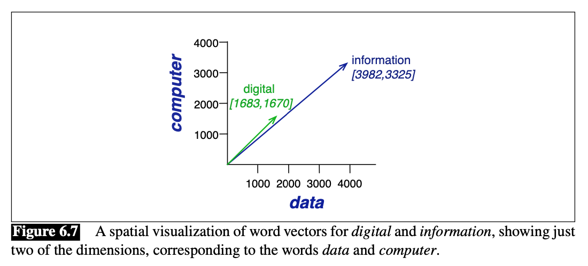
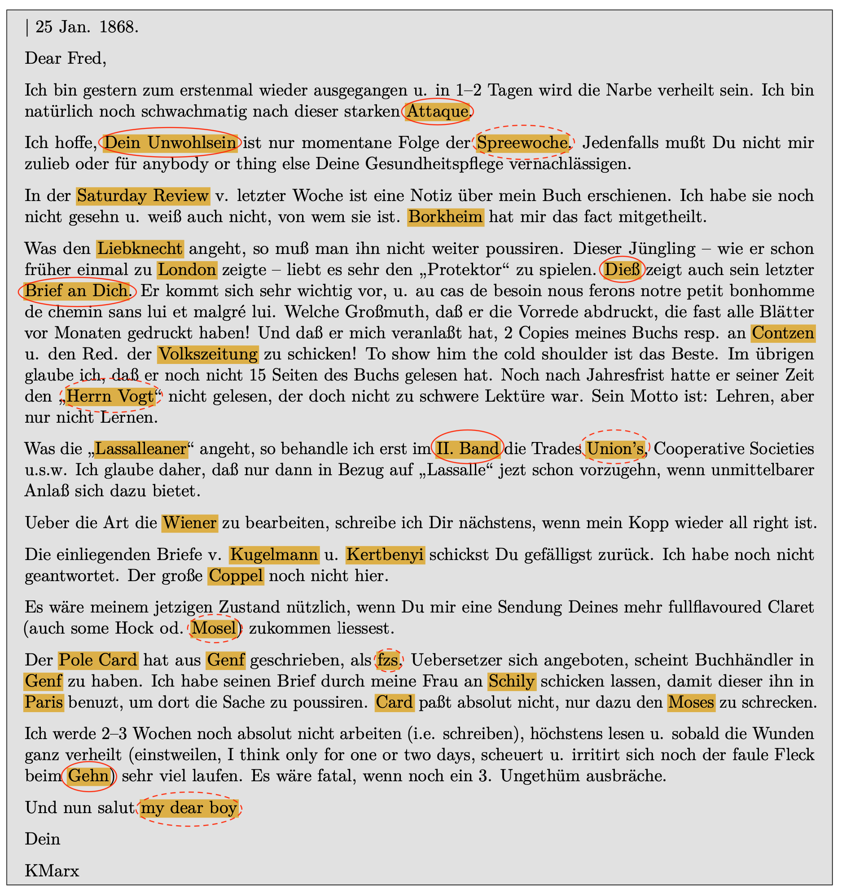

# Word Embeddings und NER

Bisher haben wir Worthäufigkeiten und das gemeinsame Vorkommen verschiedener Wörter in einem Korpus aus frequentistischer und probabilistischer Perspektive betrachtet. Um Worthäufigkeiten zu deuten und zu vergleichen, haben wir dabei untersucht, wie wahrscheinlich es ist, dass zwei Wörter in einem Korpus gemeinsam vorkommen. In diesem Kapitel untersuchen wir das gemeinsame Vorkommen von Wörtern in einem Korpus aus einer anderen mathematischen Perspektive, und zwar aus der Perspektive der linearen Algebra. Ausgangspunkt dieser Betrachtungsweise ist wieder die Feature Co-Occurrence Matrix (FCM). Aber die Zeilen und Spalten der Matrix werden jetzt nicht nur als Vektoren im Sinne von R aufgefasst, sondern als Vektoren im Sinne der linearen Algebra. Da jede Zeile der Matrix einem Wort im Korpus entspricht, beschreiben die Einträge in dem Wort-Vektor, wie oft die anderen Wörter im Korpus mit diesem Wort gemeinsam vorkommen. Wörter werden nach diesem Modell also durch ihren Kontext repräsentiert. 


Quelle: Jurafsky/Martin 2024, S. 113. [Hier](https://www.youtube.com/watch?v=xtD47WHNhxk) in Videoform.  

In die Sprache der linearen Algebra übersetzt (und geometrisch interpretiert) beschreibt jeder Wort-Vektor einen Punkt in einem mehrdimensionalen Raum. Dieser Raum hat nicht nur zwei oder drei Dimensionen, sondern hundert oder tausend. Diese höheren Dimensionen kann man sich geometrisch also nicht mehr vorstellen, aber es hilft, sich das Konzept für einen zweidimensionalen Raum zu veranschaulichen:



Quelle: Jurafsky/Martin 2024, S. 113. [Hier](https://www.youtube.com/watch?v=xtD47WHNhxk) in Videoform. 

Abstrakt könnt ihr euch diesen Raum als einen "semantischen Raum" vorstellen, in dem alle Wörter in einem Korpus eine bestimmte Position haben, und deren Entfernung voneinander davon abhängt, wie viele Einträge in den Vektoren übereinstimmen. Diese Auffassung von Wörtern als Vektoren erlaubt es, die Ähnlichkeit von zwei Wörtern mithilfe von **Ähnlichkeitsmaßen** wie der **Kosinus-Ähnlichkeit (cosine similariy)** zu untersuchen ([hier](https://youtu.be/-_i9Cg81rXA) eine kurze Erläuterung im Videoformat). Dieses Maß geht davon aus, dass ähnliche Wörter in einem semantischen Raum nah beieinander liegen (Jurafsky 2022). "Ähnlichkeit" wird hier gemessen über die Richtung und den Winkel von zwei Vektoren zueinander: Wenn zwei Vektoren dieselbe Richtung haben und der Winkel zwsichen den Vektoren sehr klein sind, dann haben sie einen ähnlichen Kontext, und sind sich ähnlich.

## Word Embeddings

Die Kookkurrenzmatrizen, mit denen wir bisher gearbeitet haben, eignen sich jedoch noch nicht für eine solche Darstellung. Erinnert euch daran, dass die meisten Einträge in jeder Zeile Nullen sind, weil Wörter nur mit einer kleinen Anzahl anderer Wörter gemeinsam vorkommen, aber die Matrix alle Wörter aus dem Korpus enthält. Diese Art von Vektoren werden "lang und spärlich" (long and sparse) genannt. Das Rechnen mit solchen Vektoren ist sehr aufwändig, und deswegen werden die Wort-Vektoren meist in "kurze und dichte" (short and dense) Vektoren umgewandelt, bevor Ähnlichkeitsmaße bestimmt werden (mehr dazu [hier](https://www.youtube.com/watch?v=FHhKmf1iPvw)). Solche "kurzen und dichten" Vektoren, die den Kontext eines bestimmten Wortes repräsentieren, werden **Word Embeddings** genannt. Word Embeddings können entweder direkt für eine Analyse verwendet werden, oder sie werden als Zwischenschritt in verschiedenen Methoden des "Natural Language Processing" verwendet. Im Folgenden werden wir beispielhaft zunächst Word Embeddings selbst erstellen und danach eine Methode kennenlernen, welche Word Embeddings als Zwischenschritt verwendet: Die sogenannte Named Entity Recognition. 

In diesem Abschnitt betrachten wir Word Embeddings zunächst als Analysewerkzeug kennenlernen. In der Literatur wird Word Embeddings oft die Eigenschaft zugeschrieben, die Bedeutung von Wörtern darzustellen: 

>"Embeddings represent meaning by leveraging the distributional hypothesis of language, an idea that goes back to at least Wittgenstein (1953). The distributional hypothesis has been succinctly summarized by an oft-repreated quote in this literature: 'you shall know a word by the company it keeps' (Firth, 1957). It posits that we can learn something about the semantic meanings of words on the basis of the words that appear frequently in a small context window around the focal word." (Grimmer et al. 2022, S. 79)

Dabei kann die in diesem Sinne verstandene semantische Bedeutung eines Wortes auf **Type- oder auf Tokenebene** erfasst werden: Entweder, ein Wort wird als Type betrachtet. Dann ist der Kontext jedes Wort, das im gesamten Korpus in einem bestimmten Abstand ("context window") mit diesem Wort gemeinsam vorkommt. Oder ein Wort wird als Token betrachtet und der Kontext ist für jedes Vorkommen verschieden. Die erste Art der Word Embeddings auf Type-Ebene wird als **"Static Word Embeddings"** bezeichnet. Embeddings auf Token-Ebene werden als "Contextualized" oder **"Contextual Word Embeddings"** beezeichnet. 

Mit unserer kleinen Beispielanalyse zu den Grimm'schen Märchen sind wir ja schon fertig, aber wir betrachten im Folgenden noch ein letztes Mal die mittlerweile vermutlich leidigen, aber dafür bereits vertrauten Märchen.


```r
library(readtext)
library(quanteda)

# Märchen von 1857 und 1812/15 einlesen und Informationen aus dem Dateinamen extrahieren
maerchen_alle <- readtext("maerchen_alle/*.txt", docvarsfrom = "filenames", dvsep = "_", docvarnames = c("Titel", "Jahr"), encoding = "UTF-8")
```


```r
maerchen_corpus <- corpus(maerchen_alle) %>%
  corpus_subset(Jahr == 1857)
```


### Count-Based Word Embeddings mit Quanteda und PMI-Werten

Code adaptiert von Stoltz/Taylor 2024, Mapping Texts, S. 210-214.


```r
# Funktion cos_sim() aus Stoltz/Taylor 2024, S. 91. 
cos_sim <- function(A, B) {
  sum(A * B) / sqrt(sum(A^2) * sum(B^2))
}

# Funktion fcm_pmi() von Kohei Watanabe (s. Abschnitt "Pointwise Mutual Information")
fcm_pmi <- function(x) {
  m <- x@meta$object$margin
  x <- as(x, "TsparseMatrix") #"dgTMatrix"
  x@x <- log(x@x / (m[x@i + 1] * m[x@j + 1]) * sum(m))
  x@x[x@x < 0] <- 0
  as.fcm(x)
}
```


```r
library(quanteda)

# Sätze als Dokumente festlegen
maerchen_sentences <- corpus_reshape(maerchen_corpus, to="sentences")
maerchen_toks <- tokens(maerchen_sentences, remove_punct=TRUE) %>%
  tokens_remove(pattern = stopwords("de")) %>%
  tokens_remove(pattern = "dass") 

# seltene Kookkurrenzen herausfiltern
feats <- dfm(maerchen_toks, verbose = TRUE) %>%
  dfm_trim(min_termfreq = 5) %>%
  featnames()
maerchen_toks <- tokens_select(maerchen_toks, feats, padding = FALSE)

# FCM erstellen und nach PPMI-Werten gewichten
maerchen_fcm <- fcm(maerchen_toks, context="document")
maerchen_pmi <- fcm_pmi(maerchen_fcm)
```

```r
# spärliche Matrix in dichte Matrix umwandeln
maerchen_svd <- svd(maerchen_pmi)
# saveRDS(maerchen_svd, "maerchen_svd.rds")
```


```r
# Dimensionen auswählen 
maerchen_svd <- maerchen_svd$v[, 1:100]  
# Zeilennamen wieder hinzufügen
rownames(maerchen_svd) <- rownames(maerchen_pmi)
```


```r
vec <- maerchen_svd["Königstochter", , drop=FALSE]
similarities <- apply(maerchen_svd, 1, cos_sim, B = vec)
similarities %>%
  sort(decreasing = TRUE) %>%
  head(n=30)
```

```
## Königstochter          ward         stand         Nacht          nahm          ließ        machte          ging          fort           kam         holen        herbei            ab          drei         sagte          Herz         schon      Hochzeit         Sonne          Wald         Jäger           zog         geben          erst       gemacht         Reich         Vater        großen       Kleider         ganze 
##     1.0000000     0.8756181     0.8594372     0.8500715     0.8469701     0.8396868     0.8320061     0.8256985     0.7873876     0.7815410     0.7814298     0.7716131     0.7595813     0.7590723     0.7539249     0.7476309     0.7443849     0.7423250     0.7390820     0.7331584     0.7323506     0.7266629     0.7211406     0.7073131     0.7023288     0.6895912     0.6829038     0.6698247     0.6690909     0.6684655
```

```r
vec <- maerchen_svd["Königssohn", , drop=FALSE]
similarities <- apply(maerchen_svd, 1, cos_sim, B = vec)
similarities %>%
  sort(decreasing = TRUE) %>%
  head(n=30)
```

```
## Königssohn     hinein       Mann     hinaus       fest      sehen   einander     sprang      blieb      Leute   Jungfrau      weiss       wohl       trat      mußte       lang     konnte      davon        gar antwortete  erblickte      hörte      hielt        los   zusammen     Finger    schönen    traurig       warf       Saal 
##  1.0000000  0.5573390  0.5569830  0.5415097  0.5367226  0.5337585  0.5187148  0.5176130  0.5078883  0.4933919  0.4925374  0.4753090  0.4740444  0.4705327  0.4641438  0.4623822  0.4435685  0.4417671  0.4409478  0.4397576  0.4384558  0.4384348  0.4379553  0.4350443  0.4344720  0.4321955  0.4278518  0.4236285  0.4172698  0.4150306
```

```r
vec <- maerchen_svd["Frosch", , drop=FALSE]
similarities <- apply(maerchen_svd, 1, cos_sim, B = vec)
similarities %>%
  sort(decreasing = TRUE) %>%
  head(n=30)
```

```
##      Frosch    Bettlein  Tellerlein       leise       Kugel     steigen   Mühlstein      Hühner versprichst  Edelsteine     Geselle         Leg   schwammen         mag      Hirtin       Krone       weine    Geschrei        Sand     Brunnen         Weh        Lieb      Sattel   angelangt        fein      grünen       trage     wünscht    hinunter       lerne 
##   1.0000000   0.5469821   0.5198615   0.4752694   0.4620827   0.4099883   0.4096365   0.3943878   0.3875297   0.3860514   0.3737674   0.3669408   0.3562529   0.3392410   0.3303167   0.3296042   0.3275415   0.3248515   0.3227707   0.3130655   0.3059238   0.3007742   0.2941668   0.2905524   0.2904694   0.2891591   0.2832657   0.2796599   0.2771317   0.2768381
```

```r
vec <- maerchen_svd["Fuchs", , drop=FALSE]
similarities <- apply(maerchen_svd, 1, cos_sim, B = vec)
similarities %>%
  sort(decreasing = TRUE) %>%
  head(n=30)
```

```
##       Fuchs        Wolf     Schwanz        Hase         Bär       Löwen       Pfote       Hasen       Katze       wecke       halte       Stall      Sultan   begegnete  Zuckerwerk     Füchsin    Mahlzeit     Zugemüs      fresse       weint       singt      hübsch    Beistand     Scheere        Löwe       stahl         Has        Hund Pflegevater       Bären 
##   1.0000000   0.5497672   0.5129997   0.4568970   0.4253704   0.4170046   0.4047426   0.3905415   0.3796215   0.3581648   0.3569861   0.3544493   0.3478926   0.3455567   0.3454813   0.3441733   0.3348203   0.3317943   0.3298429   0.3267461   0.3219903   0.3205035   0.3087269   0.3062407   0.3051577   0.3045710   0.3043136   0.2980685   0.2901543   0.2899181
```

```r
vec <- maerchen_svd["Schloss", , drop=FALSE]
similarities <- apply(maerchen_svd, 1, cos_sim, B = vec)
similarities %>%
  sort(decreasing = TRUE) %>%
  head(n=30)
```

```
##   Schloss      voll     darin   Mädchen    Wasser    schöne   niemand     herum       gut    großen       Tag    kannst      Türe     schon       kam     immer      fort  schlafen     ganze      wäre      Kind    hinauf     Wagen    setzte     gehen      Wald    wusste      Baum     Feuer     recht 
## 1.0000000 0.7729751 0.7690535 0.7275645 0.7182527 0.7141147 0.7111884 0.6861028 0.6821538 0.6627498 0.6616930 0.6576165 0.6547661 0.6528743 0.6488770 0.6402593 0.6396317 0.6246590 0.6220011 0.6075653 0.6068409 0.5946810 0.5927428 0.5909641 0.5907125 0.5894009 0.5890486 0.5856987 0.5776858 0.5715676
```

```r
vec <- maerchen_svd["Tochter", , drop=FALSE]
similarities <- apply(maerchen_svd, 1, cos_sim, B = vec)
similarities %>%
  sort(decreasing = TRUE) %>%
  head(n=30)
```

```
##   Tochter       sah      Welt     hätte    Mutter    gerade    finden      ganz      heim    gleich     sagte    ganzen     kamen      käme   Königin      drei    dachte  gefunden      weit     lange  Gemahlin     Braut     Reich    suchen     Vater      mußt     Augen      Zeit       tat      erst 
## 1.0000000 0.9117475 0.8905860 0.8807462 0.8458399 0.8445445 0.8399490 0.8395299 0.8377609 0.8345498 0.8262533 0.8254191 0.8173743 0.8131483 0.7972749 0.7957157 0.7901011 0.7889269 0.7861364 0.7813717 0.7789418 0.7718405 0.7638724 0.7561499 0.7507548 0.7449581 0.7416707 0.7411312 0.7293925 0.7280547
```

```r
vec <- maerchen_svd["ging", , drop=FALSE]
similarities <- apply(maerchen_svd, 1, cos_sim, B = vec)
similarities %>%
  sort(decreasing = TRUE) %>%
  head(n=30)
```

```
##          ging           kam        machte          nahm          fort         Nacht           zog         stand          Wald Königstochter        großen        setzte         schon         immer       Gesicht          ward          Baum           Tag         holen         ganze          Herz          ließ          Ring            ab       schlief          Kind       Mädchen          voll        herbei         darin 
##     1.0000000     0.9307458     0.9239009     0.9031458     0.8942659     0.8599003     0.8507306     0.8406557     0.8316138     0.8256985     0.8170346     0.8167331     0.8009302     0.7958267     0.7954026     0.7867992     0.7671229     0.7666795     0.7651123     0.7638766     0.7583472     0.7580792     0.7474252     0.7293929     0.7292514     0.7178115     0.7144701     0.7049639     0.7035012     0.6948527
```


### Prediction-Based Static Word Embeddings mit Quanteda und GloVe 

Code nach https://quanteda.io/articles/pkgdown/replication/text2vec.html


```r
library(quanteda)
library(quanteda.textstats)
library(text2vec)

maerchen_toks <- tokens(maerchen_corpus)

feats <- dfm(maerchen_toks, verbose = TRUE) %>%
  dfm_trim(min_termfreq = 5) %>%
  featnames()
```

```
## Creating a dfm from a tokens object...
```

```
##  ...complete, elapsed time: 0.025 seconds.
```

```
## Finished constructing a 194 x 13,610 sparse dfm.
```

```r
maerchen_toks <- tokens_select(maerchen_toks, feats, padding = TRUE)
maerchen_fcm <- fcm(maerchen_toks, context = "window", count = "weighted", weights = 1 / (1:5), tri = TRUE)

glove <- GlobalVectors$new(rank = 50, x_max = 10)
wv_main <- glove$fit_transform(maerchen_fcm, n_iter = 10,
                               convergence_tol = 0.01, n_threads = 8)
```

```
## INFO  [14:12:21.928] epoch 1, loss 0.1978
## INFO  [14:12:22.156] epoch 2, loss 0.1237
## INFO  [14:12:22.363] epoch 3, loss 0.0991
## INFO  [14:12:22.568] epoch 4, loss 0.0855
## INFO  [14:12:22.765] epoch 5, loss 0.0763
## INFO  [14:12:22.964] epoch 6, loss 0.0696
## INFO  [14:12:23.159] epoch 7, loss 0.0644
## INFO  [14:12:23.360] epoch 8, loss 0.0603
## INFO  [14:12:23.564] epoch 9, loss 0.0570
## INFO  [14:12:23.766] epoch 10, loss 0.0542
```

```r
wv_context <- glove$components
dim(wv_context)
```

```
## [1]   50 4160
```

```r
word_vectors <- wv_main + t(wv_context) # sum up u and v vectors (column and row vectors), https://youtu.be/ASn7ExxLZws?si=W8MGBXKGDF3E0WVK&t=2519

vec <- word_vectors["Königstochter", , drop = FALSE]
cossim <- textstat_simil(x = as.dfm(word_vectors), y = as.dfm(vec),
                          method = "cosine")
head(sort(cossim[, 1], decreasing = TRUE), 10)
```

```
## Königstochter           die      Jungfrau          eine          Alte           der        andere           Die       Königin         seine 
##     1.0000000     0.8285874     0.6489090     0.6461297     0.6329304     0.6325837     0.6324867     0.6250821     0.6222229     0.6176873
```

```r
vec <- word_vectors["Königssohn", , drop = FALSE]
cossim <- textstat_simil(x = as.dfm(word_vectors), y = as.dfm(vec),
                          method = "cosine")
head(sort(cossim[, 1], decreasing = TRUE), 10)
```

```
## Königssohn        Der      Fuchs       Wolf        der      Bauer   Jüngling      Riese      König      Jäger 
##  1.0000000  0.7918497  0.7519596  0.7340171  0.7203792  0.6941819  0.6934408  0.6793875  0.6695851  0.6642989
```

```r
vec <- word_vectors["Schloss", , drop = FALSE]
cossim <- textstat_simil(x = as.dfm(word_vectors), y = as.dfm(vec),
                          method = "cosine")
head(sort(cossim[, 1], decreasing = TRUE), 10)
```

```
##    Schloss        ins königliche        das     Wasser      Reich       Haus    Gesicht       Feld       Kind 
##  1.0000000  0.7252788  0.7083925  0.6612015  0.6521764  0.6359656  0.6259025  0.6046997  0.5956901  0.5710774
```

```r
vec <- word_vectors["Wald", , drop = FALSE]
cossim <- textstat_simil(x = as.dfm(word_vectors), y = as.dfm(vec),
                          method = "cosine")
head(sort(cossim[, 1], decreasing = TRUE), 10)
```

```
##      Wald    großen       den        in    hinein     Stall    Garten       dem     gehen     einem 
## 1.0000000 0.7331693 0.7288912 0.6959182 0.6911330 0.6145208 0.5982367 0.5972276 0.5861290 0.5808100
```


### Prediction-Based Contextual Word Embeddings mit FlaiR und ELMo 

(folgt noch)

## Named Entity Recognition (NER)

Word Embeddings sind im Bereich Natural Language Processing oft nur ein Schritt in einer Reihe von Textverarbeitungsmethoden. Mithilfe von statischen und kontextuellen Word Embeddings (aber eher nicht mit unseren simplen count-based embeddings) können sogenannte "benannte Entitäten" in Texten identifiziert werden, also Wörter, die auf eine bestimmte Art von Entität verweisen: Personen, Orte, Organisationen sind die gängigsten Beispiele:

> "A **named entity** is, roughly speaking, anything that can be referred to with a proper name: a person, a location, an organization. The task of **named entity recognition (NER)** is to find spans of text that constitute proper names and tag the type of the entity. Four entity tags are most common: **PER** (person), **LOC** (location), **ORG** (organization), or **GPE** (geo-political entity). However, the term **named entity** is commonly extended to include things that aren’t entities per se, including dates, times, and other kinds of temporal expressions, and even numerical expressions like prices."
([Jurafsky/Martin 2023, Ch.8, S.6](https://web.stanford.edu/~jurafsky/slp3/8.pdf))

Ähnlich wie beim POS Tagging geht es also bei der Named Entity Recognition (NER) darum, bestimmte Tokens (oder auch Tokenkombinationen) automatisiert zu identifizieren und mit einem Tag oder Label zu versehen. Anders als beim POS Tagging ist das Ziel bei der NER aber, semantische Strukturen zu erkennen und nicht syntaktische. Named Entity Recognition Systeme machen sich zur Erkennung der Entitäten die Eigenschaft von Word Embeddings zunutze, dass Wörter, die in ähnlichen semantischen Kontexten vorkommen (z.B. Städte, Personen, ...), im mehrdimensionalen Raum enger beeinanderliegen als Wörter, deren Kontexte sehr verschiedenen sind. 

Im folgenden werden beispielhaft zwei der populärsten NER-Systeme vorgestellt: SpaCy und Flair. Beide sind eigentlich für Python entwickelt, können aber mithilfe von sogenannten "Wrappern" auch aus R heraus angewandt werden. Beide Systeme nutzen Word Embeddings in Kombination mit einer Reihe anderer Verarbeitungsschritte, um Entitäten zu erkennen: SpaCy nutzt statische Embeddings (zumindest für deutsche Texte) und FlaiR nutzt kontextuelle Embeddings (allerdings nicht mehr ELMo, sondern eigentlich Character Embeddings, also Vektoren, die den Kontext einzelner Buchstaben repräsentieren). Dabei ist wichtig zu beachten, dass die Embeddings bei der hier vorgestellten simplen Anwendung dieser Systeme nicht alle auf der Grundlage der Eingabetexte erstellt werden, sondern dass ähnlich wie beim POS-Tagging andere Textkorpora verwendet werden, um Word Embeddings zu generieren und ein Sprachmodell zu trainieren, das Named Entities erkennen kann. 

Als Beispiel dient uns diesmal ein sehr kleines Korpus von Briefen aus der Korrespondenz von Karl Marx und Friedrich Engels aus der [digitalen Edition der Marx-Engels-Gesamtausgabe](https://megadigital.bbaw.de).  


```r
library(readtext)
marx_test <- readtext(file="./data/marx_briefe/Marx_Engels_London_25-1-1868.txt")

marx_briefe <- readtext(file="./data/marx_briefe/*.txt", docvarsfrom = "filenames", dvsep = "_", docvarnames = c("Von", "An", "Ort", "Datum"), encoding = "UTF-8")
```

## Beispiel mit SpaCy / Spacyr

Python Setup 


```r
install.packages("spacyr")
library("spacyr")

spacy_install(version = "apple")
```


Sprachmodell herunterladen und initialisieren


```r
spacy_download_langmodel("de_core_news_lg")
```

```r
spacy_initialize(model = "de_core_news_lg")
```

```
## successfully initialized (spaCy Version: 3.7.2, language model: de_core_news_lg)
```

Jetzt können wir beginnen: 


```r
results <- spacy_parse(marx_test, lemma = FALSE, entity = TRUE)
results_entities <- entity_extract(results)
results_entities # View(results_entities)
```

```
##                              doc_id sentence_id          entity entity_type
## 1  Marx_Engels_London_25-1-1868.txt           4         Attaque         ORG
## 2  Marx_Engels_London_25-1-1868.txt           5 Dein_Unwohlsein        MISC
## 3  Marx_Engels_London_25-1-1868.txt           5      Spreewoche         ORG
## 4  Marx_Engels_London_25-1-1868.txt           9 Saturday_Review        MISC
## 5  Marx_Engels_London_25-1-1868.txt          11        Borkheim         PER
## 6  Marx_Engels_London_25-1-1868.txt          12      Liebknecht         PER
## 7  Marx_Engels_London_25-1-1868.txt          13          London         LOC
## 8  Marx_Engels_London_25-1-1868.txt          14            Dieß         PER
## 9  Marx_Engels_London_25-1-1868.txt          14   Brief_an_Dich        MISC
## 10 Marx_Engels_London_25-1-1868.txt          18         Contzen         PER
## 11 Marx_Engels_London_25-1-1868.txt          21      Herrn_Vogt         PER
## 12 Marx_Engels_London_25-1-1868.txt          23    Lassalleaner         PER
## 13 Marx_Engels_London_25-1-1868.txt          23        II._Band        MISC
## 14 Marx_Engels_London_25-1-1868.txt          23        Union_’s         ORG
## 15 Marx_Engels_London_25-1-1868.txt          25          Wiener        MISC
## 16 Marx_Engels_London_25-1-1868.txt          26       Kugelmann         PER
## 17 Marx_Engels_London_25-1-1868.txt          26       Kertbenyi         PER
## 18 Marx_Engels_London_25-1-1868.txt          28          Coppel         PER
## 19 Marx_Engels_London_25-1-1868.txt          30           Mosel         LOC
## 20 Marx_Engels_London_25-1-1868.txt          31       Pole_Card         LOC
## 21 Marx_Engels_London_25-1-1868.txt          31            Genf         LOC
## 22 Marx_Engels_London_25-1-1868.txt          31             fzs         ORG
## 23 Marx_Engels_London_25-1-1868.txt          32            Genf         LOC
## 24 Marx_Engels_London_25-1-1868.txt          33          Schily         PER
## 25 Marx_Engels_London_25-1-1868.txt          33           Paris         LOC
## 26 Marx_Engels_London_25-1-1868.txt          34            Card         ORG
## 27 Marx_Engels_London_25-1-1868.txt          34           Moses        MISC
## 28 Marx_Engels_London_25-1-1868.txt          35            Gehn         LOC
## 29 Marx_Engels_London_25-1-1868.txt          37  my_dear_boy_\n         ORG
```




Quelle: https://megadigital.bbaw.de/briefe/detail.xql?id=M0000533.


```r
# Spalte doc_id des readtext-Dataframes ist per Default Dateiname; das ersetzen wir durch das Datum 
marx_briefe$doc_id <- marx_briefe$Datum
```


```r
results_briefe <- spacy_parse(marx_briefe, lemma = FALSE, entity = TRUE)

briefe_entities <- entity_extract(results_briefe)
briefe_entities
```

```{style="max-height: 200px;"}
##        doc_id sentence_id                                              entity entity_type
## 1   13-3-1867           2                                                Mchr         PER
## 2   13-3-1867           5                                       Herrn_Meißner         PER
## 3   13-3-1867           7                                        Lassallianer         PER
## 4   13-3-1867           8                                 Herren_Lassallianer        MISC
## 5   13-3-1867           8                                         sächsischen        MISC
## 6   13-3-1867           9                                         Deutschland         LOC
## 7   13-3-1867           9                                          Frankreich         LOC
## 8   13-3-1867          10                                           Deutschld         LOC
## 9   13-3-1867          10                                        Büreaukratie         LOC
## 10  13-3-1867          10                                              Frankr         LOC
## 11  13-3-1867          13                                               preuß        MISC
## 12  13-3-1867          14                                indirecte_Annexirung         ORG
## 13  13-3-1867          16                                          Philisters         PER
## 14  13-3-1867          17                                       Bürgermeinung         ORG
## 15  13-3-1867          18                                            Conflict        MISC
## 16  13-3-1867          19                                         europäische        MISC
## 17  13-3-1867          20                                              Schuft         PER
## 18  13-3-1867          20                                           Schweizer        MISC
## 19  13-3-1867          20                                                   X        MISC
## 20  13-3-1867          21                                              Barmen         LOC
## 21  13-3-1867          23                                                 inl         LOC
## 22  13-3-1867          25                                             Stieber         PER
## 23  13-3-1867          25                                       Eichhoffschen        MISC
## 24  13-3-1867          25                                             Hermann         PER
## 25  13-3-1867          26                                             Hermann         PER
## 26  13-3-1867          27                                             Dtschld         LOC
## 27  13-3-1867          30                                              Indien         LOC
## 28  13-3-1867          30                                               China         LOC
## 29  13-3-1867          30                                           Stockport         LOC
## 30  13-3-1867          32                                Diplomatic_Reviewist         ORG
## 31  13-3-1867          34                                         D._Urquhart         PER
## 32  13-3-1867          35                                             Sachsen        MISC
## 33  13-3-1867          35                                     Herr_v._Seebach         PER
## 34  13-3-1867          35                                           Krimkrieg        MISC
## 35  13-3-1867          35                                              Russen        MISC
## 36  13-3-1867          35                                               Beust         PER
## 37  13-3-1867          36                                              Kriegs        MISC
## 38  13-3-1867          36                                              Russen        MISC
## 39  13-3-1867          36                                              Russen        MISC
## 40  13-3-1867          37                                         sächsischen        MISC
## 41  13-3-1867          37                                              Russen        MISC
## 42  19-1-1869           5                                               Sarah        MISC
## 43  19-1-1869           5                                              Lizzie        MISC
## 44  19-1-1869           5                                          Mary_Ellen         PER
## 45  19-1-1869           6                                             Gumpert         PER
## 46  19-1-1869           8                 Damen_\n_Dein_\n_F._E._\n\n_Du_hast        MISC
## 47  19-1-1869           8                                  Demokraten_&_Ténot         ORG
## 48  23-1-1868           3                                               Wisch         PER
## 49  23-1-1868           6                                        A_jolly_idea        MISC
## 50  23-1-1868           6                                             Sachsen         LOC
## 51  23-1-1868           8                                           Karbunkel        MISC
## 52  23-1-1868          13                                              Wiener        MISC
## 53  23-1-1868          14              Neuer_Freien_Presse_&_Wiener_Tageblatt         ORG
## 54  23-1-1868          15                                               Laura         PER
## 55  23-1-1868          16                                           Karl_Marx         PER
## 56  23-1-1868          17                              Bd._1._Buch_1._Hamburg        MISC
## 57  23-1-1868          19                                                 Erl         LOC
## 58  23-1-1868          20                                                Marx         PER
## 59  23-1-1868          20                                               J._Ph         PER
## 60  23-1-1868          21                                              Becker         PER
## 61  23-1-1868          23                                        MEGA²_II_/_5        MISC
## 62  23-1-1868          26                                         Wilhelmchen         ORG
## 63  23-1-1868          26                                     Marx_&_Lassalle        MISC
## 64  23-1-1868          28                                     Marx_&_Lassalle         PER
## 65  23-1-1868          29                                        Lassalleaner         PER
## 66  23-1-1868          32      Pamphlets_von_Borkheim_durchzuochsen_kannst_Du        MISC
## 67  23-1-1868          37                                Ne_vaut_pas_la_peine        MISC
## 68  23-1-1868          38                                         Fortnightly         ORG
## 69  23-1-1868          39                                            ruminire         PER
## 70  23-1-1868          40                                             England         LOC
## 71  23-1-1868          43                                            Lafargue         PER
## 72  25-1-1870           4                                              Absceß         PER
## 73  25-1-1870           8                                    W_H_Smith_&_Sons         PER
## 74  25-1-1870           9                                     Heut_Abend_werd        MISC
## 75  25-1-1870          12                                        Longman_&_Co         ORG
## 76  25-1-1870          12                       Consortium_irischer_Landlords         ORG
## 77  25-1-1870          13                                                Iren         LOC
## 78  25-1-1870          13                                            Bummelei         LOC
## 79  25-1-1870          13                                              Kriege        MISC
## 80  25-1-1870          14                                                Iren         LOC
## 81  25-1-1870          14                                             Irinnen        MISC
## 82  25-1-1870          14                                             irische        MISC
## 83  25-1-1870          15                                 Giraldus_Cambrensis         LOC
## 84  25-1-1870          16                                       Giraldi_Cambr         PER
## 85  25-1-1870          17                                               Opera        MISC
## 86  25-1-1870          17                                 edidit_J._S._Brewer         PER
## 87  25-1-1870          17                                 London_Longman_&_Co         ORG
## 88  25-1-1870          18                                            Cromwell         PER
## 89  25-1-1870          18                                               engl.        MISC
## 90  25-1-1870          21                                             Blätter         PER
## 91  25-1-1870          22                                                Muth         PER
## 92  25-1-1870          24                            Beste_Grüße_an_Alle_._\n        MISC
## 93   3-1-1869           4                                             Pariser         LOC
## 94   3-1-1869           4                                    Neujahrsgeschenk         LOC
## 95   3-1-1869           6                                      Marx_an_Engels         PER
## 96   3-1-1869           7                                             Baseler         LOC
## 97   3-1-1869           7                                           Bakuniade        MISC
## 98   3-1-1869           8                                             Bakunin         PER
## 99   3-1-1869           9                                          Anno_Tobak         PER
## 100  3-1-1869          12                                         französisch        MISC
## 101  3-1-1869          14                                 Cloche_&_Diable_à_4        MISC
## 102  3-1-1869          16                                      wünschenswerth         LOC
## 103  3-1-1869          17                                           family_\n         ORG
## 104  4-1-1866           1                                       Manchr_4_Janr         LOC
## 105  4-1-1866           4                                     Bank_of_England         ORG
## 106  4-1-1866           5                                            landlord        MISC
## 107  4-1-1866           6                                          kann.​_\n\n         ORG
## 108  4-1-1866           8                                              Drecks         PER
## 109  4-1-1866           8                Schultze_Delitzschianischen_Brochüre         ORG
## 110  4-1-1866           8                                              Berlin         LOC
## 111  4-1-1866           9                                                 Sch         PER
## 112  4-1-1866          10                                           Delitzsch         LOC
## 113  4-1-1866          10                                            Lassalle         PER
## 114  4-1-1866          11                                      Iancu_Racowiţă         PER
## 115  4-1-1866          11                                  Ferdinand_Lassalle         PER
## 116  4-1-1866          13                                            Rakowitz         PER
## 117  4-1-1866          13                                    Mamsell_Dönniges         PER
## 118  4-1-1866          13                                          the_market        MISC
## 119  4-1-1866          13                                         if_ever_she        MISC
## 120  4-1-1866          15                                            Hrn_Held        MISC
## 121  4-1-1866          15                                              Berlin         LOC
## 122  4-1-1866          16                                            Berliner        MISC
## 123  4-1-1866          17                                           Bonaparte         PER
## 124  4-1-1866          18                                               Armee         ORG
## 125  4-1-1866          18                                              Mexico         LOC
## 126  4-1-1866          18                                               Paris         LOC
## 127  4-1-1866          19                                             Pariser         LOC
## 128  4-1-1866          19                                              confus         PER
## 129  4-1-1866          20                                 École_polytechnique         ORG
## 130  4-1-1866          21                                            downfall         ORG
## 131  4-1-1866          22                                             Bismark         LOC
## 132  4-1-1866          22                                              Kölner        MISC
## 133  4-1-1866          24                                         John_Bright         PER
## 134  4-1-1866          25                 Heat_considered_as_a_mode_of_motion        MISC
## 135  4-1-1866          29                                        Workmans_Adv         ORG
## 136  4-4-1867           2                                          Manchester         LOC
## 137  4-4-1867           5                                       irrepressibel        MISC
## 138  4-4-1867           5                                             Hamburg         LOC
## 139  4-4-1867           8                                    Wisch_von_Bucher         PER
## 140  4-4-1867           9                                         Preußisches        MISC
## 141  4-4-1867          10                                             Meißner         PER
## 142  4-4-1867          11                                             Allianz         ORG
## 143  4-4-1867          11                                             Bismark         LOC
## 144  4-4-1867          11                                              Russen         LOC
## 145  4-4-1867          12                                              Russen        MISC
## 146  4-4-1867          13                                              gemußt         ORG
## 147  4-4-1867          13                                             Dtschld         LOC
## 148  4-4-1867          14                                            deutsche        MISC
## 149  4-4-1867          14                                 Reichsheulerei_&_c.         ORG
## 150  4-4-1867          14                                             Bismark         LOC
## 151  4-4-1867          14                                             Preußen         LOC
## 152  4-4-1867          15                                              Russen        MISC
## 153  4-4-1867          16                                        Finanznoth_&         ORG
## 154  4-4-1867          16                                             Rußland         LOC
## 155  4-4-1867          16                                           Krimkrieg        MISC
## 156  4-4-1867          16                                              Odessa         LOC
## 157  4-4-1867          16                                         Bessarabien         LOC
## 158  4-4-1867          16                                           aufwöge_!        MISC
## 159  4-4-1867          17                                              Russen         LOC
## 160  4-4-1867          18                                         Luxemburger         LOC
## 161  4-4-1867          18                                           Saarlouis         LOC
## 162  4-4-1867          18                                              Landau         LOC
## 163  4-4-1867          19                                             Bismark         LOC
## 164  4-4-1867          19                                               Louis         PER
## 165  4-4-1867          20                                          preußische        MISC
## 166  4-4-1867          20                                          Bernstorff         PER
## 167  4-4-1867          20                                              London         LOC
## 168  4-4-1867          20                                             Preußen         LOC
## 169  4-4-1867          20                                              luxemb         LOC
## 170  4-4-1867          22                                                 Owl        MISC
## 171  4-4-1867          22                                             England         LOC
## 172  4-4-1867          22                                                Haag         LOC
## 173  4-4-1867          22                                             Holland         LOC
## 174  4-4-1867          23                                                Bism         LOC
## 175  4-4-1867          24                                           deutsches        MISC
## 176  4-4-1867          25                                           deutschen        MISC
## 177  4-4-1867          26                                               Indeß         PER
## 178  4-4-1867          26                                                Köln         LOC
## 179  4-4-1867          28                                           Luxemburg         LOC
## 180  4-4-1867          29                                            Deutschl         LOC
## 181  4-4-1867          31                                             Wagener         PER
## 182  4-4-1867          32                                          Todtlachen         ORG
## 183  4-4-1867          33                                                Bism         PER
## 184  4-4-1867          35                                        Mademoiselle         PER
## 185  4-4-1867          35                                             Pariser         LOC
## 186  4-4-1867          36                                     Deine_Karbunkel        MISC
## 187  4-4-1867          38                                   ladies_&_Lafargue         ORG
## 188  7-1-1868           3                            Dühring_&_der_Beobachter         ORG
## 189  7-1-1868           6                                         Arbeitszeit         PER
## 190  7-1-1868           6                                   Productionskosten         ORG
## 191  7-1-1868          11                                             Seubert         PER
## 192  7-1-1868          12                                                Wien         LOC
## 193  7-1-1868          12                                             Richter        MISC
## 194  7-1-1868          12                                Internationale_Revue         ORG
## 195  7-1-1868          15                                  Wilhelmchens_Paper         ORG
## 196  7-1-1868          16                                                Wien         LOC
## 197  7-1-1868          17                                              Beesly         PER
## 198  7-1-1868          17                                        Lewes_&_Co_&         ORG
## 199  7-1-1868          17                                  Fortnightly_Review        MISC
## 200  7-1-1868          18                                            Ladies_&         ORG
## 201  7-3-1970           1                                                Mchr         PER
## 202  7-3-1970           3                                                Zeit        MISC
## 203  7-3-1970           4                                              curios         PER
## 204  7-3-1970           5                                            H._Bruce         PER
## 205  7-3-1970           6                                            Irishman         LOC
## 206  7-3-1970           6                                               Paris         LOC
## 207  7-3-1970           6                                        Marseillaise        MISC
## 208  7-3-1970           6                                         Mr_Williams         PER
## 209  7-3-1970           7                      Brief_mit_der_naiven_Zumuthung        MISC
## 210  7-3-1970           7                                          Rocheforts         ORG
## 211  7-3-1970           7                                       Donovan_Rossa         PER
## 212  7-3-1970           7                                                Mars         LOC
## 213  7-3-1970           8                                               Jenny         PER
## 214  7-3-1970           8                         bonshommes_drüben_die_Augen        MISC
## 215  7-3-1970           9                                              Genfer        MISC
## 216  7-3-1970          10                                                Genf         LOC
## 217  7-3-1970          11                                             Brüssel         LOC
## 218  7-3-1970          15                          Marseillaisen_&_Internatle         ORG
## 219  7-3-1970          16                                   Jennychens_Succeß         PER
## 220  7-3-1970          16                                      Mr_J._Williams         PER
## 221  7-3-1970          19                                             Corresp         PER
## 222  7-3-1970          20                                            Irishman         LOC
## 223  7-3-1970          20                                               Paris         LOC
## 224  7-3-1970          20                                            Ollivier         ORG
## 225  7-3-1970          21                                            irischen        MISC
## 226  7-3-1970          23                                            Londoner        MISC
## 227  7-3-1970          23                                            Longmans         ORG
## 228  7-3-1970          25                                             Meißner         PER
## 229  7-3-1970          26                                              Barmen         LOC
## 230  7-3-1970          28                                          Liebknecht         PER
## 231  7-3-1970          30                                         Deutschland         LOC
## 232  7-3-1970          33                                       Dein_\n_F._E.        MISC
## 233  9-1-1870           1                                                Mchr         LOC
## 234  9-1-1870           4                                              Barmen         LOC
## 235  9-1-1870           6                                      Louis_Napoleon         PER
## 236  9-1-1870           6                                             Bismark         LOC
## 237  9-1-1870           6                                           deutschen        MISC
## 238  9-1-1870           6                                          Biedermann         PER
## 239  9-1-1870           9                                         N._ _Rh_._         MISC
## 240  9-1-1870          12                                            Solingen         LOC
## 241  9-1-1870          12                                        holiday_Zeit        MISC
## 242  9-1-1870          12                              Documente_&_Securities         ORG
## 243  9-1-1870          13                                               Menke         PER
## 244  9-1-1870          13                                              Jemand         PER
## 245  9-1-1870          14                                               Dir_&        MISC
## 246  9-1-1870          15                                         abgerackert         PER
## 247  9-1-1870          15                                              Lizzie         PER
## 248  9-1-1870          15                                                 Dir         ORG
## 249  9-1-1870          16                                                Zeit        MISC
## 250  9-1-1870          16                                            Hatzfeld         LOC
## 251  9-1-1870          16                                               Mende         LOC
## 252  9-1-1870          16                                          Schweitzer         PER
## 253  9-1-1870          16                                                Schw         LOC
## 254  9-1-1870          19                                                Köln         LOC
## 255  9-1-1870          21                                     Crethi_&_Plethi         ORG
## 256  9-1-1870          21                                              Ewalds         PER
## 257  9-1-1870          21                                              Creter         PER
## 258  1-1-1869           6                                            Lafargue         PER
## 259  1-1-1869           6                                    New_Year_’s_Gift        MISC
## 260  1-1-1869           6                              dignity_of_grandfather         ORG
## 261  1-1-1869           7                                               Paris         LOC
## 262  1-1-1869           7                                              Cloche         LOC
## 263  1-1-1869           8                                            Preussen         LOC
## 264  1-1-1869           9                                           Rochefort         LOC
## 265  1-1-1869          11                 Internationalen_Arbeiterassociation         ORG
## 266  1-1-1869          11                                               Basel         LOC
## 267  1-1-1869          11                                           Karl_Marx         PER
## 268  1-1-1869          11                Internationalen_Arbeiter-Assoziation         ORG
## 269  1-1-1869          11                                               Basel         LOC
## 270  1-1-1869          12                                             MEGA2_I        MISC
## 271  1-1-1869          14                                               Basel         LOC
## 272  1-1-1869          16                                       Arbeiterassoc         ORG
## 273  1-1-1869          22                                               appel         LOC
## 274  1-1-1869          22                                              Intern         ORG
## 275  1-1-1869          23                                 Arbeiterassociation         ORG
## 276  1-1-1869          23                                            Londoner        MISC
## 277  1-1-1869          23                              Schweizer_Kriegskosten        MISC
## 278  1-1-1869          24                              on_the_shortest_notice        MISC
## 279  1-1-1869          25                                      Genfer_Affaire        MISC
## 280  1-1-1869          28                           compliments_of_the_season        MISC
## 281  1-1-1869          29                                               Tussy         PER
## 282  1-1-1869          29                                           poor_Fred         PER
## 283 13-1-1869           2                                              London         LOC
## 284 13-1-1869           4                                             Thesmar         PER
## 285 13-1-1869           4                                       Georgios_Jung         PER
## 286 13-1-1869           5                                          Tag_zu_Tag        MISC
## 287 13-1-1869           6                                                 Aug         LOC
## 288 13-1-1869           8                                                Ists         PER
## 289 13-1-1869           8                                          Manchester         LOC
## 290 13-1-1869          10                                            Irländer         LOC
## 291 13-1-1869          12                                                  Th         PER
## 292 13-1-1869          13                                            Emmerich         LOC
## 293 13-1-1869          13                                                 Dir        MISC
## 294 13-1-1869          15                                          englischen        MISC
## 295 13-1-1869          16                                                Jezt         PER
## 296 13-1-1869          17                                        Will_Gimborn         PER
## 297 13-1-1869          17                                           after_all         ORG
## 298 13-1-1869          17                                           englische        MISC
## 299 13-1-1869          18                                                Dieß         PER
## 300 13-1-1869          19 Alliance_Internationale_de_la_Démocratie_Socialiste         ORG
## 301 13-1-1869          20                                        Generalraths         PER
## 302 13-1-1869          22                                        Travailleurs         ORG
## 303 13-1-1869          25                                                Trav         PER
## 304 13-1-1869          26                                      mir_redigirten         PER
## 305 13-1-1869          26                                            Urtheils         PER
## 306 13-1-1869          26                                            Alliance         ORG
## 307 13-1-1869          27                                              Becker         PER
## 308 13-1-1869          27                                       Eselei_ersehn        MISC
## 309 13-1-1869          27                                             Brüßler         LOC
## 310 13-1-1869          27                   Ligue_de_la_Paix_et_de_la_Liberté         ORG
## 311 13-1-1869          29                                               Assoc         ORG
## 312 13-1-1869          29                                             Kongreß         ORG
## 313 13-1-1869          29                                               Ligue         ORG
## 314 13-1-1869          30                                               Assoc         ORG
## 315 13-1-1869          30     plusiers_membres_de_groupe_initiateur_de_Genève         ORG
## 316 13-1-1869          30                                             Brüssel         LOC
## 317 13-1-1869          31                                            Unterdeß        MISC
## 318 13-1-1869          31                                             Brüssel         LOC
## 319 13-1-1869          31                                               Rouen         LOC
## 320 13-1-1869          31                                                Lyon         LOC
## 321 13-1-1869          31                                        Generalraths         PER
## 322 13-1-1869          32                      le_groupe_initiateur_de_Genève         ORG
## 323 13-1-1869          34                                                Genf         LOC
## 324 13-1-1869          38                                                   D         LOC
## 325 13-1-1869          40                                         Russe_Serno        MISC
## 326 13-1-1869          40                                            Borkheim         PER
## 327 13-1-1869          40                                            Bakunine        MISC
## 328 13-1-1869          41                                               Serno         PER
## 329 13-1-1869          41                                                 Bak         PER
## 330 13-1-1869          43                                              Russen        MISC
## 331 13-1-1869          44                                               Russe         PER
## 332 13-1-1869          45                                           Eiligeres         PER
## 333 13-1-1869          47                                 Ad_vocem_old_Becker        MISC
## 334 13-1-1869          48                                           D_’_abord         PER
## 335 13-1-1869          48                                          d._d._Genf         PER
## 336 13-1-1869          48                                              Basler         LOC
## 337 13-1-1869          48                                              précis         PER
## 338 13-1-1869          50                                             Lessner         PER
## 339 13-1-1869          50                                      Genfer_Affaire        MISC
## 340 13-1-1869          51                                    Brief_an_Lessner        MISC
## 341 13-1-1869          52                                                Genf         LOC
## 342 13-1-1869          52                                                  B.         PER
## 343 13-1-1869          52                                                Jung         PER
## 344 13-1-1869          53                                              London         LOC
## 345 13-1-1869          54                                              Becker         PER
## 346 13-1-1869          57                                      ribbon_weavers         ORG
## 347 13-1-1869          57                                            Conflikt        MISC
## 348 13-1-1869          59                                       Trades_Unions         ORG
## 349 13-1-1869          60                                        Generalraths         LOC
## 350 13-1-1869          61                                              Basler         LOC
## 351 13-1-1869          62                                         Generalrath         PER
## 352 13-1-1869          62                                              Becker         PER
## 353 13-1-1869          62                                                 fzs         ORG
## 354 13-1-1869          63                                          Correspond         PER
## 355 13-1-1869          64                                                Genf         LOC
## 356 13-1-1869          65                                      Basler_Affaire        MISC
## 357 13-1-1869          67                                              Becker         PER
## 358 13-1-1869          70                                               Rouen         LOC
## 359 13-1-1869          70                                              Vienne         LOC
## 360 13-1-1869          71                                            spinners         ORG
## 361 13-1-1869          71                                              Amiens         LOC
## 362 13-1-1869          71                                     Maire_v._Amiens        MISC
## 363 13-1-1869          72                                               Vidal         PER
## 364 13-1-1869          72                                             England         LOC
## 365 13-1-1869          72                                          Engländern         LOC
## 366 13-1-1869          72                                             England         LOC
## 367 13-1-1869          74                                             England         LOC
## 368 13-1-1869          74                                               Engld         PER
## 369 13-1-1869          75                                          englischen        MISC
## 370 13-1-1869          75                                          Frankreich         LOC
## 371 13-1-1869          75                                          englischen        MISC
## 372 13-1-1869          76                                      Amiens_Congreß         ORG
## 373 13-1-1869          76                                               Rouen         LOC
## 374 13-1-1869          76                                              Vienne         LOC
## 375 13-1-1869          77                                              Dupont         PER
## 376 13-1-1869          77                                                Zeit        MISC
## 377 13-1-1869          78                                           Meanwhile        MISC
## 378 13-1-1869          78                                              Vienne         LOC
## 379 13-1-1869          78                                              Strike        MISC
## 380 13-1-1869          78                                              Vienne         LOC
## 381 13-1-1869          79                                               Rouen         LOC
## 382 13-1-1869          79                                            Conflict        MISC
## 383 13-1-1869          79                                             Pariser         LOC
## 384 13-1-1869          80                                                 fzs         ORG
## 385 13-1-1869          81                                          Schweitzer         PER
## 386 13-1-1869          82                                           Dein_Kopf         PER
## 387 13-1-1869          82                                                   D         LOC
## 388 19-2-1870           7                                             Russica         PER
## 389 19-2-1870           7                                              leztre        MISC
## 390 19-2-1870           8                                             Hermann         PER
## 391 19-2-1870           8                                             Rußland        MISC
## 392 19-2-1870           9                                            Bismarck         PER
## 393 19-2-1870           9                                           Katkoff's        MISC
## 394 19-2-1870          10                                           Katkoff's        MISC
## 395 19-2-1870          10                                            Bakunine        MISC
## 396 19-2-1870          10                                            Sibirien         LOC
## 397 19-2-1870          11                                            Nicolaus         PER
## 398 19-2-1870          12                                          Gaudissart        MISC
## 399 19-2-1870          13                                                city         LOC
## 400 19-2-1870          15                                               Stadt         LOC
## 401 19-2-1870          16                                        subcommittee         LOC
## 402 19-2-1870          17                                             Richard        MISC
## 403 19-2-1870          17                                     General_Council         ORG
## 404 19-2-1870          18                                             Richard         PER
## 405 19-2-1870          18                                                Lyon         LOC
## 406 19-2-1870          19                                             Bakunin         PER
## 407 19-2-1870          20                                             Schweiz         LOC
## 408 19-2-1870          20                                          Bakunisten        MISC
## 409 19-2-1870          22                                           Gladstone         PER
## 410 19-2-1870          24                                           Engländer         LOC
## 411 19-2-1870          25                                               Engld         PER
## 412 19-2-1870          25                                             Irlands         LOC
## 413 19-2-1870          25                                              !_\n\n        MISC
## 414 19-2-1870          27                                             lawyers         ORG
## 415 19-2-1870          27                                           landlords         LOC
## 416 19-2-1870          28                                      ’s_Wahlskandal        MISC
## 417 19-2-1870          29                                           Sau-Whigs         LOC
## 418 19-2-1870          29                                              Tories         ORG
## 419 19-2-1870          30                                         Herrn_Odger         PER
## 420 19-2-1870          31                                            Waterloo        MISC
## 421 19-2-1870          31                                            irischen        MISC
## 422 19-2-1870          31                                     General_Council         ORG
## 423 19-2-1870          31                                            Reynolds         PER
## 424 19-2-1870          31                                            trimming         PER
## 425 19-2-1870          32                                             irische        MISC
## 426 19-2-1870          34                                              Siebel         PER
## 427 19-2-1870          35                                               Sybel         PER
## 428 19-2-1870          35                                            Preussen        MISC
## 429 19-2-1870          35                                              Polens         LOC
## 430 19-2-1870          36                                            Preussen        MISC
## 431 19-2-1870          36                                          polnischen        MISC
## 432 19-2-1870          36                                           deutscher        MISC
## 433 19-2-1870          36                                             Rußland        MISC
## 434 19-2-1870          36                                           deutschen        MISC
## 435 19-2-1870          36                                  Antijakobinerkrieg        MISC
## 436 19-2-1870          36                                                 fzs         ORG
## 437 19-2-1870          37                                          polnischen        MISC
## 438  2-4-1867           4                                              Engels         PER
## 439  2-4-1867           4                                                 Dir        MISC
## 440  2-4-1867           5                               Karbunkeln_am_Hintern         LOC
## 441  2-4-1867           5                                               penis         LOC
## 442  2-4-1867           6                                                Zeit        MISC
## 443  2-4-1867           8                                             Hamburg         LOC
## 444  2-4-1867           9                                             Meißner         PER
## 445  2-4-1867          10                                  Wisch_von_Borkheim         LOC
## 446  2-4-1867          11                                   Geheimrath_Bucher         PER
## 447  2-4-1867          12                                            Borkheim         PER
## 448  2-4-1867          12                                           Schlesien         LOC
## 449  2-4-1867          13                                              Bucher         PER
## 450  2-4-1867          14                                             canards         LOC
## 451  2-4-1867          14                                             Meißner         PER
## 452  2-4-1867          16                                             d'abord         PER
## 453  2-4-1867          18                               Laura's_Champagnerkur         PER
## 454  2-4-1867          19                                            Rothwein         PER
## 455  2-4-1867          22                                              Strike        MISC
## 456  2-4-1867          22                                             Pariser         LOC
## 457  2-4-1867          22                              London_Trades_’_Unions         ORG
## 458  2-4-1867          23                                             Meister         PER
## 459  2-4-1867          24                                       französischen        MISC
## 460  2-4-1867          25                                                Fkch         LOC
## 461  2-4-1867          26                                 Luxemburger_Affaire        MISC
## 462  2-4-1867          26                                             Bismark         LOC
## 463  2-4-1867          26                                           Bonaparte         PER
## 464  2-4-1867          27                                              erstre         PER
## 465  2-4-1867          28                                           russische        MISC
## 466  2-4-1867          28                                           deutschen        MISC
## 467  2-4-1867          29                             Würtembergische_Vertrag        MISC
## 468  2-4-1867          29                                            Preussen         LOC
## 469  2-4-1867          29                                            Bismarks         LOC
## 470  2-4-1867          29                                               Polen         LOC
## 471  2-4-1867          30                                              Russen        MISC
## 472  2-4-1867          31                                          Frankreich         LOC
## 473  2-4-1867          31                                         Deutschland         LOC
## 474  2-4-1867          32                                           Oestreich         PER
## 475  2-4-1867          33                                          Engländern         LOC
## 476  2-4-1867          33                                       United_States         ORG
## 477  2-4-1867          34                                                   D         LOC
## 478 21-2-1867           4                                              Engels         PER
## 479 21-2-1867           4                                          Tag_zu_Tag        MISC
## 480 21-2-1867           5                                         Uebermorgen         LOC
## 481 21-2-1867           6                                       Extraausgaben         LOC
## 482 21-2-1867           6                                               Laure         PER
## 483 21-2-1867           7                                                Zeit        MISC
## 484 21-2-1867           9                         Zeitung_für_Norddeutschland         ORG
## 485 21-2-1867          10                                            Hannover         LOC
## 486 21-2-1867          15                            Telegraphische_Depeschen        MISC
## 487 21-2-1867          16                                        L._Kugelmann         PER
## 488 21-2-1867          16                                                Marx         PER
## 489 21-2-1867          16                                           15.2.1867        MISC
## 490 21-2-1867          16                                                 Erl         LOC
## 491 21-2-1867          17                                                Marx         PER
## 492 21-2-1867          17                                        L._Kugelmann         PER
## 493 21-2-1867          17                                                 Erl         LOC
## 494 21-2-1867          18                                        Dr_Kugelmann         PER
## 495 21-2-1867          19                                                   D         LOC
## 496 23-1-1869           2                                              London         LOC
## 497 23-1-1869           4                                                  N.         PER
## 498 23-1-1869           4                                   Mornington_Street         LOC
## 499 23-1-1869           6                                             Gumpert         PER
## 500 23-1-1869           6                                          Mary_Ellen         PER
## 501 23-1-1869           7                                               Tussy         PER
## 502 23-1-1869           7                                 best_compliments_to        MISC
## 503 23-1-1869           7                                           Mrs_Burns         PER
## 504 23-1-1869          11                                Einliegendes_Photogr         LOC
## 505 23-1-1869          11                                       Dir_Jennychen         PER
## 506 23-1-1869          12                                             Büchner         PER
## 507 23-1-1869          12                                      Darwin_studirt         PER
## 508 23-1-1869          12                                           großen_B.        MISC
## 509 23-1-1869          13                                          polnisches        MISC
## 510 23-1-1869          13                                  Insurrektionskreuz         LOC
## 511 23-1-1869          14                                               Tussy         PER
## 512 23-1-1869          16                                        Uebergeister         LOC
## 513 23-1-1869          16                                           Russische        MISC
## 514 23-1-1869          17                                        Nous_verrons         PER
## 515 23-1-1869          18                                        Money_Market        MISC
## 516 23-1-1869          18                                             Knowles         PER
## 517 23-1-1869          19                                              Braven        MISC
## 518 23-1-1869          20                                   Haus_\n_Dein_Mohr         LOC
## 519 25-1-1868           4                                             Attaque         ORG
## 520 25-1-1868           5                                     Dein_Unwohlsein        MISC
## 521 25-1-1868           5                                          Spreewoche         ORG
## 522 25-1-1868           9                                     Saturday_Review        MISC
## 523 25-1-1868          11                                            Borkheim         PER
## 524 25-1-1868          12                                          Liebknecht         PER
## 525 25-1-1868          13                                              London         LOC
## 526 25-1-1868          14                                                Dieß         PER
## 527 25-1-1868          14                                       Brief_an_Dich        MISC
## 528 25-1-1868          18                                             Contzen         PER
## 529 25-1-1868          21                                          Herrn_Vogt         PER
## 530 25-1-1868          23                                        Lassalleaner         PER
## 531 25-1-1868          23                                            II._Band        MISC
## 532 25-1-1868          23                                            Union_’s         ORG
## 533 25-1-1868          25                                              Wiener        MISC
## 534 25-1-1868          26                                           Kugelmann         PER
## 535 25-1-1868          26                                           Kertbenyi         PER
## 536 25-1-1868          28                                              Coppel         PER
## 537 25-1-1868          30                                               Mosel         LOC
## 538 25-1-1868          31                                           Pole_Card         LOC
## 539 25-1-1868          31                                                Genf         LOC
## 540 25-1-1868          31                                                 fzs         ORG
## 541 25-1-1868          32                                                Genf         LOC
## 542 25-1-1868          33                                              Schily         PER
## 543 25-1-1868          33                                               Paris         LOC
## 544 25-1-1868          34                                                Card         ORG
## 545 25-1-1868          34                                               Moses        MISC
## 546 25-1-1868          35                                                Gehn         LOC
## 547 25-1-1868          37                                      my_dear_boy_\n         ORG
## 548 25-2-1867           5                                   Dr_Kugelmann_\n\n         PER
## 549 25-2-1867           6             Hauptgestalt_der_Komödie_„_Le_faiseur_“         LOC
## 550 25-2-1867           6                                    Honoré_de_Balzac         PER
## 551 25-2-1867           7                                            Balzac's         PER
## 552 25-2-1867           8                                     À_Propos_Balzac         PER
## 553 25-2-1867           8                                  Melmoth_réconcilié         PER
## 554 25-2-1867          10                                                   D         LOC
## 555  5-1-1866           5                                              Engels         PER
## 556  5-1-1866           5                                                Marx         PER
## 557  5-1-1866           7                                            Landlord        MISC
## 558  5-1-1866           8                                              Intern         ORG
## 559  5-1-1866           9                                               Assoc         ORG
## 560  5-1-1866          12                                 Le_Lubez_u._Vesigny         LOC
## 561  5-1-1866          12                                             letztre         LOC
## 562  5-1-1866          12                                               ieine         LOC
## 563  5-1-1866          13                                             Brüssel         LOC
## 564  5-1-1866          13                                                 fzs         ORG
## 565  5-1-1866          13                                  Oppositionsbranche         PER
## 566  5-1-1866          13                                             Longuet         PER
## 567  5-1-1866          13                                         Rive_Gauche        MISC
## 568  5-1-1866          14                                 Proudhonisten_Bande         LOC
## 569  5-1-1866          14                                             Brüssel         LOC
## 570  5-1-1866          15                                             Vesigny         PER
## 571  5-1-1866          15                                    Echo_de_Verviers        MISC
## 572  5-1-1866          16                                           publicirt         PER
## 573  5-1-1866          16                                              London         LOC
## 574  5-1-1866          16                    slanders_gegen_unsre_Association         ORG
## 575  5-1-1866          16                                              Tolain         LOC
## 576  5-1-1866          16                                            Fribourg         LOC
## 577  5-1-1866          16                                Bonapartisten_umlügt         ORG
## 578  5-1-1866          17                                       werden.​_​_\n\n         ORG
## 579  5-1-1866          20                                                 ​Ich        MISC
## 580  5-1-1866          20                                   Tribune_du_Peuple         ORG
## 581  5-1-1866          20                                               Polen         LOC
## 582  5-1-1866          21                                            Deutsche        MISC
## 583  5-1-1866          21                                             Workman        MISC
## 584  5-1-1866          22                                              Russen        MISC
## 585  5-1-1866          22                                        Jeune_France         ORG
## 586  8-1-1868           3                                  ditto_v._Kugelmann         PER
## 587  8-1-1868           5                                  K._zugesandte_Copy         PER
## 588  8-1-1868           6                                          Würtemberg         LOC
## 589  8-1-1868           7                                           Oestreich         PER
## 590  8-1-1868          10                                     Charaktermasken         PER
## 591  8-1-1868          11                                         Wilhelmchen         ORG
## 592  8-1-1868          12                                     Wilhelm_’_schen         PER
## 593  8-1-1868          13                                        Privatdocent         PER
## 594  8-1-1868          13                                Berliner_Universität         ORG
## 595  8-1-1868          14                                        Verschiednes         PER
## 596  8-1-1868          15                                          Drolligste         LOC
## 597  8-1-1868          15                                               Stein         PER
## 598  8-1-1868          15                                               Stein         PER
## 599  8-1-1868          17                                   Hast_Du_Borkheims         LOC
## 600  8-1-1868          18                                          Prosaismus        MISC
## 601  8-1-1868          19                                               Z._B.         PER
## 602  8-1-1868          20                                                Kate         PER
## 603  8-1-1868          20                                               Paris         LOC
## 604  8-1-1868          21                                             Pariser         LOC
## 605  8-1-1868          23                                              family         ORG
## 606  8-1-1868          24                                                  K.         PER
## 607  8-1-1868          26                                              Kröker         PER
## 608  8-1-1868          26                                               Paris         LOC
## 609  8-1-1868          26                                             Provinz         LOC
## 610  8-1-1868          26                                                  K.         PER
## 611  8-1-1868          26                                              London         LOC
## 612  8-1-1868          28                                      Freiligrath_’s         ORG
## 613  8-1-1868          29                                        mir_im_Hause        MISC
## 614  8-1-1868          31                                               Paris         LOC
## 615  8-1-1868          32                                             Yankees         ORG
## 616  8-1-1868          32                                           John_Bull         ORG
## 617  8-1-1868          33                                              Russen        MISC
## 618  8-1-1868          34                                            Alberich         PER
## 619  8-1-1868          35                                          Turnschule         LOC
## 620  8-1-1868          36                                                   D         LOC
```

```r
briefe_pers <- briefe_entities[briefe_entities$entity_type == "PER",]
briefe_pers
```

```{style="max-height: 200px;"}
##        doc_id sentence_id                entity entity_type
## 1   13-3-1867           2                  Mchr         PER
## 2   13-3-1867           5         Herrn_Meißner         PER
## 3   13-3-1867           7          Lassallianer         PER
## 13  13-3-1867          16            Philisters         PER
## 17  13-3-1867          20                Schuft         PER
## 22  13-3-1867          25               Stieber         PER
## 24  13-3-1867          25               Hermann         PER
## 25  13-3-1867          26               Hermann         PER
## 31  13-3-1867          34           D._Urquhart         PER
## 33  13-3-1867          35       Herr_v._Seebach         PER
## 36  13-3-1867          35                 Beust         PER
## 44  19-1-1869           5            Mary_Ellen         PER
## 45  19-1-1869           6               Gumpert         PER
## 48  23-1-1868           3                 Wisch         PER
## 54  23-1-1868          15                 Laura         PER
## 55  23-1-1868          16             Karl_Marx         PER
## 58  23-1-1868          20                  Marx         PER
## 59  23-1-1868          20                 J._Ph         PER
## 60  23-1-1868          21                Becker         PER
## 64  23-1-1868          28       Marx_&_Lassalle         PER
## 65  23-1-1868          29          Lassalleaner         PER
## 69  23-1-1868          39              ruminire         PER
## 71  23-1-1868          43              Lafargue         PER
## 72  25-1-1870           4                Absceß         PER
## 73  25-1-1870           8      W_H_Smith_&_Sons         PER
## 84  25-1-1870          16         Giraldi_Cambr         PER
## 86  25-1-1870          17   edidit_J._S._Brewer         PER
## 88  25-1-1870          18              Cromwell         PER
## 90  25-1-1870          21               Blätter         PER
## 91  25-1-1870          22                  Muth         PER
## 95   3-1-1869           6        Marx_an_Engels         PER
## 98   3-1-1869           8               Bakunin         PER
## 99   3-1-1869           9            Anno_Tobak         PER
## 108  4-1-1866           8                Drecks         PER
## 111  4-1-1866           9                   Sch         PER
## 113  4-1-1866          10              Lassalle         PER
## 114  4-1-1866          11        Iancu_Racowiţă         PER
## 115  4-1-1866          11    Ferdinand_Lassalle         PER
## 116  4-1-1866          13              Rakowitz         PER
## 117  4-1-1866          13      Mamsell_Dönniges         PER
## 123  4-1-1866          17             Bonaparte         PER
## 128  4-1-1866          19                confus         PER
## 133  4-1-1866          24           John_Bright         PER
## 139  4-4-1867           8      Wisch_von_Bucher         PER
## 141  4-4-1867          10               Meißner         PER
## 164  4-4-1867          19                 Louis         PER
## 166  4-4-1867          20            Bernstorff         PER
## 177  4-4-1867          26                 Indeß         PER
## 181  4-4-1867          31               Wagener         PER
## 183  4-4-1867          33                  Bism         PER
## 184  4-4-1867          35          Mademoiselle         PER
## 189  7-1-1868           6           Arbeitszeit         PER
## 191  7-1-1868          11               Seubert         PER
## 197  7-1-1868          17                Beesly         PER
## 201  7-3-1970           1                  Mchr         PER
## 203  7-3-1970           4                curios         PER
## 204  7-3-1970           5              H._Bruce         PER
## 208  7-3-1970           6           Mr_Williams         PER
## 211  7-3-1970           7         Donovan_Rossa         PER
## 213  7-3-1970           8                 Jenny         PER
## 219  7-3-1970          16     Jennychens_Succeß         PER
## 220  7-3-1970          16        Mr_J._Williams         PER
## 221  7-3-1970          19               Corresp         PER
## 228  7-3-1970          25               Meißner         PER
## 230  7-3-1970          28            Liebknecht         PER
## 235  9-1-1870           6        Louis_Napoleon         PER
## 238  9-1-1870           6            Biedermann         PER
## 243  9-1-1870          13                 Menke         PER
## 244  9-1-1870          13                Jemand         PER
## 246  9-1-1870          15           abgerackert         PER
## 247  9-1-1870          15                Lizzie         PER
## 252  9-1-1870          16            Schweitzer         PER
## 256  9-1-1870          21                Ewalds         PER
## 257  9-1-1870          21                Creter         PER
## 258  1-1-1869           6              Lafargue         PER
## 267  1-1-1869          11             Karl_Marx         PER
## 281  1-1-1869          29                 Tussy         PER
## 282  1-1-1869          29             poor_Fred         PER
## 284 13-1-1869           4               Thesmar         PER
## 285 13-1-1869           4         Georgios_Jung         PER
## 288 13-1-1869           8                  Ists         PER
## 291 13-1-1869          12                    Th         PER
## 295 13-1-1869          16                  Jezt         PER
## 296 13-1-1869          17          Will_Gimborn         PER
## 299 13-1-1869          18                  Dieß         PER
## 301 13-1-1869          20          Generalraths         PER
## 303 13-1-1869          25                  Trav         PER
## 304 13-1-1869          26        mir_redigirten         PER
## 305 13-1-1869          26              Urtheils         PER
## 307 13-1-1869          27                Becker         PER
## 321 13-1-1869          31          Generalraths         PER
## 326 13-1-1869          40              Borkheim         PER
## 328 13-1-1869          41                 Serno         PER
## 329 13-1-1869          41                   Bak         PER
## 331 13-1-1869          44                 Russe         PER
## 332 13-1-1869          45             Eiligeres         PER
## 334 13-1-1869          48             D_’_abord         PER
## 335 13-1-1869          48            d._d._Genf         PER
## 337 13-1-1869          48                précis         PER
## 338 13-1-1869          50               Lessner         PER
## 342 13-1-1869          52                    B.         PER
## 343 13-1-1869          52                  Jung         PER
## 345 13-1-1869          54                Becker         PER
## 351 13-1-1869          62           Generalrath         PER
## 352 13-1-1869          62                Becker         PER
## 354 13-1-1869          63            Correspond         PER
## 357 13-1-1869          67                Becker         PER
## 363 13-1-1869          72                 Vidal         PER
## 368 13-1-1869          74                 Engld         PER
## 375 13-1-1869          77                Dupont         PER
## 385 13-1-1869          81            Schweitzer         PER
## 386 13-1-1869          82             Dein_Kopf         PER
## 388 19-2-1870           7               Russica         PER
## 390 19-2-1870           8               Hermann         PER
## 392 19-2-1870           9              Bismarck         PER
## 397 19-2-1870          11              Nicolaus         PER
## 404 19-2-1870          18               Richard         PER
## 406 19-2-1870          19               Bakunin         PER
## 409 19-2-1870          22             Gladstone         PER
## 411 19-2-1870          25                 Engld         PER
## 419 19-2-1870          30           Herrn_Odger         PER
## 423 19-2-1870          31              Reynolds         PER
## 424 19-2-1870          31              trimming         PER
## 426 19-2-1870          34                Siebel         PER
## 427 19-2-1870          35                 Sybel         PER
## 438  2-4-1867           4                Engels         PER
## 444  2-4-1867           9               Meißner         PER
## 446  2-4-1867          11     Geheimrath_Bucher         PER
## 447  2-4-1867          12              Borkheim         PER
## 449  2-4-1867          13                Bucher         PER
## 451  2-4-1867          14               Meißner         PER
## 452  2-4-1867          16               d'abord         PER
## 453  2-4-1867          18 Laura's_Champagnerkur         PER
## 454  2-4-1867          19              Rothwein         PER
## 458  2-4-1867          23               Meister         PER
## 463  2-4-1867          26             Bonaparte         PER
## 464  2-4-1867          27                erstre         PER
## 474  2-4-1867          32             Oestreich         PER
## 478 21-2-1867           4                Engels         PER
## 482 21-2-1867           6                 Laure         PER
## 487 21-2-1867          16          L._Kugelmann         PER
## 488 21-2-1867          16                  Marx         PER
## 491 21-2-1867          17                  Marx         PER
## 492 21-2-1867          17          L._Kugelmann         PER
## 494 21-2-1867          18          Dr_Kugelmann         PER
## 497 23-1-1869           4                    N.         PER
## 499 23-1-1869           6               Gumpert         PER
## 500 23-1-1869           6            Mary_Ellen         PER
## 501 23-1-1869           7                 Tussy         PER
## 503 23-1-1869           7             Mrs_Burns         PER
## 505 23-1-1869          11         Dir_Jennychen         PER
## 506 23-1-1869          12               Büchner         PER
## 507 23-1-1869          12        Darwin_studirt         PER
## 511 23-1-1869          14                 Tussy         PER
## 514 23-1-1869          17          Nous_verrons         PER
## 516 23-1-1869          18               Knowles         PER
## 523 25-1-1868          11              Borkheim         PER
## 524 25-1-1868          12            Liebknecht         PER
## 526 25-1-1868          14                  Dieß         PER
## 528 25-1-1868          18               Contzen         PER
## 529 25-1-1868          21            Herrn_Vogt         PER
## 530 25-1-1868          23          Lassalleaner         PER
## 534 25-1-1868          26             Kugelmann         PER
## 535 25-1-1868          26             Kertbenyi         PER
## 536 25-1-1868          28                Coppel         PER
## 542 25-1-1868          33                Schily         PER
## 548 25-2-1867           5     Dr_Kugelmann_\n\n         PER
## 550 25-2-1867           6      Honoré_de_Balzac         PER
## 551 25-2-1867           7              Balzac's         PER
## 552 25-2-1867           8       À_Propos_Balzac         PER
## 553 25-2-1867           8    Melmoth_réconcilié         PER
## 555  5-1-1866           5                Engels         PER
## 556  5-1-1866           5                  Marx         PER
## 565  5-1-1866          13    Oppositionsbranche         PER
## 566  5-1-1866          13               Longuet         PER
## 570  5-1-1866          15               Vesigny         PER
## 572  5-1-1866          16             publicirt         PER
## 586  8-1-1868           3    ditto_v._Kugelmann         PER
## 587  8-1-1868           5    K._zugesandte_Copy         PER
## 589  8-1-1868           7             Oestreich         PER
## 590  8-1-1868          10       Charaktermasken         PER
## 592  8-1-1868          12       Wilhelm_’_schen         PER
## 593  8-1-1868          13          Privatdocent         PER
## 595  8-1-1868          14          Verschiednes         PER
## 597  8-1-1868          15                 Stein         PER
## 598  8-1-1868          15                 Stein         PER
## 601  8-1-1868          19                 Z._B.         PER
## 602  8-1-1868          20                  Kate         PER
## 606  8-1-1868          24                    K.         PER
## 607  8-1-1868          26                Kröker         PER
## 610  8-1-1868          26                    K.         PER
## 618  8-1-1868          34              Alberich         PER
```


```r
library(ggplot2)

marx_pers_plot <- ggplot(briefe_pers, aes(x = doc_id, y = entity)) +
  geom_point() +
  theme(axis.text.y = element_text(size=3), 
        axis.text.x = element_text(angle = 90, vjust = 0.5, hjust=1, size=5)) + 
  labs(x = "Brief", y = "Person")

library(plotly)
ggplotly(marx_pers_plot)
```

```{=html}
<div class="plotly html-widget html-fill-item-overflow-hidden html-fill-item" id="htmlwidget-8897776f821dd97d9756" style="width:672px;height:480px;"></div>
<script type="application/json" data-for="htmlwidget-8897776f821dd97d9756">{"x":{"data":[{"x":[3,3,3,3,3,3,3,3,3,3,3,4,4,8,8,8,8,8,8,8,8,8,8,11,11,11,11,11,11,11,13,13,13,14,14,14,14,14,14,14,14,14,14,15,15,15,15,15,15,15,15,17,17,17,18,18,18,18,18,18,18,18,18,18,18,20,20,20,20,20,20,20,20,20,1,1,1,1,2,2,2,2,2,2,2,2,2,2,2,2,2,2,2,2,2,2,2,2,2,2,2,2,2,2,2,2,2,2,2,2,2,2,5,5,5,5,5,5,5,5,5,5,5,5,5,6,6,6,6,6,6,6,6,6,6,6,6,6,7,7,7,7,7,7,7,9,9,9,9,9,9,9,9,9,9,9,10,10,10,10,10,10,10,10,10,10,12,12,12,12,12,16,16,16,16,16,16,19,19,19,19,19,19,19,19,19,19,19,19,19,19,19],"y":[105,63,89,120,134,140,61,61,34,62,14,104,59,155,90,79,101,70,11,102,88,129,86,3,151,57,46,30,18,114,103,9,5,44,132,87,67,52,125,100,19,24,75,156,106,97,13,68,152,16,99,6,137,12,105,31,60,112,41,72,73,111,27,106,94,98,15,109,71,2,95,135,51,29,86,79,146,121,143,56,69,142,74,154,38,55,144,110,147,11,55,20,136,8,130,47,32,33,122,93,7,76,11,54,11,28,11,150,49,45,135,37,131,61,17,116,127,9,58,49,64,126,145,138,141,48,106,53,20,21,106,35,91,128,107,19,50,118,48,92,85,101,101,85,42,115,59,104,146,113,39,22,36,146,117,82,20,94,38,25,65,88,84,81,26,133,43,66,10,1,108,48,101,119,96,149,124,40,78,118,23,153,123,148,139,139,157,80,77,83,77,4],"text":["doc_id: 13-3-1867<br />entity: Mchr","doc_id: 13-3-1867<br />entity: Herrn_Meißner","doc_id: 13-3-1867<br />entity: Lassallianer","doc_id: 13-3-1867<br />entity: Philisters","doc_id: 13-3-1867<br />entity: Schuft","doc_id: 13-3-1867<br />entity: Stieber","doc_id: 13-3-1867<br />entity: Hermann","doc_id: 13-3-1867<br />entity: Hermann","doc_id: 13-3-1867<br />entity: D._Urquhart","doc_id: 13-3-1867<br />entity: Herr_v._Seebach","doc_id: 13-3-1867<br />entity: Beust","doc_id: 19-1-1869<br />entity: Mary_Ellen","doc_id: 19-1-1869<br />entity: Gumpert","doc_id: 23-1-1868<br />entity: Wisch","doc_id: 23-1-1868<br />entity: Laura","doc_id: 23-1-1868<br />entity: Karl_Marx","doc_id: 23-1-1868<br />entity: Marx","doc_id: 23-1-1868<br />entity: J._Ph","doc_id: 23-1-1868<br />entity: Becker","doc_id: 23-1-1868<br />entity: Marx_&_Lassalle","doc_id: 23-1-1868<br />entity: Lassalleaner","doc_id: 23-1-1868<br />entity: ruminire","doc_id: 23-1-1868<br />entity: Lafargue","doc_id: 25-1-1870<br />entity: Absceß","doc_id: 25-1-1870<br />entity: W_H_Smith_&_Sons","doc_id: 25-1-1870<br />entity: Giraldi_Cambr","doc_id: 25-1-1870<br />entity: edidit_J._S._Brewer","doc_id: 25-1-1870<br />entity: Cromwell","doc_id: 25-1-1870<br />entity: Blätter","doc_id: 25-1-1870<br />entity: Muth","doc_id: 3-1-1869<br />entity: Marx_an_Engels","doc_id: 3-1-1869<br />entity: Bakunin","doc_id: 3-1-1869<br />entity: Anno_Tobak","doc_id: 4-1-1866<br />entity: Drecks","doc_id: 4-1-1866<br />entity: Sch","doc_id: 4-1-1866<br />entity: Lassalle","doc_id: 4-1-1866<br />entity: Iancu_Racowiţă","doc_id: 4-1-1866<br />entity: Ferdinand_Lassalle","doc_id: 4-1-1866<br />entity: Rakowitz","doc_id: 4-1-1866<br />entity: Mamsell_Dönniges","doc_id: 4-1-1866<br />entity: Bonaparte","doc_id: 4-1-1866<br />entity: confus","doc_id: 4-1-1866<br />entity: John_Bright","doc_id: 4-4-1867<br />entity: Wisch_von_Bucher","doc_id: 4-4-1867<br />entity: Meißner","doc_id: 4-4-1867<br />entity: Louis","doc_id: 4-4-1867<br />entity: Bernstorff","doc_id: 4-4-1867<br />entity: Indeß","doc_id: 4-4-1867<br />entity: Wagener","doc_id: 4-4-1867<br />entity: Bism","doc_id: 4-4-1867<br />entity: Mademoiselle","doc_id: 7-1-1868<br />entity: Arbeitszeit","doc_id: 7-1-1868<br />entity: Seubert","doc_id: 7-1-1868<br />entity: Beesly","doc_id: 7-3-1970<br />entity: Mchr","doc_id: 7-3-1970<br />entity: curios","doc_id: 7-3-1970<br />entity: H._Bruce","doc_id: 7-3-1970<br />entity: Mr_Williams","doc_id: 7-3-1970<br />entity: Donovan_Rossa","doc_id: 7-3-1970<br />entity: Jenny","doc_id: 7-3-1970<br />entity: Jennychens_Succeß","doc_id: 7-3-1970<br />entity: Mr_J._Williams","doc_id: 7-3-1970<br />entity: Corresp","doc_id: 7-3-1970<br />entity: Meißner","doc_id: 7-3-1970<br />entity: Liebknecht","doc_id: 9-1-1870<br />entity: Louis_Napoleon","doc_id: 9-1-1870<br />entity: Biedermann","doc_id: 9-1-1870<br />entity: Menke","doc_id: 9-1-1870<br />entity: Jemand","doc_id: 9-1-1870<br />entity: abgerackert","doc_id: 9-1-1870<br />entity: Lizzie","doc_id: 9-1-1870<br />entity: Schweitzer","doc_id: 9-1-1870<br />entity: Ewalds","doc_id: 9-1-1870<br />entity: Creter","doc_id: 1-1-1869<br />entity: Lafargue","doc_id: 1-1-1869<br />entity: Karl_Marx","doc_id: 1-1-1869<br />entity: Tussy","doc_id: 1-1-1869<br />entity: poor_Fred","doc_id: 13-1-1869<br />entity: Thesmar","doc_id: 13-1-1869<br />entity: Georgios_Jung","doc_id: 13-1-1869<br />entity: Ists","doc_id: 13-1-1869<br />entity: Th","doc_id: 13-1-1869<br />entity: Jezt","doc_id: 13-1-1869<br />entity: Will_Gimborn","doc_id: 13-1-1869<br />entity: Dieß","doc_id: 13-1-1869<br />entity: Generalraths","doc_id: 13-1-1869<br />entity: Trav","doc_id: 13-1-1869<br />entity: mir_redigirten","doc_id: 13-1-1869<br />entity: Urtheils","doc_id: 13-1-1869<br />entity: Becker","doc_id: 13-1-1869<br />entity: Generalraths","doc_id: 13-1-1869<br />entity: Borkheim","doc_id: 13-1-1869<br />entity: Serno","doc_id: 13-1-1869<br />entity: Bak","doc_id: 13-1-1869<br />entity: Russe","doc_id: 13-1-1869<br />entity: Eiligeres","doc_id: 13-1-1869<br />entity: D_’_abord","doc_id: 13-1-1869<br />entity: d._d._Genf","doc_id: 13-1-1869<br />entity: précis","doc_id: 13-1-1869<br />entity: Lessner","doc_id: 13-1-1869<br />entity: B.","doc_id: 13-1-1869<br />entity: Jung","doc_id: 13-1-1869<br />entity: Becker","doc_id: 13-1-1869<br />entity: Generalrath","doc_id: 13-1-1869<br />entity: Becker","doc_id: 13-1-1869<br />entity: Correspond","doc_id: 13-1-1869<br />entity: Becker","doc_id: 13-1-1869<br />entity: Vidal","doc_id: 13-1-1869<br />entity: Engld","doc_id: 13-1-1869<br />entity: Dupont","doc_id: 13-1-1869<br />entity: Schweitzer","doc_id: 13-1-1869<br />entity: Dein_Kopf","doc_id: 19-2-1870<br />entity: Russica","doc_id: 19-2-1870<br />entity: Hermann","doc_id: 19-2-1870<br />entity: Bismarck","doc_id: 19-2-1870<br />entity: Nicolaus","doc_id: 19-2-1870<br />entity: Richard","doc_id: 19-2-1870<br />entity: Bakunin","doc_id: 19-2-1870<br />entity: Gladstone","doc_id: 19-2-1870<br />entity: Engld","doc_id: 19-2-1870<br />entity: Herrn_Odger","doc_id: 19-2-1870<br />entity: Reynolds","doc_id: 19-2-1870<br />entity: trimming","doc_id: 19-2-1870<br />entity: Siebel","doc_id: 19-2-1870<br />entity: Sybel","doc_id: 2-4-1867<br />entity: Engels","doc_id: 2-4-1867<br />entity: Meißner","doc_id: 2-4-1867<br />entity: Geheimrath_Bucher","doc_id: 2-4-1867<br />entity: Borkheim","doc_id: 2-4-1867<br />entity: Bucher","doc_id: 2-4-1867<br />entity: Meißner","doc_id: 2-4-1867<br />entity: d'abord","doc_id: 2-4-1867<br />entity: Laura's_Champagnerkur","doc_id: 2-4-1867<br />entity: Rothwein","doc_id: 2-4-1867<br />entity: Meister","doc_id: 2-4-1867<br />entity: Bonaparte","doc_id: 2-4-1867<br />entity: erstre","doc_id: 2-4-1867<br />entity: Oestreich","doc_id: 21-2-1867<br />entity: Engels","doc_id: 21-2-1867<br />entity: Laure","doc_id: 21-2-1867<br />entity: L._Kugelmann","doc_id: 21-2-1867<br />entity: Marx","doc_id: 21-2-1867<br />entity: Marx","doc_id: 21-2-1867<br />entity: L._Kugelmann","doc_id: 21-2-1867<br />entity: Dr_Kugelmann","doc_id: 23-1-1869<br />entity: N.","doc_id: 23-1-1869<br />entity: Gumpert","doc_id: 23-1-1869<br />entity: Mary_Ellen","doc_id: 23-1-1869<br />entity: Tussy","doc_id: 23-1-1869<br />entity: Mrs_Burns","doc_id: 23-1-1869<br />entity: Dir_Jennychen","doc_id: 23-1-1869<br />entity: Büchner","doc_id: 23-1-1869<br />entity: Darwin_studirt","doc_id: 23-1-1869<br />entity: Tussy","doc_id: 23-1-1869<br />entity: Nous_verrons","doc_id: 23-1-1869<br />entity: Knowles","doc_id: 25-1-1868<br />entity: Borkheim","doc_id: 25-1-1868<br />entity: Liebknecht","doc_id: 25-1-1868<br />entity: Dieß","doc_id: 25-1-1868<br />entity: Contzen","doc_id: 25-1-1868<br />entity: Herrn_Vogt","doc_id: 25-1-1868<br />entity: Lassalleaner","doc_id: 25-1-1868<br />entity: Kugelmann","doc_id: 25-1-1868<br />entity: Kertbenyi","doc_id: 25-1-1868<br />entity: Coppel","doc_id: 25-1-1868<br />entity: Schily","doc_id: 25-2-1867<br />entity: Dr_Kugelmann_<br /><br />","doc_id: 25-2-1867<br />entity: Honoré_de_Balzac","doc_id: 25-2-1867<br />entity: Balzac's","doc_id: 25-2-1867<br />entity: À_Propos_Balzac","doc_id: 25-2-1867<br />entity: Melmoth_réconcilié","doc_id: 5-1-1866<br />entity: Engels","doc_id: 5-1-1866<br />entity: Marx","doc_id: 5-1-1866<br />entity: Oppositionsbranche","doc_id: 5-1-1866<br />entity: Longuet","doc_id: 5-1-1866<br />entity: Vesigny","doc_id: 5-1-1866<br />entity: publicirt","doc_id: 8-1-1868<br />entity: ditto_v._Kugelmann","doc_id: 8-1-1868<br />entity: K._zugesandte_Copy","doc_id: 8-1-1868<br />entity: Oestreich","doc_id: 8-1-1868<br />entity: Charaktermasken","doc_id: 8-1-1868<br />entity: Wilhelm_’_schen","doc_id: 8-1-1868<br />entity: Privatdocent","doc_id: 8-1-1868<br />entity: Verschiednes","doc_id: 8-1-1868<br />entity: Stein","doc_id: 8-1-1868<br />entity: Stein","doc_id: 8-1-1868<br />entity: Z._B.","doc_id: 8-1-1868<br />entity: Kate","doc_id: 8-1-1868<br />entity: K.","doc_id: 8-1-1868<br />entity: Kröker","doc_id: 8-1-1868<br />entity: K.","doc_id: 8-1-1868<br />entity: Alberich"],"type":"scatter","mode":"markers","marker":{"autocolorscale":false,"color":"rgba(0,0,0,1)","opacity":1,"size":5.6692913385826778,"symbol":"circle","line":{"width":1.8897637795275593,"color":"rgba(0,0,0,1)"}},"hoveron":"points","showlegend":false,"xaxis":"x","yaxis":"y","hoverinfo":"text","frame":null}],"layout":{"margin":{"t":26.228310502283108,"r":7.3059360730593621,"b":58.38107098381073,"l":67.413864674138651},"plot_bgcolor":"rgba(235,235,235,1)","paper_bgcolor":"rgba(255,255,255,1)","font":{"color":"rgba(0,0,0,1)","family":"","size":14.611872146118724},"xaxis":{"domain":[0,1],"automargin":true,"type":"linear","autorange":false,"range":[0.40000000000000002,20.600000000000001],"tickmode":"array","ticktext":["1-1-1869","13-1-1869","13-3-1867","19-1-1869","19-2-1870","2-4-1867","21-2-1867","23-1-1868","23-1-1869","25-1-1868","25-1-1870","25-2-1867","3-1-1869","4-1-1866","4-4-1867","5-1-1866","7-1-1868","7-3-1970","8-1-1868","9-1-1870"],"tickvals":[1,2,3,4.0000000000000009,5,6.0000000000000009,7,8,9,10,11,12.000000000000002,13,14.000000000000002,15,16,17,18,19,20],"categoryorder":"array","categoryarray":["1-1-1869","13-1-1869","13-3-1867","19-1-1869","19-2-1870","2-4-1867","21-2-1867","23-1-1868","23-1-1869","25-1-1868","25-1-1870","25-2-1867","3-1-1869","4-1-1866","4-4-1867","5-1-1866","7-1-1868","7-3-1970","8-1-1868","9-1-1870"],"nticks":null,"ticks":"outside","tickcolor":"rgba(51,51,51,1)","ticklen":3.6529680365296811,"tickwidth":0.66417600664176002,"showticklabels":true,"tickfont":{"color":"rgba(77,77,77,1)","family":"","size":6.6417600664176026},"tickangle":-90,"showline":false,"linecolor":null,"linewidth":0,"showgrid":true,"gridcolor":"rgba(255,255,255,1)","gridwidth":0.66417600664176002,"zeroline":false,"anchor":"y","title":{"text":"Brief","font":{"color":"rgba(0,0,0,1)","family":"","size":14.611872146118724}},"hoverformat":".2f"},"yaxis":{"domain":[0,1],"automargin":true,"type":"linear","autorange":false,"range":[0.40000000000000002,157.59999999999999],"tickmode":"array","ticktext":["À_Propos_Balzac","abgerackert","Absceß","Alberich","Anno_Tobak","Arbeitszeit","B.","Bak","Bakunin","Balzac's","Becker","Beesly","Bernstorff","Beust","Biedermann","Bism","Bismarck","Blätter","Bonaparte","Borkheim","Bucher","Büchner","Charaktermasken","confus","Contzen","Coppel","Corresp","Correspond","Creter","Cromwell","curios","D_’_abord","d._d._Genf","D._Urquhart","d'abord","Darwin_studirt","Dein_Kopf","Dieß","Dir_Jennychen","ditto_v._Kugelmann","Donovan_Rossa","Dr_Kugelmann","Dr_Kugelmann_<br /><br />","Drecks","Dupont","edidit_J._S._Brewer","Eiligeres","Engels","Engld","erstre","Ewalds","Ferdinand_Lassalle","Geheimrath_Bucher","Generalrath","Generalraths","Georgios_Jung","Giraldi_Cambr","Gladstone","Gumpert","H._Bruce","Hermann","Herr_v._Seebach","Herrn_Meißner","Herrn_Odger","Herrn_Vogt","Honoré_de_Balzac","Iancu_Racowiţă","Indeß","Ists","J._Ph","Jemand","Jenny","Jennychens_Succeß","Jezt","John_Bright","Jung","K.","K._zugesandte_Copy","Karl_Marx","Kate","Kertbenyi","Knowles","Kröker","Kugelmann","L._Kugelmann","Lafargue","Lassalle","Lassalleaner","Lassallianer","Laura","Laura's_Champagnerkur","Laure","Lessner","Liebknecht","Lizzie","Longuet","Louis","Louis_Napoleon","Mademoiselle","Mamsell_Dönniges","Marx","Marx_&_Lassalle","Marx_an_Engels","Mary_Ellen","Mchr","Meißner","Meister","Melmoth_réconcilié","Menke","mir_redigirten","Mr_J._Williams","Mr_Williams","Mrs_Burns","Muth","N.","Nicolaus","Nous_verrons","Oestreich","Oppositionsbranche","Philisters","poor_Fred","précis","Privatdocent","publicirt","Rakowitz","Reynolds","Richard","Rothwein","ruminire","Russe","Russica","Sch","Schily","Schuft","Schweitzer","Serno","Seubert","Siebel","Stein","Stieber","Sybel","Th","Thesmar","Trav","trimming","Tussy","Urtheils","Verschiednes","Vesigny","Vidal","W_H_Smith_&_Sons","Wagener","Wilhelm_’_schen","Will_Gimborn","Wisch","Wisch_von_Bucher","Z._B."],"tickvals":[1,2,3,4,5,6,7,8,9,10,11,12,13,14.000000000000002,15.000000000000002,15.999999999999998,17,18,19,20,20.999999999999996,21.999999999999996,22.999999999999996,24,25,26,27,28,29,30,31,32,33,34,35,36,37,38,39,40,40.999999999999993,42,43,44,45,46,47,48,49,50,51,52,53,54,55,56,57,58,59,60,61,62.000000000000007,63,64.000000000000014,65,66,67,68,69,70,71,72,73,74,75,76,77,78,79,80,80.999999999999986,82,83,84,84.999999999999986,86,87,88,88.999999999999986,90,91,92,93,94,95,96,97,98,99,100.00000000000001,101,102,103,104.00000000000001,105,106,107,108.00000000000001,109,110,111,111.99999999999999,113,114,115,115.99999999999999,117,118,119,119.99999999999999,121,122,123,124,125,126,127,128,129,130,131,132,133,134,135,136,137,138,139,140,141,142,143,144,145,146,147,148,149,150,151,152,153,154,155,156,157],"categoryorder":"array","categoryarray":["À_Propos_Balzac","abgerackert","Absceß","Alberich","Anno_Tobak","Arbeitszeit","B.","Bak","Bakunin","Balzac's","Becker","Beesly","Bernstorff","Beust","Biedermann","Bism","Bismarck","Blätter","Bonaparte","Borkheim","Bucher","Büchner","Charaktermasken","confus","Contzen","Coppel","Corresp","Correspond","Creter","Cromwell","curios","D_’_abord","d._d._Genf","D._Urquhart","d'abord","Darwin_studirt","Dein_Kopf","Dieß","Dir_Jennychen","ditto_v._Kugelmann","Donovan_Rossa","Dr_Kugelmann","Dr_Kugelmann_<br /><br />","Drecks","Dupont","edidit_J._S._Brewer","Eiligeres","Engels","Engld","erstre","Ewalds","Ferdinand_Lassalle","Geheimrath_Bucher","Generalrath","Generalraths","Georgios_Jung","Giraldi_Cambr","Gladstone","Gumpert","H._Bruce","Hermann","Herr_v._Seebach","Herrn_Meißner","Herrn_Odger","Herrn_Vogt","Honoré_de_Balzac","Iancu_Racowiţă","Indeß","Ists","J._Ph","Jemand","Jenny","Jennychens_Succeß","Jezt","John_Bright","Jung","K.","K._zugesandte_Copy","Karl_Marx","Kate","Kertbenyi","Knowles","Kröker","Kugelmann","L._Kugelmann","Lafargue","Lassalle","Lassalleaner","Lassallianer","Laura","Laura's_Champagnerkur","Laure","Lessner","Liebknecht","Lizzie","Longuet","Louis","Louis_Napoleon","Mademoiselle","Mamsell_Dönniges","Marx","Marx_&_Lassalle","Marx_an_Engels","Mary_Ellen","Mchr","Meißner","Meister","Melmoth_réconcilié","Menke","mir_redigirten","Mr_J._Williams","Mr_Williams","Mrs_Burns","Muth","N.","Nicolaus","Nous_verrons","Oestreich","Oppositionsbranche","Philisters","poor_Fred","précis","Privatdocent","publicirt","Rakowitz","Reynolds","Richard","Rothwein","ruminire","Russe","Russica","Sch","Schily","Schuft","Schweitzer","Serno","Seubert","Siebel","Stein","Stieber","Sybel","Th","Thesmar","Trav","trimming","Tussy","Urtheils","Verschiednes","Vesigny","Vidal","W_H_Smith_&_Sons","Wagener","Wilhelm_’_schen","Will_Gimborn","Wisch","Wisch_von_Bucher","Z._B."],"nticks":null,"ticks":"outside","tickcolor":"rgba(51,51,51,1)","ticklen":3.6529680365296811,"tickwidth":0.66417600664176002,"showticklabels":true,"tickfont":{"color":"rgba(77,77,77,1)","family":"","size":3.9850560398505608},"tickangle":-0,"showline":false,"linecolor":null,"linewidth":0,"showgrid":true,"gridcolor":"rgba(255,255,255,1)","gridwidth":0.66417600664176002,"zeroline":false,"anchor":"x","title":{"text":"Person","font":{"color":"rgba(0,0,0,1)","family":"","size":14.611872146118724}},"hoverformat":".2f"},"shapes":[{"type":"rect","fillcolor":null,"line":{"color":null,"width":0,"linetype":[]},"yref":"paper","xref":"paper","x0":0,"x1":1,"y0":0,"y1":1}],"showlegend":false,"legend":{"bgcolor":"rgba(255,255,255,1)","bordercolor":"transparent","borderwidth":1.8897637795275593,"font":{"color":"rgba(0,0,0,1)","family":"","size":11.68949771689498}},"hovermode":"closest","barmode":"relative"},"config":{"doubleClick":"reset","modeBarButtonsToAdd":["hoverclosest","hovercompare"],"showSendToCloud":false},"source":"A","attrs":{"a5c351dab438":{"x":{},"y":{},"type":"scatter"}},"cur_data":"a5c351dab438","visdat":{"a5c351dab438":["function (y) ","x"]},"highlight":{"on":"plotly_click","persistent":false,"dynamic":false,"selectize":false,"opacityDim":0.20000000000000001,"selected":{"opacity":1},"debounce":0},"shinyEvents":["plotly_hover","plotly_click","plotly_selected","plotly_relayout","plotly_brushed","plotly_brushing","plotly_clickannotation","plotly_doubleclick","plotly_deselect","plotly_afterplot","plotly_sunburstclick"],"base_url":"https://plot.ly"},"evals":[],"jsHooks":[]}</script>
```


```r
spacy_finalize()
```

* Spacyr Dokumentationsseite: 
* Spacyr Tutorial: https://cran.r-project.org/web/packages/spacyr/vignettes/using_spacyr.html
* Spacy Dokumentationsseiten: https://spacy.io/usage
* Spacy Sprachmodelle: https://spacy.io/usage/models und https://spacy.io/models/de#de_core_news_lg

## Beispiel mit Flair / FlaiR


```r
install.packages("reticulate")
```


```r
reticulate::use_python("/Path/to/python") # >= 3.10!
reticulate::py_config() # Einstellungen überprüfen 
```


```r
install.packages("remotes")
remotes::install_github("davidycliao/flaiR") # force=TRUE
```


```r
library(flaiR)
```


```r
tagger_ner <- load_tagger_ner("de-ner-large")
```

```
## 2024-07-09 14:12:57,874 SequenceTagger predicts: Dictionary with 20 tags: <unk>, O, B-PER, E-PER, S-LOC, B-MISC, I-MISC, E-MISC, S-PER, B-ORG, E-ORG, S-ORG, I-ORG, B-LOC, E-LOC, S-MISC, I-PER, I-LOC, <START>, <STOP>
```

```r
results <- get_entities(text=marx_test$text, doc_ids=marx_test$doc_id, tagger_ner)
results
```

```
##                               doc_id          entity  tag
##  1: Marx_Engels_London_25-1-1868.txt            Fred  PER
##  2: Marx_Engels_London_25-1-1868.txt Saturday Review  ORG
##  3: Marx_Engels_London_25-1-1868.txt        Borkheim  PER
##  4: Marx_Engels_London_25-1-1868.txt      Liebknecht  PER
##  5: Marx_Engels_London_25-1-1868.txt          London  LOC
##  6: Marx_Engels_London_25-1-1868.txt         Contzen  PER
##  7: Marx_Engels_London_25-1-1868.txt    Volkszeitung  ORG
##  8: Marx_Engels_London_25-1-1868.txt            Vogt  PER
##  9: Marx_Engels_London_25-1-1868.txt        Lassalle MISC
## 10: Marx_Engels_London_25-1-1868.txt       Kugelmann  PER
## 11: Marx_Engels_London_25-1-1868.txt       Kertbenyi  PER
## 12: Marx_Engels_London_25-1-1868.txt          Claret MISC
## 13: Marx_Engels_London_25-1-1868.txt            Card  PER
## 14: Marx_Engels_London_25-1-1868.txt            Genf  LOC
## 15: Marx_Engels_London_25-1-1868.txt            Genf  LOC
## 16: Marx_Engels_London_25-1-1868.txt          Schily  PER
## 17: Marx_Engels_London_25-1-1868.txt           Paris  LOC
## 18: Marx_Engels_London_25-1-1868.txt            Card  PER
## 19: Marx_Engels_London_25-1-1868.txt           Moses  PER
## 20: Marx_Engels_London_25-1-1868.txt           KMarx  PER
```


Quelle: https://megadigital.bbaw.de/briefe/detail.xql?id=M0000533.


```r
results_briefe <- get_entities(text=marx_briefe$text, doc_ids=marx_briefe$Datum, tagger_ner)
results_briefe # View(results_briefe)
```

```{style="max-height: 200px;"}
##         doc_id       entity tag
##   1: 13-3-1867         Mohr PER
##   2: 13-3-1867      Meißner PER
##   3: 13-3-1867 Lassallianer PER
##   4: 13-3-1867 Lassallianer PER
##   5: 13-3-1867  Deutschland LOC
##  ---                           
## 441:  8-1-1868         Kate PER
## 442:  8-1-1868        Paris LOC
## 443:  8-1-1868      Yankees ORG
## 444:  8-1-1868    John Bull PER
## 445:  8-1-1868     Alberich PER
```

```r
results_pers <- results_briefe[results_briefe$tag == "PER",]
results_pers
```

```{style="max-height: 200px;"}
##         doc_id           entity tag
##   1: 13-3-1867             Mohr PER
##   2: 13-3-1867          Meißner PER
##   3: 13-3-1867     Lassallianer PER
##   4: 13-3-1867     Lassallianer PER
##   5: 13-3-1867 Schuft Schweizer PER
##  ---                               
## 233:  8-1-1868               K. PER
## 234:  8-1-1868      Freiligrath PER
## 235:  8-1-1868             Kate PER
## 236:  8-1-1868        John Bull PER
## 237:  8-1-1868         Alberich PER
```


```r
library(ggplot2)

marx_pers_plot <- ggplot(results_pers, aes(x = doc_id, y = entity)) +
  geom_point() +
  theme(axis.text.y = element_text(size=3), 
        axis.text.x = element_text(angle = 90, vjust = 0.5, hjust=1, size=5)) + 
  labs(x = "Brief", y = "Person")

library(plotly)
ggplotly(marx_pers_plot)
```

```{=html}
<div class="plotly html-widget html-fill-item-overflow-hidden html-fill-item" id="htmlwidget-fd9fdca8b651cd0045c8" style="width:672px;height:480px;"></div>
<script type="application/json" data-for="htmlwidget-fd9fdca8b651cd0045c8">{"x":{"data":[{"x":[3,3,3,3,3,3,3,3,3,3,3,3,3,4,4,4,4,4,4,4,8,8,8,8,8,8,8,8,8,8,8,8,8,8,11,11,11,11,11,11,13,13,13,13,13,13,13,14,14,14,14,14,14,14,14,14,14,14,14,14,15,15,15,15,15,15,15,15,15,15,15,15,17,17,17,17,17,17,17,17,17,17,17,17,18,18,18,18,18,18,18,18,18,18,18,20,20,20,20,20,20,20,20,20,1,1,1,1,1,1,1,2,2,2,2,2,2,2,2,2,2,2,2,2,2,2,2,2,2,2,2,2,2,2,2,2,2,2,2,2,2,5,5,5,5,5,5,5,5,5,5,5,5,5,5,5,5,5,5,5,6,6,6,6,6,6,6,6,6,6,6,7,7,7,7,7,7,7,9,9,9,9,9,9,9,9,9,9,9,9,10,10,10,10,10,10,10,10,10,10,10,10,12,12,12,12,12,16,16,16,16,16,16,16,16,16,19,19,19,19,19,19,19,19,19,19,19,19,19,19,19,19,19,19,19,19,19],"y":[99,96,81,81,118,9,123,75,53,30,14,131,13,99,115,87,95,49,36,125,99,137,82,68,94,57,137,94,80,94,80,20,79,36,99,88,46,58,28,36,101,94,34,5,7,26,36,99,116,80,56,37,109,93,52,19,17,63,130,36,100,22,96,17,90,12,107,17,15,136,79,36,99,32,92,114,77,137,120,138,135,11,85,36,99,50,139,113,104,60,62,59,106,86,36,99,91,55,98,87,51,97,35,36,39,79,112,68,10,129,39,39,127,44,126,45,10,6,3,119,20,6,119,4,3,119,3,3,10,84,84,48,2,65,10,10,108,10,133,33,67,39,42,16,70,71,6,103,42,42,111,111,5,38,47,105,105,110,121,124,34,96,20,43,20,22,96,82,17,19,18,34,78,94,94,78,77,123,39,49,95,129,23,61,31,3,61,129,74,99,39,20,86,27,134,77,72,24,117,24,102,73,39,77,54,8,8,39,34,94,83,132,89,132,128,41,39,77,66,61,137,32,25,29,122,21,69,76,69,66,76,76,66,40,69,64,1],"text":["doc_id: 13-3-1867<br />entity: Mohr","doc_id: 13-3-1867<br />entity: Meißner","doc_id: 13-3-1867<br />entity: Lassallianer","doc_id: 13-3-1867<br />entity: Lassallianer","doc_id: 13-3-1867<br />entity: Schuft Schweizer","doc_id: 13-3-1867<br />entity: Barmen","doc_id: 13-3-1867<br />entity: Stieber","doc_id: 13-3-1867<br />entity: Koller","doc_id: 13-3-1867<br />entity: Hermann","doc_id: 13-3-1867<br />entity: D. Urquhart","doc_id: 13-3-1867<br />entity: Beusts","doc_id: 13-3-1867<br />entity: v. Seebach","doc_id: 13-3-1867<br />entity: Beust","doc_id: 19-1-1869<br />entity: Mohr","doc_id: 19-1-1869<br />entity: Sarah","doc_id: 19-1-1869<br />entity: Lizzie","doc_id: 19-1-1869<br />entity: Mary Ellen","doc_id: 19-1-1869<br />entity: Gumpert","doc_id: 19-1-1869<br />entity: F. E","doc_id: 19-1-1869<br />entity: Ténot","doc_id: 23-1-1868<br />entity: Mohr","doc_id: 23-1-1868<br />entity: Wilhelmchen","doc_id: 23-1-1868<br />entity: Laura","doc_id: 23-1-1868<br />entity: Karl Marx","doc_id: 23-1-1868<br />entity: Marx","doc_id: 23-1-1868<br />entity: J. Ph. Becker","doc_id: 23-1-1868<br />entity: Wilhelmchen","doc_id: 23-1-1868<br />entity: Marx","doc_id: 23-1-1868<br />entity: Lassalle","doc_id: 23-1-1868<br />entity: Marx","doc_id: 23-1-1868<br />entity: Lassalle","doc_id: 23-1-1868<br />entity: Borkheim","doc_id: 23-1-1868<br />entity: Lafargue","doc_id: 23-1-1868<br />entity: F. E","doc_id: 25-1-1870<br />entity: Mohr","doc_id: 25-1-1870<br />entity: Longman","doc_id: 25-1-1870<br />entity: Giraldus Cambrensis","doc_id: 25-1-1870<br />entity: J. S. Brewer","doc_id: 25-1-1870<br />entity: Cromwell","doc_id: 25-1-1870<br />entity: F. E","doc_id: 3-1-1869<br />entity: Moro","doc_id: 3-1-1869<br />entity: Marx","doc_id: 3-1-1869<br />entity: Engels","doc_id: 3-1-1869<br />entity: Bakunin","doc_id: 3-1-1869<br />entity: Bakunins","doc_id: 3-1-1869<br />entity: Cloche","doc_id: 3-1-1869<br />entity: F. E","doc_id: 4-1-1866<br />entity: Mohr","doc_id: 4-1-1866<br />entity: Sch. Delitzsch","doc_id: 4-1-1866<br />entity: Lassalle","doc_id: 4-1-1866<br />entity: Iancu Racowiţă","doc_id: 4-1-1866<br />entity: Ferdinand Lassalle","doc_id: 4-1-1866<br />entity: Rakowitz","doc_id: 4-1-1866<br />entity: Mamsell Dönniges","doc_id: 4-1-1866<br />entity: Held","doc_id: 4-1-1866<br />entity: Bonaparte","doc_id: 4-1-1866<br />entity: Bismark","doc_id: 4-1-1866<br />entity: John Bright","doc_id: 4-1-1866<br />entity: Tyndalls","doc_id: 4-1-1866<br />entity: F. E","doc_id: 4-4-1867<br />entity: Mohr  Hurrah","doc_id: 4-4-1867<br />entity: Bucher","doc_id: 4-4-1867<br />entity: Meißner","doc_id: 4-4-1867<br />entity: Bismark","doc_id: 4-4-1867<br />entity: Louis","doc_id: 4-4-1867<br />entity: Bernstorff","doc_id: 4-4-1867<br />entity: Owl","doc_id: 4-4-1867<br />entity: Bismark","doc_id: 4-4-1867<br />entity: Bism","doc_id: 4-4-1867<br />entity: Wagner","doc_id: 4-4-1867<br />entity: Lafargue","doc_id: 4-4-1867<br />entity: F. E","doc_id: 7-1-1868<br />entity: Mohr","doc_id: 7-1-1868<br />entity: Dühring","doc_id: 7-1-1868<br />entity: Macleod","doc_id: 7-1-1868<br />entity: Roscher","doc_id: 7-1-1868<br />entity: Kugelmann","doc_id: 7-1-1868<br />entity: Wilhelmchen","doc_id: 7-1-1868<br />entity: Seubert","doc_id: 7-1-1868<br />entity: Wilhelmchens","doc_id: 7-1-1868<br />entity: W.","doc_id: 7-1-1868<br />entity: Beesly","doc_id: 7-1-1868<br />entity: Lewes","doc_id: 7-1-1868<br />entity: F. E","doc_id: 7-3-1970<br />entity: Mohr","doc_id: 7-3-1970<br />entity: H. Bruce","doc_id: 7-3-1970<br />entity: Williams","doc_id: 7-3-1970<br />entity: Rocheforts","doc_id: 7-3-1970<br />entity: O Donovan Rossa","doc_id: 7-3-1970<br />entity: Jenny","doc_id: 7-3-1970<br />entity: Jennychens","doc_id: 7-3-1970<br />entity: J. Williams","doc_id: 7-3-1970<br />entity: Ollivier","doc_id: 7-3-1970<br />entity: Liebknecht","doc_id: 7-3-1970<br />entity: F. E","doc_id: 9-1-1870<br />entity: Mohr","doc_id: 9-1-1870<br />entity: Louis Napoleon","doc_id: 9-1-1870<br />entity: Hühnerbein","doc_id: 9-1-1870<br />entity: Menke","doc_id: 9-1-1870<br />entity: Lizzie","doc_id: 9-1-1870<br />entity: Hatzfeld","doc_id: 9-1-1870<br />entity: Mende","doc_id: 9-1-1870<br />entity: Ewalds","doc_id: 9-1-1870<br />entity: F. E","doc_id: 1-1-1869<br />entity: Fred","doc_id: 1-1-1869<br />entity: Lafargue","doc_id: 1-1-1869<br />entity: Rochefort","doc_id: 1-1-1869<br />entity: Karl Marx","doc_id: 1-1-1869<br />entity: Becker","doc_id: 1-1-1869<br />entity: Tussy","doc_id: 1-1-1869<br />entity: Fred","doc_id: 13-1-1869<br />entity: Fred","doc_id: 13-1-1869<br />entity: Thesmar","doc_id: 13-1-1869<br />entity: Georgios Jung","doc_id: 13-1-1869<br />entity: Th. v. Gimborn","doc_id: 13-1-1869<br />entity: Gimborn","doc_id: 13-1-1869<br />entity: Becker","doc_id: 13-1-1869<br />entity: Bakunine","doc_id: 13-1-1869<br />entity: B.","doc_id: 13-1-1869<br />entity: Serno","doc_id: 13-1-1869<br />entity: Borkheim","doc_id: 13-1-1869<br />entity: Bakunine","doc_id: 13-1-1869<br />entity: Serno","doc_id: 13-1-1869<br />entity: Bak","doc_id: 13-1-1869<br />entity: B.","doc_id: 13-1-1869<br />entity: Serno","doc_id: 13-1-1869<br />entity: B.","doc_id: 13-1-1869<br />entity: B.","doc_id: 13-1-1869<br />entity: Becker","doc_id: 13-1-1869<br />entity: Lessner","doc_id: 13-1-1869<br />entity: Lessner","doc_id: 13-1-1869<br />entity: Gott","doc_id: 13-1-1869<br />entity: B","doc_id: 13-1-1869<br />entity: Jung","doc_id: 13-1-1869<br />entity: Becker","doc_id: 13-1-1869<br />entity: Becker","doc_id: 13-1-1869<br />entity: Perret","doc_id: 13-1-1869<br />entity: Becker","doc_id: 13-1-1869<br />entity: Vidal","doc_id: 13-1-1869<br />entity: Dupont","doc_id: 13-1-1869<br />entity: K. Moro","doc_id: 19-2-1870<br />entity: Fred","doc_id: 19-2-1870<br />entity: Gaudissart","doc_id: 19-2-1870<br />entity: Bismarck","doc_id: 19-2-1870<br />entity: Katkoff","doc_id: 19-2-1870<br />entity: Katkoff's","doc_id: 19-2-1870<br />entity: Bakunine","doc_id: 19-2-1870<br />entity: Nicolaus","doc_id: 19-2-1870<br />entity: Gaudissart","doc_id: 19-2-1870<br />entity: Gaudissart","doc_id: 19-2-1870<br />entity: Richard","doc_id: 19-2-1870<br />entity: Richard","doc_id: 19-2-1870<br />entity: Bakunin","doc_id: 19-2-1870<br />entity: Fkch","doc_id: 19-2-1870<br />entity: Gladstone","doc_id: 19-2-1870<br />entity: Odger","doc_id: 19-2-1870<br />entity: Odger","doc_id: 19-2-1870<br />entity: Reynolds","doc_id: 19-2-1870<br />entity: Siebel","doc_id: 19-2-1870<br />entity: Sybel","doc_id: 2-4-1867<br />entity: Engels","doc_id: 2-4-1867<br />entity: Meißner","doc_id: 2-4-1867<br />entity: Borkheim","doc_id: 2-4-1867<br />entity: Geheimrath Bucher","doc_id: 2-4-1867<br />entity: Borkheim","doc_id: 2-4-1867<br />entity: Bucher","doc_id: 2-4-1867<br />entity: Meißner","doc_id: 2-4-1867<br />entity: Laura","doc_id: 2-4-1867<br />entity: Bismark","doc_id: 2-4-1867<br />entity: Bonaparte","doc_id: 2-4-1867<br />entity: Bismarks","doc_id: 21-2-1867<br />entity: Engels","doc_id: 21-2-1867<br />entity: L. Kugelmann","doc_id: 21-2-1867<br />entity: Marx","doc_id: 21-2-1867<br />entity: Marx","doc_id: 21-2-1867<br />entity: L. Kugelmann","doc_id: 21-2-1867<br />entity: Kugelmann","doc_id: 21-2-1867<br />entity: Stieber","doc_id: 23-1-1869<br />entity: Fred","doc_id: 23-1-1869<br />entity: Gumpert","doc_id: 23-1-1869<br />entity: Mary Ellen","doc_id: 23-1-1869<br />entity: Tussy","doc_id: 23-1-1869<br />entity: Burns","doc_id: 23-1-1869<br />entity: Jennychen","doc_id: 23-1-1869<br />entity: Darwin","doc_id: 23-1-1869<br />entity: B.","doc_id: 23-1-1869<br />entity: Jennychen","doc_id: 23-1-1869<br />entity: Tussy","doc_id: 23-1-1869<br />entity: Knowles","doc_id: 23-1-1869<br />entity: Mohr","doc_id: 25-1-1868<br />entity: Fred","doc_id: 25-1-1868<br />entity: Borkheim","doc_id: 25-1-1868<br />entity: Liebknecht","doc_id: 25-1-1868<br />entity: Contzen","doc_id: 25-1-1868<br />entity: Vogt","doc_id: 25-1-1868<br />entity: Kugelmann","doc_id: 25-1-1868<br />entity: Kertbenyi","doc_id: 25-1-1868<br />entity: Card","doc_id: 25-1-1868<br />entity: Schily","doc_id: 25-1-1868<br />entity: Card","doc_id: 25-1-1868<br />entity: Moses","doc_id: 25-1-1868<br />entity: KMarx","doc_id: 25-2-1867<br />entity: Fred","doc_id: 25-2-1867<br />entity: Kugelmann","doc_id: 25-2-1867<br />entity: Honoré de Balzac","doc_id: 25-2-1867<br />entity: Balzac","doc_id: 25-2-1867<br />entity: Balzac","doc_id: 5-1-1866<br />entity: Fred","doc_id: 5-1-1866<br />entity: Engels","doc_id: 5-1-1866<br />entity: Marx","doc_id: 5-1-1866<br />entity: Le Lubez","doc_id: 5-1-1866<br />entity: Vesigny","doc_id: 5-1-1866<br />entity: Longuet","doc_id: 5-1-1866<br />entity: Vesigny","doc_id: 5-1-1866<br />entity: Tolain","doc_id: 5-1-1866<br />entity: Fribourg","doc_id: 8-1-1868<br />entity: Fred","doc_id: 8-1-1868<br />entity: Kugelmann","doc_id: 8-1-1868<br />entity: K.","doc_id: 8-1-1868<br />entity: Jennychen","doc_id: 8-1-1868<br />entity: Wilhelmchen","doc_id: 8-1-1868<br />entity: Dühring","doc_id: 8-1-1868<br />entity: Carey","doc_id: 8-1-1868<br />entity: D.","doc_id: 8-1-1868<br />entity: Stein","doc_id: 8-1-1868<br />entity: Borkheims","doc_id: 8-1-1868<br />entity: Kate","doc_id: 8-1-1868<br />entity: Kröker","doc_id: 8-1-1868<br />entity: Kate","doc_id: 8-1-1868<br />entity: K.","doc_id: 8-1-1868<br />entity: Kröker","doc_id: 8-1-1868<br />entity: Kröker","doc_id: 8-1-1868<br />entity: K.","doc_id: 8-1-1868<br />entity: Freiligrath","doc_id: 8-1-1868<br />entity: Kate","doc_id: 8-1-1868<br />entity: John Bull","doc_id: 8-1-1868<br />entity: Alberich"],"type":"scatter","mode":"markers","marker":{"autocolorscale":false,"color":"rgba(0,0,0,1)","opacity":1,"size":5.6692913385826778,"symbol":"circle","line":{"width":1.8897637795275593,"color":"rgba(0,0,0,1)"}},"hoveron":"points","showlegend":false,"xaxis":"x","yaxis":"y","hoverinfo":"text","frame":null}],"layout":{"margin":{"t":26.228310502283108,"r":7.3059360730593621,"b":58.38107098381073,"l":63.428808634288089},"plot_bgcolor":"rgba(235,235,235,1)","paper_bgcolor":"rgba(255,255,255,1)","font":{"color":"rgba(0,0,0,1)","family":"","size":14.611872146118724},"xaxis":{"domain":[0,1],"automargin":true,"type":"linear","autorange":false,"range":[0.40000000000000002,20.600000000000001],"tickmode":"array","ticktext":["1-1-1869","13-1-1869","13-3-1867","19-1-1869","19-2-1870","2-4-1867","21-2-1867","23-1-1868","23-1-1869","25-1-1868","25-1-1870","25-2-1867","3-1-1869","4-1-1866","4-4-1867","5-1-1866","7-1-1868","7-3-1970","8-1-1868","9-1-1870"],"tickvals":[1,2,3,4.0000000000000009,5,6.0000000000000009,7,8,9,10,11,12.000000000000002,13,14.000000000000002,15,16,17,18,19,20],"categoryorder":"array","categoryarray":["1-1-1869","13-1-1869","13-3-1867","19-1-1869","19-2-1870","2-4-1867","21-2-1867","23-1-1868","23-1-1869","25-1-1868","25-1-1870","25-2-1867","3-1-1869","4-1-1866","4-4-1867","5-1-1866","7-1-1868","7-3-1970","8-1-1868","9-1-1870"],"nticks":null,"ticks":"outside","tickcolor":"rgba(51,51,51,1)","ticklen":3.6529680365296811,"tickwidth":0.66417600664176002,"showticklabels":true,"tickfont":{"color":"rgba(77,77,77,1)","family":"","size":6.6417600664176026},"tickangle":-90,"showline":false,"linecolor":null,"linewidth":0,"showgrid":true,"gridcolor":"rgba(255,255,255,1)","gridwidth":0.66417600664176002,"zeroline":false,"anchor":"y","title":{"text":"Brief","font":{"color":"rgba(0,0,0,1)","family":"","size":14.611872146118724}},"hoverformat":".2f"},"yaxis":{"domain":[0,1],"automargin":true,"type":"linear","autorange":false,"range":[0.40000000000000002,139.59999999999999],"tickmode":"array","ticktext":["Alberich","B","B.","Bak","Bakunin","Bakunine","Bakunins","Balzac","Barmen","Becker","Beesly","Bernstorff","Beust","Beusts","Bism","Bismarck","Bismark","Bismarks","Bonaparte","Borkheim","Borkheims","Bucher","Burns","Card","Carey","Cloche","Contzen","Cromwell","D.","D. Urquhart","Darwin","Dühring","Dupont","Engels","Ewalds","F. E","Ferdinand Lassalle","Fkch","Fred","Freiligrath","Fribourg","Gaudissart","Geheimrath Bucher","Georgios Jung","Gimborn","Giraldus Cambrensis","Gladstone","Gott","Gumpert","H. Bruce","Hatzfeld","Held","Hermann","Honoré de Balzac","Hühnerbein","Iancu Racowiţă","J. Ph. Becker","J. S. Brewer","J. Williams","Jenny","Jennychen","Jennychens","John Bright","John Bull","Jung","K.","K. Moro","Karl Marx","Kate","Katkoff","Katkoff's","Kertbenyi","KMarx","Knowles","Koller","Kröker","Kugelmann","L. Kugelmann","Lafargue","Lassalle","Lassallianer","Laura","Le Lubez","Lessner","Lewes","Liebknecht","Lizzie","Longman","Longuet","Louis","Louis Napoleon","Macleod","Mamsell Dönniges","Marx","Mary Ellen","Meißner","Mende","Menke","Mohr","Mohr  Hurrah","Moro","Moses","Nicolaus","O Donovan Rossa","Odger","Ollivier","Owl","Perret","Rakowitz","Reynolds","Richard","Rochefort","Rocheforts","Roscher","Sarah","Sch. Delitzsch","Schily","Schuft Schweizer","Serno","Seubert","Siebel","Stein","Stieber","Sybel","Ténot","Th. v. Gimborn","Thesmar","Tolain","Tussy","Tyndalls","v. Seebach","Vesigny","Vidal","Vogt","W.","Wagner","Wilhelmchen","Wilhelmchens","Williams"],"tickvals":[1,2,3,4,5,6,7.0000000000000009,8,9,10,11,12,13,14,15,16,17,18,19,20,21,22,22.999999999999996,24,25,26,27,28,29.000000000000004,30,31,32,33,34,35,36,37,38.000000000000007,39,40,41,42,43,44,45,46,47,48,49,50,50.999999999999993,52,53,54,55,56,57,58,59,60,61,62,62.999999999999993,64,65,66,67,68,69,70,71,72,73,74,75,76,77,78,79,80,81,82.000000000000014,82.999999999999986,84,85,86,87,88,89,90,91,92,93,94,95,96,97,98,99,100,101,102,103,104,105,106.00000000000001,106.99999999999999,108,109,110,111,112,113,114,115,116,117,118,119,120,121,122,123,124,125,126,127,128,129,130,131,132,133,134,135,136,137,138,139],"categoryorder":"array","categoryarray":["Alberich","B","B.","Bak","Bakunin","Bakunine","Bakunins","Balzac","Barmen","Becker","Beesly","Bernstorff","Beust","Beusts","Bism","Bismarck","Bismark","Bismarks","Bonaparte","Borkheim","Borkheims","Bucher","Burns","Card","Carey","Cloche","Contzen","Cromwell","D.","D. Urquhart","Darwin","Dühring","Dupont","Engels","Ewalds","F. E","Ferdinand Lassalle","Fkch","Fred","Freiligrath","Fribourg","Gaudissart","Geheimrath Bucher","Georgios Jung","Gimborn","Giraldus Cambrensis","Gladstone","Gott","Gumpert","H. Bruce","Hatzfeld","Held","Hermann","Honoré de Balzac","Hühnerbein","Iancu Racowiţă","J. Ph. Becker","J. S. Brewer","J. Williams","Jenny","Jennychen","Jennychens","John Bright","John Bull","Jung","K.","K. Moro","Karl Marx","Kate","Katkoff","Katkoff's","Kertbenyi","KMarx","Knowles","Koller","Kröker","Kugelmann","L. Kugelmann","Lafargue","Lassalle","Lassallianer","Laura","Le Lubez","Lessner","Lewes","Liebknecht","Lizzie","Longman","Longuet","Louis","Louis Napoleon","Macleod","Mamsell Dönniges","Marx","Mary Ellen","Meißner","Mende","Menke","Mohr","Mohr  Hurrah","Moro","Moses","Nicolaus","O Donovan Rossa","Odger","Ollivier","Owl","Perret","Rakowitz","Reynolds","Richard","Rochefort","Rocheforts","Roscher","Sarah","Sch. Delitzsch","Schily","Schuft Schweizer","Serno","Seubert","Siebel","Stein","Stieber","Sybel","Ténot","Th. v. Gimborn","Thesmar","Tolain","Tussy","Tyndalls","v. Seebach","Vesigny","Vidal","Vogt","W.","Wagner","Wilhelmchen","Wilhelmchens","Williams"],"nticks":null,"ticks":"outside","tickcolor":"rgba(51,51,51,1)","ticklen":3.6529680365296811,"tickwidth":0.66417600664176002,"showticklabels":true,"tickfont":{"color":"rgba(77,77,77,1)","family":"","size":3.9850560398505608},"tickangle":-0,"showline":false,"linecolor":null,"linewidth":0,"showgrid":true,"gridcolor":"rgba(255,255,255,1)","gridwidth":0.66417600664176002,"zeroline":false,"anchor":"x","title":{"text":"Person","font":{"color":"rgba(0,0,0,1)","family":"","size":14.611872146118724}},"hoverformat":".2f"},"shapes":[{"type":"rect","fillcolor":null,"line":{"color":null,"width":0,"linetype":[]},"yref":"paper","xref":"paper","x0":0,"x1":1,"y0":0,"y1":1}],"showlegend":false,"legend":{"bgcolor":"rgba(255,255,255,1)","bordercolor":"transparent","borderwidth":1.8897637795275593,"font":{"color":"rgba(0,0,0,1)","family":"","size":11.68949771689498}},"hovermode":"closest","barmode":"relative"},"config":{"doubleClick":"reset","modeBarButtonsToAdd":["hoverclosest","hovercompare"],"showSendToCloud":false},"source":"A","attrs":{"a5c3557f2df8":{"x":{},"y":{},"type":"scatter"}},"cur_data":"a5c3557f2df8","visdat":{"a5c3557f2df8":["function (y) ","x"]},"highlight":{"on":"plotly_click","persistent":false,"dynamic":false,"selectize":false,"opacityDim":0.20000000000000001,"selected":{"opacity":1},"debounce":0},"shinyEvents":["plotly_hover","plotly_click","plotly_selected","plotly_relayout","plotly_brushed","plotly_brushing","plotly_clickannotation","plotly_doubleclick","plotly_deselect","plotly_afterplot","plotly_sunburstclick"],"base_url":"https://plot.ly"},"evals":[],"jsHooks":[]}</script>
```


* FlaiR Dokumentationsseite: https://github.com/davidycliao/flaiR
* Flair Dokumentationsseiten: https://flairnlp.github.io/docs/intro und  https://github.com/flairNLP/flair
* Flair-Sprachmodelle: https://flairnlp.github.io/docs/tutorial-basics/tagging-entities#list-of-ner-models und  https://huggingface.co/flair/ner-german-large
* ConLL 2003 Datensatz: https://huggingface.co/datasets/conll2003 und https://www.clips.uantwerpen.be/conll2003/ner/

## Vergleich und Ausblick

Neben Spacyr und FlaiR gibt es noch weitere Pakete, die es erlauben, Named Entity Recognition in R durchzuführen. Dazu zählt zum Beispiel das Paket nametagger, das von demselben Personenkreis entwickelt wurde, die auch UDPipe entwickelt haben, und verschiedene Pakete, die es erlauben, das an der Universität Stanford entwickelte NER-System CoreNLP zu verwenden (laut [Dokumentationsseite](https://stanfordnlp.github.io/CoreNLP/other-languages.html#r-cran) wird CoreNLP von den R Paketen [CleanNLP](https://github.com/statsmaths/cleanNLP), [NLP](https://cran.r-project.org/web/packages/NLP/) und [CoreNLP](https://cran.r-project.org/web/packages/coreNLP/) unterstützt). Das Paket CleanNLP  erlaubt, verschiedene Natural Language Processing Pipelines aus R heraus zu verwenden und diese in einem "Tidy" Datenformat abzubilden (mehr dazu [hier](https://arxiv.org/pdf/1703.09570.pdf)).

Nametagger unterstützt aktuell nur NER für englischsprachige Dokumente (siehe [diesen Beitrag](https://bookdown.org/morleyjamesweston/MCM4TM/named-entity-recognition.html#basic-machine-learning-approaches) für ein Anwendungsbeispiel), und während CoreNLP für moderne deutschsprachige Texte [sehr gute Ergebnisse erzielt](https://github.com/MaviccPRP/ger_ner_evals), wurde gezeigt, dass Flair für historsiche Dokumente bessere Ergebnisse erreichen kann (zum Beispiel [hier](https://hal.science/hal-04056513/document) und [hier](https://digital.lib.washington.edu/researchworks/bitstream/handle/1773/44844/Holmes_washington_0250O_20778.pdf)).

Aber für die Out-of-the-Box NER Modelle gilt genauso wie für die Modelle für das POS Tagging und Dependency Parsing: Auch, wenn in Einzelfällen Modelle, die auf modernen (Zeitungs-)texten trainiert sind, bei der NER historischer Dokumente brauchbare Ergebnisse liefern können, sind sie nicht für historische Dokumente und oft auch nicht für andere Textgattungen gemacht. Deswegen gibt es in den Digital Humanities zahlreiche Bestrebungen, eigene Modelle speziell zur Named Entity Recognition verschiedener historischer Textkorpora zu entwickeln. Ein paar Beispiele: 

* https://openhumanitiesdata.metajnl.com/articles/10.5334/johd.48
* https://arxiv.org/pdf/2205.15575.pdf 
* https://huggingface.co/dbmdz
* https://huggingface.co/hmbyt5-preliminary/byt5-small-historic-multilingual
* https://huggingface.co/hmbert/flair-hipe-2022-newseye-de

Die Übertragbarkeit dieser Modelle auf andere historische Perioden und Texte ist jedoch begrenzt und die Performance selbst dieser hochspezialisierten Modelle liegt momentan noch unter der für moderne Texte ([Ehrmann et al. 2023](https://dl.acm.org/doi/full/10.1145/3604931)). Historische Briefe und andere Texte, die besonders kurz und umgangssprachlich sind, stellen eine zusätzliche Herausforderung dar (z.B. [Jiang et al. 2022]( 	
https://doi.org/10.48550/arXiv.2201.07281
)) Named Entity Recognition für historische Texte bleibt also wohl auch in den nächsten Jahren ein Forschungsthema.  

Einen hervorragenden Überblick über Probleme und den Forschungsstand bei der Named Entity Recognition für historische Dokumente bieten: 

* Ehrmann, Maud et al. (2023). Named Entity Recognition and Classification in Historical Documents: A Survey, in: ACM Computing Survey Vol. 56 / 2, pp. 1-47,  https://doi.org/10.1145/3604931. 

Aber trotz dieser Schwierigkeiten ist Named Entity Recognition eine wichtige Methode: NER kann, sofern die Ergebnisse brauchbar sind, nicht nur zur Textanalyse verwendet werden, sondern zum Beispiel auch dazu, Dokumente im Rahmen einer digitalen Edition mit Metainformationen anzureichern und zu verknüpfen ([Beispiel 1](https://grandtourdig.hypotheses.org/949), [Beispiel 2](https://hal.sorbonne-universite.fr/hal-01396037/document)), oder aber auch zum Geomapping, also dem Hinzufügen von Metainformationen auf Karten ( [Beispiel](https://towardsdatascience.com/quick-guide-to-entity-recognition-and-geocoding-with-r-c0a915932895)).


## Quellen {-}

- Jurafsky, Daniel und Martin, James H. (2024), *Speech and Language Processing. Chapter 6: Vector Semantics and Embeddings*,  https://web.stanford.edu/~jurafsky/slp3/ed3bookfeb3_2024.pdf.
- Grimmer, Justin, Roberts, Margaret und Stewart, Brandon (2022). *Text as Data. Ch. 7: The Vector Space Model and Similarity Metrics*. 
- Stoltz, Dustin und Taylor, Marshall (2024). *Mapping Texts. Ch. 11: Extended Inductive*, insb. Word Embeddings: The First Generation, Word Embeddings: The Next Generation und Inductive Analysis with Word Embeddings. 
- Stoltz, Dustin und Taylor, Marshall (2024). *Mapping Texts. Ch. 6: From Text to Numbers*,  insb. Term Features. 
- Jurafsky, Daniel und Martin, James H. (2023), *Speech and Language Processing. Chapter 8.3: Named Entities and Named Entity Tagging*, https://web.stanford.edu/~jurafsky/slp3/8.pdf.
- Jurafsky, Daniel (2022). *Vector 6 Word2Vec*, https://www.youtube.com/watch?v=FHhKmf1iPvw.
- Jurafsky, Daniel (2022). *Vector 4 Cosine Similarity*, https://www.youtube.com/watch?v=FHhKmf1iPvw.
- Kriegel, Klaus (2020). Skript zur Vorlesung "Lineare Algebra für Informatik" im Sommersemester 2020 an der Freien Universität Berlin. 
- Manning, Chris und Socher, Richard (2017). *Vorlesung "GloVe: Global Vectors for Word Representation"*, Stanford University, https://www.youtube.com/watch?v=ASn7ExxLZws. 
- Selinvanov, Dmitriy (2020). *GloVe Word Embeddings*, https://text2vec.org/glove.html.
- Akbik, Alan (2020). *Vortrag "Das Flair Framework zur automatischen Analyse von Texten"*, Gesellschaft für Informatik,  https://www.youtube.com/watch?v=LqElF1eZ_ps. 
- Benoit, Kenneth und Matsuo, Akitaka (2023). *A Guide to Using Spacyr*, https://cran.r-project.org/web/packages/spacyr/vignettes/using_spacyr.html. 
- Explosion AI, SpaCy Dokumentationsseiten, https://spacy.io/.
- Explosion AI, SpaCy Dokumentationsseiten: Models & Languages, https://spacy.io/usage/models. 
- Liao, David, FlaiR: An R Wrapper for Accessing Flair NLP Library, https://davidycliao.github.io/flaiR/ und https://github.com/davidycliao/flaiR?tab=readme-ov-file#performing-nlp-tasks-in-r. 
- Akbik, Alan, Flair Dokumentationsseiten, https://flairnlp.github.io/.
- Akbik, Alan, Flair Dokumentationsseiten: Flair Embeddings, https://flairnlp.github.io/docs/tutorial-embeddings/flair-embeddings. 
- Stanford Natural Language Prcessing Group (ed.). *CoreNLP. Using CoreNLP within Other Programming Languages and Packages: R (CRAN)*, https://stanfordnlp.github.io/CoreNLP/other-languages.html#r-cran.
- Arnold, Taylor (2017). *A Tidy Data Model for Natural Language Processing Using cleanNLP*, in: The R Journal Vol. 9/2, pp. 248-267, https://arxiv.org/pdf/1703.09570.pdf.
- Arnold, Taylor. CleanNLP Documentation, https://statsmaths.github.io/cleanNLP/ und https://cran.r-project.org/web/packages/cleanNLP/. 
- Charles Univ. Prague (ed.). *LinPipe Design and Philosophy*, https://ufal.mff.cuni.cz/linpipe/design und https://github.com/ufal/linpipe. 
- Charles Univ. Prague (ed.). *NameTag 2 Models*, https://ufal.mff.cuni.cz/nametag/2/models.
- BNOSAC. Nametagger R Package, https://github.com/bnosac/nametagger. 
- Arnold, Taylor. CleanNLP: A Tidy Data Model for Natural Language Processing, https://statsmaths.github.io/cleanNLP/. 
- Stanford Natural Language Processing Group. Using CoreNLP within Other Programming Languages and Packages, https://stanfordnlp.github.io/CoreNLP/other-languages.html#r-cran.
- Super User (2018). *A Comparison Between SpaCy and UDPipe for Natural Language Processing for R Users*, https://www.r-bloggers.com/2018/02/a-comparison-between-spacy-and-udpipe-for-natural-language-processing-for-r-users/
- The HashTag Magazine (2023). *Uncover the Subtleties of Language - Flair is the new Advanced AI*, https://hashtagmagazine.medium.com/uncover-the-subtleties-of-language-flair-is-the-new-advanced-ai-307e22218178. 
- CodeTrade (2023). *The Battle of the NLP Libraries: Flair vs SpaCy*, https://www.codetrade.io/blog/the-battle-of-the-nlp-libraries-flair-vs-spacy/. 
- Reticulate 1.34 Documentation: Python Version Configuration, https://rstudio.github.io/reticulate/articles/versions.html.
- Ehrmann, Maud et al. (2023). *Named Entity Recognition and Classification in Historical Documents: A Survey*, in: ACM Computing Survey Vol. 56 / 2, pp. 1-47,  https://doi.org/10.1145/3604931. 
- Bizon Monroc, Claire et al. (2022). *A Commprehensive Study of Open-source Libraries for Named Entity Recognition on Handwritten Historical Documents*, in: International Workshop on Document Analysis Systems, https://hal.science/hal-04056513. 
- Schweter, Stefan und Baiter, Johannes (2019). *Towards Robust Named Entity Recognition for Historic German*, in: Proceedings of the 4th Workshop on Representation Learning for NLP, pp. 96-103, https://aclanthology.org/W19-4312, und https://github.com/dbmdz/historic-ner.
- Jiang, Hang et al. (2022). *Annotating the Tweebank Corpus on Named Entity Recognition and Building NLP Models for Social Media Analysis*,  	
https://doi.org/10.48550/arXiv.2201.07281. 
- Hiippala, Tuomo (2021). *Applied Language Technology: NLP for the Humanities. Word Embeddings in SpaCy*, in: Proceeedings of the Fifth Workshop on Teaching NLP. Association of Computational Linguistics, pp. 46-48, https://applied-language-technology.mooc.fi/html/notebooks/part_iii/05_embeddings_continued.html und https://aclanthology.org/2021.teachingnlp-1.5/. 
- Hugging Face, Using SpaCy at Hugging Face, https://huggingface.co/docs/hub/spacy. 
- Hugging Face, Using Flair at Hugging Face, https://huggingface.co/docs/hub/flair.
- Flair, ner-multi, https://huggingface.co/flair/ner-multi.
- SpaCy, Multi-language, https://spacy.io/models/xx.
- Akbik, Alan, Blythe, Duncan und Vollgraf, Roland (2018). *Contextual String Embeddings for Sequence Labeling*, in: Proceedings of the 27th International Conference on Computational Linguistics, pp. 1638–1649, https://aclanthology.org/C18-1139/.
- Honnibal, Matthew (2018). *Spacy's Entity Recognition Model: Incremental Parsing with Bloom Embeddings & Residual CNNs*, https://spacy.io/universe/project/video-spacys-ner-model.
- Explosion AI, SpaCy Dokumentationsseiten: Library Architecture, https://spacy.io/api. 
- Applied Language Technology (2021). *Contextual Word Embeddings in SpaCy*, https://www.youtube.com/watch?v=fAeW1D37h90.
- Zeman, Daniel and Rosa, Rudolf (2021). *Contextual Word Embeddings*, https://www.youtube.com/watch?v=J9uSXZTW5Oc, und https://ufal.mff.cuni.cz/courses/npfl120#lectures. 
- Ghassemi, Mohammad (2021). *NLP Lecture 4(a) - Simple Word Embeddings*, https://www.youtube.com/watch?v=LGJSZCvBT3g  und https://github.com/deskool/nlp-class
- Herremans, Dorien (2022), Word Embeddings, https://www.youtube.com/watch?v=QldIe6N5-Lc. 
- Mei, Ted (2020). *From Static Embedding to Contextualized Embedding*, https://ted-mei.medium.com/from-static-embedding-to-contextualized-embedding-fe604886b2bc.
- Ethayarajh, Kawin (2020). *BERT, ELMo, & GPT-2: How Contextual are Contextualized Word Representations?*,  https://ai.stanford.edu/blog/contextual/.
- Chang, Ting-Yun und Chen, Yun-Nung (2019). *What Does This Word Mean? Explaining Contextualized Embeddings with Natural Language Definition*, in: Proceedings of the 2019 Conference on Empirical Methods in Natural Language Processingand the 9th International Joint Conference on Natural Language Processing, pp. 6064–6070, https://aclanthology.org/D19-1627/.
